# 市场上 13 款最佳免费视频编辑软件解决方案

> 原文：<https://kinsta.com/blog/free-video-editing-software/>

视频编辑可能具有挑战性。

这不仅是一项繁琐耗时的任务，而且选择视频编辑软件会让营销人员感到失落和困惑。

有这么多免费的视频编辑软件解决方案可供选择，都有不同的功能和特点。你怎么知道哪个适合你？

嗯，这取决于你制作的视频类型，你寻求的功能，以及你的视频编辑知识和经验水平。

这篇文章将重点介绍 13 个针对不同使用情况的最佳免费视频编辑软件解决方案。这将有助于您了解哪一种最适合您的需求。

在我们开始之前，让我们看看在选择免费视频编辑软件平台之前你应该考虑的一些因素。

T3】

## 如何选择合适的视频编辑软件

选择合适的视频编辑软件并非易事。这是一个重大的决定，因为你可能要花几个小时在你的最新内容上。

如果你选择了一个不符合你需要的，你将会有几个小时的挫败感和浪费的努力。你可能会以错误的格式制作视频，在本应只需几分钟的事情上花费数小时，甚至会非常沮丧，以至于不再回来编辑更多的视频。

这就是为什么停下来思考一下你在寻找什么样的视频编辑软件解决方案是至关重要的。

在查看以下选项之前，请考虑以下事项:

*   你打算用这个软件制作什么类型的视频？
*   你预期多久制作一次视频？
*   你对视频编辑的熟练程度如何？
*   你将使用什么操作系统来制作视频？
*   你在寻找什么特征？

这些问题将有助于为您和您的企业寻找完美的免费视频编辑软件。

每个软件都有优点和缺点，所以知道你在找什么将有助于你决定使用哪个软件。

使用视频转换器或单独的程序进行音频编辑很麻烦，因此确保您选择的程序提供这些编辑功能很重要。

通过仔细回答每个问题，您将顺利地选择合适的视频编辑软件。

既然你已经知道了你做决定的标准，让我们来看看基于不同经验水平和使用案例的一些最好的免费视频编辑软件。

[想让视频剪辑变得轻而易举？📹检查出这些工具为每个经验水平✨ 点击推文](https://twitter.com/intent/tweet?url=https%3A%2F%2Fkinsta.com%2Fblog%2Ffree-video-editing-software%2F&via=kinsta&text=Want+to+make+video+editing+a+breeze%3F+%F0%9F%93%B9+Check+out+these+tools+for+every+experience+level+%E2%9C%A8&hashtags=VideoEditing%2CYouTube)

## 最简单的免费视频编辑软件，适合初学者

你刚刚开始为你的事业制作视频吗？别担心。救援马上就到。

有很多视频编辑工具非常适合初学者。两个最常见的选项包括 Animoto 和 Vimeo 视频制作。

### 阿尼莫托

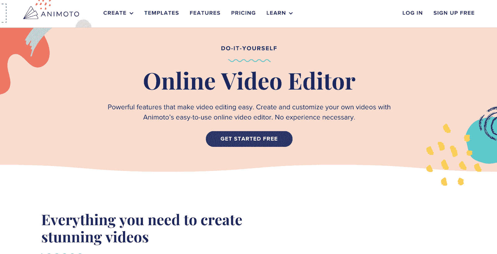

Animoto 是一款简单易用的视频编辑软件。

Animoto 将自己定位为一家提供视频编辑工具的公司，该工具具有“强大的功能，使视频编辑变得简单”

Animoto 是一个在线视频编辑服务，这意味着没有视频编辑应用程序需要下载。相反，你的作品存储在云上，你可以通过浏览器访问软件。这很方便，因为如果你直接下载到硬盘上，一些旧的视频编辑软件会占用大量的内存空间。

Animoto 使用一个基本的拖放编辑器来鼓励快速、直观的视频编辑过程。上传剪辑后，您可以将它们拖到构建器中，通过运动跟踪调整它们的长度，并使用颜色校正来改变视频的外观和感觉。

有一个[徽标水印功能](https://kinsta.com/blog/protect-images/)选项，让您能够上传将出现在您所有视频角落的徽标或图标。这可以帮助你的内容品牌化，使其易于识别。当试图开发有效的资产来为你的企业建立一个在线社区时，这是很重要的。

此外，Animoto 还提供了一个图库，其中包含超过 100 万个视频剪辑，您可以无缝地将其拖放到您的作品中。你还将拥有触手可及的模板、文本、[字体](https://kinsta.com/blog/calligraphy-fonts/)和音乐，让你能够根据自己的品牌定制视频。

### Vimeo 视频制作

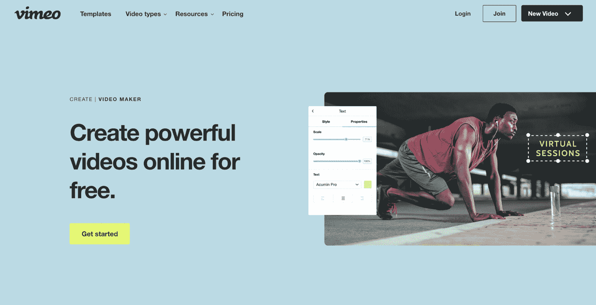

Vimeo 视频制作者

Vimeo 视频制作工具对于初学者来说非常容易使用。这也是一个[基于云的视频](https://kinsta.com/blog/video-hosting/)编辑工具，不需要下载或大量的存储空间。

Vimeo Video Maker 提供了标准在线视频编辑器的所有功能。用户可以浏览 Vimeo Create 的无限股票库，并使用 Vimeo 的免费模板制作宣传片、广告、教育视频等。此外，您可以添加文本、标题、颜色等来个性化您的视频。

Vimeo Video Maker 的独特功能之一是它的视频模板。这些模板使用人工智能“在几分钟内将你的视频缝合在一起。”引导式模板将您的剪辑与标题帧和音乐组合在一起，您可以对其进行个性化设置。只需点击几下，就能为您的视频打下坚实的基础。

Vimeo Video Maker 的另一个好处是能够直接发布到 Vimeo 和其他社交媒体平台。视频编辑工具具有内置的共享功能，允许您选择在哪些网络上共享您的视频。这使得你的视频活动的推广方面更加容易和无缝。
T3】

### clipcamp

[clipcamp](https://clipchamp.com/en/video-editor/)在 200+个国家拥有 1700 万创意用户，并将自己作为 要求 没有编辑经验的工具进行营销。Clipchamp 可以在线访问，这意味着不需要额外的应用程序下载或安装。

这款基于网络的视频编辑器具有高级功能，可轻松创建专业外观的视频。一些最值得注意的是绿屏背景，人工智能画外音，在线屏幕和网络摄像头录制，视频叠加，股票媒体，等等。按钮和选项都有清晰的标签，平台非常容易学习和理解。

如果你苦于没有主意，Clipchamp 有一个由各行各业的专业人士创建的可定制视频模板库。只需更改文本，添加更多的元素和媒体，就可以导出了。无论你是为你的社交媒体账户制作个人视频，还是为商业营销制作公司视频，他们都有适合你的模板。

## YouTube 最好的免费视频编辑软件

有信心将自己的视频上传到 YouTube 上吗？

虽然大多数免费视频编辑软件会帮助你创建可以上传到 YouTube 的东西，但其中两个最好的是 Filmora 和 CyberLink PowerDirector 365。

### Filmora

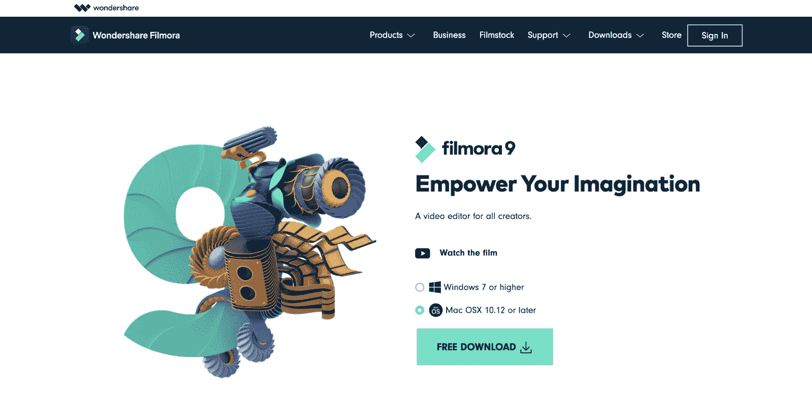

菲尔莫拉

Fillmora 邀请用户“无限制地创造”为了完成这一使命，视频编辑工具试图成为“所有创作者的视频编辑器”凭借易于使用的界面，Filmora 可以成为您创建下一个 YouTube 视频的重要资产。

Filmora 提供了丰富的功能，使其成为一款极具吸引力的视频编辑解决方案。首先，您可以使用多达 100 层的介质。这意味着您的视频中可以同时有多个媒体资源，其中一些在不同的层上与另一些重叠。

Filmora 还使创作者能够添加过渡、视频效果、鱼眼校正、运动图形等，使您的视频更吸引观众。您将有机会将您的视频剪辑与其他媒体分层，包括您在绿色屏幕前拍摄的内容。这将允许您将其他媒体内容粘贴到您身后多余的绿色空间中。

Filmora 提供 4K 视频编辑和快速渲染，使其成为 YouTube 上传的最佳选择。你要确保你只是上传高质量的视频到 YouTube，这样你的品牌就能以最好的方式展示出来。

Filmora 可以提供这些类型的视频以及更多内容。

### CyberLink PowerDirector 365

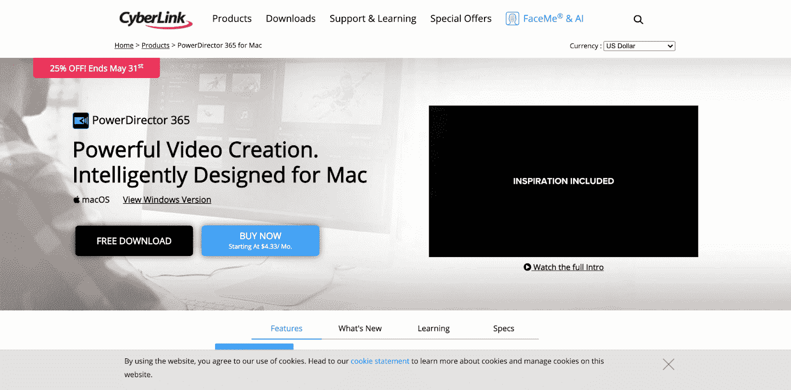

Cyberlink power director 365

CyberLink PowerDirector 365 是另一个有用的视频编辑器，可以在几分钟内制作出 YouTube 视频。该软件与 Mac 和 Windows 都兼容，需要下载到您的系统上才能运行。

拖放界面可以轻松地将剪辑剪切、添加和缝合到一部正片长度的电影中。该软件还有一个视频拼贴设计器，可以让你创建一个画中画风格化的场景。

标题设计器功能提供了大量标题样式供选择。这使得它成为 YouTube 的最佳视频编辑解决方案，因为标题序列是 YouTube 视频的推荐选项(当然也是鼓励选项)。

使用混合模式和遮罩设计器添加过渡，可以将这些字幕序列无缝集成到视频中。

## Windows 10 最好的免费视频编辑软件

您使用的是 Windows 笔记本电脑还是台式电脑？一些视频编辑软件选项在一个操作系统上比在另一个操作系统上效果更好。

对于 Windows 10，我们发现 Adobe Premiere Pro 和 Lightworks 最适合您的视频编辑需求。

### Adobe Premiere Pro

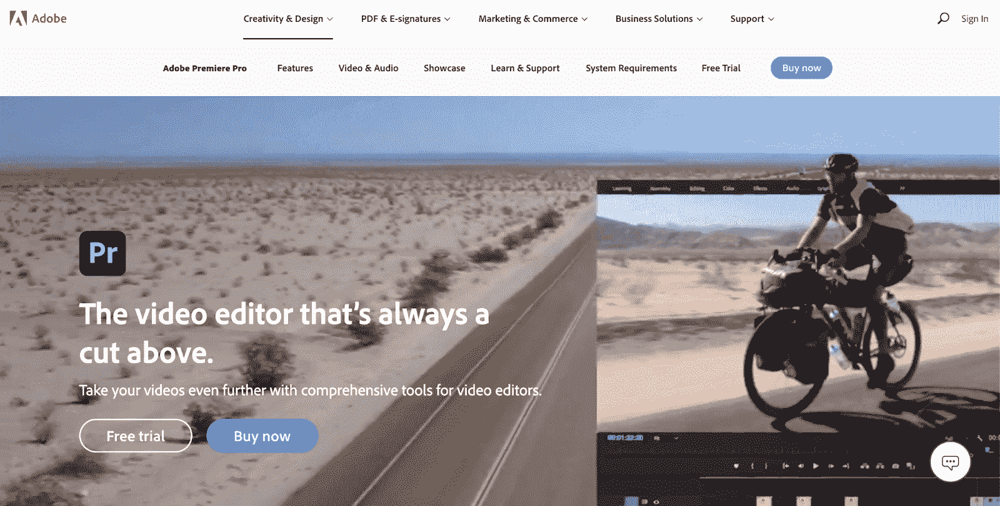

Adobe Premiere Pro

Adobe Premiere Pro 将自己定位为“永远领先的视频编辑器”，我们同意这一点。

## 注册订阅时事通讯

### 想知道我们是怎么让流量增长超过 1000%的吗？

加入 20，000 多名获得我们每周时事通讯和内部消息的人的行列吧！

[Subscribe Now](#newsletter)

Adobe Premiere Pro 是市场上最全面的视频编辑软件解决方案之一。Adobe 也是一个值得信赖的品牌，已经存在了几十年。

Adobe Premiere Pro 的优势在于它可以与其他 Adobe 产品进行本机集成。如果你的技术已经严重依赖于 Adobe 产品，这可能适合你。例如，该软件可以与 Adobe Sensei 集成，以节省您的时间并启动集成的工作流程。

Adobe Premiere Pro 使您能够编辑任何格式的素材，包括从 8K 到虚拟现实。该软件甚至有一个名为 Premiere Rush 的衍生应用程序，让你可以继续在手机上编辑视频。这使得在旅途中编辑内容变得很容易。

### 照明工程

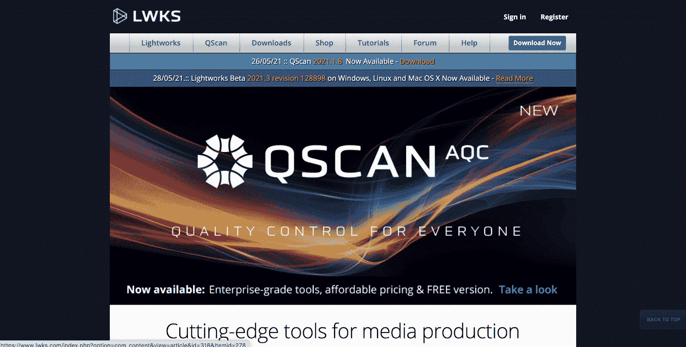

Lightworks 将自己定位为寻找下一个视频编辑解决方案的营销人员的“首选工艺编辑工具”。视频编辑软件使初学者和有经验的编辑人员能够轻松创建引人注目的视频内容。

有许多不同的功能使 Lightworks 从其他竞争对手中脱颖而出。该软件提供社交媒体模板、时间线编辑、实时音频和视频效果以及广泛的文件格式支持。

Lightworks 称之为“强大的资产分组关联”，简化了整个编辑过程这是对剪辑和照片进行分组和标记的过程，以使它们易于找到并放入编辑器中。

使用 Lightworks，您可以轻松导出您的视频，使其与 YouTube 和 Vimeo 兼容，并创建标清、高清甚至 4K 的低分辨率和高分辨率视频。

## 最好的 Mac 免费视频编辑软件

如果你正在使用一个 [Mac 设备](https://kinsta.com/blog/how-to-screenshot-on-mac/)来编辑你的视频，你会想要找到最适合你的设置的视频编辑软件。

在检查了所有与 Mac 兼容的软件后，iMovie 和 Final Cut Pro 脱颖而出，成为我们推荐的两款工具。

### iMovie

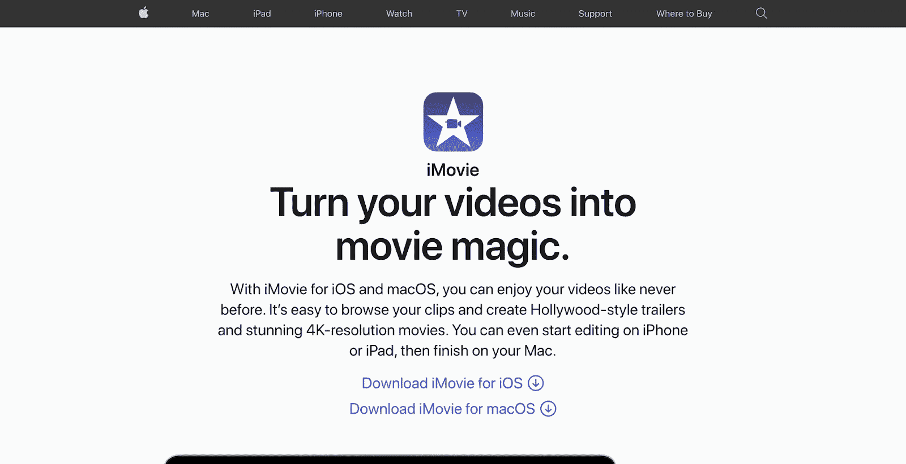

iMovie

T4】

iMovie 邀请用户“将你的视频变成电影魔术”iMovie 是所有 Mac 设备上预下载的标准视频编辑软件。它兼容各种苹果设备，如 iOS 和 macOS。

该软件是基本的，对于试图制作简单、高质量视频的新营销人员来说非常直观。iMovie 提供了 13 种创造性的视频滤镜和 80 多种音频选项，可以智能地适应影片的长度。

此外，还有绿屏效果和预告片模板，可以将您的视频组织成电影预告片。导出后可以直接分享到 YouTube、Vimeo 之类的特定公共频道。

使用 iMovie，您可以轻松拍摄视频剪辑，并在其影音制作中添加视觉效果。对于操作这款软件的 Mac 用户来说，编辑视频轻而易举。虽然编辑功能可能不会太复杂，但界面简单易用，只需在您面前显示必要的功能。

iMovie 的简单性，以及它可能已经下载到您的设备上的事实，使它成为 Mac 用户的最佳选择。

### Final Cut Pro

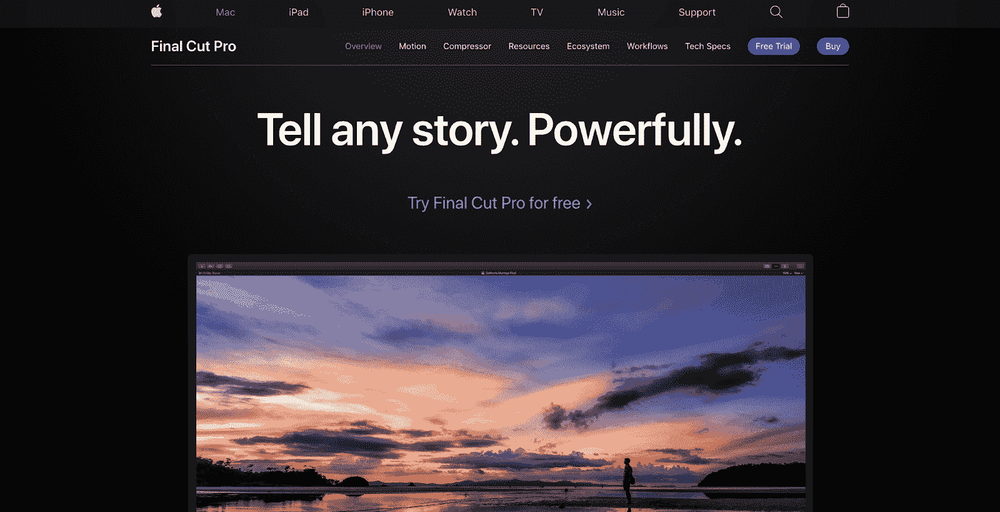

终裁亲

Final Cut Pro 比 iMovie 更复杂，它邀请用户“有力地讲述任何故事”这个视频编辑解决方案具有许多功能，使其成为 macOS 上最全面的视频编辑软件解决方案之一。

Struggling with downtime and WordPress problems? Kinsta is the hosting solution designed to save you time! [Check out our features](https://kinsta.com/features/)

Smart Conform 功能会检查您的剪辑并相应地裁剪它们，以关注视频中的主要元素，并确保它们的大小适合不同的平台。这对于想要在不同的社交媒体平台上发布视频的营销人员来说是非常理想的。由于每个平台都有自己的大小要求，从长远来看，这可以节省很多时间。

用户可以与世界各地的其他 Final Cut Pro 编辑器无缝共享视频内容，并轻松传输他们的 4K 和 8K 影片文件。此外，该软件具有多摄像头编辑功能，允许您以不同的格式、大小和速率匹配多达 64 个角度的视频。这将使你的视频更吸引人，看起来更漂亮。

## 最好的免费视频编辑软件

如果你正在使用 [Linux](https://kinsta.com/blog/linux-commands/) ，有大量的选项可以让你创建引人入胜的视频。

我们推荐的两个选项是 Kdenlive 和 Blender，用于快速、轻松地制作视频。

### Kdenlive

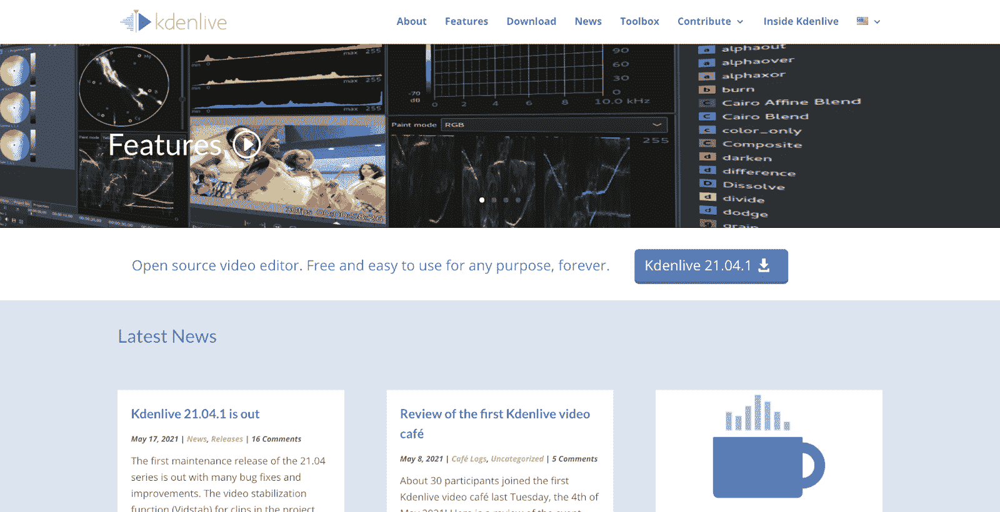

Kdenlive

Kdenlive 是一款开源的视频编辑软件，这意味着它由全球多个开发者共同开发。这使得它成为一个高质量的视频编辑器，具有大量不同的功能和特性。

例如，Kdenlive 具有多轨道编辑功能，允许同时编辑多个音频和视频轨道。此外，它几乎兼容您想要上传到平台的任何音频/视频格式。上传后，您可以使用示波器调整来增加或减少听力计、直方图、波形和矢量示波器。

该平台提供自动备份，因此即使你忘记保存，你也不会丢失任何工作。此外，它还提供代理编辑来修复低分辨率内容，并确保它是您试图制作的视频的质量。Kdenlive 是一个简单易学的视频编辑器，你会很快学会并爱上它。

### 搅拌机

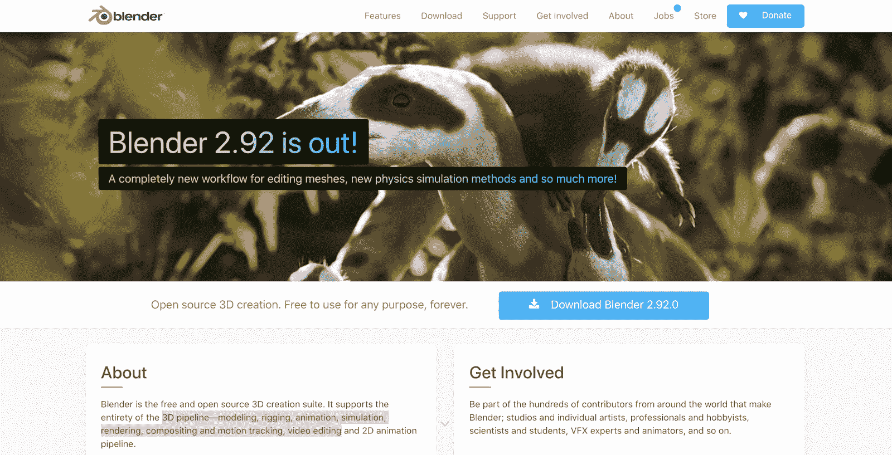

搅拌机

Blender 是一个开源的 3D 视频创作套件，它可以给你的视频带来新的深度和吸引观众的元素。该软件以其 3D 管道而闻名，它提供了从动画到模拟，运动跟踪等一切。

使用 Blender，您可以在有限的时间内创建引人入胜的高质量视频。您将拥有与普通编辑器相同的所有选项，包括 32 个以上的插槽，用于添加视频、图像、音频、遮罩和效果等多媒体内容。您还可以添加过渡、滤镜和图层。

添加内容后，您可以使用速度控制来控制播放速度，混合音频，甚至基于创建的声音创建波形可视化。通过将基本的视频编辑软件功能与 Blender 的 3D 功能相结合，您可以创建一个强大的视频，在更深的层面上激发观众的共鸣。

## 播客最好的免费视频编辑软件

[开始你自己的播客](https://kinsta.com/blog/wordpress-podcast/)？你必须考虑很多事情，比如话题、录音、预定客人等等。

你最不想做的事情就是担心你的视频编辑软件。Magisto 和 Movavi 是两个主要的视频编辑软件解决方案，用于制作播客。

### 马吉斯托

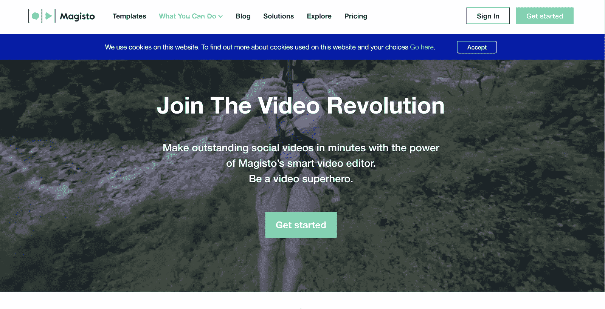

法师

Magisto 是一款视频编辑软件，用户可以“成为视频超级英雄”,在几分钟内制作视频。全球超过 60，000 多名视频编辑使用该软件创建高质量的视频内容。

该公司的智能视频编辑器使用人工智能制作高质量的视频，只需点击几下鼠标。AI video maker 将你的视频和照片编辑成一个故事，将它们串联成一个完整的视频。然后，您可以调整它们并个性化您的内容，以确保它符合您的标准。

Magisto 与 iStock 集成，因此您将拥有数以百万计的库存照片，可以随时使用。当与您的原始视频内容配对时，这些图像将创建一个更动态的视频。

该平台还提供了一个原生播放器，你可以添加到你公司网站上的主机视频框架。这一功能让 Magisto 不仅仅是一个视频编辑器。这是一个全方位服务的视频套件解决方案。

### Movavi

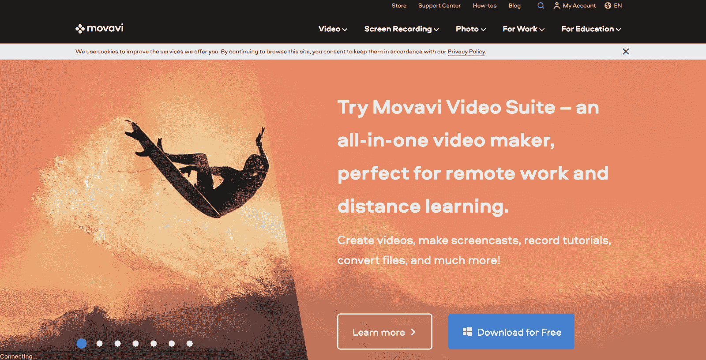

Movavi

Movavi 是一个“多功能视频制作工具”，非常适合制作各种各样的内容。与我们提到的其他产品不同，Movavi 具有屏幕录制和照片编辑功能，为您提供了捕捉原创内容的新方法。

使用 Movavi，您可以使用色度键功能轻松地将剪辑的背景更改为您想要的任何内容。完成编辑后，您可以轻松地将视频导出为各种常用格式。Movavi 估计制作成品大约需要 20 分钟。

它提供了大量的标题序列，过滤器，和过渡选择。这使得创建包含各种序列和元素的令人难忘的 podcast 视频变得容易。通过选择 Movavi，您将创建一个视觉上引人注目的视频播客，您的观众将会喜欢。

## 最好的免费视频编辑软件

现在你已经看到了前 13 名的免费视频编辑软件平台，你可能想知道:总体来说什么是最好的？

虽然这取决于你的使用情况，但 Animoto 确实是最容易使用的软件，有许多特性和功能供你探索。

如果你赶时间，我们建议使用 Vimeo Video Marketer 或 Magisto，利用人工智能技术为你创建和缝合视频。

这将为您提供个性化和编辑内容的基础，使其更接近您的整体愿景。

有了这些视频编辑软件选项，您将踏上[创作引人注目的内容](https://kinsta.com/learn/content-marketing/)的征程，观众将会认可并喜爱这些内容。

[为你的下一个项目寻找合适的视频编辑平台？👨‍💻这份指南涵盖了你📹](https://twitter.com/intent/tweet?url=https%3A%2F%2Fkinsta.com%2Fblog%2Ffree-video-editing-software%2F&via=kinsta&text=Looking+for+the+right+video+editing+platform+for+your+next+project%3F+%F0%9F%91%A8%E2%80%8D%F0%9F%92%BB+This+guide+has+you+covered+%F0%9F%93%B9&hashtags=YouTube%2CVideoEditing)

## 摘要

选择一个免费的视频编辑软件解决方案并不困难。事实上，这很容易，也很有趣。如果你停下来想一想你在你的视频编辑软件中寻找什么，你会有一个更清晰的路线图，你需要使用哪一个。

有了上面列出的 13 个选项，当您开始评估您的视频编辑软件需求时，您将有很多选择。将您的特性和功能愿望清单与我们在本文中概述的有价值的视频编辑解决方案进行交叉比较。

通过为您的企业选择合适的视频编辑软件，您将确保以最有效的方式快速制作高质量、引人入胜的视频。

* * *

让你所有的[应用程序](https://kinsta.com/application-hosting/)、[数据库](https://kinsta.com/database-hosting/)和 [WordPress 网站](https://kinsta.com/wordpress-hosting/)在线并在一个屋檐下。我们功能丰富的高性能云平台包括:

*   在 MyKinsta 仪表盘中轻松设置和管理
*   24/7 专家支持
*   最好的谷歌云平台硬件和网络，由 Kubernetes 提供最大的可扩展性
*   面向速度和安全性的企业级 Cloudflare 集成
*   全球受众覆盖全球多达 35 个数据中心和 275 多个 pop

在第一个月使用托管的[应用程序或托管](https://kinsta.com/application-hosting/)的[数据库，您可以享受 20 美元的优惠，亲自测试一下。探索我们的](https://kinsta.com/database-hosting/)[计划](https://kinsta.com/plans/)或[与销售人员交谈](https://kinsta.com/contact-us/)以找到最适合您的方式。