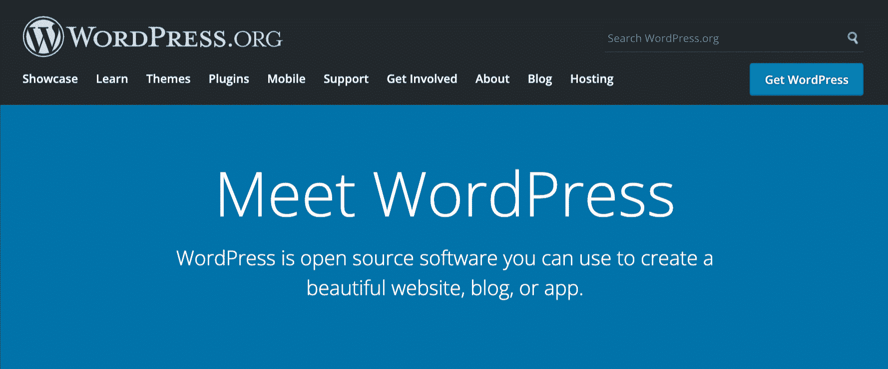
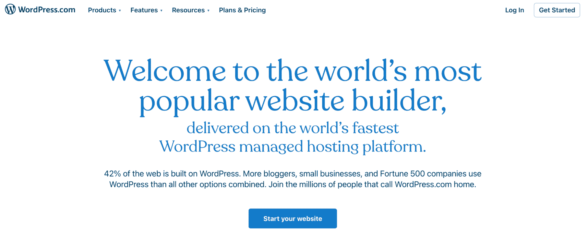
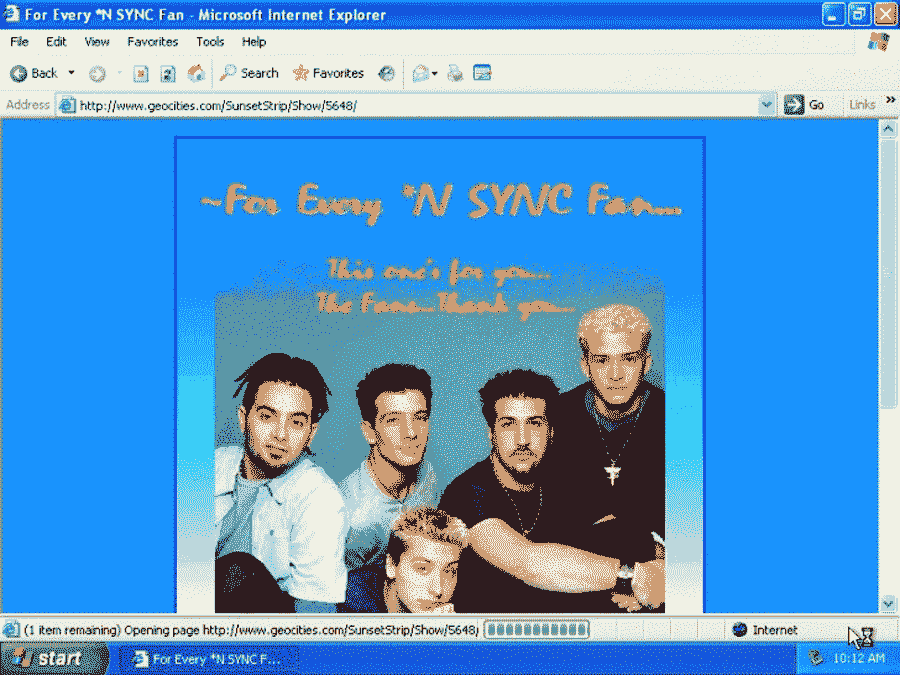
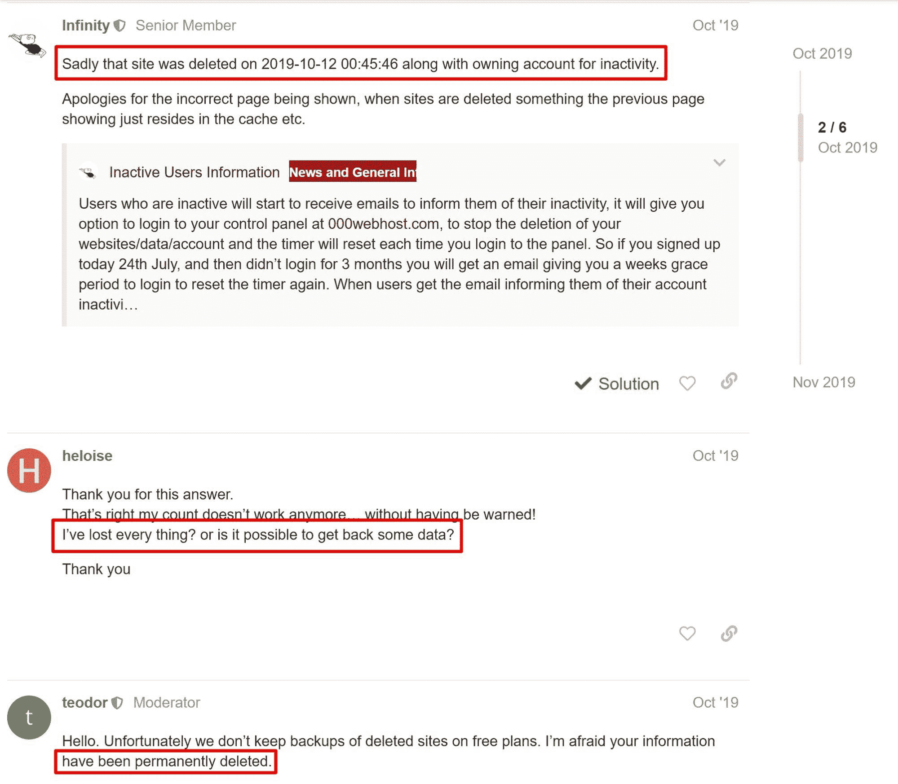

# 免费 WordPress 托管值得吗？需要考虑的 10 个因素

> 原文：<https://kinsta.com/blog/free-wordpress-hosting/>

你已经决定创建一个 WordPress 网站，你清单上的第一件事就是寻找一个托管服务。

世界顶级内容管理系统 WordPress 可以免费使用，但是需要一个网络主机。你可能会发现选择一个虚拟主机提供商很棘手，因为有各种各样的选择。

高级虚拟主机服务通常根据你的服务类型收取月费。

但是如果当你还是这个平台的新手时，有一种方法可以获得免费的 WordPress 托管服务，这不是很方便吗？

一些主机提供商提供免费的 WordPress 主机服务，没有试用期。客户可以自由尝试他们认为合适的虚拟主机服务，并在需要时升级他们的免费 WordPress 虚拟主机计划。

听起来很棒，对吧？

但是免费的 WordPress 托管也有一些主要的缺点。继续阅读，了解更多。

## WordPress 有免费托管吗？

简短的回答是“是的！”WordPress 软件可以免费使用，你可以在 WordPress 下载。然而，它需要一个网络主机来在线查看网站并存储其文件。

> Kinsta 把我宠坏了，所以我现在要求每个供应商都提供这样的服务。我们还试图通过我们的 SaaS 工具支持达到这一水平。
> 
> <footer class="wp-block-kinsta-client-quote__footer">
> 
> 
> 
> <cite class="wp-block-kinsta-client-quote__cite">Suganthan Mohanadasan from @Suganthanmn</cite></footer>

[View plans](https://kinsta.com/plans/)

*WordPress.org homepage. (Image source: [WordPress.org](https://www.wordpress.org/))*

有了 WordPress.org 软件，你可以选择通过注册自己选择的托管计划来建立一个自托管网站。

许多人认为开设一个 WordPress.org 账户很复杂，但事实并非如此。虽然你可以通过创建一个数据库并使用脚本安装程序来手动安装 WordPress，但是一旦你注册了一个虚拟主机计划，大多数虚拟主机都会提供一个点击式 WordPress 安装程序。

如果你不精通技术，你可以选择一个免费的网站建设者为你设置一切。

WordPress 背后的 Automattic 公司通过 WordPress.com 提供了后一种选择。

*WordPress.com homepage (Image source: [WordPress.com)](https://www.wordpress.com/)*

WordPress.com 是一个建立在 WordPress.org 软件上的“网站即服务”。

不需要下载 WordPress 和做任何事情，从搜索和支付虚拟主机提供商，所有你需要做的就是在 WordPress.com 上创建一个网站。

WordPress.com 将免费托管你的网站，并在一定程度上处理一切事务。

WordPress.com 的突出特点包括:

*   无限带宽
*   3 GB 的存储空间
*   免费 [SSL 证书](https://www.ssl.com/faqs/faq-what-is-ssl/)

它还有其他一些优点:

*   简单的设置过程
*   可定制的仪表板和网站，有数百个免费的主题、模板和插件可供选择
*   可作为移动和桌面应用程序

但是也有一些明显的缺点:

*   安装你选择的插件的自由度减少
*   你被一个 com 子域卡住了(在免费计划上)
*   不能直接访问服务器，这意味着你不能通过网站的控制面板连接到 [FTP 文件管理器](https://kinsta.com/blog/best-ftp-clients/)或者管理你的数据库

[Is free WordPress hosting worth it? 👀 Spoiler alert: probably not 😬Click to Tweet](https://twitter.com/intent/tweet?url=https%3A%2F%2Fbit.ly%2F3cltnZ9&via=kinsta&text=Is+free+WordPress+hosting+worth+it%3F+%F0%9F%91%80+Spoiler+alert%3A+probably+not+%F0%9F%98%AC&hashtags=WordPress%2CManagedHosting)

## 为什么有些人选择免费的 WordPress 虚拟主机

为什么人们会选择免费的 WordPress 虚拟主机而不是付费的计划，有不同的原因。一些原因可能是:

*   他们想在不花钱的情况下先试用这项服务
*   免费计划为他们提供了足够的需求
*   他们不经常使用这项服务，也不想每月为网络主机付费

免费的 WordPress 虚拟主机对于那些只想分享内容的非技术通用户来说是一个合理的选择。然而，我们不推荐那些关心他们的 SSD 存储规格或者要求直接访问他们的服务器或者 MySQL 数据库的熟练用户。

我们也不建议你为专业或高流量的网站使用免费的 WordPress 托管，我们将在下面进一步讨论。

## 为什么公司提供免费的 WordPress 托管服务

从商业角度来看，可能很难理解为什么公司会提供免费的 WordPress 托管服务。他们如何赚钱？他们从中获得了什么？

一些企业提供免费的 WordPress 主机作为测试的一部分。他们让用户在上线前试用他们的服务。

也有像 WordPress 这样的公司，WordPress 基金会拥有这些公司，他们可以提供免费的主机服务，作为他们使命的一部分，让每个人都可以使用软件。

对于其他公司来说，免费的 WordPress 托管是他们商业策略的一部分。互联网创业公司通常会提供免费增值的商业模式。这些公司通过提供免费服务来说服用户试用他们的软件，从而与他们的客户群建立关系。

当客户依赖这些免费服务时，他们会尝试在自己的专业知识和核心业务之外追加销售附加服务，如域名注册、额外存储和搜索引擎优化服务。

## 免费 WordPress 托管的典型包含

Web 主机通过提供磁盘空间和带宽来运行。

虚拟主机的基本功能之一是磁盘空间，因为它为网络内容提供存储空间。没有存储空间，您就无法访问您的数字文件，如照片、视频、代码或文本。

WordPress 主机提供商将内容存储在一个非现场的网络服务器上，这个服务器可以是一个物理网络，也可以是 T2 云存储。

虚拟主机的另一个显著特征是带宽，即可以在你的网站、用户和服务器之间传输的数据容量。

有了免费的 WordPress 主机，用户得到有限的磁盘空间和带宽。一些免费的主机提供商也在你的网站上贴广告，并且只提供品牌子域名。

## 在免费和付费 WordPress 主机之间选择时的 10 个考虑因素

免费 WordPress 虚拟主机最明显的优势是不需要为虚拟主机服务付费。这让你可以尝试这项服务，因为它是免费的，你不受合同约束，当你不满意时，你可以离开。

在为你的 WordPress 站点选择虚拟主机方案之前，做好你的研究。查看知名网站和论坛上的评论。始终阅读服务条款(TOS)和细则，以防止签署内容控制权。即使你认为你找到了最好的免费 WordPress 虚拟主机，你也可能最终无法合法拥有你网站上的内容。

根据我们接下来要谈到的十个因素来选择你的主机提供商是最明智的。

### 1.持久

付费虚拟主机提供商倾向于停留更长时间。注册免费 WordPress 虚拟主机时要小心，因为虚拟主机提供商可能某一天还在，第二天就走了，带走你所有的数据。

*A GeoCities website. (Image source: [Mental Floss](https://www.mentalfloss.com/article/525315/15-megabytes-fame-geocities-story))*

雅虎在 2009 年关闭的 GeoCities 就属于这种情况。他们放过了 GeoCities Japan，但最终在 2019 年终止了这项服务。

永久性不仅仅适用于托管服务提供商的消失——这也意味着你的网站可能会突然被删除或者被存档。

例如，当你浏览 [000webhost 的支持论坛](https://www.000webhost.com/forum/t/how-to-restore-archived-website/183683)时，用户会分享他们网站突然被归档的实例。

大多数免费的 WordPress 主机都试图节约资源，所以他们定期对不活跃的网站进行大规模清理。即使您的网站不活跃，您的网站也可能会受到这些清除的影响。

## 注册订阅时事通讯

### 想知道我们是怎么让流量增长超过 1000%的吗？

加入 20，000 多名获得我们每周时事通讯和内部消息的人的行列吧！

[Subscribe Now](#newsletter)

*000webhost support forum. (Image source: [WinningWP](https://winningwp.com/free-wordpress-hosting/))*

为了节省资源，免费虚拟主机提供商可以自动暂停超过内存或处理能力限制的网站。如果第三方或工作人员举报你，你的主人也可以阻止你。

虽然付费主机也可以暂停网站，但他们有经济动机不这么做。有了这些主机提供商，你的数据会安全得多。

### 2.表演

当多个网站共享服务器资源时，它们的性能会受到影响。当一个网站需要的带宽超过可用于处理流量的带宽时，它会用完分配给其他网站的带宽。

免费的 WordPress 虚拟主机已经限制了带宽，允许任何人注册一个虚拟主机账户，这种效果被放大了。

因为性能是不可靠的，你也可以预期[间歇性停机](https://kinsta.com/blog/website-downtime/)，自动 WordPress 备份和电子邮件发送失败，以及网络错误。

付费虚拟主机保证你拥有最新的产品，如 [PHP](https://kinsta.com/blog/php-8-1/) 的[最新版本，它还可以提供其他功能来更好地管理你的网站，如标准控制面板](https://kinsta.com/blog/php-8-1/)的[替代品。](https://kinsta.com/blog/cpanel-alternatives/)

### 3.服务器资源

高级主机公司有资源购买强大的服务器，可以提供无限的磁盘空间和健康的带宽，这是免费主机计划所不能提供的。

免费主机包的资源有限，用户必须在多个网站之间共享。你经常会有[不足的磁盘空间](https://kinsta.com/blog/disk-space-wordpress-hosting/)——有时甚至不够安装 WordPress 插件或 WordPress 主题——和有限的带宽。

可靠的 WordPress 主机服务需要花钱是有原因的。一份[的虚拟主机费用分类表](https://kinsta.com/blog/cheap-wordpress-hosting/)显示，30%用于支付数据中心的服务器空间，而其余的用于其他成本，如营销和支付员工工资。

### 信息

服务器空间和快速稳定的主机基础设施需要花钱，但这是值得的。

### 4.网站速度

由于你通过免费的 WordPress 主机与其他用户共享有限的资源，这意味着[缓慢的网站速度](https://kinsta.com/learn/page-speed/)——特别是当你的服务器上有几个其他网站的时候。

付费主机服务为你提供了多种存储和带宽选择，所以你的[页面可以快速加载](https://kinsta.com/learn/speed-up-wordpress/)。另一方面，有了免费托管包，你别无选择，只能坚持较慢的共享网站速度。

### 5.安全性和数据隐私

安全性和数据隐私可不是闹着玩的。

在过去的几年里，安全漏洞增加了 67% ，[将近一半的美国人](https://www.rsa.com/en-us/company/news/the-dark-side-of-customer-data)说他们的个人信息因数据泄露而受损。

作为一个平台，WordPress 是安全的，但是由于它的流行，它已经成为许多数据泄露的[目标。](https://kinsta.com/blog/wordpress-statistics/#security-statistics)

需要为你的 WordPress 站点提供超快的、可靠的、完全安全的托管服务吗？Kinsta 提供所有这些以及 WordPress 专家提供的 24/7 世界级支持。[查看我们的计划](https://kinsta.com/plans/?in-article-cta)

防止这些攻击的一个方法是选择一个可靠的网络主机。许多付费虚拟主机服务提供隐私工具来保护你的网站安全。

预计免费虚拟主机会忽略安全功能，如 [DDoS 保护](https://kinsta.com/blog/ddos-attack/)、[防火墙](https://kinsta.com/blog/what-is-a-firewall/)和主动插件漏洞检查，因为主机资源已经越来越少。

运行一个安全的主机基础设施需要花钱，所以免费提供服务的公司在重要的安全功能上节省开支。
T3】

### 6.最新技术

同样的，你[需要更新](https://kinsta.com/blog/wordpress-version/) [插件、主题和核心来保证你网站的安全。你还需要确保你的网站使用最新的技术。](https://kinsta.com/blog/wordpress-version/)

例如，PHP 5.6、7.0、7.1 和 7.2 [没有获得安全修复](https://www.php.net/supported-versions.php)，这意味着如果你想保持你的 WordPress 网站安全，你至少需要使用 PHP 7.3。

不幸的是，大多数免费的 WordPress 主机不提供任何超过 [PHP](https://kinsta.com/blog/php-versions/) [7.0](https://kinsta.com/blog/php-versions/) 的东西[，这让你的网站存在潜在的漏洞。](https://kinsta.com/blog/php-versions/)

### 7.客户支持

新网站所有者在建立他们的第一个网站时，通常需要大量的技术支持，这是免费的 WordPress 主机无法保证的。

如果你需要帮助和故障排除，注册一个高级 WordPress 计划。最好的公司有客户支持代理，他们通过电子邮件、电话或聊天来回答问题。他们还提供一个充满视频、文章和教程的知识库，教你如何建立一个用户友好的网站。

### 8.广告和子域

免费增值模式通常赚钱的方式之一是通过广告收入。当使用免费的 WordPress 虚拟主机时，你会看到你的网页上到处都是广告，这会吓跑访问者。

### 信息

一些网站，如专业新闻媒体，可能会选择使用广告来抵消成本或增加收入。

*Ads on the Forbes homepage. (Image source: [Forbes](https://www.forbes.com/))*

撇开审美问题不谈，你必须警惕这些托管平台放在你网站上的广告。它们可能是直接竞争对手的广告，也可能是你觉得不合适的内容。

有时，网络罪犯甚至可能从广告网络购买广告空间，并提交受感染的图像。

免费虚拟主机通常会附带一个免费的[子域](https://kinsta.com/blog/wordpress-subdomain/)，比如“mysitename.wordpress.com”。如果你想显得专业，你需要[购买一个](https://kinsta.com/blog/choose-domain-name/) [自定义域名](https://kinsta.com/blog/choose-domain-name/)。

没有你的领域是一个倒胃口。人们会质疑你的声誉，怀疑你是否有能力支付托管费用，或者你是否足够认真地对待你的服务。

高级计划通常包括免费的域名注册、定制电子邮件账户，而且没有广告。

### 9.SEO 注意事项

如果性能、安全和速度的劣势还不够，使用免费网站托管会在多个方面对搜索引擎优化产生负面影响:

*   **缓慢的网站速度**导致缓存问题和更长的页面加载时间，对用户体验产生负面影响。
*   **差** [域权限](https://blog.hubspot.com/marketing/domain-authority)**【DA】**通过在一个子域上托管自己的网站。
*   **安全问题**缺乏保护，这可以[阻止谷歌的搜索爬虫](https://www.searchenginejournal.com/web-security-impact-on-seo/272069/)访问你的网站。

### 10.易于迁移

如果你决定离开你的虚拟主机，著名的虚拟主机提供商会让数据传输变得容易，这样你就可以轻松地迁移到另一个平台。

免费的主机提供商可能不那么亲切。记住，他们从你页面上的广告中赚钱——他们为什么要放你走？

## 如何升级到高级 WordPress 主机

如果在阅读了上面的注意事项后，你对免费主机所能提供的特性感到满意，那么就没有理由改变。

然而，一旦你的网站开始带来更多的流量，或者你希望扩展功能，你可能会考虑升级到一个高级的 WordPress 主机，比如 Kinsta。

廉价的 WordPress 托管服务有其自身的缺点，从长远来看，比大多数优质解决方案花费更多。阅读我们关于 it 的[深度文章](https://kinsta.com/blog/cheap-wordpress-hosting/)了解原因。

Kinsta 的[托管 WordPress 托管计划](https://kinsta.com/wordpress-hosting/plans/)是为 WordPress 量身定制的。我们经验丰富的 WordPress 开发者团队已经提出了一个优质的托管解决方案，包括你所期望的云托管的所有速度和规模优势。

最重要的是，我们的计划不含广告，对开发者友好，包括以下内容:

*   免费 WordPress 安装
*   免费 SSL 证书
*   企业 Cloudflare 集成
*   DDoS 保护
*   [暂存环境](https://kinsta.com/help/staging-environment/)
*   [免费](https://kinsta.com/cloudflare-integration/) [CDN](https://kinsta.com/cloudflare-integration/)
*   每日备份
*   全天候正常运行时间监控
*   客户支持
*   访问知识库和教程
*   正常运行时间保证

当你准备好做出改变时，Kinsta 还提供来自所有主机提供商的免费[基本网站迁移](https://kinsta.com/wordpress-migration/)，包括 Bluehost、SiteGround、DreamHost、HostGator 和 GoDaddy。

[Saving money = great. 💸 Performance and UX issues= not so great. 😅 See the real cost of free managed hosting right here ⬇️Click to Tweet](https://twitter.com/intent/tweet?url=https%3A%2F%2Fbit.ly%2F3cltnZ9&via=kinsta&text=Saving+money+%3D+great.+%F0%9F%92%B8+Performance+and+UX+issues%3D+not+so+great.+%F0%9F%98%85+See+the+real+cost+of+free+managed+hosting+right+here+%E2%AC%87%EF%B8%8F&hashtags=WordPress%2CWordPressHosting)

## 摘要

运行良好的免费 WordPress 主机是例外，而不是常态。

无论你是博客写手还是电子商务企业，如果你认为选择免费的 WordPress 托管服务可以省钱，那你就大错特错了。您将花费大量的时间、资金和精力来解决与安全性、性能和整个网站可靠性相关的问题。

如果你对你的 WordPress 站点很认真，最好支付一个托管计划。可以把月租费看作是对易用性、更好的性能、安全性和安心的小小投资。

还在犹豫要不要尝试托管 WordPress 主机？在下面的评论区分享你的想法吧！

* * *

让你所有的[应用程序](https://kinsta.com/application-hosting/)、[数据库](https://kinsta.com/database-hosting/)和 [WordPress 网站](https://kinsta.com/wordpress-hosting/)在线并在一个屋檐下。我们功能丰富的高性能云平台包括:

*   在 MyKinsta 仪表盘中轻松设置和管理
*   24/7 专家支持
*   最好的谷歌云平台硬件和网络，由 Kubernetes 提供最大的可扩展性
*   面向速度和安全性的企业级 Cloudflare 集成
*   全球受众覆盖全球多达 35 个数据中心和 275 多个 pop

在第一个月使用托管的[应用程序或托管](https://kinsta.com/application-hosting/)的[数据库，您可以享受 20 美元的优惠，亲自测试一下。探索我们的](https://kinsta.com/database-hosting/)[计划](https://kinsta.com/plans/)或[与销售人员交谈](https://kinsta.com/contact-us/)以找到最适合您的方式。