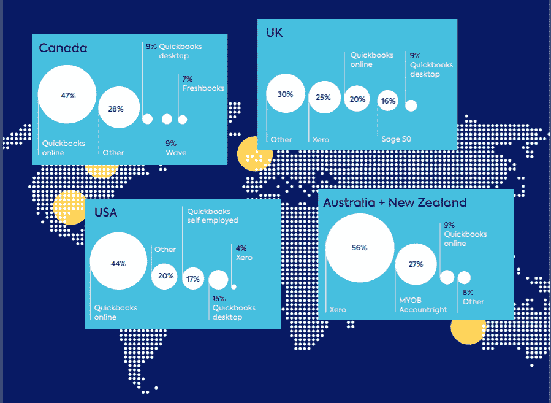
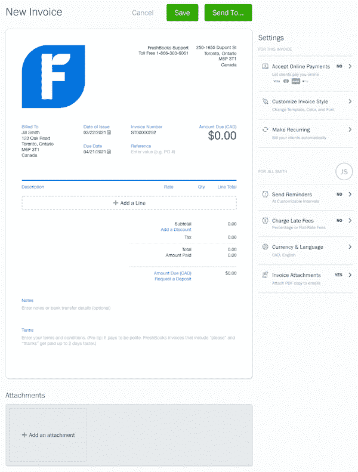
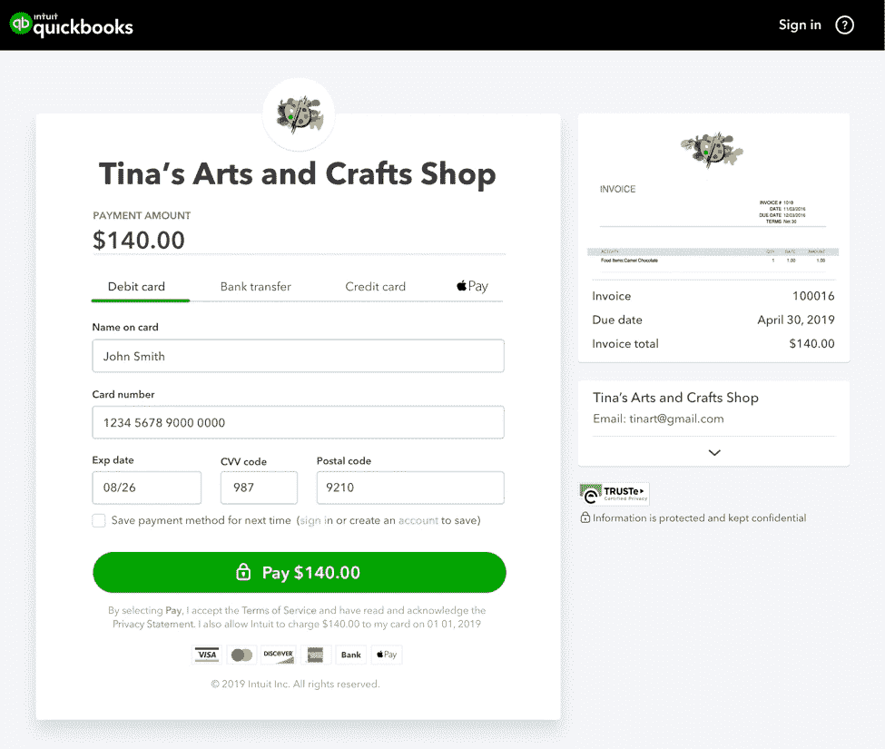
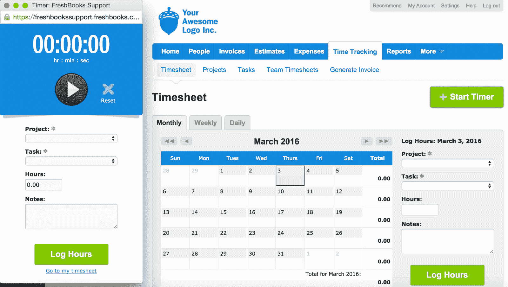
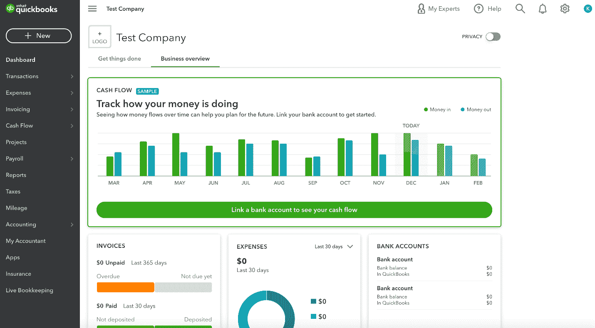
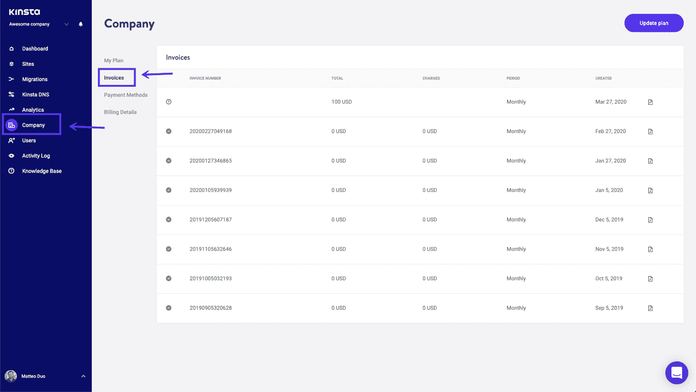

# FreshBooks vs QuickBooks:自由职业者和代理机构哪个更好？

> 原文：<https://kinsta.com/blog/freshbooks-vs-quickbooks/>

作为一名小企业主，你最喜欢的部分是什么？

以下是一些你可能没有说的事情:准备发票、填写费用报告、支付账单或跟踪你的工作时间。

不幸的是，自由职业者和机构所有者都无法逃避这些繁琐的会计工作。但是基于云计算的会计软件可以让他们轻松很多。

但是你应该选择哪种在线会计软件呢？

QuickBooks 是市场上最知名的会计软件，但它有很多竞争对手。对于像您这样的小型企业来说，这是最佳解决方案吗？本文将 QuickBooks 与另一个流行的选择 FreshBooks 进行了比较。

请继续阅读这篇广泛的 Freshbooks vs QuickBooks 帖子，以确定自由职业者和代理商的更好选择。

## QuickBooks 概述

游戏中最重要的玩家(至少在北美)是 [QuickBooks](https://quickbooks.intuit.com/) 。

> 需要在这里大声喊出来。Kinsta 太神奇了，我用它做我的个人网站。支持是迅速和杰出的，他们的服务器是 WordPress 最快的。
> 
> <footer class="wp-block-kinsta-client-quote__footer">
> 
> 
> 
> <cite class="wp-block-kinsta-client-quote__cite">Phillip Stemann</cite></footer>

[View plans](https://kinsta.com/plans/)

QuickBooks 是由软件巨头 Intuit 开发的，该公司拥有 TurboTax 和 Mint 等金融产品。

Intuit 自 1983 年以来一直存在，并于 1992 年发布了 QuickBooks。该产品的云版本 QuickBooks Online (QBO)于 2001 年问世。

今天，包括在线和桌面版本在内的 QuickBooks 产品在美国拥有 76%的市场份额。

QuickBooks global market share. (**Source:** [Codat](//www.codat.io/us/report/codats-guide-to-the-accounting-software-market-2020/%E2%80%9D))

本文将关注在线 QuickBooks。QBO 的特色包括:

*   货品计价
*   收入和支出跟踪
*   账单管理
*   里程跟踪
*   时间跟踪
*   存货管理
*   损益报告
*   自动化网上银行

[What’s your favorite part about being a small business owner? 👩‍💻 Probably not preparing invoices, filling out expense reports or paying bills. 😅 Get help with these popular accounting tools! 👇Click to Tweet](https://twitter.com/intent/tweet?url=https%3A%2F%2Fkinsta.com%2Fblog%2Ffreshbooks-vs-quickbooks%2F&via=kinsta&text=What%E2%80%99s+your+favorite+part+about+being+a+small+business+owner%3F+%F0%9F%91%A9%E2%80%8D%F0%9F%92%BB+Probably+not+preparing+invoices%2C+filling+out+expense+reports+or+paying+bills.+%F0%9F%98%85+Get+help+with+these+popular+accounting+tools%21+%F0%9F%91%87&hashtags=QuickBooks%2CSmallBiz)

## 新书概览

新书于 2003 年首次发行。Mike McDerment 经营着一家四人设计机构，他对可用的发票解决方案感到沮丧。所以他创造了一个更好的。

FreshBooks 仍然非常关注个体经营者。尽管它在美国只有 4%的市场份额，但它在自由职业者和小企业中有着良好的声誉。

功能包括:

*   货品计价
*   收入和支出跟踪
*   时间跟踪
*   图像和文件共享
*   信用卡支付和银行存款
*   报表生成
*   里程跟踪

## 新书 vs QuickBooks 定价

您正在为您的企业寻找最好的会计软件。

但是作为一个自由职业者或小企业主，你也必须注意价格。

### 新书定价计划

*   精简版:15 美元/月
*   另外:每月 25 美元
*   保险费:50 美元/月
*   选择自定义定价

如果你选择按年计费而不是按月计费，你可以节省一些钱。还有 30 天的免费试用期——不需要信用卡。

计划中最重要的区别是你可以拥有多少付费客户。Lite 计划只允许你给 5 个客户开发票，而 Plus 计划允许你给 50 个客户开发票。高级，并选择允许无限的客户端。

### QuickBooks 定价计划

*   简单的开始:每月 25 美元
*   必需品:50 美元/月
*   另外:每月 80 美元
*   高级:每月 180 美元
*   台式机专业版:349 美元/年

这些价格假设你有 30 天的免费试用期。如果你选择放弃试用，你可以享受三个月 50%的折扣。

QuickBooks 不像 FreshBooks 那样限制你的客户。但是，它会限制您的帐户上可以拥有的用户。使用简单启动，您只有一个用户。Essentials 计划包括三个用户，Plus 允许五个用户，Advanced 允许 25 个用户。

时间跟踪和库存管理是简单启动计划中缺少的两个更重要的功能。你需要有基本计划或更高的计划来跟踪时间。对于库存管理，您至少需要 Plus。

那么哪个方案定价更好呢？

如果你是一名自由职业者或只向五个客户收费的代理人，FreshBooks Lite 可能会提供你需要的所有功能，这是迄今为止最便宜的方案。

即使你给 50 个客户开账单，FreshBooks Plus 也和 QuickBooks Simple Start 一样便宜，而且 FreshBooks Plus 会给你提供跟踪时间的能力。

如果你有超过 50 个客户，你必须每月支付 50 美元才能获得 FreshBooks Premium。

在这一点上，如果你不需要时间跟踪，QuickBooks 简单启动是更实惠的选择。如果您需要时间跟踪，FreshBooks Premium 和 QuickBooks Essentials 计划价格相同。

### 自由职业者

还有一个名为 QuickBooks Self-employee(QBSE)的 QuickBooks 版本，每月 15 美元。这在技术上独立于 QBO，尽管它也是基于云的产品。

QBSE 非常基础，它的开票能力有限。它擅长提供税务帮助，但缺乏大多数企业主需要的会计功能。
T3】

## FreshBooks 与 QuickBooks 功能对比

QuickBooks 和 Freshbooks 有许多相似的功能，但有一些关键的区别。

让我们来看看您在选择会计软件时要考虑的主要特性。

### 货品计价

FreshBooks 发票易于使用。

您可以从可定制的发票模板开始，选择您的发票徽标、颜色和字体。

FreshBooks invoice.

FreshBooks 可以自动完成许多繁琐的发票工作，如设置重复发票或发送逾期付款提醒，以及申请滞纳金。

如果您将工时标记为可计费，发票可以直接从时间跟踪功能中提取数据。

在很大程度上，QuickBooks Online 提供了类似的发票功能。发票是可定制的，并有多种自动化选项。

对于没有多少会计软件经验的人来说，FreshBooks invoicing 更容易使用。另一方面，QBO 更适合大型企业的需求，比如批量开具发票。

虽然 QuickBooks 可以自动将时间跟踪数据添加到发票中，但该功能只有在您拥有 Essentials 计划的情况下才可用。

这两个解决方案都是很棒的发票软件，但 FreshBooks 对自由职业者来说有一点优势，因为它易于使用，并且集成了时间跟踪功能。

### 费用跟踪

QuickBooks 和 FreshBooks 提供非常相似的费用追踪。

两者都可以连接到你的银行账户和信用卡，这样你的账本就可以自动更新你最近的消费。QuickBooks 还可以连接到您的 PayPal 账户。

您可以通过给收据拍照来将费用添加到 QuickBooks 和 FreshBooks 中。这两个平台都可以将你的支出归类到税收优惠的类别中。

如果您将费用标记为可计费，您可以在 FreshBooks 或 QuickBooks 上将它们纳入客户发票。

除非 PayPal 整合对你的业务至关重要，否则没有明显的赢家。

### 客户付款

你最不希望看到的就是你的客户努力付钱给你。

幸运的是，QuickBooks 和 FreshBooks 都使客户支付变得容易。他们都接受信用卡，银行转账和贝宝。两者都允许你给你的客户发送一封带有支付发票链接的电子邮件。

他们都收取交易费来收取款项。金额相似:

*   **FreshBooks** :所有信用卡交易的 2.9% + $0.30，美国运通除外，为 3.5% + $0.30。ACH 转账 1%。

*   **QuickBooks** :在线信用卡每笔交易 2.9% + $0.25，刷卡信用卡每笔交易 2.4% + $0.25，键入卡每笔交易 3.4% + $0.25。每笔 ACH 转账收取 1%的费用。

QuickBooks 有一个时尚的在线支付门户。

QuickBooks online payment portal.

然而，由于其结账链接功能，FreshBooks 赢得了在线支付。结帐链接是独特的支付链接，让您无需发票即可在线付款。

将这些链接添加到您的网站或社交媒体的便利性使其在在线支付方面领先于 QuickBooks。

QuickBooks 有更好的当面收款方式。你甚至可以额外付费获得一个 QuickBooks 移动信用卡阅读器。

FreshBooks 还通过一个高级支付插件提供一些电话和亲自支付选项，但 QuickBooks 仍然是实体企业更强大的解决方案。

### 存货管理

直到最近，FreshBooks 才拥有任何本地库存管理功能，尽管它确实集成了一些第三方库存管理应用程序。

这在 2020 年发生了变化。

现在 FreshBooks 提供简单的库存跟踪。您可以保留一份更新的库存清单，当您为某个项目开具发票时，其库存数量会自动减少。

QuickBooks 库存管理通过出色的报告和分析超越了跟踪。你可以很容易地看到你的畅销书，总销售额，或税收。如果一件商品快卖完了，你也可以收到库存不足的通知。

QuickBooks 是管理库存的更好选择。

### 时间跟踪

每个 FreshBooks 计划为整个团队提供无限的时间跟踪。

您可以记录特定客户的计费时间，并自动将该时间添加到客户发票中。

FreshBooks time tracking.

更贵的 QuickBooks 计划也提供时间跟踪。然而，FreshBooks 时间跟踪是为自由职业者设计的，而 QuickBooks 更适合大型销售团队。

对于需要时间追踪的自由职业者来说，FreshBooks 是一个明确的选择。

### 报告

通过报告，您可以深入了解交易细节，或者全面了解公司的财务状况。

FreshBooks 一如既往地提供了直观、用户友好的体验。您可以生成七种 FreshBooks 报告:

1.  发票详细信息
2.  费用明细
3.  损益
4.  帐龄帐户
5.  税务汇总
6.  已收款

使用 QuickBooks，您可以使用的报告取决于您的计划。但是，即使是最便宜的简单启动选项，也会提供几十个报告。

## 注册订阅时事通讯

### 想知道我们是怎么让流量增长超过 1000%的吗？

加入 20，000 多名获得我们每周时事通讯和内部消息的人的行列吧！

[Subscribe Now](#newsletter)

简单入门提供的 QuickBooks 报告的不完整列表包括:

*   资产负债表
*   损益占总收入的百分比
*   按客户划分的损益
*   现金流量表
*   按客户销售汇总
*   按供应商列出的交易列表

QuickBooks dashboard.

虽然我们很欣赏 FreshBooks 提供的直截了当的报告，但我们不得不把这个交给 QuickBooks。

### 集成

FreshBooks 和 QuickBooks 都提供了大量的第三方集成库。

这些平台相当均衡——最佳解决方案将是集成了您的业务需求的解决方案。

看看完整的新书列表vs[QuickBooks](https://quickbooks.intuit.com/online/integrations/)来决定。

一些流行的 FreshBooks 集成包括:

*   **Shopify:** 自动将您的客户和订单同步到 FreshBooks
*   **Zoom:** 自动将您的会议记录放入 FreshBooks，并用于客户计费
*   **Gmail:** 将 Gmail 联系人添加为客户，直接从您的 [Gmail 帐户](https://kinsta.com/blog/gmail-add-ons/)创建发票并通过电子邮件发送。

虽然 QuickBooks 提供:

*   **Shopify:** 将您的 Shopify 销售与 QuickBooks 整合
*   **亚马逊业务:**在 QuickBooks 中跟踪亚马逊业务购买
*   **Fathom:** 利用预算、预测和财务仪表板

### 移动的

如果您不在电脑旁时想查看仪表盘或更新发票，该怎么办？

新鲜书和 QuickBooks 的移动产品基本相同。它们都提供适用于 Android 和 iOS 的移动应用。它们在发票创建、费用跟踪、里程跟踪和仪表板等功能上大致相当。

FreshBooks 应用程序的一个很酷的功能是在应用程序内回复客户的问题和反馈。

除非这个功能对你来说是必不可少的，否则 QuickBooks 和 FreshBooks 在移动类别中有着同样强劲的表现。

### 易用性

FreshBooks 以用户友好著称。为了证明它名副其实，我们可以求助于软件评测网站 G2 和 Capterra。

G2 对 QuickBooks 的易用性评分为 8.1 分，而 FreshBooks 的评分为 9.2 分(T3)。在 Capterra 上，QuickBooks 在易用性类别中获得了 [4.1](https://www.capterra.com/p/141374/QuickBooks-Online/#reviews) 。FreshBooks 以 [4.5](https://www.capterra.com/p/142390/FreshBooks/#reviews) 再次胜出。

这两个软件程序都有相对直观的界面，但 FreshBooks 对初学者更友好。

### 可量测性

如果你是一个个体企业家或有一个小企业，并打算保持小规模，FreshBooks 有你需要的功能。

但是一个正在扩张的企业可能会很快发展不起来。

如果你设想有几个以上的员工或者需要给数百个客户开发票，QuickBooks 可能是赢家。

### 客户支持

FreshBooks 通过电话和电子邮件提供支持。QuickBooks 提供电话、实时聊天和应用程序内支持。

两者都有广泛的知识基础。

为了找出哪个应用程序具有更好的客户支持，我们可以回到 G2 和 Capterra。

同样，新书在这两个网站上都获得了更好的评价。在 G2 上，QuickBooks 的支持评级为 7.5，而 FreshBooks 的支持评级为 9.2。Capterra 给了 QuickBooks 3.9，FreshBooks 4.4。

### 其他功能

FreshBooks 和 QuickBooks 中的功能太多，无法完全涵盖本文。上面已经介绍了主要的区别，但是根据您业务的需要，您可能需要考虑更多的事情。

涡轮增压您的网站，享受我们的资深 WordPress 团队的 24/7 支持。我们的谷歌云驱动的基础设施侧重于可伸缩性、性能和安全性。[查看我们的计划](https://kinsta.com/plans/?in-article-cta)

#### 多种货币

如果你要处理多种货币，你会希望会计软件来处理。FreshBooks 在所有价位都有多币种功能。QuickBooks 从基本计划开始提供。

#### 工资单

如果你有员工，你可能会寻找工资软件。Payroll 是 QuickBooks 的附加软件，每月付费。

FreshBooks 不提供薪资软件，尽管它确实集成了一些薪资工具。

#### 付账单

QuickBooks 和 FreshBooks 都允许你用软件支付公司的账单。

在这两种情况下，您都可以选择每月 50 美元的套餐——QuickBooks Essentials 和 FreshBooks Premium。

## FreshBooks vs QuickBooks:2022 年你该选哪个？

最佳的会计解决方案取决于您的个人需求。

但是对于典型的自由职业者或代理商来说，我们认为在新书和 QuickBooks 之间有一个明确的选择。

### QuickBooks 的利与弊

QuickBooks online 主宰市场是有原因的。

**QuickBooks 优点:**

*   可攀登的
*   适合各种规模企业的功能
*   库存管理能力
*   广泛报道

**QuickBooks 缺点:**

*   缺少重要功能的较低价格层
*   不如新书直观

### 新书的利弊

FreshBooks 是为个体经营者提供的优秀会计软件，这是当之无愧的。

**FreshBooks 优点:**

*   使用方便
*   强大的客户支持
*   负担得起的价格
*   时间跟踪

**新书缺点:**

*   限制计费客户
*   缺乏面向大型企业的功能

### 新书 vs QuickBooks:判决

对于大多数自由职业者和机构来说，FreshBooks 是更好的选择。

对于小企业来说，它非常划算，并能提供大多数个体企业家或代理机构所需的一切。它还以用户友好而闻名——对于那些想花时间经营企业，而不是学习成为会计师的人来说，这是必不可少的。

也就是说，对于一些小企业来说，QuickBooks 将是更好的选择。例如，如果出现以下情况，请选择 QuickBooks:

你有一个喜欢 QuickBooks 的会计。

QuickBooks 通常是会计的首选软件。它已经存在很久了，比其他任何解决方案都被更多的企业使用，所以他们已经习惯了。

有些会计师只会用 QuickBooks。在这种情况下，最好还是顺着他们的喜好。

你经营着一家实体店和/或拥有一件实物产品。

如果你的公司销售实体产品，QuickBooks 的库存管理功能会派上用场。

但是请记住，除非你每月为 QuickBooks Plus 支付 80 美元，否则你无法获得这些功能。

如果这不是你想做的投资，FreshBooks 提供所有计划的基本库存跟踪。

你计划长很多。

QuickBooks 是大型企业更好的解决方案。如果你的志向不仅仅是经营一家小公司，QuickBooks 是值得考虑的。

## 新书 vs QuickBooks vs .替代品

QuickBooks 和 FreshBooks 并不是自由职业者唯一的会计软件选择。以下是更多的首选:

### 鑫元鸿（台湾公司名

Xero 是一个基于云的会计解决方案，提供了一套类似于 QuickBooks 和 FreshBooks 的功能。

它在北美不像 QuickBooks 那样受欢迎，但在欧洲、澳大利亚和新西兰有很大的市场份额。

Xero 以其吸引人和直观的用户界面而闻名。这也是一个非常可扩展的解决方案，最便宜的计划每月只需 9 美元。然而，Xero 通常比自由职业者和机构更受中型企业的欢迎。

### 波浪

一些自由职业者和代理商不想要 QuickBooks 和 FreshBooks 提供的所有花哨功能。

他们只是想要一个简单高效的工具。免费的话还能加分。

Wave 是一款满足这一需求的会计应用。

有了 Wave，你可以获得开发票、费用跟踪、在线支付等基本工具。你找不到像时间跟踪和库存管理这样的高级功能。

没有月租费，大多数功能都是免费的，但使用支付功能需要支付交易费。

### Sage 云

[Sage 50cloud](https://www.sage.com/en-us/products/sage-50cloud/) 是另一款面向小型企业的会计解决方案。

它突出的一个方面是其先进的库存管理功能。如果您有大量库存，这可能是比 QuickBooks 更好的解决方案。此外，即使使用比 QuickBooks Online Plus 更便宜的 Sage 50cloud 最基本的计划，您也可以获得这些功能。

## Kinsta 内置发票

FreshBooks 和 QuickBooks 让会计工作变得简单了一些。金斯塔也可以。

Kinsta 提供了一个按用户计费的自动发票系统,让您可以完全控制发票的接收方。如果您在 Kinsta 帐户上管理多个用户，您可以确保所有发票在月底自动发送到多个电子邮件地址。

您可以在 [MyKinsta](https://my.kinsta.com/) 仪表盘中查看您的发票。

Invoices on the MyKinsta dashboard.

[Make managing your small business easier than ever before with help from one of these popular accounting software options 👩‍💻Click to Tweet](https://twitter.com/intent/tweet?url=https%3A%2F%2Fkinsta.com%2Fblog%2Ffreshbooks-vs-quickbooks%2F&via=kinsta&text=Make+managing+your+small+business+easier+than+ever+before+with+help+from+one+of+these+popular+accounting+software+options+%F0%9F%91%A9%E2%80%8D%F0%9F%92%BB&hashtags=SmallBusinessTips%2CSmallBiz)

## 摘要

开发票、记账、接受付款、跟踪支出和其他会计任务不必如此繁琐。QuickBooks 和 FreshBooks 是可以让你经营自己的生意更容易的解决方案。

然而，在 FreshBooks 和 QuickBooks 之间做出选择可能会很乏味。我们希望这篇文章能帮助你做出更好的决定。

它们都是可靠的选择，但我们不得不推荐 FreshBooks 作为 2022 年自由职业者和机构的最佳会计软件。

* * *

让你所有的[应用程序](https://kinsta.com/application-hosting/)、[数据库](https://kinsta.com/database-hosting/)和 [WordPress 网站](https://kinsta.com/wordpress-hosting/)在线并在一个屋檐下。我们功能丰富的高性能云平台包括:

*   在 MyKinsta 仪表盘中轻松设置和管理
*   24/7 专家支持
*   最好的谷歌云平台硬件和网络，由 Kubernetes 提供最大的可扩展性
*   面向速度和安全性的企业级 Cloudflare 集成
*   全球受众覆盖全球多达 35 个数据中心和 275 多个 pop

在第一个月使用托管的[应用程序或托管](https://kinsta.com/application-hosting/)的[数据库，您可以享受 20 美元的优惠，亲自测试一下。探索我们的](https://kinsta.com/database-hosting/)[计划](https://kinsta.com/plans/)或[与销售人员交谈](https://kinsta.com/contact-us/)以找到最适合您的方式。