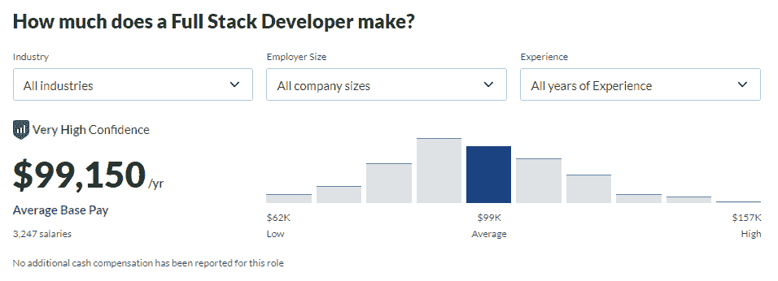
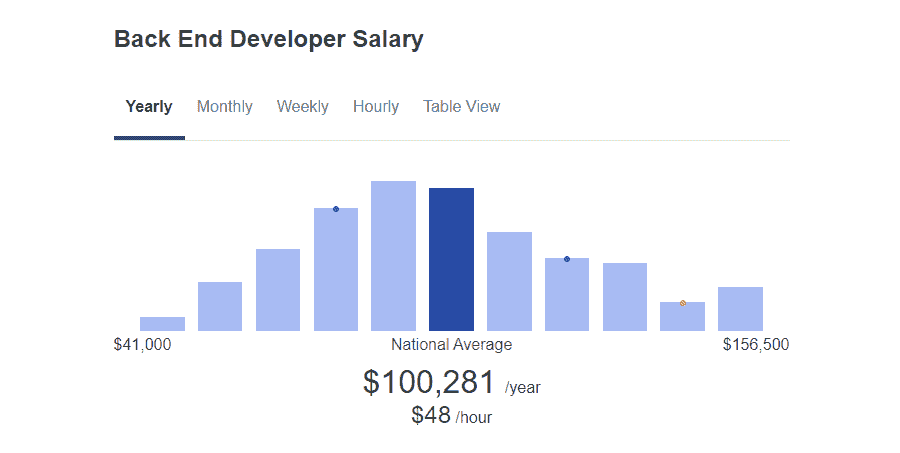
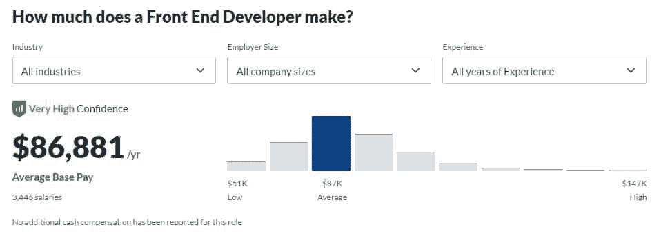
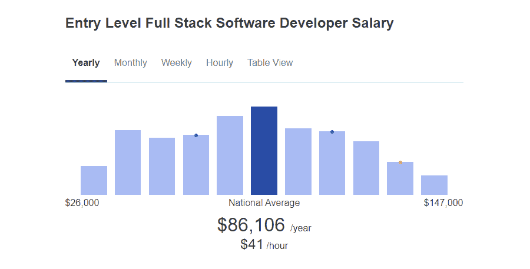
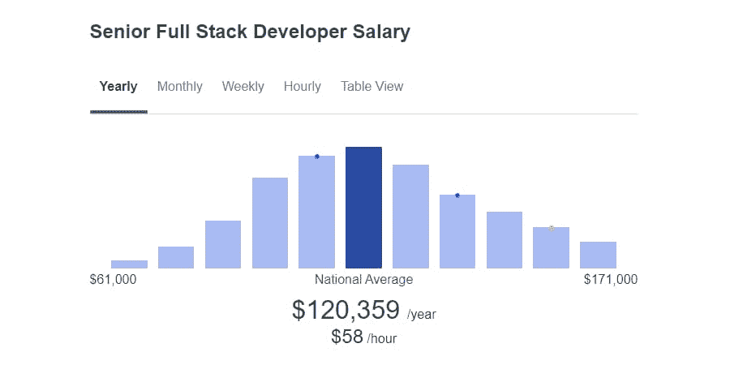

# 一般全栈开发者的工资是多少？2022 年的新数据

> 原文：<https://kinsta.com/blog/full-stack-developers-salary/>

当你是一个全栈开发者时，你拥有双倍的技能和专业化。所以，那应该意味着双倍的工资，对吗？如果您计划追求全栈开发，您可能非常想知道掌握它所需的工作是否有回报。

全栈开发者工资值得努力吗？和[其他开发者的工资](https://kinsta.com/blog/web-developer-salary/)相比如何？如果你选择从事这个不寻常的职业，你的工作职责是什么？我们现在将回答所有这些问题以及更多问题。

## 到底什么是全栈开发？

一般来说，一个网站由两部分组成:前端(客户端)和后端(服务器端)。

前端是你访问一个网站时看到的，它包括 HTML、CSS 和 Javascript 等其他语言。虽然网页设计师通常负责更好的艺术方面，但开发前端仍然需要注重细节，平衡功能和美观。

至于后端，这包括所有在后台不可见地进行的操作。各种各样的语言，如 [PHP](https://kinsta.com/blog/php-developer-salary/) 、Ruby 和 Python，以及与之配套的各种框架——尽管后端开发人员倾向于专注于一小部分。

许多后端开发人员还负责管理数据库和[调试](https://kinsta.com/blog/wordpress-debug/)任何可能发生的服务器端问题。

那么，全栈开发人员从何而来呢？答案是:他们什么都专攻！一个全栈开发人员可以处理客户端和服务器端的问题，并自己建立一个工作网站。

> Kinsta 把我宠坏了，所以我现在要求每个供应商都提供这样的服务。我们还试图通过我们的 SaaS 工具支持达到这一水平。
> 
> <footer class="wp-block-kinsta-client-quote__footer">
> 
> 
> 
> <cite class="wp-block-kinsta-client-quote__cite">Suganthan Mohanadasan from @Suganthanmn</cite></footer>

[View plans](https://kinsta.com/plans/)

然而，这并不意味着全栈开发人员会淘汰前端或后端开发人员，而且你当然不应该期望独自完成大型项目。全栈开发是一项不太专业的工作，但这意味着你熟悉 [web 开发](https://kinsta.com/blog/web-development-tools/)的每一步。

另一方面，将你的技能分散到广泛的领域意味着你经常会错过发展关键技能的机会，或者当你专注于特定领域时，你的一半技能会变得不平衡。

尽管如此，作为一个全栈开发人员有巨大的优势，因为它使你高度灵活，能够根据需要在项目的不同部分工作。

顺便说一句。我们在招人！Kinsta 的开发团队旨在为我们的客户和内部团队创造真正有效的解决方案。我们相信保持和扩展我们标准的唯一方法是关注质量代码。如果你正在寻找一份开发人员的工作，请确保在这里查看我们当前的[个职位空缺](https://kinsta.com/careers/)。

[What do you think a full-stack developer's average salary is? 💰 Find out here ⬇️Click to Tweet](https://twitter.com/intent/tweet?url=https%3A%2F%2Fkinsta.com%2Fblog%2Ffull-stack-developers-salary%2F&via=kinsta&text=What+do+you+think+a+full-stack+developer%27s+average+salary+is%3F+%F0%9F%92%B0+Find+out+here+%E2%AC%87%EF%B8%8F&hashtags=Developers%2CFullStack)

### 成为全栈开发人员需要什么

由于其非专业化的性质，成为一名成功的全栈开发人员可能需要比选择不同的技术领域更多的时间和工作。当出现问题时，人们会自然而然地向你求助，因为你有丰富的知识。获得这些技能需要一段时间。

但是像所有开发人员的工作一样，成为专家更多的是直接的实践经验。仅用[在线资源](https://kinsta.com/blog/web-design-courses/)就可以自学成为全栈开发者。

计算机科学或相关学位可以帮助你找到方向，快速掌握新技能，但实际的丰富经验可能更受雇主的重视，即使你没有学位，也能给你一份工作。你最好的办法是查看你所在地区的工作列表，看看空缺职位的要求。

总而言之，以下是全栈开发人员最常见的工作要求:

*   计算机科学的大专、学士或更好的学位:如果你有经验可以取而代之，可能是可选的。
*   **精通前端技术:**至少精通 HTML、CSS 和 Javascript，还可能精通像 jQuery 或其他客户端框架这样的 [Javascript 库](https://kinsta.com/blog/javascript-libraries/)。
*   **后端语言、库和框架方面的技能:**你选择专攻哪种语言取决于你自己，但是你应该能够在服务器端开发应用程序。
*   **数据库专业知识:**[使用和操作数据库的能力](https://kinsta.com/knowledgebase/wordpress-database/)。
*   团队合作技能:由于你适用于整个项目范围，当其他人陷入困境时，你应该伸出援手。
*   **灵活性和对细节的关注:**在项目的不同任务和领域之间切换的能力对于全栈开发人员的成功至关重要。但是有这么多的任务跳转，你需要一双发现错误的好眼睛，除非你想留下一大堆错误。

### 全栈开发人员工作职责

虽然你可能有广泛的技能范围，但你的雇主不应该指望你做两个人的工作。技能加倍并不意味着工作量加倍。除非你在做一个最小的网站，否则你不会负责所有的事情！

但是对于项目的不同领域，你的日常工作职责可能会改变。以下是您可能需要做的事情:

*   每天或每周在项目的不同职责之间切换。
*   用不同的[前端和后端语言](https://kinsta.com/blog/best-programming-language-to-learn/)写代码。
*   使用各种框架和库。
*   使用[版本控制软件，如 Git](https://kinsta.com/knowledgebase/what-is-github/) 。
*   在前端开发功能性用户体验。
*   建立和修改数据库。
*   调试网站上任何地方出现的问题。
*   协助项目中的其他开发人员，协作开发架构。
*   与平面设计师合作，将他们的设计翻译成代码。
*   制作功能正常的网站原型。

### 对全栈开发人员的需求

全栈开发人员是否有好的薪水不仅关系到人们是否真的雇佣他们。

许多人选择雇佣不同的前端和后端开发人员，你可能会从事这样的工作，结果却忽略了你的额外知识。那么，你最终获得“全栈开发人员”这个职位的可能性有多大呢？让我们看看趋势。

2020 年，LinkedIn 发布了他们的[新兴工作报告](https://business.linkedin.com/content/dam/me/business/en-us/talent-solutions/emerging-jobs-report/Emerging_Jobs_Report_U.S._FINAL.pdf)，其中“全栈工程师”连续第二年上榜。该报告甚至指出，自 2015 年以来，这一工作的增长率每年都在 35%左右。

LinkedIn Full-Stack Emerging Jobs Report

这些数据反映了对全栈开发人员不断增长的需求——不一定比专业人员更多，但它确实意味着你应该能够轻而易举地找到工作。

虽然你的里程可能会有所不同，但看看你当地的工作列表，看看你所在地区对全栈开发人员的需求有多大，这总是一个好主意。最终，能否在你所在的地区找到工作(或者你有资格从事的远程工作)不仅仅取决于这些统计数据。

一份工作的薪水也可以反映出该职位的需求程度:薪水越高，你作为一名员工就越有价值，你的职业就越不容易被其他人竞争录用。

## 全栈开发人员的平均工资

成为一名全栈开发人员意味着放弃专业化，选择尽可能多的技能。即便如此，你的见识也不会浅薄；全栈开发人员通常被称为“独角兽”，类似于设计师和开发人员的混合体，因为他们的技能非常广泛和罕见。

这当然不是一条容易的路。但是付出值得吗？或者，就薪水而言，你会更愿意去做一份更简单、更容易接受的工作吗？

这是全栈开发人员的平均工资:

*   实际上:10.8 万美元/年，基于 1.05 万的报告工资
*   glass door:99k 美元/年，最低 63k 美元，最高 157k 美元
*   zip recruiter:10.3 万美元/年(49 美元/小时)，最低 3.8 万美元，最高 15.9 万美元
*   工资级别:79k 美元/年，最低 54k 美元，最高 115k 美元

Full-Stack Developer salary

平均所有这些数据，你得到的年薪是 97k 美元/年。当然不坏，但这和其他相关工作相比如何？

### 全栈与后端开发人员工资

后端开发比前端(或客户端)开发更复杂，主要是因为有太多的语言和框架需要学习。这些语言中有许多非常难以掌握。

作为一名全栈开发人员，您最终不会接触到 web 开发中的许多狭窄点。那么工资相比如何呢？

*   实际上:12.1 万美元/年，基于 24k 的报告工资
*   glass door:78k 美元/年，最低 48k 美元，最高 128k 美元
*   zip recruiter:10 万美元/年，最低 4.1 万美元，最高 15.7 万美元
*   薪酬等级:8 万美元/年，最低 5 万美元，最高 13.1 万美元

Back End Developer Salary

将这些放在一起，后端开发人员的平均年薪为 9.5 万美元，而全栈开发人员的年薪为 9.7 万美元。

## 注册订阅时事通讯

### 想知道我们是怎么让流量增长超过 1000%的吗？

加入 20，000 多名获得我们每周时事通讯和内部消息的人的行列吧！

[Subscribe Now](#newsletter)

虽然你在开发全栈时确实赚了一点额外的钱，但与你的标准服务器端开发者相比，这并不多。

### 全栈与前端开发人员薪资

众所周知，前端开发人员在金钱方面吃亏，原因很简单，因为 HTML 和 CSS 对新开发人员来说更容易学习，所以在就业市场上总是有许多新面孔在竞争。

与全栈开发人员相比，前端开发人员的工资是多少？

*   实际上:10.6 万美元/年，基于 5200 万的工资
*   glass door:8.7 万美元/年，最低 5.1 万美元，最高 14.7 万美元
*   zip recruiter:8 万美元/年，最低 3.4 万美元，最高 12.8 万美元
*   工资级别:7.5 万美元/年，最低 4.9 万美元，最高 11.5 万美元

Front End Developer Salary

平均下来，你会看到每年 87，000 美元。与全栈开发人员的 97k 美元/年相比，整整少了 10000 美元。如果收入是你主要关心的问题之一，那么最好选择后端或全栈开发。

相关:看看我们关于 WordPress 开发者平均工资的报道，看看专攻 WordPress 是否值得。

### 按经验级别划分的全栈开发人员工资

经验对你的收入有很大的影响，但是随着时间的推移，有些工作比其他工作更能给你带来更高的薪水。当你达到高级职位并有几年工作经验时，你能期望挣多少钱？

第一:入门级全栈开发者工资。在这个行业的第一年，你能挣到可以维持生活的工资吗？让我们看看这些数字:

*   确实如此:不到一年的经验每年 88000 美元
*   zip recruiter:86k 美元/年，最低 26k 美元，最高 147k 美元
*   工资级别:66000 美元/年，最低 48000 美元，最高 90000 美元

Entry-Level Full-Stack Software Developer Salary

因此，你可能会看到每年 8 万美元的收入，尽管第一年的工资分配差异很大。这完全取决于你能否找到一份好工作，或者选择自由开发者的工作——你能否找到足够的工作养活自己。

需要一个给你带来竞争优势的托管解决方案吗？Kinsta 为您提供了令人难以置信的速度、一流的安全性和自动伸缩功能。[查看我们的计划](https://kinsta.com/plans/?in-article-cta)

随着你获得更多的经验，你会继续赚更多的钱。PayScale 报告称，[职业生涯早期的全栈开发人员](https://www.payscale.com/research/US/Job=Full_Stack_Software_Developer/Salary/cd72b0c0/Early-Career)每年可以赚 75000 美元，当你到达[职业生涯中期](https://www.payscale.com/research/US/Job=Full_Stack_Software_Developer/Salary/6cb13eae/Mid-Career)时，这一数字会上升到 92000 美元。

最后:资深全栈开发者。当你已经到了职业生涯的晚期，正在领导项目和培训他人时，你投入的工作值得吗？

*   glass door:11.1 万美元/年，最低 8 万美元，最高 15.6 万美元
*   zip recruiter:12 万美元/年，最低 6.1 万美元，最高 17.1 万美元
*   工资级别:12.1 万美元/年，最低 9.6 万美元，最高 15.2 万美元

Senior Full-Stack Developer Salary

最终估计为每年 11.7 万美元。这并不比 97000 美元/年的总体平均水平高多少，但以 80000 美元/年的入门级工资计算，你将在整个职业生涯中额外获得近 40000 美元。

### 自由职业全栈开发人员工资

自由职业可能会耗费大量的时间和金钱……也可能是你职业生涯中最好的选择。

一方面，你可以设定自己的价格，这意味着你可以比拿固定薪水赚得更多。另一方面，你拿多少钱完全取决于你吸引客户的能力。

但如果你能设法赚到足够的钱，在自由职业的全栈工作中茁壮成长，这是你可以期待的薪水。

Full-Stack Developer Hourly Rate Distribution

据 ZipRecruiter 报道，该公司的平均年薪为 10.6 万美元/年(51 美元/小时)。此外，[的共同导师](https://www.codementor.io/freelance-rates/full-stack-developers)说自由职业的全栈开发者每小时可以赚 61-80 美元。

这个职位没有太多的数据，但总的来说，看起来成功的自由职业者可以期望比除了最有经验的开发人员以外的所有人平均挣得更多。虽然它不适合所有人，但值得考虑。

### 按国家/地区列出的全栈开发人员工资

你住在哪里会对你的收入产生很大的影响。如果全栈开发人员在你所在的城市或国家不太常见，但需求却一样大，你最终可能会得到一份高薪工作。另一方面，一些国家支付的费用可能远低于平均水平。

以下是目前最需要全堆栈开发人员的一些国家:

*   瑞士:10.6 万美元/年(9.5 万瑞士法郎/年)
*   丹麦:8.4 万美元/年(DKK:51.6 万美元/年)
*   澳大利亚:7.7 万美元/年(10 万澳元/年)
*   英国:7.6 万美元/年(5.4 万美元/年)
*   荷兰:7.6 万美元/年(6.3 万欧元/年)
*   德国:7 万美元/年(5.8 万欧元/年)
*   挪威:6.5 万美元/年(54 万美元/年)
*   奥地利:6.3 万美元/年(5.2 万欧元/年)
*   瑞典:6.3 万美元/年(SEK 52.8 万美元)
*   爱尔兰:6.2 万美元/年(5.1 万欧元/年)
*   加拿大:6 万美元/年(约 7.3 万美元/年)
*   芬兰:5.7 万美元/年(4.7 万欧元/年)
*   法国:5.3 万美元/年(4.4 万欧元/年)
*   新加坡:4.6 万美元/年(6.2 万新元/年)
*   意大利:3.9 万美元/年(3.2 万欧元/年)
*   俄罗斯:3.8 万美元/年(276 万美元/年)
*   西班牙:3.8 万美元/年(3.1 万欧元/年)
*   中国:3.7 万美元/年(人民币 2.3 万元/年)
*   葡萄牙:2 万美元/年(1.6 万欧元/年)
*   罗马尼亚:18000 美元/年(72000 卢比/年)
*   保加利亚:18000 美元/年(BGN 30000 美元/年)
*   墨西哥:1.4 万美元/年(MXN:28.8 万美元/年)
*   印度:8 万美元/年(₹600k/year)
*   印度尼西亚:5000 美元/年(7800 万印尼盾/年)
*   乌克兰:千美元/年(₴26k/year)

## 成为全栈开发者值得吗？

看一般的全栈开发者工资，成为一个全栈开发者值得麻烦吗，还是专精最好？

平均年薪为 9.7 万美元，职业生涯早期的起薪为 8 万美元，到了大四会涨到 11.7 万美元，钱不是问题。你会赚得和类似的领域一样多，甚至更多。如果这就是你所担心的，你应该可以继续做这份工作。

你可能会比一般的网络开发人员挣得多，但只差一点点。因此，如果服务器端脚本编写是你的梦想工作，而你只想拿起“全栈”头衔来多赚一点，那就不值得付出额外的努力。

许多全栈开发人员表示，他们最终会将大部分精力放在后端开发上。虽然客户端的知识无疑会有所帮助，但专门化可能会更好。

这完全取决于你想要什么。你更愿意拥有创建网站的广博知识，以便在项目中出现问题时有所帮助吗？或者你更愿意专注于前端或后端编码，并在这些狭窄的领域尽可能多地学习？

所有这些工作都有非常相似的薪水，最后，作为一名初露头角的开发人员，最好去做你最感兴趣的工作。

[Thinking about becoming a full-stack developer? Read this first 💰Click to Tweet](https://twitter.com/intent/tweet?url=https%3A%2F%2Fkinsta.com%2Fblog%2Ffull-stack-developers-salary%2F&via=kinsta&text=Thinking+about+becoming+a+full-stack+developer%3F+Read+this+first+%F0%9F%92%B0&hashtags=WebDev%2CTechJobs)

## 摘要

全栈开发人员是一个罕见的阶层，平均年薪为 9.7 万美元。当你比类似的工作挣得多一点的时候，其他类型的开发人员设法在工资部门保持不变。所以你可能有双倍的技能，但是你肯定不会因为你的麻烦而得到双倍的回报。

这份工作也有其独特的问题。由于其范围广泛，掌握它更具挑战性，虽然所有领域的通用技能都有所帮助，尤其是对于调试，但这意味着您缺乏处理真正棘手问题的专业技能。

你也可能遇到不理解你的角色并雇佣你的雇主，他们期望你做所有的工作，却得到几乎相同的报酬。

如果你从事全栈开发仅仅是为了比其他类型的开发者赚更多的钱，你可能会失望。但是，如果你喜欢这份工作，并且认为你可以在这个独特的角色上取得成功，那么成为一名全栈开发人员可能是最合适的。

如果你是一名有才华的开发人员，并且你想在一个文化与技术卓越同等重要的宽松环境中与一个拥有所有权、高技能的团队一起工作，请看看我们的[职位空缺，并在此申请](https://kinsta.com/careers/)。

对于全栈开发人员来说，你对这些薪资水平有什么看法？请在评论区告诉我们！

* * *

让你所有的[应用程序](https://kinsta.com/application-hosting/)、[数据库](https://kinsta.com/database-hosting/)和 [WordPress 网站](https://kinsta.com/wordpress-hosting/)在线并在一个屋檐下。我们功能丰富的高性能云平台包括:

*   在 MyKinsta 仪表盘中轻松设置和管理
*   24/7 专家支持
*   最好的谷歌云平台硬件和网络，由 Kubernetes 提供最大的可扩展性
*   面向速度和安全性的企业级 Cloudflare 集成
*   全球受众覆盖全球多达 35 个数据中心和 275 多个 pop

在第一个月使用托管的[应用程序或托管](https://kinsta.com/application-hosting/)的[数据库，您可以享受 20 美元的优惠，亲自测试一下。探索我们的](https://kinsta.com/database-hosting/)[计划](https://kinsta.com/plans/)或[与销售人员交谈](https://kinsta.com/contact-us/)以找到最适合您的方式。