# 功能即服务(FaaS):您需要知道的一切

> 原文：<https://kinsta.com/blog/function-as-a-service/>

你可能听说过 SaaS，你可能听说过 PaaS 和 IaaS，但是你听说过功能即服务(FaaS)吗？

FaaS 市场正在快速增长。根据联合市场研究公司的数据，2018 年该市场价值为 30.1 亿美元。这个数字预计到 2026 年将增长到 240 亿美元，这意味着该行业从 2020 年到 2026 年将以 29.7%的复合年增长率(CAGR)增长。

看着这种增长，可以肯定地说 FaaS 是一个非常大的市场。

但是什么是 FaaS，它是如何工作的？为了帮助你回答这些问题，本文将涵盖 FaaS 的基本知识，为什么人们应该(和不应该)使用 FaaS，以及截至 2022 年全球 FaaS 市场的状况。

我们走吧。

## 什么是功能即服务(FaaS)？

功能即服务(FaaS)是云计算的一种形式，通过消除开发人员维护应用基础设施的需求，帮助他们更好地工作。当开发人员利用 FaaS 时，他们使用 FaaS 平台来为他们构建、运行和监督应用程序包。

> 需要在这里大声喊出来。Kinsta 太神奇了，我用它做我的个人网站。支持是迅速和杰出的，他们的服务器是 WordPress 最快的。
> 
> <footer class="wp-block-kinsta-client-quote__footer">
> 
> 
> 
> <cite class="wp-block-kinsta-client-quote__cite">Phillip Stemann</cite></footer>

[View plans](https://kinsta.com/plans/)

在这一点上，你可能认为 FaaS 听起来像[无服务器计算](https://kinsta.com/blog/serverless-php/)——事实也的确如此。无服务器计算允许开发人员将管理数据库、API 网关、存储、消息和其他基础设施的工作外包给第三方提供商。FaaS 是一种无服务器计算。

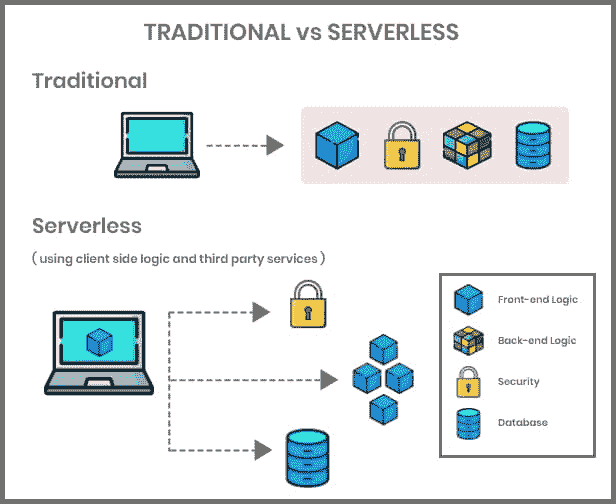

How serverless computing works (**Source:** [iviewlabs](//blog.iviewlabs.com/what-is-serverless-computing/%E2%80%9D))

虽然这可能是你第一次读到 FaaS，但你很可能在野外遇到过它。许多流行的程序和应用程序都使用 FaaS，比如亚马逊的 Alexa。

如果你熟悉 Alexa，你会知道你可以通过构建“技能”来扩展 Alexa 的功能。像应用程序一样，技能让 Alexa 做基本配置之外的事情。例如检查应用程序中的通知、开始新的聊天或播放自定义音频。

亚马逊通过 AWS Lambda 运行 Alexa 的所有技能。当您构建一项新技能时，您将它创建为一个通过 AWS Lambda 部署的功能。然后，AWS Lambda 会为您运行该功能，并处理安全性和数据库管理等基础设施问题。

那么，FaaS 是如何按部就班地工作的呢？让我们接下来讨论这个问题。

[What is FaaS? 🤔This guide breaks down everything you need to know ✅Click to Tweet](https://twitter.com/intent/tweet?url=https%3A%2F%2Fbit.ly%2F3xwjseE&via=kinsta&text=What+is+FaaS%3F+%F0%9F%A4%94This+guide+breaks+down+everything+you+need+to+know+%E2%9C%85&hashtags=FaaS%2CCloudComputing)

### FaaS 是如何工作的？

要理解 FaaS，你需要知道两个关键术语:

1.  **“单片架构”** =独立于其他应用运行的自包含应用。这些应用程序在内部管理用户界面、业务功能和数据接口。整体架构代码依赖于其他代码。
2.  **“微服务架构”** =处理一些小任务的一段代码。这些微服务是独立的(尽管它们一起构成了一个完整的应用程序)。

下图显示了整体架构和微服务架构的不同之处:

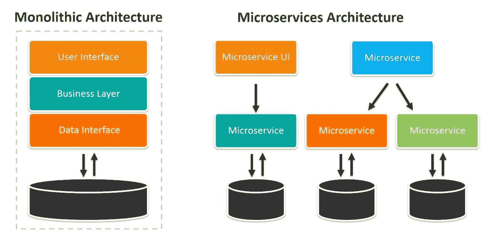

Monolithic architecture vs. microservices architecture (**Source:** [BMC](//www.bmc.com/blogs/microservices-architecture/%E2%80%9D))

当您执行或更新一个功能时，您可以看到微服务和单片架构之间的主要区别。有了单片架构，整个程序立刻执行功能(比如更新一个应用程序)。借助微服务架构，您可以独立执行微服务功能。

FaaS 是帮助微服务架构工作的东西。

当您执行每个新的微服务功能时，您只需要创建该功能。然后，您的 FaaS 提供者接受该函数，运行它，并从那时起处理该函数的管理。

因为 FaaS 是一个与你的输入一起工作的工具，所以注意到每个 FaaS 函数应该只负责一个任务是很重要的。该任务在其触发器被激活时运行。例如，只有当用户按下“下载收据”时，产生用户收据副本的功能才起作用

FaaS 使用“事件驱动的执行模型”，这意味着你的功能只有在被触发时才会激活。同样，它们也不会在后台运行。

那么，FaaS 还能做什么呢？

### FaaS 包括什么服务？

尽管所有提供商都不相同，但 FaaS 提供商通常提供以下服务:

*   **认证服务。**这些为你程序的用户处理登录和[认证过程](https://kinsta.com/blog/wordpress-two-factor-authentication/)。
*   **数据库服务。这些帮助你在数据库中归档信息，以便你的程序可以使用它。FaaS 提供商为您管理一些数据库维护。**
*   **文件存储。** FaaS 提供商可以为你的应用存储数据和文件，因此你不需要在自己的服务器上托管它。
*   **举报。** FaaS 提供者可以监视你程序中的错误或[安全威胁](https://kinsta.com/blog/cloud-security/)，当他们发现有问题时会提醒你。

总体而言，这些服务有助于开发人员更智能地工作。接下来让我们来看看 FaaS 的优点。

### FaaS 模式的优点

有了 FaaS，开发人员无需担心基础设施或部署，只需编写应用程序逻辑。因此，当目前实施时，FaaS 可以大大减少构建和部署程序所需的时间。

使用 FaaS，构建和部署也更容易。调配时间只需几秒钟，而不是一次几个小时。您也不局限于特定的语言或资源。FaaS 提供商可以运行大多数语言的代码，你可以通过使用提供商提供的缓存和数据库来加速构建过程。

FaaS 模式具有很强的可扩展性，容量规划也容易得多。如果您需要更多资源，只需参考 FaaS 提供商的说明即可升级您的使用。许多 FaaS 提供商提供水平扩展，这意味着如果您的使用量出现峰值，提供商将简单地为您提供额外的资源来应对峰值。

此外，您无需担心维护、灾难恢复(DR)或安全性。

最后，FaaS 非常有效率。提供商只对你使用的资源收费，所以你为 FaaS 支付的费用可能比你自己的硬件要少得多。同样，你的函数也不会在后台运行，而是闲置着。你也不需要花钱让他们闲着。

那么，FaaS 是职业选手吗？不完全是。

### FaaS 模式的缺点

FaaS 模型消除了一些与程序开发相关的最大挑战，但是它也要求你实质上限制你的控制。你不能对你的代码使用的[服务器](https://kinsta.com/help/dedicated-server/)、安全性或数据库做出很多决定。相反，这取决于您的提供商。

同理，[调试](https://kinsta.com/help/wordpress-debugging/)通常会更难一些，因为你不能完全控制你的系统。测试也很困难，因为 FaaS 代码并不总是顺利地转换到测试环境中。

此外，您必须遵守 FaaS 供应商的严格要求。FaaS 函数只能完成一个动作，所以如果你不习惯这样，你需要改变你和你的团队编写代码的方式。同样，你可能需要重写现有应用程序的代码，使其适合 FaaS 部署——因此 FaaS 通常比旧程序更适合新程序。

最后，选择 FaaS 通常意味着长期致力于单一供应商。当您构建程序时，您使用提供商的系统和要求。自然，改变提供者可能需要您重做一些工作，并可能中断您的功能。

### 赞成还是反对

| **优点** | **缺点** |
| Deploy code faster供应需要几毫秒任何语言的代码自动化灾难恢复(DR)成本效益高可攀登的 | Lose control over server调试更加困难测试需要更长时间你被你的供应商锁定了您必须编写适合 FaaS 的代码 |

### FaaS vs SaaS、PaaS 和 IaaS

现在您对 FaaS 有了更多的了解，您可能想知道它与其他[一切即服务(XaaS)](https://kinsta.com/blog/xaas/) 选项(如 IaaS、SaaS 和 PaaS)有什么关系。

IaaS、PaaS 和 FaaS 服务有着相似的目的:它们帮助公司更便宜、更有效地管理应用程序。然而，每个选项都提供了不同的东西。

[基础设施即服务(IaaS)](https://kinsta.com/blog/what-is-iaas/) 允许你出租计算能力(比如 RAM 和 CPU)。使用 IaaS，您仍然需要在内部管理一些应用程序功能(如安全性)。

[平台即服务(PaaS)](https://kinsta.com/blog/what-is-paas/) 允许您出租硬件和软件工具来构建您的应用。一个常见的例子是 AWS 弹性豆茎。

与 IaaS 和 PaaS 不同，FaaS 允许你租用空间来独立运行功能。这个特性使它更具可伸缩性。

以下是三者不同工作方式的简短总结:

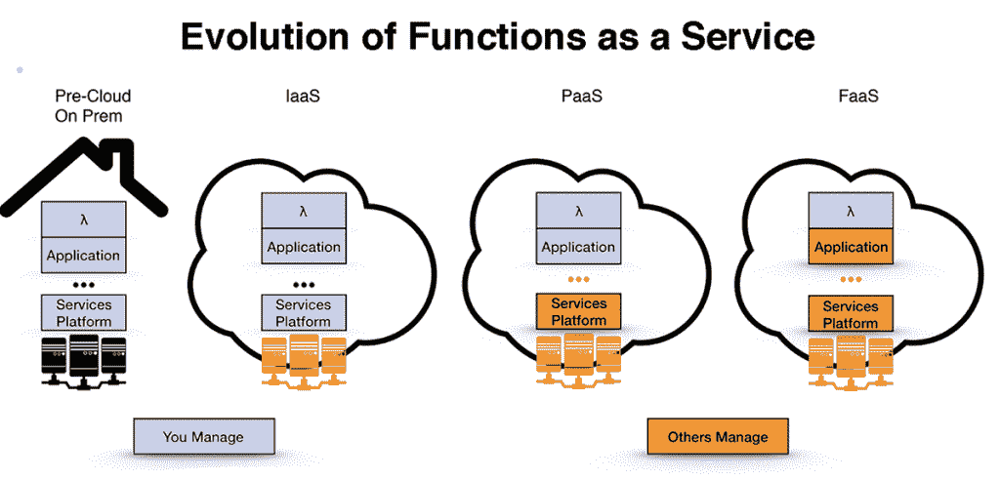

How FaaS differs from IaaS and PaaS (**Source:** [thenewstack.io](//thenewstack.io/why-netflix-rolled-its-own-node-js-functions-as-a-service-runtime/%E2%80%9D))

[软件即服务(SaaS)](https://kinsta.com/blog/saas-products/#saas-definition-what-is-saas) 不是面向应用或程序构建的。相反，它允许您租用应用程序，这样您就不需要在内部构建它们。有成千上万的 SaaS 可供选择——从数据分析工具到 [WordPress SEO 插件](https://kinsta.com/blog/best-seo-plugins-for-wordpress/)。

## 市场规模、份额和领先供应商

FaaS 的发展反映了组织开发新项目方式的整体转变。

在过去的几十年里，开发人员创建大型系统作为多年项目。今天，许多组织倾向于使用[开发运营(DevOps)方法](https://kinsta.com/blog/devops-engineer/)进行开发。DevOps 优先考虑一点一点地持续开发和改进程序。

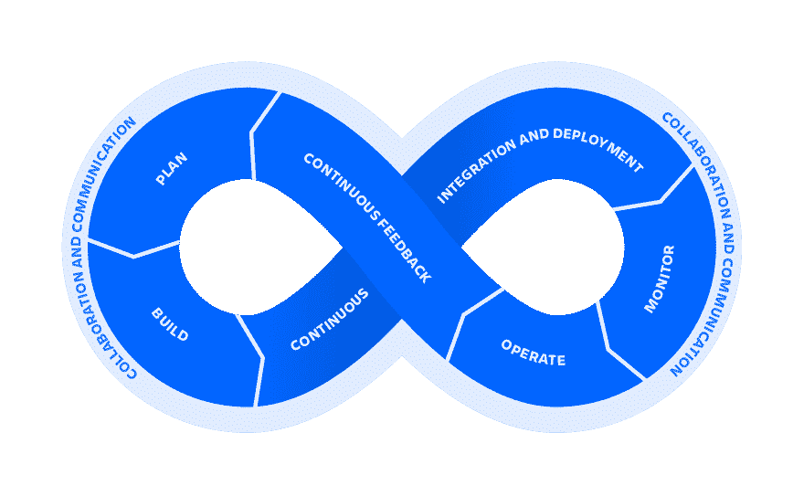

How DevOps works (**Source:** [Atlassian](//www.atlassian.com/devops/what-is-devops%E2%80%9D))

同样，组织越来越多地使用[云服务](https://kinsta.com/blog/best-cloud-storage/)来使事情变得更加安全和高效。据甲骨文称，组织将很快在云中存储比 T2 多 600 倍的敏感数据。

你可以从 Statista 的 7，164 名高管收集的数据中看出这一趋势。从 2019 年到 2021 年，单一公共或私有云服务的使用下降，大多数组织采用了多种云解决方案。

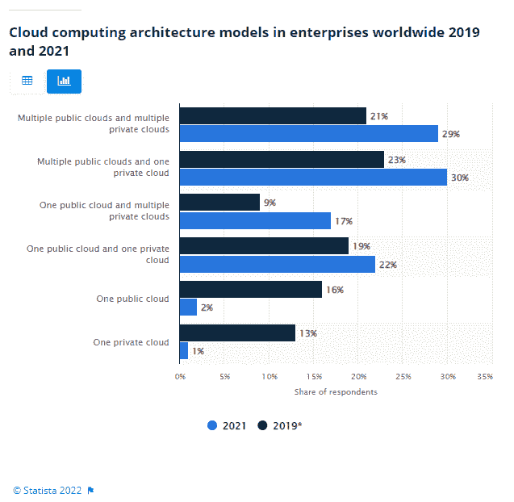

Use of Cloud Technology (**Source:** [Statista](//www.statista.com/statistics/1275964/enterprise-cloud-architecture-models/%E2%80%9D))

对云计算的投资也在增长。Statista 对全球数百家大型企业的另一项研究显示，83%的受访公司每年在公共云计算上的投资超过 120 万美元。这一数字高于 2019 年的 50%。

人们转向 FaaS，因为它经得起未来考验，而且可扩展。同样，它提供了更好的生产力和性能，更快的应用上市时间，以及更具成本效益的制作新程序的方式。

这些优势吸引了许多行业，包括银行业组织(或“BFSI”组织)、消费品和零售、娱乐、电信、信息和技术支持服务(ITES)、医疗保健和制造业。以下是每个行业对 FaaS 市场的贡献:

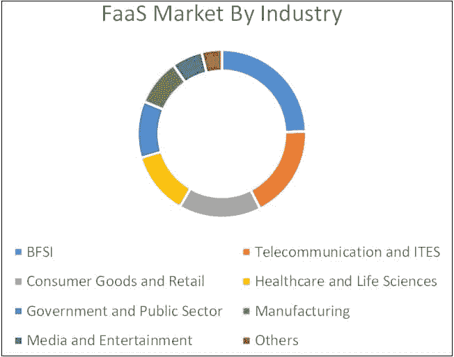

What industries use FaaS (**Source:** [MarketsandMarkets](//www.marketsandmarkets.com/Market-Reports/function-as-a-service-market-127202409.html%E2%80%9D))

与 SaaS 不同，FaaS 没有成千上万的供应商可供组织选择。FaaS 的绝大部分使用主要参与者提供的解决方案，包括 AWS Lambda、Azure Functions、IBM Cloud Functions、Google Cloud Functions、阿里云和 Cloudflare Workers。

我们现在将逐一介绍这些提供商。

### 自动气象站λ

AWS Lambda 由亚马逊于 2014 年 11 月推出，是一款非常受欢迎的 FaaS 工具。截至 2021 年第四季度， [33%](https://www.statista.com/chart/18819/worldwide-market-share-of-leading-cloud-infrastructure-service-providers/) 的云用户使用了 AWS 服务。

## 注册订阅时事通讯

### 想知道我们是怎么让流量增长超过 1000%的吗？

加入 20，000 多名获得我们每周时事通讯和内部消息的人的行列吧！

[Subscribe Now](#newsletter)

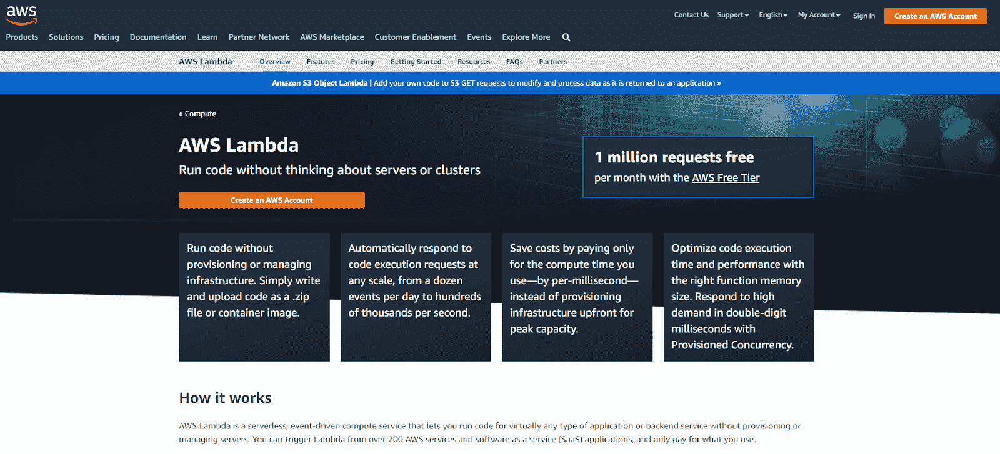

AWS Lambda

AWS Lambda 为许多编程语言提供了原生支持，包括 Node.js、C#、Python、Ruby、Go、Java 和 Powershell。正如我们在*中提到的，“什么是功能即服务(FaaS)？”* Alexa 用 AWS Lambda 做技能。

#### 特性和功能:

*   连接到其他 [AWS 工具](https://kinsta.com/blog/aws-vs-azure/)
*   使用 Amazon CloudWatch 监控您的程序性能
*   与 [SaaS 工具](https://kinsta.com/blog/saas-marketing/)的 200 多次集成
*   可以部署 docker 容器(AWS 在 2020 年 12 月引入了这个特性)

#### 优点:

*   你可以使用 Lambda API 或 Amazon API gateway 构建自己的后端
*   您可以将函数部署为容器映像
*   您可以使用 Amazon RDS 代理连接到关系数据库
*   您可以选择为每个功能分配多少内存

#### 缺点:

*   如果你还没有使用 AWS，设置它将花费大量的时间和精力

### 微软 Azure 函数

微软 Azure Functions 是微软 Azure T1 的一项功能，微软于 2010 年 2 月首次推出“Windows Azure”。Azure Functions 允许你通过 FaaS 执行事件驱动的代码。截至 2021 年第四季度，21%的云用户使用了 Azure。

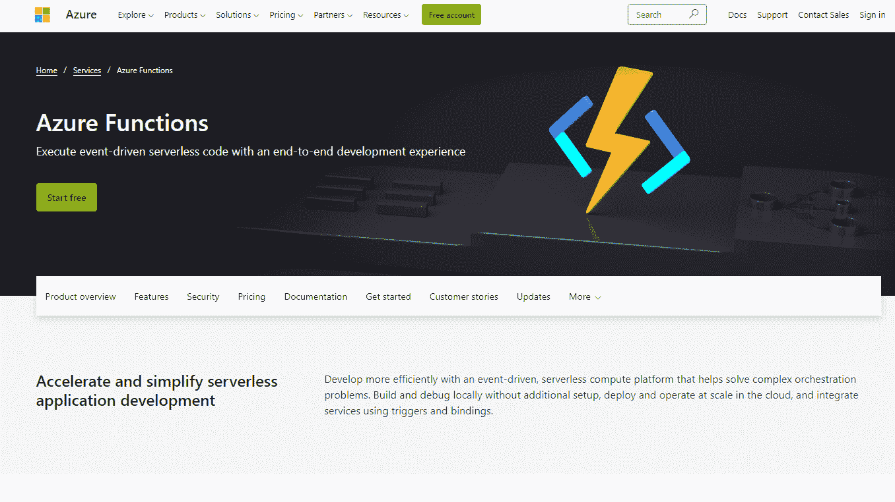

Microsoft Azure Functions

#### 特性和功能:

*   你可以将你的函数连接到 Azure Logic 应用中的 250 多个连接器
*   支持 [JavaScript](https://kinsta.com/knowledgebase/what-is-javascript/) ，C#，F#，Powershell， [PHP，](https://kinsta.com/blog/php-benchmarks/) [Python](https://kinsta.com/blog/python-tutorials/) ，Java
*   为新用户提供许多教程
*   通过 Azure 应用洞察帮助您分析您的程序

#### 优点:

*   Azure Functions 使用集成编程模型
*   非常适合使用 [DevOps](https://kinsta.com/blog/devops-tools/) 的团队
*   提供多种计划

#### 缺点:

*   Azure Functions 不支持 Node.js 或 Ruby

### 谷歌云功能

[谷歌云](https://kinsta.com/blog/google-cloud-vs-aws/)是仅次于 AWS 和 Azure 的第三大最受欢迎的云计算解决方案。它目前拥有 10%的市场份额。Google Cloud Functions 是 Google Cloud 的一个 FaaS 特色——一项为[广泛用户](https://kinsta.com/blog/google-cloud-hosting/)提供 100 多种产品的服务。

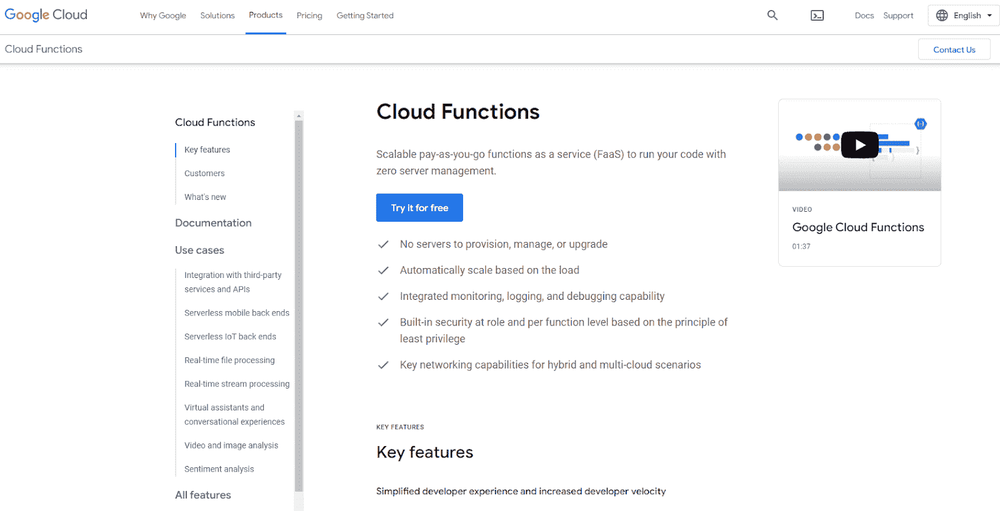

Google Cloud

#### 特性和功能:

*   调试和日志记录被集成到 Google 云功能中(通过 CloudTrace 和 CloudDebugger)
*   你可以从谷歌助手、谷歌云、Firebase 或任何使用 HTTP 的应用[中使用触发器](https://kinsta.com/blog/wordpress-http-api/)
*   谷歌云功能集成了许多谷歌合作伙伴

#### 优点:

*   那些想要多云和混合能力的人可以使用它
*   它是开源的，所以如果你愿意，你可以很容易地转移到另一个 FaaS 平台
*   它非常容易使用
*   谷歌向新用户提供许多免费资源

#### 缺点:

*   Google Cloud Function 基于容器的服务不如其他 FaaS 提供商先进

### IBM 云

[IBM Cloud](https://kinsta.com/blog/cloud-market-share/#ibm) 来自 SoftLayer，IBM 于 2013 年 6 月收购的公共云平台。IBM 将该平台转变为 Bluemix，并于 2014 年 7 月将其作为 PaaS 工具推出。此后，IBM 将这项服务更名为 IBM Cloud，并将其功能扩展到 FaaS。

Struggling with downtime and WordPress problems? Kinsta is the hosting solution designed to save you time! [Check out our features](https://kinsta.com/features/)

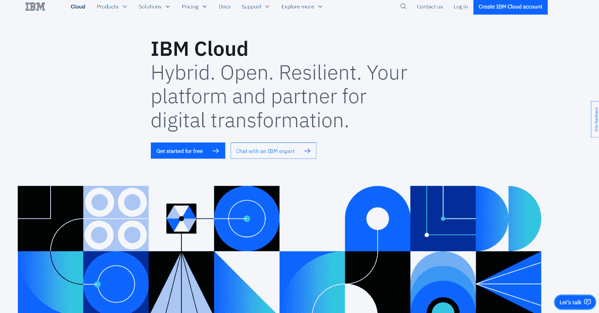

IBM Cloud

截至 2021 年第四季度， [4%](https://kinsta.com/blog/cloud-market-share/) 的云用户已经使用了 IBM Cloud。它运行在 Apache OpenWhisk 生态系统上。

#### 特性和功能:

*   您可以搜索视频内容
*   您可以通过 IBM Watson APIs 将您的程序连接到其他程序
*   IBM 为一些常见任务提供了预构建的功能
*   支持 Node.js， [Python](https://kinsta.com/blog/python-tutorials/) ，Swift， [PHP](https://kinsta.com/blog/php-vs-javascript/) ，Go，Ruby，Java，以及。网络核心

#### 优点:

*   非常适合构建移动应用程序
*   易于学习使用
*   通过 IBM 云监控来监控您的应用程序

#### 缺点:

*   将函数的内存时间限制为十分钟或 2048 MB

### 阿里云

[阿里云](https://kinsta.com/blog/cloud-market-share/#alibaba)并不像其他云计算选择那样广为人知，但它仍然拥有相当可观的市场份额 [6%](https://www.statista.com/chart/18819/worldwide-market-share-of-leading-cloud-infrastructure-service-providers/) 。阿里云由阿里巴巴于 2008 年推出，面向在线企业和使用阿里巴巴其他服务的人。

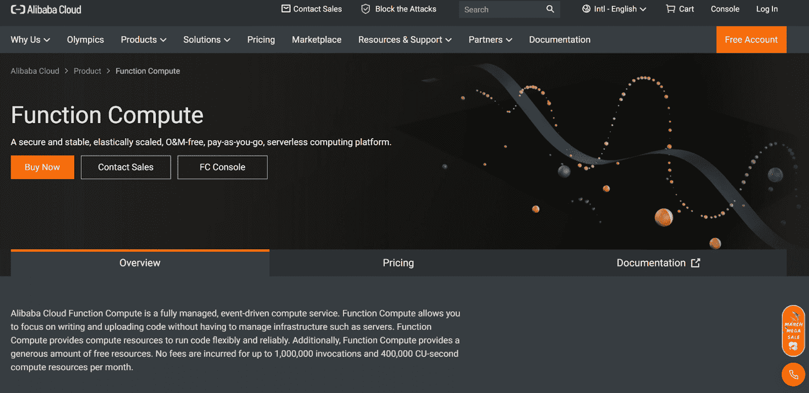

Alibaba Cloud

FaaS 是阿里云提供的服务之一，另外还有[内容交付网络(CDN)](https://kinsta.com/blog/wordpress-cdn/) 、数据存储和大数据处理。

#### 特性和功能:

*   与阿里巴巴的其他计算服务集成
*   防灾难，因为阿里巴巴在多个区域的集群上托管功能
*   视频转码
*   人工智能推理
*   支持 Node.js、Python、Java、PHP 和 C#

#### 优点:

*   为那些不需要运行很多代码的人提供了一个免费的选项
*   高度可扩展
*   您可以使用多种类型的触发器

#### 缺点:

*   将功能从阿里巴巴转移到另一家 FaaS 供应商那里可能会很困难

### 云闪工人

由 [Cloudflare](https://kinsta.com/cloudflare-integration/) 运行的 Cloudflare Workers 是一个 FaaS 系统，适合新开发人员和那些希望几乎立即运行代码的人。Cloudflare Workers 提供免费计划和可伸缩的价格。

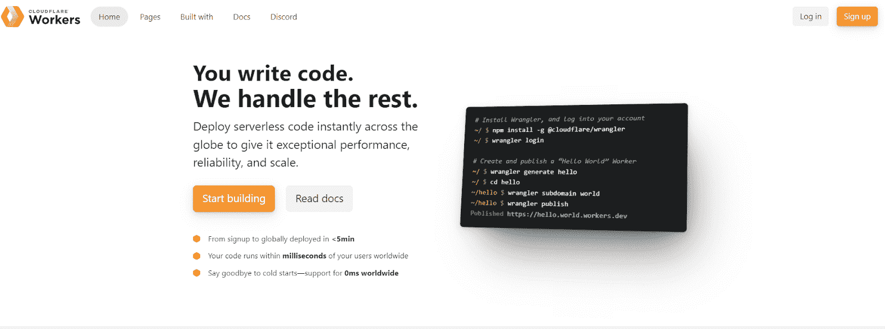

Cloudflare Workers

#### 特性和功能:

*   支持 JavaScript、C++、Rust 和 C
*   您可以将图像、pdf 和其他文件存储在 Cloudflare Workers 上，以作为静态资产进行部署
*   灾难防护，因为 Cloudflare 工作人员使用全球服务器网络
*   与其他 Cloudflare 产品集成

#### 优点:

*   它比许多其他 FaaS 选项便宜
*   新手开发人员很容易学会使用
*   你可以很快开始
*   Cloudflare 提供了详细的教程和资源，可以帮助您构建应用程序

#### 缺点:

*   Cloudflare Workers 不如其他选项强大，更适合那些拥有小规模项目的人

## Faas 最佳实践

是的，FaaS 是一种技术，但它也是开发人员在程序和应用程序开发中需要采用的一种心态。

要充分利用 FaaS，请遵循以下最佳实践:

*   记住 FaaS 的局限性。 FaaS 并不适合每一个项目，如果你试图与 FaaS 一起创建一个非 FaaS 友好的项目，这将耗费你的时间、精力和金钱。
*   **在 FaaS 上仅运行单一动作功能。**如果您运行具有多个操作的函数，您会破坏 FaaS 函数最佳工作的隔离环境。这种中断会降低应用程序的速度和效率。
*   不要运行有依赖关系的函数。依赖关系会在以后产生错误和可伸缩性问题。
*   仔细观察你的装载时间。你的加载时间来自于你需要大量内存的库或函数。高加载时间会降低你的程序速度，最终让用户失望。
*   减少您使用的关系数据库管理系统(RDBMS)连接的数量。这些连接会增加函数运行的时间，并在你的程序中引入一个故障点。

## 你需要 FaaS 吗？

对于某些人来说，FaaS 是一种创新的、改变游戏规则的技术，但它并不适用于所有人。

从 FaaS 中获益最多的组织愿意用微服务架构来构建程序，其中每个功能只做一件事。这些功能应该独立工作——如果它们相互依赖，就会遇到可伸缩性问题。

如果你想构建一个具有单一架构或功能的应用程序，FaaS 可能不太适用。同样，如果你不想长期依赖单一供应商，FaaS 可能是一个短视的选择。

当然，没有 FaaS，你仍然可以利用云技术。例如，您可以投资 PaaS 或 IaaS，将应用程序的一些功能外包给云。这个选项会给你带来云计算的一些成本和效率上的好处，但是你不需要在 FaaS 模型的限制下构建你的程序。

或者，如果你不需要建立一个做一些非常特殊或专门的事情的程序，考虑投资一个 SaaS 工具。一些 SaaS 工具甚至是开源的，所以你可以根据自己的需要修改现有的工具。

[The FaaS market is expected to grow to $24 billion by 2026... so there's never been a better time to learn about this market ✅Click to Tweet](https://twitter.com/intent/tweet?url=https%3A%2F%2Fbit.ly%2F3xwjseE&via=kinsta&text=The+FaaS+market+is+expected+to+grow+to+%2424+billion+by+2026...+so+there%27s+never+been+a+better+time+to+learn+about+this+market+%E2%9C%85&hashtags=FaaS%2CCloudComputing) ## 摘要

FaaS 不是技术术语或新趋势。这是一项可扩展的技术，在未来十年中，你应该会看到更多。

解释 FaaS 有时似乎很难，但 FaaS 只是一项服务，允许开发人员使用他人维护的基础设施编写和运行代码。您经常使用的许多服务，如 Alexa，都使用 FaaS。常见的 FaaS 厂商有 IBM 云函数、AWS Lambda、阿里云、谷歌云函数、微软 Azure 函数等。

虽然 FaaS 对某些企业非常有效，但它不会适合所有人。FaaS 最适合运行执行单一功能的孤立无状态代码。

我们想把麦克风(或键盘)交给你。您如何在您的业务中使用 FaaS，对于首次探索该技术的其他人，您有什么建议吗？请在下面的评论中告诉我们。

* * *

让你所有的[应用程序](https://kinsta.com/application-hosting/)、[数据库](https://kinsta.com/database-hosting/)和 [WordPress 网站](https://kinsta.com/wordpress-hosting/)在线并在一个屋檐下。我们功能丰富的高性能云平台包括:

*   在 MyKinsta 仪表盘中轻松设置和管理
*   24/7 专家支持
*   最好的谷歌云平台硬件和网络，由 Kubernetes 提供最大的可扩展性
*   面向速度和安全性的企业级 Cloudflare 集成
*   全球受众覆盖全球多达 35 个数据中心和 275 多个 pop

在第一个月使用托管的[应用程序或托管](https://kinsta.com/application-hosting/)的[数据库，您可以享受 20 美元的优惠，亲自测试一下。探索我们的](https://kinsta.com/database-hosting/)[计划](https://kinsta.com/plans/)或[与销售人员交谈](https://kinsta.com/contact-us/)以找到最适合您的方式。