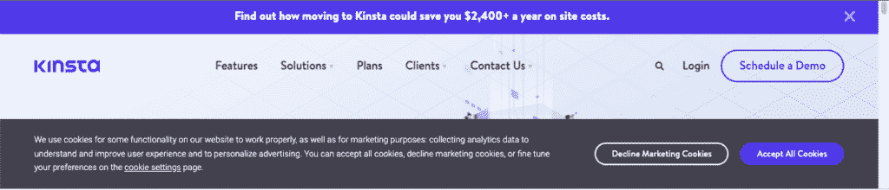

# 深入了解谷歌分析 4 (GA4)

> 原文：<https://kinsta.com/blog/ga4/>

谷歌分析 4 (GA4)已经问世一段时间了，但尽管新功能定期添加，许多用户要么觉得它在某些领域仍然缺乏，要么只是没有时间来掌握新界面。

随着谷歌通用分析(UA)的隐私问题变得非常普遍，以及谷歌设定了关闭 UA 的日期，现在是迈出这一步并开始使用 GA4 的最佳时机。

## GA4 是什么？

GA4 是下一代 [Google Analytics](https://kinsta.com/blog/how-to-use-google-analytics/) ，提供了一种更加注重隐私的方法来跟踪网站和应用程序中的用户，减少对第一方 cookies 的依赖，以符合隐私监管的未来发展。

谷歌通过升级其机器学习游戏实现了这一点，当用户选择不接受 cookies 时，[使用建模](https://www.thinkwithgoogle.com/marketing-strategies/data-and-measurement/conversion-measurement-in-a-cookieless-world/)来“填补空白”，本质上允许 GA4 继续提供关于用户参与度的见解，同时保持他们的数据匿名。

> 需要在这里大声喊出来。Kinsta 太神奇了，我用它做我的个人网站。支持是迅速和杰出的，他们的服务器是 WordPress 最快的。
> 
> <footer class="wp-block-kinsta-client-quote__footer">
> 
> 
> 
> <cite class="wp-block-kinsta-client-quote__cite">Phillip Stemann</cite></footer>

[View plans](https://kinsta.com/plans/)

虽然目前仍然可以安装通用分析，但 GA4 现在是所有新 GA 属性的默认版本。

[As privacy concerns with Google’s Universal Analytics have grown and a date set to switch off UA, it's the perfect time to take the leap and start using GA4\. 📈Click to Tweet](https://twitter.com/intent/tweet?url=https%3A%2F%2Fkinsta.com%2Fblog%2Fga4%2F&via=kinsta&text=As+privacy+concerns+with+Google%E2%80%99s+Universal+Analytics+have+grown+and+a+date+set+to+switch+off+UA%2C+it%27s+the+perfect+time+to+take+the+leap+and+start+using+GA4.+%F0%9F%93%88&hashtags=GoogleAnalytics%2CUA)

## GA4 最早是什么时候推出的？

谷歌最早宣布发布 GA4 [要追溯到 2019 年 7 月](https://blog.google/products/marketingplatform/analytics/new-way-unify-app-and-website-measurement-google-analytics/)(有测试版)。随后在 2020 年 10 月硬推出，成为所有新房产的默认平台。

虽然 GA4 尚未被大多数营销人员完全采用，但企业已经越来越意识到隐私，并且围绕通用分析公司如何处理它提出了一些问题。

## 谷歌为什么把通用分析更新到 GA4？

十多年来，企业一直依赖谷歌分析的见解，衡量用户参与度，以了解他们的在线表现，并利用这些数据做出明智的决策。

虽然 GA4 能够提供类似的见解，但谷歌彻底改革了 Universal Analytics 及其构建的数据模型，这意味着**不可能将数据从 Universal Analytics 迁移到 GA** 。

这在数字营销社区引起了轩然大波，因为许多网站所有者多年来一直在收集数据和跟踪季节性趋势。从零开始的想法很不理想。

随着 2018 年通用数据保护条例( [GDPR](https://kinsta.com/blog/wordpress-gdpr-compliance/#what-is-gdpr) )的出台，企业被迫更加认真地对待隐私，并更好地掌握他们如何处理用户数据。

谷歌的 Universal Analytics 是用来收集用户数据的[分析](https://kinsta.com/topic/analytics/)工具的一个典型例子。这使得该工具近年来获得了大量的宣传，越来越多的人担心网站使用它会违反 GDPR 法规。

GA4 是谷歌对无烹饪未来的回应，并声称允许企业在人工智能和机器学习的帮助下继续跟踪用户参与度，为选择不同意被跟踪的用户“填补空白”。

Cookie request on kinsta.com

### 这对谷歌分析用户意味着什么？

谷歌宣布将于 2023 年 7 月 1 日停用 Universal Analytics，并将于 2023 年底取消查看历史数据的权限。

> 哦，天啊…这会让你头疼的。
> 
> Universal Analytics(又名常规 GA)将于 2023 年 7 月上市。
> 
> 如果你不切换到 GA4，你最终将无法跟踪新的点击，你也会失去历史数据😲[https://t.co/vAwVNmBJ8c](https://t.co/vAwVNmBJ8c)pic.twitter.com/tDf5YDC1qwT2
> 
> 玛丽·海恩斯博士🐧(@ Marie _ Haynes)[2022 年 3 月 16 日](https://twitter.com/Marie_Haynes/status/1504090432095019016?ref_src=twsrc%5Etfw)