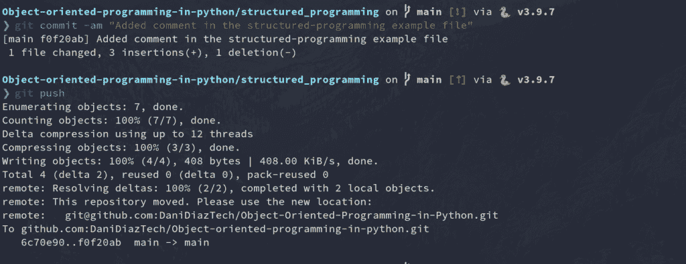
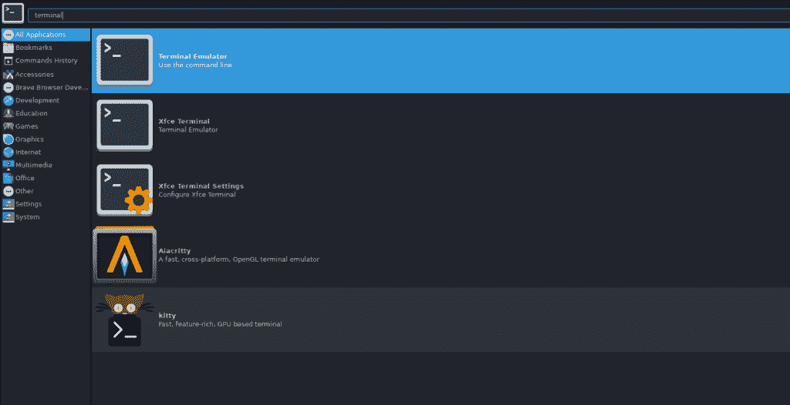
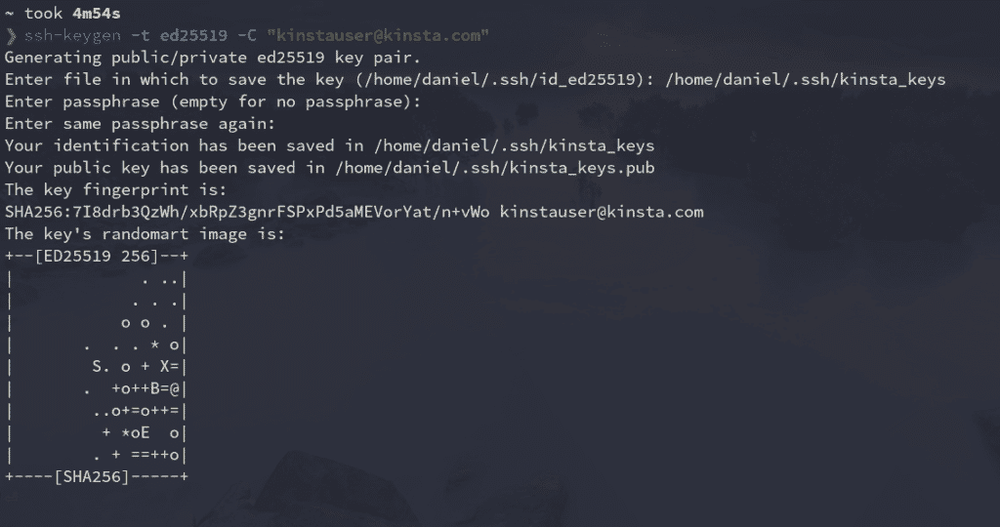
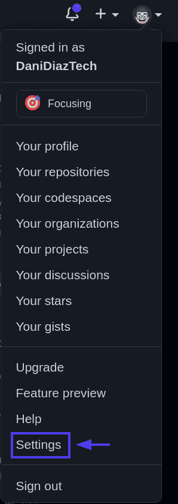
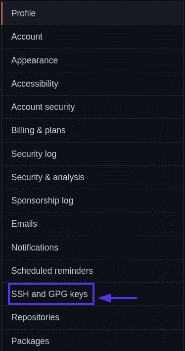
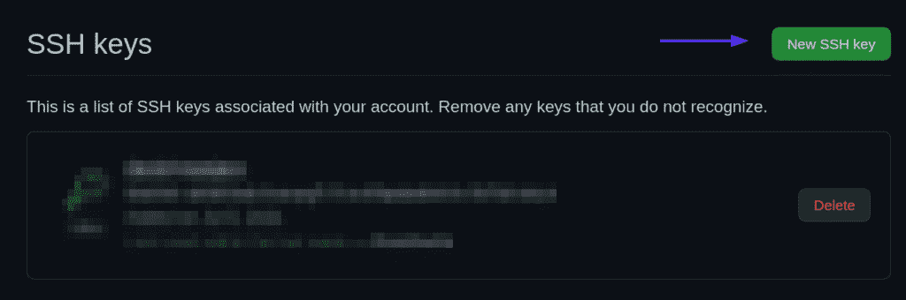
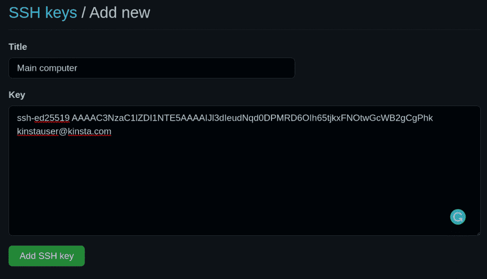
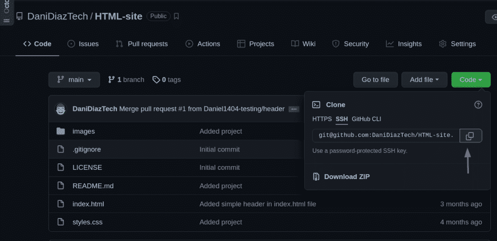
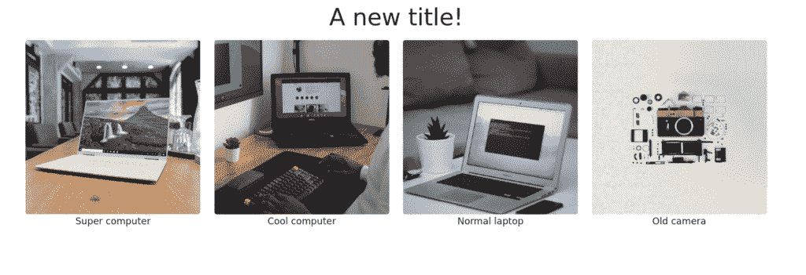

# 如何为 GitHub 生成 SSH 密钥

> 原文：<https://kinsta.com/blog/generate-ssh-key/>

[Git 和 GitHub](https://kinsta.com/knowledgebase/what-is-github/) 是每个开发者必不可少的工具。它们被广泛应用于几乎每一种软件开发项目中。

还有其他 Git 托管服务，比如 Gitlab 和 T2，但是 GitHub 是开发者最受欢迎的选择。你甚至可以编辑你的个人资料，让它看起来对招聘人员更有吸引力。

你可以使用 Git 和 GitHub 来组织你的项目，与其他开发者合作，当然，在 [Kinsta](https://kinsta.com/help/git/) 也可以。

但是因为 [Git 和 GitHub 是相关但不同的工具](https://kinsta.com/knowledgebase/git-vs-github/)，你需要用它们中的每一个不断更新你的工作流程。

[Pro tip: use SSH keys for each one of your machines... and use this guide to get started 🔑😄. So, in this tutorial, you’ll learn what they are, some of their advantages, and how to generate and configure GitHub SSH keys.Click to Tweet](https://twitter.com/intent/tweet?url=https%3A%2F%2Fkinsta.com%2Fblog%2Fgenerate-ssh-key%2F&via=kinsta&text=Pro+tip%3A+use+SSH+keys+for+each+one+of+your+machines...+and+use+this+guide+to+get+started+%F0%9F%94%91%F0%9F%98%84.+So%2C+in+this+tutorial%2C+you%E2%80%99ll+learn+what+they+are%2C+some+of+their+advantages%2C+and+how+to+generate+and+configure+GitHub+SSH+keys.&hashtags=SSH%2CWebDev)

我们建议为您的每台机器使用 [SSH](https://kinsta.com/help/connect-to-ssh/) 密钥。因此，在本教程中，您将了解它们是什么，它们的一些优点，以及如何生成和配置 GitHub SSH 密钥。

我们开始吧！

## 什么是 SSH 密钥？

简单地说，SSH 密钥是用于 [SSH(安全外壳)协议](https://kinsta.com/knowledgebase/ssh-vs-ssl/)的凭证，以实现通过互联网对远程计算机的安全访问。通常，认证发生在命令行环境中。


> 需要在这里大声喊出来。Kinsta 太神奇了，我用它做我的个人网站。支持是迅速和杰出的，他们的服务器是 WordPress 最快的。
> 
> <footer class="wp-block-kinsta-client-quote__footer">
> 
> 
> 
> <cite class="wp-block-kinsta-client-quote__cite">Phillip Stemann</cite></footer>

[View plans](https://kinsta.com/plans/)

该协议基于客户机-服务器体系结构，这意味着您作为用户(或“客户机”)需要使用一种称为 SSH 客户机的特殊软件来登录到远程服务器并执行命令。这基本上就是你通过终端向 GitHub 认证时要做的事情。

[](https://kinsta.com/wp-content/uploads/2022/01/Git-push.png)

Git push.


但是 SSH 不仅仅用于 GitHub。它被其他平台广泛使用，如 Kinsta、Google Cloud 和 Amazon Web services，以创建一个访问其服务的安全通道。

现在，进入 SSH 密钥的真正工作方式，您需要理解公钥和私钥之间的区别。

### 公钥与私钥

让我们从基础开始。

SSH 协议使用一种叫做**非对称加密**的加密技术。这个术语可能听起来复杂而怪异，但事实并非如此。

基本上，非对称加密是一种使用一对密钥的系统，即**公钥**和**私钥**。

正如您可能猜到的，公钥可以与任何人共享。它的主要目的是加密数据，将信息转换成密码或密文。该密钥通常被发送到其他系统(例如，服务器)，以便在通过互联网发送数据之前对其进行加密。

另一方面，私钥是您必须保密的。它用来用你的公钥解密加密的数据。没有它，就不可能解码你的加密信息。

这种方法允许您和服务器保持一个安全的通信通道来传输信息。

当您通过 SSH 连接到服务器时，后台会发生以下情况:

1.  客户端将公钥发送给服务器。
2.  服务器要求客户端使用私钥对用公钥加密的随机消息进行签名。
3.  客户端对消息进行签名，并将结果转发给服务器。
4.  在客户端和服务器之间建立了安全连接。

在任何情况下，保护好你的私人密钥并与任何人分享是很重要的。它们实际上是发送给你的所有信息的关键。


## 在 GitHub 中使用 SSH 密钥

自 2021 年 8 月 13 日起，Github 不再接受命令行访问的密码认证。这意味着现在您需要通过个人访问令牌或使用 SSH 密钥进行身份验证(稍微方便一点)。

当您尝试在终端中通过 HTTP 使用 GitHub 密码进行身份验证时，会发生以下情况:

```
Username for 'https://github.com': yourusername

Password for 'https://[[email protected]](/cdn-cgi/l/email-protection)':

remote: Support for password authentication was removed on August 13, 2021\. Please use a personal access token instead.

remote: Please see https://github.blog/2020-12-15-token-authentication-requirements-for-git-operations/ for more information.

fatal: Authentication failed for 'https://github.com/yourusername/repository.git/'
```

GitHub 需要您的公钥来授权您通过 SSH 编辑您的任何回购。

让我们看看如何在本地生成 SSH 密钥。

### 如何在本地生成 SSH 密钥

现在，您已经对 SSH 协议以及公钥和私钥之间的区别有了一些了解，是时候在您的机器和 GitHub repos 之间建立安全的 SSH 通道了。

在我们继续之前，您应该已经有了一个 [GitHub 帐户](https://github.com/join)，并且在您的系统中安装了一个带有 [Git](https://git-scm.com/downloads) 的终端/命令提示符。如果你运行的是 Windows，确保你安装了 [Git bash](https://git-scm.com/download/win) ，它内置了你跟随本教程所需的所有工具。

OpenSSH 客户端是用于通过 SSH 连接的最流行的开源软件。你不需要担心你的操作系统，因为它默认安装在 Linux、 [macOS](https://kinsta.com/blog/how-to-screenshot-on-mac/) 和 [Windows 10](https://learn.microsoft.com/en-us/windows-server/administration/openssh/openssh_overview) 上。

您需要在 Windows 上启动命令提示符，或者在基于 Unix 的系统上启动终端来生成本地 SSH 密钥。通常，您可以通过在应用程序面板中搜索“终端”、“cmd”或“powershell”，然后单击显示的图标来完成此操作。

[](https://kinsta.com/wp-content/uploads/2022/01/open-terminal.png)

Terminal application search.


### 信息

如果你使用 Linux，大多数发行版都有快捷键 Ctrl + Alt + T 来打开一个终端。


这样做之后，你应该有一个类似下图的窗口。

[](https://kinsta.com/wp-content/uploads/2022/01/terminal.png)

Terminal application.


运行以下命令来生成本地 SSH 密钥对:

```
ssh-keygen -t ed25519 -C "[[email protected]](/cdn-cgi/l/email-protection)"
```

是时候告诉你一个秘密了:没有人能真正记住这个命令！大多数开发人员每次都必须谷歌一下，因为:

1.  这是一个非常长的命令，带有容易忘记的、看起来随机的数字。
2.  我们很少用，所以大部分时间把它记在脑子里不值得。

然而，理解我们引入到终端中的每个命令是很重要的，所以让我们来看看这个命令的每个部分是什么意思。

## 注册订阅时事通讯


### 想知道我们是怎么让流量增长超过 1000%的吗？

加入 20，000 多名获得我们每周时事通讯和内部消息的人的行列吧！

[Subscribe Now](#newsletter)

*   [ssh-keygen](https://linux.die.net/man/1/ssh-keygen) :用于创建一对新的 ssh 密钥的命令行工具。你可以用`ssh-keygen help`看到它的标志
*   **-t ed 25519:**`-t`标志用于指示用于创建密钥对的数字签名的算法。如果您的系统支持，`ed25519`是您可以用来创建 SSH 密钥对的最佳算法。
*   **-C " email ":**`-c`标志用于在公钥末尾提供自定义注释，通常是密钥对创建者的电子邮件或标识。

在终端中输入命令后，您必须输入想要保存密钥的文件。默认情况下，它位于您的主目录中，在一个名为“”的隐藏文件夹中。ssh”，不过你可以随便改。

然后，系统会要求您将密码添加到您的密钥对中。如果您的设备在任何时候受到威胁，这将增加一层额外的安全性。添加密码不是强制性的，但始终建议这样做。

整个过程是这样的:

[](https://kinsta.com/wp-content/uploads/2022/01/ssh-keygen.png)

ssh-keygen command.


正如您所看到的，这个命令在您选择的目录中生成了两个文件(通常是 **~/)。ssh** ):带`.pub`扩展名的公钥，不带扩展名的私钥。

稍后我们将向您展示如何向您的 GitHub 帐户添加公钥。

### 将 SSH 密钥添加到 ssh-agent

ssh-agent 程序在后台运行，安全地保存您的私钥和密码，并让它们随时可供 ssh 使用。这是一个很好的工具，可以让你在每次连接到服务器的时候都不用输入密码。

因此，您要将新的私钥添加到这个代理中。方法如下:

1.  Make sure ssh-agent is running in the background.

    ```
    eval `ssh-agent`
    # Agent pid 334065
    ```

    如果一切正常，您会收到类似这样的消息。这意味着 ssh-agent 正在一个特定的进程 id (PID)下运行。

2.  Add your SSH private key (the one without extension) to the ssh-agent.

    ```
    ssh-add ~/.ssh/kinsta_keys
    ```

    用您的 SSH 密钥的名称替换 **kinsta_keys** 。如果这是您创建的第一个密钥，它应该被命名为“id_algorithm_used”，例如， **id_ed25519** 。

### 将 SSH 密钥添加到 GitHub 帐户

最后一步是将您的公钥添加到您的 GitHub 帐户中。只需遵循以下说明:

1.  将您的 SSH 公钥复制到您的剪贴板。您可以使用文本编辑器打开文件并拷贝它，或者使用终端显示其内容。

    ```
    cat ~/.ssh/kinsta_keys.pub
    # ssh-ed25519 AAAAC3NzaC1lZDI1NTE5AAAAIJl3dIeudNqd0DPMRD6OIh65tjkxFNOtwGcWB2gCgPhk [[email protected]](/cdn-cgi/l/email-protection#107b797e63647165637562507b797e6364713e737f7d)
    ```

2.  [Log into GitHub ]](https://github.com/login) and go to the upper-right section of the page, click in your profile photo, and select ****Settings.****

    [](https://kinsta.com/wp-content/uploads/2022/01/GitHub-settings.png) 

    GitHub 设置。

    

3.  Then, in profile your settings, click **SSH and GPG keys**.

    [](https://kinsta.com/wp-content/uploads/2022/01/GitHub-ssh-gpg-keys.png) 

    宋承宪和 GPG 键。

    

4.  Click the **New SSH key** button.

    [](https://kinsta.com/wp-content/uploads/2022/01/GitHub-new-ssh-key.png) 

    新增 SSH 按键。

    

5.  Give your new SSH key on GitHub a **Title** — usually, the device you’ll use that key from. And then paste the key into the **Key** area.

    [](https://kinsta.com/wp-content/uploads/2022/01/title-key-field.png) 

    添加新的 SSH 密钥形式。

    

6.  Add your SSH key.

    [](https://kinsta.com/wp-content/uploads/2022/01/add-ssh-key-button.png) 

    添加 SSH 按键。

    

### 使用 Repo Push 测试 SSH 连接

是时候测试你目前所做的一切了。您将使用 SSH 更改、提交和推送一个现有的 repos，以确保您的连接设置正确。

所有的 Kinsta 托管计划都包括来自我们资深 WordPress 开发者和工程师的 24/7 支持。与支持我们财富 500 强客户的同一个团队聊天。查看我们的计划！

对于我们的例子，我们将修改我们在 [Git for Web 开发教程](https://kinsta.com/blog/git-for-web-development/)中创建的简单 HTML 站点。

首先，我们需要将存储库克隆到我们的本地机器上。我们可以去 GitHub 上的 repo 页面，复制它提供的 SSH 地址。

[](https://kinsta.com/wp-content/uploads/2022/01/clone-ssh.png)

SSH clone command.


然后，使用终端克隆回购:

```
git clone [[email protected]](/cdn-cgi/l/email-protection):DaniDiazTech/HTML-site.git
```

现在，让我们在**index.html**文件中添加一个简单的`<h1>`标记:

```
...
<div class="container my-2">
    <h1 class="text-center">A new title!<h1>
</div>

<div class="container my-3">
...
```

[](https://kinsta.com/wp-content/uploads/2022/01/new-title.png)

The simple HTML site.


为了使编辑保持简单，我们没有使用任何 JavaScript 或 CSS。但是如果你精通 JavaScript，你可能会在 Kinsta 找到一个位置。检查成为 Kinsta 团队成员所需的[编码技能。](https://kinsta.com/developer-roles/coding-skills-at-kinsta/)

完成此操作后，提交更改:

```
git commit -am "Added a simple title"
```

并像平常一样将它们推入 GitHub。

```
git push
```

如果一切顺利，恭喜你！您只需在您的机器和 GitHub 之间建立一个 SSH 连接。

### 为不同的 GitHub 帐户管理多个 SSH 密钥

如果你有多个 GitHub 账户——假设一个用于你的个人项目，一个用于你的工作——很难同时使用 SSH。你通常需要不同的机器来认证不同的 GitHub 账户。

但是这可以通过配置 SSH 配置文件很容易地解决。

 让我们开始吧。

1.  创建另一个 SSH 密钥对，并将其添加到您的另一个 GitHub 帐户。请记住您要分配新密钥的文件的名称。

    ```
    ssh-keygen -t ed25519 -C "[[email protected]](/cdn-cgi/l/email-protection)"
    ```

2.  创建 SSH 配置文件。配置文件告诉 ssh 程序它应该如何运行。默认情况下，配置文件可能不存在，所以在。ssh/文件夹:

    ```
    touch ~/.ssh/config
    ```

3.  修改 SSH 配置文件。打开配置文件并粘贴下面的代码:

    ```
    #Your day-to-day GitHub account

    Host github.com
      HostName github.com
      IdentityFile ~/.ssh/id_ed25519
      IdentitiesOnly yes

    # Work account
    Host github-work
      HostName github.com
      IdentityFile ~/.ssh/work_key_file
      IdentitiesOnly yes
    ```

现在，每次您需要使用您的工作帐户或辅助帐户通过 SSH 进行身份验证时，您都需要调整一下 repo SSH 地址，从:

```
[[email protected]](/cdn-cgi/l/email-protection):workaccount/project.git
```

…致:

```
[[email protected]](/cdn-cgi/l/email-protection):workaccount/project.git
```

[Git and GitHub are essential tools for every developer & this guide will help you unlock a new addition: SSH Keys 🔑Click to Tweet](https://twitter.com/intent/tweet?url=https%3A%2F%2Fkinsta.com%2Fblog%2Fgenerate-ssh-key%2F&via=kinsta&text=Git+and+GitHub+are+essential+tools+for+every+developer+%26amp%3B+this+guide+will+help+you+unlock+a+new+addition%3A+SSH+Keys+%F0%9F%94%91&hashtags=GitHub%2CWebDev)

## 摘要

祝贺您——您已经学到了通过 SSH 连接 GitHub 所需的大部分实用知识！

本教程讨论了 SSH 协议的必要性、公钥和私钥之间的区别、如何生成密钥、如何将密钥添加到 GitHub，甚至如何为不同的 GitHub 帐户管理多个 SSH 密钥。请记住，除非您想失去对所有内容的访问，否则您的私钥需要保持这种状态:私有。

有了这些知识，现在您就可以用 Git 和 GitHub 开发一个[完美的工作流了。继续编码！](https://kinsta.com/blog/git-for-web-development/)

* * *

让你所有的[应用程序](https://kinsta.com/application-hosting/)、[数据库](https://kinsta.com/database-hosting/)和 [WordPress 网站](https://kinsta.com/wordpress-hosting/)在线并在一个屋檐下。我们功能丰富的高性能云平台包括:

*   在 MyKinsta 仪表盘中轻松设置和管理
*   24/7 专家支持
*   最好的谷歌云平台硬件和网络，由 Kubernetes 提供最大的可扩展性
*   面向速度和安全性的企业级 Cloudflare 集成
*   全球受众覆盖全球多达 35 个数据中心和 275 多个 pop

在第一个月使用托管的[应用程序或托管](https://kinsta.com/application-hosting/)的[数据库，您可以享受 20 美元的优惠，亲自测试一下。探索我们的](https://kinsta.com/database-hosting/)[计划](https://kinsta.com/plans/)或[与销售人员交谈](https://kinsta.com/contact-us/)以找到最适合您的方式。