# 用于 Web 开发的 Git:了解项目的典型工作流

> 原文：<https://kinsta.com/blog/git-for-web-development/>

Web 开发本质上与协作相关。大多数情况下，您将与其他开发人员一起工作，即使您不这样做，Git 也可以在许多其他方面帮助您。

Git 是控制我们制作的应用程序版本的软件。它被[个人开发者](https://kinsta.com/podcast/solo-developer-thousands-websites/)，大公司，甚至世界上最大的开源项目 Linux 所使用。

作为一名 [web 开发者](https://kinsta.com/blog/how-to-become-a-web-developer/)，知道如何正确使用 Git 进行 web 开发是极其重要的。我们不只是在谈论“git 添加”、“git 提交”和“git 推送”。你应该知道用 Git 创建一个 web 项目的整个工作流程。

还不信服？开始吧！

## 为什么要用 Git？

这些只是开始使用 Git 的一些原因:

*   **组织:**与在像 v1、v2、v3 等文件夹中管理您的项目不同，您有一个带有特殊数据库的项目，该数据库存储所有版本的文件
*   协作: Git 让你和其他人同时在同一个项目上工作，而不会产生冲突。
*   **开源:** Git 是开源的，但它也是我们用来协作和创建优秀开源软件的工具。任何人都可以在像 [GitHub](https://kinsta.com/knowledgebase/what-is-github/) 或 [Bitbucket](https://kinsta.com/blog/bitbucket-vs-github/) 这样的平台上对开源项目提出请求。
*   **平台灵活性:**如今，你有很多不同的 Git 托管服务可供选择，比如 [Gitlab](https://kinsta.com/blog/gitlab-vs-github/) ，GitHub，Bitbucket，SourceForge。您甚至可以为所有项目使用自托管解决方案。
*   **轻松备份:**轻松撤销错误，永远不会丢失项目代码库。

[It's time to learn more than just 'git add', 'git commit' and 'git push' 👩‍💻 Dive into everything you need to know about a typical Git workflow in this guide 👇Click to Tweet](https://twitter.com/intent/tweet?url=https%3A%2F%2Fbit.ly%2F3IaRZC3&via=kinsta&text=It%27s+time+to+learn+more+than+just+%27git+add%27%2C+%27git+commit%27+and+%27git+push%27+%F0%9F%91%A9%E2%80%8D%F0%9F%92%BB+Dive+into+everything+you+need+to+know+about+a+typical+Git+workflow+in+this+guide+%F0%9F%91%87&hashtags=WebDev%2CGit)

我们现在已经提到过一两次 GitHub 这个术语了，那么 Git 和 GitHub 有什么区别呢？


> 需要在这里大声喊出来。Kinsta 太神奇了，我用它做我的个人网站。支持是迅速和杰出的，他们的服务器是 WordPress 最快的。
> 
> <footer class="wp-block-kinsta-client-quote__footer">
> 
> 
> 
> <cite class="wp-block-kinsta-client-quote__cite">Phillip Stemann</cite></footer>

[View plans](https://kinsta.com/plans/)

如果您完全不熟悉 Git，这可能会让您感到困惑。简单来说， [Git 和 GitHub 是相关但不同的工具](https://kinsta.com/knowledgebase/git-vs-github/)。

Git 是版本控制系统(VCS ),我们用它来控制我们文件的变更，而 GitHub 是一个服务，我们用它来在线存储我们的项目文件和它们的 Git 历史(位于**)。git/** 文件夹)。

Git 是本地安装在你的机器上的，如果没有 GitHub 或 GitLab 这样的托管服务，很难与其他[开发者](https://kinsta.com/blog/web-developer-salary/)合作。

GitHub 通过添加其他改进协作的特性，如克隆、分叉和合并，来增强 Git。这两个工具结合在一起，为您带来一个相对友好的生态系统来开发、管理和向其他人展示您的项目。


## Web 开发工作流的基本 Git

在接下来的小节中，您将通过实践了解更多关于 web 开发的 Git 工作流。

### 安装要求

如果您还没有安装 Git，这是一个绝佳的时机。它易于安装，在大多数操作系统上都可用。

从[官方下载页面](https://git-scm.com/downloads)下载它，或者如果你使用 Linux 或 macOS，用软件包管理器安装它:

[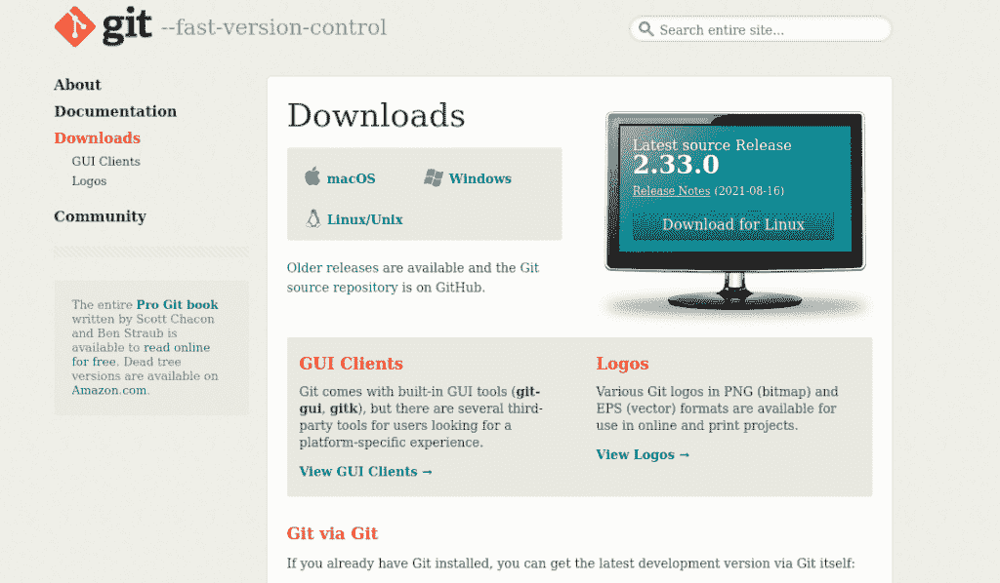](https://kinsta.com/wp-content/uploads/2021/11/download-git.png)

Git downloads page.


为了测试安装是否一切顺利，在 Linux 或 macOS 上启动一个终端，在应用程序菜单中搜索“终端”，或者在 Windows 上打开 Git bash(默认情况下随 Git 一起安装)。

然后键入:

```
git --version
```

[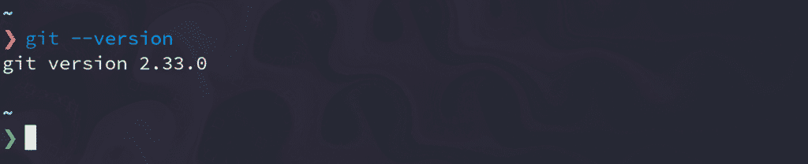](https://kinsta.com/wp-content/uploads/2021/11/git-version.png)

Git version.


如果您得到一个 Git 版本的响应，那就可以了。

我们还需要一个 GitHub 帐户，所以请确保[注册](https://github.com/join)或登录 GitHub:

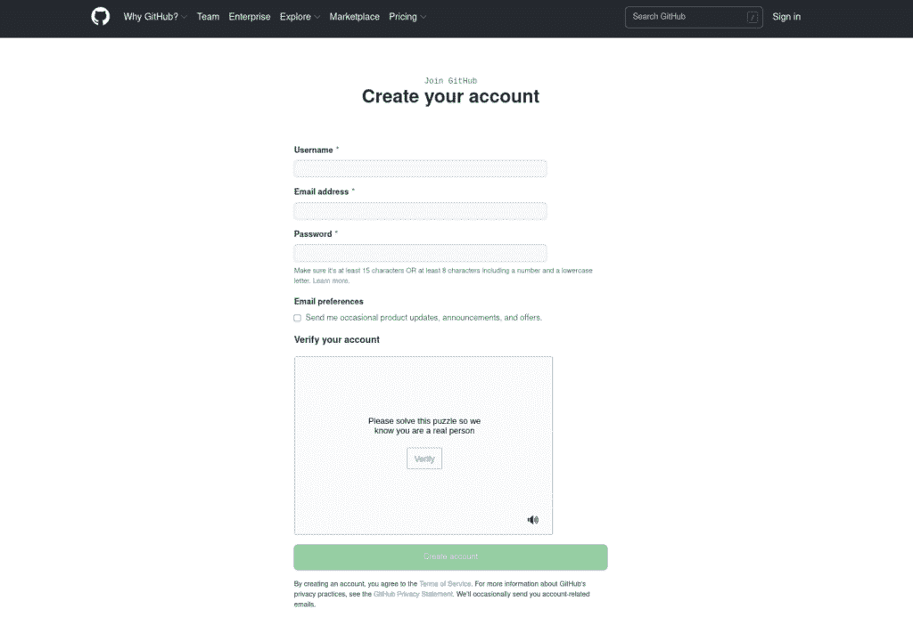

GitHub signup page.


一旦安装了 Git 并登录了 GitHub 帐户，就可以进入下一部分了。


### 协作项目的基本 Git 工作流

如前所述，大多数时候你不会独自开发项目。协作是一项关键技能，Git 和 GitHub 帮助我们使它成为一个简单而有效的过程。

Git 项目的典型工作流如下所示:

1.  通过克隆存储库或 repo 获得项目的本地副本。如果你是合作者，你应该先进行回购。
2.  使用您将处理的要素的代表性名称创建一个分支。
3.  编辑项目。
4.  将更改提交到您的本地计算机。
5.  将更改推送到远程存储库。
6.  创建对原始回购的提取请求。
7.  在原回购主分支中合并解决冲突。

### 辅导的

现在是我们动手的时候了！

在本指南中，您将创建一个简单的 HTML 网站。出于实用目的，您将把基础项目从 [HTML 站点存储库](https://github.com/DaniDiazTech/HTML-site)分支到您的 GitHub 帐户。这可以对所有公共可用的存储库进行。


### 信息

fork 是一个单独的存储库副本，您可以在不影响原始项目的情况下管理和修改它。另一方面，克隆一个回购协议只是创建了文件的一个本地拷贝。


要分叉 HTML 站点，请转到[这个 GitHub 库](https://github.com/DaniDiazTech/HTML-site)并点击位于页面右上角的**分叉**按钮:

[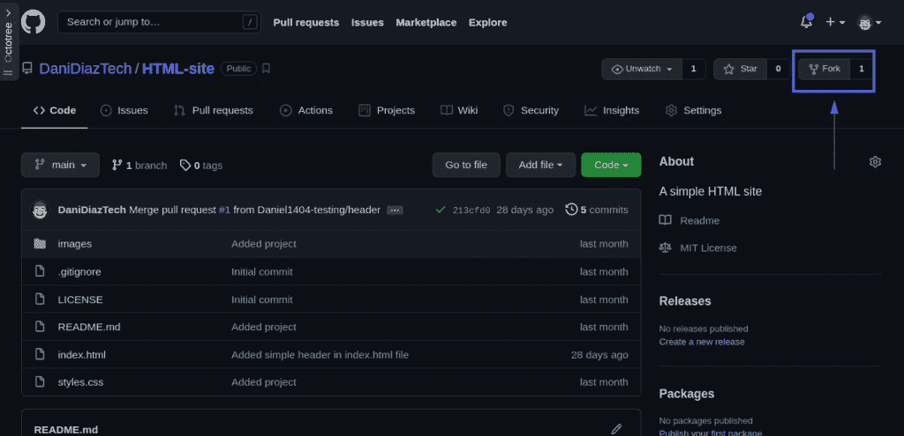](https://kinsta.com/wp-content/uploads/2021/11/github-fork.png)

GitHub fork.


现在你有了一个原始回购的分支，只在你的 GitHub 帐户上可用。这是完全相同的回购——直到你开始提交更改。

如您所见，派生公共回购只需几秒钟。这对于开源项目来说非常好，但是请记住，如果您的组织有一个私人回购，那么在尝试使用它之前，您需要作为贡献者被包括在内。

是时候把你的叉子带到你的本地机器上了。为此，您需要使用命令`git clone`克隆它，该命令从远程服务器检索 Git 存储库:

```
git clone remote_url
```

您需要用 fork 的 URL 替换`remote_url`。要获得 GitHub 回购协议的确切网址，请访问其页面并点击**代码**。然后选择 **SSH** ，复制它给你的链接:

[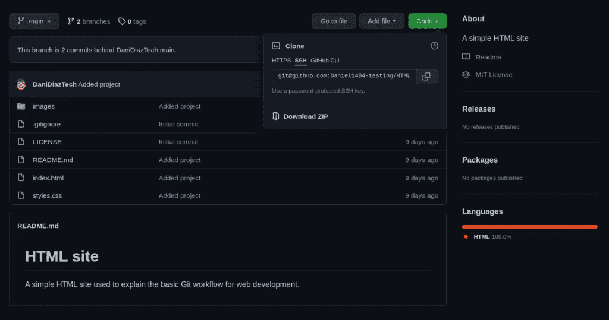](https://kinsta.com/wp-content/uploads/2021/11/ssh_url.png)

SSH URL.


克隆分叉回购的命令是:

```
git clone [[email protected]](/cdn-cgi/l/email-protection):yourusername/HTML-site.git
```

当您克隆一个存储库时，您会得到一个以其名称命名的文件夹。该文件夹中是项目的源代码(在本例中是 HTML 站点)和 Git repo，后者位于名为**的文件夹中。git** 。

您可以在图形文件管理器中打开新文件夹，或者使用`ls`或`dir` [命令](https://kinsta.com/blog/linux-commands/)从终端直接列出新目录中的文件列表:

```
# Linux/macOS
ls HTML-site/
# Windows
dir HTML-site\
.git images .gitignore index.html LICENSE README.md styles.css
```

这个 HTML 站点非常简单。它使用 Bootstrap 作为实用工具，并从 [Unsplash](https://unsplash.com/) 下载一些图片，在那里你可以[为你的网站](https://kinsta.com/blog/free-images-for-wordpress/)下载免费图片。

如果你在浏览器中打开**index.html**文件，你会看到一个简单的页面，上面有一些图片:

[](https://kinsta.com/wp-content/uploads/2021/11/simple-website.png)

The simple web page we’re creating.


该是研究这个项目的时候了。感觉很空，也许带有网站名称的标题可以增强用户体验。

为此，进入 **HTML-site** 目录并创建一个名为`header`的分支。在这个新的分支中，我们可以编辑所有的文件并实现尽可能多的代码，因为它不会影响主(原始)分支。

## 注册订阅时事通讯


### 想知道我们是怎么让流量增长超过 1000%的吗？

加入 20，000 多名获得我们每周时事通讯和内部消息的人的行列吧！

[Subscribe Now](#newsletter)

运行以下命令:

```
git checkout -b header 
```

这将创建一个名为“header”的分支，并在这之后立即切换到它。这相当于:

```
git branch header
git checkout header 
```

要确认一切正常，运行:

```
git status
# On branch header
# nothing to commit, working tree clean 
```

你会看到你已经从“主”分支转移到“头”分支，但是工作树仍然是干净的，因为我们没有编辑任何文件。

在您最喜欢的[代码编辑器](https://kinsta.com/blog/best-text-editors/)中，打开您的分支项目中的【index.html】文件**。这个文件包括一些到 [Bootstrap 5](https://getbootstrap.com/) 的链接，所以我们可以利用框架的现成组件。**

 **将以下代码添加到**index.html**文件中的`<body>`标签内和图像容器上方:

```
<header>
  <nav class="navbar navbar-light bg-light">
    <div class="container-fluid">
      <span class="navbar-brand mb-0 h1">HTML site</span>
    </div>
  </nav>
</header>
```

[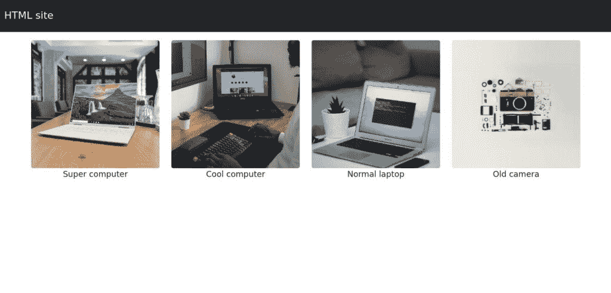](https://kinsta.com/wp-content/uploads/2021/11/website-with-header.jpg)

Our web page with a new header.


好看多了！随意做你想做的其他分支和改变。

完成项目编辑后，就该将所有更改提交到本地存储库中了。在项目目录中，在终端中键入以下内容:

```
git add --all
git commit -m "Added simple header in index.html file"
```


### 重要的

所有的 Git 提交消息都必须清晰且有意义。每当您添加一个提交时，您和您的团队成员应该能够识别在那个提交中发生了什么，这样，如果一个 bug 发生了，您就可以很容易地修复它。


当您第一次开始一个项目时，通常会有描述性的提交消息，但是随着时间的推移和焦点的转移，消息的质量往往会下降。确保保持良好的命名习惯。

现在您已经对您的本地 repo 做出了承诺(它仍然只在您的计算机上可用)，是时候将它推送到远程存储库了。

如果您试图像往常一样提交，那是不会成功的，因为您目前正在处理`header`分支。您需要为`header`设置上游分支:

```
git push --set-upstream origin header
```

从 2021 年 8 月 13 日开始，GitHub 要求使用 SSH 认证，所以请确保您的密钥设置正确。

厌倦了低于 1 级的 WordPress 托管支持而没有答案？试试我们世界一流的支持团队！[查看我们的计划](https://kinsta.com/plans/?in-article-cta)

在这之后，您应该能够在分叉的存储库中看到一个名为`header`的新分支(例如**https://github.com/yourusername/HTML-site/branches**):

[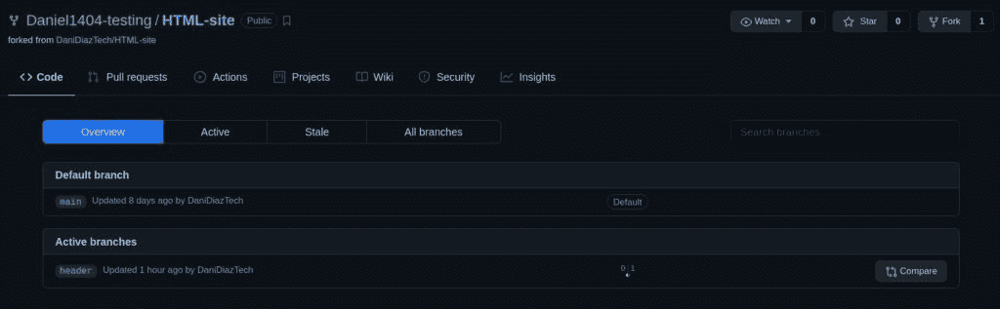](https://kinsta.com/wp-content/uploads/2021/11/header-branch.jpg)

The “header” branch.


要创建原始回购的拉取请求，请点击**活动分支**部分下方的**比较**。

这将引导您进入一个 pull 请求，在这里您需要选择想要合并的分支(原始分支或 fork 分支)。默认情况下，它会显示与基本存储库合并的选项:

[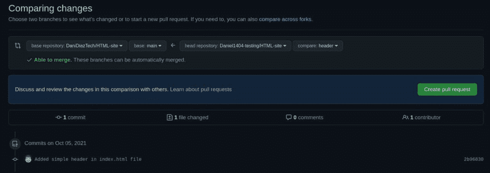](https://kinsta.com/wp-content/uploads/2021/11/pull-request.jpg)

Creating pull requests on GitHub.


一旦您点击了 pull request 选项，您将需要写一个简短的变更描述，就像您之前的提交一样。再次强调，尽量做到简洁而有描述性:

[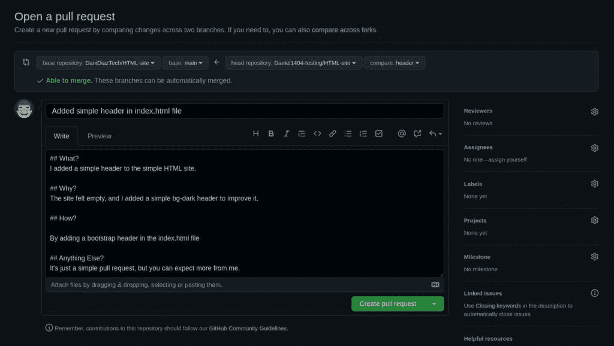](https://kinsta.com/wp-content/uploads/2021/11/writing-pull-request.jpg)

Writing a pull request message.


单击 **Create pull request** 按钮，等待基本存储库所有者接受您的更改或给您反馈。

祝贺您——您已经完成了 web 开发通用 Git 工作流的所有步骤！

这是一个非常基本的例子，但是这个逻辑适用于所有规模的项目。确保在更大的协作项目中也紧密地实施这个工作流程。


## 如何在 Kinsta 使用 Git

如果你是一个 [Kinsta 用户](https://kinsta.com/schedule-demo/)，你已经有两种方式在你的 [MyKinsta 门户](https://kinsta.com/mykinsta/)中使用 Git 和 GitHub。

让我们从第一个选项开始。您可以在中轻松地 [SSH，并从 GitHub、Gitlab 或 Bitbucket 等任何 Git 托管服务中提取回购。](https://kinsta.com/help/connect-to-ssh/)

为此，请转到您的**站点**选项卡，选择一个站点，然后转到[您的 SSH 详细信息部分](https://kinsta.com/feature-updates/add-ssh-keys/)，并复制 SSH 终端命令。

[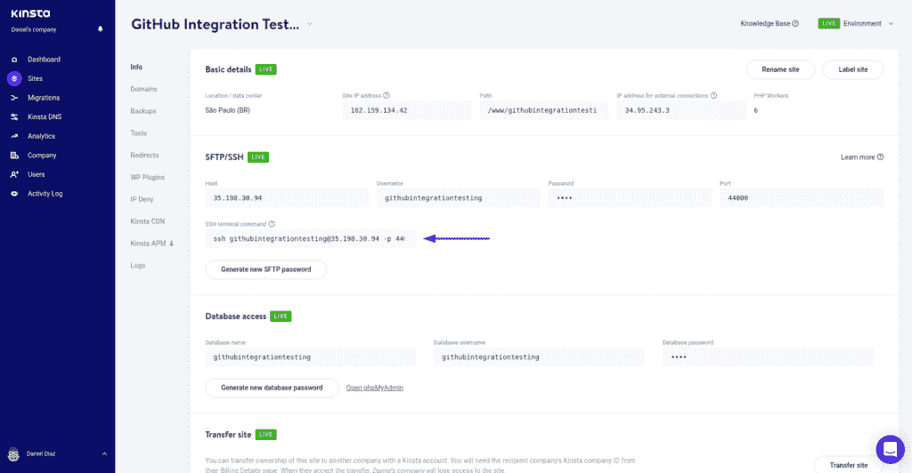](https://kinsta.com/wp-content/uploads/2021/11/SSH-details-page.png)

SSH details section.


通过 SSH 登录到您的站点，将上面的命令粘贴到您的终端，并进入您站点的公共文件夹(位于 **/www/yoursitename/** 下)。这里是你所有 WordPress 文件的位置，所以你可以用你一直在做的自定义主题或插件来下载一个 Git repo。

下面是如何用一个简单的命令下载 Git repo:

```
ssh [[email protected]](/cdn-cgi/l/email-protection) -p PORT "cd /www/my_site/public && git pull https://github.com/user/repo.git" 
```


### 重要的

SSH 应该由高级用户使用。如果您对此不精通，请不要犹豫，先联系 [Kinsta 支持](https://kinsta.com/kinsta-support/)。


现在，在 Kinsta 引入新的 GitHub 部署特性，你可以从 GitHub 库部署一个完整的 WordPress 站点。

你的 GitHub repo 应该包括一份 [WordPress 核心文件](https://kinsta.com/knowledgebase/wordpress-files/)的拷贝，当然，还有你的网站在 **wp-content** 文件夹中的内容。

让我们快速看一下这个选项。

去你公司的一个站点[创建一个临时环境](https://kinsta.com/help/staging-environment/)。这不会超过几分钟。

[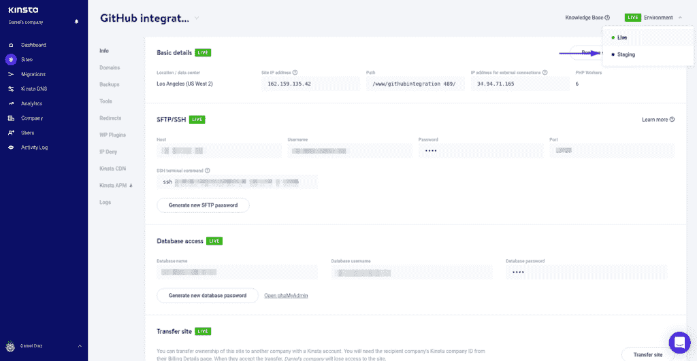](https://kinsta.com/wp-content/uploads/2021/11/staging-env.png)

Staging environment.


一旦你进入你的准备站点，进入**部署**选项卡，点击**开始设置**按钮。你将会看到一个 GitHub 模型，它将让 Kinsta 与你的 GitHub 帐户连接。

[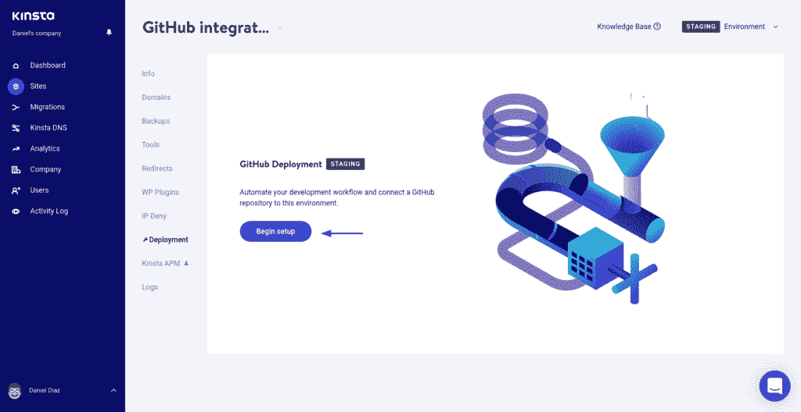](https://kinsta.com/wp-content/uploads/2021/11/begin-setup.png)

GitHub deployment tab.


现在，选择你要退出网站的回购协议。

[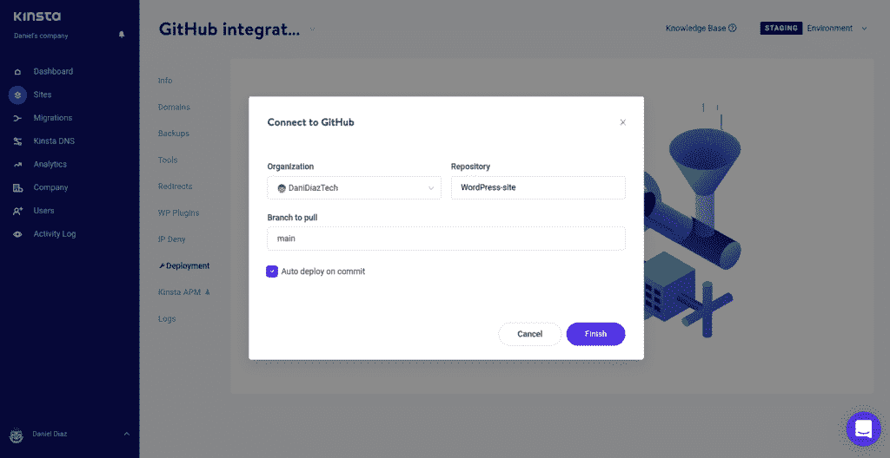](https://kinsta.com/wp-content/uploads/2021/11/choose-repo.png)

Connect Kinsta to GitHub.


最后，部署您的站点，并通过您的临时站点 URL 访问它。

[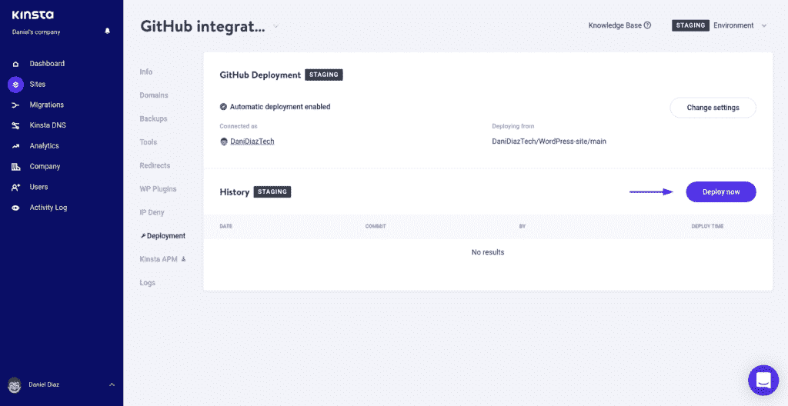](https://kinsta.com/wp-content/uploads/2021/11/deploy-site.png)

Deploy now button.


这项功能仍处于测试阶段，但很快每个 Kinsta 用户都可以使用它。

如果你知道如何很好地使用 Git 和 Kinsta，它们会是一个强大的组合。虽然我们的教程只是给出了一个简单的例子，但是您可以从我们的 Git 知识库文章中学到更多。

[Step up your Git knowledge with this guide to a typical project workflow ✅Click to Tweet](https://twitter.com/intent/tweet?url=https%3A%2F%2Fbit.ly%2F3IaRZC3&via=kinsta&text=Step+up+your+Git+knowledge+with+this+guide+to+a+typical+project+workflow+%E2%9C%85&hashtags=WebDev%2CGit)

## 摘要

如今，Git 是 web 开发的一个必须学习的工具，因为大部分时间你将与其他人合作来创建最好的项目。

在本文中，我们讨论了在项目中使用 Git 的一些重要原因，并向您展示了在 Git repo 中协作的基本工作流程。

Git 是一个如此强大的工具，你甚至可以将它的使用扩展到 [WordPress hosting](https://kinsta.com/wordpress-hosting/) ，所以学习和实现它作为你的 web 开发技能库的一部分只会让你受益。

对于改进这个用于 web 开发的基本 Git 工作流，您还有其他建议吗？请在评论区告诉我们！

* * *

让你所有的[应用程序](https://kinsta.com/application-hosting/)、[数据库](https://kinsta.com/database-hosting/)和 [WordPress 网站](https://kinsta.com/wordpress-hosting/)在线并在一个屋檐下。我们功能丰富的高性能云平台包括:

*   在 MyKinsta 仪表盘中轻松设置和管理
*   24/7 专家支持
*   最好的谷歌云平台硬件和网络，由 Kubernetes 提供最大的可扩展性
*   面向速度和安全性的企业级 Cloudflare 集成
*   全球受众覆盖全球多达 35 个数据中心和 275 多个 pop

在第一个月使用托管的[应用程序或托管](https://kinsta.com/application-hosting/)的[数据库，您可以享受 20 美元的优惠，亲自测试一下。探索我们的](https://kinsta.com/database-hosting/)[计划](https://kinsta.com/plans/)或[与销售人员交谈](https://kinsta.com/contact-us/)以找到最适合您的方式。**