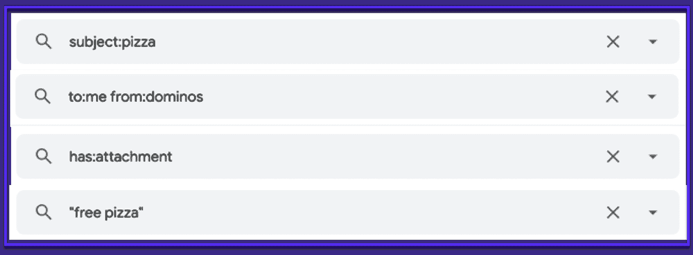
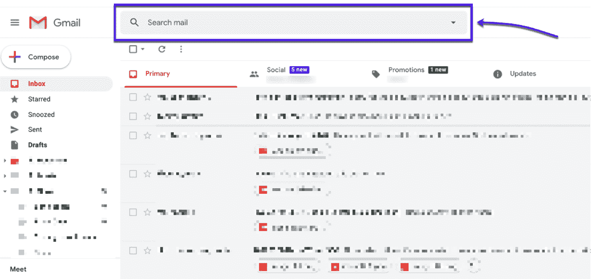
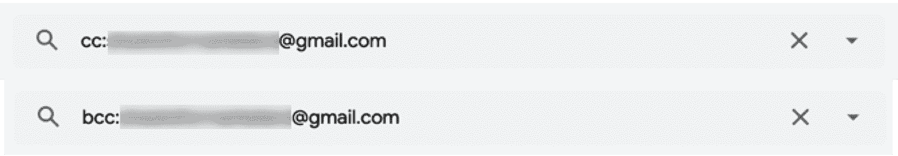
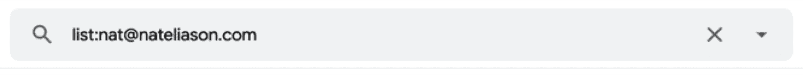
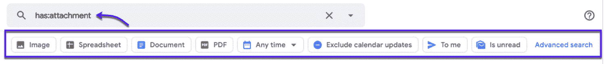
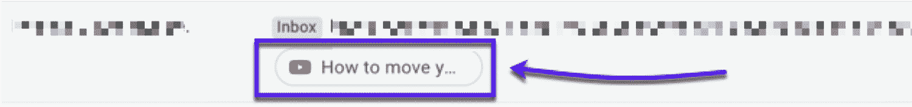
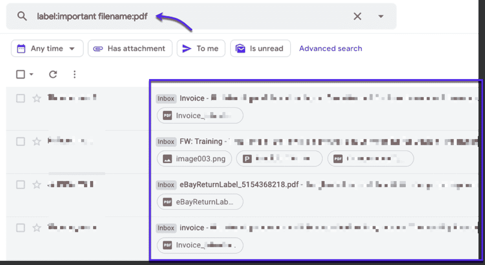

# 2022 年，20 家 Gmail 搜索运营商将征服你的收件箱

> 原文：<https://kinsta.com/blog/gmail-search-operators/>

如果你想掌控你的收件箱，你需要使用 **Gmail 搜索操作器。**

这些是搜索命令，当你需要找到你在 Gmail 中丢失的电子邮件或附件时，可以通过特定的短语或关键字快速过滤电子邮件，还有很多更有用的功能(你马上就会看到)。

在本文中，您将了解什么是 Gmail 搜索操作符，为什么它们对于在杂乱的收件箱中查找信息很有用，以及一组有用的搜索操作符，您可以用它们来完善您的电子邮件管理游戏。

### 更喜欢看[视频版](https://www.youtube.com/watch?v=8MkPDRxlxIg)？

## 什么是 Gmail 搜索运算符？

Gmail 搜索操作符(也称为 Gmail 搜索命令)是由单词和符号组成的文本字符串，您可以在 Gmail 搜索框中使用它们来帮助过滤您的收件箱/Gmail 搜索结果。

您还可以组合运算符来进一步过滤您的结果。通过使用这些命令来修改您的搜索，您可以获得更令人满意的 Gmail 搜索结果，并且通常可以更快地找到东西。

> 需要在这里大声喊出来。Kinsta 太神奇了，我用它做我的个人网站。支持是迅速和杰出的，他们的服务器是 WordPress 最快的。
> 
> <footer class="wp-block-kinsta-client-quote__footer">
> 
> 
> 
> <cite class="wp-block-kinsta-client-quote__cite">Phillip Stemann</cite></footer>

[View plans](https://kinsta.com/plans/)

以下是 Gmail 操作人员的实际表现:

Examples of some useful Gmail Search Operators

你可以在这里看到来自 Google [的官方文档(它也列出了你可以使用的所有搜索操作符)。](https://support.google.com/mail/answer/7190?hl=en)

## 那么为什么要使用 Gmail 搜索操作符呢？

如果你的 Gmail 收件箱里只有几封邮件，跟踪每件事可能不会太难。

然而，对大多数人来说，情况并非如此(尤其是当你正在[远程](https://kinsta.com/blog/working-remotely/)工作时)。你可能有很多电子邮件，即使最好的[谷歌工作区](https://kinsta.com/blog/google-workspace/)设置和世界上所有有用的 [Gmail 插件](https://kinsta.com/blog/gmail-add-ons/)有时也救不了你。

Gmail 是最受欢迎的电子邮件平台，在全球拥有超过 15 亿用户，其中 26%的邮件是在 Gmail 中打开的。邮件真多。

Email client usage statistics

Gmail 搜索运营商为您节省时间。不要浏览你所有的信息只是为了找到你要找的那一条，只要使用一个操作符就可以了。

使用这些 Gmail 搜索命令，您可以快速:

*   搜索来自特定发件人的邮件
*   查找发送给某个人的电子邮件
*   搜索特定关键字
*   还有更多。

您还可以将多个搜索操作符串在一起，以获得更具体的结果(稍后将详细介绍)。

How to string together multiple search operators to get even more specific results

### Gmail 搜索运营商的一个缺点是

Gmail 搜索运营商能够并将会为您节省时间。只有一件事可以阻止它们工作，它与 [SMTP 端口](https://kinsta.com/blog/smtp-port/)有关。

让我解释一下:

如果你通过 Gmail 帐户访问你的电子邮件，你可以自由地使用这些操作符来查找电子邮件。

但是，如果您有一个使用 Gmail 应用程序配置的 IMAP 帐户，Gmail 搜索操作的结果可能不准确。

当你在收件箱里寻找丢失的重要邮件时，请记住这一点。

[想掌握自己的收件箱？💪然后你需要 Gmail 搜索操作员。通过本指南了解更多关于这些省时工具的信息⚡️ 点击推文](https://twitter.com/intent/tweet?url=https%3A%2F%2Fkinsta.com%2Fblog%2Fgmail-search-operators%2F&via=kinsta&text=Want+to+master+your+inbox%3F+%F0%9F%92%AA+Then+you+need+Gmail+search+operators.+Learn+more+about+these+time-saving+tools+with+this+guide+%E2%9A%A1%EF%B8%8F&hashtags=Gmail%2CEmailTips)

## 如何使用 Gmail 搜索运算符

使用 Gmail 搜索操作非常简单。只需点击搜索框(位于您的收件箱上方)并输入您的运营商:

Using search commands in Gmail

输入您的搜索操作符或关键字来搜索您的收件箱邮件-就像谷歌搜索一样。

从这里开始，只要使用你需要的任何操作符来过滤你的 Gmail 搜索结果。您还可以结合多个 Gmail 搜索操作符来进一步过滤您的搜索结果。

### Gmail 搜索功能解释

您记得的关于该电子邮件的任何信息都可以添加到建议的参数之一:

*   **发件人**(谁给你发的邮件)
*   **至**(实际收到邮件的人)
*   **主题**(电子邮件主题的名称)
*   **有文字**(您记得电子邮件内容中的任何文字)
*   **没有**(任何你知道邮件不包含的内容)
*   **有附件**(如果电子邮件有附件或图片)
*   **不包括聊天**(排除任何聊天对话)
*   **大小**(邮件的大小)
*   **日期在**以内(时间范围从一天到一年)
*   **搜索**(您想要包含的文件夹)

### 有用的 Gmail 搜索运算符

以下是您可以在搜索栏中键入的上述参数的快捷方式:

*   **-【术语】**–排除带有特定术语的电子邮件
*   **(术语或短语)**–搜索特定的单词或短语
*   **+(单词)**–搜索包含精确单词的电子邮件
*   **之后:(日期)**–搜索特定日期当天或之后发送的电子邮件
*   **Before:(date)**–搜索在特定日期之前发送的电子邮件
*   **密件抄送:(姓名)**–搜索发送给某个特定人的电子邮件
*   **抄送:(姓名)**–搜索抄送特定姓名的电子邮件
*   **类别:(类别名称)**–在类别中搜索电子邮件
*   **文件名:(文件名)或(文件类型)**–搜索特定文件或文件附件类型
*   **在:(文件夹)或(标签)**–在该文件夹或标签中搜索电子邮件
*   **主题:(单词)或(短语)**–搜索包含该单词或短语的电子邮件
*   **In:anywhere**–在您的任何 Gmail 文件夹中搜索电子邮件

这些是编写 Gmail 搜索操作符的参数，但让我们来看看一些实际应用:

## 20 个高级 Gmail 搜索操作符(你会想用的)

把 Gmail 搜索操作符想象成在收件箱中快速查找东西的快捷方式。

想要领先一步吗？

查看以下有用的 Gmail 搜索操作符列表，帮助您准确找到您需要的内容:

### 1.查看特定人员发送的所有电子邮件的列表

How To View A List Of All Emails Sent By A Specific Person

`to:me from:[email]`

如果您想查看某个特定人发送给您的所有电子邮件的列表，请使用此搜索运算符。当您开始在 from:后键入姓名时，来自您公司和 Google 联系人的建议联系人将出现在搜索栏下方。单击一个联系人以填写其电子邮件地址。

**举例:**

`to:me from:[[email protected]](/cdn-cgi/l/email-protection#97fdf8fff9d7f2eff6fae7fbf2e0f2f5e4fee3f2b9f4f8fa)`

### 2.查看发送给特定人员的所有电子邮件列表

How To View A List Of All Emails Sent To A Specific Person

`from:me to:[email]`

如果您想要回复发送到特定电子邮件地址的电子邮件，请使用此 Gmail 搜索运算符。您可以使用带有特定电子邮件地址的运算符，也可以键入联系人的姓名。

在后一个版本中，您会看到一个列表，列出了以这个名字发送给任何人的电子邮件。

**举例:**

`to:[[email protected]](/cdn-cgi/l/email-protection#0a606562644a6f726b677a666f7d6f6879637e6f24696567)`

### 3.查找您发送给特定字段中收件人的电子邮件

How to Find Emails You Sent To Recipients In A Particular Field

`cc:[email/name]`
T1】

发件人和收件人搜索不适用于“抄送”或“密件抄送”字段。要搜索这些区域，有单独的搜索操作符。使用 cc:或 bcc:运算符查看在这些特定字段中发送的电子邮件列表。

**举例:**

`cc:John`
T1】

### 4.从特定邮件列表中查找邮件

How to Reach Messages From Specific Mailing Lists

`list:[mailing list]`

要列出来自特定[邮件列表](https://kinsta.com/blog/how-to-build-an-email-list/)的消息，使用 list 命令，后跟邮件列表的地址。

**举例:**

`list:[[email protected]](/cdn-cgi/l/email-protection)`

### 5.根据邮件中的关键字访问邮件

How To Access The Emails According To The Keywords In Them

`[keyword]`

Gmail 中最基本的搜索是当你不使用任何运算符时，只需在搜索栏中键入一个关键字。

例如，如果您知道您的电子邮件中某处有一个特定的单词，或者如果您有兴趣搜索某个主题，只需在搜索栏中键入该单词或短语，然后按回车键。

**举例:**

`meeting`

### 6.列出包含确切关键字的电子邮件

How To List The Emails Containing Exact Keywords

`“[keyword1] [keyword2]”`

如果您要搜索的短语包含多个单词，请使用“…”引号开始精确搜索。这将只返回准确包含引用短语的电子邮件。

**举例:**

`“meeting agenda”`

### 7.根据主题行中的单词访问电子邮件

How To Access The Emails According To The Words In The Subject Line

`subject:[keyword]`

你可以通过邮件主题的内容来搜索邮件。通过使用 subject:运算符，后跟您想要查找的单词或短语，您可以只在主题行中进行搜索。

**举例:**

`subject:weekly`

### 8.查看包含文件附件的所有电子邮件列表

How To View A List Of All Emails That Contained A File Attachment

`has:attachment`

## 注册订阅时事通讯

### 想知道我们是怎么让流量增长超过 1000%的吗？

加入 20，000 多名获得我们每周时事通讯和内部消息的人的行列吧！

[Subscribe Now](#newsletter)

您只能搜索带有带有 has:attachment Gmail 搜索运算符的附件的邮件。Gmail 会过滤您的电子邮件，只显示包含任何类型文件附件的邮件，而不考虑文件类型或格式。

该 Gmail 搜索操作符将显示高级搜索过滤器:

Pre-load search filters in Gmail

只需选择您想要查看的附件类型，Gmail 就会相应地自动过滤您的收件箱。

**举例:**

`has:attachment`

### 9.查找包含特定类型文件附件的电子邮件

How To Find Emails That Contained A Specific Type Of File Attachment

`has:[file type]`

如果你[使用 Google Drive](https://kinsta.com/blog/best-tools-for-freelancers/#4-google-drive) 并且经常发送这样的文件，你可以使用几个搜索操作符来搜索特定的 Google Drive 附件。“has: drive”将向您显示任何带有任何驱动器附件的电子邮件。

但是你也可以专门使用“has: spreadsheet”作为 Google 电子表格附件，“has: document”作为 Google Docs 文档，“has: presentation”作为 Google Slides 幻灯片演示。

**举例:**

`has:drive`
`has:spreadsheet`
`has:document`

### 10.列出包含 YouTube 视频的电子邮件

How to List Emails That Contain YouTube Videos

`has:youtube`

要搜索包含 [YouTube 视频](https://kinsta.com/blog/video-hosting/#1-youtube)的消息，请使用 searach 操作符 has:youtube。这将只显示包含嵌入 YouTube 链接的[的电子邮件。](https://kinsta.com/blog/embed-youtube-video-wordpress/)

YouTube links showing in emails

**举例:**

`has:youtube`

### 11.按文件名或文件类型搜索电子邮件标签

How To Search Emails Labels By Filename Or File Type

`label:[label] filename:[name/extension]`

文件名:Gmail 搜索操作符可用于搜索其名称中带有特定标题或特定扩展名附件的电子邮件。

例如，如果您记得一封电子邮件有一个带有特定名称的附件，那么您可以使用这个操作符轻松地找到它。你也可以回复任何带有某种扩展名的邮件。

您也可以通过结合标签操作符将搜索集中到特定的电子邮件标签，如标签:重要文件名:pdf

How to see specific files in your Gmail inbox

**例如:**
`label:Work filename:pdf`

`label:Important filename:pdf`

厌倦了 WordPress 的问题和缓慢的主机？我们提供世界一流的支持，由 WordPress 专家提供 24/7 服务和超快的服务器。[查看我们的计划](https://kinsta.com/plans/?in-article-cta)

`label:Home filename:example.txt`

### 12.从特定位置回复电子邮件

How To Return Emails Stored In A Specific Location

`in:[label]`

使用 in: search 运算符在特定文件夹中查找电子邮件，例如,[垃圾邮件文件夹](https://kinsta.com/blog/email-authentication/)或您创建的任何自定义文件夹。您还可以使用 in: Gmail 搜索运算符，后跟“anywhere”来搜索您的整个 Gmail 历史记录。

**例如:**
`in:spam`

`in:trash`

### 13.回复特定类别的电子邮件

How To Return Emails In A Specific Category

`category:[category]`

您可以返回 Gmail 帐户中某个类别的邮件，并在后面加上类别:搜索运算符和类别名称。

**例如:**
`category:primary`

`category:social`

### 14.查找标记的邮件

How To Find Marked Messages

`is:[mark]`

您可以在 Gmail 帐户中搜索具有特定状态的电子邮件。只要将条件放在 is: search 操作符之后，就可以返回这些标记的消息。

**例如:**
`is:starred`

`is:unstarred`

`is:snoozed`

`is:read`

`Is:unread`

### 15.查找特定时间段的邮件

How To Find Messages From A Certain Time Period

`before:[date]`

`newer:[date]`

`older:[date]`

`after:[date]`

如果您正在查找某个时间段的消息，您可以使用命令 before: and after:来查找在特定日期之前或之后发送的电子邮件。

或者，你可以用旧的:代替之前的:和新的:代替之后的:因为它们实际上是一样的。必须以 yyyy-mm-dd 的日期格式给出日期。

**例如:**
`before:2020-03-01`

### 16.通过特定标签查找邮件

How To Find Messages By A Specific Label

`label:[label name]`

您可以过滤具有特定标签的电子邮件。为此，请使用 label: Gmail 运算符，后跟您要搜索的标签的名称。

**例如:**
`label:urgent`

### 17.从搜索结果中删除一些邮件

How To Remove Some Messages From The Search Results

`-[keyword]`

您可以在单词前使用减号，从搜索中删除一些不需要的邮件。该操作符将排除您在减号后键入特定关键字的任何电子邮件。

**例如:**
`-newsletter`

### 18.查找超过一定大小的邮件

How to Find Find Messages That Exceed A Certain Size

`size:[size]`

如果要列出超过一定字节数的消息，请使用 size:运算符，后跟字节数。这样，Gmail 将返回所有附件或内容大于您搜索的邮件大小的邮件。

您也可以使用缩写，例如，15M 代表 15000000。

**例如:**
`size:100000`

### 19.列出包含多个条件的电子邮件

How To List Emails That Include Multiple Conditions

`[operator:value 1] AND [operator:value 1]`

您可以组合多个条件，创建更具体、更准确的搜索。AND Gmail 运算符确保运算符:值对都适用于您的搜索。

使用以空格分隔的两个条件，并且不使用 and 运算符，会得到相同的结果。

**例如:**
`to:[[email protected]](/cdn-cgi/l/email-protection#ea80858284aa8f928b879a868fc4898587) AND has:attachment`

### 20.列出符合其中一个条件的电子邮件

How To List Emails That Comply With One Of The Conditions

`[operator:value 1] OR [operator:value 1]`

在两个 operator:value 对之间放置 OR 将返回满足两个条件之一的电子邮件列表。

**例如:**
`to:[[email protected]](/cdn-cgi/l/email-protection#32585d5a5c72574a535f425e571c515d5f) OR list:[[email protected]](/cdn-cgi/l/email-protection#8ae3e4ece5caeff2ebe7fae6efa4e9e5e7)`

[Step up your email management skills with Gmail search operators. 📩 #InboxZero awaits. 💥Click to Tweet](https://twitter.com/intent/tweet?url=https%3A%2F%2Fkinsta.com%2Fblog%2Fgmail-search-operators%2F&via=kinsta&text=Step+up+your+email+management+skills+with+Gmail+search+operators.+%F0%9F%93%A9+%23InboxZero+awaits.+%F0%9F%92%A5&hashtags=Productivity%2CGmailHacks)

## 摘要

现在你知道如何使用 Gmail 搜索操作符了。希望你迷失在收件箱里的日子结束了。

有了这些功能，Gmail 可以让你在管理收件箱和发送电子邮件方面变得超级高效。将这些 Gmail 搜索操作符与一些可靠的方法结合起来[查找电子邮件地址](https://kinsta.com/blog/find-email-address/)，你很快就会成为一名电子邮件专家。

延伸阅读:[谷歌搜索运营商:2021 年要知道的 40 个命令](https://kinsta.com/blog/google-search-operators/)

* * *

让你所有的[应用程序](https://kinsta.com/application-hosting/)、[数据库](https://kinsta.com/database-hosting/)和 [WordPress 网站](https://kinsta.com/wordpress-hosting/)在线并在一个屋檐下。我们功能丰富的高性能云平台包括:

*   在 MyKinsta 仪表盘中轻松设置和管理
*   24/7 专家支持
*   最好的谷歌云平台硬件和网络，由 Kubernetes 提供最大的可扩展性
*   面向速度和安全性的企业级 Cloudflare 集成
*   全球受众覆盖全球多达 35 个数据中心和 275 多个 pop

在第一个月使用托管的[应用程序或托管](https://kinsta.com/application-hosting/)的[数据库，您可以享受 20 美元的优惠，亲自测试一下。探索我们的](https://kinsta.com/database-hosting/)[计划](https://kinsta.com/plans/)或[与销售人员交谈](https://kinsta.com/contact-us/)以找到最适合您的方式。