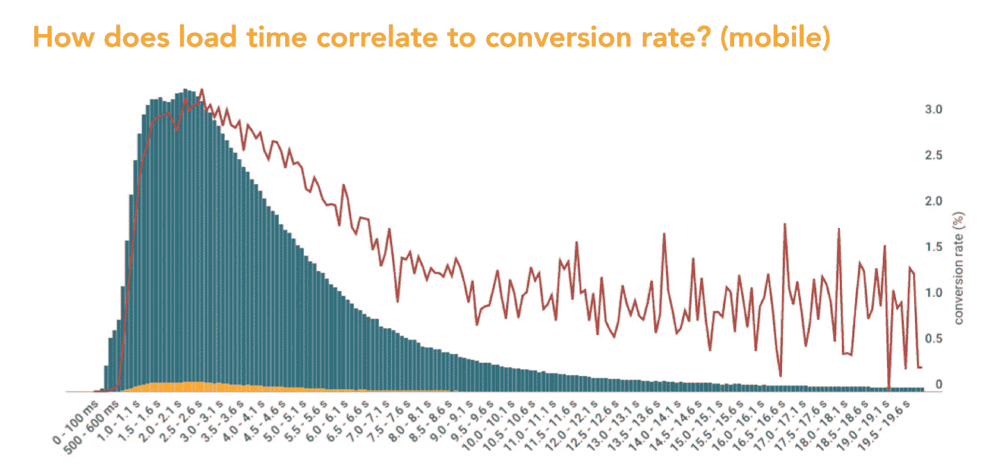
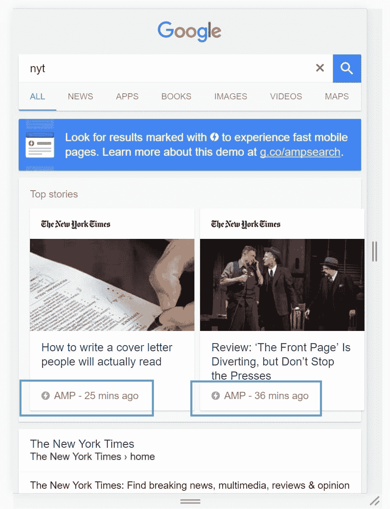
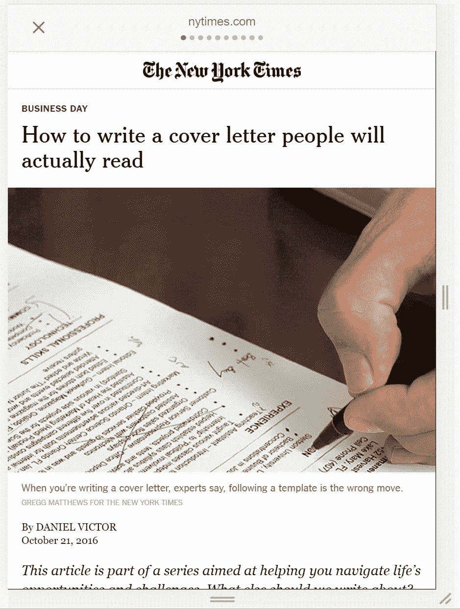
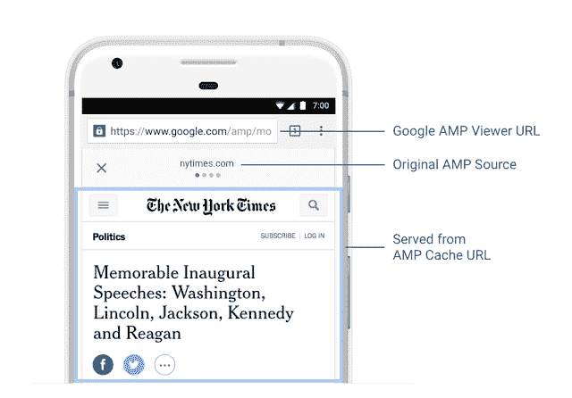

# Google AMP——如何在 WordPress 中实现

> 原文：<https://kinsta.com/blog/google-amp/>

网络在不断发展，对于许多企业主来说，这意味着需要跟上谷歌的所有变化。如果你不适应，这意味着你可能会落后。谷歌 AMP，他们加速网络的移动倡议，现在正接近它的一周年。由于它现在比 6 个月前稳定了很多，我们认为这是一个很好的时机来与你分享如何在 WordPress 中开始使用 Google AMP 的一些步骤，以及这个新平台的一些利弊。

*   [什么是 Google AMP？](#google-amp)
*   [谷歌放大器的优点](#pros-google-amp)
*   [谷歌放大器的缺点](#cons-google-amp)
*   [如何在 WordPress 中设置 Google AMP](#setup-google-amp-wordpress)
*   [验证您的 Google AMP 代码](#validate-google-amp-code)

## Google AMP 是什么？

Google AMP (加速移动页面项目)最初于 2015 年 10 月启动。该项目依赖于 AMP HTML，这是一个完全基于现有网络技术构建的新的开放框架，允许网站构建轻量级网页。简单地说，它提供了一种方法来提供你当前网页的精简版本。

> 从第一天起，AMP 的重点就是速度。这可以说是移动网络最令人沮丧的事情之一——最近的谷歌研究证实了这一点，研究显示 53%的人会离开一个在三秒或更短时间内无法加载的网站。对用户、企业、出版商、网站和整个移动网络来说，这是最坏的情况。— David Besbris，谷歌 AMP 项目负责人

根据 Akamai 的最新在线零售业绩报告，每十分之一秒都很重要。即使页面加载时间略微增加到 2.8 秒，转化率也会下降 2.4%。

Correlation to speed and conversion rates on mobile

在过去的一年里，许多大公司都采用了 Google AMP，包括 WordPress、Reddit、易贝、Pinterest、Washington Post、Wired、Gizmodo 等。[根据谷歌](https://amphtml.wordpress.com/2016/10/07/amp-a-year-in-review/)的数据，Slate 的每月独立访客增长了 **44%,每月独立访客**增长了 **73%。**

当一个页面通过谷歌中的 AMP 提供服务时，它旁边会有 AMP 符号，如下面的[纽约时报演示](https://www.google.com/search?q=nyt&esrch=AcceleratedMobilePages::Preview,AcceleratedMobilePagesDesktop::Promo)所示。请注意，您必须在移动设备上进行测试。也可以使用 Chrome devtools 中的设备模拟器。结构化数据标记允许谷歌在搜索结果中更突出地呈现你的内容。例如，包含适当标记属性的 AMP 文章可能会在 SERPs 中获得令人垂涎的轮播位置，如下所示。

Google AMP carousel

这是纽约时报网站上 AMP 页面的一个例子。正如你所看到的，这是非常基本和简单的，这是 AMP 的目标。这确保它加载速度快，并提供更好的可用性。

Google AMP page example

与任何新平台一样，你应该权衡利弊，决定它是否适合你的业务或网站。

## 谷歌放大器的优点

*   AMP 是免费和开源的。
*   AMP 肯定能改善你的 WordPress 站点的加载时间。请记住，速度是一个排名因素。
*   更好地放置在 SERPs 中，有可能实现更好的 CTR。在一个流行出版商**的[实现](https://www.ampproject.org/case-studies/plista/)中，Google AMP 获得了 600%的点击率**！
*   Google AMP 强制实施了许多推荐的 web 性能实践，例如防止大型 CSS 和 JS 框架。
*   会对你的转化产生积极的影响。
*   在过去的一年里，谷歌做了很多改进，广告选项现在在谷歌 AMP 中很容易找到。这意味着杂志和新的出版物可以保留甚至增加他们的 AdSense 收入。
*   自动[图像优化](https://developers.googleblog.com/2017/01/google-amp-cache-amp-lite-and-need-for.html)(甚至转换成 [WebP 格式](https://kinsta.com/blog/webp/)！)
*   AMP Lite 为慢速网络连接引入了进一步的优化。谷歌的字节数总共减少了 45%。

## 谷歌放大器的缺点

*   [AMP 目前不是排名因素](https://www.searchenginejournal.com/will-amp-become-ranking-signal/171722/)，但将来可能是。这可以被看作是正反两方面的。
*   如果您不是开发人员，AMP 可能很难实现和测试。然而，谢天谢地，WordPress 平台比其他平台要简单一些。
*   引入全新的独立平台和功能，让您不必担心。简单优化我们的移动网站发生了什么？
*   可能会伤害或影响你的转换产生负面影响。
*   有报道称[谷歌放大器搞乱了](http://searchengineland.com/using-amp-known-bug-probably-screwing-google-analytics-270466)[谷歌分析](https://kinsta.com/blog/how-to-use-google-analytics/)的统计数据。
*   一些人看到了更差的参与度和更高的跳出率。
*   仍然可能不支持第三方脚本和应用程序。
*   一些旧浏览器不支持，如 Internet Explorer 11。他们[声明](https://github.com/ampproject/amphtml/blob/master/DEVELOPING.md#supported-browsers)一般来说，他们将支持 Chrome、Firefox、Edge、Safari 和 Opera 等主流浏览器的最新版本。它们支持台式机、手机、平板电脑和各自浏览器的网络视图版本。
*   阅读 Jan Dawson 的观点，为什么 Google AMP 使发布到网络上变得更加困难，而不是更加容易。
*   阅读 Alex Kras 关于谷歌 AMP 的一些[问题的文章，以及谷歌 AMP 项目技术负责人的回应。](https://www.alexkras.com/google-may-be-stealing-your-mobile-traffic/)
*   Tim Kadlec 分享了他对 Google AMP 的看法以及对更好替代方案的需求:[内容性能政策](https://timkadlec.com/2016/02/a-standardized-alternative-to-amp/)。

截至 2017 年 2 月，Google AMP 已经开始显示直接出版商的网址。之前它只显示了从缓存中提供服务的谷歌版本。这从品牌的角度提出了人们的担忧。谢天谢地，谷歌也意识到了这一点，并做出了改变。现在，浏览器的 URL 字段将继续显示一个 Google URL。然而，AMP 标题区域将显示一个链接或链图标，它称之为“锚”按钮。点击这个会让发布者的直接网址出现，这样就可以很方便的复制粘贴了。这仍然不是一个完美的解决方案，但总比没有好。

Img src: [Google Developer Blog](https://developers.googleblog.com/2017/02/whats-in-amp-url.html)

这是另一个失去品牌的例子。

> 不使用谷歌的另一个原因–>你会失去你的品牌:)cc [@HuffingtonPost](https://twitter.com/HuffingtonPost?ref_src=twsrc%5Etfw) 你可能要考虑一下:)【pic.twitter.com/n3LEHIOEBZ】T2
> 
> —赛义德·巴尔基(@ syedbalkhi)[2017 年 1 月 19 日](https://twitter.com/syedbalkhi/status/822069960734310400?ref_src=twsrc%5Etfw)