# 强大数据收集的 14 个最佳谷歌分析替代方案

> 原文：<https://kinsta.com/blog/google-analytics-alternatives/>

如果你经营一家网上企业，收集和分析数据绝对是至关重要的。要做到这一点，你需要使用谷歌分析(用一个[谷歌分析 WordPress](https://kinsta.com/blog/google-analytics-wordpress/) 插件很容易设置)，或者谷歌分析的替代品。这是没有办法的。

为什么？

因为作为一名企业家，你可能犯的最大错误是在做重要决定时依赖直觉。

当然，当与人面对面交流时，直觉是非常有价值的。然而，如果你正在经营一家为来自世界各地的成千上万的客户服务的网上企业，并且能够持续不断地为你的网站带来流量，那么你需要明白你根本没有能力独自处理这种复杂程度。

这就是为什么你需要**可靠的分析软件**来帮助你[跟踪相关指标](https://kinsta.com/blog/conversion-tracking/)并从所有数据中提取可操作的见解。

谷歌分析主导着市场，但随着隐私成为近年来的热门话题，许多网站所有者正在寻找其他选择。但是有什么好的替代品吗？

答案是:有，有。那么，让我们仔细看看它们吧！

但是首先…

## 为什么你应该考虑使用谷歌分析替代品

你可能想知道为什么你甚至应该考虑使用谷歌分析的替代品。

> Kinsta 把我宠坏了，所以我现在要求每个供应商都提供这样的服务。我们还试图通过我们的 SaaS 工具支持达到这一水平。
> 
> <footer class="wp-block-kinsta-client-quote__footer">
> 
> 
> 
> <cite class="wp-block-kinsta-client-quote__cite">Suganthan Mohanadasan from @Suganthanmn</cite></footer>

[View plans](https://kinsta.com/plans/)

主要有三个原因:易用性、隐私和道德。

### 1.易用性

GA4(谷歌分析的下一代)是一个强大的分析工具，但也可能很复杂。

如果你不是一个喜欢技术的人，弄清楚如何使用谷歌分析会是一个相当大的挑战。

当然，如果你想了解谷歌分析 4，有一些很好的资源可以帮你做到这一点。

但是，作为一名企业主，你需要问问自己，花几周时间学习 GA4 是否是对时间的最佳利用。你可能想考虑一个更简单的分析平台。

### 2.隐私

谷歌最出名的是“免费”产品:[谷歌搜索控制台](https://kinsta.com/blog/google-search-console/)、 [Gmail](https://kinsta.com/blog/gmail-search-operators/) 、Chrome、[谷歌文档](https://kinsta.com/blog/google-docs-to-wordpress/)、[谷歌分析](https://kinsta.com/blog/google-search-console-vs-google-analytics/#google-analytics-overview)等。

但是，让我们不要忘记，谷歌不是一个非营利组织。他们不是出于好心而免费赠送这些产品。

根据 Statista 的数据，[2021 年公司收入超过 2560 亿美元:](https://www.statista.com/statistics/266206/googles-annual-global-revenue/)

[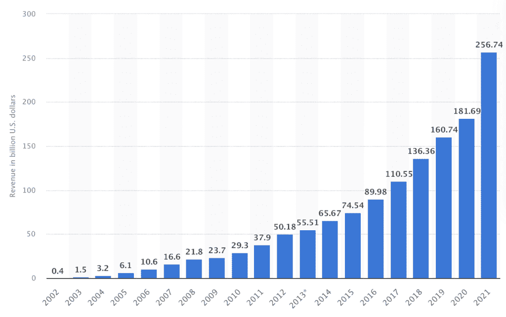](https://kinsta.com/wp-content/uploads/2019/09/google-revenue-1.png)

Google’s revenue worldwide from 2002 to 2021 (Image source: Statista.com)

那么这些钱是从哪里来的呢？

其中大部分，具体来说是 2090 亿美元，来自广告收入。他们从哪里获得帮助广告商锁定理想客户的信息？

答案是:你。

谷歌获取你给他们的数据，并利用这些数据对他们展示给你的广告进行个性化处理，使你更有可能点击它们。

表面上看，这听起来没那么糟糕。如果他们无论如何都要给你看广告，他们也可以让它们相关，对吗？

然而，你越想，这整件事就变得越令人不安。

您的[浏览器历史记录](https://kinsta.com/knowledgebase/how-to-clear-browser-cache/)。你的搜索历史。你的 [YouTube](https://kinsta.com/blog/youtube-stats/) 历史。您的位置历史记录。你的邮件。谷歌什么都有。

有一个用来消除隐私担忧的常见论点是这样的:

“好吧，如果你没做错什么，那你就没什么好担心的！”

但是，即使你没有什么可耻的事情要隐藏，想要维护你的隐私也是完全正常的。

所以问题是，为了获得谷歌的“免费”产品，你愿意牺牲多少隐私？

你可能想仔细看看谷歌的隐私政策，看看你是否对此感到满意。此外，不要忘记，如果你使用谷歌分析，[你必须有一个隐私政策](https://marketingplatform.google.com/about/analytics/terms/us/)。

### 3.伦理学

人们越来越担心谷歌多年来获得的权力。事实上，谷歌拥有搜索市场近 90%的份额:

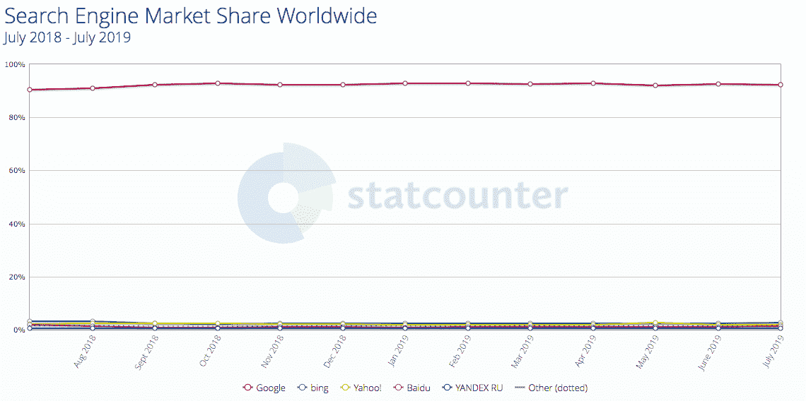

Search Engine Market Share Worldwide

这意味着它的[搜索算法](https://kinsta.com/blog/google-patents-seo-ranking-factors/)在某种程度上塑造了公众对世界的认知。你能想象谷歌因此受到的影响吗？

你可能会认为这不应该是一个问题，因为搜索算法的全部意义在于显示最相关的搜索结果。这是真的，但有时谷歌似乎忘记了这一点，更喜欢他们的市场领导者地位。

谷歌高管 Jen Gennai 最近发布了一份声明，声明如下:

> “谷歌一再表明，它致力于成为一个值得信赖的信息来源，不考虑政治观点。事实上，谷歌在其排名中没有政治意识形态的概念。我所看到的一切都支持这一点。

因此，如果你不喜欢谷歌作为搜索引擎的运作方式，你应该知道有很多可供选择的搜索引擎可以使用。

但是谷歌分析呢？

## 14 大谷歌分析备选方案

让我们仔细看看谷歌分析竞赛。

### 静态计数器

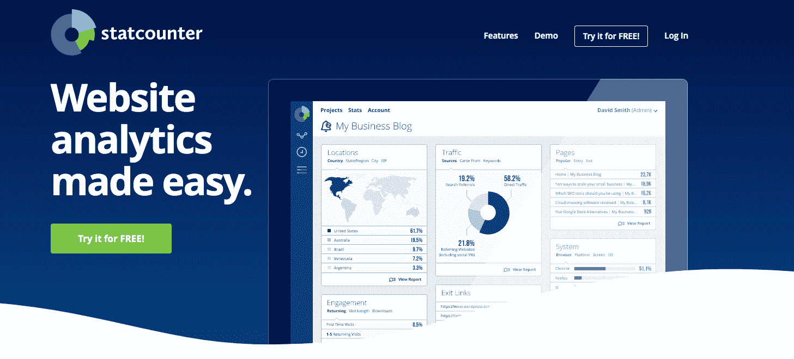

Statcounter

StatCounter 于 1999 年由当时年仅 16 岁的 Aodhán Cullen 创立。

他们的任务是:

> “帮助我们的会员更容易理解他们的访问者，这样他们就可以做出正确的决定，在网上变得更加成功。”

主要功能包括流量分析，可让您跟踪最重要的指标；付费流量分析，可帮助您改进付费广告活动；访客提醒，可在重要访客再次访问网站时向您发送通知。

还有一个方便的报告功能，你可以设置每天，每周或每月的报告，其中最重要的数据直接发送到你的收件箱。

StatCounter 的定价基于您需要的日志空间:

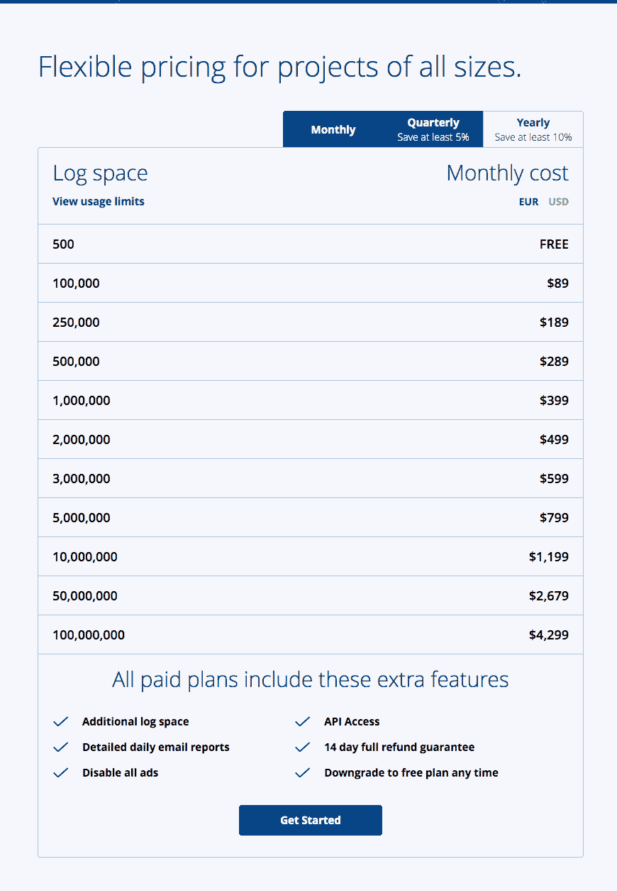

StatCounter pricing

值得注意的是，StatCounter 已经经营了 20 年，所以它们不太可能很快破产。

### 测量

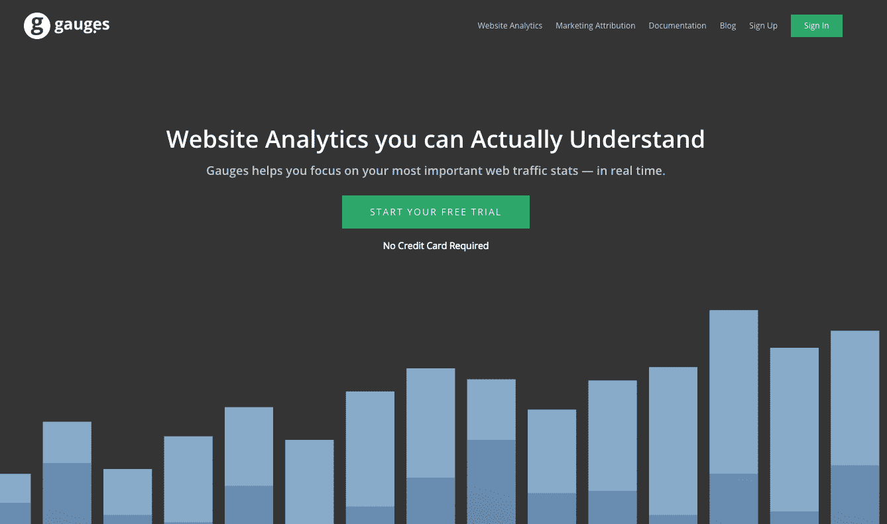

Gauges

[Gauges](https://get.gaug.es/) 是一款实时分析工具，可跟踪最重要的流量指标。它可以让你看到独立访问者的数量，页面浏览量，热门内容，地理数据等。

如果您想要的只是简单易用的基本分析软件，那么 Gauges 是值得考虑的。这款分析工具有免费和付费两种解决方案(起价 500 美元/年)。

### 简单分析

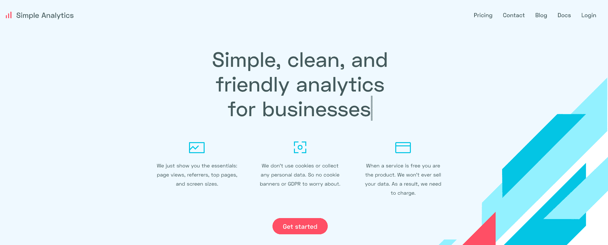

Simple Analytics

[简单分析](https://simpleanalytics.com/)专注于提供“简单、干净和友好的分析”，同时尊重人们的隐私。简单分析创始人 Adriaan van Rossum 解释道:

> “我越来越关心个人隐私。大公司追踪一切而不承担任何后果。这必须停止。另外，在追踪你自己的访客时，你真的需要 500 页的图表吗？”

软件仅跟踪这些指标:

*   浏览量。
*   推荐人。
*   首页。
*   屏幕尺寸。
*   浏览器。
*   国家。

下面是简单分析仪表板的外观:

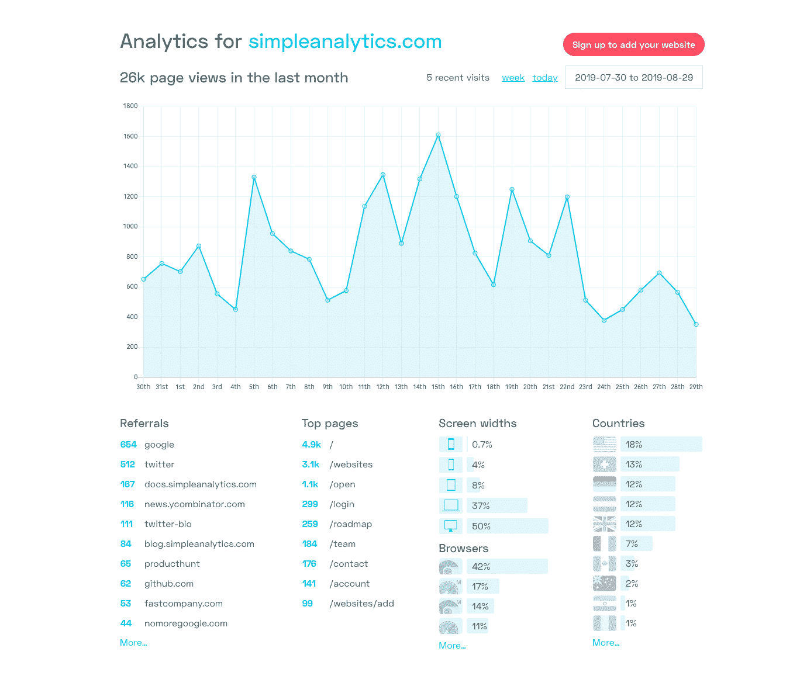

Simple Analytics dashboard

如你所见，当他们说“简单”时，他们是真心的。流量分析没有比这更简单的了。

有三个定价等级:每月 9 美元的入门计划、每月 49 美元的商业计划和定制企业计划。这使得它成为谷歌分析的一个非常实惠的替代品，也是不太倾向于技术的人的理想选择。

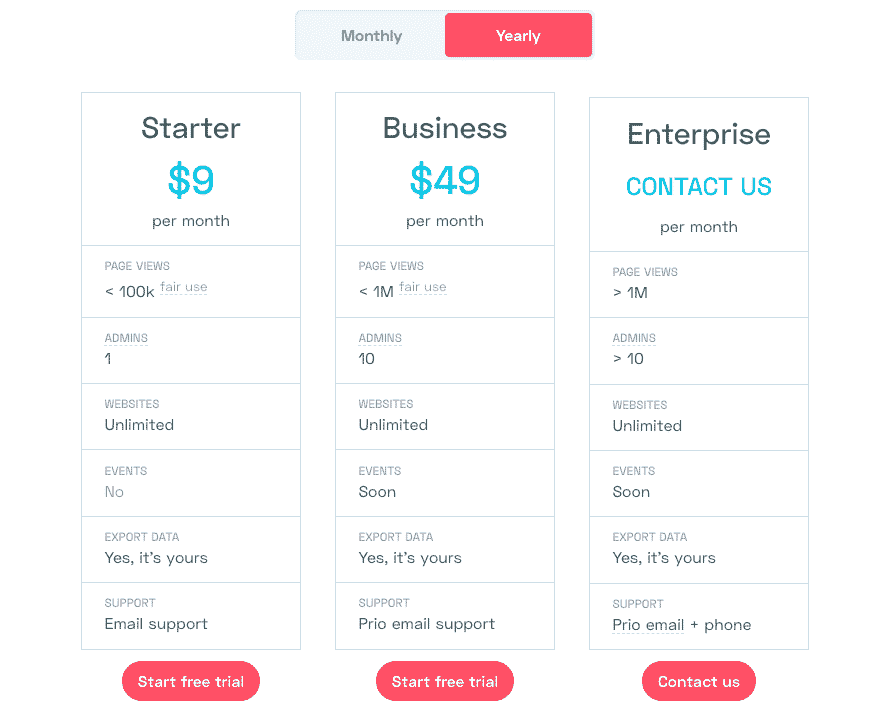

Simple Analytics pricing

简单分析也得到了 RemoteOK 和 NomadList 创始人、《Make book:

> 如果你已经厌倦了让你的用户被大公司追踪，你应该尝试简单的分析。这是一个极简主义和隐私友好的谷歌分析，没有跟踪。”

### Fathom 分析公司

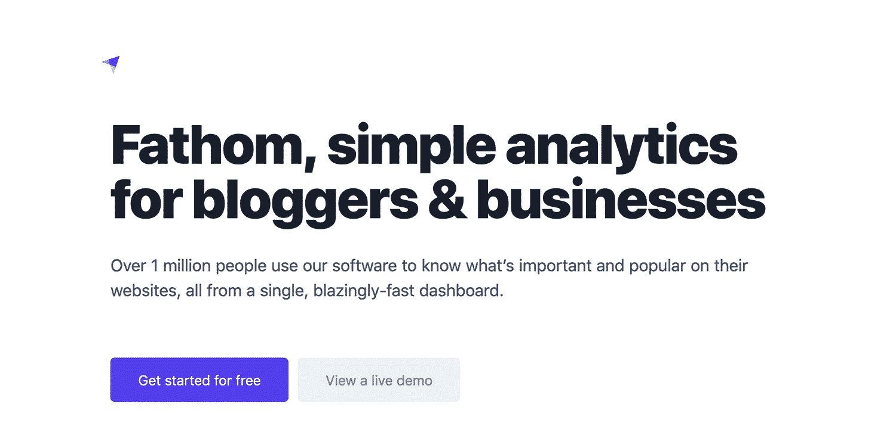

Fathom

Fathom 是另一家提供尊重人们隐私的分析软件的公司。

公司创始人杰克·埃利斯和保罗·贾维斯想:

> “通过提供一种易于使用的现代分析工具，让互联网变得更好、更私密，并尊重和保护网民的隐私。”

它只跟踪这些指标:

*   独特的访客。
*   浏览量。
*   平均现场时间。
*   跳出率。
*   首页。
*   热门推荐人。
*   国家、设备类型、浏览器。
*   用户设定目标。

这是他们的仪表板的样子:

Fathom dashboard

有三个定价等级:每月 14 美元的标准计划、每月 44 美元的商业计划和每月 114 美元的企业计划。

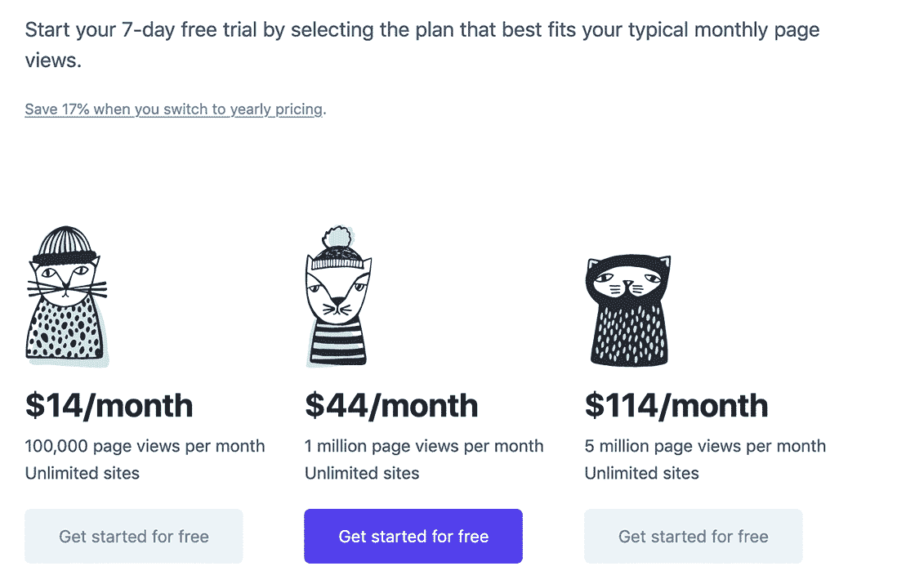

Fathom pricing

Fathom 也有一个政策，如果你超过了查看限制，不会暂停帐户:

> “相反，我们会查看三个月的滚动平均值，并根据持续的超额情况，而不仅仅是偶尔的流量高峰，向您发送电子邮件通知升级时间。”

这很有帮助，因为如果你只达到一次月限额，很高兴知道你不会仅仅因为(希望的)高峰而被收取额外的费用。

### Clicky

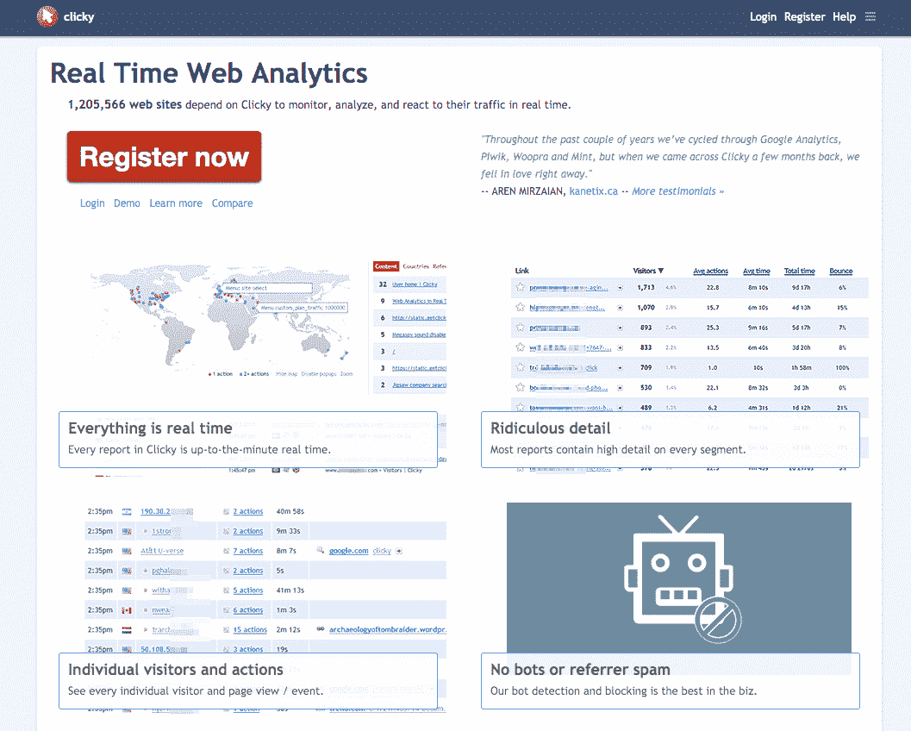

Clicky

[Clicky](https://clicky.com/) 提供分析软件，不仅可以跟踪关键指标，还可以让你看到你的访客的行动，使用热图，监控正常运行时间，等等。

他们是分析领域的老牌企业，他们的软件目前在 1，192，960 个网站上使用。

有五个定价等级:免费计划、9.99 美元/月专业计划、14.99 美元专业升级计划、19.99 美元/月专业白金计划和定制计划。不是最简单的[定价](https://kinsta.com/blog/how-to-price-a-product-wordpress/)，如果你问我的话。

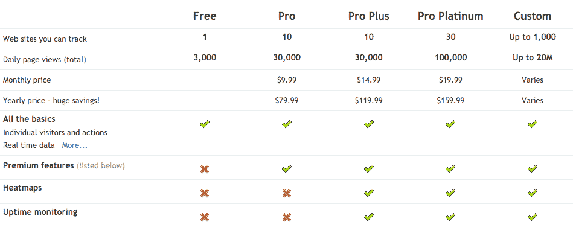

Clicky pricing

如果你能把他们过时的网站设计放在一边，Clicky 的软件就能完成这项工作。点击这里查看演示:

Clicky dashboard

### Matomo

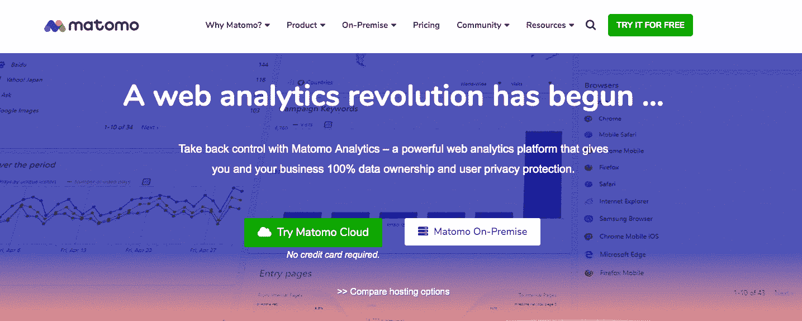

Matomo

Matomo ，以前被称为 [Piwik](https://piwik.com/) ，提供强大的分析软件，同时也考虑到隐私问题(顺便说一下，“Matomo”在日语中是“诚实”的意思)。

## 注册订阅时事通讯

### 想知道我们是怎么让流量增长超过 1000%的吗？

加入 20，000 多名获得我们每周时事通讯和内部消息的人的行列吧！

[Subscribe Now](#newsletter)

他们的任务是:

> *“通过革命性的分析平台，引领人们重新掌控自己的数据。”*

他们是分析行业值得信赖的名字，他们的软件在 190 多个国家的 140 万个网站上使用。该软件有各种各样的功能，从分析和转换优化到访问者配置文件。

Matomo 更有趣的卖点之一是他们不使用数据采样:

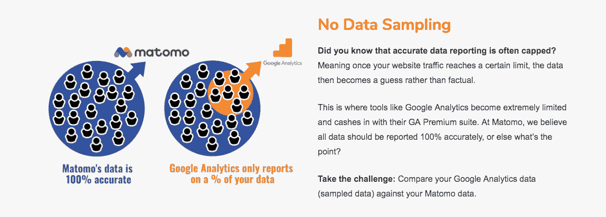

Matomo & data reporting

基本上，数据采样意味着你从数据中抽取一个样本，对其进行分析，然后将你的发现推断到其余的数据中。谷歌是这样解释[数据采样](https://support.google.com/analytics/answer/2637192?hl=en)的:

> 例如，如果你想估计一个 100 英亩的地区的树木数量，那里的树木分布相当均匀，你可以计算 1 英亩的树木数量，然后乘以 100，或者计算半英亩的树木数量，然后乘以 200，从而得到整个 100 英亩的精确表示

虽然在特定流量阈值后使用数据采样可以为谷歌节省大量资金，但如果你想要准确的粒度级数据，这并不完全理想。

Matomo 不使用这种统计分析方法来削减成本。他们实际上分析所有的数据，所以你可以确定你所看到的与现实相符。

有三个定价等级:每月高达 50k 的页面浏览量，您有每月 19 美元的基本计划，每月 29 美元的商业计划和定制企业计划:

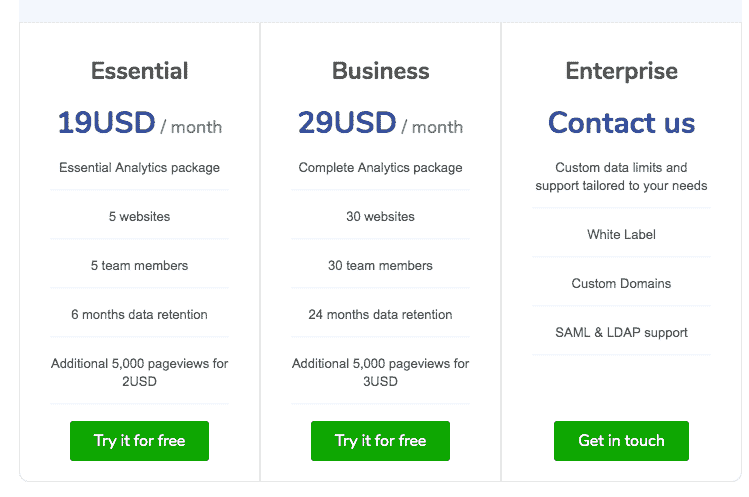

Matomo pricing

此外，马托莫对自己在隐私问题上的立场感到自豪:

> Matomo 的数据所有权理念很简单:你拥有自己的数据，而不是别人

这听起来太对了，不是吗？

### 乌拉巴

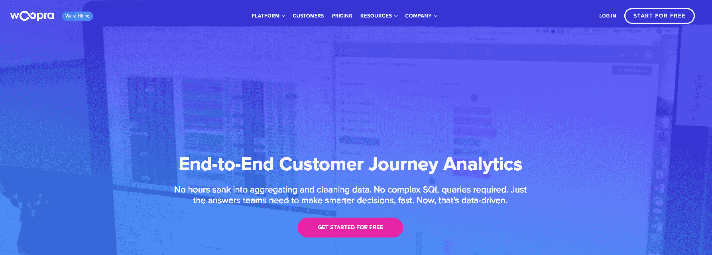

Woopra

Woopra 成立于 2012 年，当时的想法是需要一种能够捕捉整个用户旅程的分析软件。

从那时起，该软件已经发展成为一个强大的分析平台，其口号是:

> “可视化并优化客户旅程的每一步。”

Woopra 不仅仅向您展示指标，它还帮助您理解这些数字之间的关系。这对于那些精通技术并希望比其他 Google analytics 替代品更深入地了解他们的数据的用户来说是非常理想的。

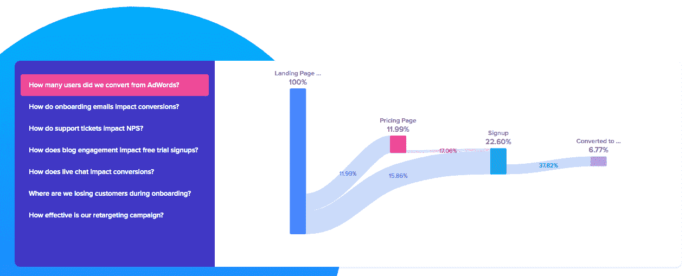

Woopra data tracking

该软件提供对客户行为的洞察，并允许您改善客户体验。它包括诸如细分、功能使用分析、bug 和错误监控、趋势报告等功能。

有三个定价等级:免费核心计划、每月 999 美元专业计划和定制企业计划。

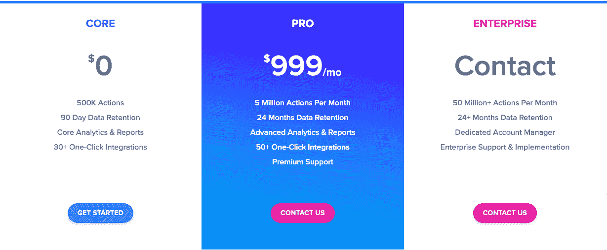

Woopra pricing

Woopra 是一个很棒的分析软件，它可以帮助 SaaS 企业家了解他们的产品哪些有用，哪些没用。

### 许多

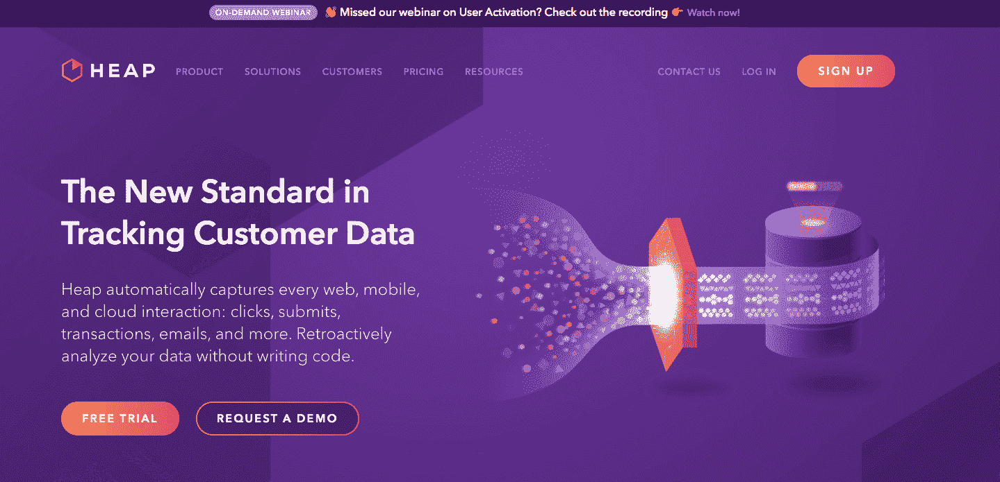

Heap

[Heap](https://heap.io/) 的软件捕捉所有网络、移动和云交互，并分析这些数据。他们专注于通过行为数据帮助你理解[客户行为](https://kinsta.com/blog/inbound-marketing/#inbound-marketing-vs-outbound-marketing)。

这是一个先进的工具，所以你需要一些技术知识来充分理解他们的卖点(追溯分析，虚拟事件等)。).

与宕机和 WordPress 问题做斗争？Kinsta 是一款考虑到性能和安全性的托管解决方案！[查看我们的计划](https://kinsta.com/plans/?in-article-cta)

Heap 主要致力于服务三个行业的企业:[电子商务](https://kinsta.com/blog/wordpress-ecommerce-plugins/)、金融服务和 [SaaS](https://kinsta.com/blog/saas-products/) 。

他们提供三个价格等级:免费计划、启动计划和定制企业计划。所有计划都包括 14 天的免费试用，因此您可以毫无风险地试用他们的软件:

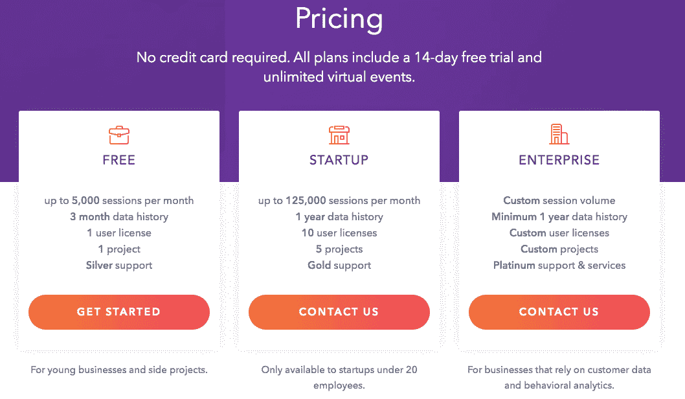

Heap pricing

注意:我确信他们正在测试一些东西，因为几个月前启动计划的价格[是可见的](https://web.archive.org/web/20190620155942/https://heap.io/pricing)，启动计划的价格是 499 美元。

Heap 有 6000 多个客户，其中有一些大公司，如 Microsoft、Atlantic、Casper、Freshworks 等。

他们也得到了一些顾客的高度赞扬。例如，微软高级营销经理 Abhishek Ratna 对 Heap 的评价如下:

> “通过使用堆而不是设计多个 ETL 作业来组合来自不同工具的数据，我们已经能够节省数小时和数周的工作。一切都开箱即用。”

对于那些寻找高级分析软件的人来说，Heap 是一个很好的工具，这种软件迎合了那些了解数据的人。

### 戈斯夸德

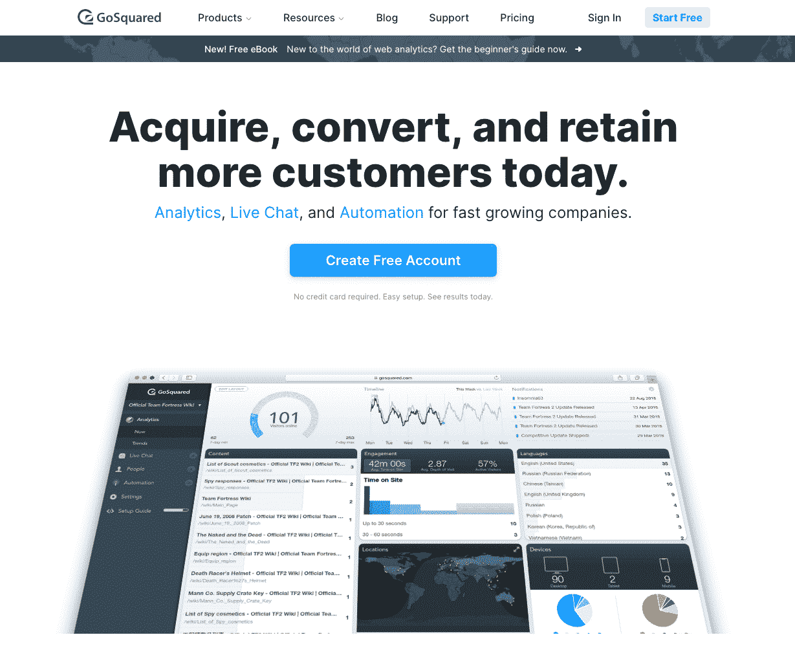

GoSquared

GoSquared 的目标是提供软件，让你了解你的客户并与他们交谈。[他们解释:](https://www.gosquared.com/about/)

> *“我们认为，你不应该需要 20 种不同的工具来了解客户和与客户交谈，一个紧密集成、精心设计的平台从根本上来说更适合所有企业及其客户，”*

GoSquared 提供三种产品:分析、实时聊天和客户数据中心。他们的分析工具具有多种功能，包括实时 web 分析仪表板、帮助您估计未来流量的智能预测、每日电子邮件报告等:

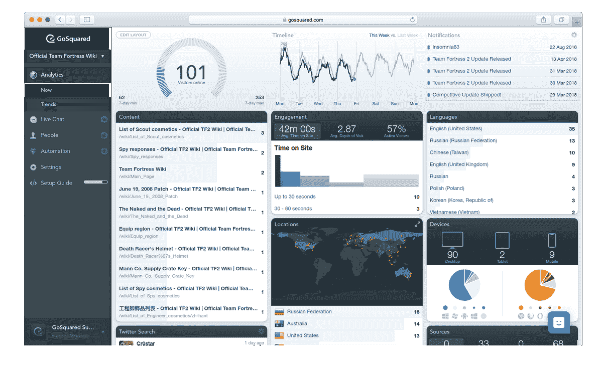

GoSquared dashboard

也有很多集成可用，包括 [Twitter](https://kinsta.com/blog/twitter-stats/) 、 [Slack](https://kinsta.com/blog/how-to-use-slack/) 、 [Zapier](https://kinsta.com/blog/working-remotely/#remote-work-time-saving-tips) 、 [Shopify](https://kinsta.com/blog/woocommerce-vs-shopify/) 等等。

这是一个可靠的分析工具，易于设置和使用，这使得它非常适合那些不喜欢摆弄技术，宁愿在分析上花更少时间，而在业务上花更多时间的人。

你可以开始免费使用 GoSquared 的分析软件，然后随着流量的增长进行升级。如果您选择套房，价格从每月 79 英镑(每月 96 美元)开始:

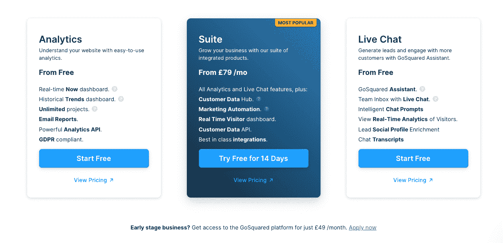

GoSquared pricing

例如，使用 Analytics 产品，如果你的网站浏览量超过 1000 次，你将被要求每月支付 29 英镑(24 美元):

GoSquared monthly price

### Hitsteps

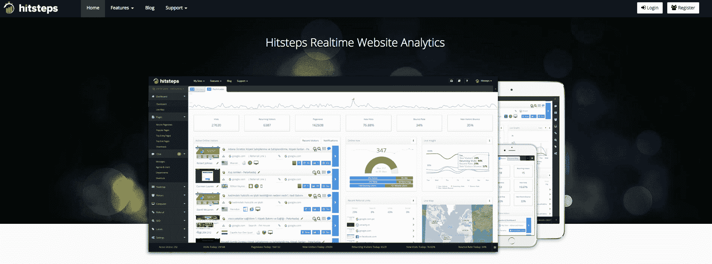

Hitsteps

[Hitsteps](https://www.hitsteps.com/) 通过热图、页面分析、公司简介、简介可视化、报告等功能提供实时分析。

有五个价格等级:免费计划、每月 4.99 美元的入门计划、每月 9.99 美元的基本计划、每月 21.99 美元的专业计划和每月 49.99 美元的终极计划:

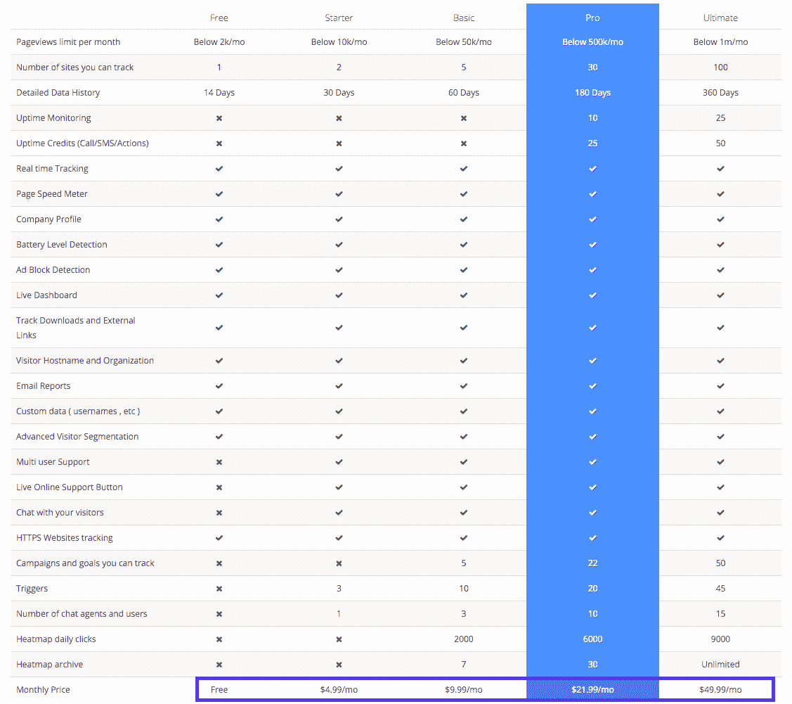

Hitsteps pricing

如果你想要一些超越基础的东西，但也是谷歌分析的负担得起的替代品，这个软件是值得考虑的。

### 接吻度量

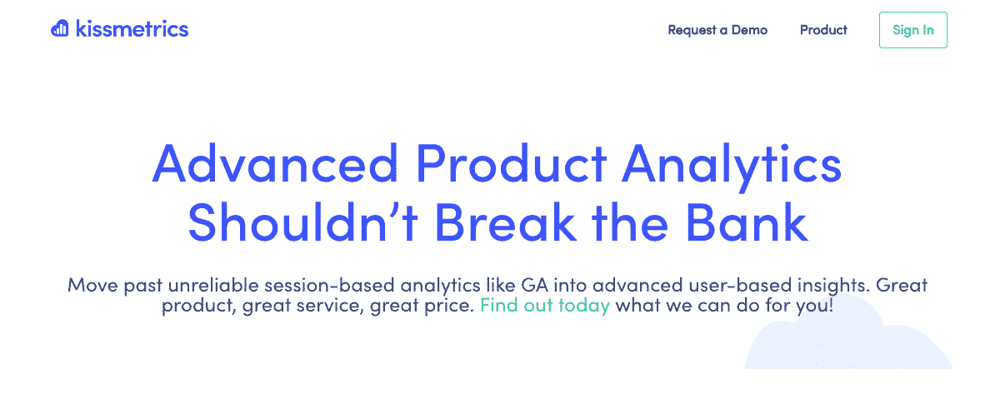

Kissmetrics

Kissmetrics 是由尼尔·帕特尔(Neil Patel)和希滕·沙阿(Hiten Shah)创办的，他们是创业界的知名企业家。

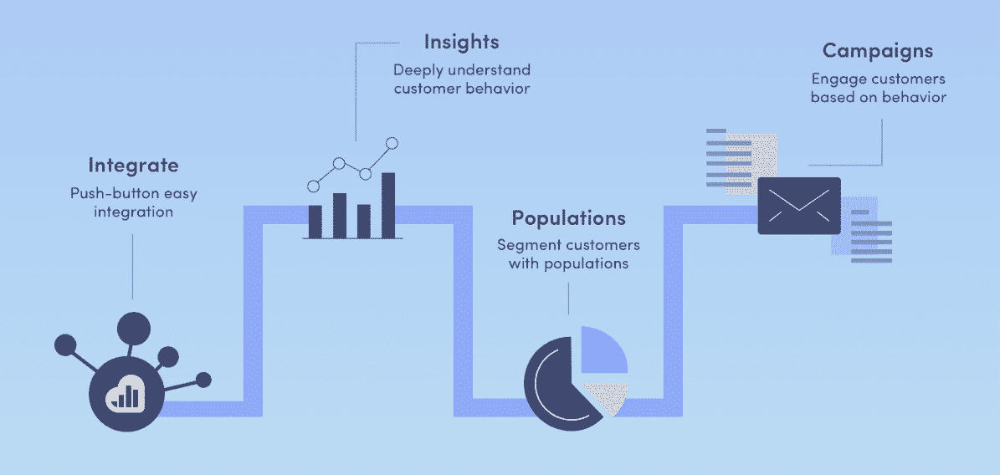

Kissmetrics features

Kissmetrics 提供强大的分析和漏斗分析软件，帮助您更好地了解客户行为和自动化客户参与。

它被 900 多家公司使用，包括一些知名品牌，如 [Unbounce](https://kinsta.com/blog/clickfunnels-alternative/#7-unbounce) 。作为 Google Analytics 的替代产品，他们的价值主张实际上是特定的:

> “从 GA 等不可靠的基于会话的分析转向基于用户的高级洞察。”

只有在他们的网站上预订演示才能获得定价。他们最近经历了一场品牌重塑运动，并删除了他们的博客，所以事情确实让我认为他们正在大力进行市场定位。

### 花言巧语的

[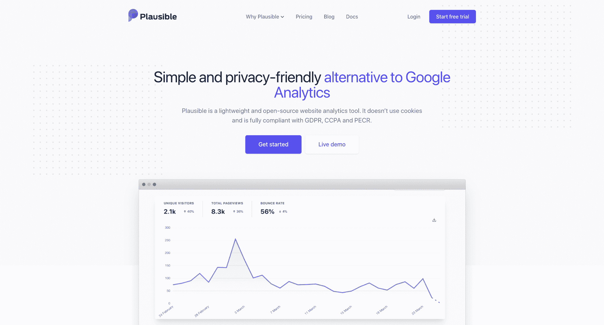](https://kinsta.com/wp-content/uploads/2019/09/Plausible.png)

Plausible analytics

另一个你可能想考虑的 Google Analytics 替代品是[似是而非的](https://plausible.io/)，一个轻量级的开源分析工具。与 Google Analytics 的主要区别在于:

*   透明和完全开源的分析软件。你可以[在 GitHub](https://github.com/plausible-insights/plausible) 上查看他们的代码。有了可信的分析，你拥有并控制你所有的网站数据。
*   完全符合隐私法规。不使用 [cookies](https://kinsta.com/blog/wordpress-cookies-php-sessions/) ,在使用 alibable 时不会收集任何个人数据。这意味着你不需要展示 cookie 横幅，不需要隐私政策，也不需要 [GDPR](https://kinsta.com/blog/wordpress-gdpr-compliance/) / [CCPA](https://kinsta.com/blog/wordpress-ccpa-compliance/) 的同意。
*   看似合理的分析脚本仅重 1.4 KB，比谷歌分析全球网站标签小 33 倍。这将有助于[保持你的页面快速加载](https://kinsta.com/learn/speed-up-wordpress/)。

仪表板看起来是这样的:

[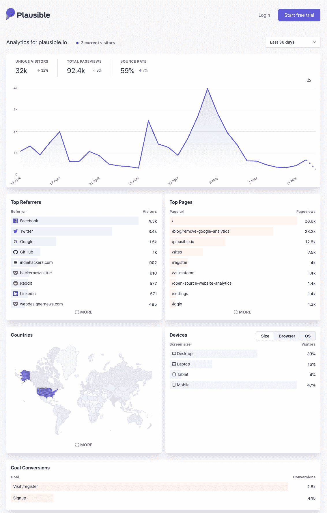](https://kinsta.com/wp-content/uploads/2019/09/plausible-analytics-dashboard.png)

Plausible analytics dashboard

该软件还包括一个[谷歌搜索控制台](https://kinsta.com/blog/google-search-console/)集成，所以你可以看到引导访问者到你的网站的搜索查询。

有三个价格等级:6 美元/月的个人计划、12 美元/月的启动计划和 36 美元/月的商业计划。那些订阅年度计划的人还有 33%的额外折扣。

[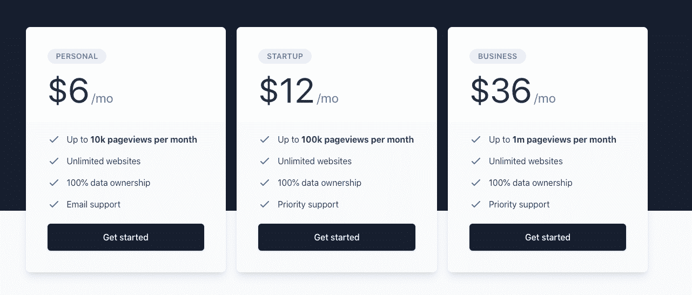](https://kinsta.com/wp-content/uploads/2019/09/plausible-pricing.png)

Plausible analytics pricing

该软件正在积极开发中，你可以在这里查看它的公开路线图。

### Piwik PRO

[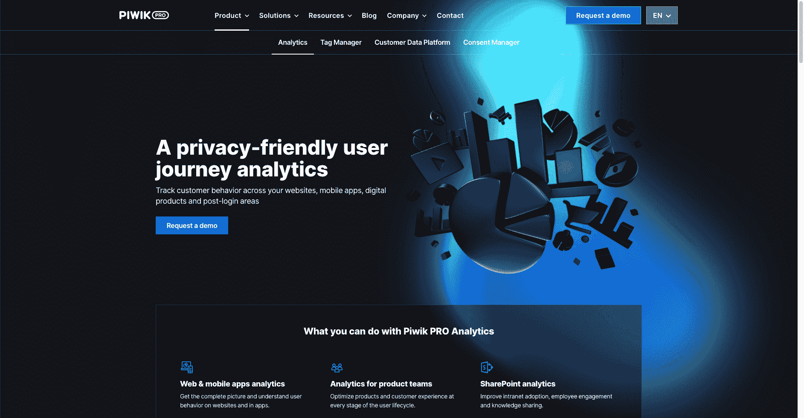](https://kinsta.com/wp-content/uploads/2019/09/piwik-pro.png)

Piwik PRO

[Piwik PRO Analytics Suite](https://piwik.pro/web-analytics/)允许您在您的网站、应用程序、产品页面、内联网上分析完整的用户旅程。

这种 Google Analytics 替代方案确保符合欧盟、美国、中国和俄罗斯的数据保护法，包括 [GDPR](https://kinsta.com/blog/wordpress-gdpr-compliance/) 和健康保险便携性和责任法案(HIPAA)。

Piwiki PRO 和 Google Analytics 的主要区别在于:

*   ****隐私合规:** i n Google Analytics 关于你用户的数据托管在分散在世界各地的数据中心。使用 Piwik PRO，这些信息可以存储在您自己的服务器上，无论是私有还是公有云，始终遵守数据保护和隐私法律。**
***   ****完全数据所有权:**谷歌分析让你洞察你客户的数据，但它也使用这些信息来开发其广告产品(如[谷歌广告](https://kinsta.com/blog/how-to-use-google-adwords/))。Piwik PRO 给予其客户 100%的数据所有权。*******   **无数据采样:**使用 Google Analytics，当达到每月 500，000 次会话的限制时，会自动进行数据采样。这意味着你的报告可能会误导人。Piwik PRO 为其所有定价计划提供未抽样数据。******

 ****仪表板看起来是这样的:

[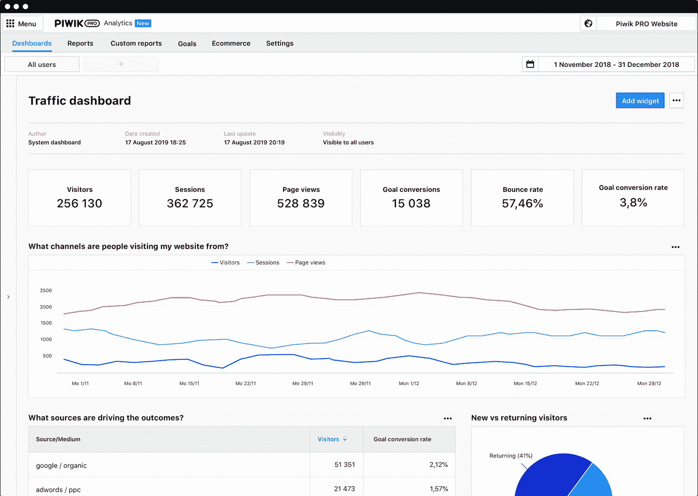](https://kinsta.com/wp-content/uploads/2019/09/Piwik-PRO-Analytics-Dashboard.png)

Piwik PRO – Dashboard Analytics

只有通过他们的网站请求定制报价才能获得定价，您可以在网站上选择您首选的托管选项(欧盟云、美国云、私有云以及内部)。

Piwik PRO 灵活的配置和部署使其非常适合处理敏感数据的行业，如医疗保健或金融，但它也可能是每个对道德、隐私友好的分析感兴趣的公司的好选择。

### 独立分析

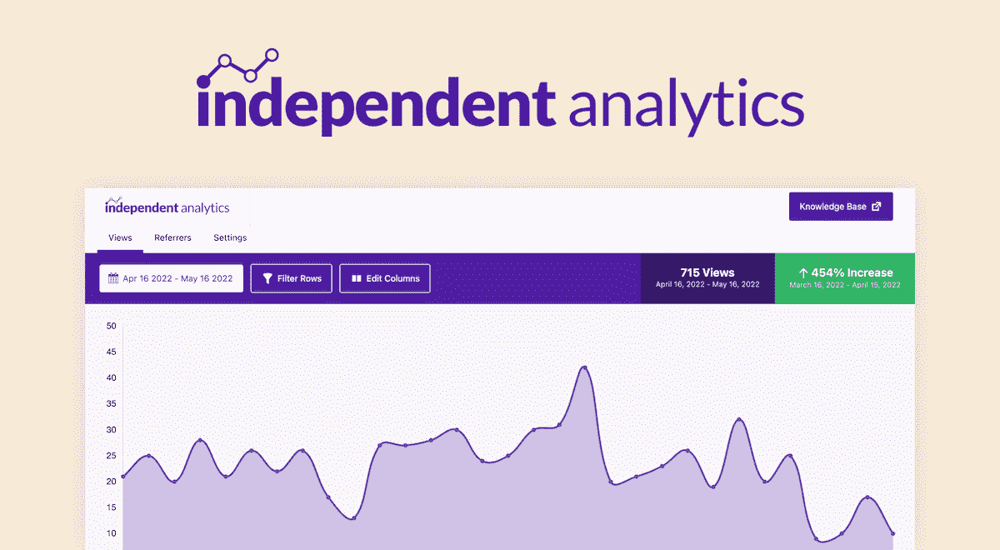

Independent Analytics

独立分析是 WordPress 的一个全新的分析插件，是博客和小企业的一个可靠的谷歌分析替代方案。这是一个轻量级的分析工具，可以在你的网站上快速加载，并且完全符合 GDPR 的。

使用独立分析有几个独特的优势:

*   **深度 WordPress 整合:**大多数分析程序会列出你的[网址](https://kinsta.com/knowledgebase/what-is-a-url/)，但是独立分析会列出你的页面。这意味着你可以看到额外的数据，如你的文章作者和发表日期，以及你的观点。
*   过滤你的数据:简单的过滤系统可以处理你所有的 WP 数据。缩小你的报告范围，只搜索术语或博客文章，查找超过 100+的页面，或者你想要的任何内容。
*   **零步骤设置:**无需创建第三方账户，也无需自己添加追踪码。独立分析从你安装它的那一刻开始跟踪访问。

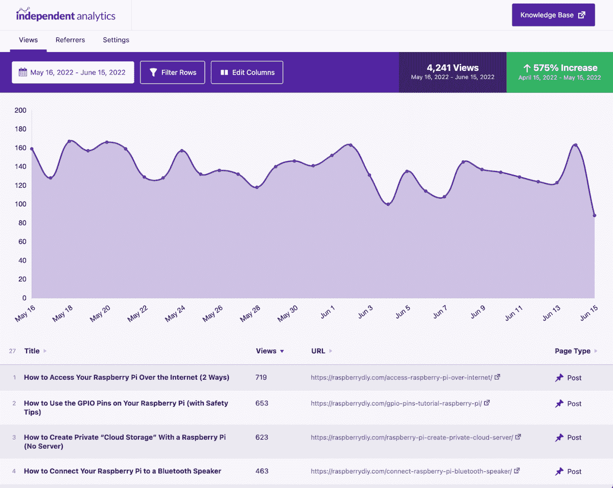

The Independent Analytics dashboard

作为一个 WP 插件，它可以在官方 WordPress 知识库上免费获得。目前还没有任何付费升级，但独立分析团队计划在未来发布用于转换跟踪和其他功能的高级插件。

[Google Analytics is the predominant tool for measuring traffic. But is it the best one? Check out these GA alternatives: they have so much to offer to data junkies! 📈 🤓Click to Tweet](https://twitter.com/intent/tweet?url=https%3A%2F%2Fkinsta.com%2Fblog%2Fgoogle-analytics-alternatives%2F&via=kinsta&text=Google+Analytics+is+the+predominant+tool+for+measuring+traffic.+But+is+it+the+best+one%3F+Check+out+these+GA+alternatives%3A+they+have+so+much+to+offer+to+data+junkies%21+%F0%9F%93%88+%F0%9F%A4%93&hashtags=analytics%2Cdata)

## 摘要

毫无疑问，谷歌分析是一个优秀的分析工具。但这不是跟踪分析的唯一选择。

如果它不能满足你的需求，或者如果你担心隐私，你一定要看看许多谷歌分析的替代品。

当然，如果你决定与谷歌分析的竞争对手合作，你可能需要实际支付软件费用。然而，如果产品更适合您的业务，价格将是非常值得的。此外，以上几个选项为小型网站提供了免费计划。

请记住:“最受欢迎”并不一定意味着“最好的”，更不一定意味着“最适合你”

* * *

让你所有的[应用程序](https://kinsta.com/application-hosting/)、[数据库](https://kinsta.com/database-hosting/)和 [WordPress 网站](https://kinsta.com/wordpress-hosting/)在线并在一个屋檐下。我们功能丰富的高性能云平台包括:

*   在 MyKinsta 仪表盘中轻松设置和管理
*   24/7 专家支持
*   最好的谷歌云平台硬件和网络，由 Kubernetes 提供最大的可扩展性
*   面向速度和安全性的企业级 Cloudflare 集成
*   全球受众覆盖全球多达 35 个数据中心和 275 多个 pop

在第一个月使用托管的[应用程序或托管](https://kinsta.com/application-hosting/)的[数据库，您可以享受 20 美元的优惠，亲自测试一下。探索我们的](https://kinsta.com/database-hosting/)[计划](https://kinsta.com/plans/)或[与销售人员交谈](https://kinsta.com/contact-us/)以找到最适合您的方式。****