# 如何在谷歌分析中阻止推荐垃圾邮件(清理你的报告)

> 原文：<https://kinsta.com/blog/google-analytics-spam/>

不管你喜欢与否，垃圾邮件是互联网的一大部分。

一些类型的垃圾邮件对使用您的服务器空间发送请求更感兴趣，而一些则利用用户发送有害的恶意软件和病毒。

一种垃圾邮件叫做**推荐垃圾邮件**，它会影响没有准备好的 WordPress 网站。此外，它可以进入你的[谷歌分析](https://kinsta.com/blog/how-to-use-google-analytics/)系统，掠夺你的排名，让[搜索引擎](https://kinsta.com/blog/alternative-search-engines/)对你不利。

它永远不会完全消失。但这并不意味着你不能反击推荐垃圾邮件。

你最好的办法是在 Google Analytics 和 WordPress 中屏蔽垃圾推荐。你如何着手做这件事？

你马上就会知道了，但是首先，让我们多了解一点关于推荐垃圾邮件以及它如何影响你的网站。

[Fight back against referrer spam 👊 and keep your Google Analytics reports squeaky-clean 🧼 with these tips!Click to Tweet](https://twitter.com/intent/tweet?url=https%3A%2F%2Fbit.ly%2F2Wjnpjz&via=kinsta&text=Fight+back+against+referrer+spam+%F0%9F%91%8A+and+keep+your+Google+Analytics+reports+squeaky-clean+%F0%9F%A7%BC++with+these+tips%21&hashtags=ReferrerSpam%2CGoogleAnalytics) ## 什么是推荐垃圾邮件？

推荐垃圾邮件或推荐垃圾邮件是一种使用虚假的推荐 URL 重复网站请求的技术，通常指向垃圾邮件发送者希望推广的网站。


> Kinsta 把我宠坏了，所以我现在要求每个供应商都提供这样的服务。我们还试图通过我们的 SaaS 工具支持达到这一水平。
> 
> <footer class="wp-block-kinsta-client-quote__footer">
> 
> 
> 
> <cite class="wp-block-kinsta-client-quote__cite">Suganthan Mohanadasan from @Suganthanmn</cite></footer>

[View plans](https://kinsta.com/plans/)

### 什么是谷歌分析和其他常见问题中的推荐垃圾邮件

 在谷歌分析中，它看起来像这样:

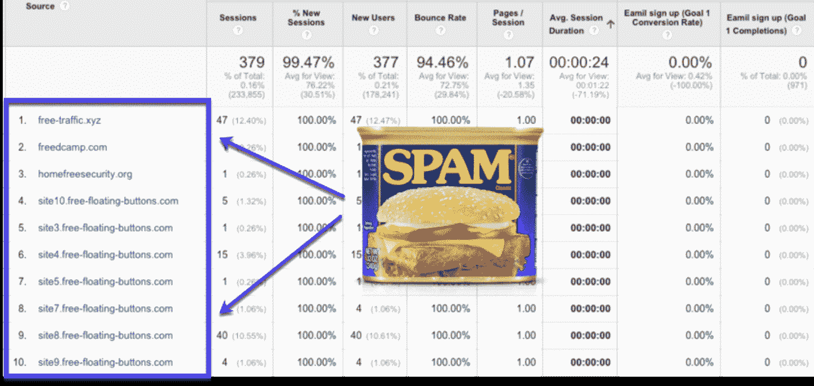

What referrer spam looks like inside Google Analytics


推荐垃圾邮件只有一个目的:**针对搜索引擎。**

从表面上看，它是这样工作的:

*   垃圾邮件发送者有一个网站，他们想提高搜索引擎的排名。
*   垃圾邮件发送者发出多个带有虚假 URL 的请求，这些 URL 链接回他们想要做广告的网站。

简而言之，他们想改善搜索引擎如何看待他们的网站，而不需要向用户提供有价值的内容。因此，您的站点可能会意外发布一些访问日志和统计数据，无意中链接回垃圾邮件发送者试图推广的[站点。](https://kinsta.com/blog/negative-seo/)

这意味着您的网站现在链接到一个质量差的网站，这可能会提高垃圾网站的排名，如下所示:


Even more spam sites in Google Analytics


然而不幸的是，如果谷歌发现你链接到一个垃圾网站，你的搜索引擎排名将来可能会下降。

这些机器人从未真正访问过你的网站。相反，它们只会扰乱您的 javascript 跟踪代码，扭曲您的分析数据，如跳出率和其他有用的参与度指标。

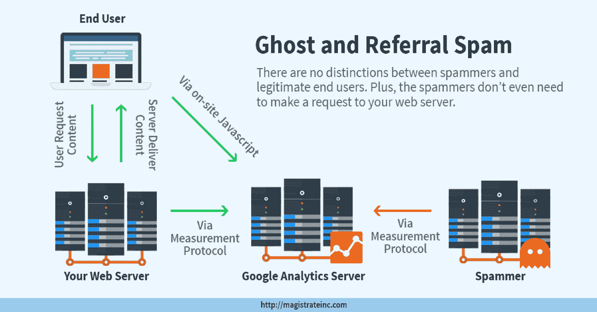

A diagram showing how ghost and referral spam works (Image source: magistrateinc.com)


尽管谷歌和其他搜索引擎已经做了相当多的工作来抵制类似的垃圾网站，但完全阻止它们是个好主意，这样你就不会遇到任何问题。

毕竟，如果你链接了几十个不良网站，搜索引擎可能会认为你是故意的。


### 为什么叫推荐垃圾？

同样值得注意的是，这种类型的垃圾邮件得名于它与 Google Analytics 的交互方式。这些垃圾邮件制造者利用了这样一个事实，即所有网站所有者都喜欢看到其他网站将流量转到他们的平台。

你甚至可以在谷歌分析中找到一份[推荐报告，看看你的大部分流量来自哪里。](https://kinsta.com/blog/how-to-use-google-analytics/#example-metrics)

不幸的是，你的一些用户可能想在你的访问日志中查看这些推荐报告，当你在 Google Analytics 中查看你的推荐时，你可能最终会点击其中一个有害的链接。

谁点击它们并不重要，因为都是坏消息。

### 屏蔽 Bot 流量有什么好处？

有些人认为有僵尸流量和垃圾推荐没什么大不了的。当你考虑到机器人流量的时候，这是一件大事:

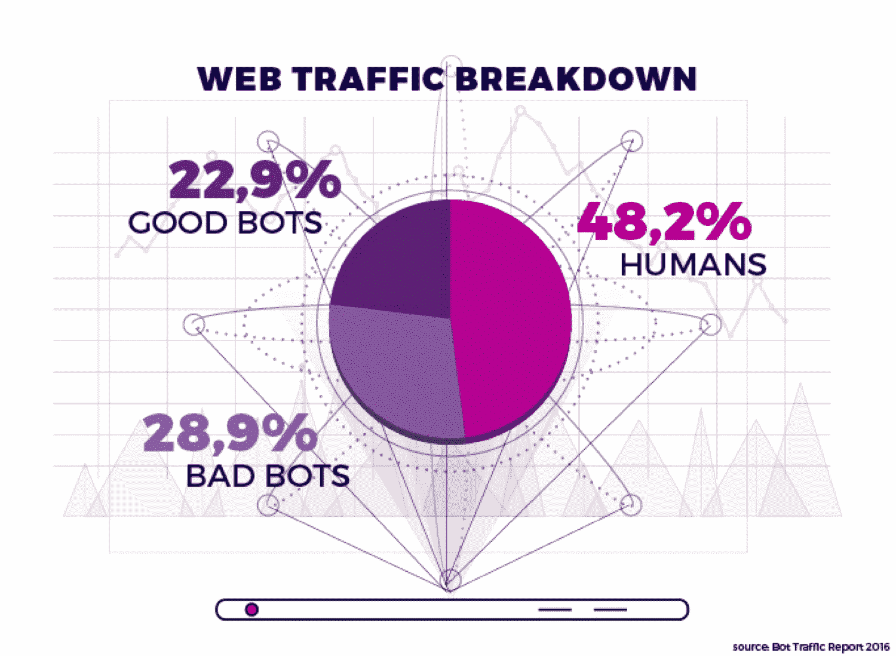

Good bots vs bad bots vs humans (Image source: voluum.com)


几乎 56%的 bot 流量被用于恶意目的。它不仅会扭曲您的分析数据，还会:

*   促成 [DDoS 攻击](https://kinsta.com/blog/what-is-a-ddos-attack/)
*   损害你的搜索引擎优化和网站声誉
*   劫持你的账户
*   花了你的钱

虽然它可能不会对你产生太大的影响，但你仍然有机会意外地链接到那些垃圾网站，降低你在搜索引擎中的排名。

此外，合法网站所有者的业务是[生成高质量的内容](https://kinsta.com/blog/evergreen-content/)，所以作为一个负责任的网站管理员，你有责任阻止垃圾邮件发送者通过糟糕的链接来扰乱互联网。

作为一个互联网用户，他们所做的只是让你在搜索时更加困难。最后，您或您的网站访问者有可能点击了一个垃圾推荐链接，将您带到一个可能包含有害内容的网站。


## 如何在谷歌分析中阻止推荐垃圾邮件流量

这里有几个选项，你可以用来阻止谷歌分析垃圾邮件:

### 如何在 Google Analytics 中拦截推荐垃圾信息(清理您的报告)

 让我们来看看这些方法:

### 1.在谷歌分析设置中排除已知的机器人和蜘蛛

在使用更高级的方法阻止 Google Analytics 垃圾邮件之前，请确保利用您将在**管理** > **视图设置** > **僵尸过滤**下找到的内置功能:

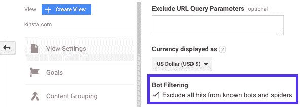

Bot Filtering in Google Analytics


只需确保勾选复选框并点击页面底部的**保存**。
T3】

### 2.从您的谷歌分析结果中过滤垃圾邮件机器人

当您进行任何技术更改时，您总是希望有一个备份，以便在出现问题时可以参考。

这在谷歌分析中没有什么不同。您需要保留一个未过滤的视图，这样您就可以将数据与过滤后的结果进行比较，以确保它们有效。它还提供了一个视图，如果您的某个过滤器工作不太正常，您可以返回到该视图。

#### 在 Google Analytics 中设置未过滤的视图

转到管理部分，点击第三列中的**查看设置**。


Setting up an unfiltered view in Google Analytics


接下来，点击**复制视图**，然后将视图命名为未过滤。

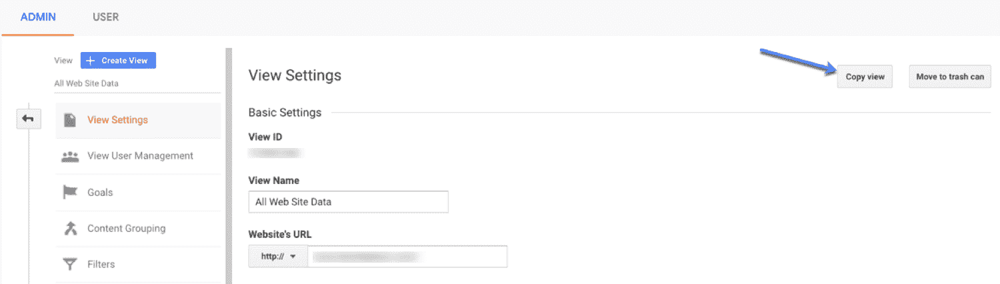

Copying and naming your new view in GA


现在，回到谷歌分析的主管理页面，点击视图部分的**过滤器**。

注意:这不同于帐户部分中的所有过滤器。

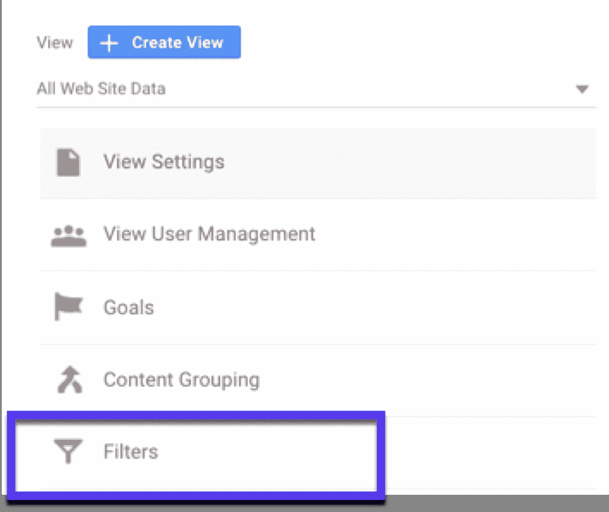

Creating a filter in Google Analytics


点击红色 **+添加滤镜**按钮:

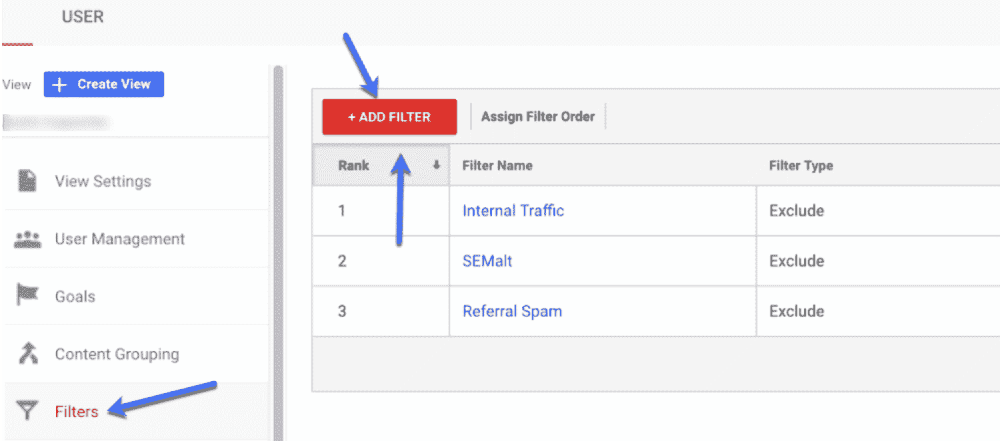

Add a new filter to GA (and give it a descriptive name)


从这里，有几个不同的垃圾邮件过滤器，你可以设置阻止谷歌分析垃圾邮件。

对于您创建的每个过滤器，请花几分钟时间进行测试，确保其正常工作。一旦你对它的准确性感到满意，点击**保存**。

让我们快速浏览一下您可以在 Google Analytics 中设置的垃圾邮件过滤器类型:

#### 要注意的垃圾邮件类型(以及如何删除它们)

有三种常见的垃圾邮件。以下是对每种病毒的简要概述，以及如何阻止它:

##### 垃圾邮件幽灵

幽灵垃圾邮件(有时也称为幽灵流量或幽灵流量)是由[黑客](https://kinsta.com/blog/wordpress-hacked/)插入到您的 Google Analytics 帐户中的虚假流量和数据，试图让您访问他们的网站。

要在您的 Google Analytics 帐户中查找 ghost 垃圾邮件，请访问:

**观众>科技>网络>主机名**

这将向您显示所有与您的网站相关的主机名列表。它应该只显示你的[域名](https://kinsta.com/blog/choose-domain-name/)、[子域](https://kinsta.com/blog/wordpress-subdomain/)，以及你与谷歌分析账户链接的任何其他服务。

如果您看到一些您不认识的东西，它可能是垃圾邮件。

## 注册订阅时事通讯


### 想知道我们是怎么让流量增长超过 1000%的吗？

加入 20，000 多名获得我们每周时事通讯和内部消息的人的行列吧！

[Subscribe Now](#newsletter)

要删除幽灵垃圾邮件，建立一个自定义过滤器，告诉谷歌分析哪些主机名属于你的帐户，哪些不属于。

###### 以下是如何在 Google Analytics 中删除垃圾邮件的方法:

1.  在正则表达式中写出有效主机名的列表。
2.  用管道字符|分隔每个主机名，并在所有句点和连字符前添加一个反斜杠\(例:*金斯塔\。com|youtube\。com*
3.  现在打开你的谷歌分析账户，进入“管理”并选择正确的视图。
4.  转到“过滤器”并点击“添加过滤器”。
5.  命名您的过滤器，选择“自定义”作为过滤器类型，并选择您想要“包括”“主机名”
6.  输入您的表达式，并使用“验证按钮”来检查您的新过滤器的作品。
7.  点击“保存”完成您的幽灵垃圾邮件过滤器。

为了让它更强大，这里有一些你可以做的其他事情来对抗垃圾邮件。

打开 Google Analytics，进入**受众** > **科技** > **网络**。

向下滚动以选择**主机名**作为主维度，并使结果按月显示。

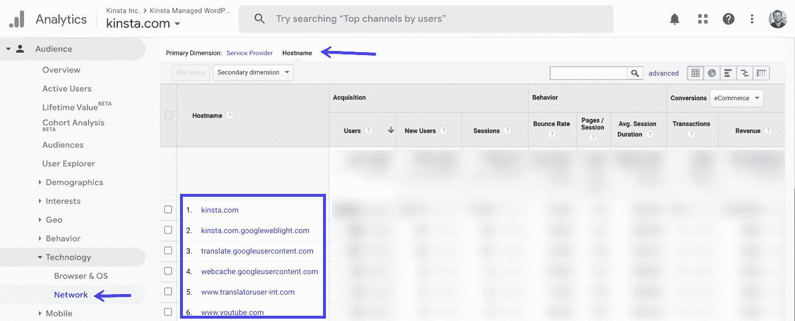

Select hostname as your primary dimension in GA


查看主机名的完整列表。找出合法的并写下来。

这里的关键是列出有效的主机名。然后，转到顶部的管理选项卡，并点击过滤器。

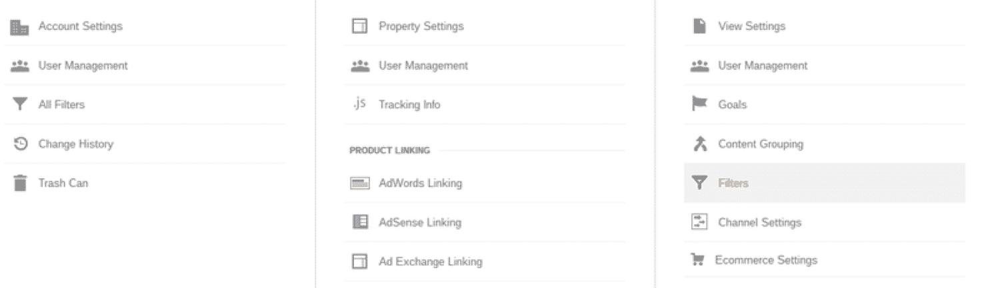

Create a list of valid host names in Google Analytics


点击**添加滤镜** > **自定义滤镜类型** > **包含**。该字段将要求您输入可接受的主机名列表。其格式要求您在每个主机名前加上一个^符号，并在每个主机名后加上一个＄符号。

为了分隔主机名，请使用|符号。

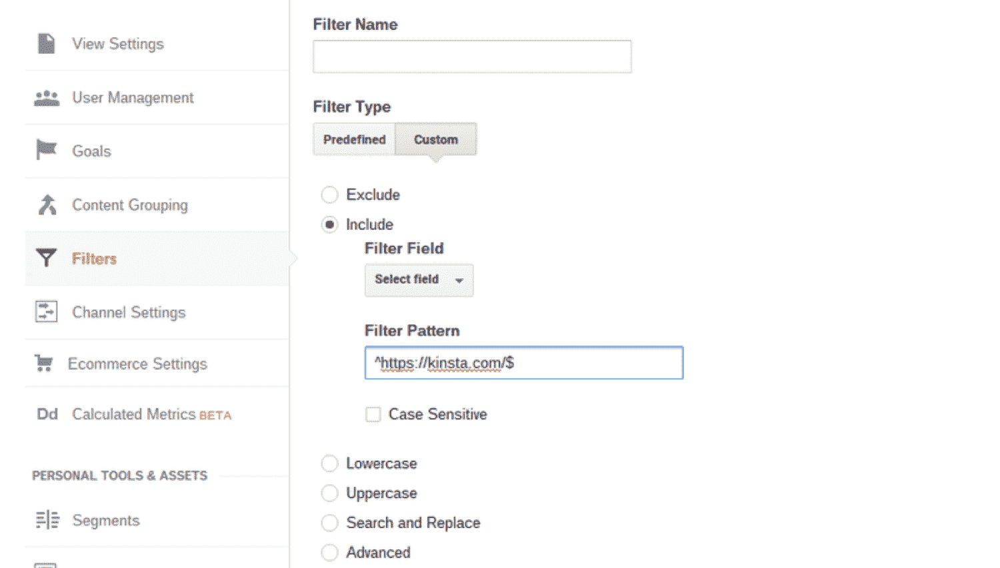

Adding a custom filter in Google Analytics


选择“保存”按钮以完成该过程。应该需要大约 24 小时才能看到谷歌分析仪表板的变化。你也可以[看看这个垃圾/幽灵推荐网站的大列表](https://gist.github.com/iMazed/c246a63a16ccdcc4c2e4#file-spamreferrals-txt)。

你应该在你的谷歌分析中排除它们。

##### 爬虫垃圾邮件

爬虫垃圾邮件是一种由通过在网站上执行自动任务来浏览网站和记录信息的机器人生成的垃圾邮件。这些机器人抓取你的页面，忽略那些在 [robots.txt](https://kinsta.com/blog/wordpress-robots-txt/) 中发现的规则。

###### 以下是如何在谷歌分析中删除垃圾爬虫:

您需要在 Google Analytics 中使用下面的表达式创建自定义过滤器，这些表达式用于排除过去几年中检测到的垃圾爬虫。

表情#1:

```
(best|dollar|success|top1)\-seo|anticrawler|^scripted\.|semalt|forum69|7makemon|sharebutton|ranksonic|sitevaluation|dailyrank|vitaly|profit\.xyz|rankings\-|dbutton|uptime(bot|check|\.com) 
```

表情#2:

```
Datract|hacĸer|ɢoogl|responsive\-test|dogsrun|tkpass|free\-video|keywords\-monitoring|pr\-cy\.ru|fix\-website|checkpagerank|seo\-2\-0\.|platezhka|timer4web|share\-buttons|99seo|3\-letter|top10\-way 
```

要创建自定义过滤器，您需要:

1.  打开你的谷歌分析账户
2.  前往“管理”，选取“过滤器”，然后点按“添加过滤器”
3.  为您的过滤器命名，选择“自定”作为过滤器类型，然后选择“排除”
4.  将字段设置为“活动来源”，然后将一个表达式粘贴到框中。
5.  验证过滤器，然后“保存”
6.  对表达式#2 重复该过程。

##### 虚假语言垃圾邮件

[语言垃圾邮件](https://kinsta.com/blog/language-spam/)通常被垃圾邮件发送者用于某种目的或推广他们自己的网站或产品。他们操纵 thenextweb.com、lifehacker.com、reddit.com 等真实网站使用的语言。

厌倦了 WordPress 的问题和缓慢的主机？我们提供世界一流的支持，由 WordPress 专家提供 24/7 服务和超快的服务器。[查看我们的计划](https://kinsta.com/plans/?in-article-cta)

###### 以下是如何在谷歌分析中删除虚假语言垃圾信息:

1.  打开你的谷歌分析账户
2.  前往“管理”，选取“过滤器”，然后点按“添加过滤器”
3.  为您的过滤器命名，选择“自定”作为过滤器类型，然后选择“排除”
4.  将字段设置为“语言设置”，然后将以下内容粘贴到过滤模式框中:\s[^\s]*\s|.{15,}|\.|
5.  验证过滤器，然后“保存”

### 3.编辑您的域名。htaccess 文件或在 Nginx 中添加规则

如果你的主机使用 [cPanel](https://kinsta.com/knowledgebase/what-is-cpanel/) ，阻止垃圾邮件推荐流量的最有效方法之一就是编辑你的[。htaccess 文件](https://kinsta.com/knowledgebase/wordpress-htaccess-file/)。该文件用于控制您的服务器，并可以被指示阻止来自某个域或 [IP 地址](https://kinsta.com/blog/dedicated-ip-address/)的任何垃圾邮件访问。

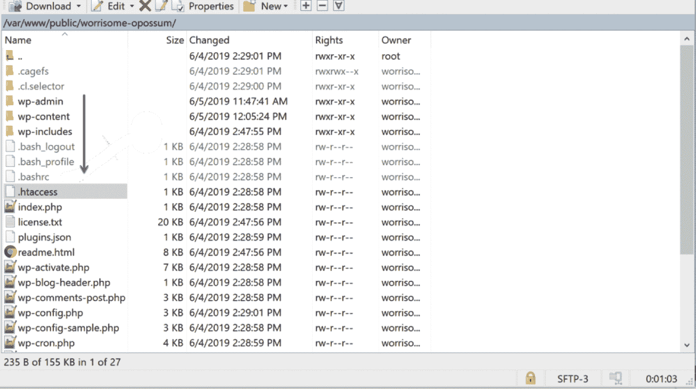

Blocking spam traffic in your .htaccess is effective (as long as you are careful and don’t break your site)


这种方法不仅阻止推荐垃圾邮件域从您的网站，但它也删除他们从您的服务器。这有助于保持您的服务器速度又快又好。

#### 以下是如何在您的中阻止垃圾邮件。htaccess 文件:

假设您想要排除 Semalt、free-traffic.xyz 和 buttons-for-website.com。只需将以下命令添加到您网站的。htaccess 文件:

```
## SITE REFERRAL BLOCK
RewriteCond %{HTTP_REFERER} semalt\.xyz [NC,OR]
RewriteCond %{HTTP_REFERER} free-traffic\.xyz [NC,OR]
RewriteCond %{HTTP_REFERER} buttons-for-website\.com [NC,OR]
RewriteRule .* – [F]
```

不知道这意味着什么？下面是该命令中发生的事情的简要概述:

*   **‘NC’**使命令不区分大小写，因此即使是 SeMalT.com 或自由流量也会被过滤器捕获。
*   **或**表示要阻止多个推荐人。
*   最后一行是关于一个域名试图访问你的网站而被拒绝会发生什么。
*   **‘F’**等于失败，意味着推荐人将得到一个 [403 错误](https://kinsta.com/blog/403-forbidden-error/)。

无论发生什么事情？htaccess 相关:**要非常小心。**

仅仅把一个字符放在错误的地方，或者不小心输入了一个双空格，都可能导致整个网站离线。

#### 以下是如何在 Nginx 中拦截垃圾邮件:

如果你的主机利用 [Nginx 作为网络服务器，而不是 Apache](https://kinsta.com/blog/nginx-vs-apache) ，你将无法编辑你的。htaccess 文件，您需要在 Nginx 中设置一个规则来阻止推荐人的请求:

```
if ($http_referer ~* "bad-site-to-block\.com") {
    return 403;
}
```

如果你是 [Kinsta 的客户](https://kinsta.com/clients/)，你需要寻求支持并要求添加这条规则。

### 4.使用第三方工具阻止推荐垃圾邮件

如果你是一个 [WordPress 用户](https://kinsta.com/blog/wordpress-user-roles/)，你可以使用一个[谷歌分析 WordPress](https://kinsta.com/blog/google-analytics-wordpress/) 推荐垃圾邮件插件来清除 bot 流量。

你最好的选择是 [Sucuri](https://kinsta.com/blog/sucuri-vs-wordfence/) ，它可以监控推荐垃圾信息，并将其从你的网站上删除。最重要的是，这个插件还可以保护你的网站免受 [DDoS 攻击](https://kinsta.com/blog/what-is-a-ddos-attack/)，因为它是一个一体化[网站安全](https://kinsta.com/blog/wordpress-security/)解决方案。

如果 Sucuri 对你来说听起来太多了，你可能想尝试的另一个插件是 [Stop Referrer Spam](https://wordpress.org/plugins/stop-referrer-spam/) ，它使用由 Matomo 提供的[垃圾推荐者公共列表](https://github.com/matomo-org/referrer-spam-list)，Matomo 是[Google Analytics alternative Piwik](https://kinsta.com/blog/google-analytics-alternatives/#matomo)的幕后公司。

还有一些额外的选项，但是**它们已经有一段时间没有更新了**，所以它们可能与你的 WordPress 安装不兼容。此外，运行过时的软件可能会带来一些安全威胁，但如果您想测试它们，这里有:

*   [阻止推荐垃圾邮件](https://wordpress.org/plugins/block-referer-spam/)
*   [SpamReferrerBlock](https://wordpress.org/plugins/spamreferrerblock/)
*   [WP 阻止推荐垃圾邮件](https://wordpress.org/plugins/wp-block-referrer-spam/)

请务必[在安装新插件之前做好备份](https://kinsta.com/help/wordpress-backups/),这样如果出现任何问题，你都可以很容易地恢复到工作站点。

## 谷歌分析垃圾邮件常见问题

以下是关于 Google Analytics 垃圾邮件的一些最常见问题的答案:

### 我可以访问谷歌分析中发现的垃圾网站吗？

首先(也是最重要的)要记住的是:**不要点击链接！**

如果你访问网站本身，垃圾邮件发送者得到他们想要的。取而代之的是，用引号将网站搜索出来:

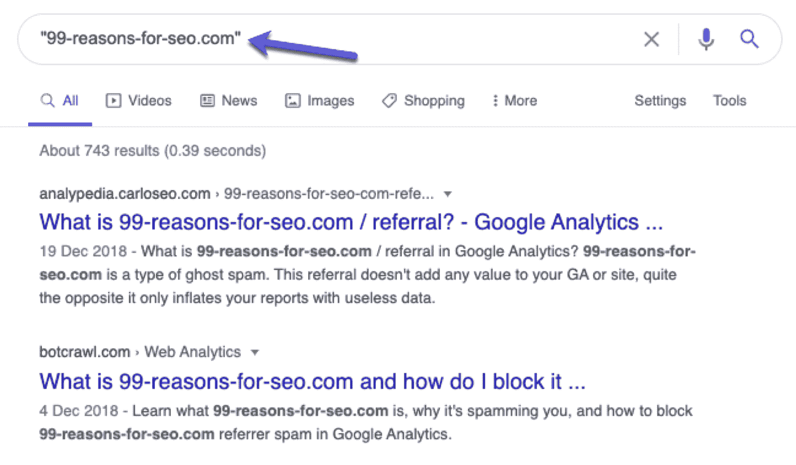

Search for spam referrer sites in Google to see if other sites have flagged them before


这样做会避免访问该网站，但你会看到其他网站的结果。如果该网站是谷歌分析垃圾邮件的来源，其他人可能已经写了。

### 为什么从我的 Google Analytics 中过滤垃圾邮件很重要？

谷歌分析数据(以及一般的[网站分析](https://kinsta.com/help/mykinsta-analytics/))是追踪你网站表现的最好方法之一，可以看到你的在线观众在做什么。它们不仅可以显示什么在工作，还可以显示什么没有工作(也就是需要改进的地方)。

但是，如果你把推荐垃圾邮件混在一起，这些数据的准确性就岌岌可危了。

您可能会收到相当数量的基本上是垃圾访问的会话:

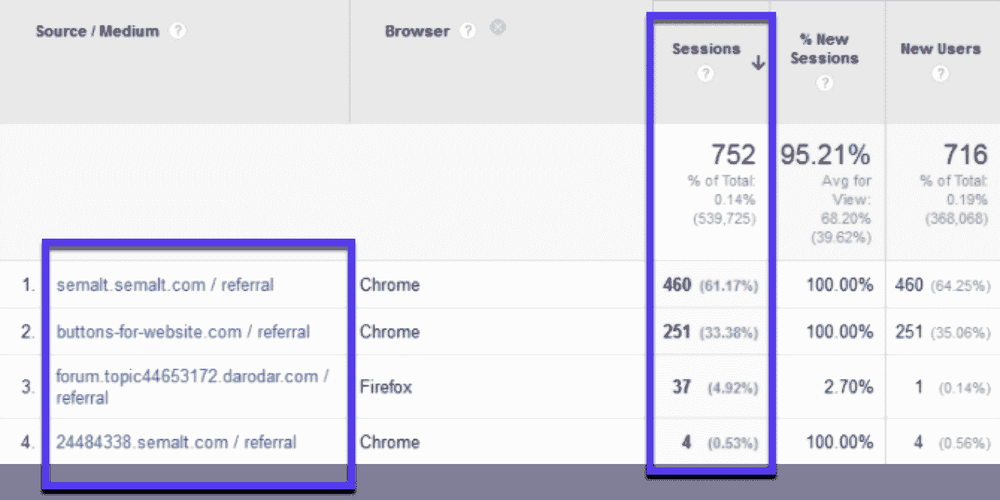

Junk visits from Semalt in Google Analytics


如果你在谷歌分析中没有最好的数据，你就有做出错误决定的风险。基本上，因为数据不准确，你可能会曲解事情。

例如，你可以花额外的时间和金钱来改进你网站上的某个页面，因为它看起来很受你的观众的欢迎。但是，如果所有这些流量都来自于机器人，投资改进就没有意义了。

总之:清理您的数据，垃圾邮件机器人过滤器确保您的分析提供更准确和有用的见解。

### 我可以清理历史谷歌分析数据吗？

垃圾邮件过滤器会让你的数据变得更干净，但不会应用于过去的数据。

一旦您设置了过滤器，垃圾邮件将从该日期开始被过滤掉，但不会向后过滤。您的历史数据仍然会包含由机器人导致的不准确数据。

然而，也不全是坏事。您将能够在谷歌分析中比较您的*与*和*，而无需*垃圾邮件数据:

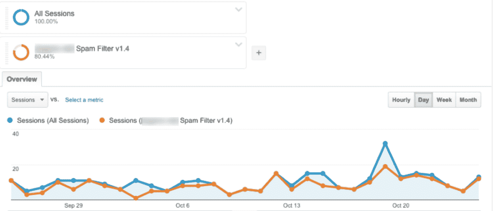

Comparing with vs without spam traffic in Google Analytics


查看应用垃圾邮件过滤器前后的分析对比，可以帮助您了解有多少流量来自机器人，让您更准确地了解您的网站。

[Don't give spammers a chance! ❌ Use these tactics to block referrer spam and keep your reports clean.Click to Tweet](https://twitter.com/intent/tweet?url=https%3A%2F%2Fbit.ly%2F2Wjnpjz&via=kinsta&text=Don%27t+give+spammers+a+chance%21+%E2%9D%8C++Use+these+tactics+to+block+referrer+spam+and+keep+your+reports+clean.&hashtags=SEO%2CAnalytics)

## 摘要

不幸的是，完全避免垃圾邮件是不可能的。但你可以控制它对你的谷歌分析数据的影响。

使用正确的过滤器、插件和一些技术诀窍是阻止垃圾邮件发送者的最佳方式，并在 Google Analytics 中还给你建立一个好网站所需的准确数据。

现在轮到你了:在谷歌分析中，你首选的清除垃圾邮件的方法是什么？

* * *

让你所有的[应用程序](https://kinsta.com/application-hosting/)、[数据库](https://kinsta.com/database-hosting/)和 [WordPress 网站](https://kinsta.com/wordpress-hosting/)在线并在一个屋檐下。我们功能丰富的高性能云平台包括:

*   在 MyKinsta 仪表盘中轻松设置和管理
*   24/7 专家支持
*   最好的谷歌云平台硬件和网络，由 Kubernetes 提供最大的可扩展性
*   面向速度和安全性的企业级 Cloudflare 集成
*   全球受众覆盖全球多达 35 个数据中心和 275 多个 pop

在第一个月使用托管的[应用程序或托管](https://kinsta.com/application-hosting/)的[数据库，您可以享受 20 美元的优惠，亲自测试一下。探索我们的](https://kinsta.com/database-hosting/)[计划](https://kinsta.com/plans/)或[与销售人员交谈](https://kinsta.com/contact-us/)以找到最适合您的方式。