# 将 Google Analytics 添加到 WordPress 的 4 种简单方法(使用插件和手动添加代码)

> 原文：<https://kinsta.com/blog/google-analytics-wordpress/>

许多 WordPress 用户在将 Google Analytics 连接到他们的 [WordPress 网站](https://kinsta.com/knowledgebase/what-is-wordpress/)时遇到困难，他们错过了收集用户数据的机会。

幸运的是，有几种方法可以将 Google Analytics 添加到 WordPress。一旦你知道你在做什么，这些技巧是相当简单的，并能在各种情况下证明是有用的。

在这篇文章中，我们将讨论谷歌分析做什么，为什么它对你的网站很重要。然后，我们将分享四种方法，你可以连接它与 WordPress 开始跟踪活动。

让我们开始吧！

### **更喜欢[视频版](https://www.youtube.com/watch?v=hZakPtwAk1g)？**

## 谷歌分析快速介绍

在你着手将 [Google Analytics](https://kinsta.com/blog/how-to-use-google-analytics) 连接到你的 WordPress 网站之前，最好理解它是什么以及它是如何工作的。简而言之，该平台监控您网站的活动，并为您提供关键数据来帮助您改进网站:

Google Analytics home

通过使用插入到每个网站页面标题中的代码片段，Google Analytics 收集了各种各样的信息，这些信息可以分为五类:

*   **实时:**显示在您查看报告的特定时刻，您的网站上正在发生什么。
*   **受众:**包括谁在访问你的网站的信息，包括人口统计。
*   **获取:**解释你的站点如何获取流量。
*   **行为:**显示访问者在你的网站上做了什么，包括按钮点击和你的哪个页面最受欢迎。
*   **转换:**与谷歌分析目标结合使用的高级报告，用于跟踪电子邮件列表订阅或电子商务销售等活动。

您可能会在 Google Analytics 报告中找到一些特定信息的示例，包括:

*   在任何给定时刻，你的站点上活跃用户的数量。
*   随着时间的推移，有多少人访问你的网站。
*   你的访问者的年龄、性别和地点。
*   你的访问者来自哪里(例如，有机搜索，社交媒体等。).
*   访问者浏览哪些页面以及浏览多长时间。
*   [反弹](https://kinsta.com/blog/how-to-reduce-bounce-rate/)，点击率，[转化率](https://kinsta.com/blog/conversion-rate-optimization-tips/)。

在您的 Google Analytics 仪表盘中有很多东西可以看和学。这可以帮助你在许多方面改善你的网站。

要了解谷歌最新版本的谷歌分析，请查看我们的 GA4 指南[。](https://kinsta.com/blog/ga4/)

## 为什么分析对你的 WordPress 网站很重要

如果你知道如何很好地利用它们，分析对你网站的许多不同方面都是有价值的。与任何类型的站点相关的四个关键领域包括:

*   [内容营销策略](https://kinsta.com/learn/content-marketing/)。通过考虑您最受欢迎的帖子、页面、产品或其他内容，您可以确定您的访问者最喜欢什么。增加浏览量和[流量](https://kinsta.com/blog/how-to-drive-traffic-to-your-website/)是创造更多能与你的观众产生最佳共鸣的内容类型的问题(以下是如何[开始关键字研究](https://kinsta.com/blog/keyword-research/)和如何[为 SEO 优化 WordPress】)。](https://kinsta.com/blog/wordpress-seo/)
*   [集客营销](https://kinsta.com/blog/inbound-marketing/)。知道你的流量来自哪里可以告诉你哪些营销策略是有效的，哪些是失败的。然后，您可以将大部分精力和预算集中在产生最大效果的方法上。
*   [受众细分](https://kinsta.com/blog/how-to-use-google-analytics/#2-use-custom-segments-to-understand-your-data-better)。理解你的受众是与他们有效沟通以鼓励转化的关键。有了分析，你可以为有针对性的营销创建子群。
*   [用户体验(UX)审计](https://kinsta.com/blog/web-design-best-practices/)。用户行为流可以揭示[你的导航或网站设计](https://kinsta.com/blog/website-navigation/)的问题。精确定位表现不佳的内容和跳出率高的页面可能有助于您改善问题区域。

如果你正在运营一个电子商务网站，**转化率**报告也有助于追踪销售和收入。

如你所见，重要的并不总是数字本身。如何应用从谷歌分析中获得的知识才是价值所在。修复问题点并为你的网站应用最好的营销技巧可以增加流量、转化率和收入。

[Google Analytics is the standard when it comes to web analytics tools 📊 Yet many WordPress users struggle to add it to their site. Check out this guide to learn different ways to connect GA with WordPress. 🔄 🚀Click to Tweet](https://twitter.com/intent/tweet?url=https%3A%2F%2Fkinsta.com%2Fblog%2Fgoogle-analytics-wordpress%2F&via=kinsta&text=Google+Analytics+is+the+standard+when+it+comes+to+web+analytics+tools+%F0%9F%93%8A+Yet+many+WordPress+users+struggle+to+add+it+to+their+site.+Check+out+this+guide+to+learn+different+ways+to+connect+GA+with+WordPress.+%F0%9F%94%84...&hashtags=GoogleAnalytics%2Cwpplugins)

## 如何将谷歌分析添加到 WordPress (4 种可能的方法)

如果你想收集用户的数据，这里有几种不同的方法可以将 Google Analytics 连接到你的 WordPress 网站。

在每种情况下，我们将假设你已经有一个谷歌分析帐户设置。如果没有，[先去创建一个](https://kinsta.com/blog/how-to-use-google-analytics/#1-setup-your-google-analytics-account-and-add-your-site)，然后再回来进行下一步。

### 1.使用谷歌分析 WordPress 插件

对于大多数 WordPress 用户来说，将 Google Analytics 添加到他们的网站的最简单的方法是使用 Google Analytics 插件。这种方法让你不必[编辑你网站的代码](https://kinsta.com/knowledgebase/edit-wordpress-code/)。

为此，我们推荐两个插件:

#### 谷歌网站工具包

如果你想在你的 WordPress 网站上添加谷歌分析，谷歌已经为你准备了一个简单而强大的插件:[谷歌网站工具包](https://wordpress.org/plugins/google-site-kit/)。

[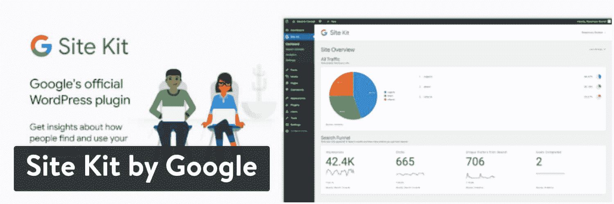](https://kinsta.com/wp-content/uploads/2020/05/Site-Kit-by-Google-1.jpg)

Site Kit by Google WordPress plugin

这个免费插件只需点击几下就可以将 Google Analytics 连接到你的 WordPress 站点，但这还不是全部。在分析的基础上，这个插件从谷歌提供的其他服务中提取数据，如[谷歌搜索控制台](https://kinsta.com/blog/google-search-console/)、[谷歌 AdSense](https://kinsta.com/blog/how-to-add-google-adsense-to-wordpress/) 和 [PageSpeed Insights](https://kinsta.com/blog/google-pagespeed-insights/) ，允许你基于谷歌作为你的数据源建立一个漂亮的仪表板。

以下是开始的方法:

通过谷歌插件安装并激活站点工具包，然后点击**开始设置**按钮。

[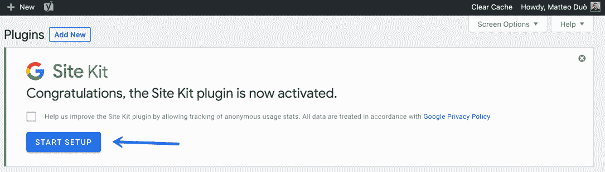](https://kinsta.com/wp-content/uploads/2020/05/google-site-kit-plugin.png)

Setting up Google Site Kit WordPress plugin

完成后，你需要将你的 WordPress 站点连接到你的分析账户。

如你所料，你需要通过几个步骤来验证你是这个域名的所有者，授权谷歌访问它的数据，并设置你想添加到 WordPress 的每个服务。

[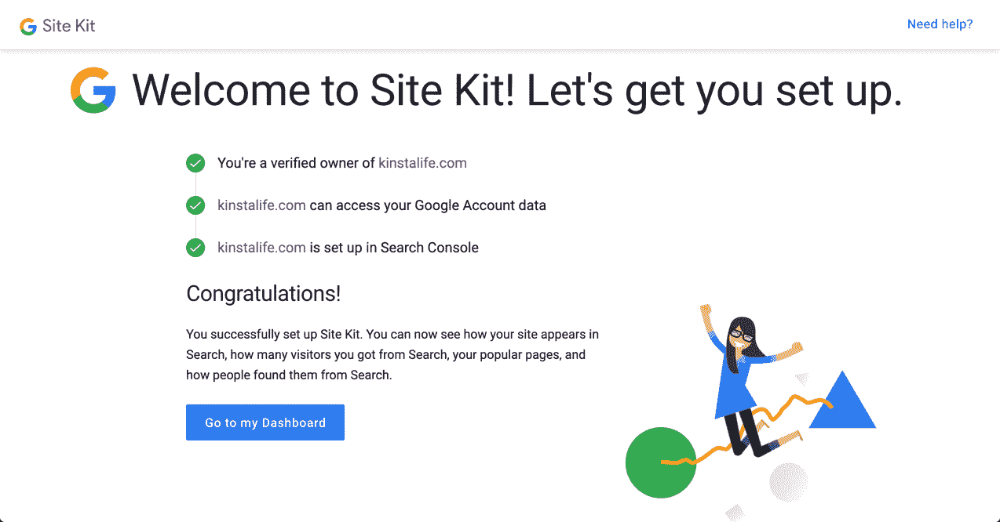](https://kinsta.com/wp-content/uploads/2020/05/google-site-kit-successful-setup.png)

Google Site Kit successful setup

当成功连接到你的 Google 账户时，你就可以看到 Google Analytics 的数据以及所有其他直接在你的 WordPress 仪表盘上激活的服务。它看起来是这样的:

[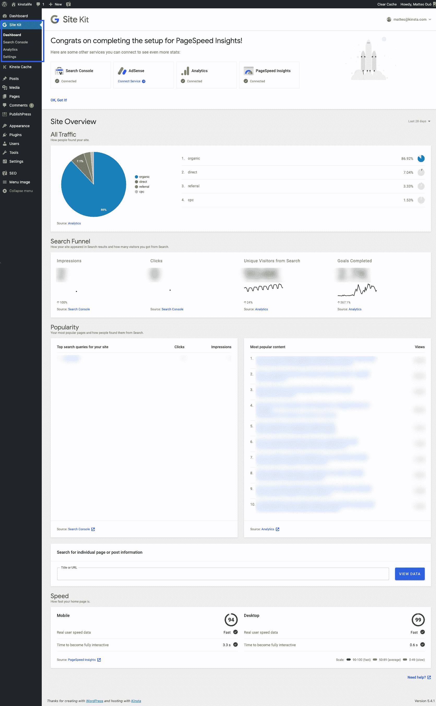](https://kinsta.com/wp-content/uploads/2020/05/google-site-kit-dashboard.png)

Google Site Kit dashboard

所有这些数据都可以在 WordPress 的左侧边栏中直接找到。

如果这个插件对你来说太多了，并且想让事情主要集中在谷歌分析上，你可以使用下一个插件。

#### 谷歌分析

Jeff Starr 开发的免费 [GA Google Analytics](https://wordpress.org/plugins/ga-google-analytics/) 插件拥有超过 400，000 个活跃安装和五星评级:

GA Google Analytics WordPress plugin

安装并激活 Google Analytics WordPress 插件后，你所要做的就是在它的设置中添加你的 [Google Analytics 跟踪 ID](https://kinsta.com/blog/how-to-use-google-analytics/#2-install-your-google-analytics-tracking-code) 。要检索您的跟踪 ID，请进入您的 Google Analytics 帐户，点击侧边栏中的**管理**:

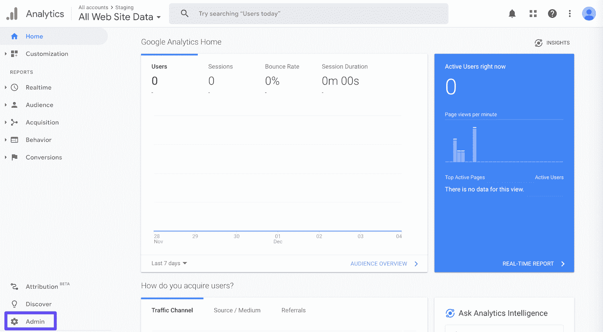

The Google Analytics Admin tab

在**属性**下，选择**跟踪信息**，然后点击**跟踪代码**:

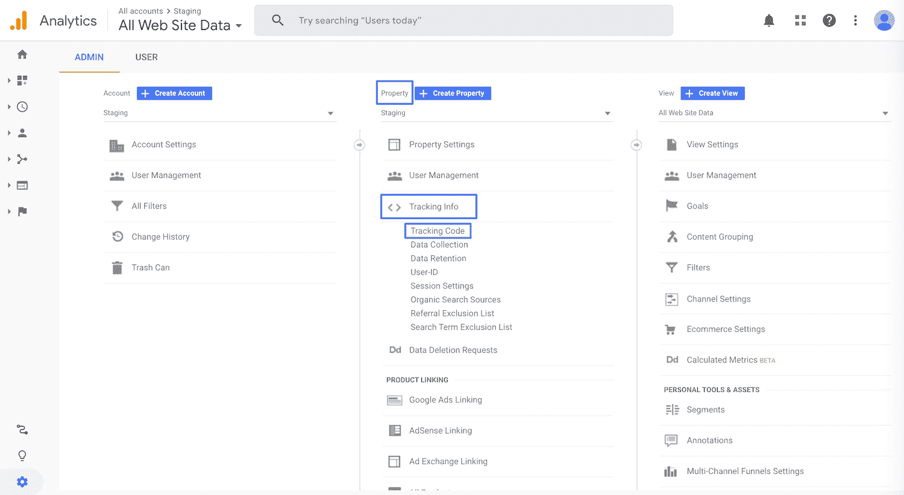

Accessing the Google Analytics tracking code under the property information

您的追踪 ID 将以 **UA** 开头，位于此部分的顶部:

## 注册订阅时事通讯

### 想知道我们是怎么让流量增长超过 1000%的吗？

加入 20，000 多名获得我们每周时事通讯和内部消息的人的行列吧！

[Subscribe Now](#newsletter)

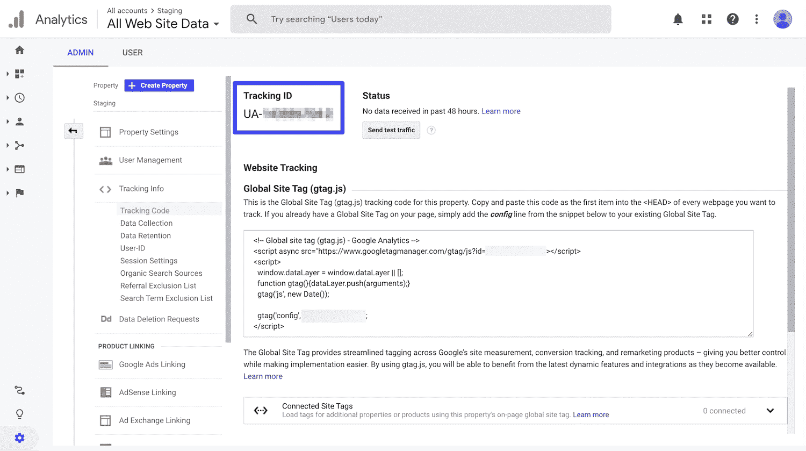

Accessing the Google Analytics tracking ID

在你的 WordPress 仪表盘中，导航到**设置>谷歌分析**。向下滚动到**插件设置**，并在相关字段中添加您的跟踪代码:

[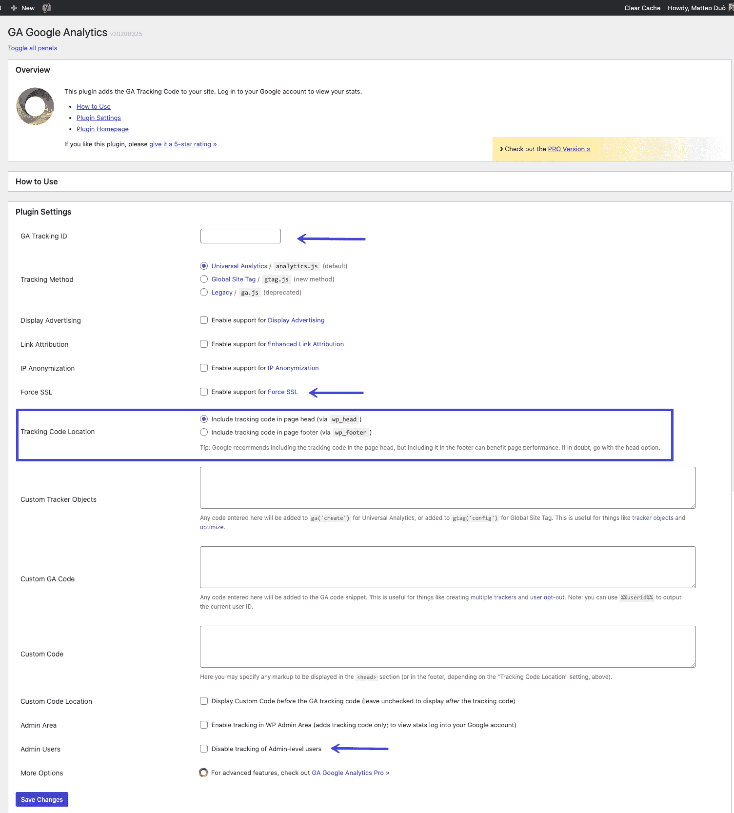](https://kinsta.com/wp-content/uploads/2020/05/GA-Google-Analytics-settings.png)

GA Google Analytics WordPress plugin settings page

这个插件允许你选择是否将跟踪代码放在你的[页眉和页脚](https://kinsta.com/knowledgebase/add-code-wordpress-header-footer/)，添加自定义跟踪代码，[强制 SSL](https://kinsta.com/knowledgebase/how-ssl-works/) ，禁用你的管理员用户的跟踪，以及一些其他有用的选项。

根据您的需求进行调整后，向下滚动并点击**保存更改**按钮。Google Analytics 现在应该在你的 WordPress 网站上活跃了。

### 2.用代码手动连接谷歌分析和 WordPress

如果你不想使用插件，也可以通过你的 functions.php**文件将谷歌分析跟踪代码直接添加到你的 WordPress 主题中。**

如果你走手动路线，使用[子主题](https://kinsta.com/blog/wordpress-child-theme/)是很重要的，这样你的跟踪代码就不会在每次[更新你的 WordPress 主题](https://kinsta.com/blog/how-to-update-wordpress-theme/)时被覆盖。不过，在你做出任何改变之前，最好[做个备份](https://kinsta.com/help/wordpress-backups/)。

一旦你的孩子主题被激活，你需要将你的谷歌分析跟踪代码粘贴到你的【header.php 文件中的 **< /head >** 结束标签之前。

要找到您的 Google Analytics 跟踪代码，请进入您的帐户并访问您的跟踪信息，如我们在前面的方法中所述。然后，您可以从 **Google Site Tag** 下的框中复制脚本:

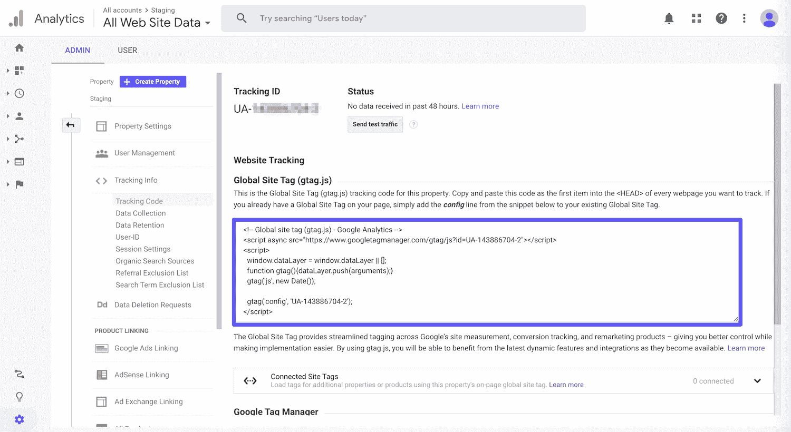

Copying the Google Site Tag code

要将它添加到你的 WordPress 站点，进入**外观>主题编辑器**。如果你的子主题从它的父主题继承模板文件，你不会在这里看到 header.php 的**。您可以在文件列表中单击父主题的名称来访问它:**

 **[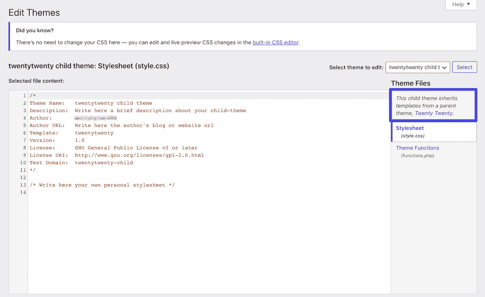](https://kinsta.com/wp-content/uploads/2020/05/wordpress-theme-editor-1-1.png)

The WordPress Theme Editor for a child theme

一旦你找到并选择了**header.php**，将谷歌分析跟踪代码粘贴到编辑器中的 **< /head >** 标签之前:

[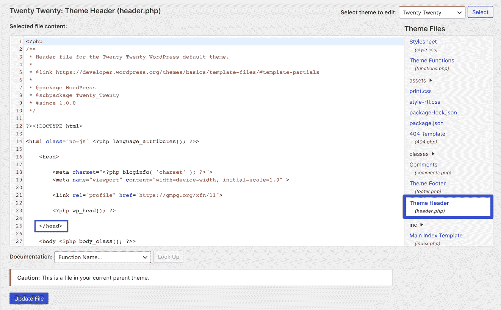](https://kinsta.com/wp-content/uploads/2020/05/edit-header-template-1-1-1.png)

Editing the header.php file in WordPress

然后，确保点击**更新文件**按钮。谷歌分析跟踪代码现在被添加到 WordPress。

### 3.将谷歌分析和 WordPress 与谷歌标签管理器集成

另一种将谷歌分析添加到 WordPress 的方法是使用[谷歌标签管理器](https://marketingplatform.google.com/about/tag-manager/)。这实际上是为包含各种用途的脚本的网站而设计的，而不仅仅是分析。

谷歌标签管理器是一个标签管理系统。它允许您快速轻松地更新网站或移动应用程序上的标签和代码片段，例如用于[流量分析](https://kinsta.com/blog/how-to-drive-traffic-to-your-website/)和[营销优化](https://kinsta.com/blog/wordpress-ab-testing-tools/)的标签和代码片段。

你的新网站需要一流的、快速的、安全的主机吗？Kinsta 提供超快的服务器和来自 WordPress 专家的 24/7 世界级支持。[查看我们的计划](https://kinsta.com/plans/?in-article-cta)

你可以从标签管理器用户界面添加和更新脚本，而不是在 WordPress 中编辑站点代码。这减少了错误，并使您在配置标签时不必让[开发人员](https://kinsta.com/blog/hire-wordpress-developer/)参与进来。

最简单的方法是使用免费的 [Google Tag Manager WordPress 插件](https://wordpress.org/plugins/duracelltomi-google-tag-manager/)。它目前拥有超过 300，000 个活跃安装和五星评级:

Google Tag Manager for WordPress plugin

你可以从 WordPress 知识库下载谷歌标签管理器插件，或者在你的 [WordPress 仪表盘](https://kinsta.com/knowledgebase/wordpress-admin/)中的**插件>添加新插件**下搜索。然后，您需要注册一个谷歌标签管理器帐户，并创建您的第一个容器。

完成上述步骤后，您可以通过导航到 **Admin** 选项卡并查找以 **GTM** 开头的一系列字符，从 Google Tag Manager 仪表板中复制您的容器 ID:

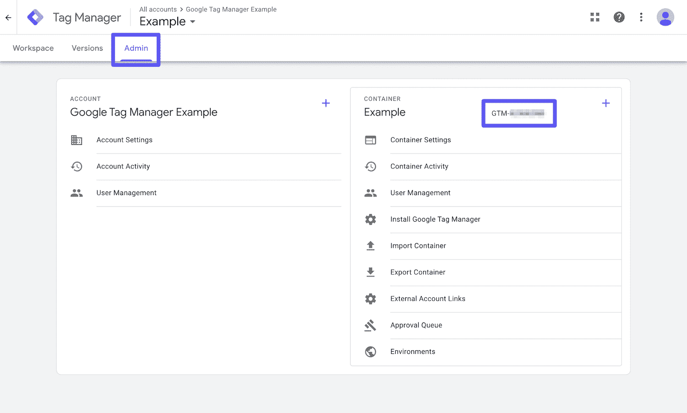

Finding the container ID in Google Tag Manager

然后返回你的 WordPress 站点，将你的 Google Tag Manager ID 粘贴到插件设置页面的相关字段中。你可以通过导航到**设置>谷歌标签管理器**到达那里:

[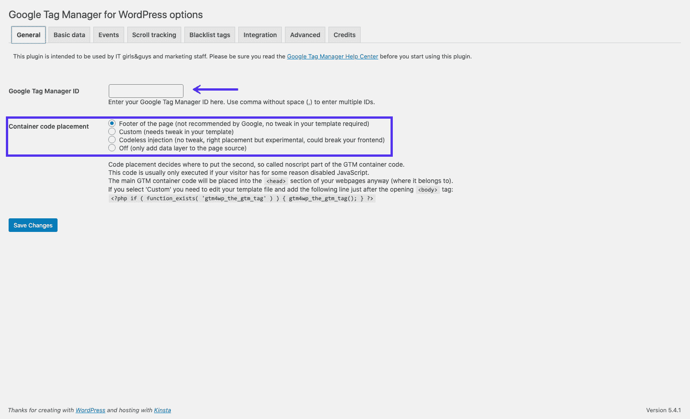](https://kinsta.com/wp-content/uploads/2020/05/Google-Tag-Manager-for-WordPress-1.png)

Adding the container ID to the Google Tag Manager plugin

你在谷歌标签管理器中设置的任何标签(包括谷歌分析的标签)现在都可以通过插件在你的 WordPress 网站上使用。

### 4.出于性能原因，在本地同步谷歌分析

您可以使用的最后一种方法是在您自己的服务器上本地同步 Google Analytics 脚本。请注意，谷歌不支持这种方法[。](https://support.google.com/analytics/answer/1032389?hl=en)

然而，有几个原因可能会让你想这样做。首先，本地同步谷歌分析可以减少你的外部 HTTP 请求。另外，你可以完全控制文件的缓存，这样你就可以使用[你自己服务器的缓存头](https://kinsta.com/learn/speed-up-wordpress/#add-expires-headers)。

这对提高[网站性能](https://kinsta.com/learn/speed-up-wordpress/)很重要。如果您使用 [Google PageSpeed Insights](https://kinsta.com/blog/google-pagespeed-insights/) ，您可能会看到针对您的 Google Analytics 脚本的“[使用高效缓存策略服务静态资产](https://kinsta.com/blog/leverage-browser-caching/)”警告:

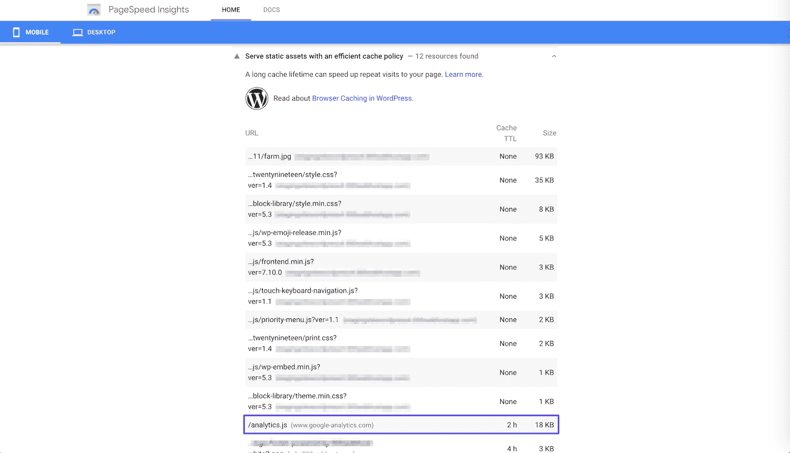

An example Google Analytics warning

问题是，默认情况下，谷歌分析有两个小时的缓存时间，你可以在上面的警告中看到。这很可能是因为如果谷歌需要修改它端的某些东西，它希望所有用户都能尽快访问到这些变化。

通过在你自己的服务器上托管谷歌分析脚本，你可以改变缓存时间来提高性能。

#### 将 Google Analytics 与完整的分析优化套件在本地同步

首先，我们推荐使用[完整分析优化套件(CAOS)](https://wordpress.org/plugins/host-analyticsjs-local/) ，这是一个由金奎大·范登贝赫创建和开发的免费插件。它目前拥有超过 20，000 个五星评级的活跃安装:

CAOS | Host Google Analytics Locally WordPress plugin

你可以从 WordPress 知识库下载它，或者在你的 WordPress 仪表盘的**插件>添加新的**下搜索它。

CAOS 允许您在本地托管您的 Google Analytics JavaScript 文件(analytics.js ),并使用 wp_cron() 保持其更新[。其他功能使您能够:](https://kinsta.com/knowledgebase/disable-wp-cron/)

*   匿名化你的访客的 IP 地址。
*   设定调整后的反弹率。
*   更改谷歌分析脚本的位置(页眉或页脚)。

在使用之前，您需要停用已经安装的任何分析插件。

当你安装 CAOS 并输入你的 Google Analytics 跟踪 ID 时，插件会将 Google Analytics 的必要代码添加到你的 WordPress 网站上。然后，它将 analytics.js 文件下载并保存到您的服务器，并使用 [wp_cron()](https://kinsta.com/knowledgebase/wordpress-cron-job/) 中的预定脚本保持更新。

我们建议通过进入**设置>优化分析**并选择跟踪代码的**位置下的**页脚**选项，将脚本加载到页脚中:**

[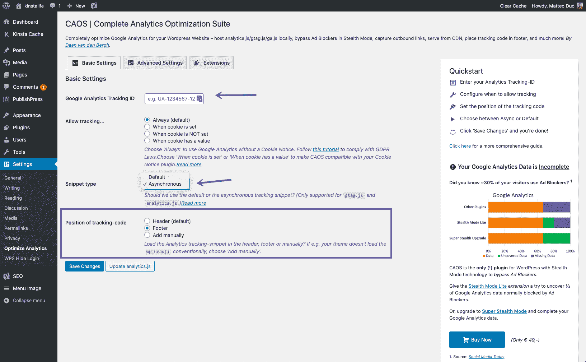](https://kinsta.com/wp-content/uploads/2020/05/CAOS-Host-Google-Analytics-Locally-settings-1-1.png)

Settings to sync Google Analytics locally

需要注意的是 **CAOS 不能与其他谷歌分析插件**一起使用。

#### 将 Google Analytics 与 Perfmatters 在本地同步

另一个可以用于本地分析的插件是[perfmates](https://perfmatters.io/)。这是一个由布莱恩·杰克逊和他的兄弟布雷特创建的高级网站性能优化插件:

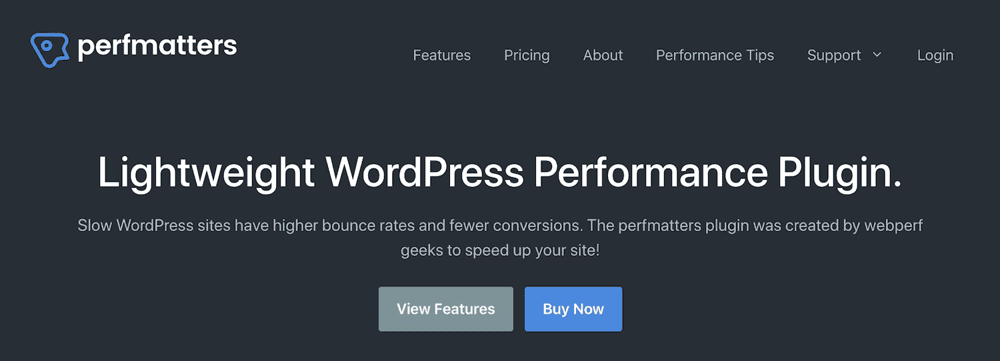

Perfmatters WordPress plugin

在其众多功能中，还有一个通过输入您的跟踪 ID 在本地同步谷歌分析的选项。像 CAOS 一样，您也可以将脚本设置为在页脚而不是页眉中加载。

[Need to track your visitors on your WordPress site? Here are 4 different methods for adding Google Analytics to WordPress. Check them all out! 👥🚀Click to Tweet](https://twitter.com/intent/tweet?url=https%3A%2F%2Fkinsta.com%2Fblog%2Fgoogle-analytics-wordpress%2F&via=kinsta&text=Need+to+track+your+visitors+on+your+WordPress+site%3F+Here+are+4+different+methods+for+adding+Google+Analytics+to+WordPress.+Check+them+all+out%21+%F0%9F%91%A5%F0%9F%9A%80&hashtags=analytics%2Cwordpresshelp)

## 摘要

对于网站所有者和管理者来说，Google Analytics 是一个至关重要的工具，尽管[不是你可以使用的唯一分析工具](https://kinsta.com/blog/google-analytics-alternatives/)。

跟踪你网站的用户活动、推荐来源和其他数据是[增加你的观众](https://kinsta.com/blog/wordpress-seo/)和[你的品牌](https://kinsta.com/blog/growing-saas-company/)的关键。要将 Google Analytics 连接到你的 WordPress 站点，你可以使用以下方法之一:

1.  用一个插件(Site Kit 或 GA Google Analytics)添加 Google Analytics 到 WordPress。
2.  通过直接向主题添加代码，手动连接 Google Analytics 和 WordPress。
3.  使用谷歌标签管理器整合谷歌分析和 WordPress(使用谷歌标签管理器 WordPress 等插件很容易)。
4.  出于性能原因，在本地同步 Google Analytics(使用 CAOS 或 Perfmatters 插件)。

你有什么想法或不同的方法来将谷歌分析添加到 WordPress 吗？如果是这样的话，我们很想听听！

* * *

让你所有的[应用程序](https://kinsta.com/application-hosting/)、[数据库](https://kinsta.com/database-hosting/)和 [WordPress 网站](https://kinsta.com/wordpress-hosting/)在线并在一个屋檐下。我们功能丰富的高性能云平台包括:

*   在 MyKinsta 仪表盘中轻松设置和管理
*   24/7 专家支持
*   最好的谷歌云平台硬件和网络，由 Kubernetes 提供最大的可扩展性
*   面向速度和安全性的企业级 Cloudflare 集成
*   全球受众覆盖全球多达 35 个数据中心和 275 多个 pop

在第一个月使用托管的[应用程序或托管](https://kinsta.com/application-hosting/)的[数据库，您可以享受 20 美元的优惠，亲自测试一下。探索我们的](https://kinsta.com/database-hosting/)[计划](https://kinsta.com/plans/)或[与销售人员交谈](https://kinsta.com/contact-us/)以找到最适合您的方式。**