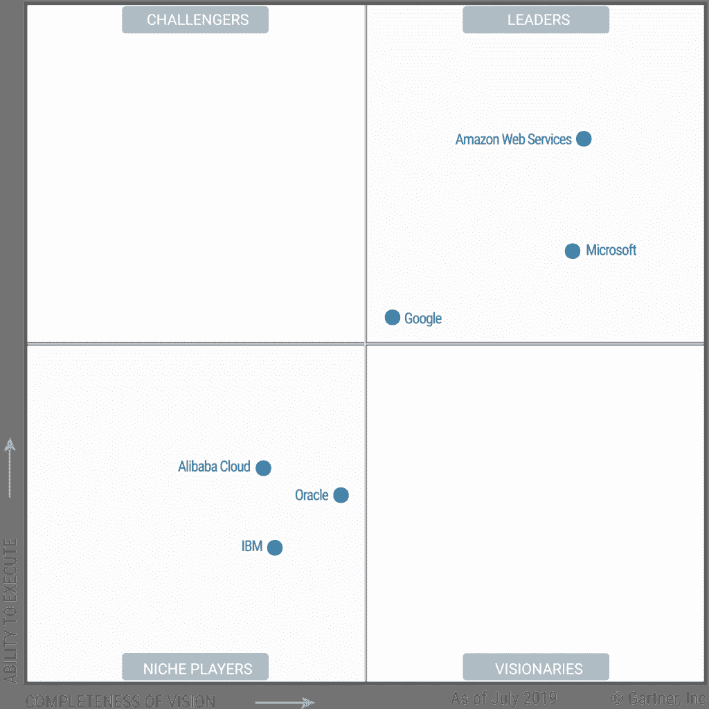
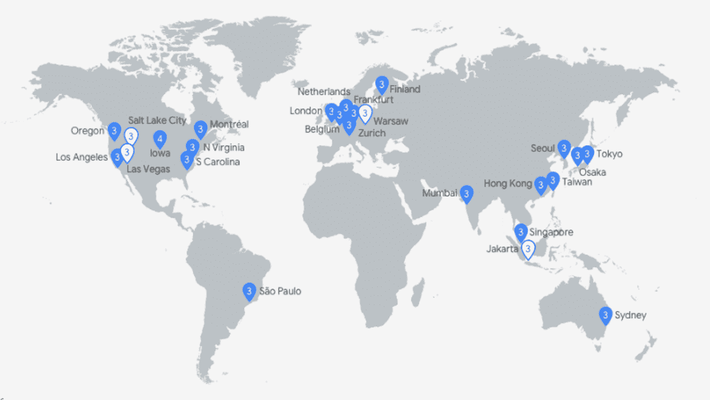
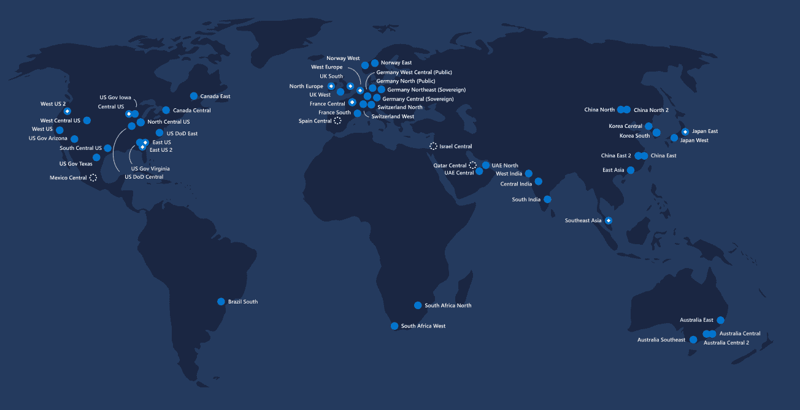
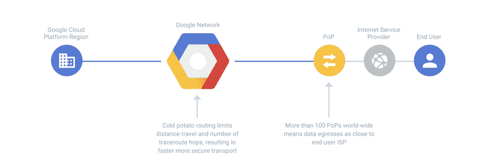
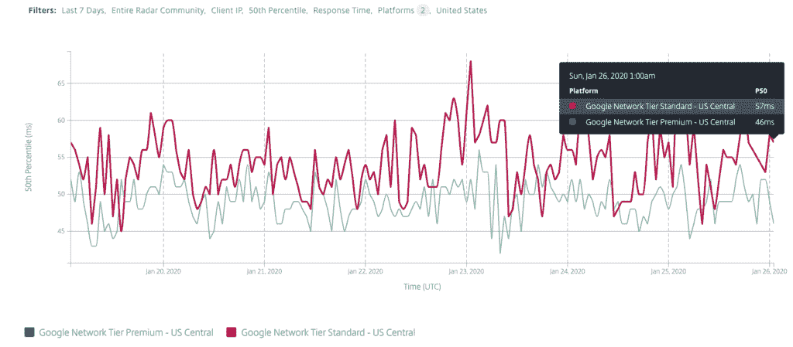
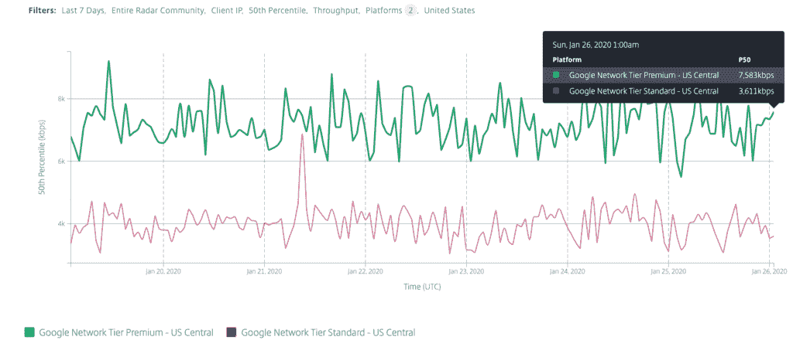
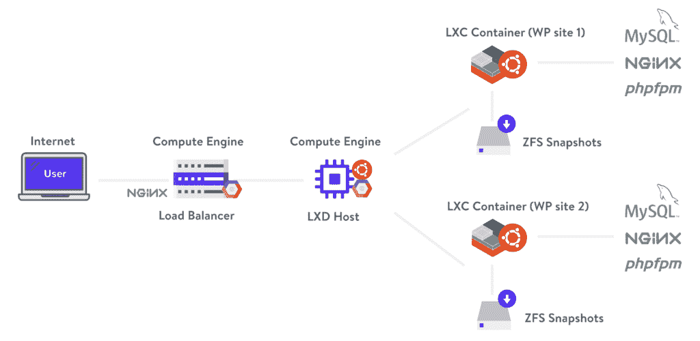

# 2022 年谷歌云 vs Azure(对比巨头)

> 原文：<https://kinsta.com/blog/google-cloud-vs-azure/>

企业向云计算的迁移继续以惊人的速度进行。公司越来越多地寻求[云技术](https://kinsta.com/blog/cloud-market-share/)在内部部署之外提供的优势。

随着云提供商在成本节约、[可扩展性](https://kinsta.com/help/scalable-cloud-hosting/)、[安全性](https://kinsta.com/blog/cloud-security/)和业务连续性方面不断改进，这一趋势必将加速。

[云计算市场](https://kinsta.com/blog/cloud-market-share/)现在是一个由提供商、技术、产品和服务组成的庞大生态系统。 [Gartner 预测](https://www.gartner.com/en/newsroom/press-releases/2019-11-13-gartner-forecasts-worldwide-public-cloud-revenue-to-grow-17-percent-in-2020)仅全球公共云服务市场就将增长 17%，达到 2664 亿美元。

|  | **2018** | **2019** | **2020 年** | **2021 年** | **2022 年** |
| 云业务流程服务(BPaaS) | Forty-one point seven | Forty-three point seven | Forty-six point nine | Fifty point two | Fifty-three point eight |
| 云应用基础设施服务(PaaS) | Twenty-six point four | Thirty-two point two | Thirty-nine point seven | Forty-eight point three | Fifty-eight |
| 云应用服务(SaaS) | Eighty-five point seven | Ninety-nine point five | One hundred and sixteen | One hundred and thirty-three | One hundred and fifty-one point one |
| 云计算管理和安全服务 | Ten point five | Twelve | Thirteen point eight | Fifteen point seven | Seventeen point six |
| 云系统基础设施服务(IaaS) | Thirty-two point four | Forty point three | Fifty | Sixty-one point three | Seventy-four point one |
| **总市场** | **196.7** | **227.8** | **266.4** | **308.5** | **354.6** |

全球公共云服务收入预测(表格来源: [Gartner](https://www.gartner.com/en/newsroom/press-releases/2019-11-13-gartner-forecasts-worldwide-public-cloud-revenue-to-grow-17-percent-in-2020) )注意:由于四舍五入，总计可能不一致。

在 1000 多家供应商中，有几家技术公司已经在云计算领域成为家喻户晓的名字。当我们想到云提供商时，亚马逊网络服务、谷歌云平台和微软 Azure 是映入脑海的三大行业巨头。

今天，我们将比较其中两个云巨头:Google Cloud vs Azure，在之前的文章中已经比较过 [Google Cloud vs AWS](https://kinsta.com/blog/google-cloud-vs-aws/) 。

在本指南中，我们将打破围绕云技术的复杂性，用通俗易懂的语言解释一切，使其尽可能易于理解。

在 Kinsta，我们独家使用[谷歌云平台](https://kinsta.com/blog/google-cloud-hosting/)，但我们将为您提供不带偏见的观点。

## 为什么谷歌云 vs Azure

如果你[正在考虑向云](https://kinsta.com/blog/managed-wordpress-hosting/)迁移，那么研究云服务提供商而不发现谷歌云和微软 Azure 是不可能的。

> Kinsta 把我宠坏了，所以我现在要求每个供应商都提供这样的服务。我们还试图通过我们的 SaaS 工具支持达到这一水平。
> 
> <footer class="wp-block-kinsta-client-quote__footer">
> 
> 
> 
> <cite class="wp-block-kinsta-client-quote__cite">Suganthan Mohanadasan from @Suganthanmn</cite></footer>

[View plans](https://kinsta.com/plans/)

[The cloud ecosystem is changing rapidly. Check out this detailed 1-to-1 comparison of the two most famous players in the cloud computing industry: Google Cloud vs Azure. Who's going to win? ☁️🆚Click to Tweet](https://twitter.com/intent/tweet?url=https%3A%2F%2Fkinsta.com%2Fblog%2Fgoogle-cloud-vs-azure%2F&via=kinsta&text=The+cloud+ecosystem+is+changing+rapidly.+Check+out+this+detailed+1-to-1+comparison+of+the+two+most+famous+players+in+the+cloud+computing+industry%3A+Google+Cloud+vs+Azure.+Who%27s+going+to+win%3F+%E2%98%81%EF%B8%8F%F0%9F%86%9A&hashtags=cloudcomputing%2CIT)

甚至在云计算出现之前，谷歌和微软都是全球公认的技术领域的领导者。虽然提供不同的产品和服务，但这些云巨头在硬件和软件方面以专业知识、创新和卓越而闻名。正是在这个基础上，他们建立了自己的云平台，以主导竞争对手。

2019 年， [Gartner 宣布](https://www.gartner.com/en/documents/3947472/magic-quadrant-for-cloud-infrastructure-as-a-service-wor)谷歌和微软在其魔力象限中成为全球云[基础设施即服务(IaaS)](https://kinsta.com/blog/cloud-market-share/#infrastructure-as-a-service-iaas) 的领导者。Amazon Web Services 是分享这一荣誉的唯一其他提供商。

他们凭借在 IaaS 领域内“愿景的完整性”和“执行能力”这两个方面的优势赢得了领导者的地位。

2019 Magic Quadrant for Cloud Infrastructure as a Service, Worldwide (Image Source: Gartner)

### 谷歌云和微软 Azure 继续增长

无论您是在考虑 IaaS、SaaS 还是 PaaS 解决方案， [Google Cloud](https://kinsta.com/blog/google-cloud-network/) 和 [Azure](https://kinsta.com/blog/cloud-market-share/#microsoft-azure) 提供了数百种市场领先的云产品和服务供您选择。随着他们不断创新和发展以提供更多更好的解决方案，这个列表还会继续扩大。

根据 Gartner 的[数据，谷歌和微软都是前五大公共云基础设施提供商，占 IaaS 市场的 80%。](https://www.gartner.com/en/newsroom/press-releases/2019-07-29-gartner-says-worldwide-iaas-public-cloud-services-market-grew-31point3-percent-in-2018)

这些云科技巨头继续扩大他们的客户群，并在 2019 年全年都实现了令人印象深刻的收入增长。有数据表明，云提供商不仅与领先的云提供商亚马逊网络服务公司保持同步，而且还在积极抢占市场份额。

#### 2019 年谷歌云平台收入

2019 年上半年，谷歌通过其对 [Q1](https://abc.xyz/investor/static/pdf/2019Q1_alphabet_earnings_release.pdf) 和 [Q2](https://abc.xyz/investor/static/pdf/2019Q2_alphabet_earnings_release.pdf) 的财务报告，报告了令人印象深刻的增长。尽管谷歌云服务对整体收入的财务贡献尚不明朗，[谷歌首席执行官桑德尔·皮帅报道](https://www.zdnet.com/article/alphabet-q2-tops-expectations-as-net-income-surges/)该公司有望通过谷歌云平台实现 80 亿美元的年收入。比 2018 年同期的 40 亿美元的年运行率增长了惊人的 100%。

尽管谷歌在[第三季度财务报告](https://abc.xyz/investor/static/pdf/2019Q3_alphabet_earnings_release.pdf)中远远低于华尔街对全公司收入的预期，但该业务继续报告其云服务的惊人增长。这些数字表明谷歌继续从亚马逊网络服务中夺走市场份额。同期，AWS 仅报告了 35%的 AWS 云收入增长。

在 2019 年第四季度财务业绩电话会议上，Pichai [宣布](https://abc.xyz/investor/static/pdf/2019Q4_alphabet_earnings_release.pdf?cache=79552b8)谷歌的云收入持续增长。

如果你想了解更多，请务必查看我们深入的[谷歌云平台市场份额指南](https://kinsta.com/google-cloud-market-share/)以了解更多。

#### 2019 年微软 Azure 收入

当考虑来自微软 Azure 云服务的收入时——就像谷歌一样——很难揭示实际的贡献。该业务仍然缺乏透明度，在“智能云”分组中报告其 Azure 收入。它还掩盖了其 SaaS 产品——如 [Office 365](https://kinsta.com/knowledgebase/office-365-smtp/) 和 Dynamics 365——作为“生产力和业务流程”收入分组的一部分。

抛开透明度不谈，这家科技巨头在 2019 年表现出令人印象深刻的增长。相比之下——与谷歌同期——微软宣布 Azure 收入增长超过 60%超过 [Q1](https://www.microsoft.com/en-us/Investor/earnings/FY-2019-Q3/press-release-webcast) 、 [Q2](https://www.microsoft.com/en-us/Investor/earnings/FY-2019-Q4/press-release-webcast) 、 [Q3](https://www.microsoft.com/en-us/Investor/earnings/FY-2020-Q1/press-release-webcast) 和 [Q4](https://www.microsoft.com/en-us/Investor/earnings/FY-2020-Q2/press-release-webcast) 。

虽然 Azure 收入持续增长 60%确保了微软也从亚马逊网络服务中夺取了市场份额，但他们继续在谷歌云平台面前节节败退。

## 谷歌云和 Azure 功能对比

比较和对比 Google Cloud 和 Azure 的功能既困难又耗时。每个提供商现在都提供超过 100 种云产品。即使他们提供同样的服务，他们的比较产品也有不同的名称。很容易迷失在细节中。

[Check out this detailed features comparison of Google Cloud vs Azure, two key players of the cloud computing industry ☁️🆚Click to Tweet](https://twitter.com/intent/tweet?url=https%3A%2F%2Fkinsta.com%2Fblog%2Fgoogle-cloud-vs-azure%2F&via=kinsta&text=Check+out+this+detailed+features+comparison+of+Google+Cloud+vs+Azure%2C+two+key+players+of+the+cloud+computing+industry+%E2%98%81%EF%B8%8F%F0%9F%86%9A&hashtags=cloudcomputing%2CIT)

谢天谢地，这两个平台非常相似，[谷歌云平台](https://cloud.google.com/products/)和 [Azure 平台](https://azure.microsoft.com/en-gb/services)产品归为同一类。为了节省您的时间，并提供清晰度，我们做了艰苦的工作，比较最受欢迎的产品从关键类别。

在本节中，我们将介绍云部署的基础，包括计算、存储、网络和安全性。我们在 Kinsta 利用所有这些为我们的客户提供最先进的可扩展托管服务。这帮助我们成为了[在欧美发展最快的主机之一](https://cloud.google.com/customers/kinsta/)。

那么，让我们开始吧:

### 计算

在第一类计算中，我们将重点关注虚拟机(VM)。对比微软 Azure 和谷歌云平台的设置。

乍看之下，每个提供商对虚拟机都采用了相似的方法，虚拟机构成了任何云环境的基础部分，并将运行您能想到的几乎所有类型的客户工作负载。

云巨头对虚拟机有不同的命名约定。它们在微软 Azure 上被称为 [Azure 虚拟机](https://azure.microsoft.com/en-gb/services/virtual-machines/)，在谷歌云平台上被称为[计算引擎](https://cloud.google.com/compute/)。这两个提供者还使用不同的高级术语和概念。

为了确保对比的清晰性，Google [绘制了【Azure 和 Compute Engine 的差异，如下表所示:](https://cloud.google.com/docs/compare/azure/compute)

| **功能** | **蔚蓝色** | **计算引擎** |
| 虚拟计算机 | 虚拟计算机 | 虚拟机实例 |
| 形象 | 映像(仅引导磁盘和完整机器) | 映像(仅启动磁盘) |
| 自定义图像 | 通用 Azure 虚拟机 | 自定义图像 |
| 虚拟机模板 | 资源管理器模板 | 实例模板 |
| 自动实例缩放 | Azure 自动缩放 | 计算引擎自动缩放器 |
| 支持的虚拟机导入格式 | VHD | 生的 |
| 部署地点 | 区域性(相当于云平台区域) | 带状的 |
| 可抢占的虚拟机 | 是 | 是 |
| 增量快照 | 是 | 是 |

将 Azure 的高级术语映射到 Google 计算引擎

#### 虚拟机功能

在 Compute Engine 和 Azure 中配置虚拟机时，您会发现这些平台为您提供了许多相同的功能。您将能够:

*   通过自动扩展按需部署和终止虚拟机实例。
*   在虚拟机上安装一系列可用的操作系统。
*   使用引导磁盘映像创建虚拟机实例。
*   不受限制地管理虚拟机实例。
*   标记您的虚拟机以便于识别。

#### 虚拟机访问

当谈到虚拟机访问时，谷歌云和 Azure 之间有一些关键的区别。这些差异取决于您使用的机器类型。

对于 Linux 机器来说，[基于 SSH 的机器访问](https://kinsta.com/blog/how-to-use-ssh/)是有区别的。计算引擎允许您在需要时创建 SSH 密钥，即使您的虚拟机实例已经在运行。该平台还支持从浏览器使用 SSH，允许通过 web 浏览器直接访问您的虚拟机，从而避免在本地计算机上存储密钥。

有了 Azure，就没有 SSH 浏览器访问，如果你想要基于 SSH 的访问，你必须包含你自己的密钥。

至于 Windows 机器，跨平台的访问是相似的。计算引擎和 Azure 都支持通过标准渠道访问虚拟机，包括远程桌面协议(RDP)和 Windows 远程管理服务。

#### 虚拟机类型

谷歌和微软都提供了 100 多种机器类型，可以部署在许多不同的配置中。您可以扩展虚拟机资源以满足需求，将 CPU 和内存的数量增加到极高的规格。目前，这些产品中最出色的是:

*   Google 计算引擎虚拟机可扩展至 416 个虚拟 CPU 和 11，776 GB 内存。
*   Microsoft Azure 虚拟机可扩展至 416 个虚拟 CPU 和 11，400 GB 内存。

两个平台共享相同的机器类型分类，以帮助您选择资源。根据您的需求，您可以从共享内核、通用、内存优化、计算优化、存储优化、GPU 和高性能类别中选择机器类型。

我们编制了下表，其中列出了这两种服务的最新机器类型。

| **机器类型** | **蔚蓝色** | **计算引擎** |
| 共享核心 | 不适用的 | f1-微型–G1-小型
E2-微型–E2-中型 |
| 通用 | a1 v2–A8 v2
B1LS–B20MS
D2a v4–D96a v4
D2as v4–D96as v4
D2 v3–D64 v3
D2s v3–D64s v3
D1-5 v2–D5 v2
DS1-5 v2–DS5 v2 | n1-standard-1–n1-96【t1-high mem-2】–n1-high mem-96
n1-high CPU-2–n1-96
N2-standard-2–N2-80
N2-high mem-2–N2-80【T2-high CPU-2–N2】 |
| 内存优化 | E2 v3–e64v 3
E2a v4–E96 v4
E2as v4–E96as v4
E2s v3–E64s v3
D11 v2–D15 v2
DS11 v2–DS15 v2
G1–G5
Gs1–Gs5
M8ms–m128 ms
M208s v2–m416 ms v2
S96–S576m | m1-ultra-40-m1-ultra-160
m2-ultra-208-m2-ultra-416 |
| 计算优化 | f2s v2–F72s v2
F1–F16F1s–F16s | c2 标准 4–C2 标准 60 |
| 存储优化 | l8s v2–L80s v2
L4s–L32s | 不适用的 |
| 国家政治保卫局。参见 OGPU | NC6–NC24
NC6 促销–NC24r 促销
NC6s v2–NC24s v2
NC6s v3–NC24s v3
NV6 促销–NV24 促销
NV12s v3–NV48s v3
ND6s–ND24s
nd 40 RS v2 | 英伟达特斯拉 T4–英伟达特斯拉 K80
英伟达特斯拉 T4 虚拟工作站–英伟达特斯拉 P100 虚拟工作站 |
| 高性能 | h8–h16mh 8 促销活动–H16mr 促销活动 | 不适用的 |
| 自定义虚拟机资源配置 | 不 | 是 |

注意:Azure 和 Compute Engine 会定期添加新的 VM 类型。有关每个服务的完整列表，请参见 [Azure Linux 虚拟机](https://azure.microsoft.com/en-us/pricing/details/virtual-machines/linux/)、 [Azure Windows 虚拟机](https://azure.microsoft.com/en-us/pricing/details/virtual-machines/windows/)和[计算引擎机器类型](https://cloud.google.com/compute/all-pricing)。

### 建立工作关系网

Google Cloud 和 Azure 继续利用和扩展他们自己的网络基础设施，与合作伙伴合作，以互联他们在全球部署的数据中心。他们有雄心勃勃的扩展计划，并提供最先进的网络服务，以提供跨虚拟机、其他云服务和内部服务器的高速连接。

在这一部分，我们将探索谷歌和微软提供的核心网络产品，并快速了解可用性和[延迟](https://kinsta.com/blog/network-latency/)。

| **产品** | **谷歌云平台** | **微软 Azure** |
| 加拿大 | 谷歌云 CDN | Azure CDN |
| 专用互连 | 云互联 CDN 互联 | 快速路线 |
| 域名服务器(Domain Name Server) | 云 DNS | Azure DNS |
| 负载平衡 | 云负载平衡 | Azure 负载平衡器 |
| 虚拟网络 | 虚拟私有云 | Azure VNet |
| 层 | 网络服务等级 | 不适用的 |

Google Cloud 与 Azure 的等效云网络产品对比(表格来源: [Google](https://cloud.google.com/docs/compare/azure/networking) )

#### 位置

谷歌云和 Azure 都提供了一个跨越多个地区、国家和地点的数据中心的全球网络。每个提供商都有不同的可用性区域，这些区域在冗余、容错和低延迟方面非常出色。虽然 Azure 提供了更大范围的地区，但谷歌云的位置数量要多得多。

[谷歌云网络位置](https://kinsta.com/knowledgebase/google-cloud-data-center-locations/)目前在 35 个地区、60 多个地区和 200 多个国家可用，最近增加了新的地区，如[首尔](https://kinsta.com/feature-updates/google-cloud-seoul-data-center/)和[盐湖城](https://kinsta.com/feature-updates/google-cloud-salt-lake-city-data-center/)。

Google Cloud Regional Network

[微软 Azure 网络位置](https://azure.microsoft.com/en-gb/global-infrastructure/regions/)目前在更广泛的 58 个地区和 140 个区域可用。

Microsoft Azure Regional Network

#### 加拿大

谷歌和 Azure 都提供类似的[内容交付网络(CDN)](https://kinsta.com/blog/wordpress-cdn/) 解决方案，帮助您减少加载时间、节省带宽，并加快应用程序、网站和服务的响应速度。

命名为[谷歌云 CDN](https://cloud.google.com/cdn) 和 [Azure CDN](https://azure.microsoft.com/en-gb/services/cdn/) ，每个平台都提供了与其原生平台的深度集成——提供高级日志记录和监控。以及许多旨在抵御分布式拒绝服务(DDoS)攻击的安全解决方案。

#### 专用互连

在某些情况下，您可能会发现您的本地云 VPN 无法提供特定工作负载所需的速度或安全性。在这种情况下，你可以求助于 Azure 和谷歌，租用一条容量有保证的高速网络线路。两个平台都提供一系列服务:

##### 运营商对等

运营商对等是一种通过第三方提供商与云提供商进行专用互连的形式，您可以从第三方提供商处租用一条线路。Azure 提供的是 [ExpressRoute](https://azure.microsoft.com/en-gb/services/expressroute/) ，而谷歌有[云互联](https://cloud.google.com/hybrid-connectivity)。

虽然每个提供商都提供高达 100 Gbps 的连接速度，但 Express Route 拥有 102 个提供商，而 Cloud Interconnect 只有 24 个提供商。ExpressRoute 还提供私人租赁线路，而云互联线路使用公共网络。

##### 直接对等

直接对等是谷歌目前提供的服务，而不是 Azure。这项服务允许在你的商业网络和谷歌的边缘网络之间建立直接连接，不需要中间人。将您直接接入谷歌的服务，并允许交换高吞吐量的云流量——在全球 100 多个地点和 33 个国家提供。

##### 内容交付网络(CDN)对等

谷歌也提供 CDN 对等服务。允许您使用 Google 的网络边缘位置直接连接云中的资源和 CDN 提供商。谷歌通过其 [CDN 互联](https://cloud.google.com/interconnect/docs/how-to/cdn-interconnect)服务为几家 [CDN 提供商](https://cloud.google.com/interconnect/docs/how-to/cdn-interconnect#providers)提供支持。同样，到目前为止，Azure 没有提供有竞争力的 CDN 对等产品。尽管它在 Azure CDN 服务中支持到 Akamai 和威瑞森 CDN 的专用连接。

#### 域名服务器(Domain Name Server)

一个 [DNS 服务](https://kinsta.com/knowledgebase/what-is-dns/)将你的人类可读的域名转换成服务器用来相互通信的 IP 地址。

谷歌云和 Azure 都提供可在云中扩展的托管 DNS 服务——被称为 [Azure DNS](https://azure.microsoft.com/en-gb/services/dns/) 和[云 DNS](https://cloud.google.com/dns/) 。几乎相同的功能，都支持最常见的 DNS 记录类型和基于任播的服务。最近，谷歌已经扩展了它的功能提供，以支持 DNSSEC，这是 Azure DNS 尚未采用的。

#### 负载平衡

谷歌云和 Azure 都提供[负载平衡服务](https://kinsta.com/blog/google-cloud-network/#google-standard-tier-network)来帮助你在多个实例间分配流量。所有这些都是为了提高可用性和容错能力。让我们从较高的层面来看看他们使用不同的负载平衡类型来提供这种支持的一些方法:

##### HTTP(S)负载平衡

Azure 和 Google 提供第 7 层负载平衡，帮助您在应用层分发客户端请求，以实现比第 4 层负载平衡更复杂的路由。

##### TCP/UDP 负载平衡

这两个平台都支持第 4 层负载平衡，在网络传输层的一个区域内分发您的客户端请求。

##### SSL 负载平衡

这两个提供者都支持 SSL 负载平衡，为你的服务提供数据加密和解密。

#### 虚拟网络

你可以在 Azure 和谷歌云上创建[隔离和安全的虚拟网络](https://kinsta.com/blog/google-cloud-vs-aws/#network)。每个平台都为您提供了部署多个网络的能力，这些网络可以进一步划分为更小的子网。部署在这些虚拟网络中的虚拟机无需进一步配置即可跨子网进行通信。

Azure 产品被称为 Azure VNet，是一种区域性产品。而谷歌的服务叫做[虚拟私有云](https://cloud.google.com/vpc/) (VPC)，是一种全球资源。仔细看看特性和功能，谷歌 VPC 提供了一些 Azure 缺乏的特性。例如共享网络，允许管理员授予多个项目使用单个共享虚拟网络及其相应资源的权限。

#### 层

谷歌云平台提供网络服务层作为其产品的一部分，允许您在性能和价格上优化您的网络。谷歌是第一个引入分层云网络服务的主要公共云提供商。迄今为止，微软 Azure 没有提供一个比较的选项。

通过谷歌，你可以在高级和标准层之间选择[。选择高级层可以让您访问 Google 的高性能、低延迟、高度可靠的全球网络。该服务通过最少跳数的最快路径路由您的流量，以加快传输速度并提高安全性。您可以访问额外的网络服务，如全球负载平衡，并受到全球 SLA 的保护。](https://kinsta.com/blog/google-cloud-network/)

Google Cloud Platform Premium Tier

如果您选择标准层，您将连接到与其他公共云提供商相当的较低性能网络。您的网络服务，如负载平衡，将是区域性的，您不会有一个全球性的 SLA。如果成本是一个考虑因素，并且您愿意牺牲性能，那么这是您的一个选择。

Google Cloud Platform Standard Tier

要了解这给服务带来的不同，您可以定期检查 Cedexis 的[性能测量，它比较延迟和吞吐量。正如您将从](https://itm.cloud.com/google-reports/)下方的[图中看到的，与标准层相比，高级层目前的延迟几乎降低了 20%。](https://itm.cloud.com/ui/reports/share/s5lqszxqx40?primaryDimension=platform&time=last_7_days&source=community&ipSource=client&statistic=percentile_50&probeType=0&group0Sort=percentile_50&group0Order=desc&vis.group0Sort=percentile_50&vis.group0Order=desc&table.group0Limit=10&table.group0Sort=percentile_50&table.group0Order=desc&vis.group1Limit=5&vis.group1Sort=percentile_50&vis.group1Order=asc&table.group1Limit=10&table.group1Sort=percentile_50&table.group1Order=asc&vis.platform%5B%5D=35270&vis.platform%5B%5D=35271&timeScale=hour&platform%5B%5D=35270&platform%5B%5D=35271&country%5B%5D=223)

Google Cloud Platform Networking Latency – Premium Tier vs Standard Tier

[查看吞吐量](https://itm.cloud.com/ui/reports/share/s5lqszxqiwg?primaryDimension=platform&time=last_7_days&source=community&ipSource=client&statistic=percentile_50&probeType=14&group0Sort=percentile_50&group0Order=desc&vis.group0Sort=percentile_50&vis.group0Order=desc&table.group0Limit=10&table.group0Sort=percentile_50&table.group0Order=desc&vis.group1Limit=5&vis.group1Sort=percentile_50&vis.group1Order=asc&table.group1Limit=10&table.group1Sort=percentile_50&table.group1Order=asc&vis.platform%5B%5D=35270&vis.platform%5B%5D=35271&timeScale=hour&platform%5B%5D=35270&platform%5B%5D=35271&country%5B%5D=223)，您还会看到，与标准层相比，高级层的吞吐量增加了 100%。

Google Cloud Platform Networking Throughput – Premium Tier vs Standard Tier

我们理解速度在服务中的重要性。这就是为什么我们在 [Kinsta 为我们所有的客户使用谷歌云平台的高级层](https://kinsta.com/knowledgebase/what-you-should-know/)。确保闪电般的加载速度，最大限度地减少跟踪路由跳数，并缩短数据传输的距离。

### 储存；储备

了解您的云提供商使用的不同存储和磁盘类型至关重要。这些设备将直接影响预期吞吐量(IO)、每个卷/实例的最大 IOPs，以及短时间爆发容量的能力，这些都会对性能产生重大影响。

在比较谷歌云和微软 Azure 存储时，我们将重点关注主要的存储选项:块存储和对象存储。

#### 块存储器

块存储本质上是运行在基于云的虚拟机上的虚拟磁盘。谷歌云利用[持久磁盘](https://cloud.google.com/persistent-disk/)提供块存储——提供 [SSD 和 HDD 存储](https://kinsta.com/blog/what-is-ssd/)——可以连接到运行在计算引擎或谷歌 Kubernetes 引擎上的实例。

微软 Azure 以页面 blobs 的形式提供其块存储解决方案，存储在 Azure VHDs 上，运行在 Azure VM 上。

除了数据存储的方法，计算引擎持久性磁盘和 Azure 虚拟硬盘(vhd)非常相似。每种都提供网络连接磁盘卷，并能够在需要时连接本地磁盘。

下面是块存储如何在计算引擎持久磁盘和 Azure VHDs 之间映射的[详细视图](https://cloud.google.com/docs/compare/azure/storage#block_storage):

| **块存储** | **Azure VHDs** | **计算引擎持久磁盘** |
| 卷类型 | 标准存储(硬盘)、高级存储(固态硬盘) | 标准持久磁盘(HDD)，SSD 持久磁盘 |
| 管理方案 | 非托管磁盘，托管磁盘 | 不适用(Google Cloud-在项目级别管理) |
| 卷附件 | 一次只能附加到一个实例 | *读写卷*:一次只能连接到一个实例
*只读卷*:可以连接到多个实例 |
| 最大卷大小 | 4 TiB | 64 TB |
| 裁员 | 是 | 是 |
| 给…拍快照 | 是 | 是 |
| 磁盘加密 | 默认情况下加密 | 默认情况下加密 |

Azure VHDs 和 Google Compute Engine 持久磁盘上的块存储功能比较表

下面的[表](https://cloud.google.com/docs/compare/azure/storage#block_storage)将计算引擎的本地连接磁盘与 Azure 的本地连接磁盘进行比较:

| **块存储** | **蔚蓝色** | **计算引擎** |
| 服务名称 | 本地 SSD | 本地 SSD |
| 卷附件 | 绑定到实例类型 | 可以附加到任何非共享核心实例 |
| 每个实例的附加卷 | 因实例类型而异 | 最多 8 个 |
| 存储容量 | 因实例类型而异 | 每卷 375 GB |
| 实时迁移 | 不 | 是 |
| 裁员 | 没有人 | 没有人 |

计算引擎和 Azure 的本地连接磁盘功能对比表

#### 分布式对象存储

分布式对象存储是将数据存储为对象(也称为 blobs)的一种方式。每个对象由数据本身、大量元数据和作为唯一标识符的关键字组成。对象存储可以在多个级别实现，包括设备级、系统级和接口级。

来自 Azure 的分布式对象存储产品叫做 [Azure Blob Storage](https://azure.microsoft.com/en-gb/services/storage/blobs/) ，谷歌云提供[云存储](https://cloud.google.com/storage)。它们在许多方面都很相似，都使用唯一的关键字来标识对象，并支持元数据信息，包括对象大小、上次修改日期和媒体类型。它们都支持编辑和添加自定义元数据字段的功能，并且最常用于数据类型，包括[静态 web 内容](https://kinsta.com/blog/gatsby-wordpress/)和媒体。

每个平台都支持其他功能，包括对象加密、复制、版本控制、生命周期管理和变更通知。以及[正常运行时间服务水平协议](https://kinsta.com/knowledgebase/high-availability-hosting/) ( [SLA](https://kinsta.com/legal/service-level-agreement/) )和适当的政策，以便在不满足这些要求的情况下为您加分。你可以在 [Azure 存储 SLA](https://azure.microsoft.com/en-us/support/legal/sla/storage/v1_3/) 和[云存储 SLA](https://cloud.google.com/storage/sla) 中找到他们的政策和保证。

当然，在提供服务的方式上也有差异。下表概述了 Azure Blob 存储和 Google 云存储的[比较功能和术语](https://cloud.google.com/docs/compare/azure/storage#block_storage):

| **功能** | **Azure Blob 存储** | **云存储** |
| 部署单位 | 容器 | 水桶 |
| 部署标识符 | 帐户级别的唯一键 | 全局唯一键 |
| 文件系统仿真 | 有限的 | 有限的 |
| 对象类型 | Block blobs，append blobs，page blobs | 目标 |
| 对象元数据 | 是 | 是 |
| 对象版本控制 | 手动，按对象拍摄快照 | 存储桶中所有对象的自动版本控制(必须启用) |
| 对象生命周期管理 | 是(通过生命周期规则或 Azure 自动化) | 是(本地) |
| 对象更改通知 | 是(通过 Azure 事件网格) | 是(通过发布/订阅) |
| 服务类别 | *冗余级别* : LRS、ZRS、GRS、RA-GRS *层级*:热、冷、存档 | 标准、近线、低温、存档 |
| 部署地点 | 地带和区域 | 区域和多区域 |
| 裁员 | 是 | 是 |

Azure Blob 存储和 Google 云存储的对象存储特性对比表

## 注册订阅时事通讯

### 想知道我们是怎么让流量增长超过 1000%的吗？

加入 20，000 多名获得我们每周时事通讯和内部消息的人的行列吧！

[Subscribe Now](#newsletter)

### 安全性

当我们谈论[云安全](https://kinsta.com/blog/cloud-security)时，我们关注的是结合起来保护您基于云的系统、数据和基础设施的底层技术、控制、流程和策略。

微软和谷歌以致力于提供最高水平的云安全而闻名。每个提供商都在十多年的发展历史基础上不断发展安全模型。

概括地说，他们通过三种方式提供云安全:

*   云平台的安全性**—提供内置于云平台基础设施中的安全功能，在默认情况下提供保护。**
*   安全**在**云平台中——在平台内提供安全产品和服务，可对其进行配置以保护您的应用和数据。
*   安全**无处不在**–将安全功能扩展到云平台之外，以保护您的资产，不受位置限制。

在这一部分，我们将比较 Google Cloud security 和 Azure security 的一些关键特性。

#### 服从

随着政府和行业对信息的监管力度不断加大，您的云平台的合规性变得至关重要。谷歌和 Azure 都实施严格的安全政策和流程，确保他们满足一些最严格的合规要求，包括 [CSA STAR](https://cloudsecurityalliance.org/star/) 、 [GDPR](https://kinsta.com/blog/wordpress-gdpr-compliance/) 、 [HIPPA](https://www.hhs.gov/hipaa/for-professionals/privacy/laws-regulations/index.html) 、 [PCI-DSS](https://kinsta.com/knowledgebase/pci-compliant-hosting/) ，以及一系列 [ISO 标准](https://www.iso.org/standards.html)。

迄今为止， [Azure 合规性](https://azure.microsoft.com/en-gb/overview/trusted-cloud/compliance/)是所有云提供商中最高的，满足全球 50 个地区的 90 多项合规性标准。[谷歌合规](https://cloud.google.com/security/compliance/)也令人印象深刻，符合 45 项合规标准。

#### 加密

无论数据是否在云中，数据加密都是一项关键要求。对数据进行编码可以确保——如果被截获——没有解密密钥几乎不可能解密。

在其云基础设施中，Azure 和 [Google Cloud 默认支持使用 256 位 AES](https://kinsta.com/blog/google-cloud-hosting/#5-state-of-the-art-security) 进行加密。它们还让您能够控制自己的加密密钥，并在静态和传输过程中提供加密。谷歌称其服务为[云密钥管理服务](https://cloud.google.com/kms/)，而微软称其 Azure 服务为[密钥库](https://azure.microsoft.com/en-gb/services/key-vault/)

#### 防火墙

[防火墙](https://kinsta.com/blog/what-is-a-firewall/)为任何基础设施提供第一道网络防线。谷歌云和 Azure 都提供了最先进的防火墙，通过防火墙规则为您提供配置功能，以便您可以控制谁可以访问网络。

Azure 提供额外的防火墙即服务产品，包括其 [Azure 防火墙](https://azure.microsoft.com/en-us/services/azure-firewall/)、 [Azure Web 应用防火墙](https://azure.microsoft.com/en-us/services/web-application-firewall/)，以及新推出的 [Azure 防火墙管理器](https://azure.microsoft.com/en-us/services/firewall-manager/)，所有这些都是云原生的。

在金斯塔，我们理解安全的重要性。它从一开始就构建在我们的架构中，使用谷歌云平台为我们所有的客户提供安全的 WordPress 托管服务。此外，Kinsta 提供了另一个安全层，使用 Linux 容器(LXC)和 LXD 来协调它们，完全隔离每个帐户和 WordPress 站点。

Kinsta Architecture

#### 身份访问管理(IAM)

身份访问管理系统将使您能够控制谁可以访问您的系统，将不受欢迎的访问者挡在前门。

两家供应商都提供内置的 IAM 系统，谷歌有[云身份和访问管理(IAM)](https://cloud.google.com/iam/) ，微软有 [Azure Active Directory](https://azure.microsoft.com/en-gb/services/active-directory/) 。它们结合了一系列相似的特性和功能，包括用户角色、访问策略和多因素身份认证。

控制谁可以访问您的应用程序和数据、他们可以访问什么以及他们可以对您的数据做什么。

#### 分担责任

云中的安全性是一项共同的责任。维护云安全的一个关键因素是了解哪些安全任务由您负责，哪些由提供商处理。

Azure 和 T2 的谷歌云平台都有清晰的责任分担模式，帮助你理解谁做什么。下面您可以看到每个提供商的共同责任的直观描述:

##### 蔚蓝的

Azure Cloud Platform Shared Responsibility Model (Image Source: Microsoft)

##### 谷歌云平台

Google Cloud Platform Shared Responsibility Model (Image source: Google)

#### 才能

谷歌和微软对其安全部门的持续雇佣和扩张进行了大量投资。每个提供商都努力吸引和留住网络安全领域最优秀的人才，确保他们的云安全服务不断发展和改进。

就人数而言，微软拥有 3500 多名网络安全专家，而谷歌只有 550 名网络安全专家。两家提供商还通过各自的 Azure 和 T2 谷歌漏洞奖励计划积极利用更广泛的网络安全市场的专业知识。为任何被发现的安全漏洞提供超过 10 万美元的经济奖励。

### 支持和正常运行时间

#### 支持

部署云服务时，您可能会遇到需要额外指导和支持的情况。谷歌云和 Azure 都提供了大量的文档来指导你技术规范。以及关于如何配置、部署和维护其云服务范围的指导。

除此之外，两家提供商还提供社区支持平台，这些平台是庞大的云用户和专家网络的家园。这些论坛的主题涵盖教程、讨论和会议。

以下是相应文档和社区支持门户的链接:

*   [谷歌云文档](https://cloud.google.com/docs/)
*   [谷歌云社区支持](https://cloud.google.com/support/docs/groups)
*   [Azure 文档](https://docs.microsoft.com/en-us/azure/)
*   [Azure 社区支持](https://azure.microsoft.com/en-us/support/community/)

最终，你会遇到这样的情况，你需要更深入的专家指导。在这种情况下，最好有一个直接来自云提供商的官方支持解决方案。

Azure 和 Google Cloud 都有云支持计划。确保您阅读并理解计划和相关费用，以确保您以可承受的价格获得所需的服务。

##### 谷歌云支持计划

*   [Google Cloud 提供两种类型的支持计划](https://cloud.google.com/support/#support-plans)——基于角色的支持和高级支持。
*   基于角色的支持有三个层次—基础、开发和生产，从免费到每个用户每月 250 美元不等。
    *   每增加一级都提供了额外的支持类型、更快的响应时间、更多的沟通渠道、更高的可用性以及问题上报选项。
    *   可以将开发和生产基于角色的支持计划结合起来。
*   特优支持是最高级别的支持，价格高达每年 150，000 美元，根据所使用的服务，还包括相当于 GCP/G 套件支出 4%的额外费用。
    *   特优支持提供 15 分钟的快速响应时间、专门的客户经理、培训、新产品预览等等。
    *   支持是完全可定制的——您可以使用谷歌[云平台价格计算器](https://cloud.google.com/products/calculator/#tab=premium-support)来估算您的成本。
*   Google Cloud 还提供了[传统支持选项](https://cloud.google.com/support/premium/)，涵盖青铜、白银、黄金和白金支持计划，很快将完全停止使用。

##### Azure 支持计划

*   有 5 个 Azure 支持计划可用——基本、开发者、标准、专业直接和高级。
*   基本、开发人员和标准支持计划与 Google Cloud 基于角色的支持计划直接可比，价格更便宜，从免费到每个用户每月 100 美元不等。
    *   每一级的提高都会增加额外的支持层，包括更多的支持类型、更多的通信渠道、更快的响应时间和一般的体系结构支持。
*   专业直接支持的定位介于基于角色的支持和高级支持之间，价格标签为每个用户每月 1000 美元。
    *   它的目标是那些对 Azure 有关键业务依赖的企业。
    *   支持比标准更上一层楼，响应时间不到 1 小时，提供架构支持、运营支持、培训和专门的客户经理。
*   高级支持是最高级别的支持，您需要联系微软了解价格。
    *   它的目标是在多个产品上依赖 Azure 的企业。
    *   支持服务提供 15 分钟的响应时间、可定制的体系结构和操作支持、按需培训、指定的技术客户经理以及发布支持。

一流的专家支持对任何服务都至关重要。

厌倦了低于 1 级的 WordPress 托管支持而没有答案？试试我们世界一流的支持团队！[查看我们的计划](https://kinsta.com/plans/?in-article-cta)

这就是为什么 **Kinsta 的整个支持团队都是技术高超的 WordPress 和 Linux 工程师**。你可以接触到活跃于 WordPress 核心、开源项目甚至开发插件的专家。无论您是中小型企业还是财富 500 强公司，您都可以获得同等水平的[高级支持](https://kinsta.com/help/scope-of-support/)。使我们的支持服务首屈一指。

#### 正常运行时间

维持网站和服务的[正常运行时间对您的业务至关重要。任何中断都会对您的业务效率产生负面影响，员工无法访问关键系统，客户无法通过您的网站](https://kinsta.com/blog/website-downtime/)进行[购物。](https://kinsta.com/blog/woocommerce-vs-easy-digital-downloads/)

在其条款中， [Google Cloud](https://cloud.google.com/terms/sla/) 和 [Azure](https://azure.microsoft.com/en-in/support/legal/sla/) 核心产品的 SLA 提供了 99.99%的每月正常运行时间——例如计算和存储。当然，没有一个供应商是完美的，因此会出现停机。

为了跟踪服务状态(在停机时至关重要),您可以通过以下仪表盘检查每个云提供商的当前表现:

*   [蔚蓝状态](https://status.azure.com/en-us/status)
*   [谷歌云状态](https://status.cloud.google.com/)

如果您对跟踪过去的事件感兴趣，包括事件的原因和持续时间，两家提供商都提供了事件状态历史记录:

*   [Azure 状态历史](https://status.azure.com/en-us/status/history/)
*   [谷歌云状态历史](https://status.cloud.google.com/summary)

也就是说，两个提供商都有出色的性能，因此中断的可能性极小。随着谷歌云和 Azure 网络在全球 100 多个地区和位置的出现，即使在大范围停机的情况下，这两家提供商也提供了强大的故障转移选项。

### 信息

由于其基于容器的基础设施、主动负载管理和使用一流的云提供商，Kinsta 提供了受 SLA 支持的 99.9%正常运行时间保证。

### 计费和定价

在考虑云提供商时，定价是最难比较的方面之一。有如此多的变量，每个提供商都提供独特的定价和计费方法。

以下是影响您的云成本的几个变量，这使得在提供商之间进行直接比较成为一个真正的挑战:

*   虚拟机–实例数量、CPU 数量、所需的内存容量、操作系统。
*   存储磁盘–数据类型、存储大小、冗余要求。
*   订阅模式–按秒、分钟、小时、天、月或年购买。
*   支付模式–选择现收现付、预约实例或长期合同模式。
*   位置–您的数据中心所在的位置。

让挑战变得更加复杂的是，许多云提供商没有直接计算成本的方法。谷歌云和 Azure 也不例外。

为了提供帮助，我们将为您提供一些工具、信息和指导，以便您可以开始自己的个性化 Google Cloud 与 Azure 价格比较。

#### 谷歌云和 Azure 的价格比较

正如你将从[谷歌云](https://cloud.google.com/products)和 [Azure](https://azure.microsoft.com/en-us/services/) 产品页面看到的，有 100 多种不同的服务可供选择。由于每个产品都有自己的概述和定价部分，您可能会很快忘记潜在的成本。即使仅配对少量计算和存储资源也是如此。

幸运的是，两家供应商都提供了定价计算器。因此，如果您知道您需要的云资源，您就可以迈出第一步来构建一个可比较的价格估算:

*   [谷歌云平台定价计算器](https://cloud.google.com/products/calculator)
*   [Azure 价格计算器](https://azure.microsoft.com/en-us/pricing/calculator/)

网上也有一些免费的比较工具，可以让你对成本有一个高层次的了解。Cloudarado 就是这样一个工具，输入一些基本的云资源需求将开始为你提供一些大概的成本比较。

例如，我们选择了一个运行 Linux 操作系统的虚拟机实例，它由 16 个 CPU、32 GB RAM 和 2TB 存储支持。这给出了直接的成本估算，如下所述:

| **云提供商** | **云托管报价** | **每月价格** |
| 谷歌云 | 定制机器 32 GB 内存/16x CPU 2tb 磁盘 | $ 421 |
| 微软 Azure | D16 v3 机器 64 GB 内存/16x vcpu 400g b+ 1.61 TB 磁盘 | $ 627 |

虽然这些免费的比较工具有助于快速估算成本，但你需要使用谷歌云和 Azure 计算器深入细节，以准确了解你的潜在成本。

因此，让我们更深入一点，更仔细地看一下这些平台的价格比较。我们将特别关注谷歌计算引擎和 Azure 虚拟机的计算成本，因为计算资源通常占云总支出的三分之二。它们也是大多数其他服务的基础。

##### 云定价比较的假设

为了进行比较，我们为 Azure 虚拟机和计算引擎保留了相同的区域、CPU 和操作系统:

*   地区:美国东-北弗吉尼亚(谷歌-美国东 4，Azure 美国东)。
*   操作系统:免费的 Linux(CentOS)。
*   虚拟 vCPUs 核心数:4。

我们在实例/虚拟机类型中选择了具有相当的 RAM 和 4 个 CPU 的实例:

*   一般用途。
*   计算优化。
*   内存优化。
*   GPU 实例/虚拟机。

下表包含了所选的比较实例:

| **实例类型** | **Azure VM** | **蔚蓝拉姆**
**(吉布)** | **计算引擎** | **谷歌内存**
**(GiB)** |
| 通用 | B4MS | Sixteen | n1-标准-4 | Fifteen |
| 计算优化 | 法乐四联症 | eight | C2-标准-4 | Sixteen |
| 内存优化 | E4 v3 | Sixteen | n1-高内存-4 | Twenty-six |
| 国家政治保卫局。参见 OGPU | NC6 | fifty-six | 英伟达特斯拉 T4 | Sixty-four |

##### 现收现付

谷歌云和 Azure 都提供按需付费模式。虽然这种定价模式为您提供了控制支出的灵活性，但它是有成本的，即付即用是每小时最昂贵的定价。

| **实例类型** | **Azure VM** | **天蓝色价格**
**【每小时】** | **计算引擎** | **谷歌价格**
**(每小时)** |
| 通用 | B4MS | $0.166 | n1-标准-4 | $0.150 |
| 计算优化 | 法乐四联症 | $0.199 | C2-标准-4 | $0.167 |
| 内存优化 | E4 v3 | $0.252 | n1-高内存-4 | $0.166 |
| 国家政治保卫局。参见 OGPU | NC6 | $0.9 | 英伟达特斯拉 T4 | $1.40 |

显示计算引擎与 Azure 的现收现付时薪的表格

从上表可以看出，与 Azure 相比，Google Compute Engine 在通用、计算优化和内存优化机器类型方面的价格最低。

这是由于计费方式的不同。Azure 只对现收现付的情况提供统一费率，谷歌提供持续的使用折扣，一旦你超过某个门槛，折扣就会自动增加。您使用的服务越多，折扣金额就越大，优惠从 15%开始，逐渐增加到 60%。如果没有这种折扣方法，谷歌计算引擎实际上每小时会更贵。

有趣的是，谷歌云还为可抢占的虚拟机提供了更高的折扣。如果您允许计算引擎在替代资源需要实例时终止实例，您可以节省更多成本。快速看一下 n1-standard-4 处理器，如果您选择可抢占的机器类型，价格会下降 75%,从 0.15 美元/小时降至 0.04 美元/小时。值得注意的是，可抢占的机器类型仅作为谷歌云的按需付费模式的一部分。

看看 GPU 实例，Azure 在这方面有优势，由于其原生处理器，GPU 价格明显较低。谷歌云利用第三方英伟达平台来提供其 GPU 产品，即使在持续使用折扣的情况下，也大大提高了价格。

##### 承诺使用折扣与保留实例

如果您认真对待您的云部署，并且愿意提前做出长期承诺，那么您可以通过现收现付模式节省大量成本。谷歌云和 Azure 都支持长期定价模式，提供 1 年或 3 年的前期承诺奖励。

谷歌云的长期订阅模式，被称为[承诺使用](https://cloud.google.com/compute/docs/instances/signing-up-committed-use-discounts)，承诺节省高达 75%。而相当于[的 Azure Reserved Instances](https://azure.microsoft.com/en-us/pricing/reserved-vm-instances/)，承诺同样令人印象深刻的高达 80%的节省。

与所有云产品一样，有许多变量会影响您获得的折扣级别。快速浏览一下定价计算器就会发现，实例类型、位置和操作系统只是影响节省的几个变量。毫无疑问还有更多，所以要勤于挖掘和应用这些变量。

##### 1 年承诺

记住这一点，现在让我们比较一下通过承诺使用和保留实例的 1 年承诺如何影响两个云巨头之间的价格比较。

| **实例类型** | **Azure VM** | **天蓝色价格**
**【每小时】** | **计算引擎** | **谷歌价格**
**(每小时)** |
| 通用 | B4MS | $0.0974 | n1-标准-4 | $0.1280 |
| 计算优化 | 法乐四联症 | $0.1248 | C2-标准-4 | $0.1407 |
| 内存优化 | E4 v3 | $0.1564 | n1-高内存-4 | $0.1594 |
| 国家政治保卫局。参见 OGPU | NC6 | $0.5733 | 英伟达特斯拉 T4 | $0.88 |

该表显示了 1 年承诺使用计算引擎与 1 年保留 Azure 实例的小时费率

令人惊讶的是，随着 Azure 为 1 年预订实例提供高达 40%的折扣，平衡发生了变化。Azure 虚拟机已经成为通用、计算优化、内存优化和 GPU 机器类型的所有四个类别的更便宜的选择。在这种情况下，谷歌计算引擎被发现要贵 30%。

##### 3 年承诺

为了完成比较，让我们看看通过承诺使用和保留实例的 3 年承诺是否对这些平台之间的价格比较有任何进一步的影响:

| **实例类型** | **Azure VM** | **天蓝色价格**
**【每小时】** | **计算引擎** | **谷歌价格**
**(每小时)** |
| 通用 | B4MS | $0.0626 | n1-标准-4 | $0.0914 |
| 计算优化 | 法乐四联症 | $0.0786 | C2-标准-4 | $0.094 |
| 内存优化 | E4 v3 | $0.1 | n1-高内存-4 | $0.1239 |
| 国家政治保卫局。参见 OGPU | NC6 | $0.3995 | 英伟达特斯拉 T4 | $0.64 |

该表显示了 3 年承诺使用计算引擎与 3 年保留 Azure 实例的小时费率(截至 2020 年 1 月)

通过承诺 3 年的保留实例，对于哪家提供商更便宜，1 年的承诺没有变化。Azure 继续提供更高的折扣水平，高达 62%，而谷歌为 39%，与其等效的现收现付模式相比，确保计算引擎在通用、计算优化、内存优化和 GPU 机器类型的所有四个类别中保持更昂贵。

在这个 3 年承诺场景中，谷歌的机器比 Azure 贵 46%。

##### 免费试用

如果您刚刚起步，还没有做好承诺的准备，或者不需要大量资源，这两家云提供商都提供了一个免费层，可以试用他们的一系列产品和服务。[谷歌云平台免费层](https://cloud.google.com/free)由两部分组成:

*   12 个月的免费试用，可以使用任何谷歌云服务和 300 美元的信用，必须在 12 个月的试用期内用完
*   访问通用的谷歌云资源，这些资源总是免费的，并有使用限制政策

不出所料，免费层有一系列的[资格要求](https://cloud.google.com/free/docs/gcp-free-tier)，比如没有成为付费用户或之前完成过免费试用。

如果你符合条件，你将获得“永远免费”使用 18 个核心谷歌云产品的权利，这些产品涵盖计算、数据库、存储、数据分析、管理和开发工具、人工智能和机器学习以及安全服务。

以下是一些关键产品及其服务限制:

*   每月 1 个 F1-带 30GB 硬盘的微型虚拟机实例–仅在美国地区提供。
*   5 GB 的[云存储](https://kinsta.com/blog/what-is-cloud-storage/)—每月 5000 次 A 类操作和 50000 次 B 类操作。
*   1 个 1 GB 存储的 NoSQL 文档数据库—每天 50，000 次读取，20，000 次写入，20，000 次删除。
*   App Engine 一天 28 个实例小时。

Azure 免费试用版采用了类似的方法，有两个组件，但是有一些关键的区别:

*   某些 Azure 服务的 12 个月免费试用，使用有限，并有 200 美元的信用点数，必须在前 30 天内用完。
*   对 Azure 公共资源的访问总是免费的，也受限制使用政策的约束。

像谷歌云一样，在你有资格进入免费层之前，你必须满足许多资格限制。

如果你有资格获得 Azure 免费账户，与谷歌云不同，你可以在 12 个月内试用任何服务，你只能获得 20 项 Azure 服务。其中包括关键产品，如 Linux 和 Windows 虚拟机、托管磁盘、文件和 Blob 存储以及 SQL 数据库。这些服务的使用是有限的，你可以用 200 美元的免费信用来扩展。

你还将永远免费获得更广泛的 25+ Azure 产品，包括计算、数据库、网络、身份、安全、开发工具、分析、管理和治理、人工智能和机器学习以及容器服务。

以下是其中一些核心产品:

*   Azure 应用程序服务，适用于 10 个 web、移动或 API 应用程序，存储容量为 1 GB。
*   用于身份管理的 azure Active Directory–支持每个用户 10 个应用的单点登录(SSO)。
*   Azure DevOps 上的 5 个免费用户。
*   免费访问 DevTest 实验室，创建快速、简单、精简的应用测试环境。

说到免费层，从长远来看，谷歌云比 Azure 更有优势。谷歌云提供了云部署基础的关键元素——虚拟机实例和存储——作为其“永远免费”产品的一部分。虽然 Azure 最初提供虚拟机实例和存储，但这些服务在 12 个月后到期。

#### 谷歌云比 Azure 便宜吗？

即使在研究了每个云提供商的多种产品、服务和定价模式后，谷歌云是否比 Azure 便宜也没有确定的答案。

真正的答案是，视情况而定。这取决于我们在本文中提到的许多变量。您正在关注哪种产品，该产品的资源要求，您将从哪个数据中心运行服务，您是否愿意预先承诺长期服务，以及许多我们尚未发现的更微妙的因素。

在我们的谷歌云和 Azure 计算服务价格比较中，你已经看到了价格结构的变化。在现收现付模式中，谷歌计算引擎中的虚拟机实例可以配置为解锁折扣，这使得它比运行 Azure 虚拟机便宜 75%。

然而，转变为 3 年的前期承诺将会看到定价钟摆摆动，Azure 虚拟机变得比计算引擎实例便宜 30%。

最终，谷歌云是否比 Azure 便宜的答案取决于你。您企业独特的云需求将决定哪家云提供商是您企业最便宜的选择。但是，我也留给你最后一个问题，便宜就意味着更好吗？

[Google Cloud vs Microsoft Azure: what's the best cloud provider? Check out this thoroughly crafted comparison guide to help you make a decision 🆚🏅Click to Tweet](https://twitter.com/intent/tweet?url=https%3A%2F%2Fkinsta.com%2Fblog%2Fgoogle-cloud-vs-azure%2F&via=kinsta&text=Google+Cloud+vs+Microsoft+Azure%3A+what%27s+the+best+cloud+provider%3F+Check+out+this+thoroughly+crafted+comparison+guide+to+help+you+make+a+decision+%F0%9F%86%9A%F0%9F%8F%85&hashtags=cloudcomputing%2CIT)

## 摘要

在比较这两个云巨头时，我们一直在寻找许多问题的相同答案:谷歌云和 Azure 哪个更好？

在完成了广泛的探索并整理了我们的研究后，诚实的答案是我们仍然不知道。这两家供应商都提供令人难以置信的高质量产品和服务，每一家都有一长串远远大于缺点的优点。

在金斯塔这里，[我们偏爱谷歌云](https://kinsta.com/blog/boosting-wordpress-performance/)。这就是为什么我们用它来驱动我们的[应用托管](https://kinsta.com/application-hosting/)、[数据库托管](https://kinsta.com/database-hosting/)和托管 [WordPress 托管](https://kinsta.com/wordpress-hosting/)解决方案。谷歌云继续改进其最先进的平台。发展和改进其产品，同时为来年规划新的[数据中心位置](https://kinsta.com/knowledgebase/google-cloud-data-center-locations/)。

谷歌越来越受欢迎，越来越成功，这反映在其年度云收入增长率翻了一番，减少了 Azure 市场份额和 T2 AWS 市场份额。如果你关心速度和价格，谷歌云平台绝对是你想去看看的。

Azure 近年来也取得了长足的进步。这是微软首席执行官塞特亚·纳德拉将公司转变为“云优先”、“移动优先”战略的结果。像谷歌一样，微软继续实施令人印象深刻的数据中心扩张计划，并投入巨资改善其网络基础设施。

Azure 的合规性、冗余性和可用性使其成为一个极具吸引力的平台。该平台在过去一年中也取得了令人印象深刻的 60%的增长，这一增长趋势可能会持续下去。

但是我们仍然只是触及了表面。从更广的角度来看，领先的云提供商之间的持续竞争只会是一件好事。随着他们寻求从彼此那里获得市场份额，我们将获得新的和改进的产品和服务，更广泛的可用性和更低的价格。愿它长久持续下去。

也许有一个云计算提供商你比另一个更喜欢？请在下面的评论中告诉我们你的想法和理由。

* * *

让你所有的[应用程序](https://kinsta.com/application-hosting/)、[数据库](https://kinsta.com/database-hosting/)和 [WordPress 网站](https://kinsta.com/wordpress-hosting/)在线并在一个屋檐下。我们功能丰富的高性能云平台包括:

*   在 MyKinsta 仪表盘中轻松设置和管理
*   24/7 专家支持
*   最好的谷歌云平台硬件和网络，由 Kubernetes 提供最大的可扩展性
*   面向速度和安全性的企业级 Cloudflare 集成
*   全球受众覆盖全球多达 35 个数据中心和 275 多个 pop

在第一个月使用托管的[应用程序或托管](https://kinsta.com/application-hosting/)的[数据库，您可以享受 20 美元的优惠，亲自测试一下。探索我们的](https://kinsta.com/database-hosting/)[计划](https://kinsta.com/plans/)或[与销售人员交谈](https://kinsta.com/contact-us/)以找到最适合您的方式。