# 谷歌文档到 WordPress——你需要知道的 6 个技巧

> 原文：<https://kinsta.com/blog/google-docs-to-wordpress/>

WordPress 是一个强大的工具，帮助博客作者和企业主通过其复杂的 CMS 传播信息。同样，Google Docs 是内容制作和协作的有效工具。

然而，当你在从谷歌文档复制到 WordPress 时不断遇到问题时，[内容创建](https://kinsta.com/blog/evergreen-content/)会变得令人沮丧。

混乱的代码、格式问题和图像问题在生产线上造成了瓶颈，减缓了内容分发的速度。

这里有 6 个简单的技巧来解决这些谷歌文档到 WordPress 的问题，让你在它们之间工作更容易。

### 更喜欢看[视频版](https://www.youtube.com/watch?v=bW9MQWLU8io)？


## 从谷歌文档复制到 WordPress 的问题

许多博客作者、企业主和内容营销团队使用 Google Docs 来创建内容，因为它免费、简单且易于协作。谷歌文档也是谷歌的谷歌工作空间的一部分，这是我们在金斯塔使用的一系列 T2 SaaS 工具。


然而，当把谷歌文档的内容转移到 WordPress 时，你可能会遇到一些障碍。

让我们仔细看看。

假设你正试图将下面的谷歌文档复制到 WordPress:

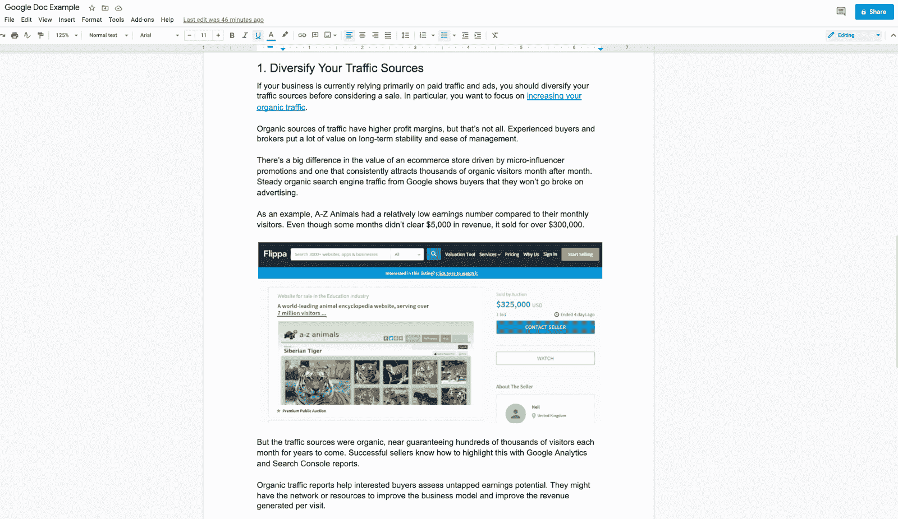

Example Google Doc to go on WordPress.


你选择文本，然后用你的 [WordPress 编辑器](https://kinsta.com/blog/wordpress-text-editor/)粘贴它。

这就是问题出现的地方，主要是如果你还在使用 WordPress 中的经典编辑器。如果你试图直接从谷歌文档复制粘贴到你的 WordPress 文章，你可能会遇到各种格式问题。

间距是最突出的问题。当你复制你的谷歌文档时，WordPress 倾向于添加额外的换行符:

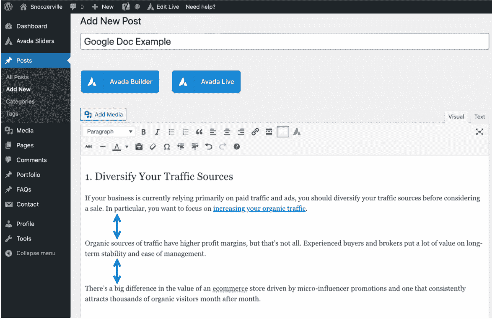

Extra spaces when Google Docs copied to WordPress.


然而，解决方案比仅仅移除这些空间要复杂得多。

当您从可视化编辑器切换到代码编辑器时，您会发现代码很乱:

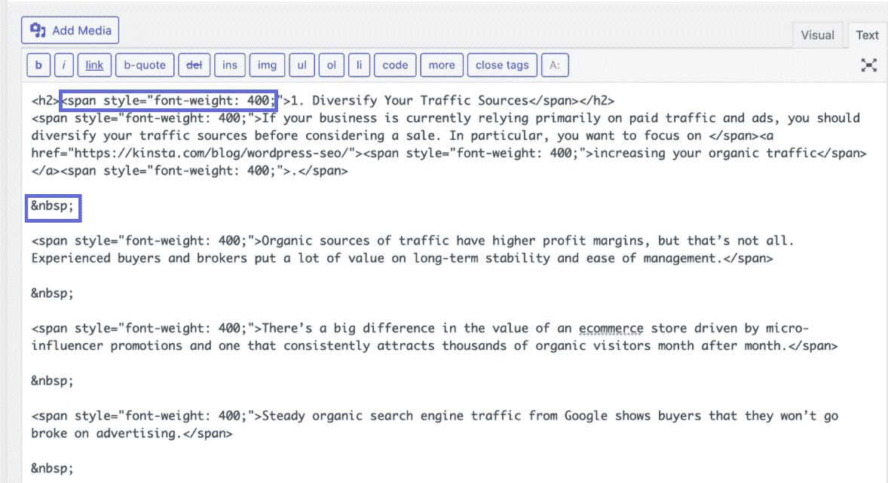

Extra code when copy Google Docs to WordPress.


有很多不必要的代码，包括额外的换行符:

```
  (or sometimes <br /> )
```

到处都有额外的跨度样式:

```
<span style="font-weight: 400;"> </span>
```

当您将列表复制到您的博客帖子中时，您还会注意到不同的字体粗细，通常使用以下代码:

```
<li style="font-weight: 400;" aria-level="1">
```

你需要删除所有这些多余的代码，因为它们会影响你的网站性能。HTML 会影响页面的整体权重，所以不必要的代码会降低页面的速度(这是[谷歌页面体验算法更新](https://kinsta.com/blog/google-mobile-first-index/)的一个更重要的因素)。

这意味着大量的退格，这可能需要很长时间。

另一个重要的问题是，图像不能传递。

理想情况下，无论如何你都想单独上传图片，因为你需要压缩它们并为 SEO 目的添加一个相关的名称。

然而，如果你想快速复制和粘贴图像，你不能。

那么你能做些什么呢？试着遵循下面这些便利的技巧。

## 如何从谷歌文档导入到 WordPress

这里有一些简单的方法来简化将谷歌文档上传到 WordPress 的过程:

### 1.切换到古腾堡块编辑器

古腾堡区块编辑器是用 WordPress 5.0 发布的[。如果你已经改用 Gutenberg，你会注意到经典编辑器的许多典型问题已经不存在了。](https://kinsta.com/blog/wordpress-5-0/)

当您复制文本时，您不会遇到相同的格式问题(如额外的间距)。

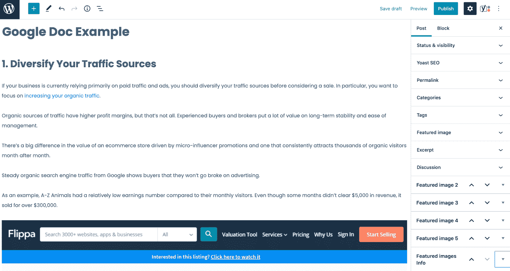

Example of Gutenberg Editor.


如果你从 WordPress 可视化编辑器切换到代码编辑器，你也会发现没有添加不必要的代码。

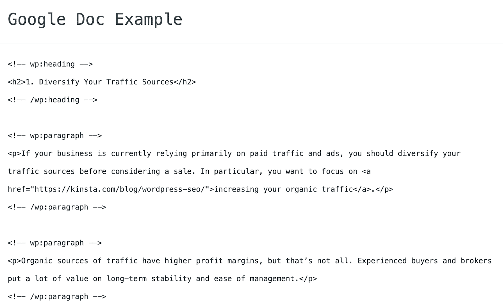

Example of clean code in Gutenberg Editor.


如果你想继续使用经典编辑器，你可能会选择[禁用古腾堡编辑器](https://kinsta.com/blog/disable-gutenberg-wordpress-editor/)。

然而，WordPress 将只支持经典编辑器，直到 2021 年底。如果你遇到令人讨厌的格式问题，现在就切换是有意义的，而不是等到你别无选择的时候。

除此之外，Gutenberg 编辑器确实存在一些与图像和插入元数据所花费的时间相关的问题。

虽然您可以跨域复制图像，但是当您进入代码编辑器查看与您复制的图像相关联的代码时，它看起来会像这样:

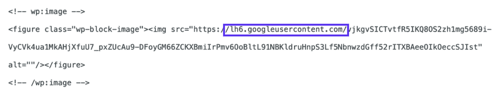

Image code in Gutenberg editor.


如您所见，< img src= "之后的代码指向您的图像文件的位置。

当你直接从谷歌文档中复制图片时，你是在通过你的个人谷歌文档账户托管你的网站图片。

通常情况下，不加强安全措施就把你的网站直接链接到你的谷歌账户是不可取的。另外，如果你删除了原始文件或包含图片的谷歌文档，它也会从你的网站上消失。

这意味着你需要仔细检查并删除你复制的所有图片，然后手动将它们添加到 WordPress 媒体库。

另一个主要瓶颈是元数据。

就像经典编辑器一样，你必须手动添加你的[永久链接](https://kinsta.com/blog/wordpress-permalinks/)，alt 标签，[元描述](https://kinsta.com/blog/meta-description-wordpress/)，摘录，以及所有那些优化文章搜索的好东西。

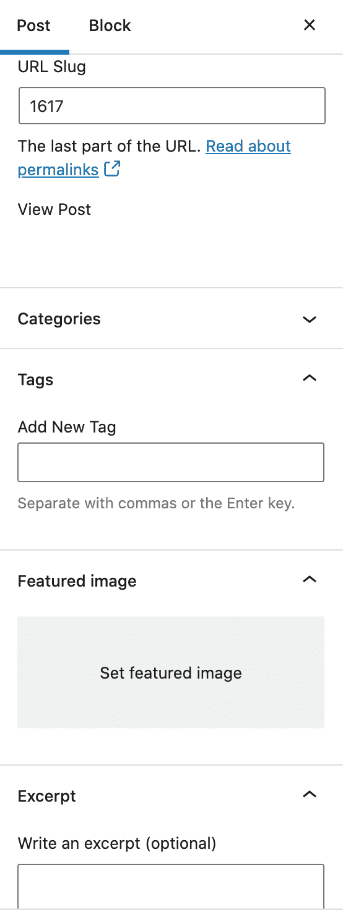

Metadata section on Gutenberg Editor.


这一优化过程非常漫长，增加了生产时间。


### 2.尝试 Wordable 来简化 Google Docs 到 WordPress 的工作流程

一个显著减少上传时间的选项是 wordbook。

Wordable 意识到手动上传、格式化和优化内容大约需要半个小时，因此创建了一个一体化解决方案来加速这一工作流程。

有了 Wordable，只需点击一下就可以导入你的 Google 文档并创建一篇新的 WordPress 博客文章。

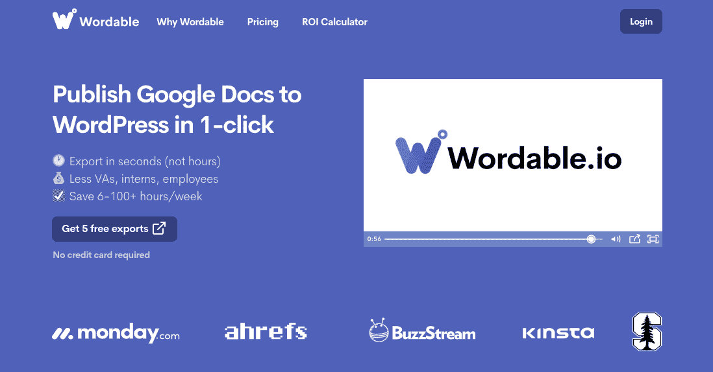

Wordable homepage


Wordable 使得将 Google 文档直接导出到 WordPress 变得非常简单，无论是单独导出还是批量导出，也可以自动发布文章或者保存为草稿。

Wordable 将自动清理所有杂乱的 HTML，同时保留您的标签、标题、粗体、斜体、项目符号和图像。

从谷歌文档复制文本到 WordPress 并不是 Wordable 唯一做的事情。Wordable 还可以帮助你优化你的内容，并通过一次点击转换来促进搜索引擎优化。

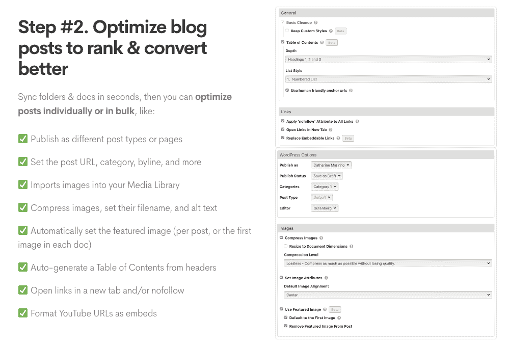

One-click transformations on Wordable


首先，Wordable 可以根据您的文档设置自动压缩图像并调整其大小，从而帮助提高页面速度，同时仍然保持图像质量。

提高页面速度是营销人员使用的头号搜索引擎优化策略，压缩图像有助于网页运行得更快。

Wordable 还会自动为您的图像添加替代文本(alt 文本)。替代文字描述了一幅图片，让人们更好地了解图像所传达的信息。事实证明，这种描述存在于页面的代码中，因此有助于搜索引擎更好地了解页面的内容。

通过优化目标关键词的替代文本，你可以提高你的搜索引擎优化。然而，这可能很耗时。要么你自己在 WordPress 中手动编写所有的替代文本，要么你从 Google Docs 的评论卡中复制并粘贴作者的建议。

Wordable 使这个过程变得简单得多，只需点击一个按钮。

您也不必在每篇文章通过“选择特色图片”功能导出后手动上传特色图片。

你也可以一键设置所有的元信息。Wordable 会添加作者，选择正确的类别，添加你的[元描述](https://kinsta.com/blog/meta-description-wordpress/)和标题标签，设置[永久链接](https://kinsta.com/blog/wordpress-permalinks/)，等等。

Wordable 加速后期制作的另一种方式是一键转换，将所有链接设置为在新标签中打开。如果你让你的链接保持原样，当读者点击链接时，他们会离开你的页面。

然而，手动切换所有链接以在新标签页中打开需要很长时间。使用 Wordable，只需点击几秒钟。

说到加速导出，模板允许你保存所有你想要应用于每次导出的手动设置，比如你要导出到的网站的细节；应用于每次导出的转换或自动化；作者，类别，甚至[帖子类型](https://kinsta.com/blog/wordpress-custom-post-types/)或者页面。您还可以自定义这些选项的任意组合，这样只需轻轻一点，您的首选项就会被加载并一致应用&。

Wordable 的另一个好处是，你还可以将它与 HubSpot、Medium 和 WordPress 集成在一起。

现在，如果你担心安全和隐私，只希望你的 Google Drive 中的特定文件夹可见，你可以选择“限制添加源的可见性”选项。

选择此项意味着只有连接所有者能够查看和搜索这些文档。其他人(如您可能添加的团队成员)将无法查看这些选项。

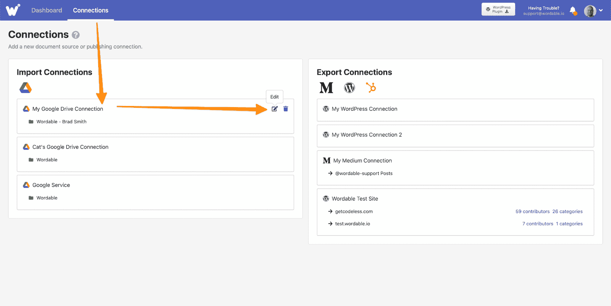

Wordable security


他们有一个免费试用版，可以让你试一试。它为一个 WordPress 站点提供了五个免费出口。

如果你需要更多的导出和导出到多个 WordPress 站点的能力，高级版本对单人用户每月 49 美元起。

虽然这听起来确实很贵，但如果你每天都使用谷歌文档，这项服务就物有所值了。

按照以下步骤，轻松地从谷歌文档导出到 WordPress。


#### 第一步

[在 Wordable](https://app.wordable.io/u/sign_up) 注册一个免费账户。

#### 第二步

只需在入职时点击巨大的 Google Drive 按钮，或者点击 Connections 页面上的 Drive 图标，即可添加新的 Google 帐户。然后，谷歌会征求你的许可，允许 Wordable 正确访问你的文件。

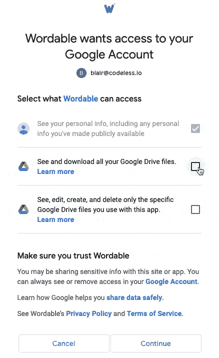

Set up Google Docs connection


#### 第三步

通过下载并[安装插件](https://kinsta.com/knowledgebase/how-to-install-wordpress-plugins/)来连接你的 WordPress 站点(从 WordPress 插件库或者通过[这个链接](https://app.wordable.io/wordpress)下载)。然后，激活插件。最后，进入 Wordable - >设置，点击连接按钮，看到绿色的成功通知。

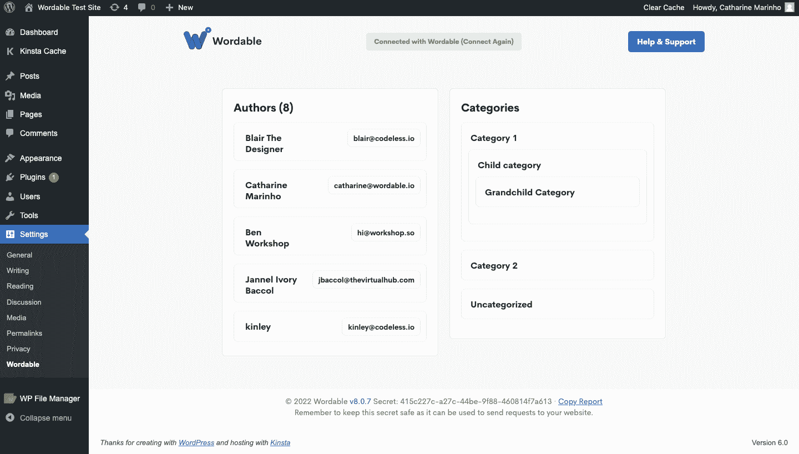

Set up WordPress connection


#### 第四步

在 Google Drive 列表中搜索文档，并将其导入 Wordable:

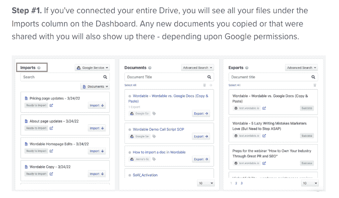

Google Docs search on Wordable


#### 第五步

点击手动导出或一键导出，在你的 WordPress 站点上创建你的博客文章的草稿:

## 注册订阅时事通讯


### 想知道我们是怎么让流量增长超过 1000%的吗？

加入 20，000 多名获得我们每周时事通讯和内部消息的人的行列吧！

[Subscribe Now](#newsletter)

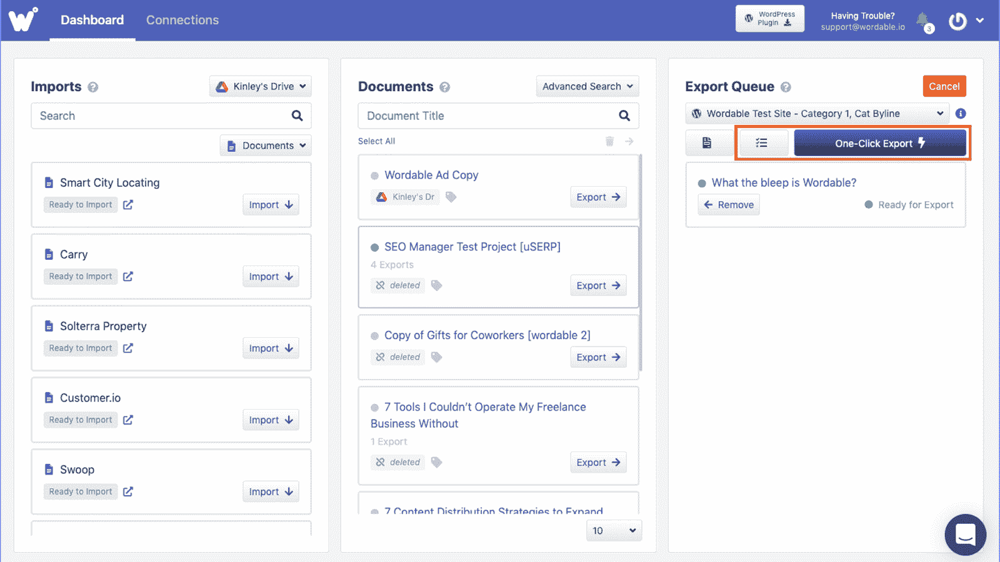

The Export Queue on Wordable


#### 第六步

点击外部链接图标来访问你的 [WordPress 管理仪表板](https://kinsta.com/knowledgebase/wordpress-admin/)来检查你的草稿并发布文章。

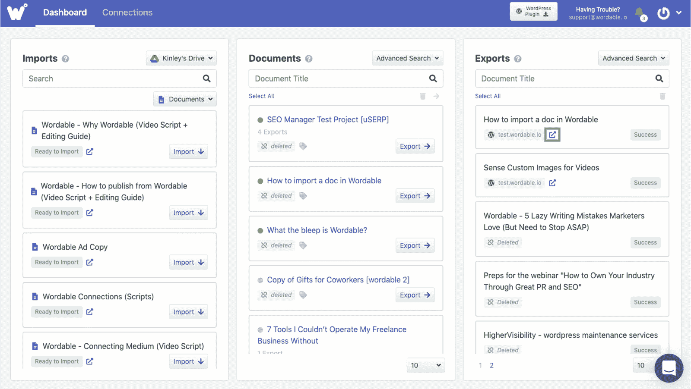

Click on the external link to view post


以下是我们的草稿在导入后在 WordPress 编辑器中的样子:

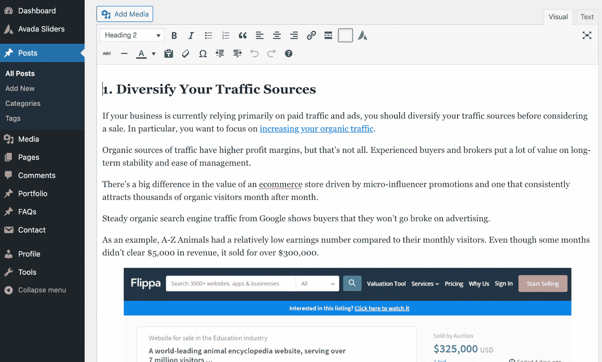

How text looks when posted from Wordable to WordPress.


所有的格式都可以完美地转换，无需插入额外的代码。图像也将转移并自动上传到您的 [WordPress 媒体库](https://kinsta.com/blog/wordpress-media-library/)。记得用搜索引擎友好的文件名给所有图片命名[。Wordable 将使用此文件名导出图像，以帮助提升 SEO。](https://kinsta.com/blog/wordpress-seo/#17-name-your-image-files-wisely)

如果您最初没有这样做，那么以后您将不得不仔细检查并手动更改媒体库中的文件名。

如果你正在寻找一个超级高效的方法将谷歌文档的内容直接上传到 WordPress，Wordable 是理想的选择。不仅文本和图像可以完美地复制，而且可以更快地确保所有元数据都在适当的位置。

### 3.安装猛犸。docx 转换器插件

也可以用 WordPress 插件，像[猛犸。docx 转换器](https://pypi.org/project/mammoth/)，它转换**。docx** 文档到 HTML。

这个插件非常受欢迎，有超过 30，000 个活跃安装和 4.8 星的评分。它还基本支持古腾堡块编辑器，这是特别有用的，如果你正在切换到新的编辑器。

使用猛犸象。docx converter，你需要下载你的谷歌文档作为 Word 文档，然后通过插件运行它。

你可以这样做:

#### 第一步

下载、安装并激活免费的[猛犸。docx 转换器插件](https://wordpress.org/plugins/mammoth-docx-converter/)。

#### 第二步

接下来，你将把你的谷歌文档下载成微软的 Word **。docx** 文档。在谷歌文档中进入**文件**菜单，选择**下载**，选择**微软 Word(。docx)** 。

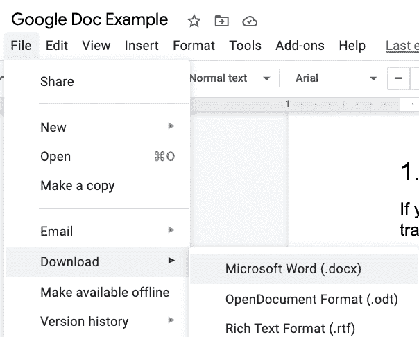

Download Google Doc as a Word document.


#### 第三步

然后，去 WordPress 创建一篇新的博客文章。滚动到编辑器的底部，你会看到一个新的猛犸象框。docx 转换器:
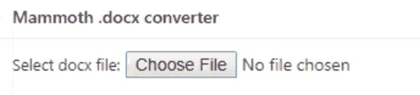

选择**选择文件**并选择**。您刚刚下载的 docx** 。

确保选择**可视**选项，而不是**原始 HTML** 或**消息**。


Visual option on Mammoth .doc Converter.


然后，点击**插入编辑器**。

如果你想传输大量的文本，这是一个很好的工具。

该插件将正确复制格式，包括每个标题标签，粗体格式，列表和图像。图像也将以其原始文件名传输，因此请确保您已经为 SEO 目的命名了图像。

有一件事需要注意，那就是标题标签中奇怪的锚文本。它可能看起来像这样:

```
<h2><a id="post-264-_1e9slkz7q807"></a>First Header</h2>
```

要一次性去掉这些锚标记，请在代码编辑器中复制“文本”版本。前往一个[文本编辑器](https://kinsta.com/blog/best-text-editors/)，比如[崇高](https://www.sublimetext.com/)，粘贴你的“文本”版本。

点击**命令+ Option + F** 使用[查找和替换](https://kinsta.com/knowledgebase/wordpress-search-and-replace/)工具。

厌倦了低于 1 级的 WordPress 托管支持而没有答案？试试我们世界一流的支持团队！[查看我们的计划](https://kinsta.com/plans/?in-article-cta)

点击**。*** 启用正则表达式，并在**查找**字段中输入以下表达式:

```
(<a id="post-).*</a>
```

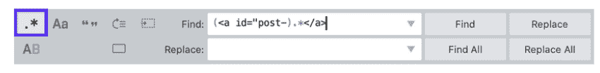

Find and replace function on Sublime Text Editor.


它会突出显示所有流氓锚标签。

将**替换**框留空，点击**替换所有**。它将删除整个文档中的锚定标签。

现在复制文本版本并粘贴回代码编辑器。

### 4.使用 Jetpack WordPress.com 谷歌文档插件

你也可以尝试使用 Google Docs 的免费插件 [Jetpack](https://kinsta.com/knowledgebase/wordpress-jetpack/) 。它的安装和使用非常简单，而且该工具允许你直接从谷歌文档中发布文章。

#### 第一步

首先，你需要从 WordPress 资源库下载 Jetpack 插件。你也可以在你的 WordPress 管理面板的插件部分搜索它。

#### 第二步

接下来，从 Google Workspace Marketplace 安装免费的[WordPress.com 到 Google Docs](https://workspace.google.com/u/0/marketplace/app/wordpresscom_for_google_docs/460536350236?hl=en&pann=docs_addon_widget) 插件。你也可以通过进入谷歌文档中的**附加组件**菜单并点击**获取附加组件**来找到谷歌工作区市场。

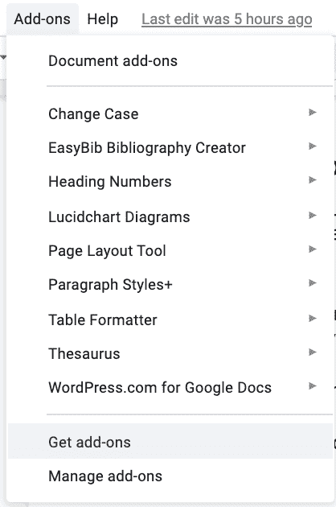

Get add-ons on Google Docs.


#### 第三步

点击**安装**将该工具添加到您的**附加组件**菜单中。您需要获得许可才能访问您的谷歌文档。

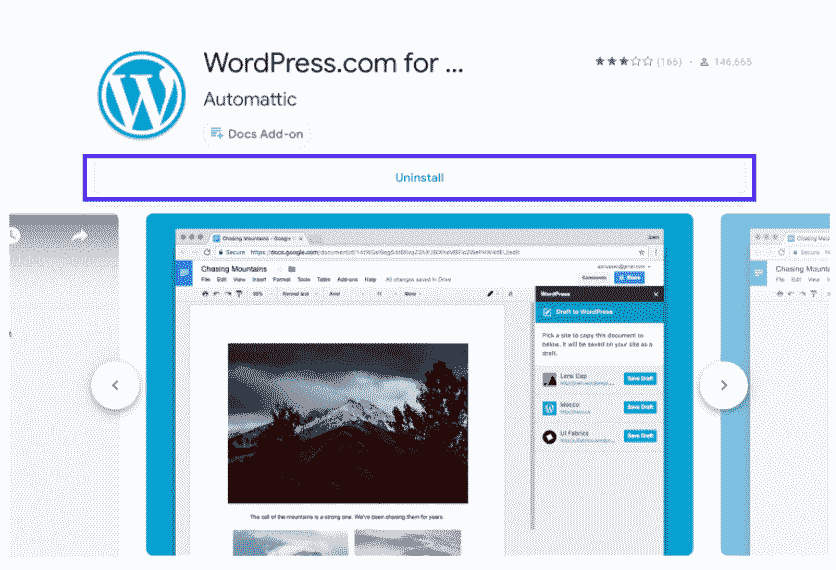

WordPress.com for Google Docs in the Google Workspace Marketplace.


#### 第四步

安装完成后，点击顶部菜单中的**附加组件**，选择【WordPress.com T2】到谷歌文档。然后点击**打开**。

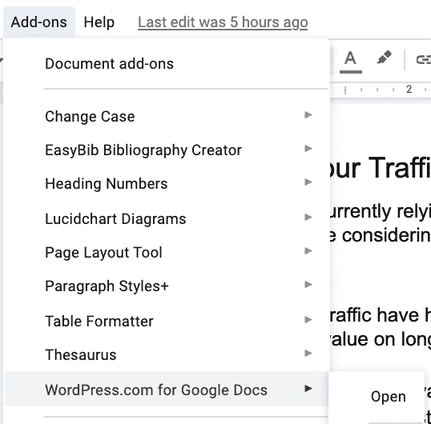

WordPress.com for Google Docs in Add-ons.


屏幕右侧将出现一个窗口。点击**添加 WordPress 站点**连接到你的 WordPress 博客:

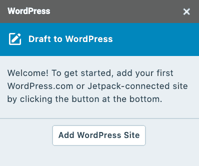

Add a WordPress site on the WordPress to Google Docs Add-on.


#### 第五步

当您准备好发布到您的网站时，选择类别并添加标签。然后，点击**保存**将您的文章发布为草稿:

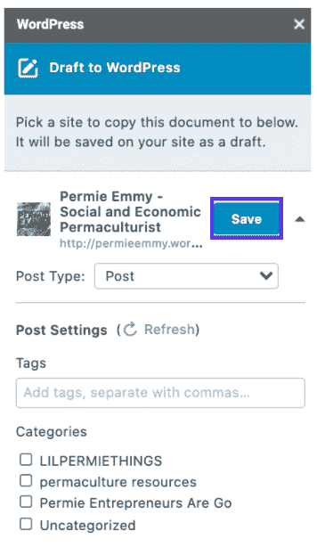

Save WordPress draft from Google Docs.


这是它在 WordPress 编辑器中的样子:

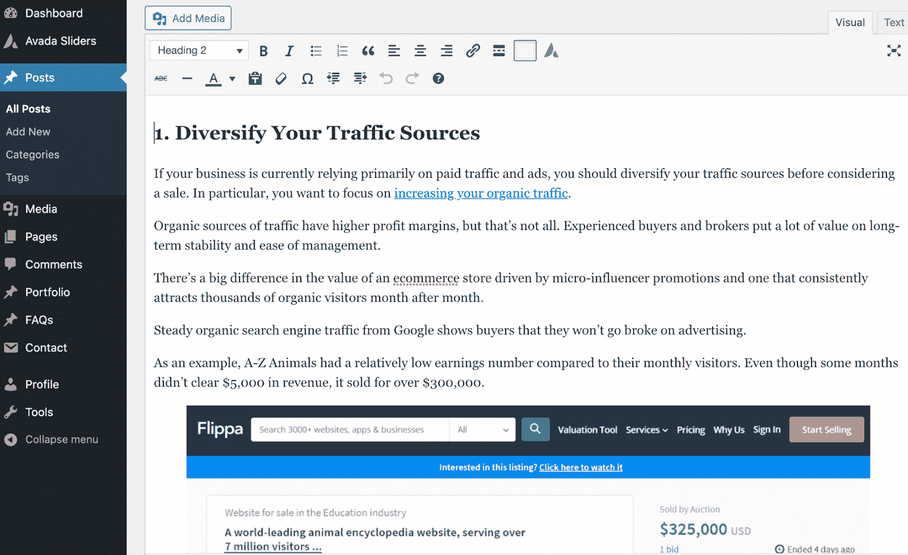

Screenshot of post from WordPress for Google Docs add-on.


请注意所有格式是如何完美转换的。图像也会遇到它们的原始文件名，尽管您应该单独添加这些文件名，以便可以使用第三方工具压缩它们。

### 5.使用 Docs to Markdown 附件转换为 Markdown

克服格式障碍的一个方法是将你的文本转换成 Markdown。Markdown 是一种轻量级标记语言，它通过纯文本编辑器创建格式化文本。

[Docs to Markdown](https://workspace.google.com/marketplace/app/docs_to_markdown/700168918607) 插件是这方面的顶级工具，尤其是在处理大型文档时。

该工具会将你的完全格式化的谷歌文档转换成 Markdown 格式。md)快速点击几下。你可以将这些降价文本复制到 WordPress 的文本编辑器中，以获得完美的文本格式。

在使用这个工具之前，你必须在你的 WordPress 设置中启用 Markdown。

前往**设置**，点击**书写**。接下来，选中**对文章和页面使用降价**旁边的框。

现在，您已经准备好将您的 Google Doc 转换为 Markdown 了。

#### 第一步

从 Google Workspace Marketplace 或通过 Google Docs 中的 **Get add-ons** 安装 Docs to Markdown add-on:

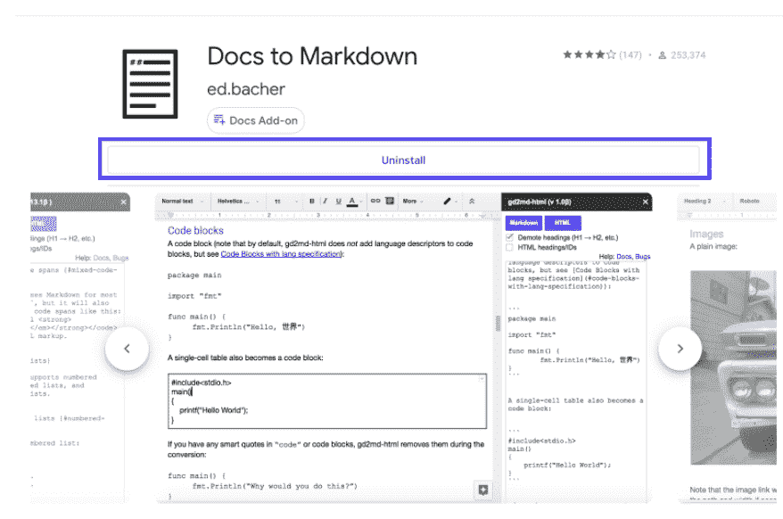

Install button for Docs to Markdown.


#### 第二步

安装完成后，进入谷歌文档中的**附加组件**菜单，点击**转换**打开该工具。

#### 第三步

突出显示要转换为 Markdown 的文本，然后在右侧的框中单击 **Markdown** :

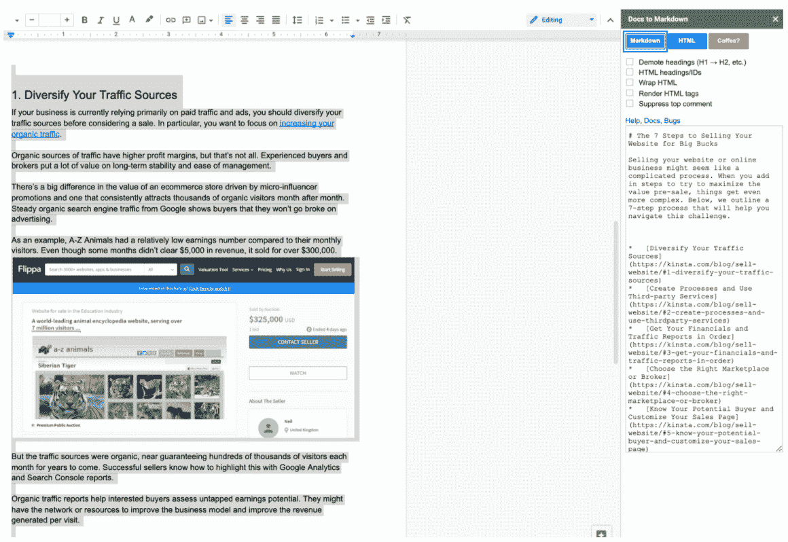

Docs to Markdown interface in Google Docs.


从右边的框中复制降价文本。

#### 第四步

现在，去你的 WordPress 站点添加一篇新文章。切换到文本编辑器，粘贴你的降价文本。

请注意，这不是一个将图片传输到 WordPress 的工具。专门用于文本。

### 6.给作者一个 WordPress 账户

如果这些选项都不适合你，你可以为每个作者创建单独的 WordPress 账户，并要求博客直接在编辑器中写。

虽然这样可以避免格式问题，但是您将需要管理多个帐户和可能的安全影响。

虽然 WordPress 提供了六种不同的[用户角色](https://kinsta.com/blog/wordpress-user-roles/)，但对于作者来说最好还是坚持使用这两种:

*   **作者:**可以发布和管理自己的帖子。
*   **投稿人:**可以撰写和管理自己的帖子，但不能发布。

要为一个作家创建一个账户，在你的 WordPress 仪表盘中点击**用户**，点击**添加新用户**。

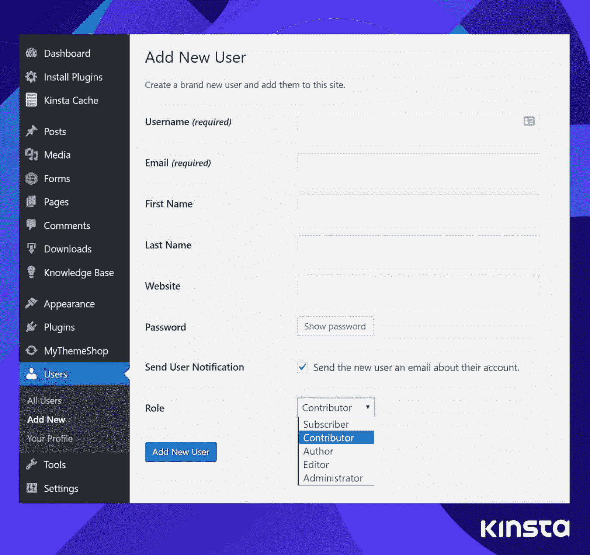

User roles on WordPress.


填写详细信息，并从下拉菜单中选择适当的角色。

### 7.使用 multi collab——一个 Google Docs 风格的 WordPress 协作插件

Multicollab 提供了你最喜欢的 Google Docs 的协作功能，比如在线评论、建议、@提及、电子邮件通知等等。Multicollab 减少了在 Google Docs 和 WordPress 之间复制和粘贴内容的所有时间和行程，这使得发布速度提高了 42%。因此，Multicollab 插件是在 WordPress 中发布内容的 Google Docs 的完美替代品。

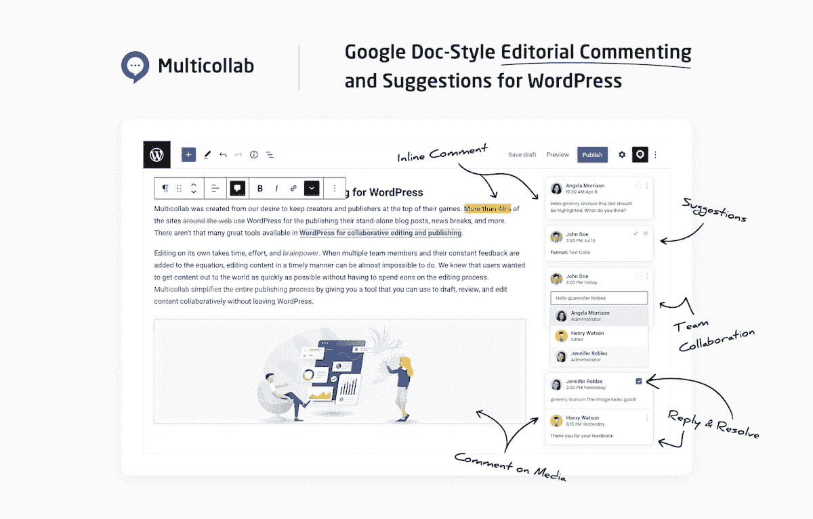

Multicollab


安装 Multicollab 可立即启用以下关键编辑功能:

*   **在线评论–**只需点击一下鼠标，就可以直接为帖子和页面中的所有内容添加评论。
*   **标记并提及多名同事—**只需选择你需要直接在评论中强调反馈的人。
*   **直接分配评论—**标记需要采取行动的同事，让他们清楚地知道任务要求是什么
*   **回复并解决—**回复您同事之前的评论，并关闭已通过一次点击完全解决的评论线索。
*   **建议编辑—**使用建议模式功能，您可以将帖子的任何编辑内容转化为建议。这个特性对于校对和开发性修订非常有用。
*   **高级报告****–**当你在 WordPress 中进行内容起草、编辑和协作时，你会比谷歌文档更好地获得有洞察力的报告和协作活动。

查看[演示视频](https://www.youtube.com/watch?v=Lk65dfRPD_E)了解更多详情。

[Make it easier than ever to work with WordPress & Google Docs with this useful guide ✍Click to Tweet](https://twitter.com/intent/tweet?url=https%3A%2F%2Fkinsta.com%2Fblog%2Fgoogle-docs-to-wordpress%2F&via=kinsta&text=Make+it+easier+than+ever+to+work+with+WordPress+%26amp%3B+Google+Docs+with+this+useful+guide+%E2%9C%8D&hashtags=WordPress%2CWPTips)

## 摘要

如果你或你的团队经常在你的网站上添加博客文章，是时候考虑一种更简单的方法来将内容从 Google Docs 上传到 WordPress 了。

如果您还没有迁移到新的 Gutenberg 块编辑器，那么在 2021 年底深入研究之前，可能是时候进行迁移了。

*对这些解决方案有更多想法？还有你不能解决的格式问题吗？让我们知道您的反馈。*

* * *

让你所有的[应用程序](https://kinsta.com/application-hosting/)、[数据库](https://kinsta.com/database-hosting/)和 [WordPress 网站](https://kinsta.com/wordpress-hosting/)在线并在一个屋檐下。我们功能丰富的高性能云平台包括:

*   在 MyKinsta 仪表盘中轻松设置和管理
*   24/7 专家支持
*   最好的谷歌云平台硬件和网络，由 Kubernetes 提供最大的可扩展性
*   面向速度和安全性的企业级 Cloudflare 集成
*   全球受众覆盖全球多达 35 个数据中心和 275 多个 pop

在第一个月使用托管的[应用程序或托管](https://kinsta.com/application-hosting/)的[数据库，您可以享受 20 美元的优惠，亲自测试一下。探索我们的](https://kinsta.com/database-hosting/)[计划](https://kinsta.com/plans/)或[与销售人员交谈](https://kinsta.com/contact-us/)以找到最适合您的方式。