# 前 15 名谷歌表单替代品(免费和付费)

> 原文：<https://kinsta.com/blog/google-forms-alternative/>

表单几乎有无穷无尽的用途。

你可以[建立一个电子邮件列表](https://kinsta.com/blog/how-to-build-an-email-list/)，[注册新用户](https://kinsta.com/blog/wordpress-registration-form/)，或者[向你的客户征求反馈](https://kinsta.com/blog/wp-feedback-wordpress-plugin/)。有了合适的工具，你甚至可以分析你的表单回复，从而更好地了解你的听众。

创建表单最简单的方法之一是使用 Google Forms。Google Forms 是一个通用的表单生成器，个人和企业都可以免费使用。

但是 Google Forms 对你的业务来说足够好吗？Google Forms 没有最完美的外观，其他表单构建器也有 Google Forms 缺乏的特性。

### 查看我们的视频指南[谷歌表单选择](https://www.youtube.com/watch?v=AQyhYTi9LZw)

本文介绍了 15 种 Google 表单选择，并为您提供了选择最佳表单所需的信息。

## 谷歌表单概述

关于 Google Forms，你应该知道的第一件事是它是完全免费的。

这对许多小企业来说很有吸引力。虽然谷歌表单的竞争对手通常有免费版本，但他们会让你为优质功能支付更多费用。谷歌没有。

谷歌表单也很快，很容易使用。如果您需要在几分钟内准备好一个表单，这是一个很好的选择。

让我们仔细看看 Google Forms 的特性。

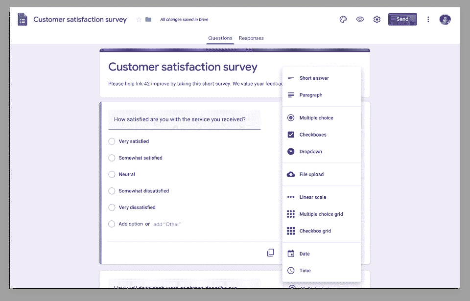

Creating a Google Form

### 模板和设计

谷歌提供了 17 种模板，你可以用来设计你的表格。您也可以在表单顶部添加自己的图片或选择配色方案。

### 问题类型和逻辑

Google 提供了九种不同的问题类型，包括:

*   简短回答
*   段落
*   多选
*   文件上传
*   线性标尺
*   多重选择网格
*   复选框网格
*   日期
*   时间

也可以使用基本的条件逻辑。例如，如果调查者选择选项 A，他们会进入问题二，但是如果他们选择选项 B，他们会直接进入问题六。

### 分析学

当表单提交进来时，您可以查看填写者的电子邮件地址(如果您需要的话)、多项选择响应的图表以及书面答案的列表。

### 集成

与其他解决方案相比，Google Forms 的一个优势是它与 Google Sheets 的简单集成。只需点击几下，您就可以创建一个包含表单结果的 Google Sheet 电子表格。该电子表格将自动更新新的回复。

您还可以使用表单加载项商店中的加载项来扩展 Google Forms 的功能。例如，一个加载项允许您在表单中添加一个计时器，为人们提供一个定时测验，另一个加载项在提交一定数量的内容后关闭表单，以显示新的响应。

### 定价

就像我们说的，这是免费的！

Google Forms 也可以作为 [Google](https://kinsta.com/blog/google-workspace/) [Workspace](https://kinsta.com/blog/google-workspace/) 的一部分供企业使用(这是我们在 Kinsta 内部流程中使用的)。它的价格从每个用户每月 6 美元开始。Workspace 中包含的 Google Forms 版本与免费版本相同。

## 为什么你需要一个谷歌表单的替代品？

如果 Google Forms 这么棒，为什么你需要一个替代品？

毫无疑问，Google Forms 是表单中最简单、最实惠的选择之一。但是它有局限性。

它的竞争对手可能更贵，但其中一些也让你创建更好看的表格，提供更多的问题类型，或更彻底地分析你的数据。

以下是谷歌表单的主要局限性。

### 模板和设计

Google 表单模板看起来都非常相似。你可以稍微改变颜色，添加图片和视频。但是一些谷歌表单的竞争对手允许更多的定制。

### 安全性和垃圾邮件防护

谷歌有一些功能可以防止垃圾邮件进入你的表单回复，但是其他的功能更多。

### 分析学

一些 Google Forms 替代品允许对您的报告和仪表板进行更多的定制，或者允许您将数据导出为更多的格式。

### 支付集成

如果你需要用你的表单收款，Google Forms 不是你的最佳选择。谷歌确实有可以通过第三方收款的附加软件，但也有其他表单生成器可以提供更好的支付体验。

### 储存空间

一个免费的谷歌账户提供 15 GB 的存储空间，但这是在表格和谷歌照片和 Gmail 等其他产品之间分配的。免费获得这么大的存储空间是很划算的，但是如果你需要更多的存储空间，一个高级的替代品可能会更有意义。

### 客户支持

作为一款免费产品，谷歌不像一些付费竞争对手那样提供高水平的客户支持。

## 前 15 名谷歌表单替代者

让我们来看看谷歌表单的 15 个顶级替代品。

### 1.Microsoft 表单

当谷歌推出一款产品时，微软推出竞争对手只是时间问题。

微软表单是微软 365 的一部分，所以没有免费版本。但是，如果你已经在使用微软 365，你可以使用现有的帐户来创建在线表单。

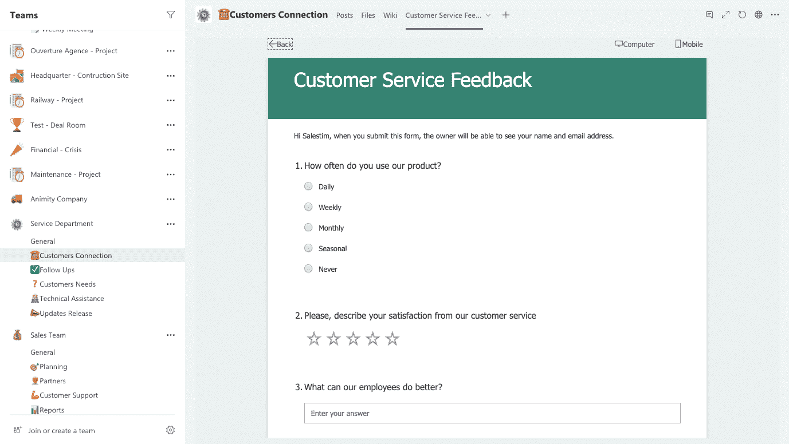

Microsoft Forms

像谷歌一样，微软提供了各种各样的模板。它也有几种问题类型，但它的列表与谷歌的略有不同:

*   多选
*   文本
*   评级
*   日期
*   等级
*   莱开特量表
*   文件上传
*   净发起人分数

Microsoft Forms 突出的一个领域是表单共享。你可以选择直接分享到[社交媒体](https://kinsta.com/blog/wordpress-social-media-plugins/)或[创建二维码](https://kinsta.com/blog/create-qr-code/)进行即时分享。

就像 Google Forms 让你把结果发送到 Google Sheets 一样，微软连接到微软 Excel。但是这个过程并不顺利。您必须打开一个活动的办公套件，并将电子表格下载到您的计算机上。

### 2.HubSpot 表单

HubSpot 是一个 CRM 平台和营销工具套件，包括 HubSpot 表单。

[HubSpot Forms](https://www.hubspot.com/products/marketing/forms) 的独特之处在于它与 HubSpot 的其他工具的集成。表格中的条目会直接发送到 Hubspot 的免费 CRM，您可以通过 HubSpot 发送电子邮件或创建通知来跟进，从而进一步培育潜在客户。

免费版可以让你创建无限的形式。有一个直观的拖放编辑器，表单可以很容易地嵌入到您的网站中。

如果您升级到付费版本，您可以使用智能表单来适应每个网站访问者的问题。可以向回访者展示新的问题。付费计划还允许你从表格中删除 HubSpot 品牌。

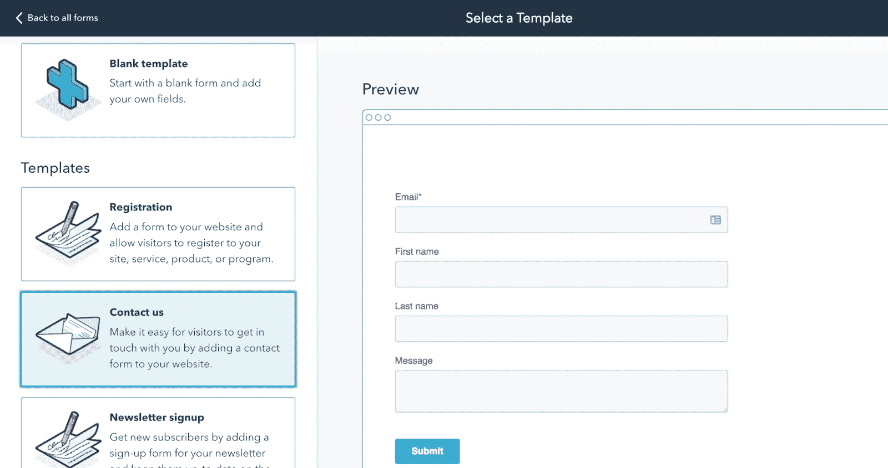

HubSpot Forms

要获得 HubSpot 表单的高级版本，您需要购买 HubSpot 营销中心，起价为每月 45 美元。

### 3.认知形式

[Cognito Forms](https://www.cognitoforms.com/) 是一个简单的表单解决方案，具有所有重要的功能，如拖放表单生成器、多种问题类型和条件逻辑。

所有 Cognito 表单计划都允许您创建无限的表单，但它们确实限制了您可以收集的条目和存储容量。有了免费的个人计划，你可以每月收集 500 个条目，并获得 100 MB 的存储空间。

付费计划从每月 15 美元的专业计划到每月 99 美元的企业计划不等。

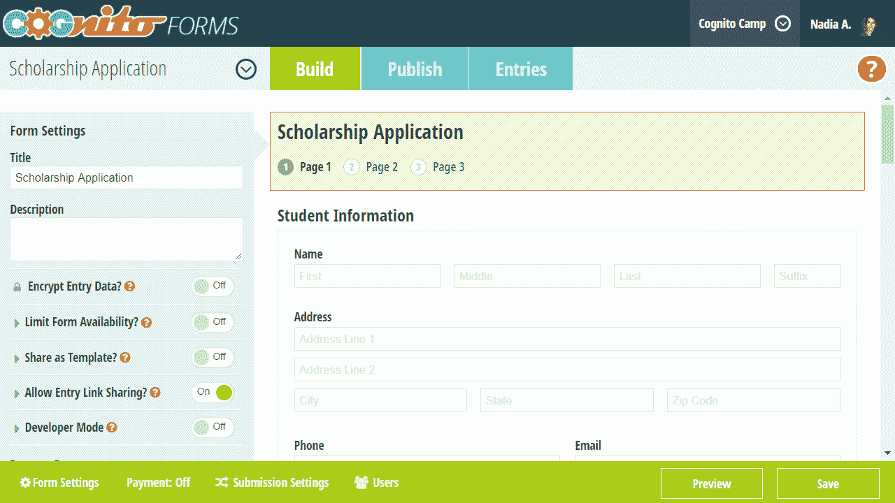

Cognito Forms

Cognito Forms 允许您通过表单接受付款。您的支付选项因计划而异-对于个人和专业计划，用户只能使用 Stripe 支付[。如果您升级到 Team 或 Enterprise，也可以使用 PayPal 或 Square 进行支付。](https://kinsta.com/blog/stripe-vs-square/)

### 4.调查猴子

SurveyMonkey 主要以独立的[调查](https://kinsta.com/blog/wordpress-survey-plugins/)而非嵌入式网站表单而闻名，但像谷歌表单一样，它可以用于两者。

我们将从 SurveyMonkey 的优点开始:它功能强大且高度可定制。

SurveyMonkey 提供了 150 多个调查模板，包含针对不同目的和行业的调查问题样本。共有 14 种题型，表格可以使用条件逻辑。

您可以使用不同类型的图表和图形生成各种报告，以便于向利益相关者传达您的调查结果。甚至还有分析文本回复和根据行业基准衡量结果的工具。

SurveyMonkey 还提供全天候的电子邮件支持。

## 注册订阅时事通讯

### 想知道我们是怎么让流量增长超过 1000%的吗？

加入 20，000 多名获得我们每周时事通讯和内部消息的人的行列吧！

[Subscribe Now](#newsletter)

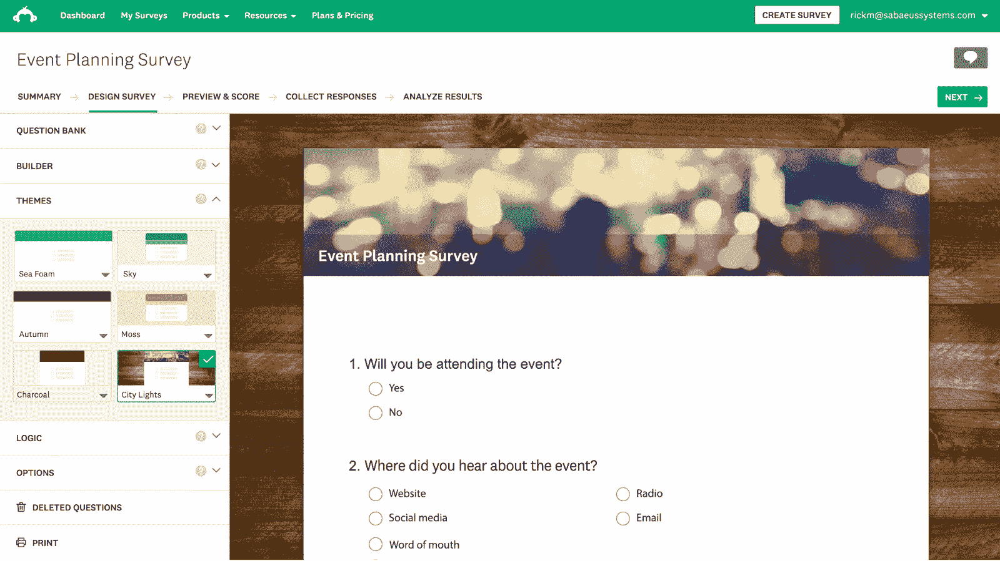

SurveyMonkey

但是 SurveyMonkey 的免费版本对于典型的商业用户来说太有限了。

您的调查最多只能包含十个问题或元素。虽然您可以收集尽可能多的回复，但您只能查看其中的 10 个。(如果您之前创建了一个帐户，您可能会获得更多的可视回复。)60 天后，这些回复将被删除。

SurveyMonkey 不是最好的免费解决方案，但是对于复杂的调查，它是最好的。付费计划起价 16 美元/月。

### 5.Zoho 表单

Zoho 是一套商业软件，包括 CRM、营销解决方案、电子邮件平台等等。

Zoho Forms 提供 30 多种字段类型和条件逻辑的可定制模板。它集成了其他工具，如 Zoho Sheet 和 Zoho CRM。

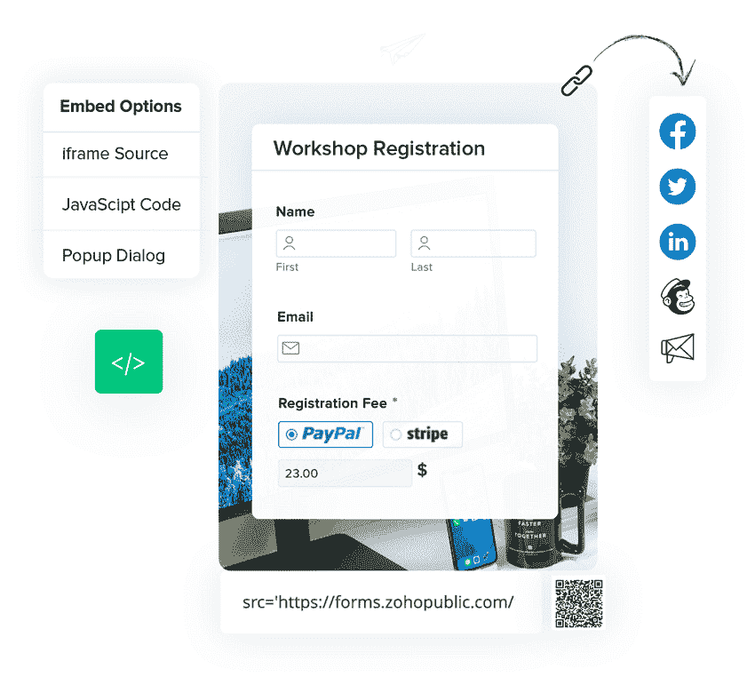

Zoho Form

Zoho Forms 有一个强大的移动产品 Android 和 iOS 应用程序允许你在线和离线创建表单。如果你去现场活动，你可以使用你的移动设备作为一个信息亭来收集表单响应。

免费计划只允许你制作三个表格，但是你可以每月从这些表格中收集 500 个提交，并生成无限的报告。付费计划从每月 10 美元到每月 90 美元不等。

### 6\. Jotform

Jotform 是一个功能丰富的表单生成器，有免费版和高级版。

它提供了超过 10，000 个模板和数百个主题(只有一部分是免费的)。拖放构建器包括在 Google 表单或大多数替代工具上看不到的元素、问题类型和小部件。

例如，您可以插入一个按钮，让用户拍摄自动上传到表单的照片。或者，如果您使用表单销售产品，您可以让表单跟踪您的库存，并在库存用完时自动阻止用户选择该选项。

Jotform 允许多种支付类型，包括借记卡或信用卡支付、ACH 支付、电子支票支付等等。

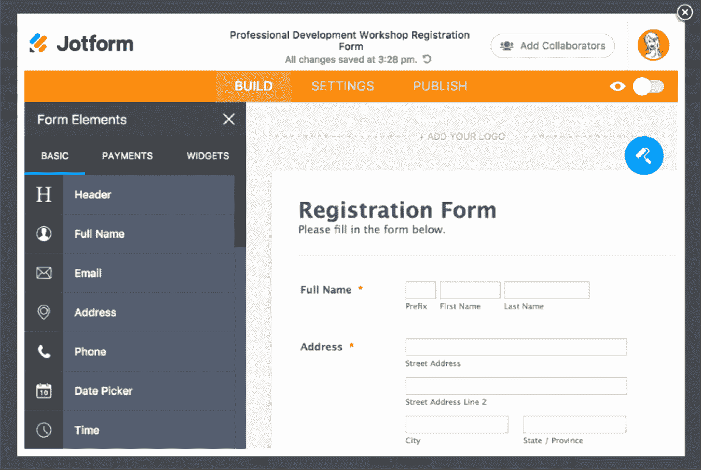

Jotform

如果你是一个 Google Forms 用户，想要切换到 Jotform，好消息是:你可以将现有的表单迁移到新的平台上。

Jotform 的免费版本仅限于 5 个表单，每月 100 个响应，100 MB 存储空间。最高级的计划是黄金计划，每月费用为 79 美元，每月提供 100，000 个回复和 1 TB 的存储空间。

### 7.质量标准

Qualtrics 是一个常用于学术研究的表单生成器，但它也可以用于商业。

免费版只有四个主题，没有条件逻辑，八种题型。没有太多的理由选择这个计划而不是谷歌表单。

每月 30 美元的标准计划允许条件逻辑。这种逻辑比 Google Forms 更先进，因为它可以基于多个条件。例如，你可以说，如果有人来自圣达菲或拉斯维加斯，他们有一只猫，他们被送到第三个问题。如果他们说自己来自西雅图，没有宠物，他们会被送到第四个问题。

所有付费计划还提供 14 种语言的文本分析。

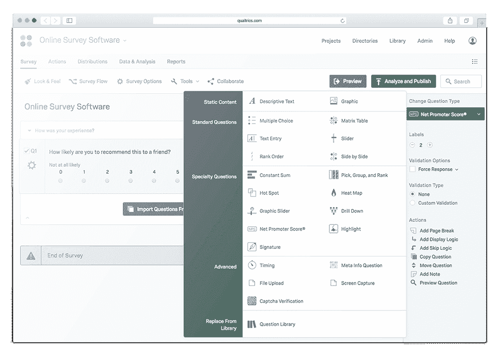

Qualtrics

如果您为高级或 DesignXM 计划付费，这些计划具有自定义定价，您将获得 22 种问题类型、更多主题和额外的分析。

Struggling with downtime and WordPress problems? Kinsta is the hosting solution designed to save you time! [Check out our features](https://kinsta.com/features/)

### 8.纸质表格

Paperform 提供 22 种问题类型、高级条件逻辑和 500 多种模板。

Paperform

不幸的是，Paperform 没有免费版本。

最便宜的计划名为 Essentials，每月 20 美元，允许你制作无限的表格，每月收集 1000 份回复，并将表格嵌入五个域中。

这个计划对许多小企业来说很有效，但是更昂贵的计划允许无限的响应、更多的存储、自定义分析和一些额外的问题类型。

### 9.电子邮件表单

[email form](https://www.emailmeform.com/)关注法规遵从性，帮助您创建符合 PCI-DSS、GDPR 和 HIPAA 的表单。

这意味着您可以访问多因素身份认证和审计跟踪等功能。

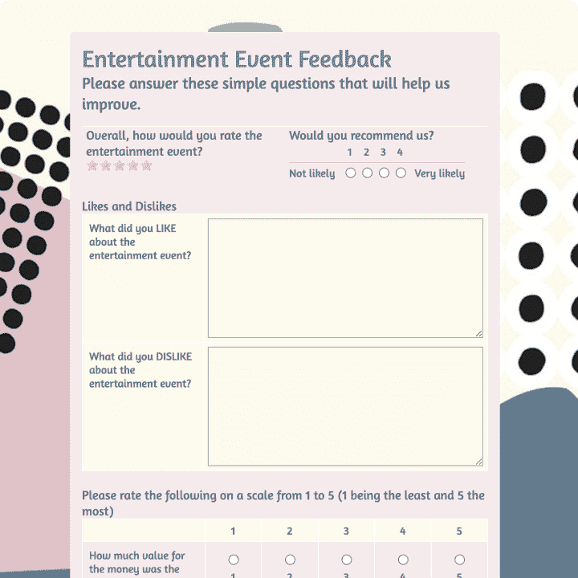

EmailMeForm

EmailMeForm 有设计精美的模板和多种带条件逻辑的题型。表单可以接受信用卡和其他支付选项，如 [PayPal](https://kinsta.com/blog/paypal-alternative/) 、Authorize.net、Chargify 和 Stripe。

最便宜的方案是每月 30 美元，每月收集 10，000 份回复。要获得 HIPAA 合规功能，您必须升级到至少 50 美元/月的体验计划。

### 10.可怕的形式

对于在你的 WordPress 站点上看起来很棒的表单来说，[强大的表单](https://formidableforms.com/)插件是一个强有力的竞争者。

强大的提供了 100 多个模板，包括一些独特的表单类型，如计算器和 WooCommerce 表单。

虽然你可以用一个基本的编辑器来构建你的表单，但是强大的编辑器允许你通过定制 HTML 来完善你的设计。你也可以用登陆页面插件为你的 WordPress 站点创建自定义的登陆页面。

Formidable Forms

所有这些加上条件逻辑，支付选项，以及与 Mailchimp 和 Hubspot 等工具的集成，可能是为什么 calendar 在评论网站 G2 上获得了 [4.9/5](https://www.g2.com/products/formidable-forms/reviews) 的评级——高于列表中的其他 WordPress 插件。

### 11.字体

表格一次只显示一个问题。据该公司称，这使得表格更吸引人，更人性化。

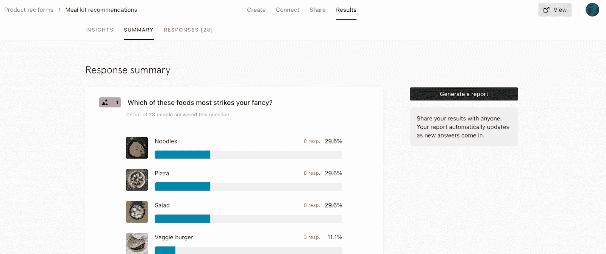

Typeform

免费版的 Typeform 每个月只允许 10 个问题和 10 个回答。但它确实可以让你创建无限的表单，并利用与 Zapier、Automate.io、 [Slack](https://kinsta.com/blog/how-to-use-slack/) 、Mailchimp、HubSpot 和其他解决方案的集成。

付费计划从每月 25 美元到每月 83 美元不等。

### 12\. Formstack

Formstack 是一个工作场所生产力平台，提供表格以及其他解决方案，如文档和电子签名。

有 300 多个模板可供选择，并与 Salesforce 和 HubSpot 等工具集成。

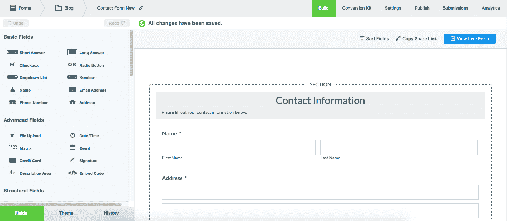

Formstack

Formstack 的免费版本极其有限，没有模板和存储。您可以创建三个表单，每个表单最多包含十个问题。

付费计划起价 50 美元/月。如果你对 Formstack 的其他工具感兴趣，你可以以每月 360 美元的价格订阅整个平台。

### 13.综合调查

SoGoSurvey 提供模板、主题和多渠道发布选项。如果您的表单在国际上可以看到，您可以创建带有自动翻译功能的多语言调查。

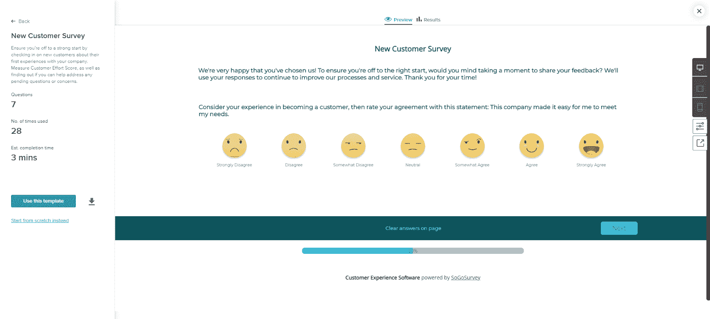

SoGoSurvey

SoGoSurvey 拥有强大的分析产品。例如，您可以生成一个条件报告来分析某些变量对结果的影响，或者生成一个分段报告来查看不同组的结果。

免费计划允许 15 次调查。所有其他的计划，从每月 25 美元开始，允许无限制的调查和额外的问题和报告类型。

### 14.重力形式

[Gravity Forms](https://www.gravityforms.com/) 是一个创建 [WordPress forms](https://kinsta.com/blog/wordpress-forms/) 的插件。

它提供了 13 个模板和一个模仿 WordPress 表单生成器的灵活的拖放编辑器。

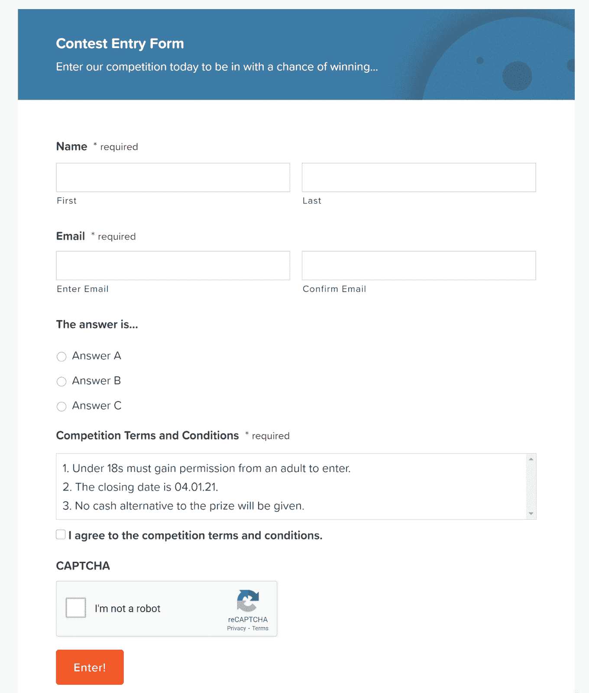

Gravity Forms

没有免费版本，但基本计划，费用为 59 美元/年，包括无限的表格，无限的条目，条件逻辑，文件上传和各种有用的附加组件。

### 15.潜在表单生成器

所有这些定价选项是否让你头晕目眩？

每月每张表格收费 10 美元，简化了事情。没有高级主题或附加组件——10 美元的表单中包含了 Pabbly 的所有功能。它们包括:

*   无限提交
*   无限嵌入
*   付款表格
*   主题和定制
*   定制品牌
*   多页表单
*   300 多个集成

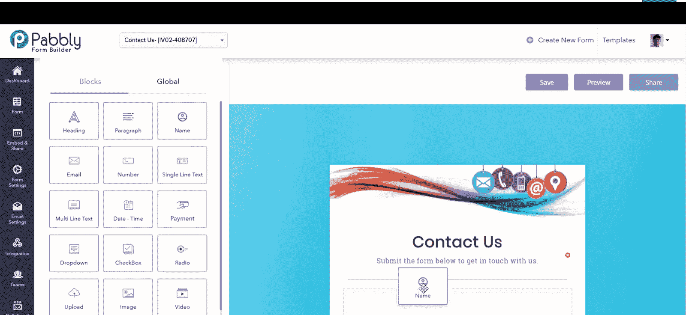

Pabbly Form Builder

## 最好的 Google Forms 替代方案是什么？

最适合您业务的表单解决方案将取决于您的目标——有一种替代 Google 表单的方法可以满足您的所有需求。这里有几个建议。

*   **最佳谷歌表单替代方案:** Jotform
*   最佳 WordPress 插件谷歌表单替代:强大的表单
*   **最佳移动谷歌表单替代品:** Zoho 表单
*   **最佳 CRM/谷歌表单替代组合:** HubSpot 表单

[Is there a more polished option for your business than Googe Forms? 🤔 Explore 15 free and paid alternatives in this guide ⬇️Click to Tweet](https://twitter.com/intent/tweet?url=https%3A%2F%2Fkinsta.com%2Fblog%2Fgoogle-forms-alternative%2F&via=kinsta&text=Is+there+a+more+polished+option+for+your+business+than+Googe+Forms%3F+%F0%9F%A4%94+Explore+15+free+and+paid+alternatives+in+this+guide+%E2%AC%87%EF%B8%8F&hashtags=GoogleForms%2CSmallBiz) ## 摘要

表单是你与网站访问者或电子邮件列表互动的重要组成部分。Google Forms 可能是最适合你的表单解决方案，但是在你做决定之前，先探索一下你的其他选择。要考虑的因素包括:

*   你需要做多少表格
*   您想要收集多少回复
*   你的预算
*   您现有的技术体系
*   您希望如何可视化和分析数据
*   [您的设计需要](https://kinsta.com/blog/web-design-best-practices/)

重新思考你和谷歌的关系？了解是否是时候从谷歌 Chrome 切换到微软 Edge 了。

* * *

让你所有的[应用程序](https://kinsta.com/application-hosting/)、[数据库](https://kinsta.com/database-hosting/)和 [WordPress 网站](https://kinsta.com/wordpress-hosting/)在线并在一个屋檐下。我们功能丰富的高性能云平台包括:

*   在 MyKinsta 仪表盘中轻松设置和管理
*   24/7 专家支持
*   最好的谷歌云平台硬件和网络，由 Kubernetes 提供最大的可扩展性
*   面向速度和安全性的企业级 Cloudflare 集成
*   全球受众覆盖全球多达 35 个数据中心和 275 多个 pop

在第一个月使用托管的[应用程序或托管](https://kinsta.com/application-hosting/)的[数据库，您可以享受 20 美元的优惠，亲自测试一下。探索我们的](https://kinsta.com/database-hosting/)[计划](https://kinsta.com/plans/)或[与销售人员交谈](https://kinsta.com/contact-us/)以找到最适合您的方式。