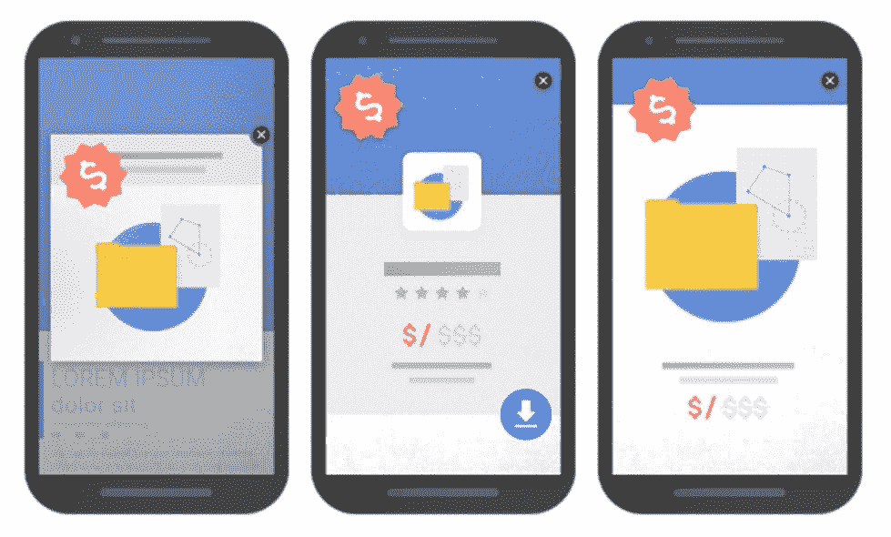
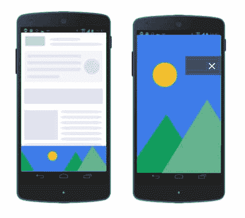
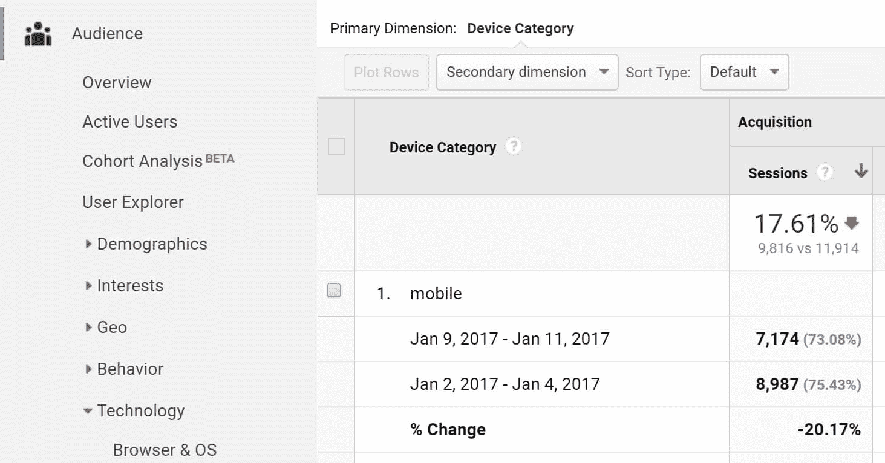
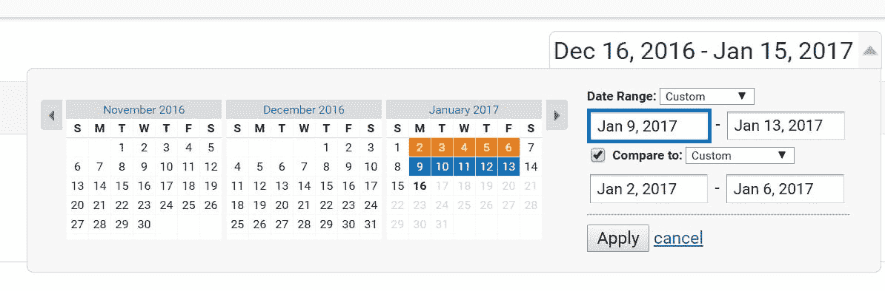
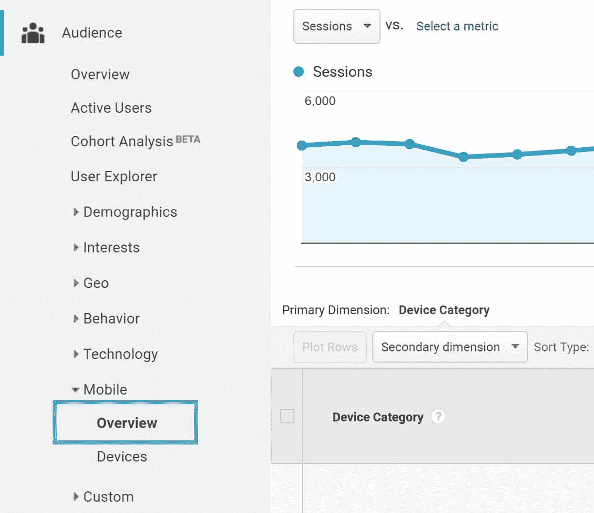
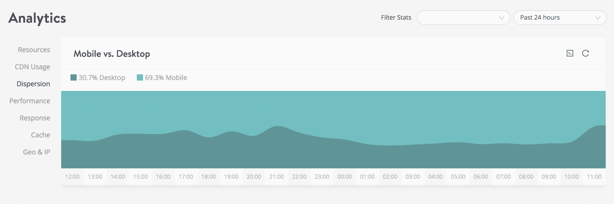
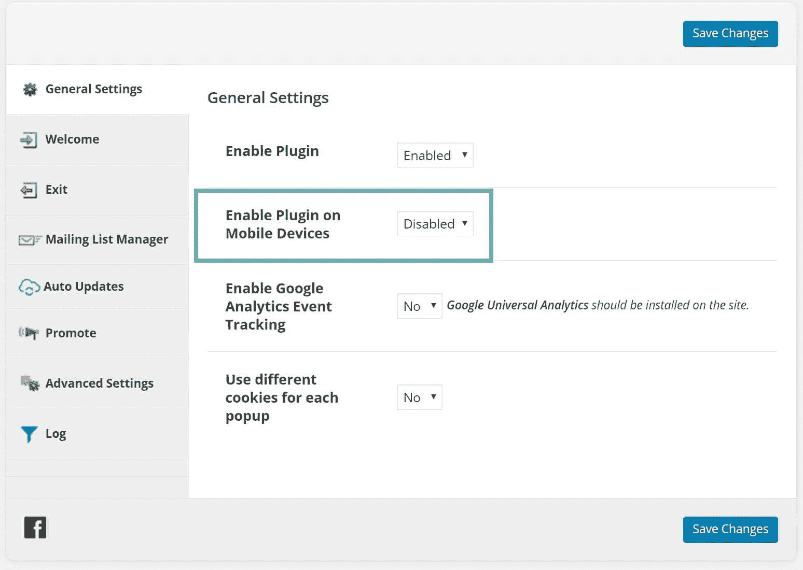
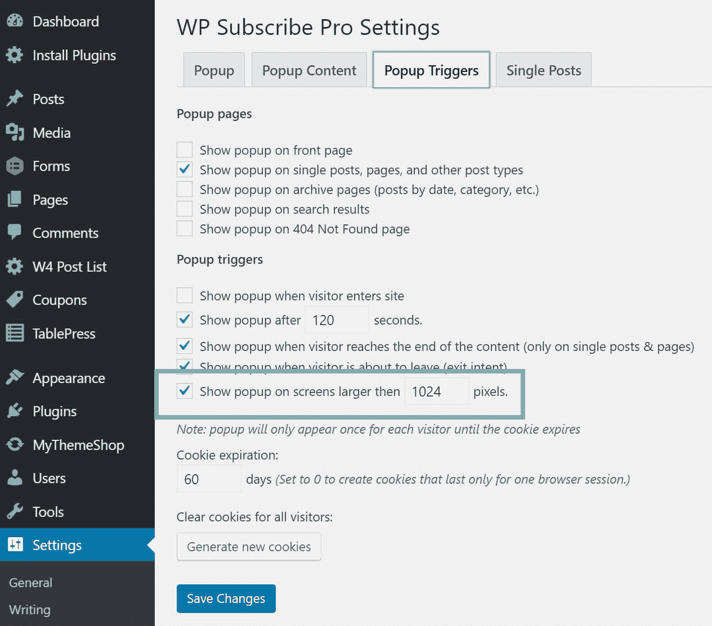

# 谷歌手机弹出广告对网站用户的惩罚

> 原文：<https://kinsta.com/blog/google-mobile-popup-penalty/>

我们意识到你们中的许多人没有跟上最新的谷歌趋势和更新。你怎么能？你们中的许多人忙于经营生意，一天的时间就这么多。另一大部分人可能会将你网站的工作外包给一家代理公司或维护公司。但是他们也在应付大量的客户。自 2017 年 1 月 10 日起，谷歌手机弹出窗口处罚在全网生效。如果你最近看到移动流量大幅下降，你可能需要检查你的网站，以确保你正确使用弹出窗口。在下面阅读更多关于这种惩罚的内容以及你能做些什么。

> 2017 年 1 月 10 日更新:从今天开始，用户在从移动搜索结果转换时不容易访问到**内容的页面可能不会排名很高**。正如我们所说，这个新信号只是排名中使用的数百个信号之一，搜索查询的意图仍然是一个非常强的信号，所以如果一个页面有很好的相关内容，它仍然可以排名很高。–谷歌网站管理员团队

*   [谷歌手机弹出处罚](#google-mobile-popup-penalty)
*   [弹出惩罚的影响](#popup-penalty-impact)
*   [如何查看您的手机流量](#check-mobile-traffic)
*   你应该做些什么

## 谷歌手机弹出惩罚

谷歌给了我们足够的时间，因为他们最初在 2016 年 8 月[宣布了移动弹出窗口处罚](https://webmasters.googleblog.com/2016/08/helping-users-easily-access-content-on.html)(从技术上讲，这不是处罚，而是贬低你的页面。但大多数情况下，结果是一样的)。除非你紧跟最新的 [SEO](https://kinsta.com/blog/what-does-seo-stand-for/) 趋势和事件，否则你很容易忽略这一点。他们这样做的原因是因为弹出窗口很容易让用户感到沮丧。我们可能都曾被弹出窗口所困扰。通过在移动设备上不允许它们，这可以允许更容易和更快地访问页面上的内容。

### 处罚示例

重要的是要注意到**这种惩罚是逐页施加的**。也就是说，页面本身会在谷歌被降级，但不是整个网站。除非你的整个网站都有弹出窗口，否则你会看到一个全球性的 SERPs 下降，因为每一个都可能受到轻微的打击。这种惩罚不仅适用于 popups，而且适用于**所有形式的侵入性间隙细胞**。以下是谷歌的一些例子，可能会让你受到处罚。

*   在用户从搜索结果导航到某个页面后，显示一个包含主要内容的弹出窗口。如果你使用的是延迟弹出窗口或者是在用户向下滚动页面一部分后触发的弹出窗口，这些也会被扣分。
*   显示一个独立的插页，用户在访问主要内容之前必须消除它。你知道那个大屏幕欢迎垫吗？他们现在不能使用手机。
*   使用一种布局，其中页面的折叠部分看起来类似于独立的插页，但原始内容被内联在折叠之下。

Google popup penalty examples (src: Google)

### 可接受的弹出窗口

当然，对这一规则也有一些期望。以下是一些仍然可以接受的例子:

*   [推送通知](https://kinsta.com/blog/wordpress-push-notifications/)是允许的，因为它们只占屏幕的一小部分。
*   Cookie 使用和[年龄](https://kinsta.com/blog/wordpress-age-verification/)验证。法律要求的任何东西都应该而且仍然可以使用。
*   小应用横幅。一般来说，最佳做法是确保不超过 1/4 的移动屏幕被占用。
*   [退出弹出窗口](http://www.thesempost.com/exit-interstitials-not-impacted-googles-mobile-interstitial-change/)不受影响。

### Google AdSense

Google Adsense 应该也不会受到 Google mobile 处罚的影响。[页面级广告](https://support.google.com/adsense/answer/6245304)，如锚定广告/覆盖广告和插页广告都在可接受的准则范围内。

主播/覆盖广告只占屏幕的一小部分，很容易被忽略。有了小广告，当你从谷歌的页面结果转到一个网页时，它们就不会显示出来。它们只在你从一个网站的第一页转到第二页时显示。移动罚款只适用于直接来自谷歌的流量。

### 其他流量

此外，如果你的流量来自谷歌以外的任何地方，你仍然可以使用弹出窗口。我们并不是说你应该这样做，但是如果你有一个聪明的方法，仅仅基于来自脸书或者 Pinterest 的社交流量来显示一个弹出窗口，你就不会受到惩罚。

## 弹出惩罚的影响

来自 G-Squared Interactive 的 Glen Gabe 贴出了一些受到谷歌移动弹出窗口处罚负面影响的网站的例子。他们中的一些人在移动排名中失去了十个甚至更多的位置。根据你获得的移动流量，失去 10 个位置可能意味着每天失去成千上万的访问者！移动流量也比以往任何时候都高，因为现在近 60%的搜索来自移动。

一些从未使用过弹出窗口的人报告了完全相反的情况，并且看到了排名的上升。这可能是因为其他竞争对手在他们的领域受到了惩罚，或者说贬值了。

### 惩罚的例子

以下是 Kinsta 的一个客户报告称，与前一周相比，移动流量下降了 20%。他们在 3 天内失去了近 2000 名访客，因为他们使用的弹出插件有一个 bug。显然，他们用于弹出窗口的 WordPress 插件有办法在手机上禁用，但它不能正常工作。这反过来又导致了客户广告收入的损失。他们已经禁用了那个插件，大约 3 天后他们的排名/流量恢复了。因此，如果您想知道整个站点从损失中恢复需要多长时间，这是一个很好的近似值。

## 注册订阅时事通讯

### 想知道我们是怎么让流量增长超过 1000%的吗？

加入 20，000 多名获得我们每周时事通讯和内部消息的人的行列吧！

[Subscribe Now](#newsletter)

## 如何查看您的手机流量

如果你使用弹出窗口、欢迎垫或入侵性间隙，你可以[在谷歌分析](https://kinsta.com/blog/how-to-use-google-analytics/#acquisition-report)中查看你的流量，看看你是否被击中。一个更好的跟踪方法是使用关键词排名跟踪工具。但是，如果你没有，你的流量应该与排名的损失相关。显然，即使在本周，谷歌手机弹出窗口惩罚更新仍在推出。你可以预期大概几个星期后更新的全面影响会影响到每个人。

### 第一步

点击进入您的 [Google Analytics](https://kinsta.com/blog/google-analytics-wordpress/) 个人资料，在顶部比率的过滤器中选择 2017 年 1 月 9 日至 2017 年 1 月 13 日的日期范围，并与前一周进行比较。

### 第二步

在左侧的“受众”下，点击进入手机>概览。这将显示移动、桌面和平板电脑的流量。显然，由于假期的原因，可能会有一点波动。但如果你看到移动流量大幅下降，比如 15%或更多，那么你很可能会看到惩罚的结果。

Struggling with downtime and WordPress problems? Kinsta is the hosting solution designed to save you time! [Check out our features](https://kinsta.com/features/)

### Check MyKinsta Analytics

如果你是 Kinsta 的客户，你还可以在 MyKinsta Analytics 中查看你的网站的移动流量。

Mobile vs desktop traffic

## 你应该做些什么

你可能会有一个大问题，那就是你应该怎么做？你有几个选择。如果你有一个 WordPress 网站，第一件事就是完全禁用你的弹出插件。第二种方法是简单地禁用移动设备上的弹出窗口，并继续在桌面上为访问者提供服务。

我们在金斯塔这里使用弹出窗口，效果很好。在我们的博客上，我们只在 50%滚动的时候使用它们，因为我们不想让它们影响我们网站的其他部分或者打扰我们的访问者。我们从未在移动设备上使用过它们。如果你不想使用弹出窗口，Kissmetrics 有一篇很棒的文章，介绍了在不打扰访问者的情况下获取电子邮件线索的 10 种方法。

现在很多插件都有选项来选择是否要在手机上显示。在[忍者弹出窗口插件](https://codecanyon.net/item/ninja-popups-for-wordpress/3476479)中，您可以在常规设置中轻松禁用移动设备上的弹出窗口。

这里有一个来自 MyThemeShop 的 [WP Subscribe Pro 插件](https://mythemeshop.com/plugins/wp-subscribe-pro/)的例子。然而，我们建议现在禁用这个插件中的弹出窗口，因为移动设备检测目前有一个 bug。请记住，即使这些插件有选项，你仍然应该在你的手机上测试，以确保它的工作。

以下是 SumoMe 中[显示选项的一些附加链接。](https://help.sumome.com/hc/en-us/articles/218680998--Display-Rules)

此外，如果您使用 SumoMe 的迎宾垫，这些也会受到影响。他们有一个叫做“显示模式”的新功能，可以在所有垫子的“行为”标签中找到，现在可以让你把它们嵌入到折叠下面。这符合谷歌的指导方针。你可以阅读 SumoMe 关于谷歌手机弹出窗口处罚的官方[声明。](https://sumome.com/stories/mobile-seo-google-2017)

您可以随时联系您正在使用的任何弹出窗口或潜在客户生成插件的开发者，询问如何在移动设备上禁用弹出窗口。如果他们没有选择，那么可能是时候尽快找到一个新的插件了。

## 摘要

你最不希望发生的事情就是因为在移动设备上显示弹出窗口而在谷歌受到惩罚。如果您还没有禁用它们，现在是时候这样做了。这包括迎宾垫和所有其他侵入性间隙。惩罚不是永久的，所以不要过于恐慌，因为你可以期待你的移动流量和排名在几天内恢复。你被谷歌手机弹出窗口处罚了吗？如果有，请在下面告诉我们。

* * *

让你所有的[应用程序](https://kinsta.com/application-hosting/)、[数据库](https://kinsta.com/database-hosting/)和 [WordPress 网站](https://kinsta.com/wordpress-hosting/)在线并在一个屋檐下。我们功能丰富的高性能云平台包括:

*   在 MyKinsta 仪表盘中轻松设置和管理
*   24/7 专家支持
*   最好的谷歌云平台硬件和网络，由 Kubernetes 提供最大的可扩展性
*   面向速度和安全性的企业级 Cloudflare 集成
*   全球受众覆盖全球多达 35 个数据中心和 275 多个 pop

在第一个月使用托管的[应用程序或托管](https://kinsta.com/application-hosting/)的[数据库，您可以享受 20 美元的优惠，亲自测试一下。探索我们的](https://kinsta.com/database-hosting/)[计划](https://kinsta.com/plans/)或[与销售人员交谈](https://kinsta.com/contact-us/)以找到最适合您的方式。