# 如何免费使用 Google Optimize 在 WordPress 进行 A/B 测试

> 原文：<https://kinsta.com/blog/google-optimize/>

不管你有什么类型的 WordPress 网站，是电子商务商店还是联盟营销博客，重要的是你永远不要停止 A/B 测试！数据驱动的决策有助于推动你的网站或业务向前发展，让你在竞争中领先。但是说实话，A/B 测试并不总是容易的。或者你只是一直在拖延。好吧，今天希望我们能改变这一切！

下面我们将深入探讨如何在 WordPress 中使用 Google Optimize 进行 A/B 测试。不管你有什么类型的网站，这都是可行的。最棒的是，它是免费的。

*   [什么是 A/B 测试？](#what-is-ab-testing)
*   [谷歌优化](#google-optimize)
*   [如何在 WordPress 中设置谷歌优化](#setup-google-optimize)
*   [如何用谷歌优化运行 A/B 测试](#ab-test-with-google-optimize)

[It's vital that you never stop A/B testing! Google Optimize provides an awesome free way to get started. 📊Click to Tweet](https://twitter.com/intent/tweet?url=https%3A%2F%2Fbit.ly%2F2Atzati&via=kinsta&text=It%27s+vital+that+you+never+stop+A%2FB+testing%21+Google+Optimize+provides+an+awesome+free+way+to+get+started.+%F0%9F%93%8A&hashtags=CRO%2Cmarketing)

## 什么是 A/B 测试？

A/B 测试，有时也称为分割测试，是一种将页面上的元素(或任何类型的数据)相互比较的方法，以确定哪个在页面浏览量、页面停留时间、转化率、[跳出率](https://kinsta.com/blog/how-to-reduce-bounce-rate/)等方面表现更好。一些例子包括:

*   测试[不同的标题](https://kinsta.com/blog/headline-analyzer/)。
*   尝试新的登录页面内容或页面布局。
*   尝试不同颜色的 CTA 按钮。
*   显示完全不同的内容，例如在小部件中显示 CTA，而不是在联系人潜在客户表单中显示。你可以[在谷歌分析](https://kinsta.com/blog/how-to-use-google-analytics/#conversions-report)中追踪漏斗中的销售情况，看看哪个会带来更多的销售。

有不同形式的 A/B 测试，如多元测试，但最常见的方法是简单地将 50%的流量发送到页面 A，将 50%的流量发送到页面 B。也称为分割测试。

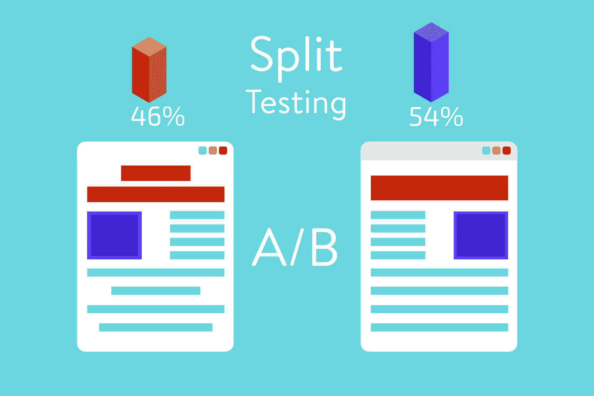

A/B split testing

这个想法是从简单的测试开始，例如改变 CTA 文本或按钮颜色，找到获胜者，然后用新的获胜者重复这个过程。当你这样做的时候，无论你追求什么目标，你都应该开始看到更好的结果。

由于样本大小和时间的原因，确定你的[网站是否有足够的流量](https://kinsta.com/blog/how-to-drive-traffic-to-your-website/)来开始 A/B 测试也是非常重要的。Stephen Watts 有一篇很棒的文章触及了其中的一些细节，包括[为什么你应该复制你的营销测试](https://www.searchenginejournal.com/why-replication-is-critical-for-web-experiments/267889/)。

## 谷歌优化

当涉及到 A/B 测试时，有许多不同的工具可供选择。在我们关于最好的 [A/B 测试工具](https://kinsta.com/blog/wordpress-ab-testing-tools/)的帖子中，我们涉及了很多。

然而，如果你有大量的流量，他们中的许多人可以轻松地运行你一个月数百甚至数千美元。最好把预算花在高质量的主机上。😉许多 A/B 测试工具也有很多你可能永远不会用到的特性。

虽然一个好的工具在回报方面肯定会有回报，但从免费的东西开始学习 A/B 测试是如何工作的，并了解哪些目标对您的企业来说是可以实现的，这可能是有利的。

在我们看来，谷歌优化是一个很好的工具，尤其是因为它是免费的。虽然它没有 WordPress 插件或直接集成，但一旦你掌握了窍门，它仍然很容易使用。另一个好处是，它与谷歌分析的结合，一个你们大多数人可能已经在使用的工具，甚至远远优于其他一些解决方案。只需轻轻一点，你就可以将它与谷歌分析目标挂钩。

Google Optimize

他们确实有一个高级版本([优化 360](https://marketingplatform.google.com/about/optimize-360/) )，但你可以免费运行多达 5 个同时进行的实验。对于你们中的许多人来说，这已经足够了，因为你不想同时运行太多的 A/B 测试，否则，它可能会扭曲你的数据质量。我们已经在 Kinsta 使用了免费版的 Optimize，效果非常好！

如果你很好奇，下面是免费版(优化)与高级版(优化 360)的对比。

Google Optimize vs Optimize 360 (Image source: [Google](https://support.google.com/optimize/answer/7084762?hl=en))

## 如何在 WordPress 中设置谷歌优化

按照下面的步骤建立一个免费的谷歌优化账户，并在你的 WordPress 站点上进行配置。

### 第一步

首先要做的是前往[谷歌优化](https://optimize.google.com/)，点击“开始”按钮注册一个免费账户。

**重要提示:**您将需要使用已经与您的 Google Analytics 帐户关联的 Gmail 或 [Google Workspace](https://kinsta.com/blog/google-workspace/) 电子邮件地址。

Get started with Google Optimize

然后按照下面的步骤回答一些关于数据权限和共享的可选问题。

### 第二步

接下来，您需要链接您的谷歌分析属性。在右侧，单击“链接属性”

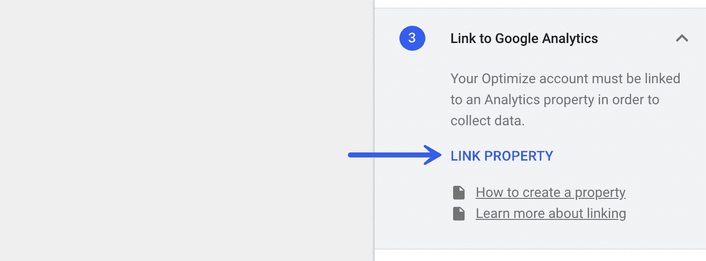

Google Optimize – Link Google Analytics Property

### 第三步

然后你应该会看到你的谷歌分析属性。如果您的 Gmail 附带了多个属性，您需要选择一个要与 Google Optimize 一起使用的属性。然后点击“链接”

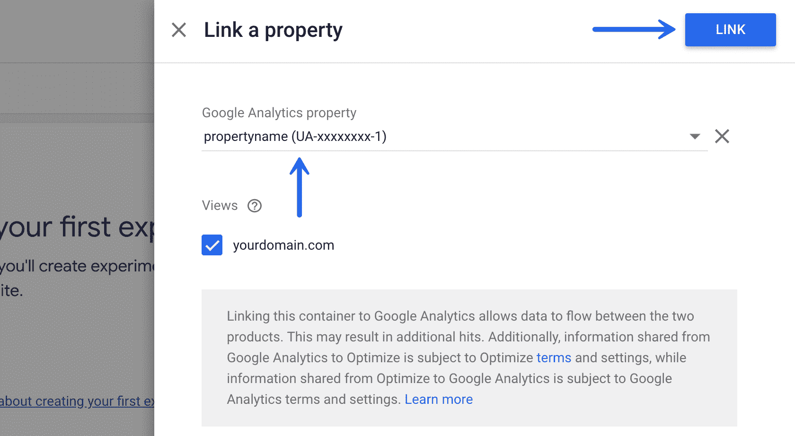

Link a property in Google Optimize

### 第四步

接下来，点击“获取片段”

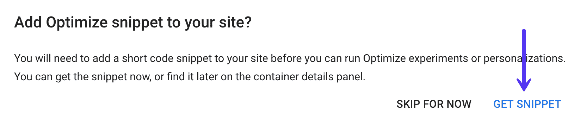

Google Optimize get snippet

### 第五步

现在是时候用你的 Google 优化容器 ID 来修改你的 Google 分析代码了。这里有几件重要的事情需要提及:

*   如果你目前在你的网站上安装了谷歌分析，**必须在你的网站标题**中，在`</head>`标签之前。通常把它放在页脚是可以的，但是在这种情况下，如果你没有在页眉中运行脚本，你会在页面加载时看到明显的白色闪光。这是因为脚本需要在 DOM 加载时立即启动。如果你使用的是 WordPress 插件，大多数都有一个选项来选择脚本的页眉或页脚位置。
*   优化代码片段看起来类似于:`ga('require', 'GTM-XXXXXXX');`，它包含您的优化容器 ID。你需要做的只是修改你当前的谷歌分析脚本来包含这个，而不是再次添加整个脚本。

Deploy Optimize code

如果你已经手动安装了谷歌分析跟踪脚本，那么你需要做的只是简单地添加它，就像他们提供的例子。然而，如果你目前正在使用一个[谷歌分析 WordPress 插件](https://kinsta.com/blog/google-analytics-wordpress/)，你可能需要改变一些东西。

你应该首先检查你的 Google Analytics WordPress 插件是否已经支持 Google 优化或者添加自定义代码。这里有几个 WordPress 插件已经支持谷歌优化或者允许你在插件设置中添加代码:

*   WP 的谷歌分析仪表板:在插件设置的集成下，它有一个选项来添加你的优化容器 ID。
*   [GA Google Analytics](https://wordpress.org/plugins/ga-google-analytics/) :在插件的设置中有一个选项来添加优化代码。

注意:如果你使用谷歌标签管理器来部署谷歌分析，你仍然可以[安装优化器](https://support.google.com/optimize/answer/6314801)，但是它可能会有额外的延迟，甚至谷歌也不建议这样做。由于脚本在性能方面的工作方式，他们建议直接在页面上部署优化(这是大多数 WordPress 插件所做的)。

下面是一个使用 WP 插件的谷歌分析仪表板的例子。在 Integration 选项卡下，您可以“启用优化跟踪”并输入您的容器 ID。

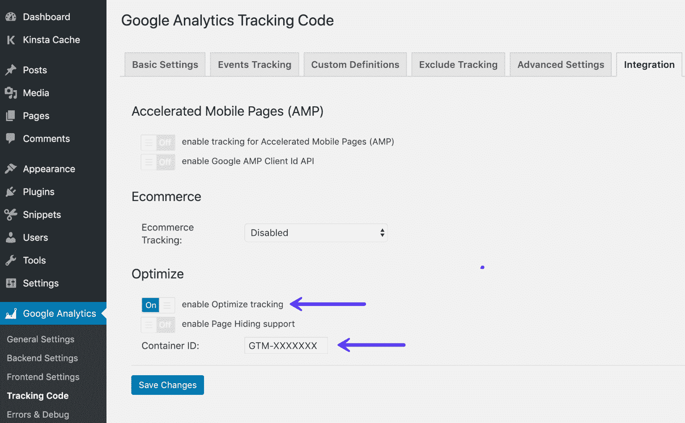

Enable Google Optimize in Analytics plugin

代码准备好后，点击“下一步”,回到谷歌优化向导。

### 第六步

当 Google Optimize 首次推出时，它有一些性能问题，他们创建了一个页面隐藏片段来减少页面加载时的页面闪烁。添加页面隐藏代码段需要在分析跟踪代码之前添加额外的代码。

然而，我们最近发现**不再总是必要的**。如果你的网站已经相当快了，你应该不会有任何问题。我们不再使用页面隐藏代码片段，而是一直运行测试。

然而，由于每个网站都是不同的，如果你遇到问题，你可能需要用[页面隐藏代码片段](https://support.google.com/optimize/answer/6262084#step-2)进一步修改你的分析脚本。你也可以修改`async-hide`时间，默认设置为 4000 毫秒。一些插件，比如上面的那个，也有简单的切换来启用页面隐藏支持。

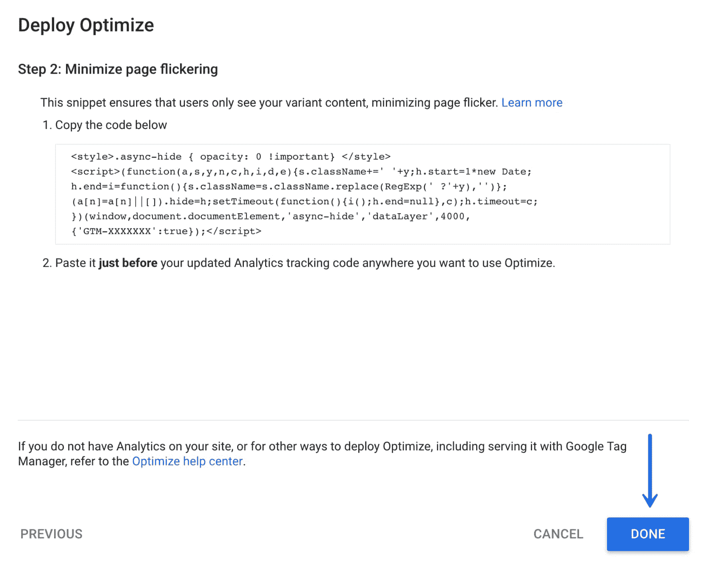

Minimize page flickering

点击“完成”,你的 WordPress 站点应该准备好了。

## 如何用谷歌优化运行 A/B 测试

现在是有趣的部分，在谷歌优化中创建你的第一个 A/B 测试。

## 注册订阅时事通讯

### 想知道我们是怎么让流量增长超过 1000%的吗？

加入 20，000 多名获得我们每周时事通讯和内部消息的人的行列吧！

[Subscribe Now](#newsletter)

### 第一步

在谷歌优化仪表板上点击“让我们去”创建一个新的 A/B 测试，或者他们所谓的实验。

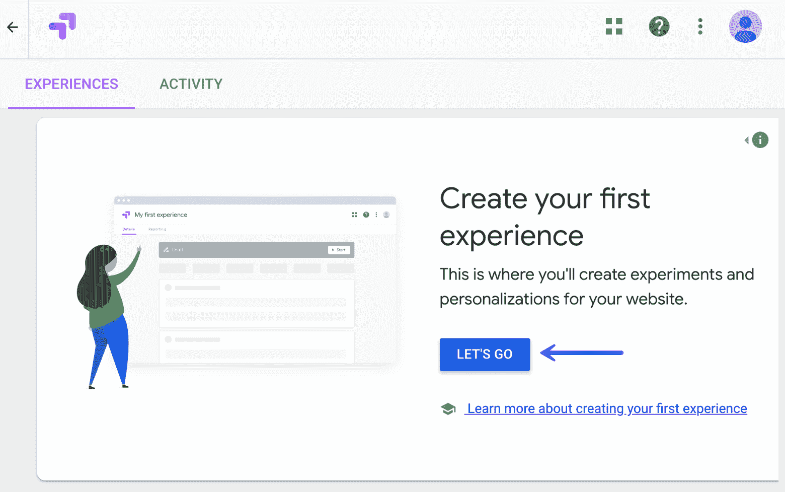

Create Experience A/B test in Google Optimize

### 第二步

在下面的例子中，我们将做一个简单的 CTA 按钮颜色变化 A/B 测试，这样你可以很容易地看到它是如何工作的。请记住，基本上你的 WordPress 站点上的任何 HTML 或 CSS 元素都可以在 Google Optimize 中进行更改。

因此，我们为我们的测试选择一个名称，并输入我们想要编辑体验代码的 URL。在这个例子中，我们想改变一个 CTA 按钮的颜色，看看哪个按钮会给我们的联系我们页面带来更多的流量。对于体验类型，我们也选择 A/B 测试。然后点击“创建”

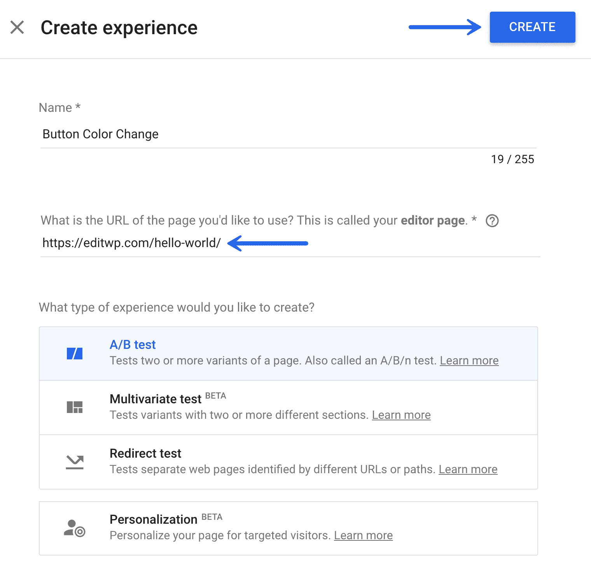

Google Optimize create A/B test

正如你所看到的，除了 A/B 测试之外，Google Optimize 还支持其他类型的实验，你可能想探索一下:

*   [多元检验](https://support.google.com/optimize/answer/7012154#multivariate-tests):用两个或多个不同部分检验变量。
*   [重定向测试](https://support.google.com/optimize/answer/6361119):测试不同 URL 或路径标识的独立网页。
*   个性化:为目标访问者个性化你的页面。

### 第三步

默认情况下，Google Optimize 将使用您在上面为实验选择的编辑器页面作为原始变体。然后，您需要创建第二个变体。点击“创建变体”

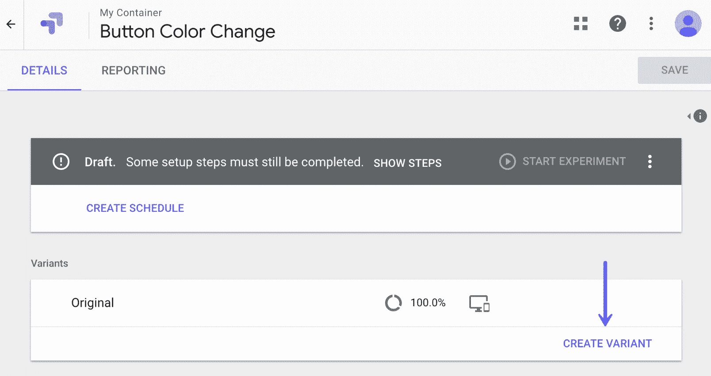

Google Optimize create a variant

### 第四步

给你的变体取一个名字，一个你以后很容易识别的名字。因为我们测试的是不同的按钮颜色，所以我们将我们的按钮命名为红色按钮。然后点击“完成”

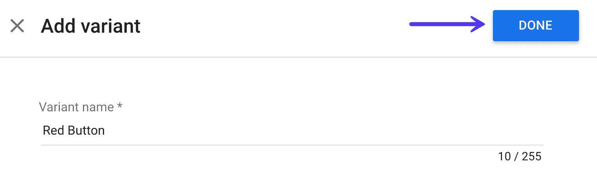

Google Optimize name variant

### 第五步

然后你将需要改变你的变体，因为默认情况下，它只是创建你的原件的一个副本。点击红色的“0 变更”。

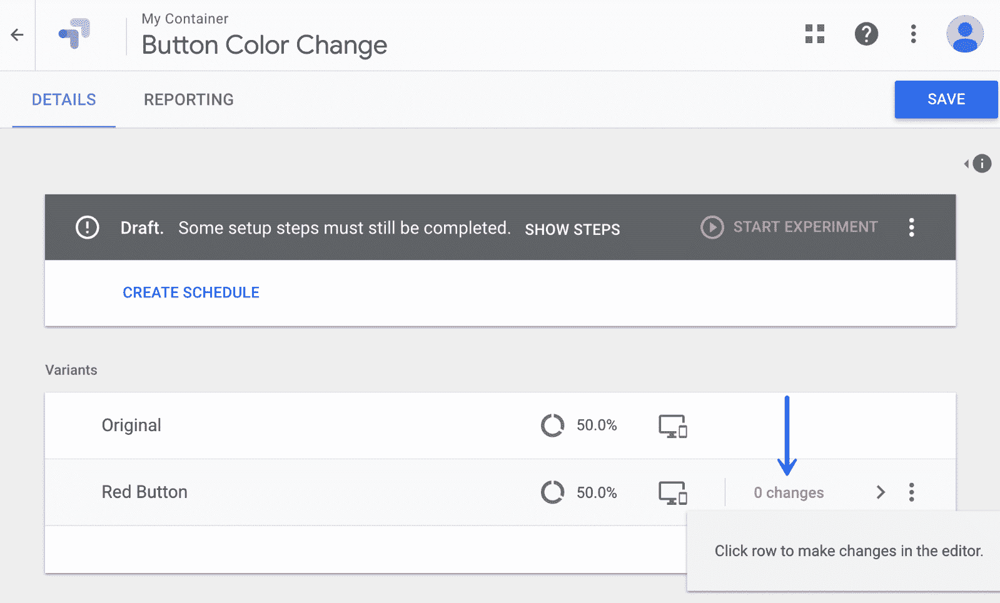

Google Optimize change variant

### 第六步

你可能会看到一个关于使用谷歌浏览器扩展的警告。为了获得最佳的编辑和预览功能，你需要安装免费的谷歌 Chrome 优化扩展。

Struggling with downtime and WordPress problems? Kinsta is the hosting solution designed to save you time! [Check out our features](https://kinsta.com/features/)

然后你会看到谷歌优化编辑器。挺厉害的！你可以改变页面上的任何内容。

Google Optimize Editor

在我们的例子中，我们用两种不同颜色的按钮，蓝色和红色，测试点击联系我们页面的结果。如果你好奇的话，我们只是为这个按钮使用了 [Shortcodes Ultimate 插件](https://wordpress.org/plugins/shortcodes-ultimate/)。

所以首先我们要改变按钮的颜色。为此，您可以简单地单击任何元素，在本例中是按钮，并编辑它的 CSS 属性。他们甚至有一个颜色选择器。如果你愿意，你可以直接编辑 CSS 或者 HTML。

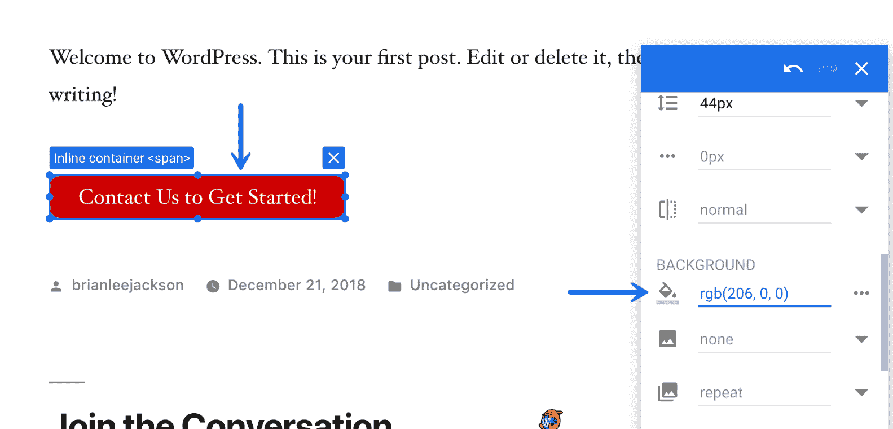

Change button color in Google Optimize

我们改变的另一件事是按钮的 URL。

*   原始按钮链接到`https://editwp.com/contact-us/?button-test-**blue**`。
*   变异按钮指向`https://editwp.com/contact-us/?button-test-**red**`。

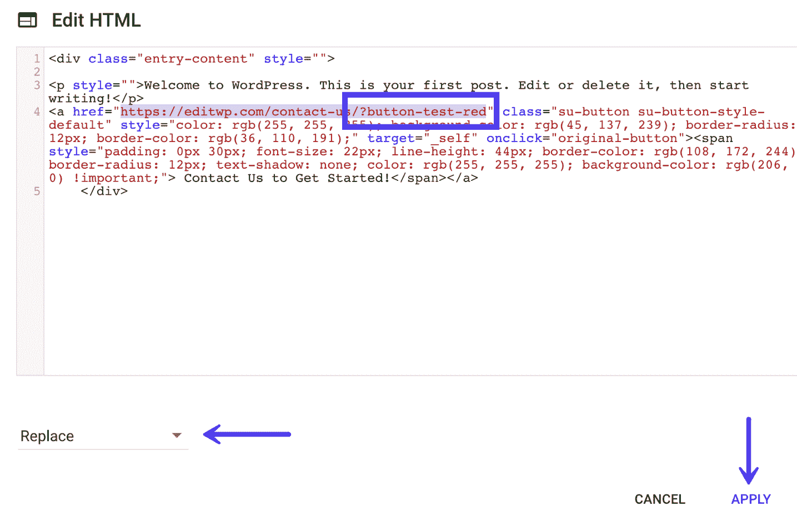

Change button URL

我们为什么要这么做？在谷歌分析，你可以在任何时候浏览，看看有多少网页浏览量的基础上登记的按钮类型。你应该**永远不要在你的内部站点**上使用 UTM 参数，但是像我们上面所做的那样在 URL 上附加一些东西是可以的。这只是给你额外的数据，你可以在任何时候浏览。

完成编辑后，您可以点击右上角的“保存更改”和“完成”。然后你可以点击“网络预览”来看看它是什么样子的。

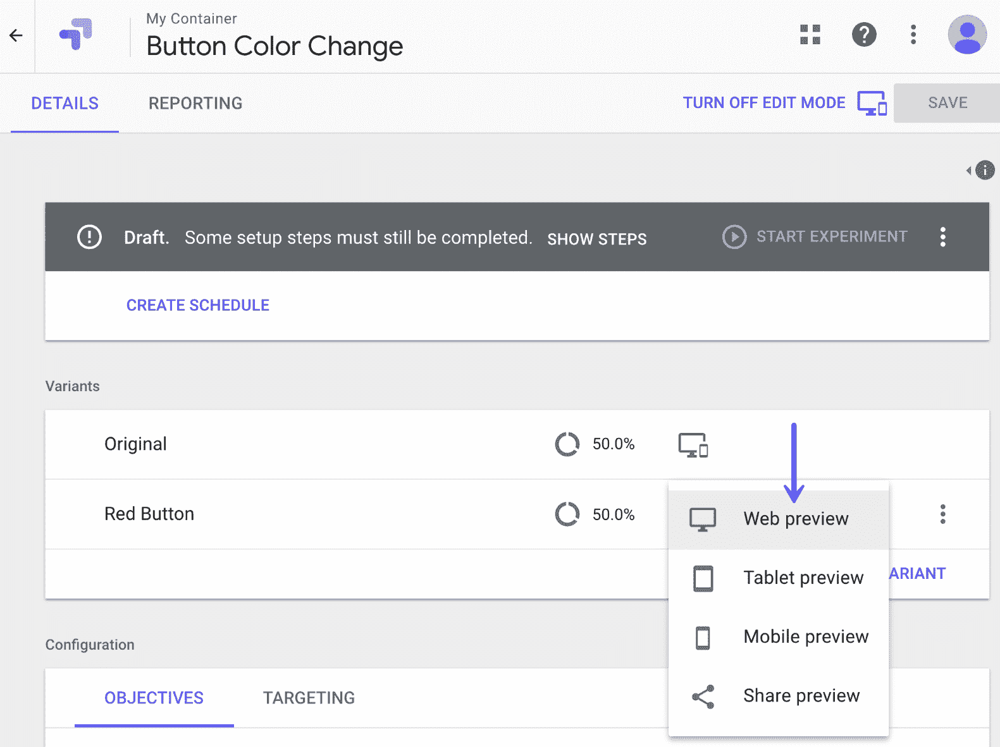

Google Optimize web preview

下面是我们的测试是如何设置的。记住，一切都是用谷歌优化编辑器改变的，而不是在 WordPress。

#### A/B 原始变体

在我们最初的版本中，我们有一个蓝色的按钮，50%的流量将流向这个按钮。按钮链接指向我们的联系方式:`https://editwp.com/contact-us/?button-test-**blue**`。

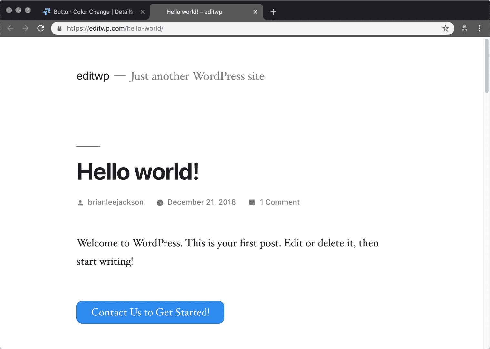

A/B test original variant

#### A/B 红色按钮变体

在我们的另一个变体中，我们有一个**红色按钮**，50%的流量将流向这个按钮。按钮链接指向我们的联系方式:`https://editwp.com/contact-us/?button-test-**red**`。

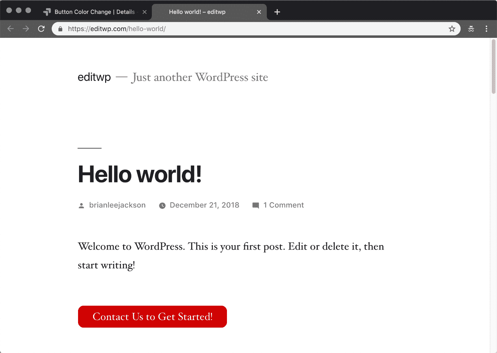

A/B test variant 1

### 第七步

下一步是添加一个目标。这就是目标或者你想考的东西。默认情况下，目标设置为 50%流量分配，因此您可以保持不变。你会想给你的目标一个简短的描述，这样你就可以很容易地看到为什么你后来添加它。请记住，有时您可能要运行几个月的测试，所以请确保添加一些您以后可以识别的内容。然后点击“添加实验目标”

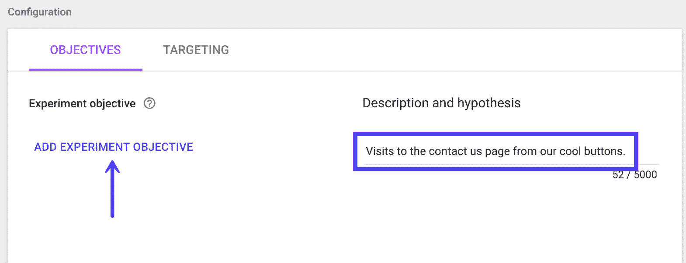

Google Optimize experiment objective

### 第八步

如果你已经在使用谷歌分析或电子商务跟踪中的目标和事件，那么你会看到它们列在这里。这是 Google Analytics 与 Optimize 直接集成的一个非常酷的地方。你们中的大多数人可能已经有了转化目标、联系形式目标等等。您可以轻松地将其与您的实验联系起来。但是对于这个例子，我们将创建一个自定义的。

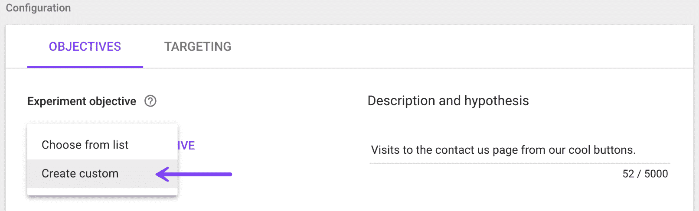

Google Optimize custom objective

### 第九步

我们使用浏览量作为目标类型，并选择从我们的联系我们页面开始的任何内容:`/contact-us/button-test`。

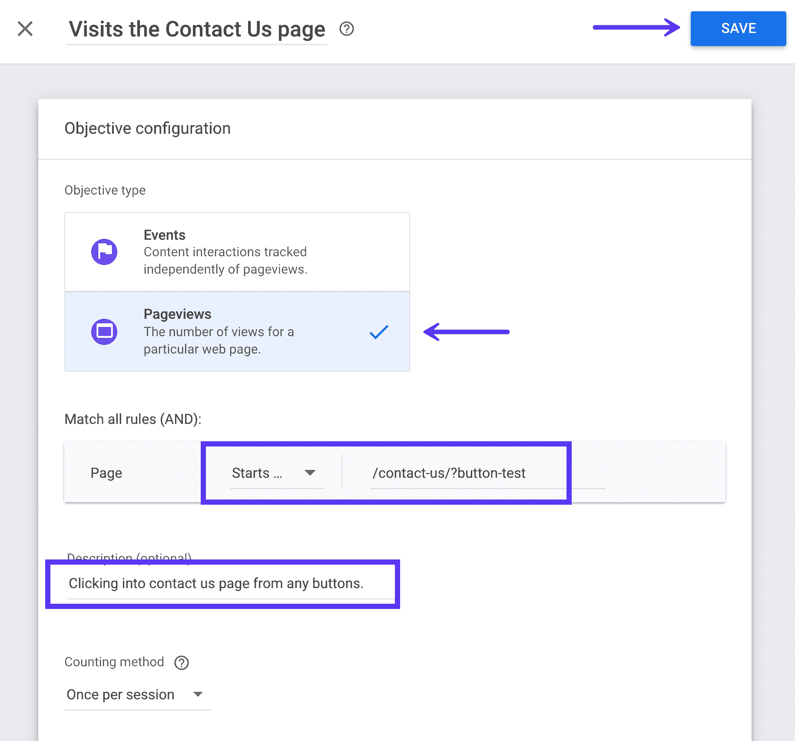

Custom objective in Google Optimize

如果你在谷歌分析中设置了电子商务跟踪，你还可以添加交易和收入等其他目标。这就是它变得真正强大的地方。例如，您可以看到某个颜色按钮产生了多少收入。从点击，一直到销售。

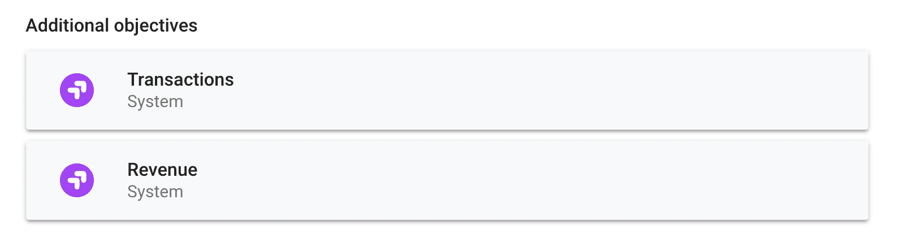

Google Optimize objectives – ecommerce

### 第十步

最后但同样重要的是，一旦你保存了所有的东西，你就可以点击“开始实验”然后，它将立即开始在您在实验中指定的位置上对流量进行分割测试。您还可以使用目标选项轻松设置站点范围的实验。

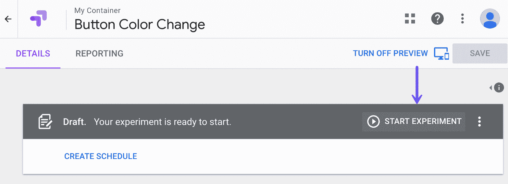

Google Optimize start experiment

然后你可以坐下来，让谷歌优化做它的事情。通常这需要一到两周的时间。它会自动为你分析出赢家。然后你可以看到哪个变体产生了最好的结果。下面是一个报告的例子。

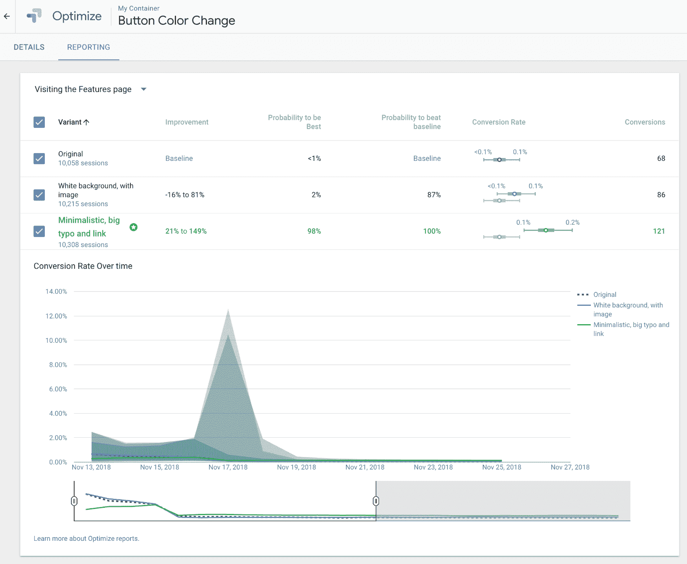

Google Optimize reporting

## 摘要

说到营销，假设越少越好。你一定会找到你原本认为表现最差的赢家，反之亦然。

作为一个免费工具，谷歌优化有很多功能！你可以改变按钮、[小部件](https://kinsta.com/blog/wordpress-widgets/)，几乎任何你能想到的东西。然后轻松监控结果，看看哪个表现更好。跟踪页面浏览量、交易数据，甚至单个按钮颜色变化产生的收入。你玩得越多，你越会意识到为什么**你永远不应该停止 A/B 测试**。找到获胜者，然后再测试一次。

你在你的 WordPress 网站上试过谷歌优化吗？如果是这样，我们很乐意在下面的评论中听到你的想法。

* * *

让你所有的[应用程序](https://kinsta.com/application-hosting/)、[数据库](https://kinsta.com/database-hosting/)和 [WordPress 网站](https://kinsta.com/wordpress-hosting/)在线并在一个屋檐下。我们功能丰富的高性能云平台包括:

*   在 MyKinsta 仪表盘中轻松设置和管理
*   24/7 专家支持
*   最好的谷歌云平台硬件和网络，由 Kubernetes 提供最大的可扩展性
*   面向速度和安全性的企业级 Cloudflare 集成
*   全球受众覆盖全球多达 35 个数据中心和 275 多个 pop

在第一个月使用托管的[应用程序或托管](https://kinsta.com/application-hosting/)的[数据库，您可以享受 20 美元的优惠，亲自测试一下。探索我们的](https://kinsta.com/database-hosting/)[计划](https://kinsta.com/plans/)或[与销售人员交谈](https://kinsta.com/contact-us/)以找到最适合您的方式。