# Google PageSpeed Insights:关于得分 100/100 的真相

> 原文：<https://kinsta.com/blog/google-pagespeed-insights/>

毫无疑问，Google PageSpeed Insights 对于所有类型的网站管理员、开发者和网站所有者来说都是一个有用的工具。然而，我们注意到很多人花了几个小时痴迷于优化他们的网站，为了在这个测试中获得 100/100 分。

事实是，这不是 Google PageSpeed Insights 的本意，也不是一个值得追求的目标。当你专注于实现平台的建议，而不是专注于页面顶部的数字时，你会为你的网站创造更多的好处。

这篇文章是使用 Google PageSpeed Insights 的综合指南。我们将介绍谷歌如何使用你的分数，以及如何整合你收到的推荐。

我们开始吧！

## Google 的 PageSpeed Insights 是什么？

[Google PageSpeed Insights](https://pagespeed.web.dev/) 是一款用于测试网站性能的工具。您可以输入任何 URL 并对其进行分析。

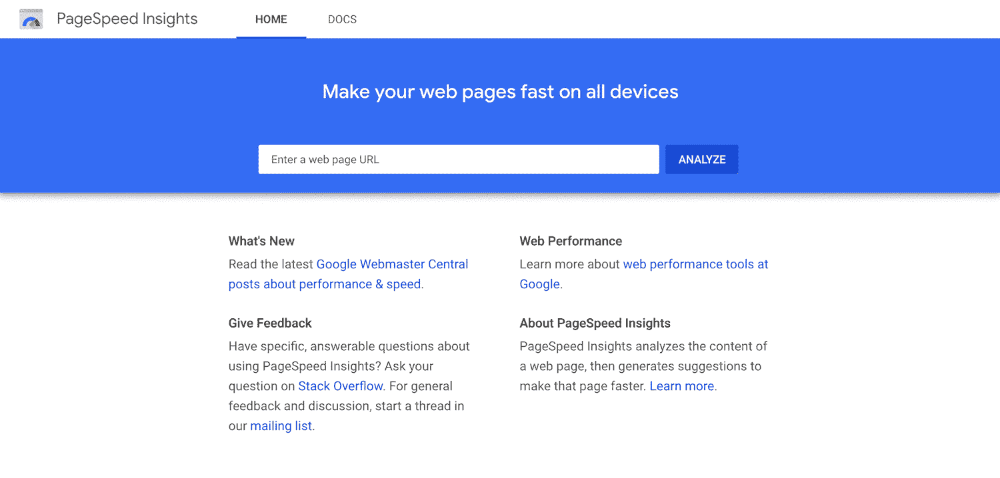

Google PageSpeed Insights


然后，Google 会根据几个性能优化的最佳实践，为您测试过的网站提供一个满分为 100 分的总分。


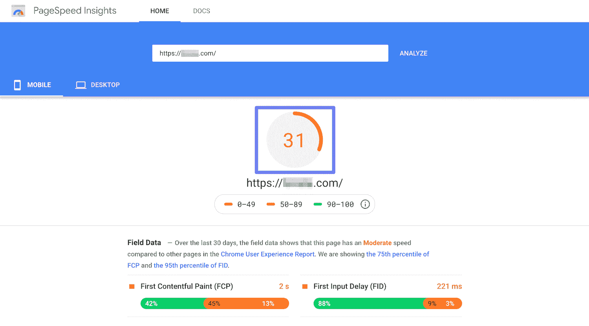

Google PageSpeed Insights score


除了这个结果，你还会看到谷歌关于如何提高你的性能的几个建议(因此，你的 PageSpeed Insights 分数也是如此)。

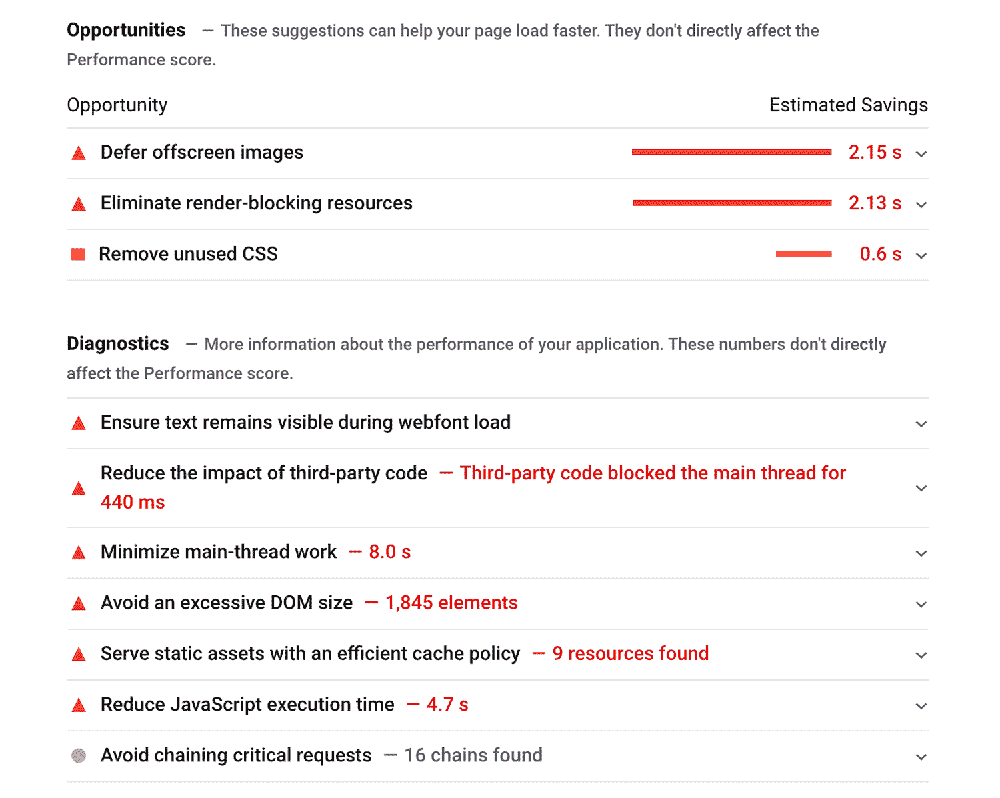

Google PageSpeed Insights recommendations


截至 2018 年，PageSpeed Insights 得分是通过 [Lighthouse](https://developer.chrome.com/docs/lighthouse/overview/) 计算的，这是谷歌开源的自动化工具，用于提高网页的整体质量。这个平台可以评估各种因素，包括性能、可访问性、渐进式网络应用等等。

要查看 Lighthouse 对你网站的综合评估，你可以使用[谷歌的测量工具](https://web.dev/measure/):

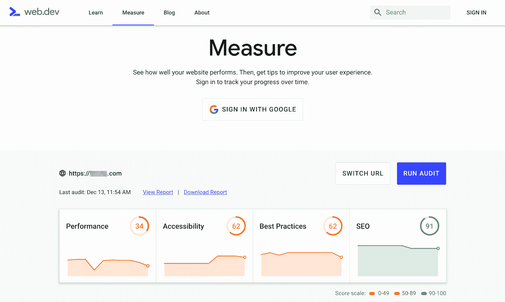

Google Webmasters Measure auditing tool


除了进行类似 Google PageSpeed Insights 的性能审计之外，你还将获得可访问性、最佳实践和[搜索引擎优化(SEO)](https://kinsta.com/blog/what-does-seo-stand-for/) 的分数。
T3】

## 在 Google PageSpeed Insights 中获得 100/100 分的真相

正如我们在本文开头提到的，我们看到许多网站所有者和开发者痴迷于获得完美的 PageSpeed Insights 分数。不幸的是，这些人往往忽略了测试结果的更重要的方面:推荐。

虽然你当然应该努力尽可能地提高你网站的加载时间，但是在 Google PageSpeed Insights 中获得 100/100 分实际上并不那么重要。首先，这甚至不是对性能的终极测试。

与 PageSpeed Insights 不同， [Pingdom Tools](https://kinsta.com/blog/pingdom-speed-test/) 使您能够从不同的位置测试您的站点的性能:

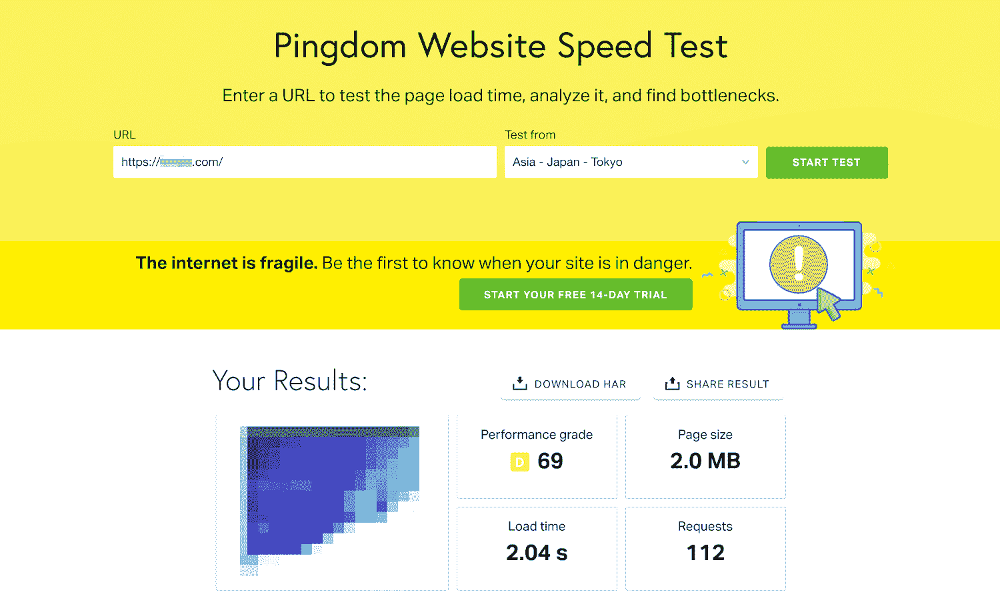

Pingdom Tools speed test results


你也可以在平台上运行测试，比如 [GTmetrix](https://kinsta.com/blog/gtmetrix-speed-test/) (它结合了你从 PageSpeed Insights 和 [YSlow](http://yslow.org/) 得到的分数)和 [WebPageTest](https://www.webpagetest.org/) 。很有可能，您在这些不同工具上的分数不会完全匹配，这向您显示了这些数字有多么随意。

真正重要的是你网站的实际速度。客观地说，我们见过平均加载时间不到 500 毫秒的网站(这是非常快的速度！)在 PageSpeed Insights 上没有 100/100 分。

另一个应该影响你的速度优化方法的因素是你站点的[感知性能](https://blog.teamtreehouse.com/perceived-performance)。你的访客并不关心你的谷歌页面速度洞察力得分是多少。他们只是想尽快浏览你的内容。

使用 Google PageSpeed Insights 测试网站性能的真正目的不是为了获得高分。取而代之的是找到你网站上的问题点，这样你就可以优化它们，减少你的实际和感知的加载时间。


## 谷歌如何使用 PageSpeed Insights？

除了影响你网站的用户体验(UX)，[性能也在 SEO 中发挥作用](https://kinsta.com/blog/conversion-rate-optimization-tips/#page-load-speed)。鉴于 PageSpeed Insights 是由世界上最大和最受欢迎的搜索引擎运营的，有理由认为你的分数可能会对你的搜索引擎结果页面(SERP)排名产生一些影响(至少对谷歌本身而言)。

事实是，谷歌*确实使用 PageSpeed Insights 来确定排名——有点像。网站速度是一个排名因素，简单明了。你的表现测试分数可以让你很好地了解你在这方面的情况。*

然而，谷歌考虑的不仅仅是页面顶部圆圈中的数字。达到 100/100 并不能保证你在 SERPs 上名列前茅。

坐好，放松，提高你的页面速度——我们会负责 WordPress 缓存，所以你不必担心。[免费试用 kin sta](https://hubs.ly/H0pklC_0)。

也就是说，你仍然可以在改进你的 SEO 时使用 PageSpeed Insights 结果。例如，自 2018 年以来，[移动页面速度一直是谷歌的排名因素](https://webmasters.googleblog.com/2018/01/using-page-speed-in-mobile-search.html)。您会注意到您的性能测试为您的站点的桌面和移动版本都提供了数据:

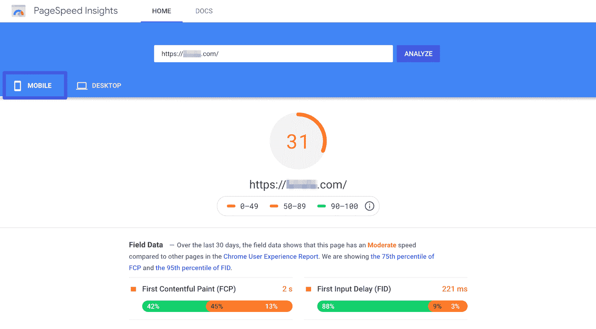

Mobile tab in Google PageSpeed Insights


由于超过 73%的移动互联网用户声称他们遇到过加载时间过长的网站，谷歌页面速度洞察**移动**标签中的信息是非常宝贵的。使用这里的建议来[减少智能手机和其他设备的加载时间](https://kinsta.com/learn/speed-up-wordpress/)会给你带来竞争优势。

## Google PageSpeed Insights 推荐(24 种提高性能的方法)

在这篇文章中，我们已经讨论了很多关于 Google PageSpeed Insights 的建议。它们是你的性能测试结果的真正内容，比你的实际分数更有价值。这就是为什么我们把这篇文章的其余部分献给他们。

然而，在我们深入研究个人建议之前，你需要了解你的**现场数据**和**实验室数据**之间的差异。前者将你的网站与过去 30 天 Chrome 用户体验报告中的其他网站进行比较。

还有两个图表显示了您的平均[第一次内容丰富的绘画(FCP)](https://developer.chrome.com/docs/lighthouse/performance/first-contentful-paint/) 和[第一次输入延迟(FID)](https://web.dev/fid/) 的位置:

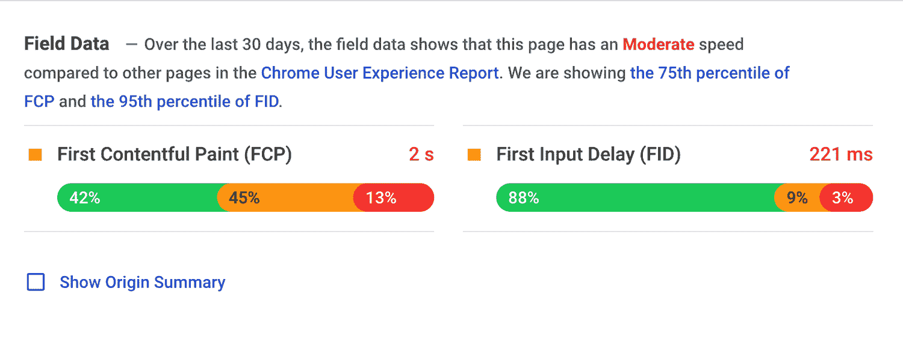

Google PageSpeed Insights Field Data


在上图中，我们站点的 FCP 大约与第 75 百分位的 45%的站点相同，我们的 FID 大约与第 95 百分位的 9%相同。

**实验室数据**显示了模拟页面负载的具体数据:

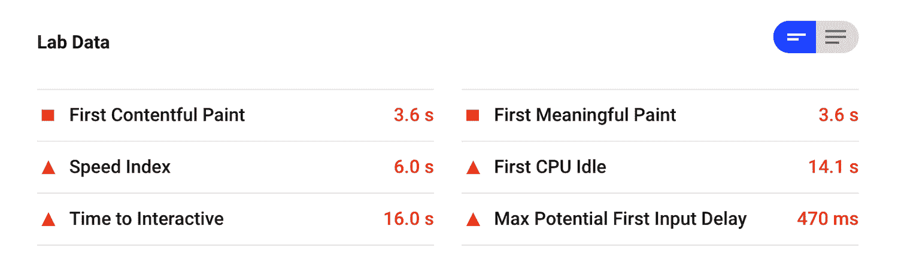

Google PageSpeed Insights Lab Data


你会注意到我们的**现场数据**和**实验室数据** [并不完全匹配](https://developers.google.com/speed/docs/insights/v5/about#faq)。这很正常。**实验室数据**是在固定条件下创建的，而**现场数据**使用随时间收集的实际装载速度。

结合起来看，**现场数据**和**实验室数据**应该可以让你知道你的站点的实际加载时间。正如我们之前提到的，这甚至比你的总页面速度分数更重要，所以你要注意这些数字。

在你考虑了这些信息之后，是时候开始用 Google PageSpeed 的建议来提高你的网站性能了。

T3】

### 1.消除渲染阻塞资源

来自 Google PageSpeed Insights 的一个更常见的建议是[消除渲染阻塞资源](https://kinsta.com/blog/eliminate-render-blocking-javascript-css/):

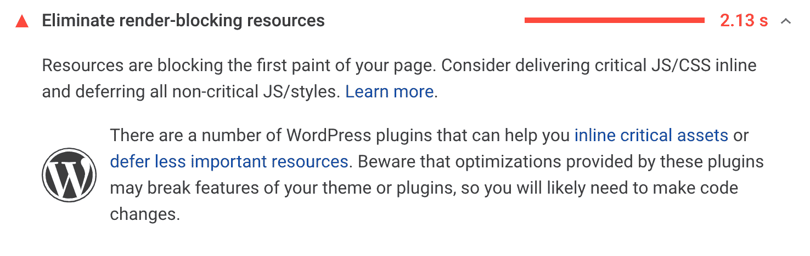

Eliminate render-blocking resources recommendation


这是指 JavaScript 和 CSS 脚本阻止你的页面快速加载。访问者的浏览器必须先下载并处理这些文件，然后才能显示页面的其余部分，所以在“折叠线以上”放置大量文件会对网站的速度产生负面影响。

你可以在我们的[消除渲染阻塞脚本](https://kinsta.com/blog/eliminate-render-blocking-javascript-css/)指南中了解更多关于这个问题的信息。就谷歌而言，有两种解决方案你应该考虑:

*   如果您没有很多 JavaScript 或 [CSS](https://kinsta.com/blog/wordpress-css/) ，您可以内联它们来消除这个警告。这个过程指的是将 JavaScript 和/或 CSS 合并到 HTML 文件中。你可以用像[自动优化](https://kinsta.com/blog/autoptimize-settings/)这样的插件来做到这一点。然而，这实际上只对非常小的站点有效。大多数 [WordPress](https://kinsta.com/knowledgebase/what-is-wordpress/) 网站都有足够多的 JavaScript，这种方法实际上会降低你的速度。
*   另一个选择是[推迟你的 JavaScript](https://kinsta.com/blog/defer-parsing-of-javascript/) 。该属性在 HTML 解析过程中下载 JavaScript 文件，但只在解析完成后执行。此外，具有该属性的脚本按照在页面上出现的顺序执行。

您将在 PageSpeed 结果中的建议下方找到受此问题影响最大的资源列表。

**查看[这段视频](https://www.youtube.com/watch?v=ElpcjGBgTGk)了解更多关于如何消除渲染阻塞资源:**


### 2.避免链接关键请求

[链接关键请求](https://developer.chrome.com/docs/lighthouse/performance/critical-request-chains/)的概念与关键呈现路径(CRP)和浏览器如何加载页面有关。某些元素——比如我们上面讨论的 JavaScript 和 CSS 必须在页面可见之前完全加载。

作为该建议的一部分，Google PageSpeed Insights 将向您显示您正在分析的页面上的请求链:

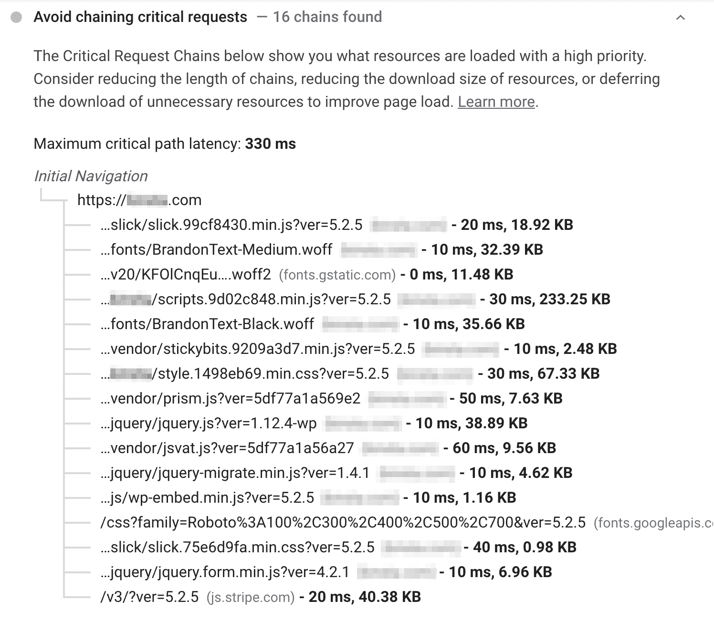

Avoid chaining critical requests recommendation


此图将向您展示在您的页面可见之前必须满足的一系列相关请求。它还会告诉您每个资源的大小。理想情况下，您希望最小化相关请求的数量，以及它们的大小。

本帖中讨论的其他建议涵盖了实现这些目标的几种方法，包括:

*   消除渲染阻塞资源
*   推迟屏幕外图像
*   缩小 JavaScript 和 CSS

此外，您可以优化资产加载的顺序，以缩短 CRP。这意味着将文件夹上方的内容移动到 HTML 文件的顶部。你可以在我们的文章“如何在 WordPress 中优化关键渲染路径”中了解更多关于优化 CRP 的信息。

需要注意的重要一点是，您需要处理的关键请求链的数量并不多。Google PageSpeed Insights 不像它的许多其他建议那样，将这项审核视为“通过”或“失败”。这些信息只是为了帮助您缩短加载时间。

### 3.保持低请求数和小传输量

浏览器加载页面的请求越多，服务器返回的响应资源越多，网站加载的时间就越长。因此，谷歌建议你尽量减少请求的数量，减少资源的规模是有道理的。

像**避免链接关键请求**建议一样，这一条不会导致“通过”或“失败”。相反，您将只看到请求数量及其大小的列表:

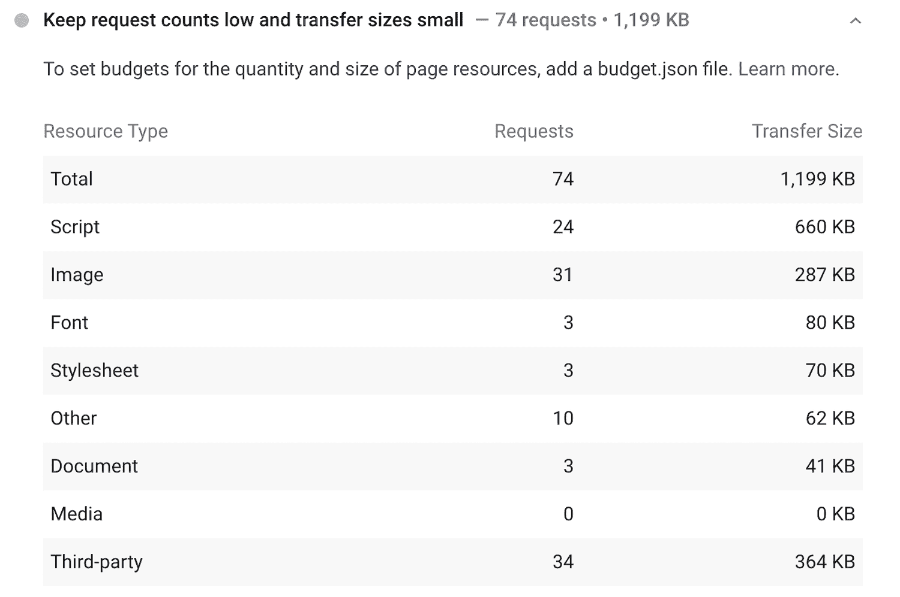

Keep request counts low and transfer sizes small recommendation


没有需要记住的理想的请求数量或最大大小。相反，谷歌建议你通过建立绩效预算来为自己设定这些标准。这是一组已定义的目标，可能与以下方面相关:

*   最大图像尺寸
*   使用的 web 字体数量
*   你调用了多少外部资源
*   脚本和框架的大小

创建绩效预算给你一套标准，让你对自己负责。当你检查你的预算时，你就可以决定是否消除或优化资源来坚持你预定的方针。你可以在谷歌自己的指南中了解更多关于创建一个的信息。

### 4.缩小 CSS

CSS 文件通常比实际需要的要大，以便于人们阅读。它们可能包括各种回车符和空格，这些对于计算机理解它们的内容是不必要的。

缩小 CSS 是通过删除不必要的字符、空格和重复来压缩文件的过程。谷歌推荐这种做法，因为它减少了你的 CSS 文件大小，因此可以提高加载速度:

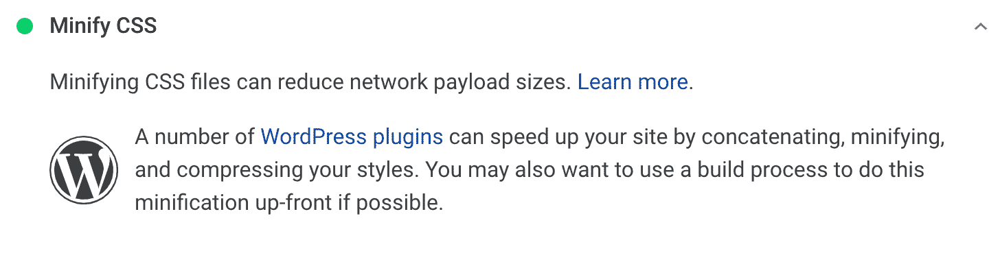

Minify CSS recommendation


这些速度上的好处就是为什么 Kinsta 在 [MyKinsta 仪表板](https://kinsta.com/mykinsta/)中内置了一个[代码缩减功能](https://kinsta.com/help/kinsta-cdn-code-minification/)。客户可以选择为他们的 CSS 和 JavaScript 文件选择自动缩减代码，无需手动操作就可以加速他们的网站。

如果你不是 Kinsta 的客户，我们建议你使用一个插件，比如[自动优化](https://kinsta.com/blog/autoptimize-settings/#css-options)或者 [WP 火箭](https://wp-rocket.me/)来缩小你的 CSS 文件。

### 5.缩小 JavaScript

正如您可以通过缩小来减小 CSS 文件大小一样，这同样适用于您的 JavaScript 文件:

## 注册订阅时事通讯


### 想知道我们是怎么让流量增长超过 1000%的吗？

加入 20，000 多名获得我们每周时事通讯和内部消息的人的行列吧！

[Subscribe Now](#newsletter)

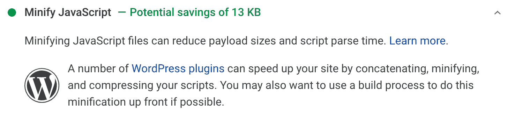

Minify JavaScript recommendation


Autoptimize 或 WP Rocket 也可以为你的 WordPress 站点处理这个任务。

### 6.移除未使用的 CSS

样式表中的任何代码都是为了让页面对用户可见而必须加载的内容。如果你的网站上有实际上没有用的 CSS，它会对你的性能造成不必要的消耗。

这就是为什么谷歌建议[删除任何未使用的 CSS](https://developer.chrome.com/docs/lighthouse/performance/unused-css-rules/) :

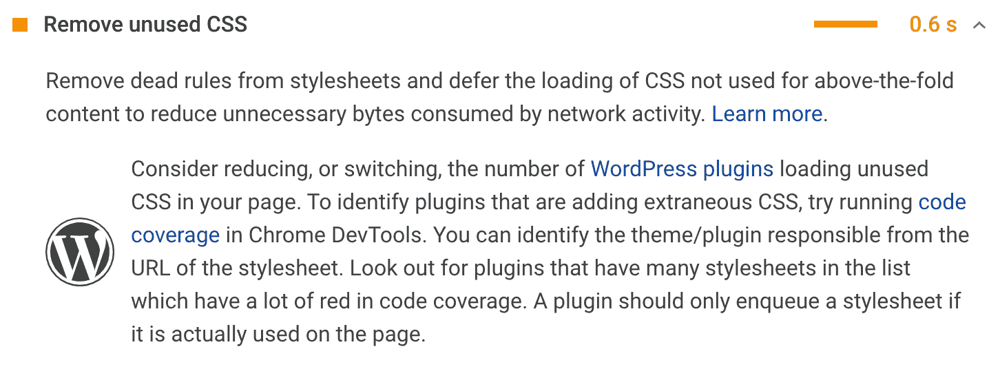

Remove unused CSS recommendation


这里的解决方案本质上与消除渲染阻塞 CSS 的解决方案相同。您可以以任何对您的页面最有意义的方式内联或延迟样式。你也可以使用诸如 [Chrome DevTools](https://developer.chrome.com/docs/devtools/) 到[这样的工具来找到需要优化的未使用的 CSS](https://developer.chrome.com/docs/devtools/coverage/) 。

### 7.最小化主线程工作

“主线程”是用户浏览器的主要元素，负责将代码转换成访问者可以与之交互的网页。它解析并执行 HTML、CSS 和 JavaScript。此外，它还负责处理用户交互。

这意味着，当主线程处理站点代码时，它也不能处理用户请求。如果你的网站的主线程工作时间太长，这将导致糟糕的 UX 和缓慢的页面加载时间。

Google PageSpeed 将标记那些完成主线程工作所需时间超过 4 秒的页面，并呈现一个可用的网页:

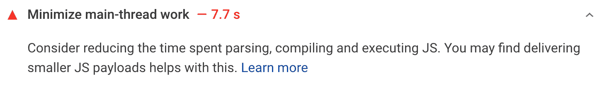

Minimize main-thread work recommendation


减少主线程工作量的一些方法已经在这篇文章的其他部分讨论过了，包括:

*   精简您的代码
*   移除未使用的代码
*   实现缓存

但是，您可能也想考虑代码拆分。这个过程包括将 JavaScript 分解成包，在需要时执行，而不是要求浏览器在页面变得交互之前加载所有的包。

[Webpack](https://webpack.js.org/guides/code-splitting/) 常用来实现代码拆分。请注意，这是一项相当高级的技术，初学者通常应该独自承担。

### 8.减少 JavaScript 执行时间

JavaScript 执行通常是主线程工作的最大贡献者。PageSpeed Insights 有一个单独的建议，提醒您该任务是否对您的网站性能有重大影响:

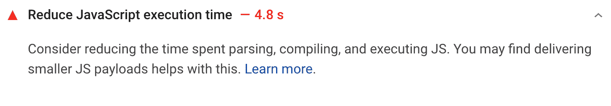

Reduce JavaScript execution time recommendation


上面建议的减少主线程工作的方法也应该可以解决 PageSpeed 结果中的这个警告。

### 9.缩短服务器响应时间(TTFB)

到达第一个字节的时间(TTFB)是浏览器在发出请求后从站点服务器接收到第一个字节数据所需的时间。虽然这和你的整体站点速度不一样，但是低 TTFB 对你的站点性能有好处是可以理解的。

因此，减少服务器响应时间是 Google PageSpeed Insights 的建议之一。如果您能够获得较低的 TTFB，您将在**通过审核**下看到以下消息:

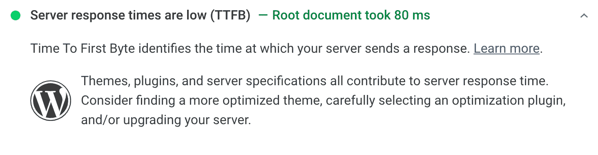

Server response times are low message


有几个因素会影响你的 TTFB。降低它的一些策略包括:

*   选择一个[高质量的虚拟主机提供商](https://kinsta.com/plans/)，[专注于速度](https://kinsta.com/blog/fastest-wordpress-hosting/)
*   使用轻量级主题和插件
*   减少网站上安装的插件数量
*   利用内容交付网络(CDN)
*   实现浏览器缓存
*   选择实体域名系统(DNS)提供商

我们在 TTFB 上的[帖子是一个很好的资源，可以获得这方面优化的更多细节。](https://kinsta.com/blog/ttfb/)

### 10.适当调整图像大小

像图像这样的媒体文件会严重影响网站的性能。适当地调整它们的大小是减少加载时间的简单方法:

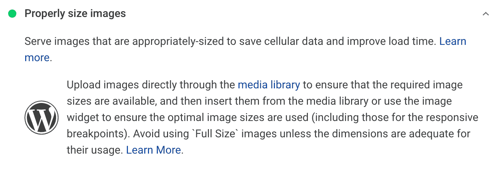

Properly size images recommendation


如果你的页面包含的图片比实际需要的要大，CSS 可以用来适当地调整图片的大小。这比最初简单地加载正确大小的图像需要更长的时间，因此会影响页面的性能。

要解决这个问题，你可以上传适当大小的图像，或者使用“响应图像”。这包括为各种设备创建不同大小的图像。

您可以使用**[srcset](https://developer.mozilla.org/en-US/docs/Learn/HTML/Multimedia_and_embedding/Responsive_images)**[属性](https://developer.mozilla.org/en-US/docs/Learn/HTML/Multimedia_and_embedding/Responsive_images)来完成此操作，该属性被添加到 **< img >** 标签中，以指定不同大小的备选图像文件。浏览器可以读取这个列表，确定哪个选项最适合当前屏幕，并提供那个版本的图像。

例如，假设您有一个标题图像，您想使它具有响应性。你可以上传 800、480 和 320 像素宽的三个版本。然后应用 **srcset** 属性，如下所示:

```

```

**srcset** 属性指定不同的可用文件，而**大小**属性告诉浏览器基于当前屏幕大小应该使用哪一个。

### 11.延迟屏幕外图像

延迟屏幕外图像的过程通常被称为“延迟加载”。这意味着浏览器不会在显示上面的内容之前加载页面上的所有图像，它只会加载那些立即可见的图像。

在页面变得可见之前加载得越少意味着性能越好，这也是 Google 推荐这种方法的原因:

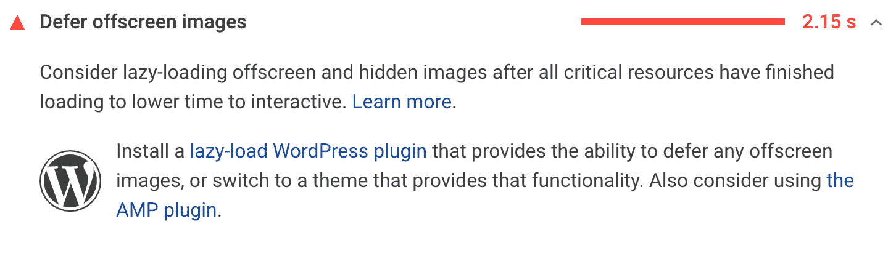

Defer offscreen images recommendation


有几个 WordPress 插件是专门为懒加载做的，包括 WP 火箭的 [a3 懒加载](https://wordpress.org/plugins/a3-lazy-load/)和[懒加载。各种镜像和性能优化插件如](https://wordpress.org/plugins/rocket-lazy-load/)[auto timize 也有懒加载功能](https://kinsta.com/blog/autoptimize-settings/#image-optimization-in-autoptimize)。查看我们关于在 WordPress 上惰性加载图片和视频的完整指南。

### 12.高效编码图像

正如我们在这篇文章前面提到的，图片对你的网站性能有很大的影响。你可能希望[考虑的最基本的优化最佳实践之一是压缩](https://kinsta.com/blog/lossy-compression/)，它可以帮助减少你的文件大小，这样它们会加载得更快。这也是遵循谷歌推荐的**高效编码图像的主要方法**:

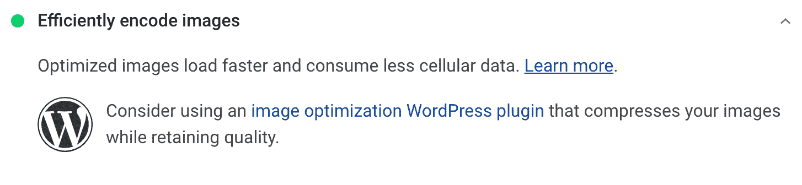

Efficiently encode images recommendation


关键是实现尽可能小的文件大小，而不牺牲图像本身的质量。像 [Imagify](https://wordpress.org/plugins/imagify/) 和 [Smush](https://wordpress.org/plugins/wp-smushit/) 这样的插件可以帮助完成这项任务。你可以在我们的[图像优化指南](https://kinsta.com/blog/optimize-images-for-web/)中了解更多。

影响您是否通过**高效编码图像**审核的其他建议包括:

*   以正确的尺寸提供图像
*   实现延迟加载(延迟屏幕外图像)
*   将图像转换为新一代文件格式，如 WebP
*   将视频格式用于动画内容，如 gif

除了压缩你的图像，你还可以按照本文其他地方描述的步骤来实现这些建议。

### 13.以下一代格式提供图像

有些图像文件格式加载速度比其他格式更快。不幸的是，它们不是你常见的 **PNG** 或 **JPEG** 格式。 [**WebP** 图片](https://kinsta.com/blog/webp/)正在成为新的标准，如果你的图片不符合标准，谷歌页面速度会通知你:

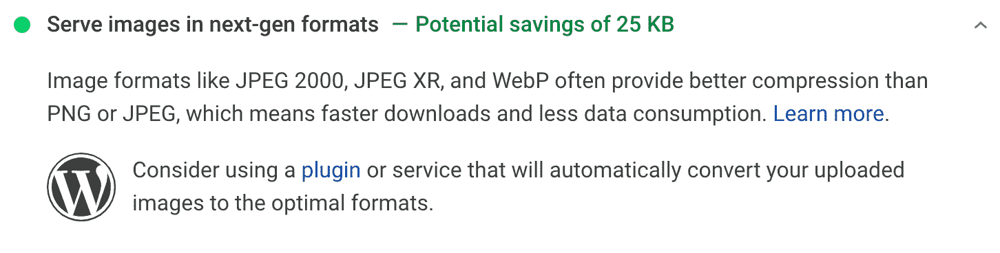

Serve images in next-gen formats recommendation


这似乎是一个很难满足的建议，因为你的网站上可能已经有很多图片了。幸运的是，有插件可以帮助。例如，Imagify 和 Smush 都提供了 WebP 转换功能。

### 14.将视频格式用于动画内容

在各种情况下，gif 可以是视觉内容的有效形式。教程走查、专题评论，甚至幽默的动画都可以提升你的文章，使它们对读者来说更有趣、更有价值。

不幸的是，这些好处是以牺牲您的性能为代价的。gif 的加载要求很高，这就是为什么 PageSpeed Insights 建议提供视频内容:

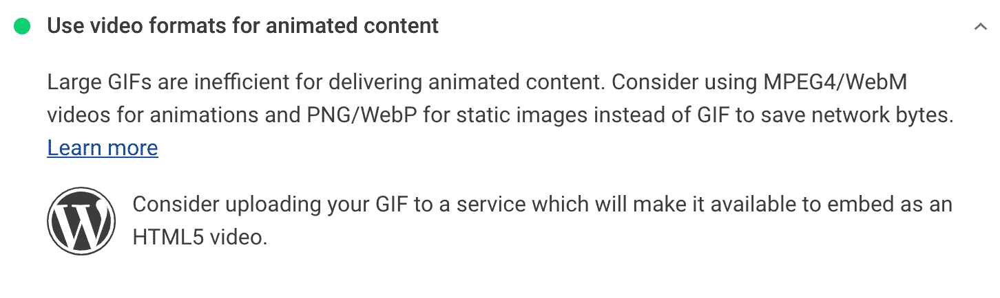

Use video formats for animated content recommendation


不幸的是，将 gif 转换成视频格式并不是最简单的过程。首先，您必须决定要使用哪种类型的视频:

*   MP4: 生成的文件稍大，但兼容[大多数主流浏览器](https://kinsta.com/browser-market-share/)。
*   **WebM:** 优化程度最高的视频格式，尽管它的浏览器兼容性有限。

一旦你做出了对你的网站最有意义的选择，你就需要转换文件格式。最好的方法是通过命令行。要开始，安装 [FFmpeg](https://www.ffmpeg.org/) 。这是一个用于转换文件格式的开源工具:

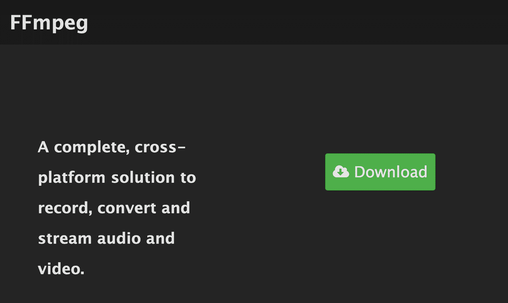

FFmpeg file format conversion tool for video and audio


然后，打开命令行界面，运行以下命令:

```
ffmpeg -i input.gif output.mp4
```

这将把文件名为 **input.gif** 的 GIF 转换成文件名为【output.mp4】T2 的 MP4 视频。然而，改变格式仅仅是开始。现在，您需要将生成的视频嵌入到您的网站上，使其看起来像一个动画 GIF。

#### 为动画嵌入视频内容

如果你以前看过 GIF，你可能会注意到，它们与普通视频略有不同。他们通常自动播放并循环播放，而且总是没有声音。在你的网站上嵌入新的 MP4 或 WebM 文件不会产生这些特性。

然而，你可以用一些非常简单的代码重新创建它们。将视频上传到媒体库，然后将以下内容添加到要包含 GIF 的页面或帖子中:

```
<video autoplay loop muted playsinline>
<source src="output.mp4" type="video/mp4">
</video>
```

这将把指定的属性应用到您的视频，使它看起来更像 GIF。只需修改文件名和类型以匹配您的资源。关于这个主题的更多细节，我们建议阅读谷歌关于将 gif 转换成视频的指南。

### 15.确保在网页字体加载过程中文本保持可见

像图像一样，字体往往是需要很长时间才能加载的大文件。在某些情况下，浏览器可能会隐藏你的文本，直到你使用的字体完全加载，这将导致谷歌页面速度洞察的建议:


Ensure text remains visible during webfont load recommendation


[谷歌建议](https://developer.chrome.com/docs/lighthouse/performance/font-display/)你通过在你的 **@font-face** 风格中应用字体显示 API **swap** 指令来解决这个问题。为此，访问您的样式表( **style.css** )并在 **@font-face** 下的 **src** 属性后添加以下内容:

字体显示:交换

你可以在我们的文章“ *[如何在 WordPress](https://kinsta.com/blog/how-to-change-font-in-wordpress/#optimizing-fonts-for-performance)* 中改变字体”和我们的[本地字体深度指南](https://kinsta.com/blog/local-fonts/)中了解更多关于优化网页字体的信息。

### 16.启用文本压缩

Google PageSpeed Insights' **启用文本压缩**推荐使用 GZIP 压缩:

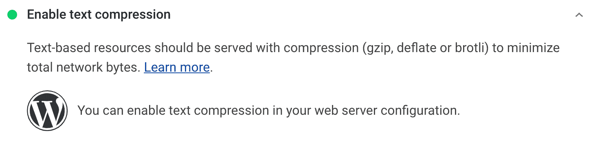

Enable text compression recommendation


在某些情况下(如上图所示)，服务器会自动启用文本压缩。如果你的网站不是这种情况，你有几个选择来遵循这个建议。

首先是安装一个具有 GZIP 压缩功能的插件。如果你愿意付钱的话，WP 火箭是一个可行的解决方案。

您也可以手动压缩文本。这就涉及到编辑你的 [**。htaccess** 文件](https://kinsta.com/knowledgebase/wordpress-htaccess-file/)，这可能有风险，所以确保你手头有最近的备份。

大多数 WordPress 站点运行在 Apache 服务器上。[启用 GZIP 压缩](https://kinsta.com/blog/enable-gzip-compression/)的代码如下所示:

```
<IfModule mod_deflate.c>
  # Compress HTML, CSS, JavaScript, Text, XML and fonts
  AddOutputFilterByType DEFLATE application/javascript
  AddOutputFilterByType DEFLATE application/rss+xml
  AddOutputFilterByType DEFLATE application/vnd.ms-fontobject
  AddOutputFilterByType DEFLATE application/x-font
  AddOutputFilterByType DEFLATE application/x-font-opentype
  AddOutputFilterByType DEFLATE application/x-font-otf
  AddOutputFilterByType DEFLATE application/x-font-truetype
  AddOutputFilterByType DEFLATE application/x-font-ttf
  AddOutputFilterByType DEFLATE application/x-javascript
  AddOutputFilterByType DEFLATE application/xhtml+xml
  AddOutputFilterByType DEFLATE application/xml
  AddOutputFilterByType DEFLATE font/opentype
  AddOutputFilterByType DEFLATE font/otf
  AddOutputFilterByType DEFLATE font/ttf
  AddOutputFilterByType DEFLATE image/svg+xml
  AddOutputFilterByType DEFLATE image/x-icon
  AddOutputFilterByType DEFLATE text/css
  AddOutputFilterByType DEFLATE text/html
  AddOutputFilterByType DEFLATE text/javascript
  AddOutputFilterByType DEFLATE text/plain
  AddOutputFilterByType DEFLATE text/xml

  # Remove browser bugs (only needed for really old browsers)
  BrowserMatch ^Mozilla/4 gzip-only-text/html
  BrowserMatch ^Mozilla/4\.0[678] no-gzip
  BrowserMatch \bMSIE !no-gzip !gzip-only-text/html
  Header append Vary User-Agent
</IfModule>
```

你应该把它加在你的**中的 **#END** 之后。htaccess** 文件。如果你碰巧在 Nginx 服务器上有你的 WordPress 站点，你应该把下面的代码添加到你的 **nginx.conf** 文件中:

```
36 gzip on;
37 gzip_disable "MSIE [1-6]\.(?!.*SV1)";
38 gzip_vary on;
39 gzip_types text/plain text/css text/javascript application/javascript application/x-javascript;
```

如果你想检查你的网站的文本压缩，我们建议使用一个工具，如 [GiftOfSpeed](https://www.giftofspeed.com/gzip-test/) :

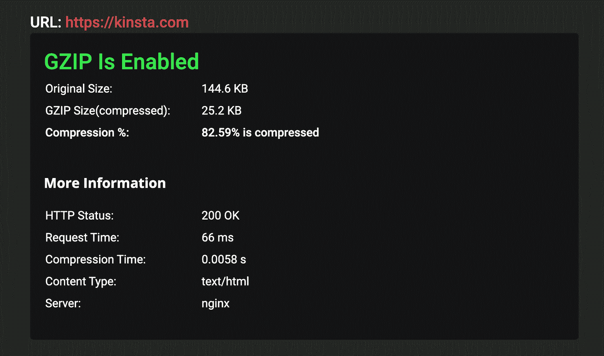

GiftOfSpeed GZIP compression check


这将让你知道 GZIP 压缩是否已经成功实现，以及你的网站运行在什么类型的服务器上，以及其他一些关键细节。

### 17.预连接到所需的原点

很有可能你的网站上至少有一个第三方资源——Google Analytics 就是一个常见的例子。浏览器与这些资源建立连接需要时间，这会降低你的加载速度。

使用 **preconnect** 属性可以马上告诉浏览器你的页面上有第三方脚本需要加载。然后，请求它们的过程可以尽快启动，从而提高您的性能。

如果谷歌认为你的页面可以从这项技术中受益，你会看到**pre connect to required origins**建议:

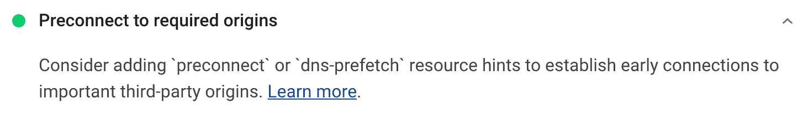

Preconnect to required origins recommendation


有几种方法可以实现这个优化策略。如果你喜欢编辑你的 WordPress 主题文件，你可以给你的**header.php**文件添加一个链接标签。这里有一个例子:

```

```

在这种情况下，标签告诉浏览器他们需要尽快建立到**example.com**的连接。Google PageSpeed Insights 将列出您应该添加带有预连接属性的链接标签的任何相关资源。

另一个选择是使用插件来达到同样的效果。[perfmates](https://perfmatters.io/)包含预连接功能(声明:我是 perfmates 的创始人之一)。WP Rocket 和 [Pre* Party 资源提示](https://wordpress.org/plugins/pre-party-browser-hints/)包含类似的功能。

### 18.预加载密钥请求

类似于**pre connect to required origins**的建议，遵循这个建议可以使浏览器必须向站点服务器发出的请求数量最小化。然而，**预加载关键请求**指的是在你自己的服务器上加载关键资产，而不是连接到第三方资源:

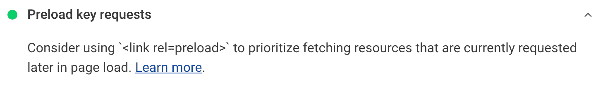

Preload key requests recommendation


实现这种技术也非常类似于前面的建议。您可以将指定 PageSpeed Insights 中列出的资源的链接标签添加到您的**header.php**文件中:

```

```

您还可以使用 Perfmatters、WP Rocket 或 Pre* Party 资源提示来合并此标签。

### 19.避免多次页面重定向

当您希望一个 URL 指向另一个 URL 时，可以使用重定向。当你在你的站点上移动或删除一个页面时，它们通常被使用。虽然一般来说使用重定向没有什么问题，但是它们确实会导致加载时间的额外延迟。

如果你的网站上有太多的重定向，你可能会在 Google PageSpeed Insights 中看到这个建议:


Avoid multiple page redirects recommendation


对于这个建议，您唯一能做的就是确保您只在绝对必要的时候使用重定向。你可以在我们的文章“提高性能的最佳实践 ”中了解更多关于创建它们的过程。

### 20.利用高效的缓存策略服务静态资产

如果你已经使用 Google PageSpeed Insights 有一段时间了，你可能会更好地了解这个建议，因为**利用浏览器缓存**警告。在版本 5 中，它现在被标记为**用高效的缓存策略**服务静态资产:

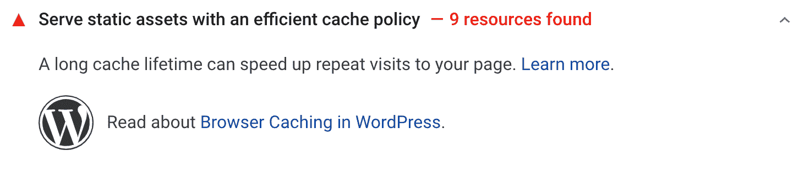

Server static assets with an efficient cache policy recommendation


这个建议有几个层面我们需要仔细研究。首先是“缓存”的含义。简而言之，这是一个浏览器保存页面副本的过程，这样在以后的访问中可以更快地加载它们。

WordPress 站点实现缓存最常见的方式是用插件实现[。WP 火箭和](https://kinsta.com/blog/wordpress-caching-plugins/) [W3 总缓存](https://kinsta.com/blog/w3-total-cache/)是热门选项。然而，一些主机提供商—[,包括我们这里的 Kinsta](https://kinsta.com/blog/wordpress-cache/) ,通过他们的服务器实现缓存。在你安装一个缓存插件之前，一定要检查你的主机是否是这种情况。

坐好，放松，提高你的页面速度——我们会负责 WordPress 缓存，所以你不必担心。[免费试用 kin sta](https://hubs.ly/H0pklC_0)。

一旦你为你的站点启用了缓存，你就可以担心这个建议的第二部分，也就是你的缓存策略的“效率”。浏览器会定期清理缓存，用更新的副本刷新它们。

理想情况下，您希望这个时间段更长而不是更短。如果你每隔几个小时就从浏览器缓存中清除你的站点，那就违背了使用这种技术的初衷。您可以使用 **Cache-Control** 和 **Expires** 头来优化您的缓存过期时间。

#### 添加缓存控制头

使用以下代码在 Nginx 中添加缓存控制头:

```
location ~* \.(js|css|png|jpg|jpeg|gif|svg|ico)$ {
 expires 30d;
 add_header Cache-Control "public, no-transform";
}
```

您应该将它添加到服务器的配置文件中。在上面的示例中，指定的文件类型设置为 30 天后过期。

那些拥有 [Apache 服务器](https://kinsta.com/knowledgebase/what-is-apache/)的用户应该在他们的**中使用这个片段。改为 htaccess** 文件:

```
<filesMatch ".(ico|pdf|flv|jpg|jpeg|png|gif|svg|js|css|swf)$">
Header set Cache-Control "max-age=84600, public"
</filesMatch>
```

在 **#BEGIN WordPress** 之前或 **#END WordPress** 之后添加此代码。在此示例中，缓存过期时间设置为 84，600 秒。

#### 添加过期标题

缓存控制头文件现在几乎是标准的。然而，有一些工具(包括 GTMetrix)仍然检查**过期**报头。

您可以通过将以下内容合并到您的服务器块中来将 expires 头添加到 Nginx 服务器中:

```
location ~*  \.(jpg|jpeg|gif|png|svg)$ {
        expires 365d;
    }

    location ~*  \.(pdf|css|html|js|swf)$ {
        expires 2d;
    }
```

您应该根据文件类型设置不同的到期时间。如果您将这段代码添加到您的**中，Apache 服务器将产生相同的结果。htaccess** 文件:

```
## EXPIRES HEADER CACHING ##
<IfModule mod_expires.c>
ExpiresActive On
ExpiresByType image/jpg "access 1 year"
ExpiresByType image/jpeg "access 1 year"
ExpiresByType image/gif "access 1 year"
ExpiresByType image/png "access 1 year"
ExpiresByType image/svg "access 1 year"
ExpiresByType text/css "access 1 month"
ExpiresByType application/pdf "access 1 month"
ExpiresByType application/javascript "access 1 month"
ExpiresByType application/x-javascript "access 1 month"
ExpiresByType application/x-shockwave-flash "access 1 month"
ExpiresByType image/x-icon "access 1 year"
ExpiresDefault "access 2 days"
</IfModule>
## EXPIRES HEADER CACHING ##
```

同样，你应该在 **#BEGIN WordPress** 之前或者 **#END WordPress** 之后添加这段代码。

#### 谷歌分析的高效缓存

具有讽刺意味的是，为了跟踪用户行为，您可能已经添加到页面的标题中的 [Google Analytics 脚本的缓存过期时间只有两个小时。这很可能是因为，如果对平台进行了更新，用户将可以快速访问这些更改。](https://kinsta.com/blog/google-analytics-wordpress/)

该脚本将出现在需要您关注的资源列表中，在**使用高效缓存策略服务静态资产**建议下。由于它属于第三方，你不能用**缓存控制**或**过期**头来改变有效期。

如果这是本建议中列出的唯一脚本，您仍然可以通过审核:

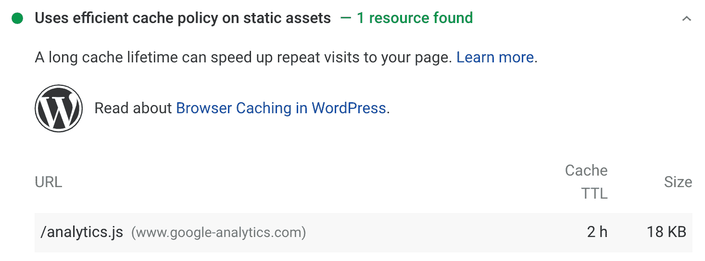

Passed efficient cache policy audit


然而，正如我们在这篇文章中注意到的，你的页面速度分数没有你的实际表现和感觉表现重要。为了有效地提供这种资源，你可以考虑在本地托管 Google Analytics。

像[Complete Analytics Optimization Suite(CAOS)](https://wordpress.org/plugins/host-analyticsjs-local/)和 Perfmatters 这样的插件将使您能够做到这一点。你可以在我们的[页面速度建议](https://kinsta.com/blog/leverage-browser-caching/)完整指南中阅读更多关于这个过程的信息。

### 21.减少第三方代码的影响

我们已经提到了第三方脚本对您的性能产生负面影响并导致 PageSpeed Insights 审计失败的几种不同方式。理想情况下，最好限制你对这些工具的依赖，以防止不良影响。

然而，在某些情况下，满足站点需求的最佳解决方案是加入第三方脚本。谷歌分析是一个很好的例子。其他包括:

*   [社交媒体分享按钮](https://kinsta.com/blog/wordpress-social-media-plugins/)和供稿
*   YouTube 视频嵌入
*   [广告和其他内容的内嵌框架](https://kinsta.com/blog/wordpress-iframe/)
*   JavaScript、字体和其他元素的库

在你认为有必要使用第三方脚本的情况下，减少它对你的网站性能的影响是很重要的，因为你的页面速度分析结果会告诉你:

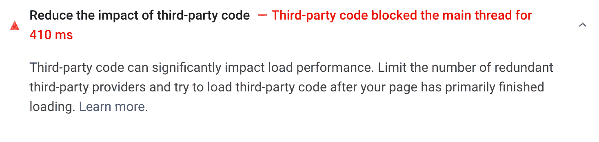

Reduce the impact of third-party code recommendation


为了更有效地加载第三方代码，你可以考虑我们在本文中已经提到的技术之一:

*   推迟 JavaScript 的加载
*   使用带有**预连接**属性的链接标签
*   自托管第三方脚本(正如我们上面描述的 Google Analytics)

这些方法应该最大限度地减少对网站性能的影响。

### 22.避免巨大的网络负载

这一建议与您的移动访问者尤其相关。较大的有效负载可能需要使用更多的蜂窝数据，从而让用户付出昂贵的代价。最大限度地减少访问页面所需的网络请求数量可以防止这种情况:

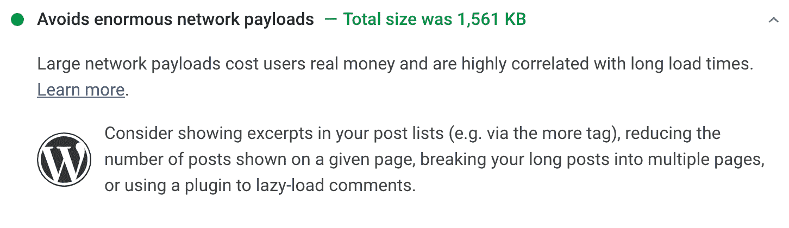

Avoid enormous network payloads recommendation


Google 建议将您的总字节大小保持在 1,600 KB 或更少。在这篇文章中可以找到实现这一目标最常用的方法，包括:

*   推迟文件夹下的 CSS、JavaScript 和图像
*   缩小代码
*   压缩图像文件
*   对图像使用 WebP 格式
*   实现缓存

遵循这些策略的相关步骤，您应该无需任何额外的努力就能通过审核。

### 23.用户计时标志和措施

这个建议只有在您使用[用户计时 API](https://developer.chrome.com/docs/lighthouse/performance/user-timings/) 时才有意义。这个工具创建时间戳来帮助您评估 JavaScript 的性能。如果您已经为您的站点设置了 API，您将在 PageSpeed Insights 的这个标题下看到您的分数和衡量标准:


User Timing marks and measures recommendation


如你所见，这是谷歌的另一个建议，不会导致“通过”或“失败”。PageSpeed Insights 只是使这些信息易于检索，因此您可以使用它来评估可能需要优化的领域。

如果你对将用户计时 API 整合到你的 WordPress 站点感兴趣，你可以在主题为的 [Mozilla 指南中了解更多。](https://developer.mozilla.org/en-US/docs/Web/API/User_Timing_API/Using_the_User_Timing_API)

### 24.避免过大的文档对象模型(DOM)大小

简而言之，DOM 是浏览器将 HTML 转换成对象的方式。它包括使用由单个节点组成的树形结构，每个节点代表一个对象。当然，页面的 DOM 越大，加载的时间就越长。

如果你的页面超过了某些关于 DOM 大小的标准，它会建议减少节点的数量以及 CSS 样式的 T2 复杂度:


Avoid an excessive DOM size recommendation


如果你没有通过 PageSpeed Insights 的审核，一个常见的原因就是你的 WordPress 主题。沉重的主题通常会给 DOM 添加大量的元素，还可能包括复杂的样式，这会降低站点的速度。如果是这种情况，您可能需要[切换主题](https://kinsta.com/blog/change-wordpress-theme/)。

[你在为在#Google PageSpeed 上获得 100/100 分而苦苦挣扎吗？这里有一个提示:不要纠结于你的分数，关注真正影响你的页面负载的是什么！🚀📊 点击推文](https://twitter.com/intent/tweet?url=https%3A%2F%2Fkinsta.com%2Fblog%2Fgoogle-pagespeed-insights%2F&via=kinsta&text=Are+you+struggling+to+score+100%2F100+on+%23Google+PageSpeed%3F+Here%27s+a+tip%3A+don%27t+obsess+over+your+score+and+focus+on+what%27s+truly+affecting+your+page+load%21+%F0%9F%9A%80%F0%9F%93%8A&hashtags=performance%2Coptimization)


## 摘要

Google PageSpeed Insights 应该是你网站管理员工具箱中的必备工具。然而，专注于你的分数和执着于达到梦寐以求的 100/100 可能不是最好的利用你的时间。它可能会把你从其他能提供更大益处的重要任务中抽离出来。

在这篇文章中，我们讨论了你的 Google PageSpeed 分数是重要的还是不重要的。我们还分享了一些将该平台的建议应用到您的网站上的简短指南，以提高其性能。

您对 Google PageSpeed Insights 或优化您的网站性能有疑问吗？请在下面的评论区提问！

* * *

让你所有的[应用程序](https://kinsta.com/application-hosting/)、[数据库](https://kinsta.com/database-hosting/)和 [WordPress 网站](https://kinsta.com/wordpress-hosting/)在线并在一个屋檐下。我们功能丰富的高性能云平台包括:

*   在 MyKinsta 仪表盘中轻松设置和管理
*   24/7 专家支持
*   最好的谷歌云平台硬件和网络，由 Kubernetes 提供最大的可扩展性
*   面向速度和安全性的企业级 Cloudflare 集成
*   全球受众覆盖全球多达 35 个数据中心和 275 多个 pop

在第一个月使用托管的[应用程序或托管](https://kinsta.com/application-hosting/)的[数据库，您可以享受 20 美元的优惠，亲自测试一下。探索我们的](https://kinsta.com/database-hosting/)[计划](https://kinsta.com/plans/)或[与销售人员交谈](https://kinsta.com/contact-us/)以找到最适合您的方式。