# 谷歌搜索控制台:你需要知道的一切来改善你的搜索引擎优化

> 原文：<https://kinsta.com/blog/google-search-console/>

谷歌搜索控制台是目前最好的搜索引擎优化工具之一。这也是最容易被忽视的一点。

谷歌搜索控制台(以前称为网站管理员工具)是一个工具集，帮助确保[你的网站是健康的和谷歌友好的](https://kinsta.com/blog/wordpress-seo/)。但它的作用远不止于此。

它不仅可以帮助你诊断任何技术性的 SEO 问题，它还可以帮助你了解你最受欢迎的页面，看看你在哪里排名，并且[帮助你增加有机流量](https://kinsta.com/blog/how-to-drive-traffic-to-your-website/)。

谷歌搜索控制台(或 GSC)是完全免费的，任何网站和网站都可以使用，不管它是在什么平台上建立的。为了充分利用它，您需要正确设置它，理解指标的含义，并知道如何访问它的特性。

所以，如果你想从谷歌搜索控制台中获得最大收益，这是给你的指南。下面是将要深入探讨的:

## 什么是谷歌搜索控制台？

谷歌搜索控制台是一个工具和报告的集合，允许网站管理员(以及任何真正运营网站的人)监控、管理和改进他们的网站。这是谷歌免费提供的一项网络服务，向你提供关于你的网站和访问者的信息。

使用谷歌搜索控制台(和提供的数据)可以使优化您的网站容易得多。

> Kinsta 把我宠坏了，所以我现在要求每个供应商都提供这样的服务。我们还试图通过我们的 SaaS 工具支持达到这一水平。
> 
> <footer class="wp-block-kinsta-client-quote__footer">
> 
> 
> 
> <cite class="wp-block-kinsta-client-quote__cite">Suganthan Mohanadasan from @Suganthanmn</cite></footer>

[View plans](https://kinsta.com/plans/)

准备好开始了吗？

## 我如何访问新的谷歌搜索控制台？

谷歌搜索控制台(GSC)是一个免费工具和报告的集合，允许网站管理员监控和管理他们的网站在谷歌搜索结果中的存在。要访问新的搜索控制台，请按照下列步骤操作:

1.  登录您的 Google 帐户
2.  在 https://search.google.com/search-console/[打开谷歌搜索控制台](https://search.google.com/search-console/)
3.  通过选择允许的不同方式之一，将您的网站作为酒店添加到 GSC
4.  使用 HTML 文件、HTML 标签、谷歌分析、谷歌标签管理器验证您的帐户

Support

如果你还没有注册谷歌搜索控制台，现在是时候注册并为你的网站设置它了。

## Google 搜索控制台入门

在本节中，您将学习:

*   如何为你的网站设置谷歌搜索控制台
*   如何验证你的网站
*   新旧谷歌搜索控制台的区别
*   如何将谷歌搜索控制台与[谷歌分析](https://kinsta.com/blog/google-search-console-vs-google-analytics/#google-analytics-overview)链接
*   如何添加站点地图
*   权限的不同类型是什么
*   如何添加和删除用户

听起来不错？我们走吧。

### 用 5 个步骤设置 Google 搜索控制台

#### 第 1 步—登录您的 Google 帐户

首先要做的事情是:确保你已经登录了你的谷歌账户。如果你有单独的商业和个人账户，确保你使用的谷歌账户与你的网站相关联。

#### 步骤 2-打开谷歌搜索控制台

进入[谷歌搜索控制台](https://search.google.com/search-console/about)，点击**立即开始**:

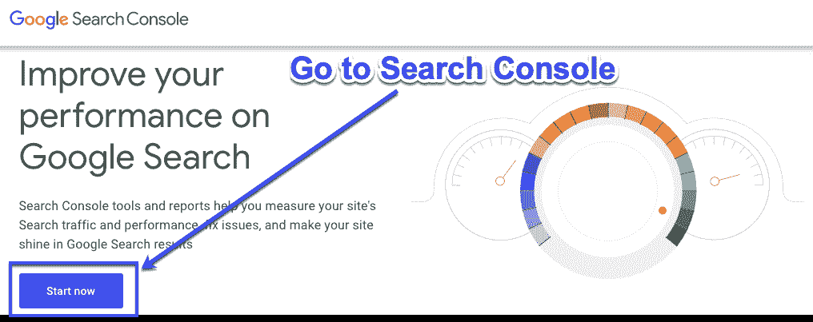

Sign up for Google Search Console

#### 步骤 3-向谷歌搜索控制台添加新网站

如果这是您在 Google 搜索控制台中建立的第一个网站，您应该会看到这条欢迎消息(只需点击“**开始**”):

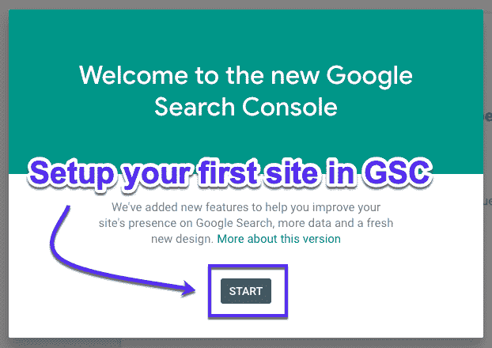

Set up your site in Google Search Console

或者，在下拉列表中，单击“ **+添加属性”**:

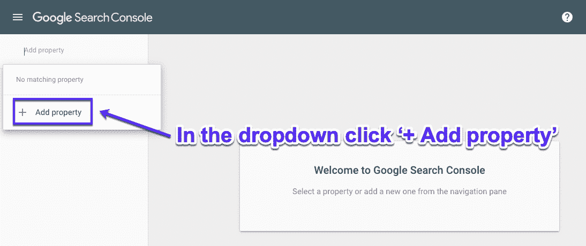

Add property in Google Search Console

#### 步骤 4 —添加您的域

作为您的属性类型，选择域，然后输入您的网站的 URL。请确保使用准确的 URL(检查它在浏览器栏中的显示方式)。完成后，点击继续。

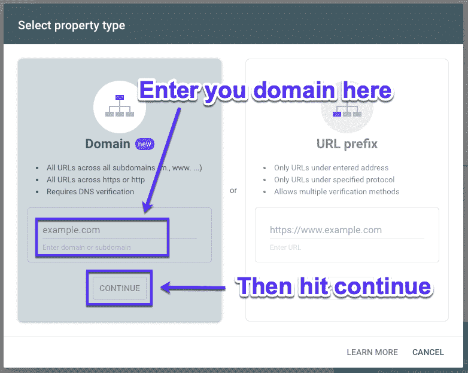

Add your domain to Google Search Console

#### 第 5 步-验证您的帐户(+替代方法)

现在你需要[验证你的网站](https://kinsta.com/blog/google-site-verification/)。复制谷歌搜索控制台标记化的 [DNS TXT 记录](https://kinsta.com/knowledgebase/what-is-dns/)，并将其添加到您的域名提供商，以验证域名所有权。

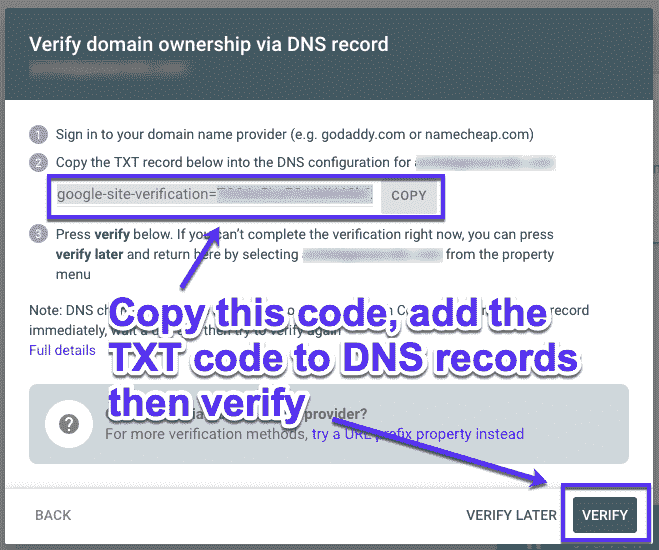

Verify ownership via DNS records

如果你不想(或不能)以这种方式验证你的域名，不要担心。返回到选择属性类型并选择 **URL 前缀**:

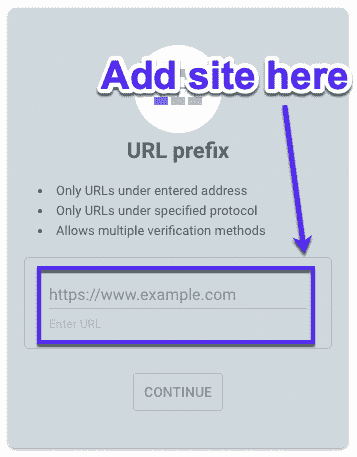

Another option to verify ownership in Google Search Console

注意:如果你试图在旧的谷歌搜索控制台上注册一个新的域名，你必须使用上面的 URL 前缀选项。域属性只在新的域中有效。

现在，您将能够通过几种方式来验证所有权:

*   **HTML 文件** : [上传一个 HTML 文件到你的网站](https://kinsta.com/knowledgebase/how-to-upload-html-file-to-wordpress/)
*   HTML 标签:给你的网站主页添加一个 meta 标签
*   **谷歌分析** : [使用你的谷歌分析账户](https://kinsta.com/blog/how-to-use-google-analytics/)
*   **谷歌标签管理器**:使用你的谷歌标签管理器账户

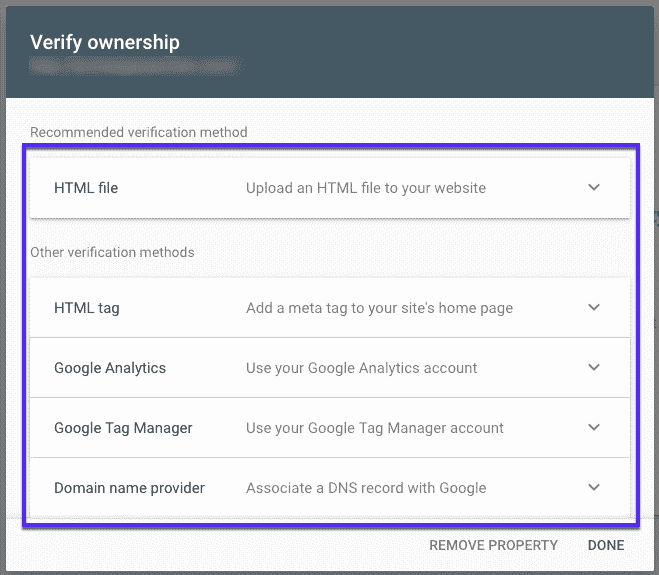

好了，现在搜索控制台已经设置好了。

### sidemote:旧的搜索控制台与新的搜索控制台

2018 年，谷歌[推出了新的谷歌搜索主机](https://webmasters.googleblog.com/2018/09/the-new-search-console-is-graduating.html)。旧版本中的大部分数据和功能已被切换，以改进您在新版本中访问数据的方式。

然而，一些位已被删除。

#### 新报告和工具

以下是新增功能的快速概述:

*   **性能报告:**这是一个新工具，取代了旧的谷歌搜索控制台中的搜索分析。
*   **索引覆盖率报告:**这是一个新工具，取代了索引状态和抓取错误。
*   **URL 检查:**取代 Fetch 为 Google 的新功能，抓取错误和被阻止的资源。

#### 更新/替换的功能

并非所有的搜索控制台功能和报告都是新的。以下是新版本中的更新内容:

*   链接到你的站点和内部链接>**链接。**
*   站点地图报告>**站点地图**。
*   加速移动页面> **AMP 状态**。
*   移动可用性保持不变
*   安全问题>**安全问题报告**。

#### 相异的

旧版本搜索控制台中的一些报告已被完全删除:

*   HTML 改进
*   属性集
*   安卓应用

#### 被打入冷宫

在撰写本文时，仍有一些功能没有更新或删除，它们只是在发布前停留在谷歌的中间状态。谷歌承认，他们尚未决定如何将以下工具和任务添加到新的谷歌搜索控制台中:

*   爬网统计数据
*   Robots.txt 测试仪
*   在 Google 搜索中管理 URL 参数
*   国际瞄准
*   数据高亮工具
*   阅读和管理您的邮件
*   更改地址工具
*   设置首选域
*   将您的搜索控制台属性与分析属性相关联
*   否认链接
*   从索引中删除过时的内容
*   阻止的资源报告
*   结构化数据报告

#### 如何使用旧的谷歌搜索控制台(网站管理员工具)

新的谷歌搜索控制台虽然设计精良，但没有旧版本的所有功能。如果你想使用它们，这很简单。

只需点击左侧菜单中的**“转到旧版本”**。

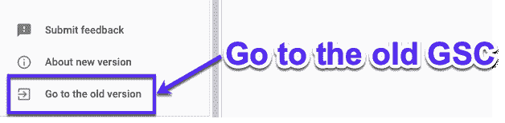

Revert to the old Google Search Console

现在，您将能够看到新的谷歌搜索控制台中缺失的所有功能:

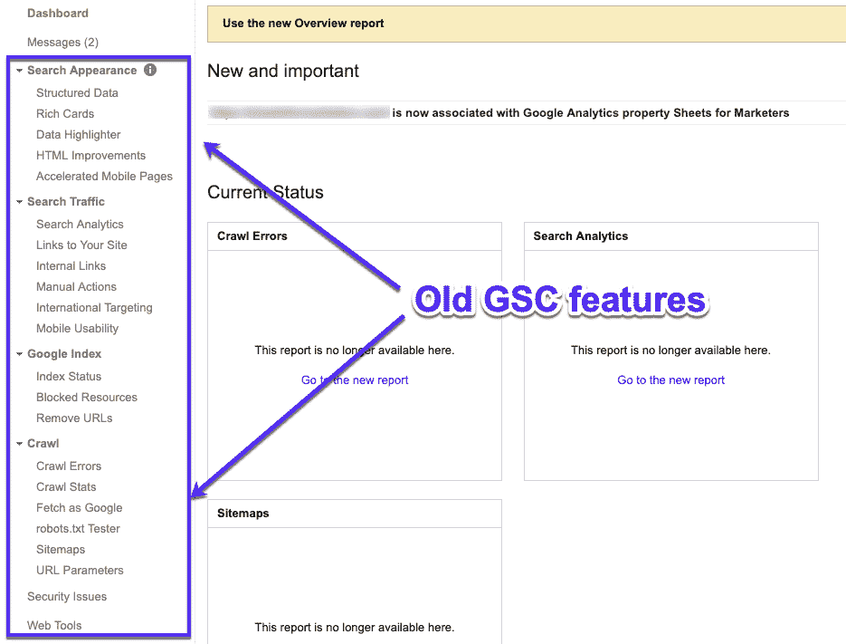

Old Google Search Console features

### 如何链接谷歌分析与搜索控制台

将搜索控制台与谷歌分析链接起来，你就可以在分析中抓取关键词数据。

显然，你首先需要确保[谷歌分析在你的网站上设置正确](https://kinsta.com/blog/google-analytics-wordpress/)。如果是，下面介绍如何将其与 Google 搜索控制台链接:

#### 第一步

打开 Google Analytics，进入您想要链接到 Google 搜索控制台的酒店。

#### 第二步

点击左侧菜单下方的**“管理”**按钮，然后选择**“属性设置”**链接:

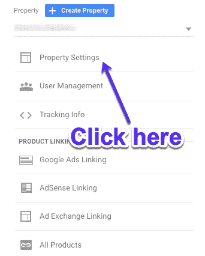

How to link Google Search Console and Google Analytics

#### 第三步

向下滚动，您将看到**“调整搜索控制台”**按钮。点击它。

#### 第四步

现在选择**“添加”:**

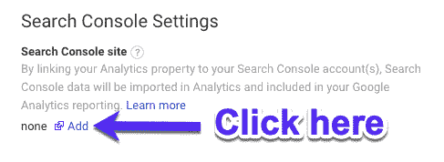

How to add Google Search Console to Google Analytics

#### 第五步

现在只需选择您的网站，确保选中该框，并点击“保存”。您应该会看到这个弹出框，所以只需按 **OK** :

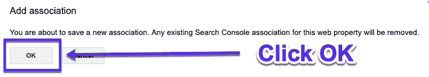

Confirm Google Search Console in Google Analytics

就这样，你已经准备好了。分析和搜索控制台现已成功连接。

你需要给它一些时间来传递数据。要在分析中查看谷歌搜索控制台数据，在左侧菜单中，只需前往**采集**，然后转到搜索控制台下拉菜单:

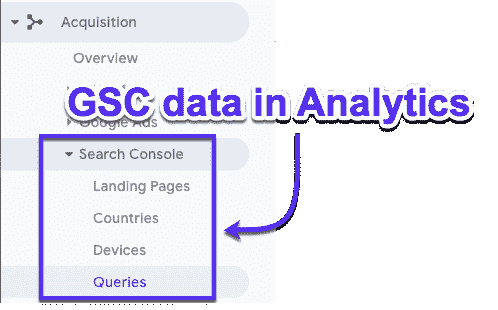

How to see Google Search Console data in Google Analytics

### 如何在谷歌搜索控制台中添加网站地图

搜索引擎使用[网站地图来帮助抓取你的网站](https://kinsta.com/blog/wordpress-sitemap/)。它们就像是你网站的地图，引导爬虫访问你的所有页面。

站点地图必须是 XML 文件类型，并且有很少的错误(或者理想情况下没有错误)，否则你就冒着爬虫忽略它并且不爬行你的页面的风险。

谢天谢地，搜索控制台会告诉你你的站点地图是否有错误。在 Index 下的左侧面板中，点击 **Sitemaps** ，您将看到您提交的 XML 站点地图列表:

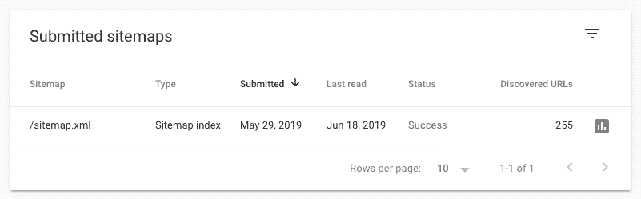

Sitemap successfully submitted to GCS

创建和提交站点地图甚至更容易。

首先，您需要实际创建一个 XML 站点地图。在 WordPress 上创建一个[站点地图很容易，使用类似于](https://kinsta.com/blog/wordpress-sitemap/)[的 Yoast 插件](https://kinsta.com/blog/yoast-seo/)。

注意:你可以去 yoursite.com/sitemap.xml.看看你是否已经有一个网站地图，如果你有，它通常都在那里。

一旦创建，你需要通过谷歌搜索控制台提交给谷歌。这很容易做到:

从左侧栏进入 **Sitemaps** 工具，简单地粘贴 XML 页面。点击**提交**。

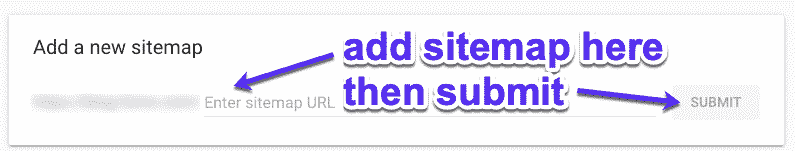

Add your sitemap to Google Search Console

### 谷歌搜索控制台权限:用户和所有者解释

Google 搜索控制台中有两种不同权限级别的角色:**用户**和**所有者**。

让我们更详细地看一下它们。

#### 物主

在谷歌搜索控制台中，所有者可以完全控制他们的所有财产。他们有能力:

*   添加和删除其他用户
*   更改设置
*   查看所有数据
*   访问每个工具

有两种类型的所有者:**验证所有者**和**委托所有者**，两者都有细微的区别。已验证的所有者已完成 Google 搜索控制台属性验证设置过程，同时已添加委托所有者(由已验证的所有者添加)。

*注意:被委托的所有者可以添加其他被委托的所有者。*

#### 用户

用户可以查看所有搜索控制台数据，但不能向属性添加任何新用户。完全用户可以查看几乎所有的数据，但是受限用户只能查看选定的数据。

### 如何在 Google 搜索控制台中添加和删除所有者/用户

现在你知道了所有者和用户之间的区别，下面是如何在谷歌搜索控制台中添加(和删除)他们:

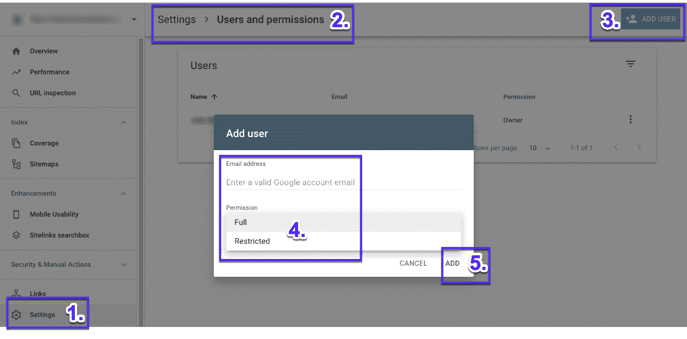

How to add users in Google Search Console

1.  转到左侧面板中的**设置**
2.  然后点击**用户和权限**
3.  如果您正在使用的帐户具有正确的权限，您可以通过单击“**添加用户”**来添加用户
4.  然后添加他们的电子邮件并选择他们的权限级别(完全或受限)
5.  最后点击**添加**。

要删除用户，只需点击其个人资料旁边的三个点，然后点击“**删除访问权限**”(如果您有适当的权限)。

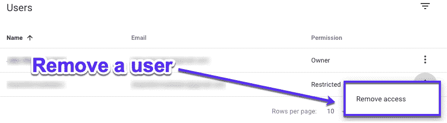

How to remove users in Google Search Console

## 谷歌搜索控制台的功能

现在你已经设置了谷歌搜索控制台，下一步是什么？

检查你的数据以提高你的搜索引擎优化。以下是新的谷歌搜索控制台提供的报告:

*   索引报告:谷歌索引你的网站有多好
*   **概述报告:**您站点的整体性能。
*   **URL 检查:**从技术角度看特定页面的表现。
*   **性能报告:**您的页面性能如何
*   **链接报告:**您的外部和内部链接

但是在我们开始使用这些报告之前，您需要理解其中的指标和数据。

### 在谷歌搜索控制台可以获得哪些数据？

在您开始使用 Google 搜索控制台之前，了解一些术语和指标非常重要。转到 performance 选项卡，您应该会看到四个指标和一些彩色图表。

*注意:每个指标框都是可点击的，因此您可以打开和关闭您看到的内容。*

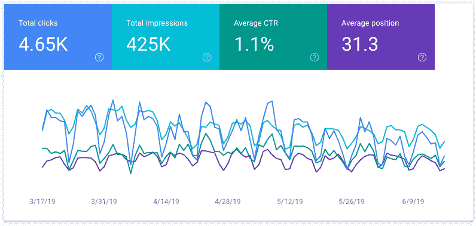

Performance tab in Google Search Console

该性能选项卡显示查询和页面的数据。以下是每个词的含义:

## 注册订阅时事通讯

### 想知道我们是怎么让流量增长超过 1000%的吗？

加入 20，000 多名获得我们每周时事通讯和内部消息的人的行列吧！

[Subscribe Now](#newsletter)

#### 问题

如果您稍微向下滚动页面，您会看到一个包含查询的表格。这基本上是一个搜索词(或关键词)，它在谷歌搜索引擎结果页面上为你的网站/页面带来了一些印象。只是让你知道，这些数据是搜索控制台独有的，所以你将无法在谷歌分析中找到它。

#### 页

非常简单:这是显示在谷歌搜索结果中的页面。

#### 印象

每次你的网站链接 URL 出现在搜索结果中，都会产生一个印象。用户不必为了计算印象而向下滚动来实际看到你的结果。

#### 点击

如果用户选择了一个链接，将他们从谷歌搜索带到你的网站，那么这就算作一次点击。但是，如果用户单击一个链接，然后单击“后退”按钮，然后再次单击同一个链接，它仍然只算作一次单击。如果他们点击了不同的链接，那就算作两次点击。还有，这不包括付费的谷歌结果。

#### 平均位置

这是一个(或多个)查询页面的平均排名位置。

#### 平均 CTR

CTR 代表点击率，是点击你的结果并进入你的网站的用户数量。其计算方法为*点击量除以印象数，再乘以 100* ，并以百分比表示。

### 使用搜索控制台指标

为了从 Google 搜索控制台性能报告中获得最大收益，您需要更改分组来查找您正在寻找的数据。别忘了，你可以随时将数据导出到电子表格中进行更多的数据处理。

不要担心，在本指南的后面部分，还有更多关于如何获取有用数据的步骤。

## 如何使用谷歌搜索控制台

你现在理解了所有不同的谷歌搜索控制台指标的含义，你成功地设置并验证了你的属性，现在做什么？好了，现在你实际上可以使用谷歌搜索控制台来改善你的网站(和你的搜索引擎优化)。

实际上，你可以用搜索控制台做很多事情来改进你的网站。

让我们开始吃吧。

### 使用谷歌搜索控制台检查网站的健康状况

所以你想了解谷歌是如何抓取你的网站，是否有任何问题阻止你的网页被索引？

进入**索引覆盖报告**。

这份报告告诉你谷歌在索引你的网站内容时是否有任何问题。

登录报告时，您会看到一个彩色图表，显示索引页数在过去 90 天内的变化情况。

*注意:就像性能报告一样，只需点击一下鼠标就可以打开和关闭所有这些指标。*

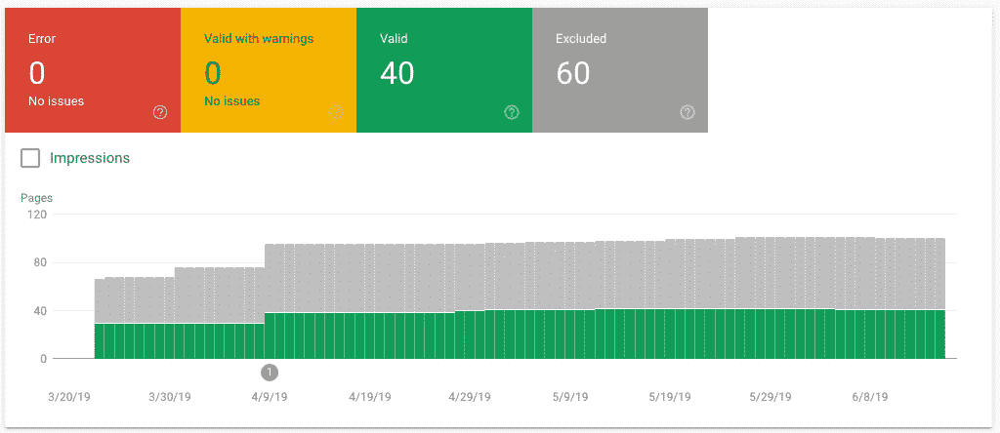

Example of the index coverage report

每个条形图(代表每个跟踪日的状态)的颜色如下:

*   错误(红色)
*   警告有效(黄色)
*   有效(绿色)
*   排除(灰色)

下面提供了每个状态的进一步细节。建议**先处理错误(红色部分)**。这些通常是阻碍你的页面被索引的最大问题。

#### 错误的原因

谈到谷歌搜索控制台错误，最常见的有:

*   **重定向错误:**这是重定向到一个页面不能正常工作的时候。检查[你的。htaccess 文件](https://kinsta.com/knowledgebase/wordpress-htaccess-file/)和你的[重定向规则](https://kinsta.com/help/redirect-rules/)对这些错误进行排序。
*   **未找到提交的 URL(404):**当页面不可访问时。如果你试图访问它，你会看到一个 [404 错误](https://kinsta.com/blog/error-404-not-found/)。
*   **提交的网址好像是软 404:** 这是找不到网页的时候。有时值得检查一下是否是临时的错误造成的。
*   **提交的网址有抓取问题:**有时页面会被你的 [Robot.txt](https://kinsta.com/blog/wordpress-robots-txt/) 中的爬虫拦截。虽然这并不总是原因。有时候可能是完全不同的东西，所以去页面调查一下。
*   **服务器错误(5XX):** 谷歌爬虫[无法到达你的网络服务器](https://kinsta.com/blog/http-status-codes/#500-status-codes)，通常发生在服务器[维护时间](https://kinsta.com/blog/wordpress-maintenance-mode/)。留意这一点，以确保你不会与你的主机提供商有问题。

#### 如何修复 404 错误

所以你会在谷歌搜索控制台上看到一些 404 错误。404 错误消息通常出现在 URL 不再可访问的时候。这通常发生在页面不再存在或 URL 已被更改的情况下。它发生了。

以下是如何在谷歌搜索控制台中找到 404 错误，以及如何修复它们:

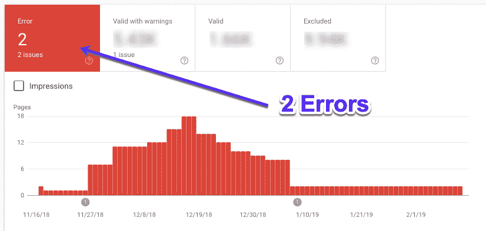

Errors in Google Search Console

进入**“索引”**，然后进入**“覆盖”**，你会看到你网站上发现的所有问题的列表。如果你点击一个问题，你会看到受影响的网址。

谷歌搜索控制台报告你的网站过去和现在的所有 404 页。因此，请确保任何 404'ing 页面仍然存在，因为它们可能只是你已经知道他们被删除的旧页面。

此外，由于谷歌抓取网站的方式，已被纠正的 404 错误会继续出现在这份报告中。

厌倦了你的 WordPress 站点缓慢的主机？我们提供超快的服务器和来自 WordPress 专家的 24/7 世界级支持。[查看我们的计划](https://kinsta.com/plans/?in-article-cta)

修复 404 最简单的方法就是修复导致它崩溃的问题或者[重定向页面](https://kinsta.com/blog/wordpress-redirect/)。重定向时，确保指向网站上与已删除页面相似的内容。使用 301 永久重定向和[而不是 307 临时重定向](https://kinsta.com/knowledgebase/307-redirect/)。这是最好的解决方案，因为你将用户发送到一个替代页面，仍然会满足他们的需求(希望如此)。

### 看看谷歌如何看待一个网址

使用 **URL 检查工具**，您可以看到 Google 实际上是如何查看您的页面的。如果您的页面根本没有出现或者可能没有正确出现在搜索结果中，您可以使用此功能进行故障诊断。

输入页面 URL 并按回车键。请确保它属于您当前正在查看的酒店:

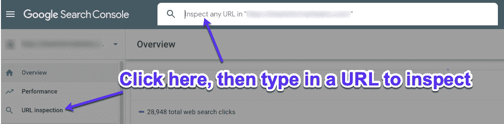

How to inspect URLs in Google Search Console

现在，您将能够看到该页面的结果，以及该 URL 是否被编入索引并可以出现在 Google 搜索中:

URL inspection in Google Search Console

您可以点击下拉箭头打开索引覆盖率报告，了解有关 Google 上的 URL 的更多信息，包括:

*   指向此 URL 的站点地图
*   将 Googlebot 引向此 URL 的参考页面
*   上次 Googlebot 抓取此 URL 时
*   如果谷歌机器人被允许抓取这个网址
*   如果谷歌机器人真的可以获取这个网址
*   页面是否不允许索引，
*   为此页面设置的规范 URL
*   Google 为此页面选择的标准 URL。

### 使用概览报告

**概览报告**有助于了解你的网站在搜索引擎中的技术表现，以及是否有任何问题需要解决。

#### 查看有多少页面被编入索引

下面是如何查看有多少页面被编入索引，有多少页面有错误:

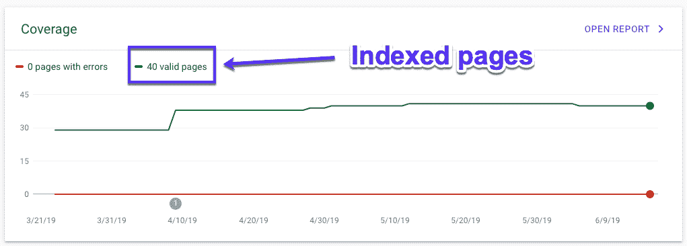

Indexed pages in Google Search Console

1.  转到左侧面板中的****概述****
***   向下滚动到标记为“**Coverage”**的索引摘要。*   看“**有效页数**”的数量。**

 **#### 如何检查索引错误

您也可以点击**打开报告**链接，查看您的保险的更多详情:

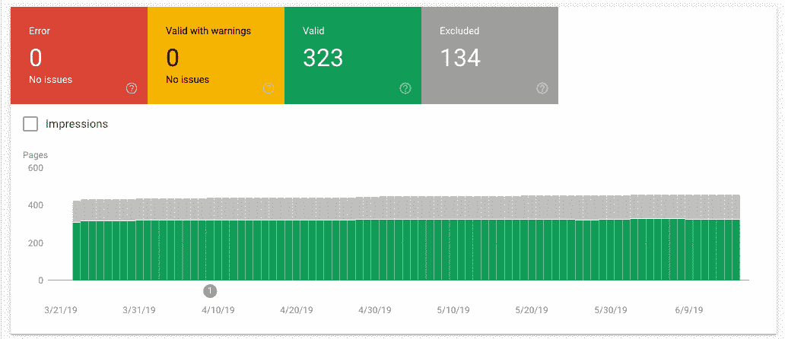

Full indexed coverage report

您需要确保“错误”、“有效但有警告”、“有效”和“已排除”都已选中，以便您可以看到它们。

随着[你发布新的博客文章](https://kinsta.com/blog/evergreen-content/)，[创建新的页面](https://kinsta.com/blog/wordpress-landing-page-plugins/)，并修复任何索引错误，你的网站的索引页面总数应该会逐渐增加。

您需要关注的是索引错误的突然大量增加。这可能是由于[网站模板的变化](https://kinsta.com/blog/change-wordpress-theme/)或者可能是网站地图错误阻止了谷歌抓取某些网址。

通过查看这些报告中排除的页面，尝试尽快诊断问题。

#### 如何发现移动可用性问题

随着谷歌对移动优先索引的推动，你真的想确保你的网站能很好地为智能手机用户服务。以下是如何在谷歌搜索控制台中发现移动可用性问题:

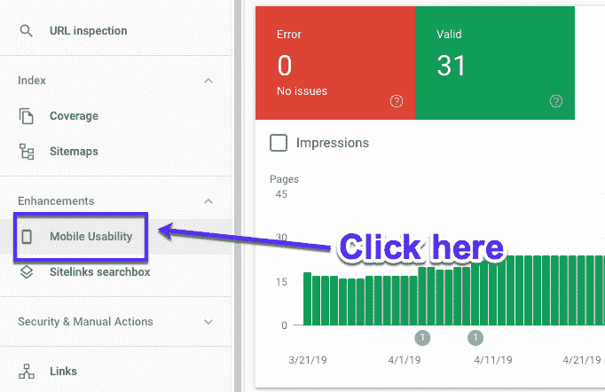

Mobile usability errors

1.  点击**移动可用性**(在增强功能下)。
2.  确保选择了**“错误”**。
3.  如果有任何错误，您可以转到详细信息框，了解哪些错误导致了移动问题。
4.  您也可以双击任何错误类型来查看受影响的页面 URL。

### 使用性能报告

性能报告显示了您的网站在 Google 中的表现的重要指标，如出现的频率、平均位置和点击率。

#### 如何找到你的最高流量的网页

以下是如何在你的网站上找到点击量最大的页面:

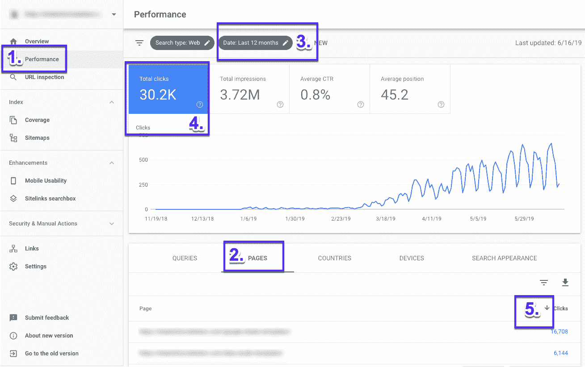

How to find high-traffic pages in Google Search Console

1.  点击**性能**
2.  然后转到“**页面标签**”(就在查询旁边的右边)
3.  将日期范围更改为“**过去 12 个月**”，以便更好地了解您的流量。
4.  确保选择了“**总点击量**”。
5.  现在点击“点击量”旁边的小向下箭头，将你的页面从最高到最低排序

#### 如何找到点击率最高的查询

以下是如何在你的网站上找到点击率最高的查询:

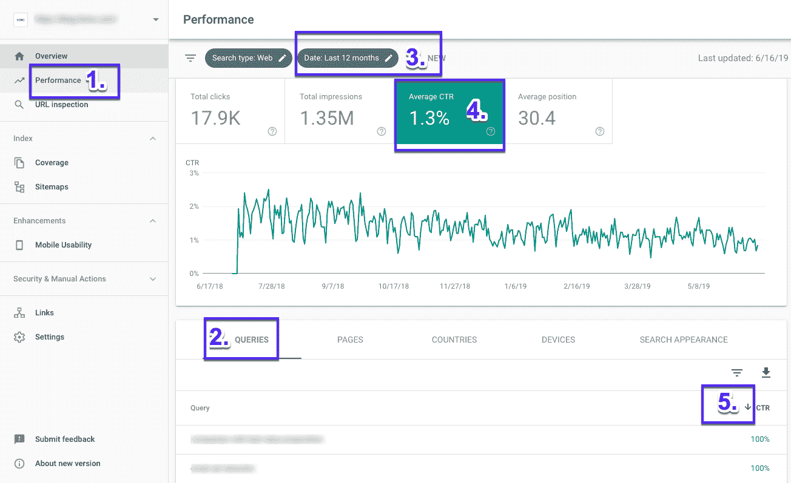

How to find pages with the highest click-through rate in Google Search Console

1.  点击性能
2.  转到“**查询**选项卡
3.  将日期范围更改为“**过去 12 个月**
4.  确保“平均 CTR”指标可见
5.  现在选择小箭头(在“CTR”旁边)从高到低排序

#### 如何找到你排名最高(和最低)的网页

以下是如何在你的网站上找到排名最高和最低的网页:

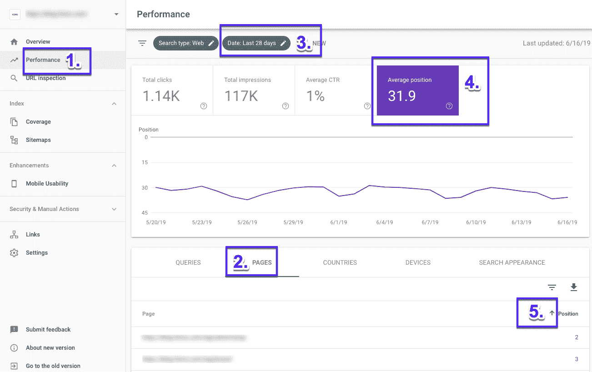

How to find pages with the highest/lowest rankings in Google Search Console

1.  点击**性能**
2.  转到“**页面**选项卡
3.  将日期范围更改为“过去 28 天”
4.  选择“**平均位置** n”
5.  现在，您可以使用“位置”旁边的小箭头从低到高切换排名，反之亦然。记住:说到排名，低=好，高=坏。

#### 如何发现和比较排名上升和下降

以下是如何比较两个时间段的排名情况:

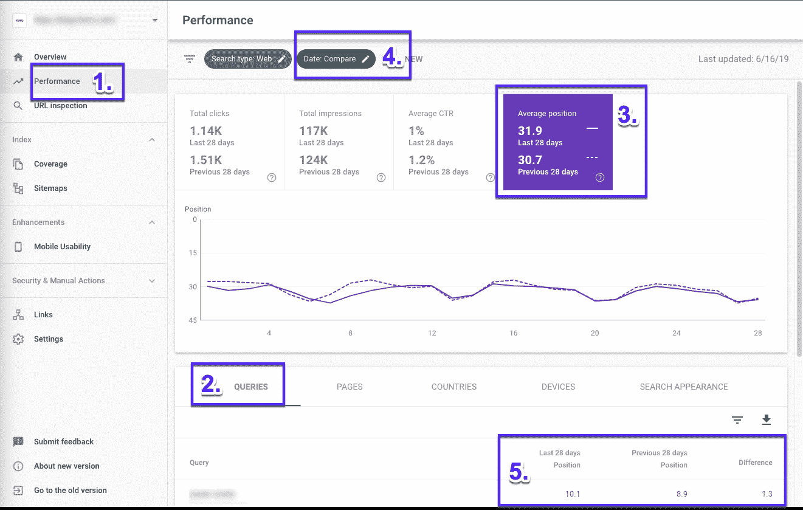

How to compare rankings over two different time periods

1.  点击**性能**
2.  转到“**查询**选项卡
3.  确保选择了**平均位置**
4.  现在点击“日期范围”，更改日期，然后点击“**比较**”选项卡选择两个时间段，然后点击“应用”
5.  看看排名是如何变化的。

#### 如何找到你的最高流量查询

以下是如何找到给你的网站带来最大流量的查询:

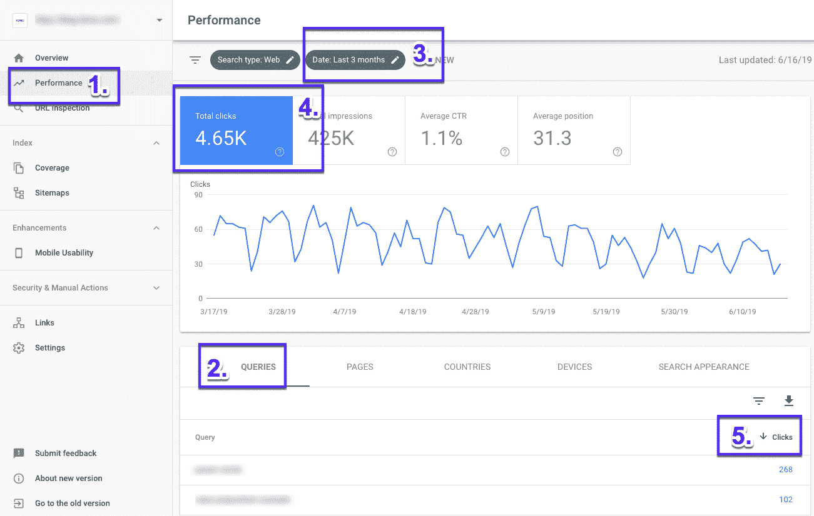

How to find high-traffic queries in Google Search Console

1.  转到“**性能**报告”
2.  点击**查询**选项卡
3.  选择您的**日期范围**
4.  确保您选择了“**总点击量**
5.  单击“**点击**旁边的向下小箭头，从最高到最低排序。

#### 跨设备比较站点性能

以下是如何比较你的网站在桌面、移动和平板电脑上的搜索性能:

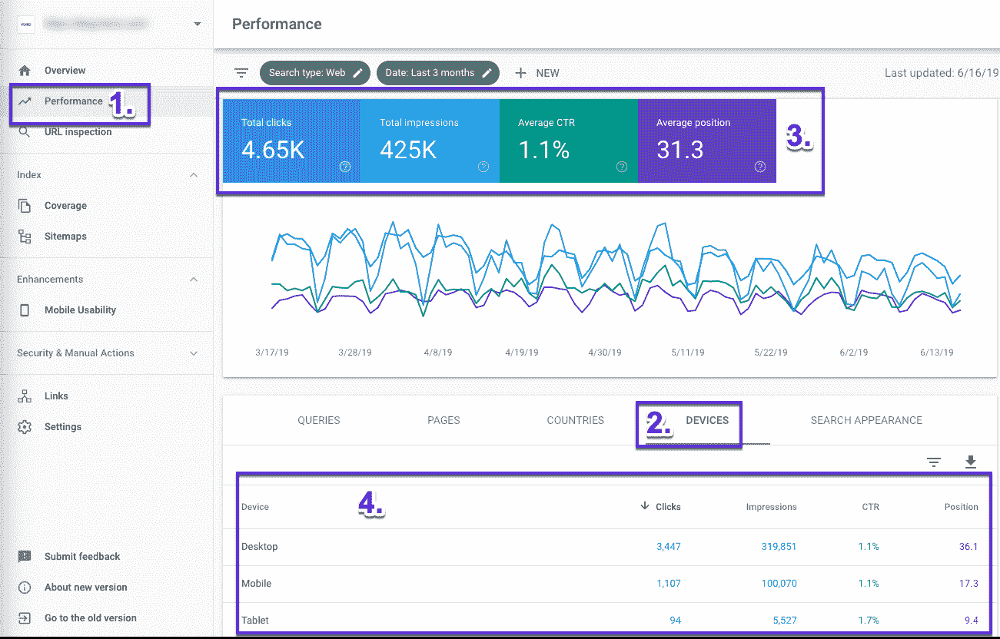

Site performance across devices

1.  点击**性能**
2.  然后转到“**设备**选项卡。
3.  确保选择了所有指标
4.  现在比较您在所有设备上的表现。

#### 比较不同国家的网站表现

以下是如何比较你的网站在不同国家的搜索性能:

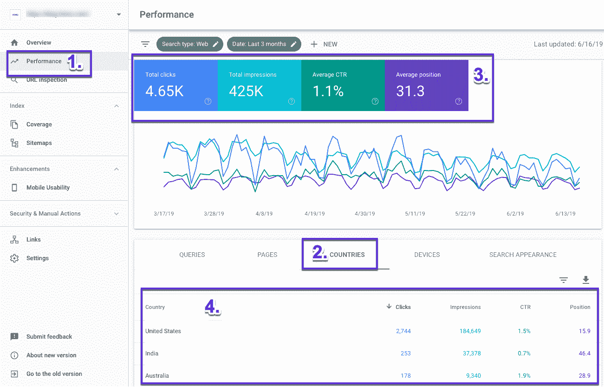

Site performance across countries

1.  点击**性能**
2.  转到“国家”选项卡
3.  确保选择了所有指标
4.  现在比较你在所有国家的表现

### 使用链接报告

除了帮助你诊断搜索引擎优化技术问题和找到表现最好的页面，谷歌搜索控制台也有助于查看你的内部链接和反向链接数据，即哪些网站链接到你的网站，以及他们使用什么链接文本。

#### 在谷歌搜索控制台中找到你的网站有多少反向链接

以下是如何查看你的网站的反向链接/外部链接总数:

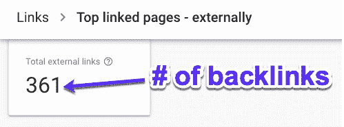

Check the number of backlinks in Google Search Console

1.  点击左侧面板中的**链接**
2.  然后，打开“**外部链接**下的“**置顶链接页面**”报表
3.  寻找标有“**外部链接总数**”的方框
4.  你可以点击“**传入链接**旁边的小箭头，从最高到最低的反向链接排序，并将其导出到电子表格中

反向链接是谷歌的信号，表明你的网站内容是值得信赖的。把它们想象成你网站的“选票”。反向链接越多越好。然而，质量和相关性是非常重要的，当谈到反向链接。一个来自权威网站的链接总是比许多来自低质量和不相关网站的链接要好。

要查看哪些网站链接到某个页面，只需双击报告中的 URL。

#### 查找链接最多的网址

以下是查看顶部链接页面的方法:

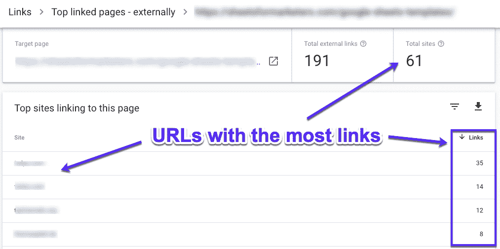

Find URLs with the most links

1.  点击左侧面板中的**链接**
2.  再次打开外部链接下的“**热门链接页面**”报告
3.  点击“**传入链接**旁边的向下箭头，从最高到最低反向链接排序
4.  点击任何链接，找出链接到他们的网站

一个很好的 SEO 技巧是从一个有很多反向链接的页面添加内部链接到你想排名更高的其他页面。那些给予 URL 页面权限的反向链接可以通过内部链接传递到你网站上的另一个页面。

#### 查找具有最多内部链接的 URL

以下是如何查看网站上哪个页面的内部链接最多:

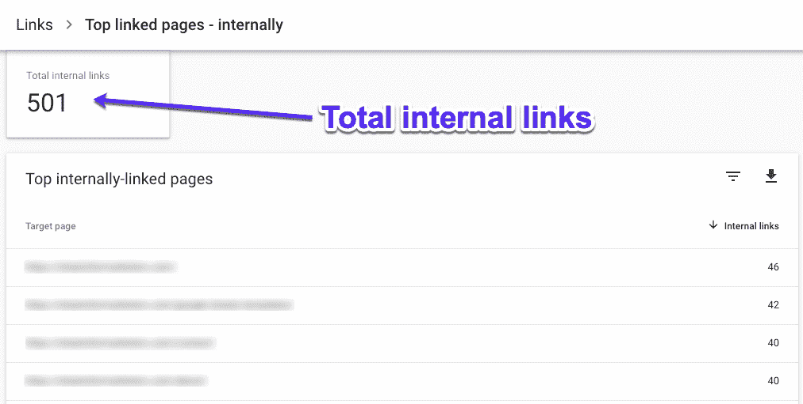

Number of internal links

1.  点击左侧面板中的**链接**
2.  转到“**顶部链接页面**”(在内部链接标题下)
3.  点击列表底部的**更多**

内部链接是从你网站的一个页面到另一个页面的超链接，有助于引导用户和搜索引擎浏览你的网站。

一些网址比其他网址有更多的内部链接是正常的。然而，要留意那些链接比其他页面多得多的页面，因为可能有机会添加一些入站链接并传递一些链接。

[Google Search Console is a suite of #free #SEO tools we 💜. Check out our crazy useful guide to boost your site's SEO starting today.📈Click to Tweet](https://twitter.com/intent/tweet?url=https%3A%2F%2Fkinsta.com%2Fblog%2Fgoogle-search-console%2F&via=kinsta&text=Google+Search+Console+is+a+suite+of+%23free+%23SEO+tools+we+%F0%9F%92%9C.+Check+out+our+crazy+useful+guide+to+boost+your+site%27s+SEO+starting+today.%F0%9F%93%88&hashtags=seo%2Cwordpress)

## 摘要

如果你已经做到了这一步:祝贺你！这是一个很长的指南。

希望，现在你可以看到谷歌搜索控制台如何帮助改善你网站的搜索引擎优化。不管你的网站规模有多大，建立网站是必须的。

谷歌搜索控制台是一个工具，需要经常使用才能有用。设置好它只是成功的一半。经常使用它，你会从中受益最大。想让你的搜索引擎优化更进一步吗？查看我们关于 Bing 网站管理员工具的[深度指南](https://kinsta.com/blog/bing-webmaster-tools/)！

* * *

让你所有的[应用程序](https://kinsta.com/application-hosting/)、[数据库](https://kinsta.com/database-hosting/)和 [WordPress 网站](https://kinsta.com/wordpress-hosting/)在线并在一个屋檐下。我们功能丰富的高性能云平台包括:

*   在 MyKinsta 仪表盘中轻松设置和管理
*   24/7 专家支持
*   最好的谷歌云平台硬件和网络，由 Kubernetes 提供最大的可扩展性
*   面向速度和安全性的企业级 Cloudflare 集成
*   全球受众覆盖全球多达 35 个数据中心和 275 多个 pop

在第一个月使用托管的[应用程序或托管](https://kinsta.com/application-hosting/)的[数据库，您可以享受 20 美元的优惠，亲自测试一下。探索我们的](https://kinsta.com/database-hosting/)[计划](https://kinsta.com/plans/)或[与销售人员交谈](https://kinsta.com/contact-us/)以找到最适合您的方式。**