# 如何为你的网站获取谷歌站点链接

> 原文：<https://kinsta.com/blog/google-sitelinks/>

搜索排名是任何数字营销策略的重要组成部分，但是你知道谷歌网站链接是带来额外流量的好方法吗？

让我们暂时后退一步。为你的主要关键词排名好可以让你带来持续和相关的流量，帮助你的网站成功(和成长)。然而，虽然排名好很好，但如果人们没有真正从 SERPs[点击进入你的网站](https://kinsta.com/blog/conversion-rate-optimization-tips/)，这就毫无意义。

这就是谷歌搜索网站链接的用武之地。他们在谷歌上占据了更多的“地产”,让更多的人在搜索结果中点击你的网站。

谷歌网站链接是提高你的[点击率(CTR)](https://kinsta.com/blog/wordpress-ab-testing-tools/) 的一个很好的方法，这将帮助你带来更多的流量，以及加强你的搜索引擎优化。

在这篇文章中，你将学到你需要知道的关于站点链接的一切，包括:

 Sounds good?

那么，到底什么是站点链接，你是如何得到它们的？

## 什么是谷歌网站链接？

Google sitelinks 出现在搜索引擎结果页面(SERPs)的第一个搜索结果下面。它们是网站的内部链接，带有简短的描述。在进行品牌搜索时，经常会发现站点链接，它们可以帮助用户浏览你的网站。

你可能已经看到过[谷歌搜索](https://kinsta.com/blog/google-search-operators/)的顶部结果，下面显示两个、四个或六个内部链接。这些是谷歌网站链接，它们看起来像这样:

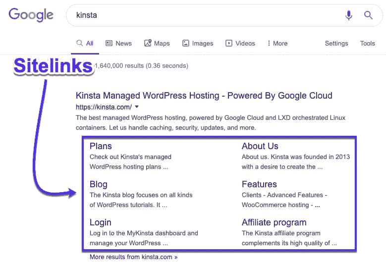

Google sitelinks in SERPs

在搜索品牌时，主页可能不是与用户需求最相关的页面。搜索“Barneys”的用户可能会点击“设计师女装”的链接，直接进入这个页面，而不是主页。

这提供了更好的用户体验，并允许用户直接进入他们选择的页面，而无需额外的点击。

## 谷歌网站链接重要的 4 个原因

网站链接对你的网站和访问者都有好处，原因有很多。

以下是谷歌网站链接对你的网站很重要的四个原因:

### 1.谷歌网站链接提高点击率(CTR)

一个好的点击率是关于一个链接有多受欢迎，这直接关系到它与特定搜索查询的相关程度。虽然一个人可能会进行简单的品牌搜索，但网站链接会提供更相关的页面，可能会直接将他们带到他们想要的产品或服务。

但是你为什么要关心 CTR 呢？嗯，平均来说，谷歌的前三个结果获得了大部分点击量(根据 AWR 的研究)。然后它从那里迅速下降:

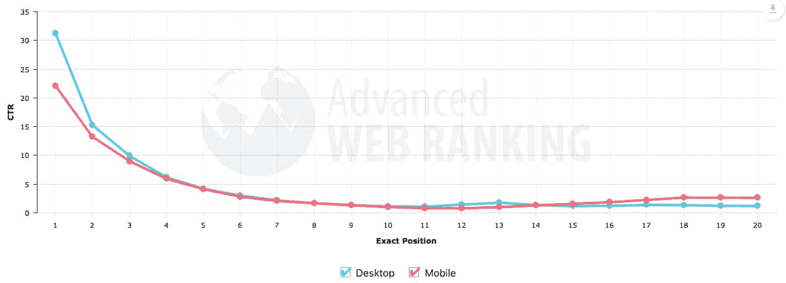

Click-through study

让搜索者即时访问你最受欢迎的页面将有助于吸引他们点击进入搜索引擎。越多的人在 SERPs 中点击你的网站，你的搜索排名就越稳定，从而增加你的有机流量。

事实上，谷歌搜索网站链接已经被证明能够提高 64%的点击率，所以努力优化你的网站是值得的。
T3】

### 2.谷歌网站链接建立信任和可信度

并非所有网站都会显示站点链接。知名度较低或优化较差的站点不太可能在 SERPs 中显示站点链接。

谷歌称:

> 当我们认为结果对用户有用时，我们才会显示网站链接。如果你网站的结构不允许我们的算法找到好的网站链接，或者我们认为你网站的网站链接与用户的查询不相关，我们就不会显示它们。”

如果一个网站显示了站点链接，这表明该网站结构良好，并且站点链接与用户的查询相关。

毕竟，谷歌希望为搜索者的查询提供最佳答案。由于站点链接在谷歌搜索结果上占据了如此大的空间，他们不会给一个优化不佳或不可信的网站这么多空间。

网站链接在谷歌上占据了大量的“不动产”,看看网站链接在桌面上占据了多少空间:

Google sitelinks on desktop

手机上的相同网站链接(占据大部分屏幕):

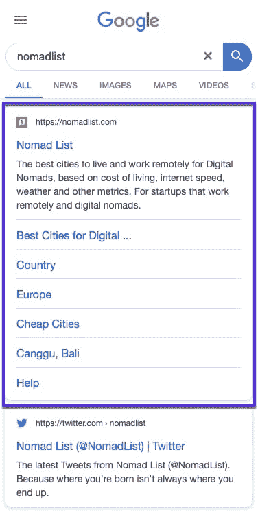

Google sitelinks on mobile

这两个因素都有助于提升一个网站的可信度，事实上并不是所有的搜索结果都有这些因素，这给人一种排他性的感觉。

一些网站甚至受益于网站链接中的搜索框:

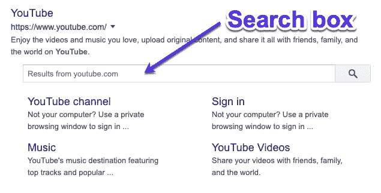

Google sitelinks search box

这允许用户直接从 SERPs 在外部网站中搜索。包含搜索框将再次提高点击率和用户体验，让他们对你的网站有更好的整体印象。

### 3.谷歌网站链接增加你的品牌和产品知名度

Google sitelinks 的目的是向搜索者展示一些网站最重要的页面，以改善他们的搜索体验。这些页面是谷歌根据你的网站结构、[内容](https://kinsta.com/blog/content-length/)和正在讨论的搜索词认为最相关的。

谷歌为站点链接选择的页面通常是产品页面、定价页面、关于页面或博客，这有助于用户找到关于网站或公司的更多信息。

为 [Fomo](https://fomo.com) 显示的站点链接很好地突出了关于公司(关于我们)的关键页面，有用的产品页面(集成、产品参观等)。)以及定价页面和博客等关键信息。

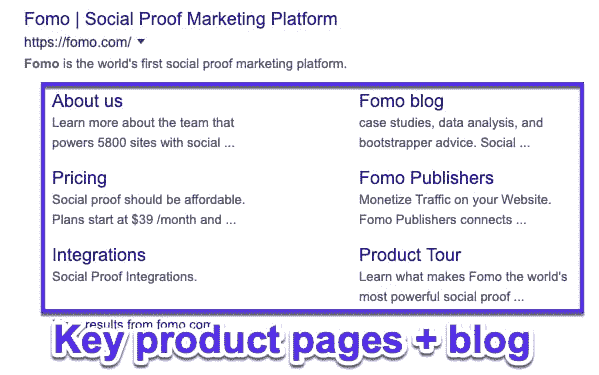

Brand awareness sitelinks

执行品牌搜索时，可能会显示特定产品或系列的网站链接，例如 GoPro:

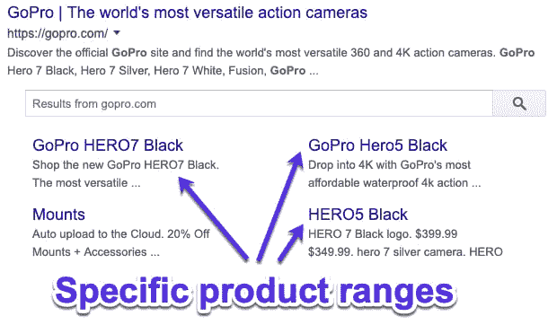

Product ranges sitelinks

这有助于让用户了解你能提供什么，而无需他们访问你的网站。它还能加速潜在客户访问你最好/最受欢迎的产品页面。感谢谷歌！

### 4.谷歌网站链接允许用户浏览更深层次的页面

大多数访问者不会深入探索你的网站。大多数时候，人们会浏览你的主页、产品页面和服务页面，而不会深入研究你的内容。

谷歌搜索网站链接显示网站最受欢迎的页面，这意味着你的热门博客文章、畅销产品或[经常下载的操作指南](https://kinsta.com/learn/speed-up-wordpress/)可能会显示为网站链接。

一个很好的例子是由网站设计师转型为企业家兼作家的保罗·贾维斯的网站，它的热门文章和产品页面都被拉进了网站链接:

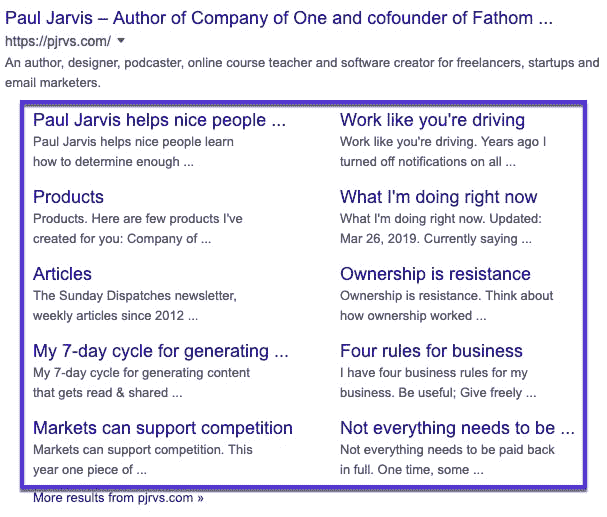

Deep link sitelinks

它也适用于软件工具。例如，Ahrefs 的 sitelinks 引入了特定的工具页面:

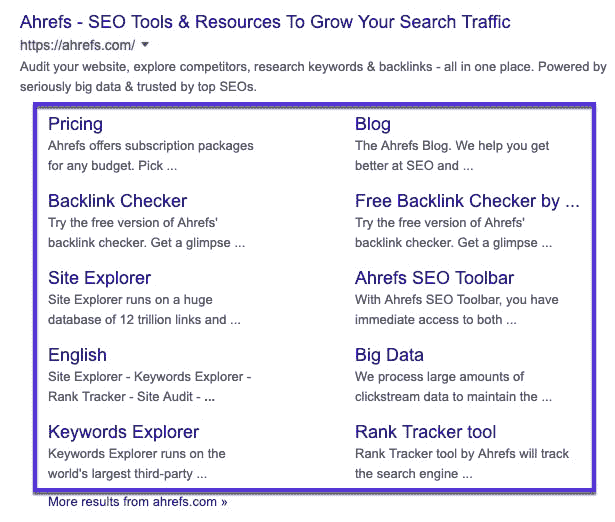

Tool pages sitelinks for Ahrefs

这将流量导向你最重要的页面，有助于提供线索，如查询和订阅，而不是把每个人都送到主页。因此，随着搜索引擎优化和点击率的提高，站点链接可以帮助你从增加的转化率中获益。

## 谷歌网站链接 101:

谷歌网站链接不是你可以启用、激活或选择加入的。这取决于谷歌是否能让他们找到一个他们认为对某个特定查询具有权威性的网站。

即使站点链接不是你能设置的，遵循 SEO 最佳实践也能极大地增加你拥有站点链接的机会。

Support

## 如何为你的网站获取谷歌站点链接

是时候先解决这个坏消息了:

很遗憾，**您不能设置自己的站点链接**。它们是否出现，以及选择哪些链接，完全取决于[谷歌的算法](https://kinsta.com/blog/google-patents-seo-ranking-factors/)。

然而，就像 SEO 的其他方面一样，你可以遵循某些最佳实践来提高获得站点链接的机会。

让我们更详细地探索它们。

### 1.有一个独特的网站名称

谷歌搜索网站链接主要用于品牌搜索，因此拥有一个独特的品牌名称将有助于你排在第一位。

## 注册订阅时事通讯

### 想知道我们是怎么让流量增长超过 1000%的吗？

加入 20，000 多名获得我们每周时事通讯和内部消息的人的行列吧！

[Subscribe Now](#newsletter)

像*“The Digital Agency”*这样的通用名称将很难排名，因为谷歌很难知道用户是在搜索一般的数字机构还是这家特定的公司。

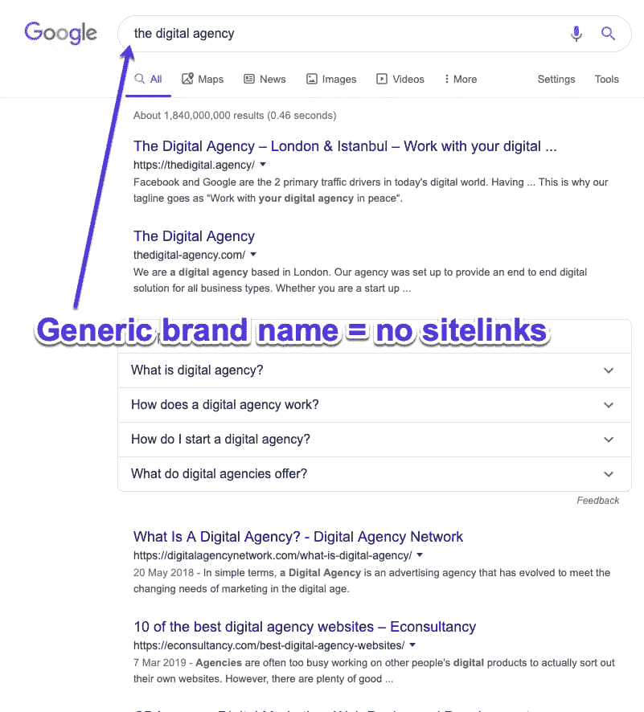

Generic brand names aren’t good to get Google sitelinks

在合适的条件下，含糊不清的公司名称有时会排名靠前。例如，搜索“苹果”会显示科技巨头的结果，而不是水果，因为谷歌理解用户的意图。

然而，没有令人难以置信的强大的品牌存在，很难为一个相当通用的名称排名。

如果你的公司已经成立，不要为了更好地针对 SEO 而改变名称，因为这是一项非常复杂的任务，会带来许多风险和困难。

如果你处于创业前阶段，选择一个独特的公司名称，因为这将有助于你在品牌搜索中表现出色。这是你的[指南，指导你开始并经营一家成功的公司](https://kinsta.com/blog/wordpress-agency/)。

### 2.将您的品牌名称排在第一位

谷歌站点链接只分配给第一个搜索结果，所以如果你想有机会获得这些站点链接，你需要排名第一。

Ranking #1 your brand name to get sitelinks

在确保你的网站或公司名称独一无二的同时，尽你所能加强你的品牌在网上的影响力。

审核你的反向链接，检查所有在线引用是否使用了正确的名称、地址、电话号码和 URL。保持你的社交媒体档案活跃，并利用[内容营销方法](https://kinsta.com/learn/content-marketing/)如[博客](https://kinsta.com/learn/blogging-tips/)在网络上进一步传播你的品牌。

### 3.使用结构化数据

结构化数据也被称为丰富片段或模式，帮助谷歌和 T2 等搜索引擎更好地理解你的网站。

结构化数据有很多方法可以帮助改善你的网站在 SERPs 中的外观，比如通过[显示评论](https://kinsta.com/blog/best-wordpress-review-plugins/)或事件片段，但它也可以在网站链接方面帮助你。

你可以告诉谷歌网站链接应该选择哪个菜单，指定你的“关于”或“联系”页面，启用面包屑或网站链接搜索框。

虽然使用 schema 不能保证 Google 会显示站点链接，或者它们总是你指定的，但是这是一个把事情推向正确方向的好方法。

### 4.使用清晰的网站结构和导航

结构复杂或不清晰的网站很难被谷歌这样的搜索引擎抓取，也很难被用户浏览。

如果谷歌找不到你所有的页面或者不明白它们之间的关系，它就不能分配站点链接。考虑这个[站点架构](https://www.distilled.net/blog/seo/case-study-determining-site-architecture-from-keyword-research/)的例子:

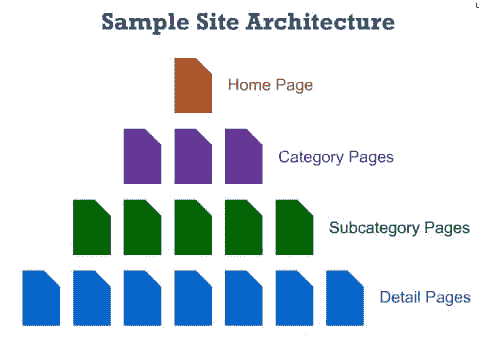

Example of a clear site architecture

确保主页是你网站的主页面，所有其他的页面都可以很容易地从那里分出来。使用清晰的标题和直观的结构来组织你的页面，尽可能将所有内容分成相关的子类别。

厌倦了低于 1 级的 WordPress 托管支持而没有答案？试试我们世界一流的支持团队！[查看我们的计划](https://kinsta.com/plans/?in-article-cta)

覆盖“标准”网页也不错，比如[关于](https://kinsta.com/about-us/)、[联系人](https://kinsta.com/contact-us/)和产品/服务。谷歌和用户都非常容易理解这些内容，它们也是 SERPs 的优秀登陆页面。

### 5.向 Google 搜索控制台添加 XML 站点地图

站点地图帮助搜索引擎理解和抓取你的网站，并确定哪些是最重要的页面。

如果你有一个清晰的网站结构，并且你已经将一个网站地图链接到你的谷歌搜索控制台账户，谷歌在抓取和分析你的网站时会有优势。

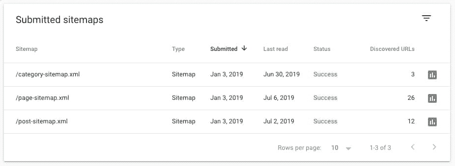

Example of a successful sitemap

当选择哪些页面作为 SERPs 中的站点链接时，Google 会查看每个页面的优先级和流量，以评估其对搜索者的有用性。通过添加一个网站地图到你的谷歌搜索控制台，你将帮助谷歌选择最相关的网站链接。

你还可以监控你的哪些帖子符合 [sitelinks 搜索框](https://developers.google.com/search/docs/data-types/sitelinks-searchbox)的条件。

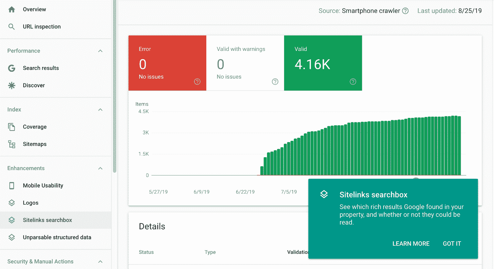

Google sitelinks searchbox

### 6.建立内部链接

内部链接是 [SEO](https://kinsta.com/blog/what-does-seo-stand-for/) 的一个重要(有时被忽视)部分。你链接到网站内部页面的次数越多，这个页面在谷歌看来就越重要。

如果你的页面经常链接到一个特定的产品，联系页面或者你的关于页面，这些将会是谷歌站点链接的很好的候选。

使用内部链接引导用户(和谷歌)浏览你的网站。Nat Elison 在他的关于[营销书籍](https://www.nateliason.com/blog/best-marketing-books)的文章中做得很好:

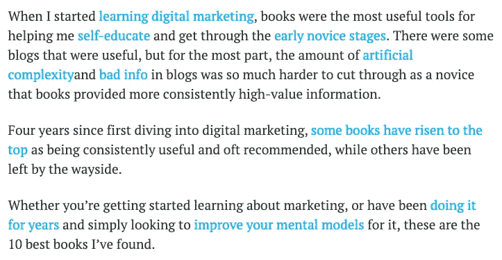

Internal linking: example with Nat Eliason

所有这些内部链接引导用户浏览他的网站，把他们带到他们可能会发现有用的相关内容。

我们在金斯塔也做同样的事情。看看这篇关于[对外营销](https://kinsta.com/blog/outbound-marketing/)的文章就知道了:

Kinsta internal links

在内容中，我们添加了与该主题相关的其他文章的内部链接。这不仅有助于谷歌爬虫更好地浏览我们的网站，而且有助于用户在浏览我们的网站的同时与我们的内容互动。

如果你想了解你网站的内部链接，你可以在谷歌搜索控制台中[追踪它们，看看你的网站链接到特定页面的次数。如果有一个你特别想放在网站链接中，确保你在网站的其余部分都链接到它。](https://kinsta.com/blog/google-search-console/#using-the-link-report)

### 7.使用相关的页面标题

这是 SEO 101。页面标题是网站中最重要的 SEO 元素之一。

通过确保每个页面都有最有效的标题，你可以帮助提高你的整体搜索引擎优化，并帮助谷歌挑选相关的网站链接。

谷歌站点链接是从你的页面标题中生成的，所以要确保它们与页面内容一致。特雷罗在这方面做得很好:

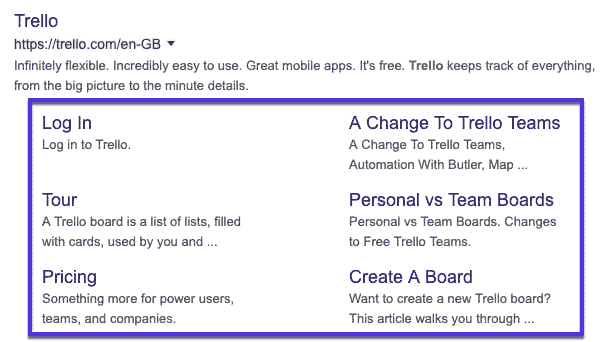

Trello sitelinks

每个页面标题都应该是对页面内容的简短、合理的描述。与页面内容无关的标题会让谷歌感到困惑，这意味着它们将很难排名——你可以和网站链接说再见了。

使用有趣或不寻常的标题很有诱惑力，但是要注意这可能会影响你的 SEO 和站点链接的分配。例如，一个名为“找出让我们成功的原因”的关于页面，对谷歌的搜索算法来说并不是特别清晰。

### 8.提高品牌知名度

提高你的品牌知名度不是一蹴而就的。这是一个持续的过程。

在网上进一步传播你的品牌名称将有助于提高你网站的权威性和受欢迎程度，这两者都是谷歌用来决定排名的因素。

为你的公司建立一个正面的声誉，确保人们听说过你。以下是你推广品牌的一些方法:

*   热门行业网站的客座博客。
*   接受采访。
*   接触在线新闻渠道。
*   获得积极的评价和褒奖。
*   参与在线社区讨论。

越多的人知道你公司的名字，你就会收到越多的品牌搜索，你获得站点链接的机会也就越大。

### 旁注: Google AdWords 网站链接

值得注意的是，谷歌 AdWords 网站链接与谷歌搜索网站链接并不相同。

Google AdWords sitelinks

当你[建立一个 AdWords 活动](https://kinsta.com/blog/how-to-use-google-adwords/)时，你可以选择给广告添加站点链接，帮助引导人们到特定的页面。您还可以添加网站链接的简短描述，使您的广告对查看它们的人更相关、更有用。

虽然它们看起来非常相似，并且执行相同的功能，但 AdWords 网站链接是由竞选经理添加的，而有机网站链接是由谷歌生成的，不能由网站所有者指定。

[More traffic and improved SEO? Google sitelinks are your answer for both! Here's our detailed guide on how to get them 🔝📈Click to Tweet](https://twitter.com/intent/tweet?url=https%3A%2F%2Fbit.ly%2F2NSmcvi&via=kinsta&text=More+traffic+and+improved+SEO%3F+Google+sitelinks+are+your+answer+for+both%21+Here%27s+our+detailed+guide+on+how+to+get+them+%F0%9F%94%9D%F0%9F%93%88&hashtags=google%2Cseo)

## 摘要

现在你知道如何获取站点链接了…出去获取吧！

我不能保证你会得到站点链接，也不能保证它们每次都会出现。但是如果你能投入时间，这些好处是值得的。

通过遵循这些步骤，你可以增加获得站点链接的机会，这将导致有机流量、线索和品牌知名度的提升。

像 SEO 的任何元素一样，获得站点链接不是一朝一夕的事。你所能做的就是遵循最佳实践指南，保持你持续的 SEO 努力，给你自己赢得这些站点链接的最好机会。耐心点。

* * *

让你所有的[应用程序](https://kinsta.com/application-hosting/)、[数据库](https://kinsta.com/database-hosting/)和 [WordPress 网站](https://kinsta.com/wordpress-hosting/)在线并在一个屋檐下。我们功能丰富的高性能云平台包括:

*   在 MyKinsta 仪表盘中轻松设置和管理
*   24/7 专家支持
*   最好的谷歌云平台硬件和网络，由 Kubernetes 提供最大的可扩展性
*   面向速度和安全性的企业级 Cloudflare 集成
*   全球受众覆盖全球多达 35 个数据中心和 275 多个 pop

在第一个月使用托管的[应用程序或托管](https://kinsta.com/application-hosting/)的[数据库，您可以享受 20 美元的优惠，亲自测试一下。探索我们的](https://kinsta.com/database-hosting/)[计划](https://kinsta.com/plans/)或[与销售人员交谈](https://kinsta.com/contact-us/)以找到最适合您的方式。