# Google Workspace(以前的 G Suite)为您的企业带来的好处(我们为什么使用它)

> 原文：<https://kinsta.com/blog/google-workspace/>

我们在金斯塔使用大量不同的 [SaaS 产品](https://kinsta.com/blog/saas-products/),以保持幕后一切顺利运行，并提高我们团队的生产力。我们离不开的一个产品绝对是 Google Workspace！我们不怕站出来说，它是目前市场上最适合您业务的电子邮件解决方案。👍更不用说它自带的其他功能了，比如 Google Drive 存储和 Google Docs、Google Sheets 等工具。

今天，我们将深入探讨 Google Workspace(以前的 G Suite)的无与伦比的优势，**我们为什么使用它并向我们所有的客户推荐它**，以及它与市场上其他类似解决方案的比较。

*   [什么是 Google Workspace？](#google-workspace)
*   [Google Workspace 无与伦比的优势](#benefits-of-google-workspace)
*   [Google Workspace vs Office 365 vs Zoho](#google-workspace-vs-office-365-vs-zoho)
*   [Google Workspace 的缺点](#disadvantages-of-google-workspace)
*   [如何移至谷歌工作区](#move-to-google-workspace)
*   [谷歌工作区提示](#google-workspace-tips)

## 什么是 Google Workspace？

[Google Workspace](https://workspace.google.com/) 是谷歌的智能应用套件。这之前被称为谷歌应用程序，直到 2016 年底重新命名。我们主要向需要电子邮件托管服务的客户推荐 Google Workspace。然而，谷歌工作空间不仅仅是电子邮件。它还包括各种各样的应用程序和功能，可以派上用场。事实上，您可能已经在使用或熟悉其中的一些。

### 我们日常使用的功能

Google Workspace 有三种不同的计划可供您使用(稍后我们将深入探讨其中的一种)。我们利用**基本谷歌工作空间计划**为我们在金斯塔的员工服务。起价仅为 5 美元/用户/月。对你们中的许多人来说，基本计划可能就是你所需要的全部。以下是它包含的内容:

#### 谷歌邮箱

根据 Litmus 公司的数据，Gmail 作为最受欢迎的电子邮件客户端遥遥领先，以打开率计算，其市场份额高达 26%。这并不奇怪，因为 [Gmail](https://mail.google.com/) 自 2004 年就已经存在，现在拥有超过[12 亿用户](https://expandedramblings.com/index.php/gmail-statistics/)。Google Workspace 最棒的一点是，你基本上获得了一个你可能已经在使用的在线电子邮件客户端的增强版**无广告版**。

> Kinsta 把我宠坏了，所以我现在要求每个供应商都提供这样的服务。我们还试图通过我们的 SaaS 工具支持达到这一水平。
> 
> <footer class="wp-block-kinsta-client-quote__footer">
> 
> 
> 
> <cite class="wp-block-kinsta-client-quote__cite">Suganthan Mohanadasan from @Suganthanmn</cite></footer>

[View plans](https://kinsta.com/plans/)

Google Workspace 本质上允许你的员工拥有自己的 Gmail 账户，邮箱地址为 [**，商业域名为**](https://kinsta.com/blog/professional-email-address/) (例如:[【邮箱保护】](/cdn-cgi/l/email-protection))。一个只有一两个用户的非常小的企业也许可以通过免费的 Gmail 账户和一些别名+转发规则逃脱惩罚。但是一旦你开始雇佣两三个员工，你会发现自己需要可以单独管理的账户。

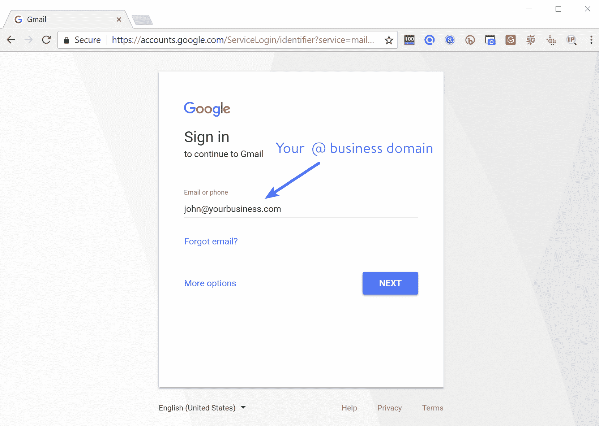

Gmail custom domain

#### 谷歌日历

我们在金斯塔的人都离不开谷歌日历。我们中的许多人依靠它来安排与客户的通话，设置重要项目的截止日期和提醒。谷歌日历可以帮助你组织你的日程。

在 Google Workspace 中使用 Google Calendar 的一个好处是能够创建多个日历，供公司中的每个人(甚至是用户的子集)访问。例如，您可能需要一个用于团队假日和例会等活动的小组日历。与免费版本相比，让所有员工都隶属于同一个组织会使这些任务变得更加容易。

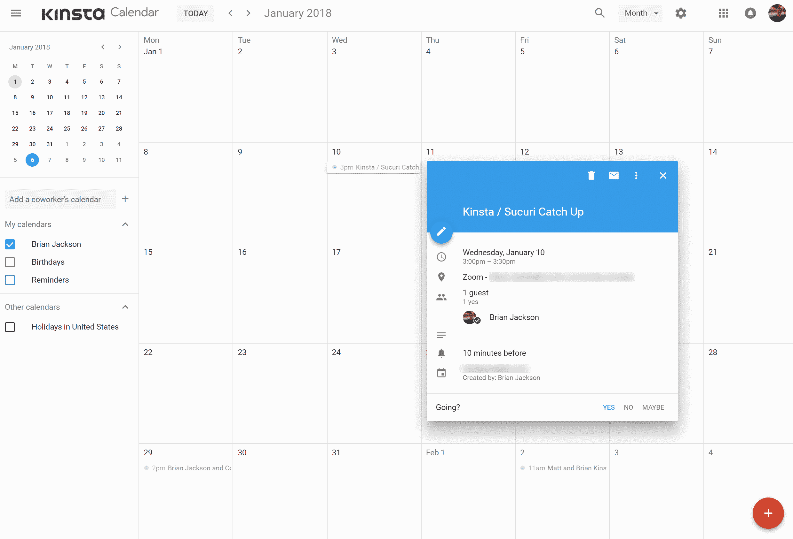

Google Calendar

#### Google Drive

[Google Drive](https://drive.google.com/drive/) 允许您在一个安全的地方存储、访问和共享您的文件。然后，您可以从任何设备轻松访问它们。谷歌 Workspace 基本计划为每位员工配备了 **30GB 的存储空间**。Google Workspace 的商业版、企业版和团队版提供了**无限存储空间**，因此您将始终有足够的空间来存放您的文件。注意:如果您是一个少于 5 个用户的小型团队，您只能获得 1TB/用户。

如果你以前没有使用过 Google Drive，我们最喜欢它的一点就是它惊人的搜索功能！虽然，这可能并不令人惊讶，因为他们也运行着世界上最大的搜索引擎。您是否知道可以基于文档中的内容进行搜索(不考虑文件名)？非常方便。这意味着无论你有多混乱，你都可以很容易地找到你要找的东西。😉

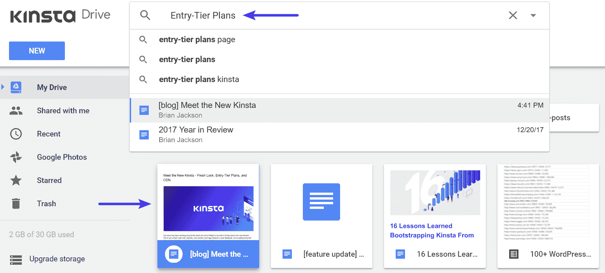

Google Drive search

付费版 Google Drive 的存储容量是免费版个人硬盘和 Gmail 的两倍，支持 24/7、共享控制和高级报告。

#### 谷歌文档和谷歌表单

谷歌文档和[谷歌表单](https://docs.google.com/spreadsheets/)几乎不言自明，也是我们每天都在使用的工具。你甚至可以[将谷歌文档导入 WordPress](https://kinsta.com/blog/google-docs-to-wordpress/) 。这些允许您在浏览器中创建和编辑文本文档和电子表格。导入您的文档，使其可立即编辑，包括 Microsoft Word、Excel 和 PDF 文件(。docx，。doc，。pdf，。rtf，。txt，xlsx，。csv，。html，。ods)。截至 2018 年 2 月，你现在甚至可以在微软 Office 文件上进行协作和评论，而不必自动转换为谷歌的格式。

您也可以导出为常见的第三方格式。这使得与其他个人或公司协作以及来回发送文件变得容易，而无需安装或购买额外的软件。

注意:直接在 Google Workspace 中创建的 Google 文档和电子表格不计入您的存储空间限制。👍

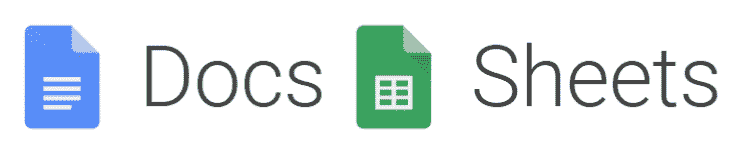

以下是我们使用它们的一些常见任务:

*   获得团队成员对新网站内容的反馈和意见。
*   与客座博主一起为我们的博客撰写内容。
*   在第三方网站上写作时向他人发送内容。在过去的几年里，我们从来没有人要求 Word 文档，每个人都要求谷歌文档。为什么？因为就是超级简单好用。
*   处理来自 Ahrefs 导出的电子表格数据。
*   运行快速财务数据。
*   跟踪 PPC 预算和在线广告文案的变化。
*   分析与 SERPs 相关的 CTR 变化。
*   为付费赞助撰写内容(文字营)。

谷歌文档和电子表格最好的功能之一是**实时评论和无限版本**。以前的版本会无限期保留，不会计入您的存储空间。这使得跟踪对文档的修改或撤销错误变得非常容易。与同事或其他个人共享文档也非常容易。

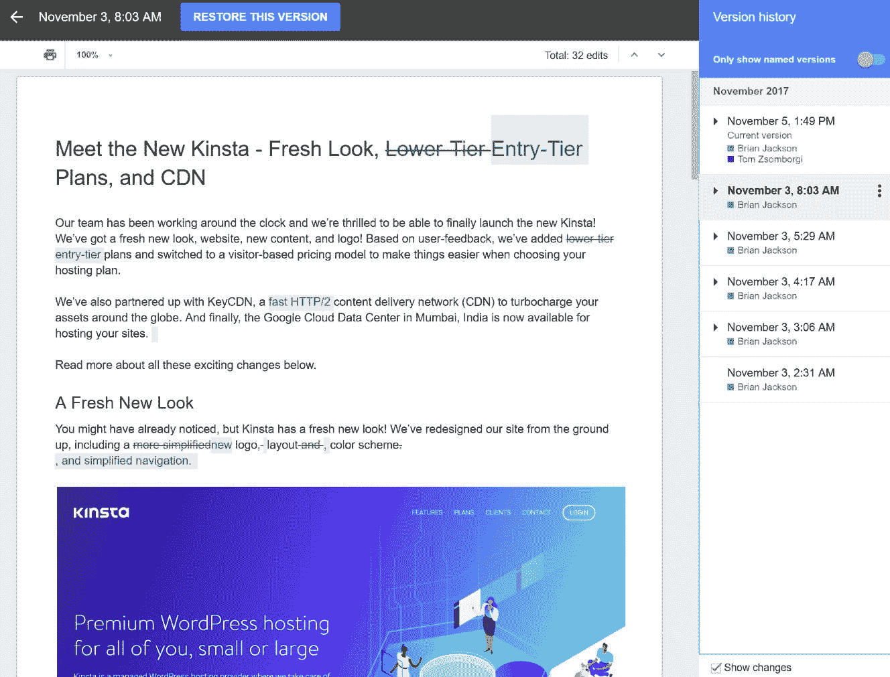

Google Docs versions

#### Google Keep

Google Keep 似乎是那些没人知道的保守得很好的秘密之一。如果你正在寻找一个基本的 **Evernote 替代品**，谷歌 Keep rocks！不管你是否在使用 Google Workspace，这都是一个很棒的小工具。作为谷歌的产品，它在谷歌的生态系统中完美无缺。

这是一种简单的方法，可以将客户的常见问题放在一个方便的地方。创建待办事项列表、便笺，并设置提醒以保持进度。所有内容都会在您的设备间同步，因此重要的内容总是触手可及。轻松地与您的团队分享，并在完成后存档。谷歌的搜索又一次完美地配合了它。

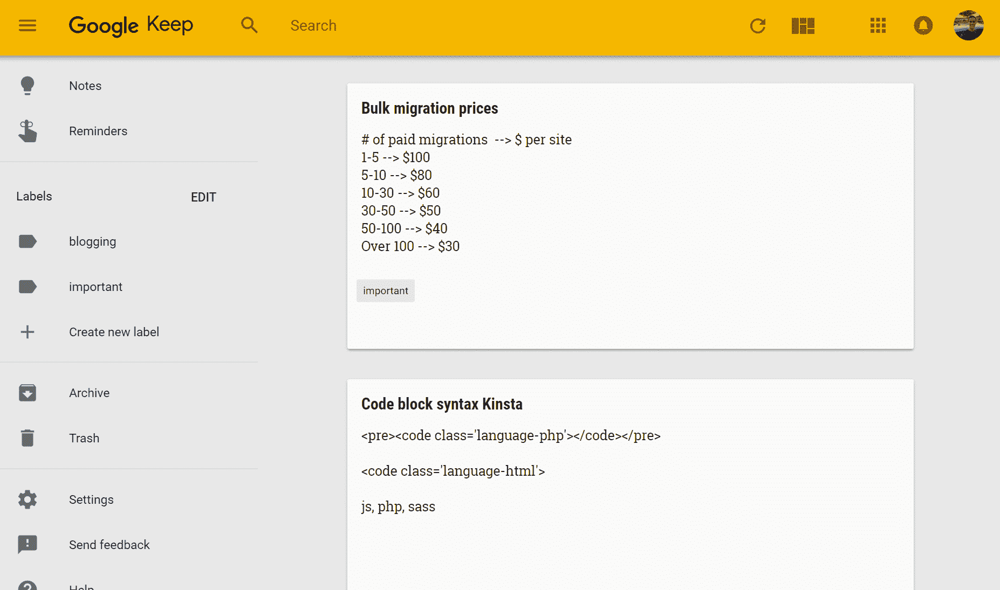

Google Keep

#### Google Workspace 管理控制台

Google Workspace 的[管理控制台](https://admin.google.com/)允许企业主从一个地方轻松管理一切。它最近进行了一次大修，比以前的谷歌应用程序要好很多。

从添加新用户和组、管理设备、配置安全设置(如双因素身份验证)，到为您的企业添加可用于 Gmail 的新自定义域，无所不包。

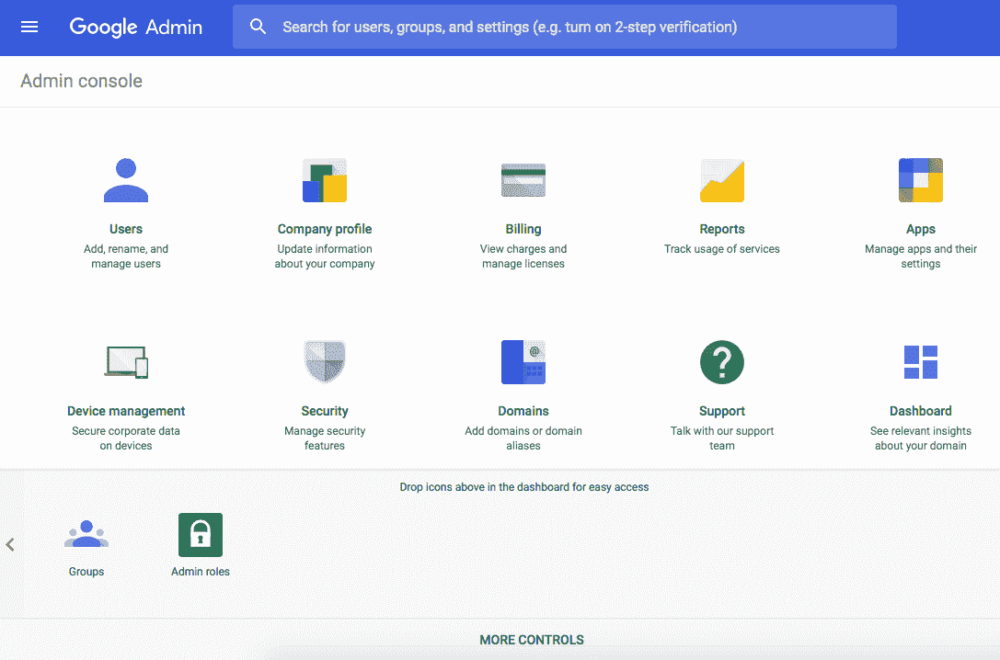

Google Workspace admin console

Google Workspace 中的大多数(如果不是全部)功能都必须由管理员启用才能使用。其中一些也只能在更高的计划中使用。如果某个功能未启用，而用户试图访问它，他们会看到一条“不可用”的消息(如下所示)。

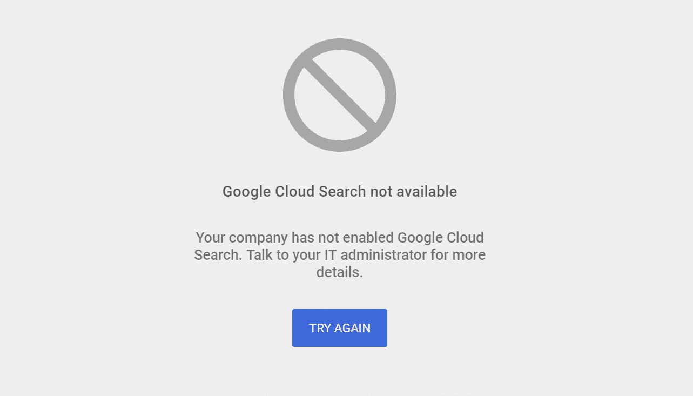

Google Workspace not available

### 附加功能

以下是我们在 Kinsta 不常用的一些附加功能，但您可能会感兴趣:

## 注册订阅时事通讯

### 想知道我们是怎么让流量增长超过 1000%的吗？

加入 20，000 多名获得我们每周时事通讯和内部消息的人的行列吧！

[Subscribe Now](#newsletter)

*   **Google Chat:** 你听说过 [Slack](https://kinsta.com/blog/how-to-use-slack/) 吗？[谷歌聊天](https://workspace.google.com/products/chat/)基本上是谷歌新的竞争工具。这是一个专用的小组工作区，有 1:1 聊天和小组聊天。您可以通过与深度集成的谷歌机器人和第三方应用程序直接交互来提高对话效率。所有 Google Workspace 计划都免费包含 Google chat。
*   Google Meet: 在 Kinsta，我们自己更喜欢 Zoom 或 Slack 视频聊天，但 [Google Meet](https://workspace.google.com/products/meet/) 仍然让视频电话和会议变得轻而易举。Meet 与 Google Workspace 完全集成，因此您可以通过日历事件或电子邮件邀请直接参加会议。如果你运行的是 Google Workspace 的企业版，当人们在旅途中或者没有互联网接入时，你也可以利用拨入号码。
*   **谷歌表格:**你们大多数人可能都填写过[谷歌表格](https://kinsta.com/blog/embed-google-form/)。虽然我们更喜欢使用其他应用程序，最好是我们 WordPress 网站中的品牌表单，但这是一种非常快速简单的收集信息的方式。
*   **谷歌幻灯片:**想要一个像样的微软 Powerpoint 替代品？[谷歌幻灯片](https://workspace.google.com/products/slides/)就是这样。就像他们的其他产品一样，你可以利用他们的实时协作和评论，以及无限的版本历史。
*   谷歌网站:我们不推荐使用[谷歌网站](https://workspace.google.com/products/sites/)，因为 WordPress 在这方面要好得多。查看你应该使用 WordPress 的理由[。](https://kinsta.com/blog/why-use-wordpress/)
*   **终端管理:**如果您担心员工的设备被盗，请不要担心。这就是[端点管理](https://workspace.google.com/products/admin/endpoint/)的用途。作为管理员，您可以轻松实现这一点，并在需要时远程擦除设备上的 Google Workspace 数据。

金斯塔和 G 组曲有什么共同点？让事情在幕后平稳运行的能力。[免费试用 kin sta](https://hubs.ly/H0pklC_0)。

### 面向 Google Workspace 商业和企业用户的附加功能

记下 Google Workspace 业务和企业计划中的附加功能也很重要。如果你是一家大公司，并且严重依赖电子邮件，这些可以帮助你减轻一些担忧。

*   **云搜索:**想在 Google Workspace 的搜索功能上更进一步？[云搜索](https://workspace.google.com/products/cloud-search/)功能允许你在谷歌工作区搜索你公司的内容。从 Gmail 和 Drive 到文档、工作表、幻灯片、日历等等。
*   **保险库:**备份再多也不嫌多。 [Vault](https://workspace.google.com/products/vault/) 允许您管理、保留、搜索和导出您组织的电子邮件、Google Drive 文件内容和记录在案的聊天记录。基本上，您可以归档所有数据并设置保留策略。

## Google Workspace 无与伦比的优势

虽然上述所有功能都很棒，但现在是时候深入了解使用 Google Workspace 为您的业务带来的一些真正好处了。

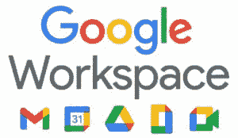

### 总是建议通过第三方托管电子邮件

永远不要建议你的电子邮件放在你用来托管的同一家公司。这就是为什么我们现在不会，将来也不会向我们的客户提供电子邮件托管服务(除了在 MyKinsta 的 Google Workspace 插件之外)。🤫)我们在这里详细讲述原因[。但是我们会在下面给你一个快速总结:](https://kinsta.com/blog/email-marketing-software/#downfalls-of-using-hosts-email-server)

1.  如果您使用您的主机，您会被绑定到您的主机为外发电子邮件配置的 IP 地址。如果出现问题，比如客户端突然发送垃圾邮件，该 IP 地址就有可能被列入垃圾邮件黑名单。然后你突然失去了控制。
2.  依靠你的 WordPress 主机收发电子邮件的最大缺点之一就是邮件送达的问题。有了 Google Workspace，你可以**使用 DKIM 和 SPF 记录**验证出站邮件，这可以积极[影响你的垃圾邮件评级](https://kinsta.com/blog/why-are-my-emails-going-to-spam/)。
3.  通过你的 WordPress 主机发送邮件可能会导致服务器资源问题。通过将电子邮件卸载到第三方，尤其是 Google Workspace，你将永远不用担心这个问题。
4.  将服务分散到多个提供商总是一件好事。我们总是建议分离域名系统(我们为所有客户提供了[亚马逊 53 号域名系统](https://kinsta.com/blog/premium-dns/))、WordPress 主机和电子邮件。这样，如果其中一个出了问题，你的电子邮件总是畅通无阻。最有可能的情况是，您的 DNS 仍然会进行路由，但是通过使用多个提供商，您可以保证这一点。

因此，正如你所看到的，使用第三方托管电子邮件实际上对你的业务有益。

#### 警告(交易和营销电子邮件)

虽然 Google Workspace 帐户没有 SMTP 限制，但对于那些每月发送数千封电子邮件的人，我们通常不建议他们发送批量电子邮件或交易电子邮件(购买、注册、重置密码等)。你可以阅读他们的[批量发件人指南](https://support.google.com/mail/answer/81126)的清单。对于这些类型的电子邮件，我们推荐以下交易电子邮件服务:

Mailgun

*   [气枪](https://kinsta.com/knowledgebase/mailgun-wordpress/)
*   [发送网格](https://sendgrid.com/)
*   [火花柱](https://www.sparkpost.com/)
*   [里程数](https://www.mailjet.com/feature/smtp-relay/)
*   [亚马逊 SES](https://aws.amazon.com/ses/)

如果你是小公司，刚刚起步，不要担心你的交易邮件，直到你开始发送大量邮件。你可以从 Google Workspace 开始做任何事情，一切都很好。此外，一些供应商，如上面的 Mailgun，让你每月免费发送 10，000 封交易电子邮件。所以在很多情况下，这不一定是额外的支出。在此之后，发送额外的电子邮件只需几分钱。阅读更多关于[交易电子邮件](https://kinsta.com/blog/email-marketing-software/#transactional-email-service)、 [SMTP 端口](https://kinsta.com/blog/smtp-port/)和[免费的 WordPress SMPT 服务器。](https://kinsta.com/blog/free-smtp-server/)

然后你会收到营销邮件，比如时事通讯。同样的事情也适用于这里。通常情况下，您会希望使用第三方提供商，因为他们有更好的投递率和工具来建立列表、进行 A/B 测试等。以下是我们推荐的几种:

MailChimp

*   [MailChimp](https://mailchimp.com/) ( **我们在 Kinsta 利用它们**来发布我们的每周时事通讯——这是我们关于[如何开始使用 MailChimp](https://kinsta.com/blog/how-to-use-mailchimp/) 的指南
*   [MailerLite](https://www.mailerlite.com/)
*   [点滴](https://www.drip.com/)
*   [ActiveCampaign](https://www.activecampaign.com/)
*   [去年 12 月](https://www.aweber.com/)
*   [推进](https://www.getresponse.com/)

上面的一些交易提供商也处理营销电子邮件，并在他们的网站上提到这一点。因此，在某些情况下，你总是可以结合你的交易电子邮件服务和电子邮件营销软件。阅读更多关于[电子邮件营销软件](https://kinsta.com/blog/email-marketing-software/#email-marketing-software)的信息。

### 熟悉、兼容且易于使用

为您的企业使用 Google Workspace 的最大好处之一是，您的大多数员工可能已经习惯于使用 Gmail 等产品收发电子邮件和使用 Google Docs。这让过渡变得非常容易，并确保你不必浪费时间向新员工解释如何利用公司工具；不像 Zoho 或 [Office 365](https://kinsta.com/knowledgebase/office-365-smtp/) 可能需要更多的解释。

与其他电子邮件提供商相比，Google Workspace 在移动设备上的兼容性最好。它在任何地方都有效！

如果你已经有了一个个人 Gmail 账户，谷歌可以让你非常容易地在账户之间(个人 Gmail 和谷歌工作空间账户)进行**一键切换。**

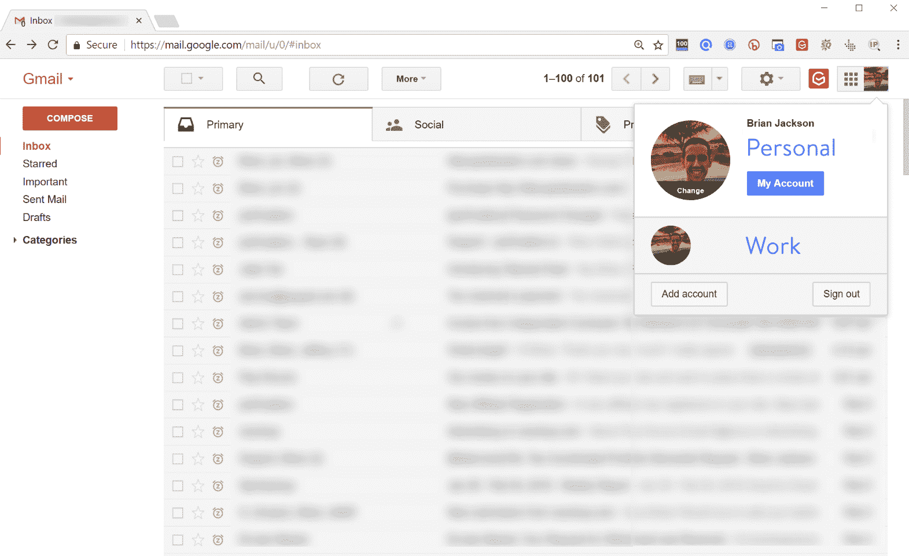

Google Workspace switch accounts

### 正常运行时间

谈到正常运行时间，谷歌是可靠性最好的公司之一。如果你想深入了解技术细节，谷歌工作区为覆盖的服务提供了 99.9% [的服务水平协议](https://workspace.google.com/intl/en/terms/sla.html) (SLA)，近年来他们实际上已经超过了这一水平。此外，由于电子邮件是每个企业如此重要的一部分，谷歌工作空间**没有计划停机或维护窗口**。他们所有的数据中心都构建有冗余基础架构。

但就像任何服务一样，它们不可能 100%的时间都在运行。因此，您可以随时将[Google Workspace status dashboard](https://www.google.com/appsstatus/dashboard/#hl=en&v=status)标记为书签，以获取所有产品的更新。

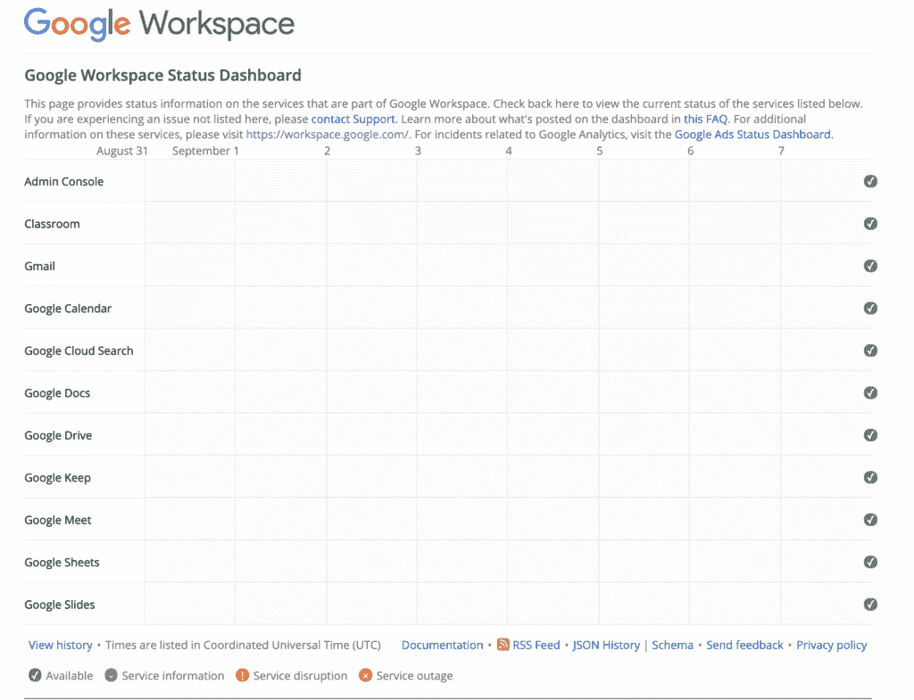

### 谷歌工作空间不是最便宜的，但它非常实惠

还有其他更便宜的提供商，比如 Zoho(我们将在下面进一步比较)。然而，就像我们总是建议你投资 [WordPress hosting](https://kinsta.com/wordpress-hosting/) 一样，你的商务邮件不是你应该努力省钱的领域之一。拥有一个可以依赖的电子邮件主机可以为你省钱。

下面来看看 Google Workspace 的定价以及每个计划都包括哪些内容。

| 

#### 谷歌工作空间商业入门

 | 

#### Google Workspace Business Standards

 | 

#### Google Workspace Business Edition

 |
| **$ 6/用户/月** | 12 美元/用户/月 | 18 美元/用户/月 |
| 通过 Gmail 发送商务电子邮件 | 通过 Gmail 发送商务电子邮件 | 通过 Gmail + eDiscovery 的商务电子邮件，保留 |
| 100 名参与者视频会议 | 150 名参与者视频会议+录制 | 250 名与会者视频会议+录音，出席跟踪 |
| 共享日历 | 共享日历 | 共享日历 |
| 文档、电子表格、幻灯片 | 文档、电子表格、幻灯片 | 文档、电子表格、幻灯片 |
| 全天候支持(电话、电子邮件在线) | 24/7 支持(电话、在线电子邮件–提供增强支持升级) | 24/7 支持(电话、在线电子邮件–提供增强支持升级) |
| 安全管理控制 | 安全管理控制 | 增强的安全管理控制，包括保险存储和高级终端管理 |
| 每个用户 30 GB 云存储 | 每位用户 2 TB 云存储 | 每个用户 5 TB 云存储 |
| 云搜索 | 云搜索 |
| 保险库(存档和保留) | 保险库(存档和保留) |
| 审计报告 | 审计报告 |
| 数据丢失防护(Gmail + Drive) |
| Gmail 托管的 S/MIME |
| Gmail 第三方存档 |
| 企业级安全性 |
| Gmail 日志分析 |

以下是对你的一些快速评估:

*   对于 5 名员工来说，你的月薪是 30 美元
*   对于 10 名员工来说，你的月薪是 60 美元
*   对于 15 名员工来说，你的月薪是 90 美元

对于 Google Workspace 包含的所有东西来说，这是一笔非常好的交易，而且是一个显而易见的事情！

您也可以通过切换到年度订阅来选择折扣费率。年度套餐比标准月套餐节省高达 20%的费用。最重要的是，如果你愿意，你仍然可以按月支付年费。

金斯塔和 G 组曲有什么共同点？让事情在幕后平稳运行的能力。[免费试用 kin sta](https://hubs.ly/H0pklC_0)。

### Google Workspace 非常安全

Google Workspace 建立在 Google 云平台之上，该平台提供了市场上最高的安全性。它得到了世界上一些大公司的信任；如惠普、威瑞森、惠而浦和 Salesforce。正如谷歌所说，他们以“**安全第一的心态**领先他们拥有行业领先的知识和专业技能来支持他们的每一个产品，包括 Google Workspace。

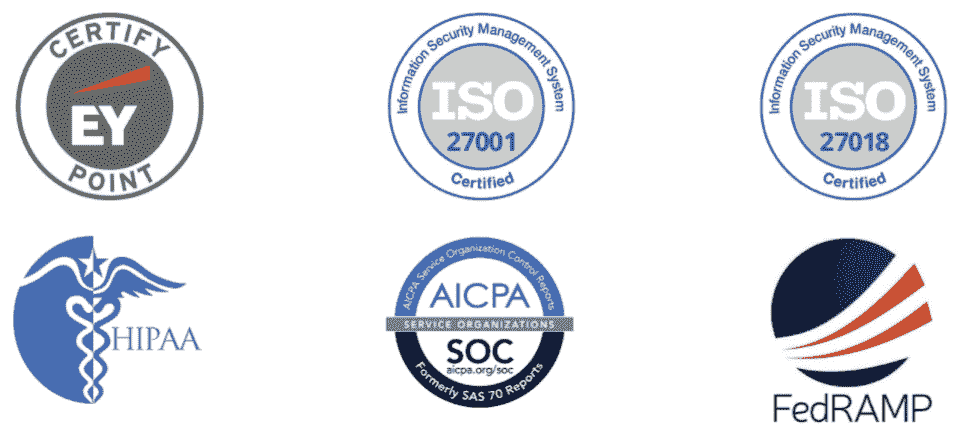

以下是 Google Workspace 保护您和您的数据的几个亮点:

*   **Google Workspace Admin:** 为管理员提供控制数据保护方式、查看报告甚至控制移动设备的能力。Google Workspace 管理员也可以禁止员工启用“[不太安全的应用](https://support.google.com/a/answer/6260879?hl=en)”
*   **加密(TLS):** Google Workspace 提供传输中的邮件加密。
*   **认证、审核和评估:** Google Workspace 定期接受多个独立的第三方审核。
*   **数据保留:** Google Workspace 提供了保留、存档、搜索和导出数据的功能。
*   **隐私:** Google 不会出于广告目的在 Google Workspace 服务中收集、扫描或使用您的数据。谷歌 Workspace 的任何产品中也没有广告。你拥有自己的数据。
*   **透明度:**谷歌持续提供[透明度报告](https://transparencyreport.google.com/)让消费者了解信息。

你可以查看谷歌云的[安全和合规白皮书](https://storage.googleapis.com/gfw-touched-accounts-pdfs/google-cloud-security-and-compliance-whitepaper.pdf)了解更多信息。
T3】

## Google Workspace vs Office 365 vs Zoho

市场上有成千上万的电子邮件主机。但是当涉及到严肃的商务电子邮件托管时，你真的可以把范围缩小到这三个提供商: [Google Workspace](https://workspace.google.com/) 、 [Office 365](https://products.office.com/en-US/?ms.url=office365com) 和 [Zoho](https://www.zoho.com/) 。所以下面我们就做一个小小的对比。

### 定价

对于定价，我们从每个提供商那里获取**月成本**。

| 

#### 谷歌工作空间商业入门

 | [T0】 Office 365 Business Necessary | 

#### Zoho standard

 |
| 6 美元/用户/月 | 6 美元/用户/月 | 4 美元/用户/月 |

附加说明:

*   如果你承诺他们的年度计划或者批量购买许可证，一些确实提供稍微便宜的计划。例如，您可以将 Office 365 降至 5 美元/用户/月，将 Zoho 降至 3 美元/用户/月。
*   事实上，Zoho 有一个针对 5 个用户的免费计划。但是，对于单域托管，它被限制为 5GB。
*   值得注意的是，Office 365 Business Essentials 不包括他们的 Office 桌面软件，只包括他们基于网络的应用程序。

### 软件和工具

以下是各供应商的可比产品。

| 

#### 谷歌工作空间商业入门

 | [T0】 Office 365 Business Necessary | 

#### Zoho standard

 |
| 谷歌邮箱 | Outlook (50GB) | Zoho 邮件 |
| 谷歌硬盘(30GB) | OneDrive (1TB) | Zoho 文档(30GB) |
| 谷歌文档 | 微软 Word | Zoho 作家 |
| 谷歌工作表 | 微软优越试算表 | Zoho 表 |
| 谷歌幻灯片 | Microsoft PowerPoint | Zoho Show |
| 谷歌网站 | 网站(SharePoint) | Zoho 网站 |
| 谷歌会议/聊天 | Skype +微软团队 | Zoho 会议+ Cliq |
| Google Keep | Microsoft OneNote | Zoho 笔记本 |
|  | 微软 Yammer | Zoho 连接 |

附加说明:

*   Google Workspace 的 30GB 存储空间被视为 Google Drive 和 Gmail 的总存储空间。
*   Zoho 的 30GB 存储被算作 Zoho Docs 和 Zoho Mail 的组合存储。
*   如果你比较演示软件，微软的 PowerPoint 仍然有可能轻松胜出。
*   Gmail 与第三方插件和扩展的集成也比它的对手 Outlook 好得多。
*   Zoho 支持使用 eWidget 在邮箱中与各种第三方应用程序进行外部集成。

但是正如您所看到的，上述三家提供商提供的工具和服务非常相似。所以你的很多决定可能会归结到价格和员工的易用性上。

## Google Workspace 的缺点

老实说，我们没有发现使用 Google Workspace 有什么缺点，我们的团队已经使用它四年多了。虽然这肯定取决于你的业务类型。以下是你可以考虑的一些事情:

*   谷歌工作空间完全基于网络，没有软件选项。如果你习惯使用微软办公软件，你可能会发现谷歌文档和表格并没有那么强大。
*   Office 365 仍在赢得企业市场，而 Google Workspace 仍在追赶。
*   Office 365 确实提供了更多的存储空间。然而，如果你升级到更高的计划，谷歌工作区确实提供无限的存储空间。

## 如何迁移到 Google Workspace

我们个人认为 Google Workspace 是电子邮件托管和其他工具的最佳选择，这也是我们向所有客户推荐它的原因。他们还提供 14 天的免费试用，所以你甚至可以在做出任何承诺之前尝试一下。他们的入职流程也非常简单。

以下是为您的企业开始使用 Google Workspace 的一些快速步骤:

### 第一步

[注册](https://workspace.google.com/signup/businessstarter/welcome?hl=en&sku=businessstarter)免费试用。

[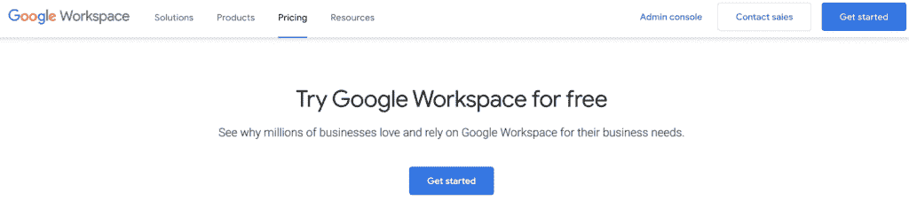T2】](https://workspace.google.com/signup/businessstarter/welcome?hl=en&sku=businessstarter)

### 第二步

登录您的 [Google 管理控制台](https://admin.google.com/)激活您的帐户。(注意:使用您的 Google Workspace 电子邮件地址和密码登录。(该地址以@yourbusiness.com 结尾，不是@gmail 或谷歌个人账户。)

Google Workspace admin console

### 第三步

在管理控制台中，单击“开始安装”启动安装向导。您将在您的域中为每个团队成员提供一个电子邮件地址(如[【电子邮件保护】](/cdn-cgi/l/email-protection))，这样他们就可以开始使用 Gmail、日历、Meet 和所有其他 Google Workspace 服务。您也可以随时手动[添加额外的用户](https://support.google.com/a/answer/179832)。

如果您有额外的域名，您也可以[添加它们或创建电子邮件别名](https://support.google.com/a/answer/7502379?hl=en&visit_id=1-636535433379498545-3895652017&rd=1)。

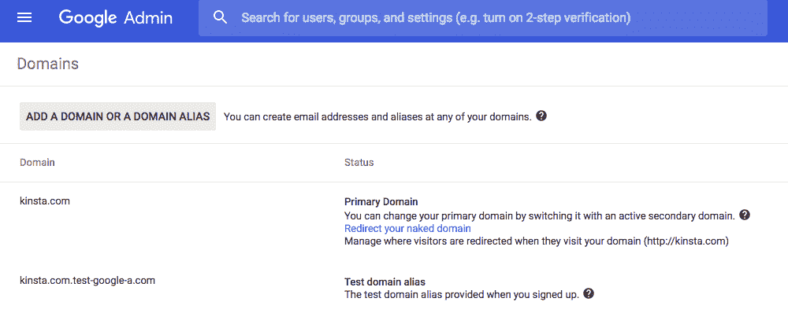

Google Workspace domain alias

### 第四步

在您的管理控制台中，您需要按照步骤验证[您拥有您的域](https://kinsta.com/blog/how-much-does-a-domain-name-cost/)。你将获得一个验证码添加到你的网站或你的域设置。Google Workspace 为[的每一个 DNS 注册商和 DNS 提供商提供了如何验证您的域名](https://support.google.com/a/topic/1409901)的详细说明。

如果你正在使用 Kinsta DNS，我们也有一个关于如何[在我们的 MyKinsta 仪表板中添加你的 Google MX 记录](https://kinsta.com/help/google-mx-records/)的教程。创建您的域时，只需单击一下即可添加记录。

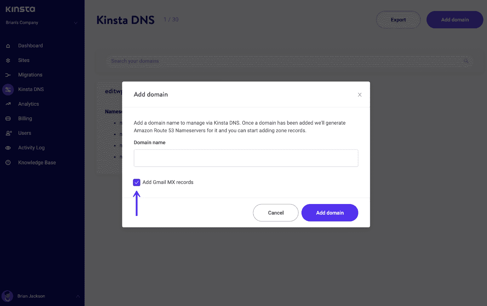

Add Gmail MX records

如果你来自另一个电子邮件主机，如 [GoDaddy](https://kinsta.com/godaddy-alternative/) 、 [BlueHost](https://kinsta.com/bluehost-alternative/) 、 [OVH](https://kinsta.com/ovh-alternative/) 或 Office 365，你很可能也想把你的旧邮件迁移过来。以下是一些有用的链接:

*   [从 Exchange 或 Office 365 迁移电子邮件](https://support.google.com/a/answer/6351465)
*   [从其他网络邮件提供商迁移到 G Suite](https://support.google.com/a/answer/6351474)
*   [将电子邮件从一个 G Suite 帐户迁移到另一个帐户](https://support.google.com/a/answer/6351475)
*   [从 Gmail 迁移到 G Suite](https://support.google.com/a/answer/6167866)

注意:如果你第一次开始使用电子邮件，你可以跳过上面的迁移过程。

### 第五步

最后一步是按照 Google Workspace 的[快速入门指南](https://support.google.com/a/answer/6365252)设置附加应用，如 Google Drive、Google Calendar、Google Contacts 等。就是这样！
T3】

## 谷歌工作区提示

Google Workspace 上线后，你可能会遇到一些小警告或错误。一个是当试图保存个人资料照片时出现以下消息。

> 不好意思！我们无法保存您的个人资料照片。请稍后再试。

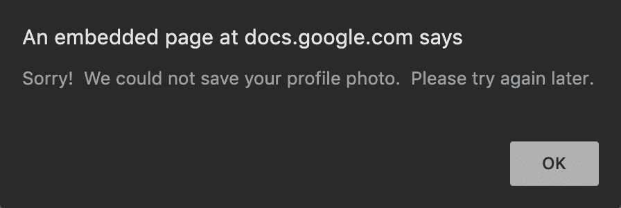

Google Workspace could not save profile photo

在 Google Workspace 中，管理员必须允许用户保存个人资料照片。这可以通过“目录→目录设置→配置文件编辑”来完成

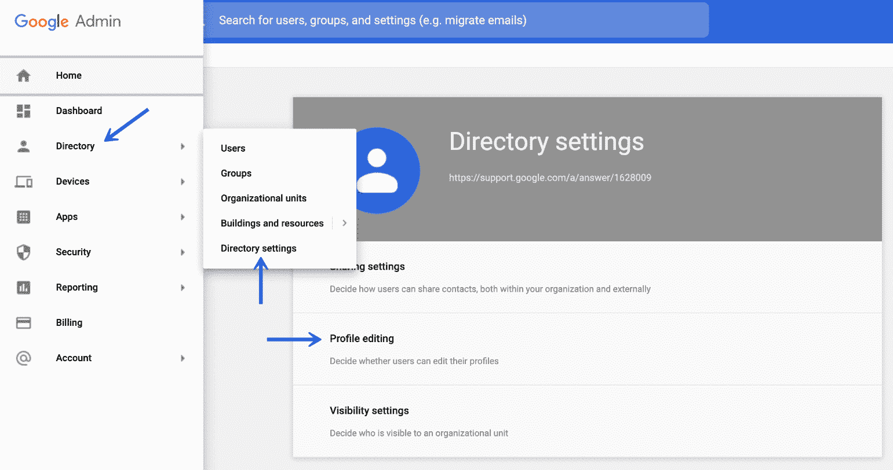

Google Workspace directory profile editing rights

选中“照片”选项，点击“保存”

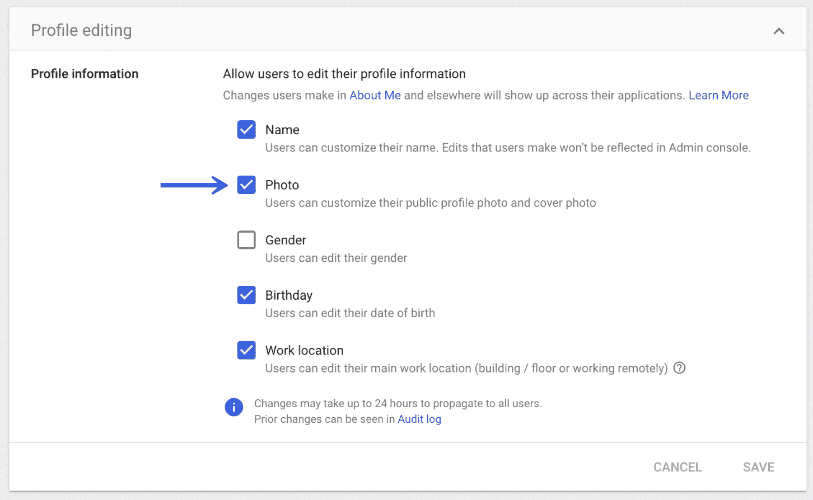

Google Workspace photo

注意:Google Workspace 设置通常需要几个小时才能传播出去。因此，我们建议在尝试再次上传照片之前等待一段时间。

## 摘要

正如你所看到的，在电子邮件托管和提供文档协作和存储的一体化解决方案方面，Google Workspace 可以成为任何企业的一个很好的解决方案。它非常实惠且易于使用。您的大多数员工可能已经熟悉 Gmail，这有助于减少学习新工具所需的时间。

如果你刚刚开始使用 Google Workspace，我们建议[订阅他们的博客](https://workspaceupdates.googleblog.com/)以了解最新的功能和发布。你对 Google Workspace 或者它的工作方式有什么疑问吗？我们很想知道你更喜欢什么样的电子邮件托管服务。请在评论中告诉我们。

* * *

让你所有的[应用程序](https://kinsta.com/application-hosting/)、[数据库](https://kinsta.com/database-hosting/)和 [WordPress 网站](https://kinsta.com/wordpress-hosting/)在线并在一个屋檐下。我们功能丰富的高性能云平台包括:

*   在 MyKinsta 仪表盘中轻松设置和管理
*   24/7 专家支持
*   最好的谷歌云平台硬件和网络，由 Kubernetes 提供最大的可扩展性
*   面向速度和安全性的企业级 Cloudflare 集成
*   全球受众覆盖全球多达 35 个数据中心和 275 多个 pop

在第一个月使用托管的[应用程序或托管](https://kinsta.com/application-hosting/)的[数据库，您可以享受 20 美元的优惠，亲自测试一下。探索我们的](https://kinsta.com/database-hosting/)[计划](https://kinsta.com/plans/)或[与销售人员交谈](https://kinsta.com/contact-us/)以找到最适合您的方式。