# 深入了解 GTmetrix 速度测试工具

> 原文：<https://kinsta.com/blog/gtmetrix-speed-test/>

当运行速度测试来检查性能时，作为网站所有者，你有很多选择。之前我们深入研究了一下 [Pingdom](https://kinsta.com/blog/pingdom-speed-test/) 工具。今天我们想深入探讨如何更好地使用和理解来自流行的**网站速度测试工具 GTmetrix** 的数据。像这样的工具依赖于分级系统和分数，以及对你的网站上可能出现的错误的警告。有时这些可能会让人完全迷惑，所以花些时间来解释它们的真正含义，不仅可以帮助你提高分数，还可以提高你网站的性能，这才是真正重要的。

[Knowing how @GTmetrix works is priceless information for WordPress website owners! ⏱Click to Tweet](https://twitter.com/intent/tweet?url=https%3A%2F%2Fkinsta.com%2Fblog%2Fgtmetrix-speed-test%2F&via=kinsta&text=Knowing+how+%40GTmetrix+works+is+priceless+information+for+WordPress+website+owners%21+%E2%8F%B1&hashtags=webperf%2CWordPress)

GTmetrix 是由加拿大以外的 GT.net 公司开发的，作为一种工具，让他们的主机客户可以轻松地确定他们站点的性能。除了 Pingdom，它可能是当今网络上最广为人知和使用最多的速度测试工具之一！事实上，我们写这篇文章的原因是，我们有许多 Kinsta 客户总是问我们如何遵循他们在 GTmetrix 报告中看到的建议。与其他开发人员工具相比，GTmetrix 非常容易使用，初学者可以很快掌握它。它结合使用[谷歌 PageSpeed Insights](https://kinsta.com/blog/google-pagespeed-insights/) 和 [YSlow](https://kinsta.com/blog/website-speed-test/#yslow) 来生成分数和推荐。

[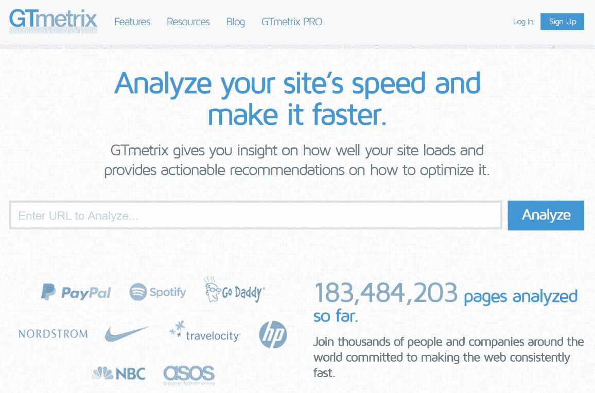](https://gtmetrix.com/)

GTmetrix speed test tool


## GTmetrix 分析选项

GTmetrix 的基本版是完全免费的，您只需注册一个帐户，就可以访问许多选项。他们也有收费计划，但在今天的帖子中，我们将使用免费版本。如果您有一个帐户，您可以使用指定一些额外的分析选项。

首先是能够**选择您想要测试 URL 的位置**。你选择的物理位置实际上非常重要，因为它关系到你的网站实际托管的位置。延迟越短，加载速度越快。目前可用的位置包括:

*   美国达拉斯
*   中国香港
*   英国伦敦
*   印度孟买
*   澳大利亚悉尼
*   巴西圣保罗
*   加拿大温哥华

您可以选择想要使用的浏览器。可以用 Chrome(桌面)和 Firefox(桌面)测试。移动版本可在他们的保费计划。它们还允许您更改连接速度，这意味着您可以模拟各种连接类型，以查看它们如何影响您的页面负载。


> 需要在这里大声喊出来。Kinsta 太神奇了，我用它做我的个人网站。支持是迅速和杰出的，他们的服务器是 WordPress 最快的。
> 
> <footer class="wp-block-kinsta-client-quote__footer">
> 
> 
> 
> <cite class="wp-block-kinsta-client-quote__cite">Phillip Stemann</cite></footer>

[View plans](https://kinsta.com/plans/)

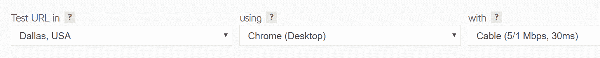

GTmetrix test format options


附加选项包括**创建视频**的能力。这可以帮助您调试问题，因为您可以看到页面是如何呈现的。 **[AdBlock](https://kinsta.com/blog/ad-blockers/) 加**是一个不错的功能。如果您运行的是第三方广告网络，如 [Google Adsense](https://kinsta.com/blog/how-to-add-google-adsense-to-wordpress/) ，您可以启用此选项来查看广告对您的加载时间的全部影响。

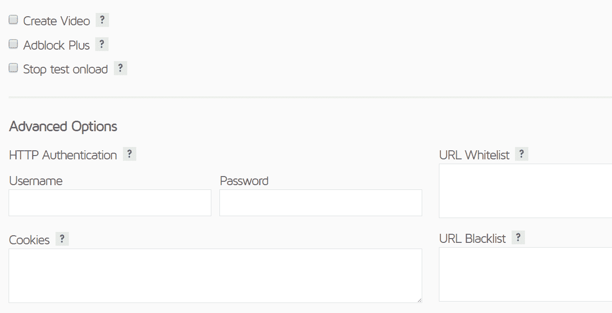

GTmetrix extra options


其他选项包括停止加载测试(我们将在后面深入讨论)，能够随您的请求发送一个 cookie，使用 HTTP 认证，能够将 URL 列入白名单和黑名单，屏幕分辨率和设备像素比率，以及用户代理覆盖。


## 使用 GTmetrix 速度测试工具进行分析

网页由不同的资源组成，比如 HTML、JavaScript、CSS 和图像。每一个都会产生请求来呈现你在网站上看到的内容。通常情况下，你的请求越多，你的网站加载速度就越慢。情况并非总是如此，但大多数时候都是如此。

下面我们将分解每个 GTmetrix 部分，更详细地解释这些信息的含义，因为它们与您网站的整体性能有关，以及如何处理这些建议。记住不要过分纠结于分数，而是要在你的网站上做出实际的**速度提升**。

*   [GTmetrix 摘要](https://kinsta.com/blog/gtmetrix-speed-test/#gtmetrix-summary)
*   [性能](#performance)
*   [结构](#structure)
*   [瀑布图](#waterfall-chart)
*   [视频](#video)
*   [历史](#history)

### GTmetrix 摘要(性能得分和详细信息)

当你通过 GTmetrix 运行你的 WordPress 网站时，它会生成一份性能报告，其中包括你的“GTmetrix 等级”和“网络生命指数”。

GTmetrix 等级是根据两个指标计算的，即绩效和结构。

*   **GTmetrix 性能**是来自 Lighthouse 站点审计工具的性能得分
*   **GTmetrix 结构**是一个[专有的性能指标](https://gtmetrix.com/blog/everything-you-need-to-know-about-the-new-gtmetrix-report-powered-by-lighthouse/#structure-score)，用于衡量页面的整体性能。

2020 年，谷歌推出了一套标准化的网络性能和用户体验指标，称为 Web Vitals。Web Vitals 由多种指标组成，但 GTmetrix 考虑的是最大内容油漆(LCP)、总阻塞时间(TBT)和累积布局移动(CLS)。

*   **maximum Contentful Paint(LCP)**是加载页面最大部分所花费的时间。对于一些网站，LCP 可以是一个大的英雄形象，而在其他网站，LCP 可能指的是正文。
*   **总阻塞时间(TBT)** 是一个页面在用户可以与之交互之前被阻塞的时间。渲染阻塞 CSS 和 JS 会对 TBT 产生巨大的影响。
*   **累积布局移位(CLS)** 指页面加载时元素的移位。例如，当页面加载时，包含嵌入 tweets 的页面布局会发生显著变化。

在我们的例子中，我们使用的是我们的案例研究域 kinstalife.com，它托管在 Kinsta 上。在我们的第一次速度测试中，我们的站点记录了以下数据。

*   GTmetrix 级
*   GTmetrix 性能–85%
*   GTmetrix 结构–83%
*   LCP–1.0s
*   TBT–0 毫秒
*   CLS–0


GTmetrix speed test for kinstalife.com.


然后我们又进行了一次测试，现在我们的 GTmetrix 成绩为“A”！这是怎么回事？如果您多次通过 GTmetrix 速度测试工具运行您的网站，您可能也会注意到这一点。发生这种情况的原因之一是因为缓存，包括 **DNS 缓存和**服务器缓存。在我们的[瀑布分析](https://kinsta.com/blog/gtmetrix-speed-test/#gtmetrix-waterfall)中找出原因。

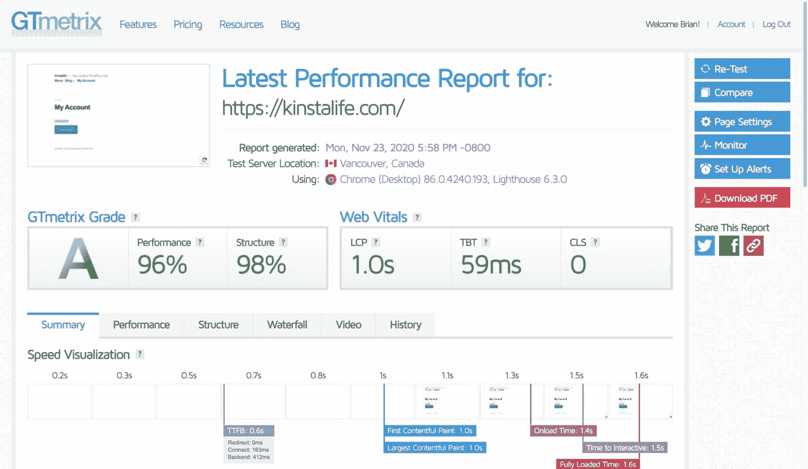

Our second speed test with GTmetrix.


GTmetrix summary 页面还包含速度可视化，显示页面加载期间关键事件的时间线。在下面的截图中，你可以看到 kinstalife.com 的 TTFB、FCP、LCP、加载时间、互动时间和满载时间。

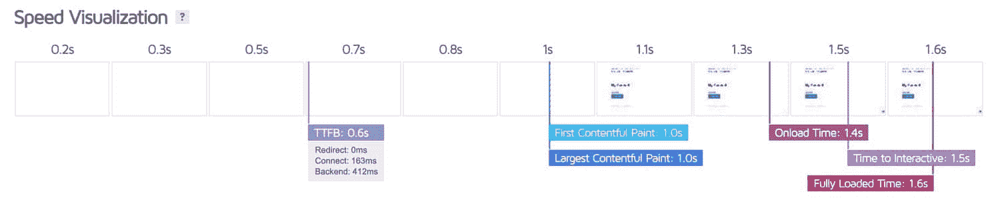

At the bottom of the summary page, there are also “Top Issues” and “Page Details” sections. Under “Top Issues”, you can see a list of high priority items to fix, while “Page Details” provides percentage and file size breakdowns of your page.


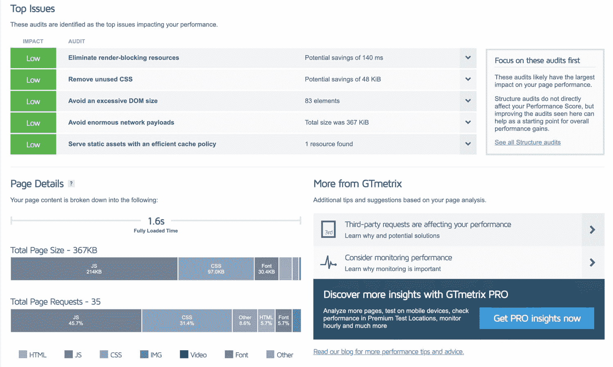

GTmetrix top issues and page details.


### 表演

接下来是 gt metrix“Performance”选项卡，它显示了许多来自 Lighthouse 性能数据的有用指标。除了摘要页面上显示的 LCP、TBT 和 CLS,“性能指标”部分还显示了速度指数(SI)、交互时间(TTI)和第一次内容丰富的绘制(FCP)。

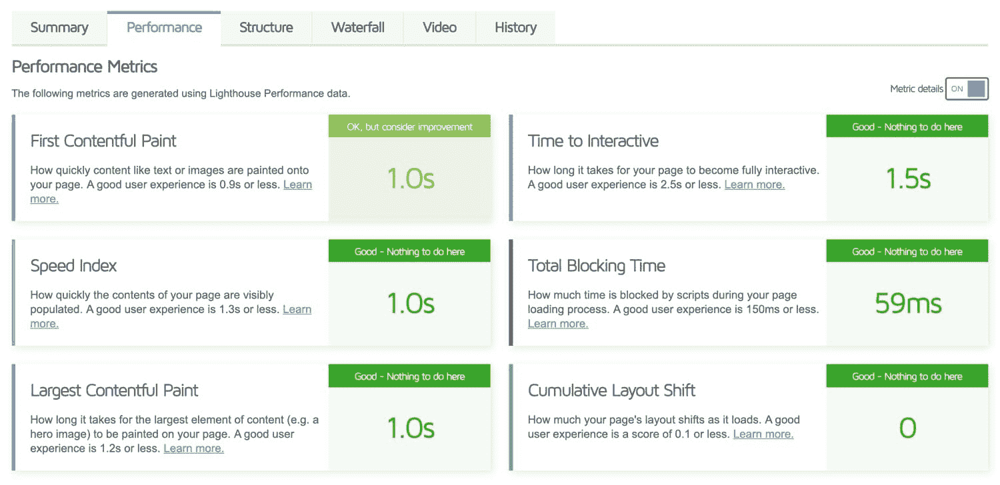

GTmetrix Lighthouse performance metrics.


虽然“性能指标”一节并没有向您展示您需要改进的地方，但是它很好地概述了您可以改进的关键用户体验指标。

在页面下方，GTmetrix 还显示了一些更传统的“浏览器计时”统计数据，包括加载时间、到达第一个字节的时间、完全加载时间等等。在过去，这些传统指标非常重要。然而，随着谷歌为网络生命指标的标准化铺平道路，我们建议对这些指标进行优化。在大多数情况下，你会发现，优化网页生命周期也将导致良好的浏览器计时指标。

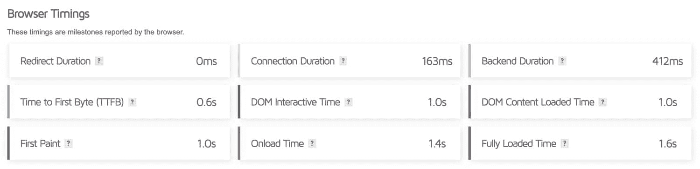

GTmetrix browser timing metrics.


### 结构

在 GTmetrix“结构”选项卡中，您可以查看影响站点性能的特定问题。这个页面非常有用，因为它为你提供了可操作的信息，比如“消除渲染阻塞资源”和“缩小 CSS”来开始优化你的站点。

我们将试图涵盖我们看到的 WordPress 网站所有者遇到的最常见和最受欢迎的问题。请务必将这篇文章加入书签，因为我们会不断更新它。一般来说，如果你在你的站点上改进了这些，你应该会看到性能的提高。

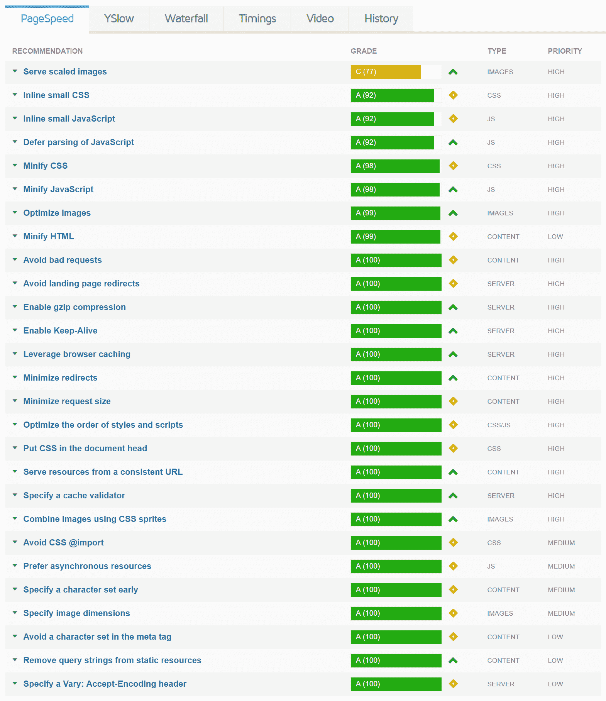

GTmetrix PageSpeed scores


#### 提供缩放图像

当涉及到在你的网站上处理图片时，你应该总是试着上传它们，不要让 CSS 改变它们的大小。如果你不这样做，你最终会得到**提供缩放图像**的推荐。如果你使用的是 WordPress，默认情况下，它会在上传图片到媒体库时调整图片的大小。这些设置可以在“设置>媒体”下找到你需要确保最大宽度接近你的站点的宽度。这样 CSS 就不会试图缩小你的图片来适应它。你也可以用图像优化插件自动调整它们的大小。

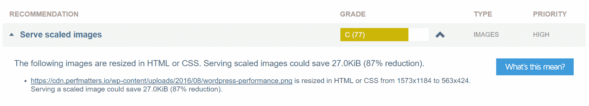

Serve scaled images


#### 内嵌小型 CSS

通常不建议内联 CSS，因为这会增加页面请求的总下载量。然而，如果你的站点很小，请求很少，它可以提高你的性能。

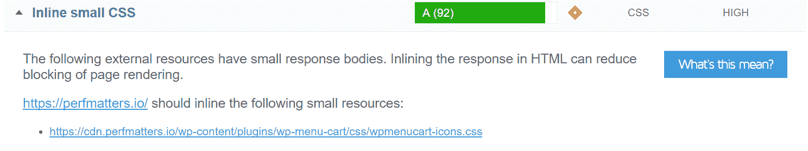

Inline small CSS


为了方便地内联你的 CSS，你可以使用一个免费的插件，比如自动优化。只需检查“内联所有 CSS？”选项，然后确保已经排除了没有内联的附加 CSS 文件。

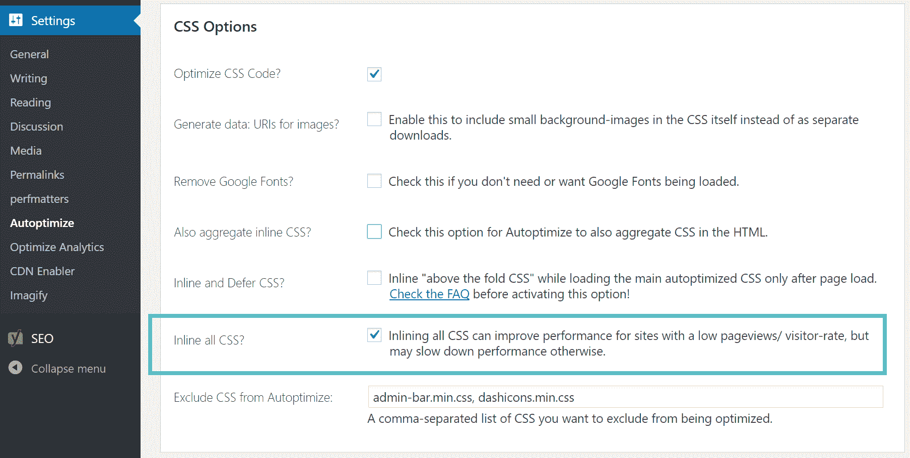

Autoptimize inline CSS


#### 内嵌小型 JavaScript

就像内联小型 CSS 一样，同样的事情也适用于内联小型 JavaScript。通常不建议这样做，因为这会增加页面请求的总下载量。然而，如果你的站点很小，请求很少，它可以提高你的性能。同样，您可以使用自动优化的 [JavaScript 设置。](https://kinsta.com/blog/autoptimize-settings/#javascript-options)

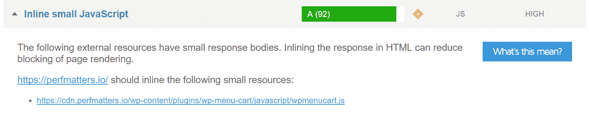

Inline small JavaScript


#### 利用浏览器缓存

利用浏览器缓存是一个非常普遍的建议，人们对此很纠结。这是由于您的 web 服务器上没有正确的 HTTP 缓存头而产生的。查看我们关于如何修复[利用浏览器缓存警告](https://kinsta.com/blog/leverage-browser-caching/)的深度帖子。您只能在您控制的资源上修复此问题。例如，如果你在[第三方](https://kinsta.com/blog/third-party-performance/)广告网络上看到这个，你无能为力。

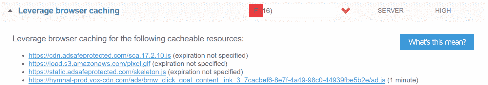

Leverage browser caching


#### 从一致的 URL 提供资源

如果您看到的是来自一致 URL 的服务资源，则很可能是来自同一 URL 的相同资源。当涉及到查询字符串时，这种情况会发生很多次。查看如何[从静态资源](https://kinsta.com/knowledgebase/remove-query-strings-static-resources/)中移除查询字符串。一旦他们走了，它应该不再需要加载它两次。

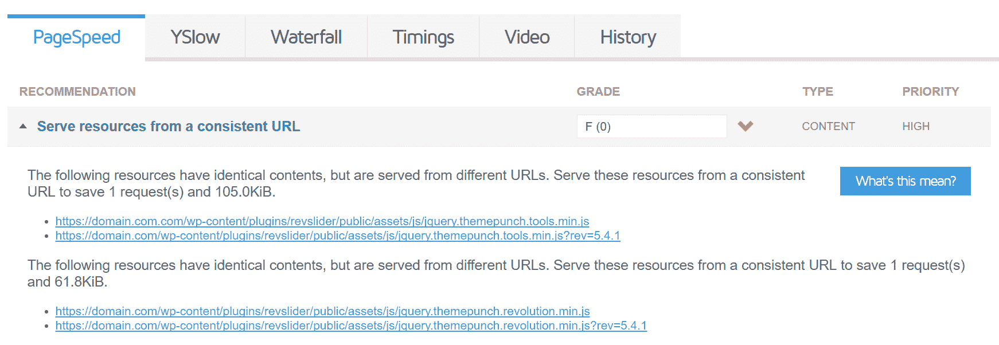

Serve resources from a consistent URL


#### 推迟 JavaScript 的解析

默认情况下，JavaScript 和 CSS 是渲染阻塞的。这意味着它们可以阻止网页显示，直到它们被浏览器下载和处理。defer 属性告诉浏览器在 HTML 解析完成之前不要下载资源。几个简单的方法[来解决这个问题，就是利用免费的自动优化](https://kinsta.com/blog/autoptimize-settings/#inline-and-defer-css)或[异步 JavaScript](https://wordpress.org/plugins/async-javascript/) 插件。请务必查看我们关于如何[消除渲染阻塞的 JavaScript 和 CSS](https://kinsta.com/blog/eliminate-render-blocking-javascript-css/) 的深度帖子。

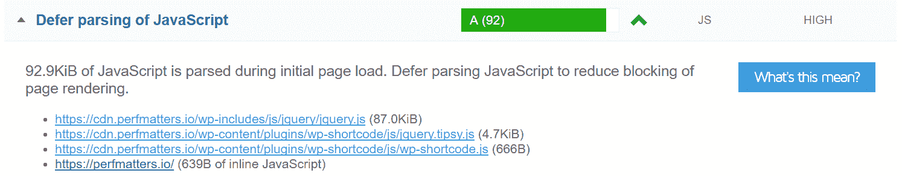

Defer parsing of JavaScript


要获得更深入的解释，请阅读:[如何在 WordPress 中推迟解析 Javascript 警告(4 种方法)](https://kinsta.com/blog/defer-parsing-of-javascript/)。

#### 缩小 CSS 和 JavaScript

缩小本质上是从源代码中删除所有不必要的字符，而不改变其功能。这可能包括换行符、空白、缩进等。这样做可以节省数据字节，加快下载、解析和执行时间。


Minify CSS and JavaScript


同样，免费的[自动优化](https://kinsta.com/blog/autoptimize-settings/)插件对此非常有用。只需确保“优化 JavaScript 代码”和“优化 CSS 代码”都被选中。如果你有一个很大的网站，你可能也想玩下面的高级设置，因为有些可能会损害你的网站的性能。通常不建议在大型网站上内联或组合 CSS 和 JavaScript。这就是 [HTTP/2](https://kinsta.com/learn/what-is-http2/) 发挥作用的地方。

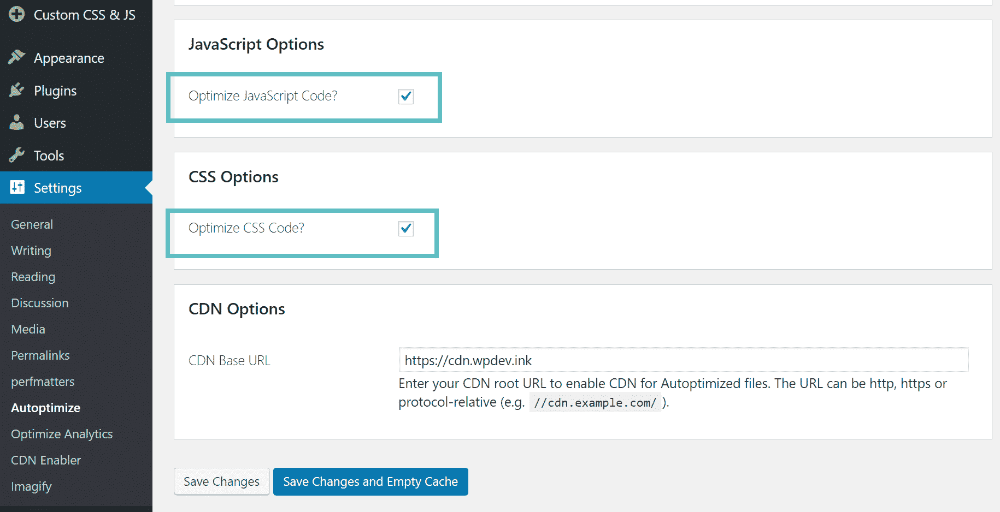

Autoptimize minify CSS and JavaScript


如果你是 [Kinsta 的客户](https://kinsta.com/plans/?plan=visits-business1&interval=month)，你可以利用 [代码缩减特性](https://kinsta.com/help/kinsta-cdn-code-minification/) ，它内置在 [MyKinsta 仪表板](https://kinsta.com/mykinsta/) 中。这使得客户只需点击一下鼠标，就能快速轻松地启用自动 CSS 和 JavaScript 缩小功能，无需任何人工操作就能加快网站速度。

#### 优化图像

根据 [HTTP Archive](http://httparchive.org/interesting.php?a=All&l=Apr%2015%202017&s=All) 的数据，截至 2017 年 4 月，图片平均占网页总权重的 66%。所以当谈到优化你的 WordPress 站点时，图片是你应该首先开始的地方！比脚本和字体更重要。

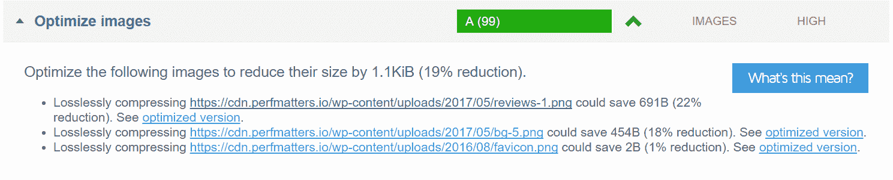

Optimize images


在一个完美的世界里，每张图片在上传到 WordPress 之前都应该被压缩和优化。但不幸的是，这是不现实的。正因为如此，我们建议使用一个好的图像优化插件。这将有助于自动压缩您的图像，调整它们的大小，并确保它们是轻量级的，可以快速加载到您的网站上。查看我们关于[如何优化网页图片](https://kinsta.com/blog/optimize-images-for-web/)的深度文章。

#### 减少初始服务器响应时间

对于 WordPress 来说，初始服务器响应时间慢的主要原因是缺乏页面缓存。没有页面缓存，WordPress 使用 PHP 为每个请求动态构建页面，这意味着它会很快被请求淹没。启用页面缓存后，您的站点可以提供预先生成的 HTML 文件，这比使用 PHP 实现每个页面请求要快得多，也更具可伸缩性。

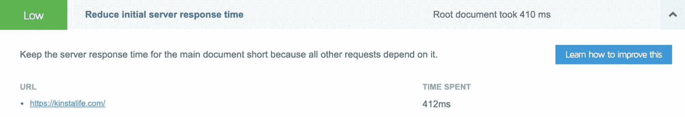

Reduce initial server response time.


如果你托管在 Kinsta 上，你不必担心[页面缓存](https://kinsta.com/help/full-page-caching/),因为我们会通过 Nginx 配置为你解决这个问题。如果你的 WordPress 主机不支持页面缓存，你可以安装一个类似 WP Rocket 或者 [W3 Total Cache](https://kinsta.com/blog/w3-total-cache/) 的缓存插件。为了进一步减少服务器响应时间，我们建议将 [Cloudflare APO](https://kinsta.com/blog/cloudflare-apo-wordpress/) 与你的 WordPress 站点集成。这项来自 Cloudflare 的创新优化服务将您网站的 HTML 页面分发到世界各地，这可以在全球范围内减少服务器响应时间。

#### 缩小 HTML

就像 CSS 和 JavaScript 一样，HTML 也可以精简，去掉不必要的字符，节省数据字节，以加快执行时间。

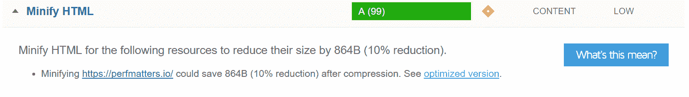

Minify HTML


免费的自动优化插件对此也很有帮助。只需[启用“优化 HTML 代码”选项](https://kinsta.com/blog/autoptimize-settings/#html-options)。

## 注册订阅时事通讯


### 想知道我们是怎么让流量增长超过 1000%的吗？

加入 20，000 多名获得我们每周时事通讯和内部消息的人的行列吧！

[Subscribe Now](#newsletter)

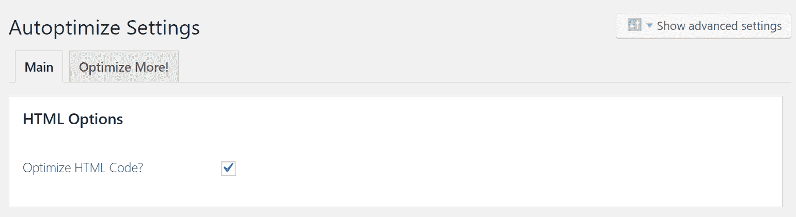

Autoptimize optimize HTML code


#### 启用 GZIP 压缩

[GZIP](https://en.wikipedia.org/wiki/Gzip) 是一种文件格式，是用于文件压缩和解压缩的软件应用。 [GZIP 压缩](https://kinsta.com/blog/enable-gzip-compression/)在服务器端启用，允许进一步减小 HTML、样式表和 JavaScript 文件的大小。它对图像不起作用，因为这些图像已经以不同的方式压缩。由于压缩，有些已经减少了 70%。对于 WordPress 来说，这可能是你能做的最简单的优化之一。注意:默认情况下，所有 Kinsta 服务器上都启用了 GZIP 压缩。

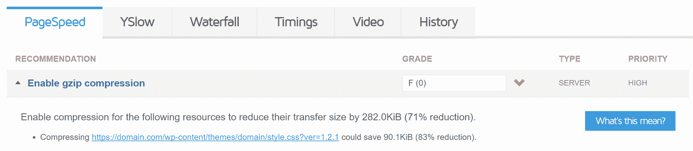

Enable GZIP compression


要在 [Apache](https://kinsta.com/knowledgebase/what-is-apache/) 中启用 GZIP 压缩，只需添加以下代码。htaccess 文件。

```
<IfModule mod_deflate.c>
# Compress HTML, CSS, JavaScript, Text, XML and fonts
AddOutputFilterByType DEFLATE application/javascript
AddOutputFilterByType DEFLATE application/rss+xml
AddOutputFilterByType DEFLATE application/vnd.ms-fontobject
AddOutputFilterByType DEFLATE application/x-font
AddOutputFilterByType DEFLATE application/x-font-opentype
AddOutputFilterByType DEFLATE application/x-font-otf
AddOutputFilterByType DEFLATE application/x-font-truetype
AddOutputFilterByType DEFLATE application/x-font-ttf
AddOutputFilterByType DEFLATE application/x-javascript
AddOutputFilterByType DEFLATE application/xhtml+xml
AddOutputFilterByType DEFLATE application/xml
AddOutputFilterByType DEFLATE font/opentype
AddOutputFilterByType DEFLATE font/otf
AddOutputFilterByType DEFLATE font/ttf
AddOutputFilterByType DEFLATE image/svg+xml
AddOutputFilterByType DEFLATE image/x-icon
AddOutputFilterByType DEFLATE text/css
AddOutputFilterByType DEFLATE text/html
AddOutputFilterByType DEFLATE text/javascript
AddOutputFilterByType DEFLATE text/plain
AddOutputFilterByType DEFLATE text/xml

# Remove browser bugs (only needed for really old browsers)
BrowserMatch ^Mozilla/4 gzip-only-text/html
BrowserMatch ^Mozilla/4\.0[678] no-gzip
BrowserMatch \bMSIE !no-gzip !gzip-only-text/html
Header append Vary User-Agent
</IfModule>
```

[如果您运行的是 NGINX](https://kinsta.com/knowledgebase/what-is-nginx/) ，只需将以下内容添加到 nginx.conf 文件中。

```
gzip on;
gzip_disable "MSIE [1-6]\.(?!.*SV1)";
gzip_vary on;
gzip_types text/plain text/css text/javascript image/svg+xml image/x-icon application/javascript application/x-javascript;
```

请务必查看我们关于如何启用 GZIP 压缩的深入文章。

#### 最小化重定向

最小化从一个 URL 到另一个 URL 的 HTTP 重定向为用户节省了额外的 RTT 和等待时间。查看我们在 [WordPress 重定向](https://kinsta.com/blog/wordpress-redirect/)上的帖子，其中我们发现 2 个错误的重定向增加了 58%的站点加载时间！简单明了，WordPress 重定向会减慢你的站点速度。这就是为什么值得花时间来尽量减少重定向到您的网站体验的访问者的数量。

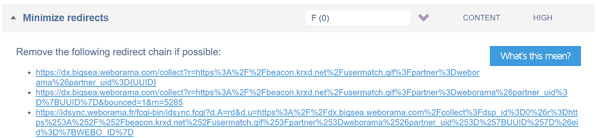

Minimize redirects


#### 指定缓存验证器

当缺少 [HTTP 缓存头](https://kinsta.com/blog/wordpress-cache/)时，会出现指定缓存验证器的建议。这些应该包含在每个源服务器响应中，因为它们都验证和设置缓存的长度。如果没有找到头，每次都会生成一个新的资源请求，这会增加服务器的负载。利用缓存头确保后续请求不必从服务器加载，从而为用户节省带宽并提高性能。请记住，您无法在不受您控制的第三方资源上解决这个问题。


### 重要的

HTTP 缓存头会自动添加到所有的 Kinsta 服务器上。


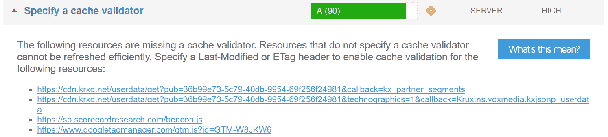

Specify a cache validator


有许多不同的 HTTP 缓存头可以用来修正这个建议。查看我们关于如何指定缓存验证器的深入文章。

#### 指定图像尺寸

就像你不应该让 CSS 调整你的图片一样，你也应该指定图片的尺寸。这意味着在 HTML 代码中包含宽度和高度。

**不正确**

```

```

**纠正**

```

```

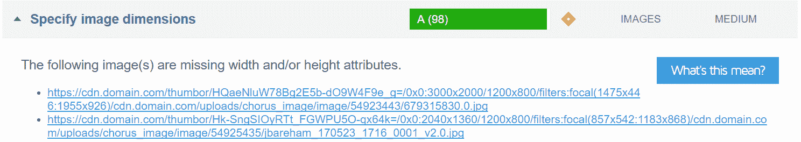

Specify image dimensions


#### 从静态资源中移除查询字符串

你的 CSS 和 JavaScript 文件通常在它们的 URL 末尾有文件版本，比如 domain.com/style**。css？ver=4.6** 。一些服务器和代理服务器不能缓存查询字符串，即使存在一个`cache-control:public`头。因此，通过删除它们，有时可以改善缓存。这可以通过代码或免费的 WordPress 插件轻松完成。

查看我们关于如何从静态资源中移除查询字符串的深度文章。请记住，您无法在不受您控制的第三方资源上解决这个问题。

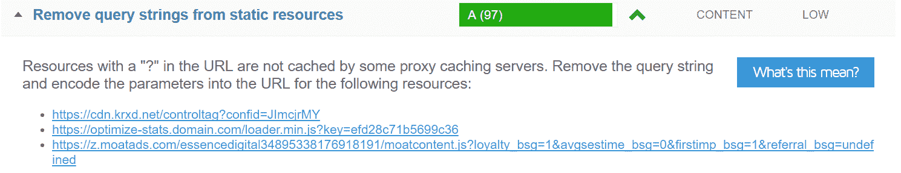

Remove query strings from static resources


#### 指定 Vary: Accept-Encoding 标头

这是一个 HTTP 头，应该包含在每个源服务器响应中，因为它告诉浏览器客户端是否可以处理内容的压缩版本。通常，当启用 GZIP 压缩时，这也是固定的。但是请务必查看我们关于如何修复[指定 vary: accept-encoding 头](https://kinsta.com/knowledgebase/specify-vary-accept-encoding-header/)建议的深度帖子。同样，您无法在第三方资源上解决这个问题。

Struggling with downtime and WordPress problems? Kinsta is the hosting solution designed to save you time! [Check out our features](https://kinsta.com/features/)

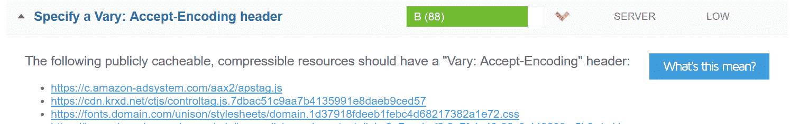

Specify a vary: accept-encoding header


### GTmetrix 瀑布图

GTmetrix 瀑布图在您的网页上显示所有单个请求(如下所示)。然后，您可以分析每个请求，看看是什么导致了您站点上的延迟和性能问题。下面是对每个请求中每种颜色含义的更深入的总结和/或定义。

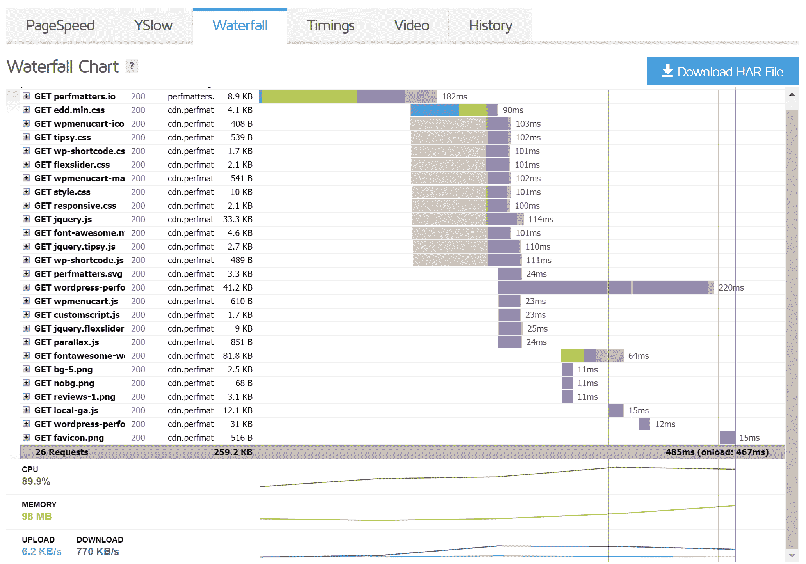

GTmetrix waterfall chart


#### 阻塞(棕色)

当浏览器加载网页时，JavaScript 和 CSS 资源通常会阻止网页显示，直到它们被浏览器下载和处理。这一时间延迟在 GTmetrix 瀑布图中显示为**阻塞**。查看我们关于如何[消除渲染阻塞的 JavaScript 和 CSS](https://kinsta.com/blog/eliminate-render-blocking-javascript-css/) 的深度文章，了解更多信息。

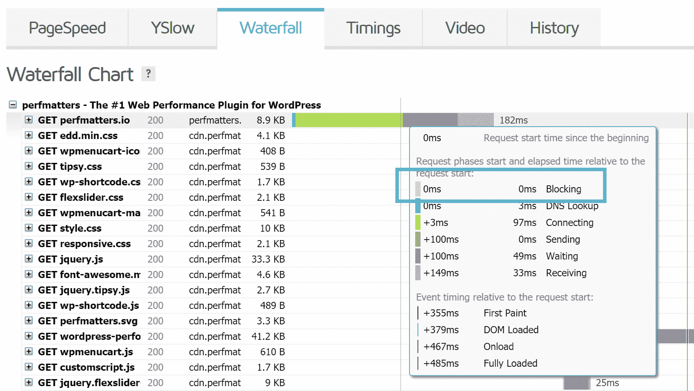

blocking


#### DNS 查找(Teal)

你可以把 [DNS 查找](https://kinsta.com/blog/reduce-dns-lookups/)想象成一本电话簿。有一种叫做域名服务器的服务器，它保存着关于你的网站的信息，以及它应该被路由到哪个 IP 地址。当您第一次通过 GTmetrix 运行您的网站时，它会执行新的查找，并且必须查询 DNS 记录以获取 IP 信息。这导致一些额外的查找时间。

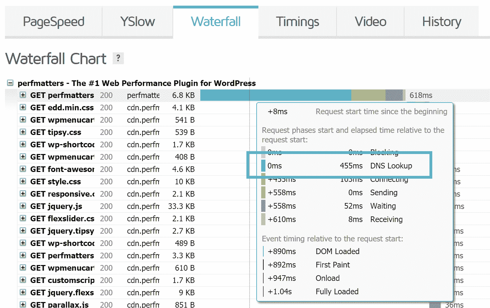

当您第二次通过 GTmetrix 运行您的网站时，它会缓存 DNS，因为它已经知道 IP 信息，无需再次执行查找。这也是为什么你的网站在通过 GTmetrix 运行多次后会显示得更快的原因之一。正如您在下面的屏幕中看到的，在我们运行的第二个测试中，初始文档加载的 DNS 查找时间是 0 毫秒。这是许多人误解的一个方面！我们建议多次运行您的测试并取平均值，除非您希望 DNS 作为报告的一部分，在这种情况下，您可以进行第一次测试。

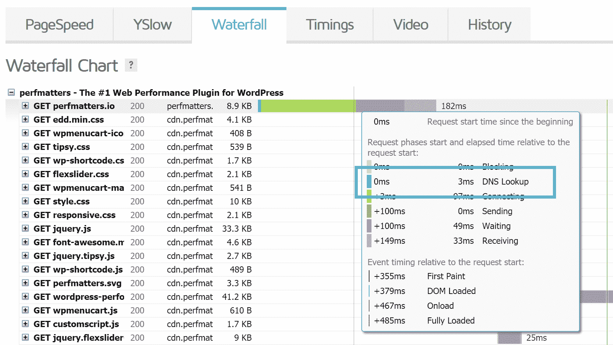

Second DNS lookup


如果您使用 CDN，这同样适用于您的资产(JavaScript、CSS、图像)。CDN 缓存的工作方式很像 DNS，一旦被缓存，它在连续加载时会快得多。加速 DNS 的另一个技巧是使用 DNS 预取。这允许浏览器在后台对页面执行 DNS 查找。你可以通过在你的 WordPress 站点的标题中添加一些代码来做到这一点。请看下面的一些例子。

```
<!-- Prefetch DNS for external assets -->

 

```

或者如果你运行的是 WordPress 版本 4.6 或更新版本，你可能想要使用[资源提示](https://make.wordpress.org/core/2016/07/06/resource-hints-in-4-6/)。开发者可以使用`wp_resource_hints`过滤器为`dns-prefetch`、`preconnect`、`prefetch`或`prerender`添加自定义域名和网址。

#### 正在连接(绿色)

GTmetrix 中的**连接**时间是指 TCP 连接，或者创建一个 TCP 连接所需的总时间。您不需要真正理解这是如何工作的，但这只是主机/客户机和服务器之间必须进行的一种通信方法。

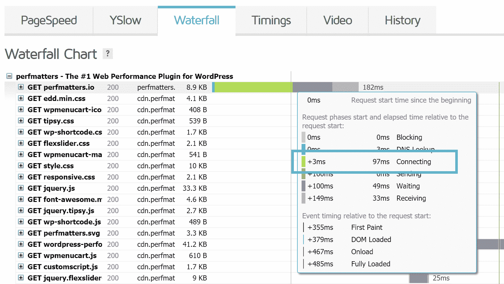

Connecting


#### 发送(红色)

**发送**时间就是网络浏览器向服务器发送数据所需的时间。

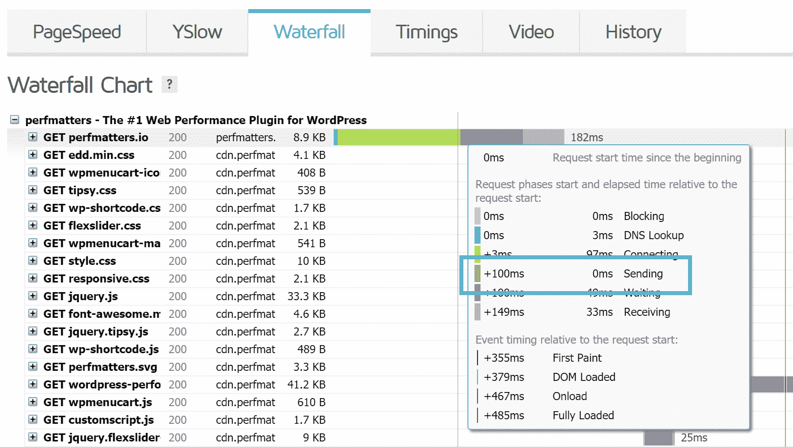

Sending


#### 等待(紫色)

GTmetrix 中的等待时间实际上是指到达第一个字节的时间，在某些工具中也称为 TTFB。 [TTFB](https://en.wikipedia.org/wiki/Time_To_First_Byte) 是一种度量，用于指示 web 服务器或其他网络资源的响应性。一般来说，任何低于 100 ms 的都是可以接受的，都是好的 TTFB。如果您正在接近 300-400 ms 的范围，那么您的服务器可能配置错误，或者是时候升级到更好的 web 堆栈了。正如你在下面的测试中看到的，它大约是 100 毫秒，这很好。


Waiting


降低 TTFB 的一些简单方法是确保您的主机有适当的缓存并利用 CDN。在你的 WordPress 网站上查看我们关于减少 TTFB 的所有方法的深度文章。

#### 接收(灰色)

**接收**时间就是网络浏览器从服务器接收数据所需的时间。

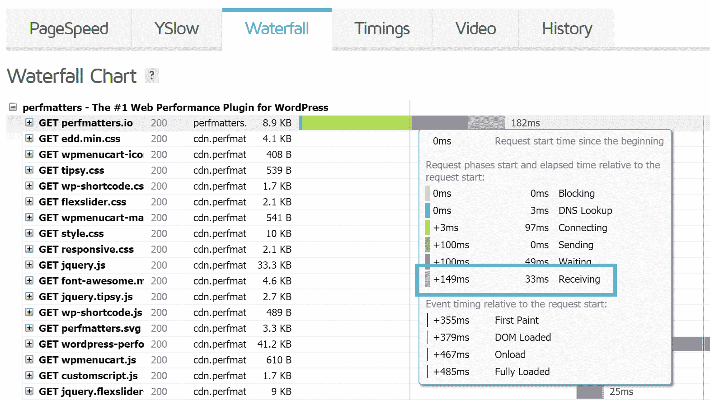

Receiving


#### 事件计时

每次你请求一个页面时，它都有呈现和加载内容的事件计时。

*   **第一次绘制(绿色线条):**浏览器在页面上进行任何呈现的第一个点，比如显示背景颜色。
*   **DOM Loaded(蓝线):**DOM(文档对象模型)准备就绪的点。
*   **Onload(红线):**当页面的处理完成并且页面上的所有资源(图片、CSS 等。)已经下载完了。
*   **满载(紫色线):**Onload 事件触发后的点，2 秒内没有网络活动。

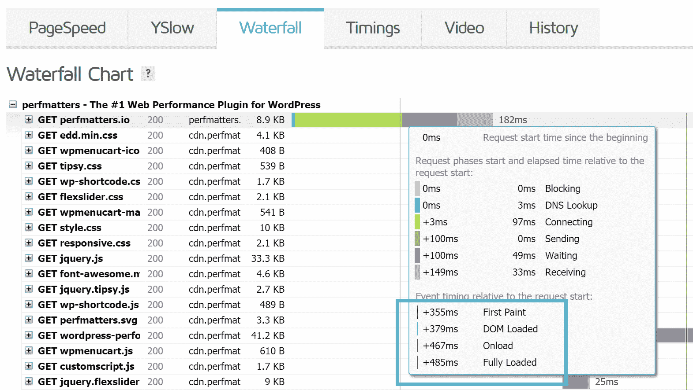

Event timing


#### HTTP 响应标头

您还可以单击一个单独的请求，查看他们称之为 HTTP 响应头的内容。这提供了有价值的信息。在下面的屏幕中，我们可以立即看到 web 服务器上启用了 gzip，它在 HHVM 上运行，它由缓存提供服务(命中，将显示[未命中](https://kinsta.com/knowledgebase/cache-miss/))，缓存控制头，服务器架构(这并不总是可见)，[过期头](https://kinsta.com/knowledgebase/add-expires-headers-wordpress/)，浏览器用户代理等等。

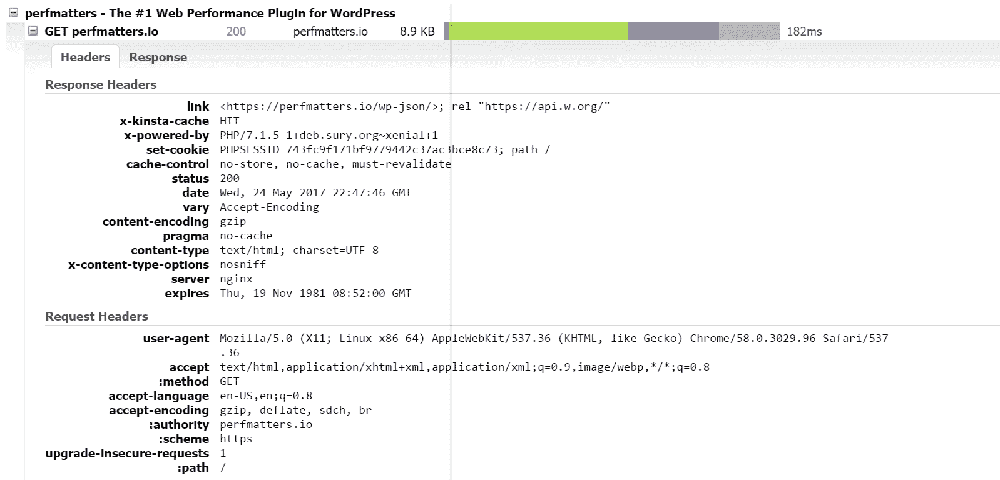

HTTP response header in GTmetrix


另一件需要注意的事情是， **GTmetrix 工具确实支持 HTTP/2** ，不像 Pingdom，因为它目前使用 Chrome 58+来运行它的测试。Chrome [在 49 版](http://caniuse.com/#feat=http2)增加了 HTTP/2 支持。所以当你选择使用哪个速度测试工具时，请记住。

### 录像

为了帮助您调试视觉故障和前端性能问题，最新版本的 GTmetrix 包括一个“视频”选项卡。启用视频功能后，GTmetrix 将自动录制嵌入式视频，显示每次性能测试的页面加载情况。此功能对于调试仅出现在特定浏览器和屏幕尺寸组合中的视觉问题非常有用。

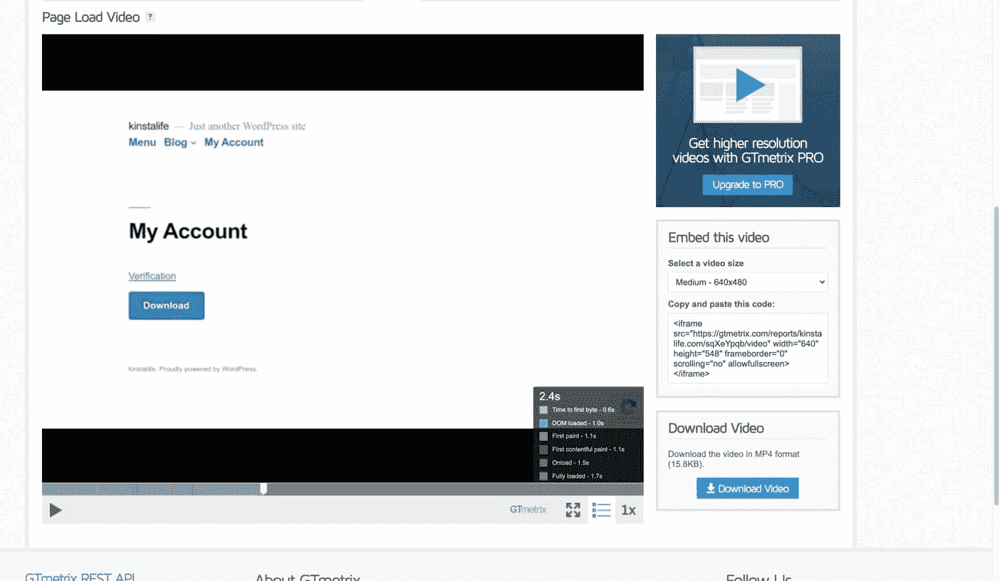

GTmetrix video recording.


### 历史

在历史选项卡下，您可以查看您过去的所有速度测试。免费账户中存储的数量是有限制的。您还可以监视一个 URL，该 URL 允许您跟踪一段时间内的性能，并在发生变化时查看任何变化。


History


一个非常酷的功能是，你可以选择你过去的报告，并将它们并排比较。这可能非常有用，尤其是当你在你的网站上做优化，看看是否有改进。记住，有时你也可以过度优化。

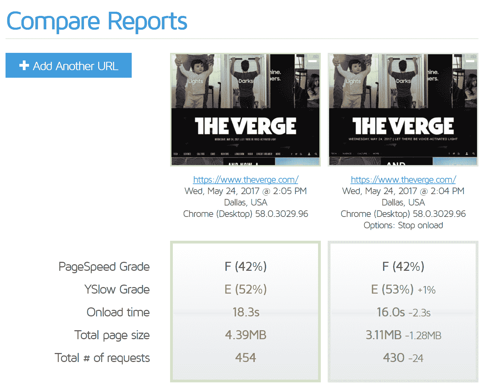

Compare reports in GTmetrix


### 案例研究领域配置

如果您已经深入了解了我们的 GTmetrix，那么您将大开眼界。看到人们分享技巧和案例研究，却不分享他们是如何做到的，这总是令人恼火的。下面是我们对上面使用的案例研究域的精确配置！随意复制它。

#### 体系结构

*   案例研究域(perfmatters.io)由 Kinsta 托管在美国的 Google 云平台上(中心位置)。Kinsta 使用 HTTP/2、NGINX、 [MariaDB](https://kinsta.com/blog/mariadb-vs-mysql/) ，这些都有助于快速加载。
*   该网站正在使用 HHVM。PHP 7.3 现在可以在 Kinsta 获得，甚至比 HHVM 还快！你可以通过按下按钮切换到 PHP 版本[。](https://kinsta.com/knowledgebase/how-to-update-php-in-wordpress/)
*   网站**没有使用任何缓存插件**。Kinsta 在服务器级别缓存所有东西，这大大简化了事情，并且在大多数情况下更快！

#### WordPress 插件

这里是 WordPress 网站上正在使用的插件列表。

*   免费的 [CDN Enabler 插件](https://wordpress.org/plugins/cdn-enabler/)用于部署 KeyCDN。
*   免费的 [CAOS 插件](https://wordpress.org/plugins/host-analyticsjs-local/)用于本地同步谷歌分析。
*   premium [perfmatters 插件](https://perfmatters.io)用于清除[不必要的 HTTP 请求](https://kinsta.com/blog/make-fewer-http-requests/)并禁用表情符号和嵌入等东西。
*   高级 [Gonzalez 插件](https://tomasz-dobrzynski.com/wordpress-gonzales)用于禁止加载某些脚本。
*   高级 [Imagify 插件](https://wordpress.org/plugins/imagify/)用于压缩图像。

#### 进一步阅读的推荐教程:

*   如何加速你的 WordPress 网站(终极指南)
*   [如何禁用 WordPress 中的表情符号](https://kinsta.com/knowledgebase/disable-emojis-wordpress/)
*   [如何禁用 WordPress 中的嵌入功能](https://kinsta.com/knowledgebase/disable-embeds-wordpress/)
*   [识别和分析你的 WordPress 网站上的外部服务](https://kinsta.com/blog/third-party-performance/)
*   [如何用 WordPress 在 Google PageSpeed Insights 中打 100/100 分](https://kinsta.com/blog/google-pagespeed-insights/)
*   [如何诊断你的 WordPress 站点上的高 Admin-Ajax 使用率](https://kinsta.com/blog/admin-ajax-php/)
*   [关于如何减少 DNS 查找并提高其速度的 7 个技巧](https://kinsta.com/blog/reduce-dns-lookups/)

## 摘要

如您所见，了解 GTmetrix 速度测试工具的工作原理以及所有图表的含义可以帮助您在性能方面做出更加数据驱动的决策。我们称之为瀑布分析，这对于了解你的个人资产是如何加载的至关重要。请记住，在与 Pingdom 进行比较时，它们是不同的工具，因此最好坚持使用其中一个，因为它们计算的东西不同。有其他好的 GTmetrix 技巧吗？

如果你想看更多类似上面的有深度的文章，请在下面的评论中告诉我们！

* * *

让你所有的[应用程序](https://kinsta.com/application-hosting/)、[数据库](https://kinsta.com/database-hosting/)和 [WordPress 网站](https://kinsta.com/wordpress-hosting/)在线并在一个屋檐下。我们功能丰富的高性能云平台包括:

*   在 MyKinsta 仪表盘中轻松设置和管理
*   24/7 专家支持
*   最好的谷歌云平台硬件和网络，由 Kubernetes 提供最大的可扩展性
*   面向速度和安全性的企业级 Cloudflare 集成
*   全球受众覆盖全球多达 35 个数据中心和 275 多个 pop

在第一个月使用托管的[应用程序或托管](https://kinsta.com/application-hosting/)的[数据库，您可以享受 20 美元的优惠，亲自测试一下。探索我们的](https://kinsta.com/database-hosting/)[计划](https://kinsta.com/plans/)或[与销售人员交谈](https://kinsta.com/contact-us/)以找到最适合您的方式。