# 8 款最佳标题分析工具对比(深入探讨如何使用它们)

> 原文：<https://kinsta.com/blog/headline-analyzer/>

现在被称为广告之父的大卫·奥格威是有史以来最好的广告文案之一。他对标题的重要性有什么看法？

> 平均来说，阅读标题的人数是阅读正文的五倍。当你写好标题时，你已经花掉了你一美元中的 80 美分。”

直到今天，作家都没有在标题上花足够的时间。这可能是没有人阅读他们内容的主要原因。但是你不必犯这个错误。

让我们来看看为什么标题如此重要，你如何创建一个如此引人注目的标题，让人们情不自禁地点击它们，并测试现有的最好的标题分析工具。

[How do @buzzfeed and @upworthy hook you in? With their magnetic headlines! 🎣 We looked at how the best in class create them and tested the best headline analyzer tools for you!Click to Tweet](https://twitter.com/intent/tweet?url=https%3A%2F%2Fkinsta.com%2Fblog%2Fheadline-analyzer%2F&via=kinsta&text=How+do+%40buzzfeed+and+%40upworthy+hook+you+in%3F+With+their+magnetic+headlines%21+%F0%9F%8E%A3+We+looked+at+how+the+best+in+class+create+them+and+tested+the+best+headline+analyzer+tools+for+you%21&hashtags=copywriting%2Ctraffic)

## 为什么标题如此重要？

大卫·奥格威是 20 世纪的人。他生于 1911 年，死于 1999 年。

他经历了苏联的诞生和解体，大英帝国的缓慢消亡，以及两次世界大战。

20 世纪也是令人震惊的技术革新的世纪，在这个世纪里，飞机从一项新生技术变成了一种普通的运输方式，电脑成为了一种消费品，世界被互联网连接起来。

然而，尽管所有的政治动荡，前所未有的暴力和令人眼花缭乱的技术进步，在某些方面，这也是一个安静得多的时间。

想想吧。在奥美一生的大部分时间里，媒体包括报纸、杂志、广播和电视。

你还记得在互联网、社交媒体和智能手机出现之前是什么样子吗？那是奥格威的世界。

现在这个世界已经不存在了。我们口袋里都有一扇通往无限社交、娱乐和知识的大门。每次我们上网时，我们都被试图引起我们注意的信息轰炸。

有一封来自朋友的电子邮件，一个堂兄在你的度假照片上留下了评论，有三篇你想读的博客文章，有一个新的播客插曲，两个你最喜欢的 YouTubers 用户刚刚发生了争执

然后是所有的谷歌、脸书、Instagram、YouTube 和播客广告。

## 如何从头开始写出更好的标题:

写更好的标题是一门艺术，任何人都可以学习和提高。如果你不得不从头开始，遵循以下建议:

*   广泛调查你的客户
*   看看你的竞争对手的最佳标题创意
*   使用客户的话(不要使用行话)
*   在标题的开头使用数字
*   使用有力的词汇，如“秘密”、“不为人知的”、“隐藏的”
*   A/B 测试您的标题
*   衡量你的点击率并适应

Support

现在，想想这个:如果标题在奥美时代如此重要，你不认为它们在我们总是被拉向无数方向的今天更加重要吗？

当今世界不缺少内容。一个好标题的作用是做出承诺，正如 Orbit Media 的联合创始人兼 CMO Andy cristo Dina[清楚地解释了](https://www.orbitmedia.com/blog/writing-headlines/):

> “在我们点击任何东西之前，我们会进行瞬间成本效益计算。[……]标题的作用是指出它的好处，并向访问者承诺它是值得的。而且要在不到一秒的时间内完成。好处越具体，访问者点击的可能性就越大。伟大的头条做出具体的承诺。”

这是图示的概念:

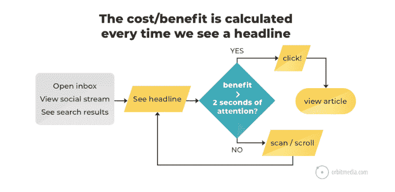

What’s happening in your visitor’s brain when facing an headline (Image source: orbitmedia.com)

如果你没有抓住读者的注意力，也就是说，成本与收益的等式没有得到满足，你[就会失去他们](https://kinsta.com/blog/inbound-marketing/),因为他们会在几秒钟内转向更令人兴奋的东西。

当人们访问[你的博客](https://kinsta.com/blog/how-to-monetize-a-blog/)，在[社交媒体](https://kinsta.com/blog/wordpress-social-media-plugins/)上看到你的内容，或者在搜索引擎结果页面上看到你的网站时，你的标题是他们看到的第一件事。

请记住，如果你想出一个弱标题，不管你的内容有多好:没有人会去读它。

那么，如何才能写出好的标题呢？

## 了解你的目标受众

你知道有说服力的文案的基础是什么吗？[市场调研](https://kinsta.com/blog/features-vs-benefits/#customer-research)。

这可能不是你期待的答案。人们经常想象，最好的文案是在天才的创意迸发中写成的。但现实要平凡得多。

最好的文案是由那些比目标受众更了解自己的文案撰写人撰写的。

如果你只是坐在那里，试着想象是什么驱使你想要接触的人，你是无法到达那里的。

不。你需要真正走出去，从马的嘴里得到它。你怎么做到的？

假设你有一个 keto 博客。如果是这样的话，你可能已经对这种饮食有了至少一些经验，并且明白为什么人们会被它吸引。但是你可以通过市场调研让你的文案更上一层楼。

### Reddit

Reddit 是最受欢迎的在线论坛，它包含了你能想到的几乎所有内容。

subreddit 有 130 万名会员，他们都对生酮饮食感兴趣。

你可以简单地通过每天访问这个子网站，观察哪些帖子获得了最多的支持，看看哪些问题是最常见的等等，来了解你的目标受众。

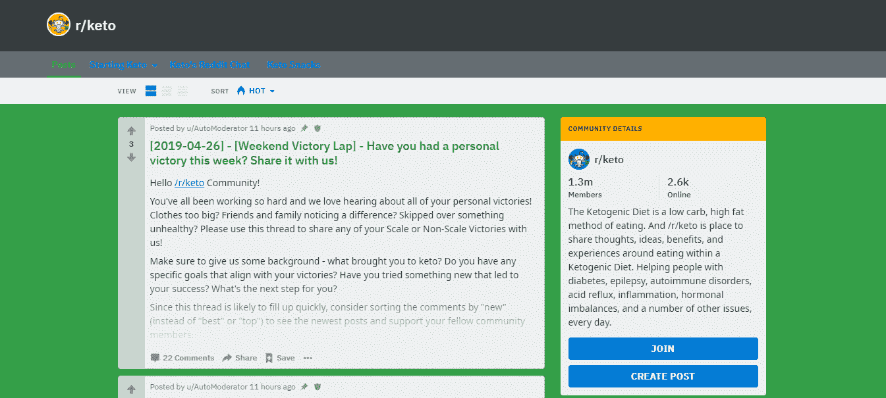

Subreddit about Keto

### 油管（国外视频网站）

Youtube 是世界上最受欢迎的视频托管网站，也是第二大搜索引擎。

为什么不看看你所在的领域中最受欢迎的 YouTubers 用户是怎么说的呢？

例如，Tristan Haggard 经营的 [Primal Edge Health](https://www.youtube.com/user/PrimalEdgeHealth) 频道拥有 12 万多名订户。

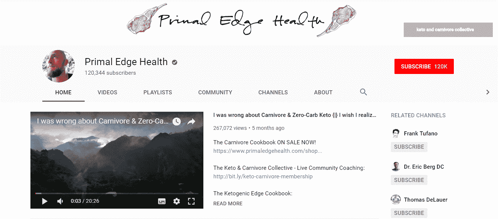

The Primal Hedge Health Channel on YouTube

现在，如果你进入“视频”部分，点击“排序”并选择“最受欢迎”，你会看到他所有的视频，从最受欢迎到最不受欢迎。

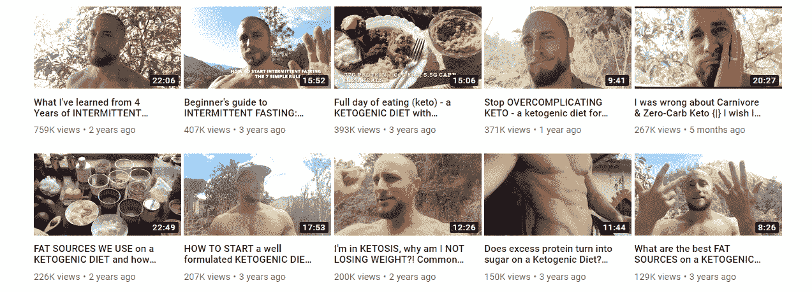

Videos from the Primal Hedge Health Channel

这可以让你看到哪些主题最能引起目标受众的共鸣，以及哪些标题效果好。

如果你点击其中一个视频，你将能够看到评论，甚至更深入地了解你的目标受众的想法。

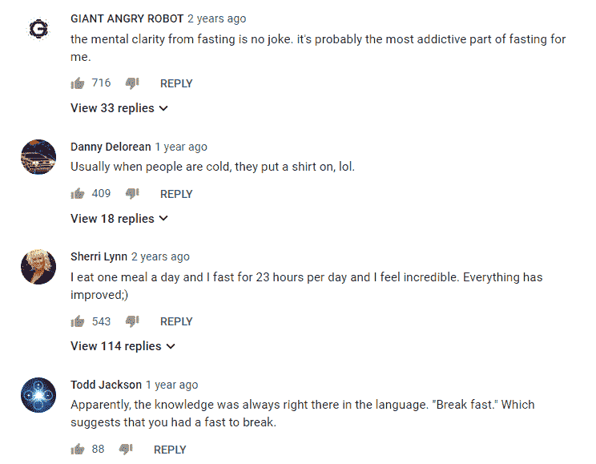

Comments from the Primal Hedge Health Channel

请记住，Youtube 上的评论通常都是些迷妹，所以要做好筛选大量无用评论的准备。

分析你所在领域的热门 YouTube 频道是一个很好的方法，可以帮助你增进对目标受众的了解。

### 博客

当然，如果你想[创建一个关于某事的博客](https://kinsta.com/blog/medium-vs-wordpress/)，你应该看看你的竞争对手。

例如， [ruled.me](https://www.ruled.me/) 是一个受欢迎的 keto 博客，拥有超过 115，000 名订阅者，并且充满了 keto 资源。

你可以分析他们的内容，看看他们做得好的地方，缺少什么，然后制作出更好的东西。

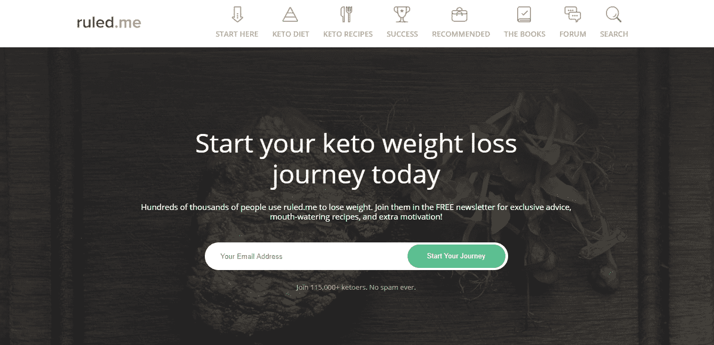

The ruled.me blog

现在，keto 是市场研究的一个简单例子，因为它是一个如此受欢迎的话题，但你可以对几乎任何东西做同样的事情。

记住:**最好的文案是那些最了解他们的目标受众的人**，那些进行深入客户研究的人。

说到文案，再多的研究也不为过。只是研究太少。

## 使用标题公式

你知道那句谚语*“好的艺术家复制，伟大的艺术家窃取”*？

嗯，在文案世界里，“偷”标题是一种标准做法，因为我们已经知道什么可行，什么不可行。所以不要试图重新发明轮子。使用标题公式。

乔恩·莫罗的书*“52 个标题技巧”*是标题公式的最佳资源之一，你可以[免费下载这本书](https://pages.smartblogger.com/headline-hacks)。

莫罗在他的书中写道:

*   操作指南标题。*“如何[空白]”、“如何成为[合意的品质]”、“如何[空白]而没有[令人反感的动作]”、“如何[空白]而[空白]”、“如何在 5 分钟内[做某事]”*、*“如何像老板一样[做某事]”*。

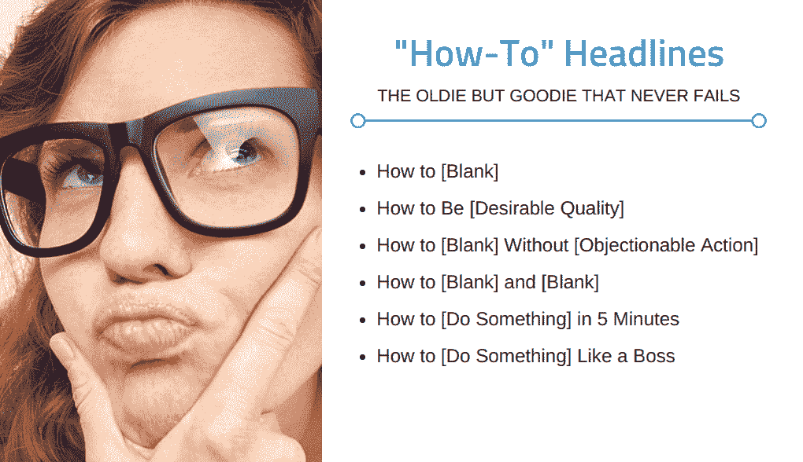

How-to Headlines Formula

*   列出标题。*“7 种方法[做某事]”、“13 种方法[做某事]当[情况]”、“(The)前 10 个[空白]”、“7 个步骤达到[目标]”、“7 个[目标]提示”、“7 个[形容词]事实[人/观众]应该知道”、“7 个来自/由[名人]引用的将[期望的结果]、“7 个将改变你生活的[空白]”*等等。

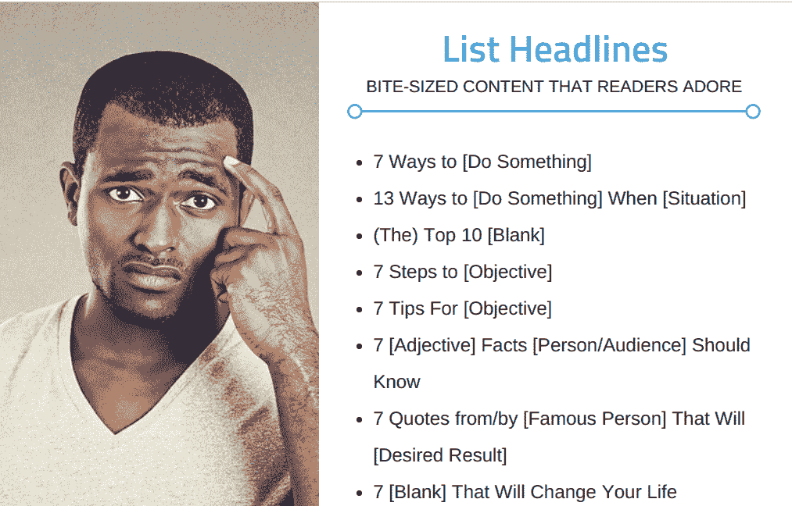

List Headlines Formula

*   额外的头条新闻。*“警告:[Blank]”，“为什么[动作/事物]是/可能是[观点/断言]”“[疑问/问题]下面是如何修复的”“[Blank]终极指南”“*”、“[Blank]的[群体/知名人士]指南”。

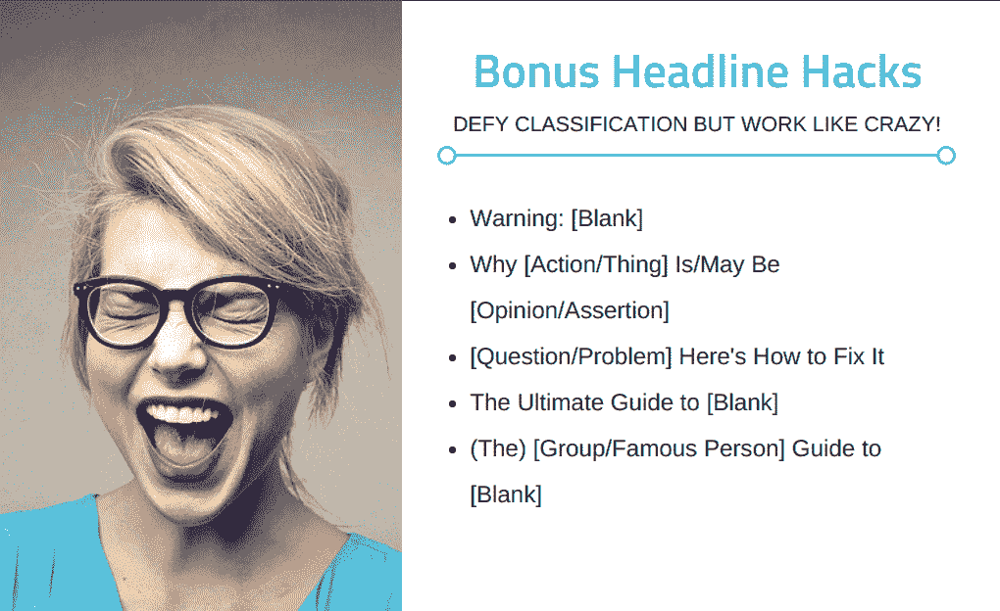

Bonus Headline Hacks

还有两个附录:

*   附录一:*“50 个重磅头条即时灵感”。*
*   附录二:*《173 个牛逼形容词加力量加 Pizazz》。*

使用这些公式写标题可能看起来缺乏创意，机械，但文案是关于结果，而不是创意。

一旦你学会了这些公式，你就会开始到处看到它们。它们被最成功的报纸、杂志和博客所使用。为什么？

因为它们有用。

当然，如果你想让你的文案更上一层楼，有一个带有这些模板的 swipe 文件是不够的，你需要练习使用它们，直到这些公式在你的脑海中根深蒂固，你再也不需要去查它们了。

例如，当贾斯汀·布莱克曼决定改进他的头条游戏时，[他在 106 天内写了 10211 条头条](https://copyhackers.com/2018/03/writing-headlines/)。

他承诺在 100 天内每天写 100 条头条新闻，尽管人们对他的能力持怀疑态度，但他还是坚持了下来。

结果，他写标题的速度变得更快了，以至于不用查公式就能写出 80+个标题，还能在午休时敲出 100 个标题。

此外，他不仅变得更快了，他变得更好了，你可以看到随着他挑战的进展，他的头条新闻是如何提高的。

贾斯汀分享了 16 个来之不易的头条外卖。想知道清单上最重要的是什么吗？

> *“做工作。*
> 
> 没有什么衣服、物品或模板能比得上戴上手套变脏。到了停止阅读开始行动的时候了。熟能生巧。这是唯一能让事情坚持下去的方法。"

你不需要像贾斯汀那样全力以赴，但如果你想学会写更好的标题，那么你需要练习这门手艺。这是无可避免的。

当然，一天 100 个头条是疯狂的…但是你能每天做 10 个吗？

## 使用有力的词语

权力词汇是引发特定情感的词汇。

例如，*【暖心】**【鼓舞人心】*这些词令人振奋，而*【令人震惊】*这些词让你警醒，让你警惕。

你可以使用有力的词汇来增加标题的趣味，吸引读者的注意力。

看一看来自 Cosmopolitan 的这个标题，Sumo 在他们的*“401+可笑的有用的单词来增加转化率”*:

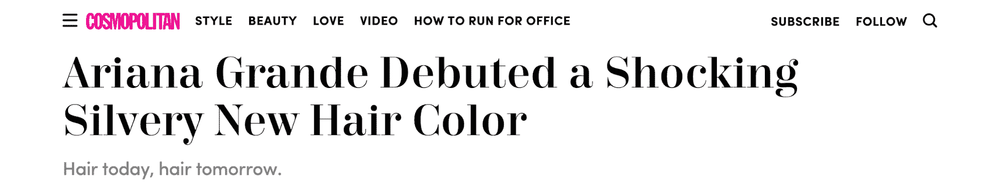

Cosmopolitan headline

Cosmo 本可以用*“爱莉安娜·格兰德推出银色新发色”*来跑。但那真的有意思吗？好吧，她染了头发，那又怎样？

然而，*"爱莉安娜·格兰德出道的一款* ***惊世骇俗的*** *银白色的新发色"*立刻让你想知道更多。有什么好震惊的？阿丽亚娜现在做了什么？？

正如你所看到的，有力的词语可以让标题更有说服力。

所以，去获得相扑的 401+单词列表，并开始在你今天的头条中使用它们。

## 向最好的人学习

仅仅学会公式，使用有力的词汇，想出自己的标题是不够的。

你还需要通过分析具有最佳标题的渠道来研究文案大师:

### BuzzFeed

BuzzFeed 由 Jonah Peretti 和 John S. Johnson III 于 2006 年创建。

从一开始，该公司就专注于病毒内容。他们从收集信息开始，然后转移到制作信息，现在他们的列表和测验已经很出名了。

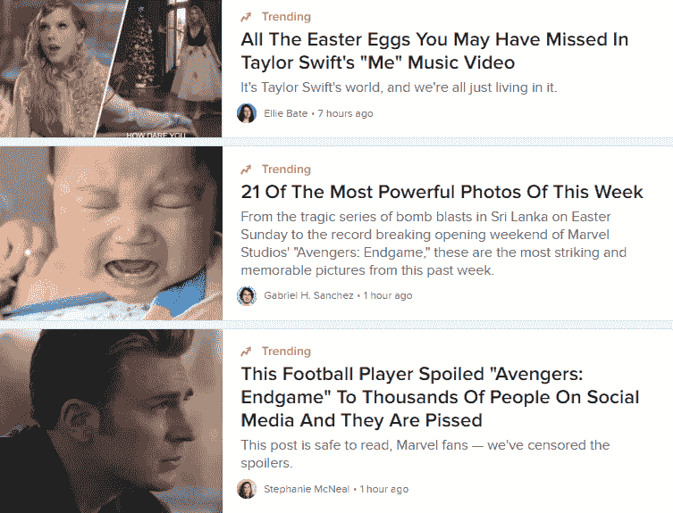

BuzzFeed Headlines

虽然说 BuzzFeed 开创了点击诱饵标题可能不准确，但该公司肯定将其提升到了一个全新的水平，以至于他们启发了一个模仿网站 ClickHole。

Bassim Eledath [使用数据科学技术分析了 BuzzFeed 标题](https://towardsdatascience.com/decoding-buzzfeed-headlines-using-data-science-25198eb25082)。他发现了什么？

显然，BuzzFeed 标题的平均长度是 11.85 个单词。

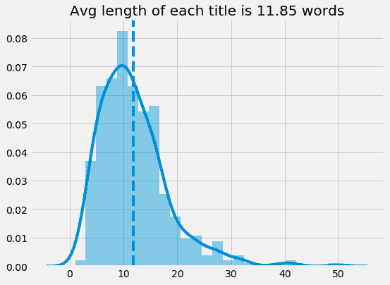

Average Headline Length for BuzzFeed

然后，他将关注点缩小到 11 个单词的标题，并发现了最常见的 BuzzFeed 标题结构:

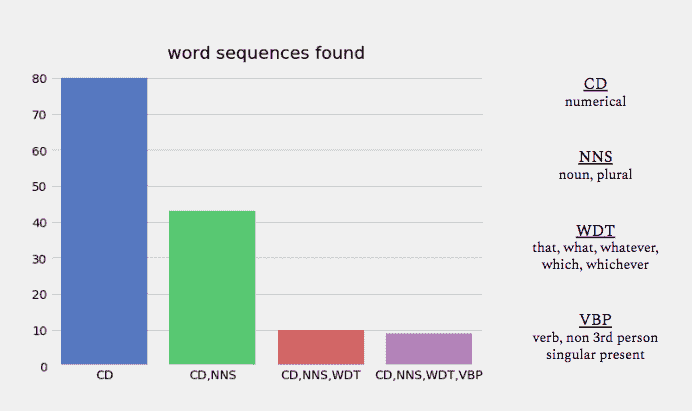

Common Headline Structure for BuzzFeed

根据 Bassim 的研究，最流行的序列遵循 CD，NNS，WDT，VBP 的模式。

事实上，16%的标题都是以数字开头的，考虑到 listicles 在 BuzzFeed 的成功中扮演的角色，这并不奇怪:

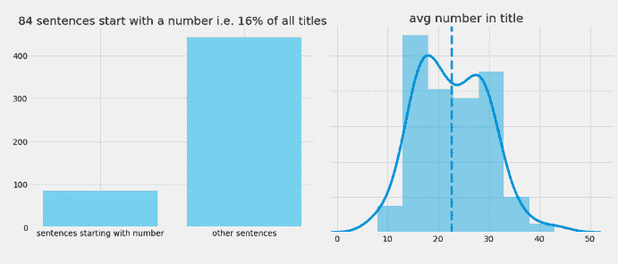

Headlines starting with numbers

现在，无论你对 BuzzFeed 有什么看法，你都必须承认它们的标题是有用的，所以研究它们是有意义的。

### 向上的

[UpWorthy](https://www.upworthy.com/4-million-trees-in-20-years-how-this-couple-fought-deforestation-in-brazil-and-won?c=hpstream) 于 2012 年由 Eli Pariser 和 Peter Koechley 创立。

他们的使命是“改变世界关注的东西”，这意味着他们以“进步”的视角制作病毒式内容。

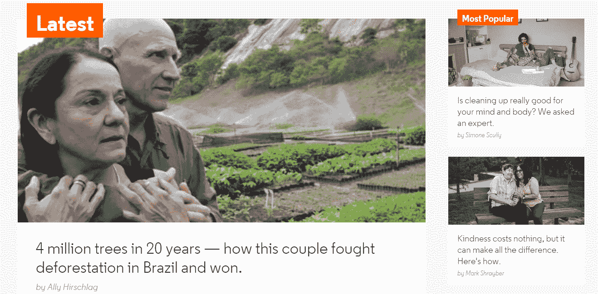

Upworthy.com

它们是比 BuzzFeed 更严肃的渠道，它们的标题更长，更少点击诱饵。

### 世界性的

[Cosmopolitan](https://www.cosmopolitan.com/) 最早成立于 1886 年，是一本家庭杂志，后来转变为文学杂志，1965 年成为女性杂志。

## 注册订阅时事通讯

### 想知道我们是怎么让流量增长超过 1000%的吗？

加入 20，000 多名获得我们每周时事通讯和内部消息的人的行列吧！

[Subscribe Now](#newsletter)

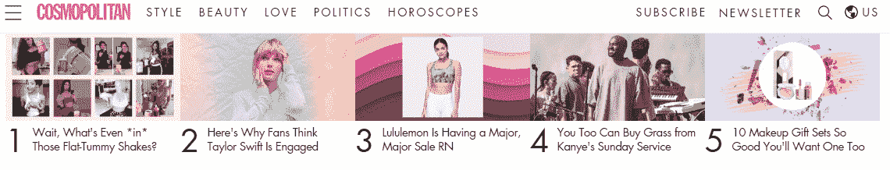

Cosmopolitan.com

凭借如此丰富的经验，Cosmo 已经真正掌握了撰写引人注目的标题的艺术，并且是一个很好的例子，说明了如何制作一个人们想点击而又不会沦为完全点击诱饵的标题。

### 每日邮报

《每日邮报》是一份英国小报，创办于 1896 年。

它因不可靠和哗众取宠而受到广泛批评，但它仍然非常受欢迎(它是英国第二大报纸)。

《每日邮报》可能不是最好的信息来源，但你知道小报最擅长什么吗？头条新闻。

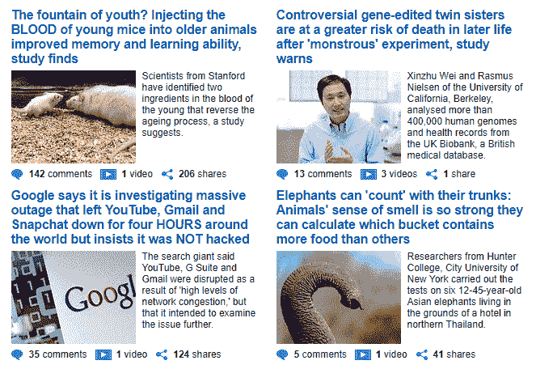

Dailymail.co.uk

你可能会对研究 BuzzFeed、UpWorthy、Cosmo 和 DailyMail 的标题有点怀疑，因为它们并不完全是获得普利策奖的出版物。

然而，你应该让你心中的记者暂停一秒钟，仔细看看那些让人忍不住点击的标题。你不想学学怎么做吗？

## A/B 测试您的标题

在过去，你会花很多时间来构思你能想到的最好的标题，一旦它到了印刷的时候，你就无能为力了。没有压力，是吧？

如果我们谈论印刷媒体的话，今天也是如此。

然而，如果你在你的网站上发表一篇文章，那么标题并不是一成不变的。

事实上，您可以测试它的几种变体，然后选择胜者。但是这到底是怎么回事呢？

这一切都归结于一种叫做 A/B 测试的[转化率优化](https://kinsta.com/blog/conversion-rate-optimization-tips/)方法。

当你运行[一个 A/B 测试](https://kinsta.com/blog/google-optimize/)时，你创建了同一个网站的两个变体，一个是控制版本(A)，另一个是实验版本(B)。

然后，你把流量一分为二，一半发给版本 A，一半发给版本 b。

然后让测试运行，直到它达到统计显著性，查看结果，确定哪个变体获胜并保留获胜者。

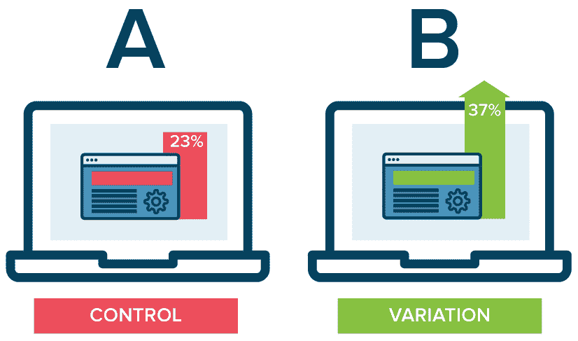

A/B testing explained

所以，如果你在测试标题，你需要创建同一篇博文的两个变体，它们之间唯一的区别应该是标题。

然后你运行一个测试来决定哪个标题更能引起你的观众的共鸣。

当谈到 [A/B 测试软件](https://kinsta.com/blog/wordpress-ab-testing-tools/)时，有很多选择，但这里有你应该考虑的前四个:

然而，请记住，要使测试有效，它需要达到统计显著性。那是什么意思？

[意味着](http://blog.analytics-toolkit.com/2017/statistical-significance-ab-testing-complete-guide/)你需要向每个变体发送一定量的流量，以确保你看到的模式不是偶然的。

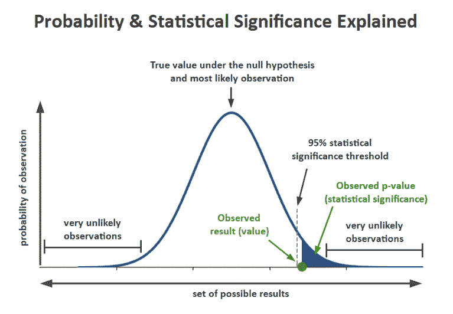

Probability and statistical significance explained

比如你只给 A 页发一个访客，给 B 页发一个访客，结果就一文不值。为什么？

因为你无法确定 say 网站 B 表现更好的事实是否是因为标题。

也许你派去的那个人那天心情很好，所以他们决定采取你想要的行动？

然而，你发送给每个变体的访问者越多，结果就越有可能不仅仅是统计上的噪音。

因此，如果你给每个网站发送 10 个访问者，结果会变得更可靠，如果有 100 个访问者，结果会更可靠，如果有 1000 个访问者，结果会更可靠，以此类推。

在某一点上，结果达到 95%的统计显著性(不是统计噪声的可能性)，在这一点上，它被认为是足够可靠的，可以作为您决策的基础。

所有这些都意味着，如果你想运行 A/B 测试，你需要有流量(这里是[如何为你的站点](https://kinsta.com/blog/how-to-drive-traffic-to-your-website/)增加流量)，你拥有的流量越多，A/B 测试就越有价值。

所以，如果你刚刚开始，不要为 A/B 测试而烦恼，但是如果你每个月已经有很多访问者的话，一定要考虑一下。

## 最佳标题分析工具

现在，如果所有这些关于市场研究、标题公式和 A/B 测试的谈话没有破坏你对文案的浪漫感知，那么准备好最后一击:**标题分析工具**。

是的，你可以用软件来分析你的标题，并决定如何改进。

让我们仔细看看市场上最流行的解决方案:

### 1.高级营销研究所标题分析器

好吧，那么[高级营销研究所](https://www.aminstitute.com/headline/)标题分析器可能会让你对 21 世纪初感到怀旧，但不要被它的外观所迷惑，它可能非常有用。

Advanced Marketing Institute Headline Analyzer

在文本字段中输入标题，选择一个类别，然后点击“提交分析”。

与宕机和 WordPress 问题做斗争？Kinsta 是一款考虑到性能和安全性的托管解决方案！[查看我们的计划](https://kinsta.com/plans/?in-article-cta)

然后你会得到标题的分析，看起来像这样:

Advanced Marketing Institute Headline Analyzer Results

如你所见，我们的头条*几乎*在“专业文案”范围内，还不错。

这个免费的标题分析器是一个很好的方式来快速衡量你的标题是多么引人注目。

### 2.分享头条分析器

share through headlines analyzer 是一个更复杂的分析器，它不仅能告诉你如何与其他文案竞争，还能提供如何改进标题的建议。

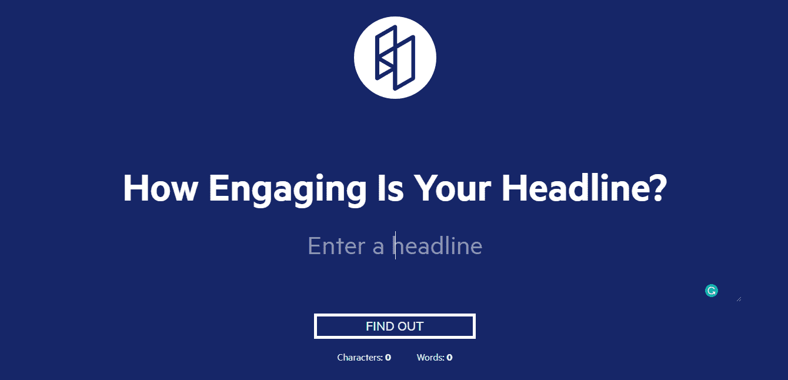

Sharethrough Headline Analyzer

只需在文本字段中键入标题，按“查找”，您将得到如下分析:

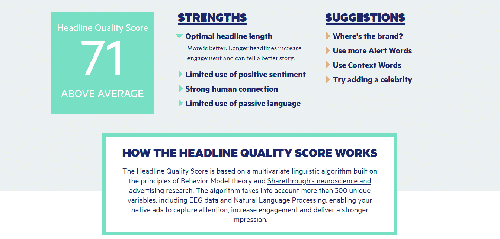

Sharethrough Headline Analysis

正如您所看到的，您可以看看自己的优势，但更重要的是，您可以获得关于如何改进的建议，然后您可以立即实施并在更新的标题上再次运行分析器。

您还可以获得标题的参与度分数和印象分数:

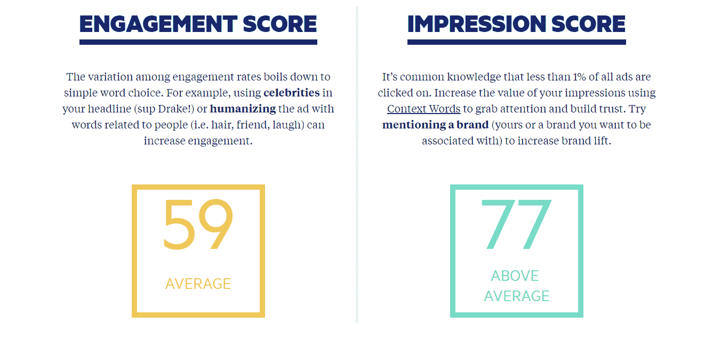

Sharethrough Headline Analysis Results

总的来说，Sharethrough headline analyzer 是一款非常棒的免费工具，在你刚刚开始学习如何撰写引人注目的标题时尤其有用。

### 3.协同计划标题分析器

CoSchedule 标题分析器是最受欢迎的标题分析器。

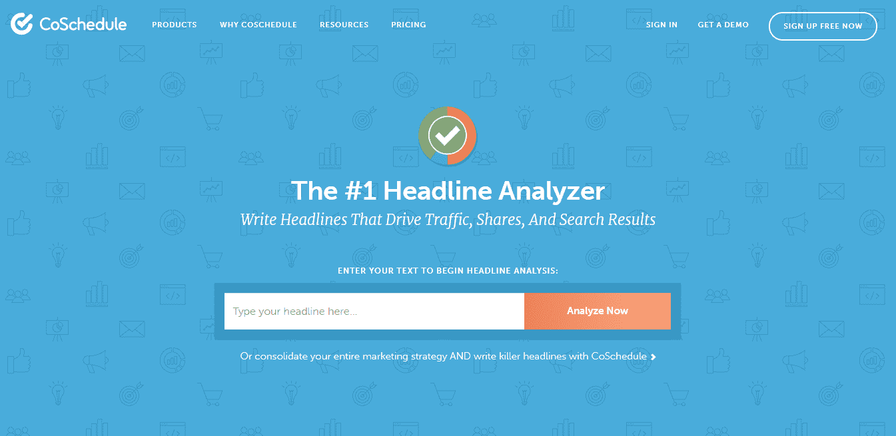

CoSchedule Headline Analyzer

你所需要做的就是在文本字段中输入你的标题，然后点击“立即分析”。

但是，为了获得标题分析，您需要提供一些个人信息:

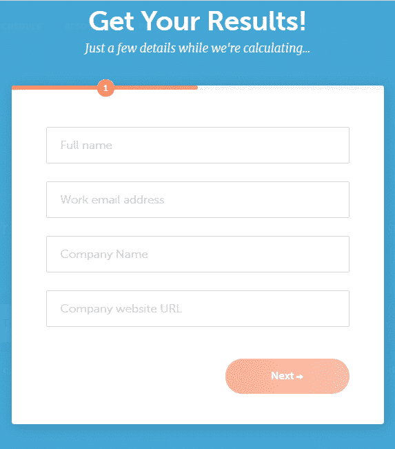

Info required by CoSchedule Headline Analyzer

您还需要回答几个与您的业务相关的问题:

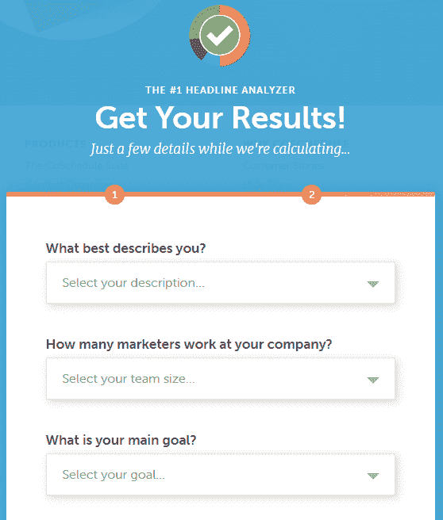

You’ll also need to answer some questions about your business

一旦您提交了所需的信息，您将获得标题分析，其中包括总分，长度分析，谷歌搜索预览等。

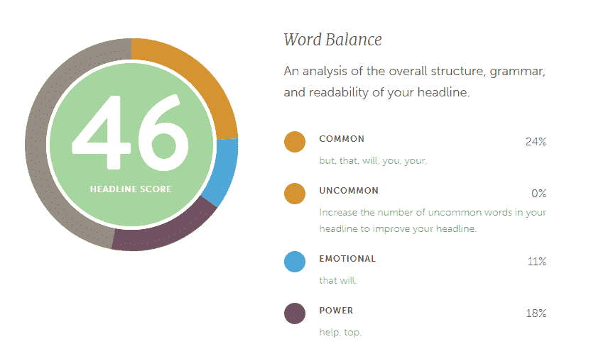

CoSchedule Headline Score

我们的标题低于平均水平，建议增加不常用词的数量。

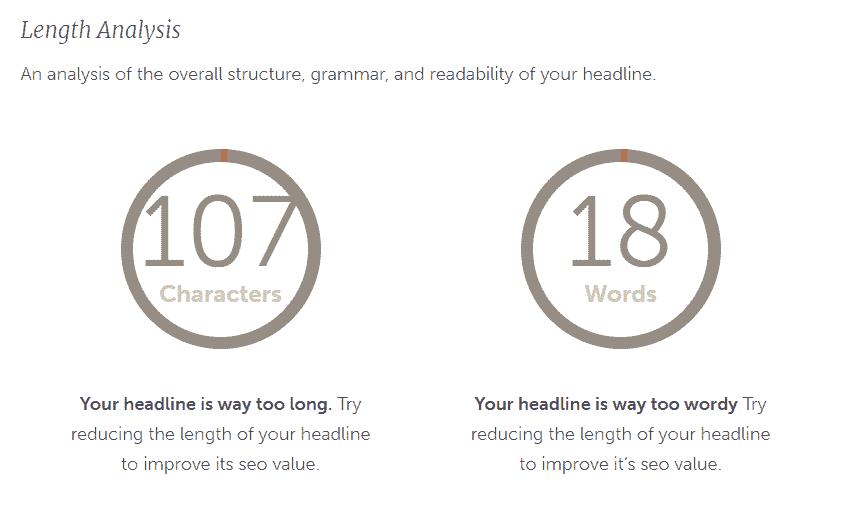

CoSchedule Headline Length Analysis

似乎我们的标题需要缩短。

这很有趣，因为 Sharethrough 说长度是它的优势之一。

然而，当我们看一看谷歌搜索预览版时，问题就变得很明显了。

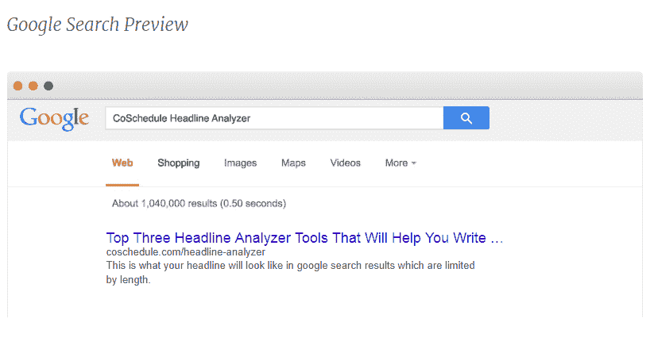

Search Preview in CoSchedule Headline Analyzer

正如你所看到的，这个标题在谷歌上不起作用，如果你写这篇文章时考虑的是搜索引擎的流量，这是很糟糕的。

我想我们必须想出一个更短的标题！

CoSchedule headline analyzer 无疑是这些工具中最好的，因为它为您提供了严格的分析和大量的信息。

当然，你需要记住，虽然标题分析器是有价值的工具，但你不应该把他们的分析当成福音。

所以不要纠结于你的确切分数。重要的是了解你的标题与其他标题相比的总体情况，看看你是否能实施这些建议。

把你得到的分析看作是你应该考虑的一般准则，而不是你必须遵循的严格指令。

此外，使用标题分析器是培养文案直觉的好方法:你用得越多，你就越不需要它们，最终你会有足够的信心自己写标题。

#### 如果你想不出头条创意怎么办？

当你发现自己正在努力写一个标题时，不要浪费时间盯着一张空白页，那没有用。

从乔恩·莫罗的*“52 个头条新闻”*中寻找灵感。如果这没有帮助呢？

那就该用头条生成器了！

### 4.相扑牛逼标题生成器

[Sumo Kickass 标题生成器](https://sumo.com/kickass-headline-generator/)要求您首先选择需要为哪种内容创建标题。

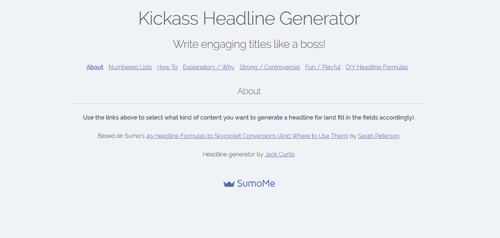

Sumo Kickass Headline Generator

然后，您会被带到一个页面，该页面上有一些文本字段，您需要填写这些字段才能看到标题建议。

然后立即生成标题建议。

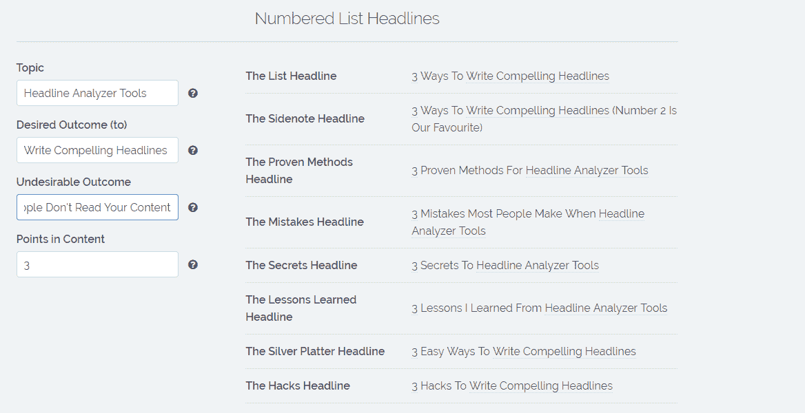

Headline Suggestions in Sumo Kickass Headline Generator

如您所见，它对这个特定的主题不太适用，但对其他主题可能适用。

另外，玩这个工具是记忆标题模板的好方法！

### 5.Inbound Now 博客标题创意生成器

[Inbound Now 博客标题创意生成器](https://www.inboundnow.com/apps/kill-writers-block/)是一个简单而有趣的工具，你可以用它来产生标题创意。

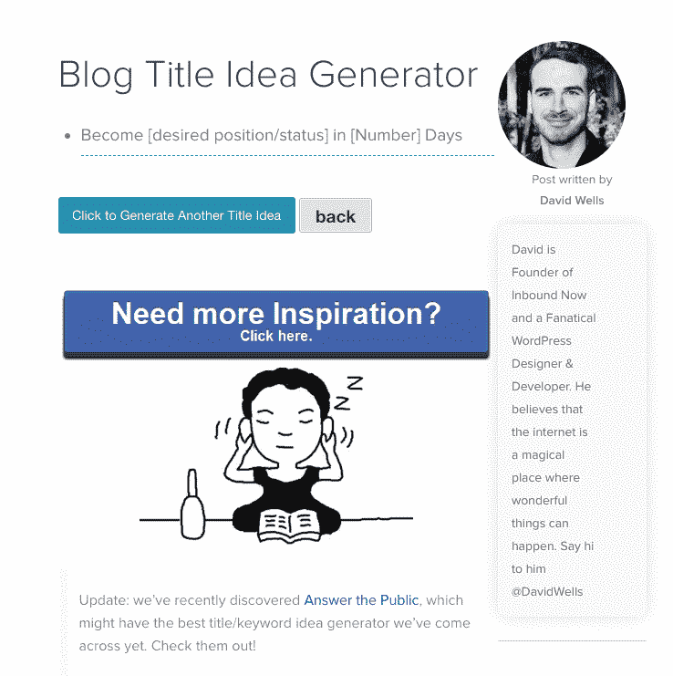

Inbound Now Blog Title Idea Generator

你只需要点击*“点击生成标题创意！”*按钮，它会显示一个标题模板。

不喜欢？再次单击该按钮。迟早会产生与你共鸣的东西。

### 6.影响博客标题生成器

[Impact Blog Title Generator](https://www.impactbnd.com/blog-title-generator/blogabout) 类似于 Inbound Now Blog Title Idea Generator，但它有更多的功能，看起来很棒，而且总体上更好(无意冒犯，Inbound Now，只是保持真实！).

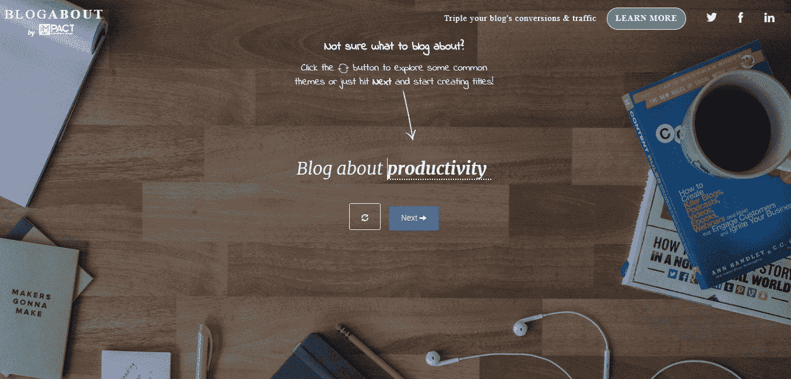

Impact Blog Title Generator

您需要在文本字段中键入您的主题，然后按下*“下一步”*按钮。

然后，您将被带到一个页面，该页面为您提供了一个标题模板，您需要通过填写文本字段来自定义该模板。

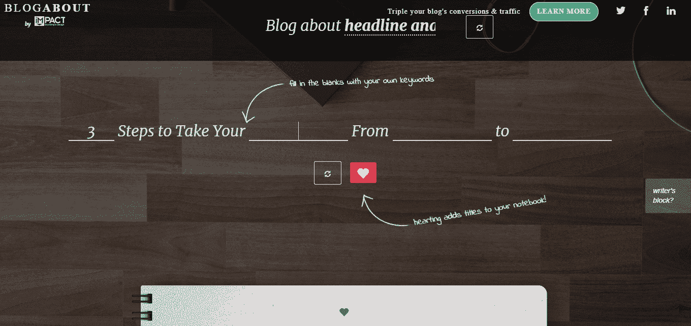

Headline Template in Impact Blog Title Generator

然后，您可以生成另一个标题模板，或者单击心形按钮将标题添加到笔记本中。

这是一个令人印象深刻的标题生成器，如果你想尝试各种标题创意，笔记本功能非常方便。

### 7.征兆内容想法生成器

[预示内容创意生成器](https://www.portent.com/tools/title-maker)是一款出色的标题生成器，设计独特时尚。

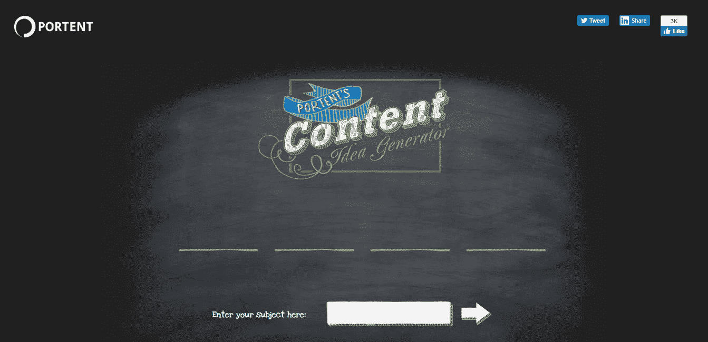

Portent Content Idea Generator

你所需要做的就是在文本字段中输入你的主题，然后按下箭头继续。

你不仅会得到一个标题，还会得到标题背后的推理解释。

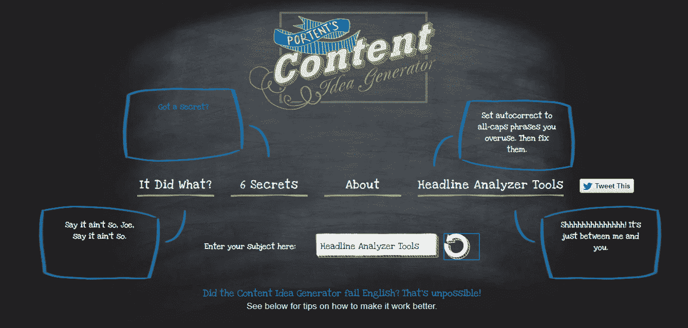

Using Portent Content Idea Generator

这些带有解释的泡泡对想学习写更好的标题的人来说很有价值。

### 8.SEOPressor 博客标题生成器

SEOPressor 是另一个你可以尝试的标题生成器。

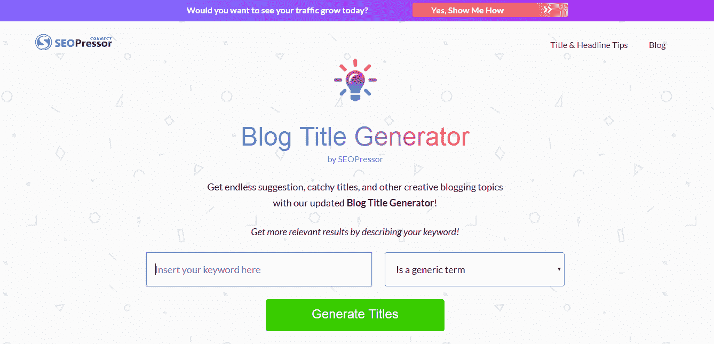

SEOPressor Blog Title Generator

只需将[你的关键词](https://kinsta.com/blog/keyword-research/)放入文本栏，使用下拉菜单对其进行描述，然后按下*“生成标题”*按钮。

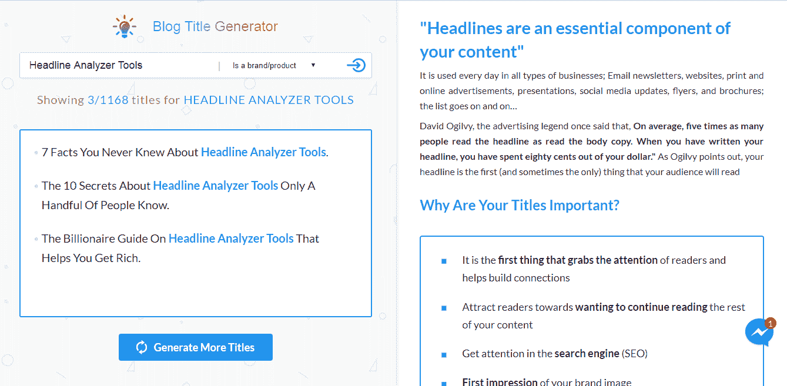

Using SEOPressor Blog Title Generator

正如你所看到的，标题是实实在在的。谁不想读读*《帮助你致富的头条分析工具亿万富翁指南》*？也许我应该写那篇文章！

还有写标题的小技巧。

不要害怕使用标题生成器工具。文思枯竭是真的。有时候你只需要一点点帮助就能让你的创造力源源不断。

## 摘要

标题是博客文章、销售页面和几乎任何内容的关键元素。标题决定内容的成败。

你的文章有多棒并不重要。如果你不能让人们对它感兴趣，没有人会读它。正如所有病毒点击诱饵帖子所强调的那样，即使是一篇平庸的文章，当与引人注目的标题结合时，也能获得很多关注。

现在，没有人说你应该把你的博客变成 BuzzFeed 的克隆版，但是你确实需要学会写吸引眼球的标题。

别忘了奥格威说过的话。当你写好标题时，你已经花掉了 80 美分。所以，一定要好好利用它们。

* * *

让你所有的[应用程序](https://kinsta.com/application-hosting/)、[数据库](https://kinsta.com/database-hosting/)和 [WordPress 网站](https://kinsta.com/wordpress-hosting/)在线并在一个屋檐下。我们功能丰富的高性能云平台包括:

*   在 MyKinsta 仪表盘中轻松设置和管理
*   24/7 专家支持
*   最好的谷歌云平台硬件和网络，由 Kubernetes 提供最大的可扩展性
*   面向速度和安全性的企业级 Cloudflare 集成
*   全球受众覆盖全球多达 35 个数据中心和 275 多个 pop

在第一个月使用托管的[应用程序或托管](https://kinsta.com/application-hosting/)的[数据库，您可以享受 20 美元的优惠，亲自测试一下。探索我们的](https://kinsta.com/database-hosting/)[计划](https://kinsta.com/plans/)或[与销售人员交谈](https://kinsta.com/contact-us/)以找到最适合您的方式。