# 哪里以及如何雇佣一个 WordPress 开发者

> 原文：<https://kinsta.com/blog/hire-wordpress-developer/>

找到一个熟练的专业的 WordPress 开发者确实是一个漫长的，令人疲惫的，令人畏惧的任务。实际上有数百个网站，拥有数百万会员，都在争夺项目，互相压价。

问题是，这些角斗士中的许多人还没有为竞技场做好准备。许多网站实际上没有花时间审查他们的提供商，而是选择让自然选择(评级和评论)随着时间的推移淘汰最弱的成员。对于许多客户来说，这意味着糟糕的用户体验，他们变得沮丧，并很快对开发过程失去信心。这也可能相当昂贵，因为有些人不得不尝试多个开发人员，才能找到一个他们有信心与之合作的开发人员。

令人欣慰的是，有几个平台确实采取了措施，为用户提供更好的招聘体验，并真正吸引专业人才到他们的网站。在这篇文章中，我们将看看八个很棒的资源，并以一些关于如何找到和雇佣最好的 WordPress 开发者的提示结束。

## 寻找和雇佣 WordPress 开发者的可靠来源

在 Kinsta，我们全天候专注于提供高性能的托管 WordPress 主机服务。虽然我们的团队中有技术高超的开发人员，但我们不提供定制开发服务。下面的列表是可靠的来源，我们亲自编辑的，帮助你节省时间，金钱，并减少与低劣的 WordPress 开发者打交道的挫败感。事实上，我们也向客户推荐这些资源。

[Finding a talented #WordPress Developer can be hard. 😞 Here's the 9 trusted resources we use.Click to Tweet](https://twitter.com/intent/tweet?url=https%3A%2F%2Fkinsta.com%2Fblog%2Fhire-wordpress-developer%2F&via=kinsta&text=Finding+a+talented+%23WordPress+Developer+can+be+hard.+%F0%9F%98%9E+Here%27s+the+9+trusted+resources+we+use.)

### 1.金斯塔代理目录

Kinsta 提供了更多的工具和资源，不仅仅是在我们的博客上或通过我们的托管平台提供的。其中一个工具是 [Kinsta Agency Directory](https://kinsta.com/agency-directory/) ，它列出了我们所有可信任的代理客户。

> Kinsta 把我宠坏了，所以我现在要求每个供应商都提供这样的服务。我们还试图通过我们的 SaaS 工具支持达到这一水平。
> 
> <footer class="wp-block-kinsta-client-quote__footer">
> 
> 
> 
> <cite class="wp-block-kinsta-client-quote__cite">Suganthan Mohanadasan from @Suganthanmn</cite></footer>

[View plans](https://kinsta.com/plans/)

[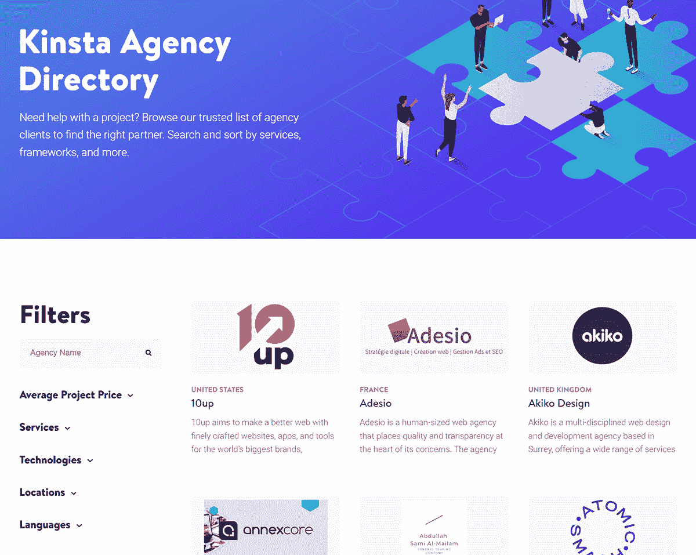](https://kinsta.com/agency-directory/)

The Kinsta Agency Directory.

Kinsta Agency 目录允许您根据服务类型、框架、位置等进行搜索和排序。你甚至可以定义一个平均项目价格，并在你的预算范围内进行搜索。每个机构列表都提供了该机构的重点和优势的描述，以及他们的网站，位置和他们的主要服务列表，这样你就可以一眼决定他们是否是一个很好的选择。

该目录也完全免费使用。

无论您是在寻找 SEO、数字营销还是应用程序开发，我们的代理目录都有您需要的资源来做出明智的决定，并为您的项目找到完美的合作伙伴。

### 2.Codeable.io

Codeable 致力于提供 WordPress 外包服务，致力于为有才华的开发者和客户牵线搭桥。它还提供了一系列处理项目付款方面的选项。我们有幸[采访了 Codeable 的首席执行官 Per Esbensen](https://kinsta.com/blog/interview-with-per-esbensen/) ，看到他们致力于建立一个 WordPress 开发者社区令人耳目一新。

Codeable

开发人员在被允许加入服务之前经过预先筛选，由可编码的工作人员亲自审查[投资组合](https://kinsta.com/blog/wordpress-portfolio-plugins/)和简历。他们有超过 25，000 个客户，只有 300 个 WordPress 专家。只有 2%的申请者被录取。这应该告诉你，当涉及到他们允许平台上的开发人员时，他们是多么有选择性。他们只想要最好的中的最好的，这反过来可以节省您作为客户的大量时间和挫折。

我们已经为金斯塔的客户制定了一个特别的折扣。你的第一个可编码项目可以获得 60 美元的奖励，如果你决定雇佣的话，还可以获得 1 小时的免费咨询。[抢功劳](https://codeable.io/partners/kinsta/?ref=z4HGq)！

### 3.WordPress 工作

[WordPress Jobs](http://jobs.wordpress.net) 是官方的 WordPress Jobs 列表页面(尽管[有点令人困惑](https://make.wordpress.org/meta/tag/jobs-wordpress-net/)托管在 WordPress.net 域名)。他们在接受每一个帖子之前都会对其进行审核，列表会在 21 天内保持有效。只有与 WordPress 相关的工作才能进入董事会。工作包括各种类别，如开发，设计，性能，插件开发，主题定制，[迁移](https://kinsta.com/blog/wordpress-migration-plugins/)，等等。

[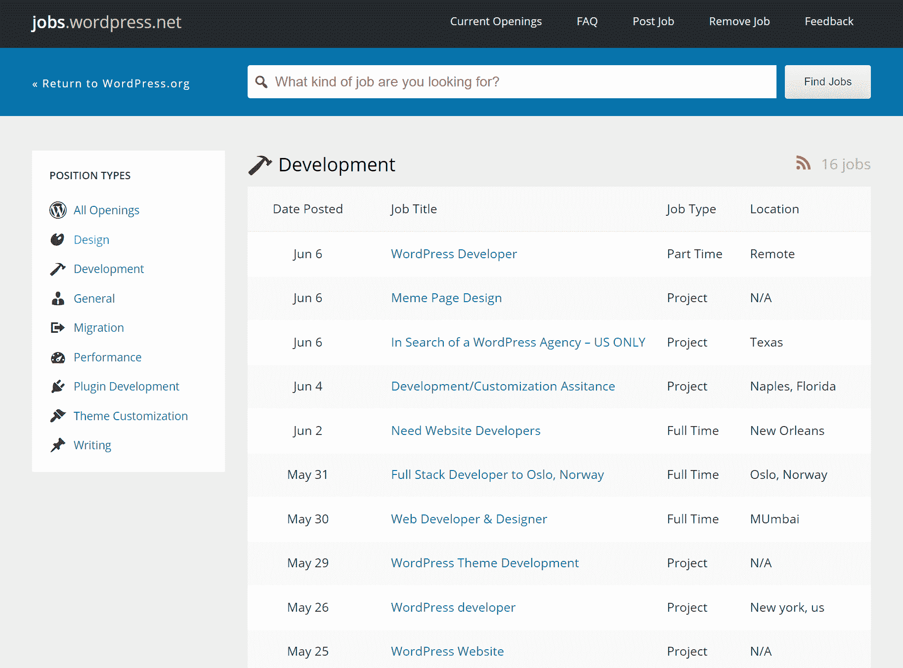](https://jobs.wordpress.net/)

WordPress Jobs

虽然偶尔会有不太费力的职位发布在 WordPress 的求职板上，但你通常只会看到这里提供的严肃项目和全职职位，这两个因素自然会吸引更高质量的申请人。总而言之，这是一个开始搜索开发者的好地方。

### 4.糟糕的工作

作为互联网上最受欢迎和高质量的网络开发出版物之一， [Smashing Magazine](http://www.smashingmagazine.com/) 也经营 [Smashing Jobs](https://jobs.smashingmagazine.com/jobs/) 。这里的列表是付费的——全职职位为 225 美元，自由职业者为 75 美元——这有助于保持整体的高质量。这些工作在 60 天内有效，如果你是非营利组织，它们也有折扣。他们的主网站每月有超过 400 万的用户，所以你可以确保会有大量的观众看到招聘信息。

[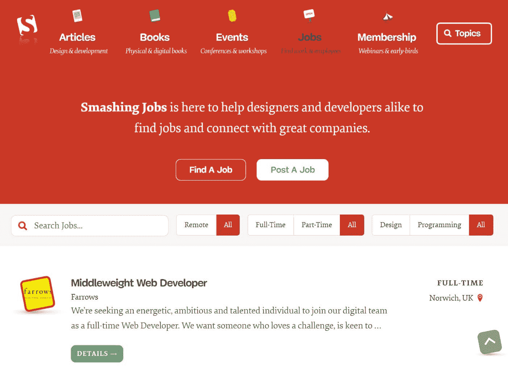](https://jobs.smashingmagazine.com/jobs/)

Smashing Jobs

粉碎乔布斯也有被亚马逊、艺电、特斯拉汽车、麻省理工、动视等几家大牌公司使用的名声。并且在吸引顶尖开发人才方面有着良好的记录。

### 5.海鹰

Seahawk 以革命性的价格为各种企业、品牌和机构提供专业的 WordPress 开发服务。它致力于所有的 WordPress 服务，如定制用户界面设计、迁移&支持、WordPress 维护&维护、被黑网站修复等。

Seahawk

Seahawk 因其专用于防止客户流失的网站主机保留服务而受到顶级网站主机的信任。他们还为所有的 WordPress 服务提供了一个自助服务市场。Seahawk 已经和 1000 多个品牌合作管理 WordPress &提供最好的 WordPress 服务。

### 6.最高分

如果你想从“前 3%的自由职业者中招聘人才”，Toptal 将自己标榜为最佳选择。其密集的开发商预筛选旨在支持这一说法。它们类似于 Codeable，但也涵盖了所有开发领域，而不仅仅是 WordPress。招聘一个人的费用是 500 美元的押金，当你找到合适的 WordPress 开发者时，这笔钱可以用于你的第一笔账单。

[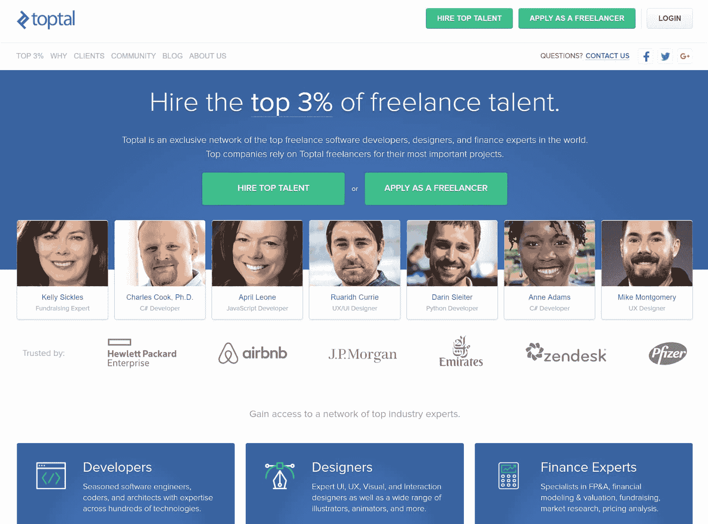](http://www.toptal.com/)

Toptal

新成员需要通过招聘人员的标准面试，随后是限时算法挑战。当高级开发人员评审他们的工作时，他们面临着另一个挑战。最后，他们被要求完成一个测试项目。Toptal 与 Airbnb、HP、J.P. Morgan 和 Zendesk 等许多大牌品牌合作过。

### 7.堆栈溢出职业

对于全世界的开发者来说， [Stack Overflow](http://stackoverflow.com/) 是许多日常技术问题的首选。很自然，他们会以 [Stack Overflow Careers](http://careers.stackoverflow.com/employer) 的形式为雇主和开发者提供匹配的解决方案。如果你想找一个便宜的方式找到开发商，这不是地方。这是为那些认真寻找顶尖人才的公司和企业准备的。访问他们的候选人搜索板的费用起价为 2499 美元(年费)。

[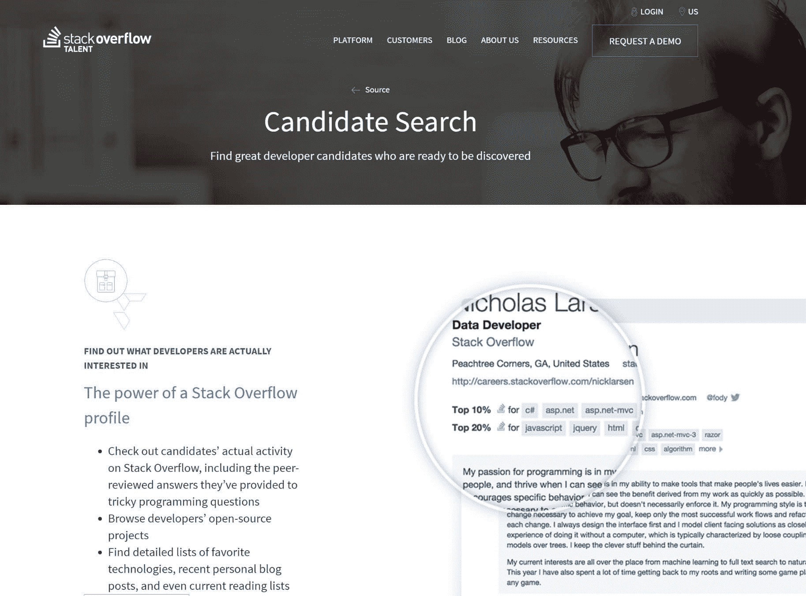](http://careers.stackoverflow.com/employer)

Stack Overflow Careers

作为一名雇主，你可以通过个人招聘广告、创建公司网页来吸引申请人，或者简单地在开发人员档案中搜索具有合适技能的候选人来联系开发人员。主 Stack Overflow 网站每月有超过 5000 万的独立访问者，工作列表显示在整个网站上(甚至在侧边栏上)。这确保了全球观众每天都能看到您的列表。

### 8.WPhired

WPhired.com 是由 WordPress 的狂热爱好者杰罗姆·德戈尔·因诺琴蒂创造的。这是 2010 年推出的首批 WordPress 求职板之一。它的目的是用有才华的 WordPress 开发者连接小型到大型企业。是 100% WordPress，没别的！

[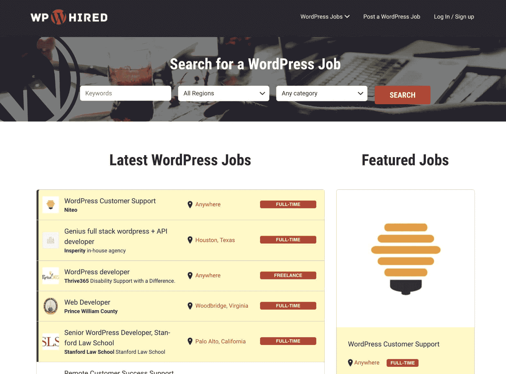](https://www.wphired.com/)

WPhired

你可以快速发布一个 WordPress 工作，这个工作可以吸引 1000 多名 WordPress 专家。你猜怎么着？发布工作是完全免费的。无论你是在寻找一个新的 WordPress 设计，帮助迁移，还是插件开发，你都可以很容易地找到你需要的人才。

### 9.点击 WP

ClickWP 专门为使用 WordPress 的个人和企业提供可靠的支持。他们的一些服务包括网站设置、主题定制、恶意软件或黑客修复、备份、 [WordPress 迁移](https://kinsta.com/help/migrate-wordpress-duplicator-plugin/)等月度计划和按需任务。如果你需要一些基本的开发工作，比如配置一个插件，[定制你的 WordPress 主题](https://kinsta.com/blog/how-to-customize-wordpress-theme/)，或者调整你的 CSS，ClickWP 可能是一个非常**划算和快速的解决方案**。

## 注册订阅时事通讯

### 想知道我们是怎么让流量增长超过 1000%的吗？

加入 20，000 多名获得我们每周时事通讯和内部消息的人的行列吧！

[Subscribe Now](#newsletter)

[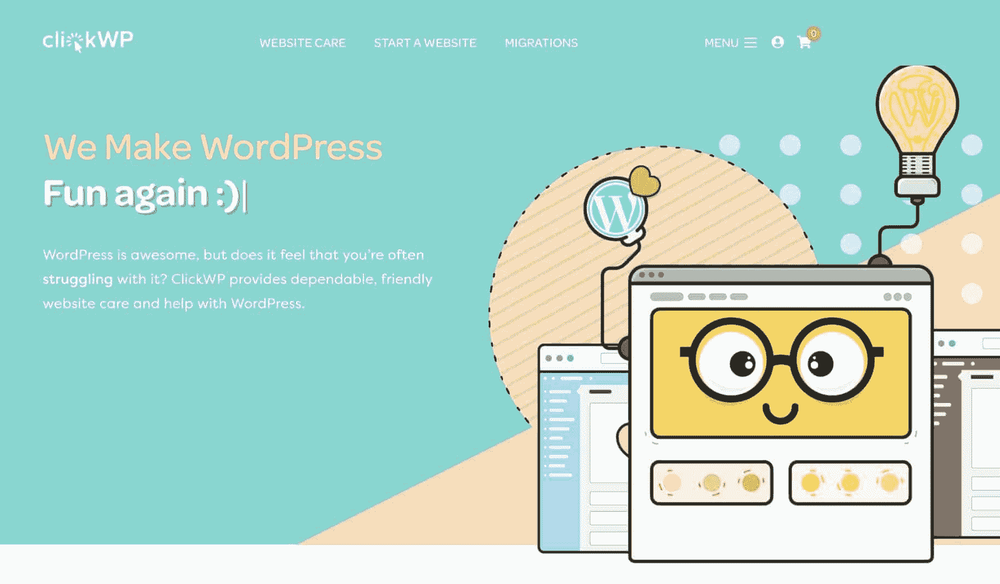](https://clickwp.com/)

ClickWP

ClickWP 由王耀庆领导，他是一名博客和营销人员，拥有 10 年的 WordPress 经验。如果您需要完成一些基本的开发任务，并且不想找开发人员，我们建议您联系他们，看看他们能提供什么帮助。如果您有更复杂的开发任务，上面提到的其他六个来源中的任何一个也很棒。

### 10.模式效应

[Mode Effect](https://modeeffect.com/) 由 Cody 和 Raquel Landefeld 于 2010 年创立，为电子商务商店和企业公司创建网页开发解决方案。他们**专门从事 WooCommerce** 和扩展开发，以帮助增加销售和扩展你的商店的功能。他们还提供完整的网站重新设计服务和定制主题开发。如果你需要为你的商店建造一些不存在的东西或者配置一个集成，这些人可以做。

[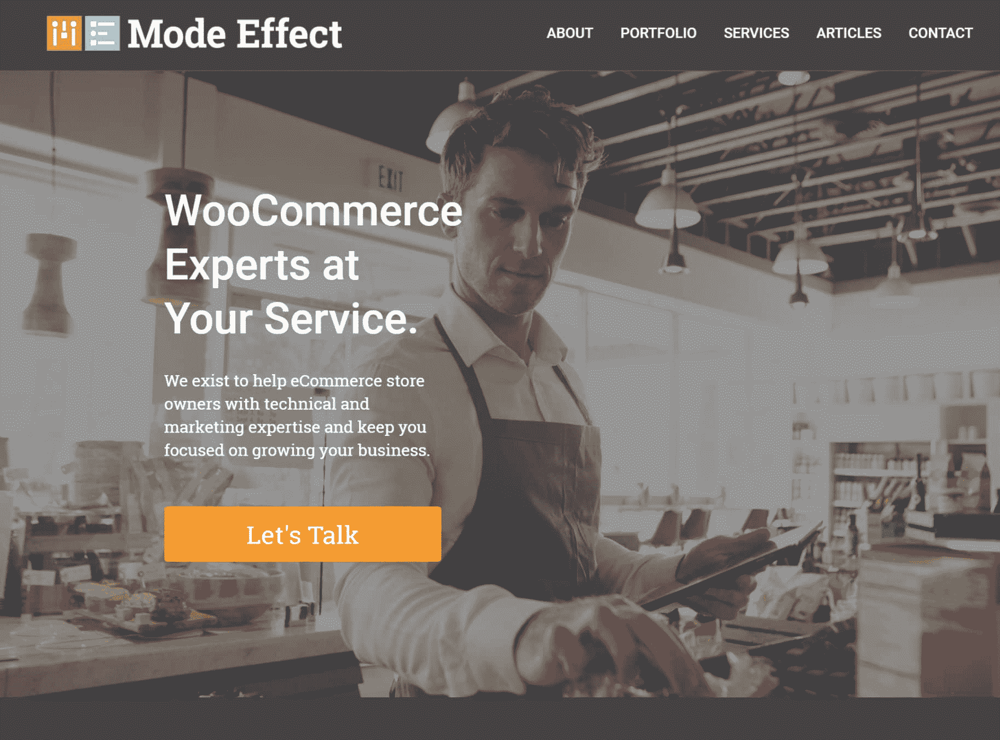](https://modeeffect.com/)

Mode Effect

Mode Effect 曾与迪士尼、CompTIA、movile、菲尼克斯太阳队等大品牌合作，当然还有 WooCommerce。通过与 Automattic 合作，他们甚至开发了位于 refer.wordpress.com 的官方 WordPress.com 联盟计划网站。一定要看看我们对科迪·兰德菲尔德的[采访。](https://kinsta.com/blog/interview-cody-landefeld/)

### 那 Upwork，Freelancer.com 和 Fiverr 呢？

毫无疑问，你已经听说过其他平台，如 [Upwork](https://www.upwork.com/) (以前的 Elance 和 oDesk)【Freelancer.com】和 Fiverr。在这些网站上肯定有很多有才华的 WordPress 开发者，但是为了获得一个满意的结果，你有责任做好你的尽职调查。如果这是你第一次尝试寻找开发人员，这些平台可能会很棘手，而且很费时。

推荐文章:[如何使用 Fiverr 减少业务繁忙](https://kinsta.com/blog/how-to-use-fiverr/)

## WordPress 维护公司

近年来出现了大量的 WordPress 顾问和维护公司来帮助 WordPress 网站所有者。他们提供支持、WordPress 维护和网络开发服务。他们中的一些提供每月的计划以及一次性的修复来满足你所有的 WordPress 需求。以下是一些最受欢迎的提供商，其中一些是我们亲自合作和推荐的。

### 暴涨 WP

提供 WordPress 维护服务、支持和托管解决方案，为那些希望发展业务的人处理 WordPress。我们甚至与他们一起做了一个[案例研究](https://kinsta.com/clients/skyrocketwp/)，请务必看一看！

[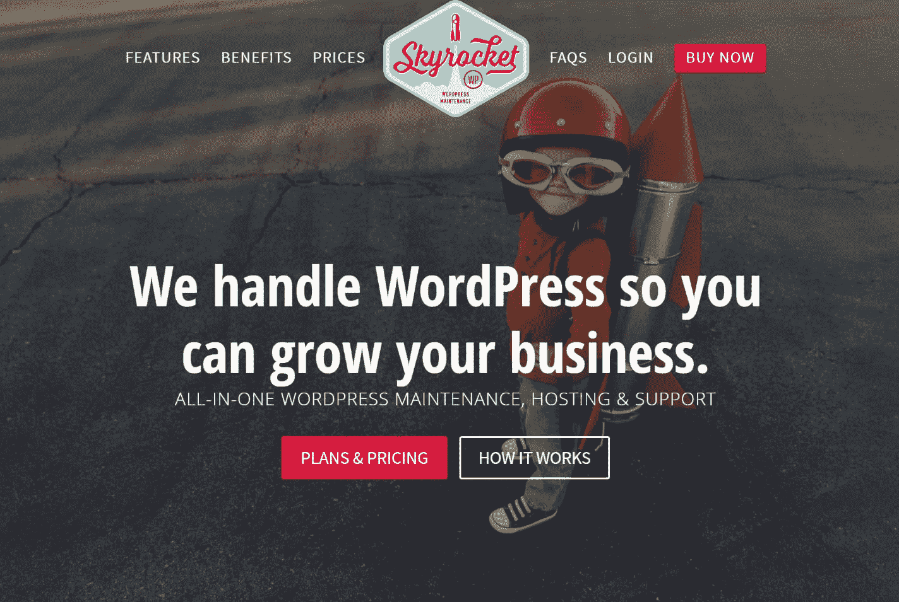](https://skyrocketwp.com/)

SkyrocketWP

### WP-滋补品

WP-Tonic 为忙碌的企业主提供真正的精品礼宾支持和维护服务。没有时间解决你的 WordPress 问题？让 WP-Tonic 帮你搞定。他们还运行一个流行的播客，在播客中他们采访 WordPress 企业主和开发者，以获得行业内正在发生的内幕消息。

Struggling with downtime and WordPress problems? Kinsta is the hosting solution designed to save you time! [Check out our features](https://kinsta.com/features/)

建议阅读:如何使用 WordPress 开始播客。

[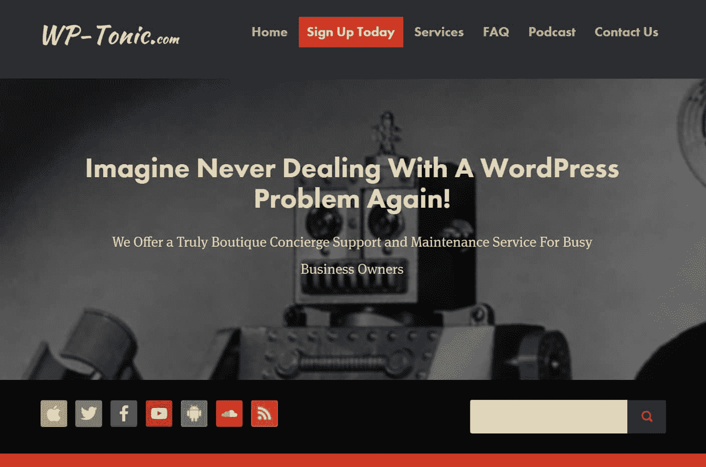](https://www.wp-tonic.com/)

WP-Tonic

### WP Buffs

WP 爱好者为严肃的网站所有者和白牌代理合作伙伴提供 WordPress 关怀计划。正如他们在自己的页面上所说:“向你的新 WP CTO 问好！”顺便说一句。 [WP Buffs](https://kinsta.com/clients/wp-buffs/) 由 Kinsta 自豪地主持:)

[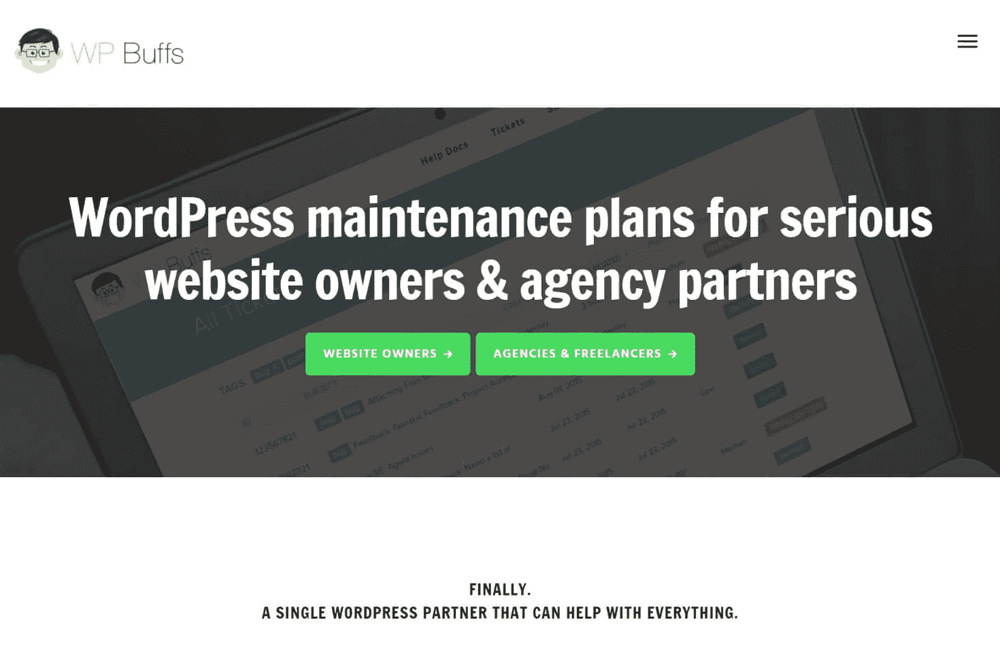](https://www.wpbuffs.com/)

WP Buffs

这里有一些额外的也要检查。

*   [WP 现场维护](https://www.wpsitecare.com/)
*   [wpmatic](https://wpmatic.io/)
*   [的选择](https://www.valet.io/)

考虑到这一点，我们将继续讨论评估潜在雇员的建议。这些对我们提到的任何网站都很有用，但如果你是从不太专业的人才库如 Upwork 或 Fiverr 招聘人才，这些网站尤其有价值。

## 如何雇佣一个高质量的 WordPress 开发者(5 个步骤)

当你在寻找一个完美的 WordPress 开发者时，意识到从一开始就定下基调并彻底研究你的候选人是你的责任是至关重要的。如果你不这样做，你将会来回浪费大量的时间，并且很有可能以一个低于标准的工作或项目而告终。详细检查以下五个方面将有助于从一开始就将小麦从谷壳中分离出来。

### 1.检查评级和评论，并坚持看到以前的工作

评估候选人时，对平台上以前工作的评级和评论显然是要检查的第一项，但不要止步于此；你还应该寻找投资组合工作，他们已经完成的项目数量，以及他们在网上的代码。

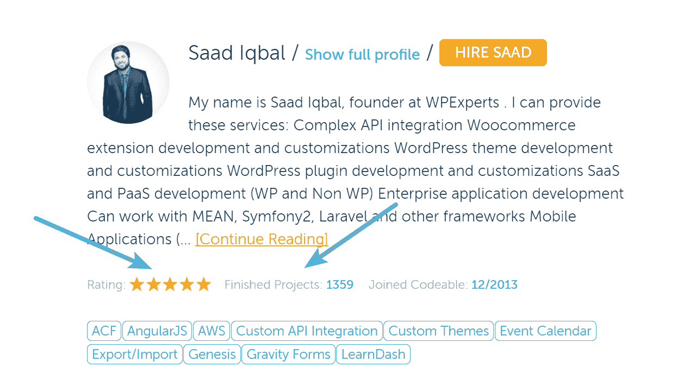

Check WordPress developer ratings

一个可靠的项目组合证明了开发者实际上有能力生产高质量的项目，并且在过去已经交付了。可访问的代码库(例如在 [Github](https://kinsta.com/knowledgebase/what-is-github/) 上)，表明他们至少对现代开发实践有一些承诺，并给你一个机会来实际审查他们的代码。

你也可以更进一步，让他们完成编码测试。这是一种筛选出不具备所需技能水平的人的简单方法。TestDome 有一个很棒的 PHP 和 WordPress 测试，你可以要求考生参加。这要求他们能够解决 PHP 中的编码问题，以及回答关于 WordPress API 和架构的问题。

### 2.不要被低价欺骗

一个好的开发者应该让你赚钱，而不是让你花钱。不要被廉价外包开发的承诺所诱惑，因为通常情况下，你会得到你所付出的。当你最终不得不放弃整个项目，从头开始重新做的时候，这个诱人的低价提议看起来就没那么有吸引力了。

Be careful with cheap development offers

当然，低利率并不总是意味着低质量。熟悉一下[标准市场价格](https://blogging.com/do-most-wordpress-developers-charge-too-much/)实际上是什么，然后使用我们在这里的其他观点在个案基础上进行评估。

### 3.要求有效的沟通

没有人可以 24/7 都在，但是一个忠诚的开发人员会努力及时地回答你的问题，并确保你知道在工作时间什么时候以及如何联系到他。沟通的方式也很重要。片状剥落或缺乏清晰度的早期迹象是问题的典型征兆。

从一开始就坚持清晰的沟通，如果沟通不畅就走开。能够确定自己是否能够与他们有效沟通，对于长期关系来说非常重要。一个好的开发人员不仅能够很好地编写代码，还应该能够与非技术人员交流。

[A good #WordPress developer should be able to effectively communicate to a non-techie person. 👍Click to Tweet](https://twitter.com/intent/tweet?url=https%3A%2F%2Fkinsta.com%2Fblog%2Fhire-wordpress-developer%2F&via=kinsta&text=A+good+%23WordPress+developer+should+be+able+to+effectively+communicate+to+a+non-techie+person.+%F0%9F%91%8D)

### 4.执行付费测试项目

除了免费的代码测试，一个小型的付费测试项目通常会告诉你你需要知道的关于开发人员工作方法的一切。把这些看做亏本买卖。如果事情变糟了，你就避免了在同一个开发商的大项目中失败。如果一切顺利，你有一个很好的迹象表明，更广泛的项目将一帆风顺。

### 5.就工作范围达成一致

雇佣 WordPress 开发者的最后一个建议是确保所有相关方理解工作和项目的范围。很多时候，客户会为了一个还没有完全确定的工作而匆忙雇佣开发人员。由于沟通不畅，这通常会导致一个未完成的项目，时间和金钱的损失，有时还会破坏关系。

## 结论

为你的项目找到合适的开发人员看起来很困难，但是只要找对了地方，你基本上已经成功了一半。如果你愿意为质量付费，以上八个网站都是很好的资源。不管你从哪里寻找开发人员，遵循我们的五点清单是保证质量的最佳方式。让我们快速回顾一下要点:

*   查看评论，坚持看作品集。让他们完成代码测试。
*   不要陷入低价策略。
*   要求开发人员进行有效的沟通。
*   执行付费测试项目。
*   就工作范围达成一致。

我们很想听听你到目前为止雇佣 WordPress 开发者的经历。有没有什么我们没有提到的更好的网站，你可以找到并雇佣 WordPress 开发者？或者你想分享的小技巧？通过评论联系我们，让我们知道！

* * *

让你所有的[应用程序](https://kinsta.com/application-hosting/)、[数据库](https://kinsta.com/database-hosting/)和 [WordPress 网站](https://kinsta.com/wordpress-hosting/)在线并在一个屋檐下。我们功能丰富的高性能云平台包括:

*   在 MyKinsta 仪表盘中轻松设置和管理
*   24/7 专家支持
*   最好的谷歌云平台硬件和网络，由 Kubernetes 提供最大的可扩展性
*   面向速度和安全性的企业级 Cloudflare 集成
*   全球受众覆盖全球多达 35 个数据中心和 275 多个 pop

在第一个月使用托管的[应用程序或托管](https://kinsta.com/application-hosting/)的[数据库，您可以享受 20 美元的优惠，亲自测试一下。探索我们的](https://kinsta.com/database-hosting/)[计划](https://kinsta.com/plans/)或[与销售人员交谈](https://kinsta.com/contact-us/)以找到最适合您的方式。