# 2022 年 11 种最先进的 Hootsuite 替代品

> 原文：<https://kinsta.com/blog/hootsuite-alternatives/>

你正在寻找 Hootsuite 替代品来管理你的有机社交媒体活动吗？

社交媒体已经迅速成为提高品牌知名度的最佳有机渠道之一。2021 年，91% 的营销人员将使用社交媒体发布内容，这一比例超过了他们自己公司博客的使用比例(79%)。2013 年，这一数字为 86.2%。

但是随着对社交媒体的日益关注，你需要一些方法来管理和衡量你活动的结果。

Hootsuite 是市场上首批社交媒体管理平台之一，但其定价模式开始失去青睐。许多小公司不想为一个仅限于五个用户的商业帐户每月支付超过 700 美元。

在这篇文章中，我们将向你展示所有其他的选择。我们将涵盖 11 种付费和免费的 Hootsuite 替代品，它们可以帮助你在 2022 年及以后扩大你的社交媒体存在。

## 为什么在 2022 年你应该考虑 Hootsuite 的替代品

十年前，Hootsuite 只是帮助你更有效地管理社交媒体的少数选择之一。2022 年 [G2](https://www.g2.com/categories/social-media-mgmt) 上市的社交媒体管理软件工具有 290+个。

> Kinsta 把我宠坏了，所以我现在要求每个供应商都提供这样的服务。我们还试图通过我们的 SaaS 工具支持达到这一水平。
> 
> <footer class="wp-block-kinsta-client-quote__footer">
> 
> 
> 
> <cite class="wp-block-kinsta-client-quote__cite">Suganthan Mohanadasan from @Suganthanmn</cite></footer>

[View plans](https://kinsta.com/plans/)

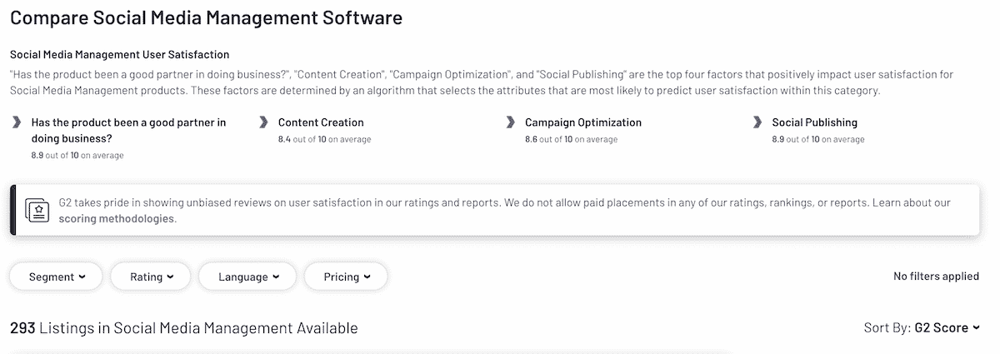

Social Media platforms listed on G2

这并不是说 Hootsuite 不再是一个社交媒体管理工具，它在 2022 年仍然有效。

但是可能还有其他更适合你的预算、行业、首选频道(比如 Instagram)或其他独特需求的选择。

虽然 Hootsuite 支持大多数社交媒体平台，但它不一定是为了帮助你为某个特定平台创建完美的[内容和策略](https://kinsta.com/blog/visual-content-strategy/)，这可能会让一些公司受益。

对于新团队成员来说，这也不是最容易学习的工具，这可能成为成长型公司的一个痛点。

下面，我们强调了 11 个可能对你的团队和公司更好的选择。

[Whether you're looking for a better price or specific features, these Hootsuite alternatives offer top-tier solutions 🦉Click to Tweet](https://twitter.com/intent/tweet?url=https%3A%2F%2Fkinsta.com%2Fblog%2Fhootsuite-alternatives%2F&via=kinsta&text=Whether+you%27re+looking+for+a+better+price+or+specific+features%2C+these+Hootsuite+alternatives+offer+top-tier+solutions+%F0%9F%A6%89&hashtags=SocialMedia%2CSMM)

## 如何为你的公司找到最好的社交媒体管理工具

在我们进入列表之前，让我们快速介绍一下在您做出最终决定之前应该考虑的软件工具的各个方面。

你必须考虑的不仅仅是价格或声誉，还要探索个人特色和公司的独特需求。

这包括:

*   平台支持:它支持你使用的所有社交媒体渠道吗？
*   价格:你的整个团队要花多少钱？
*   特点:它包括[分析](https://kinsta.com/blog/google-analytics-alternatives/)吗，或者你需要去别的地方吗？

不管对单个用户来说是否更便宜，如果定价模型是按用户的，并且你有一个 8 人的团队。在决定一个新的社交媒体平台之前，考虑所有的因素。

## Hootsuite 替代品

### 1.Buffer:对于小团队来说是 Hootsuite 的更好的替代方案

社交媒体管理行业的另一个 OG， [Buffer](https://buffer.com/) ，从 2010 年 11 月就有了。

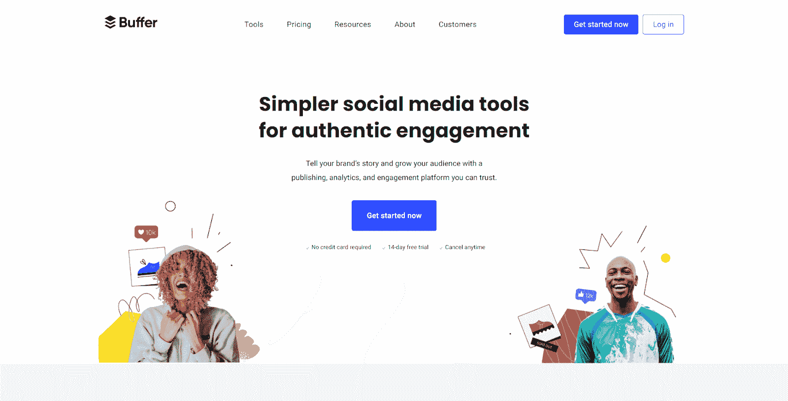

缓冲

它以更低的价格提供高级功能，是小型企业和团队更好的 Hootsuite 替代产品。

**优点:**

*   用户友好的界面
*   包括一个针对具有基本需求的个人用户的免费计划(三个社交账户，一个用户，基本的日程安排功能)
*   比 Hootsuite 更实惠的是，全功能代理计划每月花费 100 美元，拥有无限用户和 10 个社交频道
*   包括用于规划和创建 Instagram 故事的[可视化编辑工具](https://kinsta.com/blog/data-visualization-tools/)
*   支持 Instagram 商店网格
*   高级协作工具

**缺点:**

*   缓冲分析每月单独收费 35 美元或 50 美元(某些计划)

**推荐用于:**

*   中小企业
*   [自由职业者](https://kinsta.com/blog/best-tools-for-freelancers/)
*   小型社交媒体营销团队或机构

**定价:**为一个用户提供有限的免费计划，最多十篇社交媒体帖子。最低等级的付费计划起价为每月 5 美元。该分析套件作为一个单独的包提供，起价为每月 35 美元。

#### 缓冲区 vs Hootsuite

让我们来看看 Hootsuite 的特点和价格。

|  | **缓冲器** | 胡特苏特 |
| **免费计划** |  | X |
| **全功能计划的价格** | $ 100/月(无限制) | $ 739/月(5 个用户) |
| **视觉内容规划** |  |  |
| **分析** | (带额外产品) |  |
| **推特、脸书、Instagram 支持** |  |  |
| **社交倾听** |  |  |
| **协作工具** |  |  |
| **Instagram story builder** |  | X |
| **高级调度** |  |  |
| **批量调度** | (与第三方“批量缓冲服务”一起使用) | X |
| **PDF 报告** |  |  |

Buffer 和 Hootsuite 都涵盖了你所期望的功能，比如社交日程安排和倾听。但只有 Buffer 拥有先进的 Instagram 营销工具，如可视化故事生成器和商店网格支持。

此外，Buffer 便宜很多，即使添加了 Buffer Analytics 产品。它甚至提供免费计划。

高级分析产品功能强大，不仅适用于小型企业，还适用于企业和 SaaS 营销。

### 2.Agorapulse:知名品牌的另类选择

Agorapulse 是一个完整的社交媒体管理平台，提供广泛的社交规划、发布、监控和分析工具。

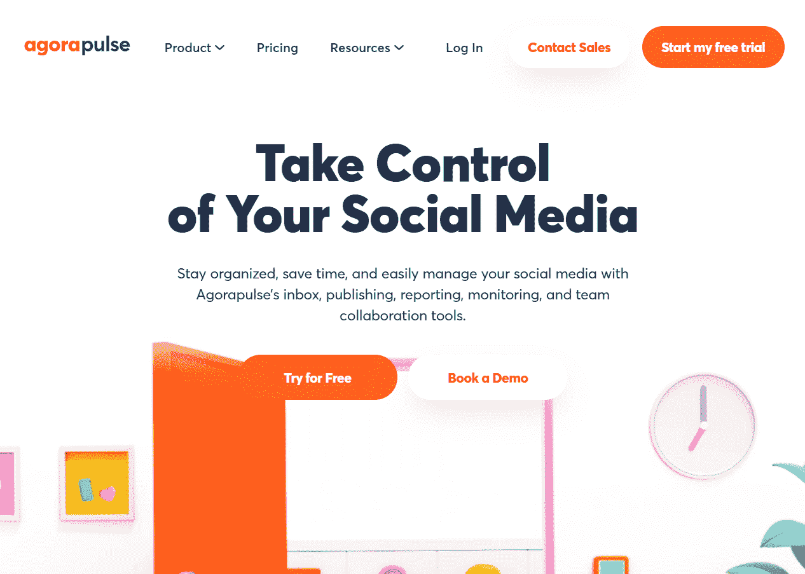

你可以计划一个活动，安排时间，找到可能参与的人，并检查结果，所有这些都在同一个工具中。

**优点:**

*   包括有基本需求的个人用户的免费计划(三个社交账户，一个用户，40 个月帖子)
*   包含社交倾听、社交广告管理、分析等内容的完整套件
*   高级协作工具
*   易于使用的界面(可用性排名高于 G2 人群中的 Hootsuite)

**缺点:**

*   Pro 计划每月起价 79 美元，比 Hootsuite 和许多替代品都贵。

**推荐用于:**

*   中小企业
*   代理

**定价:** Agorapulse 有一个用户的有限免费计划，三个社交媒体档案，每月最多 40 篇帖子。pro 计划每月 79 美元起，比 Hootsuite 贵。

#### Agorapulse vs Hootsuite

Agorapulse 在一个社交媒体管理平台上提供你想要的一切，甚至让你免费开始。

|  | **Agorapulse** | 胡特苏特 |
| **免费计划** |  | X |
| **全功能计划的价格** | $ 199/月(4 个用户) | $ 739/月(5 个用户) |
| **视觉内容规划** |  |  |
| **推特、脸书、Instagram 支持** |  |  |
| **分析** |  |  |
| **社交倾听** |  |  |
| **协作工具** |  |  |
| **高级调度** |  |  |
| **批量调度** |  | X |
| **PDF 报告** |  |  |

此外，与 Hootsuite 不同，批量调度内置于平台中，即使是每月 79 美元起的最便宜的“专业”计划也是如此。

### 3.萌芽社交:企业的另类选择

如果你正在为一家企业工作，并且你正在寻找一个比 Hootsuite 更强大的社交媒体管理平台，那么 [Sprout Social](https://sproutsocial.com/) 可能适合你。

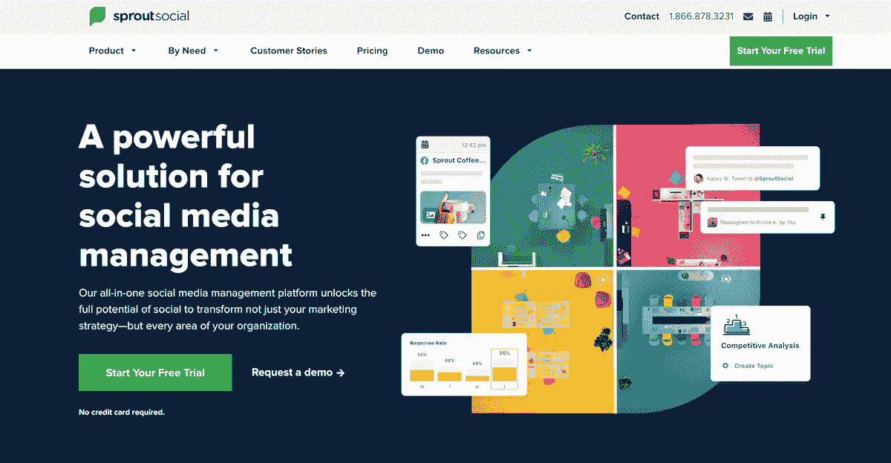

Sprout Social

除了集成的社交收件箱、深入的分析工具和用于管理编辑工作流程的高级工具，它还提供员工宣传工具，使创建一个活生生的社交企业变得更加容易。

**优点:**

*   完美满足企业社交倾听、高级分析、编辑控制等需求
*   员工宣传工具使扩大社会活动变得容易。
*   [聊天机器人](https://kinsta.com/blog/chatbot/)内置于平台中

**缺点:**

*   标准计划每月 89 美元起，比 Hootsuite 和其他选择稍贵。

**推荐用于:**

*   企业
*   大型机构

**定价:**标准计划每月 89 美元起，比 Hootsuite 贵。包含所有功能的高级计划每月花费 249 美元。

#### 萌芽社交 vs 胡特

在功能、可用性和价格方面，Sprout Social 与 Hootsuite 不相上下。但如果按用户定价，如果你有一个大型的社交媒体营销团队，费用可能会高得多。

|  | **萌芽社交** | 胡特苏特 |
| **免费计划** | X | X |
| **全功能计划的价格** | $ 249/月(1 个用户) | $ 739/月(5 个用户) |
| **视觉内容规划** |  |  |
| **推特、脸书、Instagram 支持** |  |  |
| **分析** |  |  |
| **社交倾听** |  |  |
| **协作工具** |  |  |
| **高级调度** |  |  |
| **批量调度** |  | X |
| **PDF 报告** |  |  |

它还提供独特的企业友好型功能，如员工宣传工具和真正深入的分析和报告，非常适合用于季度绩效报告。

总的来说，这是企业和大型机构的绝佳选择。

### 4.SocialPilot:更实惠的 Hootsuite 替代方案

[SocialPilot](https://www.socialpilot.co/) 是一个稍微更基本的社交媒体营销工具。它不提供社交监听或其他高级功能。

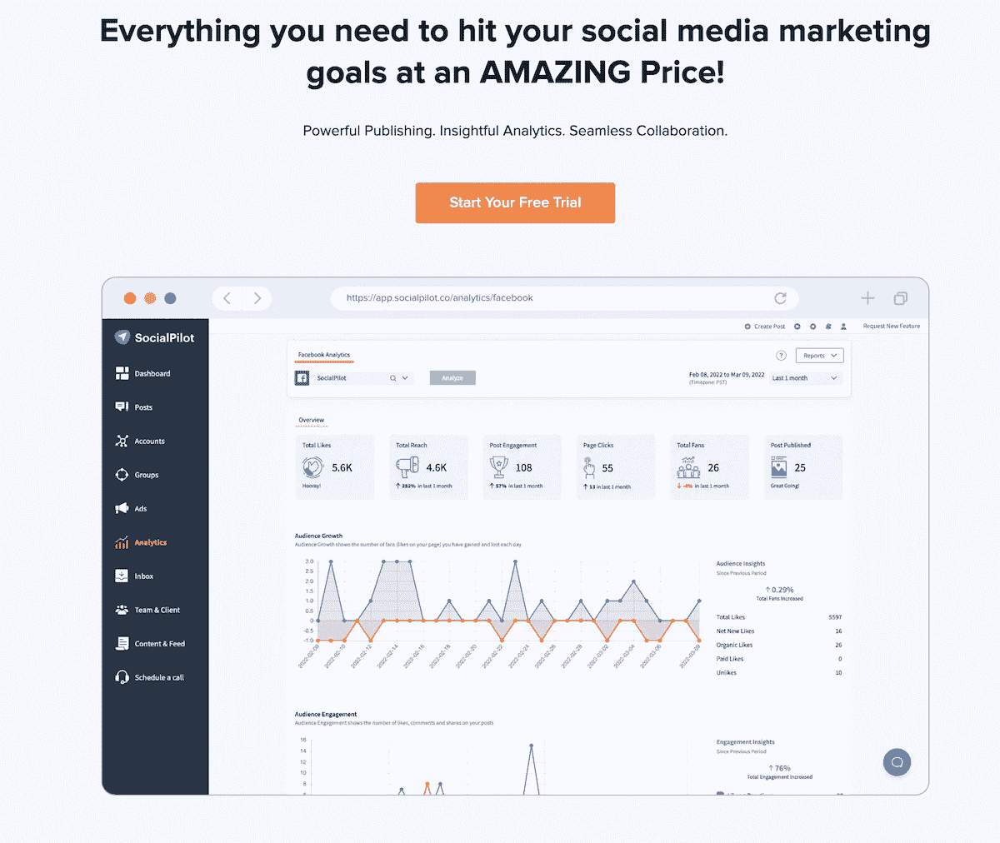

SocialPilot

它仍然提供了您规划和发布内容所需的所有工具，如社交媒体日历、批量计划和审批后工作流程。

**优点:**

*   使用方便
*   经济实惠—计划起价为每月 25.50 美元(按年计费)
*   完整的社交发布工具箱，包括批量调度、审批工作流、 [RSS 源](https://kinsta.com/blog/wordpress-rss-feed/)等

**缺点:**

*   缺乏社交倾听和真正深入的分析。

**推荐用于:**

*   中小企业
*   自由职业者
*   代理

 **定价:**按年计费时，专业计划每月起价仅为 25.50 美元，还不到最便宜的 HootSuite 计划的一半。即使是全功能的代理计划也明显更便宜，同时提供更多的用户。

#### 社交飞行员 vs Hootsuite

SocialPilot 相对于 Hootsuite 最大的优势就是价格。它以 Hootsuite 的五用户商业计划的 1/4 的价格为多达十个用户提供完整的功能。

|  | **社会飞行员** | 胡特苏特 |
| **免费计划** | X | X |
| **全功能计划的价格** | $ 125/月(9 个用户) | $ 739/月(5 个用户) |
| **视觉内容规划** |  |  |
| **推特、脸书、Instagram 支持** |  |  |
| **分析** |  |  |
| **社交倾听** | X |  |
| **协作工具** |  |  |
| **高级调度** |  |  |
| **批量调度** |  | X |
| **PDF 报告** |  |  |

SocialPilot 唯一的缺点是，除了对你的社交媒体帖子发表评论之外，它不提供社交倾听或参与功能。

### 5.Sendible:代理商的绝佳选择

如果你的机构目前正在使用 Hootsuite 为你的客户管理每一个社交媒体账户， [Sendible](https://www.sendible.com/) 可能是一个很好的选择。

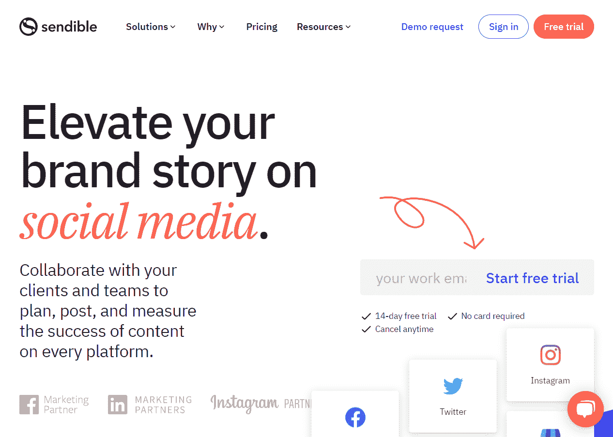

可发送

它不仅提供了同样的高级功能，如社交倾听、高级绩效分析和社交媒体帖子的审批工作流，还提供了联合品牌选项。

通过拥有自己的品牌解决方案，您可以将您的代理定位为行业中真正的市场领导者，而无需从零开始开发任何东西。

**优点:**

*   用于多个客户端概览的集成仪表板
*   高级[协作工具](https://kinsta.com/blog/microsoft-teams-vs-slack/)，包括为特定社交媒体账户定制的审批工作流程
*   提前几个月批量安排帖子，包括图片

**缺点:**

## 注册订阅时事通讯

### 想知道我们是如何将流量增加 1000%以上的吗？

加入 20，000 多名获得我们每周时事通讯和内部消息的人的行列吧！

[Subscribe Now](#newsletter)

*   对于高级功能来说有点贵，类似于 Hootsuite。

**推荐用于:**

*   中小企业
*   自由职业者
*   代理

价格: Sendible 也比 Hootsuite 更实惠，每月 25 美元起，每月 199 美元为最多 7 名用户提供全功能代理计划。联合品牌功能仅限于独家代理合作伙伴计划，而不是特定的定价等级。

#### 理智 vs 胡特

作为一家代理商，最有吸引力的功能可能是联合品牌，但 Sendible 在每个关键功能上也与 Hootsuite 旗鼓相当。

|  | **可发送的** | 胡特苏特 |
| **免费计划** | X | X |
| **全功能计划的价格** | $ 199/月(7 个用户) | $ 739/月(5 个用户) |
| **视觉内容规划** |  |  |
| **推特、脸书、Instagram 支持** |  |  |
| **分析** |  |  |
| **社交倾听** |  |  |
| **协作工具** |  |  |
| **高级调度** |  |  |
| **批量调度** |  | X |
| **PDF 报告** |  |  |
| **联合品牌** |  | X |

最重要的是，它显然更实惠，尤其是如果你有一个相当大的团队。

### 6.Radaar.io:小型团队和公司的 Hootsuite 替代方案

Radaar.io 是 Hootsuite 的一个后起之秀，它以低得多的价格提供许多相同的功能。

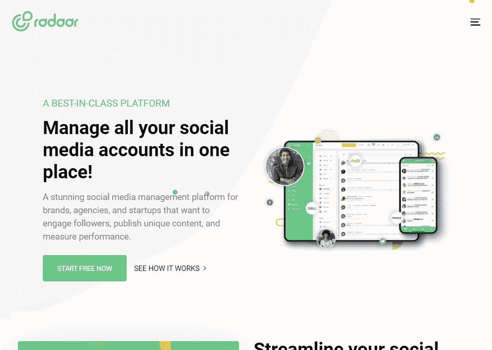

Radaar.io

它提供了社交监控和倾听、集成的社交收件箱、审批工作流程以及你期望从社交媒体工具中获得的一切。

**优点:**

*   经济实惠—每月 9.99 美元起
*   一个易于使用的集成仪表板提高了您的社交参与度

**缺点:**

*   与其他替代方案相比，分析仪表板有一定的局限性。

**推荐用于:**

*   中小企业
*   自由职业者
*   代理

**定价:** Radaar.io 明显比 Hootsuite 便宜，其最便宜的付费计划每月仅 9.99 美元起。

#### Radaar.io vs Hootsuite

Radaar.io 提供了 Hootsuite 提供的大部分相同的功能，从团队协作和日程安排到分析，但价格完全不同。

每月只需 59.99 美元，你就可以拥有多达 10 名用户的完整访问权限。

|  | **Radaar.io** | 胡特苏特 |
| **免费计划** | X | X |
| **全功能计划的价格** | $ 59.99/月(10 个用户) | $ 739/月(5 个用户) |
| **视觉内容规划** |  |  |
| **推特、脸书、Instagram 支持** |  |  |
| **分析** |  |  |
| **社交倾听** |  |  |
| **协作工具** |  |  |
| **高级调度** |  |  |
| **批量调度** |  | X |
| **PDF 报告** |  |  |

### 7.Brandwatch:严肃内容营销者的替代选择

Brandwatch 是一个超越社交媒体的营销平台，也提供内容营销和受众管理工具。

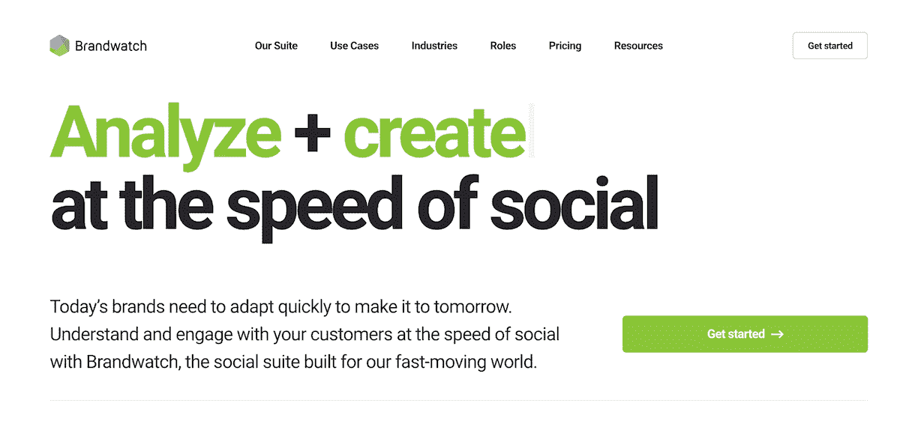

名表

但即使在社交媒体方面，它也提供了一个功能齐全的平台，具有社交倾听、分析等功能。您可以安排帖子，提高参与度，并审查您的策略的影响。

**优点:**

*   拥有先进的[集客营销](https://kinsta.com/blog/inbound-marketing/)工具的完整平台
*   包括社会支持平台

**缺点:**

*   没有公开定价信息的定制“全套”计划背后锁定的高级功能。
*   按用户定价。

**推荐用于:**

*   企业
*   中小企业

**定价:** Brandwatch 可能是这份名单上价格最优惠的 Hootsuite 替代品——最便宜的选择是每个用户每月 108 美元起。许多更高级的功能被锁定在定制的“完整套件”计划之后，该计划没有官方价格。

Struggling with downtime and WordPress problems? Kinsta is the hosting solution designed to save you time! [Check out our features](https://kinsta.com/features/)

#### Brandwatch vs Hootsuite

有了 Brandwatch，你就有了一个社交媒体工具，还能访问至关重要的内容营销功能，比如受众管理。

但它的代价是每个用户每月 108 美元的有限必需品计划。Brandwatch 是更贵的选择。

|  | **消防队** | 胡特苏特 |
| **免费计划** | X | X |
| **全功能计划的价格** | 自定义 | $ 739/月(5 个用户) |
| **视觉内容规划** |  |  |
| **推特、脸书、Instagram 支持** |  |  |
| **分析** |  |  |
| **社交倾听** |  |  |
| **协作工具** |  |  |
| **高级调度** |  |  |
| **批量调度** | X | X |
| **PDF 报告** |  |  |

### 8.后来:专注于 Instagram 的品牌的 Hootsuite 替代品

最初，Instagram 只是一个社交媒体管理工具，[后来](https://later.com/)已经发展成为一个成熟的平台，适用于所有主要的社交媒体渠道，包括 Twitter、脸书、Pinterest 和抖音。

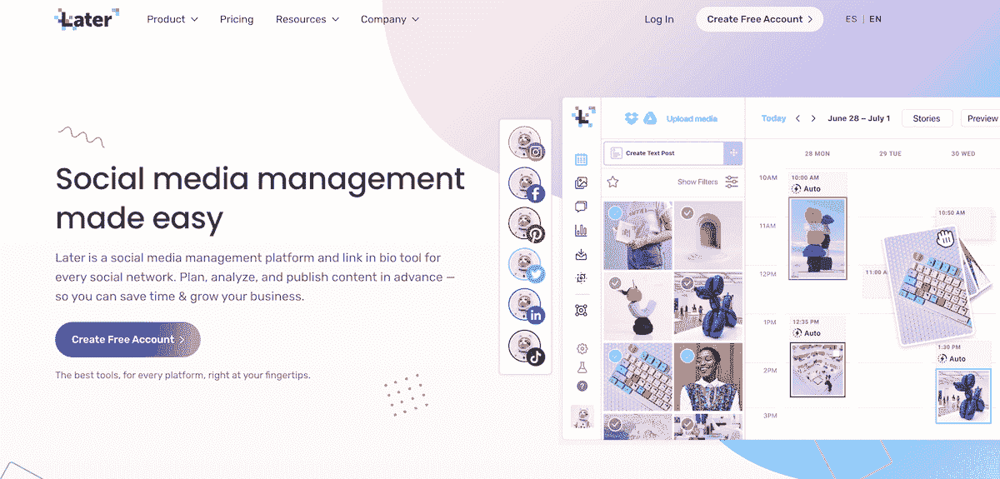

后来

尽管如此，它在规划、设计、安排和衡量 Instagram 故事的影响方面提供了独特的工具，这是其他替代方案所不具备的。

**优点:**

*   建立社交媒体形象的绝佳功能，尤其是 Instagram。
*   提供免费计划
*   经济实惠—每月 18 美元起

**缺点:**

*   缺少一些高级功能，如跨多个渠道的深入分析、集成收件箱和社交倾听。

**推荐用于:**

*   品牌
*   中小企业
*   代理

**定价:**免费计划允许一套社交媒体档案和每月 30 篇帖子，并提供基本功能。最便宜的付费计划起价 18 美元，提供有限的功能和支持。

#### 稍后 vs Hootsuite

对于那些希望更多关注 Instagram 而不是其他渠道的品牌来说，Later 是一个伟大而又实惠的社交媒体平台。如果你想知道为什么你会这样做，看看最新的 Instagram 统计数据。

每月支付 40 美元，你就可以获得一套比 Hootsuite 最先进的计划更先进的 Instagram 营销工具，但整体套件没有那么强大。

|  | **后来** | 胡特苏特 |
| **免费计划** |  | X |
| **全功能计划的价格** | $ 80/月(6 个用户)，但仅限一个社交媒体频道组 | $ 739/月(5 个用户) |
| **视觉内容规划** |  |  |
| **推特、脸书、Instagram 支持** |  |  |
| **分析** |  |  |
| **社交倾听** | X |  |
| **协作工具** |  |  |
| **高级调度** |  |  |
| **批量调度** | X | X |
| **PDF 报告** |  |  |
| **Instagram 内容创意** |  | X |
| **Instagram Story builder** |  | X |

### 9.Publer:中小企业的另类选择

尽管有超级英雄的噱头， [Publer](https://publer.io/) 是一个严肃的社交媒体管理平台，功能强大，是 Hootsuite 的合法替代品。

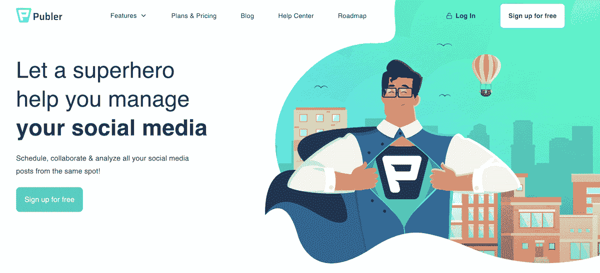

Publer

它提供发布、分析和协作工具，从脸书到 Google My Business。

**优点:**

*   从单一控制面板管理您的整个在线状态
*   从尝试免费计划开始。这甚至包括高级功能，如可跟踪链接。

**缺点:**

*   缺少一些高级功能，如跨多个渠道的深入分析和社交倾听。

**推荐用于:**

*   中小企业
*   自由职业者

**定价:**免费计划允许三个社交账户和每月多达 50 个预定帖子。付费商业计划从每月 28 美元的银牌和每个额外团队成员 3 美元的额外费用开始。

#### Publer vs Hootsuite

对于中小型企业来说，Publer 是 Hootsuite 的一个很好的、价格合理的替代品。如果你有一个由六名用户组成的社交媒体管理团队，你可以使用它的所有功能，每月总共只需 28 美元。

|  | **出版商** | 胡特苏特 |
| **免费计划** |  | X |
| **全功能计划的价格** | $ 28/月(1 个用户)+每增加一个用户$ 3 | $ 739/月(5 个用户) |
| **视觉内容规划** |  |  |
| **推特、脸书、Instagram 支持** |  |  |
| **分析** | (有限) |  |
| **社交倾听** | X |  |
| **协作工具** |  |  |
| **高级调度** |  |  |
| **批量调度** |  | X |
| **PDF 报告** |  |  |

如果你正在寻找更实惠的工具来帮助你营销、记账等等，看看我们的自由职业者最佳工具清单。

### 10.众包:给你新想法的另类选择

[Crowdfire](https://www.crowdfireapp.com/) 是一款颇具特色的社交媒体管理应用，它的主要焦点是为你提供相关的图片和内容，与你的观众分享。

众火

它还为脸书、 [Twitter](https://kinsta.com/blog/twitter-stats/) 、Instagram、 [Pinterest](https://kinsta.com/blog/pinterest-marketing/) 等提供标准的发布、分析和协作工具。

**优点:**

*   通过智能推荐在几秒钟内找到引人入胜的图像
*   为每个平台构建您的受众自动定制的帖子
*   通过竞争对手分析向你的竞争对手学习

**缺点:**

*   除了提及、评论和信息，没有社交倾听

**推荐用于:**

*   中小企业
*   自由职业者

**定价:**免费计划允许三个社交账户，每个账户最多十个预定帖子。高级计划每月起价 49.99 美元。

#### 众火 vs 胡特苏特

让 Crowdfire 与众不同的是它的智能内容管理和推荐引擎，它可以帮助你找到帖子和图片来分享，以便与你的追随者轻松互动。

|  | **众火** | 胡特苏特 |
| **免费计划** |  | X |
| **全功能计划的价格** | $ 99.99/月(3 个用户) | $ 739/月(5 个用户) |
| **视觉内容规划** |  |  |
| **推特、脸书、Instagram 支持** |  |  |
| **分析** |  |  |
| **社交倾听** | X |  |
| **协作工具** |  |  |
| **高级调度** |  |  |
| **批量调度** |  | X |
| **PDF 报告** |  |  |
| **智能内容监管和分享建议** |  | X |

### 11.ContentStudio:创意团队的另类选择

ContentStudio 是另一个社交媒体管理平台，专注于内容管理、发布和分析。

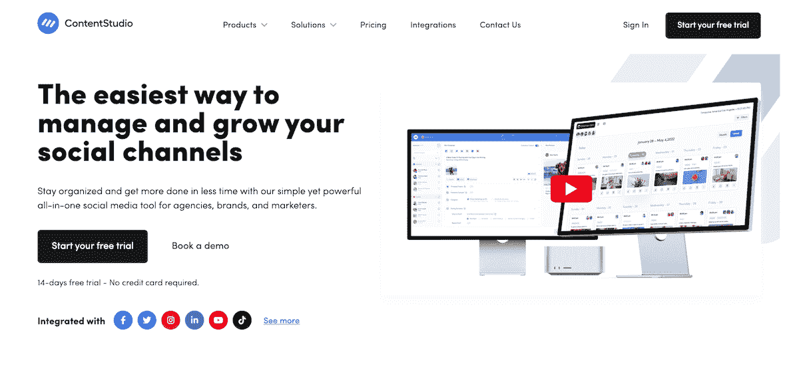

ContentStudio

这里的目标更多的是面向代理公司和创业公司，以及大公司的创意团队。

**优点:**

*   通过智能推荐在几秒钟内找到引人入胜的图像
*   为每个平台构建您的受众自动定制的帖子
*   通过竞争对手分析向你的竞争对手学习

**缺点:**

*   没有社交监听工具
*   没有免费或便宜的计划来测试这个平台

**推荐用于:**

*   中小企业
*   代理
*   创意团队

**定价:**基本 pro 计划起价为每月 49 美元，在一个工作区内最多可使用十个社交媒体账户。

#### ContentStudio vs Hootsuite

ContentStudio 是大型创意团队的绝佳工具，他们希望有更好的方式来规划他们的内容日历。

它还提供了许多与 Hootsuite 相同的日程安排和分析功能，但不是一个成熟的社交倾听工具。

|  | **内容工作室** | 胡特苏特 |
| **免费计划** |  | X |
| **全功能计划的价格** | $ 299/月(20 个用户) | $ 739/月(5 个用户) |
| **视觉内容规划** |  |  |
| **推特、脸书、Instagram 支持** |  |  |
| **分析** |  |  |
| **社交倾听** | X |  |
| **协作工具** |  |  |
| **高级调度** |  |  |
| **批量调度** |  | X |
| **PDF 报告** |  |  |
| **智能内容监管和分享建议** |  | X |

ContentStudio 还提供了一个名为“工作空间”的独特功能，它可以帮助您将不同的客户或品牌相互区分开来。

[说到社交媒体管理平台，Hootsuite 只是冰山一角。🦉在本指南中探索 11 种强大的替代品✅ 点击推文](https://twitter.com/intent/tweet?url=https%3A%2F%2Fkinsta.com%2Fblog%2Fhootsuite-alternatives%2F&via=kinsta&text=When+it+comes+to+social+media+management+platforms%2C+Hootsuite+is+only+the+tip+of+the+iceberg.+%F0%9F%A6%89+Explore+11+powerful+alternatives+in+this+guide+%E2%9C%85&hashtags=SocialMedia%2CSMM)

## 摘要

本文的重点不是强迫您使用 Hootsuite 以外的东西。而是要考虑其他的选择。

对一些公司来说，坚持熟悉的东西可能是值得的，但对另一些公司来说，转而使用更适合他们需求和目标的新工具可以帮助他们更快地建立自己的社交网络。

希望我们能帮助你对现有的选择有所了解，并帮助你为下一次[社交媒体营销活动](https://kinsta.com/blog/digital-marketing-strategy/)选择新的工具。

* * *

让你所有的[应用程序](https://kinsta.com/application-hosting/)、[数据库](https://kinsta.com/database-hosting/)和 [WordPress 网站](https://kinsta.com/wordpress-hosting/)在线并在一个屋檐下。我们功能丰富的高性能云平台包括:

*   在 MyKinsta 仪表盘中轻松设置和管理
*   24/7 专家支持
*   最好的谷歌云平台硬件和网络，由 Kubernetes 提供最大的可扩展性
*   面向速度和安全性的企业级 Cloudflare 集成
*   全球受众覆盖全球多达 35 个数据中心和 275 多个 pop

在第一个月使用托管的[应用程序或托管](https://kinsta.com/application-hosting/)的[数据库，您可以享受 20 美元的优惠，亲自测试一下。探索我们的](https://kinsta.com/database-hosting/)[计划](https://kinsta.com/plans/)或[与销售人员交谈](https://kinsta.com/contact-us/)以找到最适合您的方式。

