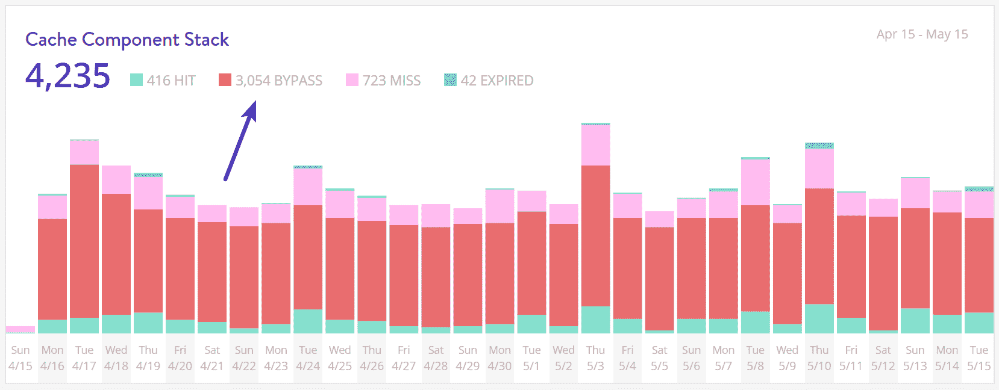

# 托管 WordPress 会员网站的注意事项

> 原文：<https://kinsta.com/blog/hosting-wordpress-membership-sites/>

当谈到 WordPress 网站时，就性能而言，不是所有的网站都能被同等对待。一个简单的五页 WordPress 站点的行为与一个大型的 WooCommerce 站点(可能要求很高)完全不同。WordPress 会员和社区网站是我们有时称之为“棘手”的另一种类型。如果没有正确设置或配置，您很快就会发现自己陷入 500 个错误、停机和页面加载缓慢的噩梦中。但这并不意味着你没有选择，你只需要遵循一些最佳实践。

今天，我们将探讨 WordPress 会员网站的一些**注意事项，以及如何对其进行最佳优化，以确保最佳的性能、可扩展性和寿命。🚀**

*   [会员网站示例](#membership-sites-examples)
*   [为什么 WordPress 会员网站是不同的](#why-membership-sites-are-different)
*   【WordPress 会员网站的待办事项
*   【WordPress 会员网站的禁忌

## 会员网站示例

以下是一些常见的 WordPress 会员和社区网站的例子:

*   一个围绕着[学习管理系统](https://kinsta.com/wordpress-lms-hosting/) (LearnDash，Lifter LMS)[向其成员](https://kinsta.com/blog/website-ideas/#sidehustle-1)出售数字课程的网站。这些最近变得非常流行，而且有一些很棒的 [LMS 插件](https://kinsta.com/blog/wordpress-lms-plugins/)！
*   一个基于论坛(bbPress 或 BuddyPress)的 WordPress 站点，主要由成员用来讨论不同的话题。
*   一个基于众多流行的一体化第三方会员插件 (MemberPress 或 Ultimate Membership Pro)的会员网站。
*   一个专注于社交网络的社区网站(PeepSo)。
*   一些网站可能还包括电子商务解决方案，如 WooCommerce 和 Easy Digital Downloads，因为其中许多网站都有用户资料和社区功能。

## 为什么 WordPress 会员网站是不同的

在我们开始讨论该做什么和不该做什么之前，让我们深入了解一下为什么 WordPress 会员网站不同于你的标准博客或小型商业网站的几个原因。

[#WordPress membership sites are beasts when it comes to performance. 🦖 Check out these do's and don'ts.Click to Tweet](https://twitter.com/intent/tweet?url=https%3A%2F%2Fkinsta.com%2Fblog%2Fhosting-wordpress-membership-sites%2F&via=kinsta&text=%23WordPress+membership+sites+are+beasts+when+it+comes+to+performance.+%F0%9F%A6%96+Check+out+these+do%27s+and+don%27ts.)

### 1.不可缓存的内容

首先，会员网站包含大量**不可缓存的内容**和不断变化的页面。社区成员的登录页面(根据网站的大小，可能会不断受到攻击)、数字商品或课程的结账页面以及讨论板等是常见的问题和痛点，因为这些通常无法被缓存。

> 需要在这里大声喊出来。Kinsta 太神奇了，我用它做我的个人网站。支持是迅速和杰出的，他们的服务器是 WordPress 最快的。
> 
> <footer class="wp-block-kinsta-client-quote__footer">
> 
> 
> 
> <cite class="wp-block-kinsta-client-quote__cite">Phillip Stemann</cite></footer>

[View plans](https://kinsta.com/plans/)

然而，这并没有结束。在标准的 WordPress 站点上，WordPress 仪表盘也不会为**“登录”用户**缓存。当您只有几个作者和管理员时，这没有问题，但是当您突然有成千上万的成员使用仪表板时，这会立即导致性能问题，因为没有一个可以从服务器上的缓存提供服务。这意味着您需要幕后的能力和架构来支持它。在这种情况下，共享主机提供商通常会瘫痪。

在我们为托管客户端提供的 [MyKinsta analytics](https://kinsta.com/help/mykinsta-analytics/) 工具中，您可以看到有多少缓存被绕过。下面是一个网站的例子，其中大部分请求不是来自缓存。

Cache bypass

### 2.大量同时来访的人

会员制网站通常存在的第二个问题是**大量的并发访问者和会话**。在一个信息或企业 WordPress 网站上，访问者可能会停留 5 到 10 分钟，直到他们找到他们需要的东西(这是一个很高的数字，通常跳出率要高得多)。在会员网站上，情况正好相反。访问者通常来到网站是为了参与某事或某人。如果他们正在参加一个在线课程，他们呆上几个小时是很正常的。你可以看到这是怎么回事。连接到你的 WordPress 主机的并发访问者增加很快。

更糟糕的是，除了“不可缓存的内容”问题之外，还有大量的并发访问者。

### 3.复杂的查询

第三，会员网站通常**产生更复杂的查询**，这反过来增加了从 MySQL 数据库检索信息[的额外延迟。这很大程度上是因为所有额外的移动部件和像这些网站拥有的大量数据。这也可能是由严重依赖搜索查询导航或使用`WP_Query`的网站造成的。](https://kinsta.com/knowledgebase/what-is-mysql/)

更不用说，还有大量并发用户持续查询数据库。

### 4.存储大量数据

这并不奇怪，但会员网站**存储了大量数据**，如果管理不当(我们将在下面进一步探讨)，您的磁盘空间会很快从您手中流失。这也是在网站的生命周期中复合的。视频、课程、会员和个人资料信息、讨论、[数字下载](https://kinsta.com/blog/wordpress-download-manager/)等。这些只是快速增加的许多不同类型的内容中的一部分。

## WordPress 会员网站的待办事项

我们[在 Kinsta 托管了许多会员网站](https://kinsta.com/wordpress-membership-website-hosting/),我们的工程师每天都在与这些网站所有者进行互动。虽然我们总是鼓励用户实施[最佳 web 性能实践](https://kinsta.com/learn/page-speed/)，但对于这类网站来说，这些通常是不够的。因此，今天我们将向您展示一些方法，以确保您的会员网站及其访问者尽可能获得最佳体验。

### 1.选择注重性能的 WordPress 主机

选择一个更好的 WordPress 主机的建议在这一点上看起来像是一个坏记录，但事实是，会员网站的许多性能问题都可以追溯到这个根本原因。我们一次又一次地看到客户从其他提供商迁移到 Kinsta，并立即看到显著的改进。我们整个公司，从我们在你的站点后面放置的基础设施，到我们雇佣的工程师，都是**注重性能的**。这一点已经并将永远不会改变。

> 很佩服 [@googlecloud](https://twitter.com/googlecloud?ref_src=twsrc%5Etfw) 和 [@kinsta](https://twitter.com/kinsta?ref_src=twsrc%5Etfw) 能为 [#WordPress](https://twitter.com/hashtag/WordPress?src=hash&ref_src=twsrc%5Etfw) 主持的一切！[# devo PS](https://twitter.com/hashtag/DevOps?src=hash&ref_src=twsrc%5Etfw)[# Cloud](https://twitter.com/hashtag/Cloud?src=hash&ref_src=twsrc%5Etfw)[# WP dev](https://twitter.com/hashtag/WPDev?src=hash&ref_src=twsrc%5Etfw)[# web development](https://twitter.com/hashtag/webdevelopment?src=hash&ref_src=twsrc%5Etfw)[pic.twitter.com/Cr7UMaHdpH](https://t.co/Cr7UMaHdpH)
> 
> —Neuralab(@ Neuralab)[2017 年 7 月 22 日](https://twitter.com/Neuralab/status/888742198489079810?ref_src=twsrc%5Etfw)