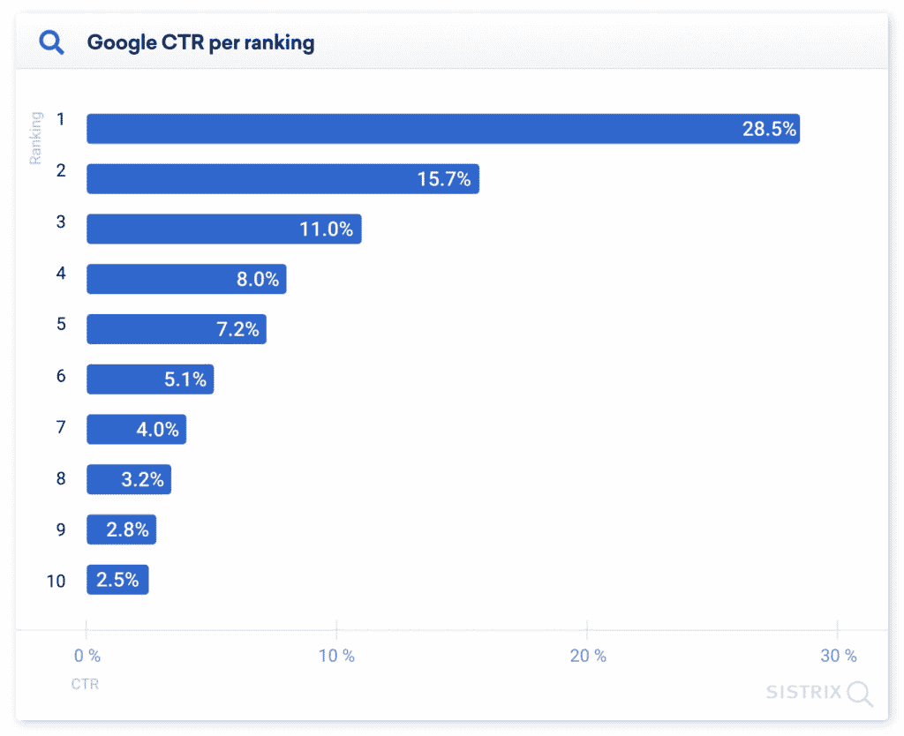
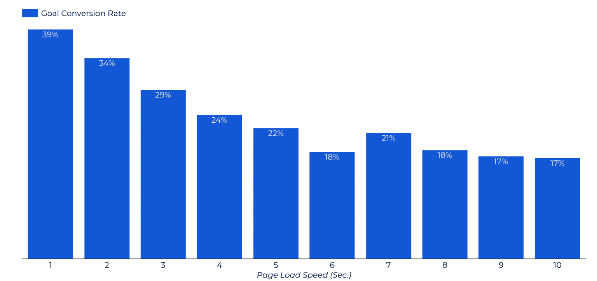
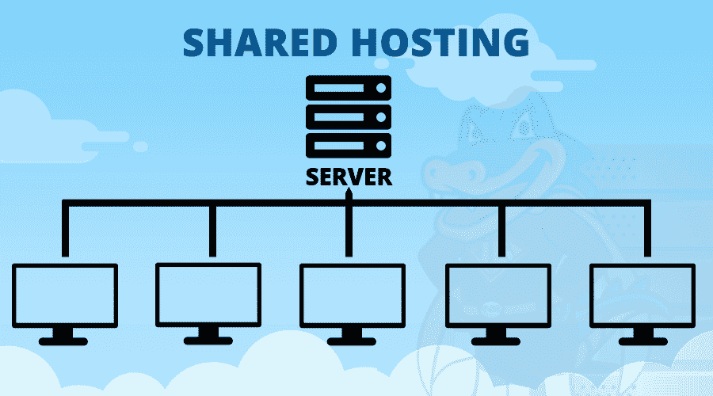
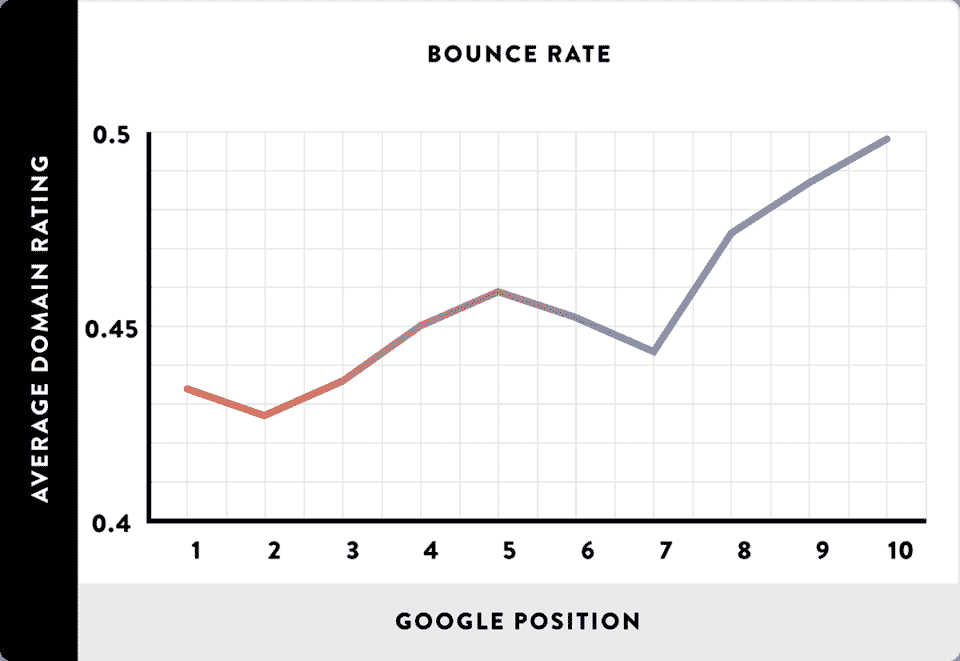
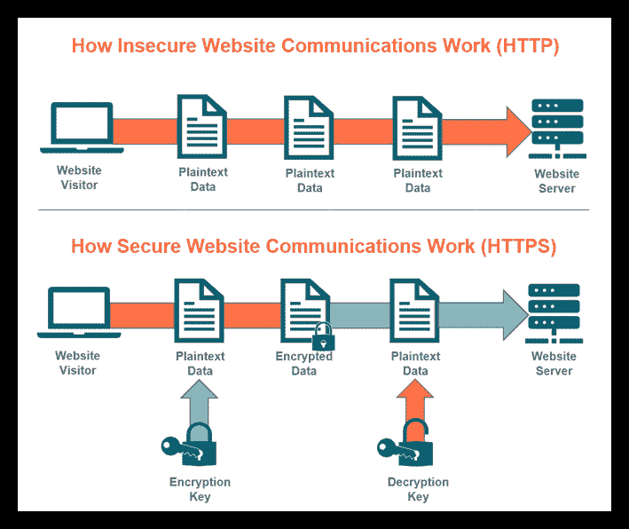
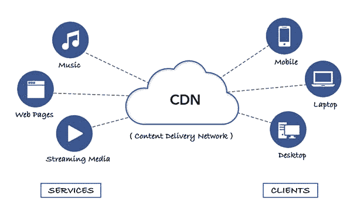

# 主机如何影响 SEO 以及如何为你的网站选择最好的主机

> 原文：<https://kinsta.com/blog/how-hosting-affects-seo/>

想到 [SEO](https://kinsta.com/blog/wordpress-seo/) 你会想到什么？

如果你像大多数人一样，你的大脑会立即想到关键词、内容，当然还有反向链接。在技术方面，你可能熟悉网站结构和移动友好性等因素。

但是你知道你的[网站主机影响 SEO](https://kinsta.com/seo-hosting/) 吗？

托管对你的搜索引擎性能有很大的影响，但是很多企业并不认为这是他们 SEO 策略的一部分。这是一个错误——选择正确的托管服务可以提高你的搜索引擎排名，降低你的跳出率，并推动转换。

这篇文章展示了主机如何影响 SEO，以及如何为你的网站选择合适的主机。

## 为什么 SEO 这么重要？

在我们进入虚拟主机如何影响 SEO 之前，让我们先来谈谈为什么你应该首先关心搜索引擎优化。你已经有很多事情要做了——在 SEO 上投入时间和资源真的值得吗？

简单的回答是肯定的。搜索引擎优化是你可以做的最重要的事情之一来营销你的业务。

为什么？

首先，因为搜索引擎是人们所在的地方。当寻找他们想要购买的特定产品的信息时， [55%](https://www.statista.com/forecasts/997051/sources-of-information-about-products-in-the-us) 的购物者求助于搜索引擎。换句话说，已经有人在谷歌上搜索像你这样的产品了。SEO 帮助你进入他们的搜索结果。

[Hosting 🤝 SEO. Learn more about how they go hand-in-hand in this guide ✅Click to Tweet](https://twitter.com/intent/tweet?url=https%3A%2F%2Fbit.ly%2F3vCBZVy&via=kinsta&text=Hosting+%F0%9F%A4%9D+SEO.+Learn+more+about+how+they+go+hand-in-hand+in+this+guide+%E2%9C%85&hashtags=SEO%2CSEOTips)

但是仅仅出现在搜索结果的第二页或者第一页的中间是不够的。大多数搜索者不会滚动那么远。28.5%的用户点击了第一个谷歌搜索结果。第二名获得 15.6%的流量，第三名获得 11%。第十名只有 2.5%的搜索者点击，几乎没有人能进入第二页。

Google click-through rate by position on search engine results page

如果做得好，SEO 可以帮助你的网站上升到搜索结果的顶端，让搜索者真正看到它。因此，搜索引擎优化甚至有助于建立品牌知名度。出现在相关搜索结果中可以提高你的知名度和声誉。

## 主机如何影响你的 SEO？

主机可能不是 SEO 中最广为人知的部分，但却是重要的一部分。为了受到谷歌的青睐，你的网站需要运行良好，而你的[托管公司](https://kinsta.com/plans/)可以在这方面提供帮助(或者阻止)。

这里有一些方法可以影响你的主机搜索引擎的性能。

### 站点速度和加载时间

一个潜在客户在谷歌上找到你，然后点击链接。你认为他们会等页面加载多长时间后才会返回并选择不同的搜索结果？

如果你说他们会等几秒钟或更久，你可能高估了他们的耐心。

[快速的加载时间](https://kinsta.com/ebooks/wordpress/speed-up-wordpress/)增加了网站访问者购买的机会。一个在[一秒钟](https://www.portent.com/blog/analytics/research-site-speed-hurting-everyones-revenue.htm)加载的网站的转化率比一个在五秒钟内加载的网站高三倍。一项对移动网站数据的研究发现，网站速度每提高 0.1 秒，零售购物者的支出就会增加近 10%。

Conversions by page load speed

拥有一个快速的网站也可以提高你在搜索引擎结果页面上的位置。我们怎么知道？因为谷歌是这么说的。早在 2010 年，谷歌就首次确认网站速度是排名因素之一(直到今天仍在提及)。

而这只是主机如何影响 SEO 的冰山一角。

当然，你选择的网站主机不是影响网站速度和加载时间的唯一因素，但它是最重要的因素。如果你已经解决了缓存和缩小 JS 等其他问题，投资于更高质量和更快的主机可以让你获得更快的加载速度，并为你赢得更多的流量和转化率。

例如，Kinsta 是一个注重性能的[应用程序](https://kinsta.com/application-hosting/)、[数据库](https://kinsta.com/database-hosting/)和[管理的 WordPress 主机](https://kinsta.com/wordpress-hosting/)，它提供了许多独特的功能来确保你拥有最快的加载网站。

以 [Kinsta APM](https://kinsta.com/apm-tool/) (应用性能监控)为例。Kinsta APM 对 Kinsta 用户是免费的，它可以捕获关于网站的 PHP 进程、MySQL 数据库查询、外部 HTTP 调用等带有时间戳的信息。

### 服务器停机时间

没有人希望他们的网站关闭。

您可能已经意识到服务器停机会让您付出代价。在网站关闭期间，你会错过潜在的销售机会。还有你的声誉要考虑——如果一个客户在你的网站宕机的时候访问你的网站，他们可能会认为你不可靠，不会再回来。

情况变得更糟。服务器宕机也会影响 SEO。如果一个搜索引擎在你的网站瘫痪的时候抓取你的网站，你可能会暂时失去索引。众所周知，如果谷歌遭遇宕机，它会减少抓取网站的频率，这对 SEO 不利。

任何站点都可能经历一段时间的停机，但是您希望将其最小化。具有正常运行时间保证的[主机](https://kinsta.com/help/guaranteed-uptime/)可以确保服务器停机是一个罕见的问题。

### 位置

当你选择一台主机时，看看公司的服务器在哪里。

靠近大多数用户的服务器会提供更好的站点速度，这对 SEO 很重要。位置也会影响您必须遵守的数据存储法规。这对于搜索引擎优化很重要，因为不遵从可能会导致被迫停机。

另一个基于位置的因素是你的域名(不一定要由你的主机公司提供，但通常是这样)。[谷歌已经确认](https://www.searchenginejournal.com/does-domain-extension-affect-seo/431956/)所有通用的[域名扩展](https://kinsta.com/blog/domain-extensions/)在搜索引擎优化方面是平等的——你可以自由选择。披萨而不是。如果这对你的生意有用的话。

国家扩展是另一回事。例如，如果你使用的是. fr 域名，谷歌会将你的网站定位到法国。它在那个国家的搜索引擎上的表现可能会比其他国家更好。

### 托管类型

当你开始寻找托管公司时，你会注意到各种各样的价格和许多不同的术语，如共享托管、专用托管和托管托管。如果你是网站所有权的新手，可能会感到困惑。

有几种可用的主机，你选择的主机会影响你的搜索引擎优化。让我们看看你可能遇到的一些类型的网站托管，以及它们如何影响搜索引擎优化。

#### 自由的

有办法[免费托管一个网站](https://kinsta.com/blog/free-wordpress-hosting/)。例如，你可以使用 wordpress.com 或另一个网站建设者，如 Wix。

这些选项对于个人网站来说可能是可以接受的，但是对于 SEO 或者你的个人品牌来说就不好了。你通常不能有自己的域名，你的网站不会表现得足够好来处理高流量。

你可以找到一个每月只需几美元的共享计划——这笔费用对于 SEO 来说是值得的。

#### 共享的

对于小网站来说，典型的是从[共享主机](https://kinsta.com/knowledgebase/shared-hosting/)开始。这些计划既便宜又对初学者友好。

共享主机通过分割资源来保持成本效益。顾名思义，共享主机计划中的用户必须与同一服务器上的其他用户共享资源。

虽然共享主机对新网站所有者来说是一个很好的入门方式，但它对 SEO 也有不利的一面。如果您与其他网站共享服务器，这些网站会影响您的网站的性能。例如，如果你的服务器上的一个网站流量激增，它可能会降低你的网站速度，进而影响搜索引擎优化。

How a shared server works

#### 虚拟专用服务器

如果你选择在虚拟私人服务器上托管你的网站，你仍然和其他网站共享一个物理服务器。然而，你有一个完全属于你自己的虚拟分区。这提高了性能，减少了另一个网站的流量影响你的加载速度和搜索引擎优化的机会。

#### 专注的

在专用服务器上托管就像它听起来的那样——整个服务器都是为您服务的。这意味着更多的正常运行时间和更快的速度。您还可以完全控制服务器的设置，因此您可以确保您的网站运行良好。

[专用托管](https://kinsta.com/knowledgebase/dedicated-server/)对 SEO 有好处，但是贵。除非你有一个企业规模的网站，否则你可能不需要它。

#### 云托管

有了[云托管](https://kinsta.com/blog/google-cloud-hosting/)，你的网站就分散在多个远程服务器上。

## 注册订阅时事通讯

### 想知道我们是怎么让流量增长超过 1000%的吗？

加入 20，000 多名获得我们每周时事通讯和内部消息的人的行列吧！

[Subscribe Now](#newsletter)

如果其中一台服务器出现问题，网络上的其他服务器将接管。云托管对于确保高正常运行时间是非常好的，这对 SEO 是有好处的。如果你有正确的专业知识来正确设置它，这也是建立一个快速加载网站的最好方法之一。

然而，如果你以前从未做过类似 WordPress 这样的事情，那么让它运行起来可能会有点棘手。

#### 托管托管

如果管理网站的技术方面不是你的专业领域，或者如果你没有时间处理它，为什么不找专业人士呢？

有了[托管](https://kinsta.com/blog/managed-wordpress-hosting/)，你的托管公司承担了很多工作，比如硬件和软件配置、维护、技术支持，以及更新和监控你的 [CMS](https://kinsta.com/blog/cms-software/) 。

它比共享主机稍贵，但仍在大多数中小型企业的预算之内。当你有虚拟主机提供商的支持时，你的网站速度、停机时间和其他性能因素会更好。

Kinsta 提供应用程序、数据库和托管 WordPress 主机，针对速度、安全性和高峰流量进行了优化。电子商务公司也可以受益于 Kinsta 的托管 WooCommerce。

### 跳出率

跳出率是只访问一个页面而不在你的网站上采取任何行动的访问者的百分比。换句话说，它们在做任何事情之前都会反弹。

跳出率是否影响谷歌排名存在争议。谷歌否认跳出率是排名的一个因素，而其他来源[显示高跳出率和在 SERPs 上排名靠后有明显的关联。](https://backlinko.com/hub/seo/bounce-rate)

Bounce rate by rank on Google

虽然不是官方排名因素，但它通常可以作为低停留时间的指标，这是 2022 年谷歌排名的一个关键因素。基本上，如果一大群人很快离开你的网站，回到谷歌，这表明用户没有发现你的内容与他们的搜索相关。由于谷歌希望提供相关内容，当这种情况发生时，他们会开始降低你的排名。

提高你的跳出率和停留时间是技术搜索引擎优化的一个重要方面。较低的跳出率意味着更多的人停留在你的页面上并与之互动，这可能会带来更多的转化。

这和主机有什么关系？高跳出率可能是由缓慢的网站或服务器停机时间造成的，这些因素受您选择的网站主机的影响。

### 安全性

谷歌不想把用户送到有风险的网站。

回到 2014 年，它[宣布](https://developers.google.com/search/blog/2014/08/https-as-ranking-signal)有效的 [HTTPS 加密](https://kinsta.com/blog/http-to-https/)是一个排名信号。HTTPS 允许用户的浏览器或 web 应用程序安全地连接到您的网站。在声明中，谷歌澄清说，HTTPS 将是一个“轻量级”的排名信号，远不如内容质量这样的事情重要。据我们所知，今天依然如此。

HTTP vs. HTTPS encryption (**Source:** [Savvy Security](//cheapsslsecurity.com/blog/http-vs-https-security-the-differences-between-these-protocols/%E2%80%9D))

不太清楚的是，其他安全因素是否是排名信号。你的网站被黑，内容被替换成恶意软件或垃圾邮件会对你的搜索排名产生负面影响。但是不管怎样，[更新你的网站安全](https://kinsta.com/blog/wordpress-security/)是一个最佳实践。

Struggling with downtime and WordPress problems? Kinsta is the hosting solution designed to save you time! [Check out our features](https://kinsta.com/features/)

你的网站主机对你网站的安全至关重要。首先，虚拟主机公司要对其服务器的安全负责。它还可能为你提供其他安全托管服务，比如免费的 SSL 证书或定期的 T2 恶意软件扫描。

### 支持水平

对于一些网站主机，如果你的网站遇到麻烦，你基本上只能靠自己了。其他主机(尤其是托管服务提供商)会很快解决你的问题。

我们已经讨论了意外的停机时间或性能问题如何影响你的 SEO，所以你可以看到技术支持(不是一般的客户支持)在托管方面是多么重要。寻找一个虚拟主机服务，定期备份你的整个网站环境，并能快速解决任何技术故障。

## 如何为 SEO 选择最好的主机

现在你明白了主机如何影响 SEO，以及为什么你对服务器的选择是一个不被重视的 SEO 因素。但是你如何选择一个主机来提升你的排名、流量和转化率呢？

当你寻找主机，请记住这些因素。

### 主机类型

您是希望通过共享主机保持低成本，还是希望 VPS 提供商提供更高的性能？确保你知道你注册了什么样的托管计划。

请记住，我们上面概述的主机类型之间可能会有重叠。例如，Kinsta 是一个托管服务提供商。Kinsta 还利用了云托管的力量——我们的基础设施建立在[谷歌云平台](https://kinsta.com/blog/google-cloud-network/)上，这意味着我们的物理服务器的容量由多个存储设备共享。因为数据分布在不同的位置，你的网站将经历*最小的*主机相关的停机时间。

### 定价结构

你的托管计划的成本当然不会影响你的 SEO，但这是需要考虑的事情。

为帮助你爬上谷歌搜索结果页面的解决方案多付一点钱是否值得，或者你会选择最便宜的方案，投资于搜索引擎优化的不同领域？

许多主要的共享主机解决方案提供了非常低的前期价格，比如每月 2.75 美元。在你被低价吸引之前，要确保你完全明白你的钱能买到什么。

例如，选择基本计划是否会限制您的带宽或限制您的流量？你有没有得到其他会影响你搜索引擎优化的额外好处，比如安全特性？最低层计划中的客户是否可以获得公司的所有支持渠道？

此外，请注意第一年服务后的价格，它通常会在您的初始合同后上涨。

### 无障碍支持

现在是凌晨 2 点，你意识到你的网站关闭了。你每分钟都在失去海外销售，并担心你的搜索引擎优化。你的主机服务在这个时间有客户热线吗？

更好的是，你有一个托管团队持续监控你的网站吗？

你就能越快解决技术问题；你的 SEO 就越好。了解主办公司的[支持渠道和时间](https://kinsta.com/kinsta-support/)以及他们能提供多少帮助。

### 加拿大

最后，确定您的托管解决方案是否提供了[内容交付网络或 CDN](https://kinsta.com/blog/wordpress-cdn/) 。cdn 可以由托管公司提供，但它们是一项独立的服务，旨在加速您的网站。

CDN 的工作原理是在世界各地的数据中心缓存静态资产，如图像、CSS 和 JS 文件、web 字体等。创建这种缓存可以加快内容交付，并使您的网站加载速度更快。它通过缩短数据传输所需的物理距离来做到这一点。它还可以帮助降低首字节时间(TTFB)，这是浏览器在从服务器接收第一个字节数据之前必须等待的时间。

结果是一个更快的网站；正如你现在所知道的，网站速度对于搜索引擎优化是至关重要的。

How a content delivery network works (**Source:** [Plesk](//www.plesk.com/blog/business-industry/cdn-hosting-guide-2019/%E2%80%9D))

CDN 还通过在不同地理位置的多台服务器上提供复制的内容来提高正常运行时间。如果一台服务器出现故障，流量会被重新路由到另一台服务器。作为 SEO 的另一个好处，许多 cdn 提供了额外的安全特性。

Kinsta 的 CDN 由 [Cloudflare](https://kinsta.com/knowledgebase/cloudflare-integration/) 提供支持。所有 Kinsta 计划都启用了该功能，无需您支付额外费用。Kinsta 用户可以通过 [MyKinsta](https://kinsta.com/mykinsta/) 访问 CDN。

## 如何切换托管公司以获得更好的 SEO

你们中的一些人刚刚开始做网站所有者。你有机会从第一天起就选择一个快速可靠的网站主机。

但是大多数正在阅读这篇文章的人可能已经有了网站。如果你意识到你现在的主人不能胜任，你会怎么做？迁移到不同的主机会对你的搜索引擎性能造成更大的伤害吗？

谷歌的约翰·穆勒已经解决了这个问题。当你第一次迁移到一个新的主机上时，谷歌会降低抓取你网站的频率。这可能会影响搜索引擎优化。然而，这是暂时的。穆勒说:

“随着时间的推移，一旦我们的系统可以判断速度加快不会导致任何问题，我们就会再次加快速度。这与您所做的主机更改无关。不管你是要去另一家提供商那里，还是要去另一个国家，都没有关系。”

准备好让专家管理您的主机了吗？

Kinsta 提供从所有其他网络主机的无限制免费迁移。我们定期将网站从 WP Engine 和 Flywheel 等主机转移到 Kinsta，这通常会导致速度的[大幅提升。](https://kinsta.com/blog/migrate-to-kinsta/)

[Trying to boost your SEO? Don't overlook hosting 🚀Click to Tweet](https://twitter.com/intent/tweet?url=https%3A%2F%2Fbit.ly%2F3vCBZVy&via=kinsta&text=Trying+to+boost+your+SEO%3F+Don%27t+overlook+hosting+%F0%9F%9A%80&hashtags=SEO%2CSEOTips) ## 摘要

大多数公司选择网站主机是基于价格和带宽等因素，从来没有考虑过搜索引擎优化。

这是一个错误(正如你现在可能看到的，你已经理解了主机如何影响 SEO)。主机不是经常被讨论的搜索引擎优化因素，但它可以显著影响你的排名，流量和转换。谷歌不在乎你用哪台主机，但它在乎网站速度、可靠性、服务器正常运行时间和安全性等因素——所有这些都受到你选择的主机的影响。

考虑一个[托管计划](https://kinsta.com/features/)来确保你的网站被技术专家监控和维护。Kinsta 提供高速、24/7 支持、安全功能、CDN 和 SLA 支持的 99.9%正常运行时间保证。

想知道更多提高你的搜索引擎优化的方法，看看我们的 61 个搜索引擎优化技巧列表，让你的有机流量增长 250%。

* * *

让你所有的[应用程序](https://kinsta.com/application-hosting/)、[数据库](https://kinsta.com/database-hosting/)和 [WordPress 网站](https://kinsta.com/wordpress-hosting/)在线并在一个屋檐下。我们功能丰富的高性能云平台包括:

*   在 MyKinsta 仪表盘中轻松设置和管理
*   24/7 专家支持
*   最好的谷歌云平台硬件和网络，由 Kubernetes 提供最大的可扩展性
*   面向速度和安全性的企业级 Cloudflare 集成
*   全球受众覆盖全球多达 35 个数据中心和 275 多个 pop

在第一个月使用托管的[应用程序或托管](https://kinsta.com/application-hosting/)的[数据库，您可以享受 20 美元的优惠，亲自测试一下。探索我们的](https://kinsta.com/database-hosting/)[计划](https://kinsta.com/plans/)或[与销售人员交谈](https://kinsta.com/contact-us/)以找到最适合您的方式。