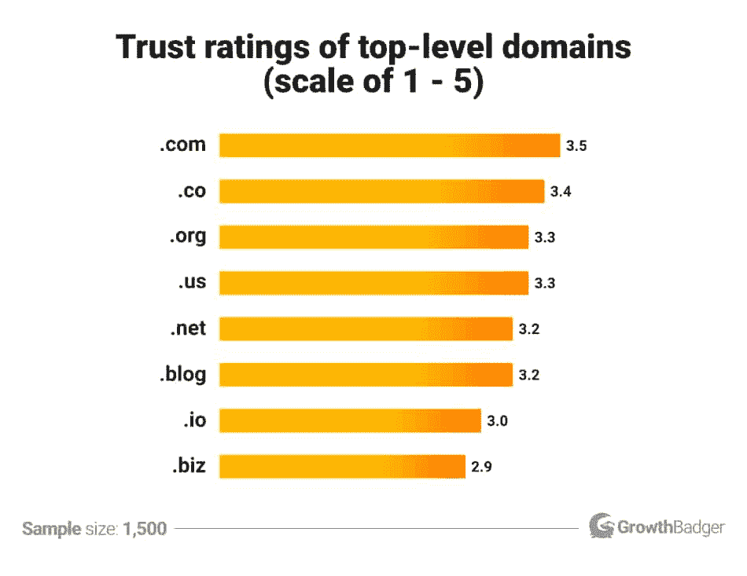
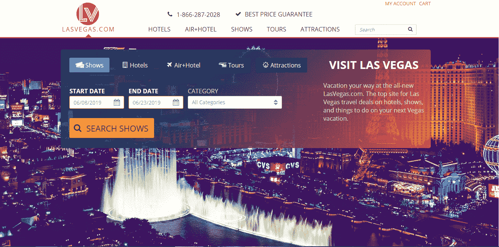
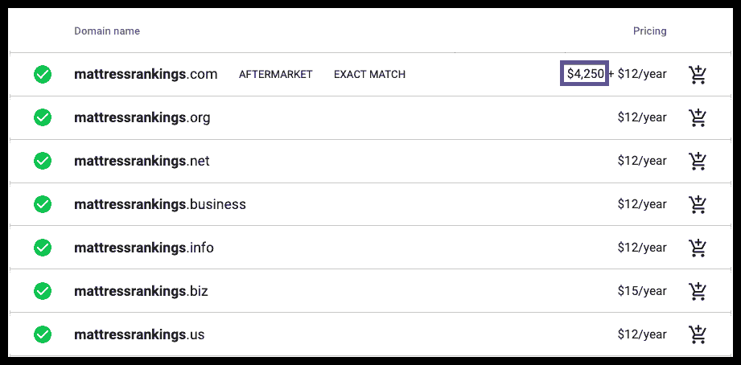
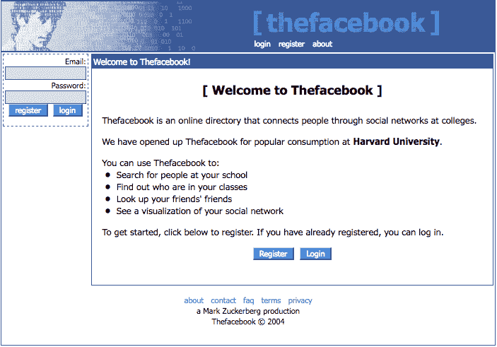
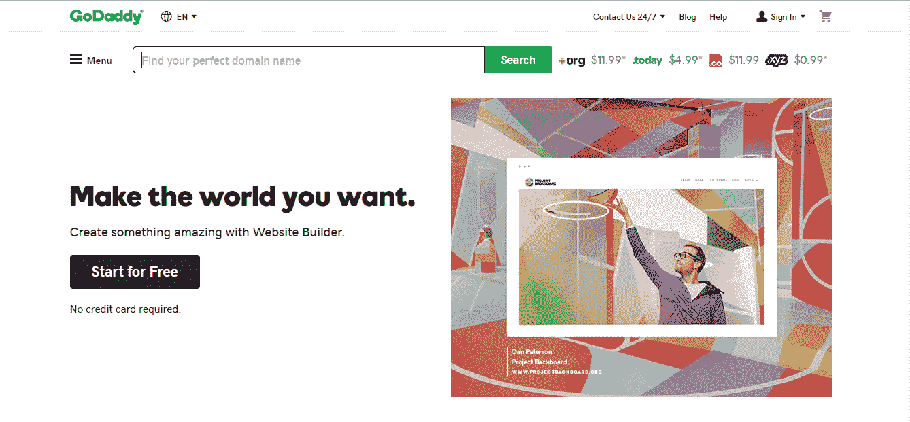
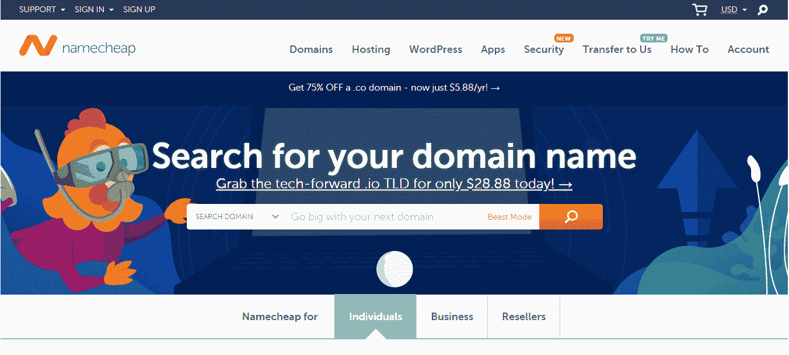

# 一个域名多少钱？影响你预期支付金额的 4 个关键因素

> 原文：<https://kinsta.com/blog/how-much-does-a-domain-name-cost/>

购买域名是一个重大决定。

一方面，你想得到最好的名字，因为你知道这是你品牌的重要组成部分。另一方面，你的预算有限，所以你需要做好妥协的准备。

但是**一个域名要花多少钱**？还有:你愿意为一个域名花多少钱？

## 为什么你的域名很重要

你可能认为你的域名没什么大不了的。毕竟只是个网址，不是公司名吧？

然而，现实是选择域名是一个非常重要的决定，因为它影响你的品牌、[你的流量](https://kinsta.com/blog/how-to-drive-traffic-to-your-website/)和你的可信度。

[So you'd like to kick off your freelancing business but have no idea how much your domain will cost, uh? 😵 We ran the numbers and put together this guide to help you make the best call!Click to Tweet](https://twitter.com/intent/tweet?url=https%3A%2F%2Fkinsta.com%2Fblog%2Fhow-much-does-a-domain-name-cost%2F&via=kinsta&text=So+you%27d+like+to+kick+off+your+freelancing+business+but+have+no+idea+how+much+your+domain+will+cost%2C+uh%3F+%F0%9F%98%B5+We+ran+the+numbers+and+put+together+this+guide+to+help+you+make+the+best+call%21&hashtags=entrepreneur%2Cfreelancing)

### 您的域名和品牌

人们通常认为“品牌”这个词意味着一个公司名称。

然而，[一个品牌远不止于此](https://kinsta.com/blog/wordpress-site-examples/)，你的品牌是你呈现给世界的整体公司形象。

重要的是要确保你业务中的一切，从公司名称到域名到[网站设计](https://kinsta.com/blog/wordpress-site-examples/)到内容到语气，都能够协同工作，传达你想要传达的形象。

想象一下，你正在进行一次工作面试，你认为这个候选人很棒。

她很专业，她有相关的经验，她看起来非常适合公司文化…

但是当她离开时，你再看一眼她的简历，你注意到她的电子邮件地址是 [【电子邮件保护】](/cdn-cgi/l/email-protection#186b73206c7d6a7f6d6a742a282820587f75797174367b7775) 。

无意冒犯外面的 sk8ergurls，但让我们面对现实:这样的电子邮件地址会让你质疑你对她的最初印象。

嗯，做品牌也是一样。如果你公司的一切都传达了某种形象，但你的域名完全不符合这种形象，这将使潜在客户提高警惕。

你最不想做的事就是给他们一个怀疑的理由。

### 你的域名和流量

你的域名在[搜索排名](https://kinsta.com/blog/what-does-seo-stand-for/)中起作用。

正如 SEO 专家 Brian Dean 在他的文章 [*“谷歌 200 排名因素:完整列表(2019)*](https://backlinko.com/google-ranking-factors#domain)中解释的那样，虽然在域名中放置关键词不会像过去那样给你带来提升，但它仍然是一个相关性信号。

此外，如果[目标关键字](https://kinsta.com/blog/keyword-research/)作为域名中的第一个单词出现，它将使你比那些在域名中间或末尾有相同关键字的网站(或者根本没有)有优势。

此外，还有直接流量方面要考虑，这意味着人们通过在浏览器中输入你的地址来访问你的网站。

如果你的域名很难记住**你会失去一些人**,因为他们会拼错，会被带到…天知道哪里。

记住，购买流量是昂贵的，所以你需要尽你所能最大化你的有机流量。

### 可靠性

并非所有域名都是平等的。

根据[生长獾研究](https://growthbadger.com/top-level-domains/)，*。com* 是 TLD 最值得信赖的[分机](https://kinsta.com/knowledgebase/what-is-a-tld/)摆在那里。

此外，当人们记错网站地址时，他们会有 3.8 倍的可能性认为它以结尾。com 比什么都重要。

以下是最受欢迎的[域名扩展](https://kinsta.com/blog/domain-extensions/)在可感知可信度方面的排名情况:

TLDs compared in terms of perceived trustworthiness

当然，重要的是要记住，这可能是一个通用的 1500 人样本，这意味着您的目标受众可能会以不同的方式理解某些域扩展。

比如[。io 扩展](https://kinsta.com/knowledgebase/what-is-io/)对大多数人来说可能看起来很奇怪，但考虑到它在技术世界的流行程度，可以肯定地说技术人员信任它。

还需要考虑区域扩展。例如，如果您的目标是立陶宛观众，那么使用。lt 扩展是完美的，但立陶宛以外的人可能不会接受它。

所有这些意味着**你需要给你的域名一个它应得的想法**。

## 你希望为一个域名支付多少钱？

域名是 IP 地址的书面对应物，IP 地址是一串数字。

与购买域名相关的成本因不同方面而异，可用性和顶级域名是最重要的两个方面。事实上，不可用的域名需要你向当前所有者出价，这不受任何最高价格的限制(lasvegas.com 以 9000 万美元被出售)。

相反，当涉及到顶级域名时，你可以预期支付从 0.99 美元到数百或数千美元的任何费用。不过，平均来说，域名每月的费用从 0.99 美元到 12 美元不等。

Support

## 如何选择域名

正如我们在文章[如何选择域名中解释的那样，](https://kinsta.com/blog/choose-domain-name/)当你购买一个域名时，你需要考虑六个主要因素。

### 1.你的域名应该容易记住

你要确保你的域名容易记住。但是这到底是什么意思呢？

基本上，你让某人记住的项目越多，他们就越难记住。

当涉及到域名时，每个单词和符号都是一个单独的项目，这是你在考虑各种选择时要记住的事情。

比如，[www.luciddreaming.com](http://www.luciddreaming.com)比[www.world-of-lucid-dreaming.com](http://www.world-of-lucid-dreaming.com)更容易记住(注意连字符的使用特别容易混淆)。

尽量保持你的域名简短，避免使用符号，并获得一个众所周知的扩展名。

### 2.你的域名应该易于在移动设备上输入

你知道 2007 年 6 月 29 日发生了什么吗？

给你几个提示:苹果。史蒂夫·乔布斯。iPhone。是的，你猜对了:那一天史蒂夫·乔布斯展示了第一部 iPhone，它永远改变了世界。

现在，十几年后，我们都在与智能手机成瘾做斗争，我们已经到了傻瓜式手机卷土重来的地步。但是这和域名有什么关系呢？

嗯，在 2019 年第一季度，[移动流量占全球网站流量的 48.71%](https://www.statista.com/statistics/277125/share-of-website-traffic-coming-from-mobile-devices/)可以肯定地说，这个数字只会增加。

这意味着，如果你的域名在手机上容易输入，那是最好的。

### 3.你的域名应该为搜索引擎优化

域名中的一个关键词不会让你在搜索排名上比竞争对手有巨大优势。

然而，它可以给你一点优势，鉴于出现在谷歌搜索结果第[页的竞争有多激烈，这没什么可嘲笑的。](https://kinsta.com/blog/featured-snippets/)

也就是说，这是没有必要的，所以如果你找不到一种方法来纳入你的域名关键字，然后不要推它。

### 4.你的域名应该是品牌化的

你的域名需要品牌化。

基本上，当人们听到你的域名时，它需要听起来像你所在行业的合法企业，并且有一种时髦的氛围。

因此，举例来说，如果你正在启动一个[远程作业](https://kinsta.com/blog/working-remotely/)板，你可以将其命名为 www . remote jobs board . com……但是 [remoteok.io](https://remoteok.io/) 听起来不是更好吗？

Remoteok.io

当然，你需要考虑行业标准，无聊的名字适合需要显得正式的企业。

比方说，如果你经营一家殡仪馆，那么重要的是要严肃，没有人想在一个“时髦”的殡仪馆举行守灵。

然而，你可能不需要太正式，所以发挥创造力吧！

### 5.你的域名不应该违反任何法律条款

曾几何时，互联网还是蛮荒的西部。

那些日子早已过去。现在到处都是财大气粗的公司，如果你以错误的方式看待他们，他们会起诉你破产。这就是为什么要小心的原因。

想象一下。你想出了一个好名字。你注册它。你推出你的网站。然后，就在你的生意开始获得动力的时候，你收到了一封停止信。

“搞什么…？?"是你的第一个想法。

但是，当你解读法律术语时，你意识到显然你的域名被注册了，这意味着你有麻烦了。

你可以通过尽职调查来避免这种情况。

例如，你可以在[美国专利商标局的网站](http://tmsearch.uspto.gov/bin/gate.exe?f=tess&state=4810:ze2l1o.1.1)上查看美国商标。

或者，你可以通过美国专利商标局在当地的对等机构检查你想在哪个国家经营的商标。

当然，谷歌也可以帮你，因为如果上面什么都没有，你可能就不用担心了。

现在，不幸的是，如果你想出了一个很酷的名字，你可能不是第一个这样做的人，这意味着你可能最终不得不从头开始。

然而，请记住，找到自己回到起点比被打官司要好得多，所以不要在这里偷工减料。

### 6.为你的域名选择正确的 TLD

你的 TLD 会影响你的可信度，所以明智的选择很重要。

查看该主题的图表:

TLDs ranked based on trust, memorability, and times used

如果您为全球用户提供服务，这些是您应该考虑的扩展。

当然，。com 域名比其他的要贵得多，所以如果你没有预算，你可能不得不妥协。

## 注册订阅时事通讯

### 想知道我们是怎么让流量增长超过 1000%的吗？

加入 20，000 多名获得我们每周时事通讯和内部消息的人的行列吧！

[Subscribe Now](#newsletter)

### 不要陷入分析瘫痪

选择你的域名是一个严肃的决定。你应该尊重它，给予它应有的思考。

话虽如此，不陷入分析瘫痪也很重要。一个你今天就能注册的好域名，胜过花三个月时间想出来的完美域名。

## 拿不到想要的域名怎么办？

并不总是能得到你想要的域名。那你该怎么办？

*   它可能不可用或[已暂停](https://kinsta.com/knowledgebase/parked-domain/)。你可以联系业主，给他们一个报价。或者，您可以通过添加一个单词来修改您的域名。例如，如果你使用你的产品名称，考虑在上面加上“得到”这个词，就像滴滴对 www.getdrip.com 所做的那样。

*   它可能超出你的预算。你可以通过选择一个不太受欢迎的域名扩展来显著降低域名的成本。只是不要做得太过火。一个没有人见过的奇怪的扩展可能会伤害你的品牌。

*   它可能有商标，像[“WordPress”](https://wordpressfoundation.org/trademark-policy/)。在这种情况下，最好放弃这个想法，重新开始。如果你不想引火烧身，就不要玩火。

是的，当你不能得到一个你想要的域名时，这真的很烦人，但你唯一的选择是发挥创造力。谁知道呢，也许你会想出更好的办法呢？

## 一个域名要多少钱？

那么，一个域名要多少钱？这是一个很难回答的问题，因为域名的价格区间很疯狂。

例如，在 [GoDaddy](https://kinsta.com/godaddy-alternative/) 上，您可以获得一个。xyz 域名 0.99 美元。而 www.lasvegas.com 在 2005 年以 9000 万美元的价格卖给了 T2。

Lasvegas.com domain

现在，这是域名价格的全部范围，0.99 美元和 9000 万美元代表了该范围的相反两端。

但是是什么决定了域名的价格呢？

### 有效性

显然，如果域名是可用的，它将比它已经被某人拥有时更便宜。想要只有一个人能卖给你的东西会让你在谈判价格时处于非常弱势的地位。

如果那个人能找到你并确定你有钱，那就更是如此。事实上，有人有意购买将来可能有人想要的域名。

如果你想省钱，最好想出一个可用的域名。

### 关键词

关键词在搜索量方面变化很大，这影响了使用特定关键词的域名的成本。

此外，它们在盈利能力方面也有所不同，这也影响了带有特定关键字的域名的成本。

例如，关键字“拉斯维加斯”有巨大的搜索量，因为总是有很多人想去拉斯维加斯。此外，这个关键词非常容易赚钱，因为游客需要一个住宿的地方，一辆出租的汽车，看表演等等。

这解释了 www.lasvegas.com 9000 万美元的标价。

然而，由于域名中的关键词不再像以前那样重要，所以最好使用没有有利可图的关键词的唯一名称。

### 领域扩展

你对域名扩展的选择会对域名价格产生巨大的影响。

基本上，如果你想这样。你最好愿意花大价钱买下它。

厌倦了 WordPress 的问题和缓慢的主机？我们提供世界一流的支持，由 WordPress 专家提供 24/7 服务和超快的服务器。[查看我们的计划](https://kinsta.com/plans/?in-article-cta)

例如，当 Kyle Byers 进行域名扩展研究时，他使用了一个虚构的域名“mattressranking.tld”

那时，你可以花 12-15 美元买到一个有信誉的域名，除了。这需要额外花费 4250 美元。

Mattressranking.com domain experiment

你需要评估你是否真的需要。com(或者不是)。可信度对你有多重要？

### 不要忘记额外的费用

人们很容易过于关注购买域名，以至于忘记了与之相关的额外费用。

显然，域名不是一次性购买的，它需要每年更新，这通常会花费与您购买它相同的金额(昂贵的域名是一个例外，因为它们的购买成本远远高于维护成本)。

然而，你也可以购买各种附加产品，其中最受欢迎的是隐私保护，它可以确保人们在查找你的域名时不会出现你的个人或商业信息。

一般来说，这些额外的成本加起来不会太多，但这仍然是你应该记住的事情。

## 你应该为一个域名付多少钱？

好的，那么你应该为一个域名付多少钱？

嗯，这完全取决于你的预算，如果你是亿万富翁，想买 www.lasvegas.com，那就买吧。

然而，你可能不是亿万富翁，这意味着你需要仔细考虑你愿意在一个域名上投资多少。

初次创业者会犯一个常见的错误。他们用有限的启动资金创造了一个严肃的商业形象。他们得到一个昂贵的域名，定制网页设计，名片等。但这一切都不是**在做**生意，而是**在玩**生意。

当然，你需要看起来很专业，但你不应该让这分散你的注意力，让你忽略真正让钱进入你口袋的东西，那就是销售你的产品或服务。

基本上，当你刚刚起步时，你应该只把钱花在那些直接有助于你盈利的事情上。其他的都可以等。

Thefacebook.com, in 2004 (Image source: [web.archive.org](http://web.archive.org/))

例如，当马克·扎克伯格在 2004 年推出脸书时，它被称为脸书，在 www.thefacebook.com 举办。

脸书在 2005 年以 20 万美元的价格购买了现在的域名。

那时，马克·扎克伯格已经验证了他的想法，社交网络正在迅速发展，脸书已经从贝宝创始人彼得·泰尔那里获得了第一笔投资。

扎克伯格一开始就想把他的社交网络命名为脸书，但域名不可用，所以他只是在上面加了“the”这个词，然后开始工作。

当你刚刚起步的时候，你需要变得斗志昂扬，你想用启动资金给自己尽可能多的跑道。

这意味着获得一个便宜的域名，即使它不是你真正想要的，并且专注于创造收入。

一旦你的生意起步，你可以通过获得一个更好的名字，一个更好的扩展，或者两者兼而有之，来投资一个更好的域名。

耐心点。如果你有一个可行的商业想法，那么你最终会有足够的钱去买一个更好的域名。但是不要本末倒置。

## 在那里你可以买到域名

卖域名的公司叫[域名注册商](https://kinsta.com/blog/best-domain-registrar/)。

有相当多的域名注册商。你怎么能决定你应该选择哪一个呢？

### 你应该从域名注册商那里寻找什么？

我们在我们的 [*“如何选择最佳域名注册商(我们的建议)”*](https://kinsta.com/blog/best-domain-registrar/) 文章中对此进行了深入讨论。

以下是你应该寻找的最重要的东西:

*   定价低。你不想花不必要的钱。好在这个行业竞争激烈，所以各大公司都提供了实惠的定价。

*   免费 WHOIS 保护。人们可以查找任何域名的详细信息，并找出谁拥有它。这可能会带来隐私问题。最好使用 WHOIS 保护，防止窥探者看到这些信息。

*   自动续订。如果你不更新域名，它最终会回到市场上。如果一些有事业心的个人抢到你的域名，然后提出以一大笔钱把它卖回给你，这可能会导致严重的问题。这就是为什么最好选择自动更新域名的域名注册商。

此外，如果域名注册商对他们的定价不透明，你应该将其视为危险信号并远离。

另一件要注意的事情是糟糕的用户界面。你不应该需要一个计算机科学博士来弄清楚如何做基本的任务，如停车或转移域名。

最后，如果一个域名注册商不提供 24/7 的客户支持，那么使用他们的服务就太冒险了。如果出了问题，需要立即援助怎么办？如果问题没有马上解决，你可能会损失很多潜在收入。

### GoDaddy vs Namecheap

即使你遵循上面提供的标准，选择合适的公司可能也是一个挑战。

你可以通过将列表缩小到两个最受欢迎的选项来简化这项任务: [GoDaddy](https://kinsta.com/blog/best-domain-registrar/#godaddy) 和 [Namecheap](https://kinsta.com/blog/best-domain-registrar/#namecheap) 。

### GoDaddy

GoDaddy 是业内最受欢迎的域名注册商，拥有超过[1800 万客户](https://en.wikipedia.org/wiki/GoDaddy)。

然而，最大并不意味着最好。如果你在网上看关于 GoDaddy 的评论，你很可能会发现很多负面的评论。他们提供各种各样的服务，比如 WordPress 托管，因此如果一个产品不如另一个好，这也会影响他们的声誉。

GoDaddy.com

### Namecheap

Namecheap 是另一个受欢迎的域名提供商，也是 GoDaddy 最大的竞争对手之一。根据他们的新闻稿，他们管理着超过 1000 万个域名。

Namecheap.com

### 你应该选择哪一个？

最好在两个网站上查找你想要的域名，看看哪家公司能给你提供更好的交易。

便宜的报价。com 域名的价格低于 GoDaddy(无论是第一年还是续约)。然而，重要的是要记住**金钱不是唯一重要的东西**，所以你可能要仔细看看 GoDaddy 和 Namecheap 在观点和行为方面的记录，看看哪家公司的价值观更能引起你的共鸣。

不在 GoDaddy 或 Namecheap 上出售？请务必阅读我们的[谷歌域名评论(利弊)](https://kinsta.com/blog/google-domains-review/)博文。

## 摘要

你的域名很重要。但你知道更重要的是什么吗？你的现金流。

当然，不要吝啬你的域名，你可能需要比 0.99 美元更重要的东西。

然而，也不要在这上面花太多的钱，因为这不会成就你的事业，也不会毁掉你的事业。

获得一个负担得起的域名，启动你的网站，然后[开始忙碌](https://kinsta.com/blog/website-ideas/)。

一旦有了收入，您随时可以升级。或者甚至[卖掉你的网站](https://kinsta.com/blog/how-much-is-my-website-worth/)。

* * *

让你所有的[应用程序](https://kinsta.com/application-hosting/)、[数据库](https://kinsta.com/database-hosting/)和 [WordPress 网站](https://kinsta.com/wordpress-hosting/)在线并在一个屋檐下。我们功能丰富的高性能云平台包括:

*   在 MyKinsta 仪表盘中轻松设置和管理
*   24/7 专家支持
*   最好的谷歌云平台硬件和网络，由 Kubernetes 提供最大的可扩展性
*   面向速度和安全性的企业级 Cloudflare 集成
*   全球受众覆盖全球多达 35 个数据中心和 275 多个 pop

在第一个月使用托管的[应用程序或托管](https://kinsta.com/application-hosting/)的[数据库，您可以享受 20 美元的优惠，亲自测试一下。探索我们的](https://kinsta.com/database-hosting/)[计划](https://kinsta.com/plans/)或[与销售人员交谈](https://kinsta.com/contact-us/)以找到最适合您的方式。