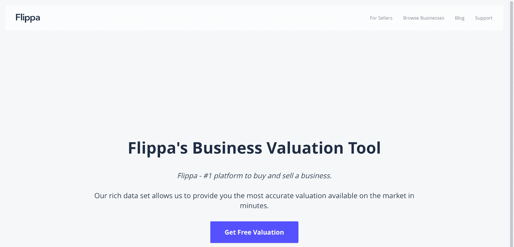
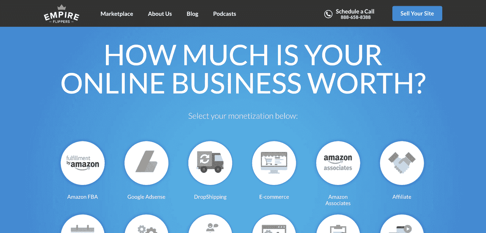
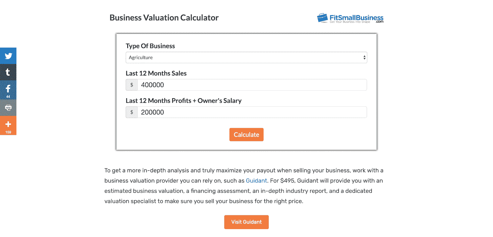
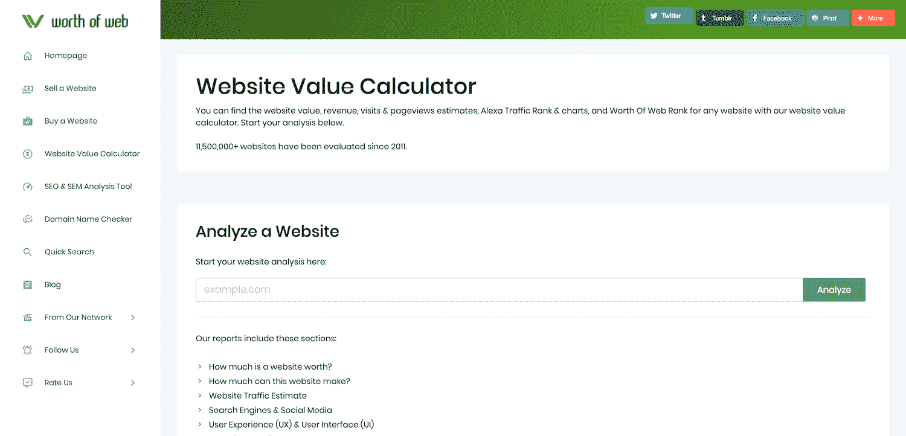
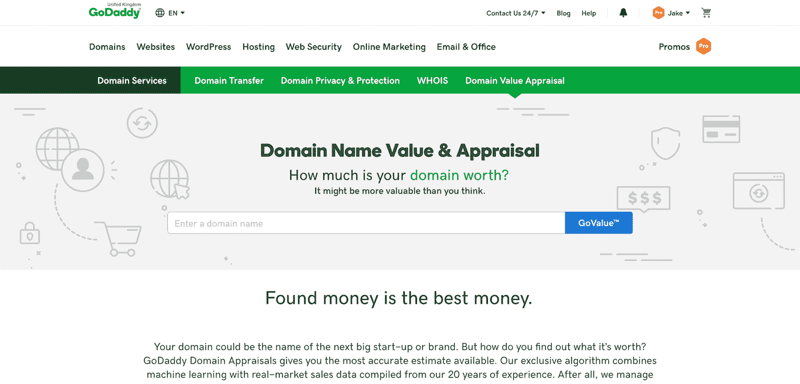
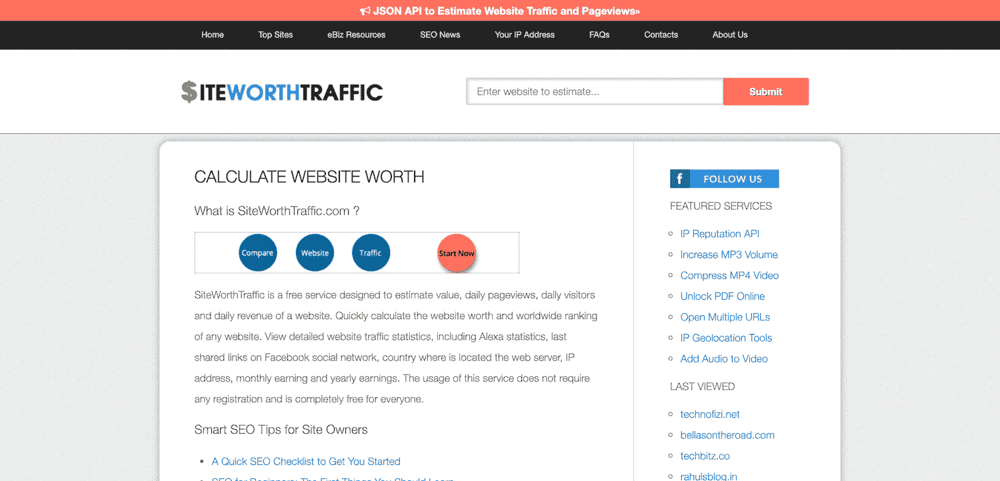
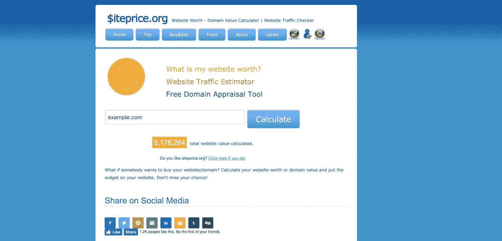
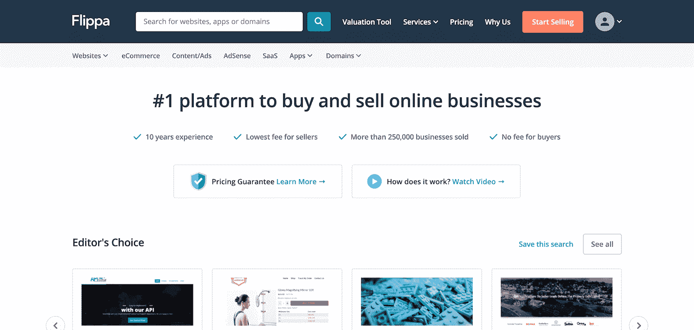
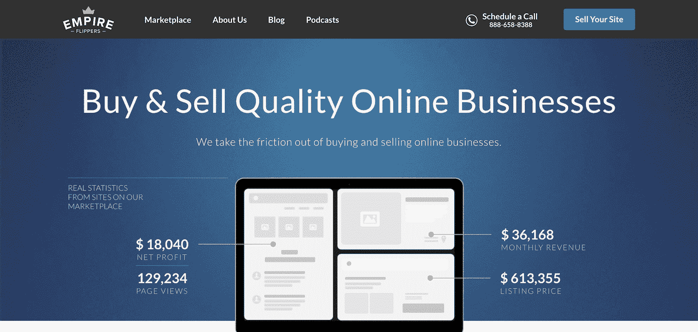
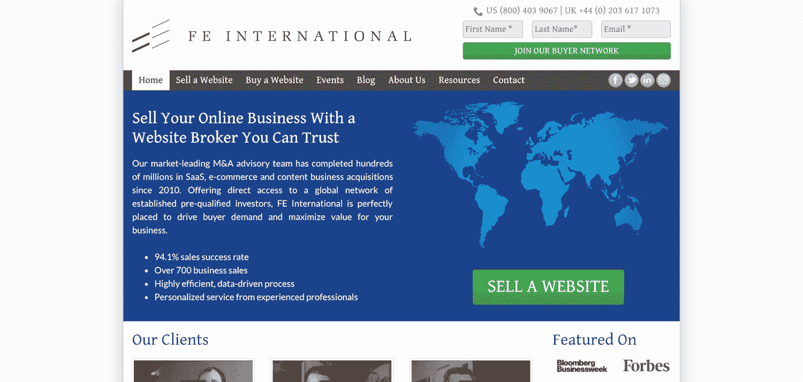

# 我的网站值多少钱？(销售时要避免的+ 3 个错误)

> 原文：<https://kinsta.com/blog/how-much-is-my-website-worth/>

在你花了大量的时间和精力在你的网站上之后，你可能会对维护有点厌倦，并想知道最终目标是什么。

如果你不愿意完全放弃你辛辛苦苦做的一切，答案可能是 [**卖掉你的网站**](https://kinsta.com/blog/sell-website/) 。或者也许你只需要[腾出一些时间](https://kinsta.com/blog/how-to-use-fiverr/)来专注于其他项目。

在你做任何事情之前，问自己几个重要的问题是值得的，比如“**我的网站值多少钱**？”以及“我应该卖掉我的网站吗？”

这篇文章旨在帮助你回答这些问题，这样你就可以把你的网站变成一个可靠的金融投资。

## 我应该卖掉我的网站吗？

有很多正当的理由让你想卖掉你的网站:

### 1.你碰到天花板了

你可能会觉得你的网站已经达到了它的潜力，无论是收入还是流量。如果你看不到自己从你的网站中获得更多，或者你不想付出必要的努力，那么可能是时候离开了。

> Kinsta 把我宠坏了，所以我现在要求每个供应商都提供这样的服务。我们还试图通过我们的 SaaS 工具支持达到这一水平。
> 
> <footer class="wp-block-kinsta-client-quote__footer">
> 
> 
> 
> <cite class="wp-block-kinsta-client-quote__cite">Suganthan Mohanadasan from @Suganthanmn</cite></footer>

[View plans](https://kinsta.com/plans/)

### 2.你已经陷入了墨守成规的境地

你可能对当前的网站感到厌烦，或者对它占用你的时间和资源感到沮丧。十年前你可能对一个网站充满热情，但现在它可能不再那么重要了。向前看比抓住一个让你不开心的过去要好。

### 3.你想投资其他项目

即使[网站非常成功](https://kinsta.com/learn/blogging-tips/)，你也可能会想套现，去寻找其他机会。将你的经验和成功投入到一个新的项目中，会有令人难以置信的回报。

不管是什么原因，如果你选择卖掉你的网站，你需要知道它值多少钱。

## 我的网站值多少钱？

很难说如果你出售你的网站，你会得到多少，但是有各种方法可以得到一个大概的想法。

一个常见的经验法则是将你的月收入乘以 24–36。因此，如果你的网站每月收入 1000 美元，你可以期待 24000-36000 美元的销售额。

当然，决定一个网站价值的因素有很多。对于潜在买家来说，你的净利润、长期利润和收入流都是重要的考虑因素。带来大量有机流量的网站通常比那些严重依赖[广告](https://kinsta.com/blog/how-to-use-google-adwords/)吸引访客的网站更有价值(以下是[为你的网站带来更多流量](https://kinsta.com/blog/how-to-drive-traffic-to-your-website/)的行之有效的策略)。

更准确地说，你可以使用在线网站价值计算器或域名评估工具，根据其他因素来确定指导价格。

## 7 网站价值计算器(以及如何使用它们)

网站评估有很多选项，从[电子表格计算器](https://sheetsformarketers.com/google-sheets-templates/calculators/)到专用工具，有些选项需要比其他选项更多的信息。因此，结果之间可能会有一些差异。

尝试几个不同的计算器，以获得一个好主意，你的网站价值，但要记住，任何数字只是一个指南。如果你决定出售，一个真正的买家可能会出更多或更少的价钱。

### 如何使用网站价值计算器

网站价值计算器往往以类似的方式工作，要求你输入关于你的网站的某些信息，以确定一个指导价值。

这里有几个网站价值计算器的例子，你可以用来确定你的网站价值:

1.  [翻转](#flippa)
2.  [帝国鳍状肢](#empire)
3.  [FitSmallBusiness](#fitsmallbusiness)
4.  [网络价值](#worth)
5.  [GoDaddy](#godaddy)
6.  [网站流量](#siteworthtraffic)
7.  [Siteprice.org](#siteprice)

### 1.鳍状肢

Flippa website value calculator

[Flippa](https://www.flippa.com/business-valuation-calculator) 声称给你“市场上最准确的估价”。它的 6 步流程简单明了，只需几分钟。

您需要输入您的详细信息，包括您的姓名、电子邮件和电话号码，然后才能访问报告。

### 2.帝国脚蹼

Empire flippers website value calculator

帝国掠夺者声称自己是“购买和销售已建立的盈利在线业务的第一策划市场。”

简单的一步一步的工具允许你输入你的企业的详细资料，在几分钟内获得估价。您必须提供[您的电子邮件地址](https://kinsta.com/blog/email-authentication/)，以及一个可选的电话号码，以接收网站估价。

### 3.FitSmallBusiness

FitSmallBusiness website value calculator

FitSmallBusiness 计算器根据你的收入和你所在行业的乘数给出两种估值，让你大致了解你的企业价值。

这个计算器没有考虑到你的网站，所以它值得与下面的域名评估工具一起使用。

### 4.网络价值

Worth of Web website value calculator

这个工具由 Web 的 [Worth 提供，让你只需输入](https://www.worthofweb.com/calculator/)[的网址](https://kinsta.com/knowledgebase/wordpress-change-url/)就能找到任何网站的估价。然后，它会提供即时报告，无需输入您的个人信息。

这是一个很好的工具，可以用来估计你的竞争对手的网站值多少钱来衡量你自己的网站价值。

### 5.GoDaddy

GoDaddy website value calculator

[GoDaddy](https://kinsta.com/godaddy-alternative/) 通过查看数百万的历史域名销量来估算每个域名的价值。它使用机器学习和多年的真实市场销售数据来为销售、交易或谈判创建可靠的起始价格。

虽然这没有考虑到商业和网站本身的价值，但它让你很好地了解了如果你不再打算使用它，仅仅是[域名](https://kinsta.com/blog/choose-domain-name/)就可能带来多少收入。

### 6.网站流量

SiteWorthTraffic website value calculator

SiteWorthTraffic 是一个免费的工具，可以评估一个网站的价值和整体表现，只需简单地输入 T2 的网址 T3。无需注册或输入大量信息即可生成即时报告。

同样，这个工具并不考虑实际的网站本身和它的商业实践，但是包含基于广告的收入是一个有用的指示。一个很棒的功能是它的最近估计的网站列表，这可能会提供对你的网站价值的进一步了解。

## 注册订阅时事通讯

### 想知道我们是怎么让流量增长超过 1000%的吗？

加入 20，000 多名获得我们每周时事通讯和内部消息的人的行列吧！

[Subscribe Now](#newsletter)

### 7.Siteprice.org

Siteprice website value calculator

Siteprice.org 是另一个免费的域名评估工具，你可以通过输入网址来查看一个网站的评估价值和表现。

虽然有些估计看起来有点问题，比如社交媒体的可见性，Siteprice 的报告包括了 100 个类似的网站以及它们的比较价值。

## 如何销售你的网站

现在你知道你的网站值多少钱了。下一个自然的问题是:你能在网上哪里卖它？

买卖网站和买卖房地产非常相似。域名就像物理地址，网站就像房地产本身。因此，使用专业服务是个好主意。

### 你的网站在哪里卖？

和任何销售一样，确保你通过一个安全、可靠、有信誉的网站经纪人来销售你的网站以避免问题是非常重要的。

通过与在网站销售方面有丰富经验的专业公司合作，你可以保证最优惠的价格和顺利的交易。

#### 鳍状肢

Flippa

我们在上面看到了 Flippa 的商业估值计算器，但 Flippa 主要是一个买卖在线业务的市场。一旦你明白了你的生意值多少钱，你可能会想采取下一步行动。

Flippa 将自己描述为“买卖业务的头号平台”，它有一个方便的可信商业经纪人名录，显示他们的位置、专业和他们所代表的业务的价格范围。然后，您可以通过 Flippa 帐户向您选择的经纪人列出您的业务。

#### 帝国脚蹼

Empire Flippers

同样， [Empire Flippers](https://empireflippers.com/) 提供了一个很好的商业价值计算器，他们可以负责下一步，让你比自己卖掉网站赚更多的钱。

当你用 Empire Flippers 列出你的业务时，它会被发送给超过 90，000 个[订户](https://kinsta.com/blog/how-to-build-an-email-list/)。这让你的网站被更多的人看到，并吸引更多真正的兴趣。这些联系让帝国鳍状肢瞄准买家，他们知道正在寻找一个特定类型的网站。

与宕机和 WordPress 问题做斗争？Kinsta 是一款考虑到性能和安全性的托管解决方案！[查看我们的计划](https://kinsta.com/plans/?in-article-cta)

#### FE 国际

FE International

[FE International](https://feinternational.com/) 是一家专业的网站经纪人，为超过 41，000 名通过资格预审的投资者提供直接的全球网络服务。

这意味着你的业务将只展示给真正有能力购买的人，因此没有时间浪费者或骗子的麻烦。FE International 旨在最大化您的业务价值，并帮助您准备最终的销售。

## 销售网站的 4 个技巧

不幸的是，如果你想得到最好的价格，出售你的网站不仅仅是关于域名和商业价值。

有一定的步骤，你应该遵循，以确保你得到最好的交易，当谈到出售你的网站和业务。

### 1.考虑长期价值

大多数商业价值计算都是基于利润的。这对于达到合理的现金价值是有用的，但它没有考虑到你企业的长期价值。

你潜在的收入增长，社交媒体的存在，或者搜索的可见性是显示一个网站非货币价值的额外因素。你的网站的持续增长会带来更多的利润和品牌知名度，从而使其更有价值。

### 2.了解你的目标市场

和其他销售一样，了解你的目标市场很重要:他们想要什么，他们能负担得起什么，以及如何向他们销售。

你会采取不同的方式销售一个电子商务网站和一个基于内容的网站，你会期望吸引不同的买家。这是一个雇佣专业经纪人将真正让你受益的领域，因为他们将拥有以正确的方式和正确的价格进入正确市场所必需的经验和人脉。

### 3.研究其他网站销售

如果你以前从未买卖过网站，你很可能不知道有多少钱可能会转手。

与网站经纪人交谈，了解他们以前在你的行业或其他类似业务中网站的销售情况。这将给你最现实的期望，因为它们是基于现实生活的经验，而不是算法和乘数。除了价格，你还可以找到更多的信息，包括哪些信息和销售策略。

### 4.让你的网站出现在合适的人面前

虽然有许多拍卖网站，但它们并不都提供相同的服务，也不是所有的网站都适合这项工作。

只要有可能，选择那些更大、更受欢迎、久负盛名的网站。然而，值得注意的是，大量的观众并不总是最好的观众。如果你的生意相当小众，你最好联系一个在这个领域有经验和人脉的经纪人。

## 销售网站时要避免的 3 个错误

当谈到销售你的网站时，有许多陷阱可能会让你损失金钱或失去生意。

### 1.关注无意义的数据

用令人印象深刻的统计数据来增加你的清单是吸引潜在买家的好方法。然而，要小心不要把虚荣的指标包括在内，当涉及到[业务表现](https://kinsta.com/blog/2018-year-in-review/)时，这些指标实际上没有多大意义。

保持透明，只提供真实的数据，即使这些数据不那么令人印象深刻。重点列举你公司的优势、成就和最吸引人的数据。不要隐藏消极的一面，而是让积极的一面真正凸显出来。

### 2.忘记长寿

你可能听说过[创建一个网站](https://kinsta.com/blog/wordpress-website-cost/)致力于最新的热潮或趋势话题是一个赚快钱的好方法。人们经常[购买一个域名](https://kinsta.com/blog/how-much-does-a-domain-name-cost/)仅仅是为了扔掉一些匆忙的页面，这样他们就可以在主题仍然相关的时候卖掉它。

这些低投入、低质量的网站很少赚钱。如果你想通过出售网站来赚取可观的利润，那么关注网站的长期潜力，而不是短期的轰动效应。这需要更多的时间和努力，但这将转化为价值和销售能力。

### 3.在销售之前没有把你的网站做到最好

在你想卖的东西上投入大量的工作听起来可能违反直觉，但是这样做会帮助你谈判一个更好的价格。就像在出售前改造房子一样。

优化你网站上所有可能的东西，从搜索引擎优化到盈利策略和 T2 的线索捕捉策略。未优化的网站对买家来说很划算，因为他们可以以更低的价格购买一个未优化的网站，然后花一点功夫就能提高利润。确保你尽可能地从你网站的潜力中获益。

[How much is your site worth? There are tools that can give you a ballpark number! Check your site's value now and see what number you get 💵⛈Click to Tweet](https://twitter.com/intent/tweet?url=https%3A%2F%2Fbit.ly%2F35JYI3c&via=kinsta&text=How+much+is+your+site+worth%3F+There+are+tools+that+can+give+you+a+ballpark+number%21+Check+your+site%27s+value+now+and+see+what+number+you+get+%F0%9F%92%B5%E2%9B%88&hashtags=sellyoursite%2Cwordpress)

## 摘要

销售你的网站是一个重要的考虑因素，在接受这个想法之前尽可能多的做研究是值得的。

通过花些时间弄清楚你的网站的价值、潜力和市场，你可以确保最成功的销售。如果你正在认真考虑，至少联系一个经纪人，他会给你切合实际的建议。这花了一点钱，但很值得投资。

* * *

让你所有的[应用程序](https://kinsta.com/application-hosting/)、[数据库](https://kinsta.com/database-hosting/)和 [WordPress 网站](https://kinsta.com/wordpress-hosting/)在线并在一个屋檐下。我们功能丰富的高性能云平台包括:

*   在 MyKinsta 仪表盘中轻松设置和管理
*   24/7 专家支持
*   最好的谷歌云平台硬件和网络，由 Kubernetes 提供最大的可扩展性
*   面向速度和安全性的企业级 Cloudflare 集成
*   全球受众覆盖全球多达 35 个数据中心和 275 多个 pop

在第一个月使用托管的[应用程序或托管](https://kinsta.com/application-hosting/)的[数据库，您可以享受 20 美元的优惠，亲自测试一下。探索我们的](https://kinsta.com/database-hosting/)[计划](https://kinsta.com/plans/)或[与销售人员交谈](https://kinsta.com/contact-us/)以找到最适合您的方式。