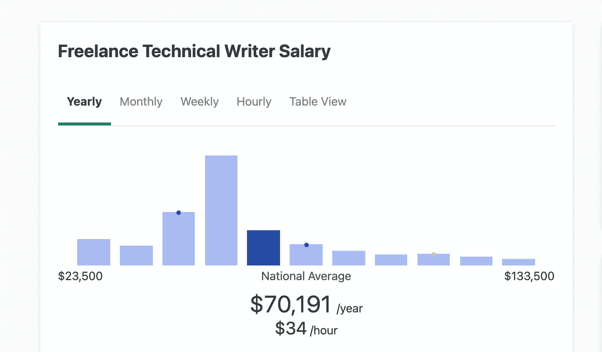
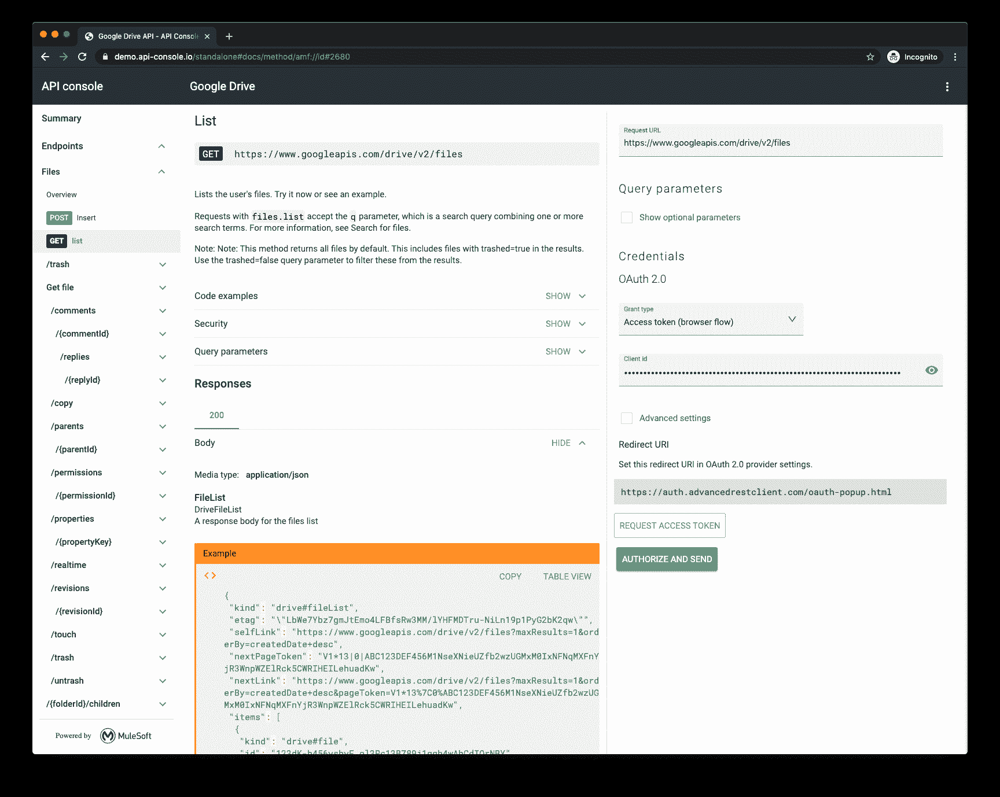
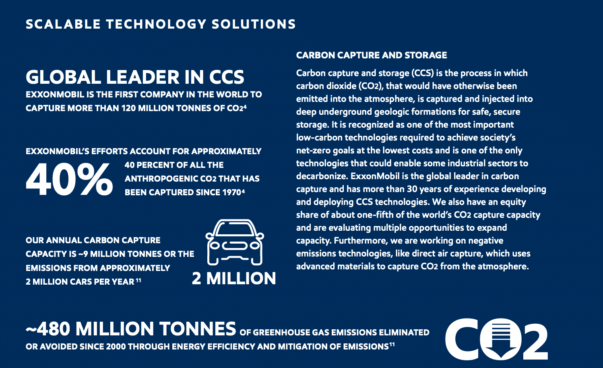
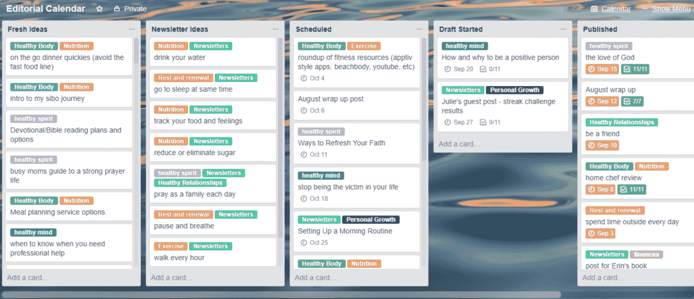
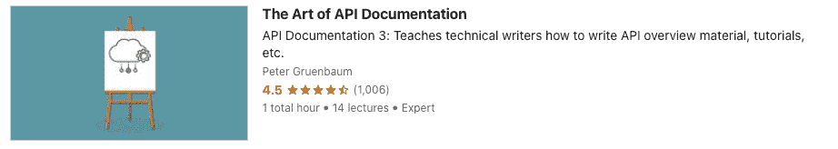
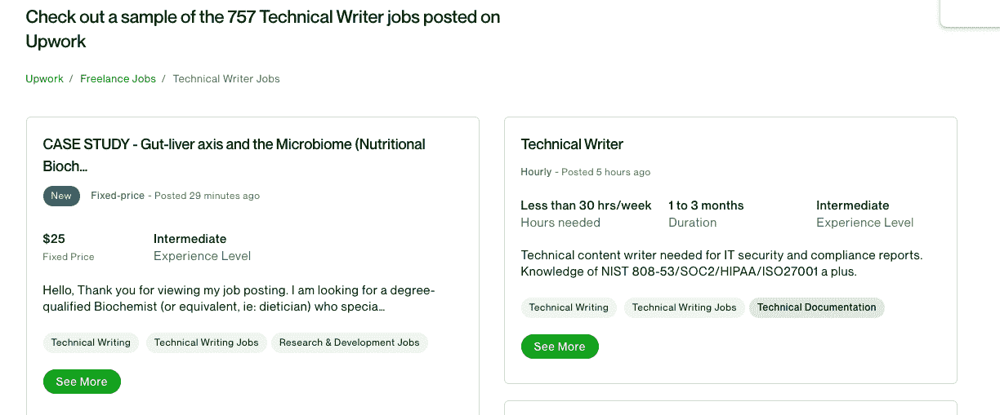
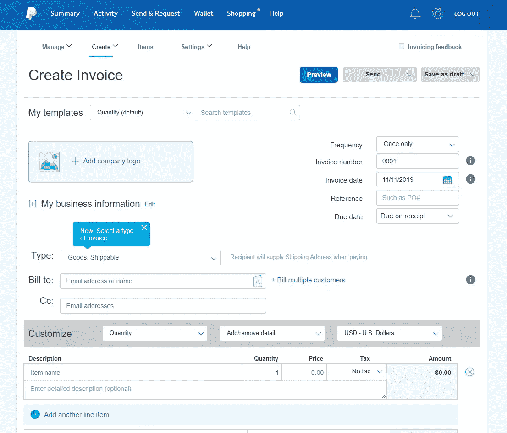

# 如何成为一名自由职业技术作家(6 个关键步骤)

> 原文：<https://kinsta.com/blog/how-to-become-a-freelance-technical-writer/>

公司越来越多地寻找能够将复杂的概念性想法转化为面向客户和利益相关者的直白内容的人。如果你有技术背景，但正在寻找一个更灵活的职业选择，自由职业技术写作可能是很好的选择。

通过学习如何成为一名自由职业技术作家，你可以成为自己的老板，在任何地方工作。换句话说，你可以将你的专业知识转化为一份灵活、有利可图、回报丰厚的职业。

激动吗？我们走吧！

### 查看我们的[视频指南](https://www.youtube.com/watch?v=mJbBx8FCN3A)成为一名技术作家

## 什么是自由职业技术写作？

自由写作不仅仅是写博客和 T2 在社交媒体上发帖。几乎任何写作工作都可以由自由职业者来完成。

自由职业者不只是为一家公司工作。他们与几个写作客户合作，这些客户作为非雇员服务提供者向你付费。

特别是，自由职业技术作家擅长于[创作关于高度技术化或专业化主题的书面内容](https://kinsta.com/blog/long-form-articles/)，比如工程或网站开发。

### 信息

技术作者将复杂的概念分解成用户友好的报告、指南和其他文档。

[公司正在寻找能够为客户和利益相关者将复杂的想法转化为直观内容的人才。🤝如果这听起来像你，请继续读下去！🤓 点击推文](https://twitter.com/intent/tweet?url=https%3A%2F%2Fkinsta.com%2Fblog%2Fhow-to-become-a-freelance-technical-writer%2F&via=kinsta&text=Companies+are+looking+for+people+that+can+transform+complex+ideas+into+straightforward+content+for+customers+and+stakeholders.+%F0%9F%A4%9D+If+this+sounds+like+you%2C+read+on%21+%F0%9F%A4%93&hashtags=TechJobs%2CWFH)

## 作为自由职业技术作家的好处

无论你是决定全职做自由职业者，还是想兼职赚点外快，自由写作都有很多好处，比如你可以在自己的时间里在任何地方工作。

### 灵活的时间表

在调查中，68%的自由职业者选择了这种工作方式，而不是传统的日常工作，因为这增加了灵活性。因为对于客户来说，自由职业者不被视为雇员，所以你不需要每天打卡上下班。

自由写作工作围绕着截止日期，而不是正常的工作时间。如果你有非工作义务(如抚养孩子)或者只是想更多地控制自己的时间，这种类型的时间表可以给你所需的自由。

### 在任何地方工作

除了时间安排的灵活性，地点的独立性是自由写作生涯中最重要的好处之一。不再需要请假去旅行— [只要你有一台电脑和互联网连接，你就可以在任何地方工作](https://kinsta.com/blog/working-remotely/)。

### 更高的工资潜力

自由写作不仅仅是一种兼职选择。是绝佳的全职职业选择。此外，自由职业技术作家可以要求更高的工资，因为他们的专业知识和技能。

### 多样化

自由职业的技术写作为跨多个行业的各种项目打开了大门。您可以在 IT、金融、政府、制造、教育和医药等行业找到客户。

更重要的是，你不会一次只局限于一个行业。同时与几个客户一起工作可以让你的工作更加多样化，探索你感兴趣的话题和行业。

## 自由职业技术作家工资

根据 ZipRecruiter 的调查，自由职业的技术作家比一般的自由作家挣得多。平均来说，一个普通的自由作家每年大约挣 61，935 美元，或者 30 美元/小时。另一方面，自由职业技术作家的平均年薪为 70，191 美元，或 34 美元/小时。

在高端，25%的自由职业技术作家年收入在 76，000 美元到 133，000 美元之间。

Graph showing average freelance technical writer salary in the United States. (Image source: [ZipRecruiter](https://www.ziprecruiter.com/Salaries/Freelance-Technical-Writer-Salary))

有几个因素会影响你作为自由撰稿人的报酬，包括行业、专业水平和内容类型。拥有更高知识水平或专门从事利基主题的技术作家可以为他们的服务定价更高。

## 最常见的技术写作类型

作为一名自由职业的技术作家，你可以选择不同的内容类型提供给你的客户。以下是一些最常见的自由职业技术写作项目。

### 技术文章

技术文章是指任何专注于某一特定主题或产品的社论。这些文章通常发表在杂志或其他在线出版物上，它们不需要监督研究。

你可以找到为几乎任何类型的客户写技术文章的工作，从机器人制造商到法律公司，以及介于两者之间的任何公司。下面是一些来自这些行业的技术内容的例子:

*   发射火箭的新方法:微波能
*   [加密资产:新兴资产类别的会计](https://www.cpajournal.com/2019/06/21/cryptoassets-accounting-for-an-emerging-asset-class/)(注册会计师杂志)
*   【WordPress 超级用户的 5 个最佳降价编辑器

### 技术指南和手册

技术指南和手册是操作手册，旨在帮助客户学习如何使用产品并充分利用它。

根据产品的不同，技术手册可能包括安装、使用、维护、故障排除和最佳实践的说明。API 文档是软件公司使用的另一种流行的技术指南。

Screenshot of API Console’s API documentation. (Image source: [Medium](https://medium.com/raml-api/api-console-version-6-is-released-2e266ba6ace1))

一些流行的技术文档包括 Salesforce 的 [Pardot API 指南](https://developer.salesforce.com/docs/marketing/pardot/overview)，Blue Star Cooking 的[独立式炉灶安装](https://www.bluestarcooking.com/wp-content/uploads/2019/03/BlueStar-FreeStanding-Range-Installation-Manual-750163-Rev3.28.19.pdf)，以及我们的[网站可用性测试分步指南](https://kinsta.com/blog/website-usability-testing/)。

### 政策和程序

企业使用政策和程序手册来定义各种情况下的标准协议。作为一名技术写作者，你可以撰写诸如招聘程序、在家工作政策、员工福利包或工作场所行为准则等文件。

这些项目与教育、政府和医疗保健部门尤其相关，因为它们经常受到联邦法规的约束。一个很好的例子是 SHRM 发布的道德和商业行为准则。

### 业务计划

商业计划是定义公司目标、目的和策略的路线图。特别是初创公司，可能会聘请具有敏锐商业嗅觉和产品相关知识的技术作家来起草商业计划，提交给潜在投资者。

两个值得一看的例子是库琳娜商业计划和 T2 或卡斯马特商业计划。

### 白皮书

如果你有在 B2B 行业工作的经验，你可能已经熟悉了白皮书。白皮书是销售和营销团队用来解释新解决方案或突出产品或服务细节的文档。

白皮书的长度从 6 页到 15 页不等，对作家来说是更有利可图的产品之一，平均价格在[3000 到 6000 美元](https://ddiy.co/how-much-should-you-pay-for-a-white-paper/)。高端白皮书可以卖到 1 万美元甚至更多；但是，您经常需要研究和创建或建议文档的设计。

Title page of Microsoft Azure HCI white paper. (Image source: [Microsoft](https://azure.microsoft.com/en-us/resources/azure-stack-hci-overview-white-paper/))

你可以阅读两本白皮书来寻找灵感，分别是 McKesson 的[为医疗补助 MCO 过渡做准备](https://mms.mckesson.com/resources/white-paper-flipbooks/medicaid-mco-transition-preparation)和 Microsoft Azure 的 [Azure Stack HCI 概述](https://azure.microsoft.com/en-us/resources/azure-stack-hci-overview-white-paper/) (Microsoft Azure)。

### 个案研究

与白皮书类似，[案例研究](https://kinsta.com/blog/portfolio-website/#case-studies)用于帮助销售和营销团队销售他们的产品。但是，案例研究不是解释产品特性，而是深入研究产品(或解决方案)如何帮助单个客户或解决特定问题。

除了 [Kinsta 的案例研究](https://kinsta.com/clients/)，你可以看看 MailChimp 的[她的校园媒体如何增加了 72%的订户](https://mailchimp.com/resources/her-campus-increased-subscribers/)，以及赛默飞世尔科技的[使用 Nexavar](https://www.thermofisher.com/content/dam/LifeTech/migration/en/filelibrary/drug-discovery/pdfs.par.14062.file.dat/assessing-differences-in-biochemical-and-cell-based-profiles-sutent-case-study.pdf) 评估生物化学和基于细胞的档案以查看示例。

### 公司报告

最后，我们有公司报告，为潜在投资者详细介绍公司的财务信息。公司报告包括季度报告(表格 10-Q)、年度报告(表格 10-K)和重大事件报告(表格 8-K)。

Screenshot of ExxonMobil annual report. (Image source: [ExxonMobil](https://corporate.exxonmobil.com/-/media/Global/Files/investor-relations/annual-meeting-materials/annual-report-summaries/2020-Annual-Report.pdf))

要撰写公司报告，你需要了解会计基础知识、财务文件以及公司的产品和竞争环境。

我们最喜欢的可靠公司报告的例子包括[甲骨文 2021 财年第四季度和年度报告](https://investor.oracle.com/investor-news/news-details/2021/Oracle-Announces-Fiscal-2021-Fourth-Quarter-and-Fiscal-Full-Year-Financial-Results/default.aspx)和[埃克森美孚公司 2020 年度报告](https://corporate.exxonmobil.com/-/media/Global/Files/investor-relations/annual-meeting-materials/annual-report-summaries/2020-Annual-Report.pdf)。

## 成为自由职业技术作家所需的技能

如果你想成为一名成功的自由职业技术作家，你需要有技术上的敏锐和技能来建立和经营你自己的生意。

以下是你在开始自由职业技术写作之前应该具备的最高要求和技能。

### 技术知识和专业技能

一些自由写作利基不需要正式的教育或培训。然而，技术写作通常不是这样。技术写作是自由职业者的利基之一，在这里你会经常找到希望你至少拥有学士学位的客户。

## 注册订阅时事通讯

### 想知道我们是怎么让流量增长超过 1000%的吗？

加入 20，000 多名获得我们每周时事通讯和内部消息的人的行列吧！

[Subscribe Now](#newsletter)

由于客户需要你将复杂的概念分解成用户友好的语言，他们通常也会寻找有相关工作经验的人。或者，如果你正在为某人的网站写文章，你应该知道页面搜索引擎优化的最佳实践。

### 学术论文交流

对于任何一个职业作家来说，书面沟通技巧都是必须的。技术写作者应该能够以简单、简洁、中性的风格写作。最重要的是，如果你能把复杂的材料提炼成平易近人的内容，那会很有帮助。

与客户打交道时，书面沟通技巧也很重要。作为一名自由撰稿人，你不会每天都和客户在办公室里。你需要能够管理期望，并通过电子邮件与客户有效沟通。

### 编辑

虽然你可能想把编辑技巧和书面交流放在一起，但是编辑是写作过程中非常重要的一步，值得全神贯注。有些客户甚至会分别雇佣作家和编辑。

然而，如果你的客户没有内部编辑，你需要磨练你的编辑技能。确保你已经牢牢掌握了语法和标点规则，然后学习如何校对你的作品，以检查合适的语气和逻辑思路。

### 时间和项目管理

有时，自由职业包含很多杂耍。当你作为一名自由作家工作时，你没有一个经理来检查你的进展并让你保持在正轨上。如果你打算在做自由职业者的同时保住全职工作，准确地安排时间是至关重要的。

Editorial calendar on Trello. (Image source: [Your Blogging Mentor](https://resignal.com/blog/create-editorial-calendar-using-trello-need-one/))

所以，为了确保你能在截止日期前完成任务，你应该掌握你的时间管理技巧，并学会如何使用项目管理工具。您有责任制定项目时间表，解决问题，并与客户沟通任何重大变更。

### 营销

任何成功的自由职业都需要一定程度的自我推销。如果你想把自由职业变成一份全职工作，你需要向潜在客户推销自己。你必须把自己当成一个小企业，去寻找新客户。

## 如何成为一名自由职业的技术作家

现在，开始练习！以下是成为自由职业技术作家的步骤:

1.  选择一个专业领域
2.  创建写作样本
3.  创建在线投资组合
4.  联系潜在客户
5.  协商价格
6.  敲定合同

让我们来看看这些步骤都需要些什么。

### 1.选择一个专业领域

对于新的自由撰稿人，有几种方法可以让你选择写作领域。最简单的方法之一就是选择与你的教育背景和工作经验相关的行业。

例如，如果你曾经做过[网站开发者](https://kinsta.com/blog/web-developer-salary/)，你可以转行写关于 [UX/UI 设计](https://kinsta.com/blog/web-design-best-practices/)的技术文章或者[安装网站安全措施的指南](https://kinsta.com/blog/website-security-check/)。

你也可以选择专攻某些类型的项目，比如白皮书或者技术手册。随着你在某个特定领域不断积累经验，你可以磨练自己的技能，收取更高的费用。

需要一个给你带来竞争优势的托管解决方案吗？Kinsta 为您提供了令人难以置信的速度、一流的安全性和自动伸缩功能。[查看我们的计划](https://kinsta.com/plans/?in-article-cta)

### 2.建立一个写作文件夹

一旦你知道你想写什么，就开始写吧。最好有相关的写作样本来创建一个文件夹，与潜在客户分享。

即使你没有客户，也可以从写一些与你写作领域相关的例子开始。如果写作不是你最近工作的一部分，参加一个在线写作课程来更新你的技能会很有帮助。

The Art of API Documentation course description on Udemy. ([Image Source](https://www.udemy.com/topic/technical-writing/))

拿到样品后，是时候[建立你的作品集](https://kinsta.com/blog/portfolio-website/)了。首先，您的文件夹可以是您可以与客户共享的样本文档文件夹。

### 3.发展您的个人品牌并创造商机

从一个可分享的写作文件夹开始是一个很好的步骤，但是如果你想吸引更多的客户，你应该[创建自己的网站](https://kinsta.com/knowledgebase/what-is-wordpress/)，让[展示你的作品](https://kinsta.com/blog/wordpress-portfolio-plugins/)，并告诉客户你提供的内容类型。

为了[优化你的自由职业者网站](https://kinsta.com/blog/conversion-rate-optimization-tips/)以获得潜在客户，请确保它具备以下要素:

*   服务页面
*   [联系方式](https://kinsta.com/blog/wordpress-contact-form-plugins/)
*   个人博客或工作样本

一旦你和一些客户合作过，你也可以[在你的网站上添加积极的评论和评级](https://kinsta.com/blog/best-wordpress-review-plugins/)。

### 信息

为你的投资组合制定一个快速安全的网站托管计划，探索 WordPress 的 [Kinsta。](https://kinsta.com/features/)

在你的网站上线后，确保接触相关的行业出版物，寻找客座博文的机会。有了客座博文，你就可以为其他人创建内容，作为回报，他们会给你一个[链接，链接到你的网站](https://kinsta.com/blog/b2b-lead-generation/#trusted-backlinks)。

我们还建议[选择一个社交平台](https://kinsta.com/blog/twitter-marketing/)，在那里你可以持续分享内容，展示你的专业知识，并接触潜在客户。 [LinkedIn](https://kinsta.com/blog/linkedin-marketing/) ，Quora， [Medium](https://kinsta.com/blog/medium-vs-wordpress/) ，Reddit 都是技术写手的绝佳选择。

### 4.联系潜在客户

如果你没有马上收到潜在客户的来信，你可能需要使用一些对外联络策略来获得你的第一份工作。当你开始自由写作时，有几个地方可以找到你的第一个客户。

首先，接触你现有的职业关系网，浏览求职公告栏来竞标项目，然后列出你可以联系的目标客户名单。

Technical freelance writing job posts on Upwork.com. ([Image Source](https://www.upwork.com/freelance-jobs/technical-writing/))

此时，你需要学习如何[令人信服地推销你的服务](https://www.makealivingwriting.com/tools-for-writing-a-pitch/)，让客户与你会面。好消息是，许多成功的自由撰稿人在网上分享他们最好的广告模板。找一个适合你的，然后开始联系别人。

### 5.协商价格

当你与潜在客户发展关系时，你可以发现写作的机会。如果有人有兴趣雇用你，他们通常会要求项目建议书。在那份提案中，你将准确地概述你将交付什么以及何时交付。

在你们一起回顾了你们的提案后，是时候协商价格了。我们建议为高度技术性的项目提供每个项目的价格(而不是每个字或每小时的价格)。在你谈判之前，先研究一下市场价格，决定你能接受的最低价格。

### 6.敲定合同

永远为你的自由职业项目写一份合同。合同有助于保护你，并确保你得到工作报酬。

虽然它们不需要很复杂，但你的合同应该定义工作范围、内容所有权、支付条款、截止日期和修订政策。在某些情况下，客户可能会要求你加入竞业禁止条款或保密声明。

以下是一些自由职业者合同模板，您可以使用它们来创建自己的合同:

*   [自由职业合同模板](https://legaltemplates.net/form/freelance-contract/)
*   自由撰稿人合同/协议书
*   [自由职业者保密协议(NDA)](https://www.freelancermap.com/blog/nda-for-freelancers/)

## 作为自由作家获得报酬

你已经有了第一个客户，合同也签了。一旦他们对工作满意了，你怎么得到报酬？

嗯，在很大程度上，你会像其他企业一样得到报酬。大多数自由撰稿人在项目结束时会用发票给客户开账单。

### 如何发送发票

你的合同应该包括你拿多少钱和什么时候拿。您将在发送发票时使用这些详细信息。

请确保在您的发票上包含以下信息:

*   发票号码
*   您的联系信息
*   签发日期(发票创建的日期)
*   (付款的)到期日
*   行项目描述
*   到期总额
*   [付款方式](https://kinsta.com/blog/paypal-alternative/)

使用[发票软件](https://kinsta.com/blog/wordpress-crm/#11-wp-smart-crm--invoices-free)帮助你保持财务有序，并让你接受更多的支付方式，如银行转账或信用卡支付。自由职业者的热门选择包括 [Freshbooks](https://kinsta.com/blog/freshbooks-vs-quickbooks/) ，Quickbooks 自营，Bonsai，和 [PayPal](https://kinsta.com/blog/stripe-vs-paypal/) 。

Screenshot of PayPal invoice management page. (Image source: [Business Insider](https://www.businessinsider.com/how-to-send-an-invoice-on-paypal))

### 了解自由职业税

除了了解开票流程，还需要了解缴纳自由职业税的基础知识。作为一名自由职业者，你被认为是自由职业者，这意味着你的收入要缴纳自由职业税。

会计软件，如 Quickbooks 个体户，可以帮助你跟踪税务文件和估计纳税额。然而，如果你刚开始，咨询一个能解释个体户税如何运作的会计师是有帮助的。

[想成为自己的老板，在任何地方工作，并且有灵活的时间？💪成为一名自由职业的技术作家可能是最合适的👨‍💻](https://twitter.com/intent/tweet?url=https%3A%2F%2Fkinsta.com%2Fblog%2Fhow-to-become-a-freelance-technical-writer%2F&via=kinsta&text=Want+to+be+your+own+boss%2C+work+from+anywhere%2C+and+have+flexible+hours%3F+%F0%9F%92%AA+Becoming+a+freelance+technical+writer+could+be+the+perfect+fit+%F0%9F%91%A8%E2%80%8D%F0%9F%92%BB&hashtags=RemoteWorks%2CTechJobs)

## 摘要

如果你想要更多的独立性和灵活性，技术性的自由写作生涯可能是你的最佳选择。如果你有技术知识和训练有素的写作技巧，这也是一个兼职赚外快的好方法。

自由写作为你打开了一扇大门，让你可以在任何你想去的地方工作，找到符合你兴趣的项目和客户。你需要做的就是开始写作！

最后，如果你有一个作品集网站来展示你的著名作品，那会很有帮助。为了开始为你的自由写作事业建立一个网站，探索一下[金斯塔关于 WordPress](https://kinsta.com/plans/) 的计划。

如果你有任何关于成为自由作家的遗留问题，请在下面的评论区告诉我们。

* * *

让你所有的[应用程序](https://kinsta.com/application-hosting/)、[数据库](https://kinsta.com/database-hosting/)和 [WordPress 网站](https://kinsta.com/wordpress-hosting/)在线并在一个屋檐下。我们功能丰富的高性能云平台包括:

*   在 MyKinsta 仪表盘中轻松设置和管理
*   24/7 专家支持
*   最好的谷歌云平台硬件和网络，由 Kubernetes 提供最大的可扩展性
*   面向速度和安全性的企业级 Cloudflare 集成
*   全球受众覆盖全球多达 35 个数据中心和 275 多个 pop

在第一个月使用托管的[应用程序或托管](https://kinsta.com/application-hosting/)的[数据库，您可以享受 20 美元的优惠，亲自测试一下。探索我们的](https://kinsta.com/database-hosting/)[计划](https://kinsta.com/plans/)或[与销售人员交谈](https://kinsta.com/contact-us/)以找到最适合您的方式。