# 如何在 Chrome 上屏蔽网站(在一分钟内排除干扰)

> 原文：<https://kinsta.com/blog/how-to-block-a-website-on-chrome/>

您是否在寻找一种简单的方法来阻止谷歌浏览器上的网站，以便您或其他用户无法访问它？

无论您是想通过屏蔽 YouTube 或 Reddit 来防止自己分心，还是想屏蔽父母控制未涵盖的不当网站，以便您的孩子可以安全地上网，我们都可以满足您的需求。

Chrome 在浏览器市场份额方面遥遥领先，占据了超过 73%的份额。在本文中，我们将向您展示如何在桌面、Android 和 iOS 上的谷歌 Chrome 中屏蔽网站。我们将从几个方面深入探讨，从使用扩展，编辑您的主机文件，到您的移动设置。

准备好了吗？

让我们阻挡一些干扰！

[Want to block a website on Google Chrome so you can stay focused on work? This quick and easy guide will keep you on task 💪Click to Tweet](https://twitter.com/intent/tweet?url=https%3A%2F%2Fkinsta.com%2Fblog%2Fhow-to-block-a-website-on-chrome%2F&via=kinsta&text=Want+to+block+a+website+on+Google+Chrome+so+you+can+stay+focused+on+work%3F+This+quick+and+easy+guide+will+keep+you+on+task+%F0%9F%92%AA&hashtags=GoogleChrome%2CProductivity) ### 更喜欢看[视频版](https://www.youtube.com/watch?v=Pb-FMJRqV_o)？


> 需要在这里大声喊出来。Kinsta 太神奇了，我用它做我的个人网站。支持是迅速和杰出的，他们的服务器是 WordPress 最快的。
> 
> <footer class="wp-block-kinsta-client-quote__footer">
> 
> 
> 
> <cite class="wp-block-kinsta-client-quote__cite">Phillip Stemann</cite></footer>

[View plans](https://kinsta.com/plans/)

## 如何在 Chrome(桌面)上屏蔽网站

在桌面版 Chrome 上屏蔽网站最简单的方法就是使用扩展。有许多选项可用，但 [BlockSite](https://chrome.google.com/webstore/detail/block-site-website-blocke/eiimnmioipafcokbfikbljfdeojpcgbh?hl=en) 是最新的，拥有超过 100 万活跃用户。

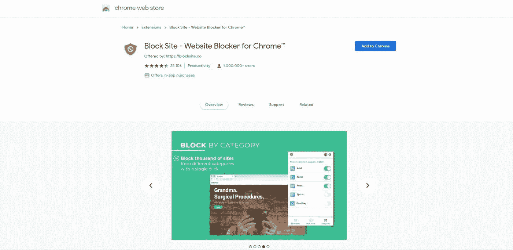

Website Blocker for Chrome extension


和其他的 [Chrome 扩展](https://kinsta.com/blog/best-chrome-extensions/)一样，安装过程几乎是即时的。只需点击上面的链接或在 Chrome 网络商店中搜索“阻止网站”即可进入该扩展的页面。

然后点击“添加到 Chrome 按钮”并在安装提示中点击“添加扩展”来确认请求。

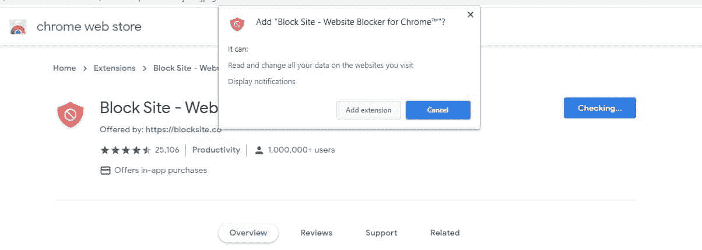

Installing the BlockSite extension


一旦你添加了扩展，它会要求你允许记录浏览数据，你可以拒绝。

之后，你会看到应用程序的用户界面，你可以添加你的第一个被屏蔽的网站。只需键入一个 [URL](https://kinsta.com/knowledgebase/what-is-a-url/) 并按回车键即可屏蔽任何网站，例如 reddit.com:

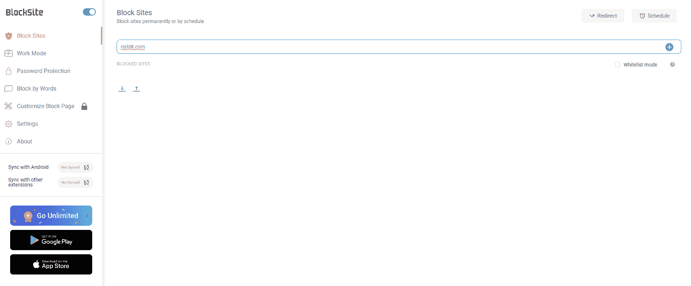

Adding sites to your list of blocked sites


现在，如果你试图在工作日中间访问 Reddit，你会看到这个选项弹出来。

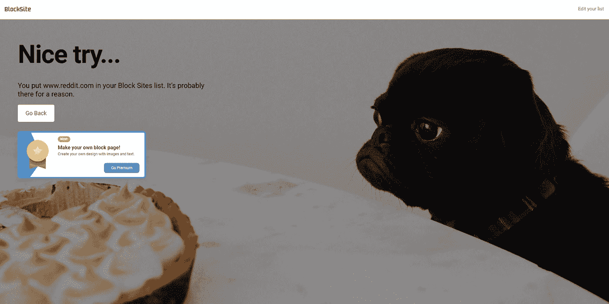

Blocked site visit attempt page


一只失望的小狗会激励你回去工作，而不是没完没了的抱怨。


### 如何在匿名模式下屏蔽网站

默认情况下，没有扩展设置适用于[隐姓埋名模式](https://kinsta.com/knowledgebase/incognito-mode/)，BlockSite 也不例外。

因此，为了确保你在使用 Chrome 的匿名模式时也能屏蔽某个网站，请进入扩展设置。如果您已经关闭了选项卡，您应该能够在工具栏中找到 BlockSite 扩展。

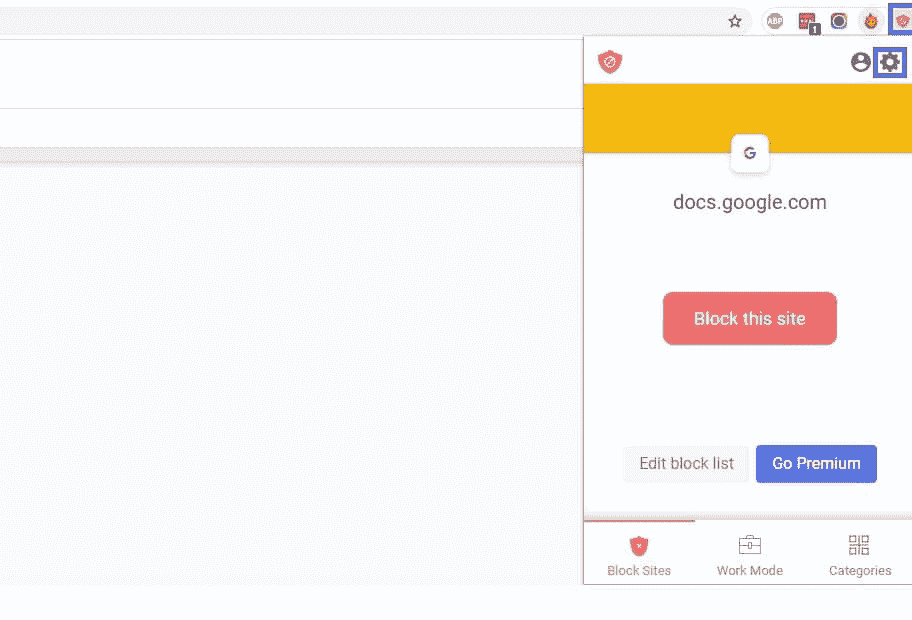

BlockSites settings


从那里，导航到设置页面，并点击页面顶部的“启用隐名模式”按钮。


BlockSite enabled in incognito mode


现在，即使你试图在匿名模式下访问被屏蔽的页面，你也无法访问它们。

### 如何用密码保护被阻止的网站(用于家长控制和办公电脑)

无论你是一位忧心忡忡的父母，还是一位想要提高工作效率的办公室经理，你都需要再迈出一步。

如果你只是使用扩展，用户可以简单地找到插件页面，并解除对页面的封锁。为了避免这种情况，您需要在扩展中添加[密码保护](https://kinsta.com/blog/password-protect-wordpress-site/)。

为此，请转到 BlockSite 详细信息页面，并导航到密码保护选项卡。从那里，检查第一个选项，并输入您的电子邮件地址和所需的密码。

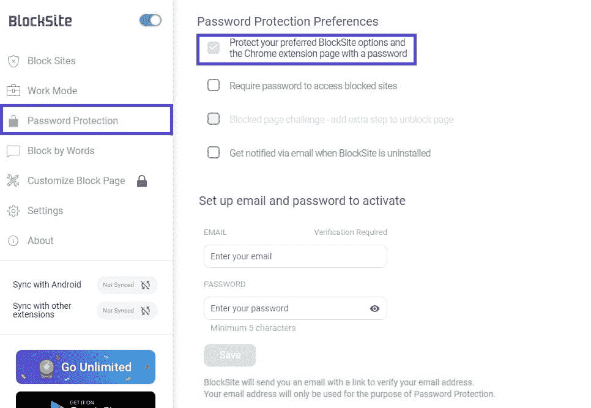

Adding password protection to BlockSite


注册并登录后，所有 Chrome 用户都需要登录才能进行更改。

如果你想以同样的方式控制你的 Gmail 收件箱，我们有一份 T2 22 个 Gmail 插件的列表，可以帮助你改善收件箱的体验。

### 如何在 Chrome 中暂时屏蔽网站

如果你不想永久屏蔽网站，而是在工作时暂时屏蔽分心的事物，BlockSite 也提供了这个选项。

但是要使用它，您需要将扩展固定。因此，如果您在工具栏中看不到图标，您需要通过单击拼图块，然后锁定 BlockSite 来添加它。

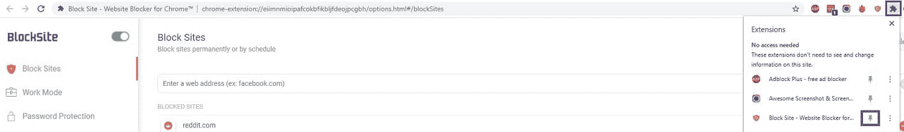

Pinning the BlockSite extension in Chrome


接下来，单击工具栏中的 BlockSite 图标，导航到“工作模式”选项卡，然后单击“开始”按钮。

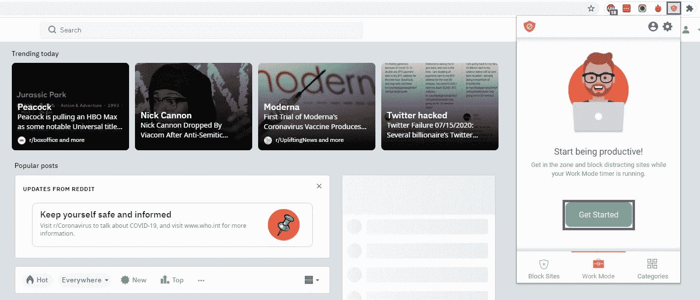

Work mode


然后，您可以将想要阻止的站点添加到列表中，并在添加完所有站点后点按“继续”。

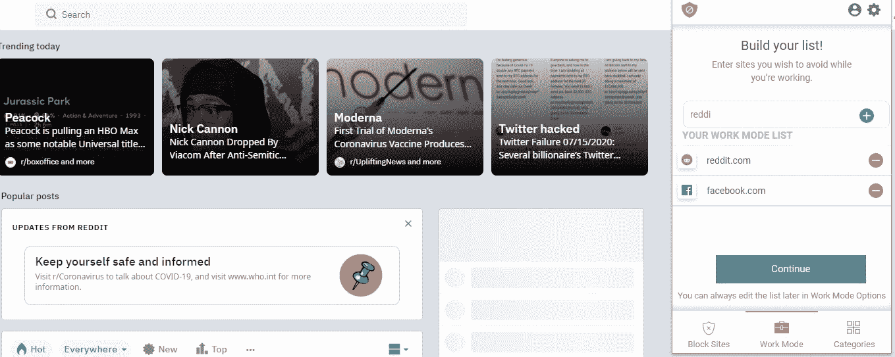

Adding sites to BlockSite’s work mode


接下来，您可以设置工作和休息时间间隔。默认情况下，它被设置为 25 分钟的番茄工作法间隔，然后是 5 分钟的休息。您也可以将其设置为 8 小时工作日。

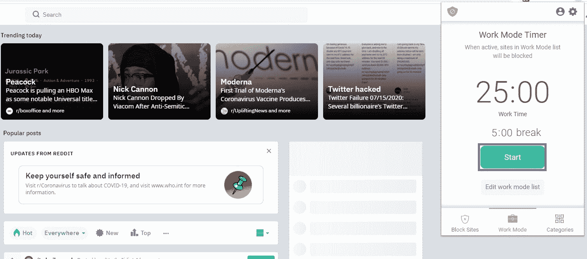

Work mode timer start


为了完成更多的工作，看看我们为 WordPress 用户列出的[最佳 Chrome 扩展列表，以提高工作效率。](https://kinsta.com/blog/best-chrome-extensions/)


## 如何在 Chrome 上屏蔽一个没有扩展名的网站

不想用 Chrome 扩展来屏蔽网站？您可以利用另外两种方法完全阻止网站:

1.  只要你是管理员，你就可以通过编辑主机文件来限制对网站的访问。
2.  您可以在路由器级别阻止网站，阻止您的孩子(或员工)在任何连接 wifi 的设备上访问令人分心的网站。

### 1.阻止网站编辑主机文件

在 Windows 中，你可以使用所谓的“主机文件”来屏蔽 Chrome 和所有其他网络浏览器的网站。

它位于以下文件夹:`C:\Windows\system32\drivers\etc`

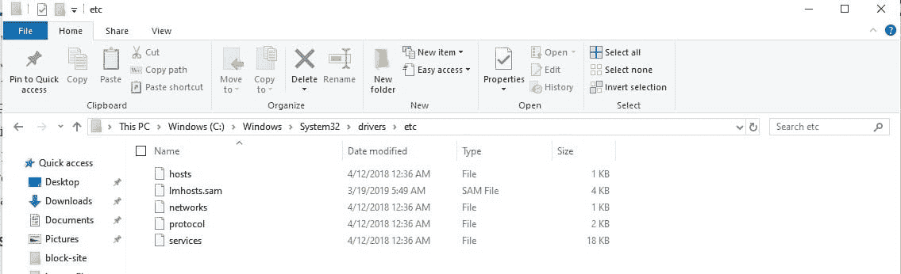

Windows file explorer


确保用记事本或其他基本的[文本编辑器](https://kinsta.com/blog/best-text-editors/)打开 hosts 文件。

从这里开始，您需要在想要阻止的任何域前面添加带有您的[本地主机 IP](https://kinsta.com/knowledgebase/what-is-localhost/) 的行，如下所示:

`127.0.0.1 www.netflix.com`
T1】

在以#开头的最后一个注释行之后添加新的代码行。确保本地主机 IP 地址和网站域名之间有一个空格。

现在按 CTRL+S 或者从菜单中手动保存来更新文件(不要*而不是*用. txt 扩展名保存文件)。

如果出现不允许您保存更改的提示，您可能需要重置文件权限。为此，右键单击该文件，并从下拉菜单中选择“属性”链接。

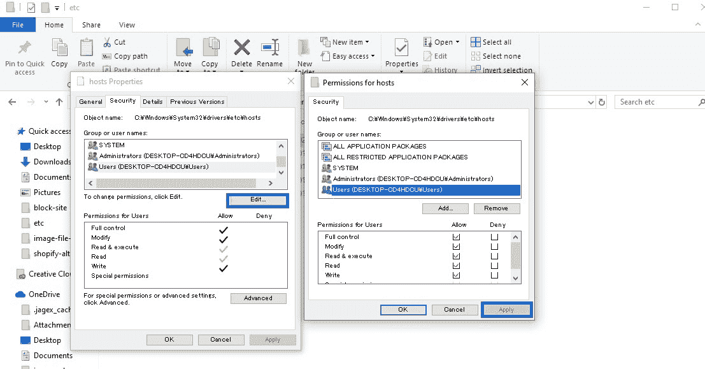

Hosts file permissions in Windows


授予您的用户完全控制权限，然后单击应用。现在你应该能够编辑文件内容并保存它。

再次尝试保存文件，应该会成功。既然你已经保存了文件，是时候来看看真相了。

打开 Chrome，尝试访问一个被屏蔽的网站。

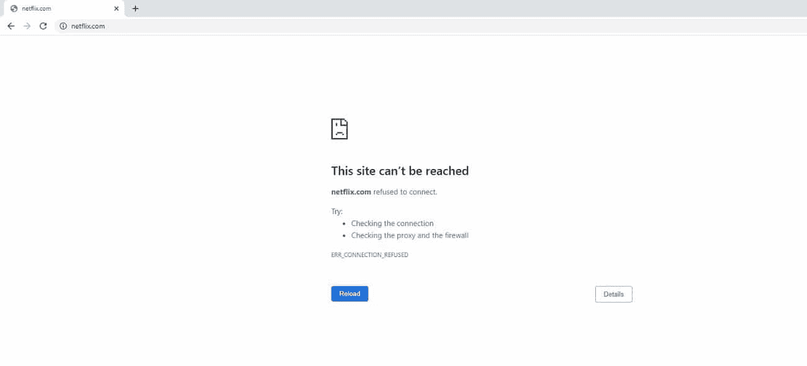

Netflix blocked by hosts file


如果你做的一切都是正确的，你应该不能从任何浏览器访问列表中的任何网站。你甚至不能开始加载页面。

对于 macOS 用户来说，事情并没有太大的不同。你应该这么做。

打开你的终端，输入下面的[命令](https://kinsta.com/blog/ssh-commands/):

```
sudo nano /etc/hosts
```

然后，将光标移动到最后一行，并按照以下结构添加您想要阻止的所有网站:

```
127.0.0.1 www.apple.com
```

添加完所有网站后，保存编辑并退出文件。为了确保所有的更改都已实现，您可能需要[刷新您的 DNS 缓存](https://kinsta.com/knowledgebase/flush-dns/#macos)。

### 2.使用您的路由器阻止网站(Mac 和 Windows)

如果您的路由器具有阻止网络上的网站的功能，您可以使用它来阻止 Chrome 和其他浏览器中的网站。事实上，它还会屏蔽任何连接 wifi 的设备上的网站，包括平板电脑和手机。

许多路由器使用 192.168.1.1 作为它们默认的 [IP 地址](https://kinsta.com/blog/dedicated-ip-address/)，但情况并非总是如此，所以你需要确认它们的地址。

## 注册订阅时事通讯


### 想知道我们是怎么让流量增长超过 1000%的吗？

加入 20，000 多名获得我们每周时事通讯和内部消息的人的行列吧！

[Subscribe Now](#newsletter)

你需要做的第一件事是**找到你的路由器的 IP 地址**，这样你就可以访问设置。

要在 Mac 电脑上查找路由器的 IP 地址，请通过点按 Mac 图标打开“系统偏好设置”。接下来，打开网络窗口。

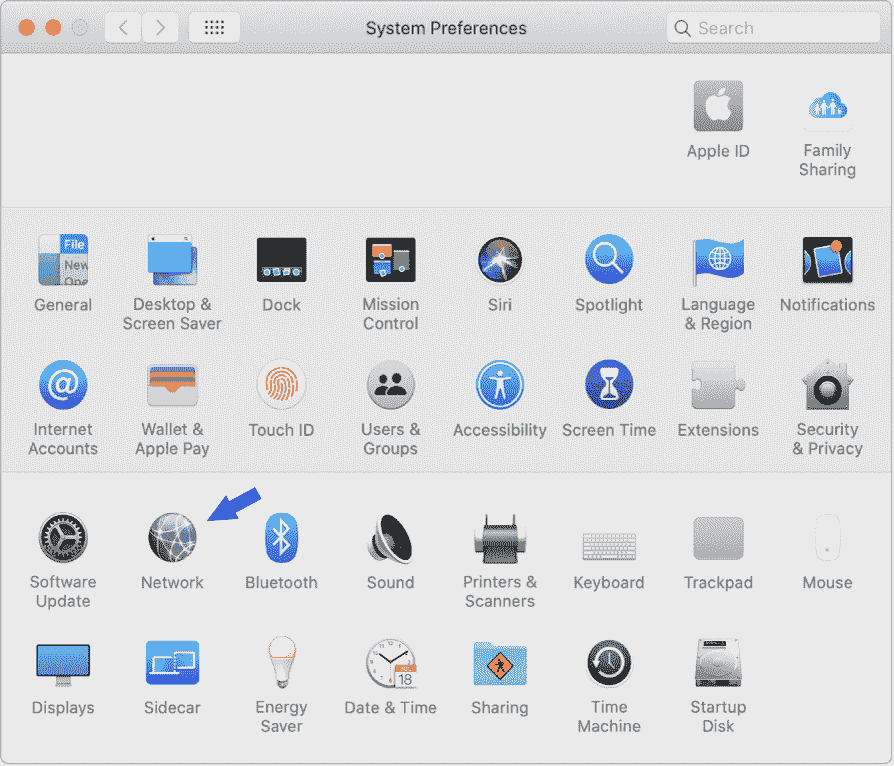

Network settings on Macs


从这里开始，你需要选择相关的连接，可以是 wifi，也可以是以太网，你可以在状态下看到 IP 信息。

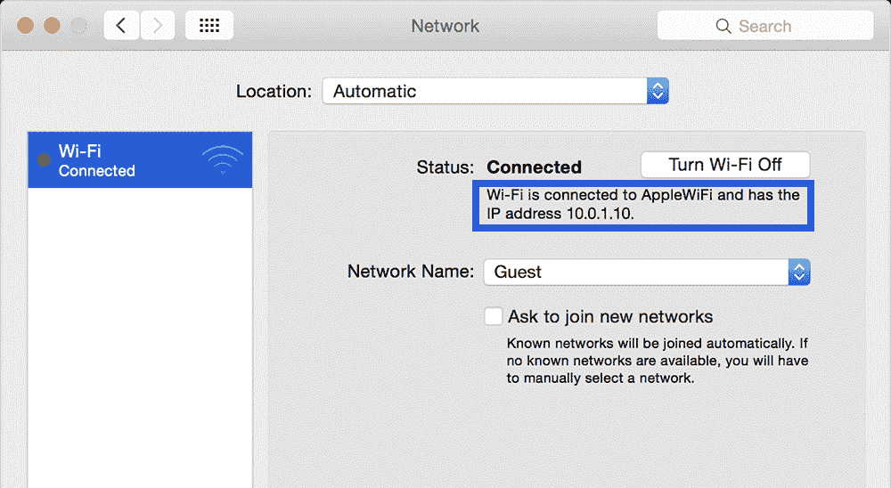

IP address


将该地址复制并粘贴到您的浏览器中，以访问您的路由器。

你有 Windows 电脑吗？以下是如何找到你的路由器 IP。

在 Windows 电脑上，您可以通过搜索“cmd”并按 enter 键来打开命令提示符。

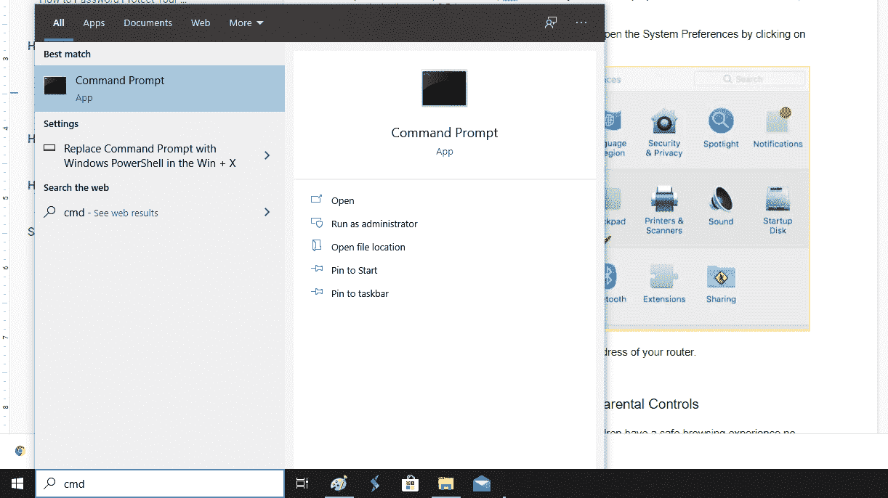

Windows Command prompt


打开后，键入“ipconfig”并按回车键。您将在“默认网关”下看到您路由器的地址。

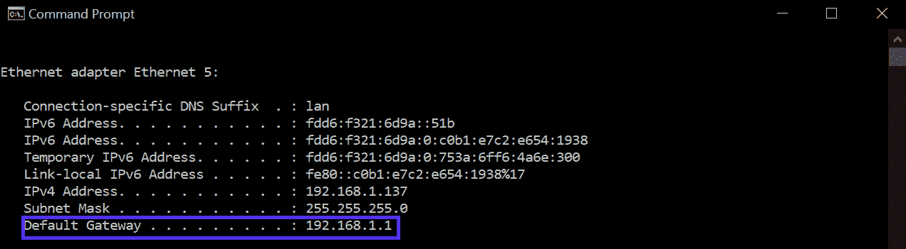

Default gateway


将该地址复制并粘贴到您的浏览器中，以访问您的路由器。

接下来，您需要编辑您的路由器设置。

为此，您需要路由器的管理员登录信息。如果您没有更改它，它会写在路由器的文档/包装盒上。

在 Chrome 中复制并粘贴地址，你会看到一个管理员登录提示。

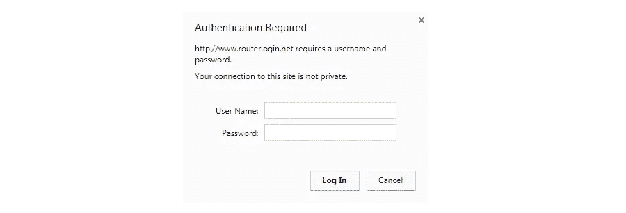

Example of a router login prompt


最后的步骤取决于您的路由器。例如，Netgear 路由器在安全选项卡下阻止了站点设置。

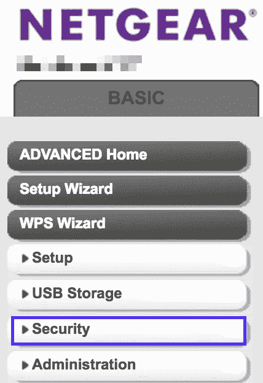

Router security settings


从那里，你可以向下滚动到“阻止网站”部分，通过关键字或域名来阻止网站。

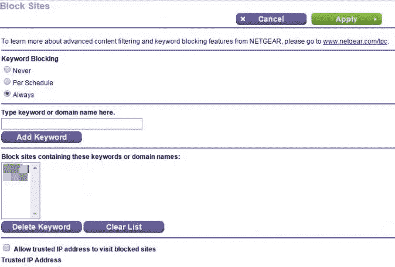

Block sites with your router settings


在字段中键入域名，单击添加关键字按钮，您将通过路由器成功阻止该网站。


## 如何在 Chrome(手机)上屏蔽一个网站

与台式电脑不同，这里不同设备的方法不完全相同。iPhone 提供了更好的原生隐私设置，这意味着你不需要一个应用程序来阻止网站。

因此，下面我们有一个 Android 手机部分和一个 iPhones 部分。

### 如何屏蔽 Android 上的网站

在 Android 手机上屏蔽网站最简单的方法是使用 BlockSite 应用程序。首先，你需要在谷歌 Play 商店中搜索并[安装 app](https://play.google.com/store/apps/details?id=co.blocksite&hl=en_US) 。

与宕机和 WordPress 问题做斗争？Kinsta 是一款考虑到性能和安全性的托管解决方案！[查看我们的计划](https://kinsta.com/plans/?in-article-cta)

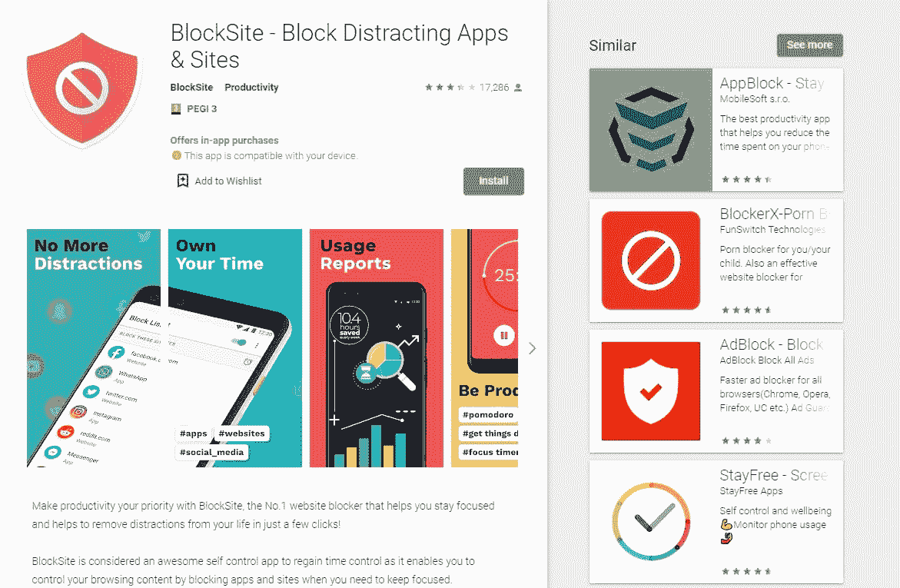

BlockSite android app


然后，您需要编辑您的辅助功能设置，以授予应用程序访问权限(应用程序将引导您完成这一步)。在大多数手机上，屏蔽网站部分位于设置的底部。

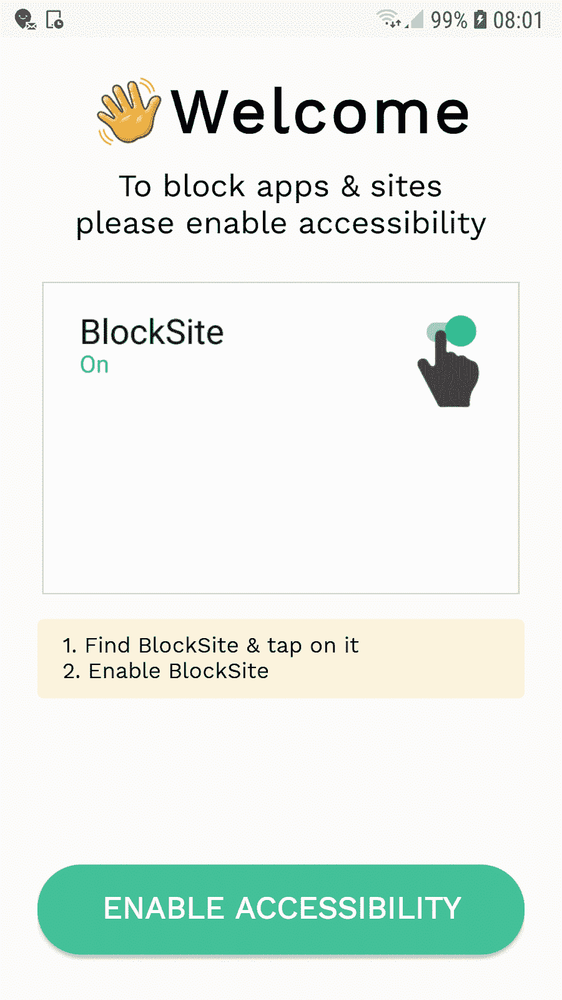

BlockSite app accessibility


完成后，你就可以开始屏蔽手机上的网站了。

单击加号开始阻止您的第一个站点。

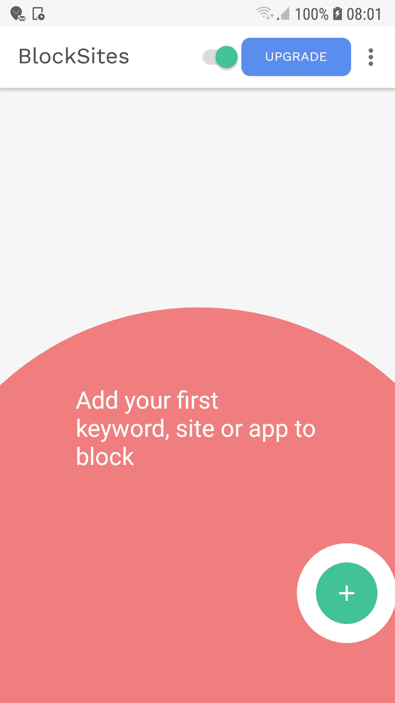

Blocking your first site


搜索关键词或域名，然后选择要阻止的网站或应用。

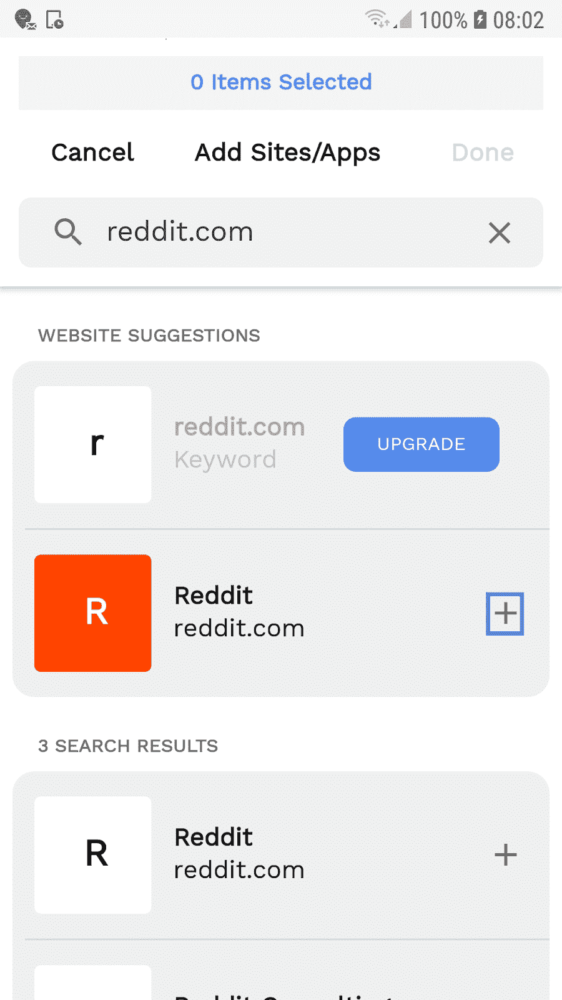

Adding sites to block


选择站点后，轻按“完成”以保存您的设置。

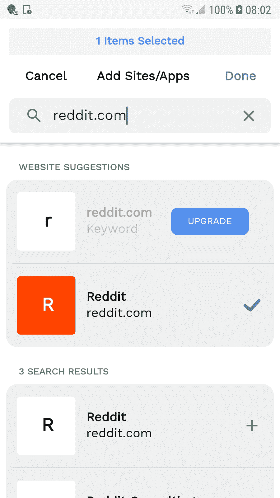

Blocking a new site on Chrome (mobile)


你现在已经正式屏蔽了你在 Android 上的第一个站点。

如果你试图访问一个被屏蔽的网站，你会看到和你的台式电脑一样失望的小狗。

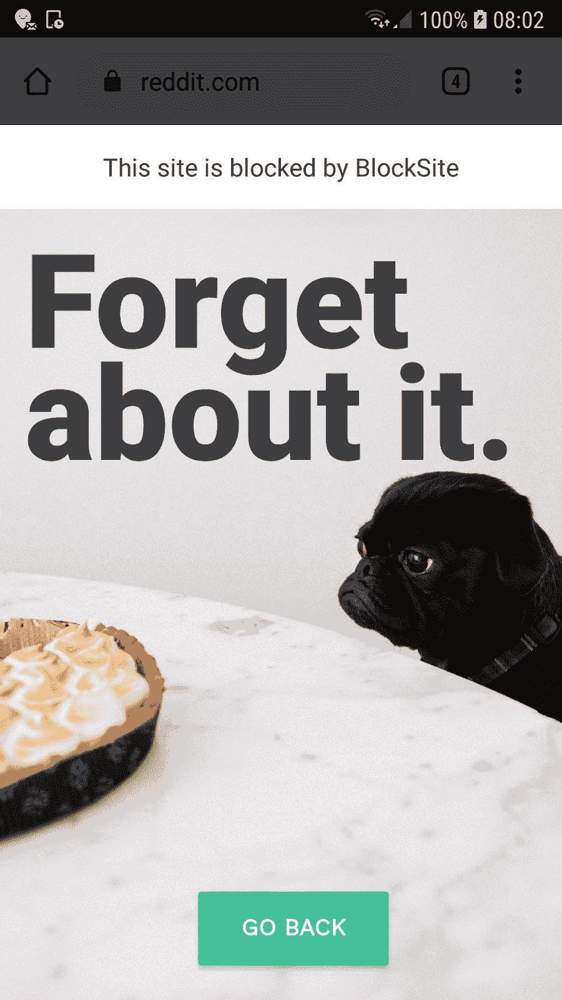

Blocked site message


### 如何在 iOS 上屏蔽网站

如果你有一个较新的 iPhone 型号，你甚至不需要安装一个应用程序来开始屏蔽网站。你可以在 iPhone 设置中进行设置。

首先，转到常规手机设置屏幕，向下滚动到底部，并点击屏幕时间链接。

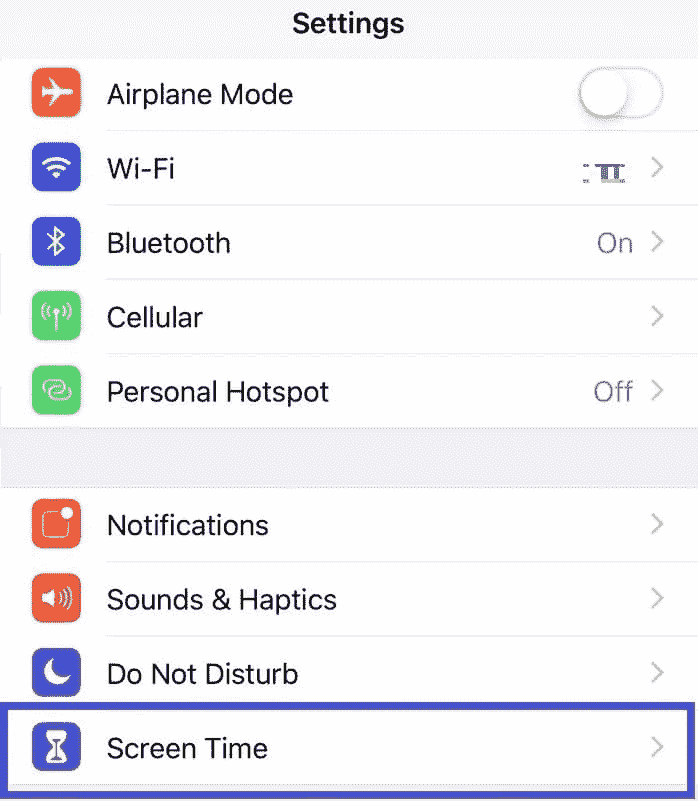

iPhone’s screen time option


接下来，向下滚动并点击“内容和隐私限制”链接。

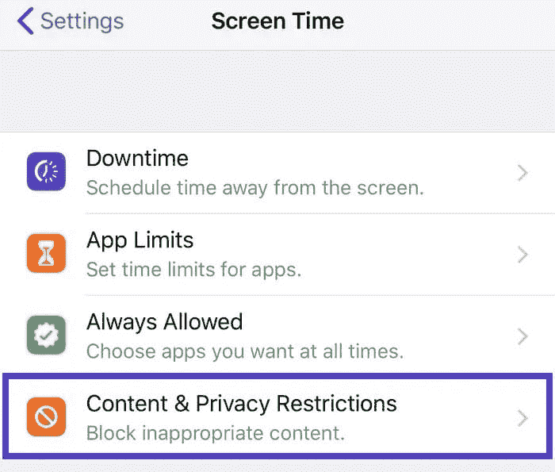

iPhone settings – content & privacy


接下来，向下滚动内容限制设置，直到找到“网络内容”选项卡并点击它。

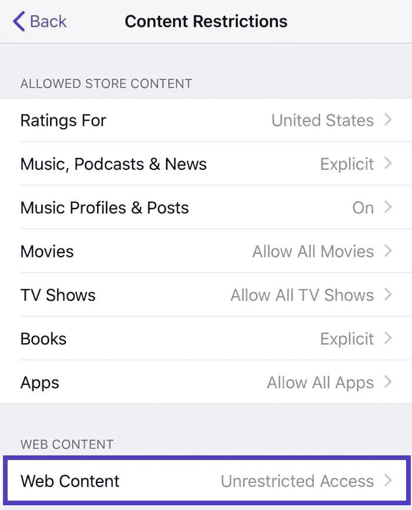

Content restrictions on iOS


从这里，您可以选择一个可用选项:

*   无限制访问
*   有限的成人网站
*   仅允许的网站

选择“限制成人网站”选项，您可以开始添加特定的网站，以永远不允许。

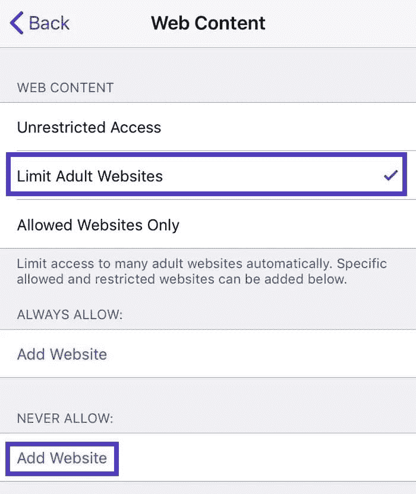

Limiting website access in iOS


当您将网站添加到列表中时，您甚至无法开始加载它们，无论是连接到您的家庭 wifi 还是数据计划。

## 如何在 Chrome 浏览器中阻止通知

屏蔽网站只是事情的一半，因为通知也会扰乱(并破坏)你的工作效率。所以我们来看看如何在 Chrome 中阻止它们。

要阻止通知，您不需要扩展或编辑任何文件或操作系统设置。

你可以在 Chrome 的一般隐私设置中屏蔽来自网站的[推送通知](https://kinsta.com/blog/wordpress-push-notifications/)。您可以通过以下网址立即进入该页面:`chrome://settings/content/notifications`或导航至设置屏幕并点击**隐私和安全**。

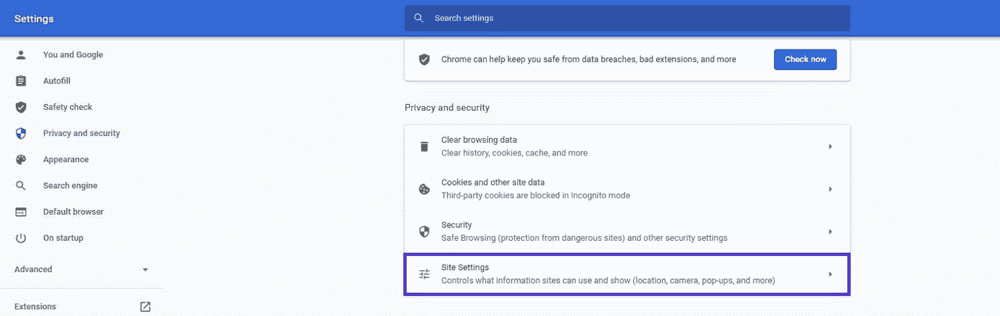

Block notifications in Chrome


接下来，转到“站点设置”并点击通知页面。

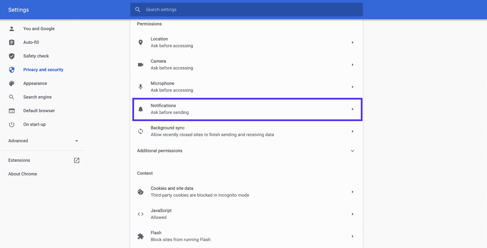

Chrome settings – notifications


现在，您可以完全阻止网站请求发送通知的权限，也可以通过 URL 阻止单个网站。

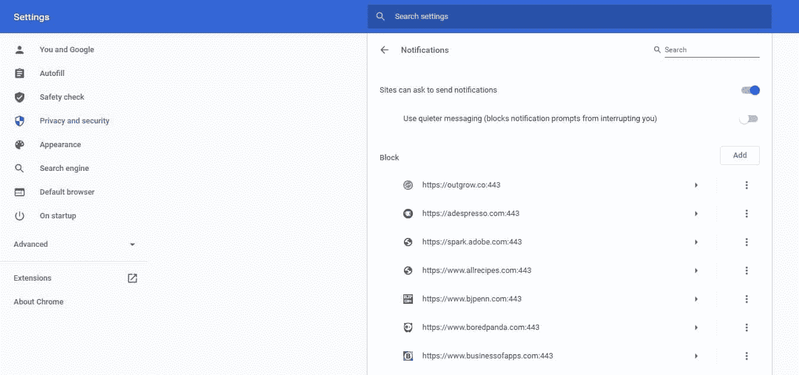

Block notifications from websites 


### 阻止 Chrome Mobile 上的通知

移动版 Chrome for iOS(iphone 和 iPad)默认关闭了通知功能，所以没有通知设置，也不需要编辑。

而在 Android 上，屏蔽通知甚至比桌面版更容易。下面是怎么做的。

打开 Chrome，点击角落的更多按钮，向下滚动，点击设置链接。

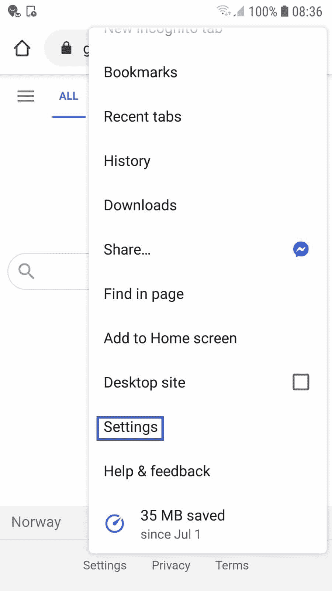

Chrome mobile settings


在那里，向下滚动并单击通知链接。

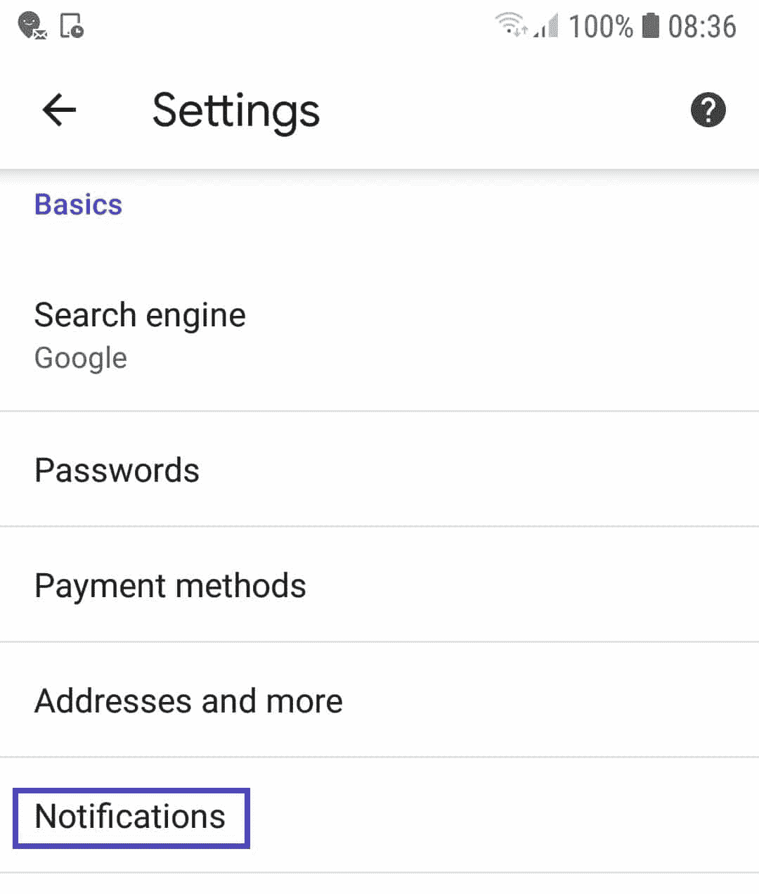

Notifications settings


从这里，你可以关闭所有应用程序通知(包括所有网站)与一个单一的点击。

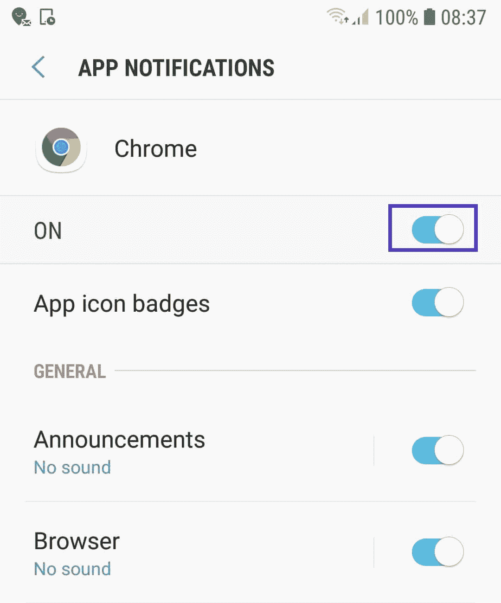

Enabling/disable notifications in Chrome


如果您想要阻止来自特定站点的通知，您可以向下滚动到站点部分，然后点击有问题的站点旁边的按钮。

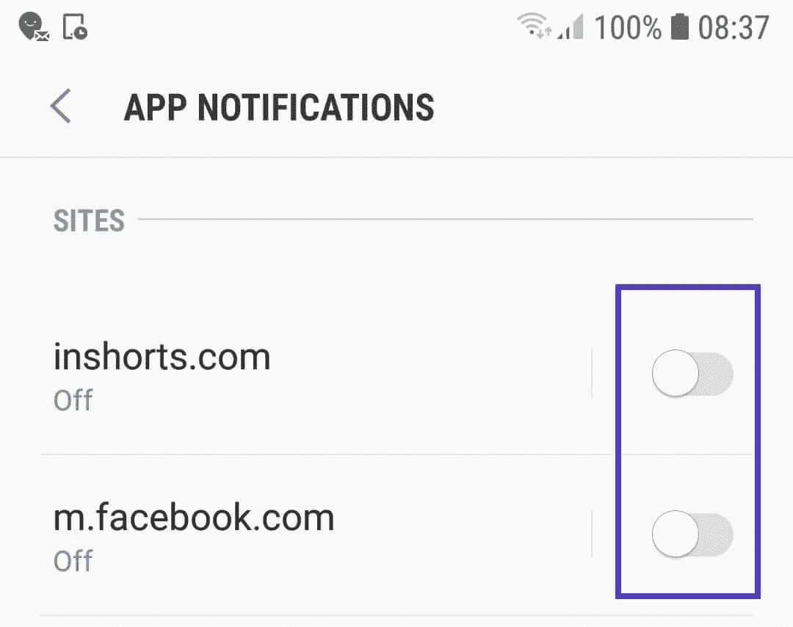

Blocking notifications from specific websites


[Whether you want to block websites for yourself or your children, this guide has you covered. ❌Click to Tweet](https://twitter.com/intent/tweet?url=https%3A%2F%2Fkinsta.com%2Fblog%2Fhow-to-block-a-website-on-chrome%2F&via=kinsta&text=Whether+you+want+to+block+websites+for+yourself+or+your+children%2C+this+guide+has+you+covered.+%E2%9D%8C&hashtags=Productivity%2Cwptips)

## 摘要

你的工作取决于你能交付什么，而不是你坐在电脑前的时间。

这就是为什么你应该试着帮助自己，把分心的事情减到最少。如果你按照本指南中的步骤操作，你可以在任何你想要的设备上轻松屏蔽 Chrome 上的网站。您将不再被电脑、手机或平板电脑上的干扰所困扰。

现在轮到你了:如何防止分心破坏你的工作流程？您正在使用哪些应用程序？在评论区分享吧！

* * *

让你所有的[应用程序](https://kinsta.com/application-hosting/)、[数据库](https://kinsta.com/database-hosting/)和 [WordPress 网站](https://kinsta.com/wordpress-hosting/)在线并在一个屋檐下。我们功能丰富的高性能云平台包括:

*   在 MyKinsta 仪表盘中轻松设置和管理
*   24/7 专家支持
*   最好的谷歌云平台硬件和网络，由 Kubernetes 提供最大的可扩展性
*   面向速度和安全性的企业级 Cloudflare 集成
*   全球受众覆盖全球多达 35 个数据中心和 275 多个 pop

在第一个月使用托管的[应用程序或托管](https://kinsta.com/application-hosting/)的[数据库，您可以享受 20 美元的优惠，亲自测试一下。探索我们的](https://kinsta.com/database-hosting/)[计划](https://kinsta.com/plans/)或[与销售人员交谈](https://kinsta.com/contact-us/)以找到最适合您的方式。