# 如何在 Pinterest 上申请你的网站以解锁更多功能

> 原文：<https://kinsta.com/blog/how-to-claim-website-on-pinterest/>

Pinterest 帮助数百万企业主[向他们的网站](https://kinsta.com/blog/wordpress-seo/)发送更多流量，但你知道吗，当你学会如何在 Pinterest 上宣称你的网站时，你可以解锁其他几个工具，如[高级分析](https://kinsta.com/help/mykinsta-analytics/)，访问 Pinterest 广告，以及其他 [Pinterest 开发/营销工具](https://kinsta.com/blog/pinterest-marketing/)？

在 Pinterest 上“认领”你的网站是一个简单的过程，证明你实际上是你网站的所有者，并且你想解锁更多的商业工具以获得更大的曝光率。

## **在 Pinterest 上申请网站的好处**

如果你想知道为什么要麻烦地在 Pinterest 上验证你的网站，我们想解释一下这样做后你会得到的一些主要好处。

总的来说，Pinterest 网站认领流程类似于你如何在 Google 上[验证](https://kinsta.com/blog/google-site-verification/) [所有权](https://kinsta.com/blog/google-site-verification/)[IP](https://kinsta.com/blog/google-site-verification/)[；这意味着保护实际的网站所有者免受试图控制他们在线状态的入侵者的攻击。它也给了你更多的权力来控制你的业务如何在线运作。](https://kinsta.com/blog/google-site-verification/)

以下是在 Pinterest 上申请网站的主要优势:

*   **改进的网络分析:**除了其他用户从你的商业账户中获得的信息，声称你的网站告诉这些用户如何[找到更多你的内容](https://kinsta.com/podcast/blogger-grew-6-figure-business/)，如果不验证你的网站，这两者都是不可用的。
*   **个人资料图片和关注按钮(丰富的大头针):**默认情况下，您的 Pinterest 个人资料图片不会出现在来自您网站的大头针旁边。验证不仅会将您的个人资料照片添加到所有这些 pin 中(即使共享了几十次)，还会包括一个关注按钮和一个到您网站的链接。
*   **潜在的验证勾号:**已验证的商家(在线商店的另一个验证过程)会在他们的个人资料旁边收到一个蓝色的勾号。常规验证(我们将在本文中向您展示如何进行)会收到一个红色的勾号。
*   **提高 SEO 的潜力:**从你的网站链接遍布 Pinterest 到你的网站会积累更多的反向链接，用 Pinterest [验证一个网站很有可能提升你的整体 SEO 努力](https://kinsta.com/blog/wordpress-seo/)。
*   **一个账户多个网站:** Pinterest 允许你认领几个网站，并把它们都放在同一个 Pinterest 账户下。
*   **在 Pinterest 上访问新的商业和开发者工具:**所有经过验证的商业账户都可以偷偷一瞥即将推出的、可能不向公众开放的新功能。
*   **访问 Pinterest 广告:**所有经过验证的商业账户都可以制作广告，运行广告，并使用[强大的统计数据进行分析](https://kinsta.com/affiliate-academy/affiliate-marketing-statistics/)。

[Level up your bsuiness with a little help from Pinterest 📌Click to Tweet](https://twitter.com/intent/tweet?url=https%3A%2F%2Fkinsta.com%2Fblog%2Fhow-to-claim-website-on-pinterest%2F&via=kinsta&text=Level+up+your+bsuiness+with+a+little+help+from+Pinterest+%F0%9F%93%8C&hashtags=Pinterest%2CSmallBiz)

## **如何在 Pinterest 上申请网站(分步说明)**

在开始在 Pinterest 上进行网站验证之前，请仔细阅读以下列表，以确保你们都有资格进行验证，并为该过程做好准备。

> 需要在这里大声喊出来。Kinsta 太神奇了，我用它做我的个人网站。支持是迅速和杰出的，他们的服务器是 WordPress 最快的。
> 
> <footer class="wp-block-kinsta-client-quote__footer">
> 
> 
> 
> <cite class="wp-block-kinsta-client-quote__cite">Phillip Stemann</cite></footer>

[View plans](https://kinsta.com/plans/)

### **开始前要做的事情**

1.  **确保你拥有一个域名:**要在 Pinterest 上申请一个网站，你[必须拥有一个域名](https://kinsta.com/blog/how-to-buy-a-domain-name/)、子域或子路径域。一个二级域名是这样的:example.com；像这样的一个[子域](https://kinsta.com/blog/wordpress-subdomain/):blog.example.com；还有一个像这样的子路径:example.com/store.
2.  **决定您的验证方法:**我们将介绍以下 4 种方法。每种方法要么使用[一个 HTML 标签](https://kinsta.com/blog/xml-vs-html/)、 [HTML 文件](https://kinsta.com/knowledgebase/how-to-upload-html-file-to-wordpress/)，要么使用 [TXT 记录](https://kinsta.com/help/mailchannels-spf-txt-record/)。所有这些都需要最少的技术知识，即使你对 HTML、meta 标签或 [DNS 记录](https://kinsta.com/help/dns/)一无所知，也可以完成。
3.  **升级到 Pinterest 商业账户:**这不是必需的，但强烈建议这样做。申请网站的全部目的是获得额外的商业工具，所以如果[你在经营一家企业](https://kinsta.com/podcast/invest-in-your-business/)，你可以用一个真正的 Pinterest 商业账户解锁更多功能。

#### **如何辨别您的账户是企业账户还是个人账户**

通过打开您的个人资料，快速确定您是否拥有个人或商业 Pinterest 帐户。账户类型会在几个明显的区域列出，包括左上角的标题(紧挨着 Pinterest 徽标)和点击右上角的账户下拉菜单(向下的插入符号图标)。你会看到“**业务**”或“**个人**”，这取决于你有什么。

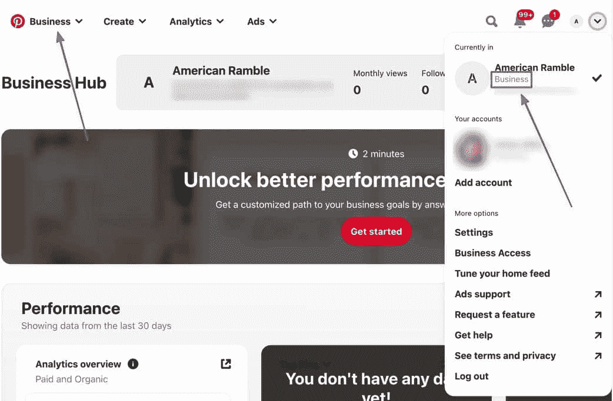

The “Business” text is located in several places on your profile.

如果您有个人账户，需要将其转换为企业账户，请进入添加账户页面，然后选择**创建免费企业账户**。这允许您将个人帐户转换为企业帐户，或者将单独的企业帐户页面链接到个人帐户。

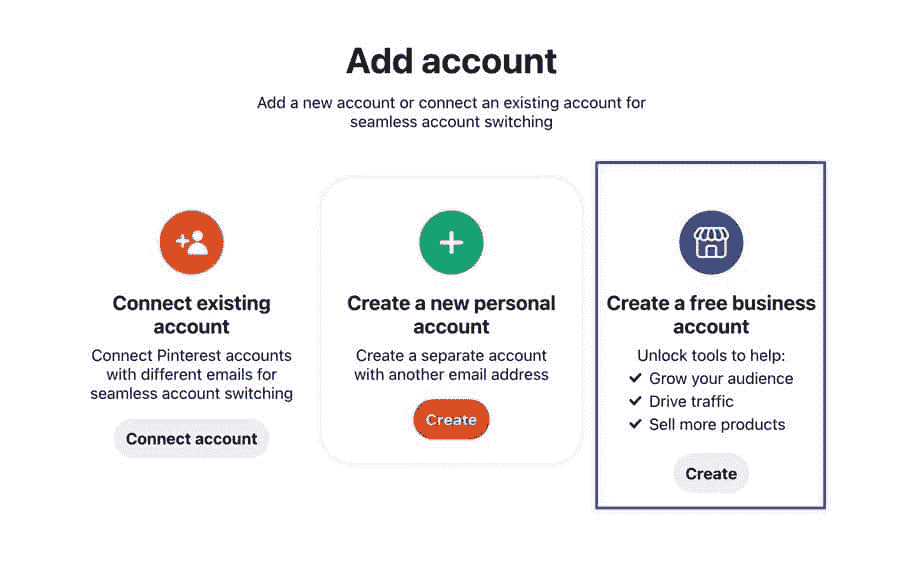

Option on Pinterest to create a free Business account.

## **如何在 Pinterest 上维护自己的网站(4 种简单方法)**

使用以下分步教程快速在 Pinterest 上申请您的网站。

### **方法 1:在 WordPress 上添加一个 HTML Meta 标签**

HTML 标签包含解释网站上可用内容的数据。显示你拥有一个网站的方法之一是在你网站的一个文件中放置一个 HTML meta 标签。然后，标签会读取你的网站内容，并向 Pinterest 发送一个通知，告诉它在你网站的代码中。

这作为验证选项的原因是，只有网站的所有者才能访问源代码。

#### **第一步:转到设置**

导航到 Pinterest 个人资料的右上角，点击**向下插入符号(v)** 按钮，显示下拉菜单。从列表中选择**设置**。

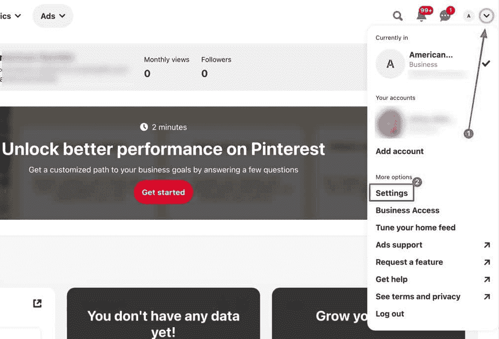

Select the downward-facing caret icon and click on Settings.

#### **第二步:到部门认领账户**

打开**声称的** **账户**标签，然后查看是否已经有任何网站列在**声称的** **账户**部分下。如果你这样做了，你就不必经历这个过程。或者你可能需要删除旧网站。

要继续申请你的 WordPress 站点，点击**申请**按钮。

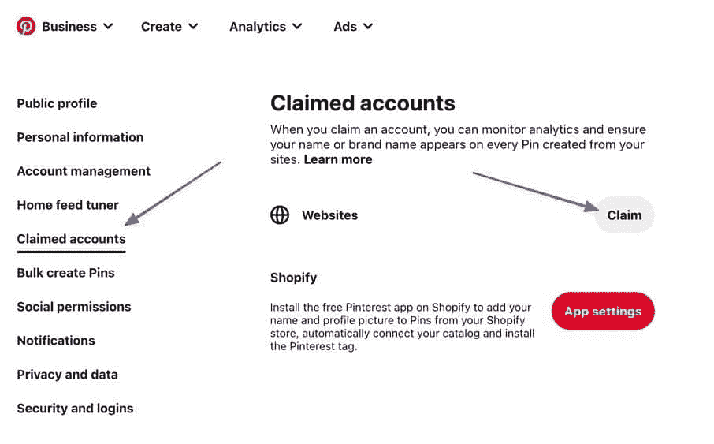

Click on the Claim button under Claimed Accounts.

#### **第三步:复制 HTML 元标签**

一个弹出窗口显示了三个声明你的网站的选项，其中之一是**添加 HTML 标签**。这是用于该方法的选择。单击列出的代码，将其全部复制到剪贴板。

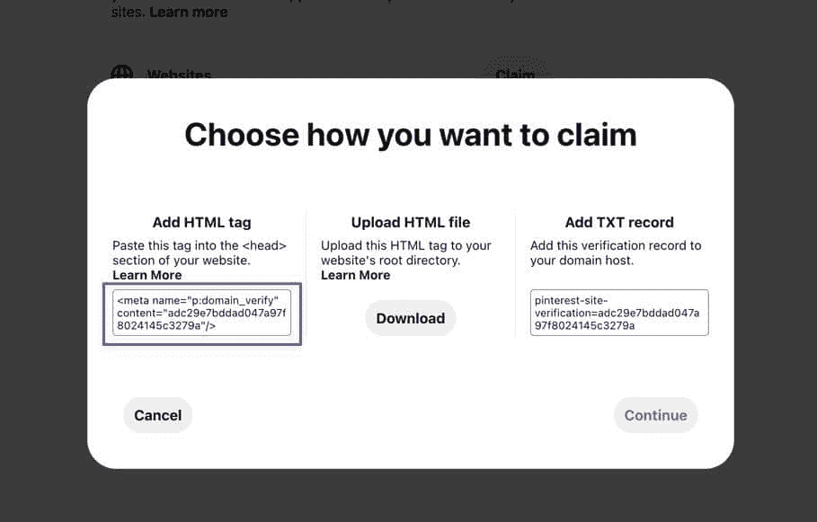

Copy the HTML tag.

点击**继续**按钮继续。

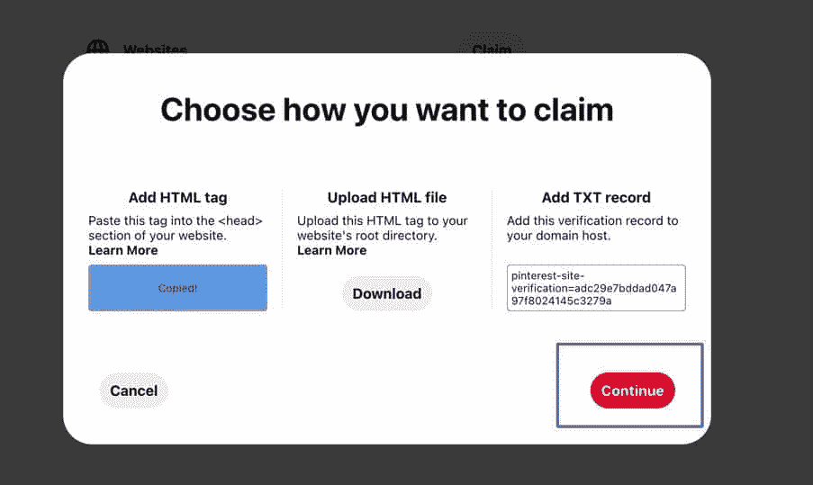

Click Continue.

#### 步骤 4:将 HTML 标签粘贴到你的 WordPress 网站的 header.php 文件中

Pinterest 要求你将这段代码(HTML 标签)粘贴到你的**header.php**文件中。为了访问 header.php 的**，你必须[使用 SFTP](https://kinsta.com/help/connecting-with-sftp/) 和 FTP 客户端连接到你的 WordPress 站点文件。在本教程中，我们将使用 [FileZilla](https://filezilla-project.org/) ，但是有[许多著名的 FTP 客户端可供选择](https://kinsta.com/blog/best-ftp-clients/)。**

一旦通过 SFTP 链接到你的 WordPress 站点文件，通过打开你的核心站点文件(通常是`/yoursitename`或`/www`)浏览文件目录，然后你可以去`/public > /wp-content > /themes`。

最后，打开以你的[活动主题](https://kinsta.com/blog/fastest-wordpress-theme/)命名的文件夹；对于本教程，我们使用的是[221 主题](https://kinsta.com/blog/twenty-twenty-one-theme/)，所以文件是**/221**。

在你的主题文件夹中找到 header.php 的文件。选择 FTP 客户端中可用的**查看/编辑**选项；对于 [FileZilla](https://kinsta.com/knowledgebase/filezilla-show-hidden-files/) ，你可以右击该文件并选择**查看/编辑**。

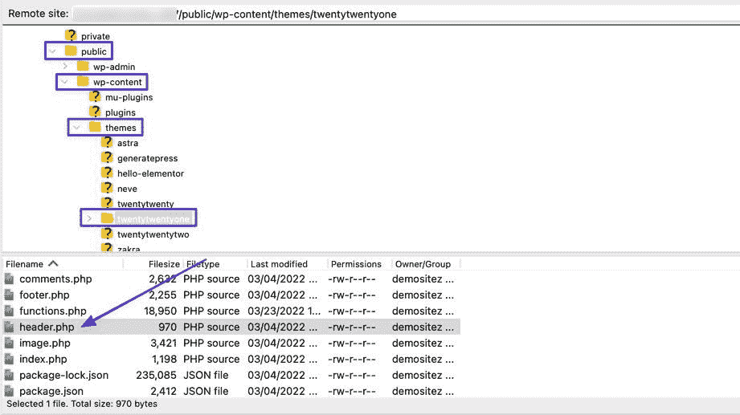

Find header.php and right click to Edit the file.

这将在您选择的文本编辑器中打开**header.php**文件。找到`(打开)和`(关闭)元件。您希望将 Pinterest HTML 标记粘贴到这些元素中。``

 ``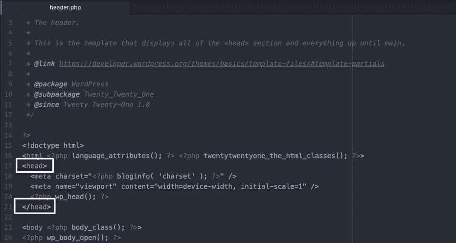

Theandelements in header.php.

把你之前复制的代码粘贴到**header.php**文件中。通常最好将它粘贴在`元素之前，这样就不会弄乱任何其他代码。`

 `请确保保存该文件并覆盖 FTP 客户端中的前一个文件。这会将 HTML 标签保存到您的网站。

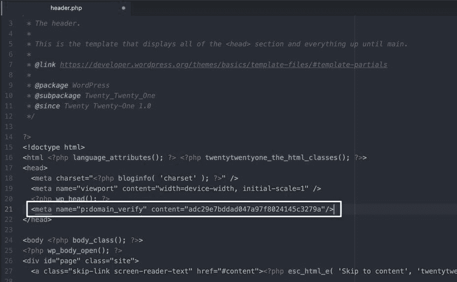

Paste the HTML tag between the head elements and save the file.

#### **第五步:在 Pinterest 上验证你的网站**

在你的网站上有一个活跃的 HTML 标签，回到 Pinterest。你现在可以粘贴你的 WordPress URL 并点击**验证**按钮。

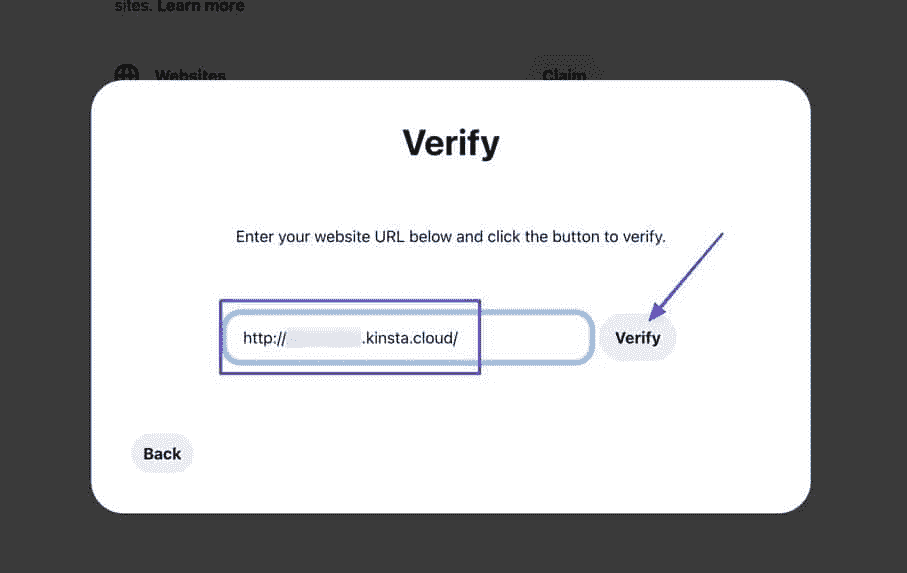

Paste in your WordPress URL and click Verify.

如果一切正常，您应该会看到一条上面带有绿色勾号的**“Connected”**消息。这就是你要做的！点击**完成**按钮。

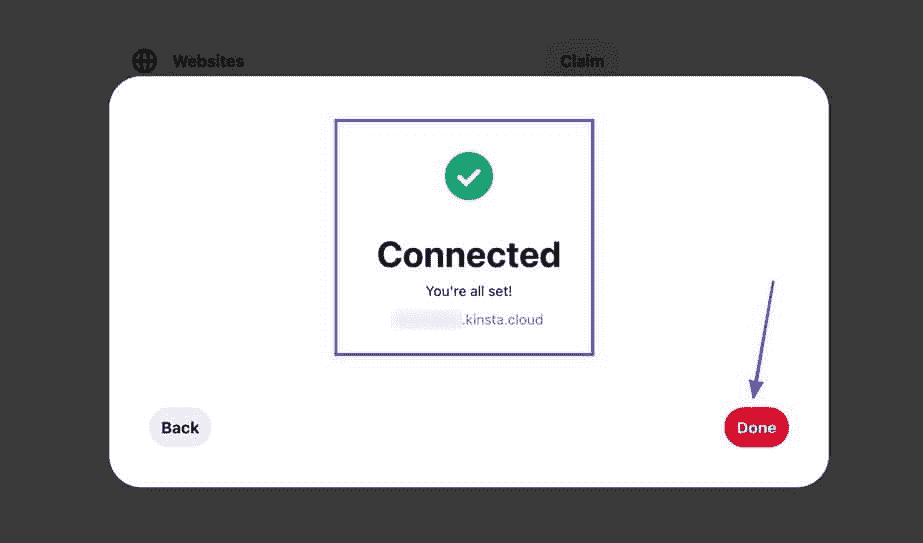

The “Connected” message confirms the verification.

#### **第六步:在 Pinterest 上查看你的声明网站列表**

既然您已经申请了该帐户，那么我们在本文前面讨论的所有好处都是可用的。你也可以在 WordPress 的**声明账户**部分看到这个网站。

The verified site listed under the Claimed Accounts section in Pinterest.

### **方法二:使用 HTML 文件**

下一个方法使用 HTML 文件，而不是 HTML 标签。不同之处在于，你将把整个文件上传到你的网站目录，而不是用一段代码更新当前文件。

事实上，你在这个方法中上传的[文件实际上包含一个 HTML 标签](https://kinsta.com/knowledgebase/how-to-upload-html-file-to-wordpress/)，就像在前面的方法中使用的一样，所以它是相同类型的验证，但是在你添加标签到你的站点的方式上有所不同。

#### **第一步:转到 Pinterest 上的认领账户部分**

首先，转到**向下插入符号(v)** 按钮并选择**设置**。勾选**认领账户**选项卡，然后点击**认领**按钮。

Go to Settings > Claimed Accounts > Claim.

#### **第二步:将 HTML 文件下载到你的电脑上**

寻找第二个选项**上传 HTML 文件**。点击**下载**按钮。这将下载一个 HTML 文件，您可以将它放在计算机上的任何位置。它的名字以“Pinterest”开头，但是你可以根据自己的参考调整这个名字。

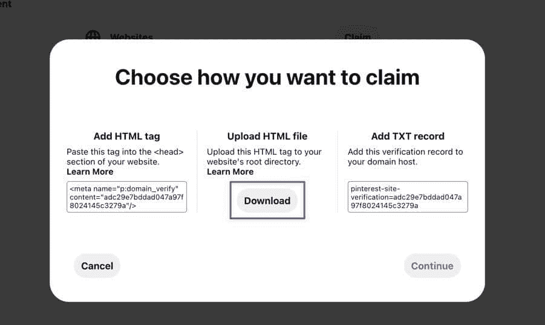

Click the Download button.

#### **第三步:使用 FTP 客户端将 HTML 文件转移到网站的服务器上**

使用你选择的 FTP 客户端(我们用的是 FileZilla)，在你的本地站点上找到 Pinterest HTML 文件，并把它拖到你的 WordPress 站点的根文件夹中。

“根”文件夹因平台而异，但对于 WordPress，通常是 **/public** 文件夹。在传输之后，FTP 客户端自动将文件保存到你的 WordPress 文件中。

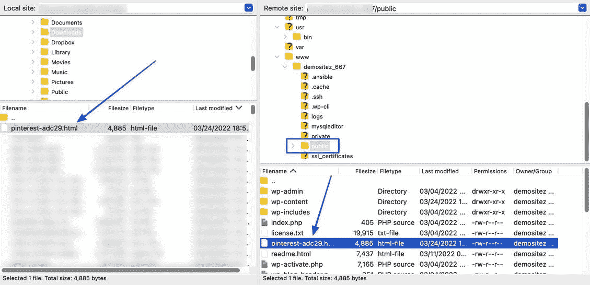

Drag the Pinterest HTML file from the local server (your computer) to the root folder on your host server (remote site).

#### **第四步:在 Pinterest 上验证 HTML 文件**

返回 Pinterest，从之前访问的弹出菜单中点击**继续**按钮。

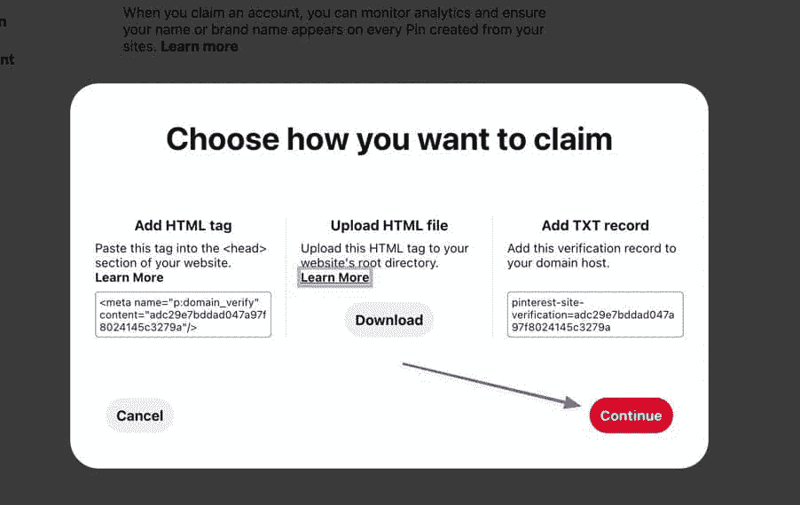

Click Continue.

要完成验证，请粘贴您网站的 URL。点击**验证**按钮。

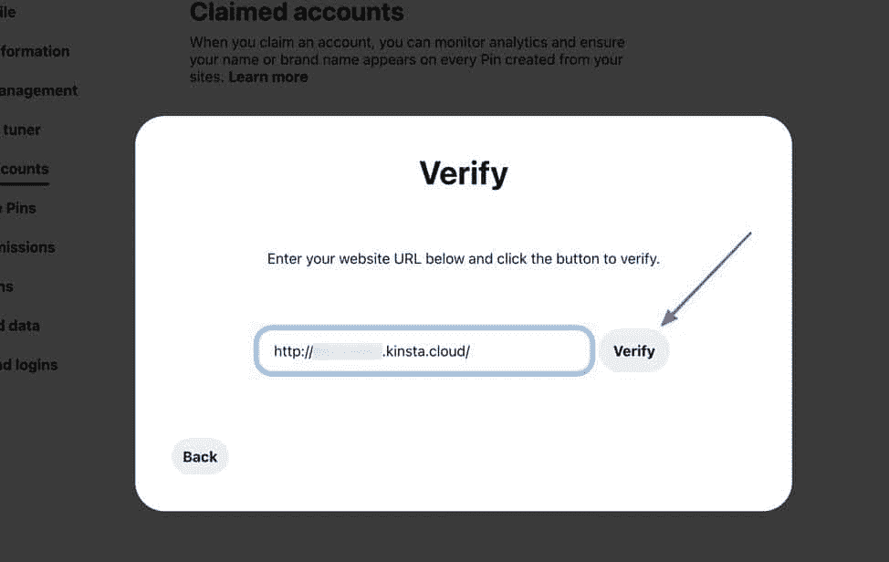

Click Verify.

寻找“已连接”信息和绿色勾号，以确认您已经认领了您的 Pinterest 网站！

The “Connection” text means you were successful in claiming your site.

### 重要的

如果用这种方法连接有问题，可能是因为您没有使用根文件夹。如前所述，你通常会期望 WordPress 站点使用`/public`作为根文件夹，但这不是保证。

### **方法 3:给你的域主机添加一个 TXT 记录**

这种方法是独一无二的，因为它不使用 WordPress 文件，而是使用你的 [DNS(域名服务)注册商](https://kinsta.com/blog/best-domain-registrar/)，你添加一个 TXT 记录，而不是 HTML 标签或文件。

在这个过程中，这意味着你必须登录到你的域名提供商帐户(这通常是你的主机提供商，但不总是)。

## 注册订阅时事通讯

### 想知道我们是怎么让流量增长超过 1000%的吗？

加入 20，000 多名获得我们每周时事通讯和内部消息的人的行列吧！

[Subscribe Now](#newsletter)

如果你是 Kinsta 的用户，并且[你已经通过 Kinsta 的免费 DNS 服务](https://kinsta.com/help/add-domain/)向你的账户添加了一个第三方域名，使用以下步骤将 Pinterest TXT 记录添加到 DNS 部分。

#### **第一步:导航至 Pinterest 中的索赔账户部分**

点击左上角的**向下插入符号(v)** 图标，启动流程。选择**设置**。导航到**认领账户**选项卡，点击**认领**按钮。

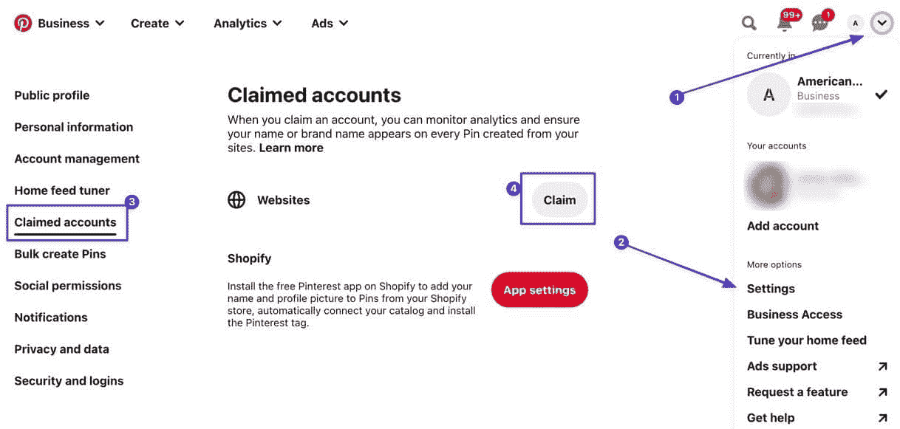

Go to the Claimed Accounts area in Pinterest.

#### **第二步:复制 TXT 记录**

使用名为**的选项添加 TXT 记录**，将记录复制到您的剪贴板，并点击**继续**按钮。

Copy the TXT record.

#### **步骤 3:登录您的 DNS 提供商账户**

转到您的[域名提供商的仪表板](https://kinsta.com/help/point-a-record-with-third-party-dns/)并登录您的仪表板。[添加一个新的 DNS TXT 记录](https://kinsta.com/help/dns/)并保存到你的账户。

在 MyKinsta 中，您可以通过进入 Kinsta DNS 并选择您想要使用的域来完成此操作。

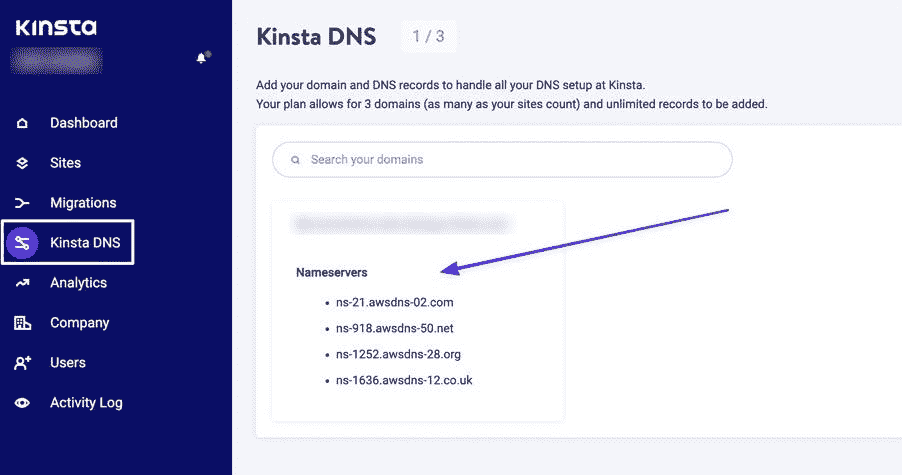

Select Kinsta DNS, then click on a domain name.

#### **第四步:添加新的 DNS TXT 记录**

向下滚动找到 **DNS 记录**部分。点击**添加一条 DNS 记录**按钮。

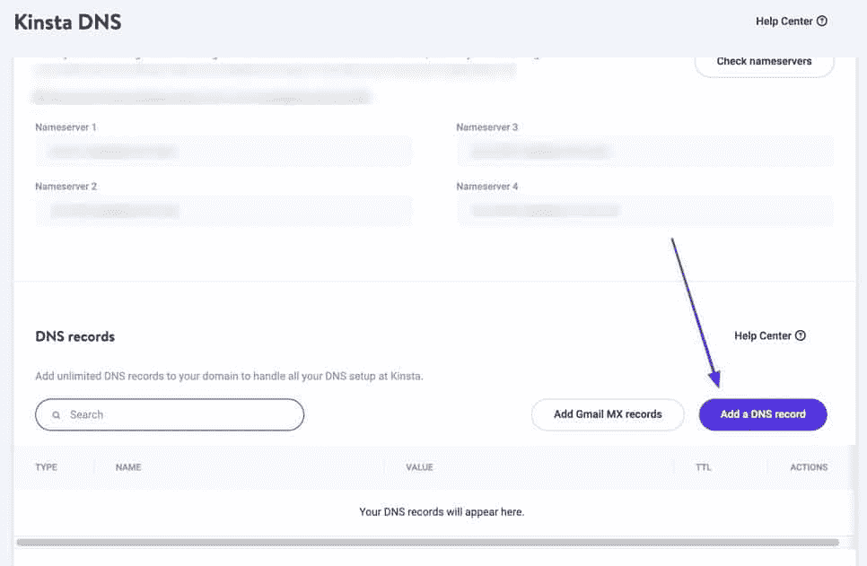

Add a DNS Record.

选择 **TXT** 选项卡。让**主机名**和 **TTL** 字段保持原样。将之前复制的 Pinterest TXT 元素粘贴到**内容**字段中。之后，点击**添加 DNS** 按钮。

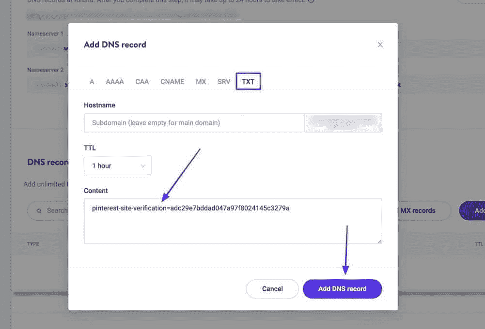

Paste the TXT record into the Content field, then click Add DNS Record.

现在，您应该看到 TXT 记录成功保存到您的 DNS 记录列表中。

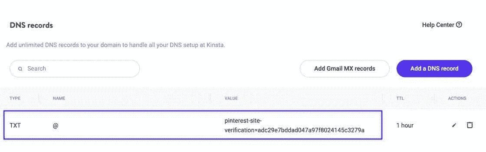

The saved TXT record.

#### **第五步:验证 Pinterest 上的连接**

导航回到你的 Pinterest 仪表盘，将你的站点 [URL](https://kinsta.com/knowledgebase/what-is-a-url/) 粘贴到**验证**字段。点击**验证**按钮继续。

Verify the connection with your URL on Pinterest.

如果成功，您将看到带有绿色勾号的“已连接”信息。点击**完成**并继续检查您所有的新功能，作为一个经过验证的 Pinterest 业务！

The successful “Connected” message.

### **方法 4:使用插件**

几个 WordPress 插件有像 Pinterest 这样的社交网站的验证功能。这些插件使初学者变得更加容易，他们可能会发现处理 HTML 标签、文件和 TXT 记录的前景令人生畏。

话虽如此，我们通常只建议在你已经安装了插件的情况下使用插件。好消息是，本教程中的插件是 WordPress 上一些最常用的插件。

#### **用 Yoast SEO 验证你在 Pinterest 上的 WordPress 网站**

[Yoast SEO 通过搜索工具](https://kinsta.com/blog/yoast-seo/)赋予网站所有者改善搜索引擎结果的能力，其中一种方法是提供一个[社交媒体](https://kinsta.com/blog/wordpress-social-media-plugins/)部分，用这些网站验证你的网站，并配置共享帖子/页面的外观。

Struggling with downtime and WordPress problems? Kinsta is the hosting solution designed to save you time! [Check out our features](https://kinsta.com/features/)

##### **第一步:安装 Yoast，找到 Pinterest 版块**

首先，确保你的网站上[有 Yoast SEO](https://kinsta.com/knowledgebase/how-to-install-wordpress-plugins/)[停滞](https://wordpress.org/plugins/wordpress-seo/) [和活跃](https://wordpress.org/plugins/wordpress-seo/)。

进入 **SEO >社交> Pinterest** 。在这里，你会发现 **Pinterest 设置**页面，其中包括一个名为 **Pinterest 确认**的字段。

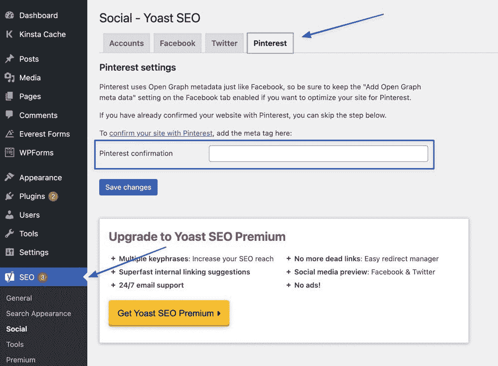

SEO > Social > Pinterest in Yoast.

##### **第二步:从 Pinterest 获取 HTML 标签**

切换到 Pinterest，导航到**设置>已认领账户**。点击**认领**按钮。

Go to the Claimed Accounts section on Pinterest.

将 HTML 标记复制到标题**“添加 HTML 标记”下**点击**继续**按钮继续。

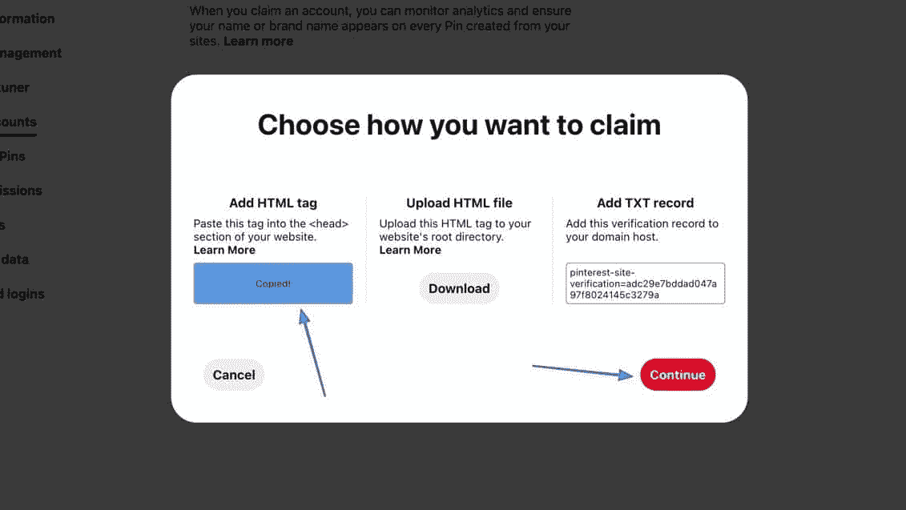

Copy the HTML tag.

##### **步骤 3:将 HTML 标签粘贴到 Yoast SEO 插件中**

切换回 WordPress，将 HTML 标签粘贴到 **Pinterest 确认**字段。点击**保存修改**。

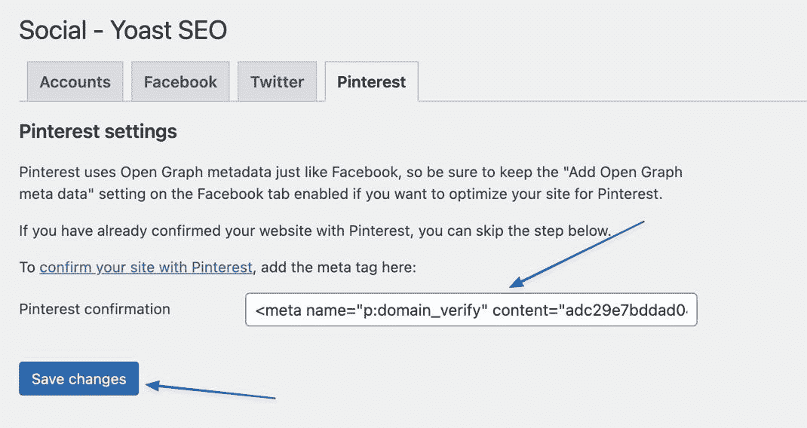

Paste the tag into the Pinterest Confirmation field.

##### **第四步:验证它在 Pinterest 上是否有效**

转到 Pinterest，将您网站的主 URL 粘贴到**验证**字段。点击**验证**。

Verify with your website URL.

寻找“已连接”信息和绿色勾号，以确保您已成功在 Pinterest 上声明您的网站！

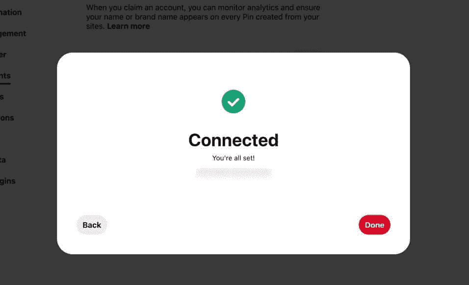

The success message.

#### **使用 Jetpack 验证你的 Pinterest WordPress 网站**

[Jetpack 是一个集优化](https://kinsta.com/knowledgebase/wordpress-jetpack/)、安全、速度和[于一体的备份插件](https://kinsta.com/help/wordpress-backups/)，带有用于[改善你的 SEO](https://kinsta.com/seo-hosting/) 和社交联系的工具，它有一个区域可以用 Pinterest 验证你的网站所有权。

##### **第一步:安装 Jetpack 并找到站点验证部分**

首先，确保你已经在你的网站上安装并激活了 Jetpack。

之后，进入**喷气背包>设置>交通**。

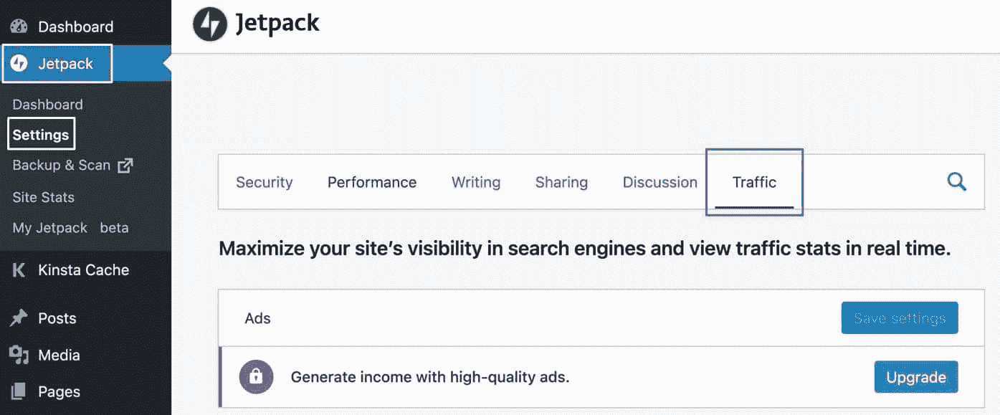

Jetpack > Settings > Traffic.

向下滚动到**站点验证**部分，打开写着“**通过第三方服务验证站点所有权”的开关****Pinterest**字段是你粘贴在以下步骤中找到的 HTML 标签的地方。

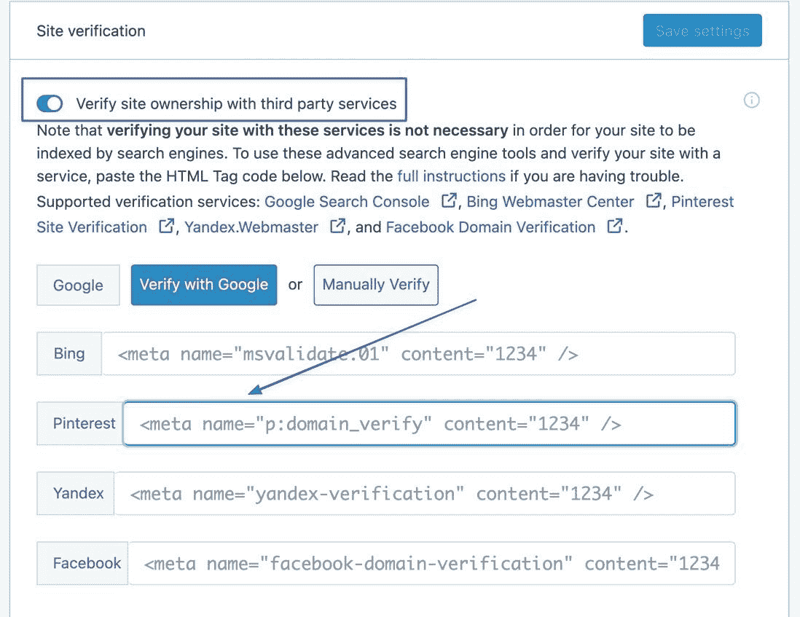

Turn On Site Verification.

##### **第二步:进入 Pinterest 的认领账户模块**

导航到 Pinterest，进入右上角的**向下插入符号(v)** 菜单。选择**设置>认领账户**。点击**认领**按钮。

Navigate to the Claimed Accounts section.

##### **第三步:复制 HTML 标签**

复制**添加 HTML 标签**部分下的代码。点击**继续**。

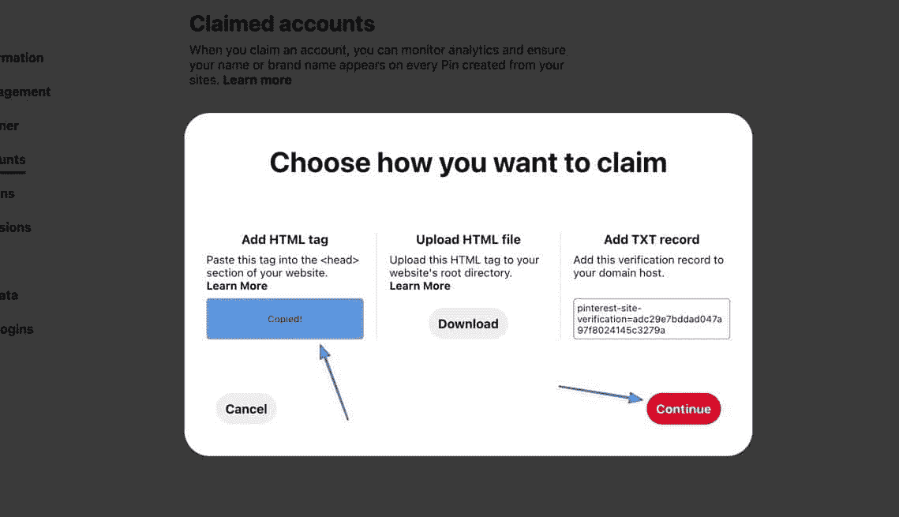

Copy the HTML tag from Pinterest.

##### **步骤 4:将 HTML 标签粘贴到 Jetpack 中**

回到 WordPress，将 HTML 标签粘贴到 **Pinterest** 字段中。点击**保存设置**按钮。

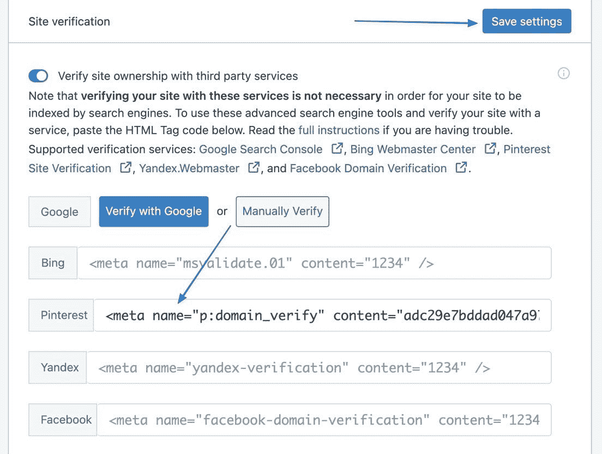

Paste the tag into the Pinterest field.

##### **步骤 5:确认该流程在 Pinterest 上有效**

回到 Pinterest，将你的网址粘贴到该字段中。点击**验证**。

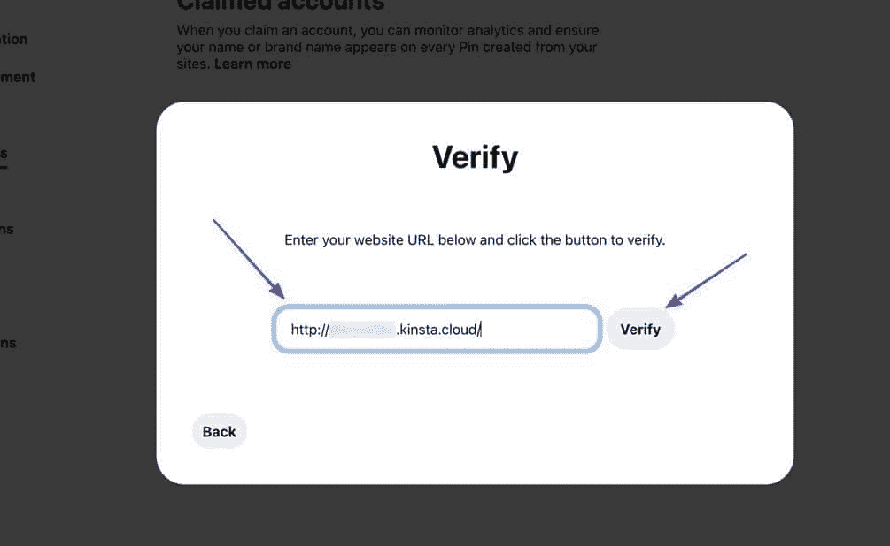

Verify the website connection on Pinterest.

因此，您应该会看到“已连接”文本和一个绿色复选标记，以确认您已经使用 Pinterest 声明了您的网站！

The “Connected” message tells you it worked.

## **在 Pinterest 上申请网站后要做的事情**

最终的“已连接”信息通常足以表明你已经在 Pinterest 上声明了你的网站，但还有一些额外的步骤来绝对确保它全部工作。在某些情况下，你可能需要等待来自 Pinterest 的验证邮件。

### **1。检查以确保你的网站在 Pinterest** 上得到验证和声明

你看到消息说你已经在 Pinterest 上成功申请了你的网站了吗？如果没有，或者你不记得你过去是否验证过，很容易在 Pinterest 上检查你的验证状态。

进入**设置>认领账户**，在**网站**栏目下查看。如果有一个域名被列出来，你就声称这个网站拥有 Pinterest 商业账户。

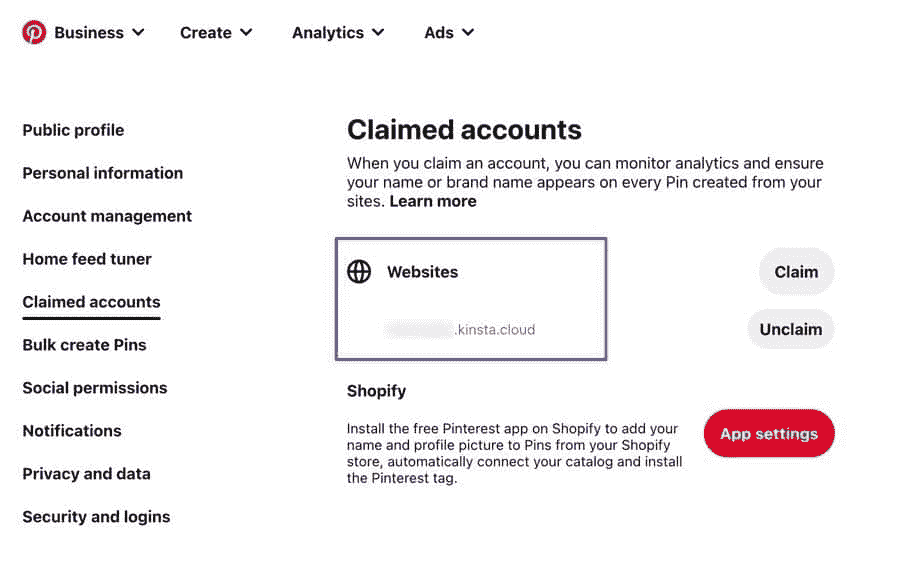

View the Claimed Accounts section to see all websites claimed on Pinterest.

### **2。可能会等待验证邮件**

尽管我们的大多数测试都以 Pinterest 的即时验证而告终，但情况并非总是如此。事实上，当我们试图将 TXT 记录添加到我们的 DNS 时，我们看到了“验证正在进行”的消息。

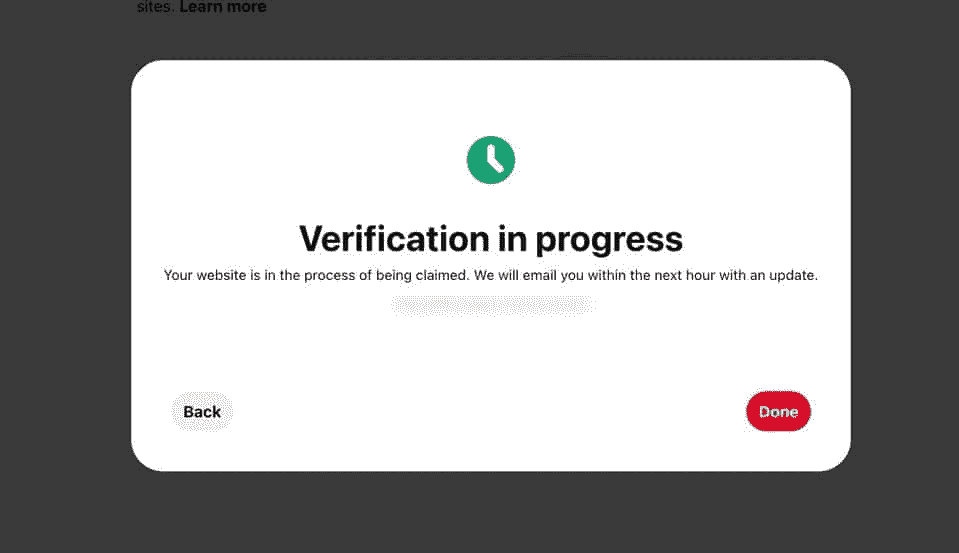

The “In Progress” message means you may have to wait a few hours or days to claim your website.

有时这意味着你没有正确完成验证(比如当[域名服务器指向其他地方](https://kinsta.com/help/point-name-servers-to-kinsta-dns/)时，试图用[验证你的网站主机](https://kinsta.com/blog/managed-wordpress-hosting/))，但这通常是因为 Pinterest 只是需要多一点时间来处理你的申请。

如果你看到一条“进行中”的消息，请留意来自 Pinterest 的邮件。验证通常在几秒钟内发生，但你可能几个小时甚至几天都看不到邮件。

[Unlock additional features when you claim your business on Pinterest- it's easy to get started! ✅Click to Tweet](https://twitter.com/intent/tweet?url=https%3A%2F%2Fkinsta.com%2Fblog%2Fhow-to-claim-website-on-pinterest%2F&via=kinsta&text=Unlock+additional+features+when+you+claim+your+business+on+Pinterest-+it%27s+easy+to+get+started%21+%E2%9C%85&hashtags=Pinterest%2CSmallBiz) ## **总结**

概括来说，我们的深入教程解释了:

*   在 Pinterest 上声明你的网站的好处
*   如何在 Pinterest 上申请一个网站(使用 5 种方法并逐步说明)
    *   申请网站之前要做的事情
    *   方法 1:更新 WordPress 上的 Meta 标签
    *   方法 2:使用 HTML 文件
    *   方法 3:向域主机添加一条 TXT 记录
    *   方法 4:使用 WordPress 插件
*   在 Pinterest 上申请你的网站后要做的事情

如果你有任何关于如何在 Pinterest 上声明你的网站的问题，请在评论中告诉我们。如果您已经通过验证，您觉得 Pinterest 帐户新增的功能怎么样？

* * *

让你所有的[应用程序](https://kinsta.com/application-hosting/)、[数据库](https://kinsta.com/database-hosting/)和 [WordPress 网站](https://kinsta.com/wordpress-hosting/)在线并在一个屋檐下。我们功能丰富的高性能云平台包括:

*   在 MyKinsta 仪表盘中轻松设置和管理
*   24/7 专家支持
*   最好的谷歌云平台硬件和网络，由 Kubernetes 提供最大的可扩展性
*   面向速度和安全性的企业级 Cloudflare 集成
*   全球受众覆盖全球多达 35 个数据中心和 275 多个 pop

在第一个月使用托管的[应用程序或托管](https://kinsta.com/application-hosting/)的[数据库，您可以享受 20 美元的优惠，亲自测试一下。探索我们的](https://kinsta.com/database-hosting/)[计划](https://kinsta.com/plans/)或[与销售人员交谈](https://kinsta.com/contact-us/)以找到最适合您的方式。