# 如何在 LinkedIn 上创建公司页面(分步指南)

> 原文：<https://kinsta.com/blog/how-to-create-a-company-page-on-linkedin/>

你用 LinkedIn 吗？有可能你在上面有个人简介，但是，如果你没有积极地寻找你的下一个职业机会，那么你可能不会经常使用它。

过一会儿，我会告诉你为什么你需要在 LinkedIn 上创建一个公司页面，以及如何做，但首先，让我告诉你:如果你不定期查看 LinkedIn，你并不孤单。LinkedIn 用户平均每月只花 17 分钟在上面。很容易忽视这个社交网络。

## LinkedIn:世界上最大的职业网络

LinkedIn 由雷德·霍夫曼和其他十位联合创始人于 2002 年创立，其中几位和霍夫曼一样属于所谓的“PayPal 黑手党”。

什么是 [Paypal 黑手党](http://fortune.com/2007/11/13/paypal-mafia/)？这是一群前 PayPal 员工，他们后来创办了自己成功的公司:

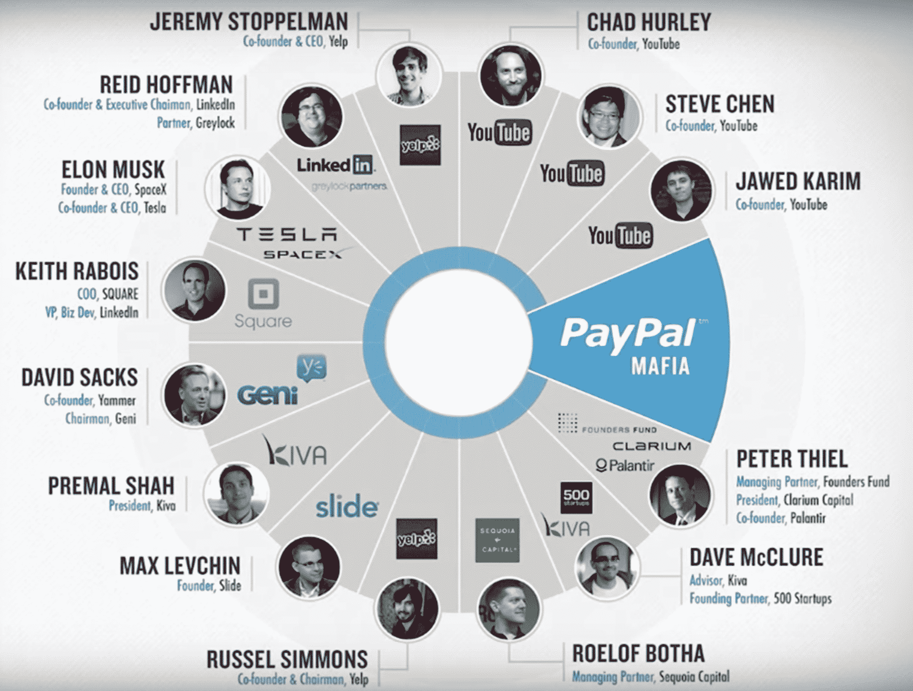

The PayPal Mafia

可能最著名的 PayPal 校友是埃隆·马斯克，他被认为是特斯拉和 SpaceX 背后的疯狂天才。但也有不少其他前 PayPal 员工为自己做得非常好。事实上，其中包括雷德·霍夫曼在内的六个人成为了亿万富翁。

这是 LinkedIn 历史上的一个重要细节，因为全明星创始团队和他们在硅谷的关系无疑在公司的成功中发挥了巨大作用。

2003 年，LinkedIn [筹集了一轮首轮投资](https://agilevc.com/blog/2011/05/26/linkedin-the-series-a-fundraising-story/)，由红杉资本(Sequoia Capital)牵头，红杉资本是一家风险投资公司，以投资谷歌、苹果、PayPal、YouTube、WhatsApp 等众多“独角兽”而闻名。

LinkedIn 团队没有让人失望。2004 年，该公司的用户达到了 100 万，2006 年，该公司首次实现了月度盈利，2007 年，该公司的用户达到了 1000 万。

2008 年，在几家风险投资公司以 5300 万美元购买了 LinkedIn 5%的股份后，该公司的估值为 10 亿美元(钱后估值)。

2010 年，它的价值约为 20 亿美元，但到了年底，它的价值降至约 15 亿美元。同年，它在《硅谷内幕》最有价值的 100 家创业公司中排名第十。

LinkedIn 在 2010 年至 2011 年间迅猛发展，全职员工从大约 500 人增加到大约 2100 人，并于 2011 年首次公开募股。

LinkedIn 继续快速增长，但在 2016 年经历了一点小挫折，当时[他们的股票在一天内下跌了 43.6%](https://www.reuters.com/article/linkedin-results-research/linkedin-sheds-11-billion-in-value-on-stocks-worst-day-since-debut-idUSKCN0VE1N0)，导致他们的市值损失了 110 亿美元。发生了什么事？

显然，投资者对 LinkedIn 2016 年的预测没有留下深刻印象(该公司预测 Q1 的收入将为 8.2 亿美元，而不是分析师预测的 8.67 亿美元)，并决定跳槽。

然而，这场“灾难”并没有阻止 [LinkedIn 被微软](https://kinsta.com/blog/linkedin-statistics/#linkedin-revenue-the-financial-facts)以 262 亿美元收购，这是当时微软最大的一笔收购。

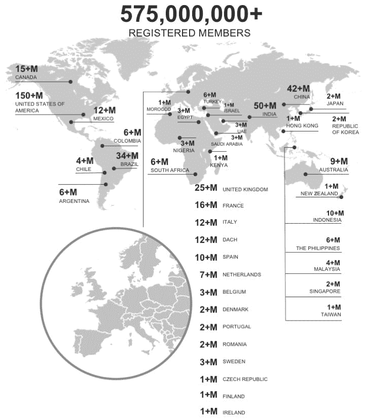

LinkedIn registered users

如今，LinkedIn 拥有超过 5.75 亿用户，月活跃用户超过 2.6 亿。这是世界上最大的专业社交网络。

想了解更多关于 LinkedIn 的信息？看看我们令人兴奋的 LinkedIn 统计数据和事实。T3】

## 为什么你的企业需要 LinkedIn 公司页面

你可能想知道为什么要在 LinkedIn 上创建一个公司页面，这是一个用户每月只花 17 分钟(平均)的社交网络。

以下是三个主要原因:

### 第一大潜在客户

LinkedIn 是一个接触潜在客户的好地方。

事实上，根据 HubSpot 的数据， [LinkedIn 在挖掘潜在客户方面比 Twitter 和脸书](https://kinsta.com/blog/linkedin-marketing/)高出 277%。

毫不奇怪， [79%的营销人员将 LinkedIn 视为“非常好的线索来源”](https://business.linkedin.com/marketing-solutions/blog/linkedin-b2b-marketing/2017/10-surprising-stats-you-didnt-know-about-marketing-on-linkedin)并且 B2B 营销人员报告称他们 80%的社交媒体线索来自 LinkedIn。

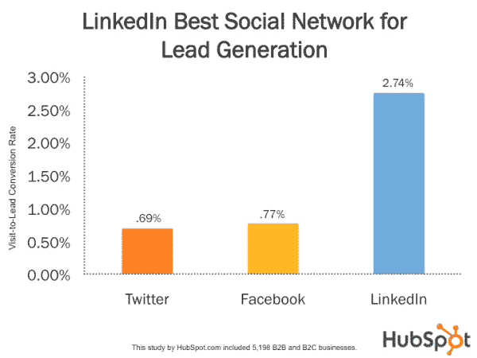

Linkedin lead generation

使用 LinkedIn 进行潜在客户开发的一个很好的资源是[*《LinkedIn 高级营销人员指南》*](https://business.linkedin.com/content/dam/me/business/en-us/marketing-solutions/cx/2019/pdfs/the-linkedin-sophisticated-marketers-guide-v1-new.pdf) (2019 版已经推出！).

该指南建议通过以下方式在 LinkedIn 上建立一个有机的形象:

*   创建 LinkedIn 页面。“有了 LinkedIn 页面，你可以在世界职业社区中找到自己的位置，讲述你公司的故事，给客户和潜在客户一个了解你的企业、你的员工和你的品牌的地方。”
*   使用展示页面。“使用展示页面为你更突出的品牌、业务线、产品和计划创建专门的页面，这样你就可以扩大你在 LinkedIn 的影响力。”
*   创建长格式帖子。*“使用一个直观的博客工具，将* *与您在 LinkedIn 上的个人资料无缝集成，您可以在 LinkedIn 上发布新的和以前发布的内容，以快速扩大您的受众和网络。”*
*   利用本地视频。“原生视频作为独立的帖子直接出现在 LinkedIn Feed 中，让你在购买者的 LinkedIn 之旅中与商业决策者互动。”
*   参加 LinkedIn 群组。群组为同行业或兴趣相似的专业人士提供了一个分享见解和经验、寻求指导和建立有价值联系的地方。它们为你的公司提供了一个确立自己思想领袖地位的绝佳机会，无论你是参与已建立的 LinkedIn 群组中的讨论，还是创建你的 *公司自己的 LinkedIn 群组。*

该指南还建议通过赞助内容、邮件赞助和动态广告来提升你的有机战略。

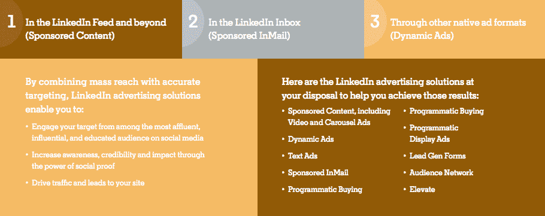

A page from the free LinkedIn guide here mentioned

但这不是唯一可用的指南。

我们还制作了一个有趣的深度指南，涵盖了[如何使用 LinkedIn 取得营销成功](https://kinsta.com/blog/linkedin-marketing/)你可能想看看。

### #2 招聘

从 [Inc](https://www.inc.com/marcel-schwantes/3-things-great-companies-do-to-masterfully-recruit-hire-top-talent.html) 到[企业家](https://www.entrepreneur.com/article/78598)到[福布斯](https://www.forbes.com/sites/scholleybubenik/2019/01/23/want-the-best-talent-have-a-plan/)的每个人都在谈论[雇佣顶尖人才](https://kinsta.com/blog/growing-saas-company/#hiring-process)。这是可以理解的。

毕竟，招募和留住优秀人才是经营企业的最大挑战之一，而且风险很高。

AppSumo 背后的知名企业家诺亚·卡根[说](https://okdork.com/how-to-attract-the-best-people-in-the-world/):

> “在脸书、Mint 和现在的 AppSumo […]工作后，我知道最优秀的人比一般人的产出高得多，可以将企业发展 100 倍。”

他解释说，招聘顶尖人才就像约会一样:最优秀的人已经有了。他们已经在一家很棒的公司工作，收入不错，对自己的工作很满意。

因此，诺亚认为，你应该提前建立关系，这样当优秀员工准备好下一个职业机会时，他们就会想到你。

现在，想一想:接触一个你印象深刻但个人并不了解的专业人士的最佳方式是什么？

你猜对了。 **LinkedIn** 。

你看，如果你给某人发邮件，他们无论如何都会想看看你，然后上 LinkedIn，所以为什么不帮他们省点麻烦，在那里联系他们呢？

这样，他们可以一键检查你，并确保你是一个认真的人。

再点击一下，他们就可以看一看[你公司的页面](https://www.linkedin.com/company/kinsta/)，看看这是不是他们想去的地方。

那些积极寻找下一个职业机会的人呢？

他们也在 LinkedIn 上浏览招聘信息。他们可能会通过他们的网络偶然发现你的招聘广告，即使他们以前没有听说过你的公司。

简而言之，如果你想吸引顶尖人才，**你需要在 LinkedIn 上有一个公司页面**(事实上，没有公司页面甚至可能会因为看起来可疑而排斥优秀的人)。

### #3 宣传

你可能想让[出现在媒体](https://kinsta.com/press/)上。谁不喜欢免费宣传对吧？

如果你想增加这种情况发生的几率，你需要了解它是如何工作的:

*   一个作家从编辑那里得到一个任务，要求提及你所在领域的一家公司。
*   那位作者决定提及你的公司。
*   他们去公司的网站寻找他们需要的信息。

然而，如果他们在你的网站上找不到他们需要的东西，那么他们下一个去的地方就是 LinkedIn。

如果他们在 LinkedIn 上也找不到会怎么样？

简单。作者放弃了提及贵公司的想法，转而提到了贵公司的一个竞争对手。所以确保你的公司有一个很棒的网站和一个可靠的 LinkedIn 页面。

## 如何在 LinkedIn 上创建公司页面(5 个步骤)

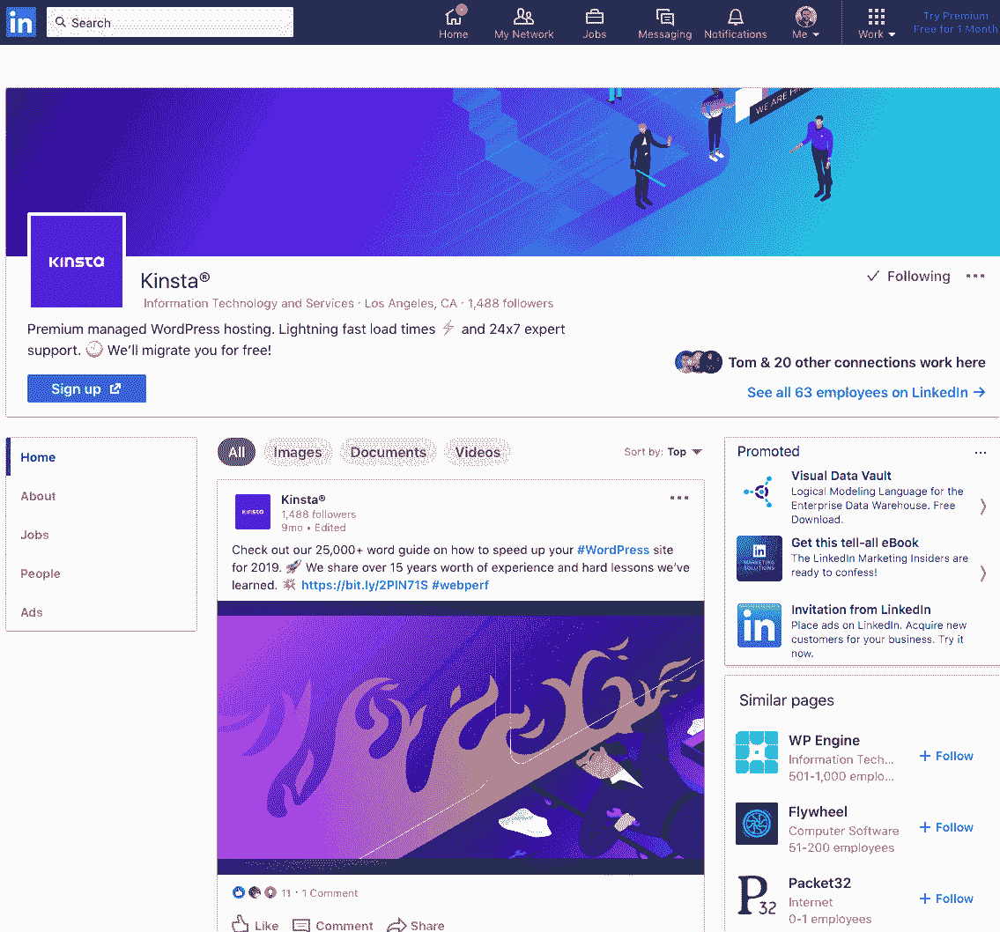

Kinsta on LinkedIn

幸运的是，[创建 LinkedIn 公司页面](https://www.linkedin.com/help/linkedin/answer/710/creating-a-linkedin-page?lang=en)非常简单，你今天就可以做到:

1.  点击 LinkedIn 主页右上角的“工作”图标。
2.  选择“创建公司页面”选项。
3.  根据您的企业规模，选择“小型企业”或“中型到大型企业”选项。
4.  输入页面身份详细信息、公司或机构详细信息和概要详细信息。
5.  点击“创建页面”

以下是所有的步骤:

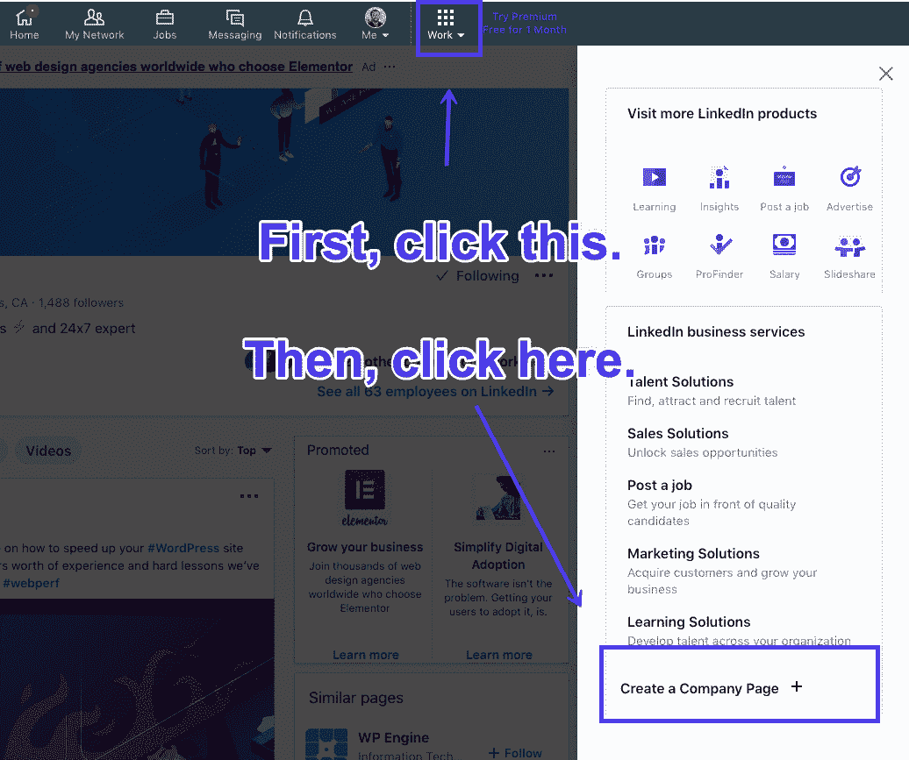

Creating a company page on LinkedIn

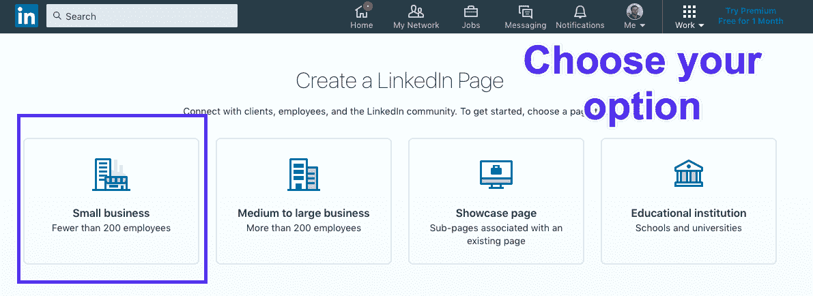

LinkedIn page types

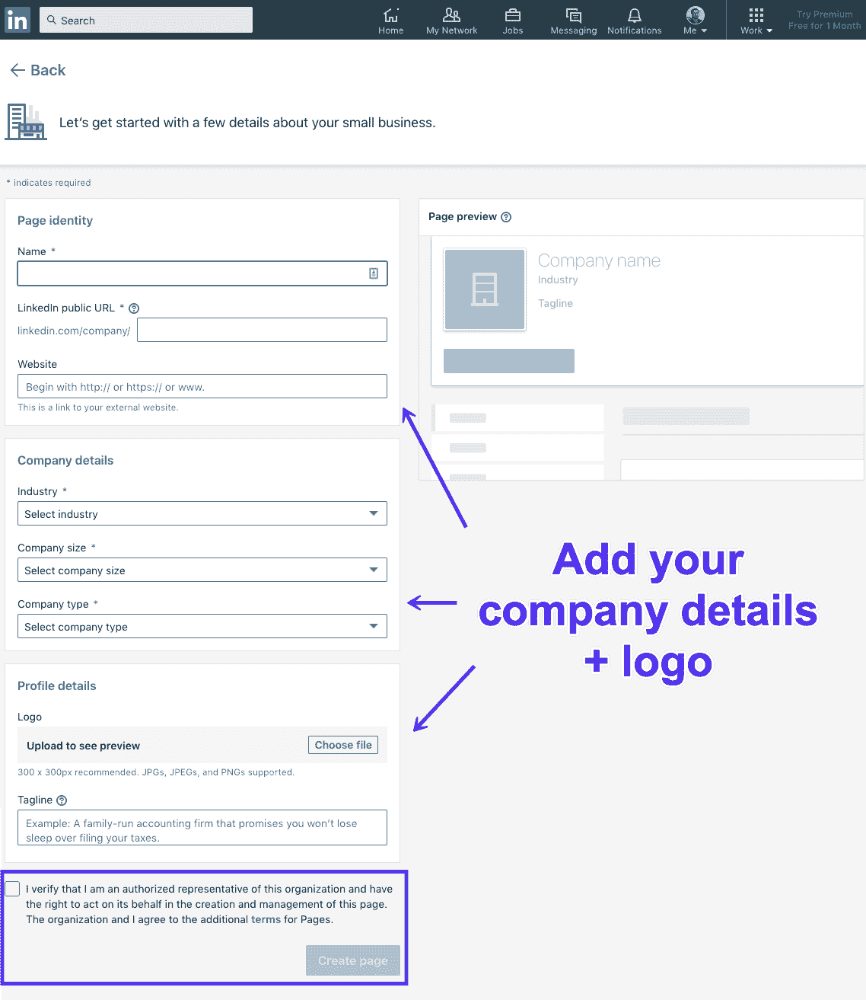

Adding info to your company page on LinkedIn

不要忘记通过勾选复选框来验证您是否有权代表公司行事:

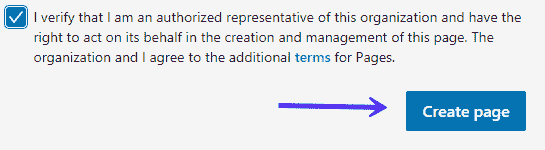

The create page button

请记住，如果你的 LinkedIn 帐户是新的，或者你没有足够的联系，那么你可能会收到一条错误消息。

这意味着如果你想有一个公司网页，你需要建立你的个人资料和扩大你的网络。

一旦你创建了你的页面，点击“开始创建你的页面！”并补充更多细节。

## 注册订阅时事通讯

### 想知道我们是怎么让流量增长超过 1000%的吗？

加入 20，000 多名获得我们每周时事通讯和内部消息的人的行列吧！

[Subscribe Now](#newsletter)

## 充分利用你的 LinkedIn 页面

创建你的 LinkedIn 公司页面的 5 个步骤只是开始，如果你想得到结果，你需要优化公司页面。为此，您应该注意以下几个方面。

### 创建一个吸引人的 LinkedIn“关于”页面

当一个人点击 LinkedIn 上你公司的简介时，他首先看到的是“关于”页面。

你需要做三件事:

#### **#1 说出你的故事**

还记得高中的时候，你会记下历史考试的日期，然后一走出教室就忘记了吗？记住这些日子很难，因为人类天生不会记住事实，我们天生会记住故事。

但是这和你的 LinkedIn 页面有什么关系呢？好吧，如果你向你的公司页面访问者展示一组事实，他们的目光会变得呆滞，一旦他们离开页面，他们不会记得太多。

另一方面，[如果你讲了一个故事，而且讲得很好](https://kinsta.com/blog/bootstrapping-startup/)，人们会记住很久。他们也会记住你的公司。

#### **#2 销售你的产品或服务**

不，我不是指字面上向人们要钱来换取一种产品。我的意思是传达你销售的产品/服务的价值。

在这里，理解特性和优势之间的[差异](https://kinsta.com/blog/features-vs-benefits/)很重要:

*   一个特征就是一个产品的特性(例如:*“这些鞋子是防水的”)。*
*   好处是你的顾客将从该产品中获得的价值(例如:*“这些鞋子将使你的脚保持温暖和干燥！”*)。

文案里有句话:*“特色讲，效益卖”*。

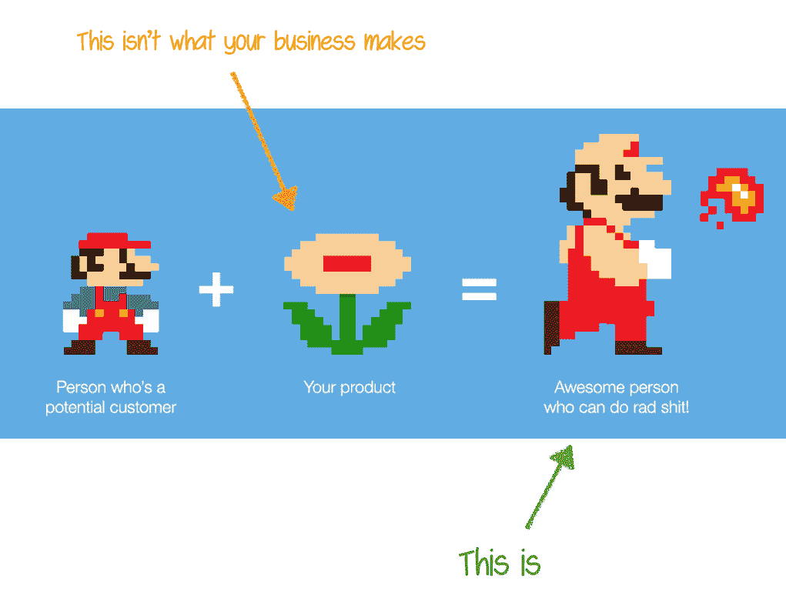

Focus on value, not features (Image source: useronboard.com)

重要的是要明白，虽然列出产品的主要特征可能有用，但你必须始终以好处为卖点。

不要只是告诉人们你的产品是做什么的，告诉他们[它将如何让他们的生活变得更好](https://kinsta.com/blog/features-vs-benefits/#pas-formula)。

#### **#3 提供社会证明**

我们是群居动物。当我们不确定自己在做什么的时候，我们会看着别人。

这就是社会证明如此重要的原因。没有人想成为第一个尝试新产品的人。

好吧，这并不完全正确，有这样的事情，早期采用者想尝试天底下的一切。

但是大多数人不是那样的。大多数人都不想在一家不知名的公司上冒险。他们想要确定的事情。

并且[提供社会证明](https://kinsta.com/blog/best-wordpress-review-plugins/)可以帮助仍在观望的潜在客户做出决定。

如果你刚刚起步，还没有任何社会证明可言，这没关系。你应该努力获得一些！

厌倦了你的 WordPress 站点缓慢的主机？我们提供超快的服务器和来自 WordPress 专家的 24/7 世界级支持。[查看我们的计划](https://kinsta.com/plans/?in-article-cta)

然而，一旦你得到了某样东西，不管是[客户评价](https://kinsta.com/clients/)，还是媒体报道，或者是著名出版物的特写，你都需要把它添加到你的“关于”页面。

讲述你的故事、销售你的产品并提供社会证明的“关于”页面是向潜在客户介绍你的公司的好方法。

### 提供一份员工名单

你可能会有点犹豫是否向[提供一份员工名单](https://www.linkedin.com/company/kinsta/people/)。

然而，对于那些可能有兴趣在你的公司工作的人来说，这是一种社交证明，因为这表明你是一家合法的企业，而不是一些员工以在那里工作为耻，甚至不会将其放在 LinkedIn 个人资料上的危险地方。

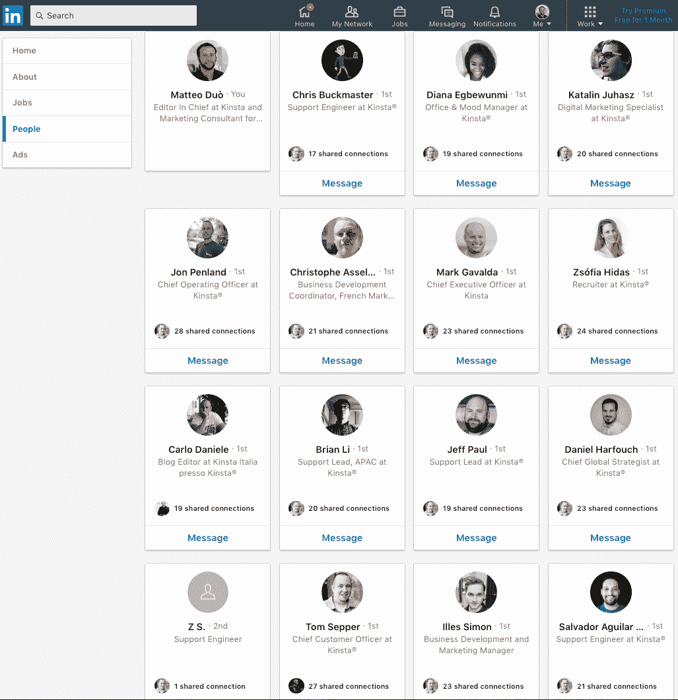

Kinsta’s employee list

此外，员工名单对作者来说是一个宝贵的资源，因为它可以让他们快速检查公司结构，了解谁在做什么，并联系到合适的人。

例如，如果一个作者想问一个关于你的营销策略的问题，他们可以简单地在 LinkedIn 上给你的营销人员发消息。

这很重要，因为随着公司的发展，你会越来越忙，可能会因为没有及时查看收件箱而错过一个重要的媒体机会。

同时，你的员工可能比你更有空，所以给作者提供一个直接联系他们的方法是个好主意。

### 定期更新你的页面

你不希望你的页面被忽视。但是你应该发布什么呢？

[*【LinkedIn 老练营销者指南】*](https://business.linkedin.com/content/dam/me/business/en-us/marketing-solutions/cx/2019/pdfs/the-linkedin-sophisticated-marketers-guide-v1-new.pdf) 建议遵循 4-1-1 法则，该法则是由 Tippingpoint Labs 和内容营销研究所创始人乔·普利兹提出的:

> *“对于每一条自助式推文，你应该转发一条相关推文，最重要的是分享四条他人写的相关内容。”*

是的，4-1-1 规则最初是为 Twitter 创建的[，但是你也可以在 LinkedIn 上应用它。](https://kinsta.com/blog/twitter-stats/)

对于每一个推广更新，分享一篇来自你所在领域的思想领袖的相关文章和四篇其他人写的相关内容。

这样，你的追随者会看到你始终如一地提供价值，并会继续追随你。

### 展示为什么你的公司是一个很好的工作场所

在前面提到的*“获得顶尖人才:雇用世界上最好的人才的 4 个步骤”*文章中，诺亚·卡根解释说，要吸引顶尖人才，你需要向他们展示[为什么你的公司是一个很好的工作场所](https://kinsta.com/careers/)。他分享了一张在 Craiglist 招聘广告上看到的图片:

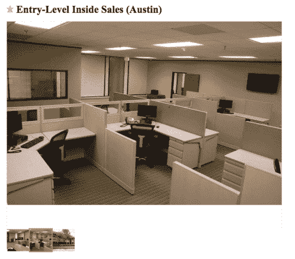

A job ad on Craiglist (Image source: okdork.com)

是的，仅仅看着这张照片就让人想去开抗抑郁药，所以可以肯定地说，很少有人会申请这样的职位。

在 LinkedIn 上有你的公司页面，不要犯同样的错误。

想想是什么让你的公司成为一个很好的工作场所。然后一定要在 LinkedIn 上提一下。

例如，这是诺亚的照片:

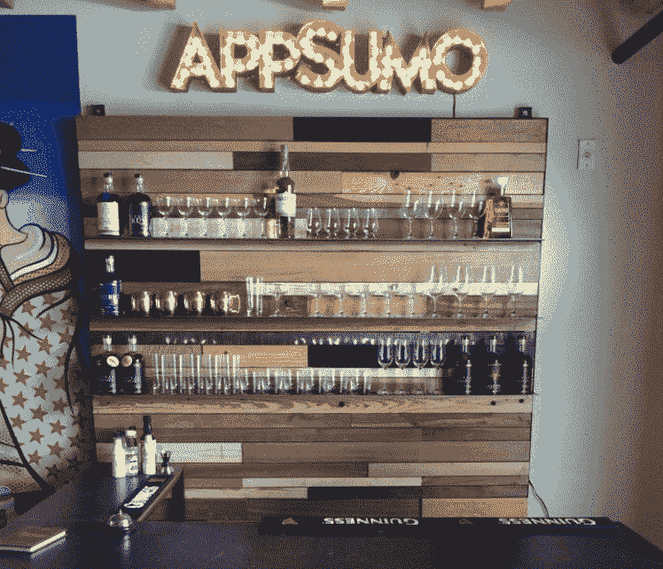

Appsumo

现在，办公室里的酒吧很酷，但更重要的是，它表明 AppSumo 是一个放松、友好、休闲的工作场所，人们不会把自己看得太重。

咨询电话:

> “让你的页面真正成为你自己。如果你不是，就不要试图变得古怪。 *例如，作为一家律师事务所，你可以说你拼命工作，工资很低，但做的工作是你做过的最有意义的事情。* *讲述你所在公司的故事，以及为什么这个职位对你有价值。即使你没有谷歌的资源。* *在页面上添加您的头像。加上你的态度。”*

底线是:找到吸引人的东西。也许这是一个很酷的办公空间。可能是弹性作息吧。也可能是远程工作的机会(检查，检查，检查 Kinsta)。不管是什么，在你的公司页面上提到它，在你的招聘广告中强调它。

记住:对于顶尖人才，你在评估他们，他们也在评估你，所以努力给他们留下深刻印象。

### 你的公司页面不是关于你的

文案中有个笑话是这样的:

> *“大家最喜欢的电台是哪个？WII FM！”*

WII FM 代表*“对我有什么好处？”*

这个笑话是在提醒大家，别人不在乎你，他们在乎的是他们自己，这也是你应该关注他们的原因。

我知道这听起来可能会让人困惑。

你如何讲述你的故事，销售你的产品，提供社会证明，炫耀在你的公司工作的额外津贴而不谈论你自己？

这又回到了我之前解释过的“特色说明，优势销售”的概念。

让我用一个简单明了的例子来解释一下:

*“这双鞋是防水的”*在说你自己，*“这双鞋会让你的脚保持温暖干燥”*在说你的潜在客户。

在这两种情况下，你都在谈论你的产品，当然，但侧重点不同。对于前者，重点是产品；对于后者，重点在于你要向谁推销产品。

你需要把这个原则作为一个整体应用到你的公司页面上。网站上的所有内容都应该经过精心设计，以吸引潜在客户和潜在员工。

[With 570+ million users, @linkedin is the biggest social network for professionals! Follow these steps to create your kickass LinkedIn page. 💪🤝Click to Tweet](https://twitter.com/intent/tweet?url=https%3A%2F%2Fkinsta.com%2Fblog%2Fhow-to-create-a-company-page-on-linkedin%2F&via=kinsta&text=With+570%2B+million+users%2C+%40linkedin+is+the+biggest+social+network+for+professionals%21+Follow+these+steps+to+create+your+kickass+LinkedIn+page.+%F0%9F%92%AA%F0%9F%A4%9D&hashtags=socialmediamrktng%2Clinkedintips)

## 摘要

LinkedIn 是世界上最大的社交专业网络，拥有超过 5.75 亿注册用户和超过 2 亿月活跃用户。

这是专业人士寻找下一个机会的地方，也是作家寻找他们想在即将到来的文章中提及的公司信息的地方。

这也是企业高管检查他们考虑合作的公司是否合法的地方。

不要因为不每天查看 LinkedIn 就犯忽略它的错误。现在就开始创建您的公司页面吧！

* * *

让你所有的[应用程序](https://kinsta.com/application-hosting/)、[数据库](https://kinsta.com/database-hosting/)和 [WordPress 网站](https://kinsta.com/wordpress-hosting/)在线并在一个屋檐下。我们功能丰富的高性能云平台包括:

*   在 MyKinsta 仪表盘中轻松设置和管理
*   24/7 专家支持
*   最好的谷歌云平台硬件和网络，由 Kubernetes 提供最大的可扩展性
*   面向速度和安全性的企业级 Cloudflare 集成
*   全球受众覆盖全球多达 35 个数据中心和 275 多个 pop

在第一个月使用托管的[应用程序或托管](https://kinsta.com/application-hosting/)的[数据库，您可以享受 20 美元的优惠，亲自测试一下。探索我们的](https://kinsta.com/database-hosting/)[计划](https://kinsta.com/plans/)或[与销售人员交谈](https://kinsta.com/contact-us/)以找到最适合您的方式。