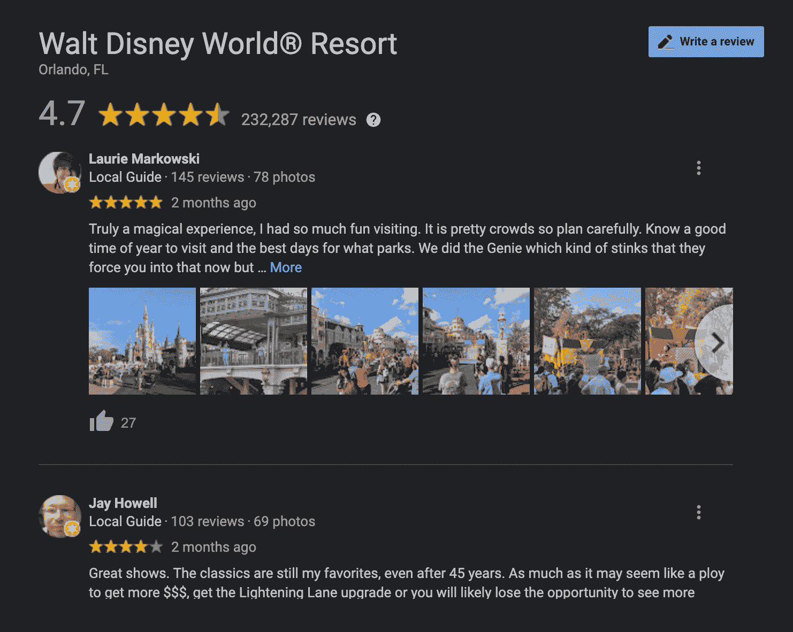
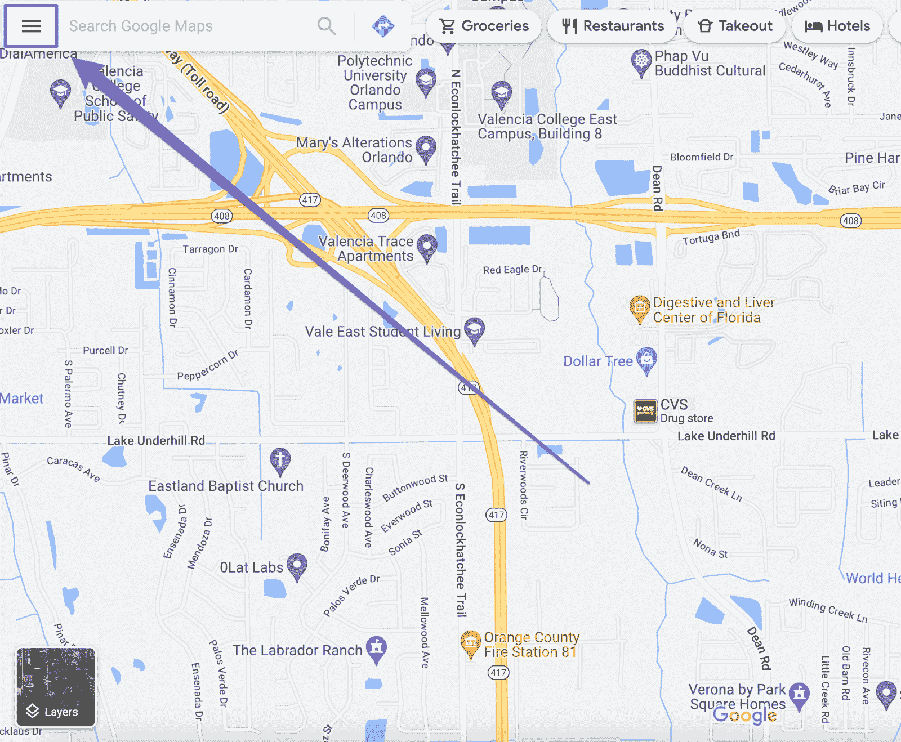
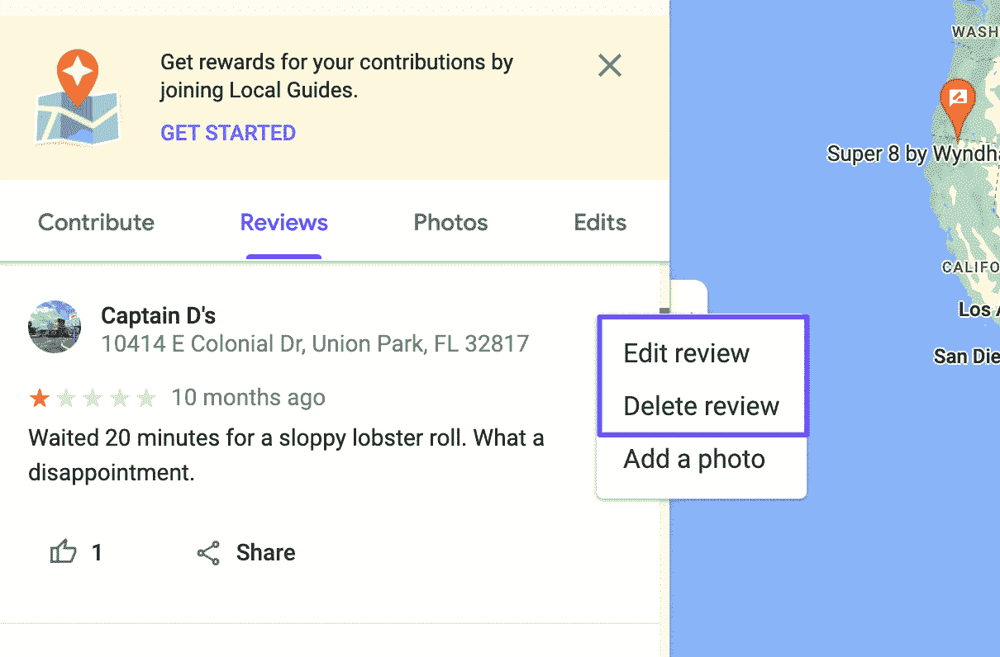
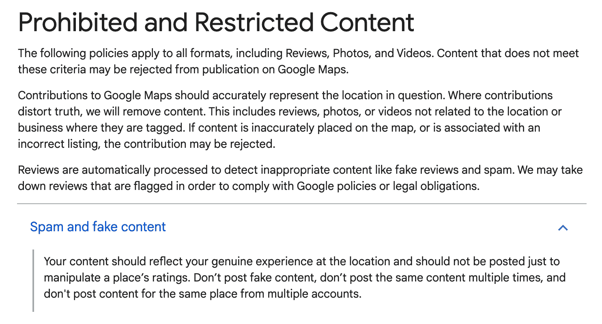
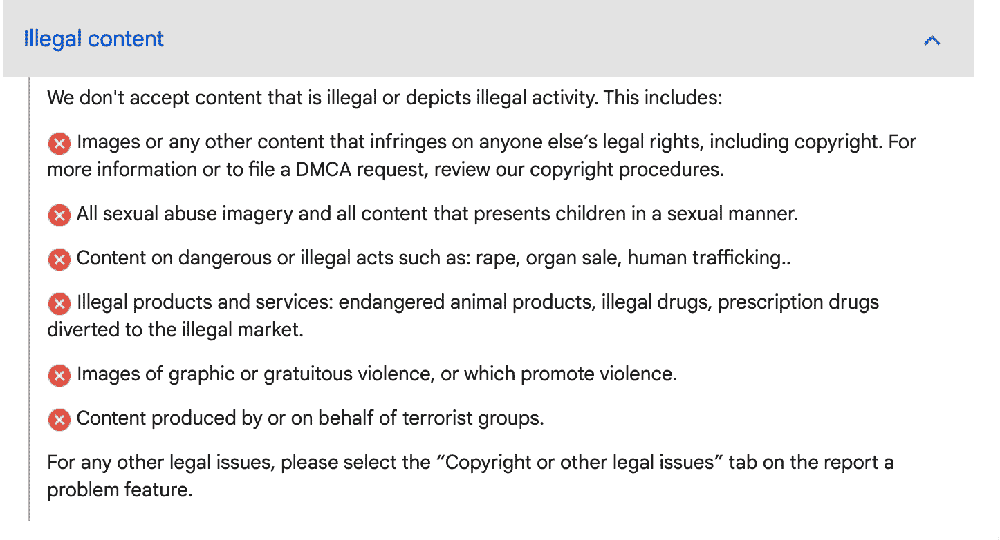
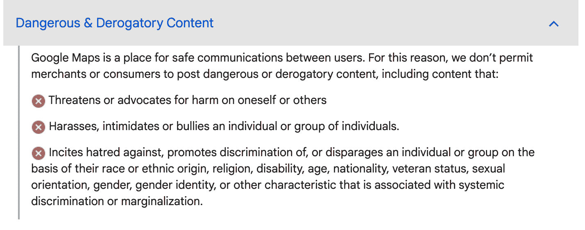
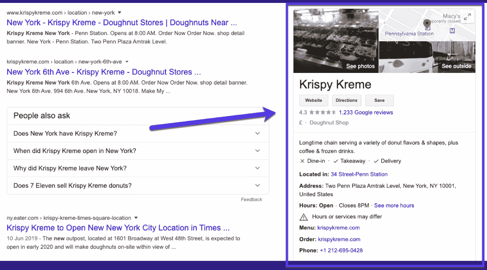
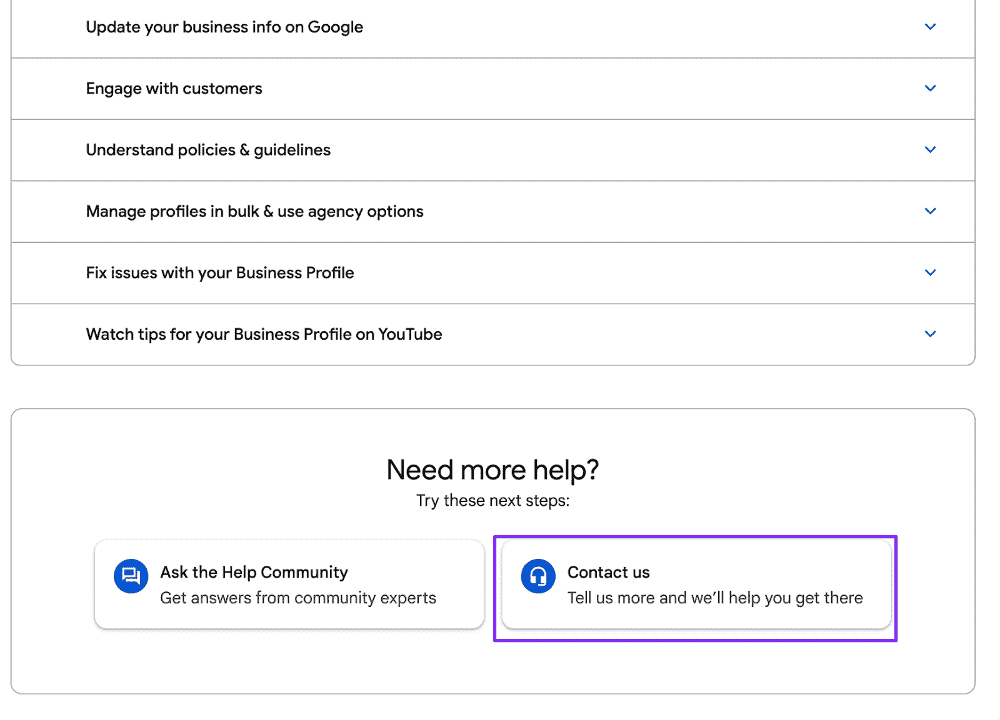

# 如何在谷歌上删除评论:终极指南

> 原文：<https://kinsta.com/blog/how-to-delete-a-review-on-google/>

评论对现代企业非常重要。他们向潜在客户提供社会证明，并帮助他们立刻建立信任。但是，正如正面评价可能对你的公司有好处一样，负面评价可能是灾难性的——尤其是如果它们出现在[谷歌评论](https://kinsta.com/blog/embed-google-reviews/)上。

谷歌是现代消费者的重要资源。这是一个值得信赖的搜索引擎，当用户在寻找去哪里购物和向谁购买时，它会为用户提供丰富的信息。

当积极的谷歌评论留给你的业务，它可以导致流行度，信任度和盈利能力的爆炸。但是如果人们留下不好的评论，你可以打赌这会损害你的声誉。

这就引出了一个问题，你能在谷歌上删除一个差评吗？如果是的话，你怎么做呢？

这就是我们在本文中要探讨的内容。我们将讨论何时你可能想要删除谷歌上的评论，是否有可能删除其他人留下的评论，如何删除你在谷歌和谷歌地图上留下的评论，以及你可以做些什么来消除其他人留下的差评。

## 你为什么要删除谷歌上的评论？

有人想在谷歌上删除评论的原因有很多。然而，谷歌并没有删除合法评论的业务，即使这些评论对企业产生了负面影响。

评论对购物者有着巨大的影响，十个消费者中有九个会在做出购买决定前查看评论。最重要的是，他们相信他们。多达 79%的 T2 消费者相信他们阅读的评论。这就是为什么差评对企业来说可能是灾难性的。

谷歌评论很受尊重，被许多人视为客观来源——谷歌打算保持这种状态。令人印象深刻的是，59%的消费者在搜索公司或产品时会查看谷歌评论。

那么，你为什么要删除负面评论呢？

首先，垃圾或煽动性的评论会损害你的生意。这可能包括提供其他竞争服务链接的评论(可能由这些服务发布)、发布个人信息的人或可能跨越业务线的攻击。

诽谤性或露骨的评论也会让潜在客户不安。这包括对一个人做出未经证实的陈述或使用图形或性语言。在这种情况下，你会 100%希望从谷歌得到一个评论。

如果你怀疑竞争对手或个人试图通过在各种账户下留下虚假或明确的煽动性评论来伤害你，你可能需要采取行动，请求谷歌删除这些令人不快的评论。

[While positive reviews can lead to an explosion of popularity & profitability, bad reviews can take a major toll on your reputation. 😅 Learn how to remove them here ✅Click to Tweet](https://twitter.com/intent/tweet?url=https%3A%2F%2Fbit.ly%2F3R8Z6jD&via=kinsta&text=While+positive+reviews+can+lead+to+an+explosion+of+popularity+%26amp%3B+profitability%2C+bad+reviews+can+take+a+major+toll+on+your+reputation.+%F0%9F%98%85+Learn+how+to+remove+them+here+%E2%9C%85&hashtags=GoogleReviews%2CSmallBiz)

## 你能删除别人在谷歌上留下的评论吗？

删除别人在谷歌上留下的评论是可能的。然而，删除必须有一个理由。这里，我们指的不是你不喜欢他们对你公司的评价。

An example of a Google Review for Walt Disney World

只有当有人违反了谷歌的审查规则时，谷歌审查删除才是可能的。这意味着你需要能够毫无疑问地证明有人恶意违反了谷歌的一项审查行为规则。

你不能删除任何你不喜欢的评论，如果数字是可信的，你无论如何也不会想删除。

62%的消费者不会信任审查评论的商家。评论之所以可信，是因为它们从同行的角度提供了对一家公司的公正看法。如果人们认为你试图通过审查评论来玩弄系统，整个过程就失去了可信度。

谷歌制定了人们经常违反的三条主要准则。虽然还有更多的规则(我们将在后面深入讨论)，但是任何违反这些规则的行为都将被立即删除。

首先，如果有人发布有利益冲突的评论，那就违反了谷歌规则。这包括为自己留下评论的企业，接受金钱或其他形式的补偿而留下评论的人，或直接征求的评论。

然后，你有模仿。这种情况发生在有人假装不是自己的人离开评论时。也可能是声称自己是某个行业的专家(比如医疗产品的医生或律师)，但实际上并没有这些证书。

最后还有垃圾评论。这包括带有促销或商业内容的评论。也可能是有人多次发布相同的评论或对多个不同的产品发布评论。

标出任何你认为违反谷歌行为准则的评论，并准备好支持你的主张。运气好的话，你可以从谷歌上删除这些评论。

## 如何删除你在谷歌上发布的评论

如果你想删除你在谷歌上发布的评论，这个过程要简单得多。谷歌没有强迫任何人离开他们写的评论。如果你创造了什么，你有权利把它拿下来。就像有人想从谷歌上删除他们的网站一样，你可以轻松地删除你的评论。

虽然删除别人留下的评论的过程可能会很漫长和艰难，但删除你发布的内容要容易得多。这涉及到一个任何人都能掌握的简单的删除过程。

你可能会问自己，为什么有人会想要删除他们留下的评论。这有几个原因。

也许这是你错误地发布在自己页面上的一篇评论。这可能是你打算留给另一家公司的评论，但不小心让你自己的谷歌页面开着。这可能会令人尴尬，尤其是如果这导致你自己的评估分数下降。你应该在别人注意到之前悄悄地删除那篇评论。

也许是对你后悔离开的另一个行业的回顾。可能是你对某件事不满意，但是公司努力改正了错误，让你感觉很积极。

也可能是你对某家公司的看法发生了变化。有时候，我们意识到我们对一个组织的评价过于苛刻，或者随着时间的推移，我们的观点变得温和了。

当然，也可能正好相反。也许你给一家公司留下了热情洋溢的评价，然后他们做了一些让你不高兴的事情。如果你不再想用你以前的观点来提升一家公司的地位，这很容易解决。

不管你的理由是什么，删除谷歌评论有一个简单的过程。

首先，进入你的谷歌账户。这可以通过登录任何谷歌服务来完成，如 [YouTube](https://kinsta.com/blog/how-to-create-a-youtube-channel/) 、 [Chrome 浏览器](https://kinsta.com/blog/how-to-block-a-website-on-chrome/)或 [Gmail](https://kinsta.com/blog/gmail-keyboard-shortcuts/) 。你也可以通过点击谷歌主页的右上角来完成。

接下来，你将点击谷歌地图。这是大多数谷歌评论的所在地。在那里，点击三行菜单打开一个选项列表。

Click on the menu in Google Maps

从列表中选择**您的投稿**，然后选择**评论**。

这将打开您的评论集。找到你想删除的，点击三点菜单。

然后，您可以选择是编辑还是删除该评论。如果你的观点已经改变，你想留下一些关于公司的积极或消极的东西，你可以选择编辑评论，而不是删除它。

Delete a Google review

但是，如果您想将您的评论从互联网上永久删除，请单击**删除评论**按钮。

## 如何删除谷歌地图上的评论

谷歌地图是由谷歌运营的 GPS 和地图服务。这项服务还可以让你[查看你所在地区](https://kinsta.com/blog/what-is-google-my-business/)的商家。通常，谷歌地图是你留下谷歌评论的地方。

如果你在谷歌地图上留下了一个让你后悔或只想删除的评论，有一个简单易行的方法可以解决你的问题。这实际上与我们刚刚经历的过程相同。

首先，登录谷歌。一旦你到了那里，通过去打开谷歌地图。

在页面左上角，点击**菜单**，就是三线汉堡图标。

之后，点击标有**您的贡献**的菜单图标。在以下菜单中，选择**评论**。这将按时间顺序显示您的评论列表。

在那里，找到你想要删除的评论。点击三点菜单并选择“删除”以取消审核。

完成后，您就成功地从谷歌地图中移除了一条评论。

## 如何在谷歌上删除别人写的评论

看到别人对你的公司进行真正糟糕的评价总是令人毛骨悚然。这可能会让个人和职业层面都感到不安，你可能需要立即采取行动。

那么问题就变成了你能采取行动吗，你能采取什么行动？

正如我们之前提到的，谷歌不会因为评论伤害了你的感情就删除评论。谷歌采取行动肯定有原因。

## 注册订阅时事通讯

### 想知道我们是怎么让流量增长超过 1000%的吗？

加入 20，000 多名获得我们每周时事通讯和内部消息的人的行列吧！

[Subscribe Now](#newsletter)

如果没有违反规则，你必须直接联系作者。如果他们有所回应，这可能是开启对话的第一步，在对话中你可以直接回应他们的批评，甚至根据他们的反馈做出改进。

然而，如果违反了谷歌的规则，你可以标记或质疑该评论，引起谷歌的注意。

那么问题就变成了，你应该什么时候标记一个回顾？谷歌有十个标准来标记评论。

让我们一次看一个。

### 1.垃圾邮件或虚假内容

当内容包含明显的商业偏见或促销内容时，该内容被视为垃圾邮件。

Google’s definition of spam

您也可以将同一个人在多个地方多次发布的任何内容视为垃圾邮件。

### 2.咆哮和离题评论

对谷歌的评论需要保持在主题上，并且针对手边的事情。如果你的评论中作者完全跑题，开始咆哮一些不相关的流行文化或政治问题，你可以告诉谷歌，这个人正在利用你的业务作为传播议程的传声筒。

这明显违反了谷歌规则，应该被删除。

### 3.宣传非法行为或物品

如果作者在其评论中宣传任何非法行为或非法内容，你可以用谷歌标记出来。

这可能包括鼓吹窃取或盗版内容。它还可能包含非法药物的引用或可以购买非法物品的页面链接。如果在你看到的评论中有任何这样的问题，马上标记出来。

### 4.发布非法内容

如果有人发布任何类型的非法内容，如描述吸毒或任何剥削未成年人的内容，你需要立即用谷歌标记出来。

Google’s definition of illegal content

这包括文字和图像。

### 5.制造恐怖威胁

任何暴力威胁或任何形式的恐怖袭击都明显违反了谷歌关于审查内容的规定。谷歌非常重视这类威胁，你也应该如此。

Struggling with downtime and WordPress problems? Kinsta is the hosting solution designed to save you time! [Check out our features](https://kinsta.com/features/)

### 6.露骨的性语言或内容

任何露骨的语言或内容都明显违反了谷歌的规定。任何不恰当或涉及性的内容都可能成为旗帜的理由。

### 7.亵渎或冒犯的内容

如果有人在评论中使用亵渎或攻击性语言，他们直接违反了谷歌评论规则。这包括脏话、猥亵言论、种族诽谤、恐同或恐变性诽谤，或其他类似性质的内容。

### 8.骚扰、恐吓或煽动暴力

不允许任何人在谷歌评论中骚扰或恐吓任何人。如果有人在你的业务上留下评论，试图恐吓你或煽动针对你或其他人的暴力，你应该举报。

Google’s definition of dangerous content

谷歌通常会迅速对这类问题做出回应。

### 9.假冒他人

如果有人在冒充别人，他们的审查就是非法的。一个自称是美国总统的人不可能留下一篇抨击或赞扬一家公司的评论。这样做是删除的理由，你应该马上标记这些评论。

### 10.不诚实或表现出偏见

如果评论中有露骨的谎言，你可以将其标记给谷歌。

你可能需要证明这份声明是不诚实地写出来的，这样评论才会被取消。

### 如何在谷歌上标记评论

如果你已经确定对你公司的评论违反了谷歌十大行为准则中的一条，是时候标记该评论并引起谷歌的注意了。

标记评论有一个简单的过程。

**第一步:**登录您的[谷歌我的业务](https://kinsta.com/blog/what-is-google-my-business/)账户

Google My Business page

**第二步:**选择合适的商家。如果你有不止一家企业与你的谷歌账户相关联，确保你看到的是有问题的评论。

**第三步:**选择**评论**

**第四步:**点击攻击性评论旁边的**三点菜单**，点击**标记为不当**向谷歌举报。

一旦评论被标记，谷歌可能需要几天时间来审查它。您可以通过要求其他人也标记该审核来加快流程。当越来越多的人对评论进行标记时，谷歌可能会更快地注意到。

如果所有这些都失败了，可能是时候联系谷歌小企业支持了。

您可以通过前往进入支持页面。

到达后，选择**联系我们**选项。然后输入**顾客评论和照片**。之后，选择**删除评论**。

The Contact Us button on Google Small Business Support

选择您喜欢的沟通方式。一旦完成，你应该在 24 小时内得到帮助。

## 如果其他方法都失败了(提示和技巧)

如果有没有违反任何规则的负面谷歌评论，一切都没有失去。虽然没有正式的步骤可以删除这些评论，但是有一些经过实践检验的方法可以尝试解决这些问题。

首先，公开回应所有评论，正面的和负面的。回应一个积极的评价是很容易的，没有必要去深究。但是在这种情况下，回应负面评论是至关重要的。

重要的是，你不要采取自卫行动或抨击。谦逊地感谢他们的反馈。然后，尝试解决问题。不要告诉他们为什么他们错了。相反，为让他们不安的情况道歉，并提供解决方案。

如果你解决了这个问题，问他们是否会把评论拿下来或编辑它，以记录你是如何超越的，以确保他们满意。

即使作者拒绝撤下评论，你仍然做了一些有益的事情。人们可以看到你对负面评价的回复。他们将能够看到你是如何努力超越去应对这个问题的。这对潜在顾客大有帮助。

你也可以要求其他顾客提供新的评论，但是你必须非常小心地处理这件事。如果你知道某人是一个满意的客户，让他们知道他们可以在谷歌上添加评论。不要要求他们正面评价或者五星评价。

同样，最重要的是，不要试图激励评论。你不能给顾客提供正面评价的奖品。这直接违反了谷歌的规则。如果你被抓住，公司可能会处罚你。

[Don't let a bad review drag down your business 📉 Learn how to delete them in this guide ✅Click to Tweet](https://twitter.com/intent/tweet?url=https%3A%2F%2Fbit.ly%2F3R8Z6jD&via=kinsta&text=Don%27t+let+a+bad+review+drag+down+your+business+%F0%9F%93%89+Learn+how+to+delete+them+in+this+guide+%E2%9C%85) ## 摘要

赢得观众信任的方法有很多，从[信任徽章](https://kinsta.com/blog/trust-badges/)到出色的客户服务。然而，没有什么比谷歌评论更能灌输信任感了。这些来自满意或不满意的顾客的描述会在很大程度上促使公众舆论支持或反对你。

每个人都喜欢伟大的谷歌评论。你可以使用一个 [WordPress 评论插件](https://kinsta.com/blog/best-wordpress-review-plugins/)在你的网站上自豪地展示它们。然而，差评经常会让我们陷入混乱。如果你在谷歌上发现差评，确保它们没有违反任何谷歌规则。

如果是，您有权标记该评论并报告删除。然而，如果审查符合谷歌的规则，就有可能接触到作者并解决他们的问题。这样做会让你重新赢得他们的好感，并让他们的评论永远被删除。

* * *

让你所有的[应用程序](https://kinsta.com/application-hosting/)、[数据库](https://kinsta.com/database-hosting/)和 [WordPress 网站](https://kinsta.com/wordpress-hosting/)在线并在一个屋檐下。我们功能丰富的高性能云平台包括:

*   在 MyKinsta 仪表盘中轻松设置和管理
*   24/7 专家支持
*   最好的谷歌云平台硬件和网络，由 Kubernetes 提供最大的可扩展性
*   面向速度和安全性的企业级 Cloudflare 集成
*   全球受众覆盖全球多达 35 个数据中心和 275 多个 pop

在第一个月使用托管的[应用程序或托管](https://kinsta.com/application-hosting/)的[数据库，您可以享受 20 美元的优惠，亲自测试一下。探索我们的](https://kinsta.com/database-hosting/)[计划](https://kinsta.com/plans/)或[与销售人员交谈](https://kinsta.com/contact-us/)以找到最适合您的方式。