# 76 种提高网站流量的有效策略

> 原文：<https://kinsta.com/blog/how-to-drive-traffic-to-your-website/>

你已经建立了你的网站，但是你不确定如何增加网站的流量？

别担心，你不是一个人。有这么多关于改善交通的文章，很难区分什么适合你，什么不适合你。

这篇文章没有列出每一种增加流量的方法。相反，它列出了行之有效的策略。

听起来不错吧？

## 如何给你的网站带来流量

为方便起见，我们将战术分为以下几类:

 让我们直接进入主题:

## 内容营销

只要你在你的网站上创造了*好的* &相关内容，你就会有源源不断的访问者(希望)从谷歌来到你的网站。

> Kinsta 把我宠坏了，所以我现在要求每个供应商都提供这样的服务。我们还试图通过我们的 SaaS 工具支持达到这一水平。
> 
> <footer class="wp-block-kinsta-client-quote__footer">
> 
> 
> 
> <cite class="wp-block-kinsta-client-quote__cite">Suganthan Mohanadasan from @Suganthanmn</cite></footer>

[View plans](https://kinsta.com/plans/)

不确定好的内容到底是什么样的？然后看看我们的[内容营销指南](https://kinsta.com/learn/content-marketing/)和这个由 Backlinko 的 Brian Dean 整理的很棒的[内容营销中心](https://backlinko.com/introducing-the-content-marketing-hub):

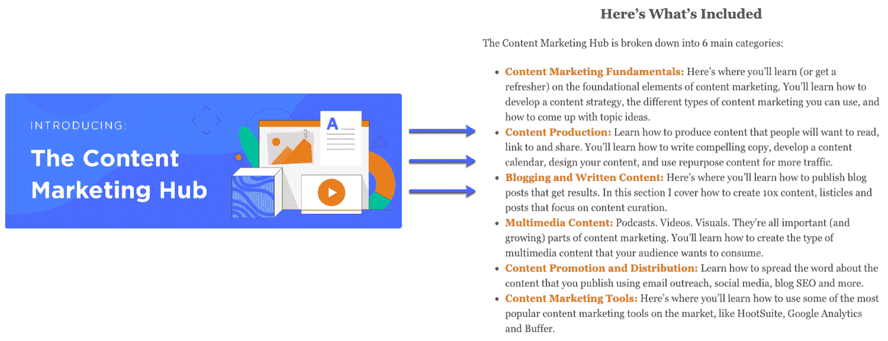

Content marketing hub by Backlinko

在里面，你可以找到 30 多种你需要了解的关于内容营销的资源，比如推广、文案和设计。

现在有灵感了？以下是一些用内容增加网站流量的技巧:

### **更喜欢看[视频版](https://www.youtube.com/watch?v=t1Z73FjHDKE)？**

### 1.写有用的内容(也就是创建回答问题的内容)

这听起来很明显，但是大多数聚焦于 SEO 的内容可以归结为:

回答一个很多人在网上问的问题，这个问题没有得到很好的回答。

如果你有一个问题，你可能会做的第一件事是什么？你谷歌一下。

它可以是任何东西。从什么是迷因，到哪里是最好的居住地，再到为什么发明了玉米片:

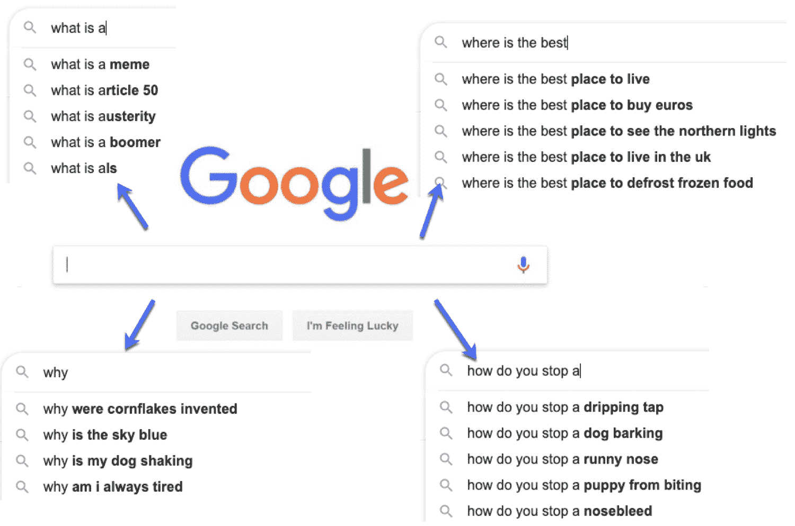

Examples of questions people search on Google

关键是:谷歌和其他搜索引擎的存在主要是为了给人们提供问题的答案。如果你能用你网站上的内容回答问题，谷歌会给你的网站送流量。

那么如何发现这些问题呢？

嗯，那是困难的部分。理解你的听众是有帮助的。使用[关键词研究工具](https://kinsta.com/blog/keyword-research/)也是如此。

(在本指南的关键词研究部分，将有更多关于如何找到这些你应该回答的问题的内容)。

但是找到问题答案的一个最简单的方法就是谷歌一下。

键入你的听众可能有的问题，然后从那里开始。我保证你会陷入一个潜在问题的兔子洞里去回答。

一旦你有了一些问题，使用这个简单的框架来编写有用的内容:

*   做一些关键词研究，找到一个流行的问题。
*   写一篇回答这个问题的文章。
*   遵循 [SEO 最佳实践](https://kinsta.com/blog/wordpress-seo/)撰写您的文章。
*   确保字数足够长，能够完整地回答问题
*   编辑你的文章([我们都会犯错](https://kinsta.com/blog/grammar-checker-tools/))。
*   点击发布，清洗，并重复。

只要确保你选择的内容主题不会在几个月后消亡……

### 2.写常青内容

[Evergreen content](https://kinsta.com/blog/evergreen-content/) 是指在发布后仍然相关的内容。

它可以包括以下内容:

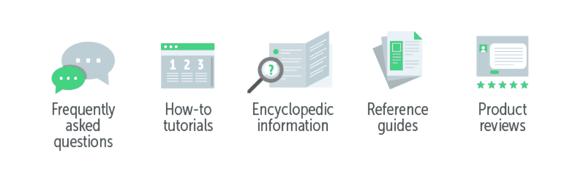

Types of evergreen content (Image source: alexa.com)

一些内容很快就会过时，而常青树内容不会像新闻文章一样过时。事实上，随着时间的推移，它可以带来稳定的搜索流量、线索和社交分享。

它还将:

*   提供持久(和复合)的价值。
*   帮助教育新顾客/客户/读者。
*   帮助建立你的权威。
*   这可能有助于吸引链接。

如果你想要一个常青树内容的例子，这是我们在 Kinsta 的知识库中做的事情。就来看看这个[常见技术问题](https://kinsta.com/knowledgebase/technical-questions/)内容:

An example of evergreen content (common tech questions) by Kinsta

这些是人们总是会问的问题(只要确保信息是最新的)。

### 3.发布长格式内容

内容长度没有对错之分。你的内容最理想的字数是能够完全覆盖主题的字数。

话虽如此，但据观察，内容越长效果越好:

Word count vs ranking position in Google (Image source: backlinko.com)

那么为什么[要写长篇内容](https://kinsta.com/blog/long-form-articles/)？

您应该这样做的主要原因有四个:

*   较长的内容通常比较短的内容排名更好。
*   内容越长，获得的社交分享就越多。
*   内容更与主题相关(一个[谷歌排名因素](https://kinsta.com/blog/google-patents-seo-ranking-factors/)
*   它有助于将读者转化为顾客(比如内容升级)

虽然字数似乎不等于更好的排名，但除了内容长度之外，还有其他因素需要考虑。

如果你想要一个长篇内容的例子…你正在读一个！

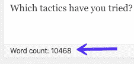

Long-form content example

### 4.发布更多列表帖子

列表文章是一篇文章，它的标题是一系列有编号的东西。

网上流传着很多列表帖子。BuzzFeed 主要发布列表帖子:

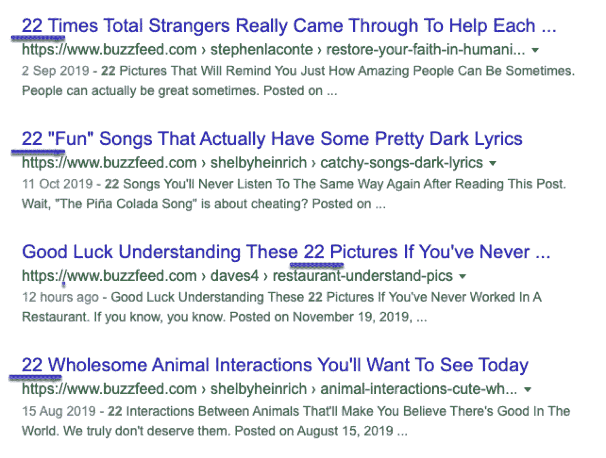

Examples of list posts ranking in Google

当涉及到为你的网站增加流量时，列表帖子很有用，因为数字是一个心理触发器。

它们不仅在阅读时容易浏览，而且吸引眼球。

当我们在网上看到标题中的一个数字时，我们更有可能点击它，因为大脑被一种叫做[点击、呼呼反应](https://www.copyblogger.com/click-whirr-buy/)的东西激活了。

这就对了，列表帖子因为科学而工作。

不过，有一点你需要记住:列表帖子对于给网站带来流量是有用的，但在将访问者转化为用户/客户时，它并不是最好的内容格式。为此，您需要利用不同的格式(通过指南、比较登录页面等。)但这是未来博客文章的主题。

让我们回到推动你的网站流量…

### 5.创建一个系统(提示:使用内容日历来计划内容)

为你的网站带来流量就像生活中的许多事情一样，都是关于一致性的。

内容策略的一致性不仅能让你和你的观众保持联系，还能向谷歌表明你有可靠的信息来源，

缓慢但稳定地发表博客文章比疯狂且不稳定的发布时间表要好。

管理它的最好方法之一就是使用内容日历。你可以在某个地方储存想法，并计划好你要发表的内容和顺序。

你可以[使用编辑日历](https://kinsta.com/blog/content-marketing-ninja/#editorial-calendar)，你选择的项目管理应用程序，如 [Trello 或 Asana](https://kinsta.com/blog/trello-vs-asana/) ，一个[替代品](https://kinsta.com/blog/trello-alternative/)，或者一个电子表格，甚至纸和笔(好吧，那就太老套了)。

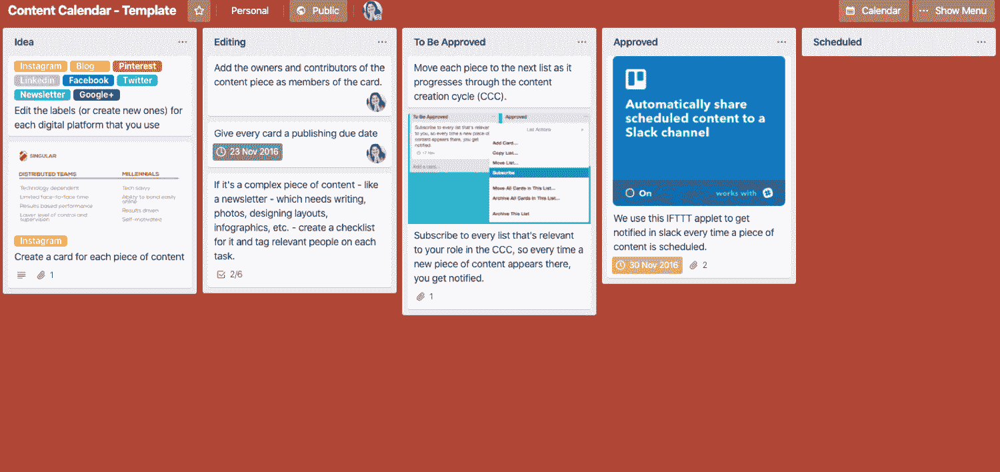

Example of an editorial calendar Trello board (Image source: trello.com)

你选择哪一个并不重要。内容日历的最佳格式是您最有可能使用并继续使用的格式。

### 6.改变其他频道内容的用途(以及其他格式)

重新利用内容最好的描述是寻找新的方法来重用现有的内容。

它有助于通过不同的媒介接触新的受众，为被遗忘的内容注入新的活力，并充分利用您的内容。

Ahrefs 在重新利用他们的博客和 YouTube 频道的内容方面做得很好，比如他们的[内容审计文章](https://ahrefs.com/blog/content-audit/) + [视频](https://bit.ly/3k4OrGn):

Example of repurposed content by Ahrefs

GaryVee 也是如此，他使用[“内容金字塔”](https://www.slideshare.net/vaynerchuk/the-garyvee-content-model-107343659)方法从一篇演讲中获取 30 多条内容:

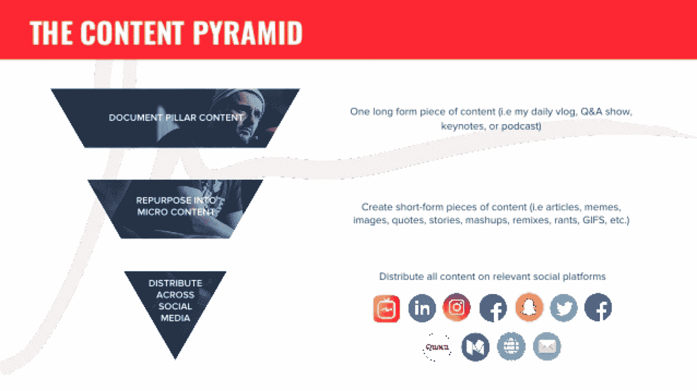

Content pyramid by GaryVee

要点是:通过改变内容的用途，从一个内容中获取尽可能多的价值。

以下是一些你可以尝试的内容再利用的想法:

*   网络研讨会>视频
*   旧博客文章>可下载指南
*   采访>博客文章或电子书
*   图片> Pinterest 图板
*   Quora 问答>博客文章
*   幻灯片>信息图表或博客文章
*   统计数据> Twitter 话题
*   博客文章>播客

### 7.创建吸引影响者的内容

大多数行业都有影响者:拥有大量追随者的个人，他们似乎获得了大量的赞、分享和内容链接。

为你自己的内容利用他们的权威不是很好吗？

如果你想让有影响力的人分享你的内容，你需要创造直接吸引他们的内容。

以下是创建影响者想要看到的内容的简单流程:

*   使用[影响者研究工具](https://bloggingwizard.com/influencer-research-tools/)寻找你所在行业的影响者，或者快速搜索[找到他们的直接电子邮件地址](https://kinsta.com/blog/find-email-address/)。
*   分析他们在谈论什么。
*   寻找一个共同的主题。
*   创建关于此主题的内容。
*   将您的内容呈现在影响者面前。

### 8.撰写引人注目的标题(使用标题分析器)

标题是内容中最重要的部分之一。

它们可能是人们在谷歌搜索结果中首先看到的东西之一。如果没有引人注目的标题，即使是最全面的博客文章也可能无人阅读。

为了帮助你制作引人注目的标题，你可以使用[标题分析器](https://kinsta.com/blog/headline-analyzer/)，就像[相扑的标题生成器](https://kinsta.com/blog/headline-analyzer/#4-sumo-kickass-headline-generator):

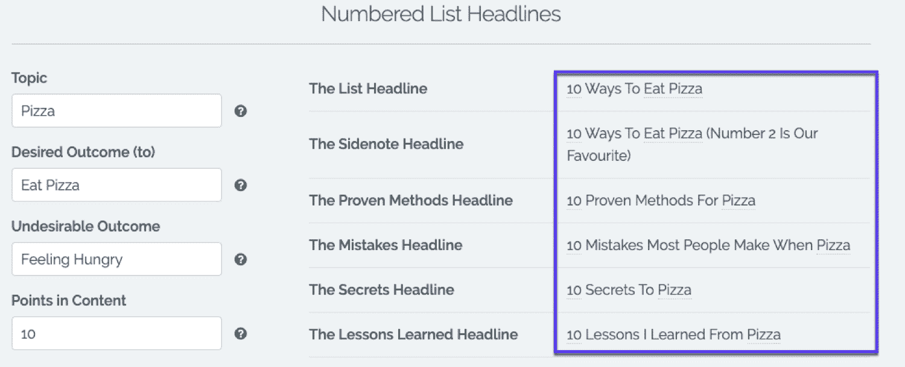

Sumo headline generator

写好标题是一种艺术形式。不过不用担心，这是可以通过实践来学习和提高的。如果你不得不从头开始，遵循以下建议:

*   研究你的顾客。
*   看看你的竞争对手的标题。
*   使用你的听众可能使用的语言(+避免行话)。
*   如果可以的话，在开头使用数字。
*   使用有力的词汇，如“秘密”、“不为人知的”、“隐藏的”
*   如果可以的话，A/B 测试一下你的标题。
*   测量你的点击率，并做出相应的调整。

### 9.改进旧的博客文章

增加网站流量的方法可能很简单，你已经有了:旧的博客文章。

如果你写博客已经有一段时间了，你的档案中可能有大量的帖子需要一些爱来让它们起死回生，并让它们产生搜索流量。

寻找徘徊在谷歌搜索结果第一页底部或第二页顶部的页面。这些页面是改进的绝佳范例。

但是你如何改进它们呢？

这里有一些快速改善旧博文的方法:

*   更新任何过时的信息。
*   添加更多图片、截图、视频等。
*   改进你的介绍(让人们想继续读下去)。
*   增加你的字数(如果这样做有意义的话)。
*   添加相关文章的链接。
*   用更短的段落和项目符号来提高可读性。
*   重新发布它们，并将其作为新内容再次推广。

不过有时候，与其更新旧帖子，不如合并它们…

### 10.合并类似的文章(+重定向他们)

如果你有一堆相同主题和关键词的相似文章，把它们合并到一篇文章中是值得的。

通过将相似的文章整合到一个页面中，它很可能在 Google 中表现得更好，同时清理你的网站架构。

为什么？

因为你没有在多篇文章中传播“权威”。相反，你有一个集中和强大的职位。你还会有一个更长的帖子，深入到一个主题，带来更多的流量。

以下是如何将相似的文章合并成一篇:

*   决定保留哪些 URL，删除哪些 URL 并重定向。
*   从旧文章中复制你想要保留的所有内容，并将其粘贴到要保留的文章中。
*   现在格式化、编辑并仔细检查这篇新文章。
*   [设置 301 重定向](https://kinsta.com/blog/wordpress-redirect/)到新页面
*   最后，删除你的旧页面。

### 11.使用摩天大楼技术

摩天大楼技术是一个营销术语，由 Backlinko 的布莱恩·迪恩创造。

基本上，它是一个将内容转化为高质量反向链接的系统。

它是这样工作的:

第一步——找到有大量反向链接的现有内容。

使用类似于 Ahrefs Content Explorer 或 T2 BuzzSumo 这样的工具来寻找有很多社交分享和链接的网址。

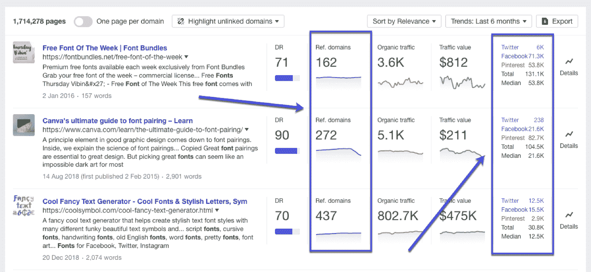

Finding successful content (to replicate) with Ahrefs Content Explorer

第二步——现在去创造一些更好的东西。

现在你需要想出如何改进它。你能添加更多最新的信息吗？也许你可以改善视觉效果或者扩展它以包含更多的点。

**第三步——推广你的摩天大楼内容**

去链接到原始内容的网站，要求链接到你的优秀内容。

这里有一个你可以使用的推广模板:

*嘿【名字】，*

*我看了你关于[主题]的帖子，注意到你链接到了这个页面:[插入链接]*

我只是想让你知道，我刚刚发布了一个更新的、更深入的版本。

*在这里:【插入摩天大楼链接】*

可能会给页面添加一个不错的内容？

*【你的名字】*

摩天大楼技术听起来很简单，但在实践中，它可能是棘手的。以下是一些有用的资源:

*   [如何执行摩天大楼技术(并获得结果)](https://ahrefs.com/blog/skyscraper-technique/)作者:Ahrefs
*   [我如何使用“摩天大楼技术”通过 HubSpot 获得 70K+的页面浏览量](https://blog.hubspot.com/marketing/skyscraper-technique-drive-traffic)
*   [如何建立高质量的反向链接到你的内容](https://www.singlegrain.com/blog-posts/link-building/the-skyscraper-technique-how-to-build-high-quality-backlinks-to-your-content/)由单粒

然而，平心而论，摩天大楼技术现在是内容营销做得好的网站中一种非常普遍的方法。这意味着如今它的影响力比几年前要弱。

尽管如此，它可能会有助于为你的博客带来一些流量。

### 12.创建一个专家综述帖子

专家综述文章是从专家那里收集引语，然后在文章中使用的博客文章。

这里有一个来自 Databox 的[例子，是关于专家认为最好的免费 SEO 工具的:](https://databox.com/best-free-seo-tools)

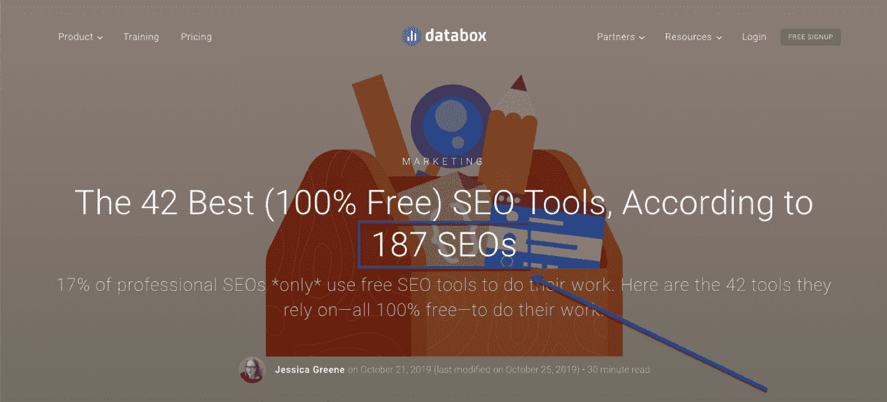

Expert roundup post example by Databox

综述对于从你所包括的人那里获得链接和分享是非常有用的。

这种类型的内容会产生流量，因为:

*   他们以主题专家为特色，这些专家可能会将你的内容分享给他们的观众。
*   它遵循列表条的结构，我们知道列表条的性能很好。
*   他们吸引了许多游客和新手，因为他们收集了知名专业人士的报价和提示。

## 电子邮件营销

如果你在网上做任何事情，你需要一封电子邮件。无论你的企业或网站的规模如何，能够给你的受众发电子邮件是至关重要的。

说真的，[世界上一半的人口使用电子邮件](https://www.oberlo.com/blog/email-marketing-statistics):

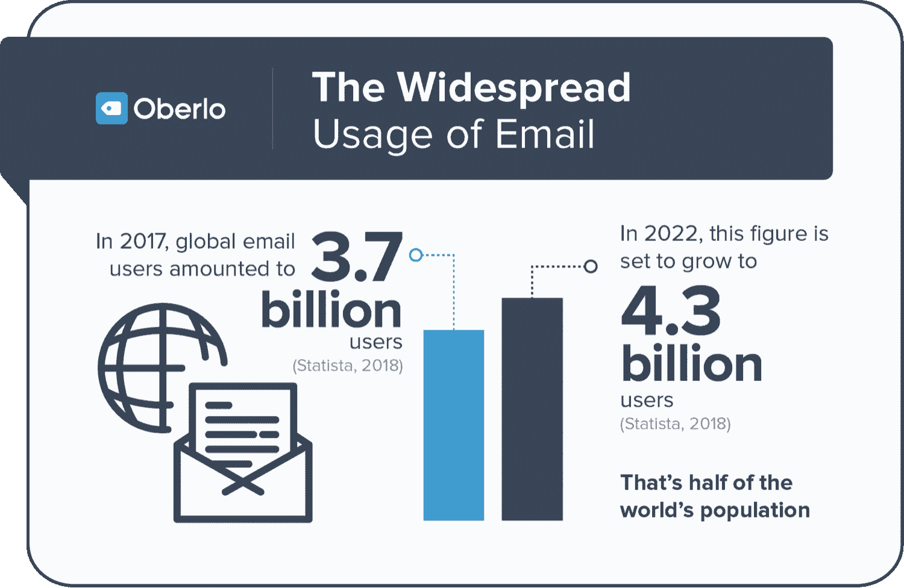

Email statistics by Oberlo

有如此多的人可以通过他们的收件箱联系到，电子邮件是增加网站流量的最佳方式之一，因为:

*   您的电子邮件列表已经对您的网站感兴趣。
*   流量几乎是有保证的，因为你是直接与你的名单交谈。
*   电子邮件为你选择的页面带来定向流量。

### **更喜欢看[视频版](https://www.youtube.com/watch?v=crJicYJDofg)？**

### 13.通过电子邮件营销增加网站流量

电子邮件营销是一种相当便宜但有效的接触受众的方式。

除了遵循[电子邮件营销最佳实践](https://kinsta.com/blog/email-marketing-best-practices/)之外，以下是一些通过电子邮件营销增加流量的重要步骤:

*   [尽快建立用户列表](https://kinsta.com/blog/how-to-build-an-email-list/)。
*   选择合适的[电子邮件营销软件](https://kinsta.com/blog/email-marketing-software/)。
*   让你的邮件切中要点。
*   写醒目的主题行。
*   在你的电子邮件中添加社交分享按钮。
*   添加 CTA(行动号召)。
*   不要发太多邮件。
*   确保你的电子邮件模板可以在手机上使用，并且[不会被标记为垃圾邮件](https://kinsta.com/blog/email-authentication/)。

### 14.使用内容升级来获得更多订户

内容升级(或销售线索磁铁)是你为换取电子邮件地址而放弃的资源。下面是一些[最好的潜在客户生成 WordPress 插件](https://kinsta.com/blog/wordpress-lead-generation/)的列表。

如果你得到了正确的升级，你的观众会很乐意注册你的电子邮件列表，以便获得免费内容。

然而，你必须了解你的观众，知道他们想要什么。Perfect Keto 在这方面做得很好:

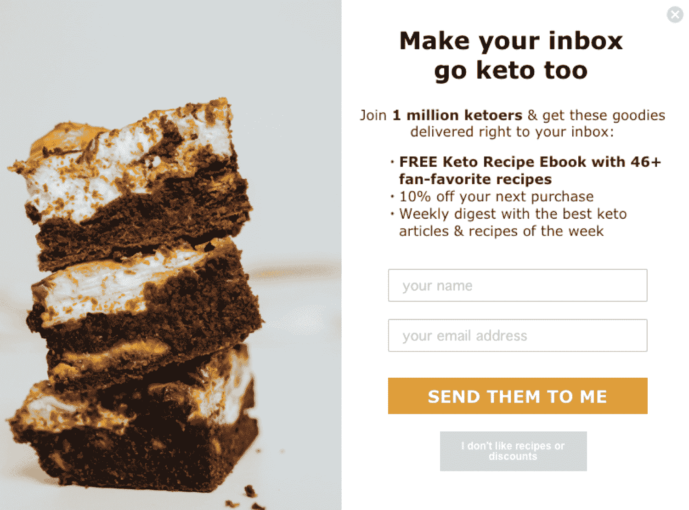

Content upgrade example by Perfect Keto

您可以使用的一些内容升级示例有:

*   清单。
*   备忘单。
*   快速入门指南。
*   电子书。
*   模板。
*   免费课程。

### 15.创建电子邮件欢迎系列

一个[欢迎电子邮件系列](https://kinsta.com/blog/how-to-use-mailchimp/#mailchimp-autoresponder-emails)是一系列的电子邮件，当你的订户第一次选择加入你的列表时，这些电子邮件会自动发送给他们。

只要记住:这是你留下良好第一印象的机会。这可以大大增加你的网站流量，以及增加你的订户。

[Drift](https://www.drift.com/) 很好地处理了这封邮件，它开门见山，将新订户引向热门内容:

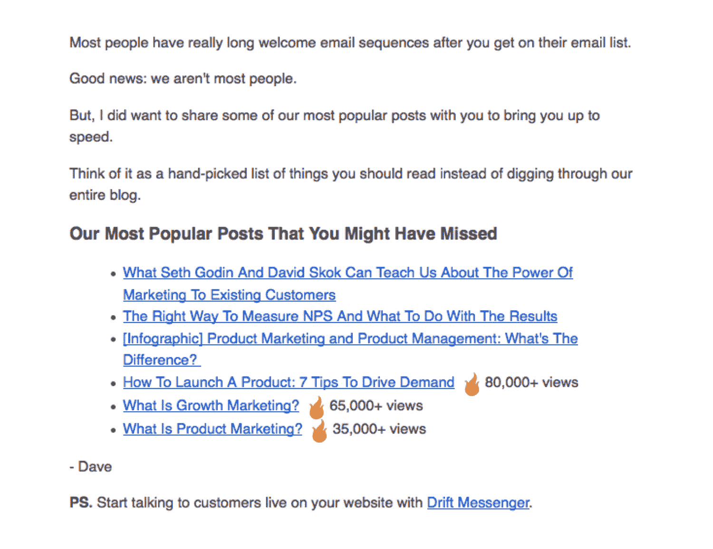

Welcome email example by Drift (Image source: hubspot.com)

### 16.添加一种方式来捕获电子邮件到您的网站

要开始利用电子邮件的力量来增加流量，你需要一种通过你的网站收集电子邮件地址的方法。

您可以使用侧栏或内容内注册表单，如下所示:

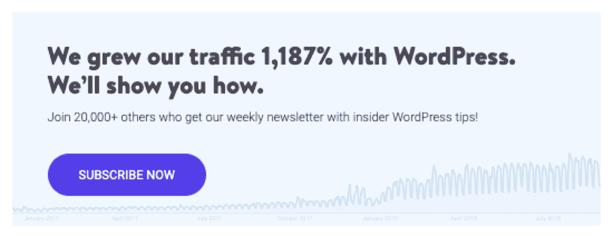

Example of Kinsta’s email signup form

这里的关键是给人们一个令人信服的注册理由。

## 促进

你写了一些很棒的内容，现在呢？

是时候推广了。

以下是一些可以尝试的内容推广策略:

### **更喜欢看[视频版](https://www.youtube.com/watch?v=bfbOS3utcLg)？**

### 17.将您的内容提交到聚合站点

内容聚合器是一个不创建自己内容的网站。相反，他们从其他网站收集内容，并将其“聚合”到一个位置。

用户通常喜欢聚合器，因为它让他们有机会在一个地方找到各种各样的内容。另一方面，出版商将他们的内容呈现在想看的人面前。

以下是内容聚合者的一些想法:

*   [Reddit](https://www.reddit.com/)
*   [网页设计师新闻](https://www.webdesignernews.com/)
*   [设计师新闻](https://www.designernews.co/)
*   [Growth.org](https://growth.org/top)(原入境)
*   [黑客新闻](https://news.ycombinator.com/)
*   [Mix](https://mix.com/) (原名 StumbleUpon)
*   Digg
*   [del.icio.us](https://del.icio.us/)
*   [熊猫](https://usepanda.com/)
*   [差异](https://www.fark.com/)
*   [成长黑客](https://growthhackers.com/posts)
*   [AllTop](https://alltop.com/)
*   [Managewp.org](https://managewp.org/)
*   [脸书集团](https://www.facebook.com/groups/)
*   [LinkedIn 群组](https://www.linkedin.com/groups/)
*   热情

### 18.写一些客座博文

客座博文是指你为自己网站之外的网站写博文。作为回报，你会得到一个链接回到你的网站。

这会给你的网站带来流量，给你带来反向链接，并有助于提高你的品牌知名度。

客座博文的最大挑战之一是找到愿意接受和发布你的客座博文的合适网站。

幸运的是，只需快速的谷歌搜索( [+一些搜索运营商](https://kinsta.com/blog/google-search-operators/))，你就能找到大量与你的领域相关的客座博文机会:

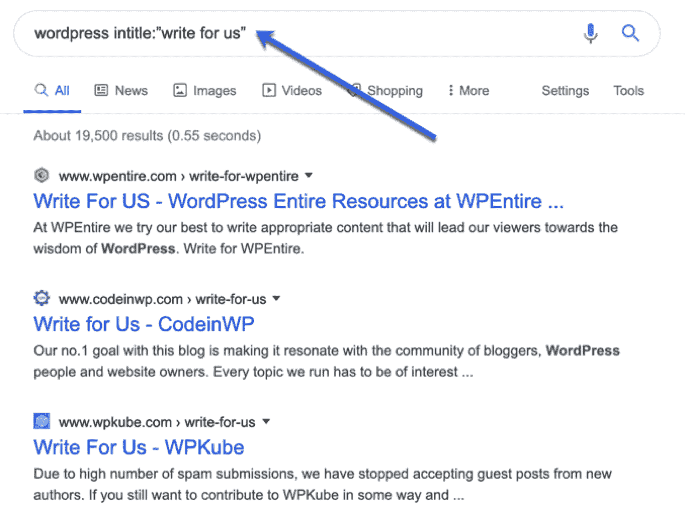

Finding topic relevant guest post opportunities with Google

这里有一个可以尝试的操作符列表(只要记住切换出与你的网站相关的关键词):

*   关键词标题:“为我们写作”
*   关键词标题:“为我写作”
*   关键词标题:“贡献于”
*   关键字 intitle:"submit" + inurl:blog
*   关键词“提交客座博文”
*   关键字 inurl:/guest-post/
*   关键词“客座博文”
*   关键词“客座博文作者”
*   关键词“接受客座博文”
*   关键词“客座博文指南”
*   关键词“客座作者”
*   关键词“嘉宾文章”
*   关键词“嘉宾专栏”
*   关键词“成为贡献者”

### 19.通过博客推广来推广你的网站

Blogger outreach 是找到相关博客并向他们发送个性化电子邮件的过程，该电子邮件突出了您的网站、服务、产品等。

#### 第一步——找到可以联系的博客

你可以联系博客:

*   你已经在你的网站上介绍过的人。
*   写了相同主题的内容。
*   他们以前链接过类似的主题。
*   发了相关文章的人。

#### 第 2 步-为他们找到正确的联系方式

在联系之前，你需要[找到你要联系的博主的电子邮件地址](https://kinsta.com/blog/find-email-address/)。

有几种方法可以做到这一点，但最快的方法之一是使用电子邮件查找工具，如 [Hunter.io](https://hunter.io/) :

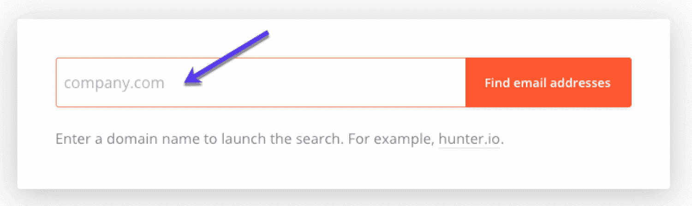

Find email addresses with Hunter

#### 第三步——撰写你的推广邮件

现在你需要写下你要发送的电子邮件。

如果你需要一些帮助来构思你的推销，看看 HubSpot 的这些[电子邮件推广模板](https://blog.hubspot.com/marketing/link-building-email-templates)。

现在剩下要做的就是点击“发送”。

### 20.邀请他人在您的网站上发表客座博文

别忘了:客座博文是双向的。

不要以为你只能为其他网站写内容。邀请其他人也为你的博客写稿。当然，前提是他们写了一篇让你的读者感兴趣的高质量原创文章。

你不仅会在你的网站上获得一些新的内容，而且客座博主很可能会推广这篇文章，为你的网站带来更多的流量。

每个人都是赢家。

### 21.在介质上书写(+其他站点)

Medium 是一个用户生成的网站，它根据用户的阅读习惯对文章进行优先排序和推荐。

您应该考虑在介质上书写，因为:

*   它能给你的网站带来稳定的流量。
*   它拥有一批内在的、积极参与的观众。

他们甚至有一个仪表板，显示你的文章做得怎么样:

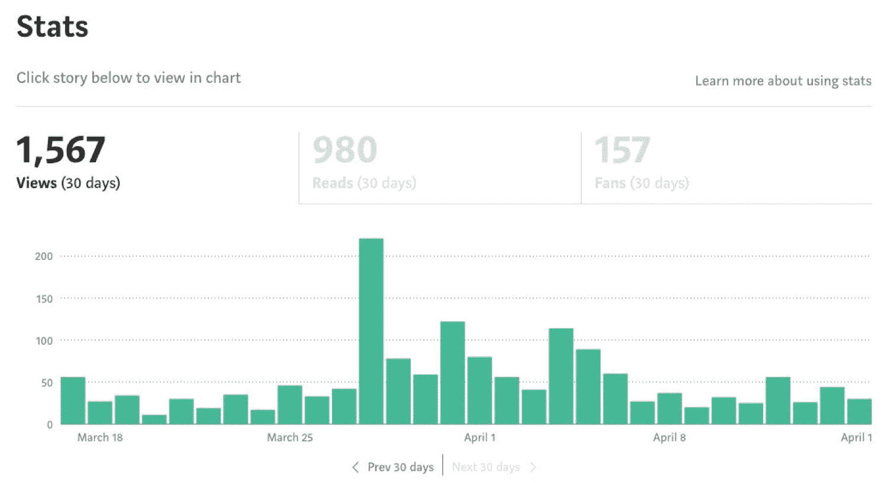

Article stats/performance dashboard on Medium

还有几个像 Medium 这样的网站，你可以在上面写作，比如:

*   [Write.as](https://write.as/)
*   [Svbtle](https://svbtle.com/)
*   [Steemit](https://steemit.com/)

请务必阅读我们的 [Medium vs WordPress 指南](https://kinsta.com/blog/medium-vs-wordpress/)。
T3】

## 团体

当我们谈到推广的话题时，在在线社区中分享内容可以是一种很好的方式来推动流量回到你的网站，尽管它变得越来越难，因为越来越多的人在做它，而且它不可扩展。尽管如此，它总是值得测试。

### **更喜欢看[视频版](https://www.youtube.com/watch?v=5T2jvp_2FJ4)？**

### 22.在相关在线社区中推广内容

在线社区是你的观众在网上闲逛的地方，可以包括脸书集团、Reddit、Slack 频道和论坛。

如果你已经是利基的一部分，找到相关的在线社区是很容易的。

如果你不是，这里有一些有用的资源:

*   [闲置社区目录](https://slofile.com/)
*   [400 个闲置社区](https://medium.com/startupsco/the-full-list-of-400-slack-communities-5545e82cf65d)
*   [500 多个脸书群组](https://www.seosiren.com/download-500-huge-facebook-groups-list/)(通过 Dropbox)
*   [5000 个顶部子街道](http://redditlist.com/)

### 23.在 Reddit 上发布有用的内容

Reddit 是一个庞大而活跃的社区。可能已经有一个与你的网站相关的子编辑了。

利用 Reddit 可以给你的网站带来大量的流量，如果你做对了，不要被任何时候发生的大量讨论所淹没。

事实上，你可以使用一个类似于 [Notifier for Reddit](https://notifierforreddit.com/) 的工具来跟踪 Reddit 的讨论:

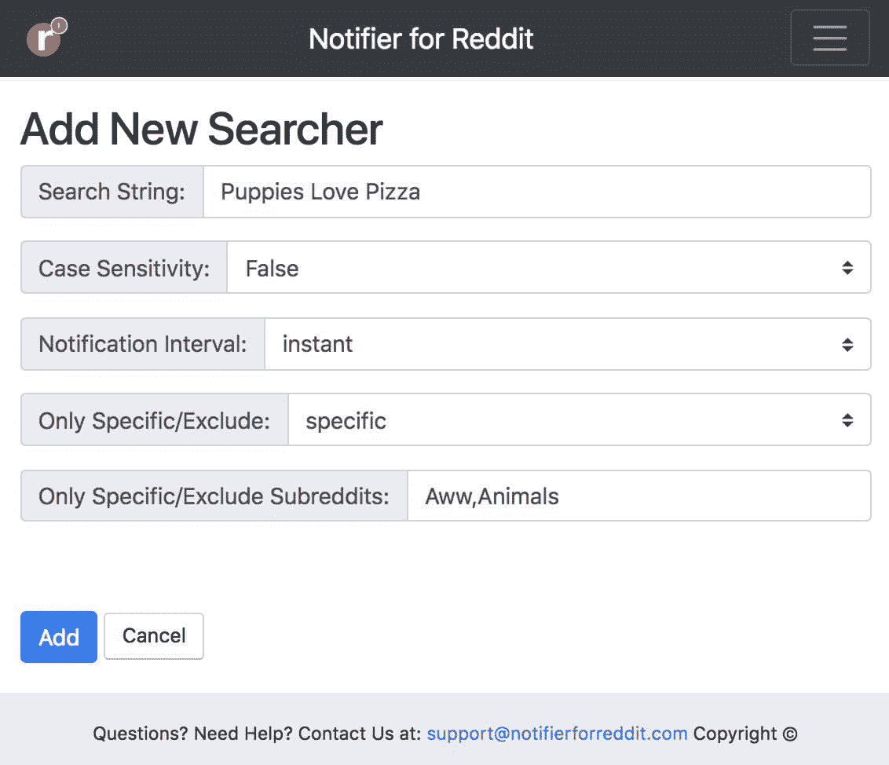

Reddit Keyword Monitoring

然而，在 Reddit 上推广东西可能很难。而用户如果不喜欢你做的事情，也不会手下留情。

以下是在 Reddit 上发帖的一些最佳实践:

*   先做会员。
*   付出比索取多。
*   发布原创内容并以真实的方式参与。
*   不要用假账号。

### 24.加入脸书群(+分享您的内容)

你应该加入一些与你的领域相关的脸书团体，在里面分享你的内容。

同样，你应该**首先尊重这些团队中关于晋升的具体规则**。

脸书团体涵盖了你的目标受众可能会去的广泛领域。对我们来说， [WordPress 支持](https://kinsta.com/blog/wordpress-support/)像 [WordPress 自由职业者](https://www.facebook.com/groups/wordpressfreelancers/)或 [WordPress 加速](https://www.facebook.com/groups/wordpressspeedup/)这样的团体可能会有对我们的内容感兴趣的成员。

实际上，您可以搜索群组来查找与您的内容相关的讨论:

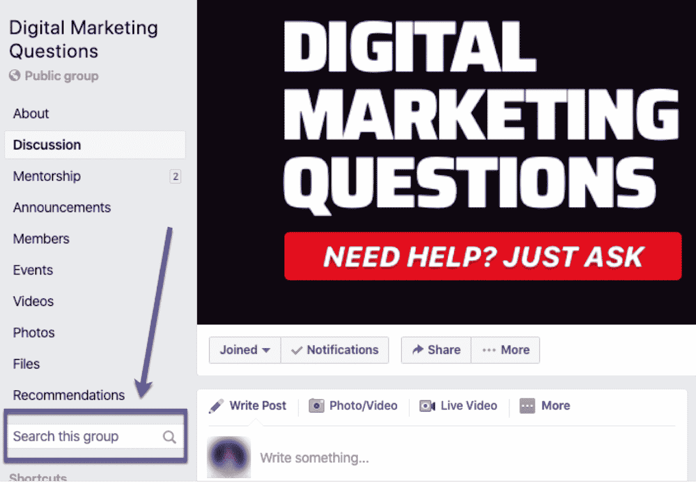

Digital Marketing Questions is a popular Facebook group

找到与你想推广的职位相关的讨论，然后加入进来。试着用一种对话的方式分享它，以帮助整个团队。

像所有在线社区推广一样，你要确保自己给人的印象是有益的，而不是垃圾邮件。

### 25.在 Quora 上回答问题

Quora 可以极大地增加你网站的流量。

如果您还没有帐户，首先您需要创建一个帐户。一旦你有了 Quora 账号，你需要找到正确的问题来回答。

这很简单，只需输入一个关键词，Quora 就会向你推荐相关主题:

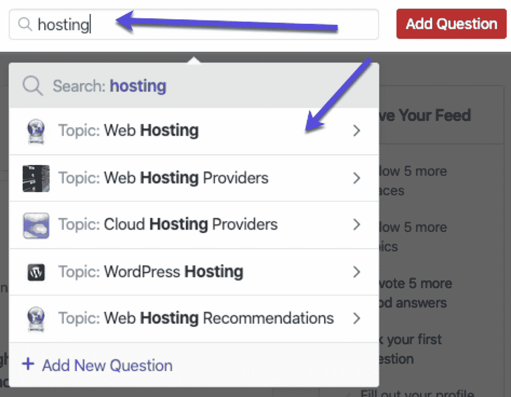

Quickly find niche relevant questions to answer on Quora

选择您的主题，您将能够看到与该主题相关的最新问题。

只要点击“回答”来添加你的。尽量完整地回答问题，如果有意义的话，提供一个链接到你网站上的任何相关内容。

如果你想充分利用 Quora，完整地完成你的个人资料，选择与你的读者相关的问题，并在有意义的地方添加链接。你也应该看看我们的 Quora 营销技巧,以帮助扩大你的覆盖面。

顺便说一下，你也可以试试其他的问答网站，遵循同样的原则:

*   [雅虎回答](https://answers.yahoo.com/)
*   [堆叠交换](https://stackexchange.com/)
*   [堆栈溢出](https://stackoverflow.com/)
*   [答案](https://www.answers.com/)

### 26.发布产品搜索

[Product Hunt](https://www.producthunt.com/) 是一个社区，每天收集最好的新移动应用、网站和技术产品。

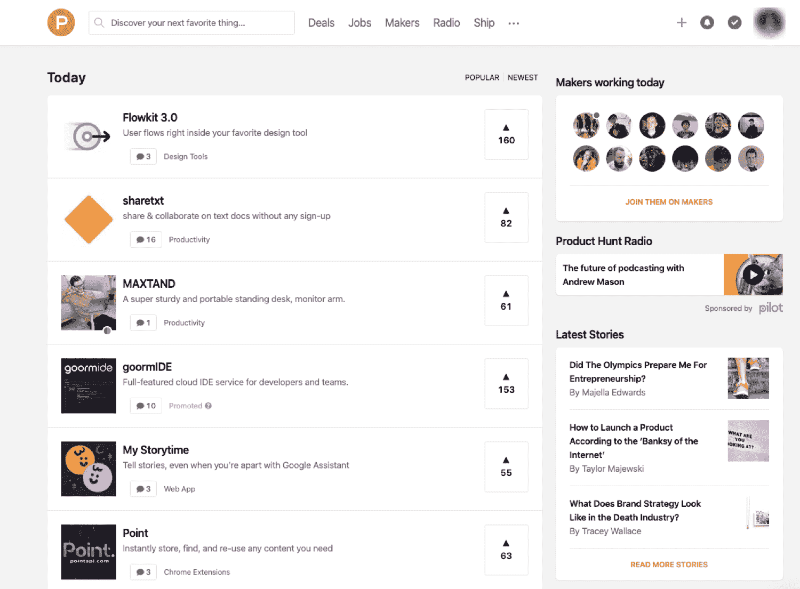

Product Hunt homepage can drive traffic back to your site

从产品搜索中获取流量是一门艺术，所以这里有一些技巧:

*   尽快回答关于线程的问题。
*   发推文给投票支持你的用户，并感谢他们。
*   告诉您的社交媒体关注者和电子邮件列表您的产品搜索发布。
*   确保你已经在你的 WordPress 网站上设置了 Google Analytics 来跟踪你的搜索结果。保持您的[分析数据免受垃圾推荐](https://kinsta.com/blog/google-analytics-spam/)。
*   检查您在脸书、推特等网站上分享的图片。
*   不要求 upvotes，只要分享你 PH 帖子的网址，让用户自己决定。

更详细的概要，你可以查看他们的指南。

### 27.通过论坛增加你网站的流量

自从网络出现以来，论坛就一直存在。从那时起，人们就一直用它们来驱动流量回到他们的网站。

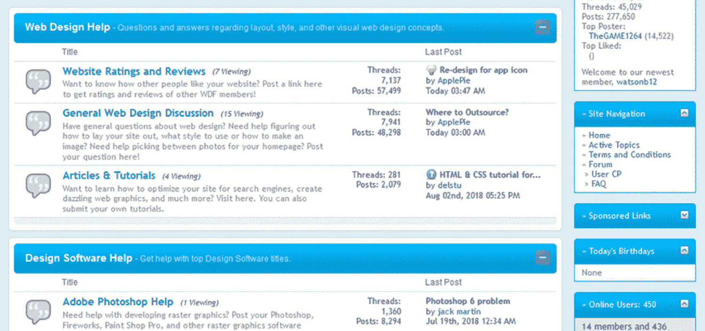

Niche forums may be ugly, but they can drive good (and relevant) traffic to your website

即使某些论坛可能看起来过时了，如果他们有一个积极的观众，他们可以成为相关流量的巨大来源。

这里有一些在论坛上推广你的网站的技巧:

*   选择适合你的论坛。
*   仔细选择你的用户名。
*   在你的签名中添加一个链接。
*   精心制作你的个人资料。
*   不要滥发。
*   提供优质内容。
*   开始新线程。
*   经常发帖。

如果你找不到合适的论坛提交，你可以…

### 28.创建您自己的论坛

如果你不能为你的行业找到一个好的论坛，你可以考虑自己建立一个。事实上，有了 [WordPress 论坛插件](https://kinsta.com/blog/wordpress-forum-plugins/)，你可以很快被设置好。

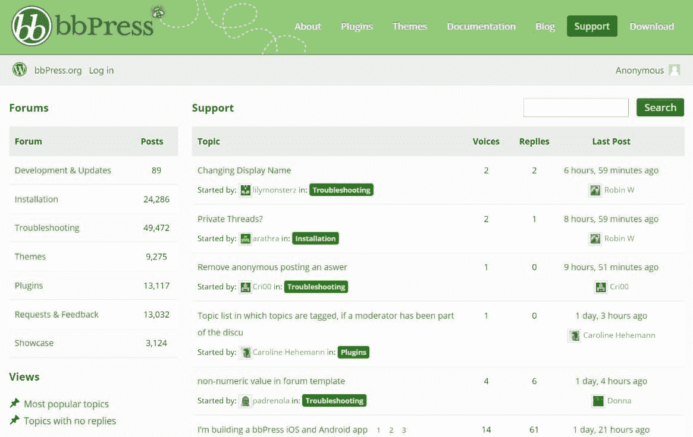

WordPress forum

如果你真的走这条路，你需要确保你的用户生产高质量的内容，你有版主，你的论坛有良好的 UX。

做好这一点意味着会有稳定的流量回到你的网站。

## 搜索引擎优化

如果你忽略了 [SEO](https://kinsta.com/blog/what-does-seo-stand-for/) ，世界上所有的关键词研究(稍后会有更多)和内容都不会拯救你的网站。

SEO 是让流量持续流入你的网站的最好方法之一。只要你在谷歌排名靠前，你就能给你的网站带来有机流量。

这听起来很棒，但是生活中没有什么是不劳而获的。

为了从 SEO 中获益，你需要写一些人们在 Google 中搜索的主题(我们在上一节已经讨论过了)。但是，为了充分受益于它，你还需要确保你的网站为搜索引擎优化。

这里有一些你现在可以做的事情来使用 SEO 来增加你网站的流量:

### **更喜欢看[视频版](https://www.youtube.com/watch?v=a0R78h7NMhg)？**

### 29.关注你网站的 SEO 健康

SEO 非常简单。遵循最佳实践的大部分好处是确保你的网站是健康的，并且拥有谷歌期望看到的一切。

设置好这些东西会对你网站的流量产生很大的影响。

以下是你需要的 SEO 基础知识:

*   像 WordPress 这样的 SEO 友好的 CMS。
*   响应式设计和良好的移动可用性。
*   有效的 [SSL 证书](https://kinsta.com/knowledgebase/how-ssl-works/)。
*   一个[快速可靠的 web 主机](https://kinsta.com/blog/managed-wordpress-hosting/)。
*   相关网站的链接。
*   人们真正想读的内容。

很明显，SEO 可以有更多的元素，网站技术健康是其中之一(我们将在后面讨论)，但这应该为你打下基础。

### 30.建立你网站的反向链接

权威网站和相关网站的链接就像是对你网站的信任票。

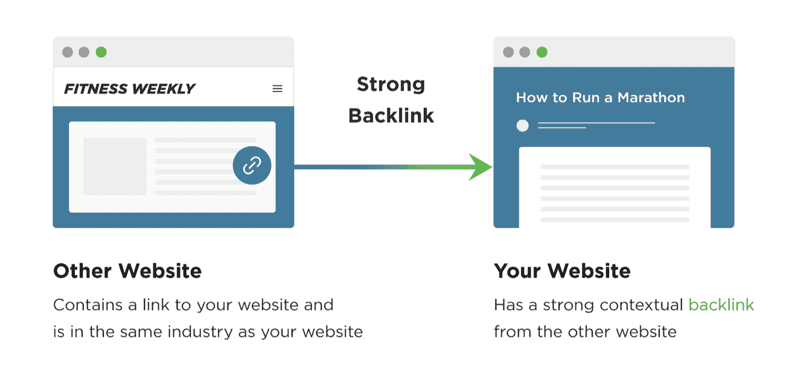

A simple overview of how backlinks help your site’s SEO (Image source: backlinko.com)

要建立的链接类型会因你所处的位置而不同。以下是一些有用的链接建设资源:

*   [9 个简单的链接构建策略(任何人都可以使用)](https://ahrefs.com/blog/link-building-strategies/)作者:Ahrefs
*   [Loganix 为任何预算制定的 50 个本地链接建设策略](https://loganix.net/local-link-building-tactics/)
*   Mangools 的 [60+链接构建技术清单](https://mangools.com/blog/link-building-techniques-checklist/)

#### 查看[这个指南](https://www.youtube.com/watch?v=Jy_cLS3VShA)来优化搜索引擎优化链接

### 31.获取特色片段中的内容

自成立以来，谷歌一直在向搜索结果添加更多信息，以增强用户体验。

其中一个功能是**精选片段**:

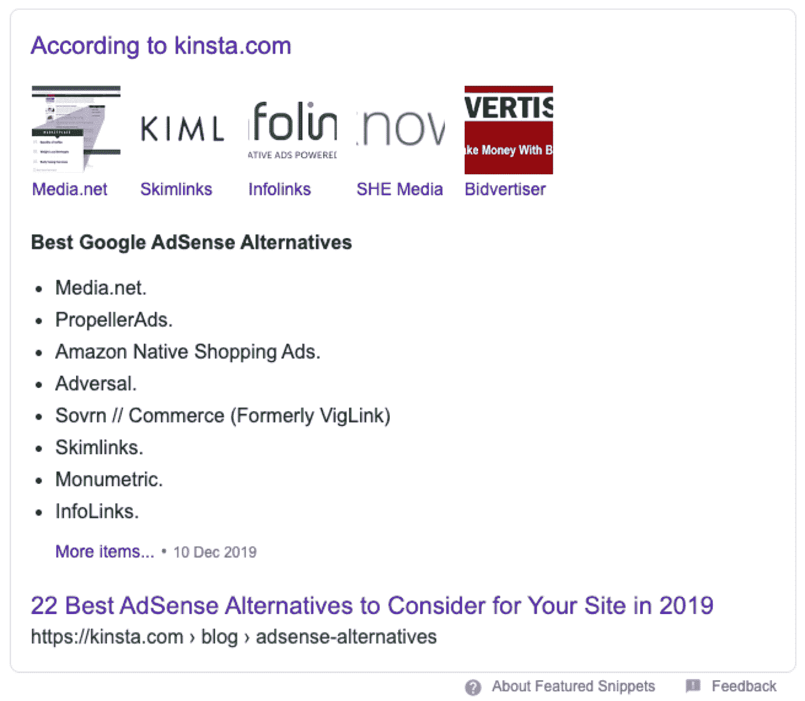

Featured snippet example

特色片段是直接出现在谷歌搜索框下的内容框。它们旨在为用户的搜索查询提供快速的答案(甚至不需要点击实际的网站来获得答案)。

片段可以是一个伟大的方式来发送流量到您的网站，尤其是如果你已经有一些预先存在的排名内容。

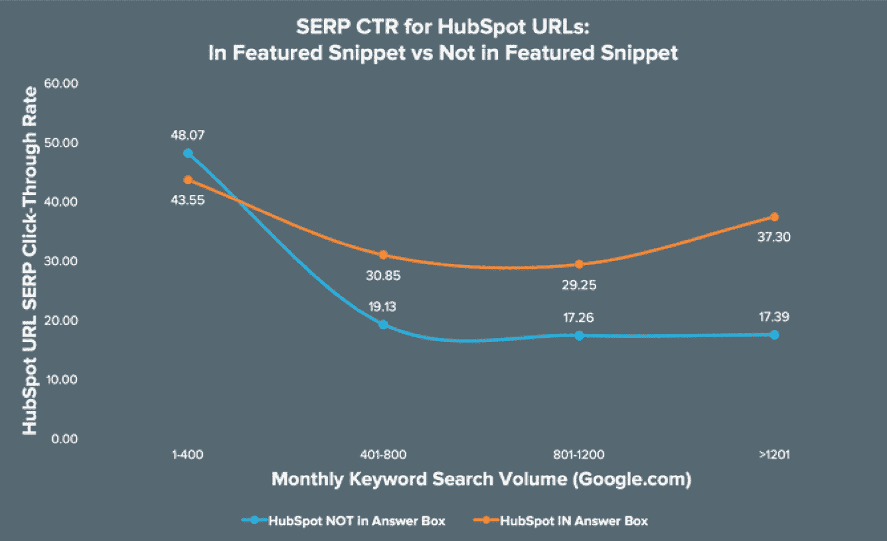

Increasing CTR for ranking in the featured snippet is worth your time

我们之前讨论了如何获得特色片段，但是如果你需要一个快速的纲要，这里有一个如何优化的快速总结:

*   目标问题-关键词。
*   注意摘录的类型(段落、列表、表格等)。
*   保持段落和句子简短。
*   直接回答问题。
*   用副标题逻辑地组织你的内容。
*   用表格来说明。
*   将问题包含在答案中
*   在内容的开头或结尾添加摘要。

### 32.使用分析数据找出表现不佳的页面(反之亦然)

如果你[熟悉谷歌分析](https://kinsta.com/blog/how-to-use-google-analytics/)打开仪表板。

进入行为>网站内容>登陆页面，然后点击会话栏，从低到高排序。

你会得到这样的结果:

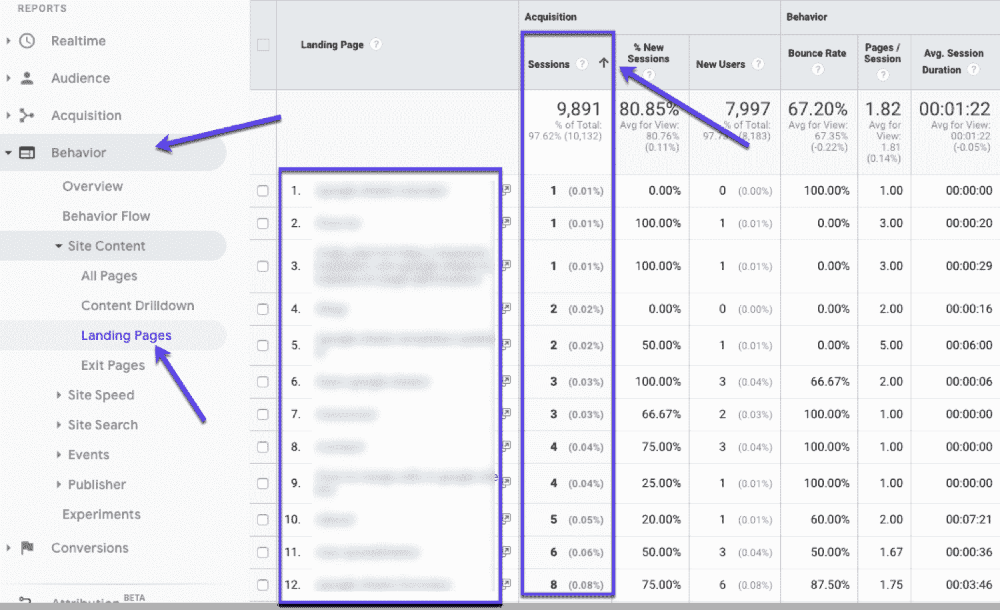

Finding underperforming pages (to improve) in Google Analytics

现在你可以看到流量最低的页面。

从这里，看看他们是否错过了你的表现最好的页面。尝试改善这些表现不佳的页面，这样你网站上的每个页面都会带来流量。另一个收集更有洞察力的数据的工具是谷歌搜索控制台，特别是它的[性能标签](https://kinsta.com/blog/google-search-console/#how-to-find-your-highest-traffic-pages)。

当然，你也可以反过来做:

过滤分析和搜索控制台，以显示您的最高性能的网页，看看你是否可以使它们变得更好。

当您使用 Google Analytics 时，您应该…

### 33.优化您的最佳流量来源

在分析中，进入采集>所有流量>来源/媒体。

现在，您将看到您的流量来自哪里:

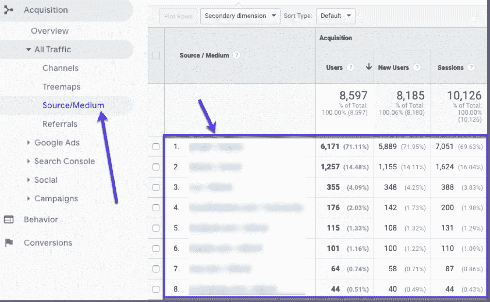

Finding top traffic sources in Google Analytics

如果您不确定:

*   **来源**是用户在看到你的内容之前所在的地方，比如搜索引擎或其他网站。
*   **Medium** 描述用户如何到达你的内容。

从这里开始，你要问几个关于你的流量来源的问题:

*   哪个发送的**流量最高**。
*   其发送**最高转换**流量。
*   发送最繁忙的流量。

从那里，试着找出为什么这些资源是有效的。然后尝试复制它。

你应该考虑的不仅仅是你的流量来源…

### 34.窃取竞争对手的流量来源

有时候，获得更多流量的最好方法是看看什么已经在起作用了…然后去做。

最快的方法之一就是“窃取”你的竞争对手的流量。如果你觉得从你的竞争对手那里偷东西很糟糕，我们就称之为*逆向工程*吧。

现在你将需要使用一个搜索引擎优化工具。

这里有两种快速窥探竞争对手的方法:

#### 竞争对手流量方法# 1–相似网络

转到 [SimilarWeb](https://similarweb.com/) 并将你的竞争对手的网址粘贴到搜索框中。

向下滚动到推荐部分，查看他们从哪里获得流量:

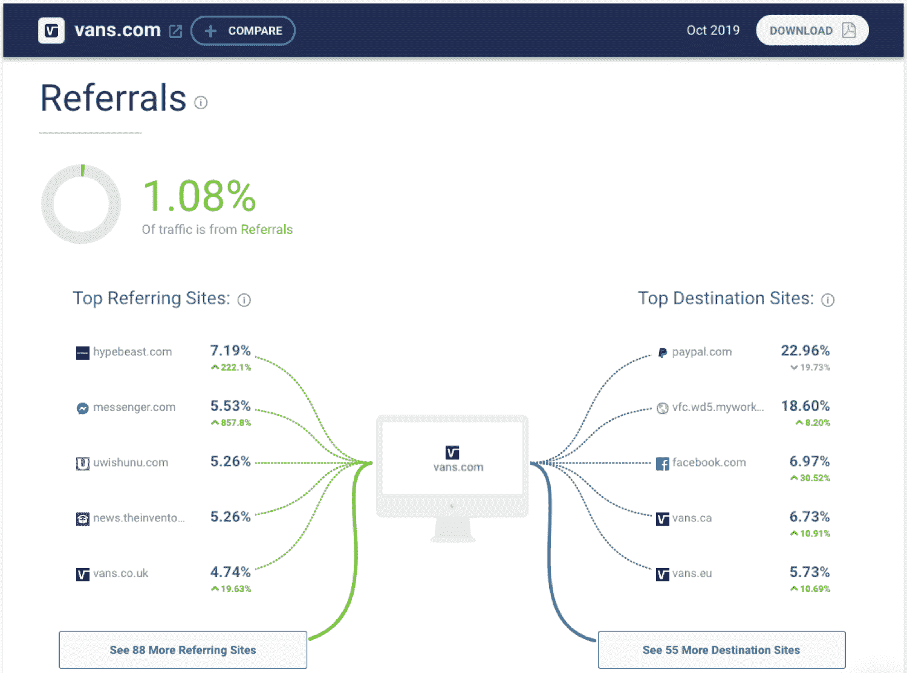

Spying on your competitors traffic using SimilarWeb

#### 竞争对手流量方法# 2–Ahrefs

转到 [Ahrefs 反向链接检查器](https://ahrefs.com/backlink-checker)。输入竞争对手的域名，然后点击检查反向链接。

现在你可以看到前 100 个反向链接，以及它们给你的竞争对手带来了多少流量:

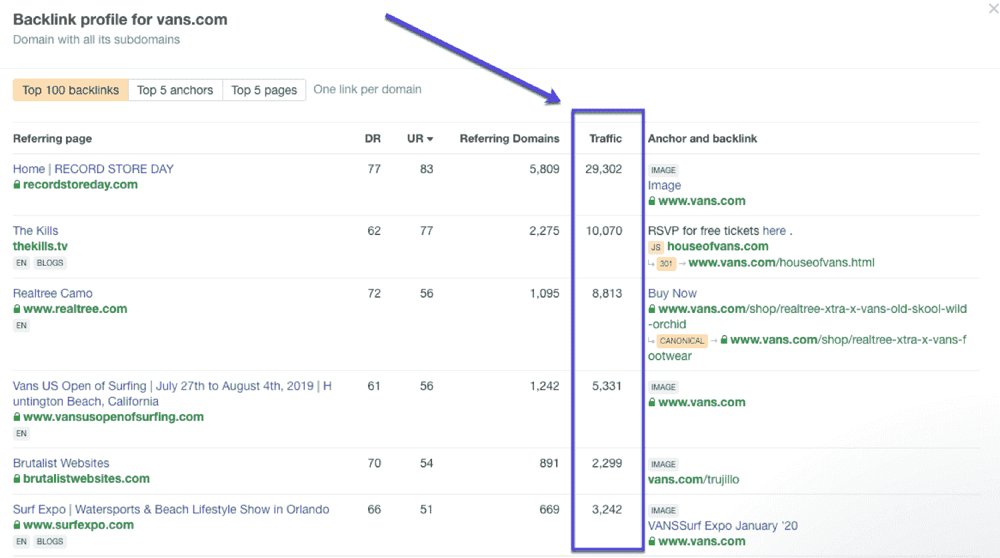

Spying on your competitors traffic using Ahrefs

了解了什么对你的竞争有利，你就可以出去尝试复制它。

## 关键词研究

[关键词研究](https://kinsta.com/blog/keyword-research/)是找到你的受众正在搜索的相关短语(关键词)的过程。

一旦你有了一个关键词列表，你就想把它们包含在页面中，让这些页面出现在搜索引擎中。

有很多方法可以生成关键词，既可以使用免费工具，也可以使用高级工具。

让我们开始吧:

### **更喜欢看[视频版](https://www.youtube.com/watch?v=UIQSwWCpYzs)？**

### 35.有流量潜力的目标话题

SEO 是给你的博客带来持续流量的最好方法之一(本文后面会有更多介绍)。

但是要让谷歌把访问者送到你这里，你需要显示正确的关键词。换句话说:你需要针对**有流量潜力的关键词**。

毕竟，你希望你的流量看起来像这样:

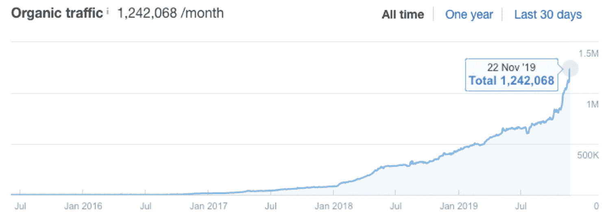

The type of graph all website owners want to see: organic traffic increases

进行关键词研究时，您需要记住的指标有:

1.  **搜索和全球量:**每月有多少人在搜索该关键词
2.  **关键词难度:**关键词排名的难度。

有很多免费和付费的关键词研究工具。以下是一些最好的例子:

*   Ahrefs 关键字浏览器(付费)
*   塞姆拉什(已付)
*   KWFinder(付费)
*   [UberSuggest](https://kinsta.com/blog/website-traffic-analysis/#7-ubersuggest) (免费)
*   谷歌关键词规划器(免费)
*   关键词压片机(免费)

哦，别忘了:

### 36.目标长尾关键词

长尾关键词是 3 个以上单词的短语，非常具体地针对你正在出售的东西或你在博客上提供的信息。

这里有一个例子:

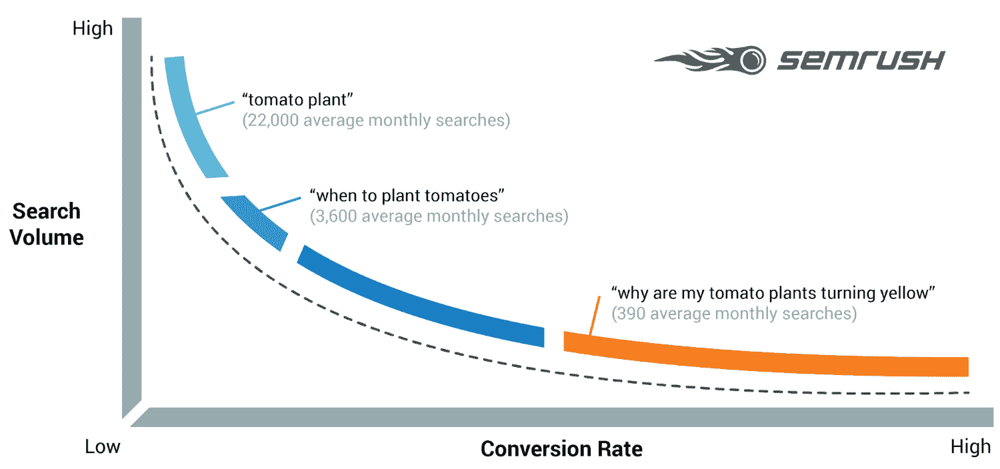

Longtail keywords = more conversions (Image source: semrush.com)

请注意，随着关键词变得越来越长、越来越具体，转化率也会增加。

这是长尾关键词的好处之一，同时也是它们更容易排名的事实(因为它们的竞争力更低)

那么如何找到长尾关键词呢？

嗯，不用离开谷歌就能做到这一点非常容易。

下面是 **3 种快速找到长尾关键词的方法:**

**方法 1–自动完成**

首先是**自动完成**。只要开始输入你的主要关键词或主题，让谷歌根据其他人搜索的内容产生建议:

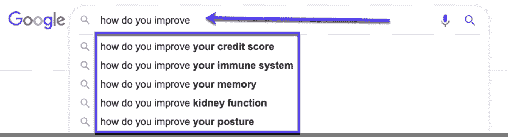

Using Google autocomplete for keyword research

**方法 2——人们还会问**

## 注册订阅时事通讯

### 想知道我们是怎么让流量增长超过 1000%的吗？

加入 20，000 多名获得我们每周时事通讯和内部消息的人的行列吧！

[Subscribe Now](#newsletter)

如果你在结果页面上向下滚动一点，你会看到下一个长尾关键词研究方法:**人也问** (PAA)框:

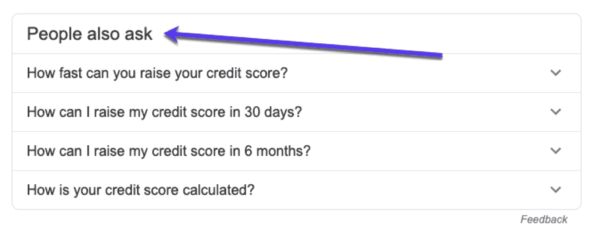

Using Google’s people also ask boxes for keyword research

**方法 3-相关搜索**

最后，页面底部是**相关搜索**建议:

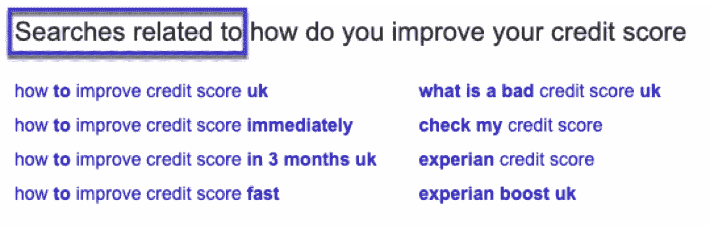

Using Google’s related searches for keyword research

Boom:这是只用谷歌进行长尾关键词研究的三种方式。

### 37.做基于问题的关键词研究

正如我们前面提到的，你真的想写人们问的事情。

找到这些基于问题的关键词的两个伟大工具是[回答公众](https://answerthepublic.com/)和 [QuestionDB](https://questiondb.io/) 。

只要输入你的关键词，你就会得到大量的问题想法。

以下是“回答公众”栏目中关键词“信用卡”的搜索结果:

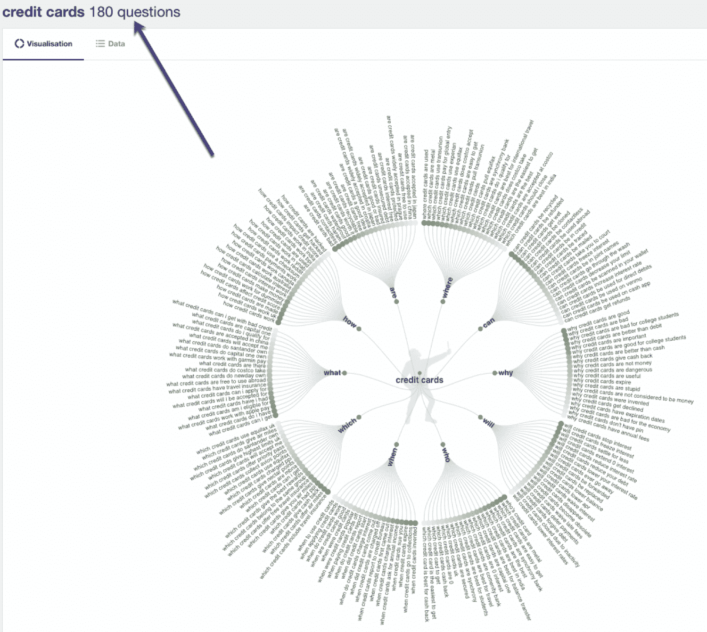

Use AnswerThePublic to generate lots (and lots) of question-based keywords

以下是 QuestionDB 的结果:

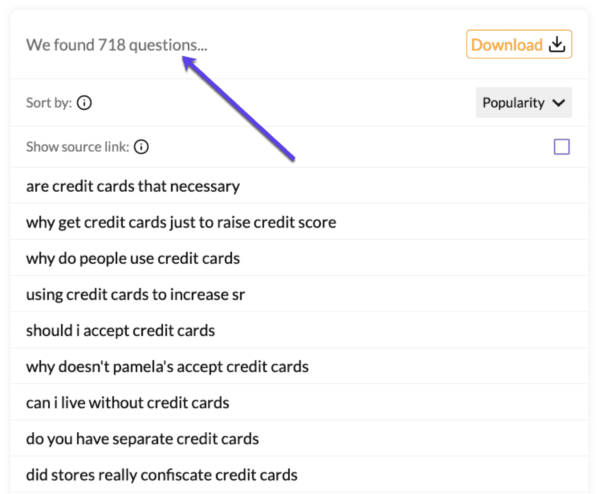

Use QuestionDB to get loads question keywords people are asking

正如你所看到的，仅仅从一个关键词你就可以产生很多潜在的问题，你可以把这些问题转化成文章(你所在领域的人正在问的问题)。

### 38.识别关键词缺口

这只是一种奇特的说法，即寻找那些每月搜索量很高的关键词，而不是你排名的**。**

然后——你猜对了——试着给他们排名。

找到关键词缺口的最快方法是使用这个免费的[内容缺口搜索器](https://jsvxc.com/content-gaps/)或 Ahrefs。

如果您选择后者，这里有一个快速演练:

启动 [Ahrefs 内容差距工具](https://ahrefs.com/content-gap/)并放入您想要比较的域:

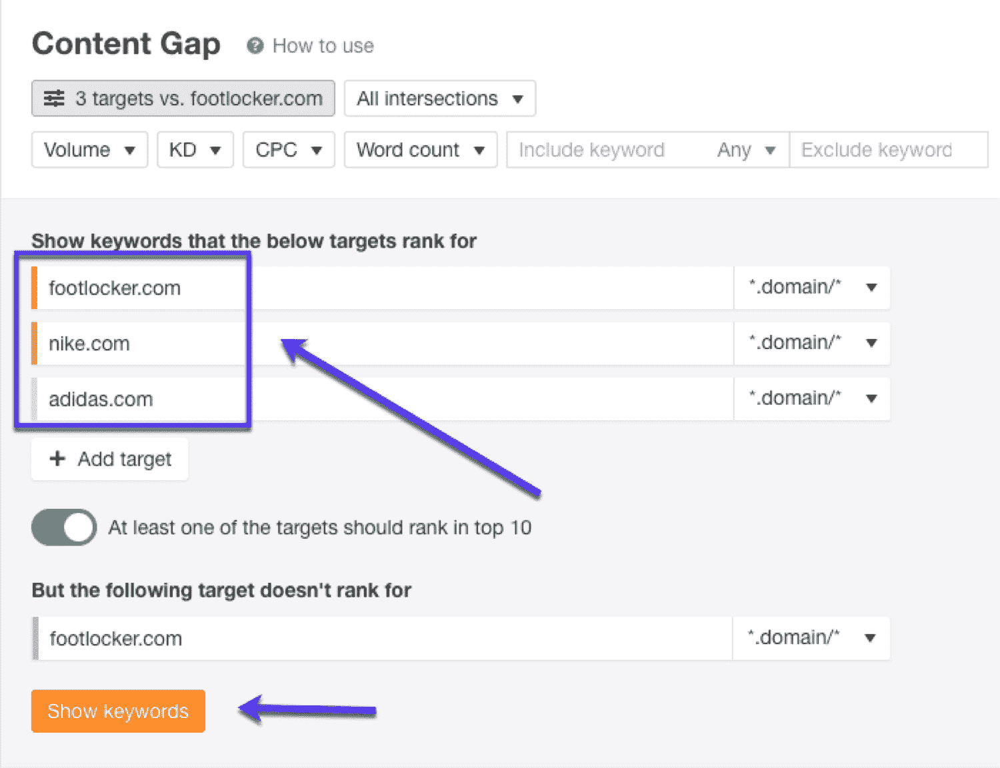

Use Ahrefs Content Gap tool to find keywords to target

点击“显示关键词”，你会看到任何潜在的关键词空白:

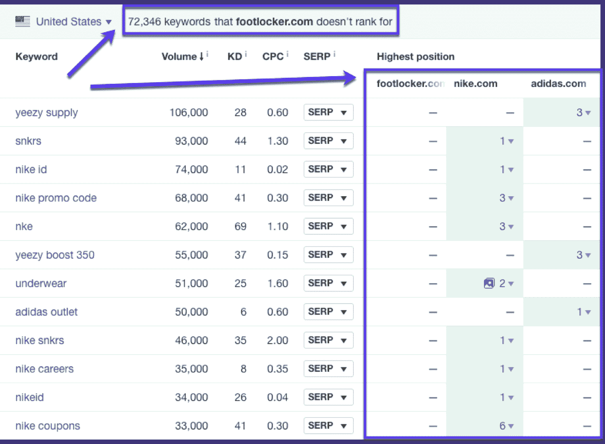

Keyword gaps in Ahrefs

如果你为你的网站和一些竞争对手这样做，你将能够看到他们排名的所有关键词，但你不能。

基于你的竞争对手，你将能够优先考虑的关键字差距去追求，并尝试和排名。

### 39.用 LSI(或语义)关键词优化你的内容

LSI 代表“潜在语义索引”(有时也称为语义关键词)，是与你的主要关键词相关的单词/短语。

自从谷歌蜂鸟开始，搜索引擎更加重视全面理解一个主题。LSI 关键字是帮助搜索引擎爬虫的好方法。

你可以使用类似于 [LSI Graph](https://lsigraph.com/) 的工具来找到它们。只要输入你的主要关键词，它就会给你一个与你的主题相关的术语列表:

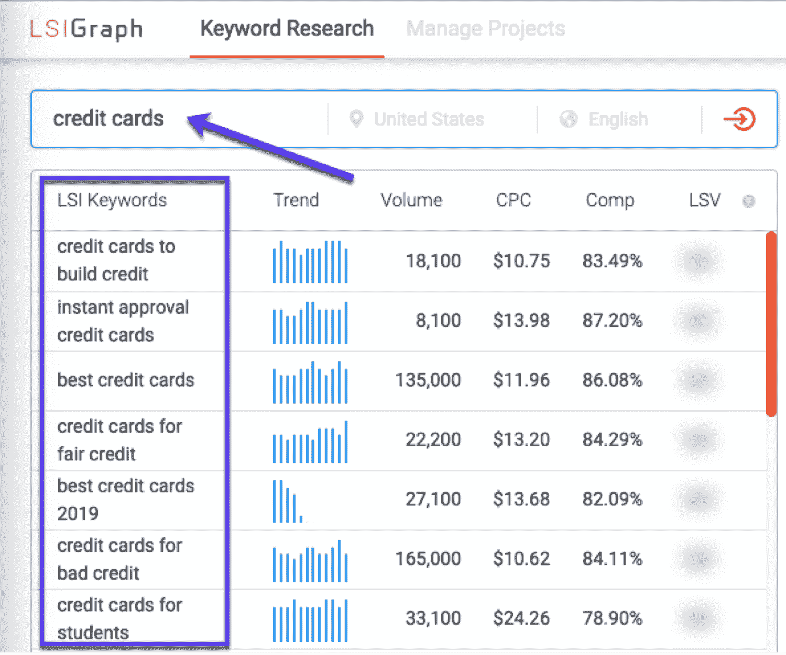

Examples of LSI /semantic keywords using LSI Graph

尝试将这些添加到你的文章和页面中。

老实说，如果你正在写好的内容，无论如何你都会包含语义关键词，但是这是值得记住的。

### 40.防止和消除关键字自相残杀

关键词自相残杀是指你的网站上有两个或更多的页面为了同一关键词而互相竞争。

这实际上很常见，尤其是对于有很多页面的大型网站。这里有一篇来自 Moz 的关于它的非常详细的文章。

这里要吸取的教训是:你要避免关键词自相残杀，因为这会让谷歌感到困惑(它不知道应该给哪个页面排名)。两个相似的页面互相竞争对提高流量没有帮助。

它还可以:

*   降低你的网页的权威性。
*   淡化你所有的网页链接。
*   影响你的转化率。

通常情况下，将这些整合到一篇文章中会更好。你可以使用这个免费的电子表格来[查找关键词蚕食](https://jsvxc.com/keyword-cannibalization/)并运行一个快速的“site:your domain . com‘keyword’查询来发现潜在的问题。

### 41.寻找易赢关键词机会

如果你有一个现有的网站，这里有一个快速赢得流量的方法:

找到表现相对较好的页面，然后改进它们，给它们一个提升。

让我解释一下:

排名在第 2 页顶部和第 1 页底部的页面/关键词是最合适的。这些可能只需要一些调整，让他们爬上排名，并发送更多的流量到您的网站。

您可以通过以下方式来改进这些简单的关键词页面:

*   做关键词研究更好的针对主词+相关词。
*   [提高你的页面搜索引擎优化](https://kinsta.com/blog/what-does-seo-stand-for/#7-optimise-your-pages-for-organic-traffic)。
*   添加更多内容。
*   将内部链接指向页面。
*   建立一些页面的反向链接。

要找到这些页面，你可以使用 Ahrefs、SEMrush 等搜索引擎优化工具的内置关键词过滤，使用一些免费的搜索引擎优化电子表格来完成搜索引擎优化任务，或者在[谷歌搜索控制台](https://kinsta.com/blog/google-search-console/)查看性能报告。

## 技术改进

SEO 的另一个方面决定了你的网站能获得多少流量，那就是它的技术健康程度。

为了让搜索引擎机器人找到、抓取和索引你的网站，你需要列举一些技术要素。

让我们来看看:

### **更喜欢看[视频版](https://www.youtube.com/watch?v=WwNLM0pw358)？**

### 42.遵循技术性 SEO 最佳实践

技术性搜索引擎优化是为谷歌爬虫优化你的网站的过程。

这是让你的网站获得流量的重要一步。如果谷歌找不到，抓取不到，索引不到你的网站，你就不会排名。没有排名=没有有机的搜索流量。

它被称为“技术性”SEO，因为它更多的是关于基础设施，而不是网站内容。

技术搜索引擎优化可以是一个大话题。但是就获得最佳实践而言，以下是您想要做的事情:

*   指定首选域(www 还是 no www？)
*   [优化 Robots.txt 文件](https://kinsta.com/blog/wordpress-robots-txt/)。
*   优化您网站的 URL 结构。
*   有逻辑的站点结构和[网站导航](https://kinsta.com/blog/website-navigation/)。
*   使用[面包屑](https://kinsta.com/blog/wordpress-breadcrumbs/)来提高 UX。
*   [添加结构化数据标记](https://kinsta.com/blog/schema-markup-wordpress/)。
*   设置标准。
*   设置并优化你的 404 页面。
*   [使用 301 重定向](https://kinsta.com/help/redirect-rules/)。
*   拥有一个 XML 站点地图。
*   [安装 SSL 证书](https://kinsta.com/help/how-to-install-ssl-certificate/)。
*   [确保你的网站加载速度快](https://kinsta.com/learn/speed-up-wordpress/)。
*   确保你的网站是手机友好的。
*   [设置谷歌搜索控制台](https://kinsta.com/blog/google-search-console/#getting-started)。

这绝不是一份详尽的清单。但是如果你能勾掉以上所有的东西，你就走上了一个健康网站的正轨。

### 43.将你的网站提交给搜索引擎

你希望你的网站出现在谷歌和必应上，对吗？

然后你需要[将你的网站提交给搜索引擎](https://kinsta.com/blog/submit-website-to-search-engines/)。

其实这个过程很快。大部分工作已经为你做了，但这是值得的，这样你就可以在未来控制指数化。

搜索引擎并不要求你提交你的网站。但是在很多情况下这样做是有意义的。想到:

*   几乎没有反向链接的新网站。
*   用新的内容和结构重新链接网站。
*   [最近被黑的网站](https://kinsta.com/blog/wordpress-hacked/)。
*   大量更新内容现已发布。

手动将你的网站提交给谷歌和其他搜索引擎可以减少重新索引所需的时间，从而获得有规律地流向你的有机流量。

### 44.提高 SERP 点击率(使用 GSC 数据)

点击率是从谷歌搜索结果中点击进入你的网站的搜索者的百分比。

最棒的是:

通过提高你的点击率，可以有效增加流量。

要查看您的点击率，请转到搜索控制台>性能，现在确保选择平均点击率并选择查询。在这里，您可以看到您在 CTR 方面的最佳和最差查询:

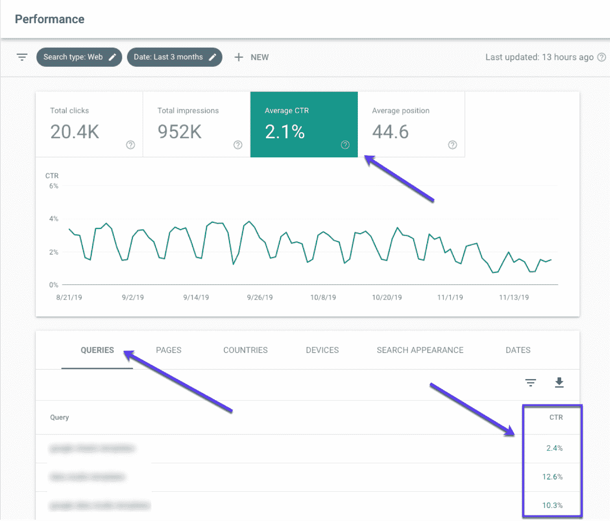

CTR performance report in Google Search Console

提高有机 CTR 的一些方法有:

*   改进你的页面标题。
*   [让你的网址更清晰、更具描述性](https://kinsta.com/knowledgebase/what-is-a-wordpress-slug/)。
*   改善你的元描述。
*   [添加结构化数据](https://kinsta.com/blog/schema-markup-wordpress/)。
*   [提高页面速度](https://kinsta.com/learn/page-speed/)。

### 45.修复 404 页上丢失的“链接果汁”

当您删除链接的页面、向页面添加错误的 URL 或错误地更改 URL 时，会创建一个[断开的链接](https://kinsta.com/blog/broken-links/)。这些对 UX 不利。

没有人想去买一些乐高玩具，然后看到这个 404 页面:

An example of a 404 page on the Lego website

好吧，也许他们确实有，因为这是一个很好的 404 页。

**那么，断链对 SEO 有什么影响呢？**

当一个搜索引擎正在抓取你的网站，并且发现死链接时，它可以阻止蜘蛛抓取你的网站。这可以阻止它被索引。

换句话说，当搜索者(和/或网络爬虫)浏览您的站点并点击链接时，他们可能会被定向到一个有 404 错误的页面。

我不知道你怎么想，但当这种情况发生时，我要么对有问题的网站感到有点恼火，要么就离开。

不要冒这个险。[找到并修复任何潜在的断开链接](https://kinsta.com/blog/broken-links/)。

### 46.通过内部链接提升权威

链接是指从你网站的一个页面指向同一个网站的另一个页面的链接。

你以前已经见过无数次了:

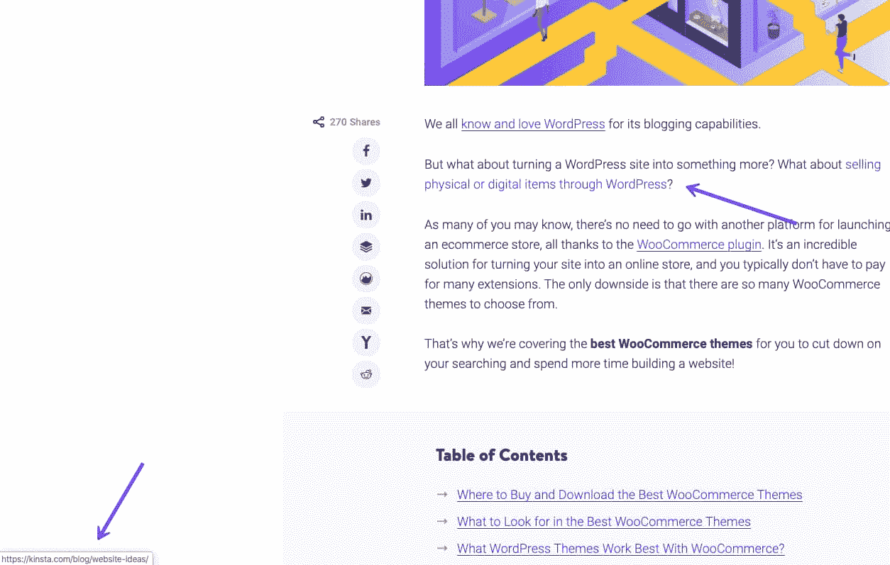

An example of internal linking

当你提到过去的内容或内容中的相关页面时，链接(或内部链接)通常会自然而然地出现。

添加内部链接可以:

*   帮助访问者(和搜索引擎)浏览你自己的网站。
*   帮助建立信息结构。
*   在你的网站上传播链接汁或权威。

### 47.确保你的网站响应迅速

几乎每个人都有智能手机。几乎每个人都在手机上浏览网站。

2019 年[有](https://www.statista.com/statistics/617136/digital-population-worldwide/)40.7 亿唯一移动互联网用户！

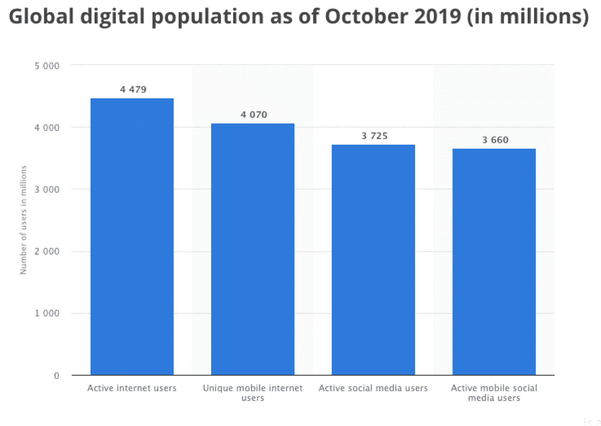

Mobile internet user statistics

你的网站有很多潜在的移动访问者。谷歌认识到了这一点，推出了移动优先索引。

如果你还没有一个[响应式网站](https://kinsta.com/blog/responsive-web-design/)，以下是你应该拥有的理由:

*   它提高了网站对访问者的可用性。
*   它会加载得更快。
*   它将[降低跳出率](https://kinsta.com/blog/how-to-reduce-bounce-rate/)。
*   它可能会改善社交分享。

### 48.用模式增强 SERP 外观

模式也称为结构化数据，是搜索引擎容易阅读的标记。

它使搜索引擎爬虫更容易找到和索引你的页面。因为它给搜索引擎机器人更多关于你的网站的信息，你的网站可以获得丰富的网站片段(这可以提高你的点击率)。

如果你的网站上有[的评论，你可以获得如下丰富的片段:](https://kinsta.com/blog/best-wordpress-review-plugins/)

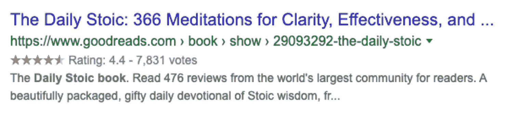

An example of schema showing (review stars) in Google

我们实际上已经有了一个关于如何在 WordPress 站点添加模式标记的更详细的指南。

### 49.确保你的网站速度快

我们已经谈到了这一点，但你的网站加载速度确实会影响搜索引擎优化。

页面速度是一个直接的排名因素，也可以通过增加跳出率间接影响排名。

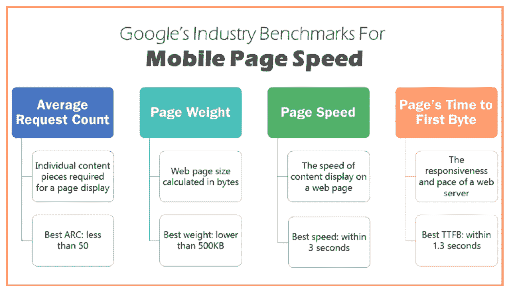

Mobile page speed benchmarks (Image source: codemeright.com)

页面速度对用户来说很重要。想想看:如果一个网页加载很慢，你会怎么做？你是等它加载还是去别的地方？

你可能会离开。

页面加载速度越快，让人们留在你的网站上的效率就越高。谷歌也知道这一点。这就是为什么早在 2010 年，他们就宣布[页面速度算作 SEO 的排名因素](https://searchengineland.com/google-now-counts-site-speed-as-ranking-factor-39708)。

Google 的 John Mueller 说要确保用户**在 2-3 秒内加载网页**:

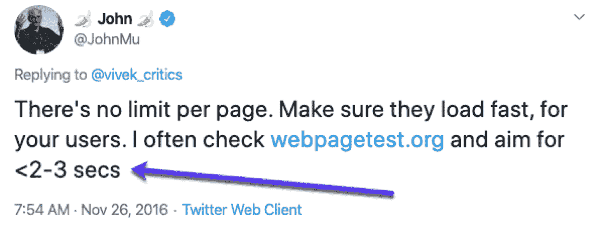

John Mueller’s (of Google) advice for fast loading pages

当提到加速你的网站时，你可以做一些事情来提高性能，比如压缩图片，使用 T2 轻量级 WordPress 主题，拥有一个好的 T4 主机来提供高性能。

厌倦了你的 WordPress 站点缓慢的主机？我们提供超快的服务器和来自 WordPress 专家的 24/7 世界级支持。[查看我们的计划](https://kinsta.com/plans/?in-article-cta)

如果你想提高页面速度，我们有很多资源可以浏览:

*   [网站速度优化初学者指南](https://kinsta.com/learn/page-speed/)
*   [如何正确运行网站速度测试](https://kinsta.com/blog/website-speed-test/)
*   [如何加速你的 WordPress 站点](https://kinsta.com/learn/speed-up-wordpress/)
*   [深入了解 GTmetrix 速度测试工具](https://kinsta.com/blog/gtmetrix-speed-test/)
*   [Pingdom 速度测试工具:终极指南](https://kinsta.com/blog/pingdom-speed-test/)
*   [Google PageSpeed Insights:用 WordPress 评分 100/100](https://kinsta.com/blog/google-pagespeed-insights/)

## 社会化媒体

如果你想要流量，就去你的目标受众经常去的地方分享内容。社交媒体也可以帮助你建立品牌认知度和社区。

不仅仅是分享迷因和猫咪视频:在美国[43%的成年人从脸书](https://www.statista.com/chart/16304/social-media-as-a-news-source/)获取新闻:

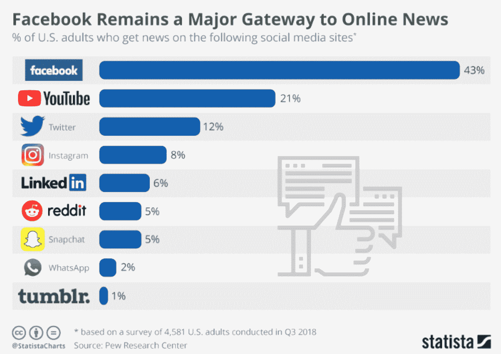

Social media statistics

以下是一些利用社交媒体增加网站流量的方法:

### **更喜欢看[视频版](https://www.youtube.com/watch?v=cJpP-QyBZAA)？**

### 50.在社交媒体上活跃起来

这听起来像是一个显而易见的步骤，但如果你想让他们增加流量，你实际上需要设置你的社交账户。

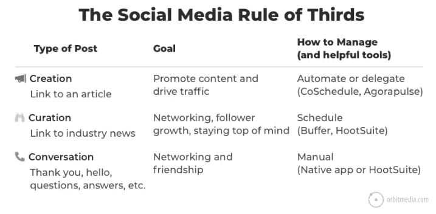

The rule of thirds (Image source: Orbitmedia.com)

以下是您选择的任何平台都需要完成的要点:

*   完整填写你的个人资料(别忘了链接到你的网站)和你的商业页面([脸书](https://kinsta.com/blog/how-to-create-a-facebook-page/)和 [LinkedIn](https://kinsta.com/blog/how-to-create-a-company-page-on-linkedin/) )。
*   推广你的博客内容。
*   一定要分享有趣的内容(遵循[三分法则](https://www.orbitmedia.com/blog/social-media-rule-of-thirds/))。
*   当您的观众在线时发布。
*   与你的听众交谈。

至于你应该在哪个平台上，取决于你的观众。

最好的社交媒体平台是你的观众常去的平台。

### 51.在战略时刻在社交媒体上发帖

这将非常依赖于你的观众和你所处的平台。

有很多关于何时在社交媒体上发帖的研究，比如 Hootsuite 的这个或者 T2 的 Sprout Social 的这个。

根据[发帖策划人](https://www.postplanner.com/blog/best-times-to-post-on-social-media/)的说法，以下是**在社交媒体上发帖的最佳时间**:

| **社交网络** | **最好的一天** | **最佳时间** |
| 脸谱网 | 每星期四 | 晚上 8 点 |
| 推特 | 星期四 | 下午 5 点 |
| 商务化人际关系网 | 星期三 | 上午 9 点 |
| 照片墙 | 星期五 | 晚上 7 点 |
| 拼趣 | 星期五 | 凌晨 1 点 |

### 52.将社交分享按钮添加到您的网站

哦，别忘了让人们更容易在社交媒体上分享你的内容。

(Pssst，如果你是在桌面上读这篇文章，只要向左看就可以了。)

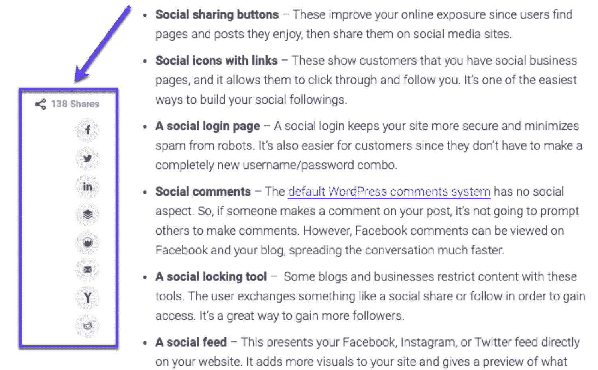

An example of social share buttons we use on all blog posts at Kinsta

这提高了你的在线曝光率，因为用户会找到他们喜欢的页面和帖子，然后在社交媒体网站上分享。

最简单的方法是为你的网站设置一个 [WordPress 社交媒体插件](https://kinsta.com/blog/wordpress-social-media-plugins/)。

### 53.使用社交媒体日历

在社交媒体上获得更多点击率不是很好吗？

答案可能是使用社交媒体日历。

这种类型的日历有助于您理解:

*   为什么你的观众分享(或不分享)你的内容。
*   人们喜欢哪种类型的内容。

更重要的是，它还可以防止你过于频繁地分享同一类型的内容，并允许你计划分享你知道有用的内容。

设置日历并不需要很长时间，电子表格就能帮你搞定:

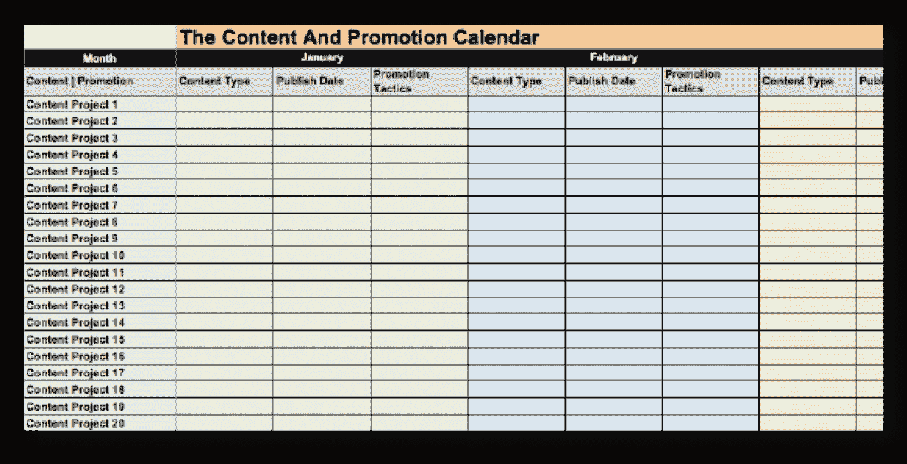

An example of a content calendar you can use to promote blog posts

这种简单的社交媒体策略可以帮助你提高分享率，让流量回到你的博客。

前往 Post Planner 博客获取免费的[社交媒体日历模板](https://www.postplanner.com/blog/quadruple-your-traffic-with-a-social-media-calendar)。

### 54.研究你的竞争对手的社交策略

提高社交媒体流量的一个很好的策略是监视你的竞争对手。看看他们在做什么，然后试着复制它。

这里有几个**社交媒体竞争对手分析工具可以使用**:

*   [冰帽](https://buzzsumo.com/)
*   胡特苏特
*   [萌芽社交](https://sproutsocial.com/)

想要一个超级快速的社会竞争力分析计划？

我们走吧:

#### 第一步——找到竞争对手的社交媒体策略

使用 Sprout Social 这样的工具来看看你的竞争对手在做什么:

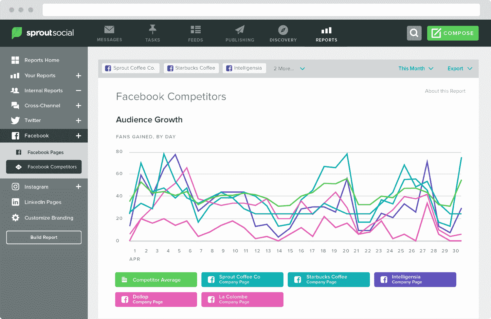

Competitor research using Social Sprout

然后思考这样的事情:

*   他们用的是什么关键词？
*   他们在跟踪谁？
*   他们在哪些社交网络上？
*   他们的受众有多大？
*   他们多久发一次帖子？

#### 第 2 步-分析他们的个人资料和内容

看看他们每个人的社交资料。他们擅长什么，不擅长什么？

寻找类似这样的东西:

*   他们发布了相关的最新内容吗？
*   他们的客户服务是好是坏？
*   有拼写错误吗？
*   他们用的是什么样的图像？
*   他们是在用独特的角度宣传自己吗？

#### 步骤 3–监控任何变化

社交媒体是一个永无止境的内容流，所以监视你的竞争对手在做什么(上面提到的一些工具可以帮助)。

看看如何[利用 LinkedIn](https://kinsta.com/blog/linkedin-marketing/) 增加你的网站流量，如何[利用脸书](https://kinsta.com/blog/facebook-marketing/)和 [Twitter 进行你的营销](https://kinsta.com/blog/twitter-marketing/)。

有了这些信息，你将有希望看到差距，你可以在社交媒体上做一些有效的事情来增加你网站的流量。

### 55.让社交媒体自动驾驶

社交媒体是向你的观众推广内容的好方法。

唯一的问题是它会占用你一天的时间，尤其是当你发布大量内容的时候。

以推广新的博客帖子为例。你必须给你的每个社交账户添加标题、社交分享图片和新帖的链接。这是针对每个帖子的。

当你发布一篇新的博客文章时，记住像这样更新你所有的社交信息是很费时间的。

如果你使用[这个 Zapier Zap](https://zapier.com/apps/twitter/integrations/wordpress/183/tweet-your-new-wordpress-posts-automatically) 来自动发布你的新的 WordPress 帖子，就不会了:

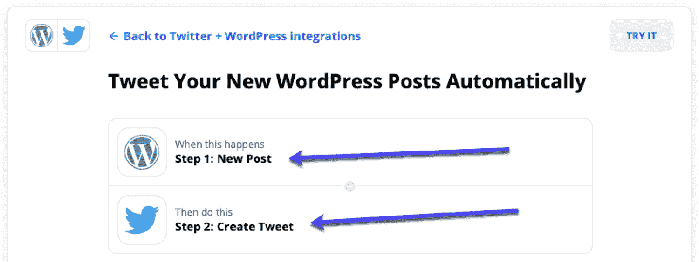

Use Zapier to automatically post new blog posts

这只是你能做的事情的皮毛。去 Zapier 看看 100 多种不同的方式可以让社交媒体自动化。

### 56.使用 Buffer 安排和发布社交帖子

说到自动化，你可以使用像 [Buffer](https://buffer.com/) 这样的工具来提前安排你的帖子，并自动发布到你的频道:

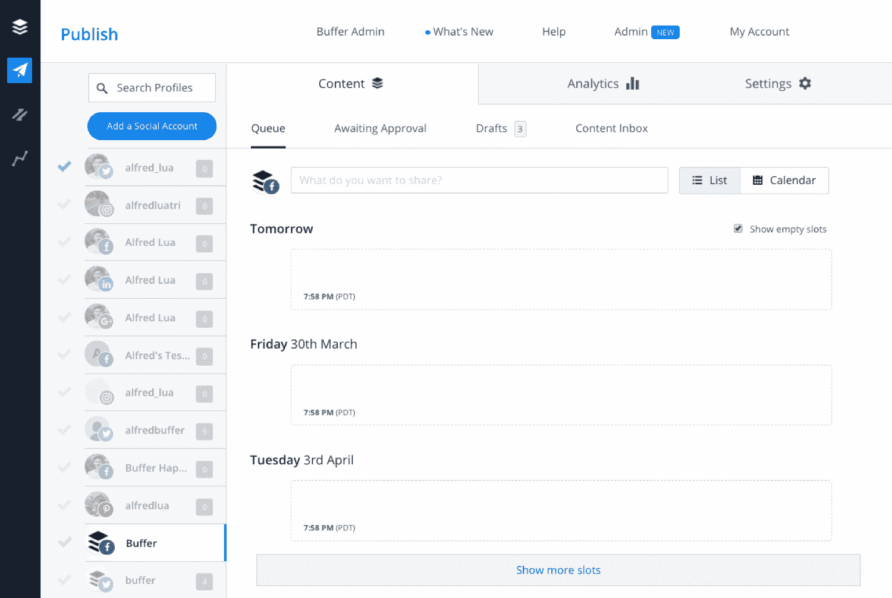

Use Buffer to schedule and publish social posts

除了发布内容，Buffer 还可以建议发布内容的最佳时间。很好，不是吗？

### 57.使用 Quuu 升级

Quuu Promote 是一款付费工具，可以通过自动向正确的受众推广您的内容来增加流量。

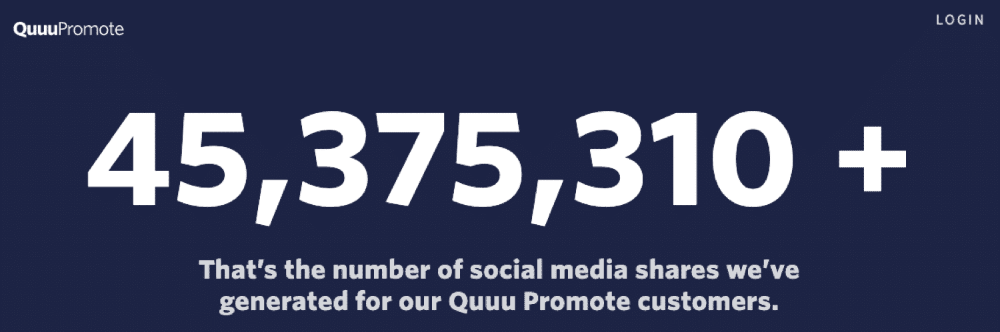

Quuu Promote can help you generate lots of social shares

**那么 Quuu 是如何推广工作的呢？**

简而言之:

*   您创建了一个社交媒体帖子(带有指向您内容的链接)。
*   Quuu 把这个放在那些已经注册从 Quuu 获得建议的人面前。
*   这些人中的一些人可能会在他们的社交简档上分享它。
*   你赚取更多的流量。

### 推特

很多人使用 Twitter，事实上大约有 46%的 Twitter 用户每天都会登录这个平台:

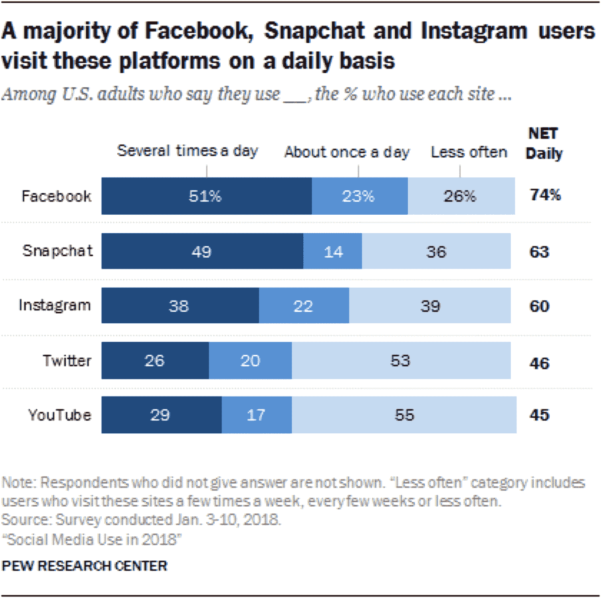

Daily social media usage statistics (HubSpot.com)

如果你不在 Twitter 上推广你的博客，别人怎么知道你的内容呢？给你的博客带来流量几乎和写作本身一样重要。

如果你有效地使用 Twitter，它可以为你的网站带来大量的流量。但是仅仅在推特上发布你的博客文章的标题，并附带一个链接，是行不通的。

你需要做得更好。

以下是一些使用 Twitter 增加网站流量的方法:

#### 58.用这些 Twitter 营销技巧增加流量

在你开始之前，你需要选择合适的 Twitter 账号、个人照片和头像。要让 Twitter 成为一台有效的流量生成机器，你需要积极主动。

你知道吗:**一条推文的平均寿命只有 18 分钟**:

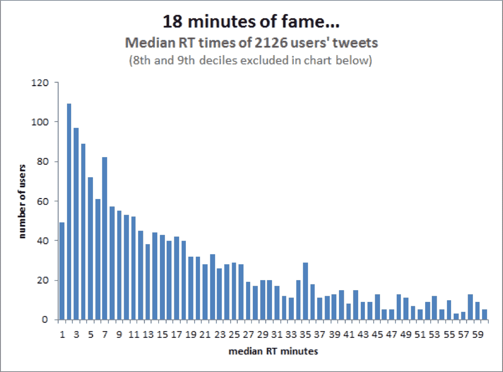

Average lifespan of a tweet (Image source: Moz.com)

每秒钟有超过 7000 条新推文被发送，要想从你的推文中获得任何有意义的回报，你需要一个计划。

以下是一些可以尝试的 Twitter 营销技巧:

*   使用简短的吸引注意力的推文。
*   从您正在推广的帖子中添加一段引文。
*   添加统计数据。
*   使用#标签& @提及。
*   转发任何提及的内容。
*   求转发。
*   使用图像。
*   试着问一个问题(与你的话题相关)。

别忘了，你也可以利用 Twitter 广告的力量…

#### 59.通过推广推文增加流量

[推广推文](https://kinsta.com/blog/twitter-stats/#twitter-advertising-advantages)(又名赞助推文)是标准推文，只是它们是由试图增加其 Twitter 影响力和/或参与度的广告商付费的。

它们很容易被发现，因为它们下面有一个“促销”标签:

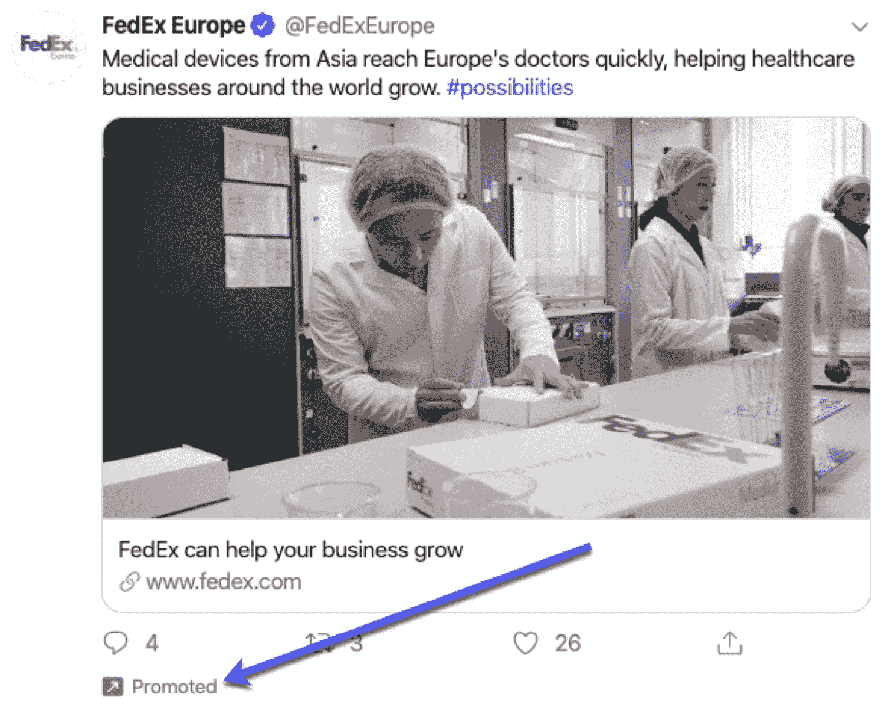

An example of a promoted tweet

推广的推文扩大了覆盖范围，增加了网站和点击后登录页面的流量，这反过来又增加了潜在客户的产生和销售。要了解更多关于使用 Twitter 增加流量的技巧，请查看我们的指南。

点击[此处](https://business.twitter.com/en/a/get-started.html)开始运行 Twitter 广告。

### 脸谱网

脸书拥有**24.1 亿月活跃用户**:

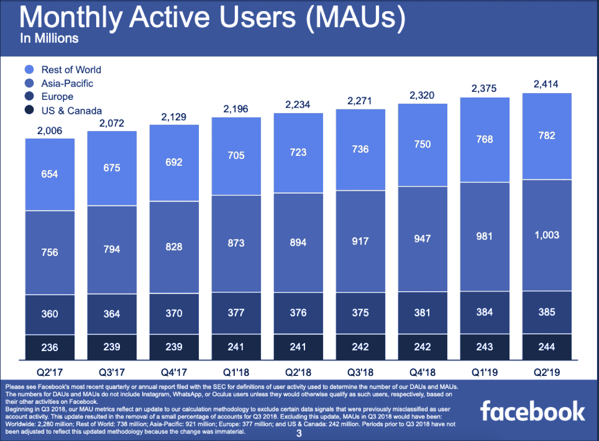

Monthly active users on Facebook (Image source: HubSpot.com)

它仍然是社交媒体网站的老大。

如果使用得当，这种力量可以成为你的企业或网站强大的营销工具。

让我们开始吧:

#### 60.用这些脸书营销技巧增加流量

驱动脸书流量回到你的网站是必不可少的，FB 流量提供了一个很好的机会来锁定你的理想受众。

如果你还没有，[为你的网站创建一个脸书页面](https://kinsta.com/blog/how-to-create-a-facebook-page/)，然后遵循这些[脸书营销技巧](https://kinsta.com/blog/facebook-marketing/)来帮助你创造更多的流量:

*   在你所有的帖子上使用图片。
*   保持你的更新简明扼要。
*   问你的粉丝一些简短的问题。
*   分享内容时引用博客文章。
*   [使用视频](https://kinsta.com/blog/video-hosting/)。
*   在你的领域里管理来自其他网站的内容。

也有脸书的广告…

#### 61.使用脸书广告

你可能非常熟悉脸书的广告:

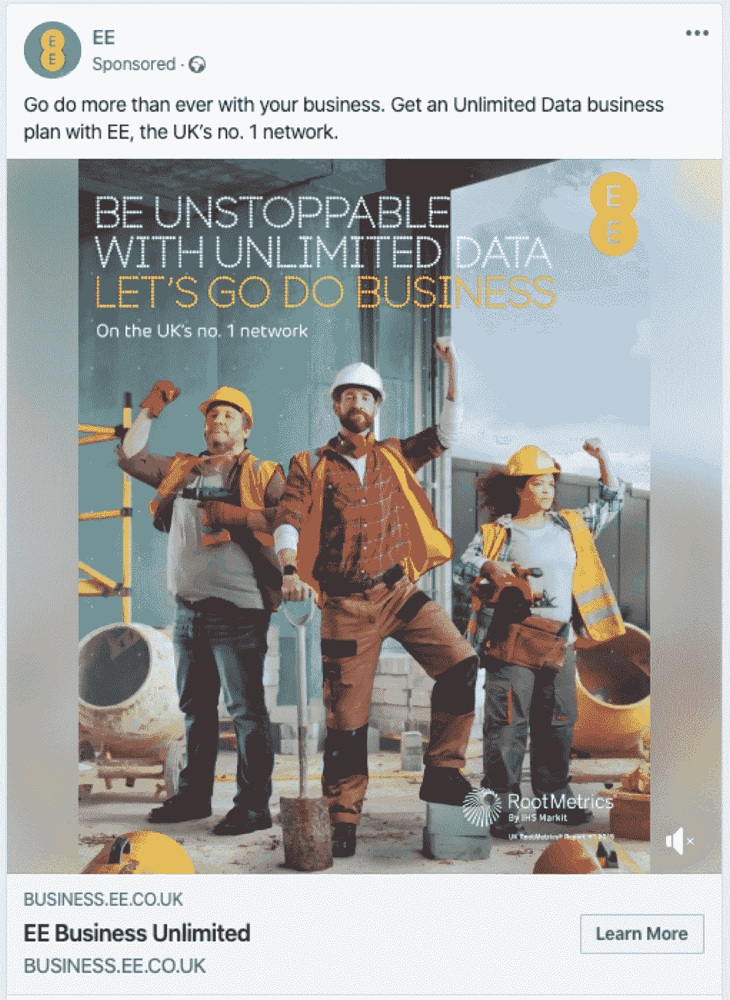

Example of a Facebook ad

如果使用得当，脸书广告可能是一种有效的(低成本的)为博客文章增加流量的方式。

但是如果你知道你在做什么，他们可能是相反的:昂贵和无效。

你想使用有针对性的脸书广告来驱动脸书的流量回到你的网站，所以要确保你是在追求正确的(和感兴趣的)观众。

如果你感到困惑，可以使用脸书的广告工具。

#### 62.用脸书广告重新定位访问者

别忘了，你还可以使用[脸书重新定位广告](https://kinsta.com/blog/ad-retargeting/)。

广告重定位是一个过程，在这个过程中，你将广告定位到那些之前在你的网站或社交媒体平台上但尚未转化的用户。

你需要安装[脸书像素](https://kinsta.com/blog/conversion-tracking/#fb-conversion-tracking)并跟踪你的网站流量和网站事件。

### 照片墙

Instagram 是发展最快的社交平台之一，也是产生流量的一个好方法。

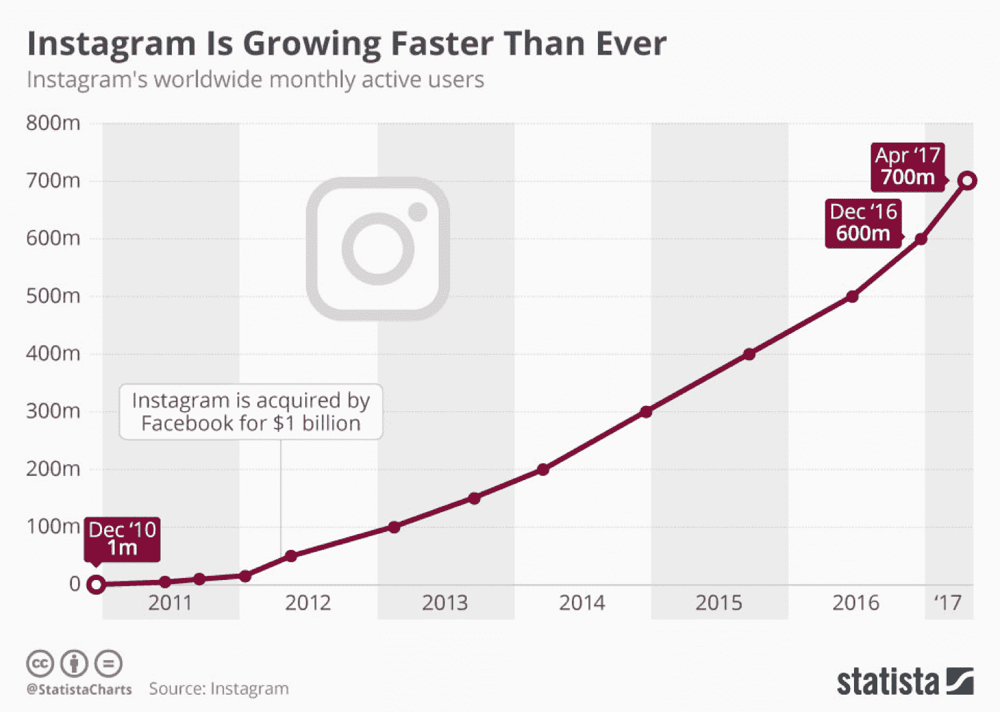

Instagram growth (Image source: Stargage.com)

但是要从中获得最大收益，您需要考虑几个因素:

*   你的名字&用户名——这些是 Instagram 在搜索查询中考虑的唯一因素。
*   你的简历描述&个人资料照片——这些应该会吸引你的观众。
*   **简历中你的网址链接**——这是 Instagram 上唯一可以链接到你的网站的地方。
*   **个人资料可见性**–您希望确保您的个人资料设置为公开，而不是私人。

#### 63.使用这些 Instagram 营销技巧增加流量

这听起来很明显，但是上传与你的观众相关的好图片和视频是在 Instagram 上成功的关键。

想一想:如果你的受众是 [B2B](https://kinsta.com/blog/b2b-lead-generation/) ，这个内容有用吗？

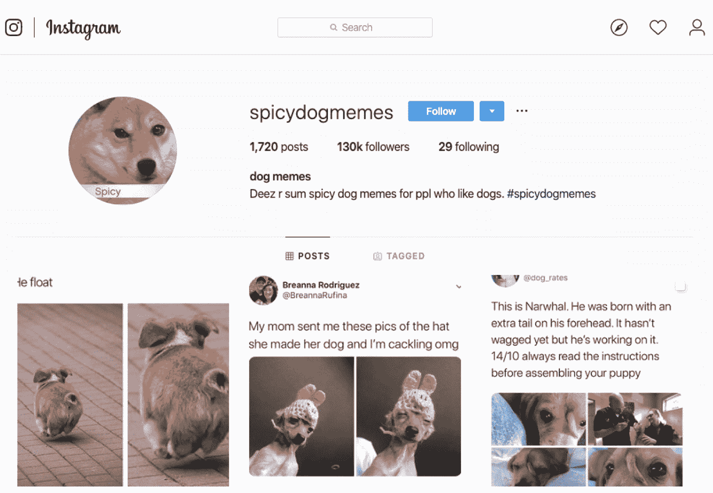

A popular Instagram meme page

大概不会。

除了发布相关内容并持续稳定地增加你的关注，以下是一些 Instagram 营销技巧:

*   关注与你的领域相关的客户。
*   找到并使用相关的标签。
*   如果可以的话，试着让别人大声喊出来。
*   定期分享你的帖子。
*   发布 Instagram 专属内容。
*   积极参与你的追随者。

#### 64.使用 Instagram 广告

像脸书的广告一样，Instagram 广告也是一种很好的接触目标受众的方式。

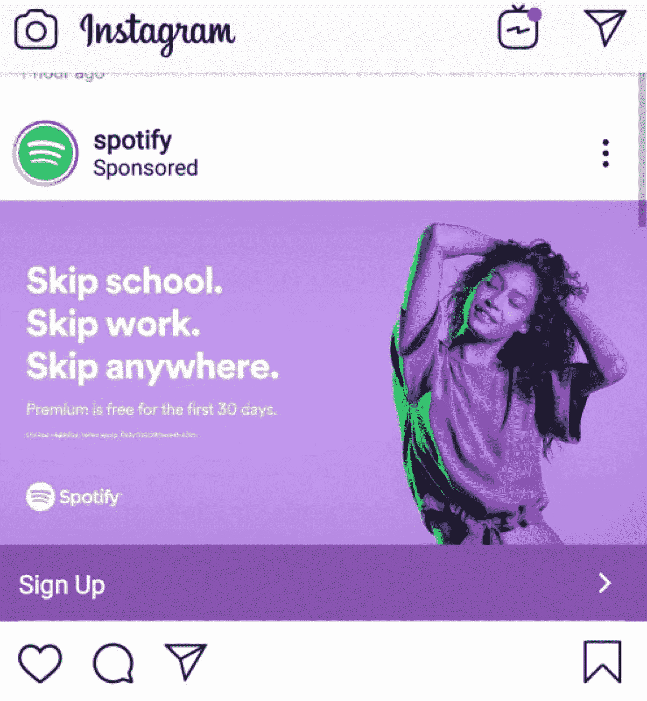

An example of an Instagram ad

[Instagram 广告](https://business.instagram.com/advertising/)可以通过脸书的广告平台设置，你可以运行不同类型的广告，包括照片、视频、轮播、幻灯片和故事广告。

首先，你需要[连接你的 Instagram](https://www.socialmediaexaminer.com/how-to-create-instagram-ads/) 和脸书账户:

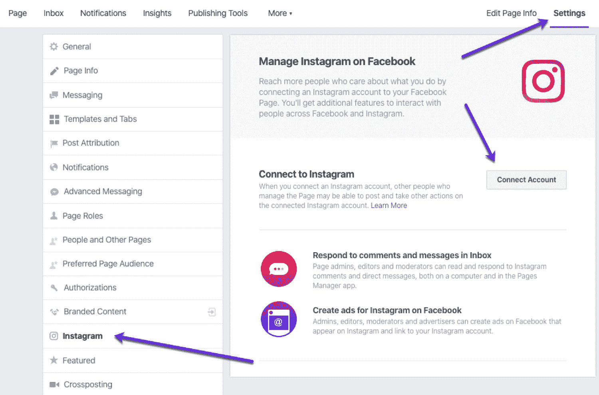

Instagram/Facebook ad dashboard

很简单，以下是你如何开始在 Instagram 上做广告:

1.  去找脸书的广告经理。
2.  设定你的目标。
3.  设定你的目标受众。
4.  选择你的广告位置。
5.  设定你的预算和时间表。
6.  创建您的 Instagram 广告。

### 油管（国外视频网站）

你知道 YouTube 是仅次于谷歌的第二大搜索引擎吗？

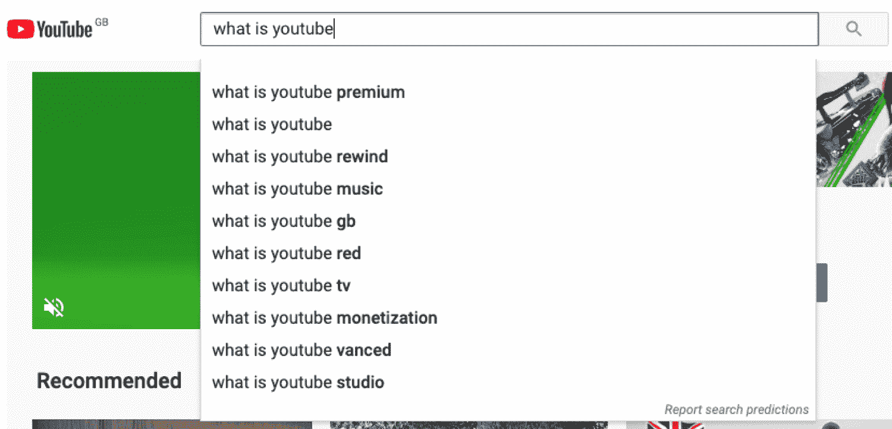

YouTube search works like Google

如果使用得当，YouTube 可以成为一个惊人的流量来源。人们每天观看 10 亿小时的 YouTube 视频，所以只要获得其中的一小部分，就能改变游戏规则。

#### 65.用这些 YouTube 营销技巧增加流量

每天有这么多视频上传到 YouTube，你的内容很容易丢失。

幸运的是，你可以采取一些简单的步骤来为你的视频产生有机的流量。

以下是一些获得 YouTube 流量的经验证的技巧:

*   访问你网站的理由，比如免费的 PDF、电子书、课程或独家内容。
*   在你的频道标题中添加一个链接到你的网站。
*   使用卡片帮助视图导航。
*   在视频描述中添加网站链接。
*   在视频上使用清晰的 CTA

#### 66.别忘了 YouTube SEO(给你的视频排名)

获得更多视频浏览量的最好方法之一是使用 YouTube SEO。

简而言之:

YouTube SEO 是优化您的频道(包括视频播放列表、元数据、描述和实际视频)的过程，以便您的频道显示给正确的人。

实际上，你可以在 YouTube 和谷歌上为搜索结果优化你的视频。

#### 67.YouTube 广告

YouTube 上已经有了很多潜在的观众，向他们投放广告是有意义的。

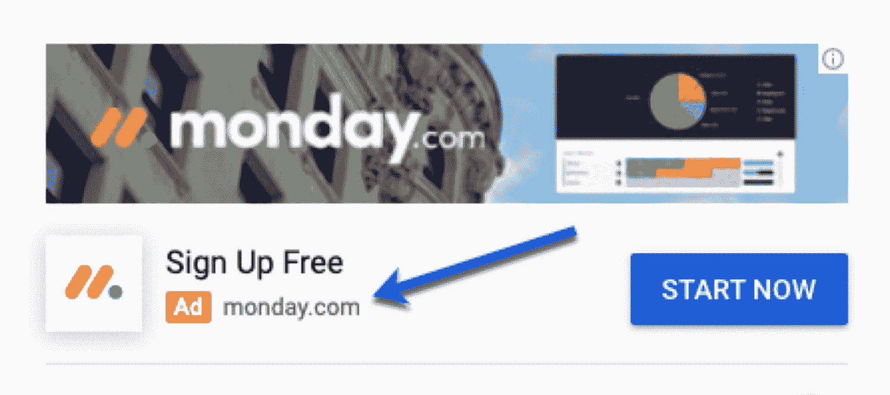

An example of a YouTube ad

要充分利用 YouTube 广告，您需要:

*   瞄准你的观众。
*   选择合适的广告形式。
*   创建吸引人的广告。

查看 HubSpot 的 YouTube 广告指南，了解更多信息。

### 拼趣

你知道 Pinterest 上的每个 pin 都可以产生 [2 次页面访问和 6 次页面浏览](https://www.searchenginewatch.com/2013/11/20/1-pinterest-pin-2-site-visits-6-pageviews-78-cents/)吗？

Pinterest 是一个给你的博客带来流量的伟大平台。

Pinterest 不仅有很长的使用寿命(随着时间的推移，Pinterest 会获得共享),而且 Pinterest 还积极地为共享而设计

让我们更详细地探讨一下:

#### 68.利用这些 Pinterest 营销技巧增加流量

以下是一些你可以用来控制 Pinterest 流量的策略:

*   注册一个商业账户(并访问 Pinterest Analytics)。
*   确保每个 pin 描述都是详细的、有帮助的和可操作的。
*   在[正确的时间](https://blog.hubspot.com/marketing/best-times-post-pin-tweet-social-media-infographic)锁定。
*   创建适合 pin 的图像(大小合适，包含文字)。
*   加入相关的 Pinterest 集团董事会。

#### 69.使用 Pinterest 广告

Pinterest 广告有助于让更多人在搜索和浏览 Pinterest 时看到你的内容。

An example of Pinterest ads

要开始使用:

1.  建立一个 Pinterest 商业账户。
2.  安装 Pinterest 标签。
3.  为你的活动选择一个目标。
4.  设定活动预算。
5.  创建一个广告组。
6.  选择你的目标受众。
7.  选择广告位置。
8.  添加兴趣+关键词。
9.  定预算+排班。
10.  挑选您的促销徽章。

像所有付费广告活动一样:监控并相应调整。更多信息，请查看 Hootsuite 的 Pinterest 广告指南。

### 商务化人际关系网

LinkedIn 拥有超过 6 亿用户，是 B2B 的首选社交网络。

LinkedIn 是人们想与同行业的人联系、了解他们的行业并分享相关内容时去的地方。如果你想为你的 B2B 博客或网站带来流量，这就是你的平台。

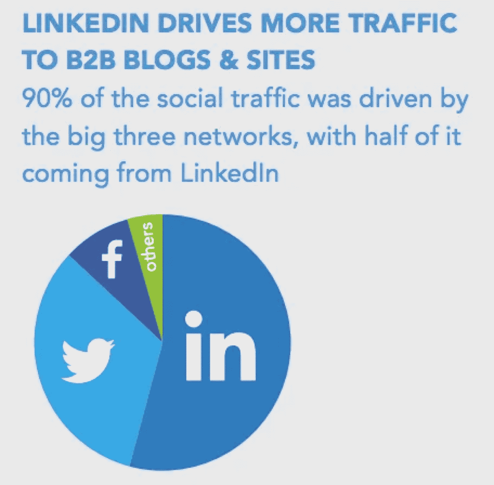

90% of social traffic is driven by LinkedIn to B2B sites (Image source: Sumo.com)

#### 70.用这些 LinkedIn 营销技巧增加流量

如果使用得当，LinkedIn 可以成为一个很好的流量来源。

以下是你今天开始从 LinkedIn 获取流量所需的基本要素:

*   创建和优化您的个人资料。
*   加入团体(或创建一个团体)。
*   [创建公司页面](https://kinsta.com/blog/how-to-create-a-company-page-on-linkedin/)。
*   定期分享有用的内容。
*   不要分享太多。

#### 71.在 LinkedIn 上重新发布文章

别忘了你可以[利用 LinkedIn 的发布平台](https://kinsta.com/blog/linkedin-marketing/)接触他们的大量受众。

在 LinkedIn 上重新发布文章是给你的网站增加流量和面对新观众的好方法。

要开始，只需点击 LinkedIn 主页上的“写文章”:

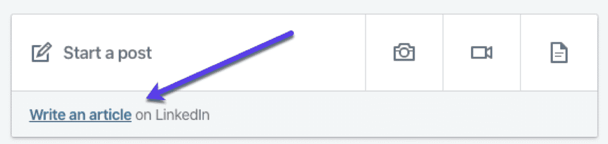

The “Write an article” feature in LinkedIn

在你发表你的文章之前，有两件事你要确定你已经包括了:

1.  简短的个人简介——将它添加到帖子的末尾，引导人们访问你的主页或博客。
2.  一个 CTA——引导人们去你网站上你认为可能对他们有帮助的特定资源。

#### 72.LinkedIn 广告

你也可以使用 LinkedIn 广告，通过赞助内容、赞助广告或文字广告来锁定你的受众。

An example of a LinkedIn ad

LinkedIn 显然最适合瞄准专业受众。所以，如果你的网站不是针对这些人群的，你最好还是省钱。

Hootsuite 的这个指南很好地介绍了 LinkedIn 的广告。

## 其他营销策略

有时营销策略并不完全适合一个类别。以下是剩下的所有流量提升策略:

### **更喜欢看[视频版](https://www.youtube.com/watch?v=zhnR5_2U1Uo)？**

### 73.使用付费流量

我们已经在社交广告中谈到了这一点，但付费流量是吸引人们关注你内容的有效方式。它也是高度可扩展的(如果你有预算的话)。

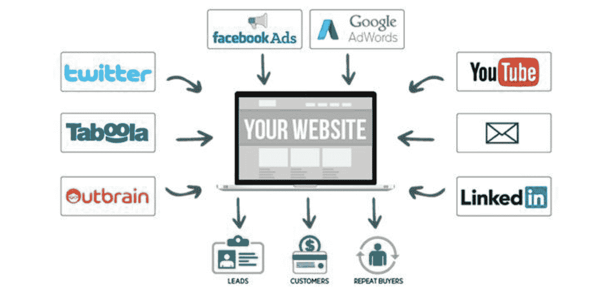

Types of paid traffic you can send to your website (Image source: charlesngo.com)

以下是一些最值得考虑的流量来源:

*   **展示广告。**
*   **付费搜索广告**(通过 [Google AdWords](https://kinsta.com/blog/how-to-use-google-adwords/) 或必应广告)。
*   **付费发现**(比如 Outbrain 或者 Taboola)。
*   **赞助内容。**

根据你购买的广告，你可以按点击付费(PPC)，按观看付费(PPV)或按获取/行为付费(PPA)。

### 74.出现在利基相关的播客上

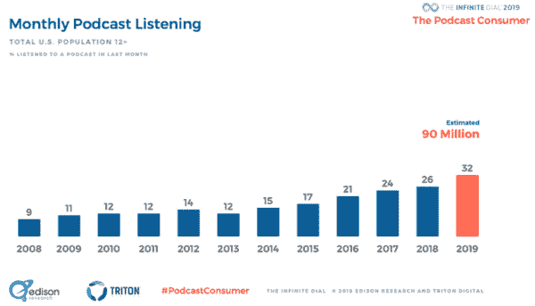

Monthly podcast listening statistics (Image source: convinceandconvert.com)

做[播客采访](https://kinsta.com/blog/what-is-a-podcast/)可以是一个伟大的交通司机。

你不仅可以在播客上获得相关的推荐，还可以面对新的观众。如果你在一个利基相关的播客上，你可能已经获得了自己的新观众。

想更上一层楼，出现在很多播客上吗？

以下是如何启动你的播客活动:

#### 第一步——在你的领域找到播客

记得要抓住主题，寻找播客继续下去。

看看像 [Stitcher](https://www.stitcher.com/discover) 和 [Podbean](https://www.podbean.com/all) 这样的地方。别忘了只需谷歌一下:

***你的小生+播客***

尝试并瞄准 50 个播客。

#### 第二步——写下你的推销词

你希望他们邀请你，所以让你的推销有针对性。

如果你还没有，听几集，试着了解一下你能带来什么。

#### 步骤 3-联系主机

大多数播客主持人希望你联系他们。

找到他们喜欢的联系方式，把你的想法发给他们。

#### 第四步——做播客(希望如此)

做播客，试着自然地分享你网站的内容和信息。

#### 第五步-分享播客。

最后一步是分享你的播客外观。

[将它推广到你的电子邮件列表](https://kinsta.com/blog/email-marketing-best-practices/)，你的社交渠道，你的博客等等。

这不仅仅是别人的播客，你也可以拥有自己的播客作为额外的流量来源

### 75.开始播客

如果你正在努力寻找播客，或者你有分享内容的强烈愿望，为什么不创建自己的播客呢？

以下是如何快速开始播客的方法:

*   选择你的主题。
*   想出一个名字，展示说明和作品。
*   设置并测试您的录音设备。
*   计划你的剧集。
*   录制您的剧集。
*   编辑并最终发布您的剧集。

嘿，很快，你就启动了一个播客。

### 76.做一些采访(采访你所在领域的博客作者)

采访不仅仅针对大型出版物。

如果你只是问他们，很多人会愿意和你交谈，即使你只有很少的观众。

开始也很简单:

只需发几封电子邮件给你所在行业的人，请求面试。对于那些回复你的人，[在你的博客](https://kinsta.com/?s=%22kinsta+kingpin%22)上发布采访。

可识别的名字不仅会提高你的可信度和流量，当受访者与他们的观众分享时，你可能会得到进一步的影响。

如果你想要一些灵感，像 [Starter Story](https://www.starterstory.com/) 、 [IndieHackers](https://www.indiehackers.com/) 这样的网站开始制作这种基于采访的内容。还有，别忘了我们自己的[金并片段](https://kinsta.com/?s=%22kinsta+kingpin%22)！

[Looking for ways to grow web traffic steadily? There's no silver bullet, it's always a compound effect. Here are 77 proven tactics you should test out! 🚦📈Click to Tweet](https://twitter.com/intent/tweet?url=https%3A%2F%2Fkinsta.com%2Fblog%2Fhow-to-drive-traffic-to-your-website%2F&via=kinsta&text=Looking+for+ways+to+grow+web+traffic+steadily%3F+There%27s+no+silver+bullet%2C+it%27s+always+a+compound+effect.+Here+are+77+proven+tactics+you+should+test+out%21+%F0%9F%9A%A6%F0%9F%93%88&hashtags=marketing%2Ctraffichgrowth)

## 摘要

唷，如果你做到了这一步，恭喜你。那是一篇很长的阅读。

如果你采纳了这篇文章中的一些策略，并将它们应用到你的网站中，你将会在增加流量的道路上走得很好。

尝试一个(或几个)策略，看看它对你的流量有什么影响。如果对你不起作用:**试试另一个**。如果是:**双倍下注，做多**。

你试过哪些战术？你如何为你的网站带来流量？请在下面的评论中告诉我们。

* * *

让你所有的[应用程序](https://kinsta.com/application-hosting/)、[数据库](https://kinsta.com/database-hosting/)和 [WordPress 网站](https://kinsta.com/wordpress-hosting/)在线并在一个屋檐下。我们功能丰富的高性能云平台包括:

*   在 MyKinsta 仪表盘中轻松设置和管理
*   24/7 专家支持
*   最好的谷歌云平台硬件和网络，由 Kubernetes 提供最大的可扩展性
*   面向速度和安全性的企业级 Cloudflare 集成
*   全球受众覆盖全球多达 35 个数据中心和 275 多个 pop

在第一个月使用托管的[应用程序或托管](https://kinsta.com/application-hosting/)的[数据库，您可以享受 20 美元的优惠，亲自测试一下。探索我们的](https://kinsta.com/database-hosting/)[计划](https://kinsta.com/plans/)或[与销售人员交谈](https://kinsta.com/contact-us/)以找到最适合您的方式。