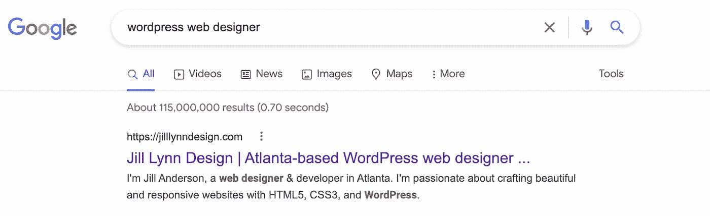
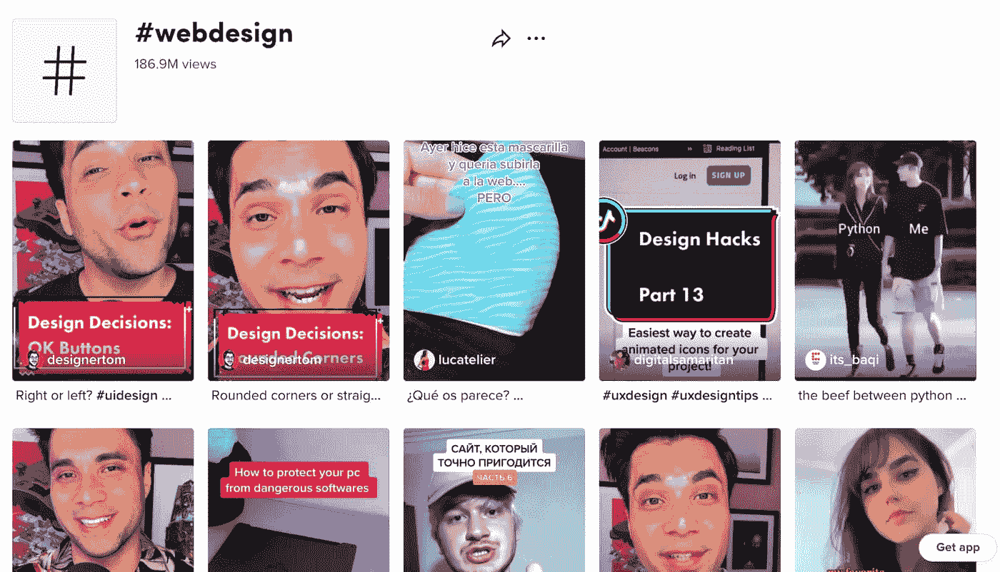
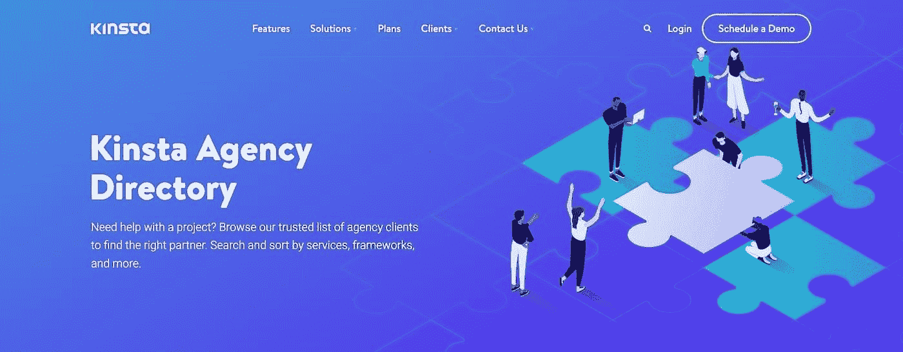

# 如何获得网页设计客户:7 个专家提示

> 原文：<https://kinsta.com/blog/how-to-get-web-design-clients/>

如何获得网页设计客户的问题是每一个遭受[盛宴和饥荒周期](https://www.refrens.com/grow/feast-and-famine-cycle-of-freelancing/)的自由网页设计师首先想到的。

作为一名自由职业者，你的才能可以完成工作——但是你需要商业和营销知识来吸引客户，避免自由职业者面临的这个普遍问题。你应该有办法既吸引客户([内向营销](https://kinsta.com/blog/inbound-marketing/))又找到他们([外向营销](https://kinsta.com/blog/outbound-marketing/))，从而在你的渠道中保持源源不断的客户。

请继续阅读，了解更多信息。

## 网页设计客户需要什么

作为一名自由网页设计师，你可以选择你的客户。你可能遇到过坏客户，并创建了自己的[客户危险信号清单](https://creative-boost.com/red-flags-for-bad-clients/)来避免麻烦。但是客户端绿旗也值得注意。
 在我们开始讨论如何获得网页设计客户之前，这里有几个客户会很好合作的指标:

*   尊重你的时间和界限:好的客户尊重你的时间、界限和专业知识。他们知道你和其他客户一起工作，不可能 24/7 都有空。他们会考虑你的时间表，并问你他们建议的时间表是否可行。
*   清晰而现实的期望:与一个知道自己在寻找什么的客户合作，要比与一个不会给出指示的客户合作容易得多。当然，拥有对产品的创作自由是一个梦想——直到客户要求不断修改，因为他们心中没有一个清晰的概念。
*   接受建议:在自由职业者和客户的关系中，双方的贡献是平等的。客户雇佣你是因为你的专业知识，所以他们应该接受你的指导或建议。
*   **及时而全面的沟通:**好的客户会毫不拖延地对您的问题或澄清做出回应。除此之外，它们还为你提供了继续工作所需的内容和方向。
*   对自由职业者来说，报价是最可怕的事情之一。好客户很少讨价还价，因为他们尊重你的经验和技能，并愿意为此付钱。他们知道你也是企业主，所以他们按时付款。

## 如何获得网页设计客户

我们收集了寻找和吸引高质量网页设计客户的技巧。按照这些建议，你马上就会有很多工作要做。

> Kinsta 把我宠坏了，所以我现在要求每个供应商都提供这样的服务。我们还试图通过我们的 SaaS 工具支持达到这一水平。
> 
> <footer class="wp-block-kinsta-client-quote__footer">
> 
> 
> 
> <cite class="wp-block-kinsta-client-quote__cite">Suganthan Mohanadasan from @Suganthanmn</cite></footer>

[View plans](https://kinsta.com/plans/)

### 1.创建一个作品集网站

拥有在线作品集是获得客户的最快途径之一，因为它向潜在客户和雇主展示了你的能力。你可以使用像 [Behance](https://www.behance.net/) 或 [Dribble](https://dribbble.com/) 这样的网站来展示你的设计，但是我们强烈建议[创建一个定制的作品集网站](https://kinsta.com/blog/portfolio-website/)。通过拥有自己的网站，你可以在谷歌搜索结果上排名。当与[最佳搜索引擎优化(](https://kinsta.com/blog/wordpress-seo/) [SEO)](https://kinsta.com/blog/wordpress-seo/) [实践](https://kinsta.com/blog/wordpress-seo/)搭配使用时，你的网站可以不费吹灰之力就带来客户。例如，如果你搜索“WordPress web designer”，谷歌会在结果顶部显示 web designer [Jill Lynn](https://jilllynndesign.com/) 的网站。这意味着吉尔在她的网站的搜索引擎优化上投入了很多心思和精力。

Top result for “WordPress web designer.”

[FirstPageSage](https://firstpagesage.com/seo-blog/google-click-through-rates-ctrs-by-ranking-position-in-2022/) 分享一个排名第一的网页获得 39.6%的点击率(CTR)。想象一下她从潜在客户那里获得的入站流量。如果你还没有一个网站，你可以从今天开始，使用初学者友好的网站构建器在几分钟内建立你的网站，或者花一些时间在你的网站上展示你的网页设计技能。我们建议在 WordPress 上建立你的作品集网站。几乎 43%的 T2 网站使用 WordPress，它是最受欢迎的 T4 内容管理系统。你可以免费使用该软件，但你必须通过主机提供商托管你的网站——kin sta 提供[负担得起的主机计划](https://kinsta.com/plans)——并获得[组合插件](https://kinsta.com/blog/wordpress-portfolio-plugins/)为你的网站添加功能。一旦您建立了自己的网站，您就可以通过分享以下信息从内容营销中获益:

*   你过去参与过的网页设计项目
*   你擅长的领域
*   [你使用的网页设计软件](https://kinsta.com/blog/website-design-software/)
*   [网页设计最佳实践](https://kinsta.com/blog/web-design-best-practices/)
*   你设计背后的故事和灵感
*   您的设计流程
*   个案研究
*   客户评价

如果你想在搜索引擎结果页面上排名更高，发布常规内容，因为这有助于[为你的网站](https://kinsta.com/blog/how-to-drive-traffic-to-your-website/)增加流量。

### 2.在社交媒体上推广你的服务

除了网站，你还必须有一个社交媒体。虽然投资组合网站展示了你的能力，但社交媒体的存在会让人们知道你的能力。最重要的是，你的社交媒体账户展示了你的个性，帮助你建立个人品牌。你不需要出现在所有的社交网站上。选择你各自客户使用的社交媒体网络，在那里发展你的品牌。这里有一个不同的社交网络如何在你的网页设计生涯中为你服务的快速总结:

*   LinkedIn 是[专业推销自己的最佳场所](https://kinsta.com/blog/linkedin-marketing/)。你可以创建一个专业档案，发布行业见解和思想领袖的帖子，吸引商业联系人和寻找网页设计师的线索。
*   Twitter 非常适合分享小内容，并与设计师、开发人员和营销专业人士进行互动。许多人仅仅通过 T2 在推特上的关系网就找到了工作和机会。
*   [脸书](https://www.facebook.com/)是[最大的](https://kinsta.com/blog/facebook-marketing/) [社交网站](https://kinsta.com/blog/facebook-marketing/) [网站](https://kinsta.com/blog/facebook-marketing/)。许多自由职业者和小企业都有一个[脸书页面](https://kinsta.com/blog/how-to-create-a-facebook-page/)，他们可以在那里发布更新。您也可以为您的在线社区创建一个脸书群组。
*   Pinterest 通过让你以图片的形式展示你的作品来帮助你的网页设计业务。不要把 Pinterest 斥为 DIY 和工艺品的轻浮网站；这是一个强大的[图片搜索引擎](https://kinsta.com/blog/image-search-engine/)。
*   Instagram 是一个视觉平台，非常适合网页设计师展示他们的审美和创造力——它帮助你从口碑营销中获益。
*   [抖音](https://www.tiktok.com/)使人们能够创建和发布视频内容。这不仅仅是舞蹈视频——你可以学习大量的技巧，成为专家，展示你的创造力。许多人因为分享教育内容的大师而出名。

你也可以利用标签与目标受众分享你的内容。例如，抖音上的[#网页设计标签](https://www.tiktok.com/tag/webdesign)有超过 1.8 亿的浏览量。

The TikTok #webdesign hashtag page has over 180 million views.

在各种社交网站上建立受众时，要记住每个平台的受众是不同的。避免将交叉发布作为社交媒体策略。根据受众为每个平台创建内容。

### 3.分享有用的内容

在你的网站和社交账户上分享有用的内容，建立一个在线形象，让客户和其他自由职业者从了解你中受益。分享有用的内容对您有以下好处:

*   建立信任
*   将您定位为专家
*   扩大你的受众

### 信息

建立信任至关重要，因为 [70%的人更喜欢购买](https://business.adobe.com/uk/blog/perspectives/7-in-10-customers-will-buy-more-from-brands-they-trust-uk)或与他们信任的人合作，而 [46%的顾客](https://www.salsify.com/resources/report/content-2022-salsify-consumer-research-the-value-of-building-brand-trust)愿意为他们信任的品牌支付更多费用。

但是你如何定位自己是专家呢？从[开始，按下](https://www.fastcompany.com/90723597/how-digital-marketers-can-find-a-unique-niche-in-a-saturated-market)。掌握一项技能并成为该技能的关键人物，要比什么都想做而让你的听众感到困惑要好。 细分市场的一种方法是提供特定的网页设计服务，以迎合某些人的需求:

*   市场——你可以专注于电子商务业务
*   软件或技术——你可以为 WordPress 网站做网页设计
*   服务—您只能设计登录页面

通过细分，你将成为人们寻求具体帮助的人。细分市场还能让你更容易创建关于你专业知识的内容。当你把自己定位为专家时，记住要继续投资于你的教育。提高技能使你能够[要求更高的比率](https://www.entrepreneur.com/article/397133)。在不景气的月份，抓住机会:

*   紧跟[网页设计趋势](https://kinsta.com/blog/web-design-trends/)。
*   报名参加众多[网页设计课程](https://kinsta.com/blog/web-design-courses/)中的一门。
*   探索其他[设计工具](https://kinsta.com/blog/best-tools-for-freelancers/#design-tools)。

### 4.创造多种收入来源

一旦你建立了你的追随者，你也可以尝试销售你的观众可能感兴趣的数字产品。为什么？作为一名服务提供商，增加收入是一项挑战。无论你付出多少努力，总有一天你的网页设计师薪水会停滞不前。大多数六位数的自由职业者都有[多种收入来源。除了客户工作，他们还开发相关的数字产品进行销售。例如，你可以作为网页设计师创建和销售网站模板。除了被动收入之外，它还展示了你的技能并为你带来销售，所以你不必担心如何获得网页设计客户。DesignJoy 的 Brett 想出了一个基于订阅的数字产品，](https://www.businessinsider.com/online-income-streams-recommended-by-freelancer-scaled-up-2022-3)[产品化](https://copyblogger.com/productized-services/)开发服务，并将其设计业务扩展到每月 100 万美元。除了数码产品，其他收入来源的[想法](https://kinsta.com/blog/how-to-monetize-a-blog/)包括:

*   **咨询:**一旦你确立了自己的思想领袖地位，你可能会收到咨询请求。
*   演讲演出:如果你建立了自己的个人品牌，你可能会收到付费演讲演出的邀请。这也是让你出名的好方法。
*   **[成为会员](https://kinsta.com/affiliate-academy/how-to-become-an-affiliate-marketer/) :** 你可以开始推荐你使用的产品并赚钱。例如，Kinsta 有一个[很棒的会员计划](https://kinsta.com/affiliates/)，你可以加入。
*   销售电子课程:像 Skillshare 或 Teachable 这样的平台使得销售在线课程变得很容易。你也可以[创建一个会员网站](https://kinsta.com/blog/create-a-membership-website/)，如果你有大量的观众，把它作为一个长期的收入来源。

### 5.考虑特定行业的职位公告板

求职公告板是寻找新的网页设计客户的另一种方式。我们指的不是像 [Upwork](https://www.upwork.com/) 或 [Fiverr](https://www.fiverr.com/) 这样的自由职业市场，因为这些平台上的人们在价格上竞争，不值得[努力跑到底部](https://kinsta.com/blog/race-to-the-bottom/)。查看行业招聘信息，如:

*   [Mediabistro](https://www.mediabistro.com/) 从事媒体相关工作
*   [Smashing 面向开发者和设计师的工作板](https://www.smashingmagazine.com/jobs/)
*   创意领域的工作
*   [远程确认](https://remoteok.com/)远程机会
*   [我们远程工作](https://weworkremotely.com/)寻找远程机会

虽然大多数工作清单都是针对全职工作的，但你仍然可以尝试以自由职业网页设计师的身份推销你的服务。

## 注册订阅时事通讯

### 想知道我们是怎么让流量增长超过 1000%的吗？

加入 20，000 多名获得我们每周时事通讯和内部消息的人的行列吧！

[Subscribe Now](#newsletter)

### 6.有针对性的外联

冷邮件是向潜在客户提供服务的好方法，他们可能会从中受益。它甚至可以让你和你梦想中的品牌签约。以下是一些有针对性的外展步骤。

#### 1.创造一个理想的客户形象

作为一名自由网页设计师，你可以选择与哪些客户合作。有 4 种类型的客户端:

1.  你不想锁定的客户和不需要你服务的客户
2.  你想锁定但不需要你的服务的客户
3.  您不想锁定但需要您服务的客户
4.  您希望锁定需要您服务的*和*客户。

理想的客户是第四种:你喜欢他们，他们需要你。
但是如何获得那些网页设计客户呢？

首先，你必须清楚你想要合作的客户类型。列出你理想客户的特征有助于缩小你的搜索范围。

例如，在确定目标市场时，需要考虑以下几点:

*   客户目标
*   岁入
*   背景
*   问题、忧虑和恐惧
*   动机

在开发出你的理想客户角色后，列出你能提供给他们的解决方案或服务。例如，企业客户可能会从您的设计服务中受益，而新的网站设计者可能更喜欢购买您的网站设计模板。

#### 2.列出潜在客户

在建立了理想的客户形象后，开始寻找潜在客户。对于高收入的客户，你可以瞄准已经获得资助的创业公司。他们更有可能向你支付可观的利率，而不是那些只想维持运营的企业。浏览网站，如 Crunchbase 和风险投资(VC)数据库，获取年收入或销售额以及风险投资资金等数据。查看该公司的网站，检查它们是否合法。寻找危险信号，例如:

*   拼写、语法和标点错误
*   普通或垃圾内容
*   过时的内容

如果你有耐心并且喜欢挑战，你可以选择和这些客户一起工作。否则，如果一个企业不理解品牌形象和营销的重要性，你可能会花很多时间在会议上，试图说服他们做正确的事情。在潜在客户工具上列出所有潜在客户。不必花里胡哨；电子表格就够了。包括以下细节:

Struggling with downtime and WordPress problems? Kinsta is the hosting solution designed to save you time! [Check out our features](https://kinsta.com/features/)

1.  公司名称
2.  公司网站
3.  公司的 LinkedIn 档案
4.  联系人的详细信息，包括:
    *   名字
    *   在公司的职位
    *   电子邮件
    *   LinkedIn 个人资料

您还可以添加这些部分:

*   在你冰冷的电子邮件或介绍信中插入笔记或过去谈话的细节( [LOI](https://elnacain.com/blog/letter-of-introduction-loi-template/) )。
*   **状态**记录你联系过的人以及联系时间(便于跟踪)。

#### 3.发送一封冷冰冰的电子邮件

用你所有的细节精心制作一封完美的冷邮件。It [应该根据你的目标客户群精心设计](https://kinsta.com/blog/email-design/)。需要记住的一些提示:

*   **联系** **潜在客户** **。**在发送电子邮件之前，试着找机会通过社交媒体或社交活动与客户互动。如果你以前和客户打过交道，这有助于建立信任和认可。
*   定制你的推销。向你的潜在客户展示你了解他们的业务。告诉他们你能为他们做什么，为什么你是最好的选择。最终，一封冷漠邮件的目的是与客户交流。从那里，你可以讨论你的过程和他们的需求和预算，以检查你是否适合。
*   **跟进** **。如果没有回音，不要灰心丧气。也许他们只是很忙。几天后随时跟进— [35%的决策者](https://www.cience.com/blog/how-to-approach-prospects-survey)考虑到他们繁忙的日程安排，认为跟进是一个很好的提醒。**

### 7.网络

没有网络，如何获得网页设计客户的指南是不完整的。参加社交活动是认识业内新人和与现有关系建立更深层次联系的好方法。遵循这些建议来扩展您的网络:

#### 参加行业活动

参加行业活动和聚会是为你的网页设计业务建立信任和知名度的好方法。你可以面对面地接触你的目标受众，建立联系，这可能有助于你找到下一个客户。根据发表在《美国社会学杂志》上的马克·格兰诺维特的研究，我们更有可能从熟人那里而不是密友那里听说工作，因为我们的熟人和我们属于不同的群体。另一个优势？当潜在的客户和合作者能够把一个名字和一张面孔联系起来时，他们会更乐意和你一起工作。

#### 联系老客户

留住一个现有客户比获得一个新客户更容易，也更便宜。如果你正试图获得网页设计客户，与以前的客户接触以追加销售或获得推荐是值得的，尤其是如果你已经提供了出色的服务。

#### 请求推荐

### Info

如果你需要工作，让你的关系网知道。

主动向过去的客户、业内人士或自由职业者朋友寻求推荐。获得与你共事过的人的认可或推荐会鼓励潜在客户与你合作。你可以通过给那些给你送工作的人一些小礼物来激励这个过程——折扣或者礼物。

#### 与其他自由职业者合作

另一种获得自由职业的方法是与提供补充服务的自由职业者合作。你可以联系搜索引擎优化专家或内容作者，他们的客户可能正在找人改造他们的网站。你甚至可以联系[网站开发者](https://kinsta.com/blog/how-to-become-a-web-developer/)，他们的优势在于网站建设而非网站设计。你接触你的合作伙伴的现有客户群，他们向他们的客户提供你的服务，这为双方创造了额外的价值。

#### 加入一个机构

除了与其他自由职业者合作，你还可以[加入一个机构](https://kinsta.com/blog/wordpress-agency/)。代理机构是为其他企业提供服务的组织。在这种情况下，可以是一群自由职业者在互补的项目上一起工作。与广告公司合作的优势在于，他们有一个经常性的大客户群和大量涌入的新客户。由于他们的客户支付他们市场价格，他们也支付他们的自由职业者和分包商更好。如果你想了解并获得这个行业的所有细节，代理是你最好的选择。一旦你学会了你需要的技能，你甚至可以从[的自由职业者变成](https://kinsta.com/webinars/from-freelance-to-agency/)的代理人。如需预先审核的合作机构列表，请查看 [Kinsta 机构目录](https://kinsta.com/agency-directory/)。

Kinsta’s Agency Directory homepage

Kinsta 的代理目录是我们信任的代理的综合数据库。您可以根据以下条件过滤结果:

*   预算
*   提供的服务
*   技术栈
*   位置
*   语言

无论你是需要帮助还是正在寻找下一场演出，你都可以在 Kinsta 上找到。
[想保持源源不断的客户？💰看看这个入门指南✅ 点击推文](https://twitter.com/intent/tweet?url=https%3A%2F%2Fbit.ly%2F3oJlqTK&via=kinsta&text=Want+to+maintain+a+constant+stream+of+clients%3F+%F0%9F%92%B0+Check+out+this+guide+to+get+started+%E2%9C%85)

## 摘要

学习如何获得网页设计客户是一个混合的过程:启动你的个人品牌，展示你的专业知识，和与其他人建立关系。你可以运用不同的内向和外向营销策略来吸引潜在客户。

尽管如此，在实施你选择的策略之前，了解你想要吸引的理想的网页设计客户是至关重要的——那些知道他们想要什么并且尊重你作为合作者的专业知识的人。

你希望与其他内容或网页设计机构合作吗？查看[金斯塔的代理目录](https://kinsta.com/agency-directory/)。如果你有兴趣被列入我们的目录，[今天就联系我们](/cdn-cgi/l/email-protection#d4a4b5a6a0bab1a6a7bcbda4a794bfbdbaa7a0b5fab7bbb9)。

* * *

让你所有的[应用程序](https://kinsta.com/application-hosting/)、[数据库](https://kinsta.com/database-hosting/)和 [WordPress 网站](https://kinsta.com/wordpress-hosting/)在线并在一个屋檐下。我们功能丰富的高性能云平台包括:

*   在 MyKinsta 仪表盘中轻松设置和管理
*   24/7 专家支持
*   最好的谷歌云平台硬件和网络，由 Kubernetes 提供最大的可扩展性
*   面向速度和安全性的企业级 Cloudflare 集成
*   全球受众覆盖全球多达 35 个数据中心和 275 多个 pop

在第一个月使用托管的[应用程序或托管](https://kinsta.com/application-hosting/)的[数据库，您可以享受 20 美元的优惠，亲自测试一下。探索我们的](https://kinsta.com/database-hosting/)[计划](https://kinsta.com/plans/)或[与销售人员交谈](https://kinsta.com/contact-us/)以找到最适合您的方式。