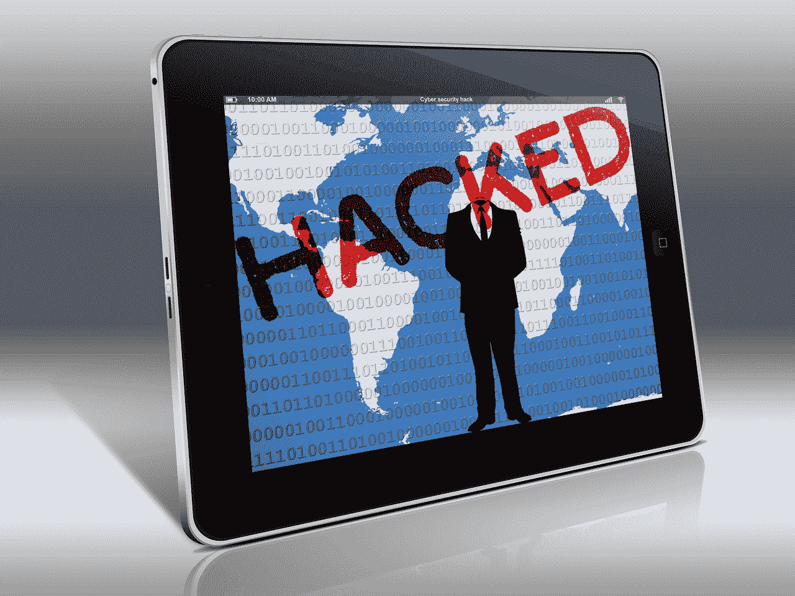
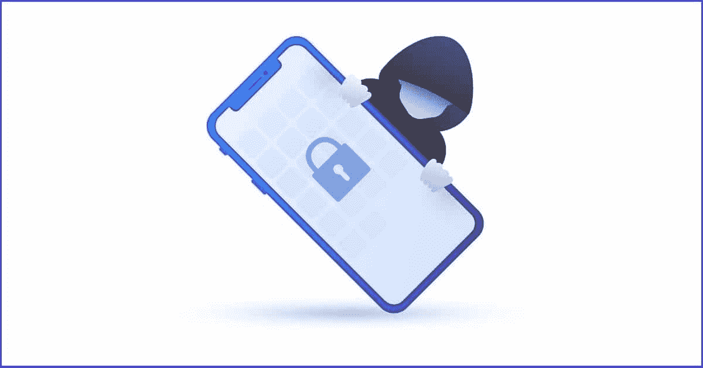
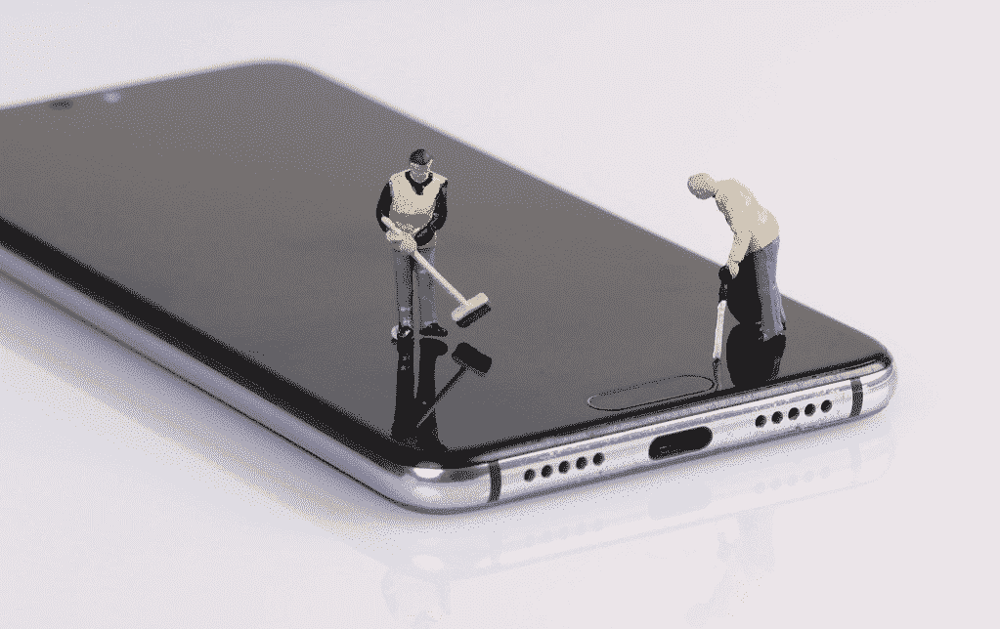
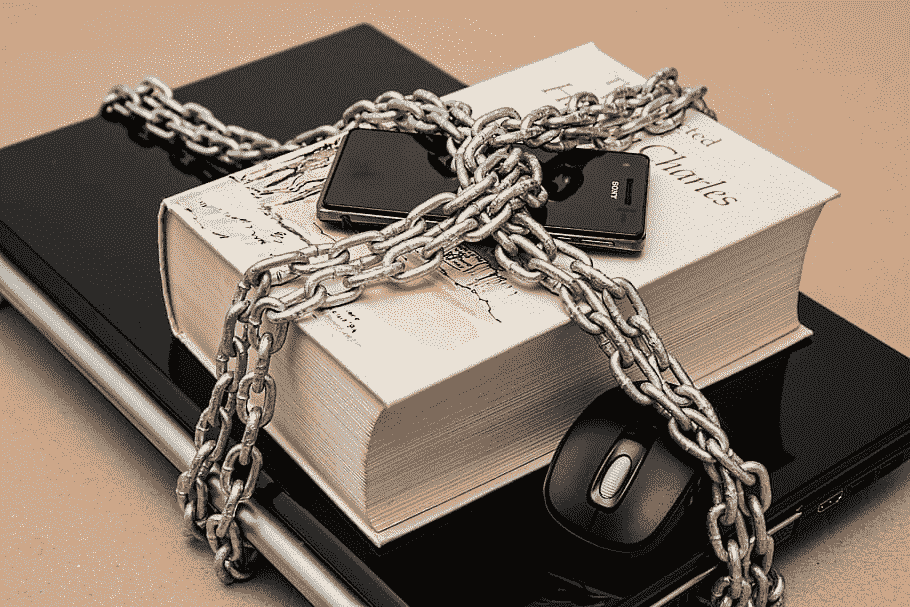
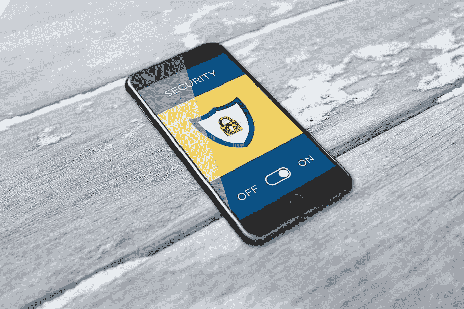
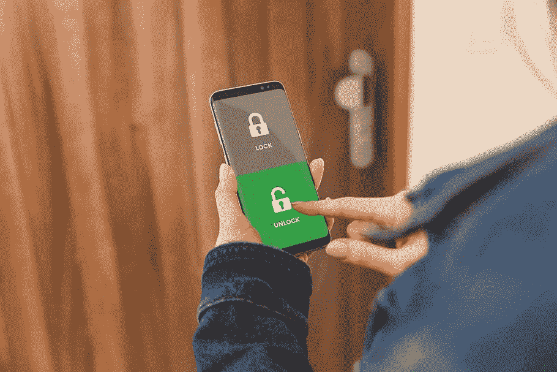

# 如何知道你的手机是否被黑了(以及如何避免)

> 原文：<https://kinsta.com/blog/how-to-know-if-your-phone-is-hacked/>

你知道吗，我们一生中有 8 年多的时间都在看手机。

没错——手机已经成为我们日常生活中必不可少的东西。几乎[40 亿人拥有智能手机](https://www.bankmycell.com/blog/how-many-phones-are-in-the-world#part-1)，这让它们成为黑客的美餐，不管它是安卓还是 iPhone。

每年都有新的黑客技术出现，让更多的用户和企业面临安全风险。出于这个原因，我们收集了一份最常见和最容易识别的警告信号，你可以通过这些信号来了解你的 Android 或 iPhone 是否被黑客攻击。

我们还将讨论黑客如何危害您的手机，以及您可以做些什么来保护您的手机免受有害威胁。

## 你的手机可能被黑的迹象

不难发现你的手机是否有问题。虽然这个问题可能与技术有关，但也可能意味着你的手机被黑客攻击了，这是一个严重的问题——例如，特别是如果你用手机运行你的 WordPress 网站的话。

手机和其他移动设备越来越容易受到黑客攻击。(图片来源:[书呆子杂志](https://nerdsmagazine.com/) )

[你知道我们一生中有超过 8 年的时间是在看手机上吗？😲在这个指南的帮助下，学习如何保护你的设备免受黑客攻击⬇️ 点击发推文](https://twitter.com/intent/tweet?url=https%3A%2F%2Fkinsta.com%2Fblog%2Fhow-to-know-if-your-phone-is-hacked%2F&via=kinsta&text=Did+you+know+that+we+spend+more+than+8+years+of+our+life+just+looking+at+our+phones%3F+%F0%9F%98%B2+Learn+how+you+can+keep+your+device+safe+from+hackers+with+help+from+this+guide+%E2%AC%87%EF%B8%8F&hashtags=iOS%2CAndroid)
那么，你如何判断你的手机是否被黑客攻击了呢

> Kinsta 把我宠坏了，所以我现在要求每个供应商都提供这样的服务。我们还试图通过我们的 SaaS 工具支持达到这一水平。
> 
> <footer class="wp-block-kinsta-client-quote__footer">
> 
> 
> 
> <cite class="wp-block-kinsta-client-quote__cite">Suganthan Mohanadasan from @Suganthanmn</cite></footer>

[View plans](https://kinsta.com/plans/)

让我们讨论一下你应该寻找的最常见的警告信号。

### 绩效变化

你的手机性能异常下降——尤其是如果它不是旧的——是它可能被黑客攻击的最常见迹象之一。

#### 1.电话变慢了

如果你有足够的内存空间和最新的软件更新，但你的手机反应迟钝，有可能是被恶意软件或其他黑客方法攻破了。

[恶意软件在后台运行](https://kinsta.com/blog/types-of-malware/)，消耗你手机的处理能力和资源，导致性能明显变慢。

#### 2.异常或快速的电池更换

被黑客攻击的手机往往会经历快速的电池消耗。如果黑客在你的手机上植入了恶意代码或 app，就会导致[性能问题](https://kinsta.com/blog/debugging-wordpress-performance/)，你的电池会比平时更快耗尽。

需要注意的是，后台运行的几个应用程序或游戏也可能导致电池快速耗尽。(是的，长时间玩游戏会耗尽你的电池寿命！)

因此，您应该首先检查没有应用程序正在后台运行。你还需要限制手机上的应用程序的电池消耗，然后才能立即假设手机被黑客攻击了。

#### 3.手机过热

如果过度使用手机，例如长时间看电影和视频或玩游戏，手机会变热。

然而，如果你没有主动使用你的手机，并且感觉异常的热，这可能意味着手机可能受到恶意活动的危害，并且其他人正在使用它。

#### 4.更高的数据消耗/账单费用

该付电话费了，但你的账单比平时要高。当您检查时，您会注意到未知的、过度的数据使用或其他账单费用。

这是一个重要的警告，你的手机可能被黑客攻击，通常是间谍软件。

在这种情况下，黑客使用受害者的手机打电话，收集和传输数据，发送短信，甚至[购物](https://kinsta.com/blog/ecommerce-fraud-prevention/)。

#### 5.应用程序随机崩溃

一个应用程序在你的 Android 或 iPhone 上崩溃或无法正确加载是正常的。这意味着应用程序本身有问题。

然而，如果你发现多个应用程序随机崩溃或无法加载，这是一个迹象，表明你的手机上有有害的软件或代码正在干扰它的正常运行。

#### 6.电子邮件传递失败

黑客入侵你手机的另一个迹象是，你的[电子邮件账户](https://kinsta.com/blog/professional-email-address/)有不寻常的活动。

在这种情况下，您会收到通知，告知您的电子邮件未能送达。这意味着您的帐户正被用于垃圾邮件活动。

其他神秘的变化包括将电子邮件标记为已读(不是你读的),并在可疑登录时提醒你的帐户。

#### 7.截图质量较低

如果你的手机有很好的拍照质量，但你突然发现你拍摄的[截图](https://kinsta.com/blog/how-to-screenshot-on-windows/)质量较低，你可能是一种糟糕的键盘记录器攻击的受害者。

键盘记录器是一种间谍软件，它允许黑客窃听你的电话，并通过记录你的击键来窃取数据。

### 令人费解的行为

你还可能在你的 iPhone 或 Android 上发现奇怪的行为或不寻常的活动，而你确定你没有这样做。如果你经历了以下一种以上的情况，你的手机很可能被黑了。

#### 1.手机上的奇怪应用

制造商或服务提供商在您的手机上预装应用程序，或者在软件更新后看到新的应用程序是正常的。

另一方面，当手机遭到黑客攻击时，你可能会发现你根本不认识的应用程序，不管它们看起来多么值得信任。这包括软件，如反病毒软件和手机清理软件。黑客在受害者的手机上安装这种应用程序，以监视他们并窃取信息。

如果你发现一个你不记得下载或在你的手机上有应用程序，你应该使用不同的设备，并检查它在互联网上是安全的。

#### 2.奇怪的弹出窗口

如果你的手机感染了恶意软件，你会开始看到 X 级或华而不实的弹出窗口或广告。这些[弹出窗口](https://kinsta.com/blog/google-mobile-popup-penalty/)会通过被感染的链接要求你执行某些动作。重要的是，不要点击那些可疑的链接，以避免数据泄露和进一步的损害。

#### 3.电话或短信中的陌生活动

各种类型的恶意软件，如网络钓鱼，可以通过 SMS 短信感染您的 Android 或 iPhone。黑客通常发送带有受感染链接的短信，允许他们访问你的手机。

如果你注意到短信或电话不是你打的，或者如果你的任何联系人收到你的电话或短信你不认识，你的手机很可能被黑客攻击。

#### 4.社交媒体上的陌生活动

尽管社交媒体平台尽最大努力保护用户账户免受黑客攻击，但每年仍有大量账户遭到破坏。

当黑客侵入您的手机时，您可能会注意到您的社交媒体帐户的奇怪活动，例如多次登录尝试和凭据(用户名和密码)的更改。

#### 5.手机试图访问不安全的网站

连接到安全的网络有它的好处。如果网络被设置为允许和阻止特定网站，当你的手机试图访问[可疑网站](https://kinsta.com/blog/website-security-check/)时，你会收到通知，这是一个警告信号，表明它已经受到威胁。

#### 6.相机问题

当你忙着用手机摄像头捕捉你最喜欢的时刻时，有一个黑客在某个地方等着捕捉机会，通过摄像头侵入你的 iPhone 或 Android。

一些迹象可以告诉你的手机是否被你的摄像头远程控制。例如，你可能会在手机上找到你不记得拍摄的照片或视频。如果你的相机闪光灯无缘无故地亮了，并且你的手机开始变热，你应该一直注意它。

#### 7.无法关闭手机

你的手机可能被黑客攻击的另一个迹象是正在努力关机。某些类型的恶意软件和间谍软件会阻止你的手机关机，从而让黑客可以随时监视你。

## 你的手机如何被黑

您的手机可能会被黑客攻击，网络罪犯会利用多种漏洞来访问您的设备。有些方法比其他方法更常见，因此您必须始终保持警惕，因为它可能会在最意想不到的时候发生。

保持警惕可以降低手机被黑的风险。(图片来源:[书呆子杂志](https://nerdsmagazine.com/) )

让我们来讨论一下你的手机被黑客攻击的最常见方式。

### 1.不安全的 Wi-Fi 网络

一些黑客创建公共网络来吸引易受攻击的用户连接到他们并访问他们的手机。它不止于此。如果您的密码较弱或经常更改网络密码，甚至您的家庭网络也可能成为网关。

### 2.下载恶意应用

一个恶意的 app 永远不会显得恶意。它的间谍功能通常隐藏在一个看起来很普通的应用程序中，这个应用程序似乎有一个典型的用途(例如，游戏、相机滤镜、[生产力应用程序](https://kinsta.com/blog/gmail-add-ons/)等)。).黑客会说服你在手机上安装该应用程序，一旦安装完成，他就可以完全访问你的手机。

黑客使用的两种最常见的恶意应用程序是间谍软件和跟踪软件。

间谍软件用于访问手机上的信息，如在线活动和个人信息。另一方面，stalkerware 是用来跟踪你的位置，运动，电话和信息。

### 3.点击了恶意链接

恶意链接比恶意应用程序更容易侵入你的手机，因为黑客只需要给你发送一个链接，一旦你点击了那个链接，他们就可以完全访问你的手机及其所有内容。

## 注册订阅时事通讯

### 想知道我们是怎么让流量增长超过 1000%的吗？

加入 20，000 多名获得我们每周时事通讯和内部消息的人的行列吧！

[Subscribe Now](#newsletter)

这些链接既可以通过普通文本发送，也可以通过手机上的任何其他消息应用程序(或包含消息服务的应用程序)发送，如 WhatsApp、Facebook Messenger、 [LinkedIn](https://kinsta.com/blog/linkedin-statistics/) 、Twitter、Instagram 等。

像计算机一样，恶意链接也可以隐藏在网站中，并以广告或其他服务网站链接的形式出现。

### 4.SIM 交换

这种方法最近变得相当流行。黑客知道你的足够信息，可以打电话给你的服务提供商，冒充你并说服他们你的号码需要换成不同的 SIM 卡。

随着最近[双因素认证(2FA)](https://kinsta.com/blog/wordpress-two-factor-authentication/) 的推出，验证文本必须发送到您的手机才能访问服务，所有这些文本现在都将发送给黑客，而不是您。

## 如何解锁你的手机

如果以上任何一种方法已经黑了你的手机，不要扔掉。你仍然可以挽救它，重新获得控制权。

只需几个步骤就能解锁手机。(图片来源: [Flickr](https://www.flickr.com/) )

这里有几个简单的方法，你可以用来破解你的手机，而不需要专家。

### 1.移除恶意软件

你手机上的任何恶意软件都可以通过下载一个可靠的反恶意软件应用程序轻松移除。有许多应用程序可用于此目的，其中一些涵盖了几种不同类型的安全威胁，其他的则是专门针对恶意软件的。

选择适合你的应用程序，并尽量避免未知的名称，因为它们可能最终成为恶意应用程序。一旦安装了这个应用程序，你就可以开始用它来扫描并移除手机中的所有恶意软件。

### 2.删除可疑应用

在你发现你的手机被黑客入侵之前，检查你手机上所有新安装的应用程序。如果发现有什么 app 不是自己安装的，立刻删除。

如果你自己安装的任何应用程序不重要或者来源可疑(公司名称不为人知)，就把它们从你的手机上彻底删除。

### 3.更改密码

从你的手机密码开始，浏览所有需要密码的主要应用程序。黑客可能已经访问了其中的一些应用程序，更改了他们的密码，并将他们从应用程序中注销。

不要就此打住。如果黑客找到了访问手机操作系统的方法，最好[更改你用来访问手机操作系统的密码](https://kinsta.com/blog/change-wordpress-password/)(例如谷歌/苹果账户凭证)。

### 4.重置电话

所有智能手机都可以选择将手机重置回默认出厂状态。换句话说，只需轻轻一点，你就可以清除整个手机的内存、设置、购买手机后安装的应用等。

然而，在这样做之前，确保你采取的上述步骤未能破解你的手机。其次，确保你在云存储中保留了手机的备份，以便在重置后恢复手机，并且不会丢失任何有价值的数据。

## 如何保护手机不被黑

你知道“安全胜于遗憾”这句谚语吗？最好采取一切预防措施来保护你的手机免受不必要的入侵，而不是试图修复它们造成的损害。

Protect your phone from hackers. (Image source: [Piqsels](https://www.piqsels.com/))

如果你的手机遭到黑客攻击，这几个简单的动作可以帮你省去很多不必要的麻烦。

所有的 Kinsta 托管计划都包括来自我们资深 WordPress 开发者和工程师的 24/7 支持。与支持我们财富 500 强客户的同一个团队聊天。查看我们的计划！

### 1.保持手机密码保护

随着手机技术越来越先进，它们的安全性也在提高。现在所有的智能手机都可以使用密码来保护，你可以创建一个密码来解锁你的屏幕。

随着指纹和面部识别的引入，许多手机将这种安全性推进了一点。这就是为什么使用这些方法中的任何一种来保护你的手机免受不必要的黑客攻击总是更好的原因。

然而，如果你的手机只依赖于密码，试着创建一个足够强的密码，让任何黑客都可以破解，但又不要太复杂，以至于你最终会忘记密码并被锁在手机外面。

### 2.使用安全应用程序存储敏感信息

手机上的敏感信息可以是密码、照片、文档或任何其他你想留给自己的私人内容。这就是为什么安全应用程序，如[密码管理器](https://kinsta.com/blog/password-managers/)，手机加密应用程序，以及其他几个可以让您的手机及其所有内容难以访问。

### 3.始终启用双因素身份验证

许多重要的在线服务，如网上银行、电子邮件、[网上购物](https://kinsta.com/blog/ecommerce-statistics/)等，都使用 2FA 来保护您的帐户免受任何未经授权的登录尝试。

它的工作原理是，访问您的帐户，一个验证文本被发送到您的电话号码注册的帐户，以确认您的身份。一些服务可选地提供这种安全措施，但是其他服务强制应用它。如果你被询问，去做它进一步保护你的电话和所有相关的帐户。

### 4.避免公共 Wi-Fi

如前所述，[公共 Wi-Fi 网络](https://kinsta.com/blog/your-connection-is-not-private/#airport-portal)可能是黑客进入你手机的绝佳途径。如果在户外时必须连接到互联网，请使用您的移动数据。可能会贵一点，但是安全多了。

如果这是不可能的，[下载一个可靠的 VPN](https://kinsta.com/blog/proxy-vs-vpn/) 并连接到公共网络。通过这种方式，你可以隐藏你的在线身份，让附近的黑客很难看到你。

### 5.不使用时关闭蓝牙

随着消息应用的发展，蓝牙已经成为发送恶意内容的一种罕见方法。然而，它仍然被使用，你的手机仍然容易受到攻击。

这就是为什么如果你没有连接到任何其他蓝牙设备(AirPods，车载电话等。)，那么总是保持蓝牙关闭比较好。除了更安全之外，它还可以避免不必要地耗尽电池。

### 6.保持手机软件和应用程序最新

你的手机软件版本越老(尤其是超过 2 年)，被黑的风险就越大。

旧软件版本无法获得最新的安全更新。这就是为什么确保定期更新您的手机软件以获得最新的安全功能和修复非常重要。

一定要经常更新手机上安装的应用程序。此外，建议删除您根本不使用的应用程序。这不仅可以释放你手机上的空间，也有助于保护手机的安全。

### 7.锁定单个应用程序

锁定包含个人信息的特定应用程序是保护手机免受窥探的最佳方式。

一些 Android 手机内置了通过密码或指纹锁定应用的功能。Google Play 上也有第三方应用，比如 AppLock，它允许你在没有密码或指纹的情况下限制对某些应用的访问。

与 Android 不同，iPhone 并没有给用户太多的第三方应用程序的空间。所以，你可能会很难锁定单个应用程序。

不过 iPhone 上的一些应用*可以*锁定，比如 Notes 应用。如果您想要保密某个备忘录，您可以使用密码、指纹或面孔 ID 来锁定它。

### 8.定期监听手机信号

我们并不是建议你过分担心如何保护你的手机免受黑客攻击，但是明智的做法是留意黑客攻击的迹象，就像我们之前讨论过的那样。

就像[监控网站](https://kinsta.com/blog/application-performance-monitoring/)一样，通过定期监控你的手机行为，你将能够在处理它变得具有挑战性之前更快地找出任何恶意软件或安全漏洞。

### 9.激活查找我的电话功能

几乎每个人都有乱放东西的习惯。有多少次你忘记把手机放在哪里了？虽然在家里依偎在沙发垫之间丢手机比较安全，但如果你在公共场合丢手机，那就麻烦了。

iphone 和 Android 手机都有一个很好的功能，当你找不到手机时，可以找到它。它在 iPhone 中被称为“查找我的 iPhone ”,而谷歌在 Android 中被称为“查找我的设备”。每一个都将帮助您找到丢失的设备，锁定它，甚至在设备丢失或被盗时彻底清除它，以保护您存储的数据不被泄露。

## 修复被黑 iPhone 的技巧

虽然 iPhone 运行在一个封闭的系统(iOS)上，比 Android 提供更多的隐私，但它仍然有可能被黑客攻击。

注意安全提示可以降低你的风险。(图片来源: [Pxfuel](https://www.pxfuel.com/) )

我们收集了一些调整，你可以这样做，以进一步保护你的 iPhone 免受黑客攻击。

1.  **从锁屏中移除小工具和通知设置:**文本和小工具等通知可能会显示陌生人不应该知道的敏感数据。
2.  **选择“登录苹果”:**这是一个方便的功能，当你想在线创建一个帐户，而不是使用你的电子邮件地址，这将允许第三方将你的数据与它相关联。

使用 Apple 登录会生成一个随机的电子邮件地址，您可以藏在后面转发您的电子邮件地址，以保护您的数据不被泄露。

1.  **关闭广告跟踪:**公司利用这一功能根据你的喜好向你展示个性化广告，使他们能够收集你的数据。你可以禁用这个功能，以避免此类应用程序收集或出售你的数据，或者你可以[选择一个优先考虑你的匿名的浏览器](https://kinsta.com/blog/most-secure-browser/)。
2.  **禁用邮件跟踪:**如果你使用苹果的邮件应用，这一点适用。由于一些电子邮件可以让发件人知道你的位置，苹果可以通过禁用邮件跟踪来阻止这些信息。

## 修复被黑安卓手机的技巧

如果你有一部安卓手机，有几件事你应该知道，以保护你的手机不被攻破。

保持你的安卓系统更新和锁定。(图片来源: [pxfuel](https://www.pxfuel.com/) )

以下是我们的最佳建议:

1.  **启用智能锁:**该功能根据手机的位置自动锁定手机。例如，如果你带着手机，你可以选择保持手机解锁。但是，当您离开时，它会自动锁定
2.  **小心你下载的内容:**与 iOS 不同，Android 是一个开源操作系统，这使得它更容易受到恶意活动的攻击。因此，我们强烈建议您从 Google Play 下载应用程序，并确保它们通过了 Google Play Protect 的验证。
3.  **Android Enterprise Essentials:**谷歌提供这项服务来管理你的设备，特别是如果你使用 Android 操作系统进行商务活动。Android Enterprise Essentials 配备了安全功能，如始终在线恶意软件防护和屏幕锁定强制执行。
4.  **使用安全浏览:**谷歌 Chrome 拥有安全浏览模式，在访问可疑网站前发出警告，降低了被恶意软件入侵的风险。你将要访问的网站是安全的标志之一是它是受 SSL 保护的。

[With new hacking techniques being developed every year, knowing how to protect yourself (and your phone) is essential. 💪📱 Learn more in this guide ⬇️Click to Tweet](https://twitter.com/intent/tweet?url=https%3A%2F%2Fkinsta.com%2Fblog%2Fhow-to-know-if-your-phone-is-hacked%2F&via=kinsta&text=With+new+hacking+techniques+being+developed+every+year%2C+knowing+how+to+protect+yourself+%28and+your+phone%29+is+essential.+%F0%9F%92%AA%F0%9F%93%B1+Learn+more+in+this+guide+%E2%AC%87%EF%B8%8F&hashtags=Hacking%2CiOS)

## 摘要

无论一个人有多谨慎，黑客总是会发明新的方法来实施恶意计划，以攻破你的手机——iPhone 或 Android。

然而，通过留意警告信号和使用我们建议的安全提示，你将能够保护你的手机免受黑客攻击，并尽你所能保护你的在线业务。

如果您有更多帮助他人保护手机免受黑客攻击的建议，请留下您的评论，让我们知道。一定要看看[我们关于在家工作时保持安全的建议](https://kinsta.com/blog/work-from-home-security/)。

* * *

让你所有的[应用程序](https://kinsta.com/application-hosting/)、[数据库](https://kinsta.com/database-hosting/)和 [WordPress 网站](https://kinsta.com/wordpress-hosting/)在线并在一个屋檐下。我们功能丰富的高性能云平台包括:

*   在 MyKinsta 仪表盘中轻松设置和管理
*   24/7 专家支持
*   最好的谷歌云平台硬件和网络，由 Kubernetes 提供最大的可扩展性
*   面向速度和安全性的企业级 Cloudflare 集成
*   全球受众覆盖全球多达 35 个数据中心和 275 多个 pop

在第一个月使用托管的[应用程序或托管](https://kinsta.com/application-hosting/)的[数据库，您可以享受 20 美元的优惠，亲自测试一下。探索我们的](https://kinsta.com/database-hosting/)[计划](https://kinsta.com/plans/)或[与销售人员交谈](https://kinsta.com/contact-us/)以找到最适合您的方式。