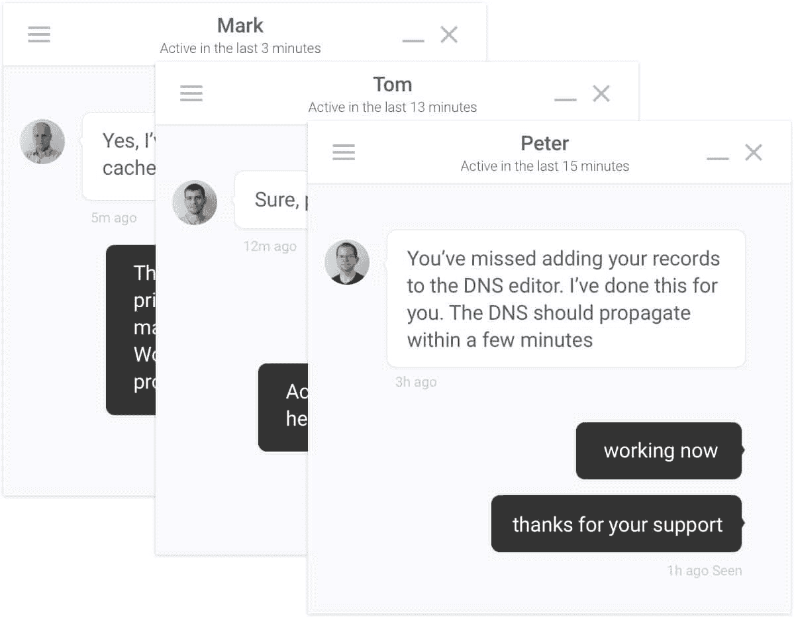
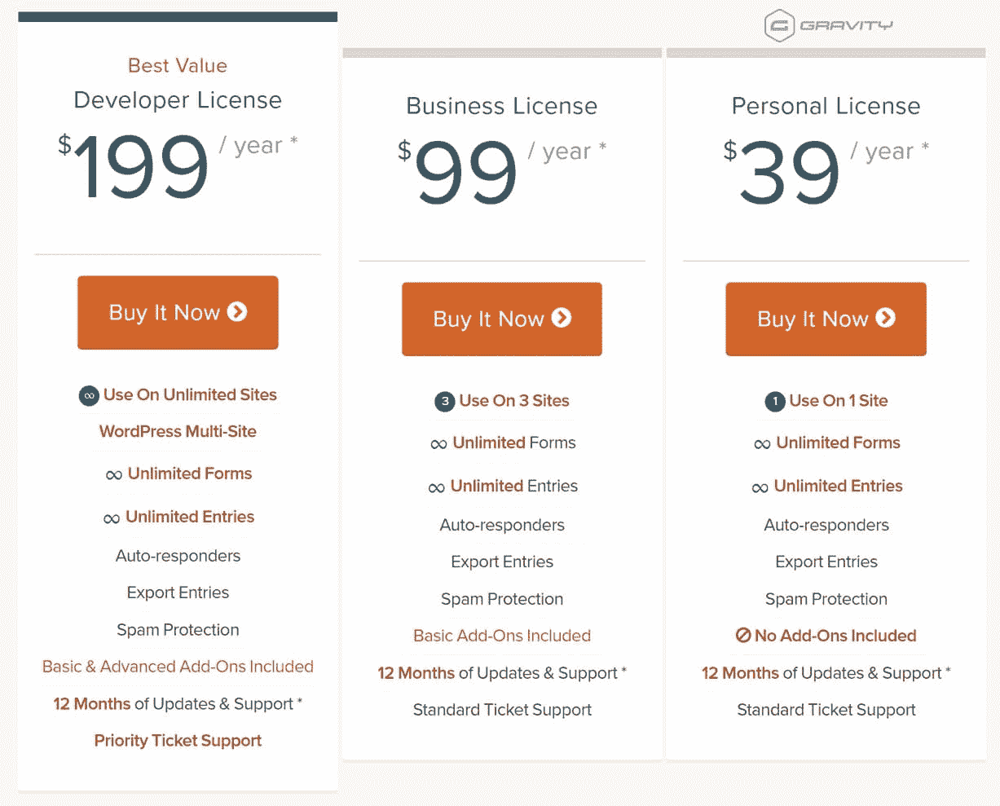
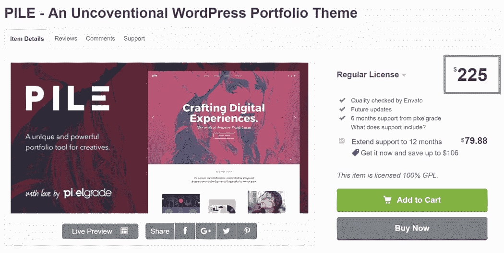
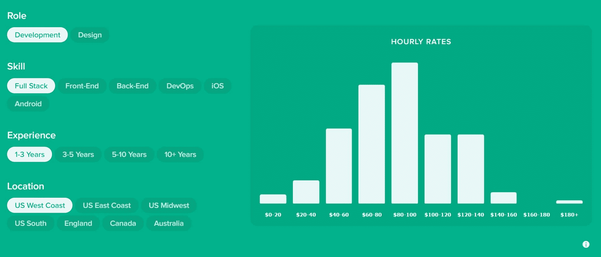

# 如何为 WordPress 的产品或服务定价的 5 个技巧

> 原文：<https://kinsta.com/blog/how-to-price-a-product-wordpress/>

每一个新公司、创业公司或产品发布都会带来一个终极问题，你应该为你的 WordPress 产品或服务收取多少费用？你从哪里开始设置基线呢？这不是一件可以掉以轻心的事情，你绝对应该为你的目标受众做市场调查，并检查你的竞争对手在做什么。由于我们在 Kinsta 提供 WordPress 服务，并且我们的团队成员销售优质的 WordPress 插件，我们想分享一些关于如何更好地为 WordPress 的产品或服务定价的建议。

## 如何为 WordPress 的产品或服务定价

WordPress 市场最大的优势之一也可能是你推出产品或服务的最大障碍之一。这就是 WordPress 在网络上的绝对规模。根据 W3Techs 的数据，截至 2019 年 1 月，WordPress 现在为互联网上所有网站的 [32%供电。它一直在稳步增长，高于 2016 年 3 月的 26%。然而，由于 WordPress 的庞大规模，这也意味着它是一个竞争非常激烈的领域。更有可能的是，不管你正在推出什么样的 WordPress 产品或服务，可能已经有 3-4 个其他人在做同样的事情。](https://kinsta.com/wordpress-market-share/)

所以打入 WordPress 市场绝对是一个挑战，如果你定价错误，这可能最终是你生意失败的原因。如果你定价太高，你可能什么也卖不出去，但如果你定价太低，它可能最终会花费你更多的支持和维护费用，而不是你带来的收入。我们一直提出的最大建议之一是**不要把你的产品或服务定价太低**。下面我们将深入探讨这条路线的重要性和优势。

1.  给你的时间加上一个值
2.  [始终为支持预留额外的时间](#budget-extra-time-support)
3.  [不要低估你的服务或产品](#do-not-underestimate)
4.  [发布后提高价格有时是有利的](#raising-prices)
5.  [使用数据驱动的定价技术](#data-driven)

## 1.珍惜你的时间

无论你是一个按小时收费的 WordPress 开发者还是一个热门的新 WordPress 插件，你首先应该考虑的是你时间的价值。正如他们所说，“时间就是金钱……”这是非常正确的。对于自由职业者来说，其中一个因素可能是**与竞争对手相比，你的速度有多快？如果你能写出两倍于你同事的代码量，那么你的时间对潜在客户来说肯定更有价值。如果你在销售一个产品，你应该问自己**你在创造这个产品上投入了多少时间？**开发花了 2 年时间，还是 2 周？**

Lynda.com 大学的资深作家莫滕·兰德-亨德里克森在 2014 年写了一篇名为“[时间的价值——如何为你的价值充电](http://mor10.com/value-time-charge-youre-worth/)”的优秀文章在视频中，他向他的社交媒体粉丝提出了以下问题。

> 需要在这里大声喊出来。Kinsta 太神奇了，我用它做我的个人网站。支持是迅速和杰出的，他们的服务器是 WordPress 最快的。
> 
> <footer class="wp-block-kinsta-client-quote__footer">
> 
> 
> 
> <cite class="wp-block-kinsta-client-quote__cite">Phillip Stemann</cite></footer>

[View plans](https://kinsta.com/plans/)

> 如果我付钱让你一个人静静地站着，什么也不做一个小时，你会收多少钱？

他收到的回复从 40 美元到 800 美元不等，平均下来是 100 美元/小时。他问这个问题的原因是，在没有其他因素参与的情况下，看看人们认为他们的时间值多少钱。他这么做只是为了证明一个观点，即**人们非常珍惜他们的时间，但有贬低自己的倾向**。这可能适用于那些自由职业者，或者在评估你认为在你的产品或服务上的时间投资是值得的时候。永远珍惜你的时间。
T3】

## 2.总是为支持安排额外的时间

一切似乎总是回到时间，因为一天的时间永远不够。当你交付 WordPress 产品或服务时，你应该**总是为支持**安排额外的时间。支持几乎总是需要比你想象甚至计划更多的时间和精力。如果你估计你刚刚发布的新的闪亮插件可以支持 20 个小时，那么可以肯定的说你应该把这个数字翻倍。作为[管理的 WordPress 主机](https://kinsta.com/blog/managed-wordpress-hosting/)，我们比 Kinsta 的任何人都更了解这一点。我们大部分时间都花在帮助客户和解决问题上。

我通常不会用第一人称说话，但今天我会，因为我自己对此有一些亲身经历。今年早些时候，我和我的兄弟开发并推出了一个高级的 WordPress 优惠券插件。我们从一开始就计划建立一个广泛的知识库，人们可以在那里找到自己的答案。我们犯的**大错误是在我们推出**插件时没有写好所有的知识库文章。这导致了很多客户发来的电子邮件，询问一些我们没有预料到并且可以很容易避免的问题。我们最终写了 25 多份文件，电子邮件几乎完全停止了。

我们在 Kinsta 也有一个广泛的知识库，主要目的是减少支持所需的时间。但是请记住，撰写知识库文章也需要时间。无论您是接听客户支持电话、接听电话，还是通过实时聊天进行互动，都要为支持预留额外的时间。以后你会省去很多麻烦！

一个提示:如果你正在销售一个 WordPress 插件，永远不要把它作为一次性购买来推销。记住，你仍然需要花时间来支持它。一种非常常用的方法是以每年续订的形式销售许可证，其中包括 12 个月的支持和更新。下面是一个关于[流行的 Gravity Forms WordPress 插件](https://kinsta.com/blog/wordpress-contact-form-plugins/#gravity-forms)的定价的例子。通过这种方式定价，您可以确保不会在支持方面赔钱。

然而，如果你正在考虑用终身许可来定价，看看这些来自 [Freemius](https://freemius.com/blog/lifetime-license-for-wordpress-plugins-the-right-way/) 的关于如何正确定价的建议。
T3】

## 3.不要低估你的服务或产品

第三个建议是永远不要低估你的 WordPress 服务或产品。如果你花时间创造了令人惊奇的东西，那么这本身就有价值。你永远不应该低估自己。通过实际提高你的价格，你有时可以吸引不同的人群和或质量的客户。有些人看到了花更多钱购买高质量和客户支持的东西的价值。Envato 最近开放了 ThemeForest，允许作者打破他们多年来依赖的 35-65 美元的典型价格区间。执行总经理 Ben Chan[陈述了理由](https://forums.envato.com/t/author-driven-pricing-coming-to-themeforest/41371):

> 我们也逐渐明白，固定的、由环境控制的定价对许多作者来说是一种抑制，限制了社区对市场趋势的反应能力。通过转向作者驱动的模式，我们希望看到**更多高质量的商品、**更有创意的定价策略、对趋势更快的反应以及更快乐的顾客。

在那次宣布后不久，新的主题突然以更高的价格出现，例如现在售价为 225.00 美元的[堆主题](https://themeforest.net/item/pile-an-uncoventional-wordpress-portfolio-theme/8989183)。

## 注册订阅时事通讯

### 想知道我们是怎么让流量增长超过 1000%的吗？

加入 20，000 多名获得我们每周时事通讯和内部消息的人的行列吧！

[Subscribe Now](#newsletter)

这个主题的开发者在 [WPine.me](http://wpin.me/1st-themeforest-wordpress-theme-selling-225-00/22602/) 的评论中说:

> 我们将以这一新价格吸引的客户类型也将使我们走得更远，并与渴望加入我们旅程的人保持更密切的关系。我们不是在寻找随机的客户，我们愿意为我们的创意产品整合和授权一个相关的社区。

所以你应该问问自己，你想吸引什么类型的客户？请记住，大容量和低价格通常伴随着更多的支持所需的时间。因此，找到一个中间立场，认真考虑你应该向谁销售，这可能是件好事。

[You should ask yourself, what type of customer do you want to attract?Click to Tweet](https://twitter.com/intent/tweet?url=https%3A%2F%2Fbit.ly%2F2txLEuG&via=kinsta&text=You+should+ask+yourself%2C+what+type+of+customer+do+you+want+to+attract%3F&hashtags=ecommerce%2CWordPress)

如果你是 WordPress 开发者或自由职业者，Bonsai 已经基于他们的合同数据创建了一个很棒的图表，帮助你更好地[估算你的时薪](https://www.hellobonsai.com/rates)。基于来自 30，000 多名自由职业者的数据，他们注意到一些有趣的发现，例如:

*   美国西部和东部的自由职业者比中西部和南部的自由职业者收入高 10%左右。
*   在不同的经验水平和地域，开发人员的收入比设计师高 30%

[T2】](https://www.hellobonsai.com/rates)

## 4.上市后提高价格有时是有利的

也许你已经发布了你的 WordPress 产品或者服务。嗯，有时事后提价可能是有利的。尼尔·帕特尔写了一篇名为“不要害怕涨价”的文章。下面是为什么。”在这篇文章中，他提出了许多好的观点，其中一些总结如下:

Struggling with downtime and WordPress problems? Kinsta is the hosting solution designed to save you time! [Check out our features](https://kinsta.com/features/)

*   提高价格可能比销售更多产品更有效
*   剔除不太好的顾客
*   让你在竞争中脱颖而出
*   你的价格反映了你的产品/服务质量

当然，这也有一些负面影响，但是权衡利弊是很重要的。

我将再次切换回第一人称，因为我有另一个非常适用于这里的个人例子，尽管它处于不同的位置。大学期间，我曾经做过电脑维修上门服务。我刚开始的时候，每小时收费 50 美元。我开始涉足其他行业，比如网络营销，突然发现自己落伍了。我不再有时间支持我所有的老客户。所以我最终提高了价格，以摆脱一些上门服务的客户。

我把价格从 50 美元/小时提高到 75 美元，最后定在 125 美元/小时，一些客户最终开始离开，只给我留下质量更好的。最后，我把价格提高了 150%,现在用更少的工作赚更多的钱。我剩下的客户很乐意付钱，因为我做的工作质量是无与伦比的，即使是在这个地区有 10 多家其他的电脑维修店。因此，无论是对产品还是服务来说，提高价格有时都是一个很好的策略。

Warby Parker 的产品战略总监 Shannon Malone 说得好:

> **价值是价格与质量的比率**，我们总是努力提供价值以保持竞争力。

## 5.使用数据驱动的定价技术

当它实际上归结到为你的 WordPress 产品或服务定价的本质部分时，有一些事情要记住。首先，**你的竞争对手在做什么？**正如我们上面提到的，提高价格可能是一件好事，但如果有另一种产品或服务与你的产品或服务具有相同的质量，那么你可能应该考虑匹配或击败他们的价格。或者如果你不能击败他们的价格，**想办法增加你的产品或服务的价值**。

[Adding value to your product can be an alternative to lowering the price.Click to Tweet](https://twitter.com/intent/tweet?url=https%3A%2F%2Fbit.ly%2F2txLEuG&via=kinsta&text=Adding+value+to+your+product+can+be+an+alternative+to+lowering+the+price.&hashtags=marketing%2Cecommerce)

如果你刚刚起步，另一个帮助确定价格的方法是众包。对你的目标受众进行调查，找出他们愿意支付的价格。你可以通过快速的 FB 或 Twitter 广告轻松做到这一点。没有什么比你的顾客更能说明问题了。记住，看不到高质量产品价值的人通常是少数。以苹果为例，他们的产品无论如何都不便宜，然而他们每年都有数十亿美元的收入。

> 贵是好事，不是自动否定。人们喜欢拥有昂贵的东西。他们欣赏地位感和价值感，因为他们能够购买和拥有一件昂贵的产品。–[kiss metrics](https://blog.kissmetrics.com/psychological-tips-product-pricing/)

当你在你的 WordPress 网站上真正显示价格时**使用整数**和**去掉美元符号**。根据 [strategy+business](http://www.strategy-business.com/blog/The-Psychology-of-Pricing-Customers-Prefer-Round-Numbers?gko=f4877) 进行的一项调查，57%的消费者选择以零结尾的整美元金额，另有 4%的消费者选择支付整半美元金额。

## 摘要

所以请记住，当谈到如何为 WordPress 的产品或服务定价时，重要的是重视你的时间，总是为支持预算额外的时间，不要低估自己，可能会提高你的价格，并使用数据驱动的定价技术和研究。对于 WordPress 空间有其他好的定价技巧吗？如果是这样，我们很想听听他们的下文！

* * *

让你所有的[应用程序](https://kinsta.com/application-hosting/)、[数据库](https://kinsta.com/database-hosting/)和 [WordPress 网站](https://kinsta.com/wordpress-hosting/)在线并在一个屋檐下。我们功能丰富的高性能云平台包括:

*   在 MyKinsta 仪表盘中轻松设置和管理
*   24/7 专家支持
*   最好的谷歌云平台硬件和网络，由 Kubernetes 提供最大的可扩展性
*   面向速度和安全性的企业级 Cloudflare 集成
*   全球受众覆盖全球多达 35 个数据中心和 275 多个 pop

在第一个月使用托管的[应用程序或托管](https://kinsta.com/application-hosting/)的[数据库，您可以享受 20 美元的优惠，亲自测试一下。探索我们的](https://kinsta.com/database-hosting/)[计划](https://kinsta.com/plans/)或[与销售人员交谈](https://kinsta.com/contact-us/)以找到最适合您的方式。