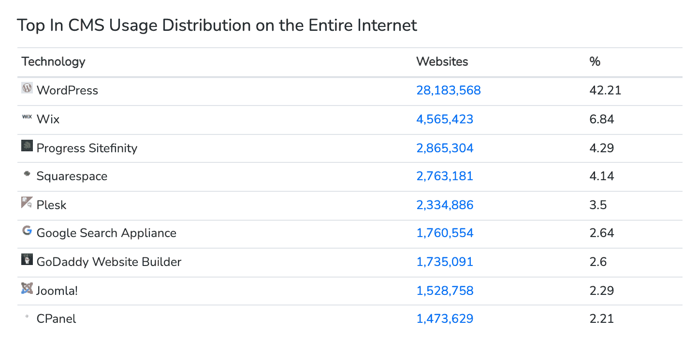
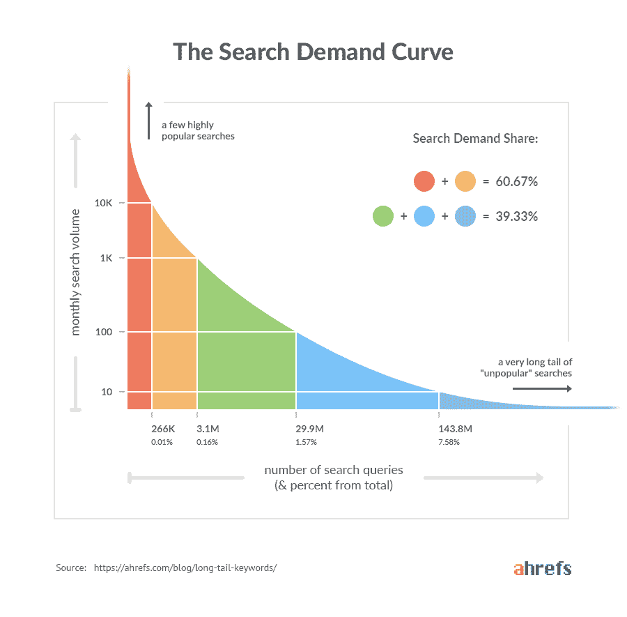
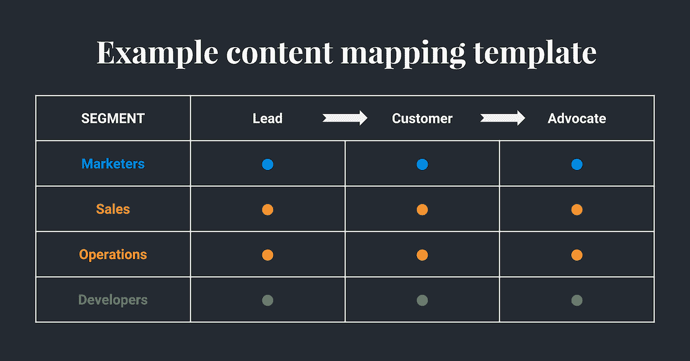
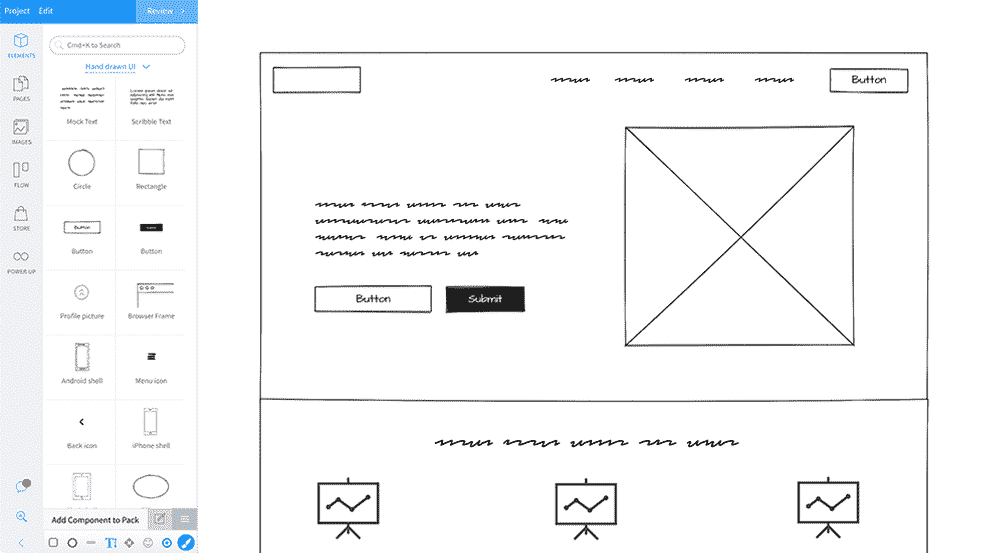
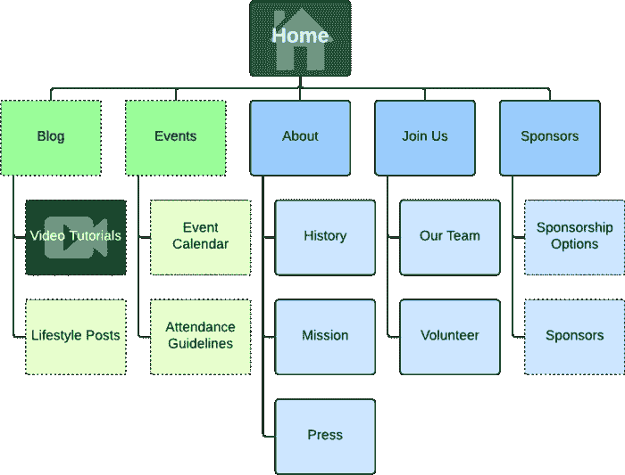
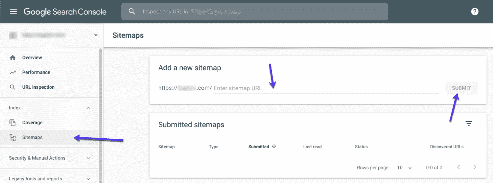

# 如何发布网站:初学者完全指南

> 原文：<https://kinsta.com/blog/how-to-publish-a-website/>

掌握创建一个新网站的艺术可能会让人不知所措。

你不得不担心复制，设计和功能一体化。此外，你需要确保它针对搜索引擎进行了[优化，这样你的客户才能找到它。](https://kinsta.com/blog/how-to-drive-traffic-to-your-website/)

即使是最有经验的营销人员有时也不知道从哪里开始。

这就是为什么我们把这个指南放在一起，强调如何发布一个网站。

在这篇文章中，你会发现在构建你的网站时应该考虑的重点领域。通过遵循这些步骤，你将为创建一个吸引人的、有效的网站打下坚实的基础。

T3】

## 1.选择您的发布选项

你不一定要成为技术专家才能发布自己的网站。有适合各种经验水平和预算的工具。

第一步是从你的四个主要选项中选择。

### 编码(HTML、CSS、JavaScript)

如果你的团队中有一名专业的 web 开发人员，或者选择[雇佣一名](https://kinsta.com/blog/hire-wordpress-developer/)，你的网站可以使用像 [HTML](https://kinsta.com/blog/wordpress-vs-static-html/) ，CSS 和 JavaScript 这样的语言从头开始编码。

这是最困难和最耗时的选择。如果你想更新你的网站，你需要再找一个开发者。

从好的方面来说，你有完全的灵活性去创造你想要的任何东西。而且没有底层软件或插件需要更新和管理。

### 网站建设者

网站建设者快速，容易，便宜。

他们让你用一个简单的拖放界面创建一个网站。有时，网站建设者允许你免费建立和托管你的网站，但你通常会有一些免费帐户的限制。例如，你通常不能选择自己的域名。

受欢迎的网站建设者包括 [Wix](https://kinsta.com/blog/wix-vs-wordpress/) 、[weely](https://kinsta.com/blog/weebly-vs-wordpress/)和 [Squarespace](https://kinsta.com/blog/squarespace-vs-wordpress/) 。

如果你想快速廉价地建立一个网站，网站建设者可能是一个不错的选择。但是你没有太多的定制能力，大部分建站商都让你以后不可能把网站搬到不同的主机上。

[准备好跨越并发布您的第一个网站了吗？😄从这里开始✅ 点击推文](https://twitter.com/intent/tweet?url=https%3A%2F%2Fkinsta.com%2Fblog%2Fhow-to-publish-a-website%2F&via=kinsta&text=Ready+to+make+the+leap+and+publish+your+first+site%3F+%F0%9F%98%84+Start+here+%E2%9C%85&hashtags=WordPress%2CWebDesign)

### 内容管理系统

内容管理系统是帮助用户创建、管理和编辑网站内容的软件。

任何人都可以使用 CMS，但它不是一个网站建设者那么简单。在你能有效地创建和维护一个网站之前，还有更多东西要学。虽然你可以在不了解任何 HTML 的情况下构建一个完整的 CMS 支持的网站，但了解一些会有所帮助。

这是一个非常受欢迎的选择——世界上有 7000 万网站使用 CMS。一些最常见的是:

*   [WordPress](https://kinsta.com/knowledgebase/what-is-wordpress/)
*   [Joomla！](https://kinsta.com/blog/joomla-vs-wordpress/)
*   [Drupal](https://kinsta.com/blog/wordpress-vs-drupal/)
*   Magento(电子商务网站)

CMS distribution across the internet

内容管理系统让您可以灵活地创建自定义网站并不断更新。您可以使用各种易于安装的[插件](https://kinsta.com/best-wordpress-plugins/)来添加功能。

与网站构建器不同，CMS 要求您选择一个单独的网站主机(参见步骤 4)。

然而，要记住的一件事是，使用 CMS 并不总是免费的。虽然通常会有免费版本，但这些都有局限性。

### 结合

你不必只选择其中一个选项来发布你的网站。

例如， [WordPress 网站构建器](https://kinsta.com/blog/wordpress-page-builders/)让你用网站构建器的简单性构建一个 CMS 网站。

许多网站是结合使用代码和 CMS 构建的。这样，一个专业的网络开发人员可以创建网站，并对设计或功能做出任何重大改变，但像上传新的[博客帖子](https://kinsta.com/blog/best-blogging-platform/#best-selfhosted-blogging-platforms-in-2020)或切换图像这样的任务对任何人来说都很容易。

## 2.准备你的网站内容

不管你用什么样的解决方案来建立你的网站，它的成败取决于你放在上面的内容。

在你设计网站之前，最好对你的内容有一个计划。你不必列出你的博客将要涵盖的每一个主题，但是你应该对你的核心页面有一个概念。

### 头脑风暴有意义的话题

你的网站的重点是什么？你认为你的理想读者想读什么？

头脑风暴列出一系列有趣的相关话题。

如果你不知所措，看看你的竞争对手的网站，看看他们涵盖了什么主题。

### 执行关键字研究

确定写什么主题的一个好方法是[研究关键词](https://kinsta.com/blog/keyword-research/)。我们的目标是找出你的理想受众在搜索哪些词，并在你的内容中使用这些词，这样人们就能找到你。

你应该想出一个短尾和长尾关键字的组合。

短尾关键词是很多人正在搜索的宽泛术语。比如“美术用品。”你可能永远也不会成为谷歌上的顶级“艺术用品”网站。

但是也许你可以排在“在圣路易斯买画笔”的前面那是一个长尾关键词。竞争较低，但搜索量也较低。

Long-tail vs. short-tail keywords (**Source:** [Ahrefs](//ahrefs.com/blog/long-tail-keywords/%E2%80%9D))

诀窍是对大量长尾关键词进行排名，从而为你的网站带来高流量。

### 选择一个名称

在某些情况下，你的网站名称会很明显。例如，如果你是一个已建立的企业，你会希望你的网站位于 yourbrandname.com 或类似的领域。

如果你的网站名称仍在改进中，你可以通过查看哪些域名可用来缩小范围。搜索主要的域名注册商，如 GoDaddy，name price，Bluehost 和 HostGator。

域名的[费用可能因注册商而异。在某些情况下，如果你选择在该服务上托管你的网站，你将获得一年或更长时间的免费域名。](https://kinsta.com/blog/how-much-does-a-domain-name-cost/)

你的域名应该吸引人，告诉访问者你的网站是关于什么的。

### 使用图像和视频内容

你的网站内容不应该完全是文本。人们喜欢网站上的图片，他们真的喜欢视频。

事实上， [69%](https://www.wyzowl.com/video-marketing-statistics/) 的消费者表示，他们更愿意观看解释产品或服务的视频，而不是阅读基于文本的文章(18%)或查看信息图(4%)。

### 规划您的内容策略

你的网站受众不仅仅是由一类人组成的。

例如，在客户旅程的不同阶段，您可能会有站点访问者。有些正处于认识阶段。他们只是在学习你做的事情和你解决的问题。

其他人接近第一次购买，其他人是忠实客户。

你也可能有一些不同的买家角色访问你的网站。例如，一个 B2B 公司可能向市场和销售领导出售其服务。每个组需要不同的目标内容。

在客户旅程的每个阶段，为每个买家角色集思广益，讨论内容主题想法。

Content mapping example (**Source:** [Hull](//www.hull.io/blog/content-mapping.html%E2%80%9D))

### 质量控制编辑

回顾你的工作，进行一轮修改。你很少会在第一次尝试的时候就把你的文章踢出公园，所以用一双新鲜的眼睛来审视你所有的内容。

如果你需要语法和拼写方面的帮助，从我们的 WordPress 最佳语法检查列表中选择一个工具。

## 3.设计和建立你的网站

最好的网站既实用又美观。在这一步，你决定你的网站将会是什么样子，它将会有什么特点。

### 线框化你的布局

网站设计从一个线框开始——以最简单的形式画出你的网站。把它想象成你网站的骨架。

网站线框与颜色或字体无关。相反，它是放置按钮、菜单和图像等元素的蓝图。

Website wireframe example

你可以手工绘制线框或者使用像 Adobe XD、 [Sketch 或者 Figma](https://kinsta.com/blog/figma-vs-sketch/) 这样的工具。

如果你使用的是拖放式网站构建器或 WordPress 模板，你可能不需要精确的线框，但是在开始创作之前，你还是应该勾画出你的设计。

### 设计你的品牌外观和感觉

你的网站的外观和感觉应该与你的品牌相匹配。将你的标志和品牌颜色融入设计中，用你品牌的声音书写内容。

如果你的品牌是新的，想想这个:你希望你的读者或客户在访问你的网站时有什么感觉？考虑如何让这种情绪在你的文案和设计中闪耀。

### 实施易于导航的 UX

如果消费内容令人困惑或沮丧，世界上所有伟大的内容都无法拯救你的网站。

这就是为什么 UX 或用户体验是网站设计的主要考虑因素之一。UX 设计是为你网站的访问者提供无缝、愉快的用户体验。

例如，以逻辑的方式构建你的网站。网站页面应该有一个有组织的层次结构，如何浏览这个层次结构应该是显而易见的。

Organized website structure (**Source:** [Lucidchart](//www.lucidchart.com/blog/how-to-make-a-sitemap-using-lucidchart))

与设计元素保持一致。按钮和菜单在整个网站上应该表现得一样。

## 注册订阅时事通讯

### 想知道我们是怎么让流量增长超过 1000%的吗？

加入 20，000 多名获得我们每周时事通讯和内部消息的人的行列吧！

[Subscribe Now](#newsletter)

不要忽视移动网站设计。对于在移动设备上浏览的 54.8%的互联网用户来说，你的网站易于使用是很重要的。[移动响应式设计](https://kinsta.com/blog/responsive-web-design/)不再可选。

A/B 测试消除了网站设计中的猜测。A/B 测试，或称分割测试，让两个网页元素相互竞争，看哪一个表现更好。例如，您可以测试红色或蓝色 CTA 按钮是否会获得更多的点击。

使用比较测试的结果不断优化您的 UX。

不确定如何开始 A/B 测试？我们已经为你列出了[十个最好的 WordPress A/B 测试工具](https://kinsta.com/blog/wordpress-ab-testing-tools/)。

## 4.托管您的网站

虚拟主机是一种允许你发布网站的在线服务。网站主机为网站文件提供服务器空间。

如果你使用 Wix 或 Weebly 这样的网站构建器，你可能不需要找到一个单独的主机。但是大多数网站需要一个托管解决方案。

### 找一个虚拟主机

你要做的第一件事是决定使用什么类型的网站主机。对于中小型网站，您有几种选择。

#### 共享主机

你的第一个选择是使用流行的托管平台，如 GoDaddy 或 HostGator。存储网站的实际服务器将由主机服务拥有，并且经常(至少在[最便宜的计划](https://kinsta.com/blog/cheap-wordpress-hosting/)的情况下)与其他网站共享。

共享主机是一个负担得起的选择，但它也有缺点。许多主机平台导致你的网站页面加载速度慢或者停机。

这是相当重要的，因为加载时间每增加一秒，网站转化率平均下降 [4.42%](https://www.portent.com/blog/analytics/research-site-speed-hurting-everyones-revenue.htm#:~:text=The%20first%205%20seconds%20of,(between%20seconds%200%2D5)) 。

一些平台还会限制你的内存和 CPU，这可能会导致你的网站出现性能问题。

#### 托管托管

[托管](https://kinsta.com/blog/managed-wordpress-hosting/)简而言之，托管公司负责服务器的设置、管理和维护。

但是，对于那些选择 [Kinsta 作为其托管提供商](https://kinsta.com/features/)的人来说，还有更多，如无与伦比的支持、利用 [GCP 的高级层网络](https://kinsta.com/blog/google-cloud-network/#google-premium-tier-network)的性能优化的托管基础设施、[计算优化的 C2 虚拟机](https://kinsta.com/blog/fastest-wordpress-hosting/)，35 个[数据中心位置](https://kinsta.com/knowledgebase/google-cloud-data-center-locations/)，由 Cloudflare 及其 200 多个城市的全球网络支持的免费 [Kinsta CDN](https://kinsta.com/help/kinsta-cdn/) ，企业级防火墙和 DDoS 保护。

托管主机的成本比共享主机略高，但投资总会有回报，比如更好的性能、安全、安全、支持和工作量的提高。
T9】

#### 自己动手

另一个选择是全权负责配置、更新和保持网站服务器的运行和操作。

这听起来可能是一个不错的交易，因为你不必支付托管服务提供商。但是[成为你自己的系统管理员](https://kinsta.com/blog/sysadmin/)是一项繁重的工作，需要大量的技术专长。

如果你没有资源来管理定期备份、安全扫描和其他维护，DIY 主机不适合你。

### 上传文件

上传您的图像、视频和自定义主题选项，让您的网站充满引人入胜的内容。

### 试验基地

在你发布之前，确保[测试你的站点](https://kinsta.com/blog/website-usability-testing/)是否有任何错误。在向公众开放之前，你的网站应该在一个小组或预览模式下进行测试。

### 优化文件和媒体以提高性能

过大的文件会降低你网站的速度。请务必缩小大图片，以确保快速的网站速度。

Struggling with downtime and WordPress problems? Kinsta is the hosting solution designed to save you time! [Check out our features](https://kinsta.com/features/)

此外，向您的媒体添加元数据，使其更易于搜索。为您的图像添加标题和替代文本，并为您的视频内容添加标题、描述、关键词和脚本。

## 5.发布您的网站

就是这个！当你与世界分享你的创作时。

### 实时推送网站

如果你已经设计并建立了你的网站，购买了你的域名，建立了虚拟主机，并通过预览小组测试了你的网站，那就只剩下一件事要做了。

点击发布并上线。

### 将网站提交给搜索引擎

谷歌和其他主要的搜索引擎在索引新网站方面做得很好，但是为了确保它能很快完成，你应该自己主动提交。

#### 谷歌

要将您的网站提交给谷歌，请设置[谷歌搜索控制台](https://kinsta.com/blog/google-search-console/)，并验证网站所有权。

验证域名所有权的最简单方法是复制 DNS TXT 记录，并将其添加到您的域名提供商。

一旦你登录到搜索控制台，进入侧边栏的“站点地图”，粘贴你的站点地图网址，然后点击“提交”

Google Search Console

#### 堆

Bing 要求你遵循与 Bing 网站管理员工具几乎相同的流程。登录，进入侧边栏的“站点地图”，粘贴你的站点地图网址，点击“提交站点地图”

#### 其他搜索引擎

你也可以将你的新网站提交给雅虎！还有 DuckDuckGo 。

## 6.规划未来

一个网站不是一个“设置好就忘了”的项目。

从你创建网站的那天起，你就应该有一个网站维护和改进的计划。

### 用新的内容和功能扩展

你应该不断地为你的网站写新的内容。这能让你的观众参与进来，保持兴趣，对 SEO 也有好处。

一项研究发现，每周发布两到四篇博客文章是流量和转化率最大化的最佳时机。

你可以通过关键词和竞争对手研究来保持思路畅通。

你也应该不断增加新的功能和更新你的用户界面。分割测试和网站分析会告诉你你的受众喜欢什么，不喜欢什么。

### 通过货币化增加收入渠道

你在网站上投入了大量的工作，是时候回报一下了。除了销售产品或服务之外，还有其他方法可以让你的网站赚钱。

#### 展示广告

没有人喜欢网站上的广告，但这是最简单的赚钱方式之一。

Google Adsense 是一个让你展示文本、图像、视频和互动媒体广告的平台。人们看到的广告是基于他们的个人喜好和搜索历史。

也有[的 Adsense 替代品](https://kinsta.com/blog/adsense-alternatives/)你可以看看。

#### 联盟营销

代销商营销是指品牌与推广该品牌产品的代销商(也就是你)合作。

作为一个[代销商](https://kinsta.com/affiliate-academy/how-to-become-an-affiliate-marketer/)，你把代销商链接放在你的网站上。当有人跟随你的独特链接并购买产品时，你就获得了佣金。

您甚至可以通过我们的加盟计划推广 Kinsta 来赚钱。

#### 销售内容

销售电子书和在线课程等优质内容可以让你赚到一些钱。它还有其他用途。

创建这种类型的内容可以帮助建立对你的品牌的兴趣和认识。您可以将内容放在注册表单的后面，以收集潜在客户的联系信息。

### 使用搜索引擎优化策略

当你创建网站的时候，你已经做了一些关键词研究，并且遵循了 SEO 最佳实践，但是你的工作还没有完成。

作为内容营销的重要组成部分，一个 T2 搜索引擎优化策略对你的网站的持续成功至关重要。

这个策略的一部分是创造新的内容，我们已经讨论过了。

一个经常被忽视的领域是技术搜索引擎优化。定期检查技术问题，如断开的链接，重定向循环，或缺乏 HTTPS 安全性。

你也应该努力建立你的网站的反向链接配置文件。反向链接配置文件是将访问者发送到您的网站的其他网站上的链接的集合。重要的是，这些链接来自高质量的网站。

### 使用社交媒体策略

84%的 18-29 岁美国成年人是活跃的社交媒体用户。有了引人入胜的社交媒体策略，你可以建立品牌知名度，并吸引部分用户访问你的网站。

在社交媒体网站上为你的企业创建个人资料，并定期更新新内容。避免发布纯粹的促销内容。你的社交媒体受众刚刚开始了解你——发帖建立知名度或展示你的品牌价值。

社交媒体应该是社会化的，所以鼓励你的追随者与你和其他人互动。

大多数社交媒体平台也允许你制作广告来吸引更多用户。

[发布你的第一个网站可能看起来很吓人...但不一定非要这样。这份指南可以帮助你。😌](https://twitter.com/intent/tweet?url=https%3A%2F%2Fkinsta.com%2Fblog%2Fhow-to-publish-a-website%2F&via=kinsta&text=Publishing+your+first+site+may+seem+scary...but+it+doesn%27t+have+to+be.+This+guide+is+here+to+help.+%F0%9F%98%8C&hashtags=WordPress%2CWebDesign)

## 摘要

发布你的第一个网站可能是一项耗时但却值得的任务。一旦你知道你需要采取什么步骤，你就可以开始一点一点地完成手头的任务。

有了正确的指导，你可以创建一个有效的网站，尽可能好地展示你的博客或公司。

*如果你准备开始用 CMS 建立一个网站，看看[上的这些文章，为什么你应该使用 WordPress](https://kinsta.com/blog/why-use-wordpress/) 以及在哪里可以[学习如何使用它](https://kinsta.com/blog/learn-wordpress/)。*

* * *

让你所有的[应用程序](https://kinsta.com/application-hosting/)、[数据库](https://kinsta.com/database-hosting/)和 [WordPress 网站](https://kinsta.com/wordpress-hosting/)在线并在一个屋檐下。我们功能丰富的高性能云平台包括:

*   在 MyKinsta 仪表盘中轻松设置和管理
*   24/7 专家支持
*   最好的谷歌云平台硬件和网络，由 Kubernetes 提供最大的可扩展性
*   面向速度和安全性的企业级 Cloudflare 集成
*   全球受众覆盖全球多达 35 个数据中心和 275 多个 pop

在第一个月使用托管的[应用程序或托管](https://kinsta.com/application-hosting/)的[数据库，您可以享受 20 美元的优惠，亲自测试一下。探索我们的](https://kinsta.com/database-hosting/)[计划](https://kinsta.com/plans/)或[与销售人员交谈](https://kinsta.com/contact-us/)以找到最适合您的方式。