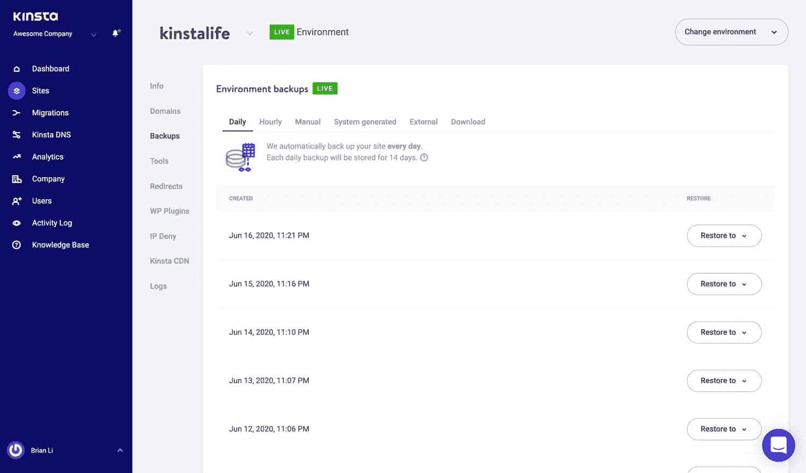
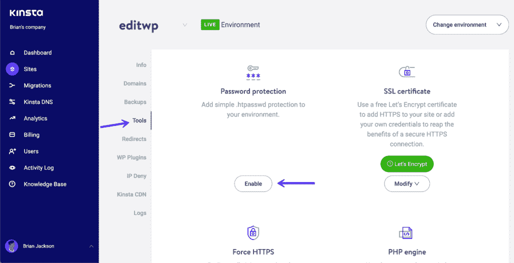
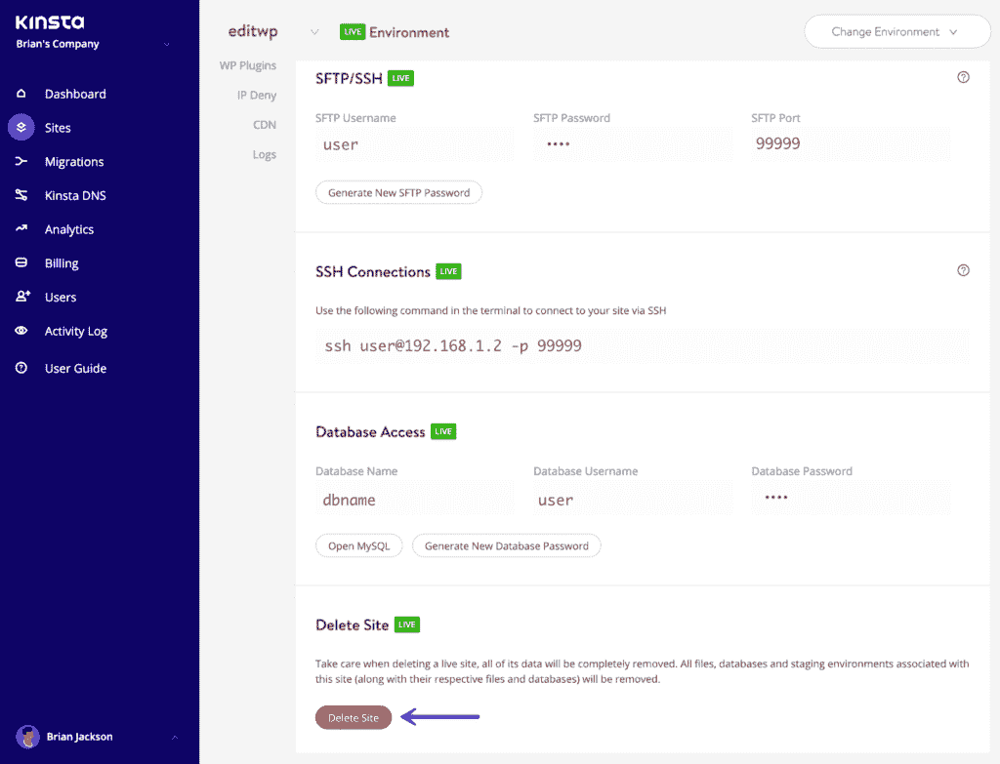
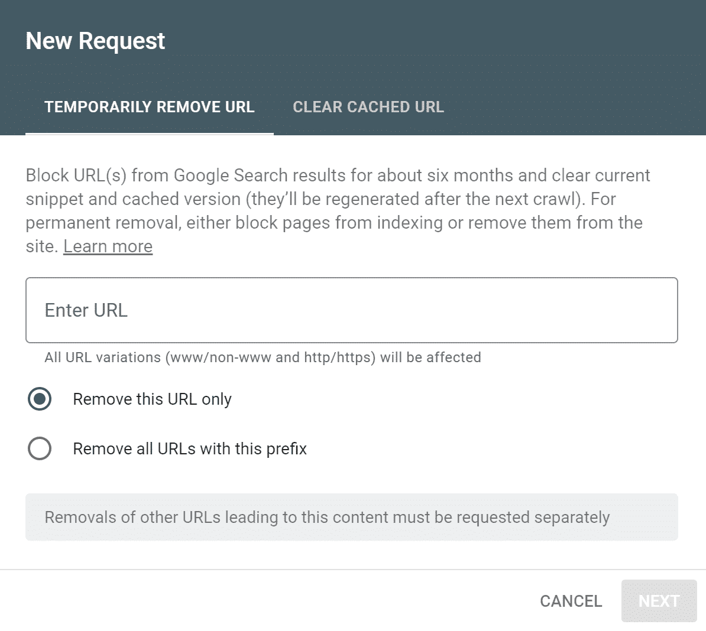
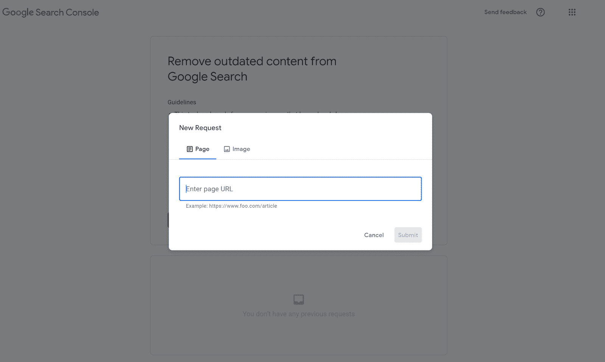
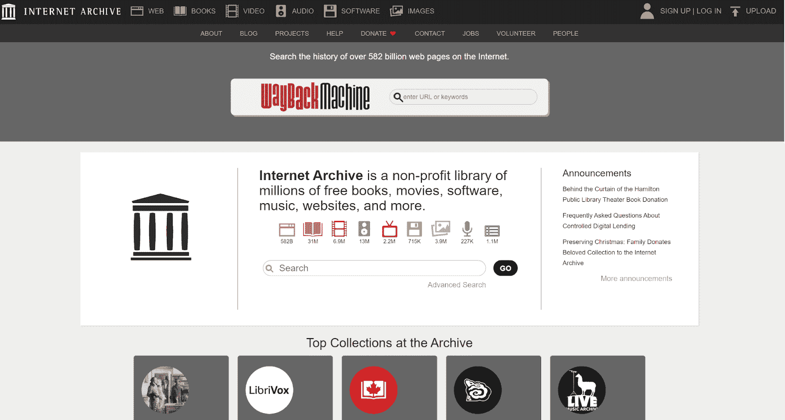
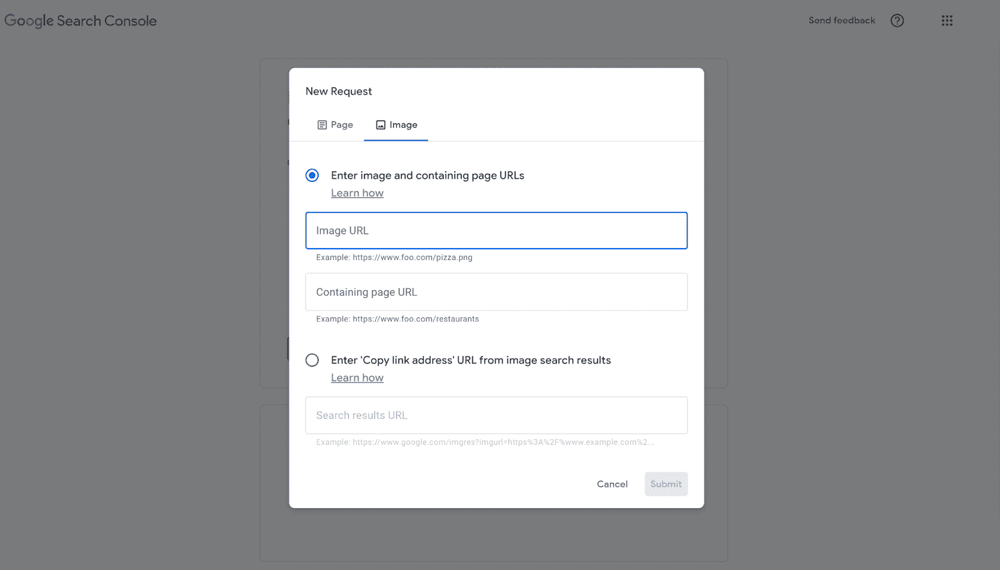

# 如何从谷歌上删除网站

> 原文：<https://kinsta.com/blog/how-to-remove-a-website-from-google/>

你听说过“互联网是永恒的”这句话吗？

虽然这是一个很好的经验法则，但绝不是法律。

人们需要从互联网上删除他们拥有的网站有很多原因。

也许你的网站包含过时的信息，误导搜索你的企业的人。或者你已经转到了一个新的网站，而你的旧网站仍然显示在搜索结果中。

不管是什么情况，我们都能帮忙。

这篇文章将向你展示如何通过简单、轻松的步骤从谷歌上移除一个网站。

让我们开始吧！

T3】

## 谷歌和你的网站

在我们讲述如何从谷歌移除一个网站之前，你需要了解一点谷歌搜索引擎的内部工作原理。

> Kinsta 把我宠坏了，所以我现在要求每个供应商都提供这样的服务。我们还试图通过我们的 SaaS 工具支持达到这一水平。
> 
> <footer class="wp-block-kinsta-client-quote__footer">
> 
> 
> 
> <cite class="wp-block-kinsta-client-quote__cite">Suganthan Mohanadasan from @Suganthanmn</cite></footer>

[View plans](https://kinsta.com/plans/)

在搜索引擎出现之前，互联网本质上是一系列数字档案。虽然互联网今天仍然像一个档案馆，但我们现在使用搜索引擎来获取信息。

每当你搜索某样东西时，谷歌的搜索引擎会通过三个简单的步骤来处理你的请求。

1.  首先，它使用谷歌爬虫搜索以你的搜索主题为中心的网页和网站。然后，谷歌将这些网页和网站列入候选名单。
2.  接下来，谷歌搜索其候选名单，分析每个列表的内容。在这个阶段，谷歌会查看视频文件、图像、文本内容以及任何它可以分析的东西。
3.  最后，谷歌将它所分析的网页和网站从最相关到最不相关进行排序。然后，它的搜索引擎会根据你的位置、以前的浏览行为、语言和设备(它不会希望向移动用户显示一个不兼容移动设备的网站)来确定哪些结果最适合你。然后谷歌向你展示结果。

每次你进行谷歌搜索，谷歌都会在几秒钟内对数百万个网站进行排序。搜索引擎索引和缓存使这种快速转变成为可能。

接下来我们来讨论这些。

[你知道他们说...互联网是永恒的...算是吧😉了解如何快速轻松地从谷歌上删除网站⬇️ 点击发推](https://twitter.com/intent/tweet?url=https%3A%2F%2Fkinsta.com%2Fblog%2Fhow-to-remove-a-website-from-google%2F&via=kinsta&text=You+know+that+they+say...+%27The+internet+is+forever...+kind+of%27+%F0%9F%98%89+Learn+how+to+remove+a+website+from+Google+quickly+and+easily+%E2%AC%87%EF%B8%8F&hashtags=WebTips%2CGoogle)

### 什么是搜索引擎索引和缓存？

索引是谷歌用来对互联网上的信息进行排序的过程，以快速对搜索做出响应。当[谷歌索引信息](https://kinsta.com/blog/discourage-search-engines-from-indexing-this-site/)时，它以倒排索引(也称为“反向索引”)对网站进行排序。倒排索引是一个包含网站关键元素信息的数据库。

倒排索引使用“标记化”这是用几个关键词概括内容的过程。例如，销售黑色打底裤的网站会用关键词来标记，如“打底裤”、“黑色打底裤”和“女式打底裤”

[搜索引擎缓存](https://kinsta.com/blog/google-cache/)是一个独立的过程。缓存是一个页面的快照，Google 用它来理解其内容。你可以在下面看到一个缓存网站的例子。

如果谷歌已经缓存了你的网站，删除它几乎没有任何意义。

谷歌定期获取网站缓存，这意味着一些网站缓存是最新的，而另一些不是。当然，如果谷歌已经缓存了你的网站，删除它并不足以移除它。

Google 使用搜索引擎索引和缓存来减少返回准确搜索结果所需的工作。本质上，索引和缓存允许谷歌理解一个网站，而不用彻底分析它。

### 当你从谷歌上移除一个结果时，它会在全球范围内被移除吗？

当你从谷歌搜索引擎中删除一个结果时，你只是从谷歌中删除了它。不幸的是，这意味着结果可能仍然会出现在其他搜索引擎上，如 Bing 和 Yahoo。

或者，谷歌可能会重新索引搜索结果或保留网页的缓存。谷歌的搜索引擎不断对网站进行重新索引，以向用户返回最准确的信息。如果您删除了一个搜索结果，但没有删除网页、图像和 [URL](https://kinsta.com/knowledgebase/what-is-a-url/) ，谷歌可能会重新索引该内容并再次将其列出。

如果您想要从互联网上完全移除网站，您需要删除它的所有痕迹，包括网站的内容、图像、URL 和搜索结果。我们将在后面详细介绍这个过程。

但首先，让我们看看“为什么”

## 从谷歌移除网站的原因

一个人想要删除一个网站的原因有很多。在本节中，我们概述了六个最常见的删除原因，以及针对每个原因的建议操作过程。

### 原因 1:网站上的信息过时或错误

如果[谷歌显示不正确的信息](https://kinsta.com/blog/deceptive-site-ahead/)，会误导你的受众，混淆视听。有三种方法可以修复信息不正确的谷歌列表:

1.  更正信息
2.  删除网站
3.  从搜索结果中删除该网站。

### 原因 2:您要删除的网站或网页是重复的

有时，谷歌会为同一网页显示多个搜索引擎结果。这个问题通常发生在[在线商店列表](https://kinsta.com/blog/wordpress-directory-plugins/)中，其中网站包含具有不同产品的相似外观的网页(即，红色、绿色、蓝色和黑色紧身裤的不同页面)。在这种情况下，您可能需要从搜索结果中删除重复的列表。

### 原因 3:网站或网页包含泄露的信息

偶尔，企业会在本应保密的网站或网页上推送“发布”(比如新产品页面)。要解决此问题，您需要取消发布您的网站，并将其从搜索结果中删除。

### 原因 4:谷歌已经缓存了网站

谷歌不断重新索引网站，以提供更新和准确的搜索结果。然而，如果你删除或更改了你的网站，谷歌可能会使用过时的缓存。在这种情况下，你会想从搜索结果中删除该网站，并请求谷歌[重新索引你的网站](https://developers.google.com/search/docs/advanced/crawling/ask-google-to-recrawl)。
T3】

### 原因五:网页上的信息是隐私的

有时，私人信息会因事故、错误或信息泄露而公开。如果这已经发生在你身上，我们建议根除该网站。如果你不控制网站，并且它包含个人信息或诽谤内容，你可以[要求谷歌删除它](https://support.google.com/websearch/troubleshooter/3111061#ts=2889054)。您也可以直接联系网站所有者。

### 原因 6:第三方入侵了你的网站

如果有人入侵了你的网站，那么任何访问你网站的人都可能面临网络安全风险。为了保护你的观众免受[恶意软件](https://kinsta.com/blog/types-of-malware/)的攻击，你需要删除该网站或将其从搜索结果中移除。

考虑到这些原因，以下两个部分将介绍从 Google 中删除网站和从 Google 的搜索结果中删除网站。

## 如何从谷歌上删除网站

从谷歌上移除一个网站是一个多步骤的过程，但并不困难。如果你想从谷歌上完全删除一个网站，你只需要遵循以下步骤。

### 第一步:备份你的网站

在开始网站删除过程之前，不要忘记备份您的网站。一旦你从谷歌上删除了你的网站，你就不会轻易恢复它。这意味着您将丢失图像、视频和文本内容。

如果你有机会想要回这些东西，我们建议备份你的网站。如果您使用 Kinsta，您可以通过以下步骤来备份您的网站:

1.  转到“ [MyKinsta](https://my.kinsta.com/login) ”并点击“备份”
2.  转到“下载”选项卡。
3.  点按“立即创建备份”Kinsta 将通过电子邮件向您发送您网站的备份作为存档文件(。zip)。
4.  打开 Kinsta 发来的邮件，点击“立即下载备份”
5.  将备份保存到您的计算机。

用 MyKinsta 备份你的网站。

如果您使用另一台主机，您需要按照他们的说明备份您的网站。或者，可以使用[第三方网站备份软件](https://kinsta.com/blog/wordpress-backup-plugins/)。

### 第二步:重命名和密码保护你的网站

一旦你下载了你的网站的备份，你会想让人们很难找到它。在这个过程的后面，我们将指导您从 Google 的搜索结果中删除您的网站。但首先，我们需要在此期间阻止谷歌用户访问你的网站。

有两种方法来限制访问您的网站:重命名和密码保护。

首先，你需要[重命名你的网站](https://kinsta.com/knowledgebase/rename-site/)。如果使用 Kinsta，这个过程很简单。你需要做的就是:

1.  转到“MyKinsta”并点击“站点”
2.  找到您想要重命名的网站，然后点按“基本详细信息”
3.  选择“重命名网站”,并在弹出窗口小部件中为您的网站取一个新名称。
4.  单击“重命名网站”保存您的新名称。

你可以在下图中看到这个过程。

在 MyKinsta 仪表盘中重命名您的网站。

接下来，你需要用密码保护你的网站。要使用 HTTP 认证在 Kinsta 中为您的网站添加[密码，请按照以下步骤操作:](https://kinsta.com/blog/password-protect-wordpress-site/)

1.  转到“MyKinsta”并点击“站点”
2.  从屏幕左侧的菜单中选择“工具”。
3.  寻找“密码保护”并点击“启用”
4.  选择用户名和密码。

你可以在下图中看到 Kinsta 的密码保护屏幕。

MyKinsta 中的密码保护。

如果你使用另一个主机提供商，你需要参考他们的指导来重命名和密码保护你的网站(尽管这些过程通常非常相似)。

### 第三步:通过你的主机删除你的网站

在下一步中，您需要通过主机删除您的网站。我们在本节中编写了删除您在金斯塔、WordPress.com 和谷歌网站上的网站的说明。如果您使用其他提供商，您需要直接参考他们的说明。

## 注册订阅时事通讯

### 想知道我们是怎么让流量增长超过 1000%的吗？

加入 20，000 多名获得我们每周时事通讯和内部消息的人的行列吧！

[Subscribe Now](#newsletter)

#### 基普斯塔

如果你通过 Kinsta 托管你的网站，删除它是一个简单的过程。你所需要做的就是[遵循这些步骤](https://kinsta.com/knowledgebase/delete-a-wordpress-site/):

1.  转到“MyKinsta”并点击“站点”
2.  滚动到您想要删除的网站，然后点按“删除网站”
3.  然后，Kinsta 会要求您确认是否要用弹出窗口删除您的网站。在弹出窗口中，勾选“editwp 的文件和数据库将被删除”和“editwp 的暂存环境中的文件和数据库也将被删除”复选框
4.  按照以下格式输入您网站的名称、破折号和单词“live”:“Sitename-live”
5.  点击“删除网站”

点击一个按钮，删除 MyKinsta 中的一个站点。

#### WordPress

如果你使用[WordPress.com 或者 WordPress.org](https://kinsta.com/blog/wordpress-com-vs-wordpress-org/)，你也可以直接通过 WordPress 的设置删除你的网站。

方法如下:

1.  登录 WordPress。
2.  点击“管理”，然后点击“设置”
3.  滚动到页面底部，点击“永久删除您的网站”
4.  在这个阶段，WordPress 会给你一个将你的网站内容导出为. zip 文件的选项。如果你想恢复你的网站，你可以简单地重新上传这个文件。
5.  点击“删除网站”,并在文本框中输入您的网址进行确认。
6.  再次点击“删除此站点”进行确认。

如果你使用 WordPress.com，你也可以直接删除你的账户。删除您的帐户将会删除与其关联的所有网站。要删除您的帐户，请按照下列步骤操作:

1.  登录 WordPress。
2.  前往“帐户设置”
3.  点按“永久关闭您的帐户”
4.  查看内容并点击“关闭账户”

#### 谷歌网站

如果你通过谷歌网站管理你的网站，你也可以在那里删除你的网站。谷歌网站用户目前要么使用新的谷歌网站，要么使用经典的谷歌网站。每个步骤略有不同。

##### 删除新的谷歌网站

1.  前往[新的谷歌网站](https://sites.google.com/new)。
2.  选择您想要删除的网站，然后点按“更多”
3.  点按废纸篓图标或“移除”
4.  清空您的 Google Drive 垃圾桶，永久删除您的网站数据。

##### 删除一个经典的谷歌网站

1.  前往经典谷歌网站。
2.  单击设置图标。
3.  选择“管理站点”
4.  单击“常规”和“删除此网站”
5.  点击“删除”进行确认

一旦你通过你的网站主机删除了你的网站，你需要把它从谷歌上移除。尽管谷歌的搜索引擎会不断更新列表以删除旧内容，但你的网站可能会在你删除后出现在谷歌的搜索结果中。

在接下来的几个步骤中，我们将向您展示如何从搜索结果中删除您的网站。

### 步骤 4:提交 URL 删除请求

谷歌允许网站所有者通过 URL 删除请求从谷歌搜索引擎中删除 URL。在谷歌更新其列表时，这一过程将暂时从搜索结果中删除旧内容。如果你的网址被删除，它将在大约六个月内[不会出现在搜索结果中。在您的内容重新列出后，您可以随时提交另一个删除请求。](https://support.google.com/webmasters/answer/9689846?hl=en)

要提交 URL 删除请求，您需要登录谷歌搜索控制台。然后，您需要点击“移除”并选择“新请求”这将打开这个屏幕。

需要为你的 WordPress 站点提供超快的、可靠的、完全安全的托管服务吗？Kinsta 提供所有这些以及 WordPress 专家提供的 24/7 世界级支持。[查看我们的计划](https://kinsta.com/plans/?in-article-cta)

谷歌中的一个删除网址请求。

接下来，您需要在文本栏中键入您的 URL。选择“仅移除此 URL”或“移除带有此前缀的所有 URL”如果您选择“移除带有此前缀的所有 URL”，您可以阻止带有相同前缀的索引页面，如“kinsta.com/resources”

选择选项后，点击“下一步”，然后点击“提交请求”

谷歌将审查你的网址删除请求，并提醒你的结果。值得注意的是，如果谷歌成功地从搜索结果中删除了你的 URL，它不会将该 URL 标记为垃圾邮件或[将其放入黑名单](https://kinsta.com/blog/url-blocklist/)。你的[网站的 SEO](https://kinsta.com/blog/google-search-console/) 也不会受到影响。

### 第五步:向谷歌提交内容删除请求

随着时间的推移，谷歌的搜索引擎会识别出已被删除的网站或网页，并将其从搜索结果中删除。然而，这个过程可能需要几个月的时间，因为互联网上有超过 18 亿个网站。

要快速从搜索结果中删除您的网站或网页，您可以向 Google 提交内容删除请求。

内容删除请求仅适用于以下情况:

*   你是网站所有者。
*   您已经删除或更改了该网站。

提交内容删除请求非常简单。首先，你需要打开谷歌搜索控制台的[过期内容删除工具页面](https://search.google.com/search-console/remove-outdated-content)，用你的谷歌账户登录。然后，您需要单击“新请求”选项。此选项将显示下面的小部件。

删除谷歌搜索控制台中过时的内容。

选择“页面”选项并输入您的网页或网站 URL。点击“提交”然后，谷歌将搜索该网页，并确认你已经删除了它。

谷歌在处理所有过时的内容删除请求之前，会对它们进行分类。他们可能会在几天内处理您的请求，但您可以随时在谷歌搜索控制台中查看您的请求状态。如果您改变主意，也可以取消您的删除请求。

### 第六步。从 Wayback 机器上删除内容

时光倒流机。

一旦你从互联网和谷歌搜索结果中删除了你的内容，你网站的大部分痕迹都消失了。然而，如果你的网站收到了大量的流量，访问者可能会在 Wayback 机器中记录下来。

Wayback Machine 是一个非营利性的互联网档案馆，拥有超过 3 . 5 亿个网页。如果有人在 Wayback 机器中列出了你的网站，谷歌可能会意外地缓存并重新索引它，将它带回到搜索结果中。

您可以通过访问“archive.org/web/”并键入您的 URL 来检查您的网站是否记录在 Wayback 机器中。这将显示您网站的所有列表。

如果您无法在 Wayback 机器中找到您的网站，您可以跳到下一部分。否则，您需要通过“[【电子邮件保护】](/cdn-cgi/l/email-protection)”联系 Wayback Machine 团队，请求他们删除您的 URL。请注意，您必须在电子邮件中包含您的 URL，才能处理您的请求。

### 第七步:确认你的网站被删除

从 Google 中删除您的网站可能需要几天时间。这是因为谷歌必须处理你的网址和内容删除请求，这不是一个即时的过程。

完成前面的步骤后，您需要通过检查以下内容来再次确认您的网站已经消失:

*   您的网址没有出现在搜索结果中
*   你的网站主持人删除了你的网站
*   Google 已将您的内容删除请求标记为“已批准”
*   你已经删除了所有指向你网站的社交媒体链接
*   您已经删除了您的 [Google 我的商业档案](https://kinsta.com/blog/what-is-google-my-business/)(如果您有)

## 如何从谷歌搜索中删除一个网站？

虽然许多人只是想从互联网上删除他们的网站，但这并不是所有人的解决方案。如果你想让你的网页或网站保持在线，但又不想让它出现在搜索结果中，这一部分就是为你准备的。

你可以通过两个简单的步骤从谷歌搜索引擎中删除你的内容。

### 第一步:从谷歌上删除网址

首先，你需要向谷歌提出删除网址的请求。要提交 URL 删除请求，只需:

1.  登录谷歌搜索控制台。
2.  点击“移除”
3.  点击“新请求”
4.  输入您的网址，然后点击“下一步”
5.  点击“提交”

或者，您可以将您的 URL 重定向到另一个(活动的)网页。如果你的网址获得了很好的搜索引擎流量，但是你已经将内容转移到了另一个页面，那么重定向你的网址是一个很好的折中方案。

### 第二步:阻止谷歌重新索引内容

最后，你需要采取措施，防止谷歌重新索引你的网址。为此，你只需在你的网页或网站上添加一个`noindex`标签。标签是一个元标签，放在你网站的 HTML 代码中。当谷歌爬虫发现一个带有`noindex`元标签的网站时，谷歌会将你的页面从搜索结果中删除。

要将`noindex` meta 标签添加到您的 URL，您需要:

1.  访问您的 URL 的源代码。
2.  找到部分。
3.  将此元标记添加到部分:“”。
4.  保存您的代码。

一旦你添加了`noindex`标签，谷歌将停止重新索引你的网站。

## 你能从谷歌搜索结果中删除图片吗？

自然，网页和网站不是你可以从谷歌上删除的唯一东西。谷歌还应图片所有者的要求，从谷歌图片搜索中删除过时的图片。

在[谷歌搜索控制台](https://kinsta.com/blog/google-search-console/)中，提交一份过期图片移除请求相当容易。要提交请求，请转到[过期内容删除工具](https://search.google.com/search-console/remove-outdated-content)并点击“新请求”这将弹出“页面”选项，因此您需要选择“图像”选项。然后，将过期图像的 URL 粘贴到文本框中，并单击“提交”

你可以使用谷歌从搜索请求中删除一张图片。

谷歌将处理你的请求，并提醒你结果。如果您的请求成功，Google 将从 Google Images 中删除该图片。请注意，此工具仅适用于已删除的图像，不适用于“实时”图像。

[想搞垮一个老网站？✅:这篇文章涵盖了你💪](https://twitter.com/intent/tweet?url=https%3A%2F%2Fkinsta.com%2Fblog%2Fhow-to-remove-a-website-from-google%2F&via=kinsta&text=Want+to+take+down+an+old+website%3F+%E2%9C%85+This+post+has+you+covered+%F0%9F%92%AA&hashtags=WebTips%2CGoogle)

## 摘要

虽然互联网似乎是一个永久的地方，但这并不总是正确的。如果你需要删除内容，这是可能的。从谷歌上移除一个网站是可能的，只要你遵循上面的步骤。

但是，您应该记住，如果没有备份，就无法恢复已删除的网站。

在删除网站之前，请务必备份网站内容，并考虑从搜索结果中删除网址是否能解决问题。

* * *

让你所有的[应用程序](https://kinsta.com/application-hosting/)、[数据库](https://kinsta.com/database-hosting/)和 [WordPress 网站](https://kinsta.com/wordpress-hosting/)在线并在一个屋檐下。我们功能丰富的高性能云平台包括:

*   在 MyKinsta 仪表盘中轻松设置和管理
*   24/7 专家支持
*   最好的谷歌云平台硬件和网络，由 Kubernetes 提供最大的可扩展性
*   面向速度和安全性的企业级 Cloudflare 集成
*   全球受众覆盖全球多达 35 个数据中心和 275 多个 pop

在第一个月使用托管的[应用程序或托管](https://kinsta.com/application-hosting/)的[数据库，您可以享受 20 美元的优惠，亲自测试一下。探索我们的](https://kinsta.com/database-hosting/)[计划](https://kinsta.com/plans/)或[与销售人员交谈](https://kinsta.com/contact-us/)以找到最适合您的方式。