# 如何快速高效地在 Mac 上截图

> 原文：<https://kinsta.com/blog/how-to-screenshot-on-mac/>

苹果呼应了“有一个应用程序”的口号，但你也会发现 macOS 内置了大量的原生功能。毕竟，苹果的生态系统以一切“正常运转”而闻名。这就不奇怪了，你不用太担心如何在你的 Mac 上截屏。

Mac 的截图功能还没有明显的更新，主要是因为苹果第一次就做对了。总的来说，无论任务是什么，在 Mac 上截取屏幕截图并在本地编辑都是轻而易举的事情。

在本文中，您将学习如何在 Mac 上截屏。然后，我们将探索许多可以补充原生 macOS 截屏功能的解决方案。您还将学习如何定制屏幕截图工具。

我们开始吧！

### 查看[视频版本](https://www.youtube.com/watch?v=LK7tcWg-cCk)


## 在你的 Mac 上截屏的多种用途

回到功能可用之前，[智能手机仍处于婴儿期](https://kinsta.com/blog/google-mobile-first-index/)，拍摄截图的唯一方法是使用胶片相机的专用镜头扩展。截屏的功能从 60 年代就有了。


随着互联网及其[持续增长](https://www.internetworldstats.com/emarketing.htm)的出现，分享截图大幅增加。以下是它们的一些用法:

*   我们可以用它们来[显示错误信息](https://kinsta.com/blog/wordpress-errors/)。例如，您可以与技术支持人员分享它们，他们会试图重现错误。
*   它们对于[内容营销](https://kinsta.com/learn/content-marketing/)非常重要，尤其是对于教程和“如何做”的帖子。
*   在某些情况下，它们可以用作可见证据或用于存档目的。
*   根据具体情况，创建截图也可能涉及社交游戏。例如，[任天堂 Switch](https://www.pocket-lint.com/games/news/nintendo/155132-how-to-take-screenshots-on-nintendo-switch-and-record-video) 有一个内置在控制台中的屏幕捕捉功能， [Steam 游戏平台](https://screenshot.help/steam)有专门为桌面用户提供的屏幕截图功能。

不管你想在你的 Mac 上抓图的原因是什么，你都需要一个高效无缝的方法来完成它。稍后，我们将向您展示一些选项。不过，首先让我们讨论一下截图时的一些限制。

[需要记录您产品的特性&功能？✅确保你知道如何最大限度地利用你的截图录音👨‍💻 点击推文](https://twitter.com/intent/tweet?url=https%3A%2F%2Fkinsta.com%2Fblog%2Fhow-to-screenshot-on-mac%2F&via=kinsta&text=Need+to+document+your+products%27+features+%26amp%3B+functionality%3F+%E2%9C%85+Make+sure+you+know+how+to+get+the+most+out+of+your+screenshots+%26amp%3B+recordings+%F0%9F%91%A8%E2%80%8D%F0%9F%92%BB&hashtags=MacTips%2CiOS)


### 在 Mac 上拍摄屏幕截图的限制

虽然截图的功能相对简单，但 macOS(以及它所承载的应用程序)随着时间的推移变得更加智能，面临着数字内容的共享和分发所带来的无数问题。换句话说，因为我们可以在电脑上观看电影和其他媒体，所以操作系统不能对侵犯版权负责。

因此，当你对某个应用程序(如苹果电视[苹果电视](https://www.apple.com/tv/)或 [DVD 播放器](https://support.apple.com/en-gb/guide/dvd-player/welcome/mac))进行截图时，操作系统会模糊遮光罩下的相关窗口:

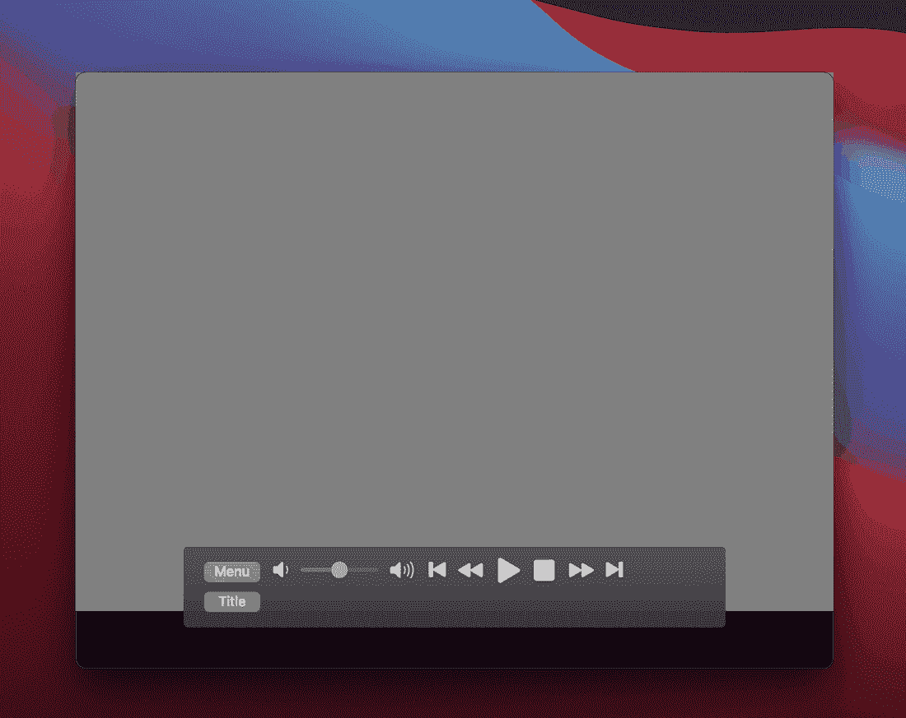

macOS’ Screenshot app will “blank out” windows that could infringe on copyright if you captured them.


虽然可能有在 macOS 上捕获受版权保护的视频和其他媒体的(非法)变通办法，但他们显然不会关注本文。然而，对于大多数其他屏幕捕获任务，有几个可用的恒星工具。

## 4 款在 Mac 上截图的顶级应用

正如我们提到的，市场上有很多应用程序可以在你的 Mac 上截图。然而，在这里我们要突出四个。我们认为这些提供了完整的功能，尽管股票 macOS 截图应用程序是一个很好的工具。我们先来看看那个。

### 1.截图. app

我们当然要先说内置的 MAC OS[screen down . app](https://support.apple.com/en-us/HT201361)再说其他工具。虽然你可能认为它已经存在很久了，但它只是从 Mojave (10.14)开始成为 macOS 的一部分。

在此之前，你会使用[抓取截图](https://appletoolbox.com/how-to-use-mac-os-x-grab-utility-to-take-screenshots/)，直到它与 10.13 日落。事实上，新应用的功能与旧的重叠，大多数用户不会注意到这种差异。它本质上是一个名称的改变，为日常桌面使用做了一些有机的增强。

如果你在大多数情况下使用[键盘快捷键](https://support.apple.com/en-us/HT201361)，你甚至不会知道你正在使用一个应用程序。这是一种无缝的方法，你可以把它作为原生苹果软件的标准。甚至打开 screen down . app 本身(稍后会有更多介绍)也是轻而易举的事情。


The Screenshot.app dedicated display.


如果你*不使用快捷方式打开应用程序，你也会发现屏幕录制功能。这提升了该应用的价值，并且——连同 iMovie 等其他捆绑应用[——它为你迈出进入](https://www.apple.com/imovie/)[解说视频](https://kinsta.com/blog/saas-marketing/)的第一步奠定了坚实的基础。对于希望记录其产品特性和功能的企业来说，这几乎是完美的。*

在日常生活中，大多数 Mac 用户都会使用原生应用程序截图。考虑到这一点，最好讨论一下为什么你想要一个*来替代*的截图。

前几句我们说 Screenshot.app 只有“*接近*完美。”首先，没有录音，你会发现很少有选择来处理你拍摄的照片。正如您将看到的，与其他工具相比，屏幕捕获技术和注释功能之间存在脱节。

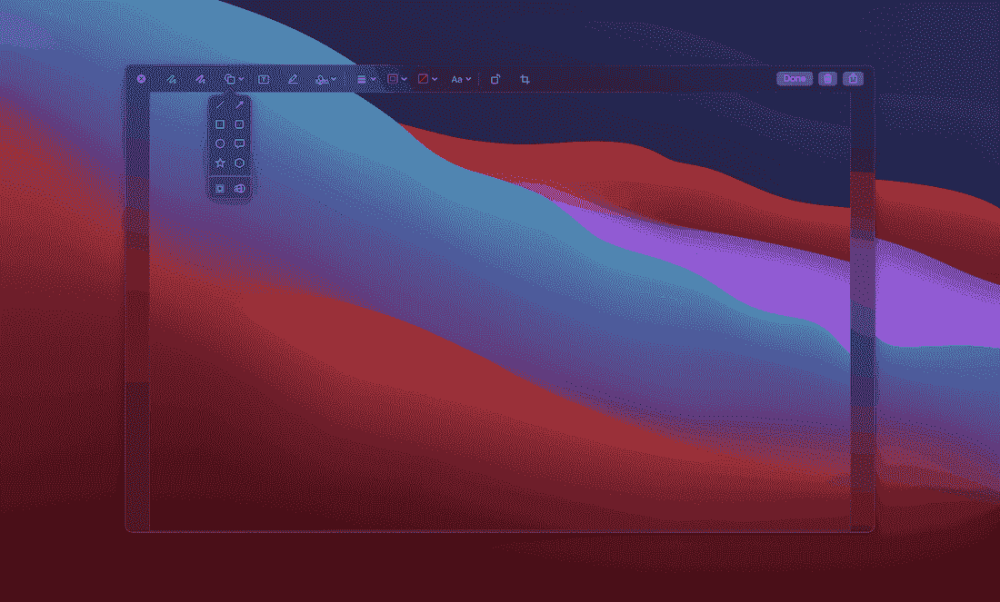

The Markup tools on macOS.


当然，苹果希望你使用[预览和标记](https://support.apple.com/en-gb/guide/preview/welcome/mac)来注释截图。尽管你会在那里找到一套可靠的工具，但是它缺少一些受欢迎的特性，比如混淆。对于更高级的标记和注释工具，您必须去别处看看。
T3】

### 2.斯基奇

说到这里，我们要对 Skitch 做一个有根据的猜测[。为与 Evernote](https://evernote.com/products/skitch) 一起使用的[设计的应用程序已经成为许多 Mac 用户的首选截图解决方案。然而，我们敢打赌，您只是将 Skitch 用于注释，而不是屏幕截图。](https://evernote.com/)


The Skitch app.


这并不是因为捕获功能很糟糕。它使用起来既可靠又简单，如果可以的话，我们会把它作为默认的捕获工具。然而，它并没有提供比原生 Screenshot.app 更多的东西。这是可以理解的，因为 Skitch 主要是为了将屏幕截图放入 Evernote。

对于 Skitch，让我们印象深刻的是注释工具，它们与 macOS 原生工具结合使用效果很好。不过，在你过于兴奋之前，要知道所提供的工具还没有达到图形设计工具的深度。也就是说，你将基本面作为一揽子计划的一部分，它们运转良好。有文本框、形状、钢笔工具、裁剪工具和模糊处理。

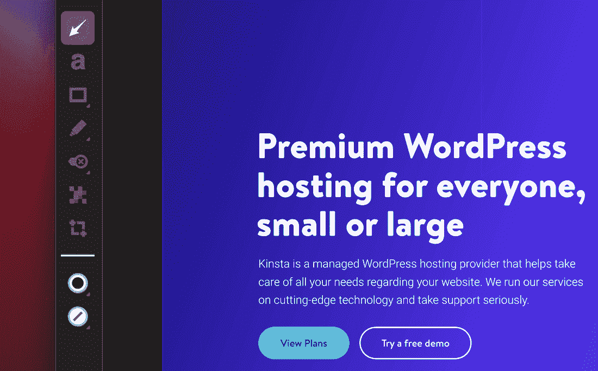

The Skitch toolbar.


我们会说，模糊选项本身就值得安装 Skitch。有时创建与原始图像完美契合的整洁的盒子是很棘手的，但是像素化的效果是令人愉快的，而且不会让人觉得突兀。

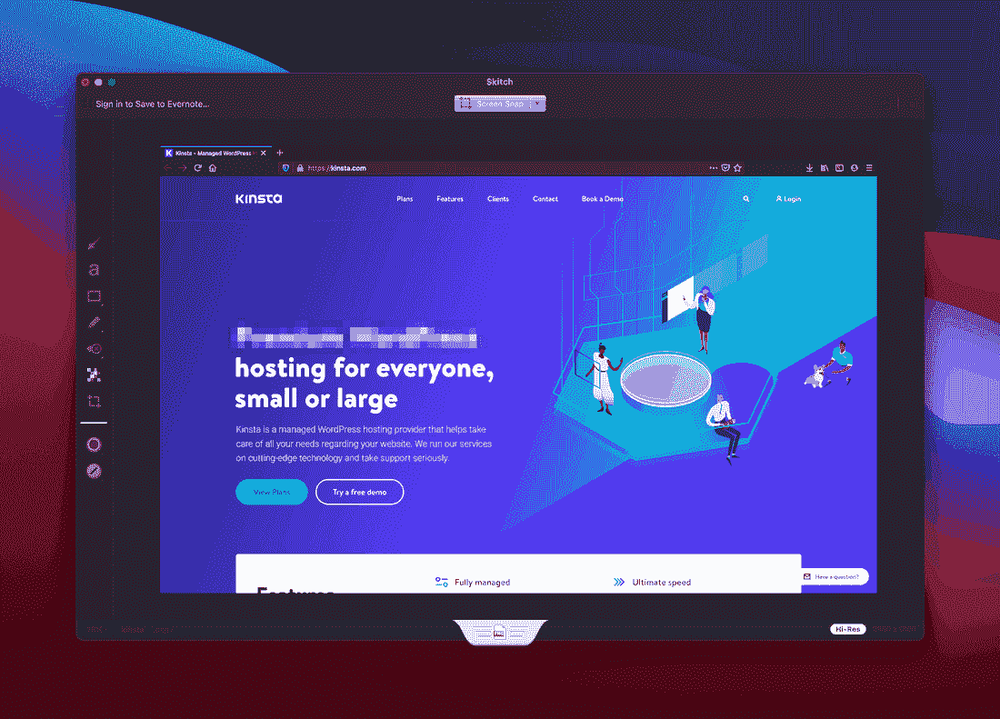

The Skitch obfuscation tool.


因此，注释功能将是你在 Mac 上使用 Skitch 的主要原因。也就是说，Evernote 的重度用户也会发现 Skitch 的价值。对于简单的截图任务，这是一个坚固的解决方案。


### 3\. Snagit

Snagit 是一款高级屏幕捕捉工具，拥有许多可与顶级图形设计工具相媲美的特性和功能。这是一个跨平台的软件，可以处理图像和视频，并输出几种不同的格式。此外，您可以从图像创建视频，或使用网络摄像头录制，以制作功能齐全的 explainer 内容。

Snagit 将融入技术作家或文档撰写者的工作流程中。我们喜欢这些工具的多功能性，以及你如何编辑你制作的截图。例如，您可以使用**抓取文本**工具从您的屏幕截图中提取一份副本，并在其他地方使用:

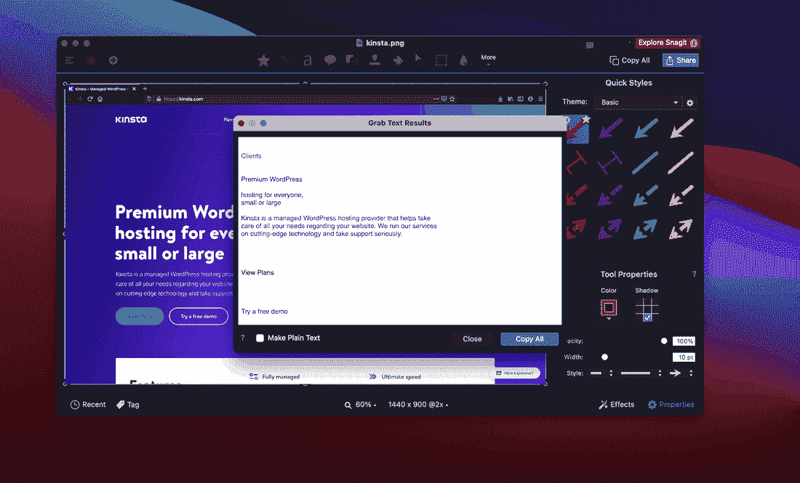

Snagit’s Grab Tool.


由于 Snagit 的识别技术，您还可以替换屏幕截图中的文本:


Snagit offers some powerful functionality for replacing text in your screenshots.


Snagit 工具箱中还有很多功能可以让您操作屏幕截图，比如能够在截图上标注分步工作流，并使用元素在图像中移动它们。

在我们看来，Snagit 是一个高级用户的工具。鉴于[的价格](https://www.techsmith.com/snagit-pricing.html)大约是 60 美元的一次性费用，这很便宜，而且对于特定的写作项目几乎是必不可少的。

### 4.干净镜头 X

CleanShot X 是一个在 Mac 上捕捉屏幕的超级工具，它附带了许多有用的功能。

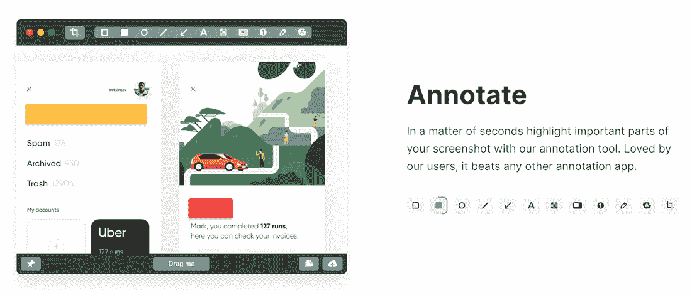

The CleanShot X homepage.


它的开发者称它是原生 Screenshot.app 的替代品，原因显而易见。它具有全屏抓取的能力(也可以部分抓取)。它还可以让你捕捉特定的窗口，无论有没有背景。

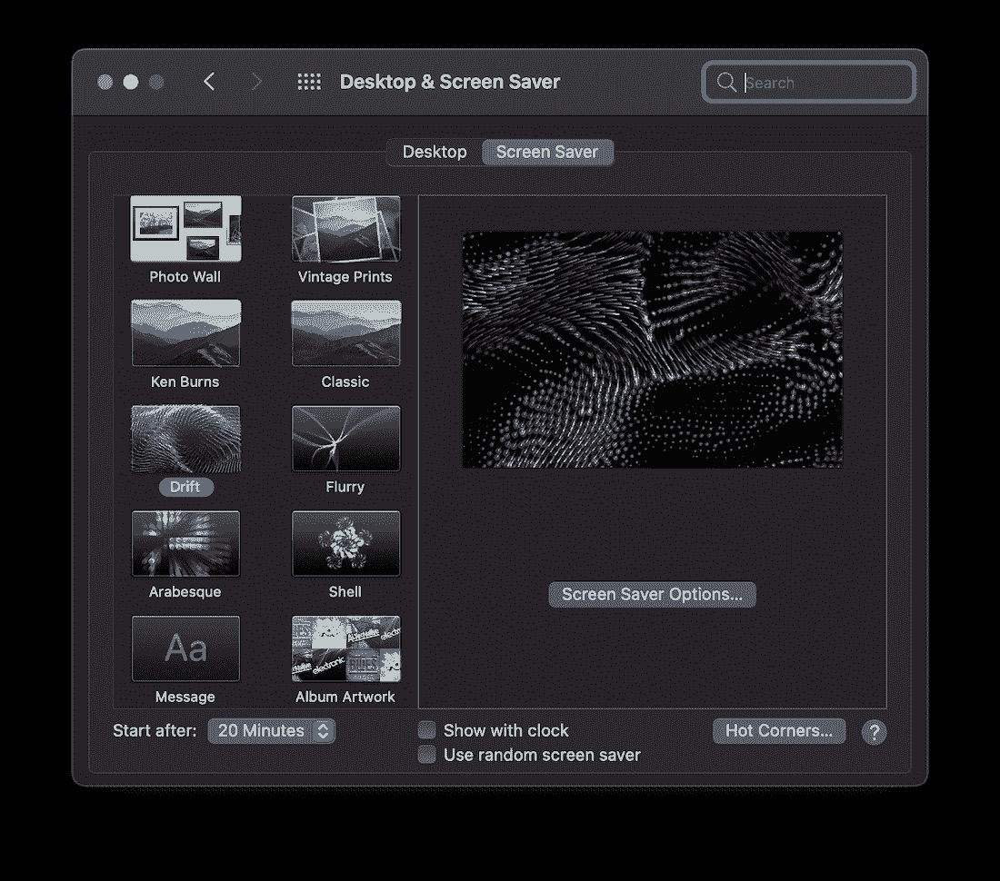

CleanShot X lets you capture the background (or not) when grabbing a single window.


它已经比苹果的原生工具好了，但它走得更远。您还可以执行滚动抓取，这意味着即使在冗长的网站上也可以抓取整个页面:

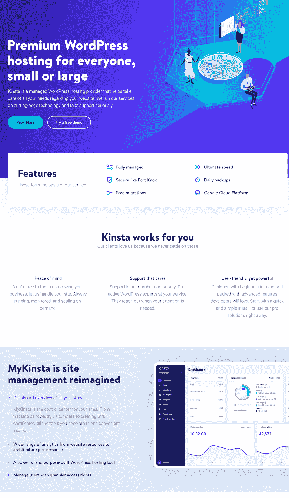

CleanShot X’s “Scrolling Capture” feature.


CleanShot X 有一个我们特别喜欢的方面——这是它的名字中的一个方面:你可以隐藏桌面上的任何“混乱”,因此捕捉到的图像看起来干净整洁。通过点击一个按钮，CleanShot X 可以为您暂时隐藏这些:

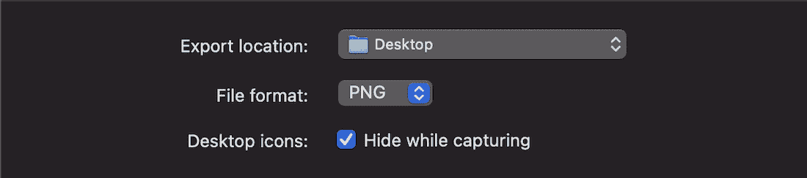

CleanShot X lets you hide desktop icons before capturing the screen.


作为一个替代工具，CleanShot X 击中了目标——尤其是对博客作者而言。例如，您可以锁定屏幕截图，使其始终可见。当您创建教程或博客文章来演示步骤时，这很有帮助。

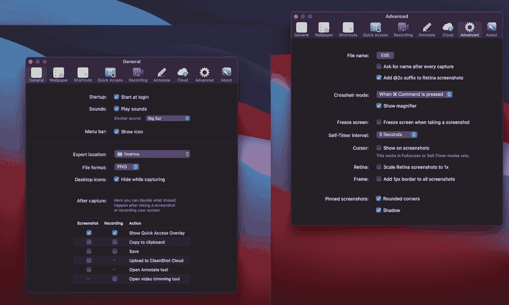

CleanShot X lets you “pin” screenshots so you can reference them while working in other windows.


您还可以配置应用程序的综合首选项，为特定的使用案例定制您的屏幕截图。例如，你可以为不同的项目设置自定义壁纸，并与博客的品牌相匹配。此外，对于一些使用较小图像尺寸的博客，你可以将视网膜图像缩小到标准分辨率。

一个单人“座位”29 美元，两个 49 美元，如果你是一个博客写手或网络作家，没有理由跳过 ClearShot X。这是一个原生的 macOS 应用程序，可以完全取代苹果的解决方案，我们甚至没有提到该工具的注释或基于云的功能。

## 如何在你的 Mac 上截图(4 种方法)

现在我们看了一些在 Mac 上截图的前置解决方案。下面我们来分解一下如何截屏。

在接下来的几节中，我们将提供四种不同的方法来捕捉屏幕，并且我们会注意到一些应用程序做的事情与标准方法不同。

### 1.进行全屏捕捉

截屏最基本的应用是捕捉整个屏幕。通常，这包括工具栏、Dock(如果可见)以及桌面上的任何文件或文件夹。这是您查看整个屏幕时的文字截图。

最初，这是一种创建截屏的简单方法。您只需按下所需的键盘快捷键并保存捕获。然而，从那里开始，你可能需要做一些编辑来使图片适合你的内容。在基本水平上，这将涉及到裁剪。然而，它也可能需要注释和混淆。

当你需要显示整个屏幕的上下文时，全屏截图是很好的选择。网站展示就是一个例子，整个页面都是焦点。当然，如果你有很多东西要捕捉，你就要尽可能多的截图。

然而，完整的截图可以帮助你平衡具体的尺寸和截图显示的内容。例如，以 Kinsta 主页为例:

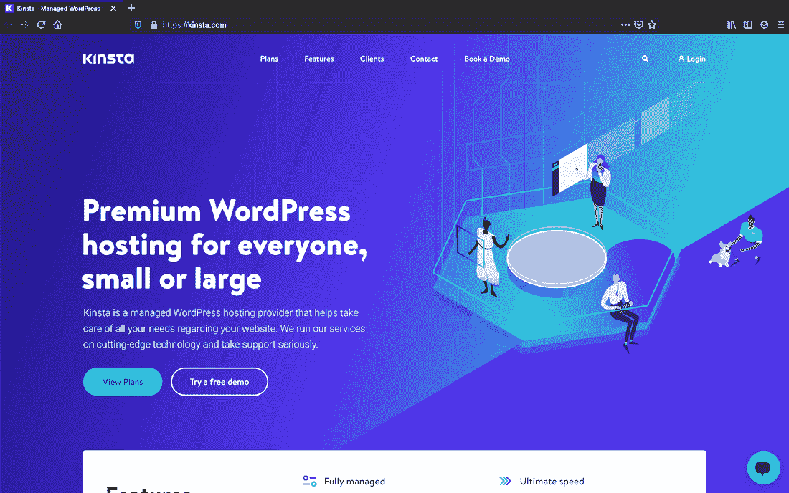

The Kinsta home page.


例如，如果截图的宽度不能超过 1，400 像素，一个好的方法是捕捉整个屏幕，并使用选取框或裁剪工具来“标出”正确的尺寸。

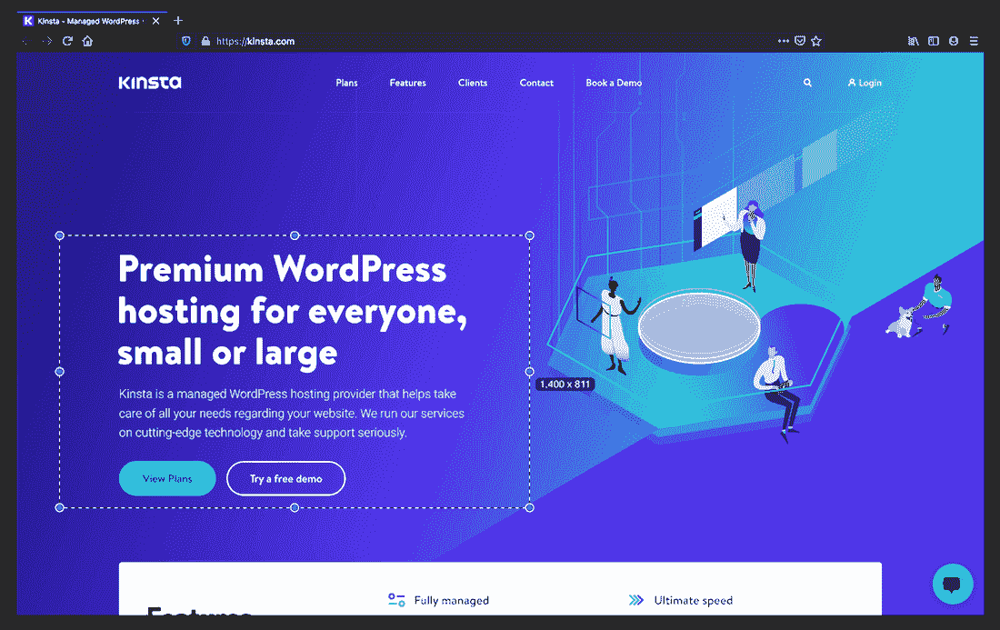

Using the marquee tool to crop a full-screen image.


然后，您可以确保您捕捉的区域将适合您的“框架”，同时确保对齐是完美的。

要进行全屏捕捉，您需要从应用程序的菜单中选择选项。例如，在 native snapshot . app 中，它是一个选择框:

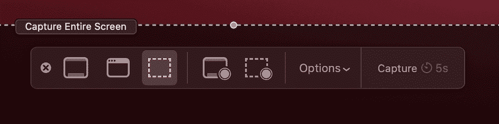

The fullscreen capture option in the Screenshot.app.


然而，在 CleanShot X 中，它是工具栏下拉菜单的一部分:

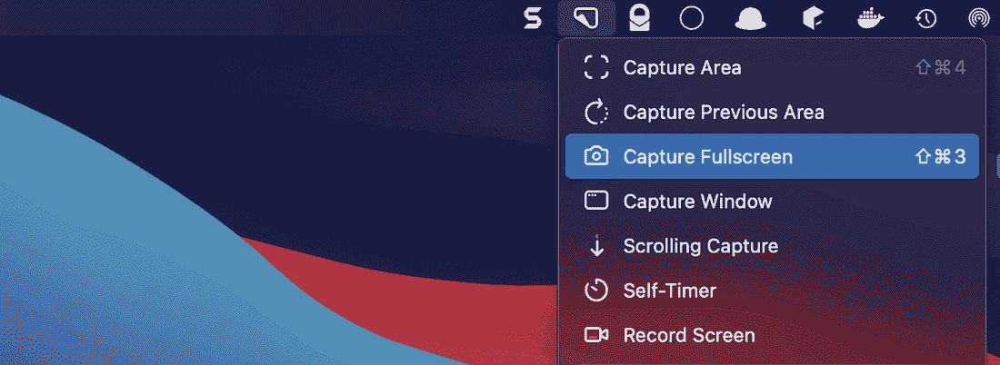

CleanShot X’s Fullscreen Capture option.


虽然 Snagit 也允许您从工具栏访问全屏捕获，但还有其他选项可以考虑:

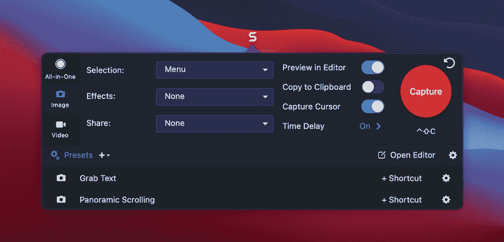

Snagit’s full-screen capture options.


全屏截图的原生快捷键是**命令** + **Shift** + **3** 。你可以在你使用的任何应用程序中将它设置为默认选项。但是，请注意，snapshot . app 还允许您通过使用**命令** + **Shift** + **5** 打开应用程序本身来访问该选项。

#### 将屏幕截图复制到剪贴板

一般来说，每个截图都会在你的桌面上另存为一个新的图片。然而，除了常规的键盘快捷键之外，通过按住**控件**,您也可以将截图复制到剪贴板。这意味着你可以将图像粘贴到另一个应用程序中，比如一个[图形设计程序](https://kinsta.com/blog/visual-content-strategy/)或类似程序。

但是，有些应用程序有不同的方式复制到剪贴板。例如，Snagit 有一个拨动开关，而 CleanShot X 要求您在**首选项**屏幕中设置功能:

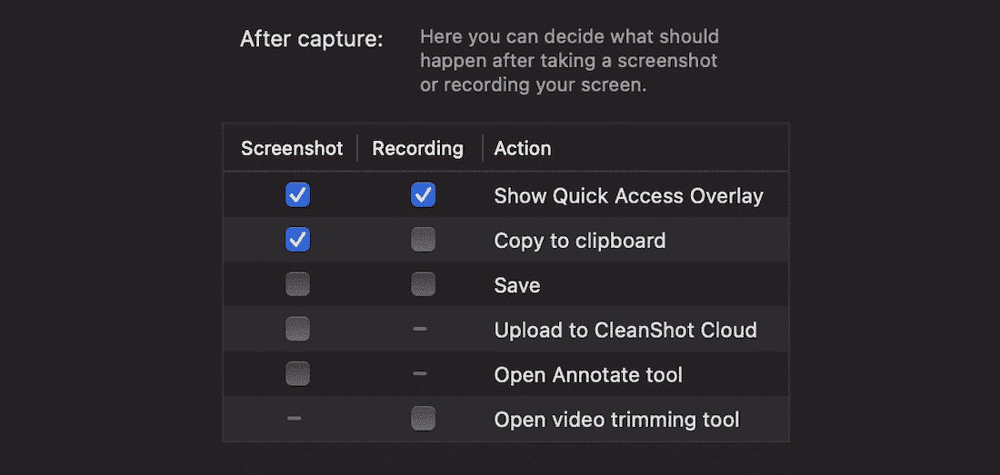

CleanShot X’s Preferences screen.


与此同时，Skitch 将图像复制到剪贴板就像文本一样:通过**文件**菜单中的一个选项。

## 注册订阅时事通讯


### 想知道我们是怎么让流量增长超过 1000%的吗？

加入 20，000 多名获得我们每周时事通讯和内部消息的人的行列吧！

[Subscribe Now](#newsletter)

### 2.捕获屏幕的特定部分

大多数时候，你不想捕捉整个屏幕，而只想捕捉一小部分。幸运的是，大多数应用程序允许你在你想要捕捉的任何元素周围拖动矩形。当您在 Mac 上拍摄屏幕截图时，此矩形将忽略您设置的边界之外的所有内容:

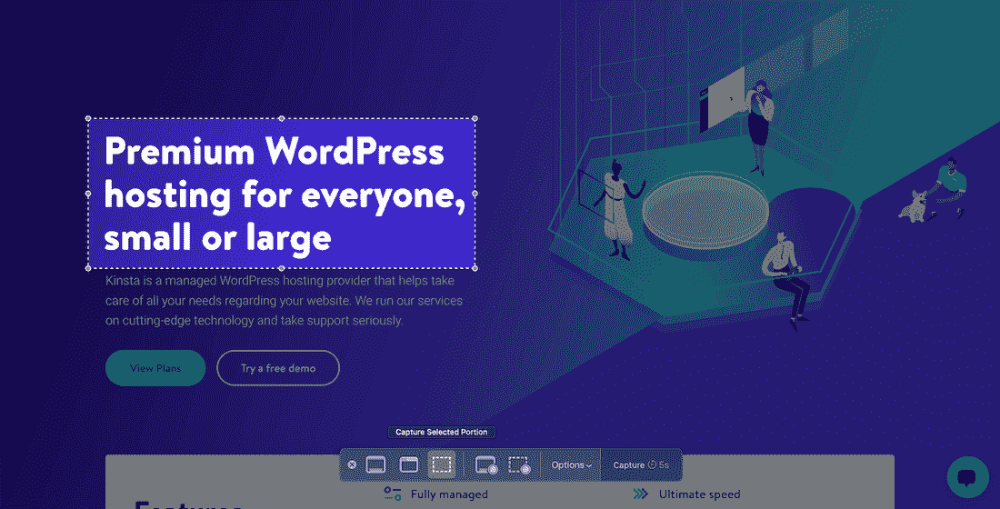

Capturing an area of the screen.


它有丰富的用途——足够多的各种类型的区域捕获可能构成你的大部分截图。最理想的是提供一个清晰的焦点在你的图像的基本方面，从截图中删除元素，等等。

对于这种方法，您通常会使用内建的选框工具拖出边界，然后在采集之前对其进行优化。**Command**+**Shift**+**4**是激活选择十字光标的默认键盘快捷键，不过 screen down . app 也可以让你定义屏幕区域。

很多时候你需要捕捉细节，比如下拉菜单。区域捕捉适用于这种情况，但您可能会发现最终的图像被放大，看起来不自然。然而，区域捕获过程的另一部分可以帮助您。

### 3.捕获屏幕上的特定窗口

在 Mac 上捕捉应用程序窗口对于在屏幕截图中显示“聚焦的上下文”来说是非常棒的。这种方法可以通过清除所有多余的东西来集中注意力。

此外，macOS 还会默认捕捉窗口阴影，这让您的屏幕截图看起来很专业:

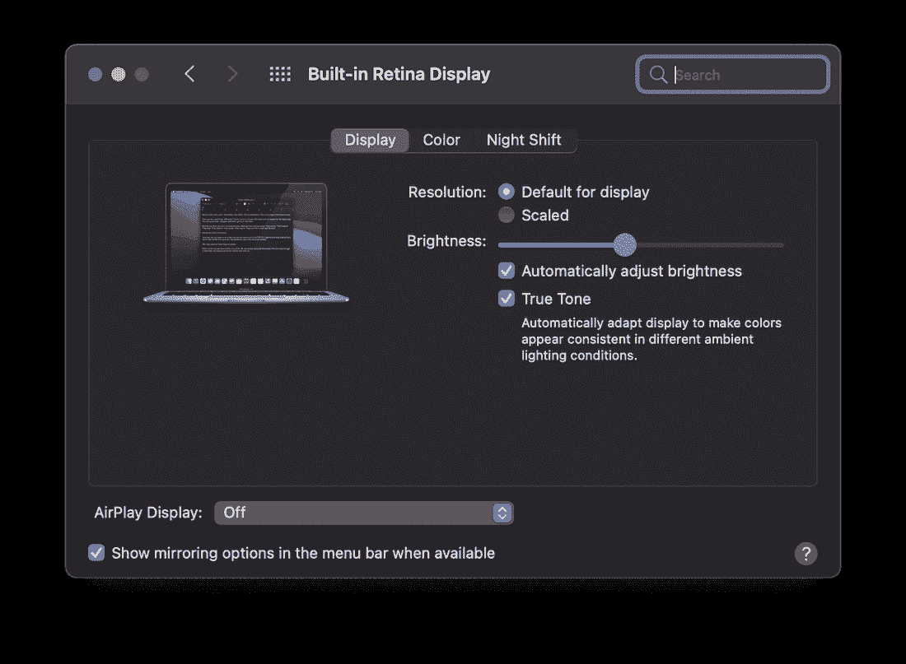

Capturing a window in macOS.


这里最明显的用例是捕捉一个适合你的主题的窗口。鉴于这本质上是一个具有精确尺寸的区域捕获，拍摄这些截图的过程几乎是相同的。

首先，在您选择的应用程序中像往常一样激活区域捕捉工具。对于 snapshot . app，您将使用**命令** + **Shift** + **5** 快捷方式，并选择**捕获选定窗口**选项:

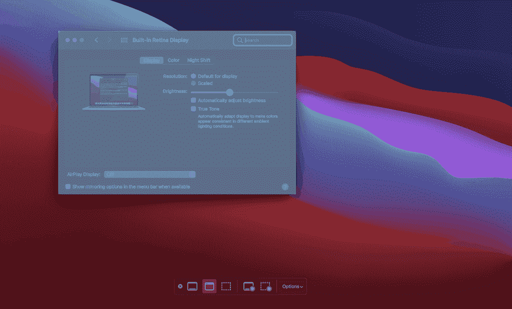

Using the Capture Selected Window option in the Screenshot.app.


然而，在其他应用程序中，*首选项*或工具栏中可能有一个特定选项:

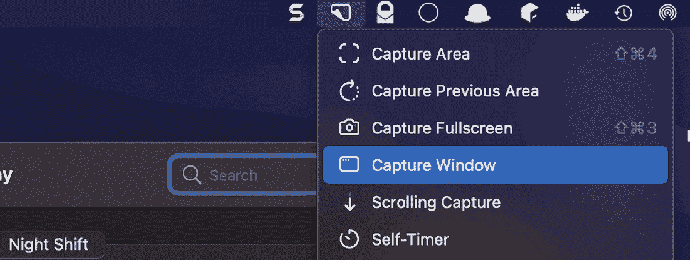

CleanShot X’s “Capture Window” tool.


然而，在 Snagit 中，您需要选择 **Mission Control** 选项来捕获窗口:

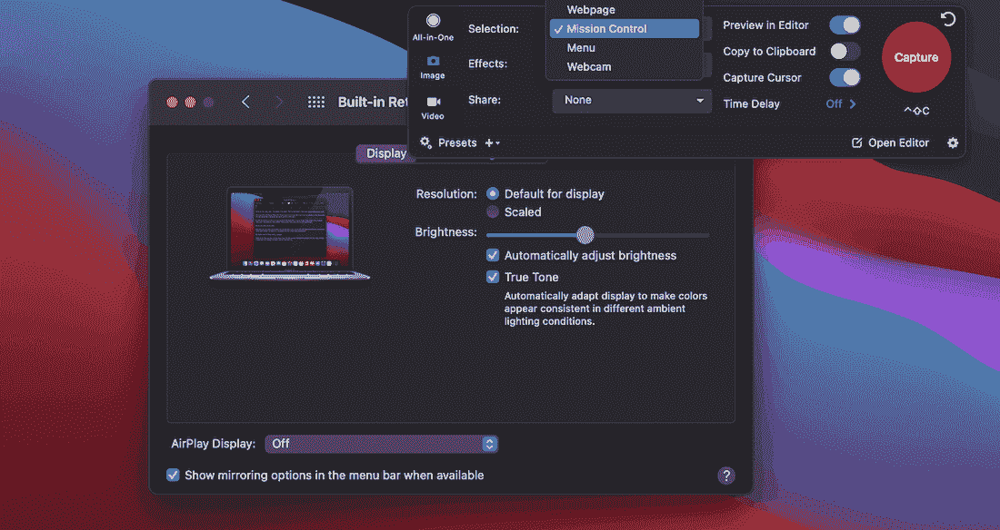

Choosing the “Mission Control” option in Snagit.


虽然对窗口进行截图是一个方便的解决方案，但是您还可以做更多的事情来使这个过程更加集中和具体。

#### 捕获特定的 Mac 菜单或触摸条

当你使用你选择的应用程序尝试窗口截图时，你可能已经注意到下拉菜单并不构成某些窗口截图的一部分。这是所有截图应用程序都缺乏的一个方面。

但是，您通常可以将鼠标悬停在菜单上，同时选择特定窗口来捕捉它:

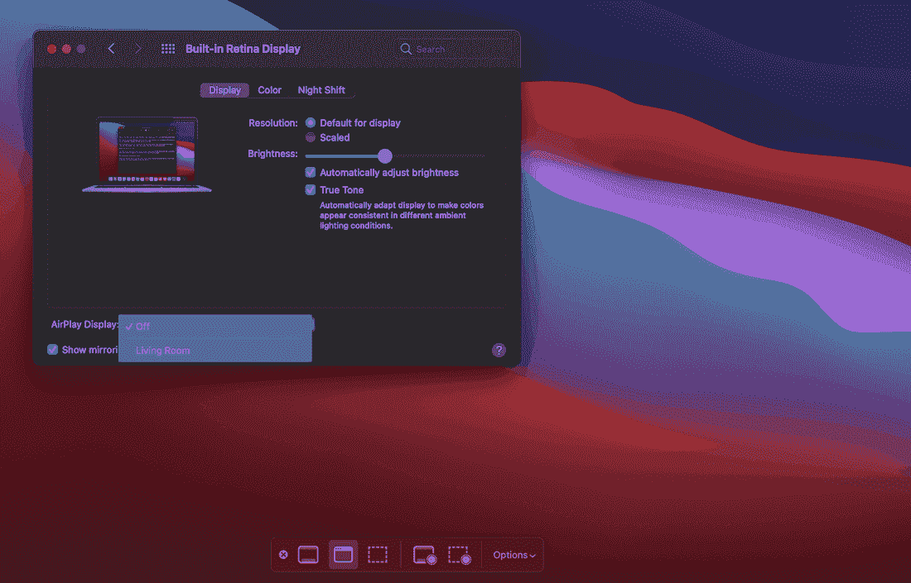

Capturing a dropdown menu.


在 Snagit 中，有一个捕获菜单的专用选项:

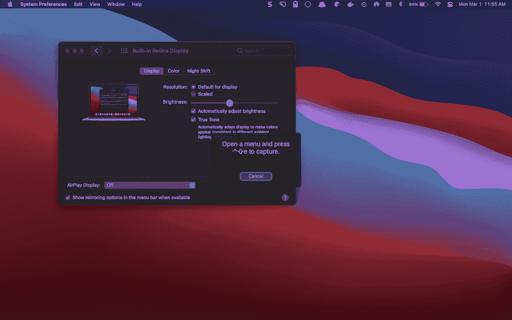

Using Snagit to capture a menu.


这里的一个缺点是，您只能捕获菜单本身，而不是它周围可能提供上下文的所有内容:

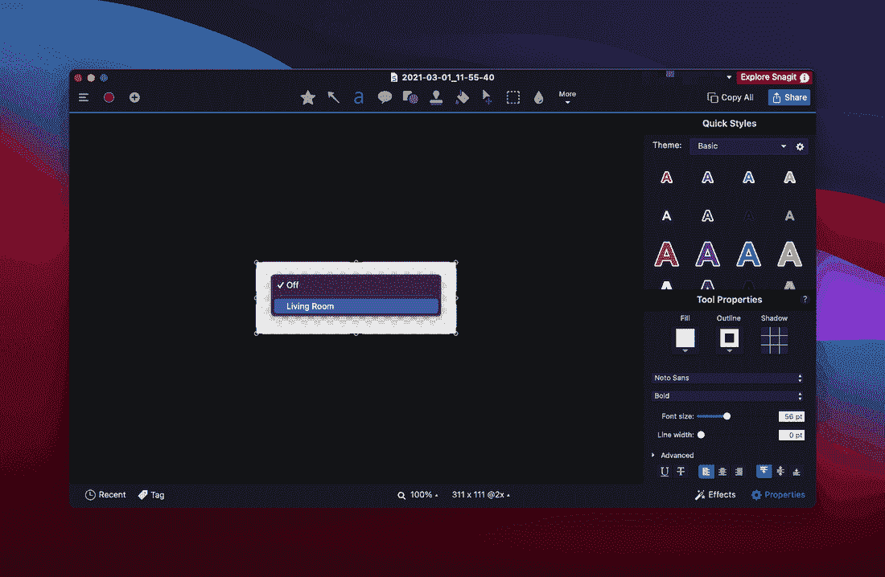

Snagit’s image editor showing a menu capture.


虽然是潜在淘汰，但是快捷键**命令** + **Shift** + **6** 也可以通过 Touch Bar 截图。


The Mac’s Touch Bar can also be captured using a shortcut.


然而，基于苹果硅芯片的新 MAC 似乎没有 [Touch Bar](https://edition.cnn.com/2021/02/07/tech/apple-macbook-touch-bar-2021/index.html) ，因此这种快捷方式是否会在未来的 macOS 版本中保留还有待观察。

与宕机和 WordPress 问题做斗争？金斯塔是托管解决方案，旨在节省您的时间！[查看我们的功能](https://kinsta.com/features/)

#### 使用空格键

最后，如果你想在使用键盘快捷键时捕捉特定的窗口和菜单，快速提示:**Command**+**Shift**+**4**通常是设置**活动区**的快捷键。一旦模式被激活，你可以按下**空格键**进入窗口选择模式，点击鼠标或触摸板捕捉截图。

虽然这是 Screenshot.app 的默认设置，但其他应用程序(如 CleanShot X)通常会为截屏映射相同的键。

最后，如果你想挑战你的技能，你也可以通过按住**命令**+**Shift**+**4**+**空格键**在屏幕上移动选定的边界。它可以让你重新定位捕捉区域，以获得完美的截图。要抓拍，请松开**空格键**。

### 4.创建“定时”截图

到目前为止，我们只讨论了即时捕捉。我们为截图设置了边界，并立即捕获了屏幕。但是，在某些情况下，您可能想要将捕获延迟几秒钟。

如果您想要在 Mac 上对特定事件(如菜单通知)进行截图，这是有意义的。如果您需要“设置”捕捉的细节，例如，在打开菜单或应用其他快捷键时，您可能还想设置一个计时器。

snapshot . app 让你选择 5 秒或 10 秒的捕捉延迟:

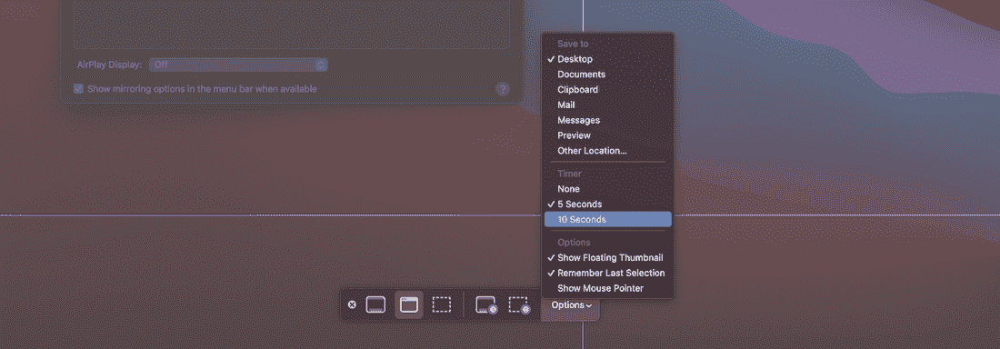

Screenshot.app’s timer options.


虽然 CleanShot X 为您提供了 2-15 秒的计时器，但 Snagit 是最灵活的，您可以根据自己的具体需求设置自定义时间:

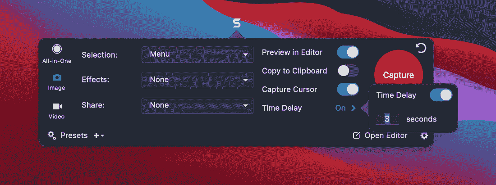

Snagit’s timer options.


Skitch 最不灵活；它只提供一个五秒钟的计时器，作为专用**定时十字准线快照**选项的一部分。当然，我们已经讨论了 lean Skitch 与其他产品相比如何(以及为什么会这样)，但这确实意味着困难的时间捕捉将需要一个功能更全的截图应用程序。

## 如何在 Mac 上录制屏幕

除了捕捉静态图像，许多截图应用程序还可以记录你的屏幕，并将结果保存为视频文件。虽然 Skitch 没有提供这种功能，但我们列表中的其他工具都提供了，并且它们都提供了不同的访问视频录制的方式。

捕捉视频的过程类似于定义屏幕区域:您将拖动选框工具来定义边界，然后开始录制。它甚至比图像捕捉更简单，对于通过电子邮件或聊天发送的快速解释者视频来说，它是一个极好的选择。

你会在应用本身里面找到 screen down . app 的录音功能(**命令** + **Shift** + **5** )。这是非常基本的，几乎没有选择。然而，Snagit 和 CleanShot X 都有许多选项，可以让您创建优化的屏幕录制。

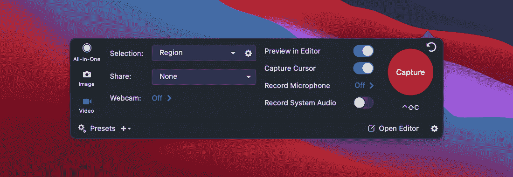

Snagit’s video recording options.


这两个工具都可以让你捕捉到特定窗口的屏幕记录，不像 Screenshot.app。它可以保持文件大小，并保留观众的焦点。

## 如何提高在 Mac 上截图和录音的效率

默认情况下，截图会保存到您的桌面上。通常情况下，这很好，而且可以说是他们的最佳选择。然而，在大多数应用程序中，你可以指定截图的保存位置。

例如，CleanShot X 和 Snagit 允许您在**首选项**屏幕中定义一个位置。另一方面，screen down . app 有几个预设位置，可以选择指定一个自定义位置:

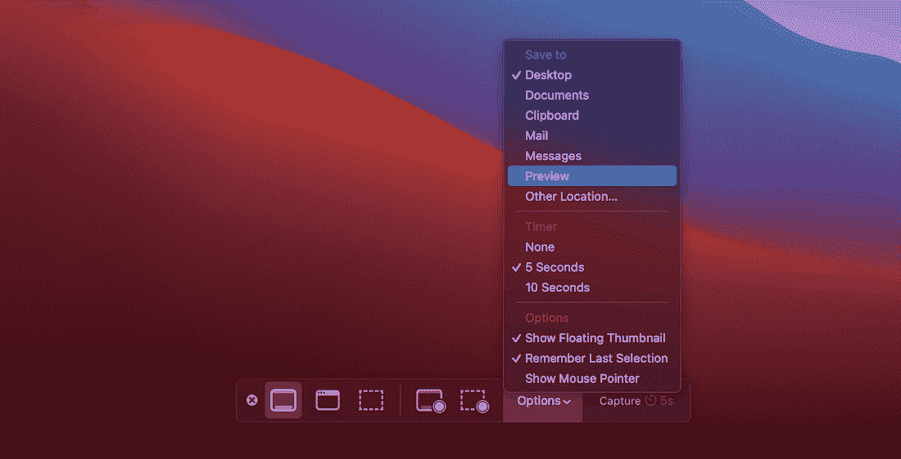

Screenshot.app’s image saving locations.


此外，每个应用程序都可以选择在您的截图和录音中显示光标。它通常在*偏好设置*屏幕中，每个应用程序都有自己的方式让你打开和关闭它:


Snagit’s Show Cursor option.


一旦你截屏了，这些应用程序中的大多数也会让你把它移到其他地方:


Dragging an image to the Notes app.


最后，可能是你想选择不同的默认截图 app。如果某种东西比原生工具更适合你的需求，这是可以理解的。然而，不像 Mail 这样的应用程序，没有直接的方法可以做到这一点。

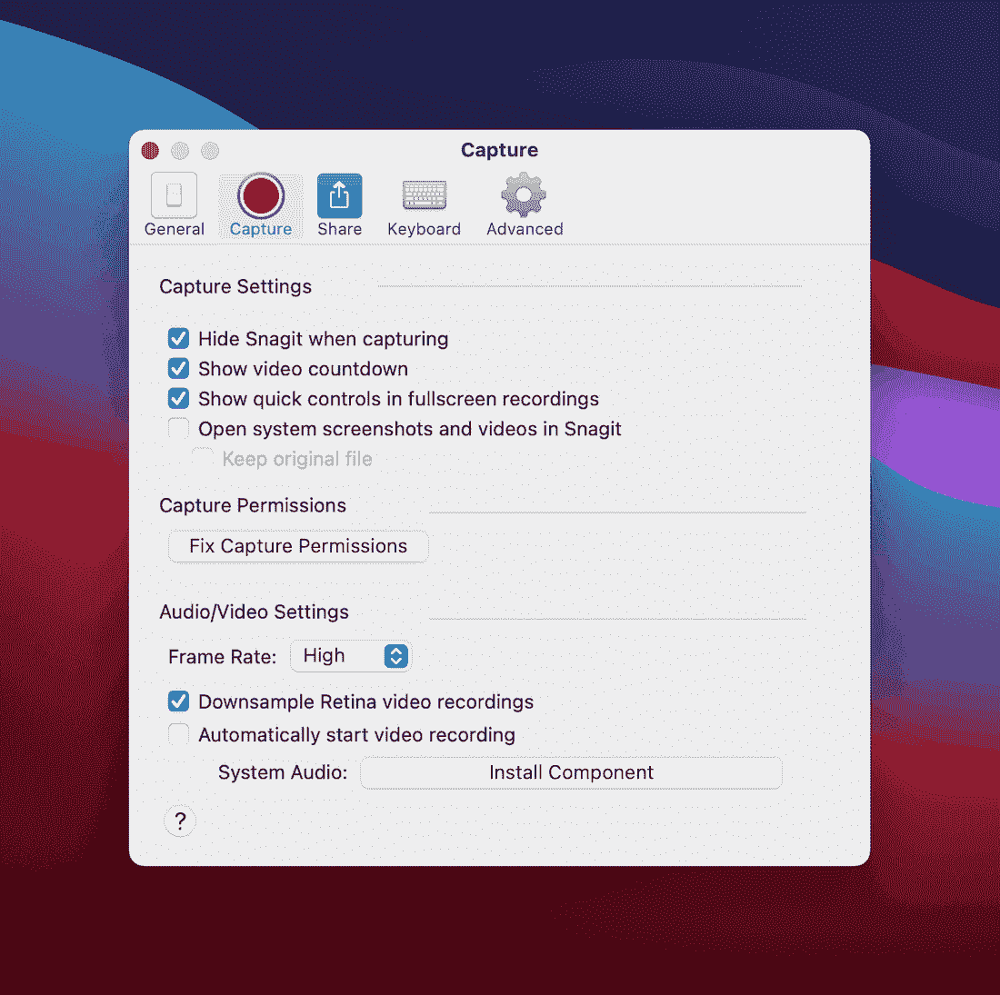

Snagit’s open settings.


解决方案是将你的快捷键映射到 Screenshot.app 使用的快捷键上。这样，你选择的应用程序将优先于原生应用程序。CleanShot X 会在首次启动时询问你是否要重新映射按键，Snagit 还包括一个在自己的编辑器中打开截图和视频的选项。

### 如何改变截图的文件格式

我们还想分享一个提高效率的小技巧——通常可以在第三方应用的首选项中找到:改变你的截图文件类型。

截图的默认文件格式是可移植网络图形(PNG)文件。这是有意义的，因为 PNG 文件更适合图形图像，而不是照片。

我们之前提到了第三方应用程序如何为您提供一些选择文件格式的选项。但是，如果您使用的是 screen Dow . app，并且想要更改文件格式，则没有此类设置。相反，您必须打开终端并输入以下内容:

```
defaults write com.apple.screencapture type <file format>; killall SystemUIServer
```

请注意，您需要将 *<文件格式>* 占位符替换为以下内容之一:

*   png
*   可交换的图像格式
*   一口
*   可移植文档格式文件的扩展名（portable document format 的缩写）

一旦你按下**进入**，你截图的文件格式就会改变。请注意，您不会收到通知；拍摄一张测试截图会告诉你这个改变是否有效。

## 如何在 Mac 上截屏:总结

虽然在 Mac 上截屏是一件轻而易举的事，但记住必要的快捷键可能就不容易了。幸运的是，我们是来帮忙的！以下是最常见快捷方式的快速列表及其功能的简要描述:

| **快捷方式** | **动作** |
| Command + Shift + 3 | 进行全屏捕捉。 |
| Command + Shift + 4 | 在截图之前先定义一个抓图区域。 |
| 空格键 | 它允许您在重新定义区域时重新定位边界。只需按一下，您就可以选择一个打开的应用程序窗口进行捕捉。 |
| Command + Shift + 5 | 它会打开原生的 Screenshot.app 来获取更高级的屏幕截图。 |
| Command + Shift + 6 | 对相关 MAC 上的 Touch Bar 进行截图。 |
| 逃跑 | 取消选定模式下的屏幕截图过程。 |
| 控制 | 结合上述任何截图快捷方式，将您的截图复制到剪贴板。 |

请注意，第三方应用程序可能有自己的自定义快捷方式。因此，此处的功能可能会因您使用的应用程序而异。然而，大多数应用程序擅长将键绑定映射到 screen down . app 默认设置。

## 注释截图的快速入门

为了总结这篇关于如何在 Mac 上截屏的文章，我们来讨论一下注释。即使你的截屏技巧很好，糟糕的注释也会毁掉你的图像，让最终用户困惑。

为此，以下是我们关于尽可能做出最佳注释的建议:

*   最好的注解是根本没有。换句话说，试着截屏准确显示你想表达的观点，而不需要文字。
*   对于你的大部分注释，坚持使用简单的方框。箭头、文本和其他元素会分散你的注意力，让你的截图看起来不专业。
*   避开[默认的配色方案](https://kinsta.com/blog/website-color-schemes/)和尺寸。很容易判断某人是否使用了 Skitch 或 Preview，因为它们都使用不同的颜色进行注释。
*   使用与你的截图形成对比的颜色，但是在你做的所有注释中保持一致。黄色或橙色通常效果很好，你会注意到 Kinsta 在博客上使用我们熟悉的紫色作为注释。

你有时会在截图中抓取敏感信息，尤其是如果你使用的是基于账户的应用程序或正在处理系统文件。在这些情况下，使用合适的工具来混淆信息是一个好主意。

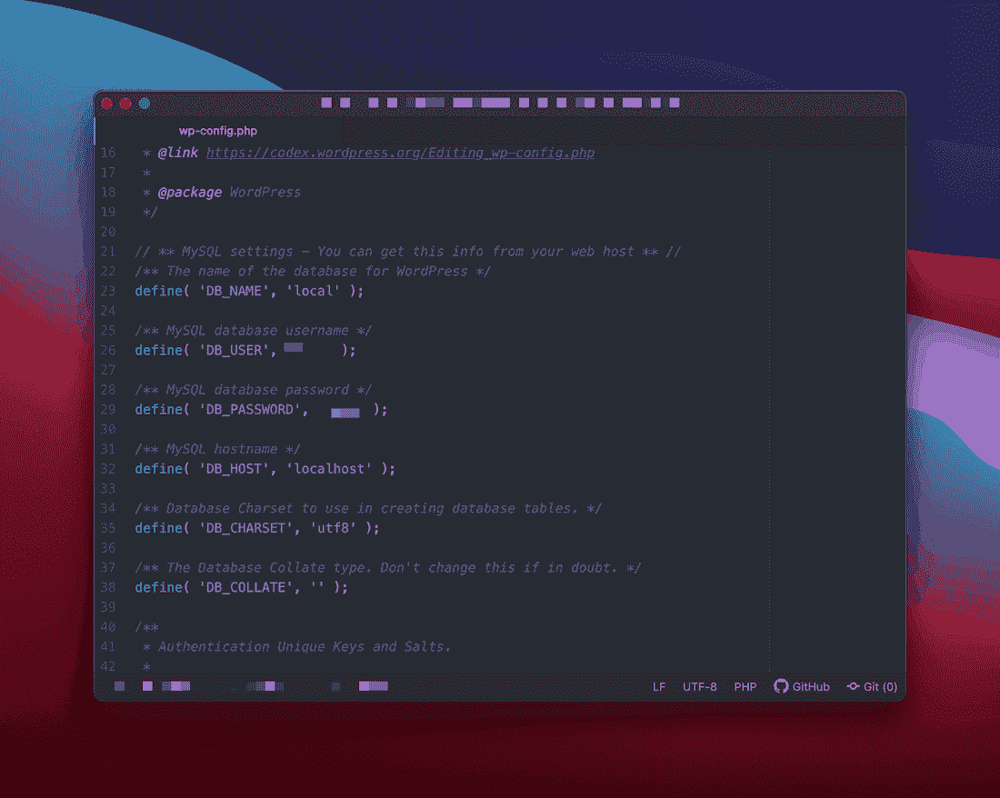

CleanShot X’s blurring or obfuscation tool.


Skitch、Snagit 和 CleanShot X 都有这个模糊选项——比钢笔涂鸦或丑陋的方框好得多的选项。

最后，你可能想用一个专用的浏览器模型工具为你的图片创建一个一致的框架。它让你的截图看起来像是在浏览器或其他应用程序窗口中。

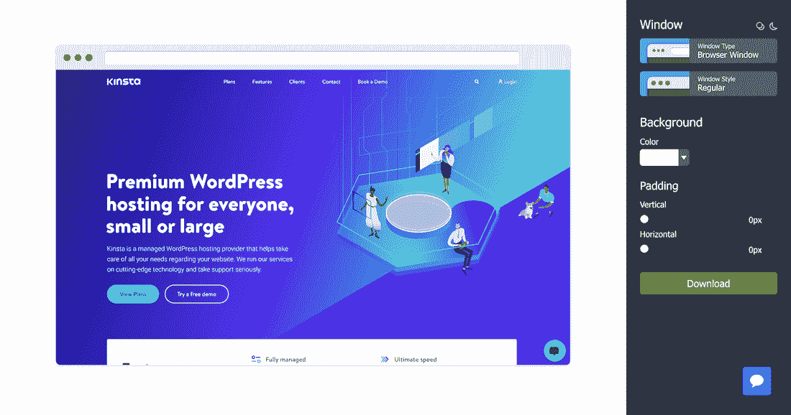

The Screely tool.


有一些免费的工具可以帮助你，比如 [Screely](https://www.screely.com/) 和[shot mock](https://chrome.google.com/webstore/detail/shotmockr-design-mockups/elklfjmcadphgcmlfehpnakghohbldne)。然而，如果你有时间和需要，你也可以使用一个专用的模板在你喜欢的图形程序中创建你的模型。

想了解一下 [Windows 截图快捷方式](https://kinsta.com/blog/how-to-screenshot-on-windows/)？查看我们的指南:[如何在 Windows (7，8，10)上截图，并保存和编辑它们](https://kinsta.com/blog/how-to-screenshot-on-windows/)

[无论你是在苹果电脑上录制、注释还是以其他方式录制东西，这个指南都是为你准备的⬇️ 点击发推](https://twitter.com/intent/tweet?url=https%3A%2F%2Fkinsta.com%2Fblog%2Fhow-to-screenshot-on-mac%2F&via=kinsta&text=Whether+you%27re+recording%2C+annotating+or+otherwise+recording+something+on+your+Mac%2C+this+guide+is+for+you+%E2%AC%87%EF%B8%8F&hashtags=MacTips%2CiOSTips)

## 摘要

对于看似简单的事情，在 Mac 上截图会很快变得复杂。这是因为视觉对于任何文档和教程博客帖子都是至关重要的。更重要的是，一个精心制作、注释良好的截屏可以提供与几段文字一样多的说明。

在这篇文章中，我们探索了许多在 Mac 上截屏的方法。虽然全屏捕捉是截图的“蛮力”方法，但定义一个焦点区域或窗口将导致更高的效率，特别是如果你选择第三方应用程序，如 [Snagit](https://www.techsmith.com/download/snagit/) 或 [CleanShot X](http://cleanshot.com/) 。

此外，花些时间编辑和注释你的截图会经常提升它们的价值，并把重点放在你想要传达的东西上。

你会在你的 Mac 上截图吗？如果会，这些应用程序会对你有帮助吗？请在下面的评论区告诉我们！

* * *

让你所有的[应用程序](https://kinsta.com/application-hosting/)、[数据库](https://kinsta.com/database-hosting/)和 [WordPress 网站](https://kinsta.com/wordpress-hosting/)在线并在一个屋檐下。我们功能丰富的高性能云平台包括:

*   在 MyKinsta 仪表盘中轻松设置和管理
*   24/7 专家支持
*   最好的谷歌云平台硬件和网络，由 Kubernetes 提供最大的可扩展性
*   面向速度和安全性的企业级 Cloudflare 集成
*   全球受众覆盖全球多达 35 个数据中心和 275 多个 pop

在第一个月使用托管的[应用程序或托管](https://kinsta.com/application-hosting/)的[数据库，您可以享受 20 美元的优惠，亲自测试一下。探索我们的](https://kinsta.com/database-hosting/)[计划](https://kinsta.com/plans/)或[与销售人员交谈](https://kinsta.com/contact-us/)以找到最适合您的方式。