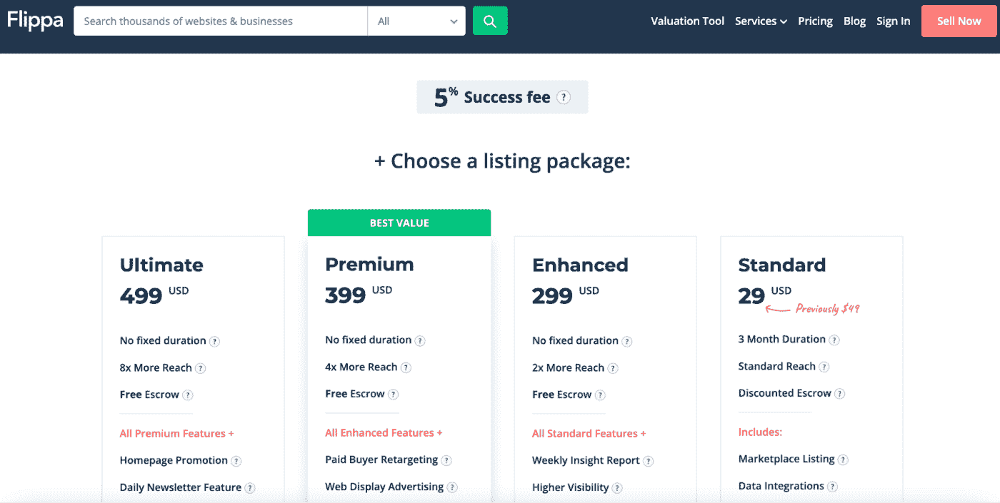
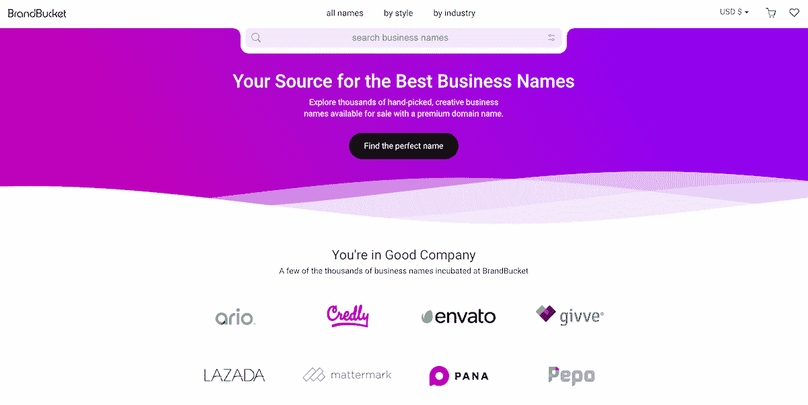
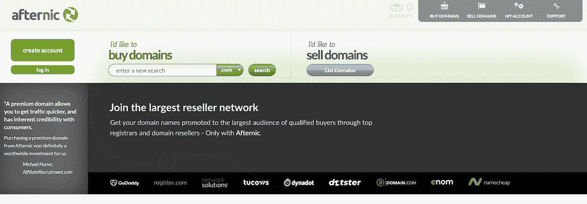
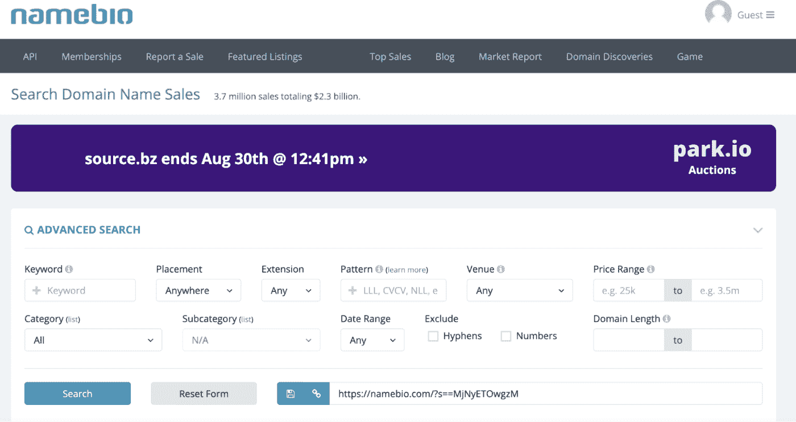
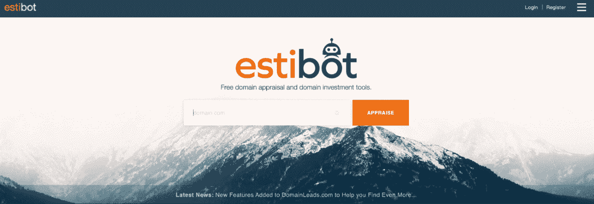
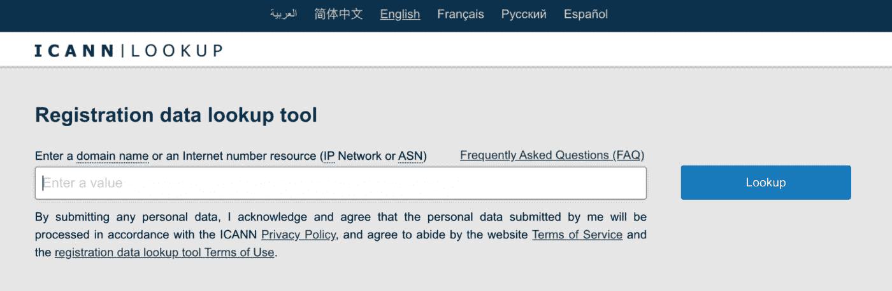
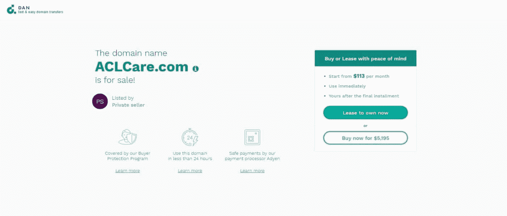
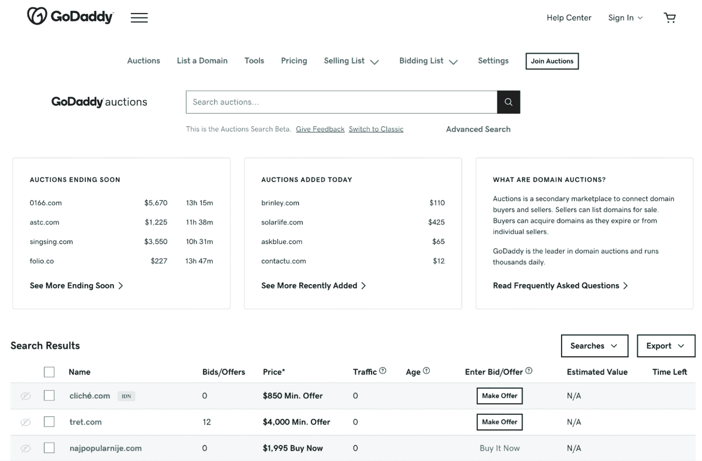
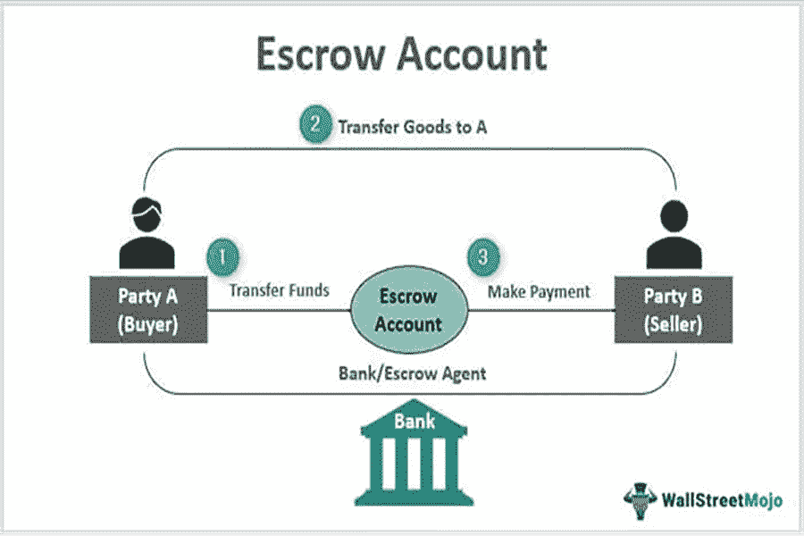

# 如何出售域名:最终一步一步的指南

> 原文：<https://kinsta.com/blog/how-to-sell-a-domain-name/>

互联网有巨大的价值。这是人们自 90 年代以来一直在说的话。大多数情况下，他们谈论的是一家公司的网站。这是您的在线状态，也是世界了解您的组织的窗口。

但这远不是将在线体验货币化的唯一途径。域名倒卖已经成为一个利润丰厚的行业，个人购买高价值的域名，然后卖给那些希望[购买一个域名](https://kinsta.com/blog/how-to-buy-a-domain-name/)的人来获利。

这个行业变得如此有利可图，以至于许多企业家把它作为兼职或全职职业。众所周知，成功的全职域名玩家每年可赚取高达 [$10 万](https://fitsmallbusiness.com/domain-flipping/)。

人们需要一个高价值的域名，企业主们排着队抢到理想的网址并把它放在他们网站的前面，准备席卷全球。但是，就像倒卖房地产一样，你需要一定的专业知识才能通过出售域名获利。

在出售你的域名之前，你应该考虑什么？在利润丰厚的域名销售领域，需要采取哪些步骤来实现盈利？在这篇文章中，我们将带你走过八个步骤，帮助你学习如何以尽可能高的价格出售域名。

## 出售域名前需要考虑什么

### 你将在哪里销售？

当是时候出售你的域名时，你需要考虑你将在哪里出售它。对此有几种选择。事实上，有这么多的选择，可能很难决定一个。这就是为什么熟悉一些重量级人物是个好主意。

> Kinsta 把我宠坏了，所以我现在要求每个供应商都提供这样的服务。我们还试图通过我们的 SaaS 工具支持达到这一水平。
> 
> <footer class="wp-block-kinsta-client-quote__footer">
> 
> 
> 
> <cite class="wp-block-kinsta-client-quote__cite">Suganthan Mohanadasan from @Suganthanmn</cite></footer>

[View plans](https://kinsta.com/plans/)

他们在这里，没有特定的顺序。

[Get the 411 on how to get started with domain flipping in this guide 💪Click to Tweet](https://twitter.com/intent/tweet?url=https%3A%2F%2Fbit.ly%2F3eeOYqy&via=kinsta&text=Get+the+411+on+how+to+get+started+with+domain+flipping+in+this+guide+%F0%9F%92%AA&hashtags=WebTips%2CDomainName)

#### 鳍状肢

Flippa 是一项服务，你可以用它来出售域名和整个预先建立的网站和企业。这项优质服务根据你的销售额收取很高的费用(高达 499 美元)。除此之外，成功的销售还要收取 5%的佣金。

Flippa charges a listing fee on top of a success commission

#### BrandBucket

BrandBucket 是一个管理市场，这意味着你必须提交一个域名并获得批准才能将其列入。获得批准后，你的物品将包括一个描述和一个自定义设计的标志。列出一个域名需要 10 美元的费用，如果你在 BrandBucket 上列出，你就不能在其他地方列出。还需要 30%的提成。

BrandBucket

#### Sedo

Sedo 自 2001 年成立以来，在其市场上拥有超过 1800 万个域名列表。通过 Sedo，您可以使用其令人难以置信的客户服务、内部托管服务以及直观的界面和仪表盘。Sedo 通过一个庞大的合作伙伴网站网络来推广其列表。上市是免费的，但佣金价格在 10%至 20%之间。

Sedo

#### Afternic

[Afternic](https://www.afternic.com/) 是另一种选择。自 1999 年以来，它已经有超过 500 万个列表。这项服务每月有超过 7500 万的域名搜索，所以这是一个高流量的市场。Afternic 的母公司是 [GoDaddy](https://kinsta.com/blog/google-domains-vs-godaddy/) ，因此通过其市场销售的列表也作为 GoDaddy 上的高级域名弹出。列表是免费的，但是要向服务支付 20%的销售佣金。

Afternic

### 你拥有有价值的域名吗？

在学习如何销售域名时，你必须能够认识到你所拥有的域名是否有价值。这是在[向像](https://kinsta.com/blog/best-domain-registrar/)[谷歌域名](https://kinsta.com/blog/google-domains-review/)这样的服务注册域名之前要考虑的事情。

有几个标准可以用来评估你的域名。这也适用于[在转售前选择域名](https://kinsta.com/blog/choose-domain-name/)进行购买。

第一，多长时间？

每个人都想要一个短域名，因为它们更容易记忆。所以，如果你有一个短而易记的域名，你就可以收取更多的费用。

接下来，你的域名中包含了哪些关键词？

任何以高容量关键词为特色的域名都将更有价值。由于关键词是 SEO 过程中必不可少的一部分，在你的域名中使用高价值的关键词会使它对那些试图专门为该词排名的潜在买家更有吸引力。

最后，你的域名品牌化程度如何？

所谓品牌化，我们指的是一个独特的、描述性的、简短的、易于记忆的和用户友好的域名。这应该是一个[公司可以围绕](https://kinsta.com/blog/positioning-strategy/)建立的东西，并且它的客户可以很容易地将它与品牌联系起来。

### 设定现实的目标

一旦你选择了一个市场并确定了你的领域的价值，设定现实的销售目标是很重要的。不要射得太高或太低。如果你认为你会从你的域名中赚到一百万美元，而它只卖几千美元，那你就是在破坏你自己。

当你决定要多少钱时，考虑一下上面的步骤，更好地确定你需要什么，什么对你来说是现实的。

## 如何销售域名(8 个步骤)

### 1.研究最近的可比领域销售

在你能准确地为你的域名定价之前，你必须看看当前的市场。即使你认为你的域名值很多钱，如果市场饱和，可比销售额远低于你的预测，你可能需要重新评估你的目标或等待更好的时机出售。

你可以使用像 [NameBio](https://namebio.com/) 这样的资源来查看最近的域名销售情况。这包括对总价值为 15 亿美元的领域销售进行梳理的历史数据。该数据库每天更新，是一个很好的方式来检查行业温度，看看你的一些竞争对手在他们的域名销售。

NameBio is a place where you can research similar domain sales

过滤器可以应用于您的搜索，包括您的域的[扩展名、包含的任何关键字，甚至类似长度的域。](https://kinsta.com/knowledgebase/co-vs-com/)

比方说，你下定决心要为你的域名赚到 50，000 美元以上。当您使用这样的工具时，您可以查看相似域的执行情况。如果它们的售价大多在 3 万美元左右，你会很快意识到你的目标可能有点高。

当这种情况发生时，扩展你的搜索参数。NameBio 可以让你追溯到过去五年。如果你发现这类条款的市场会随着时间的推移而发生变化，那么最好等一等。然而，如果你看到目前的平均 30，000 美元处于历史高位，那么可能是时候趁热打铁了。

### 2.确定并设置您的域的值

在你对市场做了调查之后，是时候通过设定域名的价值来给它贴上价格标签了。但是仅仅因为市场说了一件事，而你相信你的域名价值一定，你仍然有可能高估或低估自己。

You can use Estibot to calculate your domain’s name

这就是为什么有领域评估工具可以帮助你解决问题。像 [Estibot](https://www.estibot.com/) 这样的东西可以使用一种算法来计算你的域名的价值，这种算法考虑了许多因素，例如:

*   [域名扩展](https://kinsta.com/blog/domain-extensions/)(。com，。网，。org 等。)
*   长度
*   关键词
*   发音
*   搜索量
*   每次点击成本

不幸的是，这些基于机器的评估并不是无懈可击的。这就是为什么一些所有者让专家对他们的域名进行评估。如果自动化服务和定价历史记录为您提供了高金额，这是特别明智的。最好确保这些结果不会好到令人难以置信。

## 注册订阅时事通讯

### 想知道我们是怎么让流量增长超过 1000%的吗？

加入 20，000 多名获得我们每周时事通讯和内部消息的人的行列吧！

[Subscribe Now](#newsletter)

域名经纪人可以为你提供无偏见的评估。他们非常了解市场，通常能预测未来趋势。如果他们认为再等一会儿只会增加你域名的价值，那么推迟可能是明智的。

请记住，聘请专业评估师会减少你的利润，因为这是一笔额外的费用。

此外，您可以通过免费的在线域名买卖论坛分享您的域名。但这是一个公共论坛，任何人都可以在里面发帖，所以当你寻求建议时要记住这一点。

一旦你知道你的域名值多少钱，就该定价了。考虑到有[多种多样的域成本](https://kinsta.com/blog/how-much-does-a-domain-name-cost/)，这可能很困难。大多数域名的售价在三到四位数之间，其中[高级域名](https://kinsta.com/knowledgebase/what-is-a-tld/)的售价在六到七位数之间。如果你正在与一个高级域名合作，试着以低于市场价值的价格来产生兴趣，甚至是一场竞价战。

### 3.制作你的列表

现在是时候准备你将要使用的域名列表了。这就是你必须雄辩地策划推销，宣传你要推销的领域的最佳特性。

如果你想真正脱颖而出，包含大量的信息。这意味着列出的不仅仅是你提供的域名和要价。

但是，如果你想引起别人的注意，你应该在你的清单上写些什么呢？你如何为一个领域创造一个有吸引力的销售机会？

首先，如果它是你正在使用的域名，谈谈它产生的流量。如果你已经使用它很长时间了，它应该有一个成功的记录。任何现有的权威，你的领域命令也应该包括在内，以描绘一幅潜在的利润，你的客户可以获得，如果他们从你这里购买。

即使你拥有的[域名是空的](https://kinsta.com/knowledgebase/parked-domain/)，也要检查它的分析。人们访问你的域名可能是因为他们对与之相关的关键词感兴趣，却发现没有网站。这可能是一个吸引潜在买家的数字，因为它显示了市场需求。

在这里，分析是你最好的朋友。你能用来支持你的领域的有效性和盈利潜力的数字越多，它对潜在客户的吸引力就越大。

大肆宣传它是多么令人难忘，以及它如何能带来实实在在的金钱。如果是一个”。com" URL，谈论它并大肆宣传它是最好的扩展的理由。

例如，谷歌就以[青睐而闻名。因为它是最古老、最受认可的顶级域名。用户更容易记住. com 网址，因为他们已经习惯了。从实际用户的角度来看，这更有吸引力，他们通过](https://novanym.com/pages/why-com-is-the-best-domain-extension-for-seo) [DNS](https://kinsta.com/knowledgebase/what-is-dns/) 服务器推送你的 URL，同时[更好地进行 SEO](https://kinsta.com/blog/wordpress-change-domain/)。

### 4.在 WHOIS 目录上列出您的联系信息

虽然有些人担心将他们的联系信息公之于众，但在试图销售时忽略[域名隐私](https://kinsta.com/blog/domain-privacy/)是有好处的。许多卖家选择在[的 WHOIS 目录](https://www.domain.com/whois/whois)或 [ICANN](https://lookup.icann.org/en) 上列出他们的信息。

Ensure that potential buyers can find your information

这些在线工具允许用户分别使用 WHOIS 协议和注册数据访问协议(RDAP)查找域名的注册数据。使用 RDAP 时，您可以获得高级安全性、标准化格式和国际化支持，甚至能够提供差异化的注册数据访问。

这有助于感兴趣的人在市场上准确地找到你要卖的东西。通过在这些目录上列名，高度投资的潜在买家可以找到你，即使他们没有检查你选择的市场。

Struggling with downtime and WordPress problems? Kinsta is the hosting solution designed to save you time! [Check out our features](https://kinsta.com/features/)

通过在这些目录中的一个上列出你的信息，你实际上是在钓鱼。你把信息放在那里，等着有人来咬它。

### 5.列出你的域名

现在是时候把你的域名挂牌出售了。类似于你如何在你想要翻翻的房子前面放置一个“待售”的标志，你可以创建一个“待售”的[登陆页面](https://kinsta.com/blog/wordpress-landing-page-plugins/)，并在你的域名上弹出，供感兴趣的买家使用。

有时，在检查目录之前，有人可能会通过在他们的 web 浏览器中键入域名来查看该域名是否可用。如果一个清晰的、吸引人的登录页面弹出了一个直接链接到列表的销售广告，你就创造了一个很好的销售机会。这是一个[停泊域](https://kinsta.com/knowledgebase/parked-domain/)的例子。

A For Sale landing page can let buyers know you’re selling

然而，你不能仅仅抛出一个带有你的联系信息的待售登陆页面，并期望这就足够了。正如我们之前讨论的，您需要在满足您需求的市场上列出您的域名。当然，许多因素会影响你决定使用哪个市场。

其中包括:

*   市场对成功销售收取的佣金百分比
*   列出你的域名是否需要费用
*   市场是否要求上市的专有权
*   市场的正常交易
*   市场的成功率
*   如果市场有一个联盟网络，也将列出你的销售
*   如果市场有内置的托管服务

如果你正在寻找一个更快的周转，你可以在拍卖网站上出售你的域名。当使用这些服务之一时，只需创建你的列表，设置最低出价金额，并观察感兴趣的买家相互竞争，推动价格上涨。

You can sell your domain at auction for fast results

很像易贝，你可以包括一个“立即购买”的价格，有人可以点击以预定的金额结束拍卖。请记住，当你与拍卖网站打交道时，买家大多是域名行业投资者，所以他们可能会试图以较低的价格购买域名，然后转手获利。

### 6.找到买家

你可以设置好你的清单，然后忘掉它，等待优惠滚滚而来。但是，如果你积极尝试利用对外销售和广告技巧寻找买家，你会取得更大的成功。

如果你认为你知道可能对你出售的域名感兴趣的特定实体，不管是商业网站还是博客名为 T1 的网站，伸出手去也无妨。试着给这些公司的决策者发一封[精心设计的电子邮件](https://kinsta.com/blog/email-design/)或者打电话。你必须对这些潜在客户进行一些研究，并建立你的销售线索清单。

你也可以雇佣一个域名经纪人来直接联系感兴趣的人并监督销售。这意味着向他们支付佣金，但这可能会帮助你找到最好的买家。当然，由于这些经纪人收取佣金，他们通常只接手五位数以上的高端领域。

### 7.使用托管服务

一旦你找到了一个买家，雇佣一个托管服务来促进资金转移是一个好主意，特别是如果你要转移一大笔钱的话。

好消息是，许多市场都内置了自己的托管服务。如果你选择在包含这个的平台上销售，那么你就省了一步。然而，如果你的市场不包括托管，你将不得不自己雇佣一个服务。

托管服务通过确保在所有权转移开始前收到全部资金来保护交易。一旦解决了这个问题，域名就会转移到它的新主人手中。

Escrow services can secure your transaction

这可以保护你免受不诚实的人的伤害，应该成为你促成的任何大型销售的常规部分。本质上，当买家为你的域名付款时，他们实际上是把钱转入一个托管账户。托管服务然后把钱转给你。收到域名后，你可以通过[域名注册商](https://kinsta.com/blog/best-domain-registrar/)将域名转让给买家。然后买家让托管服务知道他们已经收到域名，交易完成。

如果买家没有全额付款，或者你，作为卖家，没有移交域名，托管服务有所有签署和同意的细节，如果事情升级到诉讼，可以将它们作为证据。

### 8.转移域名

当域名最终移交给新主人的时候，你应该亲自协助并监督其进展。即使你使用的是第三方托管服务，你也应该注意这个过程是如何展开的。

此时，你需要随时回答买家可能提出的任何问题。通过了解流程的进展，你可以快速回答这些问题，并消除可能导致销售失败的任何顾虑。

一旦转让完成，你可以专注于你的利润，新的所有者可以开始建立他们的[迁移](https://kinsta.com/wordpress-migration/)、[托管和 SEO](https://kinsta.com/blog/how-hosting-affects-seo/) 工作。

[Ready to monetize your domain name? 💰 Here's everything you need to know... 💥Click to Tweet](https://twitter.com/intent/tweet?url=https%3A%2F%2Fbit.ly%2F3eeOYqy&via=kinsta&text=Ready+to+monetize+your+domain+name%3F+%F0%9F%92%B0+Here%27s+everything+you+need+to+know...+%F0%9F%92%A5&hashtags=WebTips%2CDomainName) ## 摘要

出售域名是有利可图的，但是如果你毫无准备地走进去，你可能会损失很多钱。这就是为什么你应该自学如何销售域名，最大化你成功的机会。

在您开始旅程之前，请考虑:

*   你想在哪里卖
*   你的域名的价值
*   你的现实目标

然后，一旦到了销售的时候，确保您:

*   研究类似销售
*   设定你的价值和价格
*   创建一个引人注目的列表
*   列出您的联系信息
*   将域名出售
*   找到买家
*   使用托管服务
*   将域名转让给新的所有者

通过遵循这本终极指南中的建议，你可以确保你的域名利润一飞冲天。

如果你想在现有域名的[应用程序](https://kinsta.com/application-hosting/)、[数据库](https://kinsta.com/database-hosting/)和[托管 WordPress 主机](https://kinsta.com/wordpress-hosting/)方面获得帮助，今天就联系 Kinsta 吧。我们的[代理目录](https://kinsta.com/agency-directory/)也列出了可以在网页设计、PPC、SEO 等方面提供帮助的供应商。

* * *

让你所有的[应用程序](https://kinsta.com/application-hosting/)、[数据库](https://kinsta.com/database-hosting/)和 [WordPress 网站](https://kinsta.com/wordpress-hosting/)在线并在一个屋檐下。我们功能丰富的高性能云平台包括:

*   在 MyKinsta 仪表盘中轻松设置和管理
*   24/7 专家支持
*   最好的谷歌云平台硬件和网络，由 Kubernetes 提供最大的可扩展性
*   面向速度和安全性的企业级 Cloudflare 集成
*   全球受众覆盖全球多达 35 个数据中心和 275 多个 pop

在第一个月使用托管的[应用程序或托管](https://kinsta.com/application-hosting/)的[数据库，您可以享受 20 美元的优惠，亲自测试一下。探索我们的](https://kinsta.com/database-hosting/)[计划](https://kinsta.com/plans/)或[与销售人员交谈](https://kinsta.com/contact-us/)以找到最适合您的方式。