# 如何开始一个旅游博客:完全指南

> 原文：<https://kinsta.com/blog/how-to-start-a-travel-blog/>

许多人梦想以环游世界为生；除了飞行员、空服员或商人之外，还有人能够做到这一点。这些人被称为*旅游博客写手*，他们通过访问并写下他们生活中的主要激情:旅行来获得报酬。

在你认为这一切都是梦想之前，是时候揭穿一些神话，告诉一些关于如何开始旅行博客的真相了。🏖

## 旅游博客真相

谁不想成为一名旅游博主呢？旅行可能会很贵，让别人支付你的费用的想法当然很诱人。但这并不全是为了坐头等舱去巴黎。旅游博客就像是 T2 的一份工作。

写旅游博客并不容易。大多数人看到的事实是，你在旅行并获得报酬的同时还住在顶级酒店。他们没有意识到，在弄清楚如何开始一个旅游博客的过程中，会有很多困难。

开始写旅游博客之前，你需要知道以下几点:

*   这是一个饱和的利基市场。每个人都想成为一名旅游博主，认为这就是彩虹和阳光——凭借旅游博客(和一些追随者),他们可以要求免费入住五星级酒店。*但是没那么容易*。有很多旅游博主花了很长时间建立他们的帝国，然后才开始获得任何特殊津贴(或补偿)。
*   很多时候，你都在电脑后面。成为一名博客写手就像拥有自己的杂志，集编辑、摄影师、作家和造型师于一身。一些博客现在有团队，但在开始，它将只是*你*。拍摄和编辑照片和/或视频，撰写文章， [SEO](https://kinsta.com/blog/what-does-seo-stand-for/) ，社交媒体日程安排:所有这些任务都需要你在电脑前呆上相当长的时间。
*   **文思枯竭。公司为你的内容付费，而要成为一名成功的旅游博主，你必须像任何常规工作一样遵守截止日期。[创作优秀的内容](https://kinsta.com/learn/content-marketing/)同时体验每个地方提供的东西并不容易，尤其是当你只想放松，而时间又很紧的时候。**
*   你不会有固定的收入。一般来说，作为自由职业者，你的表现取决于你的下一个项目。你还必须在一开始就把旅游博客当成一项支出。毕竟，你将如何开始写你没有去过的地方呢？你必须投资一些钱去旅行，这将成为你内容的主题。
*   如果你是一个独自旅行的博客写手，一个人从一个地方到另一个地方会很孤独。因为你不会在一个地方呆太久，你会不断地建立和打破友谊和联系。
*   不知道接下来会发生什么。开始时，成为一名旅游博主似乎很令人兴奋，但你必须不断地为下一步做计划。可能会有一段时间，旅行失去了激情，或者你的钱用完了，你需要做相应的计划。

如果你只是为了分享你的旅行而想学习如何开始一个旅行博客，那么这些真理可能并不适用于你。你的期望和抱负将更多地基于自我实现(或许与朋友和家人分享你的冒险经历)，而不是建立一个吸引赞助商的品牌。

## 如何开始一个旅游博客

没有被旅游博客的残酷现实吓跑？以下是如何开始一个旅游博客的步骤:

[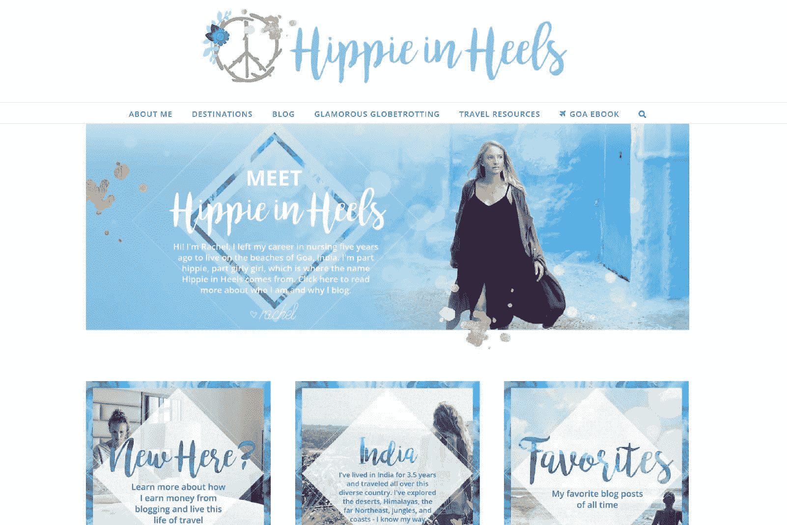](https://hippie-inheels.com/)

[Hippie in Heels](https://hippie-inheels.com/) travel blog

### 选择利基市场

有两种基本的开始方式:**旅行，然后想出如何开始一个旅行博客**，或者**计划开始一个旅行博客*，然后*进行实际的旅行**。前一种情况下人们的动机可能只是他们想要一个出口来与家人和朋友分享他们的旅行，而后者更适合那些计划在未来扩展并赚钱的旅行博客。

像[美食博客](https://kinsta.com/blog/how-to-start-a-food-blog/)一样，旅游博客多如牛毛，所以最好从选择一个利基市场开始(特别是当你最终想从旅游博客中赚钱的时候)，这将有助于你从人群中脱颖而出，因为一般的旅游博客通常不会在 SEO 工作中表现良好。

#### 旅游博客细分市场

有这么多的旅游博客利基，你可以想到和填补需求。对一些人来说，他们的定位是自然而然的。对于其他人来说，可能需要一段时间才能做出决定。在确定旅游博客的定位时，你可以问自己以下几个问题:

*   我为什么想写博客？
*   我热衷于告诉或教导别人什么？
*   我的技能、优势、兴趣和专长是什么？
*   这个话题可以写很久吗？利基不应该太宽或太窄。

如果你正在寻找灵感，这里有一些更受欢迎的旅游景点:

*   城市博客:关注你所在的城市(你不必走那么远，你可能比大多数人更了解这个话题)
*   **以国家为中心:**全国各地的目的地
*   **地区/区域:**如南美或东南亚-重点
*   **关注人口统计:**比如专门针对美国人/美国护照持有者的旅游博客
*   **预算旅行**
*   **豪华旅行**
*   **独自旅行**
*   **女性出行**
*   **出差**
*   **冒险旅行**
*   **家庭旅行**
*   **空巢老人/老年人旅游**
*   **残疾人士出行**

或者，如果你真的雄心勃勃，你甚至可以在博客上写下你的环球之旅，就像加里·阿恩特在 [Everything Everywhere](https://everything-everywhere.com/how-to-start-a-travel-blog/) 上所做的那样。他在 2007 年卖掉了自己的房子，此后一直在世界各地旅行(超过 175 个国家，还在继续)。

Travel blog around the world

为了确保有人愿意阅读你的博客，搜索你的竞争对手(以验证你的想法是否有现有的受众)。你甚至可能想利用像 [Ahrefs](https://ahrefs.com) 或 [BuzzSumo](http://buzzsumo.com/) 这样的工具来查找某个领域中最受欢迎的内容，比如“南美旅行”，从而了解其他博客作者正在写些什么。然后问问你自己，你能做得更好吗？

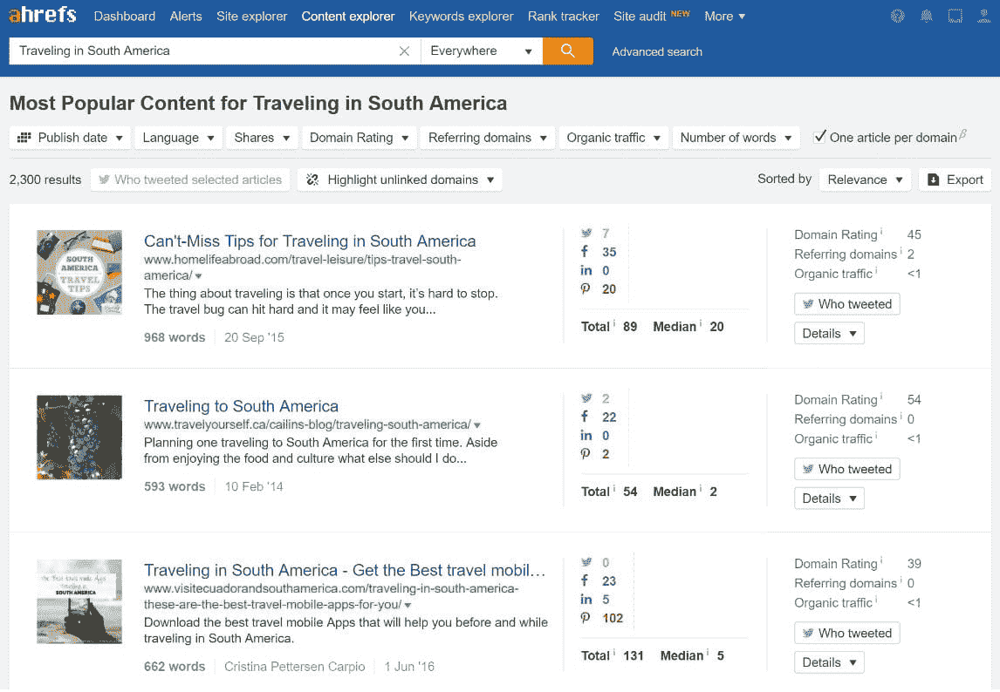

Traveling in South America

或者，你可能想尝试成为你所在领域的第一名。如果可以的话，找市场的缺口。如果你发现自己在问“为什么没有人这样做？”—自己动手！

### 品牌宣传

大多数博客将自己推销为品牌。你的品牌就是你的知名度。就是让人说“那太 XX 了！”当他们看到你的内容时。

博客品牌的方面包括:

*   你的博客名和定位
*   你的博客的整体外观:主题、字体、徽标、调色板、你使用的图片等等
*   你写作的声音

#### 想出你的博客名

你的[博客名](https://kinsta.com/blog/blog-name-ideas/)很重要，因为这也是你的博客被称为(你的品牌)的原因。虽然随着时间的推移，你可以改变你博客的很多东西，但你的名字是你应该坚持的。在做出决定之前，好好考虑一下。

不知道该给你闪亮的新旅行博客取什么名字？你可以从自己的名字开始，用这个名字写一个剧本，或者把你的名字和旅游相关的术语混合起来。决定博客名(也将是你的域名)的一些通用规则:

*   它必须易于记忆和拼写
*   也应该不会太久
*   它不得包含连字符或数字

更多小技巧可以看看我们的指南:[如何选择域名](https://kinsta.com/blog/choose-domain-name/)(脱颖而出的 8 个小技巧)。

一些值得寻找灵感的优秀旅游博客名字包括[游牧马特](https://www.nomadicmatt.com/)，它讲述了一个周游世界的男人的故事；[爱冒险的凯特](http://www.adventurouskate.com/)，它讲述了一个辞去工作去周游世界的女孩的博客；还有[国外的金发女郎](https://theblondeabroad.com/)，它讲述了一个单身的金发女旅行者的故事(你猜对了)。也有[坦克到处跑](http://www.tanksthatgetaround.com)，一个旅行博客/旅行坦克顶店。

[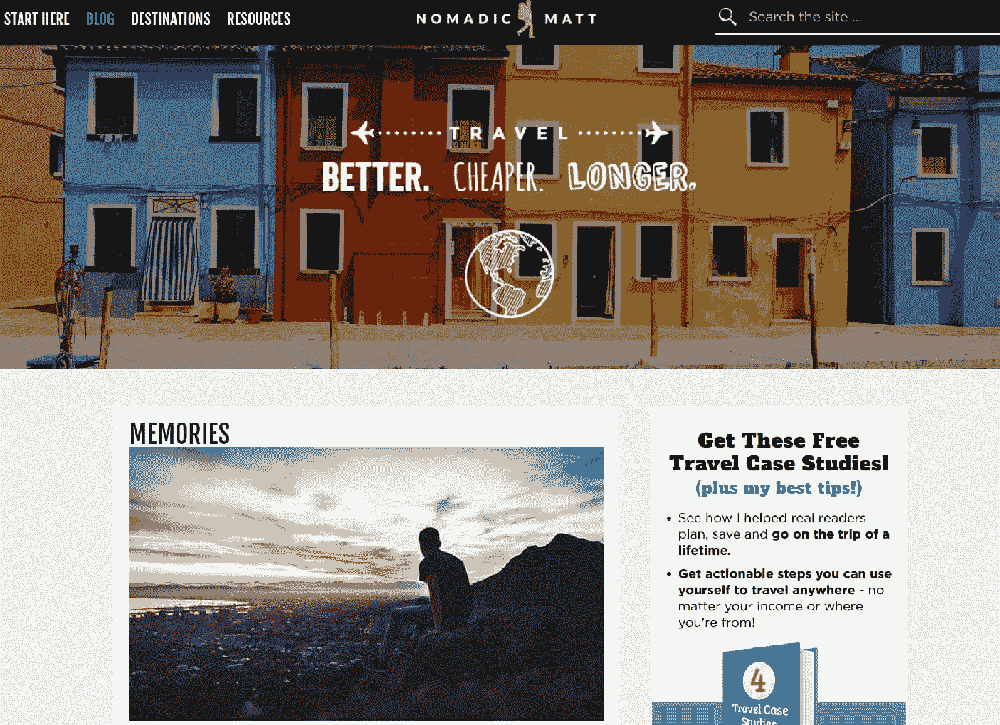](https://www.nomadicmatt.com/)

Nomadic Matt travel blog

### 建立博客

一个专业博客有三个你需要设置的技术要素:[域名](https://kinsta.com/blog/best-domain-registrar/)，博客平台和网站主机。

#### 选择博客平台

有很多免费的博客平台，比如 WordPress.com 的 T2 博主和 Tumblr。这些选项中的任何一个对个人博客来说都是好的，但是如果你计划将你的网站货币化， [**一个自托管的 WordPress 博客是你最好的选择**](https://kinsta.com/blog/wordpress-com-to-wordpress-org/) 。

其他平台有它们自己的限制，但是有了一个自托管的 WordPress 站点，你可以完全自由地定制它。如果你的旅游博客突然变得超级受欢迎，自托管 WordPress 也可以让你成长，不用担心以后不得不更换平台。阅读更多关于 WordPress.org 和 WordPress.com 的差异。

WordPress [占互联网](https://kinsta.com/wordpress-market-share/)的 43.3%，超级用户友好，有灵活的定制选项。它被用于许多不同类型的网站，无论是博客、电子商务网站、新闻门户还是商业网站。由于其开源性质，WordPress 可以免费使用，但是创建和维护一个网站[可能会花费你一些钱](https://kinsta.com/blog/wordpress-website-cost/)。

虽然你选择的[内容管理系统](https://kinsta.com/knowledgebase/content-management-system/)是免费的(假设你选择了 WordPress)，但你必须为你的[专业域名](https://kinsta.com/blog/how-much-does-a-domain-name-cost/)和虚拟主机付费。

### 选择一个可靠的网络主机

网络主机是你储存网站文件的地方。主机方案可以便宜到 4 美元/月，而且随着你的博客的增长，可以升级为你的访客提供更多的存储空间和带宽。

重要的是选择一个可靠和稳定的网络主机，没有太多的停机时间。如果你刚开始，共享主机可能会更好，这意味着你将与其他博客共享一个服务器。不利的一面是，你的博客可能会加载较慢，因为你正在与其他网站共享资源。此外，你可能要花更多的时间摆弄你的网站。

对于那些对如何开始一个旅游博客感兴趣的人来说，通过像 Kinsta 这样的公司管理的应用托管、[数据库托管](https://kinsta.com/database-hosting/)、[管理的 WordPress 托管](https://kinsta.com/blog/managed-wordpress-hosting/)有其优势。

因为您是在移动中，所以您有时间担心的最后一件事是停机或摆弄您的服务器。此外，您可能无法始终获得最佳的互联网连接来解决问题。依靠可靠的托管主机实际上可能会为你省钱。

你还可以使用各种工具，让管理你的网站变得更加容易，比如 [Kinsta 的定制仪表板](https://kinsta.com/mykinsta/)。

[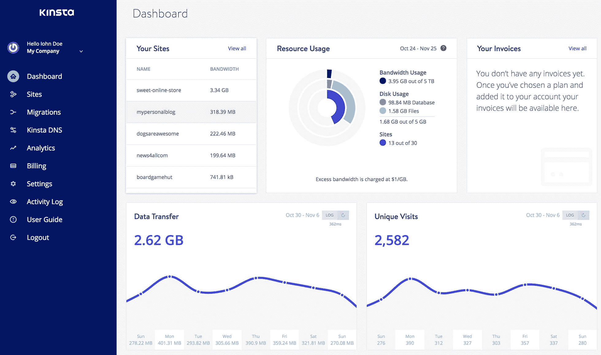](https://kinsta.com/mykinsta/)

MyKinsta

在决定网站主机时，还有一些其他的事情需要注意:

*   WordPress 优化
*   良好的客户支持
*   自动备份
*   充足的存储空间

阅读更多关于[kin sta 与其他主机](https://kinsta.com/why-us/)的不同之处。

## 注册订阅时事通讯

### 想知道我们是怎么让流量增长超过 1000%的吗？

加入 20，000 多名获得我们每周时事通讯和内部消息的人的行列吧！

[Subscribe Now](#newsletter)

### 定制博客的外观

在你为你的网络主机安装并设置了免费的 WordPress CMS 之后，你可以专注于设置你的博客的外观和感觉——这是品牌的一个重要方面。

自定义以下内容将有助于您的旅游博客成为自己的博客:

*   主题:付费和免费两种选择。有专门迎合旅游博客的主题。当你刚刚开始的时候，不要想太多你博客的主题。你可能想先从一个免费的开始[，因为不像你的博客名字](https://kinsta.com/blog/how-to-install-a-wordpress-theme/)[那样，你可以稍后再](https://kinsta.com/blog/change-wordpress-theme/)改变设计。
*   **Header:** The header is located at the top of your blog. You can use the header to share your blog’s name as text or upload a photo file with your logo.

    

    这位国外的金发女郎在她的页眉(和其他品牌元素)中使用她的标志。

    

为了让选择博客整体外观的过程更容易，你可以制作一个品牌板。品牌板包括:

*   调色板:有 2 到 3 种互补的颜色(任何更多的颜色都会让人分心)。
*   **字体**:最多 3 种。一个用于你的标志，一个用于标题，一个用于正文。
*   当访问者访问你的网站时，反映你希望你的博客唤起什么的图片。

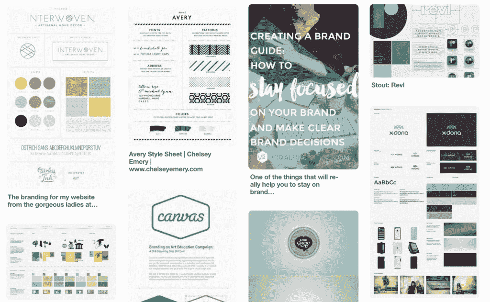

Branding boards on Pinterest

### 用插件增加博客功能

WordPress 吸引许多用户的是它提供的可定制性，这要归功于插件，你可以安装插件代码来为你的网站添加功能。因为你才刚刚开始，听从专家的意见。[博客向导](https://bloggingwizard.com/must-have-wordpress-plugins/)分享了一些必备插件，可以帮助 SEO、分析、[备份](https://kinsta.com/blog/wordpress-backup-plugins/)、[安全](https://kinsta.com/blog/wordpress-security-plugins/)和[加速你的博客](https://kinsta.com/learn/page-speed/)。

还有一些专门为旅游博客设计的插件可以考虑。其中包括:

*   [Travel Map](https://wordpress.org/plugins/nomad-world-map/): To show your readers which places you’ve been

    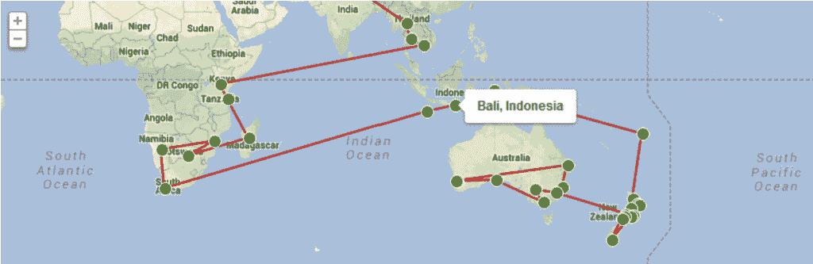

    旅游地图

    

*   [Whereabouts](https://wordpress.org/plugins/whereabouts/): Sets your location so readers can see where you’re currently at in the world

    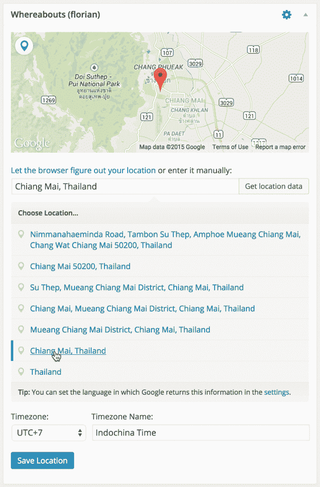

    行踪

    

你可能还想添加一个 Instagram 插件，在你的博客上展示你的旅行照片。

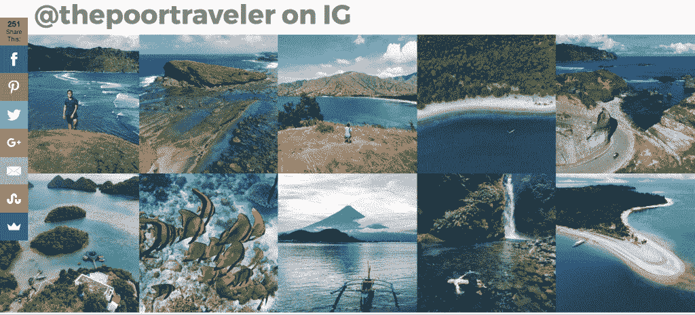

Instagram feed plugin

你也可以考虑安装代销商插件，但是我们会在后面的货币化部分详细讨论。

### 内容创作

博客最重要的部分是内容。内容不应该仅仅局限于文章(或文字)；它还可以采取照片(图形、信息图)、视频和音频([播客](https://kinsta.com/blog/wordpress-podcast/))的形式。

当然，你不应该一次开始所有这些不同类型的内容——这可能会让人不知所措。相反，随着你的博客开始成长，你可以开始添加新的内容类型，并掌握运行它的窍门。

为了获得一些灵感，我们建议您看看这些指南:

Struggling with downtime and WordPress problems? Kinsta is the hosting solution designed to save you time! [Check out our features](https://kinsta.com/features/)

[如何成为一名单人内容营销忍者](https://kinsta.com/blog/content-marketing-ninja/)

如何用 WordPress 创建经久不衰的内容

[比](https://kinsta.com/blog/content-length/)内容长度更重要的 5 件事

#### 内容

写作没有对错之分。许多人采用日记的写作方式——告诉人们他们的一天或经历，而有些人则喜欢如何指导文章类型。

最好的博客是那些提供混合内容类型的博客。许多阅读旅游博客的人是在寻找你能给他们的关于一个地方的信息，而你独特的声音(这增加了博客的品牌部分)是吸引读者的原因。

如果你计划在建立你的旅行博客后去旅行，你可以计划写什么内容，什么地方有特色，什么角度可以写。理想情况下，在发布之前，你至少要准备好 15 篇文章。这将让你有时间在下一部作品中持续发布内容，同时让读者有足够的时间留下来阅读。

#### 为 SEO 优化内容的技巧

谷歌对内容长度和排名没有硬性规定，但一般来说，越长越好。

虽然正确的页面搜索引擎优化的细节超出了本文的范围，但是这里有一些快速设置成功内容的方法:

*   使用标题来组织你的文章(并战略性地使用关键词)
*   写一些能激起人们好奇心的标题，这样他们就会分享你的文章，但是不要被点击诱惑(意思是，用伟大的内容真实地支持文章)。另外，按照人们搜索的方式写标题。
*   在 URL slugs 中使用关键字

对于更高级的 SEO 研究(仍然是初学者友好的)，查看我们的 [WordPress SEO 清单](https://kinsta.com/blog/wordpress-seo/)和一些推荐的 [SEO 插件](https://kinsta.com/blog/best-seo-plugins-for-wordpress/)你应该开始。

Asher Fergusson 是一位成功的旅游博客作者，他和 Kinsta customer 说，他在有机搜索排名中快速增长的秘密是进行了一项有争议的研究。在与妻子和 10 个月大的儿子在巴黎经历了一次噩梦般的 Airbnb 经历后，他决定回顾 1000 多个恐怖故事，看看什么最有可能出错。由此产生的文章标题为，“[Airbnb 安全吗？](https://www.asherfergusson.com/airbnb/)”登上了 Reddit 的头版，并被数十家主流媒体转载。这增强了他整个网站的搜索引擎优化能力。

### 摄影

人是视觉动物，这就是为什么像 Instagram 和 Pinterest 这样的平台如此成功并且快速增长的原因。

拍摄精彩的照片或视频，让浏览者感觉他们就在那里或者想要在那里，会吸引更多的访问者来你的博客。这些照片还将用于您的博客推广；标题吸引人的漂亮照片吸引了像前面提到的 Pinterest 这样的网站上的人们。

当你考虑图片的时候，不要忘记[优化你的图片](https://kinsta.com/blog/optimize-images-for-web/)，这既是为了**性能也是为了 SEO** 。你不能只是上传全分辨率的照片到你的博客，然后期望它们加载得很快。你需要一个优化工具或插件的帮助。给你的文件起一个有意义的名字(并且要简短)，因为谷歌在为谷歌图片搜索选择索引时会考虑这些东西。哪些工具以及如何展示你的照片你可以阅读我们的指南: [8 个最好的 WordPress 照片图库插件](https://kinsta.com/blog/wordpress-photo-gallery-plugins/)。

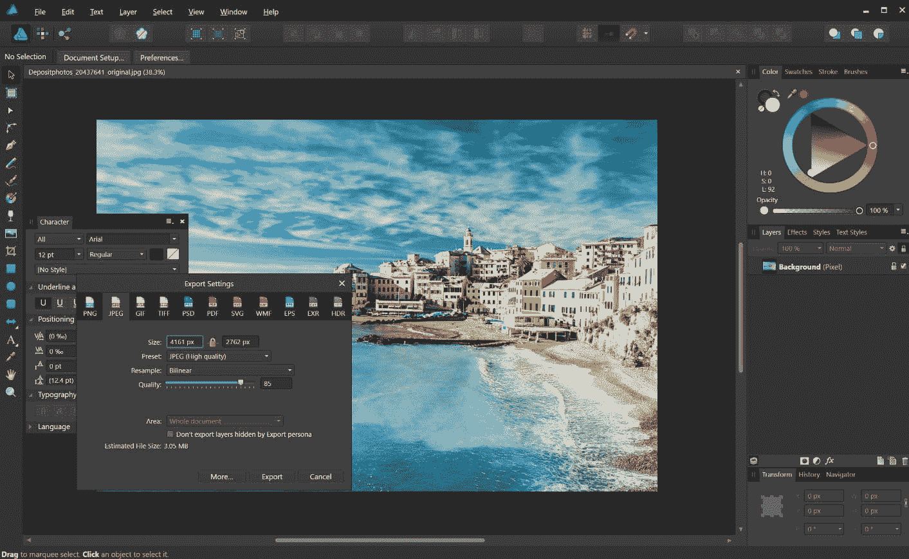

Optimize photos for travel blog

### 促进

推广你的博客有三种主要方式:

*   社交媒体:推广你的旅游博客最简单的方法是通过你自己的网络，但拥有数亿月活跃用户的社交媒体也因定向广告而闻名，这意味着它可以帮助你的内容到达最可能关心它的人。hand laugh Only 的 Instagram 是一个美丽的旅行照片日记的绝佳例子。另一个可以推广你的内容的平台是 Pinterest。我们写了一份关于最好的 [Pinterest 营销技巧](https://kinsta.com/blog/pinterest-marketing/)的详细指南。

Travel photos on Instagram (Img src: [handluggageonly](https://www.instagram.com/HandLuggageOnly/))

*   传统媒体:登上报纸和杂志是很好的曝光率，即使对于一个网络实体来说也是如此。事实上，这就是人气博主游牧马特迅速增加粉丝的方式。
*   搜索引擎:最大的潜在流量来源，但也伴随着很多竞争。

写客座博文是从更著名的旅游博客获得反向链接的另一种方式。另一方面，[收集电子邮件地址](https://kinsta.com/blog/wordpress-lead-generation/)并发送电子邮件简讯是获得更多浏览量的有效方式，因为它让你与订户建立了直接联系(不像社交网络，社交网络可能会限制对现有追随者的接触)。

可以说是最受欢迎的旅游博客 Nomadic Matt 认识到了这些策略的潜力，但却选择了不同的方向。他在博客上发表客座博文，为关于如何省钱旅行的博客融资。何在创业播客上发表客座博文，讲述他是如何通过自己的旅游博客创业的。

这些策略让他与众不同，同时也将他的网站介绍给了不同的受众。

### 旅游博客货币化

有几种方法可以让你的旅游博客赚钱，但是当你开始的时候，会很困难。许多旅行者(或数字游牧者)在旅途中工作时维持旅行生活方式的方式包括接受虚拟助理的工作，从事自由写作，咨询或提供其他类型的服务。

#### 从你的旅游博客赚钱的方法

除了利用你的个人品牌为你可能感兴趣的服务争取客户，还有许多其他方式从你的旅游博客中赚钱:

*   **Affiliate marketing***:* There are affiliates for everything! Travel accommodations, travel insurance, travel gear and even web hosting. Every time someone clicks on the link and makes a successful purchase, you earn a small commission. While many bloggers have made tons of money using this tactic, it’s wise to note that merchants pay a relatively small amount for every sale made, so expect that you won’t make a lot—especially when you’re just starting out and don’t have a lot of traffic (here’s [how to drive more traffic to your website](https://kinsta.com/blog/how-to-drive-traffic-to-your-website/)).

    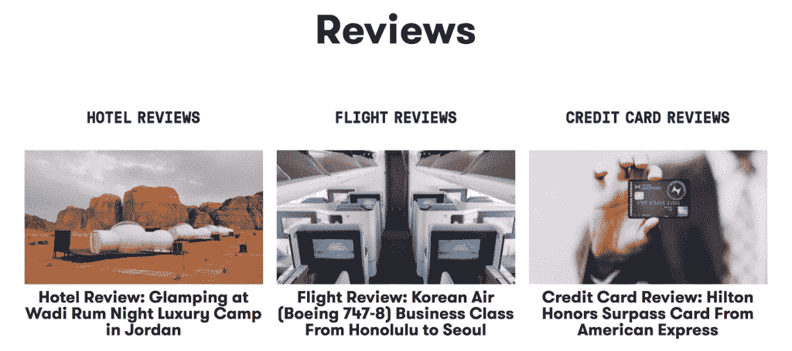

    [【The Points Guy】](http://www.thepointsguy.com)是一个旅游博客，从酒店预订、信用卡评论等方面的联盟营销中赚钱。

    

*   **Sponsored posts***:* Some companies will ask you to write a sponsored post in exchange for money, but the downfall is, your readers may find this ingenuine.

    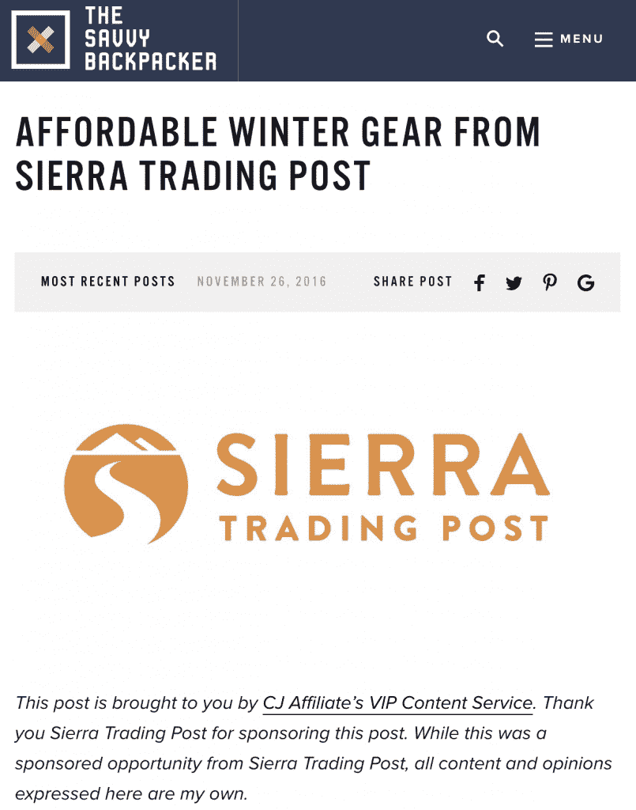

    [上一篇赞助帖子的例子精明的背包客](https://thesavvybackpacker.com/)

    

*   **赞助旅行**:与私人公司或品牌和旅游局合作。旅游局通常希望媒体鼓励更多的人来他们的国家旅游。他们通常会支付食物，住宿，活动，有时甚至机票。由于他们希望由此产生的帖子能够获得广泛的受众，这可能只会提供给那些拥有更大追随者的人。一些公司可能还会邀请你参加赞助旅行来发布他们的产品——一切都是付费的。
*   **Display advertising**: Companies pay for ad space on blogs; ads can be placed on sidebars, headers or footers. This monetization strategy is the easiest to setup but they don’t pay that much (most people are unresponsive to ads). Another disadvantage to display advertising is that it relies entirely on high-traffic volume to find success. For those just starting out, this method won’t be a high-earner.

    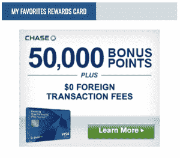

    Take a look at [Johnny Jet](https://www.johnnyjet.com/) for ideas to incorporate display ads.

    

*   **Make and sell digital products***:* Many bloggers offer digital products and they are a good way to make money. Digital products offer an unlimited supply of inventory with a minimal cost associated with production (you can even outsource the creation of digital assets). Even if your products are priced low, as long as they sell, you’ll get recurring/passive income. Common samples of these products include ebooks and online courses. [Easy Digital Downloads](https://kinsta.com/blog/easy-digital-downloads/) is our favorite plugin you can use to sell your ebooks and guides.

    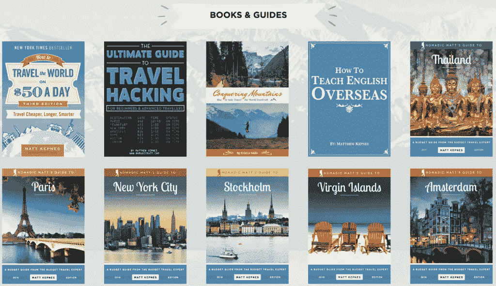

    游牧民族马特已经将数码产品创作归结为一门科学。

    

*   **研习班** *:* 在发展了一批追随者并被认可为专家后，你可能会被邀请参加收费的演讲或研习班。

博客还没做够？当你继续发展你的旅游博客，希望有一天它能在经济上支持你的时候，看看这些网上赚钱的 65+ [方法。](https://www.ryrob.com/make-money-online/)

如果你想开始你的旅游博客，Firstsiteguide 的这个指南包括了更多的想法。

## 如何开始一个旅游博客

旅游博客是记录和分享你对旅游的热爱的好方法，但它也带来了潜在的收入。首先决定你写博客是出于兴趣还是利益，然后遵循这些指导方针来帮助你具体如何开始一个旅游博客。

当谈到如何开始一个旅游博客的问题时，你有什么建议？在 [@Kinsta](http://www.twitter.com/kinsta) 发推文，我们将分享最好的见解！或者在评论中把它们放在下面。

* * *

让你所有的[应用程序](https://kinsta.com/application-hosting/)、[数据库](https://kinsta.com/database-hosting/)和 [WordPress 网站](https://kinsta.com/wordpress-hosting/)在线并在一个屋檐下。我们功能丰富的高性能云平台包括:

*   在 MyKinsta 仪表盘中轻松设置和管理
*   24/7 专家支持
*   最好的谷歌云平台硬件和网络，由 Kubernetes 提供最大的可扩展性
*   面向速度和安全性的企业级 Cloudflare 集成
*   全球受众覆盖全球多达 35 个数据中心和 275 多个 pop

在第一个月使用托管的[应用程序或托管](https://kinsta.com/application-hosting/)的[数据库，您可以享受 20 美元的优惠，亲自测试一下。探索我们的](https://kinsta.com/database-hosting/)[计划](https://kinsta.com/plans/)或[与销售人员交谈](https://kinsta.com/contact-us/)以找到最适合您的方式。