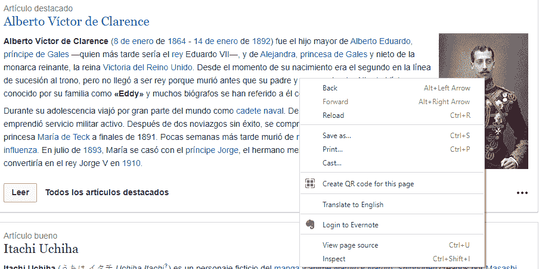
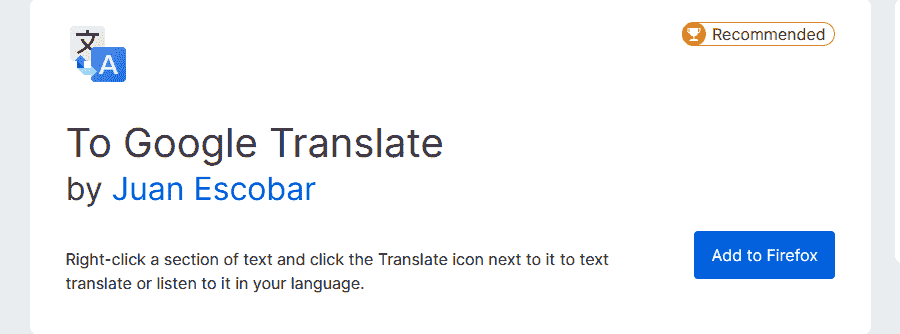
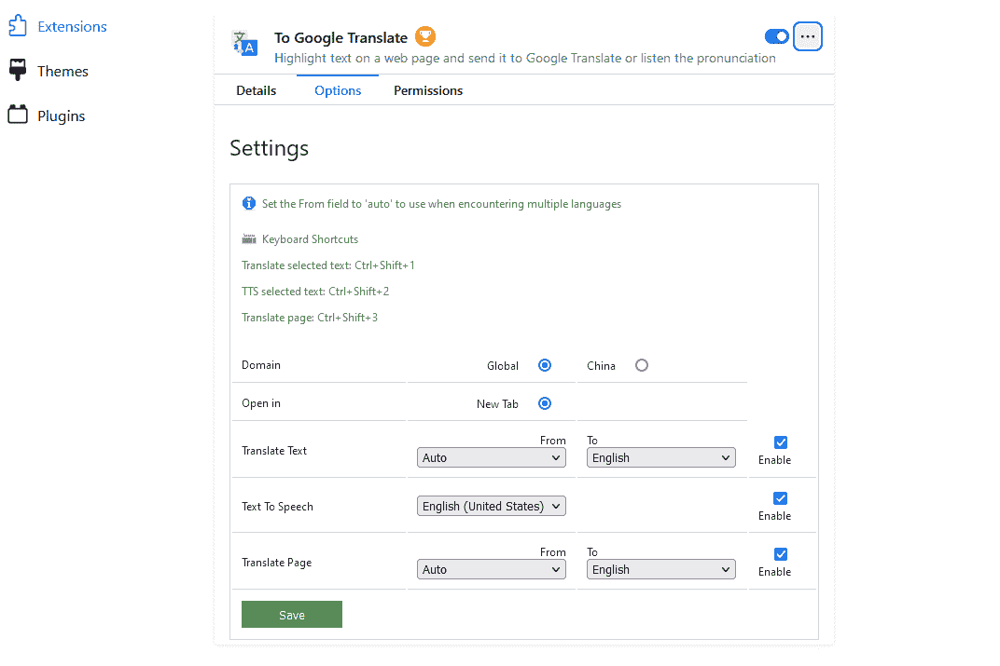
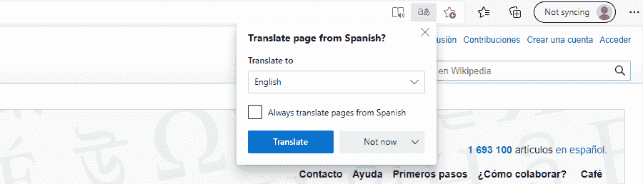
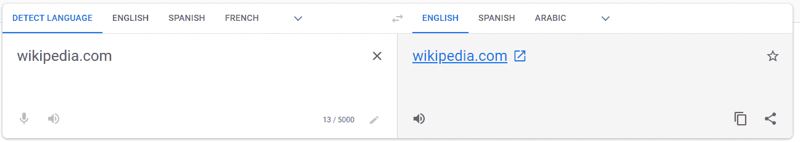
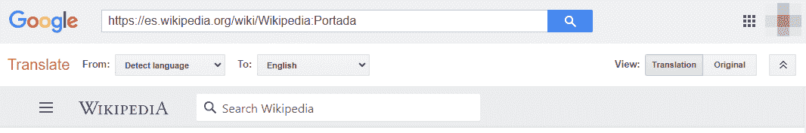
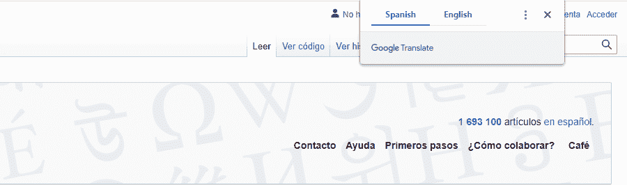
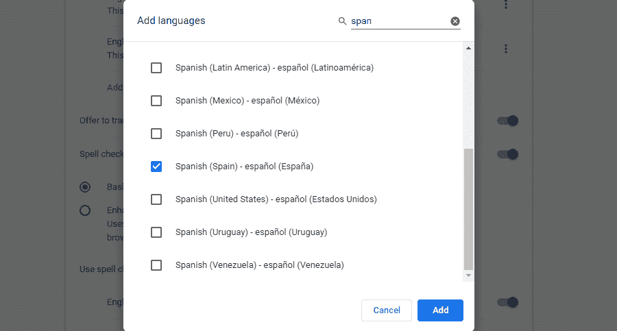
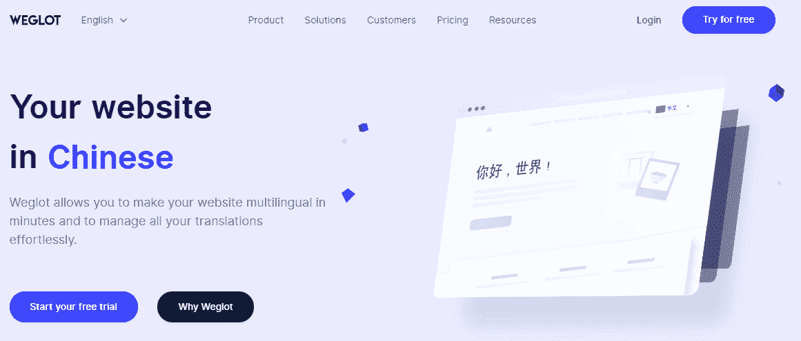

# 如何在 2022 年翻译一个网站(9 个简单的方法)

> 原文：<https://kinsta.com/blog/how-to-translate-a-website/>

无论你使用互联网做什么，在某些时候你都可能需要使用一个不是你母语的网站。此外，如果你拥有一个网站，你可能会有兴趣让它成为多语言网站来扩大你的受众。然而，如果你不是一个通晓多种语言的人，这两项任务似乎同样不可能完成。

幸运的是，有很多翻译网站的资源。无论您需要翻译您正在浏览的网站，还是让非英语用户也能访问您的网站，您都可以使用一些基本工具来实现您的目标。

在这篇文章中，我们将看看你可能需要翻译网站的一些原因。然后我们将分享九种方法，使用不同的浏览器和设备。

我们开始吧！

## 为什么你需要翻译一个网站

虽然你可能通常不会访问非母语的网站，但如果需要的话，知道如何翻译网页是个好主意。例如，如果你正在做一些研究，你可能会碰到其他语言的资料。此外，你可能想从另一个国家的商店购买产品。

如果你有一个网站，你可以考虑让它多语言化。如果你的网站有不同的语言版本，你可以吸引更多的观众。除了让你的访客生活更轻松，这也有助于建立信任。

翻译你的网站也是[搜索引擎优化(SEO)](https://kinsta.com/cheatsheets/wordpress-seo-checklist/) 的有效策略。你可以添加到你的网站上的任何可以改善用户体验(UX)的东西都会对 SEO 产生积极的影响，提供多种语言也不例外。

## 如何翻译网站(9 种方法)

现在，您已经熟悉了一些可能需要翻译的情况，让我们来看看如何进行翻译。

### 1.如何在谷歌浏览器中翻译一个网站

使用[谷歌 Chrome](https://kinsta.com/blog/most-secure-browser/#1-chrome) 翻译一个网站非常简单。

当你进入一个非英文页面时，点击地址栏中的**翻译该页面**按钮打开一个弹出窗口。然后，选择英语选项:

谷歌浏览器中弹出的翻译。

如果您愿意，可以右键单击您想要翻译的文本，然后选择**翻译成英语**:

如何在谷歌 Chrome 中右键点击文本进行翻译。

这就是你需要做的。在浏览网站时，您可以重复使用这两种方法。

### 2.如何在 Firefox 中翻译网站

与 Chrome 不同， [Firefox](https://kinsta.com/blog/most-secure-browser/#3-firefox) 没有内置翻译功能。要使用火狐翻译网站，你需要从添加一个[火狐扩展](https://kinsta.com/blog/firefox-extensions/)开始。

Mozilla 向谷歌推荐了[翻译扩展](https://addons.mozilla.org/en-US/firefox/addon/to-google-translate/):

火狐浏览器的谷歌翻译扩展。

点击**添加到 Firefox** 按钮安装扩展。接下来，你会看到**选项**屏幕，在这里你可以选择特定的语言。

如果您需要翻译不同的语言，您可以将**翻译文本**字段设置为**自动**。设置好偏好后，点击**保存**:

设置为谷歌翻译。

下一次你访问一个外语网站时，你应该能够右击文本并选择**翻译这个页面**。文本应该在谷歌翻译中打开，可以用你喜欢的语言阅读。

### 3.如何在 Safari 中翻译网站

Safari 的翻译功能处于测试阶段，它没有其他浏览器那么多可用的语言。然而，你应该仍然能够翻译你遇到的许多网页。

如果 [Safari](https://kinsta.com/blog/most-secure-browser/#2-safari) 可以为你翻译网页，它会在**智能搜索**栏显示一个**翻译**按钮。由于这项功能仍处于测试阶段，你可以使用同样的翻译菜单向 Apple 报告问题。

### 4.如何在 Microsoft Edge 中翻译网站

您可以使用安装在浏览器中的 Translate for Microsoft Edge 来翻译 [Microsoft Edge](https://kinsta.com/blog/most-secure-browser/#4-edge) 中的页面。

与 Chrome 类似，当你打开一个页面时，浏览器会提示你:

微软 Edge 中的“翻译页面”提示。

当流程准备就绪时，地址栏将简要显示已翻译的单词**。**

 **如果您希望 Edge 在每次遇到这种语言时自动生成翻译，您可以从框中选中**总是翻译页面** **。**

如果弹出窗口没有出现，您也可以点击地址栏中的**翻译**图标:

微软 Edge 中的“翻译”图标。

点击此图标将为您提供自动翻译该语言页面的选项。当遇到其他语言的网站时，您可以重复相同的过程。

### 5.如何用谷歌翻译翻译整个网站

如果你想一次翻译整个网站，你可以使用[谷歌翻译](https://translate.google.com/)。

## 注册订阅时事通讯

### 想知道我们是怎么让流量增长超过 1000%的吗？

加入 20，000 多名获得我们每周时事通讯和内部消息的人的行列吧！

[Subscribe Now](#newsletter)

在左边的文本框中输入您想要翻译的网站的 URL。您应该会在正确的文本框中看到 URL 的可点击版本:

Putting a URL in Google Translate to translate the entire site.

从右侧文本框上方选择目标语言。点击链接后，您应该会看到该网站的完整翻译版本。

您可以使用右上角的按钮在翻译版本和原始版本之间切换:

谷歌翻译工具栏。

您也可以使用此工具栏在语言之间切换。如你所见，翻译整个网站是一个快速简单的过程。

### 6.如何在 Chrome 中自动翻译页面

如果你经常浏览外语网站，你可能需要 Chrome 自动翻译。您可以通过点击浏览器窗口右上角的三个点并选择**设置**来启用该功能。

从这里，您可以导航到**高级** > **语言**。您可能需要单击“语言”右侧的箭头来查看所有选项:

Chrome 中的语言设置。

有两种方法可以设置自动翻译。如果您打开**提供翻译非您阅读的语言的页面**选项，您将看到一个[弹出窗口](https://kinsta.com/blog/wordpress-lead-generation/#our-shortlist-of-the-best-wordpress-lead-generation-plugins-in-2019)提供翻译，无论您何时访问非您定义的语言的页面:

弹出 Chrome 翻译。

如果除了英语之外还有其他语言你不想翻译，你可以在这里添加。为此，选择**添加语言**。滚动或搜索所需语言，并勾选旁边的框:

如何给 Chrome 添加语言。

选择目标语言后，点击**保存**按钮。当您导航到您列出的任何语言的网站时，您不会在屏幕上看到翻译弹出窗口。
T3】

### 7.如何在 Android 移动设备上翻译网站

使用 Chrome 在移动设备上翻译[网站与在桌面设备上翻译不同。你会在屏幕底部看到一个显示语言选项的栏，而不是弹出窗口。](https://kinsta.com/blog/google-mobile-first-index/)

需要一个给你带来竞争优势的托管解决方案吗？Kinsta 为您提供了令人难以置信的速度、一流的安全性和自动伸缩功能。[查看我们的计划](https://kinsta.com/plans/?in-article-cta)

一旦您选择了**英语，**您应该能够阅读文本:

安卓的翻译弹出。

如果你没有看到这个条，你也可以点击屏幕右上角的三个点来打开一个菜单。然后选择**翻译**，应该可以查看英文文本了。

### 8.如何在 iPhone 上翻译网站

接下来，让我们看看如何使用 Safari 翻译 iPhone 上的网站。

当你访问一个外语页面时，你可以点击地址栏中的 **aA** 按钮打开一个菜单。在那里，你应该看到**翻译成英语**选项。

如果这是您第一次执行此操作，您可能会收到提示，要求您启用测试版。此外，请记住，与其他浏览器相比，Safari 可以翻译的语言数量有限。

### 9.如何让你的网站多语言化

如果你想让你的网站多语言，有多种选择来完成这项任务。

当然，一个简单的方法是将工作外包。然而，如果你聘请专业翻译，这种方法可能会很贵。

如果有一个真正方便的方法来翻译你的网站，那一定是通过[传送这个](https://conveythis.com)！它是 WordPress 目录中翻译最多的语言插件(超过 38 种语言的贡献)，并且增长迅速。

ConveyThis

这使得集成到一个 WP 网站并激活多达 100 多种语言变得非常简单。

这使用自动机器翻译来翻译你的整个网站，并增加了一个语言切换器按钮。所以在最初的几分钟内，你就已经有了一个有效的、SEO 友好的多语言网站。

它有免费和付费两种方案。免费计划可以让你将多达 2500 个单词翻译成一种语言，付费计划采用 SaaS 式的计费方式，这意味着只要你想使用这项服务，你就需要继续付费。

付费计划一种语言每月 7.50 美元，最多 1 万个单词。

另一方面， [Polylang](https://wordpress.org/plugins/polylang/) 是一个免费的 WordPress 插件，你可以用它来翻译你的网站。你不仅可以为文章和页面添加翻译，还可以创建不同版本的[菜单](https://kinsta.com/blog/wordpress-custom-menu/)和类别。

poly lang 翻译插件。

如果你想要一个更快的方法，并且不介意为服务付费，你可以试试 [Weglot](https://wordpress.org/plugins/weglot/) 插件。这个工具自动检测和翻译你的内容。然而，你必须按月付费才能使用这个插件。

Weglot 翻译插件。

关于设置这些解决方案的详细步骤，你可以查看我们的[终极 WordPress 多语言指南](https://kinsta.com/blog/wordpress-multilingual/)。我们也分享一些其他的工具，你可以用它们来使你的网站多语言化。

如果您是 Kinsta 的客户，您会希望利用我们的 [IP 地理定位功能](https://kinsta.com/help/ip-geolocation/)。该功能可以根据用户的 [IP 地址](https://kinsta.com/blog/dedicated-ip-address/)自动检测用户的地理位置。多亏了这个工具，你可以根据访问者的位置自动定制他们看到的内容，包括语言。

你不必是一个通晓多种语言的人，也可以开始为国际访问者翻译你的网站。💬在本指南中了解更多信息🌎

## 摘要

无论你是需要建立一个多语言的 WordPress 网站，还是想从其他国家购买，翻译网页都是一项方便的技能。有了大量可用的工具，您应该可以使翻译过程顺利进行。

谷歌翻译是各种情况下的绝佳选择。如果你在翻译自己的网站，Polylang 和 Weglot 都是不错的选择。

开始翻译！

关于如何翻译网站，你有什么问题吗？请在下面的评论区告诉我们！

* * *

让你所有的[应用程序](https://kinsta.com/application-hosting/)、[数据库](https://kinsta.com/database-hosting/)和 [WordPress 网站](https://kinsta.com/wordpress-hosting/)在线并在一个屋檐下。我们功能丰富的高性能云平台包括:

*   在 MyKinsta 仪表盘中轻松设置和管理
*   24/7 专家支持
*   最好的谷歌云平台硬件和网络，由 Kubernetes 提供最大的可扩展性
*   面向速度和安全性的企业级 Cloudflare 集成
*   全球受众覆盖全球多达 35 个数据中心和 275 多个 pop

在第一个月使用托管的[应用程序或托管](https://kinsta.com/application-hosting/)的[数据库，您可以享受 20 美元的优惠，亲自测试一下。探索我们的](https://kinsta.com/database-hosting/)[计划](https://kinsta.com/plans/)或[与销售人员交谈](https://kinsta.com/contact-us/)以找到最适合您的方式。**