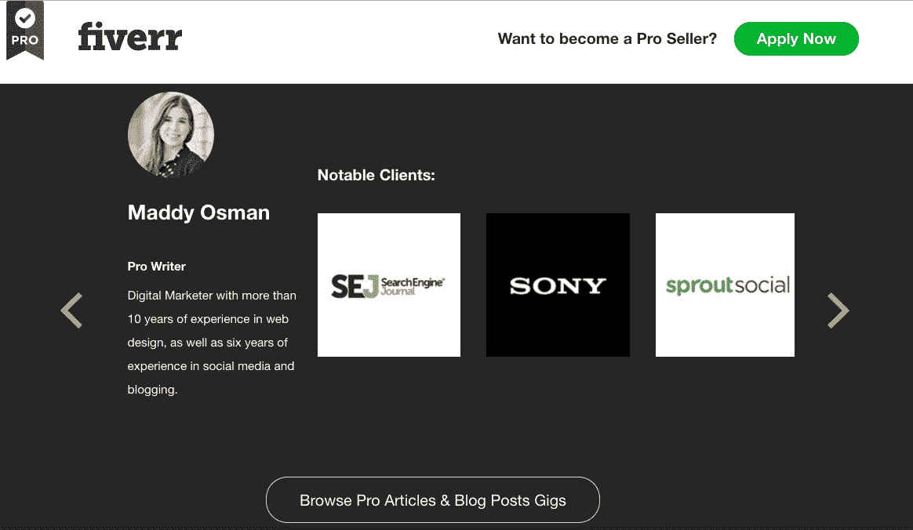
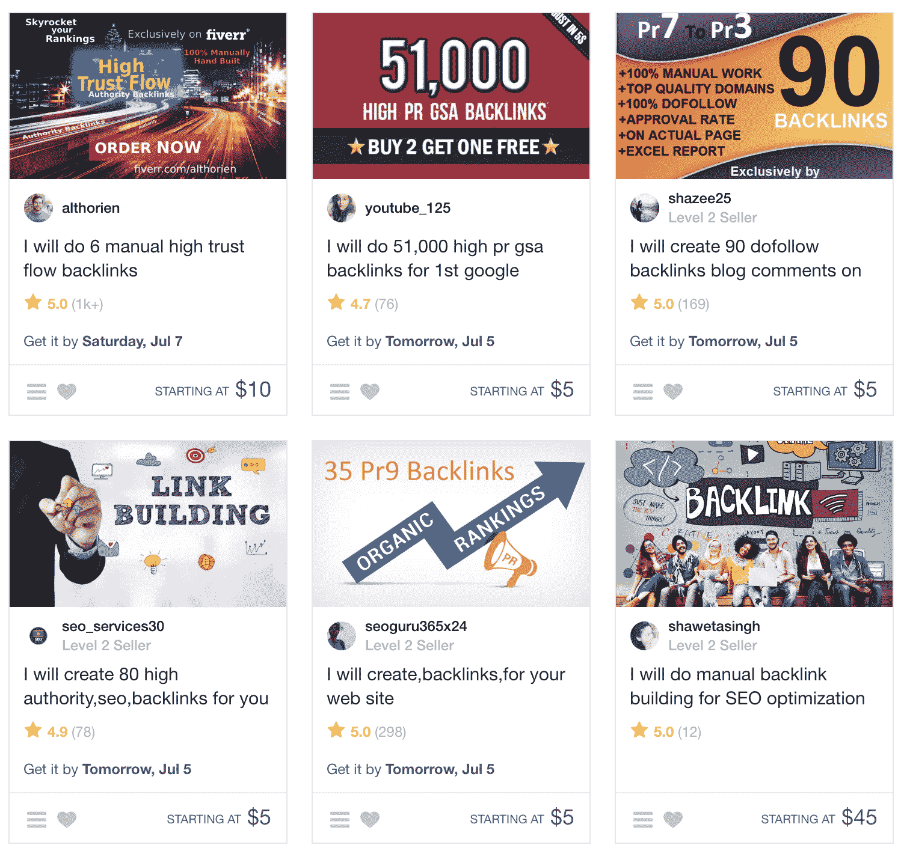
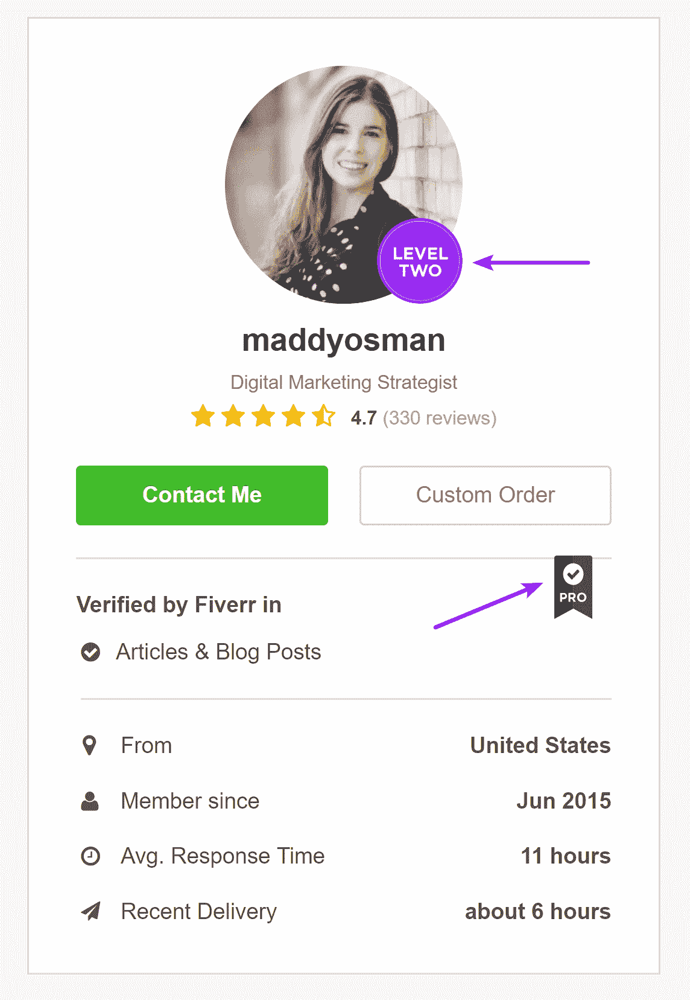
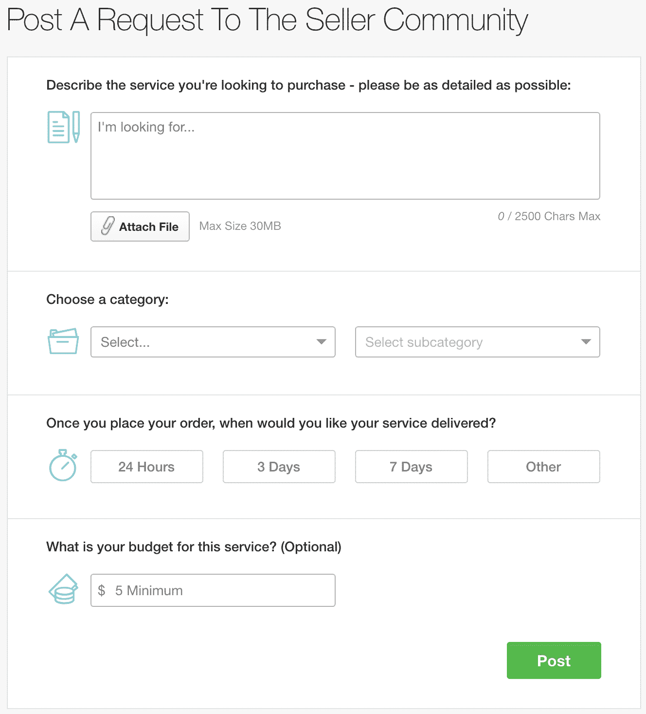

# 如何使用 Fiverr 减少业务繁忙

> 原文：<https://kinsta.com/blog/how-to-use-fiverr/>

Fiverr 名声不好——尤其是自由职业者。该平台与这一群体有着某种程度的负面联系，因为他们感到有压力去创造可以以 5 美元起价出售的服务。可以肯定的是，自市场最初成立以来，很多东西已经发生了变化——包括对起价 5 美元的需求。

即使你不是在寻求帮助，你也可以使用 Fiverr 获得许多有趣的 T2 服务和怪异的 T4 服务。像 Groupon 一样，该平台是一个发现引擎，可以发现你可能没有意识到自己想要的东西。如果你沉迷于购物，这可能是一把双刃剑！

我使用 Fiverr 已经很多年了，既是卖家，最近也是买家。我在这个平台上赚了 10，000 多美元，还重新投资了几千美元到 Fiverr，从自由职业者的市场上购买服务。

在这两种情况下，我都为自己、购买我服务的人以及我向其购买服务的人创造了双赢的局面。CodeinWP 分享了他们从 Fiverr 购买服务的技巧，但我认为还有更多要说的。

让我们从为什么你目前对 Fiverr 的看法可能是错误的开始讨论如何使用 Fiverr。

*   [使用 Fiverr 的好处](#pros-of-fiverr)
*   [五月外包什么](#outsource-fiverr)
*   [如何在 Fiverr 上授权](#delegate-fiverr)
*   [五个月内不外包什么](#what-not-to-outsource-fiverr)
*   如何找到好的卖家&演唱会
*   [如何识别低质量的演唱会](#spot-low-quality-fiverr-gigs)

## 使用 Fiverr 的好处

首先，也是最重要的，不再需要在 5 美元的低价位开始 5 个订单。对于自由职业者来说，这意味着不再需要将服务分解成小的组成部分来使其物有所值——你可以构建出价值数百美元(或者更多！).

为了吸引更多的专业自由职业者加入这个平台，Fiverr 最近发布了他们市场的新版本: [Fiverr Pro](https://www.fiverr.com/pro) 。与市场主要版本上的 Fiverr 卖家不同，Fiverr Pro 卖家由 Fiverr 员工单独审查。最终结果？按需访问自由职业者，他们拥有你可能熟悉的品牌的业绩记录。

Fiverr profile

如果你仍然不相信 Fiverr 关心他们的自由职业者，考虑一下他们最近收购的[和 CO](http://www.and.co) 。

CO 是面向自由职业者的一体化业务管理工具，包括创建合同、跟踪时间和管理费用的功能。自从 Fiverr 收购 AND CO 后，自由职业者可以无限制地免费使用工具，而这些工具以前是由付费的月会员来控制的。

Free tools for freelancers

使用这些工具你甚至不需要成为五元卖家(或买家)——它们现在对每个人都是免费的。

是的，仍然有 5 元起价的 5 元演唱会。这些低成本演出中的许多都归功于来自世界低生活成本地区的卖家。

虽然你可能会对外包工作有道德问题，这种外包会剥夺你自己国家的繁荣，但我认为这是一个帮助全世界人民平等参与竞争的机会。一些我最喜欢的 Fiverr 卖家向我滔滔不绝地讲述 Fiverr 对于让家人有饭吃是多么重要——这绝对值得支持。

## 五元外包什么

接下来我们将讨论如何使用 Fiverr:对零工经济的介绍。Fiverr 的市场提供广泛的服务，打包成“演出”。

Gigs 往往是一次性项目，但 Fiverr 的系统也为多个“里程碑”交付提供功能。这意味着自由职业者可以有效地使用 Fiverr 来创建预聘服务，尽管这不一定是规范。

你可以在 Fiverr 上买到一些对商业有害的音乐，我们将在本文后面讨论。

从更积极的角度来看，以下是 Fiverr 上经常出现的主要演出类别:

*   平面设计(我与一位角色设计师合作，为我的电子商务业务设计 t 恤。)
*   数字营销(我雇了一个 Fiverr 卖家帮我在 [Mailchimp](https://kinsta.com/blog/how-to-use-mailchimp/) 上配置一些高级功能。)
*   社会化媒体
*   [视频编辑/制作](https://kinsta.com/blog/free-video-editing-software/)
*   WordPress 任务
*   写作/校对
*   数据输入
*   极简主义的标志设计(如果你足够努力的话，Fiverr 上有一些很有天赋的标志设计师。看看 Woorkup 是如何将他们的[博客的标识外包给](https://woorkup.com/minimalist-logo/)的。)

Fiverr 的公关团队认为，从 2017 年第四季度开始，以下演出将进入 2018 年 Q1，且呈上升趋势(在此之前已经有很高的需求):

*   [真人解说](https://www.fiverr.com/categories/video-animation/live-action-videos?source=category_tree)(上涨 507%)
*   [短视频广告](https://www.fiverr.com/categories/video-animation/short-video-ads?source=category_tree)(增长 154%)和[视频广告活动](https://www.fiverr.com/categories/online-marketing/online-video-marketing/video-ad-campaigns?source=category_filters)(增长 88%)
*   [影响者营销:战略&研究](https://www.fiverr.com/categories/online-marketing/influencer-marketing/strategy-research?source=category_filters)(上升 103%)
*   [电子商务营销:产品列表](https://www.fiverr.com/categories/online-marketing/e-commerce-marketing/product-listings?source=category_filters)(上升 91%)
*   [游戏](https://www.fiverr.com/categories/lifestyle/gaming?source=category_tree&filter=rating):创建游戏或托管 Twitch 频道(增长 70%)
*   移动应用&网络:将网站转化为应用(增长 62%)
*   登陆页面(上升 60%)
*   [演示文稿](https://www.fiverr.com/categories/business/online-presentations?source=category_tree)(上升 52%)
*   [品牌服务](https://www.fiverr.com/categories/business/branding-services?source=category_tree)(增长 47%)

如果你仍然不确定从哪里开始使用 Fiverr 来帮助你的业务，从 Sitepoint 关于 Fiverr gigs 如何每月为他们节省数千美元的见解中获取灵感。
T3】

## 如何在 Fiverr 上授权

我在这个平台上取得成功的主要经验是制定*战略*。

具体来说，你应该对成功是什么样子以及如何达到成功有一个清晰的概念。你应该*也*知道失败是什么样子，以及如何到达那里。

一般来说，你希望使用 Fiverr 来帮助你完成任务——而不是定义你的整体策略。这样，您将能够在订单完成后有效地判断成功与否。

但是，即使你知道自己想要什么，如果你没有太多授权的经验，也很难进行有效的沟通。

了解*如何*和*为什么*授权会有所帮助。根据一般经验，考虑委派以下任务:

*   **耗时**:像数据录入。
*   **低值**:喜欢调度社交媒体。
*   **专业/临时需求**:如税务准备。

弄清楚如何使用 Fiverr 对于前两个任务类别特别有帮助。作为一名企业家，你可能会试图保持忙碌来支持你的“忙碌”心态。

但是忙碌并不是 T2 的一种荣誉。

稍微反省一下，你可能会发现很多你可以在不影响盈利的情况下委派的任务。毕竟，成功的授权可以腾出时间和精力去做更多你喜欢做的工作(并获得报酬！).在这一点上，将低价值和耗时的任务外包给 Fiverr 可以让你专注于只有你才能做的事情。

在决定将哪些任务外包给 Fiverr 时，请记住这个委托框架——尤其是在决定哪些*任务不适合外包时。*

## 注册订阅时事通讯

### 想知道我们是怎么让流量增长超过 1000%的吗？

加入 20，000 多名获得我们每周时事通讯和内部消息的人的行列吧！

[Subscribe Now](#newsletter)

### 如何使用 Fiverr:与卖家沟通

一般来说，在下订单之前，一定要联系卖家*，尤其是如果你想要的东西似乎稍微超出了他们的工作范围(或者不同于他们的标准包装选项)。*

一旦你决定了订单的范围，你必须采取一些额外的步骤来确保一个理想的最终产品:

*   **填写所有订单要求**。不要试图跳过这些东西，即使你已经和卖家开始了对话。重复订单中的所有内容，这样当你的卖家为你完成工作时，就可以很容易地参考。完整地回答*每一个*问题，这样当卖家交付订单时，你就不会有任何疑问。
*   **提供看起来像你最终项目的资源**。你可以引用一个正在扼杀它的竞争对手(前提是你不想直接复制他们！)或者另一个你热爱的项目例子。无论哪种方式，你都是在向你的卖家提供最终交付的质量基准期望。
*   **鼓励提问**。五个卖家会尽最大努力利用你给他们的信息。通过在整个演出过程中鼓励对话，让他们更容易给你想要的东西。不邀请提问，卖家可能会犹豫要不要问，怕惹恼你。

如果与 Fiverr 卖家合作意味着授予他们访问敏感账户信息的权限，使用密码管理工具，如 [1Password](https://1password.com/) 或 [LastPass](http://www.lastpass.com) 来管理访问权限。通过加密登录信息和设置访问权限，如果卖家有不纯的意图，或者如果你怀疑这可能是你与订单沟通的结果，你可以很容易地切断他们的联系。

## 在 Fiverr 上什么不能外包

我以前说过，但值得重复:使用 Fiverr 外包任务，而不是战略。

除了这个建议之外，这里还有一些建议，关于 Fiverr 和 gig 类别中哪些*不*要外包，要一起避免:

*   **SEO tasks**: Unfortunately when it comes to [SEO work](https://kinsta.com/blog/what-does-seo-stand-for/), Fiverr doesn’t have the best reputation. You’ll definitely want to avoid gigs promising first page Google rankings or link building. In these situations, sellers justify low prices with black hat tactics. These black hat tactics may appear to work in the short-term but are going to cost you more money and will be pain to fix long-term. Buying SEO content is OK, just make sure to [pass through Copyscape](https://kinsta.com/blog/content-scraping/) before accepting delivery.

    

    

    

*   购买社交追随者:先不说 5 英镑，无论你在哪里[购买社交追随者](https://sproutsocial.com/insights/buy-instagram-likes/)，你都是在为机器人买单。如果有人对你的粉丝做了哪怕是最基本的*调查，这不仅看起来很糟糕——在你购买粉丝的任何平台上，这也很可能违反服务条款。这可能会导致您的帐户被关闭！*
*   **(大概)只要 5 美元的东西**:虽然仍有许多 5 美元起价的演出，但可以合理地假设这是一些卖家为了提高竞争力而做出的努力。尽管生活成本低的国家的人们可能会证明这种定价是合理的，但它造成了一场价格战，伤害了平台上所有试图在世界各地谋生的自由职业者。与其鼓励低得离谱的价格下限，不如用你的钱投票，买下一个最贵的演出。
*   明天你需要的东西:除非你在和一个反应超级迅速的卖家打交道，他会提供快速周转的额外服务。如果他们似乎没有内置这个过程，那么可以合理地假设他们不会在短时间内交付高质量的工作。
*   来自非英语母语者的英语文本:你将花费更多的时间和金钱来使它听起来正确。这不值得推诿。

公平地说，Fiverr 在需要的时候会改变主要的演出类别。

2017 年，他们停止了产品见证视频，取而代之的是[视频代言人](https://www.fiverr.com/categories/video-animation/buy-spokesperson-video)类别。这是为了安抚联邦贸易委员会，该组织并不欣赏品牌和提供证明的人之间未公开的付费关系。

当然，也可以说 Fiverr 不害怕在被认为是道德的边缘上运作，只要他们能够逃脱，就像他们目前在前面提到的一些 gig 类别中所做的那样(特别是 SEO 任务和购买社交追随者)。

## 如何找到好的卖家和演出

让我们开始讨论如何使用 Fiverr 的基本问题。无论你是否是一个有经验的买家，下面的建议可以帮助你识别好的演出和好的卖家。

Struggling with downtime and WordPress problems? Kinsta is the hosting solution designed to save you time! [Check out our features](https://kinsta.com/features/)

### 检查评分和评论。

每次送货后，买家都会被提示留下星级和书面评论。大量的正面评价和评论表明你在和一个可靠的人打交道。

但 Fiverr 也有自己的卖家评级系统，基于多种因素，例如:

*   快速通信
*   准时交货
*   买家的评分

基于这些(以及其他)因素，五个卖家被分为几个上升的[级](https://www.fiverr.com/levels):

*   卖方
*   一级卖家
*   二级销售人员
*   排名第一的卖家

“卖家”用于描述 Fiverr 的新手，而 1 级和 2 级可以通过完成多个订单来解锁(除其他要求外)。排名最高的卖家是 Fiverr 根据与客户沟通和满意度相关的非常严格的因素精心挑选的。从一个等级升到另一个等级并不是一件容易的事，所以那些 1 级或以上等级的人可以说是非常认真地对待他们在 Fiverr 上的工作。

基于他们在 Fiverr 之外的感知成功，销售人员也可以获得“专业”的区别，而不必与这些其他层级(以及由此产生的需求)打交道。

Fiverr pro

### 为正在进行的任务需求“试听”多个 Fiverr 卖家

如果你想学习如何使用 Fiverr 满足某些服务类别的持续需求，首先测试多个提供类似服务的不同卖家是有意义的。把这看作是对未来的投资:它会让你在前期多花一点钱，但当它帮你找到适合这份工作的最佳人选时，你会得到回报。

### 始终与一个人一起工作

就像你从自由职业者或公司购买的任何服务一样，你与他们一起工作的时间越长，你就能获得过程改进。如果你把你和 Fiverr 卖家的关系视为长期合作，他们会比寻找一次性工作的买家更认真地对待你的项目。

### 请求定制演出

除了卖家提供的标准演出，你还可以要求定制订单。如果你心中没有一个特定的卖家，比如你找不到你要找的东西的确切位置，你也可以请求市场上任何人都可以响应的位置。

Fiverr custom gig

## 如何识别低质量的五人演唱会

不管你使用 Fiverr 多久，你在这个平台上肯定会有不好的体验。

这并不是说这是 Fiverr 的错——你会在任何一个帮助买家联系卖家的平台上发现同样的问题。除非你咬紧牙关和其他人一起工作，否则你无法确定你将如何和他们相处。

好消息是:作为买家，*你*在 Fiverr 上有优先权。我这么说有点争议，因为当时我正在和一个不讲道理的卖家打交道，而 Fiverr 自动站在了他们一边。由于我现在是一名专业卖家，我得到了更多的好处(和更多的双面支持)，但仍然在平台上与我的(不公平的)买家份额作斗争。

所以，我的建议是:不要做一个糟糕的买家，因为一些愚蠢的事情而欺骗你的买家。也就是说，如果你从一开始就很好地详细说明了你的需求，而卖家根本就没有发货，那就坚持你的要求。在大多数情况下，如果不能达成一致，你可以得到退款。

发现低质量演出的两个最简单的方法是:

*   没有评分/很少评分的演出:除非你在和一个有经验的卖家打交道，他正在推出一个新的演出——查看他们的个人资料找出答案。
*   **低卖家等级评级**。最畅销的书努力往上爬。

## 摘要

Fiverr 提供了一个令人敬畏的平台，以可承受的价格委托高质量的工作。了解了什么样的演出是值得的，以及如何找到高质量的卖家，你就可以下你的第一笔订单了！

关于如何使用 Fiverr，你有什么最好的建议？最喜欢的演出？通过发推文告诉我们:[@ Kinsta](http://www.twitter.com/kinsta)——我们将分享最好的见解。

* * *

让你所有的[应用程序](https://kinsta.com/application-hosting/)、[数据库](https://kinsta.com/database-hosting/)和 [WordPress 网站](https://kinsta.com/wordpress-hosting/)在线并在一个屋檐下。我们功能丰富的高性能云平台包括:

*   在 MyKinsta 仪表盘中轻松设置和管理
*   24/7 专家支持
*   最好的谷歌云平台硬件和网络，由 Kubernetes 提供最大的可扩展性
*   面向速度和安全性的企业级 Cloudflare 集成
*   全球受众覆盖全球多达 35 个数据中心和 275 多个 pop

在第一个月使用托管的[应用程序或托管](https://kinsta.com/application-hosting/)的[数据库，您可以享受 20 美元的优惠，亲自测试一下。探索我们的](https://kinsta.com/database-hosting/)[计划](https://kinsta.com/plans/)或[与销售人员交谈](https://kinsta.com/contact-us/)以找到最适合您的方式。