# 如何为你的企业使用谷歌广告词(初学者指南)

> 原文：<https://kinsta.com/blog/how-to-use-google-adwords/>

经营网上业务可不是闹着玩的，尤其是当你不得不与亚马逊这样的巨头竞争时，他们有无穷无尽的营销预算来推动广告。谷歌搜索结果首页的竞争非常激烈。试图到达第一页，即使有优秀的搜索引擎优化，也可能需要几个月甚至一年的时间。

这就是付费广告(PPC)的用武之地。Google AdWords 是谷歌的广告服务，允许企业在[谷歌搜索结果页面](https://kinsta.com/blog/google-search-operators/)上展示他们的广告。广告通常出现在谷歌搜索结果页面的顶部或底部([搜索引擎](https://kinsta.com/blog/alternative-search-engines/)结果页面)。

Google AdWords example in SERPs

在希望获得第一批在线客户的企业中，使用 Google AdWords 是一种常见而有效的营销策略。今天，我们将深入了解如何在您的业务中使用 Google AdWords 的一些基础知识。

*   [使用 Google AdWords 的优势](#advantages-of-google-adwords)
*   [准备 PPC](#preparing-for-ppc)
*   [设置 Google AdWords 帐户](#setting-up-google-adwords-account)
*   [投放多个广告](#running-multiple-ads)
*   [活动评估](#adwords-campaign-evaluation)
*   [谷歌的质量评分](#google-quality-score)

## 使用 Google AdWords 的优势

谷歌 AdWords 是一个强大的在线商业广告工具。是什么让它如此伟大？以下是企业在谷歌付费营销平台上享有的一些优势:

### 精确瞄准

有了谷歌的许多定位选项，企业主能够确保他们的广告只显示给潜在客户。企业主可以根据地理位置、年龄、关键词等来筛选他们的受众。此外，他们还可以**选择向目标受众展示广告的时间**。一个常见的例子是，许多企业只在周一至周五上午 8 点到下午 5 点投放广告。这通常是因为周末商店关门或生意清淡。这有助于最大化广告支出。

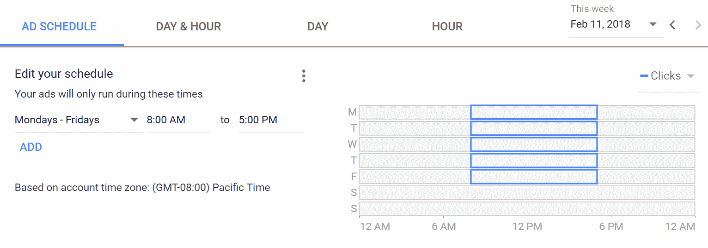

Google AdWords ad schedule

这对当地企业尤其有利。研究显示，在智能手机上进行本地搜索的移动用户中，有 50%的人最终在一天之内去了一家商店，这让 T2 的本地企业在通过搜索结果页面吸引人群注意力方面占据了上风。

### 目标特定设备

经过 2013 年的更新，Google AdWords 允许企业选择显示广告的设备类型。对于搜索网络，您可以在台式机、平板电脑和移动设备之间进行选择。在显示网络上，企业甚至可以进一步挖掘，瞄准特定的设备，如 iPhones 或 Windows。竞价调整允许自动提高或降低更有可能在你的网站上转换的设备的竞价。提示:在分析中查看转化率和电子商务数据。

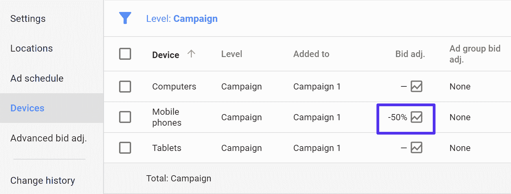

AdWords device targeting

### 只为结果付费

这可以说是谷歌 AdWords 上广告最受欢迎的优势。有了 AdWords，企业只为广告的点击付费，而不是印象。这就是所谓的点击付费(PPC)广告模式。这样，企业只需在用户采取行动查看他们的网站时付费，从而节省了资金。

### 绩效跟踪

Google AdWords 允许企业跟踪其广告的表现。这意味着你可以跟踪查看和点击你的广告的用户数量。Adwords 还可以让你追踪在浏览过你的网站后采取行动的用户数量。

根据谷歌的[经济影响报告](https://economicimpact.google.com/about/#/?sections_activeEl=introduction)，企业在 AdWords 上平均每花费 1 美元就能获得 2 美元。在这种时候，使用谷歌广告词作为你的在线营销策略的一部分，一定会带来积极的结果。然而，并非每个行业都是如此。发现 AdWords 对你的业务是否有利可图的最好方法是试一试。

如果你不知道如何设置你的账户，以及如何使用 AdWords 获利，这个指南将帮助你做到这一点。请继续阅读。

## 准备 PPC

点击付费广告是一个强大的工具，但只有当它被聪明地使用时。在你开始制作你的 AdWords 账户之前，你必须弄清楚你的目标。虽然“更多的销售”听起来像是一个伟大的目标，但在线广告将要求你更加具体。

第一次访问你的网站的人很可能不会购买。在线销售更依赖于与消费者建立和培养信任关系。因此，企业使用 AdWords 可能有多个目标。比如:

*   创造销售
*   注册
*   电子邮件注册
*   线索挖掘
*   提高品牌认知度和召回价值

虽然有一个以上的目标是很好的，但请记住，你将不得不开展不同的活动来实现不同的目标(稍后将详细介绍)。除了确定你的目标，在 AdWords 上做广告还有一个非常重要的先决条件，那就是拥有一个登陆页面。

### 登录页面

登陆页面是一个 URL 或网页，当用户点击你的广告时，他们就“登陆”在上面。登陆页面是一个独立的页面，不同于你的主网站，**旨在专注于一个特定的目标**。一个好的登陆页面对你的 AdWords 活动的成功至关重要。一个精心设计和优化的登录页面将有助于将访问者转化为潜在客户，甚至是客户。

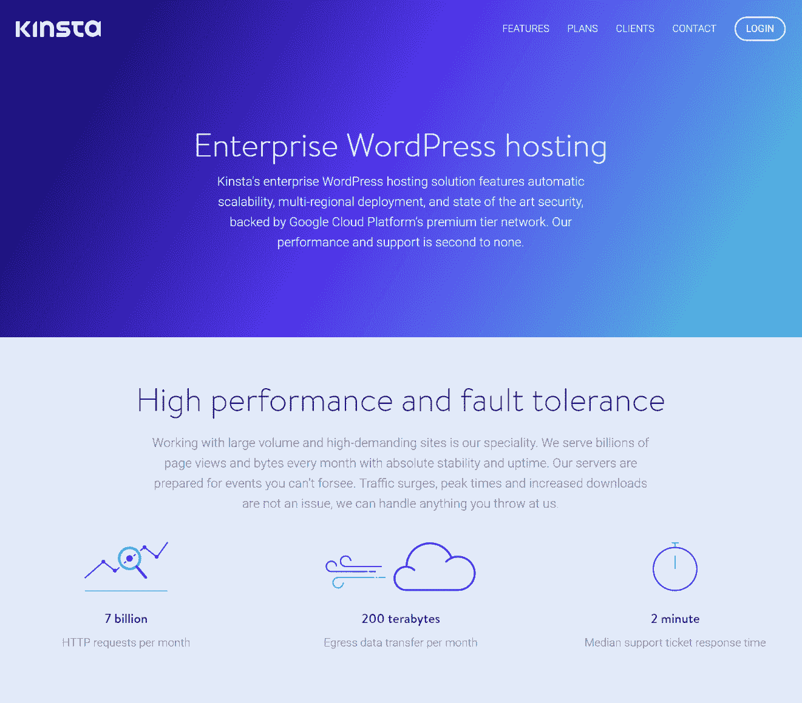

Landing page example

在设计您的登录页面时，请记住以下几点:

*   **聚焦登陆页面:**为个人优惠设计个人登陆页面。专注于多个目标的登陆页面可能会让你的访问者感到困惑。
*   **行动号召:**不要忘记在您的登录页面上包含并正确突出显示所需的行动号召按钮。
*   **移动友好:**随着互联网上移动用户数量的不断增加，确保您的登录页面是移动友好的至关重要。
*   兑现你的承诺:你的登陆页面应该兑现你在广告中做出的任何承诺。例如，如果你的广告谈及折扣，确保登陆页面特色所说的折扣。

查看更多关于如何设计高转化率登陆页面的信息。

到目前为止，您必须有一个设定目标的列表，以及用于实现每个目标的专用登录页面。现在是时候设置你的谷歌 AdWords 账户了。

## 设置 Google AdWords 帐户

### 第一步:注册

只需进入 [Google AdWords 网站](https://adwords.google.com/)并注册您的 Google 帐户。如果您没有 Google 帐户，您必须创建一个。别担心，不会超过几分钟。

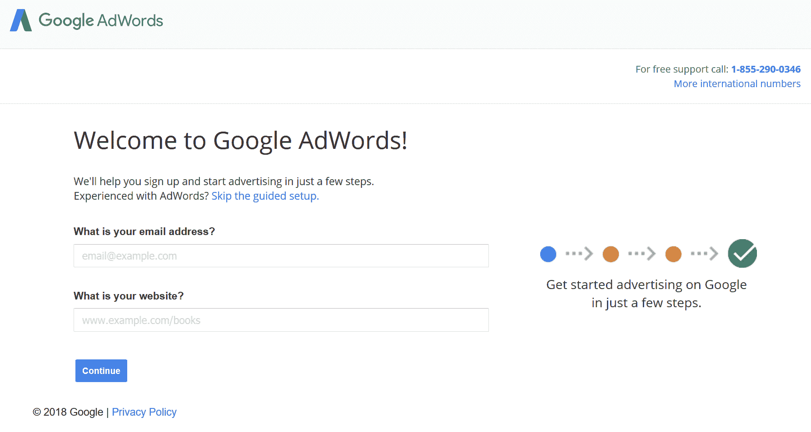

Sign up for Google AdWords

输入必要的详细信息后，您将进入下一页，创建您的第一个活动。在这里，您可以选择您的预算，目标受众，设置您的出价，并撰写您的广告文案。

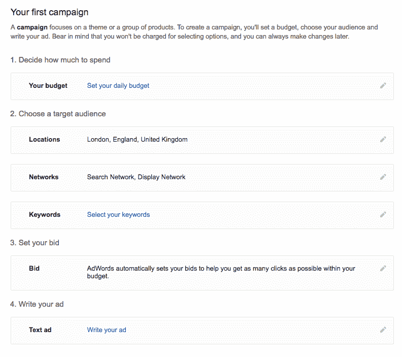

Set up first Google AdWords campaign

### 第二步:设定预算

如你所见，定义预算是清单上最重要的任务。定义每日预算将确保你永远不会超出你的支出限额。计算你每日预算的最好方法是首先了解你的登陆页面可以转化为客户的访问者数量。如果你刚刚开始，使用平均值是可以的。

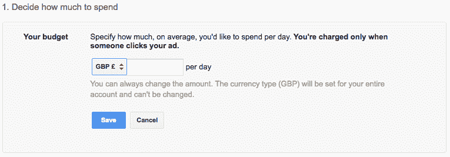

Google AdWords budget

根据 WordStream 的数据，跨行业的平均转化率为 2.35%。这意味着，平均而言，[只有 2.35%的用户在点击广告后采取了想要的行动](https://www.wordstream.com/blog/ws/2014/03/17/what-is-a-good-conversion-rate)。考虑到你所在行业的平均转换率，你可以算出你愿意为每个访问者花费多少。这也称为每次采购成本(CPA)。

选择所需的货币和预算后，单击“保存”并进入下一步。

### 第三步:选择你的目标受众

在这一步中，您需要指定目标受众的地理位置。此功能可确保您的广告仅显示给使用您竞价的关键字进行搜索的用户(稍后将详细介绍)，并且位于您指定的地理位置。

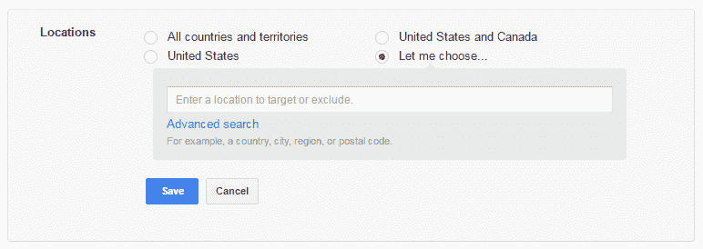

Google AdWords locations

通过使用高级搜索选项，您可以访问“半径定位”。半径定位允许您从您的邮政编码定位某个半径。根据你的业务性质，[你可能希望瞄准整个国家，或者如果你在当地销售产品，只瞄准城市](https://kinsta.com/blog/what-is-google-my-business/)。您甚至可以为每个 radius 目标设置不同的出价调整。例如，您可能希望在 10 英里范围内出价更高，但在 30 英里范围内出价更低。

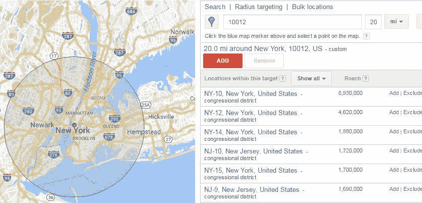

Google AdWords radius targeting

### 第四步:选择网络

下一步是在谷歌的搜索网络和显示网络之间做出选择。搜索网络将你的广告放在谷歌搜索引擎页面上，而展示网络将在任何展示广告的网站上展示你的广告。

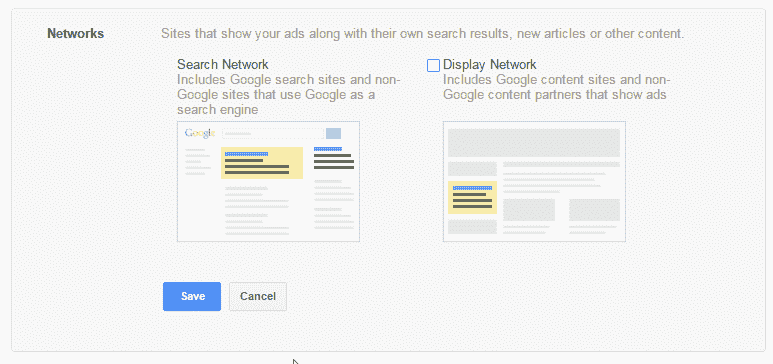

Google AdWords search network vs display network

对于初学者和小企业，建议使用搜索网络，因为它向专门搜索与您的业务相关的关键字的用户显示您的广告。展示广告对品牌推广很有帮助，[重新定位](https://kinsta.com/blog/ad-retargeting/)，而且通常每次点击费用要低得多。但是它们也不是面向查询的。

## 注册订阅时事通讯

### 想知道我们是怎么让流量增长超过 1000%的吗？

加入 20，000 多名获得我们每周时事通讯和内部消息的人的行列吧！

[Subscribe Now](#newsletter)

### 第五步:选择你的关键词

关键词是用户在进行搜索时输入到谷歌搜索框中的搜索词或短语。谷歌让你选择大约 15-20 个关键词，这些关键词可能会触发你的广告出现在 SERP 上。不要担心，你可以随时添加更多的关键字。

Google AdWords keywords

建议**选择几个你有把握带来结果的关键词**，而不是选择 20 个你可能会觉得有点相关的关键词。说了这么多，还要注意你选择的关键词的搜索量。虽然选择一个搜索量为 450，000 的关键词似乎很诱人，但这样做可能不是最好的主意。

如前所述，AdWords 基于竞价系统。高搜索量的关键词通常非常昂贵。选择更多的关键字或选择高搜索量的关键字可能会是一件昂贵的事情。

通过选择一些搜索量适中的相关关键词来控制你的成本。

#### 关键词类型和确定正确的“关键词匹配”

有四种关键字匹配类型决定您希望广告如何显示。

**广泛匹配:**广泛匹配是 AdWords 的默认设置。据谷歌称，它“允许你的广告显示相似短语和相关变体的搜索，包括同义词、单数和复数形式、可能的拼写错误、词干。”

广泛匹配可以让你接触到最广泛的受众。然而，由于 broad match 还会显示您的同义词广告和部分关键词，您的广告可能会出现在许多不相关的搜索结果中。

例如，您可能针对“曼彻斯特的高级餐厅”，使用 broad match，您的广告也可能显示在“曼彻斯特的披萨”的结果中。

广泛匹配修饰符:广泛匹配修饰符给你更多的控制。只需在一个术语前加一个“+”，你就可以锁定它。只有当搜索词包含“+”后面的短语或单词时，您的广告才会出现在结果中。

例如，如果你为“+曼彻斯特美食”出价，你的搜索结果将永远不会显示“曼彻斯特的披萨”这样的搜索词。

**短语匹配:**短语匹配为企业所有者提供了更多的控制。当您选择“短语匹配”时，您的广告仅显示在与您选择的关键字顺序相同的搜索词结果中。

这意味着，如果您选择“曼彻斯特美食”，您的广告将不会显示“曼彻斯特美食”。为了指定短语匹配，只需将关键字放在引号之间。

**精确匹配:**顾名思义，该选项将确保您的广告仅在有人使用与您选择的关键字相同的搜索词进行搜索时出现。

如果你选择了精确匹配，你的关键词是“曼彻斯特美食”，你的广告甚至不会出现在“曼彻斯特最佳美食餐厅”这样的搜索词中。

要指定精确匹配，请将您选择的关键字括起来。(示例:[fine dining Manchester])提示:在刚开始时，使用精确匹配是一种安全而缓慢的方式来扩展您的活动。

**负面关键词:**负面关键词是帮助您确保您的广告不会显示给无关受众的术语。如果你的产品/服务可能与不相关的东西共享关键词，AdWords 的这个功能就派上用场了。

Struggling with downtime and WordPress problems? Kinsta is the hosting solution designed to save you time! [Check out our features](https://kinsta.com/features/)

了解有关按比赛类型竞价的[的更多信息。
T3】](https://blog.rankwatch.com/bidding-by-match-type-101/)

### 第六步:设定你的出价

如前所述，AdWords 采用竞价模式。出价是你愿意为点击你广告的每个人支付的金额。如果你和你的竞争对手为同一个关键词竞价，并且你愿意为每次点击支付更多，你的广告将会比他们的显示更高。

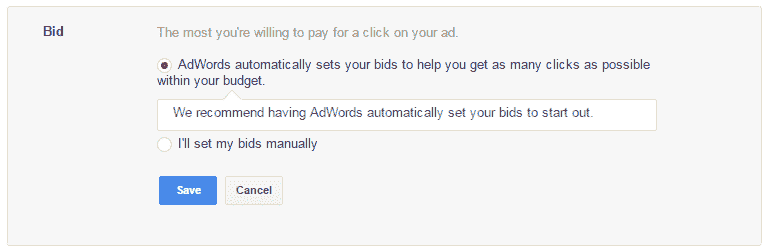

Google AdWords bids

如您所见，您有两种选择。这第一个让谷歌设置你的出价金额，以最大化你的预算回报。如果你更愿意手动设置你的出价，我们建议使用谷歌的关键字规划器做一些研究。

如果你刚刚开始，你可能想从自动竞价开始，直到你熟悉了 AdWords 系统。然而，手动出价通常更划算。尽管有时这也需要额外的持续维护。

### 第七步:写你的广告

撰写广告可以说是这个过程中最关键的部分。我们建议你认真考虑一下，让它变得真正有吸引力。你的信息应该清楚地传达你的提议，这样才能说服用户点击你的广告并访问你的网站。这里有一些让你开始的提示:

#### 文案最佳实践

*   保持简短:没有太多的空间来放置文本。所以你的信息要切中要点。
*   **标题至关重要:**你广告的标题是用户首先会遇到的东西。确保它召唤他们，[说服他们点击广告](https://kinsta.com/blog/headline-analyzer/)。
*   **清晰的行动号召:**清晰的行动号召告诉用户你想让他们做什么。

#### 广告剖析:

*   **标题:** AdWords 允许在一个广告中包含最多两个标题，每个标题包含 30 个字符。确保你明智地使用这个有限的空间。此外，建议在标题中至少包含一个您选择的关键词。
*   **描述:**描述空间为 80 个字符。用它向用户清楚地传达你的信息。如果可能的话，在这一部分包括任何优惠或折扣，以确保用户点击你的广告。此外，三重检查拼写和语法错误。

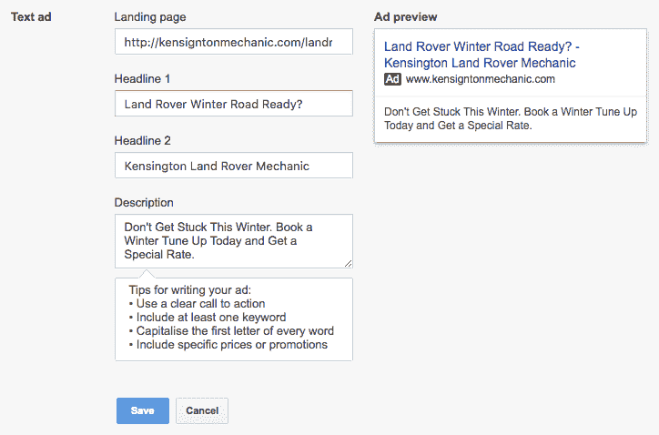

Google AdWords ad copy

### 第八步:制作你的广告

一旦你写完你的广告，点击“保存”按钮，并继续这一过程的最后一步。在这一部分，Google 会询问您的业务和支付信息。当您用完设定的预算时，或 30 天后，以先到者为准，将向您收费。

## 运行多个广告

如前所述，针对不同的目标投放多个广告是明智的。这可以通过一次运行多个活动来轻松实现。然后，您可以找出哪些转换最适合您的业务。

每个活动将由几个广告组组成。每个广告组将由类似的关键字组成，登陆页面将有一个类似的主题。例如，对于电器商店，一个广告组可能专门针对电视，而另一个广告组则专门针对冰箱。

但是，这两个广告组可以包含在同一个活动中。单个活动中的广告组将共享相同的预算、位置和设备定位设置。如果您希望瞄准多个位置或设备，您将需要创建单独的活动。

## 活动评估

如前所述，使用 AdWords 的最大优势之一是其跟踪能力。使用这些，你将能够确定你刚刚创建的广告是否表现良好。

为此，第一步是选择转换源。对于小型企业，两个最常见的转换领域是:

*   **网站:**当客户点击您的广告，访问您的登录页面，并执行所需的操作。
*   **电话:**当移动用户通过广告中提到的电话号码或点击您网站或登录页面上的通话按钮给您打电话时。

你要做的第一件事是[在你的网站上建立一个谷歌分析目标](https://kinsta.com/blog/how-to-use-google-analytics/#conversions-report)，然后按照这些附加说明建立[谷歌广告词转换跟踪](https://kinsta.com/blog/conversion-tracking/#adwords-conversion-tracking) (WordPress、Woocommerce 和 Easy Digital Downloads)。

你也可以在你的广告上追踪[电话](https://support.google.com/adwords/answer/2453991?hl=en-GB)转换。提示:如果你的业务严重依赖电话，也建议注册一个第三方电话报告软件，如 [CallRail](https://www.callrail.com/) 。这很容易与 WordPress 和 Google AdWords 集成。

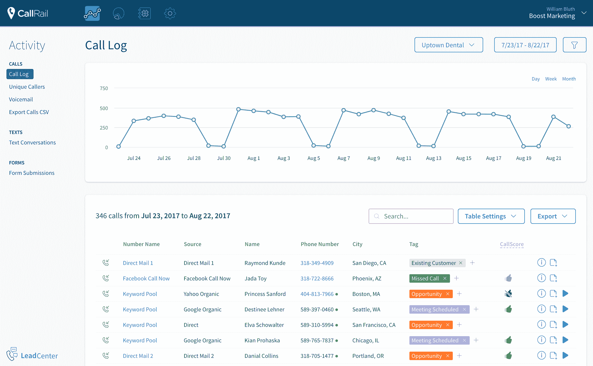

CallRail call reporting

## 谷歌的质量得分

谷歌还跟踪你的广告的表现，并使用这些信息来确定你的广告将出现在搜索结果页面的哪个位置。使用以下因素作为参考，Google 为您的每个关键词分配一个质量分数(QS ):

*   **登陆页面相关性:**关键词与登陆页面内容的相关性。
*   **预期点击率:**用户搜索关键词后点击你的广告的可能性。
*   **广告相关性:**你的广告与关键词的相关性。

通过在 AdWords 帐户的“关键词”标签下添加“质量分数”栏来检查关键词的质量分数。

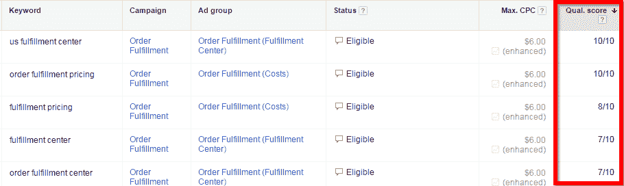

Google AdWords quality score

质量分数不仅有助于确定你的广告的定位，它还会影响投标过程和你每次点击支付的费用。为了确定你广告的位置，谷歌会用你的质量分数乘以出价金额。例如，对于某个关键词，如果你的质量分数是 0.7，你的出价是 1 美元，你的广告将被放在你的质量分数是 0.4，出价是 2 美元的竞争对手的下面。

> 7/10 的质量分数是推荐的数字，这就足够了。超过 7 是很好的，但并不总是可以实现的，可能不值得努力。任何低于 7 的数字都是出了问题的信号，应该继续努力。–[十个分数](http://www.tenscores.com/quality-score/)

## 摘要

对于小企业来说，Google AdWords 是获取新客户的一个非常强大的工具。然而，如果使用不当，这个平台会让你付出真正的广告费，却不会带来可观的投资回报。

除了利用你从这篇博客文章中获得的智慧，成功的关键在于不断地测试你的广告并优化它们以获得更好的效果。

* * *

让你所有的[应用程序](https://kinsta.com/application-hosting/)、[数据库](https://kinsta.com/database-hosting/)和 [WordPress 网站](https://kinsta.com/wordpress-hosting/)在线并在一个屋檐下。我们功能丰富的高性能云平台包括:

*   在 MyKinsta 仪表盘中轻松设置和管理
*   24/7 专家支持
*   最好的谷歌云平台硬件和网络，由 Kubernetes 提供最大的可扩展性
*   面向速度和安全性的企业级 Cloudflare 集成
*   全球受众覆盖全球多达 35 个数据中心和 275 多个 pop

在第一个月使用托管的[应用程序或托管](https://kinsta.com/application-hosting/)的[数据库，您可以享受 20 美元的优惠，亲自测试一下。探索我们的](https://kinsta.com/database-hosting/)[计划](https://kinsta.com/plans/)或[与销售人员交谈](https://kinsta.com/contact-us/)以找到最适合您的方式。