# 如何使用谷歌分析(设置、报告、归因模型等)

> 原文：<https://kinsta.com/blog/how-to-use-google-analytics/>

如果你有一个网站，你很可能会使用谷歌分析来跟踪有多少人访问它，以及他们在网站上的行为。

谷歌分析是一个强大的工具，然而大多数人并没有充分利用它的潜力。

有了它，你可以跟踪你的网上营销的投资回报率，设置自定义细分市场，目标跟踪，过滤你的网站数据，找到表现不佳的网页，等等。

在本指南中，您将了解如何使用谷歌分析来改进您的网站，如何设置网站，此外，我们还提供了一些视频资源来进一步帮助您。

 但首先，让我们了解一下基本情况:

### 更喜欢看[视频版](https://www.youtube.com/watch?v=jFcH7_PQtfU)？

## 什么是谷歌分析？

谷歌分析是谷歌提供的免费报告服务，用于跟踪网站流量。它帮助你了解访问你网站的人和他们的浏览行为。

> Kinsta 把我宠坏了，所以我现在要求每个供应商都提供这样的服务。我们还试图通过我们的 SaaS 工具支持达到这一水平。
> 
> <footer class="wp-block-kinsta-client-quote__footer">
> 
> 
> 
> <cite class="wp-block-kinsta-client-quote__cite">Suganthan Mohanadasan from @Suganthanmn</cite></footer>

[View plans](https://kinsta.com/plans/)

看起来是这样的:

[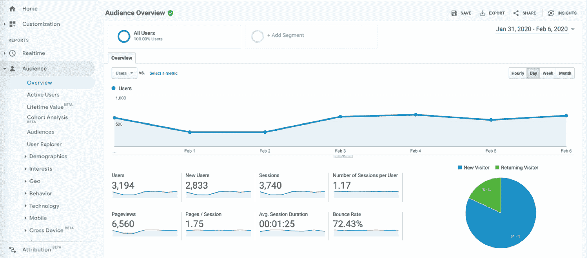](https://kinsta.com/wp-content/uploads/2020/04/google-analytics-overview-1.png)

Audience overview inside Google Analytics

根据 BuiltWith 的[大型技术数据集](https://builtwith.com/datasets/mega-technology-datasets)，它是最受欢迎的网站跟踪平台之一，有近 7 万次使用:

Google Analytics usage across the web

尽管有几个好的选择，谷歌分析是市场上最受欢迎的分析工具之一。

### 为什么使用谷歌分析？

不管你运行的是什么类型的网站，更好地了解你的访问者以及他们在你的网站上的行为会帮助你获得更好的结果。

但如果这还不够，以下是你应该使用谷歌分析的一些理由:

*   这是免费的,-这里没有陷阱，谷歌不收取你使用分析的费用，考虑到你可以从中获取的数据量，这是非常有用的。
*   **这是完全自动化的**–一旦你在网站上添加了跟踪代码，谷歌分析就会自动跟踪、记录和存储你的数据。
*   **您可以创建定制报告**——使用谷歌的内置工具，您可以非常简单地创建定制的拖放式报告(稍后将详细介绍)
*   **与其他工具整合**——轻松将您的分析与其他谷歌工具连接起来，如[谷歌广告词](https://kinsta.com/blog/how-to-use-google-adwords/)和[谷歌搜索控制台](https://kinsta.com/blog/google-search-console/)。

这还没有提到你可以从谷歌分析中学到的所有网站特定的东西，比如为什么访问者会从某些页面弹回，你的观众的年龄/性别/位置或者你应该写的内容的类型。

### 谷歌分析追踪什么？

通过让你访问关于你的网站的数据，谷歌分析让你得到这些信息并做出决定。

简而言之，你可以从谷歌分析中获得的数据可以分解如下:

*   **获取**——了解[你如何获得网站流量](https://kinsta.com/blog/how-to-drive-traffic-to-your-website/)。
*   **行为**——找出人们在你的网站上到底在做什么。
*   **转化**——在你的网站上找出[访客如何转化为顾客](https://kinsta.com/blog/conversion-rate-optimization-tips/)。

现在你知道它是什么，它可以跟踪什么，让我们运行一个简单的谷歌分析设置:

[你是否充分发挥了谷歌分析的潜力？📈您可能会错过这个工具来优化您的网站性能！ 点击推文](https://twitter.com/intent/tweet?url=https%3A%2F%2Fkinsta.com%2Fblog%2Fhow-to-use-google-analytics%2F&via=kinsta&text=Are+you+using+Google+Analytics+to+its+full+potential%3F+%F0%9F%93%88+You+may+be+missing+out+on+this+tool+to+optimize+your+site+performance%21&hashtags=analytics%2Cseo)

## 如何设置谷歌分析(3 个简单的步骤)

按照这些简单的步骤来设置 Google Analytics，并准备在您的网站上进行跟踪:

### 1.设置您的 Google Analytics 帐户并添加您的网站

第一步是确保你登录到你想要用来管理你的分析的谷歌账户。

然后，进入[谷歌分析设置页面](https://analytics.google.com/analytics/web/provision)，点击**开始测量**:

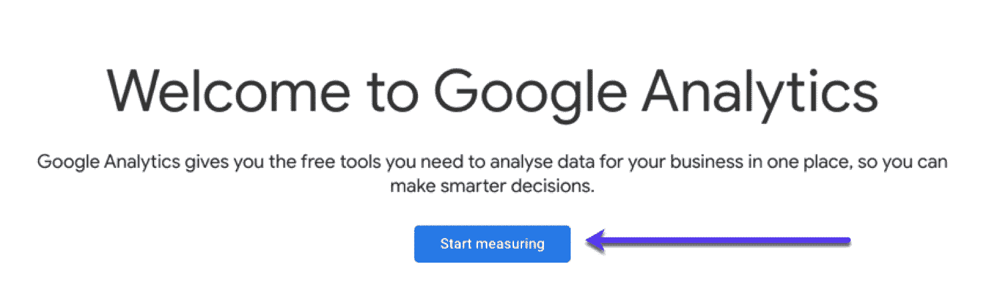

Google Analytics setup page

现在你需要添加一个**账户名**并勾选数据共享框(如果你愿意，你可以取消勾选，它们不会改变你的数据)。

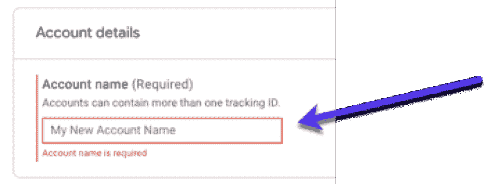

Account details – add a new account name in Google Analytics

一旦你添加了，点击下一步。

现在你需要选择你想要测量的财产类型:网站、应用程序或两者都有。大多数人会设置 Google Analytics 来[跟踪一个网站](https://kinsta.com/blog/how-much-is-my-website-worth/)，所以选择它并点击下一步。

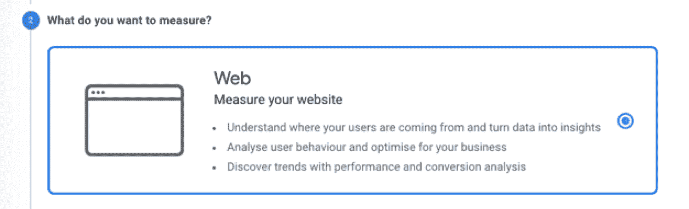

Choose what you want to measure in Google Analytics (hint: it’s probably a website)

现在，您可以添加一些关于您网站的详细信息:

*   **网站名称**–不言自明。
*   **网址**–确保从下拉菜单中选择 [http 或 https](https://kinsta.com/blog/http-to-https/) ，然后添加您的网址。
*   **行业类别**–选择最能描述您的网站的领域。
*   **报告时区**–选择您所在的时区。

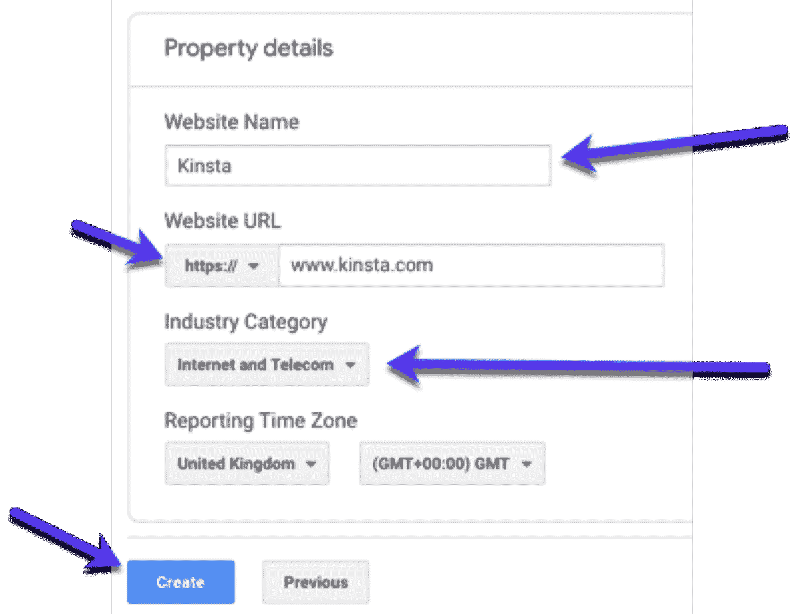

Property details – add information about your site in Google Analytics

完成本部分后，点击**创建**，系统会提示您同意一些服务条款。勾选这两项并按下**同意**。

### 2.安装您的谷歌分析跟踪代码

现在，您将看到您唯一的跟踪代码:

[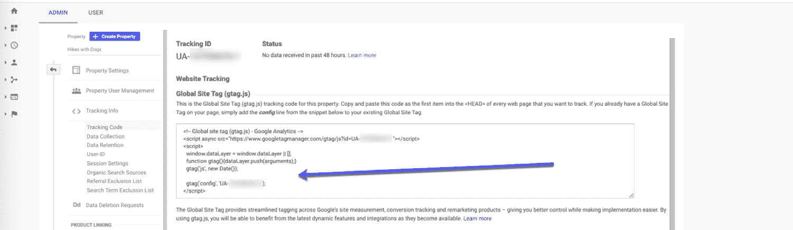](https://kinsta.com/wp-content/uploads/2020/04/google-analytics-tracking-code-1.png)

Install your Google Analytics tracking code

要使用 Google Analytics 跟踪你的网站，这个代码必须安装在你网站的每个页面上(在< /head >标签之前的[)。](https://kinsta.com/knowledgebase/add-code-wordpress-header-footer/)

安装代码将取决于您的网站类型以及您自己进行更改的舒适程度。

让我们通过两种不同的方式来运行:

#### 手动安装谷歌分析

一些 WordPress 主题有一个专门的区域来放置你的追踪代码，但是大多数都没有。这就是为什么你应该总是[使用子主题](https://kinsta.com/blog/wordpress-child-theme/)来防止你的 g a 脚本在每次更新后被覆盖。

你的谷歌分析脚本应该添加到你的*header.php*文件中，在结束标签< /head >之前，安装在你网站的每个页面上。

如果你的主题没有这个功能，你可以尝试使用插件来创建它们:

#### 使用插件安装谷歌分析

将 Google Analytics 添加到 WordPress 的最简单的方法之一(对于初学者和专家来说)是使用像[页眉和页脚脚本](https://wordpress.org/plugins/header-and-footer-scripts/)这样的插件。

这可能是向你的 WordPress 站点添加谷歌分析代码最简单(也是最安全)的方法。

只需安装插件并添加您的跟踪代码即可开始跟踪:

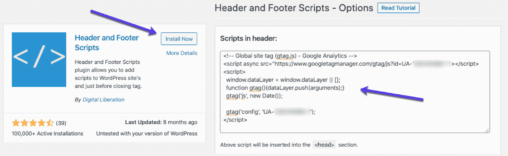

Add Google Analytics via a WordPress plugin

想要你的 WordPress 站点有更多的选项吗？查看我们关于[如何将谷歌分析添加到 WordPress 的终极指南](https://kinsta.com/blog/google-analytics-wordpress/)。

### 3.测试你的谷歌分析跟踪代码

一旦你把代码添加到你的网站，你需要测试谷歌分析实际上是跟踪。

这很简单。

在谷歌分析中，进入**实时**，然后进入**概览**。这将显示你的网站上正在发生什么事情。

现在去打开你的网站在不同的浏览器(或匿名模式)标签，等待谷歌分析拿起你的访问。如果您的跟踪代码安装正确，您将看到如下内容:

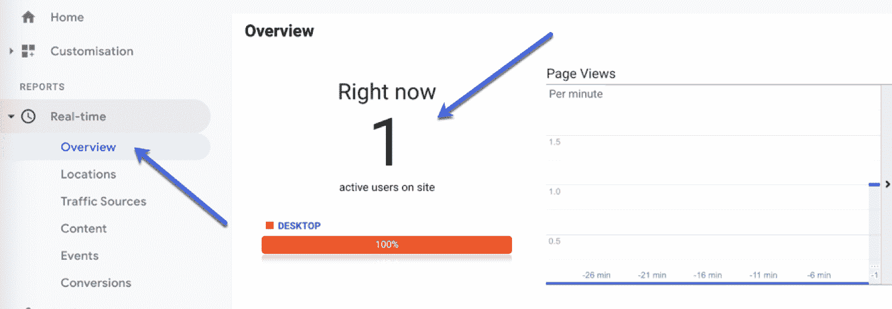

Use real-time tracking in Google Analytics to check your tracking code is working

在继续之前，请确保[将 Google Analytics 与 Google Search Console](https://kinsta.com/blog/google-search-console/#how-to-link-google-analytics-with-search-console) 链接起来，以便对您的数据有一个更好、更完整的了解。

现在你已经设置好了，让我们探索一下你会在 Google Analytics 中找到什么样的指标。

## 谷歌分析指标和维度解释

在我们开始阅读谷歌分析报告之前，有必要了解一下指标和维度的含义。

所有谷歌分析报告都基于维度和指标:

*   **维度**是数据的元素。
*   **指标**是对这些维度的测量。

例如，如果您正在查看访问您网站的人所在的位置，维度将是位置(数据元素)，数量(度量)将是指标:

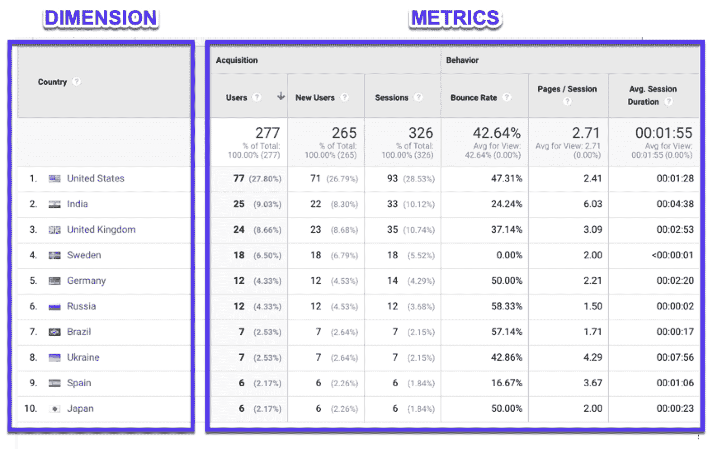

Dimensions vs metrics in Google Analytics

#### 示例指标

以下是谷歌分析中需要注意的一些最重要的指标:

*   **流量**——你网站的访客。
*   **流量来源**——访问者来自哪里(直接、推荐、搜索引擎、社交)。
*   **会话**–在给定时间范围内发生的一组用户交互。
*   **平均花费时间**——某人在你的网站上花费的时间。
*   **每次访问的平均页面数**–用户访问的页面数。
*   **热门页面**——最受欢迎的页面。
*   **退出页面**——大多数人离开你的网站的页面。
*   **跳出率**–单页访问量除以所有会话的百分比。
*   **独立用户与回头客**–有多少人是第一次访问你的网站，有多少人是常客。
*   **用户行为流**——访问者浏览你的网站的方式。
*   **位置**–用户浏览的位置。
*   **年龄**——他们的年龄段。
*   站点速度-你的站点有多快(这是我们关于[如何加快你的 WordPress 站点速度的电子书](https://kinsta.com/ebooks/wordpress/speed-up-wordpress/))。

现在，让我们来看看您将找到的谷歌分析报告以及如何阅读它们:

## 如何使用谷歌分析报告

当您第一次登录 Google Analytics 时，您会看到这个“主页”仪表板，它是您网站性能的概览:

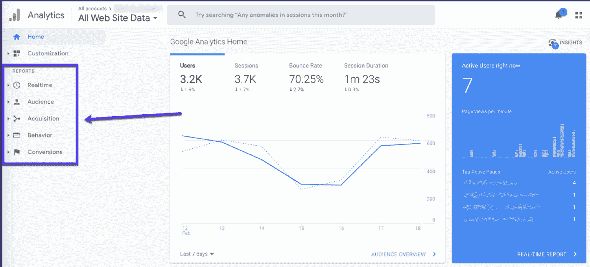

What you’ll see on the ‘home’ dashboard in Google Analytics

Google Analytics 报告是列在左侧栏中的预设报告，位于以下部分:

*   实时
*   观众。
*   收购。
*   行为。
*   转换。

这些报告中的信息是由 Google Analytics 预设的，可以让您深入了解整个网站的数据，从受众人口统计到他们发现您网站的渠道。

通过点击这些报告，您将获得更多探索您的数据的选项(但要小心[推荐垃圾邮件](https://kinsta.com/blog/google-analytics-spam/))。让我们快速浏览一下每份报告:

### 实时报告

实时报告显示您的站点上正在发生的事情:

[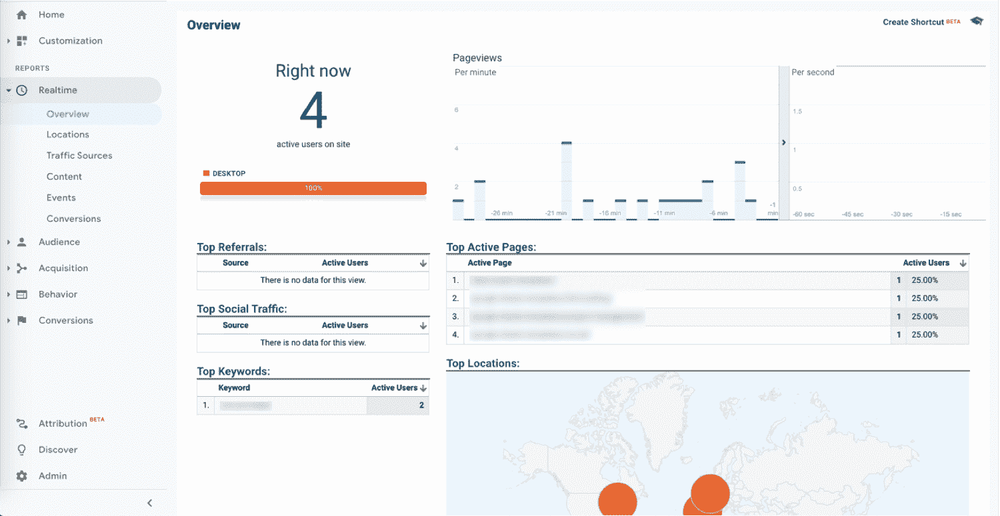](https://kinsta.com/wp-content/uploads/2020/04/google-analytics-real-time-report-1.png)

Google Analytics real time report

你可以看到有多少人正在浏览你的网站，他们正在访问的网页，他们在世界上的位置等等。

使用实时报告，您可以:

*   查看您从新发布的博客文章中获得了多少流量。
*   了解一项销售或一项活动是否在推动浏览量。
*   确保您刚刚设置的 URL 正常工作。

### 观众报告

受众报告从访问您网站的人(即受众)的角度概述了您的网站:

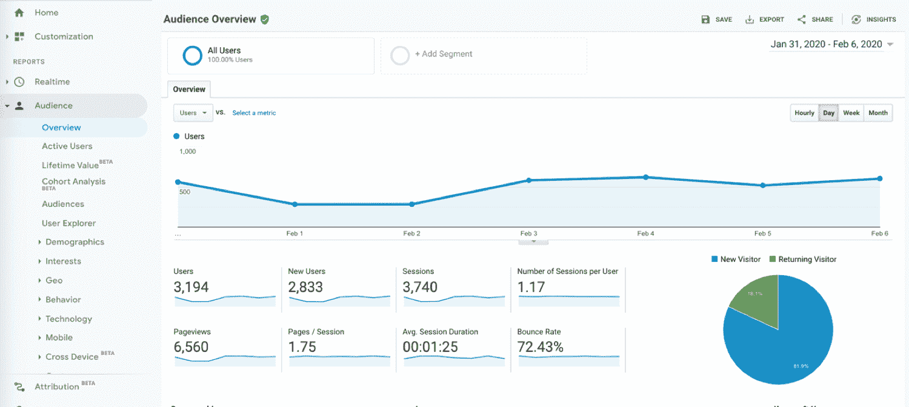

Google Analytics audience report

在本报告中，您将能够深入了解您的受众，例如:

*   人口统计学。
*   利益。
*   位置。
*   行为。
*   技术。

利用这些数据，你可以更好地了解你的受众，然后对你的网站做出明智的决定。

例如，你可能会注意到，你的大部分流量是通过手机访问你的网站，但大多数目标转换是在桌面上完成的。也许你可以为移动设备改进一些[的东西来帮助提高转化率。](https://kinsta.com/blog/web-design-best-practices/#mobile-responsiveness)

### 采购报告

收购报告概述了您的网站是如何获得流量的:

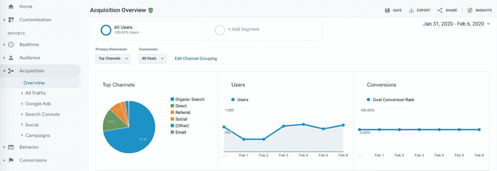

Google Analytics acquisition report

在这份报告中，你可以看到你的流量按来源(又名，它来自):

*   **有机**——来自谷歌和其他[搜索引擎的 SEO 流量](https://kinsta.com/blog/alternative-search-engines/)(这里有一个关于如何提高你的 [WordPress SEO](https://kinsta.com/blog/wordpress-seo) 的广泛指南)。
*   **引导**——有人通过手动输入网址来访问你的网站。
*   **转介**–来自另一个站点的访问。
*   **电子邮件**——来自电子邮件或[电子邮件列表](https://kinsta.com/blog/how-to-build-an-email-list/)的访问。
*   **社交**——来自[社交媒体平台](https://kinsta.com/blog/wordpress-social-media-plugins/)的访客。
*   **付费搜索**——有人从[访问付费广告](https://kinsta.com/blog/how-to-use-google-adwords/)。
*   **展示**——有人从展示广告中来访。
*   **附属**——从[附属链接](https://kinsta.com/affiliate-academy/link-cloaking/)访问的人。
*   **其他**——如果谷歌分析不知道如何对你的流量进行分类。

### 行为报告

行为报告概述了访问者在您的网站上的行为:

## 注册订阅时事通讯

### 想知道我们是怎么让流量增长超过 1000%的吗？

加入 20，000 多名获得我们每周时事通讯和内部消息的人的行列吧！

[Subscribe Now](#newsletter)

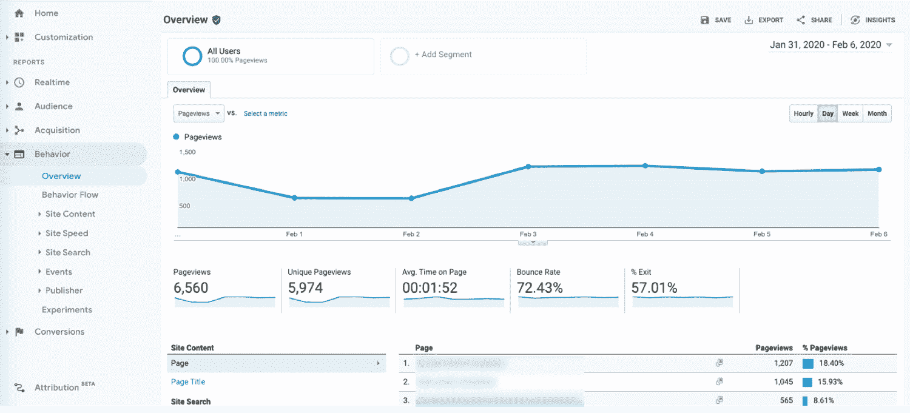

Google Analytics behavior report

在这份报告中，你可以关注网站的单个页面，了解访问者的行为。您将能够大致了解:

*   浏览量和独特的浏览量。
*   花费在页面上的平均时间。
*   跳出率和退出率(这里有一个关于如何在你的网站上降低跳出率的深度指南[)。](https://kinsta.com/blog/how-to-reduce-bounce-rate/)

您还可以通过页面 URL、标题、搜索词或事件来查看内容的表现。

### 转换报告

转换报告概述了您的访问者如何(希望)在您的网站上转换:

Google Analytics conversions report

如果你有一个网站，很可能你有一个目标/转换你想实现的人访问。

这可能因您运行的网站类型而异:

*   电子商务网站希望他们的访问者在[订购产品](https://kinsta.com/blog/conversions-woocommerce-product-pages/)。
*   博主们希望他们的访问者在页面上停留更长时间，阅读[以增加他们的广告收入](https://kinsta.com/blog/how-to-monetize-a-blog/)。
*   [B2B](https://kinsta.com/blog/b2b-lead-generation/) 和 [SaaS 的企业](https://kinsta.com/blog/saas-products/)希望[的访问者注册他们的电子邮件列表](https://kinsta.com/blog/email-marketing-tips/)，以便让他们了解最新的新闻和特色([就像我们在 Kinsta 策划的这个](https://kinsta.com/wordpress-newsletter/))。

提高这些地区的销售额/签约量可以像应用一些基于谷歌分析数据的[转化率优化](https://kinsta.com/blog/conversion-rate-optimization-tips/)技巧一样简单。

不管你想追踪什么目标/转化，谷歌分析都允许你衡量所有这些(以及更多)。

#### 谷歌分析的目标是什么？

目标是您定义的的[转换。这取决于你想监控什么。说到目标，有四种主要类型:](https://kinsta.com/blog/conversion-tracking/)

*   **目的地**:当用户到达特定页面时完成(想想[产品列表，](https://kinsta.com/blog/conversions-woocommerce-product-pages/)订单确认，或者感谢页面)。
*   **事件**:当一个预设的事件触发时完成(比如看一个视频或者分享一些东西到 Twitter)。
*   **持续时间**:当用户会话持续时间超过预定义时间时结束。
*   **每个会话的页面/屏幕数**:当用户在每个会话中查看设定数量的页面时完成。

(在本指南的后面部分，您将能够找到关于设定目标的更详细的步骤)

### 使用过滤器进行更准确的报告

在谷歌分析中，过滤器用于将数据分成更小的组。它们可用于仅包括特定的流量类型或排除特定的数据。

要使用过滤器，请转到管理面板，然后选择过滤器:

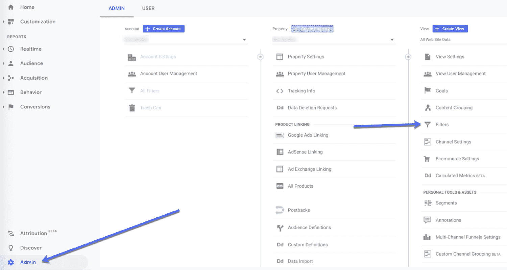

Use Google Analytics filters to break up your data.

这里有一个非常简单的过滤器来阻止你的 IP 地址，这样你就不会因为访问自己的网站而歪曲你的数据。

第一步是你需要找到你的 IP 地址。

这很简单:我们在金斯塔*有一个工具，T3【我的 IP 地址是什么 T5】或者你可以谷歌一下:*

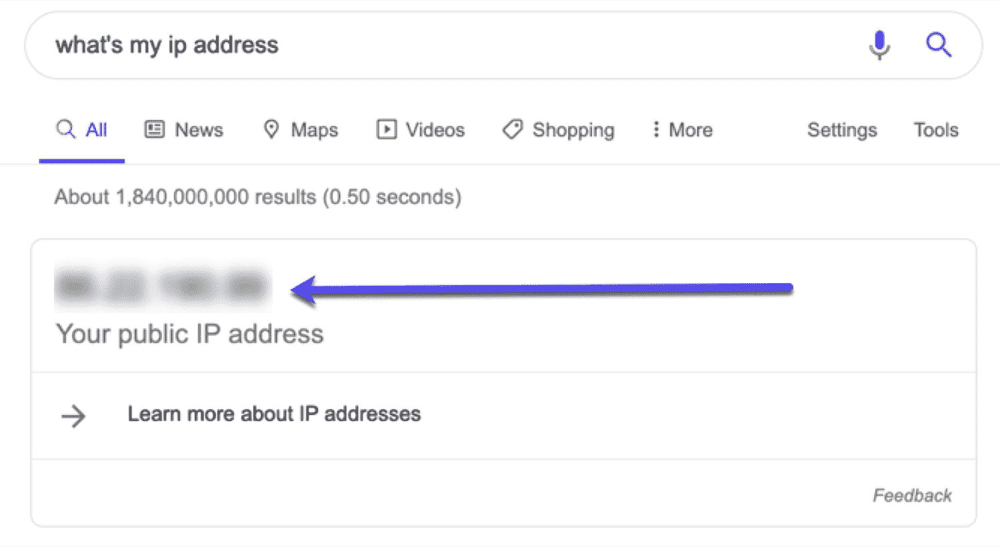

Use Google to quickly find your IP address

复制你的 IP 地址，然后打开谷歌分析。进入**管理面板**，然后在**视图**下，选择**滤镜**:

Use Google Analytics filters to break up your data.

现在点击**+添加过滤器**并填写详细信息:

*   **过滤器名称—**排除我的 IP。
*   **过滤器类型-**选择预定义。
*   现在选择**排除来自 IP 地址**和**等于的流量。**
*   **IP 地址—**添加您的 IP 地址。

它应该是这样的:

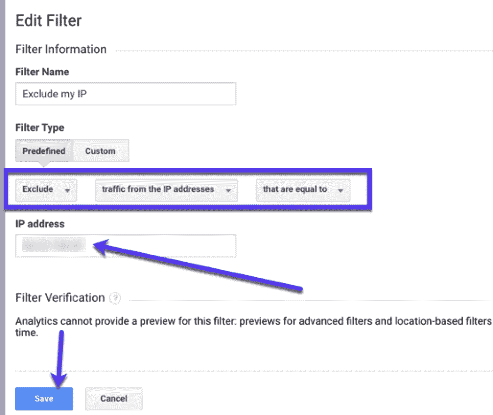

Editing filters in Google Analytics

现在保存您的过滤器。

厌倦了体验你的 WordPress 网站的问题？通过 Kinsta 获得最好、最快的主机支持！[查看我们的计划](https://kinsta.com/plans/?in-article-cta)

## 使用谷歌分析改进网站的 7 种方法

现在，您已经设置好了，知道可以查看哪些报告和指标，接下来是我们需要回答的一个关键问题。

你可以用谷歌分析做些什么来改善你的网站和业务？

我很高兴你问了…

既然你知道如何正确使用谷歌分析，以下是你可以在谷歌分析中做的七件事:

 让我们更详细地探讨一下:

### 1.创建自定义仪表板和报告

想要查看您最重要的分析数据，而不必挖掘 Google Analytics 的其余部分吗？

然后，你应该利用谷歌分析定制仪表板和报告。在左侧面板中，只需点击**定制**即可看到它们:

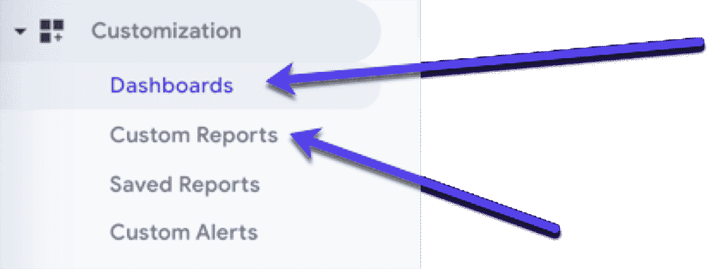

Use the custom dashboards in Google Analytics

您可以选择您想要查看的数据，并以适合您的方式进行组织。这意味着您可以简单地通过添加小部件和移动它们来制作自己的报告。

这里有一个定制仪表板的例子，它是[聚焦于 SEO](https://kinsta.com/blog/wordpress-seo/) :

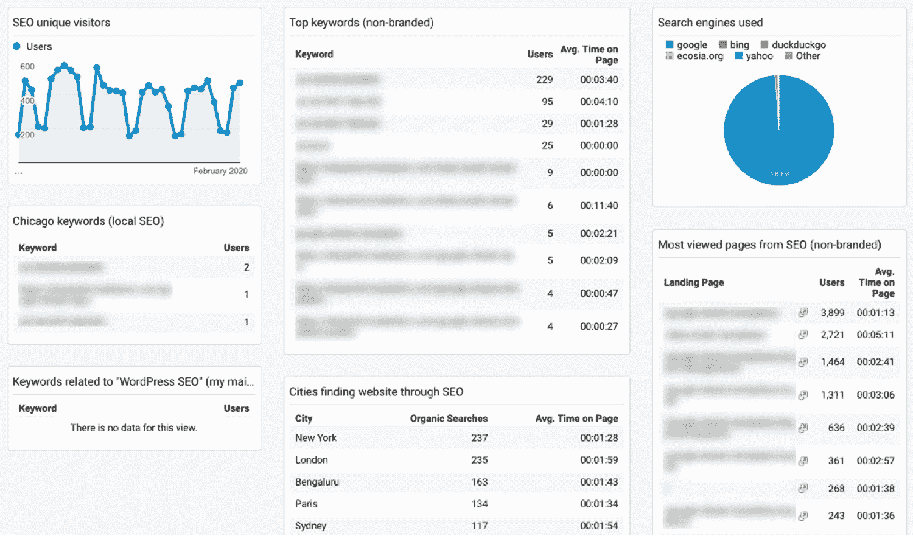

An example of an SEO-focused custom dashboard in Google Analytics

想知道自定义仪表盘最大的好处吗？**您可以使用预先构建的模板。**

这里有一些免费的谷歌分析仪表板，你可以复制:

*   [7 个谷歌分析定制仪表盘](https://onlinemediamasters.com/google-analytics-custom-dashboard-examples/)
*   [15 个谷歌分析仪表盘](https://databox.com/10-google-analytics-dashboards-helped-550000-people)

如果每次登录 Google Analytics 帐户时，您都想一目了然地看到一条(或多条)数据，请确保在仪表板区域设置它。

#### 如何制作谷歌分析定制仪表板

如果您在设置 Google Analytics 仪表盘时需要更多帮助，您可以按照此视频中的说明进行操作:

### 2.使用自定义段更好地理解您的数据

在 Google Analytics 中浏览数据的最佳方式之一是使用简单和高级的细分市场。

#### 谷歌分析中的细分市场是什么？

自定义细分是您的分析数据的定义分组。细分让你可以跟踪不同类型的用户，这样你就可以了解你的网站如何更好地为他们服务。

您可以使用它们深入研究您收集的数据。

例如:

如果你想关注当地的流量，你可以根据特定的国家或城市对所有的站点访问者进行分类。另一部分可能是访问您网站上特定页面的用户。

或者你可能想比较移动和桌面访问者。通过创建移动细分市场和桌面细分市场，您可以并排比较数据。

#### 如何创建谷歌分析细分市场

Google Analytics 中有预制的细分市场在等着你。

只需打开 Google Analytics 并点击 **+Add Segment** ，您就可以浏览并应用(Google)为您预先构建的现有内容:

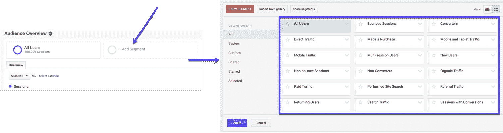

Adding pre-made segments in Google Analytics

如果这还不够，您可以创建自己的细分市场:

#### 如何创建一个自定义的谷歌分析部分

要添加自定义细分市场，请单击红色+新建细分市场按钮:

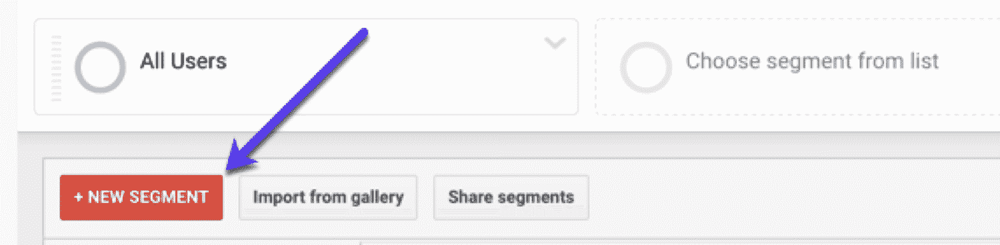

Adding a new segment in Google Analytics

在这里，您可以选择希望如何对用户进行细分:

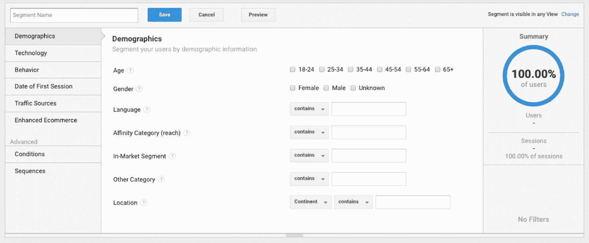

Segmenting users in Google Analytics

当您开始应用过滤器时，您会看到摘要(在右边)开始变化。这将向您显示您已细分的用户百分比以及用户和会话数据。

例如，如果我选择年龄在 25-34 岁之间的男性，看起来会是这样:

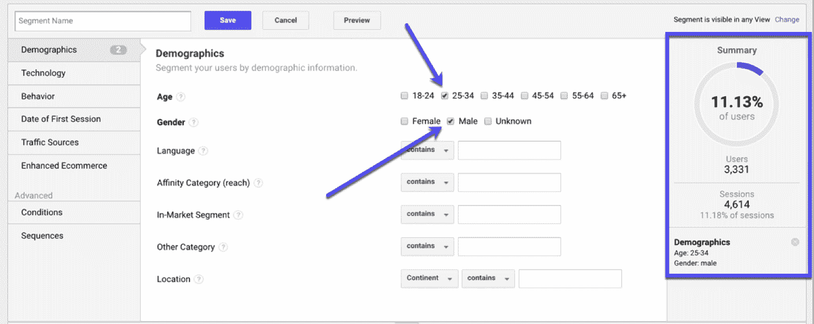

Segmenting based on demographics in Google Analytics

也许你想更进一步，通过 25-34 个通过 [SEO](https://kinsta.com/blog/what-does-seo-stand-for/) (又名来自谷歌)访问过你的网站的男性进行细分。

进入流量来源，在流量来源中选择谷歌:

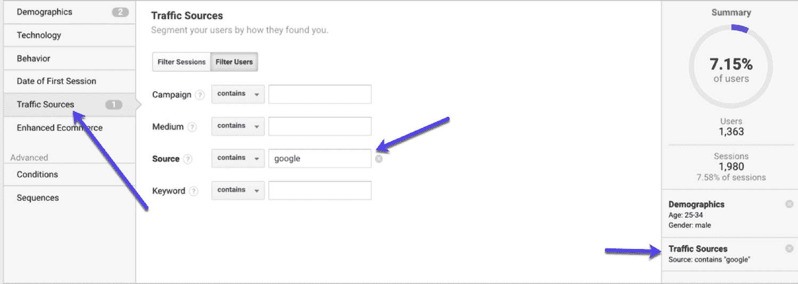

Segmenting by traffic source in Google Analytics

一旦你对你的分段满意了，给它一个名字并保存它:

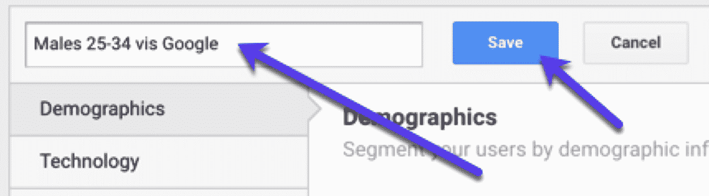

Don’t forget to save your custom segment

现在，当您应用一个段时，您将能够应用您刚刚创建的这个自定义段:

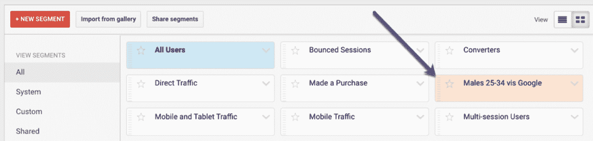

Finding and applying your custom segments in Google Analytics

需要更多设置细分市场的帮助吗？看看这个:谷歌分析高级段解释。

此视频向您展示了自定义段如何帮助您分解现有流量，并更好地了解您的数据。

### 3.追踪你的目标(并使用转换漏斗)

目标是一个完成的活动([转化](https://kinsta.com/blog/conversion-rate-optimization-tips/))，有助于网站的成功。它可以基于目的地、事件、持续时间或每个会话的页面/屏幕。

设立目标可以让你更好地了解你的网站的投资回报率。通过[跟踪目标](https://kinsta.com/blog/conversion-tracking/)你可以了解你的网站上哪些是有效的，哪些需要改进。

#### 如何在谷歌分析中设定目标

要设定目标，进入谷歌分析的管理部分，然后导航至目标:

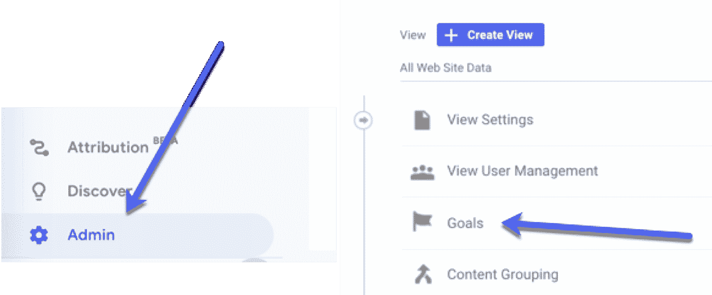

Setting up goals in Google Analytics

现在，您将能够添加一个新目标:

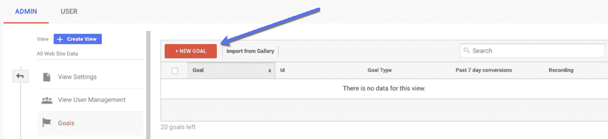

Adding new goals in Google Analytics

从下一部分中选择最合适的目标描述。这里有几个选择，如果你不确定，你可以选择“自定义”。

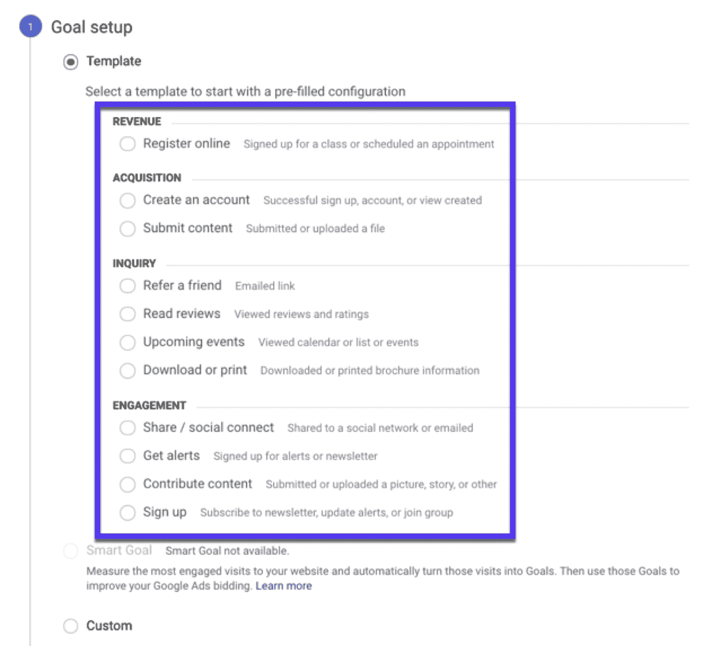

Goal setup – choose the most accurate description or go for a custom goal

接下来，您需要为您的目标命名。给它一些描述性的东西，这样你一看就知道你在跟踪什么。

设定目标的步骤取决于你想追踪的内容。我建议观看这个简单的演练，并决定哪种方法最适合您:

### 4.找到你最喜欢的转换页面(并改进它们)

你已经[建立了足够的流量](https://kinsta.com/blog/how-to-drive-traffic-to-your-website/)让人们访问你的网站。但是你知道什么更好吗？

将他们转化为顾客。

使用谷歌分析，你可以找出哪些页面带来了最多的流量和转换，然后努力改善它们，带来更多。

以下是如何找到你的顶级转换页面:

转到**采集>搜索控制台>登陆页面**并选择一个时间范围(目标至少为 6 个月)。

现在，您希望根据转换目标对表格进行排序。假设你已经设定了目标，选择一个你想要调查的转化(右上方的下拉菜单)。

例如，假设我们对在我们网站上填写联系表格的人感兴趣。选择该目标，然后按该目标排序:

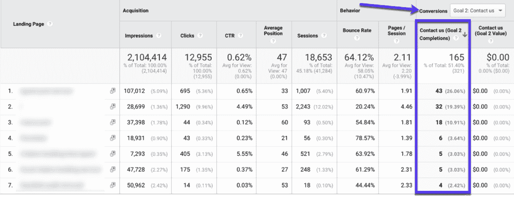

See your highest converting landing pages in Google Analytics

这将向我们展示该目标的顶级转换页面。

现在怎么办？好吧，现在你需要试着[提高那个页面的转化率](https://kinsta.com/blog/conversion-rate-optimization-tips/)。

以下是一些你可以尝试的事情:

*   看看网页排名的关键字，然后与其他排名的网页进行比较。
*   使用 Ahrefs 的[免费反向链接检查器](https://ahrefs.com/backlink-checker)检查排名靠前的 URL 有多少反向链接。
*   在谷歌搜索控制台中检查哪些[查询给你的页面带来了很少的流量，并用这些新词更新这些页面。](https://kinsta.com/blog/google-search-console/#queries)
*   看看谷歌的搜索结果，将你的网站与你的竞争对手进行比较。
*   使用我们的 [WordPress SEO 指南](https://kinsta.com/blog/wordpress-seo/)来确保你没有错过任何重要的东西。

### 5.找到低挂水果网页，以改善

如果你使用 SEO 来吸引人们访问你的网站，你是在玩长线游戏。

你需要遵循最佳实践(如果你使用一个 [SEO 插件](https://kinsta.com/blog/best-seo-plugins-for-wordpress/)会更容易)，确保你的网站没有错误，创建[常青树内容](https://kinsta.com/blog/evergreen-content/)来看到你的网站逐渐在搜索引擎排名中攀升。

然而，有些事情你可以做得更快。

在这种情况下，你的低挂水果目标是你的网站上的网页，只需稍加调整，就会看到流量的提升。这些页面将出现在谷歌的第二页，只需要多做一点工作，把它们带到第一页。

但是你是如何找到这些页面的呢？你需要先将谷歌分析连接到谷歌搜索控制台。

然后，转到收购>搜索控制台>查询，看看哪些搜索词(也就是关键词)给你的网站带来了最多的流量。然后点击**高级**:

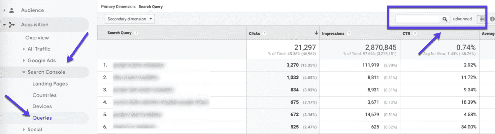

Find low hanging fruit opportunities in Google Analytics

使用高级过滤器，选择**平均位置**作为您的度量，添加大于 10 的**并点击**应用**:**

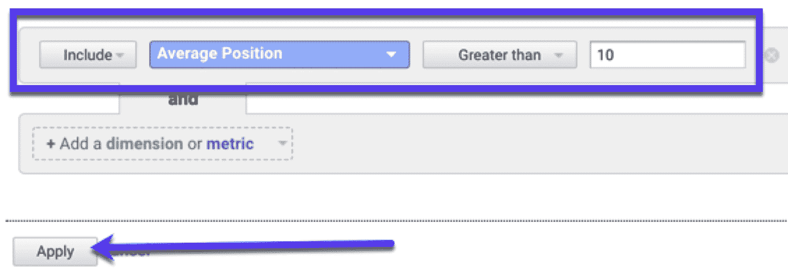

Filter by ‘Average position’ in Google Analytics to uncover opportunities for improvement

这将向你展示什么？

这将向您显示在第 2 页上排名的页面(也就是您的低挂水果关键词):

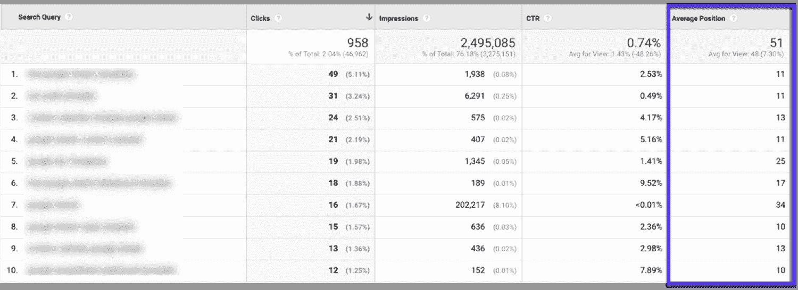

See pages ranking on page two of Google… then go and improve them

但是这里真正要看的是点击和印象的关系。

如果您需要复习:

*   **印象数** =你的网址在搜索结果中出现的次数
*   **点击量** =某人在搜索结果中点击你的网址的次数

现在你的点击量会很低，因为这些页面在谷歌的第二页上排名很低。现实一点，没人会去谷歌上看第二页。

但是，如果你有很高的印象，这意味着你可以获得更多的流量，如果你只是提高你的位置:

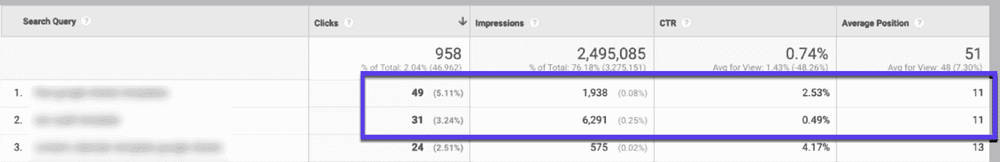

Look out for pages with high impressions but low clicks

### 6.发现表现不佳的页面(以提高流量)

这并不总是关于在你的网站上找到好东西。有时你需要找出你表现最差的网页，并加以改进。

使用 Google Analytics，你可以找到已经衰落的页面，然后重新发布它们以重获昔日的荣耀(希望如此)。

方法如下:

转到**收购>搜索控制台>登陆页面**并选择一个时间范围(目标至少为 6 个月)，然后与上一年进行比较:

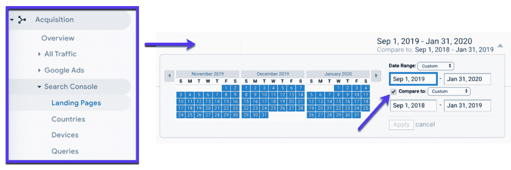

View landing page performance over a specific timeframe

如果你有一个漂亮的新网站，不要担心你不能和前一年相比。您可以选择有数据的日期范围。

现在，按点击次数排序:

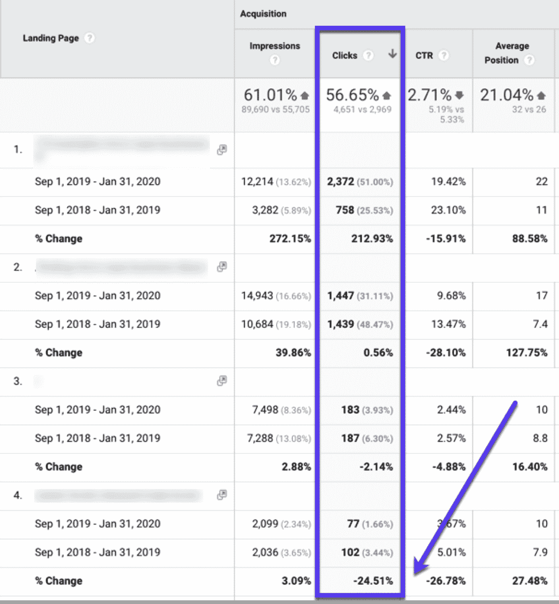

Sort by clicks in Google Analytics to find underperforming pages

浏览这个页面，寻找明显下降的页面

然后寻找他们拒绝的原因，想出你可以做的任何更新或者你可以增加他们流量的方法。这种方法也适用于优化转换率。

### 7.找到(并修复)人们不喜欢的页面

在谷歌分析中，进入**行为>网站内容>所有页面**，点击**高级**:

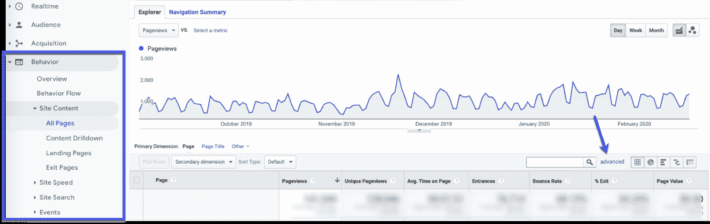

See what pages on your site people aren’t engaging with

现在我们要添加一个**来源/媒介**维度，并添加包含**谷歌/有机**:

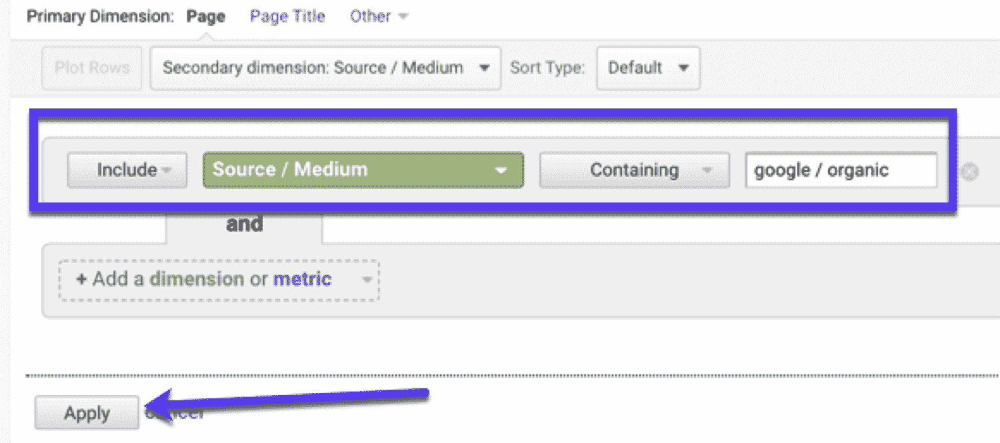

Filter by organic (aka SEO traffic) in Google Analytics

这将显示你在谷歌上表现最好的页面**。**

现在将你的数据按最多的浏览次数排序，注意**跳出率**和 **%退出**栏:

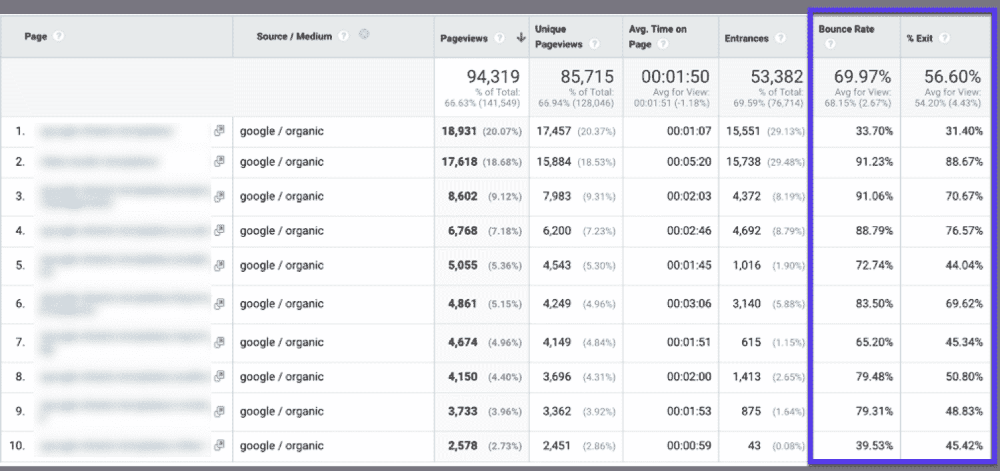

Find blog posts with a high bounce rate

你通常会看到从搜索流量到博客帖子的跳出率非常高，所以不要太担心。

你想要寻找的是同时具有高跳出率和高退出率的页面。像这样的页面:

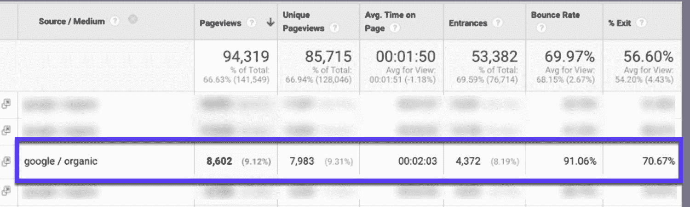

Pages like this are perfect for re-optimizing and improving

如果你看到这样的东西，你的页面需要改进。你可以做很多事情来提高这个数字。这要由你来检验。

但是这里有一些事情可能会阻碍你的页面:

*   你的内容不符合用户在谷歌上搜索的搜索意图。
*   您的内容已经过时，需要刷新。
*   您的内容看起来不太好，或者可能不适合移动设备。
*   你的网站加载缓慢(所以做一些[速度优化](https://kinsta.com/learn/page-speed/)
*   您的[内容不够深入](https://kinsta.com/blog/long-form-articles/)。

另外，请务必查看我们的指南[如何降低跳出率](https://kinsta.com/blog/how-to-reduce-bounce-rate/)以获得更多提示。

## 归因模型和谷歌分析

如果你知道你网站上的访问者在转化之前采取了什么步骤，那不是很好吗？谢天谢地，你可以…

进入:**归因模式。**

### 什么是归因模型？

归因模型用于对客户旅程的不同阶段进行评分。把它们想象成一个框架，看看哪些营销渠道导致了最多的转化。

通过使用归因模型，你可以更好地了解每个营销渠道的表现，或者像谷歌定义的那样:

归因模型是一个或一组规则，它决定了如何将销售和转化的信用分配给转化路径中的接触点。

#### 6 种不同类型的归因模式

那么，你应该用什么模型呢？有不同类型的归因模式，每种模式都有自己的优点和缺点。

以下是一些最常见的归因模式:

1.  **最后一次互动归属**–在访客转化之前，所有积分都归入最后一个接触点。
2.  **第一次互动归因**–所有的功劳归于访问者在转化过程中采取的第一个行动。
3.  **最后一次非直接点击**–给予单个交互信任，但删除任何直接交互(如用户输入您的 URL)。
4.  **线性归因**–对游客旅程中的每个接触点给予同等重视。
5.  **时间衰减属性**–给予更接近转化时间的接触点更多信用(相对于旧接触点)
6.  **基于位置的归因**—(也叫 U 型归因)这里的信用是平均分配的。在谷歌分析中，第一次+最后一次接触点获得 40%的信用，然后 20%在其余人之间平均分配。

在 Google Analytics 中，你也可以创建自定义的属性模型。使用自定义模型，您可以选择自己的一套规则来为接触点提供信用。

点击此处了解有关构建自定义属性模型的更多信息:

现在，归因模型可能相当复杂。所以让我们挑选出三个你可以使用的最流行的(也是最有用的一个)。

##### 首次互动归因(举例)

所有的荣誉都归于访问者在转化过程中采取的第一个行动。

第一次互动的归因非常简单，这也是它吸引人的地方。如果你的目标是快速转化访客或带来新的漏斗顶端客户，这是一个很好的模型。

请记住，这个模型忽略了第一次交互后发生的所有事情。因此，你可能会错过重要的营销渠道互动。

###### 第一个交互示例解释如下:

*   访问者通过推荐网站找到你的网站，比如 Twitter。
*   Twitter 作为一个渠道，将从互动后发生的任何销售或转化中获得积分。
*   如果一个星期后，同一用户点击付费广告，把他们带到你的网站，信用仍然给 Twitter。

##### 上次互动归因(举例)

在访问者转化之前，所有的积分都归入最后一个接触点。

与第一次互动类似，最后一次互动将 100%的功劳归于最后一次点击(互动)。

由于许多人在多种设备和浏览器上浏览网站，很难准确跟踪他们的整个旅程。这样，最后一次互动就相当准确了。

这里的缺点是在最后一次交互之前发生的所有事情都被忽略了。因此，你可能会错过对上次点击之前发生的重要交互(接触点)的理解。

###### 最后一个互动示例解释如下:

*   一个访问者点击了你的谷歌广告，然后离开了。
*   几天后，他们研究你，并通过搜索引擎访问你的网站。
*   在那里，他们[注册你的电子邮件列表](https://kinsta.com/wordpress-newsletter/)。
*   几天后，他们再次输入你的网站，直接去那里，并进行购买。
*   最后一次点击将归因于直接访问这里。

##### 线性归因(举例)

对游客旅程中的每个接触点给予同等的重视。

线性归因比第一次和最后一次互动更平衡。通过划分功劳，你可以看到你的整个营销策略是如何运作的。

然而，因为它对所有渠道都给予了同等的重视，你可能会对事情的转变有所误解。

###### **线性归因举例说明:**

*   一个访问者点击了你的一个谷歌广告。
*   然后他们研究你，通过搜索引擎进入你的网站。
*   在那里，他们注册进入你的电子邮件列表。
*   几天后，他们输入你的网站，直接去那里购买。
*   线性归属将把收入分成这四个渠道(广告、有机物、电子邮件和直接),给每个渠道 25%的信用。

#### 比较归因模型

不确定使用哪个型号？你可以使用谷歌分析中的 [MCF 模型比较工具](https://support.google.com/analytics/answer/6148697?hl=en)来比较归因模型，并决定使用哪一个最好。

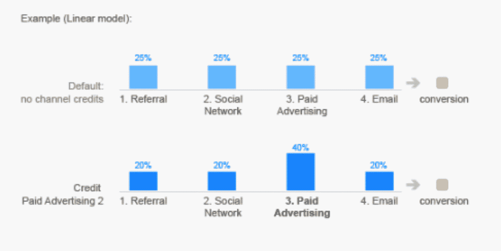

Attribution models in Google Analytics

只需在工具中选择一个归因模型，表格将显示每个渠道的转化数量(根据该模型)。

归因模型一点也不完美。尽管如此，它们可以让你更详细地了解你的访问者和用户是如何参与你的网站的。

## 谷歌分析常见问题

以下是关于谷歌分析的一些最常见问题的答案:

### 谷歌分析要花多少钱？

谷歌分析免费使用。然而，有一个名为 [Google Analytics 360](https://marketingplatform.google.com/about/analytics-360/) 的企业解决方案，它每年会花费你大约 15 万美元。别担心:标准版对大多数人来说绰绰有余。

### Google Analytics 认证多少钱？

谷歌分析个人资格(IQ)测试是对分析能力的一种衡量，并且是完全免费的。你可以在谷歌官方[分析智商支持页面](https://support.google.com/analytics/answer/3424287?hl=en)找到更多相关信息。

### 谷歌分析多久更新一次？

据谷歌称，谷歌分析的网站统计延迟是 24-48 小时。然而，谷歌并没有具体说明更新所有可能与你的账户相关的信息需要多长时间。

### 什么是谷歌分析财产跟踪 ID？

Google Analytics 中的属性 ID 是标识符，它与您的帐户相关联，Google Analytics 使用它来收集您的站点数据。你可以进入管理面板并选择“跟踪代码”来找到它:

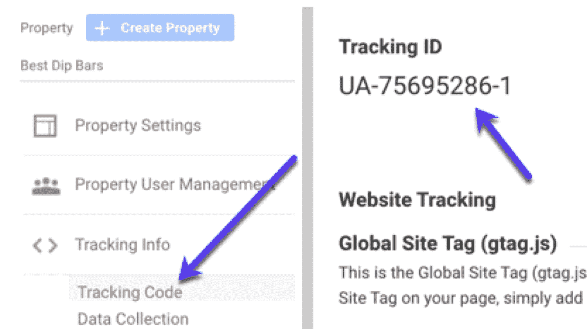

An example Google Analytics tracking ID

### 谷歌分析是如何工作的？

谷歌分析的工作原理是在你网站的页面上添加一些 JavaScript 代码。当一个访问者登陆你的网站时，这个 JavaScript 代码引用一个 JavaScript 文件，并被跟踪进行分析。

### 谷歌分析代码放在哪里？

简短的回答是:**在你想追踪的每一页上。**

不过，不要担心，您不需要手动将代码复制并粘贴到每个页面上。查看这篇关于如何将谷歌分析添加到 WordPress 网站的深度指南。

[Whether you're just getting started with Google Analytics or use it every day, you need to know about these underutilized features 📊Click to Tweet](https://twitter.com/intent/tweet?url=https%3A%2F%2Fkinsta.com%2Fblog%2Fhow-to-use-google-analytics%2F&via=kinsta&text=Whether+you%27re+just+getting+started+with+Google+Analytics+or+use+it+every+day%2C+you+need+to+know+about+these+underutilized+features+%F0%9F%93%8A&hashtags=analytics%2Cseo)

## 摘要

数据赋予你力量。如果你不在你的网站上追踪事情，你就被遗弃在野外，你所有的决定都将基于直觉。这并不总是最好的方法。

Google Analytics 是一个强大的工具，它可以让你获得大量可操作的数据，你可以用这些数据来发展你的网站。当与[其他分析](https://kinsta.com/help/mykinsta-analytics/)搭配时，它真的是增长的必备工具。

要了解谷歌最新版本的谷歌分析，请查看我们的 GA4 指南[。](https://kinsta.com/blog/what-is-ga4/)

* * *

让你所有的[应用程序](https://kinsta.com/application-hosting/)、[数据库](https://kinsta.com/database-hosting/)和 [WordPress 网站](https://kinsta.com/wordpress-hosting/)在线并在一个屋檐下。我们功能丰富的高性能云平台包括:

*   在 MyKinsta 仪表盘中轻松设置和管理
*   24/7 专家支持
*   最好的谷歌云平台硬件和网络，由 Kubernetes 提供最大的可扩展性
*   面向速度和安全性的企业级 Cloudflare 集成
*   全球受众覆盖全球多达 35 个数据中心和 275 多个 pop

在第一个月使用托管的[应用程序或托管](https://kinsta.com/application-hosting/)的[数据库，您可以享受 20 美元的优惠，亲自测试一下。探索我们的](https://kinsta.com/database-hosting/)[计划](https://kinsta.com/plans/)或[与销售人员交谈](https://kinsta.com/contact-us/)以找到最适合您的方式。