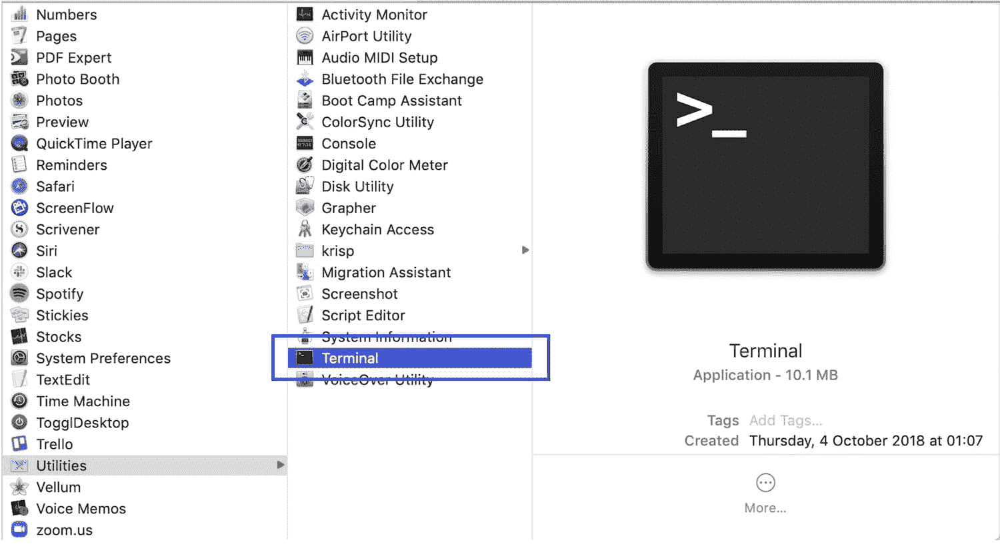
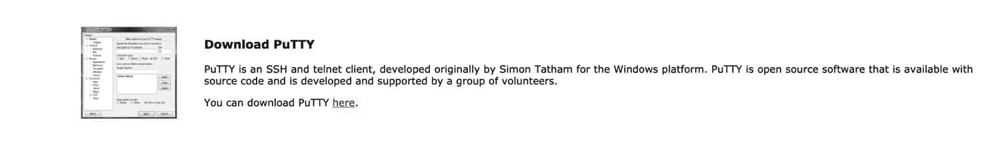
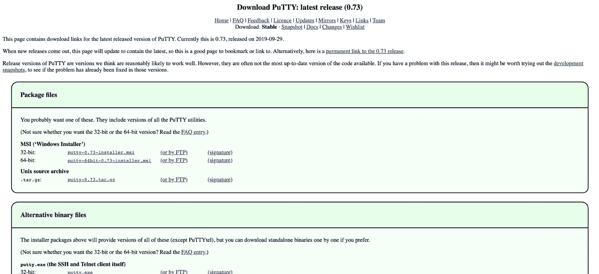
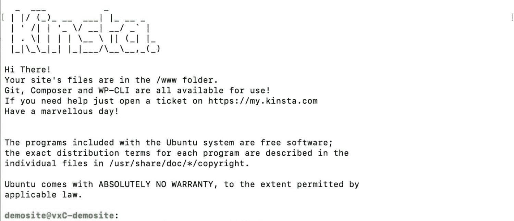
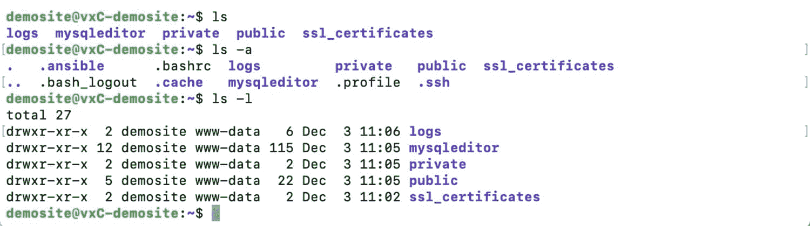
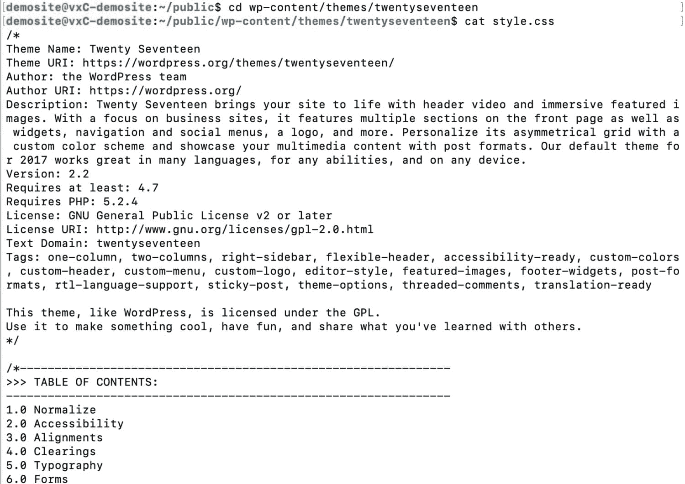
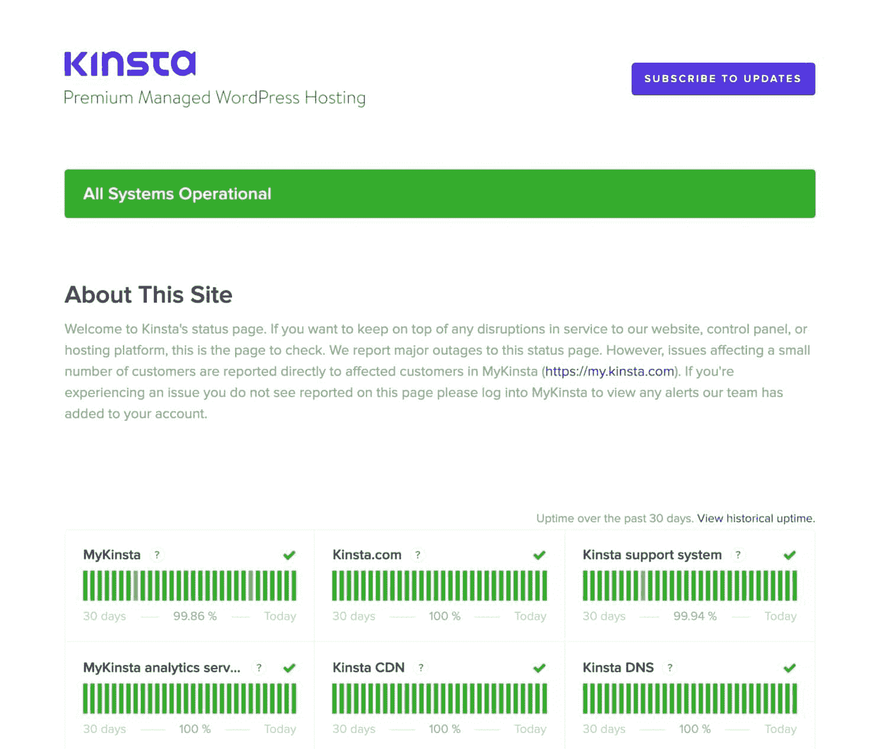
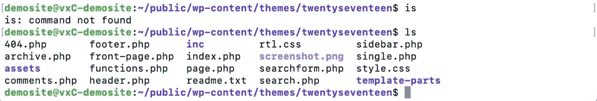
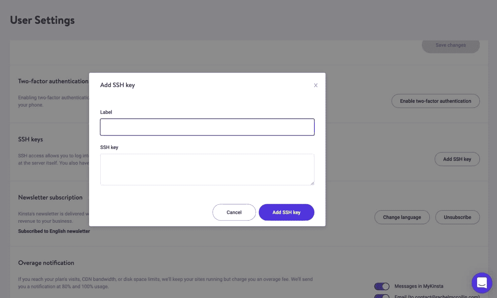

# 开始使用 SSH 的开发人员指南(安全地连接到您的服务器)

> 原文：<https://kinsta.com/blog/how-to-use-ssh/>

学习如何使用 SSH 来访问你的 WordPress 站点是你可能没有考虑过的事情。对于大多数 WordPress 用户来说，连接到你的网站最熟悉的方式是通过 [WordPress 仪表板和管理屏幕](https://kinsta.com/knowledgebase/wordpress-admin/)，结合 [SFTP](https://kinsta.com/knowledgebase/how-to-use-sftp/) 和 [phpMyAdmin](https://kinsta.com/help/wordpress-phpmyadmin/) 来访问数据库。

但是 SSH 可能证明是你的 WordPress 工具箱中最有价值的工具之一。

如果你想加快你的工作流程，你会发现学习如何使用 SSH 连接到你的 WordPress 站点会让你更有效率。

在这篇文章中，我们将告诉你如何去做。

## 什么是宋承宪？

首先，让我们从识别什么是 SSH 以及何时使用它开始。

SSH 的意思是“安全外壳”。SSH 规范将其定义为:

> "在不安全的网络上安全远程登录和其他安全网络服务的协议."

这意味着你可以用它远程访问你的 WordPress 站点，从任何电脑，不管你的站点在哪里，只要你有登录凭证。使用这种方法本质上是安全的。


> Kinsta 把我宠坏了，所以我现在要求每个供应商都提供这样的服务。我们还试图通过我们的 SaaS 工具支持达到这一水平。
> 
> <footer class="wp-block-kinsta-client-quote__footer">
> 
> 
> 
> <cite class="wp-block-kinsta-client-quote__cite">Suganthan Mohanadasan from @Suganthanmn</cite></footer>

[View plans](https://kinsta.com/plans/)

SSH 旨在提供安全登录，因此您可以确信在您使用连接时没有人能够访问您的连接。一旦你掌握了窍门，使用起来也很快很容易。如果你想和 [WordPress REST API](https://kinsta.com/blog/wordpress-rest-api/) 交互，这是发送命令的一种方式。

要通过 SSH 连接到您的服务器，您需要两样东西:

*   一个接口。
*   登录凭据。

如果您运行的是 Linux 或 macOS，那么您的操作系统中已经内置了一个接口，因此您不需要安装 SSH 客户端。但是如果你运行的是 Windows，你需要安装一个客户端。我将在这篇文章中告诉你如何做到这一点。


## 通过 SSH 连接到站点所需的工具

首先，您需要使用终端或 SSH 客户端。这些工作方式非常相似。

### 通过 macOS 或 Linux 上的终端连接

终端是 Linux 或 macOS 自带的应用程序，它允许你使用命令行向你的机器或远程服务器发送命令。

它不是一个图形界面，所以你不用鼠标。相反，你输入文本命令。对于第一次使用的用户来说，这可能有点令人不安，因为您可能习惯于看到命令的可视化表示。但是一旦你习惯了，你会发现它更快。

如果你在图形用户界面出现之前，使用微软的 MS-DOS 等系统与计算机打交道，你可能对这种界面很熟悉。好消息是终端给你的选择比 MS-DOS 多得多！

要在 Mac 上打开终端，打开 Spotlight，输入**终端**。你也可以通过**应用程序>实用程序**来访问它。



Finding Terminal on Mac


要在 Linux 上打开终端，请在**应用程序**菜单中找到它。如果不是很明显，在提示符下键入**终端**来找到它。

### 通过 Windows 上的 SSH 客户端连接

SSH 客户端是一个程序，如果你运行的是 Windows，你需要安装它，以便通过 SSH 连接。

最流行的 SSH 客户端是 [PuTTY](https://www.putty.org/) 。您需要下载并安装该软件，然后才能从 Windows 访问您的网站。



Download PuTTY


#### 在 Windows 上安装 Putty SSH 客户端

首先进入 [PuTTY 下载页面](https://www.chiark.greenend.org.uk/~sgtatham/putty/latest.html)。



The PuTTY download page


从这里，选择与您的 Windows 版本相对应的软件包。如果您不确定是下载 32 位还是 64 位版本，请查看 [FAQ 页面。如果有疑问，32 位版本是更安全的选择。](https://www.chiark.greenend.org.uk/~sgtatham/putty/faq.html#faq-32bit-64bit)

点击**MSI(‘Windows Installer’)**下的两个选项之一。该文件将下载到您的机器上并运行安装程序。

一旦安装了 PuTTY，打开它，然后您就可以使用它来连接到您的站点。


## 如何通过命令行连接到您的服务器

一旦您找到或安装了终端或 SSH 客户端，下一步就是连接到您的远程站点。

在终端或 SSH 客户机中，您使用**命令行**连接并发送命令到您的服务器。这是我从现在开始使用的术语，而不是指终端或 SSH 客户端。

为此，您需要四条信息:

*   服务器地址。
*   用户名。
*   密码。
*   港口。

服务器地址通常是您的域名或 IP 地址。如果你的网站由 Kinsta 托管，使用你的 IP 地址。

用户名和密码将是你的 FTP 用户名和密码，**而不是你的 WordPress admin** 的用户名和密码。

该端口将由您的主机提供商提供。在某些情况下，使用默认端口，但是为了在 Kinsta 获得额外的安全性，我们为不同的站点使用不同的端口。

在 [MyKinsta](https://kinsta.com/mykinsta/) 中，您可以通过选择您的站点并找到信息屏幕的 SFTP/SSH 部分来找到详细信息。


MyKinsta SSH


只需复制并粘贴到命令行中。

完成后，系统会提示您输入密码。从 MyKinsta 那里复制一份，你就可以访问你的服务器了。

您将看到一个类似如下的屏幕:



Kinsta SSH starting screen


如果你没有使用 Kinsta 主机，你的屏幕看起来会有一点不同，但仍然可以访问你的服务器。


## 如何使用 SSH 与您的站点进行交互

现在，您可以开始使用 SSH 与您的服务器和站点进行交互。除了由 [WordPress 命令行界面(WP-CLI)](https://kinsta.com/blog/wp-cli/) 提供的命令之外，还有[数量的 SSH 命令](https://kinsta.com/blog/ssh-commands/)可以使用。


### 重要的

SSH 是一个非常强大的工具，如果你不小心，你可能会破坏你的网站。它可以让你添加和删除文件，所以如果你输入了错误的命令，你可能会丢失内容或删除所有的图片。请小心使用它，并确保在使用它之前备份您的站点。


### 基本 SSH 命令

SSH 附带了一系列命令，您可以使用这些命令来连接服务器并与之交互。

一旦您通过命令行查看了您的服务器，您只需输入 SSH 命令，就像使用终端与您自己的电脑交互一样。

让我们来看看您可以开始使用的一些最有用的 SSH 命令。

*   [ls 命令](#ls)
*   [CD 命令](#cd)
*   [mkdir 命令](#mkdir)
*   [触摸命令](#touch)
*   [猫的命令](#cat)
*   [RM 命令](#rm)
*   [CP 命令](#cp)
*   [mv 命令](#mv)

#### ls 命令

使用`ls`命令获取当前位置的文件和目录列表。您可以在命令中添加更多内容以获取更多信息:

*   `ls -l`显示文件的详细信息，如大小、修改日期和时间、所有者和权限。
*   `ls -a`显示[隐藏的文件](https://kinsta.com/blog/show-hidden-files/)和目录。



The ls command


#### cd 命令

使用`cd`命令改变目录。您将被带到新目录，命令行将指示您的位置:

## 注册订阅时事通讯


### 想知道我们是怎么让流量增长超过 1000%的吗？

加入 20，000 多名获得我们每周时事通讯和内部消息的人的行列吧！

[Subscribe Now](#newsletter)


The cd command


然后，您可以再次使用`ls`来找出新目录中的内容。

您可以使用`cd`向下移动多个目录，或者向上或跨目录移动。要向上，在`cd`后输入两个点，如下所示:

```
cd ..
```

要转到特定目录，请键入完整的目录路径，例如:

```
cd public/wp-content/themes
```

#### mkdir 命令

使用`mkdir`命令创建一个新目录。因此，如果我在主题目录中，我可以为[创建一个新目录，一个新主题](https://kinsta.com/blog/how-to-install-a-wordpress-theme/):

```
mkdir mytheme
```

#### 触摸命令

创建新目录后，我可以使用 touch 命令向其中添加新文件:

```
touch style.css
```

#### 猫命令

要显示文件的内容，使用`cat`命令。



The cat command


#### rm 命令

使用`rm`命令删除文件或文件夹。小心使用，因为此操作无法撤销**:**

```
rm style.css
```

#### cp 命令

`cp`命令用于复制文件和文件夹。您需要提供文件或文件夹的名称以及要将其复制到的位置。

```
cp [options] [source] [destination]
```

您也可以在命令的开头添加选项，但不需要。因此，当你在 wp-content 目录中时，要将**footer.php**文件从一个主题复制到另一个主题，你可以使用这个:

需要一个超快的、安全的、开发者友好的主机？Kinsta 是为 WordPress 开发者设计的，通过一个强大的仪表板提供了大量的工具。[查看我们的计划](https://kinsta.com/plans/?in-article-cta)

```
cp /themes/theme1/footer.php /themes/theme2/
```

不要为目标文件添加名称。如果您这样做了，并且目标位置已经有一个同名的文件，那么该文件将被您正在复制的文件的内容覆盖。

如果您没有在爆炸中包含文件名，并且该文件已经存在，那么您将得到一个错误消息，并且复制不会发生。

我已经提到过，您可以在这个命令的开头添加一些可选元素。这些是:

*   `-f`:如果你没有目标文件的写权限，它将被删除，该命令将创建一个新文件。
*   `-u`:仅当源文件比目标文件新时复制源文件。
*   `-n`:不会覆盖现有文件。
*   `-a`:归档文件。
*   `-R`:仅对于文件夹，复制该文件夹中的所有文件和文件夹。

#### mv 命令

作为复制文件的替代方法，您可以使用`mv`命令移动它。为此，您只需提供源和目的地:没有选项。

```
mv /themes/theme1/footer.php /themes/theme2/
```

这将从主题 1 中移除**footer.php**文件，并将其移动到主题 2 中。如果您对一个文件夹执行此操作，它也将始终移动该目录中的文件和文件夹。

您可以在 [SSH 文档](https://www.ssh.com/ssh/command/)中找到更多关于 SSH 命令的信息。

### 使用 WP-CLI 与您的站点进行交互

除了标准的 [SSH 命令](https://kinsta.com/blog/ssh-commands/)，WordPress 还提供了 WP-CLI 界面，提供了更多的命令。这包括与文件和文件夹、管理选项以及[你的数据库](https://kinsta.com/knowledgebase/wordpress-database/)的交互。

有了 Kinsta，WP-CLI 将随您的主机一起提供，您可以立即开始使用它。如果你的主机提供商没有给你 WP-CLI，你可以按照 WP-CLI 指南中的步骤安装它。

## 测试 SSH 连接并排除故障

有时您可能会发现 SSH 并没有按照您想要的方式运行。要么是您无法连接，要么是您使用的命令没有按您预期的方式工作。

如果发生这种情况，请尝试以下故障排除技巧。

### 如果不能通过 SSH 连接

如果您无法连接到您的服务器，[查看命令行给您的任何错误消息或提示](https://kinsta.com/knowledgebase/wordpress-error-log/)。有时，您必须回答是/否的提示，或者修复命令中的拼写错误。

如果这不起作用，[检查您提供的登录凭证是否正确](https://kinsta.com/blog/error-establishing-a-database-connection/#1-check-your-database-login-credentials)。你可以从 MyKinsta 网站的**信息**页面获得这些信息。其他主机提供商可能会在 [cPanel](https://kinsta.com/knowledgebase/what-is-cpanel/) 或他们使用的任何仪表板中有 SSH 部分。

如果你再试了一次还是不行，试着重置你的 SSH 密码。检查你的网络连接是否正常，并且没有防火墙阻止你访问你的服务器。如果有疑问，请关闭终端或您的 SSH 客户端，然后再次打开它。

登录到您的托管帐户，并检查是否有任何服务器问题阻止您获得访问权限。如果你和 Kinsta 在一起，去我们的[系统状态页面](https://status.kinsta.com/)看看是否有任何东西不工作。



Kinsta system status screen


如果您在公共网络上，它可能不允许 SSH 访问您的端口。尝试用其他已知工作正常的端口进行测试。

如果所有这些都失败了，向你的主机提供商开一张支持票，他将能够访问日志并找出你为什么不能连接的原因。

### 如果您的 SSH 命令不能正常工作

另一个常见的问题是 SSH 命令不能按照您期望的方式工作。这通常是由于命令输入不正确。

这里有一个例子，我输入了`is`而不是`ls`:



Inputting a typo in Terminal


这里，我看到一个错误警告(`command not found`)，所以我用正确的命令再试一次。

有时，您可能正确地键入了命令，但却得到了错误的参数。如果是这种情况，检查 SSH 命令的 [SSH 文档](https://www.ssh.com/ssh/command/)和 WP-CLI 命令的 [WP-CLI 文档](https://wp-cli.org/)。

如果您的 SSH 命令因为连接不工作而不工作，您将看到一条错误消息告诉您这一点。命令行不断地向您提供正在发生的事情的信息，这是它的好处之一。事实上，它经常比图形界面给你更多更清晰的信息。

## 如何生成新的 SSH 密钥对以获得额外的安全性

与使用用户名和密码连接 SSH 相比，生成 SSH 密钥对增加了一层额外的安全保护。您可以在终端或 SSH 客户端中完成这项工作。以下是方法。

生成密钥对包括三个步骤:

1.  在终端或 SSH 客户端中生成密钥对。
2.  将密钥对添加到您的托管帐户中——在 MyKinsta 中，您可以通过**用户设置**屏幕来完成此操作。
3.  使用密钥对连接到终端中的服务器或 SSH 客户端。



Adding SSH key in MyKinsta


你可以在我们为 macOS、Linux 和 Windows 生成 SSH 密钥对的指南中找到完整的说明。

[Want to be a more efficient developer? Learn how to connect to your site using SSH! 🔛🔐Click to Tweet](https://twitter.com/intent/tweet?url=https%3A%2F%2Fkinsta.com%2Fblog%2Fhow-to-use-ssh%2F&via=kinsta&text=Want+to+be+a+more+efficient+developer%3F+Learn+how+to+connect+to+your+site+using+SSH%21+%F0%9F%94%9B%F0%9F%94%90&hashtags=webdev%2Cssh)

## 摘要

使用 SSH 连接到你的服务器和你的 WordPress 站点会比依赖 WordPress 管理界面，FTP，甚至 [phpMyAdmin](https://kinsta.com/help/wordpress-phpmyadmin/) 更有效率。

按照上面的步骤通过 SSH 连接到您的服务器，您会发现您可以在您的网站上做更多的事情，而不必在应用程序或浏览器窗口之间切换。

现在轮到您了:您日常使用的首选终端命令是什么？请在评论中告诉我们！

* * *

让你所有的[应用程序](https://kinsta.com/application-hosting/)、[数据库](https://kinsta.com/database-hosting/)和 [WordPress 网站](https://kinsta.com/wordpress-hosting/)在线并在一个屋檐下。我们功能丰富的高性能云平台包括:

*   在 MyKinsta 仪表盘中轻松设置和管理
*   24/7 专家支持
*   最好的谷歌云平台硬件和网络，由 Kubernetes 提供最大的可扩展性
*   面向速度和安全性的企业级 Cloudflare 集成
*   全球受众覆盖全球多达 35 个数据中心和 275 多个 pop

在第一个月使用托管的[应用程序或托管](https://kinsta.com/application-hosting/)的[数据库，您可以享受 20 美元的优惠，亲自测试一下。探索我们的](https://kinsta.com/database-hosting/)[计划](https://kinsta.com/plans/)或[与销售人员交谈](https://kinsta.com/contact-us/)以找到最适合您的方式。**