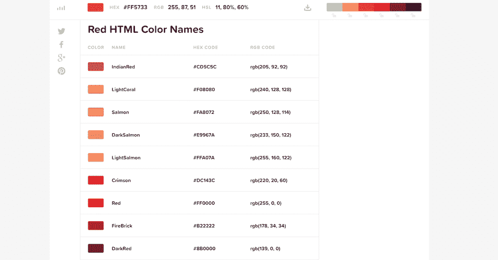
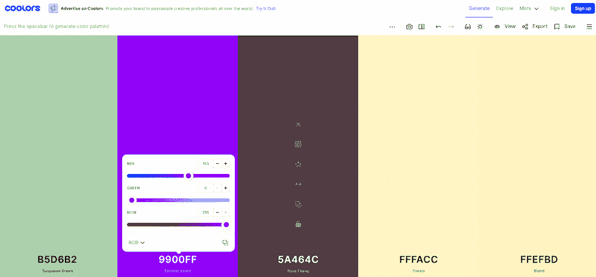
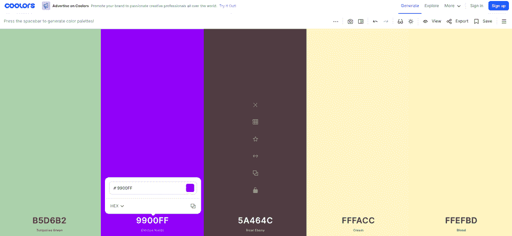
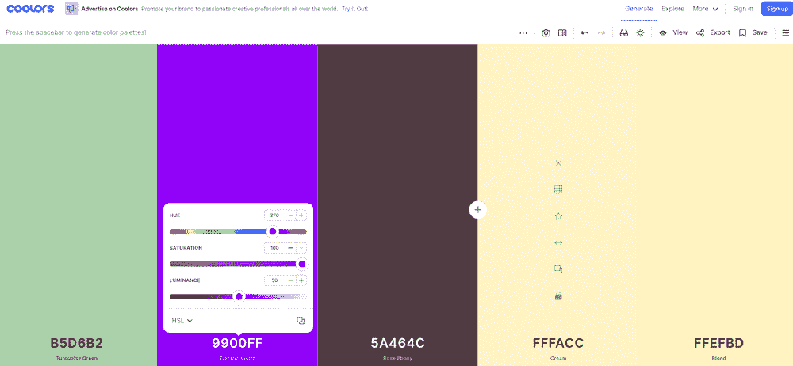
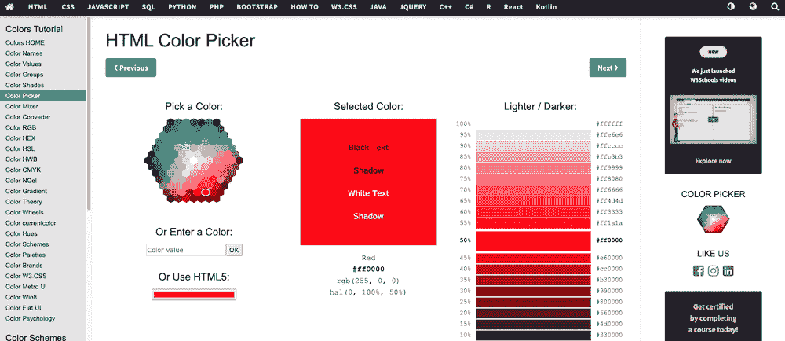
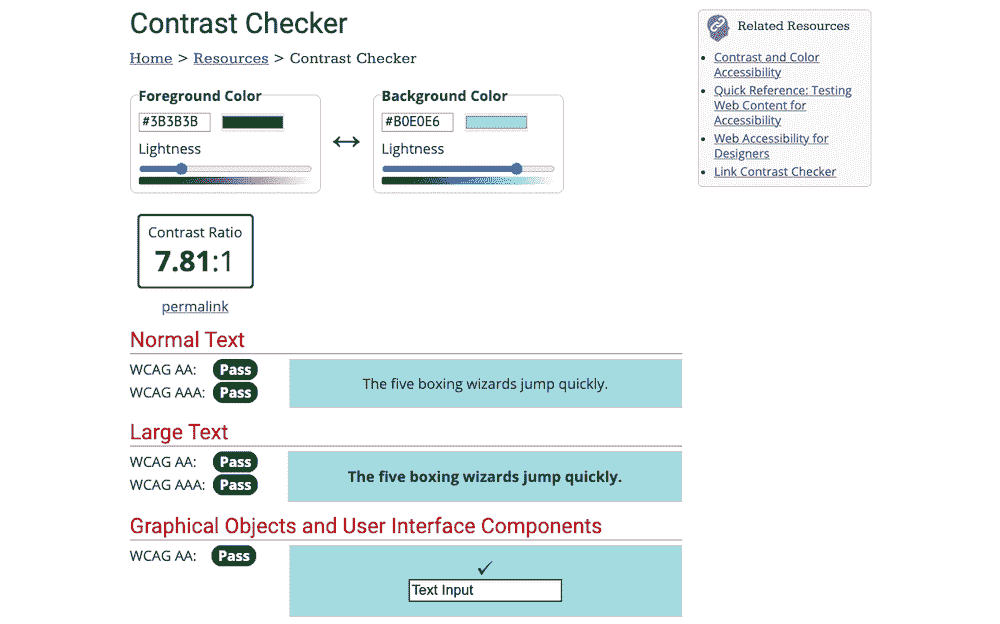

# 如何改变 HTML 字体颜色

> 原文：<https://kinsta.com/blog/html-font-color/>

当谈到定制你的网站时，字体颜色经常被忽视。在大多数情况下，网站所有者会保留默认的字体颜色，如黑色或他们的主题样式为正文和标题文本定义的任何颜色。

然而，出于几个原因，改变网站上的 HTML 字体颜色是个好主意。改变 HTML 字体颜色可能看起来令人生畏，但它非常简单。有几种方法可以改变你网站的字体颜色。

在这篇文章中，我们将向你展示改变网站字体颜色的不同方法，并讨论你为什么要这样做。

### 查看我们的[视频指南](https://kinsta.com/blog/html-font-color/)来改变 HTML 字体颜色

T3】

## 为什么要改变 HTML 字体颜色？

你可能想改变字体颜色，因为这样做有助于提高网站的可读性和可访问性。例如，如果您的网站使用较暗的配色方案，将字体颜色设为黑色会使您难以阅读网站上的文本。

你要考虑改变字体颜色的另一个原因是，如果你要使用你的品牌调色板中更深的颜色。这是强化你品牌的又一次机会。它建立了品牌一致性，并确保所有营销渠道的文本看起来都一样。

现在，让我们来看看如何定义和改变 HTML 字体颜色。


## 定义颜色的方法

在网页设计中有几种定义颜色的方法，包括名称、RGB 值、十六进制代码和 HSL 值。让我们来看看它们是如何工作的。

### 颜色名称

颜色名称是在你的 CSS 样式中定义颜色的最简单的方法。颜色名称是指 HTML 颜色的特定名称。目前，支持 140 种颜色名称，您可以在自己的样式中使用任何颜色。例如，您可以使用“蓝色”将单个元素的颜色设置为蓝色。



HTML color names.


然而，这种方法的缺点是不支持所有的颜色名称。换句话说，如果您使用的颜色不在支持的颜色列表中，您将无法通过其颜色名称在设计中使用它。

### RGB 和 RGBA 值

接下来，我们有了 [RGB 和 RGBA 值](https://www.w3schools.com/css/css3_colors.asp)。RGB 代表红色、绿色和蓝色。它通过混合红色、绿色和蓝色值来定义颜色，类似于在实际调色板上混合颜色的方式。



RGB values.


RGB 值看起来是这样的:RGB(153，0，255)。第一个数字指定红色输入，第二个数字指定绿色输入，第三个数字指定蓝色输入。

每个颜色输入的值可以在 0 到 255 之间，其中 0 表示颜色根本不存在，255 表示特定颜色处于最大强度。

RGBA 值为混合增加了一个值，这就是代表不透明度的 alpha 值。范围从 0(不透明)到 1(完全透明)。

### 十六进制值



HEX codes are another easy-to-use color selection option.


十六进制颜色代码的工作方式类似于 RGB 代码。它们由从 0 到 9 的数字和从 A 到 f 的字母组成，十六进制代码看起来像这样:#800080。前两个字母指定红色的强度，中间的两个数字指定绿色的强度，最后两个数字设置蓝色的强度。

### HSL 和 HSLA 价值观

在 HTML 中定义颜色的另一种方法是使用 HSL 值。HSL 代表色调、饱和度和亮度。



HSL color values.


色调使用从 0 到 360 的度数。在标准色轮上，红色在 0/360 左右，绿色在 120，蓝色在 240。

饱和度使用百分比来定义颜色的饱和度。0 代表黑白，100 代表全色。

最后，亮度使用类似于饱和度的百分比。在这种情况下，0%代表黑色，100%代表白色。

例如，我们在整篇文章中使用的紫色在 HSL: `hsl(276, 100%, 50%)`中应该是这样的。

HSL 和 RGB 一样，支持不透明。在这种情况下，您可以使用 HSLA 值，其中 A 代表 alpha，定义为从 0 到 1 的数字。如果我们想降低紫色示例的不透明度，我们可以使用代码:`hsl(276, 100%, 50%, .85)`。

现在你知道了如何定义颜色，让我们看看改变 HTML 字体颜色的不同方法。


## `<font>`旧标签

在 [HTML5](https://kinsta.com/blog/html-vs-html5/) 被引入并设定为编码标准之前，你可以使用字体标签来改变字体颜色。更具体地说，您可以使用带有 color 属性的 font 标记来设置文本颜色。用名称或十六进制代码指定了`color`。

下面是一个使用十六进制颜色代码的示例:

```
<font color="#800080">This text is purple.</font>
```

这就是如何使用颜色名称将文本颜色设置为紫色。

```
<font color="purple">This text is purple.</font> 
```

然而，`<font>`标签在 HTML5 中被弃用，不再使用。改变字体颜色是一个设计决策，设计不是 HTML 的主要目的。因此，HTML5 中不再支持`<font>`标签是有意义的。

那么如果不再支持<font>标签，如何改变 HTML 字体颜色呢？答案是级联样式表或 [CSS](https://kinsta.com/blog/wordpress-css/) 。</font>

## 新:CSS 样式

要用 CSS 改变 HTML 字体颜色，您将使用 CSS color 属性和适当的选择器。 [CSS](https://kinsta.com/knowledgebase/edit-wordpress-code/) 让你使用颜色名称、RGB、hex 和 HSL 值来指定颜色。使用 CSS 改变字体颜色有三种方法。

### 内嵌 CSS

内联 CSS 被直接添加到 HTML 文件中。您将使用 HTML 标记，如

，然后使用 CSS 颜色属性对其进行样式化，如下所示:

```
<p style="color: purple">This is a purple paragraph.</p>
```

如果您想使用十六进制值，您的代码将如下所示:

```
<p style="color:#800080">This is a purple paragraph.</p>
```

如果你要使用 RGB 值，你应该这样写:

```
<p style="color:RGB(153,0,255)">This is a purple paragraph.</p>
```

最后，使用 HSL 值，您可以使用以下代码:

```
<p style="color:hsl(276, 100%, 50%)">This is a purple paragraph.</p>
```

上面的例子向你展示了如何改变网站上一个段落的颜色。但是你不仅仅局限于段落。您可以更改标题和链接的字体颜色。

## 注册订阅时事通讯


### 想知道我们是怎么让流量增长超过 1000%的吗？

加入 20，000 多名获得我们每周时事通讯和内部消息的人的行列吧！

[Subscribe Now](#newsletter)

例如，用`<h2>`替换上面的`<p>`标签会改变标题文本的颜色，而用`<a>`标签替换会改变链接的颜色。你也可以使用 [< span >元素](https://www.w3schools.com/tags/tag_span.asp)给任意数量的文本上色。

如果你想改变整个段落或者一个标题的背景颜色，这和你改变字体颜色非常相似。您必须使用`background-color`属性，并使用颜色名称、十六进制、RGB 或 HSL 值来设置颜色。这里有一个例子:

```
<p style="background-color: purple">
```

### 嵌入式 CSS

嵌入的 CSS 在`<style>`标签中，并被放置在 HTML 文档的 head 标签之间。

如果您想使用颜色名称，代码将如下所示:

```
<!DOCTYPE html>
<html>
<head>
  <style>
    <p> {
        color: purple;
    }
</style>
</head>
```

上面的代码会将页面上每个段落的颜色改为紫色。与内联 CSS 方法类似，您可以使用不同的选择器来改变标题和链接的字体颜色。

如果您想使用十六进制代码，下面是代码的样子:

```
<!DOCTYPE html>
<html>
<head>
  <style>
    <p> {
        color: #800080;
    }
  </style>
</head>
```

以下示例使用 RBGA 值，因此您可以看到设置不透明度的示例:

```
<!DOCTYPE html>

<html>

<head>

<style>

<p> {

color: RGB(153,0,255,0.75),

}

</style>

</head>
```

HSL 代码应该是这样的:

```
<!DOCTYPE html>
<html>
<head>
  <style>
    <p> {
        color: hsl(276, 100%, 50%),
    }
  </style>
</head>
```

### 外部 CSS

最后，你可以使用[外部 CSS](https://kinsta.com/knowledgebase/combine-external-css/) 来改变你网站的字体颜色。外部 CSS 是放在单独的样式表文件中的 CSS，通常称为 style.css 或 stylesheet.css。

这个样式表负责站点上的所有样式，并指定字体颜色和字体大小、边距、填充、字体系列、背景颜色等等。简而言之，样式表决定了网站的视觉效果。

要用外部 CSS 改变字体颜色，你可以使用[选择器](https://www.w3schools.com/css/css_selectors.asp)来设置你想要的 HTML 部分的样式。例如，此代码将更改站点上的所有正文文本:

需要为你的 WordPress 站点提供超快的、可靠的、完全安全的托管服务吗？Kinsta 提供所有这些以及 WordPress 专家提供的 24/7 世界级支持。查看我们的计划。

```
body {color: purple;}
```

请记住，您可以使用 RGB、hex 和 HSL 值来更改字体颜色，而不仅仅是颜色名称。如果您想编辑样式表，建议在[代码编辑器](https://kinsta.com/blog/free-html-editor/)中进行。

### 内联、嵌入式还是外部？

现在你知道如何使用 CSS 来改变字体颜色了。但是应该用哪种方法呢？

如果您使用内联 CSS 代码，您将直接将其添加到您的 HTML 文件中。一般来说，这种方法适合快速修复。如果您想要更改单页上某个特定段落或标题的颜色，这种方法是最快也是最简单的方法。

但是，内联样式会使 HTML 文件变得更大。HTML 文件越大，网页加载的时间就越长。除此之外，内联 CSS 会使你的 HTML 变得混乱。因此，通常不鼓励使用 CSS 改变 HTML 字体颜色的内嵌方法。

嵌入的 CSS 放在标签之间和

内嵌样式和嵌入样式的一个显著区别是，它们适用于加载了 head 标签的任何页面，而内嵌样式只适用于它们所在的特定页面，通常是它们在该页面上的目标元素。

最后一种方法，外部 CSS，使用一个专用的样式表来定义你的视觉样式。一般来说，最好使用外部样式表将所有样式保存在一个地方，以便于编辑。这也将表示和设计分开，因此代码易于管理和维护。

请记住，内嵌和嵌入样式可以覆盖外部样式表中设置的样式。


## 字体标签或 CSS 样式:利弊

改变 HTML 字体颜色的两种主要方法是使用字体标签或 CSS 样式。这两种方法各有利弊。

### HTML 字体标签的利弊

HTML 字体标签很容易使用，所以这是它的优势。通常来说，CSS 比打字更复杂，学习时间也更长。如果你有一个不使用 HTML5 的旧网站，那么字体标签是一个改变字体颜色的可行方法。

即使字体标签很容易使用，如果你的网站使用 HTML，你也不应该使用它。如前所述，HTML5 中不赞成使用 font 标签。应该避免使用不推荐使用的代码，因为浏览器可能会随时停止支持它。这可能会导致你的网站崩溃，无法正常运行，或者更糟的是，根本无法向你的访问者显示。

### CSS 的利与弊

CSS 就像字体标签一样，有它的优点和缺点。使用 CSS 的最大好处是它是改变字体颜色和为你的网站指定所有其他样式的合适方式。

如前所述，它将表示从设计中分离出来，使代码更容易管理和维护。

不利的一面是，与旧的代码编写方式相比，CSS 和 HTML5 需要花时间来学习和正确编写。

请记住，使用 CSS，您有不同的方法来改变字体颜色，每种方法都有自己的优点和缺点，如前所述。

## 更改 HTML 字体颜色的提示

既然你已经知道了如何改变 HTML 字体颜色，这里有一些提示可以帮助你。

### 使用颜色选择器



Color pickers streamline the color selection process.


使用[颜色选择器](https://www.w3schools.com/colors/colors_picker.asp)选择正确的颜色，而不是随机选择颜色。颜色选择器的好处是，它将为您提供颜色名称以及您需要在代码中使用的正确的十六进制、RGB 和 HSL 值。

### 检查对比度



Use a contrast checker to test various text-to-background color contrast ratios.


深色背景的深色文本和浅色背景的浅色文本不能很好地搭配。它们会让你网站上的文字难以阅读。然而，你可以使用一个[对比度检查器](https://webaim.org/resources/contrastchecker/)来确保你的网站的颜色是可访问的，文本是易于阅读的。

### 使用 Inspect 方法查找颜色


Using Inspect to find color codes.


如果你在网站上看到你喜欢的颜色，你可以[检查代码](https://kinsta.com/blog/inspect-element/)来获得颜色的十六进制、RGB 或 HSL 值。在 Chrome 中，你所要做的就是将光标指向你想要检查的网页部分，点击右键，选择**检查**。这将打开代码检查面板，您可以在其中看到网站的 HTML 代码和相应的样式。

[想改变你网站上的字体颜色？🎨很简单！本指南将帮助你入门⬇️ 点击推文](https://twitter.com/intent/tweet?url=https%3A%2F%2Fkinsta.com%2Fblog%2Fhtml-font-color%2F&via=kinsta&text=Want+to+change+the+font+color+on+your+site%3F+%F0%9F%8E%A8+It%27s+simple%21+This+guide+will+help+you+get+started+%E2%AC%87%EF%B8%8F&hashtags=HTML%2CFonts)

## 摘要

更改 HTML 字体颜色有助于提高网站的可读性和可访问性。它还可以帮助你在网站风格上建立品牌一致性。

在本指南中，你已经学习了四种不同的改变 HTML 字体颜色的方法:颜色名称，十六进制代码，RGB 和 HSL 值。

我们还介绍了如何使用内嵌、嵌入和外部 CSS 改变字体颜色，以及如何使用字体标签和每种方法的优缺点。到目前为止，您应该已经很好地理解了应该使用哪种方法来更改 HTML 字体颜色，所以现在唯一要做的就是在您的站点上实现这些提示。

*你对用 CSS 和 font 标签改变字体颜色有什么想法？请在评论区告诉我们！*

* * *

让你所有的[应用程序](https://kinsta.com/application-hosting/)、[数据库](https://kinsta.com/database-hosting/)和 [WordPress 网站](https://kinsta.com/wordpress-hosting/)在线并在一个屋檐下。我们功能丰富的高性能云平台包括:

*   在 MyKinsta 仪表盘中轻松设置和管理
*   24/7 专家支持
*   最好的谷歌云平台硬件和网络，由 Kubernetes 提供最大的可扩展性
*   面向速度和安全性的企业级 Cloudflare 集成
*   全球受众覆盖全球多达 35 个数据中心和 275 多个 pop

在第一个月使用托管的[应用程序或托管](https://kinsta.com/application-hosting/)的[数据库，您可以享受 20 美元的优惠，亲自测试一下。探索我们的](https://kinsta.com/database-hosting/)[计划](https://kinsta.com/plans/)或[与销售人员交谈](https://kinsta.com/contact-us/)以找到最适合您的方式。